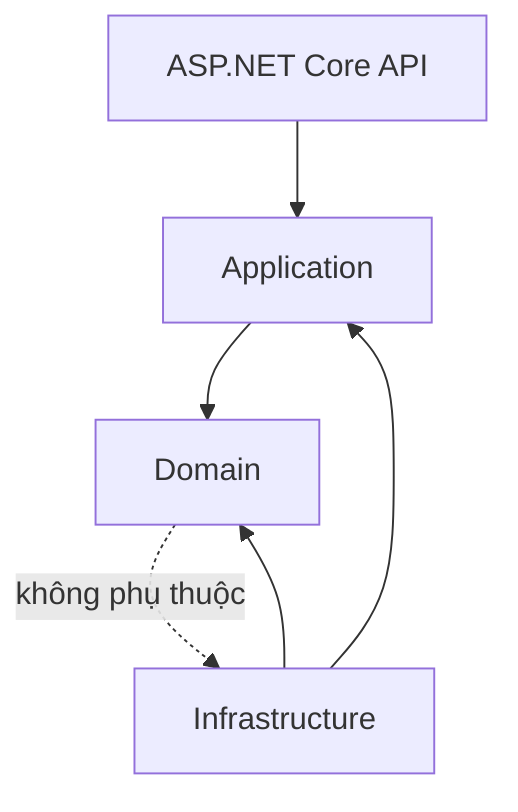
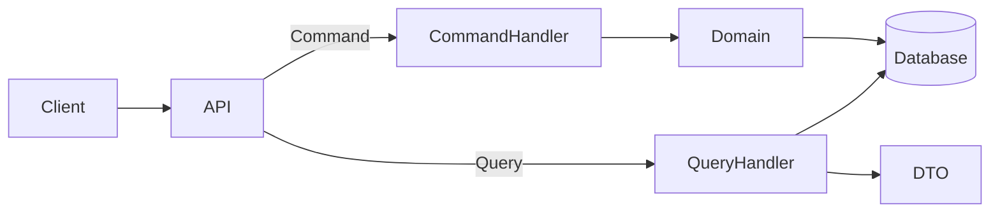
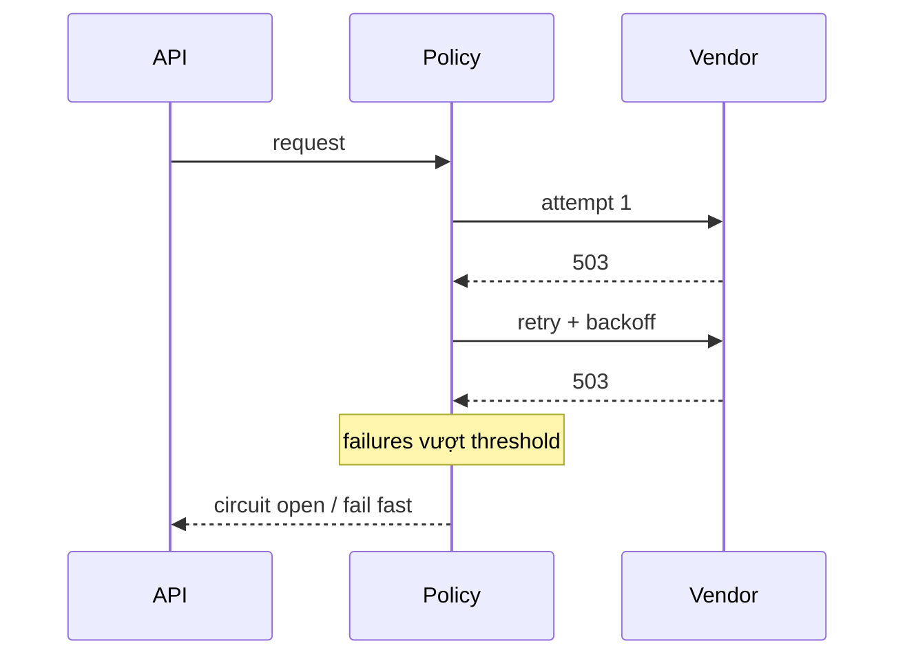
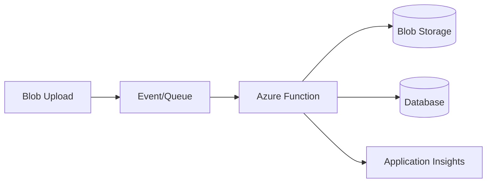
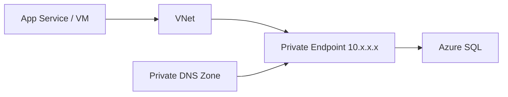
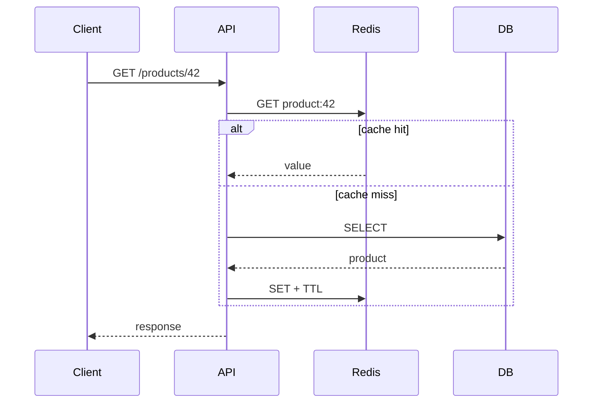
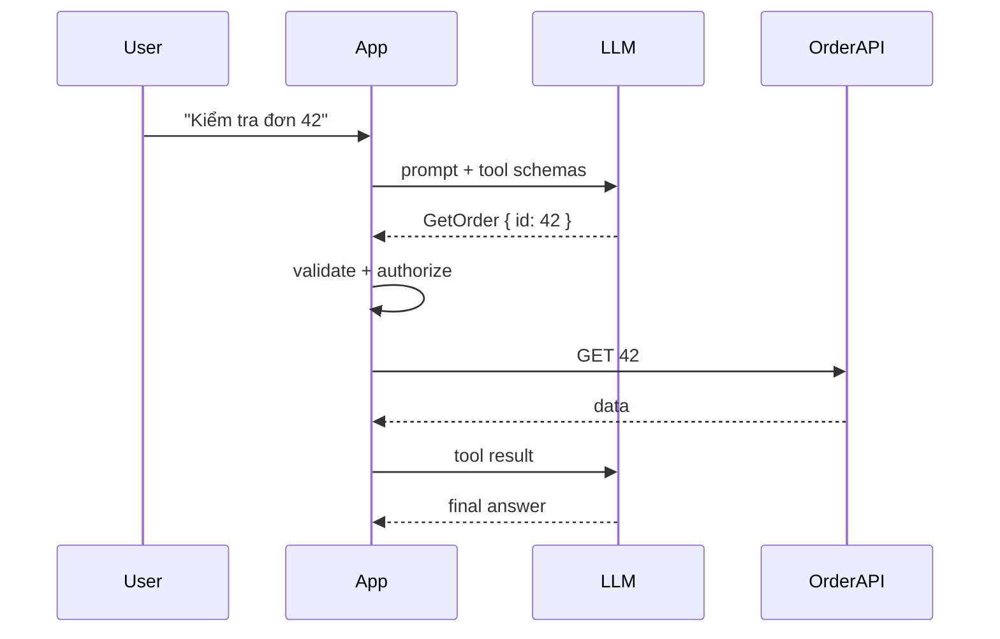

# Daily Knowledge Sharing — 2026-08-19

## Today’s Topics

1. Clean Architecture: dependency direction và boundary thực tế
2. CQRS: tách read/write mà không biến hệ thống thành distributed system quá sớm
3. Retry, Timeout và Circuit Breaker cho third-party integration
4. SQL Indexing: composite index, covering index và SARGability
5. Azure Functions: event-driven workload và lựa chọn hosting phù hợp
6. Azure Private Endpoint: đưa PaaS vào private network boundary
7. Redis Distributed Cache: invalidation, TTL và failure strategy
8. SLI, SLO và Alerting: đo reliability theo trải nghiệm người dùng
9. LLM Tool Calling: AI quyết định ý định, code kiểm soát hành động
10. Testing Strategy: test pyramid, integration test và contract boundary

---

# 1. Clean Architecture: dependency direction và boundary thực tế

### 1. What is it?

Clean Architecture tổ chức hệ thống để business rules không phụ thuộc trực tiếp vào framework, database, HTTP hay vendor. Ý chính là **dependency direction**, không phải số project hay tên folder.

Domain chứa quy tắc nghiệp vụ; Application điều phối use case; Infrastructure triển khai database/external service; API là delivery mechanism. Code phía ngoài có thể phụ thuộc vào abstraction phía trong, nhưng core business không biết EF Core, Azure hay ASP.NET Core tồn tại.

### 2. Why does it exist?

Nếu controller vừa validate nghiệp vụ, query EF Core, gọi Microsoft Graph và gửi email, một thay đổi nhỏ sẽ kéo theo nhiều dependency. Unit test khó, business rule bị khóa vào framework và việc thay infrastructure trở nên đắt đỏ.

Clean Architecture tạo boundary để thay đổi kỹ thuật không lan vào business logic.

### 3. How does it work?



Application định nghĩa port như `IEmployeeRepository`; Infrastructure implement bằng EF Core. Use case chỉ gọi interface.

### 4. Practical example

```csharp
public interface IEmployeeRepository
{
    Task<Employee?> GetAsync(Guid id, CancellationToken ct);
}

public sealed class DeactivateEmployeeHandler(IEmployeeRepository repository)
{
    public async Task Handle(Guid id, CancellationToken ct)
    {
        var employee = await repository.GetAsync(id, ct)
            ?? throw new KeyNotFoundException();
        employee.Deactivate(); // business rule nằm trong domain
        await repository.SaveChangesAsync(ct);
    }
}
```

EF Core implementation nằm ở Infrastructure, không nằm trong domain entity.

### 5. Real production scenario

Trong hệ thống employee offboarding, API nhận request → Application load employee → Domain kiểm tra trạng thái hợp lệ → Application yêu cầu repository persist → Infrastructure gọi SQL/Graph. Nếu Graph đổi SDK, phần domain không đổi.

### 6. Common mistakes

- Biến Clean Architecture thành hàng chục project dù hệ thống nhỏ.
- Domain entity chỉ là DTO, toàn bộ rule vẫn nằm trong service.
- Application reference Infrastructure vì “tiện”.
- Tạo repository abstraction chỉ để bọc nguyên xi mọi method của `DbSet`.
- Ép mọi CRUD đơn giản qua quá nhiều handler/mapping layer.

### 7. Trade-offs

**Advantages:** testability tốt, dependency rõ, business rule bền hơn trước thay đổi kỹ thuật.

**Costs / Risks:** thêm abstraction, mapping và cognitive overhead. Với CRUD nhỏ, kiến trúc quá nhiều layer có thể làm tốc độ phát triển giảm mà không tạo giá trị.

### 8. Junior → Middle → Senior understanding

**Junior:** hiểu responsibility từng layer và dependency phải hướng vào core.

**Middle:** biết đặt validation, transaction, repository và external integration đúng boundary; viết test cho use case.

**Senior / Technical Lead:** quyết định boundary nào đáng tồn tại, nơi nào abstraction là dư thừa, và giữ architecture phục vụ changeability thay vì purity.

### 9. Key takeaway

- Clean Architecture là dependency rule, không phải template folder.
- Business rules phải sống lâu hơn framework.
- Chỉ tạo abstraction khi nó bảo vệ một boundary có ý nghĩa.

---

# 2. CQRS: tách read/write mà không overengineering

### 1. What is it?

CQRS tách model xử lý **Command** (thay đổi state) khỏi **Query** (đọc state). CQRS không đồng nghĩa với microservices, event sourcing hay hai database.

Một ứng dụng có thể dùng cùng SQL database nhưng command đi qua domain logic, trong khi query đọc projection/DTO tối ưu trực tiếp.

### 2. Why does it exist?

Read và write có nhu cầu khác nhau. Write cần invariant, transaction và consistency; read thường cần join, filter, pagination và response shape tối ưu UI. Ép cả hai qua một domain model thường tạo entity phình to và query kém hiệu quả.

### 3. How does it work?



CQRS đơn giản có thể hoàn toàn synchronous. Chỉ khi scale/consistency requirement đòi hỏi mới tách read store và dùng event replication.

### 4. Practical example

```csharp
public sealed record ApproveTimesheet(Guid Id);
public sealed record GetTimesheet(Guid Id);

public async Task<TimesheetDto?> Handle(GetTimesheet q, CancellationToken ct) =>
    await db.Timesheets.AsNoTracking()
        .Where(x => x.Id == q.Id)
        .Select(x => new TimesheetDto(x.Id, x.Status, x.TotalHours))
        .SingleOrDefaultAsync(ct);
```

Query không cần load aggregate nếu chỉ cần DTO.

### 5. Real production scenario

Timesheet approval cần rule “chỉ Submitted mới được Approve”, audit và transaction. Dashboard lại cần tổng hợp hàng nghìn timesheet theo tháng. Command dùng aggregate; dashboard query dùng projection/index riêng.

### 6. Common mistakes

- Tách hai database ngay ngày đầu.
- Dùng MediatR rồi gọi mọi thứ là CQRS.
- Command trả về object graph lớn như query.
- Không kiểm soát eventual consistency khi read store riêng.
- Tạo một handler cho từng thao tác CRUD nhưng không có lợi ích kiến trúc.

### 7. Trade-offs

**Advantages:** model rõ theo intent, query tối ưu độc lập, write bảo vệ invariant tốt.

**Costs / Risks:** nhiều type/handler hơn; nếu tách store sẽ có replication, lag, retry và reconciliation.

### 8. Junior → Middle → Senior understanding

**Junior:** phân biệt command thay đổi state và query chỉ đọc.

**Middle:** implement handler, transaction và projection hiệu quả.

**Senior / Technical Lead:** biết CQRS mức nào là đủ; đánh giá khi nào read replica/eventual consistency thực sự đáng chi phí.

### 9. Key takeaway

- CQRS trước hết là separation of responsibility.
- Không cần distributed architecture để có CQRS.
- Chỉ tách read store khi có lý do đo được.

---

# 3. Retry, Timeout và Circuit Breaker cho third-party integration

### 1. What is it?

Đây là ba resilience policy giải ba vấn đề khác nhau: **Timeout** giới hạn thời gian chờ; **Retry** thử lại transient failure; **Circuit Breaker** tạm ngừng gọi dependency đang hỏng để tránh làm hệ thống kiệt tài nguyên.

### 2. Why does it exist?

Network không đáng tin tuyệt đối. API bên ngoài có thể 429, 503, timeout hoặc connection reset. Nếu chờ vô hạn, thread/request bị giữ. Nếu retry vô hạn, ta tạo retry storm. Nếu cứ gọi dependency đang chết, failure lan sang hệ thống mình.

### 3. How does it work?



Timeout phải có deadline; retry dùng exponential backoff + jitter; circuit breaker dựa trên failure rate/window phù hợp.

### 4. Practical example

```csharp
builder.Services.AddHttpClient<GraphGateway>(client =>
{
    client.Timeout = TimeSpan.FromSeconds(10);
});
```

Với resilience pipeline của .NET, chỉ retry status/transient exception đã xác định và truyền `CancellationToken`. Không retry POST không idempotent nếu chưa có idempotency mechanism.

### 5. Real production scenario

Ứng dụng gọi Microsoft Graph để cập nhật calendar. Graph trả 429 kèm `Retry-After`. Worker phải tôn trọng delay, retry có giới hạn và đưa item sang retry queue/dead-letter nếu vượt budget thay vì block request người dùng.

### 6. Common mistakes

- Retry mọi exception, kể cả 400/401.
- Retry đồng loạt không jitter.
- Timeout ở HttpClient dài hơn toàn bộ request budget.
- Retry POST tạo duplicate side effect.
- Circuit breaker threshold quá nhạy khiến dependency khỏe cũng bị ngắt.

### 7. Trade-offs

**Advantages:** tăng reliability trước transient fault, tránh resource exhaustion.

**Costs / Risks:** retry tăng latency/load; breaker làm fail-fast có chủ đích; policy sai có thể khuếch đại outage.

### 8. Junior → Middle → Senior understanding

**Junior:** hiểu transient vs permanent failure.

**Middle:** cấu hình timeout/retry, cancellation, idempotency và telemetry.

**Senior / Technical Lead:** thiết kế retry budget xuyên nhiều service, tránh retry amplification và xác định degradation strategy.

### 9. Key takeaway

- Timeout trước, retry có chọn lọc, breaker để chặn cascading failure.
- Retry phải có backoff + jitter + giới hạn.
- Side effect phải idempotent trước khi retry an toàn.

---

# 4. SQL Indexing: composite index, covering index và SARGability

### 1. What is it?

Index là cấu trúc giúp database tìm row mà không scan toàn bộ table. Composite index chứa nhiều cột; covering index chứa đủ dữ liệu để query không cần lookup thêm vào base table. SARGable query cho phép optimizer sử dụng index seek hiệu quả.

### 2. Why does it exist?

Table vài triệu row mà filter thường xuyên bằng `TenantId`, `Status`, `CreatedAt` sẽ rất chậm nếu scan. Nhưng “thêm index” không phải miễn phí: mỗi INSERT/UPDATE phải duy trì index và index chiếm storage/memory.

### 3. How does it work?

Với index `(TenantId, Status, CreatedAt)`, query filter từ left-most columns thường tận dụng index tốt. Query chỉ filter `CreatedAt` có thể không dùng index này hiệu quả.

```sql
CREATE INDEX IX_Orders_Tenant_Status_CreatedAt
ON Orders(TenantId, Status, CreatedAt DESC)
INCLUDE (TotalAmount, CustomerId);
```

### 4. Practical example

Không tốt:

```sql
WHERE CAST(CreatedAt AS date) = '2026-08-19'
```

Tốt hơn:

```sql
WHERE CreatedAt >= '2026-08-19T00:00:00'
  AND CreatedAt <  '2026-08-20T00:00:00'
```

Cách thứ hai giữ predicate SARGable và dễ dùng range seek.

### 5. Real production scenario

Dashboard SaaS lấy 50 orders gần nhất của một tenant theo status. Composite index đúng thứ tự giúp query từ vài trăm ms xuống vài ms; covering columns tránh hàng chục key lookup.

### 6. Common mistakes

- Index từng column riêng nhưng query luôn filter kết hợp.
- Dùng function trên indexed column trong predicate.
- `SELECT *` khiến covering index gần như vô nghĩa.
- Tạo quá nhiều index, làm write chậm.
- Không đọc actual execution plan và statistics.

### 7. Trade-offs

**Advantages:** giảm IO, latency và CPU cho read.

**Costs / Risks:** tăng storage, write amplification và maintenance; index sai có thể không được optimizer chọn.

### 8. Junior → Middle → Senior understanding

**Junior:** biết index giúp lookup nhanh và không phải query nào cũng dùng index.

**Middle:** đọc execution plan, thiết kế composite/index include và viết predicate SARGable.

**Senior / Technical Lead:** cân bằng workload read/write, cardinality, index budget và đo production workload trước khi tối ưu.

### 9. Key takeaway

- Index phải thiết kế theo query pattern.
- Column order trong composite index rất quan trọng.
- Tối ưu bằng execution plan và measurements, không bằng cảm giác.

---

# 5. Azure Functions: event-driven workload và hosting decision

### 1. What is it?

Azure Functions là compute platform phù hợp với event-driven/serverless workload: HTTP trigger, timer, queue, Service Bus, blob event... Bạn deploy function code; platform quản lý phần lớn hosting và scale.

### 2. Why does it exist?

Nhiều workload chỉ chạy khi có event. Giữ một VM/app server chạy 24/7 cho vài nghìn job ngắn mỗi ngày gây operational overhead và lãng phí compute.

### 3. How does it work?



Scale phụ thuộc hosting plan và trigger. Queue-based workload cần thiết kế idempotency vì message có thể được xử lý hơn một lần.

### 4. Practical example

```csharp
[Function("ProcessInvoice")]
public async Task Run(
    [ServiceBusTrigger("invoices", Connection = "ServiceBus")]
    string payload,
    CancellationToken ct)
{
    await processor.ProcessAsync(payload, ct);
}
```

Secret nên lấy qua Managed Identity/Key Vault thay vì hard-code connection string khi service hỗ trợ identity-based access.

### 5. Real production scenario

Người dùng upload Excel. API chỉ lưu file và enqueue message; Function parse file, validate từng row, lưu kết quả và phát notification. HTTP request không phải chờ vài phút.

### 6. Common mistakes

- Dùng Function cho process stateful chạy rất lâu mà không đánh giá plan/orchestration.
- Giả định trigger exactly-once.
- Không giới hạn concurrency làm database quá tải.
- Không có dead-letter/reprocessing strategy.
- Đưa secret vào app settings mà không quản lý rotation.

### 7. Trade-offs

**Advantages:** event integration tốt, scale thuận tiện, ít quản lý server.

**Costs / Risks:** cold start/plan behavior, debugging distributed workload khó hơn, cost có thể tăng với workload liên tục. App Service/Container Apps/Worker Service đôi khi đơn giản hơn.

### 8. Junior → Middle → Senior understanding

**Junior:** hiểu trigger → function → output.

**Middle:** xử lý retries, poison message, concurrency, DI và telemetry.

**Senior / Technical Lead:** chọn hosting model dựa trên latency, throughput, networking, cost và operational ownership.

### 9. Key takeaway

- Function phù hợp event-driven workload, không phải mặc định cho mọi backend.
- Thiết kế at-least-once/idempotency ngay từ đầu.
- Scale consumer phải xét sức chịu tải của downstream.

---

# 6. Azure Private Endpoint: private network boundary cho PaaS

### 1. What is it?

Private Endpoint cấp một private IP trong VNet cho Azure PaaS resource như Storage, Key Vault hoặc Azure SQL thông qua Azure Private Link. Client trong network được phép có thể truy cập service mà traffic không cần đi qua public endpoint.

### 2. Why does it exist?

Firewall public IP allowlist hữu ích nhưng vẫn để service có public network surface. Với dữ liệu nhạy cảm, doanh nghiệp thường muốn traffic từ application đến database/storage chỉ đi trong private connectivity boundary.

### 3. How does it work?



DNS là phần cực kỳ quan trọng: hostname chuẩn của service phải resolve về private IP từ network phù hợp.

### 4. Practical example

Một App Service có VNet Integration gọi `mydb.database.windows.net`. Private DNS zone ánh xạ hostname sang private endpoint IP; Azure SQL tắt public network access.

Kiểm tra từ runtime:

```bash
nslookup mydb.database.windows.net
```

Nếu resolve public IP, network path chưa đúng như thiết kế.

### 5. Real production scenario

Payroll API chạy App Service, dữ liệu ở Azure SQL và secrets ở Key Vault. App Service VNet Integration → Private Endpoint SQL/Key Vault → public access disabled. Managed Identity xử lý authentication; Private Endpoint xử lý network reachability. Hai cơ chế giải hai vấn đề khác nhau.

### 6. Common mistakes

- Tạo Private Endpoint nhưng quên Private DNS.
- Nghĩ Private Endpoint tự cấp authorization.
- Tắt public access trước khi xác minh route/DNS, gây outage.
- Không tính connectivity từ on-prem/VPN/CI runner.

### 7. Trade-offs

**Advantages:** giảm public exposure, network segmentation tốt hơn.

**Costs / Risks:** DNS/network complexity, thêm cost, troubleshooting khó hơn; không phải mọi hệ thống đều cần mức isolation này.

### 8. Junior → Middle → Senior understanding

**Junior:** phân biệt private connectivity và authentication.

**Middle:** hiểu VNet integration, DNS resolution và cách debug connection.

**Senior / Technical Lead:** thiết kế network boundary end-to-end, rollout không downtime, access từ CI/on-prem và đánh giá cost/security requirement.

### 9. Key takeaway

- Private Endpoint đưa đường truy cập PaaS vào private IP boundary.
- DNS thường là nguyên nhân lỗi lớn nhất.
- Network isolation không thay thế identity/authorization.

---

# 7. Redis Distributed Cache: invalidation, TTL và failure strategy

### 1. What is it?

Redis thường được dùng làm distributed cache để nhiều application instance chia sẻ dữ liệu cache. Cache giảm latency và tải database, nhưng tạo thêm một bản sao dữ liệu có thể stale.

### 2. Why does it exist?

Nếu endpoint đọc cùng product/configuration hàng nghìn lần mỗi phút, query DB lặp lại lãng phí IO/CPU. In-memory cache trên từng instance lại không đồng nhất khi scale-out.

### 3. How does it work?



Cache-aside yêu cầu application chịu trách nhiệm populate và invalidate cache.

### 4. Practical example

```csharp
var key = $"product:{id}";
var json = await cache.GetStringAsync(key, ct);
if (json is not null)
    return JsonSerializer.Deserialize<ProductDto>(json)!;

var dto = await db.Products.AsNoTracking()
    .Where(x => x.Id == id)
    .Select(x => new ProductDto(x.Id, x.Name, x.Price))
    .SingleAsync(ct);

await cache.SetStringAsync(key, JsonSerializer.Serialize(dto),
    new DistributedCacheEntryOptions
    {
        AbsoluteExpirationRelativeToNow = TimeSpan.FromMinutes(5)
    }, ct);
return dto;
```

### 5. Real production scenario

Catalog API có 20 instances. Product detail được cache 5 phút. Khi admin update giá, transaction DB commit xong mới invalidate `product:{id}`. Nếu Redis down, API fallback DB nhưng rate/concurrency phải được bảo vệ để tránh DB overload.

### 6. Common mistakes

- Cache không TTL.
- Invalidate trước DB commit.
- Cache dữ liệu authorization nhạy cảm với key thiếu user/tenant dimension.
- Mọi request miss cùng lúc gây cache stampede.
- Redis outage biến thành application outage dù DB vẫn khỏe.

### 7. Trade-offs

**Advantages:** latency thấp, giảm DB load, scale read tốt.

**Costs / Risks:** stale data, invalidation complexity, memory cost và thêm dependency.

### 8. Junior → Middle → Senior understanding

**Junior:** hiểu hit/miss/TTL.

**Middle:** implement cache-aside, key strategy, invalidation và serialization.

**Senior / Technical Lead:** thiết kế consistency expectation, stampede protection, degradation khi Redis down và capacity/eviction policy.

### 9. Key takeaway

- Cache là optimization, không nên vô tình trở thành source of truth.
- Invalidation là phần khó nhất.
- Luôn thiết kế behavior khi Redis unavailable.

---

# 8. SLI, SLO và Alerting: đo reliability theo trải nghiệm người dùng

### 1. What is it?

**SLI** là chỉ số đo reliability thực tế, ví dụ tỷ lệ request thành công hoặc p95 latency. **SLO** là mục tiêu cho SLI, ví dụ 99.9% request thành công trong 30 ngày. **SLA** thường là cam kết kinh doanh có hậu quả nếu vi phạm.

### 2. Why does it exist?

“CPU dưới 70%” không nói người dùng có dùng được sản phẩm hay không. Hệ thống có CPU đẹp nhưng 20% checkout thất bại. SLI/SLO chuyển monitoring từ health của máy sang outcome mà user quan tâm.

### 3. How does it work?

```text
User request
   ↓
Telemetry → SLI calculation → SLO / Error Budget → Alert / Engineering decision
```

SLO 99.9% tương ứng error budget 0.1%. Burn-rate alert cảnh báo khi hệ thống tiêu error budget quá nhanh thay vì alert từng lỗi đơn lẻ.

### 4. Practical example

Với ASP.NET Core/OpenTelemetry, ghi request duration và status. Một SLI khả dụng có thể là:

```text
successful_requests / eligible_requests
```

Không nhất thiết tính 4xx do client gây ra là service failure; định nghĩa phải phản ánh semantics thật.

### 5. Real production scenario

Payment API có SLO 99.95%. Một dependency chậm làm p95 tăng nhưng success rate vẫn ổn. Team có hai SLI: availability và latency. Alert chỉ page on-call khi burn rate đe dọa SLO, còn warning nhỏ vào dashboard/ticket.

### 6. Common mistakes

- Alert theo mọi exception log.
- SLO đặt 100%, không còn error budget.
- Metric không phản ánh user journey.
- Dashboard có hàng trăm chart nhưng không có actionable alert.
- Không phân biệt symptom alert và cause metric.

### 7. Trade-offs

**Advantages:** reliability có ngôn ngữ định lượng, alert ít noise hơn, hỗ trợ quyết định release/risk.

**Costs / Risks:** cần telemetry đúng, định nghĩa SLI cẩn thận; SLO quá cao làm chi phí vận hành tăng mạnh.

### 8. Junior → Middle → Senior understanding

**Junior:** phân biệt logs, metrics và SLI.

**Middle:** instrument latency/error metrics, tạo dashboard và alert có context.

**Senior / Technical Lead:** chọn SLO theo business impact, error budget policy và cân bằng reliability với delivery speed/cost.

### 9. Key takeaway

- Monitor điều user cảm nhận, không chỉ resource utilization.
- SLO phải đo được và thực tế.
- Alert tốt phải actionable và ưu tiên symptom quan trọng.

---

# 9. LLM Tool Calling: AI quyết định ý định, code kiểm soát hành động

### 1. What is it?

Tool Calling cho phép LLM chọn một tool/function với structured arguments thay vì chỉ trả text. Model có thể đề xuất “gọi `GetOrder(42)`”, nhưng application mới là thành phần validate và thực thi hành động.

### 2. Why does it exist?

LLM không tự có quyền truy cập database/API nội bộ và cũng không nên được trao quyền tùy ý. Tool boundary biến khả năng của hệ thống thành contract rõ ràng, có thể authorize, validate, audit và test.

### 3. How does it work?



Model chọn **intent**; deterministic code kiểm soát **permission, validation, side effect và transaction**.

### 4. Practical example

```csharp
public sealed record GetOrderArgs(Guid OrderId);

public async Task<OrderDto> GetOrderAsync(
    GetOrderArgs args,
    ClaimsPrincipal user,
    CancellationToken ct)
{
    authorization.EnsureCanReadOrder(user, args.OrderId);
    return await orders.GetAsync(args.OrderId, ct);
}
```

Không dùng raw model arguments trực tiếp để tạo SQL hay shell command.

### 5. Real production scenario

AI assistant nội bộ có tools `SearchEmployee`, `GetTimesheet`, `CreateTicket`. Read tool có quyền rộng hơn write tool. `CreateTicket` yêu cầu confirmation hoặc policy check; mọi tool call lưu audit với user identity, arguments và result status.

### 6. Common mistakes

- Tin model arguments như trusted input.
- Tool quá quyền lực kiểu `ExecuteSql(string sql)`.
- Không authorize theo user đang chat.
- Đưa secrets vào prompt/tool result.
- Retry write tool mà không idempotency.
- Không giới hạn số vòng tool-call gây loop/cost explosion.

### 7. Trade-offs

**Advantages:** kết nối LLM với hệ thống thật theo contract, kiểm soát tốt hơn free-form automation.

**Costs / Risks:** prompt injection, permission escalation, nondeterminism, latency/token cost và operational complexity.

### 8. Junior → Middle → Senior understanding

**Junior:** hiểu model không trực tiếp thực thi function; application làm việc đó.

**Middle:** schema validation, error handling, authorization, timeout và audit.

**Senior / Technical Lead:** thiết kế least-privilege tool surface, approval boundary, idempotency, evaluation và blast-radius control.

### 9. Key takeaway

- LLM đề xuất hành động; code quyết định hành động có được phép hay không.
- Tool phải nhỏ, typed và least-privilege.
- Side effect cần authorization, audit và idempotency.

---

# 10. Testing Strategy: test pyramid, integration test và contract boundary

### 1. What is it?

Testing Strategy quyết định **cái gì cần test, ở layer nào và với mức fidelity nào**. Unit test kiểm tra logic nhỏ nhanh; integration test kiểm tra nhiều component thật làm việc cùng nhau; end-to-end test kiểm tra user flow hoàn chỉnh.

### 2. Why does it exist?

Chỉ unit test có thể cho 100% pass nhưng SQL mapping/API contract vẫn hỏng. Chỉ E2E lại chậm, flaky và khó debug. Cần portfolio test cân bằng tốc độ, confidence và maintenance cost.

### 3. How does it work?

```text
          E2E          ít, critical journeys
       Integration     DB/API/message boundaries
    Unit / Domain      nhiều, nhanh, deterministic
```

Đây là heuristic, không phải quota cứng. Boundary rủi ro cao cần integration test dù unit coverage đã cao.

### 4. Practical example

Domain unit test:

```csharp
[Fact]
public void Approve_WhenDraft_ShouldFail()
{
    var timesheet = Timesheet.CreateDraft();
    Assert.Throws<DomainException>(() => timesheet.Approve());
}
```

Integration test nên chạy API với database thật/containerized database để phát hiện migration, constraint, transaction và SQL behavior mà mock `DbContext` không thể đại diện chính xác.

### 5. Real production scenario

Một endpoint tạo payment: unit test kiểm tra amount rule; integration test kiểm tra transaction + unique idempotency key; contract test kiểm tra schema với payment provider; E2E chỉ giữ vài happy/critical failure flow. Khi lỗi xảy ra, tầng test gần nguyên nhân nhất giúp feedback nhanh.

### 6. Common mistakes

- Mock mọi thứ, kể cả EF query behavior.
- Assert implementation detail thay vì observable behavior.
- E2E suite quá lớn và flaky.
- Test dùng chung mutable data gây race.
- Không test migration/constraint/index quan trọng.
- Coverage % trở thành mục tiêu thay vì risk reduction.

### 7. Trade-offs

**Advantages:** confidence cao hơn, regression sớm, refactor an toàn.

**Costs / Risks:** test càng realistic càng chậm và cần environment/data management; test kém thiết kế tạo maintenance burden lớn.

### 8. Junior → Middle → Senior understanding

**Junior:** viết unit test theo behavior, hiểu arrange-act-assert.

**Middle:** chọn đúng boundary để integration test, quản lý test data và tránh flaky test.

**Senior / Technical Lead:** xây test portfolio dựa trên business risk, failure cost, deployment frequency và feedback time; không áp dụng pyramid máy móc.

### 9. Key takeaway

- Test strategy tối ưu confidence trên mỗi đơn vị chi phí, không tối đa số test.
- Unit test business rule; integration test boundary thật.
- E2E dành cho critical journey, không phải mọi permutation.