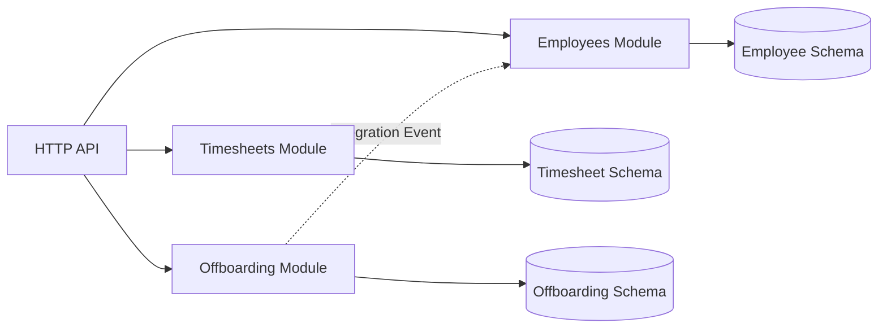
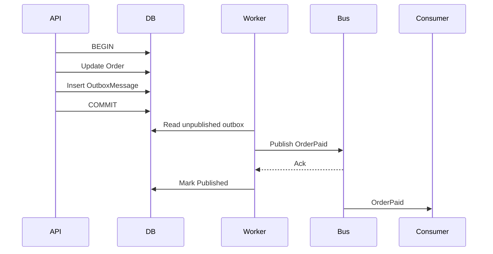
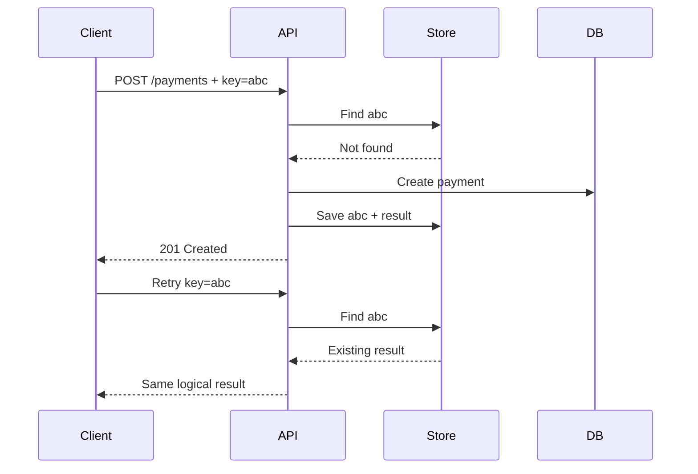
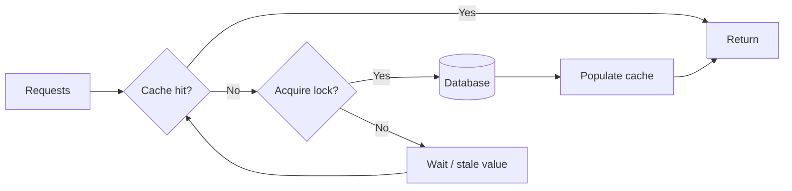
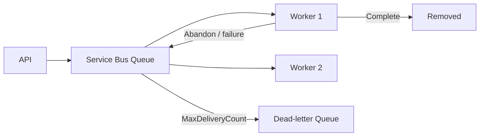
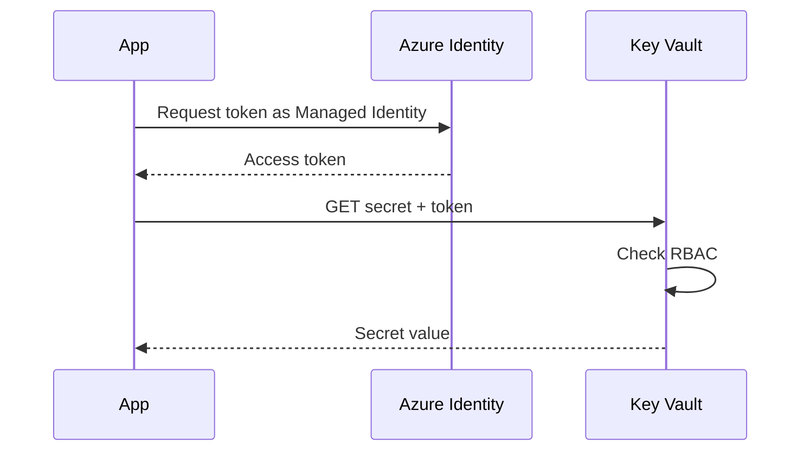
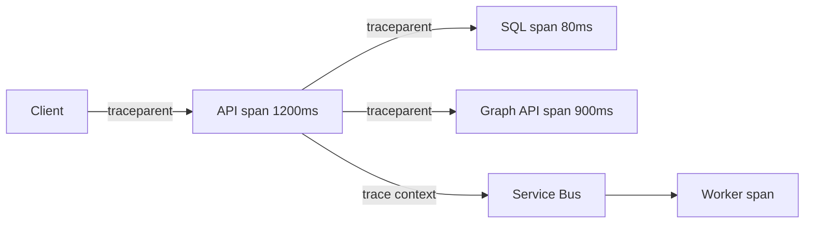
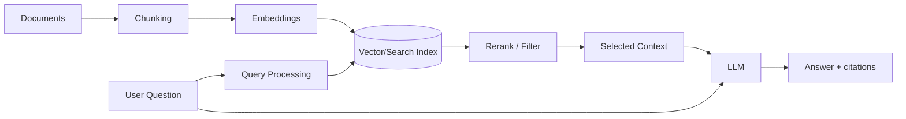
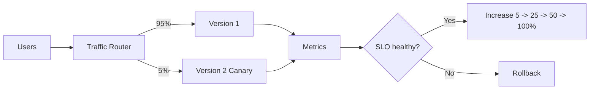

# Daily Knowledge Sharing — 2026-08-19

## Today’s Topics

1. Modular Monolith — chia boundary đúng trước khi nghĩ đến Microservices
2. Event-Driven Architecture với Transactional Outbox
3. API Idempotency — chống xử lý trùng trong hệ thống thực tế
4. Database Isolation Levels, Locking và Deadlock
5. Cache Stampede và chiến lược bảo vệ Redis
6. Azure Service Bus — retry, dead-letter và xử lý message an toàn
7. Azure Key Vault + Managed Identity — quản lý secret không cần credential trong code
8. OpenTelemetry Distributed Tracing — lần theo một request xuyên nhiều service
9. RAG — thiết kế retrieval pipeline thay vì chỉ “nhét tài liệu vào prompt”
10. Canary Deployment — giảm blast radius khi release production

---

# 1. Modular Monolith — chia boundary đúng trước khi nghĩ đến Microservices

### 1. What is it?

Modular Monolith vẫn là **một ứng dụng được deploy như một đơn vị**, nhưng bên trong được chia thành các module nghiệp vụ có boundary rõ ràng. Điểm quan trọng không phải folder đẹp mà là module không tùy tiện đọc bảng, gọi class nội bộ hoặc sửa state của module khác.

Ví dụ hệ thống HR có thể gồm `Employees`, `Timesheets`, `Offboarding`, `Notifications`. Mỗi module sở hữu use case, domain model và persistence concern của mình.

### 2. Why does it exist?

Một monolith không có boundary thường tiến dần thành “big ball of mud”: controller gọi repository bất kỳ, bảng dùng chung khắp nơi, business rule nằm rải rác. Khi cần thay đổi một feature, developer không biết phạm vi ảnh hưởng.

Microservices giải quyết một số vấn đề boundary bằng network/process isolation, nhưng đổi lại phải trả giá bằng deployment, observability, messaging, eventual consistency và operational complexity. Modular Monolith cho phép tạo boundary trước khi trả chi phí phân tán.

### 3. How does it work?



Module nên giao tiếp qua public contract, command/query hoặc integration event thay vì tham chiếu trực tiếp implementation nội bộ.

Dependency quan trọng là:

```text
Module A -> Public Contract của Module B
Module A -X-> Repository/Entity nội bộ của Module B
```

### 4. Practical example

```csharp
public interface IEmployeeDirectory
{
    Task<EmployeeSummary?> GetAsync(Guid employeeId, CancellationToken ct);
}

internal sealed class EmployeeDirectory(AppDbContext db) : IEmployeeDirectory
{
    public Task<EmployeeSummary?> GetAsync(Guid id, CancellationToken ct) =>
        db.Employees
          .Where(x => x.Id == id)
          .Select(x => new EmployeeSummary(x.Id, x.Email, x.Status))
          .SingleOrDefaultAsync(ct);
}
```

`Timesheets` chỉ thấy `IEmployeeDirectory` và DTO contract; nó không được lấy `Employee` entity rồi sửa trạng thái.

### 5. Real production scenario

Trong hệ thống employee management, khi nhân viên bị offboard, module `Offboarding` hoàn thành workflow rồi phát `EmployeeOffboarded`. `Notifications` nhận event để gửi email; `Timesheets` khóa submission. Không module nào cần gọi trực tiếp repository của module còn lại.

### 6. Common mistakes

- Chia project/folder nhưng tất cả module vẫn dùng chung repository và entity.
- Tạo `Shared` project chứa gần như toàn bộ business logic.
- Module A join trực tiếp bảng của module B vì “nhanh hơn”.
- Dùng MediatR như một service locator để che coupling thay vì giảm coupling.
- Tách module quá nhỏ theo CRUD entity thay vì business capability.

### 7. Trade-offs

**Advantages:** deployment đơn giản, transaction local dễ hơn microservices, debugging thuận tiện, boundary có thể kiểm thử, chi phí vận hành thấp.

**Costs / Risks:** process vẫn dùng chung CPU/memory; một deployment có thể ảnh hưởng toàn hệ thống; boundary chỉ được bảo vệ bằng discipline/tooling; scale riêng từng module khó hơn.

### 8. Junior → Middle → Senior understanding

**Junior:** hiểu module là business boundary, không phải folder.

**Middle:** biết thiết kế public contract, tránh cross-module data access và viết integration tests cho boundary.

**Senior / Technical Lead:** quyết định module boundary, ownership dữ liệu, synchronous vs event communication và nhận biết thời điểm một module thực sự cần tách thành service độc lập.

### 9. Key takeaway

- Boundary tốt quan trọng hơn số lượng service.
- Hãy modularize trước khi distribute.
- Một module phải sở hữu behavior và data của chính nó.

---

# 2. Event-Driven Architecture với Transactional Outbox

### 1. What is it?

Event-Driven Architecture cho phép các thành phần phản ứng với sự kiện đã xảy ra. Vấn đề khó nhất không phải publish event mà là bảo đảm **database change và event không bị lệch nhau**. Transactional Outbox giải quyết bằng cách ghi business data và event vào cùng một database transaction, sau đó worker publish event ra broker.

### 2. Why does it exist?

Đoạn code sau có dual-write problem:

```text
UPDATE database
PUBLISH message
```

Nếu DB commit thành công nhưng broker lỗi, dữ liệu đã đổi nhưng không có event. Nếu publish trước rồi transaction rollback, consumer lại thấy một sự kiện cho thay đổi chưa tồn tại.

### 3. How does it work?



Outbox không tạo exactly-once delivery. Worker có thể publish thành công rồi crash trước khi đánh dấu `Published`; message sẽ được publish lại. Vì vậy consumer vẫn phải idempotent.

### 4. Practical example

```csharp
await using var tx = await db.Database.BeginTransactionAsync(ct);

order.MarkPaid();

db.OutboxMessages.Add(new OutboxMessage
{
    Id = Guid.NewGuid(),
    Type = "OrderPaid",
    Payload = JsonSerializer.Serialize(new OrderPaid(order.Id)),
    OccurredAtUtc = DateTime.UtcNow
});

await db.SaveChangesAsync(ct);
await tx.CommitAsync(ct);
```

Một `BackgroundService` đọc các row chưa publish theo batch, gửi lên broker rồi cập nhật trạng thái.

### 5. Real production scenario

Payment API xác nhận thanh toán. Cùng transaction, hệ thống cập nhật `Payment=Succeeded` và ghi `PaymentSucceeded` vào outbox. Worker publish event; Invoice Service tạo hóa đơn, Notification Service gửi email và Loyalty Service cộng điểm.

### 6. Common mistakes

- Cho rằng Outbox tạo exactly-once end-to-end.
- Không có index trên `ProcessedAt/PublishedAt`, khiến polling ngày càng chậm.
- Không cleanup/archive bảng outbox.
- Publish hàng nghìn message trong một transaction dài.
- Consumer không deduplicate.
- Serialize domain entity trực tiếp làm integration contract.

### 7. Trade-offs

**Advantages:** tránh mất event do dual-write, business transaction vẫn atomic, tăng reliability.

**Costs / Risks:** thêm table, worker, polling/CDC, duplicate delivery, monitoring và cleanup; event thường có độ trễ nhỏ.

### 8. Junior → Middle → Senior understanding

**Junior:** hiểu vì sao `SaveChanges()` rồi `Publish()` không atomic.

**Middle:** implement outbox worker, retry, batch, index và idempotent consumer.

**Senior / Technical Lead:** quyết định polling vs CDC, event contract/versioning, retention, ordering, throughput và failure recovery.

### 9. Key takeaway

- Outbox giải quyết atomicity của DB change + event creation.
- Delivery vẫn có thể duplicate.
- Producer reliability và consumer idempotency phải đi cùng nhau.

---

# 3. API Idempotency — chống xử lý trùng trong hệ thống thực tế

### 1. What is it?

Một operation idempotent có thể được gửi lại nhiều lần nhưng hiệu ứng nghiệp vụ cuối cùng tương đương một lần xử lý hợp lệ. Với API tạo payment/order, thường dùng `Idempotency-Key` để nhận diện cùng một logical request.

### 2. Why does it exist?

Client timeout không có nghĩa server chưa xử lý. Ví dụ server đã charge thẻ nhưng response bị mất; mobile app retry và charge lần hai. Retry là cần thiết cho reliability, nhưng retry operation không idempotent có thể phá dữ liệu.

### 3. How does it work?



Key cần gắn với caller, endpoint và request fingerprint để tránh một key bị tái sử dụng cho payload khác.

### 4. Practical example

```csharp
app.MapPost("/payments", async (
    HttpRequest request,
    CreatePayment command,
    PaymentDbContext db,
    CancellationToken ct) =>
{
    var key = request.Headers["Idempotency-Key"].ToString();
    if (string.IsNullOrWhiteSpace(key))
        return Results.BadRequest("Idempotency-Key is required.");

    var existing = await db.IdempotencyRecords
        .SingleOrDefaultAsync(x => x.Key == key, ct);

    if (existing is not null)
        return Results.Json(existing.ResponseBody, statusCode: existing.StatusCode);

    // Business operation and idempotency record should share a transaction.
    return Results.Created();
});
```

Production implementation cần unique constraint trên key và xử lý race condition.

### 5. Real production scenario

Mobile client gọi API tạo expense claim qua mạng yếu. Request đầu tiên commit nhưng client timeout. Retry với cùng key không tạo claim thứ hai; API trả lại kết quả của request đầu.

### 6. Common mistakes

- Chỉ check key bằng `SELECT` nhưng không có unique constraint.
- Lưu key sau business transaction nên crash ở giữa vẫn tạo duplicate.
- Cùng key nhưng payload khác vẫn trả kết quả cũ.
- Giữ key vĩnh viễn mà không có retention policy.
- Retry mọi `POST` nhưng không thiết kế idempotency.

### 7. Trade-offs

**Advantages:** retry an toàn, UX tốt hơn, giảm duplicate business action.

**Costs / Risks:** thêm storage, transaction coordination, retention và concurrency handling; không phải operation nào cũng dễ định nghĩa “same effect”.

### 8. Junior → Middle → Senior understanding

**Junior:** phân biệt HTTP retry với business idempotency.

**Middle:** implement key store, unique index, request hash và transaction boundary.

**Senior / Technical Lead:** định nghĩa semantic idempotency, TTL, cross-region behavior và interaction với downstream systems.

### 9. Key takeaway

- Timeout là trạng thái “không biết kết quả”, không phải “thất bại chắc chắn”.
- Retry và idempotency là một cặp thiết kế.
- Database constraint là lớp bảo vệ quan trọng trước race condition.

---

# 4. Database Isolation Levels, Locking và Deadlock

### 1. What is it?

Isolation level quy định một transaction được phép quan sát thay đổi từ transaction khác đến mức nào. Nó trực tiếp ảnh hưởng consistency, locking, blocking và throughput.

### 2. Why does it exist?

Nếu mọi transaction hoàn toàn serialize, consistency rất mạnh nhưng concurrency thấp. Nếu cho phép đọc/ghi quá tự do, throughput tăng nhưng có thể gặp dirty read, non-repeatable read hoặc phantom. Database cần cơ chế cân bằng hai phía.

### 3. How does it work?

Hai transaction cùng cập nhật resource theo thứ tự ngược nhau có thể deadlock:

```text
T1: lock Order 1  -> chờ Order 2
T2: lock Order 2  -> chờ Order 1
```

Database phát hiện cycle và chọn một transaction làm deadlock victim để rollback.

### 4. Practical example

Thay vì cập nhật account theo thứ tự request nhận được, dùng thứ tự ổn định:

```csharp
var ids = new[] { fromAccountId, toAccountId }.OrderBy(x => x).ToArray();

var accounts = await db.Accounts
    .Where(x => ids.Contains(x.Id))
    .OrderBy(x => x.Id)
    .ToListAsync(ct);
```

Với SQL Server, kiểm tra execution plan, deadlock graph và cân nhắc `READ_COMMITTED_SNAPSHOT` khi workload phù hợp thay vì chữa blocking bằng `NOLOCK`.

### 5. Real production scenario

Hai background job đồng thời chuyển trạng thái hàng nghìn timesheet. Một job lock `Employee` rồi `Timesheet`, job kia lock `Timesheet` rồi `Employee`. Production thỉnh thoảng báo deadlock dù test local không thấy. Root cause là lock ordering không nhất quán.

### 6. Common mistakes

- Dùng `NOLOCK` như thuốc chữa performance.
- Giữ transaction mở trong lúc gọi HTTP API.
- Transaction quá lớn.
- Không có index khiến query scan và lock nhiều row hơn cần thiết.
- Retry deadlock nhưng không sửa root cause.
- Nghĩ isolation càng cao luôn càng tốt.

### 7. Trade-offs

**Advantages của isolation mạnh:** reasoning về consistency dễ hơn.

**Costs / Risks:** blocking nhiều hơn, transaction dài làm giảm concurrency. Snapshot-based isolation giảm read blocking nhưng tăng version-store/storage overhead và vẫn cần hiểu write conflicts.

### 8. Junior → Middle → Senior understanding

**Junior:** hiểu transaction, lock và blocking khác deadlock.

**Middle:** đọc deadlock graph, giảm transaction scope, thêm index và giữ lock order nhất quán.

**Senior / Technical Lead:** chọn isolation theo invariant nghiệp vụ, đánh giá snapshot semantics, throughput và retry strategy.

### 9. Key takeaway

- Deadlock là cycle; blocking đơn thuần chưa phải deadlock.
- Transaction càng ngắn càng tốt.
- Isolation phải chọn theo business consistency, không theo cảm tính.

---

# 5. Cache Stampede và chiến lược bảo vệ Redis

### 1. What is it?

Cache stampede xảy ra khi một key phổ biến hết hạn và rất nhiều request cùng cache miss, sau đó đồng loạt truy vấn database hoặc downstream API. Cache vốn dùng để bảo vệ backend lại biến thành nguyên nhân tạo spike.

### 2. Why does it exist?

Naive cache-aside:

```text
GET cache -> miss -> GET database -> SET cache
```

Hoạt động tốt khi traffic thấp. Nhưng 5.000 request cùng miss một key có thể tạo 5.000 DB queries trước khi request đầu tiên kịp populate cache.

### 3. How does it work?



Các kỹ thuật gồm single-flight/local lock, distributed lock có giới hạn, stale-while-revalidate, probabilistic early refresh và TTL jitter.

### 4. Practical example

```csharp
var ttl = TimeSpan.FromMinutes(10)
          + TimeSpan.FromSeconds(Random.Shared.Next(0, 60));

await cache.SetStringAsync(
    key,
    JsonSerializer.Serialize(product),
    new DistributedCacheEntryOptions { AbsoluteExpirationRelativeToNow = ttl },
    ct);
```

TTL jitter tránh hàng nghìn key được warm cùng lúc rồi cùng expire chính xác sau 10 phút.

### 5. Real production scenario

Dashboard SaaS có một aggregate query tốn 2 giây. Key cache hết hạn đúng 09:00 khi hàng nghìn nhân viên login. Database CPU tăng 95%. Giải pháp không chỉ “tăng Redis” mà là coalesce cache miss, jitter TTL và cho phép trả stale data vài chục giây nếu business chấp nhận.

### 6. Common mistakes

- Tất cả key có cùng TTL.
- Distributed lock không có timeout.
- Redis lỗi thì request fail toàn bộ dù DB vẫn hoạt động.
- Cache dữ liệu nhạy cảm mà key không scope theo tenant/user.
- Không đo hit ratio.
- Cache object cực lớn gây network/serialization cost.

### 7. Trade-offs

**Advantages:** giảm load backend, latency thấp, hấp thụ traffic burst.

**Costs / Risks:** stale data, invalidation complexity, thêm dependency và memory cost; locking quá mạnh có thể biến cache thành bottleneck mới.

### 8. Junior → Middle → Senior understanding

**Junior:** hiểu hit, miss, TTL và cache-aside.

**Middle:** implement fallback, jitter, invalidation và metric hit ratio.

**Senior / Technical Lead:** thiết kế behavior khi Redis down, stale policy, hot-key protection, multi-region consistency và cost model.

### 9. Key takeaway

- Cache miss hàng loạt nguy hiểm hơn một cache miss đơn lẻ.
- TTL nên có jitter cho workload lớn.
- Thiết kế cache phải bao gồm cả “Redis unavailable”.

---

# 6. Azure Service Bus — retry, dead-letter và xử lý message an toàn

### 1. What is it?

Azure Service Bus là managed message broker cho queue/topic workloads cần durable messaging, competing consumers, dead-letter queue, scheduled delivery và session/ordering trong các trường hợp phù hợp.

### 2. Why does it exist?

Nếu API phải đồng bộ gọi Email, Billing, Audit và CRM, latency và failure coupling tăng. Messaging tách thời điểm producer hoàn thành request khỏi thời điểm consumer xử lý công việc.

### 3. How does it work?



Với Peek-Lock, consumer nhận message nhưng broker chưa xóa. Xử lý thành công thì `Complete`; lỗi có thể `Abandon`; quá số lần delivery hoặc lỗi không thể xử lý thì message vào DLQ.

### 4. Practical example

```csharp
processor.ProcessMessageAsync += async args =>
{
    try
    {
        await handler.HandleAsync(args.Message, args.CancellationToken);
        await args.CompleteMessageAsync(args.Message);
    }
    catch (InvalidPayloadException ex)
    {
        await args.DeadLetterMessageAsync(args.Message,
            "InvalidPayload", ex.Message);
    }
};
```

Transient exception nên retry có kiểm soát; validation/permanent error không nên retry vô hạn.

### 5. Real production scenario

Hệ thống offboarding publish job cập nhật Microsoft 365. Graph API tạm trả 429; worker retry với backoff. Nếu mailbox không tồn tại do dữ liệu sai, message vào DLQ cùng reason để operations xử lý thay vì retry hàng nghìn lần.

### 6. Common mistakes

- Retry mọi exception giống nhau.
- Không monitor DLQ.
- Handler không idempotent.
- Lock duration ngắn hơn thời gian xử lý nhưng không renew.
- Message chứa payload quá lớn.
- Dùng queue như database lâu dài.
- Không có correlation ID.

### 7. Trade-offs

**Advantages:** decoupling, buffering, retry, horizontal consumers, managed durability.

**Costs / Risks:** eventual consistency, duplicate delivery, ordering complexity, broker cost và operational burden quanh DLQ/replay.

### 8. Junior → Middle → Senior understanding

**Junior:** hiểu producer, queue, consumer và ack.

**Middle:** biết settlement, retry, DLQ, idempotency và diagnostics.

**Senior / Technical Lead:** chọn queue/topic/session, thiết kế poison-message policy, throughput, partitioning, disaster recovery và replay strategy.

### 9. Key takeaway

- DLQ không phải thùng rác; nó là operational workflow.
- Consumer phải chịu được duplicate.
- Phân biệt transient và permanent failure trước khi retry.

---

# 7. Azure Key Vault + Managed Identity — quản lý secret không cần credential trong code

### 1. What is it?

Azure Key Vault lưu secret, key và certificate tập trung. Managed Identity cung cấp identity cho Azure workload để authenticate với Azure resources mà không phải lưu client secret trong source code hoặc configuration.

### 2. Why does it exist?

Nếu application cần secret để lấy secret khác, ta tạo vòng lặp quản lý credential. Client secret trong `appsettings.json`, pipeline variable hoặc Kubernetes secret vẫn có lifecycle, rotation và leakage risk.

Managed Identity chuyển vấn đề từ “giữ password ở đâu?” sang “identity này được phép làm gì?”.

### 3. How does it work?



### 4. Practical example

```csharp
var client = new SecretClient(
    new Uri(configuration["KeyVaultUri"]!),
    new DefaultAzureCredential());

KeyVaultSecret secret = await client.GetSecretAsync("Graph-Api-Key");
```

`DefaultAzureCredential` có thể dùng developer credential ở local và Managed Identity trên Azure mà không đổi code.

### 5. Real production scenario

ASP.NET Core chạy trên App Service cần connection secret cho third-party system. App Service Managed Identity được cấp role chỉ đọc secret cần thiết. Khi rotate secret trong Key Vault, không cần đưa credential của Key Vault vào deployment package.

### 6. Common mistakes

- Cấp quyền Key Vault quá rộng.
- Log secret value.
- Fetch Key Vault ở mọi request thay vì cache hợp lý.
- Cho rằng Managed Identity loại bỏ mọi secret; third-party API key vẫn cần quản lý.
- Không thiết kế behavior khi Key Vault/network tạm unavailable.
- Public network mở dù workload có yêu cầu private networking.

### 7. Trade-offs

**Advantages:** giảm secret sprawl, rotation/audit tốt hơn, identity lifecycle do Azure quản lý.

**Costs / Risks:** dependency vào identity/network/RBAC; private endpoint tăng networking complexity; Key Vault calls có latency và cost.

### 8. Junior → Middle → Senior understanding

**Junior:** không commit secret và hiểu Key Vault dùng để làm gì.

**Middle:** cấu hình Managed Identity, RBAC, `DefaultAzureCredential`, caching và diagnostics.

**Senior / Technical Lead:** thiết kế least privilege, rotation, private networking, break-glass access và multi-environment governance.

### 9. Key takeaway

- Managed Identity loại bỏ nhu cầu tự quản credential cho Azure-to-Azure authentication.
- Key Vault không thay thế authorization design.
- Secret phải có lifecycle: create, access, rotate, revoke, audit.

---

# 8. OpenTelemetry Distributed Tracing — lần theo một request xuyên nhiều service

### 1. What is it?

Distributed tracing mô hình hóa một request thành một **trace** gồm nhiều **span**. OpenTelemetry cung cấp chuẩn instrumentation/export để application phát traces, metrics và logs sang backend quan sát như Application Insights hoặc hệ thống tương thích OTLP.

### 2. Why does it exist?

Log riêng lẻ trả lời “service này đã ghi gì”, nhưng hệ thống phân tán cần trả lời “request của user đã đi qua những đâu và chậm ở bước nào?”. Correlation ID thủ công giúp một phần nhưng không biểu diễn parent-child timing tốt như trace/span.

### 3. How does it work?



W3C `traceparent` được propagate qua HTTP và messaging để backend observability ghép các span thành cùng trace.

### 4. Practical example

```csharp
builder.Services.AddOpenTelemetry()
    .WithTracing(t => t
        .AddAspNetCoreInstrumentation()
        .AddHttpClientInstrumentation()
        .AddEntityFrameworkCoreInstrumentation()
        .AddSource("Offboarding"));

private static readonly ActivitySource Source = new("Offboarding");

using var activity = Source.StartActivity("ConvertMailboxToShared");
activity?.SetTag("employee.id", employeeId);
```

Không đưa password, token, email nhạy cảm hoặc full request body vào tag.

### 5. Real production scenario

API offboarding mất 8 giây. Trace cho thấy SQL chỉ 60 ms, nhưng Microsoft Graph call mất 6.8 giây và retry một lần. Team tránh tối ưu database sai chỗ và tập trung timeout/retry/downstream dependency.

### 6. Common mistakes

- Trace 100% traffic ở hệ thống cực lớn mà không tính ingestion cost.
- Tag có high cardinality vô hạn.
- Ghi PII/token vào span.
- Không propagate context qua queue.
- Chỉ có tracing mà không kết nối logs/metrics.
- Instrument quá chi tiết khiến signal bị noise.

### 7. Trade-offs

**Advantages:** root-cause latency nhanh, dependency map rõ, hỗ trợ incident investigation.

**Costs / Risks:** telemetry volume, sampling, storage cost, privacy và instrumentation overhead.

### 8. Junior → Middle → Senior understanding

**Junior:** hiểu trace/span và correlation.

**Middle:** instrument HTTP/DB/custom spans, query trace và propagate context.

**Senior / Technical Lead:** thiết kế sampling, semantic conventions, retention, PII policy, SLO linkage và telemetry cost.

### 9. Key takeaway

- Trace cho biết request đã đi đâu và tốn thời gian ở đâu.
- Instrumentation phải có mục tiêu, không phải càng nhiều càng tốt.
- Logs + metrics + traces bổ sung cho nhau.

---

# 9. RAG — thiết kế retrieval pipeline thay vì chỉ “nhét tài liệu vào prompt”

### 1. What is it?

Retrieval-Augmented Generation (RAG) lấy thông tin liên quan từ nguồn dữ liệu bên ngoài rồi đưa context đó cho LLM tạo câu trả lời. RAG không “dạy lại model”; nó cung cấp evidence tại thời điểm inference.

### 2. Why does it exist?

LLM có knowledge cutoff, không biết dữ liệu private và có thể hallucinate. Gửi toàn bộ kho tài liệu vào prompt lại tốn token, vượt context window và làm giảm signal-to-noise. Retrieval chọn phần liên quan trước khi gọi model.

### 3. How does it work?



Production RAG thường cần metadata filter, hybrid search, reranking, authorization filtering và evaluation; vector similarity đơn thuần hiếm khi đủ cho mọi query.

### 4. Practical example

```csharp
var chunks = await search.SearchAsync(
    query,
    tenantId: currentTenant.Id,
    topK: 20,
    cancellationToken: ct);

var reranked = reranker.SelectTop(chunks, 5);
var context = string.Join("\n\n", reranked.Select(x => x.Content));

var answer = await llm.AnswerAsync(
    question: query,
    context: context,
    requireCitations: true,
    cancellationToken: ct);
```

Điểm đáng chú ý là `tenantId` phải được filter **trước khi** context đến LLM.

### 5. Real production scenario

AI assistant nội bộ trả lời câu hỏi về policy HR. Document pipeline index PDF theo version, department và effective date. Query dùng hybrid retrieval; chỉ policy còn hiệu lực được chọn; model phải cite document source và trả “không đủ dữ liệu” nếu retrieval confidence thấp.

### 6. Common mistakes

- Chunk cố định mà không xét cấu trúc tài liệu.
- Chỉ vector search, không metadata filter.
- Không enforce tenant/ACL trước retrieval.
- Top-K quá lớn làm prompt nhiễu và tăng cost.
- Không có evaluation dataset.
- Cho model tự khẳng định câu trả lời dù evidence không đủ.
- Index cũ không được xóa khi document bị revoke.

### 7. Trade-offs

**Advantages:** dùng knowledge mới/private, có thể cite nguồn, cập nhật dữ liệu không cần fine-tune.

**Costs / Risks:** ingestion/indexing complexity, retrieval error, latency, embedding/search cost, security và stale-index problem.

### 8. Junior → Middle → Senior understanding

**Junior:** hiểu embedding/retrieval/context khác model training.

**Middle:** xây chunking, indexing, metadata filter, hybrid retrieval và citations.

**Senior / Technical Lead:** thiết kế ACL, evaluation, freshness, reranking, fallback, observability, cost và threat model cho prompt injection từ document.

### 9. Key takeaway

- Chất lượng RAG phụ thuộc retrieval ít nhất ngang prompt.
- Authorization phải xảy ra trước khi dữ liệu vào model context.
- “Không tìm thấy evidence” là một kết quả hợp lệ.

---

# 10. Canary Deployment — giảm blast radius khi release production

### 1. What is it?

Canary Deployment phát hành version mới cho một phần nhỏ traffic trước, quan sát health metrics rồi tăng dần tỷ lệ nếu ổn. Mục tiêu là phát hiện lỗi với blast radius nhỏ hơn việc chuyển 100% traffic ngay lập tức.

### 2. Why does it exist?

CI test không thể mô phỏng hoàn toàn production data, traffic pattern, dependency behavior và edge cases. Một deployment “build xanh” vẫn có thể tăng latency, memory, 5xx hoặc lỗi business logic.

### 3. How does it work?



Promotion nên dựa trên metric như error rate, p95 latency, saturation và business KPI, không chỉ “không thấy ai báo lỗi”.

### 4. Practical example

Một pipeline có thể dùng gate logic:

```text
Deploy 5%
  -> observe 10 minutes
  -> error_rate < 1%
  -> p95_latency < 500 ms
  -> deploy 25%
  -> observe
  -> deploy 100%
```

Feature flag có thể tách “deploy code” khỏi “enable behavior”, đặc biệt với thay đổi rủi ro cao.

### 5. Real production scenario

API timesheet release version mới có query EF Core vô tình tạo N+1. Với 5% traffic, Application Insights cho thấy p95 tăng từ 180 ms lên 1.8 s và DB CPU tăng. Pipeline dừng promotion và rollback trước khi toàn bộ user bị ảnh hưởng.

### 6. Common mistakes

- Canary nhưng không có metric gate.
- Canary instance nhận traffic không đại diện cho production.
- Database migration không backward-compatible nên rollback app không cứu được.
- Chỉ monitor technical metric, bỏ qua business failures.
- Session affinity khiến sample traffic bị lệch.
- Rollback chưa từng được test.

### 7. Trade-offs

**Advantages:** giảm blast radius, thu thập production evidence, rollback sớm.

**Costs / Risks:** routing/deployment phức tạp hơn, hai version cùng tồn tại, schema compatibility khó, cần observability tốt.

### 8. Junior → Middle → Senior understanding

**Junior:** hiểu canary khác deploy 100% và rollback.

**Middle:** biết cấu hình traffic split, dashboards, health gates và backward-compatible changes.

**Senior / Technical Lead:** định nghĩa promotion policy, SLO threshold, database expand-contract migration, rollback strategy và mức rủi ro chấp nhận được.

### 9. Key takeaway

- Canary chỉ hữu ích khi có tín hiệu để quyết định promote hay rollback.
- Database compatibility thường là phần khó nhất của rollback.
- Release an toàn là bài toán observability + deployment strategy, không chỉ CI/CD syntax.
