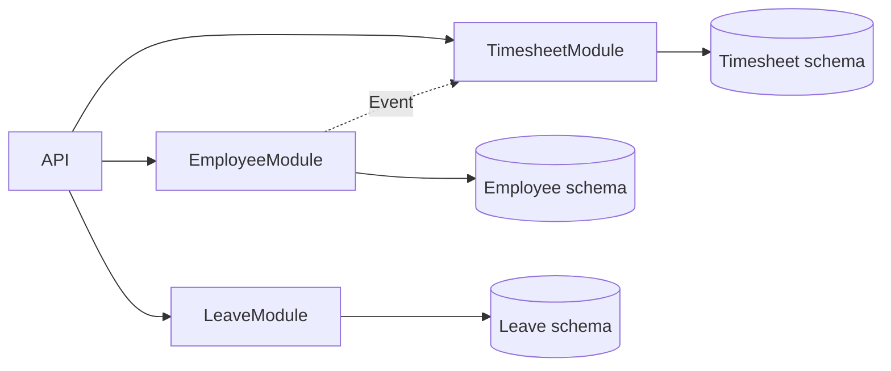
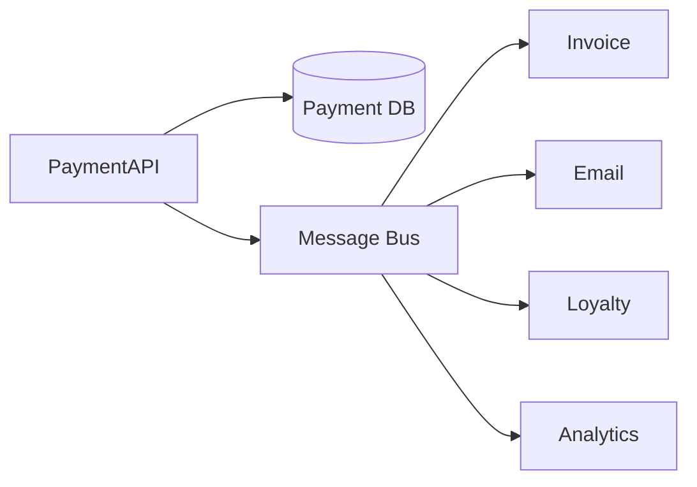
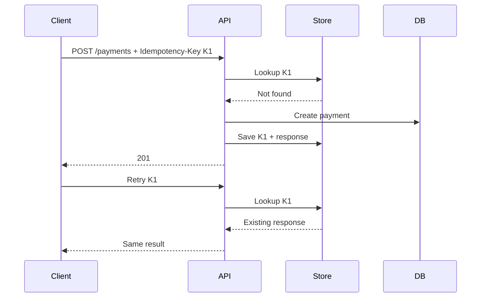
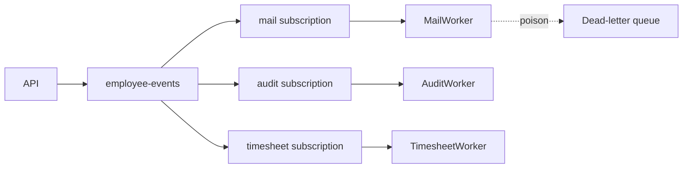
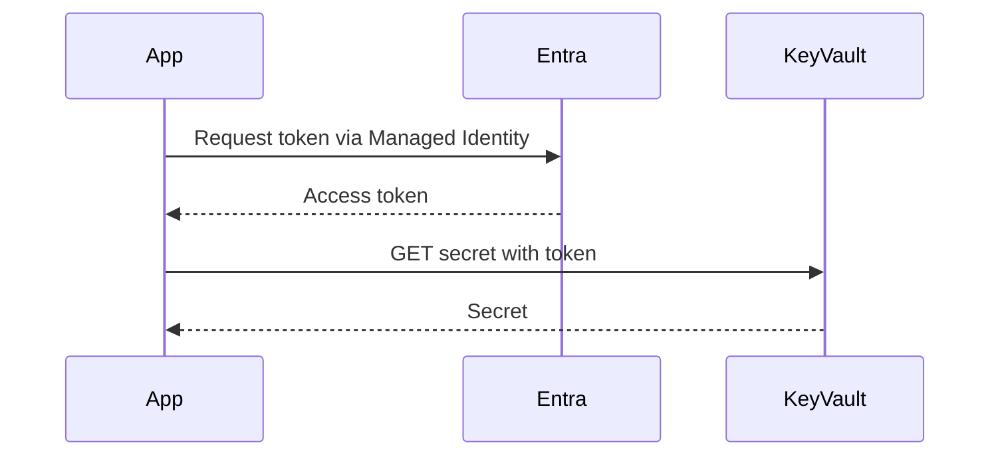
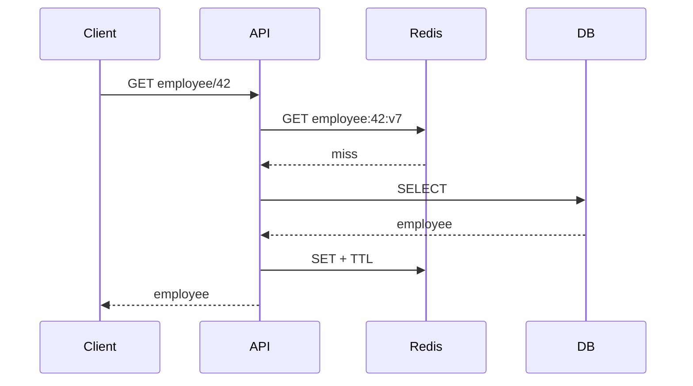
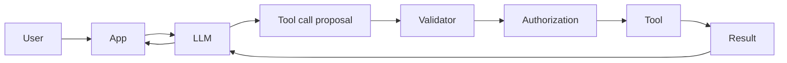
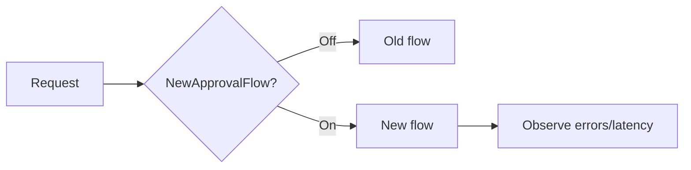

# Daily Knowledge Sharing — 2026-08-19

## Today’s Topics

1. Modular Monolith — chia boundary đúng trước khi nghĩ tới Microservices
2. Event-Driven Architecture — xử lý side effect mà không khóa request chính
3. Idempotency — chống xử lý trùng trong API và distributed systems
4. Optimistic Concurrency — bảo vệ dữ liệu khi nhiều người cùng cập nhật
5. Azure Service Bus — queue/topic, retry và dead-letter trong production
6. Azure Managed Identity + Key Vault — bỏ secret khỏi source/config
7. Cache Invalidation — bài toán khó hơn việc “thêm Redis”
8. OpenTelemetry Distributed Tracing — lần theo request xuyên nhiều service
9. LLM Structured Output + Tool Calling — để AI đề xuất, code kiểm soát hành động
10. Feature Flags — tách deployment khỏi release

---

# 1. Modular Monolith — chia boundary đúng trước khi nghĩ tới Microservices

### 1. What is it?

Modular Monolith vẫn là **một ứng dụng được deploy như một đơn vị**, nhưng code được chia thành các module nghiệp vụ có boundary rõ ràng. Điểm quan trọng không phải folder đẹp mà là module A không tùy tiện đọc bảng, entity hay internal service của module B.

Ví dụ hệ thống HR có `Employees`, `Timesheets`, `Leave`, `Notifications`. Mỗi module sở hữu use case và dữ liệu của mình; giao tiếp qua public contract hoặc event.

### 2. Why does it exist?

Một monolith không boundary thường dần biến thành “big ball of mud”: service gọi chéo nhau, transaction lan khắp hệ thống, sửa một nghiệp vụ làm hỏng nghiệp vụ khác. Microservices giải quyết isolation nhưng mang thêm network, deployment, observability và eventual consistency.

Modular Monolith giữ operational simplicity của monolith nhưng ép kiến trúc có boundary đủ tốt để có thể tách service sau này nếu thực sự cần.

### 3. How does it work?



Dependency nên đi qua contract, không phải implementation nội bộ.

### 4. Practical example

```csharp
public interface IEmployeeDirectory
{
    Task<EmployeeSummary?> GetAsync(Guid employeeId, CancellationToken ct);
}

internal sealed class EmployeeDirectory(EmployeeDbContext db)
    : IEmployeeDirectory
{
    public Task<EmployeeSummary?> GetAsync(Guid id, CancellationToken ct) =>
        db.Employees
          .Where(x => x.Id == id)
          .Select(x => new EmployeeSummary(x.Id, x.Name, x.IsActive))
          .SingleOrDefaultAsync(ct);
}
```

`Timesheet` chỉ biết `IEmployeeDirectory`, không inject trực tiếp `EmployeeDbContext`.

### 5. Real production scenario

Khi nhân viên bị inactive, Employee module commit trạng thái trước, sau đó phát `EmployeeDeactivated`. Timesheet module khóa submission mới; Notification module gửi email. Nếu sau này notification có tải lớn, module đó có thể được tách riêng mà business boundary đã tồn tại từ trước.

### 6. Common mistakes

- Chia project thành nhiều folder nhưng tất cả dùng chung entity và DbContext tùy ý.
- Tạo một `Shared` project chứa gần như toàn bộ domain model.
- Module gọi trực tiếp internal repository của module khác.
- Tách module quá nhỏ theo technical layer thay vì business capability.
- Dùng event cho mọi lời gọi dù synchronous contract đơn giản hơn.

### 7. Trade-offs

**Advantages:** deploy đơn giản, transaction local dễ hơn microservices, boundary rõ, test và refactor tốt hơn.

**Costs / Risks:** vẫn scale cả application như một unit; process crash ảnh hưởng toàn app; cần discipline để boundary không bị phá; database vật lý có thể vẫn là shared infrastructure.

### 8. Junior → Middle → Senior understanding

**Junior:** hiểu module là business boundary, không chỉ namespace.

**Middle:** thiết kế contract, dependency direction, module-specific persistence và integration event.

**Senior / Technical Lead:** quyết định boundary nào đáng tách, nơi nào cần synchronous/event communication, và khi nào operational pressure đủ lớn để chuyển thành microservice.

### 9. Key takeaway

- Hãy tạo boundary trước khi tạo network boundary.
- Modular Monolith thường là điểm khởi đầu tốt hơn Microservices.
- “Không truy cập dữ liệu của module khác tùy ý” là nguyên tắc quan trọng hơn cấu trúc folder.

---

# 2. Event-Driven Architecture — xử lý side effect mà không khóa request chính

### 1. What is it?

Event-Driven Architecture cho phép một thành phần công bố rằng **một sự kiện đã xảy ra**, còn consumer tự quyết định phản ứng. Producer không cần biết toàn bộ consumer.

`OrderPaid` khác command `SendReceipt`: event mô tả fact đã xảy ra; command yêu cầu một hành động cụ thể.

### 2. Why does it exist?

Nếu API thanh toán phải đồng bộ gọi email, loyalty, analytics và invoice thì latency và availability của request phụ thuộc tất cả downstream systems. Một service lỗi có thể làm cả transaction nghiệp vụ thất bại dù payment đã thành công.

### 3. How does it work?



Trong production, nên dùng Outbox để tránh trạng thái “DB commit rồi nhưng publish event thất bại”.

### 4. Practical example

```csharp
public sealed record PaymentCompleted(Guid PaymentId, Guid UserId, decimal Amount);

public sealed class ReceiptHandler
{
    public async Task Handle(PaymentCompleted evt, CancellationToken ct)
    {
        await receiptService.SendAsync(evt.UserId, evt.PaymentId, ct);
    }
}
```

Consumer phải giả định message có thể được delivery nhiều hơn một lần.

### 5. Real production scenario

Payment API ghi `Payment=Completed` và outbox event trong cùng transaction. Worker publish event. Invoice consumer tạo hóa đơn; email consumer gửi receipt; analytics cập nhật dashboard. Email lỗi không rollback payment.

### 6. Common mistakes

- Nghĩ message broker bảo đảm exactly-once end-to-end.
- Không có idempotent consumer.
- Publish trước DB commit.
- Event payload chứa quá nhiều internal implementation detail.
- Không version event contract.
- Retry vô hạn poison message.

### 7. Trade-offs

**Advantages:** giảm coupling, hấp thụ burst traffic, failure isolation, mở rộng consumer dễ.

**Costs / Risks:** eventual consistency, duplicate/out-of-order messages, tracing khó hơn, debugging không còn theo call stack đơn giản.

### 8. Junior → Middle → Senior understanding

**Junior:** phân biệt event và synchronous API call.

**Middle:** implement consumer, retry, DLQ, idempotency và correlation ID.

**Senior / Technical Lead:** chọn consistency boundary, delivery semantics, event ownership, schema evolution và failure recovery.

### 9. Key takeaway

- Event giảm temporal coupling nhưng tăng distributed-system complexity.
- Outbox + idempotent consumer là cặp kỹ thuật rất quan trọng.
- Eventual consistency phải là quyết định nghiệp vụ, không phải tai nạn kiến trúc.

---

# 3. Idempotency — chống xử lý trùng trong API và distributed systems

### 1. What is it?

Một operation idempotent có thể nhận cùng một logical request nhiều lần nhưng business effect chỉ xảy ra một lần.

`GET` thường tự nhiên idempotent; `POST /payments` thì không. Vì client có thể timeout sau khi server đã xử lý thành công, retry có thể tạo payment thứ hai.

### 2. Why does it exist?

Distributed system không thể luôn phân biệt “request thất bại” với “response bị mất”. Retry là cần thiết cho reliability, nhưng retry không có idempotency tạo duplicate side effect.

### 3. How does it work?



### 4. Practical example

```csharp
app.MapPost("/payments", async (
    HttpRequest request, PaymentCommand command, PaymentDb db) =>
{
    var key = request.Headers["Idempotency-Key"].ToString();
    if (string.IsNullOrWhiteSpace(key))
        return Results.BadRequest("Idempotency-Key is required");

    var existing = await db.Requests.SingleOrDefaultAsync(x => x.Key == key);
    if (existing is not null)
        return Results.Json(existing.Response, statusCode: existing.StatusCode);

    // Production: business write + idempotency record must share a safe transaction boundary.
    // ...
    return Results.Created();
});
```

### 5. Real production scenario

Mobile app gọi tạo booking, mạng 4G mất ngay sau server commit. App retry cùng key. Server trả booking cũ thay vì tạo booking mới. Cùng nguyên tắc áp dụng cho Service Bus consumer bằng `MessageId` hoặc business operation ID.

### 6. Common mistakes

- Key không scoped theo user/operation.
- Chỉ check rồi insert bằng hai thao tác không atomic, gây race condition.
- Cho cùng key nhưng payload khác nhau mà vẫn trả kết quả cũ.
- Lưu key vĩnh viễn không TTL/retention strategy.
- Chỉ idempotent ở HTTP nhưng downstream side effect vẫn duplicate.

### 7. Trade-offs

**Advantages:** retry an toàn, UX tốt hơn, giảm duplicate transaction.

**Costs / Risks:** cần storage, uniqueness constraint, cleanup và xử lý concurrent requests; response caching có thể chứa dữ liệu nhạy cảm.

### 8. Junior → Middle → Senior understanding

**Junior:** hiểu retry có thể tạo duplicate.

**Middle:** implement idempotency key, unique constraint và transactional handling.

**Senior / Technical Lead:** xác định semantic scope, retention, replay behavior và idempotency xuyên nhiều boundary.

### 9. Key takeaway

- Retry và idempotency nên được thiết kế cùng nhau.
- Unique constraint thường là lớp bảo vệ cuối cùng chống race.
- Idempotency là business semantics, không chỉ middleware trick.

---

# 4. Optimistic Concurrency — bảo vệ dữ liệu khi nhiều người cùng cập nhật

### 1. What is it?

Optimistic concurrency giả định conflict không xảy ra thường xuyên. Thay vì lock record suốt thời gian người dùng chỉnh sửa, hệ thống lưu version và chỉ update nếu version vẫn đúng.

### 2. Why does it exist?

Hai admin cùng mở Employee A. Người thứ nhất đổi department; người thứ hai mở từ dữ liệu cũ rồi đổi title. Nếu update kiểu “last write wins”, thay đổi đầu có thể bị ghi đè âm thầm.

### 3. How does it work?

```text
Read row version = 10
        │
        ▼
User edits
        │
        ▼
UPDATE ... WHERE Id = 1 AND Version = 10
        │
   ┌────┴────┐
1 row      0 rows
success    conflict
```

### 4. Practical example

```csharp
public class Employee
{
    public Guid Id { get; set; }
    public string Name { get; set; } = "";

    [Timestamp]
    public byte[] RowVersion { get; set; } = [];
}

try
{
    await db.SaveChangesAsync(ct);
}
catch (DbUpdateConcurrencyException)
{
    return Results.Conflict(new { message = "Data was changed by another user." });
}
```

SQL Server `rowversion` rất phù hợp cho pattern này.

### 5. Real production scenario

Trong timesheet approval, manager A approve trong khi manager B reject từ màn hình cũ. API kiểm tra version và từ chối operation thứ hai thay vì âm thầm đổi trạng thái đã được approve.

### 6. Common mistakes

- Bắt `DbUpdateConcurrencyException` rồi retry update mù quáng.
- Không gửi version tới client.
- Dùng timestamp thời gian tự tạo thay vì concurrency token đáng tin cậy.
- Conflict xảy ra nhưng API trả 500.
- Entity quá rộng khiến thay đổi không liên quan cũng conflict liên tục.

### 7. Trade-offs

**Advantages:** không giữ lock dài, throughput tốt, phù hợp web application.

**Costs / Risks:** client cần conflict-resolution UX; contention cao sẽ tạo nhiều retry/conflict; không phù hợp mọi invariant tài chính.

### 8. Junior → Middle → Senior understanding

**Junior:** hiểu lost update.

**Middle:** cấu hình EF Core concurrency token và trả conflict hợp lý.

**Senior / Technical Lead:** chọn optimistic hay pessimistic concurrency dựa trên contention, invariant và cost của conflict.

### 9. Key takeaway

- Đừng để last-write-wins xảy ra vô thức.
- Conflict phải được xử lý theo nghiệp vụ, không chỉ catch exception.
- Optimistic concurrency rất hợp với request ngắn và contention thấp.

---

# 5. Azure Service Bus — queue/topic, retry và dead-letter trong production

### 1. What is it?

Azure Service Bus là managed message broker hỗ trợ Queue và Topic/Subscription. Queue thường dùng competing consumers; Topic dùng publish/subscribe cho nhiều consumer độc lập.

### 2. Why does it exist?

Background processing trực tiếp trong HTTP request làm request lâu và dễ thất bại. Tự dùng database polling có thể hoạt động ở quy mô nhỏ nhưng thiếu broker semantics như lock, DLQ, subscription filtering và delivery control.

### 3. How does it work?



Message được peek-lock, consumer xử lý rồi complete. Nếu không complete trước lock expiry, message có thể xuất hiện lại.

### 4. Practical example

```csharp
var processor = client.CreateProcessor("employee-events", "mail", new()
{
    MaxConcurrentCalls = 8,
    AutoCompleteMessages = false
});

processor.ProcessMessageAsync += async args =>
{
    await handler.HandleAsync(args.Message.Body, args.CancellationToken);
    await args.CompleteMessageAsync(args.Message, args.CancellationToken);
};
```

### 5. Real production scenario

Khi employee offboarding hoàn tất, event đi vào topic. Mail worker cập nhật Exchange, audit worker lưu audit trail. Microsoft Graph tạm lỗi 503 thì mail worker retry; poison message vượt max delivery được chuyển DLQ để điều tra.

### 6. Common mistakes

- Không monitor DLQ.
- `MaxConcurrentCalls` quá cao làm downstream bị throttling.
- Handler không idempotent.
- Message quá lớn hoặc nhét binary file trực tiếp thay vì Blob reference.
- Retry mọi lỗi, kể cả validation lỗi vĩnh viễn.
- Không renew lock cho job dài.

### 7. Trade-offs

**Advantages:** managed broker, decoupling, burst absorption, DLQ, topic/subscription mạnh.

**Costs / Risks:** eventual consistency, duplicate delivery, thêm chi phí và operational concepts; throughput tier phải được sizing đúng.

### 8. Junior → Middle → Senior understanding

**Junior:** hiểu Queue vs Topic.

**Middle:** implement processor, retry, DLQ, idempotency, correlation.

**Senior / Technical Lead:** thiết kế topology, throughput, lock duration, failure policy, message contract và disaster strategy.

### 9. Key takeaway

- Broker không loại bỏ failure; nó giúp failure được cô lập và xử lý có kiểm soát.
- DLQ phải có alert và runbook.
- Consumer luôn nên chịu được duplicate delivery.

---

# 6. Azure Managed Identity + Key Vault — bỏ secret khỏi source/config

### 1. What is it?

Managed Identity cấp identity cho Azure workload. Workload dùng identity đó lấy token từ Microsoft Entra ID thay vì lưu client secret. Key Vault giữ secret/key/certificate khi vẫn cần credential vật lý.

### 2. Why does it exist?

Secret trong `appsettings.json`, pipeline variable hoặc environment variable vẫn có lifecycle: tạo, rotate, revoke, leak. Nếu Azure workload có thể xác thực bằng identity, tốt nhất là **không tạo secret ngay từ đầu**.

### 3. How does it work?



RBAC quyết định identity nào được đọc secret nào.

### 4. Practical example

```csharp
var credential = new DefaultAzureCredential();
var client = new SecretClient(
    new Uri("https://my-vault.vault.azure.net/"),
    credential);

var secret = await client.GetSecretAsync("ThirdPartyApiKey");
```

Cùng `DefaultAzureCredential` có thể dùng cho Blob, Service Bus, Azure SQL tùy service hỗ trợ Entra authentication.

### 5. Real production scenario

App Service gọi Azure SQL bằng Managed Identity và đọc API key của một vendor từ Key Vault. Không có DB password trong deployment settings. Khi vendor key rotate, app lấy version mới mà source code không đổi.

### 6. Common mistakes

- Cho identity quyền Key Vault Administrator thay vì least privilege.
- Dùng Key Vault như database và đọc secret trên mọi request.
- Private Endpoint được bật nhưng DNS/VNet integration cấu hình sai.
- Dev local và production credential chain khác nhau nhưng không test.
- Log giá trị secret do debug.

### 7. Trade-offs

**Advantages:** giảm secret sprawl, rotation dễ hơn, RBAC/audit tốt.

**Costs / Risks:** phụ thuộc Entra/Key Vault availability; networking phức tạp hơn với private endpoint; cần cache secret hợp lý.

### 8. Junior → Middle → Senior understanding

**Junior:** biết không commit secret và hiểu identity-based authentication.

**Middle:** cấu hình RBAC, `DefaultAzureCredential`, Key Vault references và local development.

**Senior / Technical Lead:** thiết kế trust boundary, network isolation, rotation, break-glass access và least privilege.

### 9. Key takeaway

- Secret tốt nhất là secret không cần tồn tại.
- Managed Identity nên được ưu tiên cho Azure-to-Azure authentication.
- Key Vault không thay thế authorization design; RBAC vẫn phải tối thiểu quyền.

---

# 7. Cache Invalidation — bài toán khó hơn việc “thêm Redis”

### 1. What is it?

Cache invalidation là chiến lược đảm bảo dữ liệu cache không tồn tại quá lâu sau khi source of truth thay đổi. Cache nhanh nhưng tạo thêm một bản sao dữ liệu, và mọi bản sao đều tạo consistency problem.

### 2. Why does it exist?

TTL 30 phút có thể tốt cho catalog nhưng nguy hiểm cho permission. Xóa cache sau update nghe đơn giản, nhưng nếu DB commit thành công còn Redis delete thất bại, stale data vẫn tồn tại.

### 3. How does it work?



Một kỹ thuật mạnh là versioned key: thay đổi version làm key cũ tự trở nên unreachable rồi hết TTL.

### 4. Practical example

```csharp
var key = $"employee:{employeeId}:v{version}";
var cached = await cache.GetStringAsync(key, ct);
if (cached is not null)
    return JsonSerializer.Deserialize<EmployeeDto>(cached)!;

var dto = await db.Employees
    .Where(x => x.Id == employeeId)
    .Select(x => new EmployeeDto(x.Id, x.Name))
    .SingleAsync(ct);

await cache.SetStringAsync(key, JsonSerializer.Serialize(dto),
    new DistributedCacheEntryOptions
    {
        AbsoluteExpirationRelativeToNow = TimeSpan.FromMinutes(5)
    }, ct);
```

### 5. Real production scenario

Permission cache có TTL ngắn và event-driven invalidation. Product catalog có TTL dài hơn vì stale vài phút chấp nhận được. Payment balance thường không nên dựa vào stale cache để quyết định transaction.

### 6. Common mistakes

- Cache mọi thứ vì Redis “nhanh”.
- Không định nghĩa acceptable staleness.
- Cache null quá lâu.
- Cache stampede khi key hot hết hạn cùng lúc.
- Redis down làm API down theo thay vì fallback có chủ đích.
- Xóa key bằng wildcard scan trong request path.

### 7. Trade-offs

**Advantages:** giảm DB load và latency.

**Costs / Risks:** stale data, invalidation complexity, memory cost, stampede và thêm dependency runtime.

### 8. Junior → Middle → Senior understanding

**Junior:** hiểu hit, miss, TTL.

**Middle:** implement cache-aside, invalidation và fallback.

**Senior / Technical Lead:** phân loại dữ liệu theo consistency requirement, thiết kế stampede protection, cache failure mode và observability.

### 9. Key takeaway

- Trước khi cache, hãy định nghĩa dữ liệu được phép stale bao lâu.
- Cache là bản sao; consistency cost là thật.
- Redis failure không nên mặc định biến thành application failure.

---

# 8. OpenTelemetry Distributed Tracing — lần theo request xuyên nhiều service

### 1. What is it?

Distributed tracing biểu diễn một request bằng trace gồm nhiều span. Mỗi span mô tả một operation như HTTP call, SQL query hoặc message processing. OpenTelemetry cung cấp chuẩn instrumentation/export vendor-neutral.

### 2. Why does it exist?

Log của từng service riêng lẻ khó trả lời: “request 12 giây chậm ở API, SQL hay Graph?”. Correlation ID giúp tìm log, nhưng trace cho ta cả dependency tree và duration.

### 3. How does it work?

```text
Trace 8f3...
├─ API POST /offboarding        2.4s
│  ├─ SQL UPDATE                40ms
│  ├─ ServiceBus SEND           18ms
│  └─ Graph GET user            2.1s  <-- bottleneck
└─ background consumer          separate linked span
```

Trace context được truyền qua HTTP headers và message metadata.

### 4. Practical example

```csharp
builder.Services.AddOpenTelemetry()
    .WithTracing(t => t
        .AddAspNetCoreInstrumentation()
        .AddHttpClientInstrumentation()
        .AddEntityFrameworkCoreInstrumentation()
        .AddSource("Offboarding"));

using var activity = ActivitySource.StartActivity("ApplyMailForwarding");
activity?.SetTag("operation.type", "mail-forwarding");
```

Không gắn PII hoặc token vào tag.

### 5. Real production scenario

Incident cho thấy p95 API tăng từ 600 ms lên 5 s. Trace chỉ ra SQL vẫn 30 ms nhưng Microsoft Graph dependency tăng 4 s. Team chuyển investigation từ database sang external dependency và điều chỉnh timeout/circuit breaker.

### 6. Common mistakes

- Sample 100% traffic ở hệ thống lớn mà không tính cost.
- Tag email, token hoặc payload nhạy cảm.
- Không propagate context qua queue.
- Có trace nhưng không có metric/SLO liên kết.
- Instrument quá chi tiết tạo noise.

### 7. Trade-offs

**Advantages:** root-cause nhanh, dependency latency rõ, hỗ trợ distributed systems tốt.

**Costs / Risks:** telemetry volume/cost, sampling có thể bỏ mất trace hiếm, instrumentation và context propagation cần chuẩn hóa.

### 8. Junior → Middle → Senior understanding

**Junior:** hiểu trace/span và correlation.

**Middle:** instrument HTTP, DB, custom activity và message propagation.

**Senior / Technical Lead:** thiết kế sampling, cardinality, PII policy, telemetry budget và liên kết tracing với SLO/incident process.

### 9. Key takeaway

- Logs nói “đã xảy ra gì”; traces cho thấy “request đã đi đâu và mất thời gian ở đâu”.
- Context propagation là điều kiện để distributed trace có giá trị.
- Observability cũng có cost và data-governance requirement.

---

# 9. LLM Structured Output + Tool Calling — để AI đề xuất, code kiểm soát hành động

### 1. What is it?

Structured Output ép model trả dữ liệu theo schema thay vì text tự do. Tool Calling cho phép model chọn một tool và tạo arguments; **application code** mới là thành phần validate, authorize và thực thi tool.

### 2. Why does it exist?

Parse câu trả lời tự do bằng regex rất mong manh. Nguy hiểm hơn, để model trực tiếp quyết định và thực thi side effect có thể biến hallucination hoặc prompt injection thành hành động thật.

### 3. How does it work?



LLM chịu trách nhiệm reasoning/proposal; deterministic code chịu trách nhiệm policy và execution.

### 4. Practical example

```csharp
public sealed record CreateTicketArgs(string Title, string Severity);

static bool IsAllowed(CreateTicketArgs args) =>
    !string.IsNullOrWhiteSpace(args.Title) &&
    args.Severity is "low" or "medium" or "high";

// Tool arguments từ model phải deserialize + validate.
// Sensitive actions còn cần authorization/human approval trước execution.
```

Schema validation không thay thế business authorization.

### 5. Real production scenario

AI support agent đọc incident report và đề xuất `create_ticket`. Backend validate severity, tenant, user permission và rate limit. Với tool `disable_user`, hệ thống yêu cầu human approval. Model không bao giờ giữ credential có quyền tự disable account.

### 6. Common mistakes

- Tin tool arguments vì “đã đúng JSON schema”.
- Đưa tool quyền quá rộng.
- Cho prompt text quyết định authorization.
- Retry tool có side effect mà không idempotency.
- Không log model decision, tool call, latency và token usage.
- Đưa secret hoặc dữ liệu không cần thiết vào context.

### 7. Trade-offs

**Advantages:** integration ổn định hơn text parsing, workflow linh hoạt, model có thể orchestration nhiều capability.

**Costs / Risks:** nondeterminism, prompt injection, token/latency cost, cần evaluation và permission boundary chặt.

### 8. Junior → Middle → Senior understanding

**Junior:** hiểu model output không phải trusted input.

**Middle:** implement schema validation, timeout, retry và tool execution boundary.

**Senior / Technical Lead:** phân loại tool theo risk, human approval, least privilege, audit, evaluation, cost budget và failure recovery.

### 9. Key takeaway

- Structured không có nghĩa là trusted.
- AI nên đề xuất; deterministic code kiểm soát policy và side effect.
- Tool có side effect cần authorization + idempotency + audit.

---

# 10. Feature Flags — tách deployment khỏi release

### 1. What is it?

Feature Flag cho phép code đã deploy nhưng hành vi mới chỉ bật cho nhóm người dùng, tenant hoặc tỷ lệ traffic nhất định. Deployment là đưa code lên production; release là cho người dùng sử dụng capability.

### 2. Why does it exist?

Nếu deploy đồng nghĩa release, mọi thay đổi phải “all or nothing”. Khi lỗi xảy ra, rollback binary/database có thể chậm hoặc nguy hiểm. Flag cho phép giảm blast radius và tắt behavior nhanh.

### 3. How does it work?



Flag evaluation có thể dựa vào environment, user, tenant hoặc percentage rollout.

### 4. Practical example

```csharp
if (await featureManager.IsEnabledAsync("NewTimesheetApproval"))
{
    return await newApproval.HandleAsync(command, ct);
}

return await legacyApproval.HandleAsync(command, ct);
```

Nếu flag service remote, cần cache/fallback để nó không trở thành dependency gây outage.

### 5. Real production scenario

Team deploy approval flow mới nhưng bật cho internal tenant trước. Sau khi error rate và latency ổn định, rollout 5% → 25% → 100%. Nếu production metric xấu, tắt flag trong vài giây mà không rollback deployment.

### 6. Common mistakes

- Flag tồn tại vĩnh viễn tạo hai code path lâu dài.
- Không test cả ON và OFF.
- Dùng flag thay authorization.
- Thay đổi database schema không backward-compatible rồi nghĩ flag có thể rollback mọi thứ.
- Không có owner/expiry date.
- Flag service lỗi làm request chính lỗi.

### 7. Trade-offs

**Advantages:** giảm blast radius, progressive delivery, rollback hành vi nhanh, hỗ trợ experiment.

**Costs / Risks:** tăng combinatorial complexity, technical debt, testing matrix và operational dependency.

### 8. Junior → Middle → Senior understanding

**Junior:** hiểu deployment khác release.

**Middle:** implement flag, fallback, telemetry và test hai nhánh.

**Senior / Technical Lead:** thiết kế rollout policy, kill switch, schema compatibility, flag lifecycle và SLO-based release criteria.

### 9. Key takeaway

- Feature Flag là công cụ quản lý risk, không phải permanent architecture.
- Mọi temporary flag cần owner và ngày xóa.
- Rollout tốt phải đi cùng metrics, alerts và rollback criteria rõ ràng.
