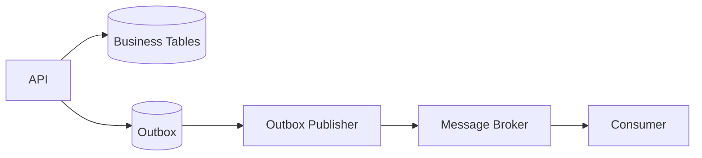

# Daily Knowledge Sharing — 2026-09-07

## Today’s Topics

1. Nullable Reference Types trong C#: biến nullability thành contract thay vì comment
2. ASP.NET Core graceful shutdown: request draining, CancellationToken và shutdown budget
3. EF Core Change Tracker: entity states, DetectChanges và chi phí ẩn của tracking
4. SQL composite index: column order, selectivity, covering và khi index không được dùng
5. PostgreSQL MVCC: vì sao reader và writer thường không block nhau như bạn tưởng
6. Outbox Pattern: nối transaction database với messaging mà không cần distributed transaction
7. Azure App Service deployment slots: warm-up, swap và rollback an toàn hơn
8. Docker multi-stage builds: image layers, cache và giảm attack surface
9. Core Web Vitals: LCP, INP, CLS dưới góc nhìn backend/full-stack engineer
10. Playwright E2E: test đúng boundary và giảm flaky test trong CI

---

# 1. Nullable Reference Types trong C#: biến nullability thành contract thay vì comment

## 1. What is it?

Nullable Reference Types (NRT) là hệ thống static analysis của C# giúp compiler phân biệt reference được kỳ vọng là non-null với reference có thể null. `string` và `string?` không tạo ra hai runtime types khác nhau; metadata và compiler annotations được dùng để kiểm tra contract ở compile time.

Mental model quan trọng: NRT không “ngăn null tồn tại”. Nó giúp codebase biểu diễn ý định rõ hơn để compiler phát hiện các đường đi mà null có thể lọt tới nơi không chấp nhận null.

## 2. Why does it exist?

Trong legacy C#, mọi reference type đều có thể null về mặt runtime nhưng signature lại không nói rõ. API như:

```csharp
Customer FindCustomer(Guid id)
```

không cho caller biết method có thể trả null hay không. Kết quả là null semantics nằm trong documentation, convention hoặc tribal knowledge.

NRT biến nullability thành một phần của contract, giảm lỗi `NullReferenceException` và làm code review chính xác hơn.

## 3. How does it work?

Khi nullable analysis được bật, compiler theo dõi null-state của variable qua control flow.

```csharp
string? name = GetName();

if (name is not null)
{
    Console.WriteLine(name.Length); // compiler biết name non-null tại đây
}
```

Các annotations như `?`, `!`, `[NotNull]`, `[MaybeNull]` giúp mô tả contract khi compiler không suy luận được đầy đủ.

`!` chỉ tắt warning; nó không thực hiện runtime null check.

## 4. Practical implementation

DTO rõ contract:

```csharp
public sealed record CreateEmployeeRequest(
    string FirstName,
    string LastName,
    string? MiddleName,
    string? ManagerId);
```

Service contract:

```csharp
public async Task<Employee?> FindAsync(
    Guid id,
    CancellationToken ct)
{
    return await db.Employees
        .AsNoTracking()
        .SingleOrDefaultAsync(x => x.Id == id, ct);
}
```

Caller buộc phải xử lý null path:

```csharp
var employee = await service.FindAsync(id, ct);

if (employee is null)
    return Results.NotFound();

return Results.Ok(employee);
```

## 5. Real production scenario

Một integration trả `customer.phone` đôi lúc không có. Nếu model dùng `string` chỉ để tránh warning, application có thể crash ở mapping hoặc serialization. Nếu model dùng `string?`, null semantics được đẩy lên contract và caller phải quyết định fallback, validation hoặc rejection.

## 6. Failure scenario & troubleshooting

**Symptom**  
Production vẫn xuất hiện `NullReferenceException` dù project bật NRT.

**Evidence**  
Code có nhiều `!`, deserialization từ external API, reflection hoặc legacy libraries không có nullable metadata.

**Hypothesis**  
Static contract bị bypass ở trust boundary.

**Diagnosis**  
Tìm `!`, external DTOs, deserialization path và libraries chưa annotate nullability.

**Fix**  
Validate dữ liệu tại boundary, dùng explicit guard clauses và model external contract đúng thực tế.

**Verification**  
Thêm integration tests cho missing/null fields và đảm bảo static warnings không bị suppression hàng loạt.

## 7. Common mistakes

* Dùng `!` để “fix compiler”.
* Khai báo mọi thứ `?` để hết warning.
* Tin rằng NRT là runtime validation.
* Không model nullability đúng với database schema hoặc external API.
* Migration codebase lớn bằng cách bật warnings thành errors ngay lập tức mà không có rollout strategy.

## 8. Alternatives

Guard clauses, validation libraries và Option/Maybe types có thể bổ sung. NRT phù hợp cho null semantics cơ bản; Option types hữu ích hơn khi muốn buộc caller xử lý absence như một domain concept rõ ràng.

## 9. Trade-offs

### Advantages

* Contract rõ hơn.
* Compiler hỗ trợ phát hiện lỗi sớm.
* Refactoring an toàn hơn.

### Costs / Risks

* Legacy migration có thể tạo rất nhiều warnings.
* External libraries có annotations không chính xác.
* Overuse `!` tạo false confidence.

## 10. Junior → Middle → Senior → Technical Lead

### Junior

Hiểu `string` và `string?` biểu diễn hai kỳ vọng contract khác nhau.

### Middle

Biết model DTO, database result và external contract đúng nullability.

### Senior

Biết xử lý trust boundary, legacy interop, serializer behavior và suppression có chủ đích.

### Technical Lead / Architect

Đặt migration strategy cho codebase lớn, xác định nơi nullable warnings phải là errors và nơi cần compatibility compromise.

## 11. Key takeaway

* NRT là static contract, không phải runtime null protection.
* `!` không làm object non-null.
* Nullability phải phản ánh đúng dữ liệu thực tế tại system boundary.

---

# 2. ASP.NET Core graceful shutdown: request draining, CancellationToken và shutdown budget

## 1. What is it?

Graceful shutdown là quá trình application ngừng nhận workload mới, cho workload đang chạy cơ hội hoàn tất hoặc dừng an toàn, sau đó giải phóng resources trước khi process bị terminate.

Trong ASP.NET Core, shutdown liên quan đến host lifetime, web server, background services, `CancellationToken` và timeout của hosting environment.

## 2. Why does it exist?

Production application thường bị restart vì deployment, scale-in, node maintenance hoặc platform recycle. Nếu process biến mất ngay lập tức:

* request đang xử lý có thể bị cắt giữa chừng;
* file upload có thể hỏng;
* background job có thể để lại partial state;
* queue message có thể bị mất lock rồi được xử lý lại.

Graceful shutdown giảm blast radius của lifecycle events bình thường.

## 3. How does it work?

```text
Platform sends termination signal
        |
        v
Host begins stopping
        |
        +--> stop accepting new work
        +--> cancellation signaled
        +--> in-flight work drains
        +--> services dispose
        |
        v
Process exits
```

Điểm quan trọng là shutdown budget hữu hạn. Nếu platform cho 30 giây nhưng application cần 2 phút để finish job, graceful shutdown không thể cứu thiết kế đó.

## 4. Practical implementation

Background worker:

```csharp
public sealed class BillingWorker(
    ILogger<BillingWorker> logger) : BackgroundService
{
    protected override async Task ExecuteAsync(CancellationToken stoppingToken)
    {
        while (!stoppingToken.IsCancellationRequested)
        {
            try
            {
                await ProcessNextBatchAsync(stoppingToken);
            }
            catch (OperationCanceledException)
                when (stoppingToken.IsCancellationRequested)
            {
                logger.LogInformation("Shutdown requested");
                break;
            }
        }
    }
}
```

Request path cũng nên truyền token:

```csharp
app.MapGet("/reports/{id:guid}", async (
    Guid id,
    ReportDbContext db,
    CancellationToken ct) =>
{
    var report = await db.Reports
        .AsNoTracking()
        .SingleOrDefaultAsync(x => x.Id == id, ct);

    return report is null ? Results.NotFound() : Results.Ok(report);
});
```

## 5. Real production scenario

Azure App Service deploy version mới. Instance cũ bắt đầu shutdown trong khi một request đang export report lớn. Nếu code không truyền cancellation, database query và file generation vẫn chạy cho tới khi process bị kill. User thấy connection reset và server lãng phí tài nguyên.

Với cooperative cancellation, operation có thể dừng tại safe boundary và cleanup temporary file.

## 6. Failure scenario & troubleshooting

**Symptom**  
Deployment gây spike 5xx hoặc queue duplicate processing.

**Evidence**  
Logs kết thúc đột ngột, message lock lost, request traces bị cắt.

**Hypothesis**  
Workload không tôn trọng shutdown signal hoặc shutdown budget quá ngắn.

**Diagnosis**  
Kiểm tra `CancellationToken` propagation, host shutdown logs và duration của long-running operations.

**Fix**  
Chia work thành checkpoint nhỏ hơn, dùng idempotency, queue cho long-running work và propagate cancellation.

**Verification**  
Chủ động restart instance trong staging khi đang có traffic/job và xác nhận không tạo partial state.

## 7. Common mistakes

* Bắt `OperationCanceledException` rồi log Error như incident.
* Không truyền cancellation xuống EF Core/HTTP calls.
* Giữ job 10 phút trong web process và kỳ vọng graceful shutdown hoàn tất.
* Shutdown hook thực hiện network call không timeout.
* Không thiết kế duplicate-safe processing.

## 8. Alternatives

Long-running work nên chuyển sang Worker Service, queue consumer hoặc Azure Functions tùy workload. Graceful shutdown vẫn cần, nhưng workload boundary phù hợp quan trọng hơn.

## 9. Trade-offs

### Advantages

* Deployment và scale-in ổn định hơn.
* Giảm partial work.
* Tốt cho resource cleanup.

### Costs / Risks

* Cooperative cancellation làm code path phức tạp hơn.
* Không đảm bảo work luôn hoàn tất.
* Shutdown timeout là constraint ngoài application.

## 10. Junior → Middle → Senior → Technical Lead

### Junior

Hiểu application có thể bị shutdown bất kỳ lúc nào trong production.

### Middle

Biết propagate `CancellationToken` và cleanup resources.

### Senior

Thiết kế idempotent recovery và phân biệt request work với durable background work.

### Technical Lead / Architect

Xác định shutdown budget, workload placement và operational behavior trong deploy/scale-in.

## 11. Key takeaway

* Graceful shutdown là best-effort, không phải guarantee.
* Cancellation phải truyền xuyên call chain.
* Long-running durable work không nên phụ thuộc lifetime của web request/process.

---

# 3. EF Core Change Tracker: entity states, DetectChanges và chi phí ẩn của tracking

## 1. What is it?

EF Core Change Tracker giữ thông tin về entities được `DbContext` theo dõi và state của chúng: `Added`, `Modified`, `Deleted`, `Unchanged`, `Detached`.

Tracking cho phép EF Core biết cần phát sinh `INSERT`, `UPDATE`, `DELETE` nào khi gọi `SaveChanges`.

## 2. Why does it exist?

Object graph trong memory không tự biết cần đồng bộ thế nào xuống database. Change Tracker đóng vai trò Unit of Work state manager: theo dõi entity identity, original values và modifications.

Không có tracking, developer phải tự quản lý mọi thay đổi và SQL update.

## 3. How does it work?

```text
Query entity
   |
   v
Tracked as Unchanged
   |
Modify property
   |
DetectChanges
   |
   v
Modified
   |
SaveChanges
   |
   v
UPDATE generated
```

EF Core cũng có identity resolution: cùng một primary key trong cùng context thường được map tới cùng tracked instance.

## 4. Practical implementation

Write use case:

```csharp
var order = await db.Orders
    .SingleAsync(x => x.Id == id, ct);

order.MarkPaid(DateTimeOffset.UtcNow);

await db.SaveChangesAsync(ct);
```

Read-only query:

```csharp
var orders = await db.Orders
    .AsNoTracking()
    .Where(x => x.Status == OrderStatus.Paid)
    .Select(x => new OrderListItem(x.Id, x.Total))
    .ToListAsync(ct);
```

## 5. Real production scenario

Batch import load 50.000 entities vào một `DbContext`, sửa từng entity rồi cuối cùng `SaveChanges`. Context giữ toàn bộ graph, DetectChanges cost tăng và memory phình lớn.

Giải pháp thường là xử lý theo batch nhỏ, context lifetime ngắn hơn hoặc dùng bulk operations phù hợp.

## 6. Failure scenario & troubleshooting

**Symptom**  
Batch job càng chạy càng chậm và memory tăng.

**Evidence**  
Số tracked entities tăng liên tục; CPU time đáng kể trong change detection.

**Hypothesis**  
`DbContext` sống quá lâu và tracking graph quá lớn.

**Diagnosis**  
Kiểm tra `ChangeTracker.Entries().Count()` và profiling.

**Fix**  
Batching, `AsNoTracking` cho reads, context per batch, projection hoặc bulk API.

**Verification**  
Đo memory, batch duration và tracked entity count sau thay đổi.

## 7. Common mistakes

* Dùng tracking cho mọi read query.
* Reuse một `DbContext` trong background worker hàng giờ.
* Attach duplicate instances cùng key.
* Gọi `Update` toàn graph khiến mọi property bị marked modified.
* Dùng `AsNoTracking` cho flow cần change persistence rồi ngạc nhiên vì `SaveChanges` không làm gì.

## 8. Alternatives

Dapper/raw SQL thích hợp cho read-heavy hoặc bulk paths. `ExecuteUpdateAsync`/`ExecuteDeleteAsync` có thể tránh materialize entities khi update/delete theo set.

## 9. Trade-offs

### Advantages

* Unit of Work tự nhiên.
* Domain entity mutation dễ biểu đạt.
* Optimistic concurrency và relationship fix-up tích hợp tốt.

### Costs / Risks

* Memory overhead.
* DetectChanges cost.
* Long-lived context tạo stale state và concurrency issues.

## 10. Junior → Middle → Senior → Technical Lead

### Junior

Hiểu entity state và `SaveChanges`.

### Middle

Biết khi nào dùng tracking vs `AsNoTracking`.

### Senior

Hiểu identity resolution, long-lived context risks và batching behavior.

### Technical Lead / Architect

Quyết định persistence pattern cho transactional writes, high-volume batches và read models.

## 11. Key takeaway

* Tracking là tính năng có chi phí.
* `DbContext` nên có lifetime ngắn và rõ boundary.
* Read-only workload thường không cần tracking.

---

# 4. SQL composite index: column order, selectivity, covering và khi index không được dùng

## 1. What is it?

Composite index là index gồm nhiều columns. Thứ tự columns quyết định access pattern mà database có thể seek hiệu quả.

Ví dụ:

```sql
CREATE INDEX IX_Orders_TenantId_Status_CreatedAt
ON Orders (TenantId, Status, CreatedAt DESC)
INCLUDE (TotalAmount);
```

Index này không “tối ưu mọi query có ba cột đó”. Order của key columns rất quan trọng.

## 2. Why does it exist?

Enterprise queries thường filter theo nhiều dimensions. Một index đơn trên từng column không luôn đủ vì optimizer có thể cần đọc nhiều rows rồi filter tiếp.

Composite index cho phép dữ liệu được tổ chức theo access pattern cụ thể.

## 3. How does it work?

Với B-tree index `(TenantId, Status, CreatedAt)`, database có thể seek tốt cho:

```sql
WHERE TenantId = @tenantId
  AND Status = @status
ORDER BY CreatedAt DESC
```

Nhưng query chỉ filter `Status` có thể không tận dụng hiệu quả phần đầu index vì leading key là `TenantId`.

## 4. Practical implementation

Query:

```sql
SELECT Id, CreatedAt, TotalAmount
FROM Orders
WHERE TenantId = @TenantId
  AND Status = @Status
  AND CreatedAt >= @From
ORDER BY CreatedAt DESC;
```

Index hợp lý:

```sql
CREATE INDEX IX_Orders_Tenant_Status_Created
ON Orders (TenantId, Status, CreatedAt DESC)
INCLUDE (Id, TotalAmount);
```

`INCLUDE` có thể giúp query được cover mà không làm key rộng hơn cần thiết.

## 5. Real production scenario

SaaS application có bảng Orders hàng trăm triệu rows. Mọi query đều scope theo `TenantId`, sau đó filter `Status` và date range. Index bắt đầu bằng `CreatedAt` có thể khiến database đọc dữ liệu của nhiều tenants.

Đặt `TenantId` đầu phù hợp access pattern và isolation dimension hơn.

## 6. Failure scenario & troubleshooting

**Symptom**  
Đã “có index” nhưng query vẫn scan và p95 cao.

**Evidence**  
Execution plan cho thấy Index Scan/Key Lookup lớn.

**Hypothesis**  
Column order hoặc covering không phù hợp query shape.

**Diagnosis**  
Đọc actual execution plan, row estimates, logical reads và predicates.

**Fix**  
Thiết kế lại index dựa trên equality predicates, range predicates, sort và selected columns.

**Verification**  
So sánh logical reads, CPU và duration trước/sau.

## 7. Common mistakes

* Tạo index cho từng column rồi nghĩ optimizer luôn kết hợp tối ưu.
* Đặt range column đầu trước equality columns mà không có lý do.
* Include quá nhiều columns làm index phình lớn.
* Bỏ qua write amplification.
* Không kiểm tra statistics và cardinality estimates.

## 8. Alternatives

Filtered/partial indexes phù hợp subset dữ liệu. Columnstore index phù hợp analytic workloads. Query redesign hoặc data model change đôi khi tốt hơn thêm index.

## 9. Trade-offs

### Advantages

* Giảm I/O đáng kể cho đúng access pattern.
* Có thể hỗ trợ sorting và covering.

### Costs / Risks

* Tăng storage.
* Tăng cost INSERT/UPDATE/DELETE.
* Index thừa làm maintenance và optimizer choices phức tạp hơn.

## 10. Junior → Middle → Senior → Technical Lead

### Junior

Hiểu index không chỉ là “có hoặc không”.

### Middle

Biết đọc key order và query predicates.

### Senior

Đánh giá selectivity, logical reads, covering, statistics và write cost.

### Technical Lead / Architect

Thiết kế indexing strategy theo workload thật, tenant model và growth pattern.

## 11. Key takeaway

* Composite index phải phục vụ access pattern cụ thể.
* Column order rất quan trọng.
* Mọi index đều có write/storage cost.

---

# 5. PostgreSQL MVCC: vì sao reader và writer thường không block nhau như bạn tưởng

## 1. What is it?

MVCC (Multi-Version Concurrency Control) cho phép PostgreSQL giữ nhiều version của row để transaction có thể nhìn snapshot phù hợp với isolation semantics.

Thay vì reader luôn khóa writer hoặc ngược lại, transaction có thể đọc version cũ trong khi transaction khác đang tạo version mới.

## 2. Why does it exist?

Nếu mọi read đều cần shared lock chặn write, throughput giảm mạnh dưới concurrency. MVCC giảm read/write blocking bằng cách tách visibility khỏi việc overwrite row tại chỗ.

## 3. How does it work?

Khi UPDATE một row, PostgreSQL tạo row version mới; version cũ vẫn tồn tại cho transaction có snapshot cần nó.

```text
Transaction A snapshot -> Row v1
Transaction B UPDATE   -> Row v2
Transaction A vẫn thấy -> Row v1
Transaction mới thấy   -> Row v2
```

Dead tuples sau đó cần VACUUM xử lý để reclaim space.

## 4. Practical implementation

Transaction thông thường:

```sql
BEGIN;

SELECT balance
FROM accounts
WHERE id = 42;

UPDATE accounts
SET balance = balance - 100
WHERE id = 42;

COMMIT;
```

Khi cần explicit row lock:

```sql
SELECT id, status
FROM jobs
WHERE status = 'pending'
ORDER BY created_at
FOR UPDATE SKIP LOCKED
LIMIT 10;
```

Pattern này hữu ích cho competing workers.

## 5. Real production scenario

Queue-like table có nhiều worker claim jobs. Nếu worker dùng `FOR UPDATE` không có `SKIP LOCKED`, workers có thể xếp hàng chờ cùng rows. Với `SKIP LOCKED`, worker khác bỏ qua rows đang được lock và claim work khác.

## 6. Failure scenario & troubleshooting

**Symptom**  
Database storage tăng, query chậm dần dù row count không tăng nhiều.

**Evidence**  
Dead tuples lớn, long-running transactions tồn tại lâu, autovacuum không reclaim được hiệu quả.

**Hypothesis**  
MVCC bloat do transaction giữ snapshot quá lâu.

**Diagnosis**  
Kiểm tra active transactions, vacuum stats và table bloat indicators.

**Fix**  
Rút ngắn transactions, tránh idle-in-transaction, tune vacuum khi cần.

**Verification**  
Theo dõi dead tuples, table size và query latency.

## 7. Common mistakes

* Nghĩ MVCC nghĩa là “không bao giờ có lock”.
* Giữ transaction mở trong lúc gọi external API.
* Bỏ qua autovacuum.
* Dùng high isolation mà không hiểu retry semantics.
* Dùng database transaction làm distributed workflow boundary.

## 8. Alternatives

SQL Server có locking và row-versioning options với semantics khác. Pessimistic locking vẫn cần khi business flow cần exclusive claim rõ ràng.

## 9. Trade-offs

### Advantages

* Read concurrency tốt.
* Snapshot semantics mạnh.
* Giảm read/write blocking trong nhiều workload.

### Costs / Risks

* Dead tuple/bloat.
* Vacuum trở thành operational concern.
* Long-running transactions gây hậu quả lớn.

## 10. Junior → Middle → Senior → Technical Lead

### Junior

Hiểu một row có thể có nhiều version theo transaction visibility.

### Middle

Biết transaction scope và `FOR UPDATE` khi cần.

### Senior

Hiểu bloat, vacuum, lock contention và isolation behavior.

### Technical Lead / Architect

Chọn transaction patterns dựa trên concurrency, workload và operational capacity.

## 11. Key takeaway

* MVCC giảm blocking nhưng không loại bỏ locking.
* Long-running transactions là rủi ro lớn.
* Vacuum là một phần của runtime behavior, không phải maintenance trivia.

---

# 6. Outbox Pattern: nối transaction database với messaging mà không cần distributed transaction

## 1. What is it?

Outbox Pattern lưu business state change và event/message cần publish trong cùng một local database transaction. Một publisher riêng đọc outbox và gửi message ra broker sau đó.

Mục tiêu là tránh dual-write inconsistency giữa database và message broker.

## 2. Why does it exist?

Flow ngây thơ:

```text
Save database
Publish message
```

có failure window: database commit thành công nhưng publish thất bại. Nếu đảo thứ tự, message có thể được publish nhưng database rollback.

Distributed transaction giữa database và broker thường không khả dụng hoặc quá phức tạp.

## 3. How does it work?



Business change và outbox row commit cùng transaction. Publisher retry cho tới khi publish thành công.

## 4. Practical implementation

Trong EF Core transaction:

```csharp
await using var tx = await db.Database.BeginTransactionAsync(ct);

order.MarkPaid();

db.OutboxMessages.Add(new OutboxMessage
{
    Id = Guid.NewGuid(),
    Type = "OrderPaid",
    Payload = JsonSerializer.Serialize(new { order.Id }),
    OccurredAtUtc = DateTimeOffset.UtcNow
});

await db.SaveChangesAsync(ct);
await tx.CommitAsync(ct);
```

Publisher:

```csharp
var batch = await db.OutboxMessages
    .Where(x => x.ProcessedAtUtc == null)
    .OrderBy(x => x.OccurredAtUtc)
    .Take(100)
    .ToListAsync(ct);
```

Sau publish cần mark processed với concurrency-safe strategy.

## 5. Real production scenario

Order payment thành công phải trigger invoice và notification. Nếu publish trực tiếp sau `SaveChanges`, broker outage vài phút có thể khiến order đã paid nhưng downstream không bao giờ biết.

Outbox giữ event durable trong database để publisher gửi lại khi broker recover.

## 6. Failure scenario & troubleshooting

**Symptom**  
Outbox backlog tăng liên tục.

**Evidence**  
Rows unprocessed tăng, broker latency hoặc publisher error rate cao.

**Hypothesis**  
Publisher bị degraded hoặc downstream broker unavailable.

**Diagnosis**  
Theo dõi backlog age, publish attempts và broker health.

**Fix**  
Retry có backoff, bounded batch, alert backlog age và repair poison messages.

**Verification**  
Sau recovery backlog quay về baseline mà không mất business events.

## 7. Common mistakes

* Nghĩ Outbox đảm bảo exactly-once end-to-end.
* Consumer không idempotent.
* Delete outbox row ngay khi publish mà không có audit/retention strategy.
* Publisher chạy multi-instance nhưng claim rows không concurrency-safe.
* Payload giữ schema nội bộ không versioning.

## 8. Alternatives

Nếu operation không cần messaging reliability cao, synchronous API call có thể đơn giản hơn. Change Data Capture có thể publish database changes mà không cần explicit outbox trong một số architecture.

## 9. Trade-offs

### Advantages

* Loại bỏ dual-write gap chính.
* Không cần distributed transaction.
* Retry durable.

### Costs / Risks

* Eventual consistency.
* Thêm outbox table, publisher và monitoring.
* Duplicate delivery vẫn có thể xảy ra.

## 10. Junior → Middle → Senior → Technical Lead

### Junior

Hiểu database commit và message publish là hai systems độc lập.

### Middle

Implement outbox transaction và publisher cơ bản.

### Senior

Thiết kế idempotency, concurrency claim, retry và backlog observability.

### Technical Lead / Architect

Quyết định khi nào Outbox đáng complexity và event contract thuộc bounded context nào.

## 11. Key takeaway

* Outbox giải quyết dual-write consistency, không tạo exactly-once magic.
* Consumer vẫn phải idempotent.
* Backlog age phải là production signal quan trọng.

---

# 7. Azure App Service deployment slots: warm-up, swap và rollback an toàn hơn

## 1. What is it?

Deployment slots cho phép chạy nhiều deployment environments trong cùng App Service, ví dụ `production` và `staging`, rồi swap traffic/configuration giữa chúng.

Slot giúp tách deployment khỏi việc ngay lập tức thay production instance.

## 2. Why does it exist?

Deploy trực tiếp lên production có thể làm users gặp cold start, missing dependencies hoặc configuration mismatch. Slot cho phép version mới start và được kiểm tra trước khi nhận production traffic.

## 3. How does it work?

```text
Build artifact
   |
   v
Deploy to staging slot
   |
   +--> warm-up
   +--> health validation
   |
   v
Swap staging <-> production
   |
   v
Monitor
```

Một số settings được mark slot-specific để không swap, ví dụ secret hoặc endpoint theo environment.

## 4. Practical implementation

Pipeline logic khái niệm:

```text
commit
 -> build
 -> test
 -> artifact
 -> deploy staging slot
 -> health check
 -> smoke test
 -> swap
 -> production verification
```

Application nên có health endpoint:

```csharp
builder.Services.AddHealthChecks()
    .AddSqlServer(connectionString);

app.MapHealthChecks("/health/ready");
```

## 5. Real production scenario

CMS release cần warm caches và initialize Optimizely modules. Deploy trực tiếp làm request đầu tiên chậm 20 giây. Với staging slot, warm-up xảy ra trước swap nên production users ít chịu cold-start latency hơn.

## 6. Failure scenario & troubleshooting

**Symptom**  
Swap xong application trả 500 vì database/config mismatch.

**Evidence**  
App starts nhưng health check dependency fail; slot settings khác production expectation.

**Hypothesis**  
Configuration không được phân loại đúng slot-specific hoặc migration chưa backward compatible.

**Diagnosis**  
So sánh environment settings, connection, secret references và migration state.

**Fix**  
Dùng slot settings đúng, Expand/Contract migration và pre-swap validation.

**Verification**  
Smoke test sau swap và thực hiện swap-back rehearsal.

## 7. Common mistakes

* Coi slot swap là zero-risk deployment.
* Database migration breaking chạy trước khi old code ngừng phục vụ.
* Không warm application.
* Không phân biệt slot settings với swappable settings.
* Không monitor ngay sau swap.

## 8. Alternatives

Blue-Green ở infrastructure level, Canary deployment hoặc Kubernetes rolling update cung cấp control khác. Slot phù hợp App Service vì đơn giản và tích hợp platform.

## 9. Trade-offs

### Advantages

* Giảm cold start exposure.
* Rollback nhanh hơn bằng swap-back.
* Dễ smoke-test trước production traffic.

### Costs / Risks

* Không giải quyết database compatibility tự động.
* Slot configuration cần quản trị cẩn thận.
* Có chi phí platform tùy plan.

## 10. Junior → Middle → Senior → Technical Lead

### Junior

Hiểu staging slot là một deployment instance riêng.

### Middle

Biết deploy, health-check và swap.

### Senior

Thiết kế backward-compatible config/database migration và rollback.

### Technical Lead / Architect

Chọn deployment strategy dựa trên blast radius, rollback RTO và platform capabilities.

## 11. Key takeaway

* Slot giúp deployment an toàn hơn nhưng không giải quyết schema compatibility.
* Warm-up và health validation phải diễn ra trước swap.
* Rollback phải được thiết kế và rehearsal.

---

# 8. Docker multi-stage builds: image layers, cache và giảm attack surface

## 1. What is it?

Docker image gồm các immutable layers. Multi-stage build cho phép dùng một stage có SDK/build tools để compile, sau đó copy chỉ runtime artifacts sang image cuối nhỏ hơn.

## 2. Why does it exist?

Nếu deploy cả .NET SDK, source code và build tools vào production image, image lớn hơn, pull chậm hơn và attack surface rộng hơn.

Multi-stage build tách build environment khỏi runtime environment.

## 3. How does it work?

```dockerfile
FROM mcr.microsoft.com/dotnet/sdk:10.0 AS build
WORKDIR /src

COPY MyApi.csproj .
RUN dotnet restore

COPY . .
RUN dotnet publish -c Release -o /app/publish --no-restore

FROM mcr.microsoft.com/dotnet/aspnet:10.0 AS runtime
WORKDIR /app
COPY --from=build /app/publish .
ENTRYPOINT ["dotnet", "MyApi.dll"]
```

Docker cache reuse phụ thuộc layer inputs. Copy project file và restore trước copy toàn source giúp restore layer được cache khi dependencies không đổi.

## 4. Practical implementation

Thêm `.dockerignore`:

```text
**/bin
**/obj
.git
.vscode
TestResults
```

Không copy secrets vào image. Runtime config nên đến từ environment, secret store hoặc orchestrator.

## 5. Real production scenario

CI pipeline build image 2 GB vì copy toàn repo và dùng SDK image làm final. Mỗi deployment AKS phải pull image lớn, rollout chậm và node network pressure tăng.

Multi-stage giảm image còn vài trăm MB hoặc thấp hơn tùy runtime strategy.

## 6. Failure scenario & troubleshooting

**Symptom**  
Docker build chậm dù chỉ sửa một `.cs` file.

**Evidence**  
`dotnet restore` chạy lại mỗi build.

**Hypothesis**  
Dockerfile layer ordering làm cache invalidation quá sớm.

**Diagnosis**  
Review build output và layer cache hits.

**Fix**  
Copy dependency manifests trước, restore, sau đó mới copy source.

**Verification**  
Build lần hai sau small source change và đo build duration.

## 7. Common mistakes

* Dùng SDK image làm production image.
* Copy `.git`, test output và secrets.
* Chạy container bằng root khi không cần.
* Pin image tag quá lỏng mà không quản lý patch updates.
* Đặt `COPY . .` trước restore.

## 8. Alternatives

Native AOT hoặc chiseled/minimal images có thể giảm footprint hơn nhưng tăng compatibility considerations. VM/IIS deployment có operational model khác và không hưởng image immutability.

## 9. Trade-offs

### Advantages

* Image nhỏ hơn.
* Build cache tốt hơn.
* Attack surface thấp hơn.

### Costs / Risks

* Dockerfile phức tạp hơn.
* Minimal images khó debug trực tiếp vì thiếu tools.
* Base image lifecycle cần quản lý.

## 10. Junior → Middle → Senior → Technical Lead

### Junior

Hiểu image gồm layers và container không phải VM.

### Middle

Biết viết multi-stage Dockerfile và `.dockerignore`.

### Senior

Tối ưu cache, security posture, user permissions và image scanning.

### Technical Lead / Architect

Đặt container baseline, base image policy và supply-chain controls cho tổ chức.

## 11. Key takeaway

* Build tools không nên nằm trong production image nếu không cần.
* Layer order ảnh hưởng trực tiếp build cache.
* Image nhỏ hơn thường cải thiện cả deployment speed lẫn security posture.

---

# 9. Core Web Vitals: LCP, INP, CLS dưới góc nhìn backend/full-stack engineer

## 1. What is it?

Core Web Vitals là nhóm user-centric metrics phản ánh loading, responsiveness và visual stability.

* LCP: thời gian render largest content element đáng kể.
* INP: responsiveness của page đối với interactions.
* CLS: mức layout shift không mong muốn.

Backend engineer không trực tiếp kiểm soát tất cả, nhưng TTFB, API latency, CDN, payload size và cache strategy ảnh hưởng mạnh tới chúng.

## 2. Why does it exist?

Server response time tốt không đảm bảo page nhanh. User trải nghiệm toàn chuỗi:

```text
DNS -> CDN -> server -> HTML -> JS/CSS -> API -> render -> interaction
```

Core Web Vitals ép team nhìn end-to-end behavior thay vì chỉ backend duration.

## 3. How does it work?

LCP có thể bị kéo dài bởi:

* TTFB cao;
* hero image lớn;
* render-blocking CSS/JS;
* API dependency cần trước render.

INP thường bị ảnh hưởng bởi long JavaScript tasks hoặc rendering quá nặng.

CLS thường đến từ element không reserve dimensions, font/image/layout thay đổi sau load.

## 4. Practical implementation

Backend headers cho static assets:

```http
Cache-Control: public, max-age=31536000, immutable
Content-Encoding: br
```

Dynamic HTML có thể dùng cache policy khác:

```http
Cache-Control: private, no-cache
```

Đừng cache personalized response public tại CDN.

## 5. Real production scenario

Marketing site dùng Optimizely CMS qua Akamai. Backend p95 180 ms nhưng LCP > 4 giây. Network waterfall cho thấy hero image 4 MB và JS bundle chặn render.

Backend không phải bottleneck chính; “tối ưu API” sẽ không giải quyết user experience.

## 6. Failure scenario & troubleshooting

**Symptom**  
Lighthouse cho LCP xấu sau release.

**Evidence**  
TTFB gần như không đổi, image transfer và render delay tăng.

**Hypothesis**  
Frontend asset regression.

**Diagnosis**  
DevTools waterfall, Lighthouse breakdown, CDN cache status và RUM telemetry.

**Fix**  
Optimize image, preload resource đúng chỗ, giảm render-blocking work.

**Verification**  
Đo lại field/RUM metrics, không chỉ synthetic test.

## 7. Common mistakes

* Chỉ nhìn Lighthouse local một lần.
* Tối ưu backend khi bottleneck nằm ở browser.
* Cache dynamic personalized HTML ở shared CDN.
* Bundle quá lớn nhưng tập trung vào gzip vài KB.
* Không reserve image dimensions gây CLS.

## 8. Alternatives

Synthetic monitoring giúp regression detection; Real User Monitoring phản ánh devices/networks thật. Cả hai bổ sung nhau.

## 9. Trade-offs

### Advantages

* Tập trung vào trải nghiệm người dùng thật.
* Khuyến khích cross-layer optimization.

### Costs / Risks

* Metrics biến động theo device/network.
* Local measurement dễ gây kết luận sai.
* Optimization có thể tăng implementation complexity.

## 10. Junior → Middle → Senior → Technical Lead

### Junior

Hiểu page speed không chỉ là API latency.

### Middle

Biết đọc network waterfall, cache headers và Lighthouse.

### Senior

Correlate backend, CDN, frontend render và RUM data.

### Technical Lead / Architect

Đặt performance budgets và ownership xuyên backend/frontend/CDN/CMS.

## 11. Key takeaway

* Core Web Vitals là end-to-end metrics.
* Đừng tối ưu layer sai.
* Field data và waterfall evidence quan trọng hơn phỏng đoán.

---

# 10. Playwright E2E: test đúng boundary và giảm flaky test trong CI

## 1. What is it?

Playwright là browser automation framework phù hợp end-to-end testing cho các flow cần xác nhận nhiều layers hoạt động cùng nhau: browser, frontend, API, authentication và đôi khi database/integration environment.

E2E test nên bảo vệ critical user journeys, không thay thế unit/integration tests.

## 2. Why does it exist?

Unit test có thể chứng minh từng class đúng nhưng không chứng minh routing, auth, JavaScript, API contract và browser behavior kết nối đúng.

Một vài E2E tests có giá trị cao cho flow như login, checkout, submit timesheet hoặc publish CMS page.

## 3. How does it work?

```text
Browser
  |
  v
UI
  |
  v
API
  |
  v
Services / Database
```

Playwright điều khiển browser thật, chờ DOM/network states và assert observable user behavior.

## 4. Practical implementation

```typescript
import { test, expect } from '@playwright/test';

test('employee submits timesheet', async ({ page }) => {
  await page.goto('/timesheets/current');

  await page.getByRole('button', { name: 'Submit' }).click();

  await expect(page.getByText('Submitted')).toBeVisible();
});
```

Ưu tiên semantic locators như role/label thay vì fragile CSS selectors.

## 5. Real production scenario

Backend contract đổi `status: "Submitted"` thành nested object nhưng frontend deploy riêng chưa update. Unit tests hai repo đều pass do mocks cũ. E2E test trên integration environment fail ngay flow submit timesheet.

## 6. Failure scenario & troubleshooting

**Symptom**  
Test fail ngẫu nhiên trong CI nhưng local pass.

**Evidence**  
Failure liên quan `waitForTimeout(2000)` hoặc shared test data.

**Hypothesis**  
Race condition hoặc test isolation yếu.

**Diagnosis**  
Xem Playwright trace, screenshot, network log và parallel execution behavior.

**Fix**  
Dùng auto-waiting/locator assertions, deterministic fixtures, unique test data và explicit environment reset.

**Verification**  
Run test nhiều lần parallel trong CI mà failure rate về gần zero.

## 7. Common mistakes

* Dùng `waitForTimeout` để che race condition.
* Test mọi validation rule bằng E2E.
* Shared account/data giữa parallel tests.
* CSS selector phụ thuộc DOM implementation detail.
* Mock quá nhiều đến mức E2E không còn test integration thật.

## 8. Alternatives

Unit tests nhanh và phù hợp pure logic. Integration tests phù hợp API/database boundary. Contract tests tốt cho service compatibility. E2E chỉ nên bao phủ journeys mà failure có business impact lớn.

## 9. Trade-offs

### Advantages

* Bảo vệ wiring giữa nhiều layers.
* Phát hiện regression user-visible.
* Browser behavior thật.

### Costs / Risks

* Chậm hơn.
* Environment dependency cao.
* Flakiness nếu test/data không deterministic.

## 10. Junior → Middle → Senior → Technical Lead

### Junior

Hiểu E2E test mô phỏng user journey qua nhiều layers.

### Middle

Viết stable locators và deterministic tests.

### Senior

Thiết kế test isolation, CI diagnostics và phân tầng test strategy.

### Technical Lead / Architect

Quyết định flow nào đáng E2E coverage và giữ test suite đủ nhanh để team vẫn tin tưởng.

## 11. Key takeaway

* E2E test nên ít nhưng giá trị cao.
* Flaky test thường là design problem, không phải “CI không ổn định”.
* Unit + integration + contract + E2E phải bảo vệ các loại risk khác nhau.
