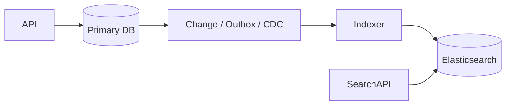

# Daily Knowledge Sharing — 2026-09-07

## Today’s Topics

1. .NET Garbage Collector, generations và Large Object Heap dưới production load
2. ASP.NET Core middleware ordering và toàn bộ request pipeline
3. Policy-based Authorization: claims, requirements và resource-based authorization
4. EF Core SaveChanges, transaction boundary và batching
5. SQL connection pooling: pool exhaustion, timeout và operational diagnosis
6. Redis hot keys, eviction và memory pressure
7. Elasticsearch synchronization: primary database, indexing lag và failure recovery
8. Azure Functions vs Worker Service cho background processing và scheduled work
9. Frontend event loop, Promise và API concurrency trong Vue.js / React.js
10. Incremental modernization: .NET Framework → modern .NET mà không cần big-bang rewrite

---

# 1. .NET Garbage Collector, generations và Large Object Heap dưới production load

## 1. What is it?

Garbage Collector (GC) của .NET quản lý managed memory bằng cách tự động xác định object nào còn reachable và object nào có thể thu hồi. Mental model quan trọng là: GC không “xóa object ngay khi hết dùng”; object sống trên managed heap cho tới khi một GC cycle quyết định thu hồi vùng memory liên quan.

.NET chia object theo generations để tối ưu giả định thực tế rằng phần lớn object sống rất ngắn. Object mới thường vào Gen 0, object sống qua collection có thể được promote lên Gen 1 rồi Gen 2. Large Object Heap (LOH) dùng cho object lớn và có đặc tính collection/compaction khác, nên allocation pattern ở đây có thể gây hậu quả lớn hơn một allocation nhỏ thông thường.

## 2. Why does it exist?

Manual memory management làm tăng đáng kể nguy cơ use-after-free, double free, leak và ownership bug. GC đổi lại bằng một cost khác: runtime phải định kỳ tìm reachable objects, compact heap khi phù hợp và có thể pause application threads.

Nếu application tạo quá nhiều short-lived objects, Gen 0 collections tăng. Nếu object sống lâu hoặc heap lớn, Gen 2 collection đắt hơn. Nếu liên tục tạo large arrays/strings, LOH có thể tăng fragmentation và working set.

## 3. How does it work?

```text
Allocation
   |
   v
Gen 0
   |
   | survives collection
   v
Gen 1
   |
   | survives again
   v
Gen 2
```

GC bắt đầu từ roots như stack references, static fields và GC handles. Nó trace object graph để biết object nào còn reachable. Object unreachable có thể bị reclaim; một số heap segments được compact để giảm fragmentation.

Large objects thường đi vào LOH. Vì large allocations đắt và gây memory pressure nhanh, code upload file, serialization hoặc image processing rất dễ tạo vấn đề nếu copy nhiều lần.

## 4. Practical implementation

Ví dụ một endpoint xấu:

```csharp
public async Task<byte[]> DownloadAsync(Stream source, CancellationToken ct)
{
    using var ms = new MemoryStream();
    await source.CopyToAsync(ms, ct);
    return ms.ToArray();
}
```

Với file 20 MB, code có thể giữ nhiều buffer lớn đồng thời và `ToArray()` lại tạo thêm một copy.

Tốt hơn là stream thẳng tới response hoặc downstream:

```csharp
app.MapGet("/files/{id}", async (
    string id,
    IFileStore store,
    HttpResponse response,
    CancellationToken ct) =>
{
    response.ContentType = "application/octet-stream";
    await using var stream = await store.OpenReadAsync(id, ct);
    await stream.CopyToAsync(response.Body, ct);
});
```

Khi profiling chứng minh buffer allocation là bottleneck, `ArrayPool<T>` có thể hữu ích, nhưng không nên dùng theo thói quen nếu lifecycle phức tạp hơn giá trị đạt được.

## 5. Real production scenario

Một API export report tạo CSV 40–100 MB bằng `StringBuilder`, chuyển thành string, sau đó encode sang `byte[]` rồi mới upload Blob Storage. Mỗi request có thể tạo vài large objects cùng lúc.

Khi 20 exports chạy đồng thời, process memory tăng mạnh, Gen 2 collections xuất hiện thường xuyên hơn và request latency tăng dù CPU business logic không cao.

Giải pháp đúng thường là streaming output từng chunk, giảm intermediate copies và chuyển long-running export sang background processing.

## 6. Failure scenario & troubleshooting

**Symptom** → Memory tăng theo traffic, p99 latency có spike, CPU thỉnh thoảng tăng khi GC chạy.

**Evidence** → GC metrics cho thấy allocation rate cao, Gen 2 collections tăng, LOH size lớn.

**Hypothesis** → Large transient allocations và repeated copying gây GC pressure.

**Diagnosis** → Dùng `dotnet-counters`, profiler hoặc Application Insights metrics để đo allocation rate, GC pause và heap size; sau đó dùng allocation profiler tìm type/path tạo object lớn.

**Fix** → Streaming, giảm intermediate allocations, giới hạn concurrency, reuse buffer khi có bằng chứng rõ ràng.

**Verification** → So sánh allocation rate, working set, GC pause duration và p95/p99 trước/sau.

## 7. Common mistakes

* Tối ưu micro-allocation trước khi đo.
* Gọi `GC.Collect()` để “giải phóng RAM”.
* Đọc toàn bộ file vào `byte[]` khi có thể stream.
* Dùng `ArrayPool<T>` nhưng quên return buffer.
* Giữ object graph lớn trong Singleton cache mà không có eviction policy.
* Chỉ nhìn memory usage mà không xem allocation rate và GC pause.

## 8. Alternatives

* Streaming thay vì buffering toàn bộ payload.
* `Span<T>` / `Memory<T>` khi xử lý memory slice mà không copy.
* `ArrayPool<T>` khi hot path có buffer churn đã được profiling chứng minh.
* Background processing khi workload lớn không cần hoàn thành trong request.

## 9. Trade-offs

### Advantages

GC giúp ownership memory đơn giản và an toàn hơn manual memory management.

### Costs / Risks

* Allocation vẫn có cost.
* Gen 2/LOH pressure có thể gây latency spikes.
* Pooling giảm allocation nhưng tăng complexity và misuse risk.
* Streaming giảm memory nhưng có thể làm error recovery phức tạp hơn.

## 10. Junior → Middle → Senior → Technical Lead

### Junior

Hiểu object không bị “free ngay” và Gen 0/1/2 là lifecycle tối ưu theo tuổi object.

### Middle

Biết tránh unnecessary copies, stream file lớn và đọc basic GC metrics.

### Senior

Biết phân biệt leak thật với high allocation rate, LOH pressure và cache growth; dùng profiler thay vì đoán.

### Technical Lead / Architect

Quyết định workload nào được phép buffer, concurrency limit bao nhiêu, export/file processing có cần background architecture hay không.

## 11. Key takeaway

* Managed memory không có nghĩa allocation là miễn phí.
* LOH và Gen 2 thường liên quan trực tiếp tới tail latency khi workload lớn.
* Đo allocation path trước khi chọn pooling hoặc low-level optimization.

---

# 2. ASP.NET Core middleware ordering và toàn bộ request pipeline

## 1. What is it?

ASP.NET Core middleware pipeline là chuỗi component xử lý request/response theo thứ tự được đăng ký. Mỗi middleware có thể chạy code trước `next()`, gọi middleware tiếp theo và chạy code sau khi downstream hoàn tất.

Mental model quan trọng: middleware ordering tạo ra semantics của application. Authentication, Authorization, exception handling, static files, routing và endpoint execution không phải các bước độc lập có thể đặt tùy ý.

## 2. Why does it exist?

Cross-cutting concerns như logging, exception handling, authentication, CORS, compression hoặc correlation ID phải áp dụng nhất quán cho nhiều endpoints.

Nếu nhét logic này vào controller, duplication tăng và lifecycle trở nên khó kiểm soát. Middleware cho phép xử lý ở một boundary chung của HTTP pipeline.

## 3. How does it work?

```text
Request
  |
  v
Exception Handling
  |
  v
Correlation / Logging
  |
  v
Routing
  |
  v
Authentication
  |
  v
Authorization
  |
  v
Endpoint
  |
  v
Response flows backward
```

Middleware có thể short-circuit. Ví dụ authorization fail có thể trả `403` mà không gọi endpoint.

## 4. Practical implementation

```csharp
var app = builder.Build();

app.UseExceptionHandler();
app.UseHttpsRedirection();
app.UseRouting();
app.UseCors("frontend");
app.UseAuthentication();
app.UseAuthorization();

app.MapControllers();

app.Run();
```

Custom correlation middleware:

```csharp
app.Use(async (context, next) =>
{
    var correlationId = context.Request.Headers["X-Correlation-ID"].FirstOrDefault()
        ?? Guid.NewGuid().ToString("N");

    using (logger.BeginScope(new Dictionary<string, object>
    {
        ["CorrelationId"] = correlationId
    }))
    {
        context.Response.Headers["X-Correlation-ID"] = correlationId;
        await next();
    }
});
```

## 5. Real production scenario

Một API có global exception middleware nhưng được đăng ký sau endpoint mapping theo cấu hình sai. Exceptions ở upstream middleware không đi qua handler mong đợi, Production trả response khác contract và log thiếu correlation context.

Một ví dụ khác: `UseAuthorization()` chạy trước `UseAuthentication()`, khiến authorization policy không thấy authenticated principal đúng cách.

## 6. Failure scenario & troubleshooting

**Symptom** → Endpoint hoạt động local nhưng Production trả `401`, CORS error hoặc response không qua error handler.

**Evidence** → Pipeline order khác environment, middleware logs cho thấy endpoint hoặc auth middleware không được đi qua như dự kiến.

**Hypothesis** → Ordering hoặc short-circuit sai.

**Diagnosis** → Bật structured logs theo middleware boundary, kiểm tra `Program.cs`, endpoint metadata và reverse proxy behavior.

**Fix** → Sắp pipeline theo lifecycle mong muốn và viết integration tests xác minh HTTP behavior thay vì chỉ unit test middleware riêng lẻ.

**Verification** → Test authenticated/unauthenticated request, CORS preflight, exception path và correlation headers.

## 7. Common mistakes

* Coi middleware order là style thay vì behavior.
* Đưa business logic vào middleware.
* Exception handler đặt quá muộn.
* Authentication/Authorization order sai.
* Custom middleware đọc request body nhưng không xử lý buffering đúng.
* Log mọi request body kể cả secrets/token.

## 8. Alternatives

* MVC filters phù hợp concern gắn chặt controller/action lifecycle.
* Endpoint filters phù hợp Minimal APIs.
* Middleware phù hợp HTTP cross-cutting concern ở application boundary.

Không nên biến middleware thành universal hook cho mọi loại logic.

## 9. Trade-offs

### Advantages

* Centralized HTTP concerns.
* Consistent behavior.
* Dễ áp dụng tracing/logging/security ở toàn app.

### Costs / Risks

* Ordering bug có blast radius lớn.
* Middleware nặng làm tăng latency cho mọi request.
* Scope quá rộng dễ dẫn tới logging/security mistakes.

## 10. Junior → Middle → Senior → Technical Lead

### Junior

Hiểu request đi vào theo một chuỗi và response đi ngược chuỗi đó.

### Middle

Biết đặt routing, auth, CORS, exception handling đúng vị trí và viết integration test.

### Senior

Debug short-circuit, reverse proxy interaction và middleware latency.

### Technical Lead / Architect

Quy định concern nào thuộc middleware, filter, application service hay infrastructure; giữ pipeline ngắn, rõ và observable.

## 11. Key takeaway

* Middleware order chính là runtime behavior.
* HTTP cross-cutting concern phù hợp pipeline; business rule thì không.
* Integration test là cách tốt để bảo vệ pipeline semantics.

---

# 3. Policy-based Authorization: claims, requirements và resource-based authorization

## 1. What is it?

Policy-based Authorization trong ASP.NET Core cho phép mô tả quyền truy cập bằng policy gồm requirements và handlers thay vì rải `if (user.Role == ...)` khắp code.

Claims mô tả facts/attributes của identity hoặc token. Requirement mô tả điều kiện authorization. Handler đánh giá requirement trong context cụ thể.

Resource-based authorization đi thêm một bước: quyết định quyền dựa trên chính resource đang thao tác, ví dụ user chỉ được approve timesheet thuộc department họ quản lý.

## 2. Why does it exist?

Role-based checks đơn giản nhưng nhanh chóng không đủ khi rule phụ thuộc tenant, ownership, department, permission hoặc state của resource.

Nếu authorization logic nằm rải trong controller/service, rất dễ có endpoint quên check hoặc logic không nhất quán.

## 3. How does it work?

```text
Authenticated User
      |
      v
ClaimsPrincipal
      |
      v
Authorization Policy
      |
      +--> Requirement A
      +--> Requirement B
      |
      v
Handlers evaluate context/resource
      |
      v
Allow / Deny
```

Authentication trả lời “ai đang gọi”; Authorization trả lời “identity đó được phép làm gì trong context này”.

## 4. Practical implementation

```csharp
builder.Services.AddAuthorization(options =>
{
    options.AddPolicy("timesheets.approve", policy =>
    {
        policy.RequireAuthenticatedUser();
        policy.RequireClaim("permission", "timesheets.approve");
    });
});
```

Resource-based authorization:

```csharp
public sealed class CanEditTimesheetRequirement : IAuthorizationRequirement;

public sealed class CanEditTimesheetHandler
    : AuthorizationHandler<CanEditTimesheetRequirement, Timesheet>
{
    protected override Task HandleRequirementAsync(
        AuthorizationHandlerContext context,
        CanEditTimesheetRequirement requirement,
        Timesheet resource)
    {
        var userId = context.User.FindFirst("sub")?.Value;

        if (resource.EmployeeId == userId && resource.Status == TimesheetStatus.Draft)
        {
            context.Succeed(requirement);
        }

        return Task.CompletedTask;
    }
}
```

## 5. Real production scenario

Trong employee platform, manager có permission `timesheets.approve`, nhưng chỉ được approve nhân viên trong reporting line của mình. Claim-based policy xác minh coarse permission; resource-based handler xác minh ownership/boundary.

Nếu chỉ dùng role `Manager`, một manager có thể vô tình approve timesheet của department khác.

## 6. Failure scenario & troubleshooting

**Symptom** → User có role đúng nhưng vẫn bị 403, hoặc tệ hơn là user truy cập được resource ngoài scope.

**Evidence** → Token có claims khác kỳ vọng; handler không nhận đúng resource; permission taxonomy không đồng nhất giữa Identity Provider và API.

**Hypothesis** → Authorization model không phản ánh business boundary.

**Diagnosis** → Inspect validated claims, policy requirements, handler execution và resource ownership query. Không log raw token.

**Fix** → Tách coarse permission khỏi resource-level rule; bổ sung negative integration tests.

**Verification** → Test đúng cả allow và deny cases theo tenant, owner, role và resource state.

## 7. Common mistakes

* Nhầm authentication với authorization.
* Dùng role cho mọi loại permission.
* Trust client-supplied tenant/resource owner.
* Check authorization chỉ ở UI.
* Reimplement cùng rule ở nhiều endpoints.
* Return 401 khi user đã authenticated nhưng không đủ quyền; thường trường hợp đó là 403.

## 8. Alternatives

* Role-based authorization: đủ cho hệ thống đơn giản.
* Claims/policy: linh hoạt hơn cho permission model.
* External policy engine: hữu ích khi policy rất lớn hoặc cross-service, nhưng thêm operational complexity.

## 9. Trade-offs

### Advantages

* Centralized rules.
* Testable authorization logic.
* Có thể diễn đạt business permission tốt hơn role checks đơn giản.

### Costs / Risks

* Permission model dễ trở nên quá granular.
* Resource-based check có thể cần database access và tăng latency.
* Policy taxonomy cần ownership rõ ràng.

## 10. Junior → Middle → Senior → Technical Lead

### Junior

Phân biệt identity, claim, role và permission.

### Middle

Biết tạo policy/handler và bảo vệ endpoint.

### Senior

Thiết kế resource-based rule, negative tests và tránh authorization bypass.

### Technical Lead / Architect

Thiết kế permission taxonomy, tenant boundary và quyết định rule nằm ở Identity Provider, API hay domain layer.

## 11. Key takeaway

* Role chỉ là một authorization input, không phải toàn bộ model.
* Resource ownership thường cần check server-side.
* Authorization phải được test mạnh ở deny paths, không chỉ happy path.

---

# 4. EF Core SaveChanges, transaction boundary và batching

## 1. What is it?

`SaveChanges` / `SaveChangesAsync` là điểm EF Core phát hiện tracked changes, tạo SQL commands và gửi chúng tới database. Với relational provider, một lần SaveChanges thường tạo transaction để đảm bảo nhóm thay đổi liên quan được commit atomically khi cần.

Transaction boundary là ranh giới mà bên trong các thay đổi phải cùng thành công hoặc cùng rollback.

## 2. Why does it exist?

Business operation thường thay đổi nhiều rows: tạo order, tạo order items, cập nhật trạng thái. Nếu các thay đổi commit từng phần, hệ thống có thể rơi vào inconsistent state.

Ngược lại, transaction quá lớn giữ locks lâu, tăng contention và khiến rollback đắt hơn.

## 3. How does it work?

```text
Tracked Entities
    |
    v
DetectChanges
    |
    v
Generate INSERT/UPDATE/DELETE
    |
    v
Batch commands where provider allows
    |
    v
Database transaction
    |
    +--> Commit
    or
    +--> Rollback
```

`SaveChanges` không biến toàn use case thành distributed transaction. Nếu cùng operation còn gọi external API hoặc publish message, database transaction không tự bảo vệ các side effects đó.

## 4. Practical implementation

```csharp
public async Task ApproveTimesheetAsync(Guid id, CancellationToken ct)
{
    var timesheet = await db.Timesheets
        .SingleAsync(x => x.Id == id, ct);

    timesheet.Approve(clock.UtcNow);

    db.AuditEntries.Add(new AuditEntry
    {
        Id = Guid.NewGuid(),
        EntityId = id,
        Action = "TimesheetApproved"
    });

    await db.SaveChangesAsync(ct);
}
```

Nếu cần nhiều `SaveChanges` trong cùng transaction:

```csharp
await using var tx = await db.Database.BeginTransactionAsync(ct);

await StepOneAsync(ct);
await db.SaveChangesAsync(ct);

await StepTwoAsync(ct);
await db.SaveChangesAsync(ct);

await tx.CommitAsync(ct);
```

## 5. Real production scenario

Import 50.000 records bằng cách gọi `SaveChangesAsync()` sau từng row tạo 50.000 round trips/transactions. Latency cực cao dù SQL từng statement đơn giản.

Cải thiện bằng batching theo chunk, ví dụ 500–2.000 records tùy workload, đo transaction duration và memory của Change Tracker.

## 6. Failure scenario & troubleshooting

**Symptom** → Import chậm, database CPU không quá cao nhưng network round trips rất nhiều.

**Evidence** → Telemetry cho thấy hàng nghìn SaveChanges nhỏ.

**Hypothesis** → Transaction/round-trip granularity quá nhỏ.

**Diagnosis** → Đếm SQL commands, SaveChanges duration và rows per transaction.

**Fix** → Batch theo chunk, dùng bulk API/library khi phù hợp, clear tracker giữa chunks nếu cần.

**Verification** → Đo total runtime, round trips, transaction duration và memory.

## 7. Common mistakes

* Gọi SaveChanges trong loop từng entity.
* Mở transaction quanh network call dài.
* Cho transaction span nhiều business boundaries không cần thiết.
* Giả định Repository tự động tạo transaction semantics tốt hơn DbContext.
* Publish external message rồi mới SaveChanges mà không xử lý failure gap.

## 8. Alternatives

* Direct DbContext cho transaction boundary đơn giản.
* Domain-specific repository nếu aggregate access phức tạp.
* Bulk insert/update khi throughput lớn.
* Outbox Pattern khi cần đồng bộ database state với message publication.

## 9. Trade-offs

### Advantages

* Atomicity cho related database changes.
* Unit of Work behavior có sẵn trong DbContext.
* Batching có thể giảm round trips đáng kể.

### Costs / Risks

* Transaction lớn giữ locks lâu.
* Batch lớn làm memory/tracking tăng.
* External side effects không nằm trong database transaction.

## 10. Junior → Middle → Senior → Technical Lead

### Junior

Hiểu SaveChanges mới là điểm dữ liệu được gửi xuống database.

### Middle

Biết gom thay đổi hợp lý và tránh SaveChanges trong loop.

### Senior

Thiết kế transaction boundary, batch size và xử lý external side effects.

### Technical Lead / Architect

Quyết định khi nào local transaction đủ, khi nào cần Outbox/Saga và ownership của consistency boundary.

## 11. Key takeaway

* DbContext đã mang semantics gần Unit of Work.
* Transaction boundary nên nhỏ nhưng đủ để bảo vệ invariant.
* Batch size phải được đo, không chọn theo cảm giác.

---

# 5. SQL connection pooling: pool exhaustion, timeout và operational diagnosis

## 1. What is it?

Connection pooling giữ các database connections đã mở để tái sử dụng thay vì tạo TCP/login session mới cho mỗi query. Trong .NET, provider như `Microsoft.Data.SqlClient` quản lý pool theo connection string và một số connection attributes.

Mental model: application không “sở hữu vô hạn connection”. Pool là một bounded resource.

## 2. Why does it exist?

Mở physical database connection có cost: network handshake, authentication, session setup. Reuse giúp giảm latency và load.

Nhưng khi request giữ connection quá lâu hoặc concurrency vượt capacity, pool có thể hết connection và request mới phải chờ.

## 3. How does it work?

```text
Request
   |
   v
Open DbConnection
   |
   +--> lấy connection từ pool nếu có
   |
   +--> tạo physical connection nếu pool chưa đạt limit
   |
   v
Execute query
   |
   v
Dispose/Close
   |
   v
Return connection to pool
```

`Close()` thường không đóng physical connection; nó trả connection về pool.

## 4. Practical implementation

```csharp
await using var connection = new SqlConnection(connectionString);
await connection.OpenAsync(ct);

await using var command = connection.CreateCommand();
command.CommandText = "SELECT Id, Name FROM Employees WHERE Id = @id";
command.Parameters.AddWithValue("@id", employeeId);

await using var reader = await command.ExecuteReaderAsync(ct);
```

Với EF Core, scoped DbContext và async query thường quản lý connection lifecycle tốt; vấn đề thường đến từ long-running transaction, slow query hoặc streaming reader giữ connection quá lâu.

## 5. Real production scenario

API có 200 pool connections. Một external API call vô tình được đặt bên trong database transaction:

```text
Begin transaction
 -> query
 -> call external API 8 seconds
 -> update
 -> commit
```

Mỗi request giữ database connection trong 8+ giây dù database không làm việc. 200 concurrent requests đủ làm pool cạn.

## 6. Failure scenario & troubleshooting

**Symptom** → API bắt đầu timeout đồng loạt; database CPU chỉ ở mức vừa phải.

**Evidence** → Exception kiểu timeout while obtaining connection, active connections gần pool limit, slow traces cho thấy transaction duration dài.

**Hypothesis** → Pool exhaustion chứ không phải database CPU saturation.

**Diagnosis** → Correlate connection pool metrics, active requests, query/transaction duration và blocked sessions.

**Fix** → Rút ngắn transaction, loại network call khỏi transaction, tối ưu slow queries, giới hạn concurrency. Chỉ tăng pool size nếu database capacity thực sự chịu được.

**Verification** → Pool wait giảm, timeout biến mất, DB sessions ổn định dưới peak load.

## 7. Common mistakes

* Tăng `Max Pool Size` như fix đầu tiên.
* Không dispose connection/reader.
* Giữ transaction trong lúc gọi external service.
* Streaming quá nhiều result sets đồng thời.
* Tạo nhiều connection strings gần giống nhau làm chia nhỏ pool.
* Chỉ nhìn database CPU.

## 8. Alternatives

Không có “không pooling” nào tốt hơn cho normal web workload. Giải pháp thay thế thực sự là thay đổi concurrency/access pattern: queue workload, batch requests hoặc giảm transaction duration.

## 9. Trade-offs

### Advantages

* Giảm cost mở connection.
* Tăng throughput đáng kể.

### Costs / Risks

* Pool là capacity bottleneck ẩn.
* Pool size quá lớn có thể chuyển bottleneck xuống database.
* Connection giữ lâu gây cascading timeout.

## 10. Junior → Middle → Senior → Technical Lead

### Junior

Hiểu connection phải được dispose và thường được trả lại pool.

### Middle

Biết dùng async APIs và transaction ngắn.

### Senior

Phân biệt pool exhaustion với slow SQL, lock contention và DB saturation.

### Technical Lead / Architect

Định capacity budget giữa app instances, connection pool và database max sessions; quyết định khi nào queue/backpressure cần thiết.

## 11. Key takeaway

* Pooling không tạo ra vô hạn database concurrency.
* Giữ connection lâu có thể phá hệ thống dù query nhanh.
* Tăng pool size chỉ hợp lý khi downstream database còn capacity.

---

# 6. Redis hot keys, eviction và memory pressure

## 1. What is it?

Hot key là cache key nhận lượng truy cập vượt trội so với phần còn lại. Eviction là cơ chế Redis loại bỏ keys khi memory đạt giới hạn theo policy đã cấu hình.

Một Redis cluster có thể đủ tổng memory nhưng vẫn gặp bottleneck nếu traffic tập trung vào một key/node.

## 2. Why does it exist?

Cache thường được đưa vào để giảm database load, nhưng access distribution thực tế hiếm khi đồng đều. Product hot, homepage config hoặc session metadata có thể nhận traffic rất lớn.

Khi memory đầy, Redis phải chọn giữ hay loại dữ liệu. Nếu eviction policy không phù hợp, hit ratio và latency có thể sụp bất ngờ.

## 3. How does it work?

```text
Application
   |
   v
Redis key
   |
   +--> hit
   +--> miss -> database

Memory reaches maxmemory
   |
   v
Eviction policy selects keys
   |
   v
More misses -> more DB load
```

Đây có thể tạo positive feedback loop: eviction → miss → database load → slower refill → more request latency.

## 4. Practical implementation

```csharp
var key = $"product:v2:{productId}";

var cached = await redis.StringGetAsync(key);
if (cached.HasValue)
{
    return JsonSerializer.Deserialize<ProductDto>(cached!)!;
}

var product = await repository.GetAsync(productId, ct);

await redis.StringSetAsync(
    key,
    JsonSerializer.Serialize(product),
    expiry: TimeSpan.FromMinutes(10));
```

Với hot data, cân nhắc TTL jitter và local `IMemoryCache` tầng ngắn nếu consistency cho phép, nhưng phải đo hiệu quả và hiểu invalidation.

## 5. Real production scenario

Homepage CMS block được cache bằng một key duy nhất và nhận hàng chục nghìn reads/second. Redis node chứa key đó trở thành hotspot trong khi các nodes khác nhàn hơn.

Thêm local cache TTL 5–15 giây ở web instances có thể giảm tải Redis mạnh nếu stale data nhỏ được chấp nhận.

## 6. Failure scenario & troubleshooting

**Symptom** → Redis latency tăng nhưng memory/CPU cluster nhìn trung bình chưa quá cao.

**Evidence** → Một node hoặc một key nhận traffic vượt trội; hit ratio giảm sau eviction.

**Hypothesis** → Hot key hoặc memory pressure không đồng đều.

**Diagnosis** → Phân tích command rate, keyspace, node CPU, memory, eviction count và cache hit ratio.

**Fix** → Giảm traffic tới hot key bằng local cache, partition dữ liệu nếu phù hợp, tối ưu payload size, capacity hoặc eviction policy.

**Verification** → Node latency cân bằng hơn, evictions giảm, database fallback không tăng.

## 7. Common mistakes

* Xem Redis như dependency “luôn nhanh”.
* Cache object rất lớn ít được đọc.
* Không đặt memory limit/eviction policy phù hợp.
* Không đo hit ratio.
* Một key chứa huge payload dùng cho mọi request.
* Redis outage làm application fail hoàn toàn dù cache lẽ ra chỉ là optimization.

## 8. Alternatives

* `IMemoryCache`: nhanh và đơn giản cho single-instance/local data.
* CDN/edge cache: tốt hơn Redis cho HTTP/public content.
* Không cache: đúng lựa chọn nếu database đủ nhanh và invalidation cost cao hơn lợi ích.

## 9. Trade-offs

### Advantages

* Giảm database latency/load.
* Shared distributed cache phù hợp multi-instance apps.

### Costs / Risks

* Stale data.
* Hidden critical dependency.
* Memory cost và eviction behavior.
* Hot keys gây skew khó thấy qua average metrics.

## 10. Junior → Middle → Senior → Technical Lead

### Junior

Hiểu cache hit/miss và TTL.

### Middle

Thiết kế key, serialization và fallback.

### Senior

Điều tra hot key, eviction, memory pressure và hit ratio.

### Technical Lead / Architect

Quyết định data nào xứng đáng cache, stale tolerance, ownership invalidation và Redis có cần HA/cluster hay không.

## 11. Key takeaway

* Redis nhanh không có nghĩa access pattern nào cũng an toàn.
* Hit ratio, eviction và per-node skew quan trọng hơn chỉ nhìn total memory.
* Cache phải degrade gracefully khi unavailable nếu business cho phép.

---

# 7. Elasticsearch synchronization: primary database, indexing lag và failure recovery

## 1. What is it?

Trong nhiều hệ thống, SQL database là transactional source of truth còn Elasticsearch là read-optimized search index. Dữ liệu phải được đồng bộ từ primary database sang Elasticsearch.

Điểm cốt lõi: synchronization này thường eventual consistent. Search result có thể chậm hơn transactional state trong một khoảng thời gian.

## 2. Why does it exist?

SQL rất tốt cho transactions, constraints và relational querying. Elasticsearch tối ưu cho full-text search, analyzers, relevance scoring, aggregations và inverted index.

Dùng cùng một store cho cả transactional write và advanced search thường buộc một công nghệ làm việc ngoài điểm mạnh của nó.

## 3. How does it work?



Write thành công ở database trước. Indexer xử lý change và cập nhật Elasticsearch sau. Nếu indexer fail, business transaction không nhất thiết rollback; thay vào đó cần retry/recovery.

## 4. Practical implementation

```csharp
public sealed class SearchIndexOutbox
{
    public Guid Id { get; init; }
    public string EntityType { get; init; } = default!;
    public string EntityId { get; init; } = default!;
    public string Operation { get; init; } = default!;
    public DateTimeOffset CreatedAt { get; init; }
    public DateTimeOffset? ProcessedAt { get; set; }
}
```

Trong cùng DB transaction khi product thay đổi, ghi outbox. Worker đọc unprocessed records, bulk index vào Elasticsearch, rồi mark processed.

## 5. Real production scenario

E-commerce admin đổi product name từ “Road Helmet” thành “Aero Road Helmet”. Product detail page đọc SQL nên thấy tên mới ngay; search page vẫn hiển thị tên cũ trong 2–5 giây.

Điều này có thể chấp nhận nếu product search được định nghĩa là eventually consistent. Nếu business yêu cầu immediate consistency, architecture phải thay đổi hoặc UX phải xử lý rõ ràng.

## 6. Failure scenario & troubleshooting

**Symptom** → Search không thấy sản phẩm mới dù database có dữ liệu.

**Evidence** → Outbox backlog tăng, indexer errors tăng, Elasticsearch cluster health hoặc mapping error xuất hiện.

**Hypothesis** → Synchronization pipeline bị lag/fail.

**Diagnosis** → Đo lag từ `CreatedAt` đến `ProcessedAt`, retry count, failed documents và bulk response details.

**Fix** → Sửa mapping/data issue, replay failed records, throttling bulk size hoặc scale consumer.

**Verification** → Backlog giảm về gần 0 và search result phản ánh primary state trong target lag SLO.

## 7. Common mistakes

* Dual-write SQL + Elasticsearch trực tiếp trong request mà không recovery gap.
* Coi Elasticsearch là transactional source of truth.
* Không có reindex strategy.
* Bỏ qua mapping compatibility.
* Retry vô hạn document lỗi dữ liệu và block cả batch.

## 8. Alternatives

* SQL full-text search: đủ cho nhu cầu đơn giản và giảm operational complexity.
* Managed search service: giảm vận hành nhưng vẫn có synchronization problem.
* Elasticsearch phù hợp khi search complexity/relevance thực sự justify thêm component.

## 9. Trade-offs

### Advantages

* Full-text search mạnh.
* Scoring, analyzers, aggregations linh hoạt.

### Costs / Risks

* Eventual consistency.
* Duplicate storage.
* Reindex và schema evolution.
* Cluster + synchronization pipeline cần observability riêng.

## 10. Junior → Middle → Senior → Technical Lead

### Junior

Hiểu database và search index có vai trò khác nhau.

### Middle

Biết index/query documents và handle mapping cơ bản.

### Senior

Thiết kế replay, lag metrics, bulk indexing và failure recovery.

### Technical Lead / Architect

Quyết định liệu Elasticsearch có thực sự cần thiết, consistency SLA là gì và ai sở hữu synchronization pipeline.

## 11. Key takeaway

* Search index thường là projection, không phải source of truth.
* Synchronization failure phải có replay path.
* Eventual consistency phải được định nghĩa thành measurable lag, không phải khái niệm mơ hồ.

---

# 8. Azure Functions vs Worker Service cho background processing và scheduled work

## 1. What is it?

Azure Functions là serverless compute model theo trigger/event. Worker Service là long-running .NET process dùng `BackgroundService`/Generic Host, thường deploy trên App Service, Container Apps, VM hoặc Kubernetes.

Cả hai đều có thể xử lý background work, nhưng operational model khác nhau.

## 2. Why does it exist?

Không phải workload nào cũng phù hợp request/response. Queue consumer, scheduled reconciliation, notification, file processing hoặc event handling cần chạy ngoài HTTP request.

Chọn compute model sai có thể dẫn đến duplicate execution, scaling không phù hợp hoặc operational cost không đáng có.

## 3. How does it work?

Azure Function queue-triggered:

```text
Service Bus Queue
      |
      v
Azure Functions scale controller
      |
      v
Function instances
      |
      v
Process messages
```

Worker Service:

```text
Container / App instance
      |
      v
BackgroundService loop
      |
      v
Poll / consume / schedule work
```

## 4. Practical implementation

Worker Service:

```csharp
public sealed class CleanupWorker : BackgroundService
{
    protected override async Task ExecuteAsync(CancellationToken stoppingToken)
    {
        while (!stoppingToken.IsCancellationRequested)
        {
            await RunCleanupAsync(stoppingToken);
            await Task.Delay(TimeSpan.FromMinutes(5), stoppingToken);
        }
    }
}
```

Azure Function timer:

```csharp
[Function("NightlyReconciliation")]
public async Task Run(
    [TimerTrigger("0 0 2 * * *")] TimerInfo timer,
    CancellationToken ct)
{
    await reconciliation.RunAsync(ct);
}
```

Scheduled work vẫn phải idempotent nếu platform có khả năng retry hoặc duplicate execution.

## 5. Real production scenario

Một job đồng bộ inventory chạy mỗi phút. Ban đầu đặt `BackgroundService` trong web app. Khi App Service scale từ 1 lên 5 instances, job chạy 5 lần.

Nếu chỉ cần một schedule trigger đơn giản, Azure Functions hoặc external scheduler có thể giảm complexity so với tự xây distributed lock.

## 6. Failure scenario & troubleshooting

**Symptom** → Cùng một job tạo 5 reconciliation records giống nhau.

**Evidence** → Logs cho thấy mỗi app instance chạy timer cùng thời điểm.

**Hypothesis** → Scheduled loop nằm trong horizontally scaled web process.

**Diagnosis** → Correlate instance ID với job execution.

**Fix** → Chuyển sang external scheduler/Function, hoặc dùng leader election/distributed lock nếu Worker Service là requirement thật.

**Verification** → Scale nhiều instances và xác minh business effect chỉ xảy ra một lần hoặc safely idempotent.

## 7. Common mistakes

* Timer trong web app và giả định chỉ có một instance.
* Function retry nhưng handler không idempotent.
* Long-running work vượt hosting assumptions.
* Không handle graceful shutdown/CancellationToken.
* Poison message retry mãi không DLQ.

## 8. Alternatives

* Azure Functions: event-driven/scheduled, scale-to-demand tốt.
* Worker Service: control cao, predictable long-running process.
* Container Apps Jobs: phù hợp job containerized theo schedule/event.
* Logic Apps: orchestration integration ít code.

## 9. Trade-offs

### Advantages — Functions

* Ít infrastructure management.
* Native triggers/scaling.

### Costs / Risks — Functions

* Runtime/hosting constraints.
* Cold start hoặc consumption behavior cần cân nhắc.

### Advantages — Worker

* Full control lifecycle/dependencies.

### Costs / Risks — Worker

* Phải tự quản scaling, scheduling semantics và HA nhiều hơn.

## 10. Junior → Middle → Senior → Technical Lead

### Junior

Hiểu background work không nên giữ HTTP request mở.

### Middle

Implement worker/function với cancellation và retries.

### Senior

Thiết kế idempotency, poison handling, graceful shutdown và scaling behavior.

### Technical Lead / Architect

Chọn runtime theo workload duration, trigger type, scale profile, operational ownership và cost.

## 11. Key takeaway

* “Background job” không tự động nghĩa Worker Service hay Azure Functions.
* Multi-instance execution phải được giả định ngay từ thiết kế.
* Idempotency quan trọng hơn việc cố đảm bảo tuyệt đối “chạy đúng một lần”.

---

# 9. Frontend event loop, Promise và API concurrency trong Vue.js / React.js

## 1. What is it?

JavaScript trong browser thường chạy application code trên main thread với event loop. Async operations như network request không block main thread theo cùng cách synchronous CPU work; completion được đưa về qua task/microtask queues.

`Promise` là abstraction cho kết quả asynchronous. `async/await` là syntax thuận tiện trên Promise, không biến browser thành multi-threaded application logic tự động.

## 2. Why does it exist?

UI phải responsive trong lúc chờ network, timer hoặc user interaction. Nếu mọi network operation block main thread, browser sẽ freeze.

Nhưng async frontend tạo vấn đề khác: race condition giữa requests, stale response ghi đè state mới và uncontrolled concurrency.

## 3. How does it work?

```text
Call stack executes JS
    |
    v
fetch() starts network I/O
    |
    v
JS continues
    |
network completes
    |
Promise callback queued
    |
    v
microtask runs when stack is free
```

Một search box gửi request cho `a`, `ab`, `abc`. Response `a` có thể về cuối cùng và ghi đè result mới nếu state update không kiểm soát order.

## 4. Practical implementation

Vue/TypeScript với `AbortController`:

```ts
let currentController: AbortController | null = null;

async function search(term: string) {
  currentController?.abort();
  currentController = new AbortController();

  const response = await fetch(`/api/search?q=${encodeURIComponent(term)}`, {
    signal: currentController.signal
  });

  if (!response.ok) {
    throw new Error(`Search failed: ${response.status}`);
  }

  return await response.json();
}
```

Cách này vừa giảm stale response vừa tránh request không cần thiết tiếp tục tiêu thụ backend capacity.

## 5. Real production scenario

Autocomplete gọi API mỗi keystroke. User gõ nhanh 10 ký tự tạo 10 requests. Backend search cluster bị load cao và UI đôi khi hiện kết quả cũ.

Giải pháp thường kết hợp debounce + cancellation + server-side rate/capacity protection.

## 6. Failure scenario & troubleshooting

**Symptom** → UI thỉnh thoảng hiển thị dữ liệu cũ dù API trả đúng.

**Evidence** → Browser DevTools Network cho thấy requests hoàn thành khác thứ tự gửi.

**Hypothesis** → Client-side race condition.

**Diagnosis** → Gắn request ID/timestamp, inspect state updates và network waterfall.

**Fix** → Cancel stale requests, check sequence/version trước khi update state hoặc serialize thao tác cần order.

**Verification** → Throttle network trong DevTools và test typing/navigation nhanh.

## 7. Common mistakes

* Nghĩ `await` ngăn mọi race condition.
* Không cancel request khi component unmount/navigation.
* `Promise.all` hàng trăm requests cùng lúc.
* Dùng frontend debounce thay cho backend protection.
* Không xử lý non-2xx của `fetch` vì `fetch` không tự throw cho mọi HTTP error.

## 8. Alternatives

* Debounce: giảm call frequency.
* Throttle: giới hạn call rate.
* Cancellation: loại bỏ obsolete work.
* Request sequencing/versioning: bảo vệ state correctness.

Thường cần kết hợp, không có một kỹ thuật universal.

## 9. Trade-offs

### Advantages

* UI responsive.
* Có thể parallelize independent I/O.

### Costs / Risks

* Race conditions.
* Backend overload từ client concurrency.
* State lifecycle phức tạp hơn.

## 10. Junior → Middle → Senior → Technical Lead

### Junior

Hiểu event loop và Promise ở mức mental model.

### Middle

Implement cancellation, debounce và error handling.

### Senior

Debug race conditions bằng Network waterfall, state timeline và backend traces.

### Technical Lead / Architect

Thiết kế API/client interaction để frontend không tạo load pattern nguy hiểm; xác định concurrency/backpressure ở cả hai phía.

## 11. Key takeaway

* `async/await` không loại bỏ race condition.
* Browser concurrency có thể chuyển trực tiếp thành backend load.
* Cancellation và ordering là correctness concern, không chỉ UX optimization.

---

# 10. Incremental modernization: .NET Framework → modern .NET mà không cần big-bang rewrite

## 1. What is it?

Incremental modernization là chiến lược chuyển dần hệ thống legacy sang modern .NET thay vì rewrite toàn bộ trong một lần.

Mục tiêu không chỉ nâng target framework, mà còn giảm deployment risk, dependency incompatibility và business disruption.

## 2. Why does it exist?

Big-bang rewrite hấp dẫn vì code mới “sạch”, nhưng thường phải tái tạo nhiều behavior ngầm đã tích lũy qua nhiều năm. Business tiếp tục thay đổi trong lúc rewrite, tạo moving target.

Incremental migration giữ hệ thống đang chạy, tách từng boundary và tạo rollback path nhỏ hơn.

## 3. How does it work?

```text
Legacy .NET Framework app
        |
        +--> inventory dependencies
        +--> strengthen tests/observability
        +--> extract compatible libraries
        +--> isolate external integrations
        +--> move endpoints/modules incrementally
        |
        v
Modern .NET application
```

Có thể dùng strangler-style routing: reverse proxy chuyển một số routes sang service/app mới, routes còn lại vẫn vào legacy app.

## 4. Practical implementation

```csharp
public interface ICustomerProfileClient
{
    Task<CustomerProfile> GetAsync(
        string customerId,
        CancellationToken cancellationToken);
}
```

Legacy code và modern app có thể dùng cùng contract. Sau đó implementation HTTP mới thay implementation cũ mà business call sites ít thay đổi hơn.

Đây là abstraction có mục tiêu migration rõ ràng, khác với tạo interface cho mọi class chỉ vì convention.

## 5. Real production scenario

Một ASP.NET MVC 5 application dùng .NET Framework, Entity Framework 6, Windows Authentication và nhiều third-party SDK cũ.

Rewrite toàn bộ sang modern .NET trong 12 tháng có rủi ro business feature freeze. Thay vào đó, team migrate authentication boundary, shared libraries và một low-risk API module trước, sau đó mở rộng dần.

## 6. Failure scenario & troubleshooting

**Symptom** → Migration branch tồn tại nhiều tháng, merge conflicts liên tục, release mới vẫn chỉ đi vào legacy mainline.

**Evidence** → Không có production slice nào được cut over; scope migration quá lớn.

**Hypothesis** → Migration đang biến thành rewrite song song.

**Diagnosis** → Đánh giá milestone theo production traffic thực sự đã chuyển, không theo số project đã convert.

**Fix** → Chọn vertical slice nhỏ có thể deploy độc lập, đặt routing/cutover và rollback rõ.

**Verification** → Một phần traffic thật chạy trên modern runtime, metrics và rollback đã được kiểm chứng.

## 7. Common mistakes

* Rewrite trước khi inventory dependency.
* Upgrade framework đồng thời redesign domain, database và frontend.
* Không có characterization/integration tests cho behavior legacy.
* Không thiết kế rollback.
* Giữ cả hai systems sync bằng ad-hoc dual-write.
* Đánh giá thành công bằng “compile được” thay vì production behavior.

## 8. Alternatives

* In-place upgrade: tốt nếu dependency compatibility cao.
* Incremental module migration: cân bằng risk và tốc độ.
* Full rewrite: chỉ hợp lý khi system nhỏ, behavior hiểu rõ và business chấp nhận risk.
* Leave-as-is: đôi khi đúng nếu hệ thống ổn định, lifetime ngắn và migration cost không justify.

## 9. Trade-offs

### Advantages

* Blast radius nhỏ.
* Có rollback theo slice.
* Business features vẫn có thể tiếp tục.

### Costs / Risks

* Temporary coexistence tăng complexity.
* Routing/data boundaries cần rõ.
* Migration kéo dài nếu không có ownership/milestones.

## 10. Junior → Middle → Senior → Technical Lead

### Junior

Hiểu modernization không đồng nghĩa rewrite.

### Middle

Biết migrate project/dependency, update config/hosting và test behavior.

### Senior

Xử lý compatibility, observability, cutover, rollback và data consistency.

### Technical Lead / Architect

Chọn migration strategy dựa trên business risk, dependency graph, team capacity và expected lifetime của hệ thống; biết khi nào quyết định đúng là chưa migrate.

## 11. Key takeaway

* Production slice nhỏ có giá trị hơn migration branch khổng lồ.
* Tách framework upgrade khỏi redesign khi có thể.
* Modernization là risk-management exercise, không phải cuộc thi dùng stack mới nhất.
