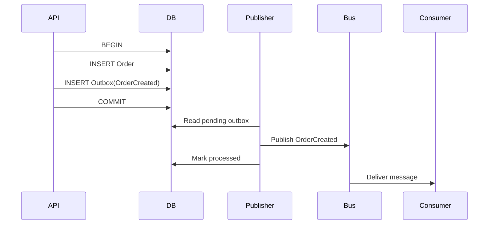

# Daily Knowledge Sharing — 2026-09-07

## Today’s Topics

1. .NET ThreadPool starvation: sync-over-async, blocking I/O và hill-climbing
2. ASP.NET Core streaming: backpressure, request abort và tránh buffer toàn bộ response
3. EF Core optimistic concurrency với `rowversion` và concurrency token
4. SQL keyset pagination vs `OFFSET/FETCH` trên dữ liệu lớn
5. Azure Cosmos DB partition key, Request Units và hot partition
6. Outbox Pattern: đồng bộ database state với message publishing mà không dual-write mù
7. Azure Managed Identity + Key Vault: giảm secret handling trong application
8. Kubernetes readiness vs liveness probes: rollout an toàn và tránh restart loop
9. OpenTelemetry distributed tracing: nối API → SQL → HTTP dependency thành một request story
10. Webhook integration: signature verification, replay protection và idempotent processing

---

# 1. .NET ThreadPool starvation: sync-over-async, blocking I/O và hill-climbing

## 1. What is it?

ThreadPool starvation xảy ra khi application có nhiều work cần ThreadPool thread nhưng phần lớn thread hiện có đang bị block, khiến work mới phải xếp hàng lâu hơn dù CPU chưa chắc đã đạt 100%.

Mental model quan trọng: trong ASP.NET Core, một request không cần “một thread riêng từ đầu đến cuối”. Khi code thực hiện asynchronous I/O đúng cách, thread có thể quay lại pool trong lúc chờ database, HTTP hoặc file I/O. Khi developer biến asynchronous work thành blocking work bằng `.Result`, `.Wait()`, `Thread.Sleep()` hoặc synchronous I/O dài, thread bị giữ vô ích.

ThreadPool có cơ chế hill-climbing để điều chỉnh số worker threads theo throughput. Nhưng pool không thể ngay lập tức tạo hàng nghìn threads để cứu một application đang block; tăng thread quá nhanh cũng tạo context-switching, memory stack overhead và scheduler pressure.

## 2. Why does it exist?

Server application phải phục vụ nhiều concurrent operations trong khi phần lớn thời gian có thể là chờ I/O. Nếu mỗi operation giữ một OS thread xuyên suốt, scalability giảm mạnh.

ThreadPool và async I/O tồn tại để tái sử dụng số thread hữu hạn cho nhiều operations. Vấn đề xuất hiện khi code phá model đó bằng blocking calls.

Ví dụ, 500 requests cùng gọi một downstream API mất 2 giây. Nếu dùng `await`, request không cần giữ 500 worker threads trong toàn bộ thời gian chờ. Nếu dùng `.Result`, 500 threads có thể bị block; continuations và request mới tiếp tục cần thread, tạo queue growth.

## 3. How does it work?

```text
Request arrives
    |
    v
ThreadPool worker executes code
    |
    +--> async I/O + await
    |       |
    |       +--> worker returned to pool
    |       +--> I/O completes later
    |       +--> continuation queued
    |
    +--> blocking call (.Result / Wait)
            |
            +--> worker remains occupied
            +--> more requests queue
            +--> ThreadPool slowly injects threads
            +--> latency climbs
```

Starvation thường có đặc điểm:

- CPU có thể chỉ 30–60% nhưng request latency tăng mạnh.
- Thread count tăng dần.
- ThreadPool queue length tăng.
- p95/p99 xấu hơn nhiều average latency.
- Sau một thời gian, hệ thống có thể “tự hồi” khi pool inject thêm threads, khiến incident khó tái hiện nếu chỉ nhìn snapshot.

## 4. Practical implementation

Anti-pattern:

```csharp
public IActionResult GetProfile(string id)
{
    var profile = _profileClient.GetAsync(id).Result;
    return Ok(profile);
}
```

Đúng hơn:

```csharp
public async Task<IActionResult> GetProfile(
    string id,
    CancellationToken cancellationToken)
{
    var profile = await _profileClient.GetAsync(id, cancellationToken);
    return Ok(profile);
}
```

Một anti-pattern khác là dùng `Task.Run` để “biến” synchronous blocking I/O thành async:

```csharp
var result = await Task.Run(() => legacyClient.CallBlockingApi());
```

Cách này có thể giúp tách UI thread trong desktop app, nhưng trong ASP.NET Core nó không làm blocking I/O trở thành non-blocking. Nó chỉ chuyển việc block sang một ThreadPool thread khác.

Nếu bắt buộc dùng legacy synchronous SDK, cần giới hạn concurrency:

```csharp
private readonly SemaphoreSlim _gate = new(initialCount: 20);

public async Task<Response> CallLegacyAsync(CancellationToken ct)
{
    await _gate.WaitAsync(ct);
    try
    {
        return await Task.Run(() => _legacyClient.Call(), ct);
    }
    finally
    {
        _gate.Release();
    }
}
```

Đây là containment strategy, không phải biến SDK thành scalable async API.

## 5. Real production scenario

Một employee platform gọi payroll provider. SDK cũ chỉ có synchronous method và mỗi call mất 1–3 giây. Team bọc method bằng `Task.Run` rồi để 300 requests chạy đồng thời.

Khi traffic tăng sau giờ chốt timesheet, ThreadPool thread count tăng nhanh, queue length tăng, endpoint khác không liên quan payroll cũng bị chậm vì cùng dùng chung ThreadPool.

Fix không chỉ là “thêm thread”. Team giới hạn payroll concurrency xuống 20, chuyển workflow sang queue cho tác vụ không cần response ngay, và thay SDK bằng HTTP async client ở phase tiếp theo.

## 6. Failure scenario & troubleshooting

**Symptom**  
API p95 từ 250 ms tăng lên 6–10 giây; CPU chỉ khoảng 45%.

**Evidence**  
`dotnet-counters` cho thấy ThreadPool queue length tăng, thread count tăng dần và request rate cao hơn completion rate. Traces cho thấy nhiều spans đứng lâu quanh synchronous dependency calls.

**Hypothesis**  
ThreadPool starvation do blocking I/O hoặc sync-over-async.

**Diagnosis**  
Dùng `dotnet-counters`, `dotnet-trace`, profiler hoặc dump để kiểm tra blocked stacks; tìm `.Result`, `.Wait()`, `Thread.Sleep()`, synchronous DB/HTTP/file calls và `Task.Run` quanh blocking SDK.

**Fix**  
Chuyển sang async I/O thật, giới hạn concurrency ở legacy boundary, đưa long-running work sang queue nếu UX cho phép.

**Verification**  
Load test lại và so sánh ThreadPool queue length, worker count, throughput, p95/p99 latency và dependency concurrency.

## 7. Common mistakes

- Nghĩ CPU chưa cao thì ThreadPool không thể là bottleneck.
- Dùng `Task.Run` như universal fix cho blocking I/O.
- Gọi `.Result` vì “method này chắc hoàn thành nhanh”.
- Tăng minimum ThreadPool threads trước khi sửa blocking path.
- Không propagate `CancellationToken`, khiến work vô ích vẫn tiếp tục sau khi client disconnect.
- Load test chỉ nhìn average latency.

## 8. Alternatives

- Async API thật là lựa chọn tốt nhất cho I/O-bound work.
- `SemaphoreSlim` hoặc bounded queue phù hợp để containment khi dependency có capacity thấp.
- Dedicated Worker Service phù hợp nếu workload không cần hoàn tất trong HTTP request.
- Tăng ThreadPool minimum threads đôi khi hữu ích trong workload đặc biệt đã đo đạc rõ, nhưng không sửa root cause của blocking design.

## 9. Trade-offs

### Advantages

Async I/O giúp một số lượng thread nhỏ phục vụ concurrency lớn hơn và giảm scheduler overhead.

### Costs / Risks

- Async call chain cần propagate đúng từ controller xuống dependency.
- Concurrency cao hơn có thể làm downstream quá tải nếu không có backpressure.
- Bọc legacy sync API bằng `Task.Run` tăng complexity mà scalability vẫn giới hạn bởi threads.

## 10. Junior → Middle → Senior → Technical Lead

### Junior

Hiểu `await` không có nghĩa tạo thread mới, và blocking thread khác với chờ asynchronous I/O.

### Middle

Biết viết async end-to-end, tránh `.Result`/`.Wait()`, propagate `CancellationToken` và đọc basic ThreadPool metrics.

### Senior

Biết phân biệt CPU saturation với ThreadPool starvation, phân tích blocked stacks và kiểm soát concurrency tại dependency boundary.

### Technical Lead / Architect

Quyết định workload nào được phép chạy trực tiếp trong request, workload nào cần queue, và capacity budget giữa API, ThreadPool và downstream services.

## 11. Key takeaway

- ThreadPool starvation có thể xảy ra ngay cả khi CPU chưa cao.
- Async I/O chỉ có giá trị khi call chain không bị biến trở lại thành blocking.
- Backpressure và concurrency limit cần được thiết kế cùng async scalability.

---

# 2. ASP.NET Core streaming: backpressure, request abort và tránh buffer toàn bộ response

## 1. What is it?

Streaming là gửi hoặc nhận dữ liệu theo từng phần thay vì materialize toàn bộ payload trong memory trước khi tiếp tục.

Mental model: nếu API xuất file 2 GB, application không cần giữ 2 GB trong RAM. Nó có thể đọc một chunk từ Blob Storage, ghi chunk đó ra response, rồi tiếp tục. Tuy nhiên streaming đúng còn phải tôn trọng backpressure: nếu client đọc chậm, server không nên tiếp tục đọc/generate vô hạn nhanh hơn khả năng gửi.

ASP.NET Core response body dựa trên stream/pipeline có cơ chế asynchronous writes. `RequestAborted` giúp application biết client đã disconnect hoặc request bị hủy.

## 2. Why does it exist?

Buffering toàn bộ payload có ba vấn đề:

1. tăng memory allocation và LOH pressure;
2. tăng time-to-first-byte vì client chờ server chuẩn bị xong toàn bộ;
3. làm concurrency xấu đi khi nhiều large requests chạy cùng lúc.

Streaming giải quyết memory footprint và latency-to-first-byte, nhưng đổi lại error handling và retry semantics phức tạp hơn sau khi response đã bắt đầu.

## 3. How does it work?

```text
Blob / DB / Generator
        |
        v
   read chunk
        |
        v
ASP.NET Core response stream
        |
        v
Socket send buffer
        |
        v
Client consumes

Client slow
   |
   v
WriteAsync waits
   |
   v
Producer naturally slows down
```

Nếu code đọc source quá nhanh vào một unbounded queue rồi mới ghi response, application đã phá backpressure và memory vẫn tăng.

## 4. Practical implementation

Streaming file:

```csharp
app.MapGet("/exports/{id}", async (
    Guid id,
    IExportStore store,
    HttpContext context) =>
{
    await using var source = await store.OpenReadAsync(
        id,
        context.RequestAborted);

    context.Response.ContentType = "text/csv";
    context.Response.Headers.ContentDisposition =
        $"attachment; filename=\"export-{id}.csv\"";

    await source.CopyToAsync(
        context.Response.Body,
        bufferSize: 64 * 1024,
        context.RequestAborted);
});
```

Streaming generated rows:

```csharp
await foreach (var row in service.StreamRowsAsync(ct))
{
    var line = CsvFormatter.Format(row);
    await response.WriteAsync(line, ct);
}
```

Không nên `ToListAsync()` trước nếu mục đích là giảm memory. Với database streaming, cần nhớ connection có thể bị giữ trong toàn thời gian enumerate; đây là trade-off quan trọng.

## 5. Real production scenario

Một e-commerce admin export 500.000 products. Phiên bản đầu query tất cả records, serialize thành một giant string rồi trả về `File(byte[])`. Khi 10 exports chạy đồng thời, memory tăng hàng GB và GC pause kéo theo latency cho toàn site.

Phiên bản mới đọc theo stream/chunk, gửi từng phần và giới hạn concurrent exports. Memory ổn định hơn, nhưng team cũng phải xử lý việc client disconnect để dừng query/generation sớm.

## 6. Failure scenario & troubleshooting

**Symptom**  
Memory không còn tăng nhiều nhưng database connections lại bị giữ lâu và pool bắt đầu căng.

**Evidence**  
Mỗi streaming request tồn tại vài phút; EF/database reader giữ connection trong suốt quá trình client download chậm.

**Hypothesis**  
Streaming trực tiếp từ DB tạo coupling giữa client speed và DB connection lifetime.

**Diagnosis**  
Correlate request duration, active DB connections và download speed. Xem traces để xác nhận query stream chưa kết thúc trong lúc socket write chậm.

**Fix**  
Với export rất lớn, generate file ở background job vào Blob Storage trước, sau đó client tải file từ storage/CDN. Như vậy database lifecycle tách khỏi client network lifecycle.

**Verification**  
Đo DB connection duration, memory, export latency và concurrent download capacity.

## 7. Common mistakes

- Gọi streaming nhưng vẫn `ToList()` toàn bộ dữ liệu trước.
- Không dùng `RequestAborted`.
- Đọc source vào unbounded channel nhanh hơn network output.
- Stream trực tiếp từ database trong hàng phút mà không tính connection pool.
- Cố đổi status code sau khi response headers/body đã bắt đầu gửi.
- Không giới hạn số large exports đồng thời.

## 8. Alternatives

- Buffer toàn bộ: đơn giản và phù hợp payload nhỏ.
- Background export + Blob Storage: tốt cho file lớn hoặc quá trình generate lâu.
- Direct streaming: tốt khi source cũng stream được và lifecycle ngắn.
- Pre-signed/SAS URL: giảm tải application nếu file đã nằm trong object storage.

## 9. Trade-offs

### Advantages

- Giảm peak memory.
- Time-to-first-byte tốt hơn.
- Phù hợp large payload.

### Costs / Risks

- Error recovery sau khi response bắt đầu khó hơn.
- Có thể giữ source resource lâu, đặc biệt database connection.
- Client chậm có thể kéo dài server-side operation.

## 10. Junior → Middle → Senior → Technical Lead

### Junior

Hiểu streaming là xử lý dữ liệu từng phần thay vì giữ toàn bộ trong memory.

### Middle

Biết dùng async stream, `CopyToAsync`, `RequestAborted` và tránh materialization không cần thiết.

### Senior

Biết phân tích backpressure, source resource lifetime, connection pool và cancellation dưới load.

### Technical Lead / Architect

Quyết định khi nào direct streaming đủ, khi nào phải tách thành background export + object storage/CDN.

## 11. Key takeaway

- Streaming giải quyết memory nhưng có thể chuyển bottleneck sang resource lifetime.
- Backpressure phải đi xuyên suốt producer → application → network.
- Large exports thường tốt hơn khi tách khỏi HTTP request lifecycle.

---

# 3. EF Core optimistic concurrency với `rowversion` và concurrency token

## 1. What is it?

Optimistic concurrency giả định rằng conflict giữa hai writers không xảy ra thường xuyên, nên hệ thống không giữ lock dài từ lúc đọc đến lúc cập nhật. Thay vào đó, khi update, application xác minh record vẫn ở version mà nó đã đọc trước đó.

Trong EF Core, concurrency token được thêm vào điều kiện `WHERE` của `UPDATE`/`DELETE`. Nếu không row nào match, EF Core ném `DbUpdateConcurrencyException`.

SQL Server `rowversion` là một lựa chọn phổ biến cho version token.

## 2. Why does it exist?

Trong web application, user có thể mở form trong 10 phút. Giữ database lock suốt thời gian user đọc và chỉnh sửa là không khả thi.

Nếu không có concurrency check:

1. Alice đọc Employee version A.
2. Bob đọc Employee version A.
3. Alice cập nhật department → version B.
4. Bob cập nhật phone dựa trên version A.
5. Nếu update ghi toàn entity, thay đổi department của Alice có thể bị ghi đè ngoài ý muốn.

Optimistic concurrency giúp application phát hiện rằng dữ liệu đã đổi kể từ lần đọc.

## 3. How does it work?

```text
Read row
Id=10, Version=0x01
      |
      v
User edits
      |
      v
UPDATE Employees
SET Phone = ...
WHERE Id = 10 AND Version = 0x01
      |
      +--> 1 row affected -> success
      |
      +--> 0 rows affected -> conflict
```

Conflict detection không tự quyết định business resolution. Application vẫn phải chọn: reject, retry, merge hay ask user reload.

## 4. Practical implementation

Entity:

```csharp
public sealed class Employee
{
    public Guid Id { get; set; }
    public string Name { get; set; } = default!;
    public string Department { get; set; } = default!;

    [Timestamp]
    public byte[] Version { get; set; } = default!;
}
```

Handling conflict:

```csharp
try
{
    await db.SaveChangesAsync(ct);
}
catch (DbUpdateConcurrencyException ex)
{
    var entry = ex.Entries.Single();
    var databaseValues = await entry.GetDatabaseValuesAsync(ct);

    if (databaseValues is null)
        return Results.NotFound();

    return Results.Conflict(new
    {
        message = "The record was modified by another user. Reload and retry."
    });
}
```

API contract cũng có thể expose ETag/version để client gửi `If-Match`, kết nối HTTP optimistic concurrency với database concurrency.

## 5. Real production scenario

Trong employee management system, HR và line manager cùng chỉnh employee profile. HR đổi job grade, manager đổi office location.

Nếu UI gửi toàn object và backend attach entity rồi mark Modified, update của manager có thể overwrite grade cũ. Với `rowversion`, conflict được detect thay vì silently mất dữ liệu.

Business có thể quyết định một số fields cho phép merge tự động, còn compensation/job-grade phải bắt user reload vì có risk cao.

## 6. Failure scenario & troubleshooting

**Symptom**  
Users báo “save thành công nhưng dữ liệu người khác vừa sửa biến mất”.

**Evidence**  
Audit log cho thấy hai updates gần nhau; SQL update không chứa version predicate hoặc API không propagate concurrency token.

**Hypothesis**  
Lost update do missing optimistic concurrency control.

**Diagnosis**  
Inspect EF model configuration, generated SQL, API DTO và update pattern (`Attach`, `Update`, tracked entity).

**Fix**  
Thêm concurrency token, propagate token qua API, handle `DbUpdateConcurrencyException` và định nghĩa resolution policy.

**Verification**  
Integration test hai DbContexts đọc cùng version rồi cùng update; update thứ hai phải conflict.

## 7. Common mistakes

- Nghĩ `DbContext` tracking tự ngăn multi-user lost update.
- Catch concurrency exception rồi retry vô hạn với dữ liệu cũ.
- Dùng timestamp thời gian ứng dụng làm version nhưng precision/clock semantics không đủ rõ.
- Không đưa version token qua client round-trip.
- Return generic 500 cho expected conflict.
- Merge tự động fields nhạy cảm mà không có business rule.

## 8. Alternatives

- Pessimistic locking: hợp với critical short-lived transaction nhưng không phù hợp user-edit workflow dài.
- Application-managed GUID/version integer: hữu ích khi provider không có `rowversion` hoặc muốn kiểm soát khi nào version đổi.
- ETag + `If-Match`: biểu diễn concurrency ở HTTP contract; backend vẫn cần enforce tương ứng ở persistence layer.

## 9. Trade-offs

### Advantages

- Không giữ lock dài.
- Phát hiện lost update.
- Scale tốt cho read-edit-write workflows.

### Costs / Risks

- Conflict resolution cần business logic/UX.
- Client contract phức tạp hơn vì phải mang version.
- Retry không phải lúc nào cũng safe.

## 10. Junior → Middle → Senior → Technical Lead

### Junior

Hiểu hai users có thể đọc cùng dữ liệu rồi ghi đè nhau.

### Middle

Biết cấu hình concurrency token và handle `DbUpdateConcurrencyException`.

### Senior

Thiết kế API/ETag, merge strategy, test concurrent writers và phân biệt transient retry với business conflict.

### Technical Lead / Architect

Xác định aggregate nào cần optimistic concurrency, conflict nào merge được và conflict nào phải bắt người dùng quyết định.

## 11. Key takeaway

- Optimistic concurrency phát hiện conflict; nó không tự giải quyết conflict.
- `rowversion` hiệu quả khi token được propagate xuyên API round-trip.
- Retry mù có thể biến conflict được phát hiện thành lost update lần nữa.

---

# 4. SQL keyset pagination vs `OFFSET/FETCH` trên dữ liệu lớn

## 1. What is it?

Offset pagination yêu cầu database bỏ qua N rows rồi lấy page tiếp theo. Keyset pagination dùng giá trị cuối cùng của page trước làm cursor để tiếp tục từ vị trí đó.

Ví dụ offset:

```sql
ORDER BY CreatedAt DESC
OFFSET 100000 ROWS FETCH NEXT 50 ROWS ONLY;
```

Keyset:

```sql
WHERE (CreatedAt < @lastCreatedAt)
   OR (CreatedAt = @lastCreatedAt AND Id < @lastId)
ORDER BY CreatedAt DESC, Id DESC
FETCH NEXT 50 ROWS ONLY;
```

Mental model: offset nói “đi qua 100.000 rows rồi đưa tôi 50 rows”; keyset nói “bắt đầu ngay sau key này”.

## 2. Why does it exist?

Offset rất tiện cho UI page 1, 2, 3 và small datasets. Nhưng khi offset lớn, database vẫn phải locate/scan/sort qua nhiều rows trước khi bỏ chúng đi.

Ngoài performance, offset còn dễ tạo duplicate/missing rows khi dữ liệu thay đổi giữa các requests. Keyset phù hợp hơn với feed, timeline, audit log hoặc endless scrolling.

## 3. How does it work?

Với index phù hợp `(CreatedAt DESC, Id DESC)`:

```text
OFFSET 100000
Index start -> walk 100000 entries -> discard -> return 50

KEYSET
Seek to (lastCreatedAt,lastId) -> read next 50
```

Keyset cần stable deterministic ordering. Nếu chỉ sort theo `CreatedAt` mà nhiều rows cùng timestamp, cursor không đủ unique; phải thêm tie-breaker như `Id`.

## 4. Practical implementation

SQL:

```sql
CREATE INDEX IX_Orders_CreatedAt_Id
ON Orders (CreatedAt DESC, Id DESC)
INCLUDE (CustomerId, Status, TotalAmount);
```

Query:

```sql
SELECT TOP (@pageSize)
    Id, CustomerId, Status, TotalAmount, CreatedAt
FROM Orders
WHERE
    @lastCreatedAt IS NULL
    OR CreatedAt < @lastCreatedAt
    OR (CreatedAt = @lastCreatedAt AND Id < @lastId)
ORDER BY CreatedAt DESC, Id DESC;
```

EF Core:

```csharp
var query = db.Orders.AsNoTracking();

if (cursor is not null)
{
    query = query.Where(x =>
        x.CreatedAt < cursor.CreatedAt ||
        (x.CreatedAt == cursor.CreatedAt && x.Id.CompareTo(cursor.Id) < 0));
}

var page = await query
    .OrderByDescending(x => x.CreatedAt)
    .ThenByDescending(x => x.Id)
    .Take(pageSize)
    .Select(x => new OrderListItem(...))
    .ToListAsync(ct);
```

## 5. Real production scenario

Audit log có 50 triệu rows. Admin portal hỗ trợ scrolling lịch sử events. `OFFSET 500000` bắt đầu mất vài giây và execution plan đọc rất nhiều pages dù trả đúng 100 rows.

Chuyển sang cursor `(OccurredAt, EventId)` giúp query gần như chỉ seek rồi đọc page kế tiếp. UX bỏ khái niệm “jump trực tiếp tới page 5000”, nhưng scrolling nhanh và ổn định hơn.

## 6. Failure scenario & troubleshooting

**Symptom**  
Page đầu nhanh 50 ms nhưng page sâu mất 4–8 giây.

**Evidence**  
Execution plan cho thấy high logical reads, sort hoặc scan; elapsed time tăng theo offset.

**Hypothesis**  
Pagination strategy đang buộc database bỏ qua quá nhiều rows.

**Diagnosis**  
So sánh actual execution plan và `SET STATISTICS IO, TIME ON` giữa page đầu/page sâu; kiểm tra index order và selectivity.

**Fix**  
Dùng keyset khi product UX không cần arbitrary page jump; tạo deterministic ordering và index phục vụ seek.

**Verification**  
Đo logical reads và latency ở cursor nằm sâu hàng triệu rows.

## 7. Common mistakes

- Thêm index bất kỳ rồi kỳ vọng offset lớn tự nhanh.
- Keyset nhưng sort column không unique.
- Cursor chứa dữ liệu client có thể sửa mà không validate/sign.
- Dùng `COUNT(*)` trên huge table cho mỗi request chỉ để hiện total pages.
- Chọn keyset cho UI bắt buộc jump tới arbitrary page number.

## 8. Alternatives

- Offset pagination: đơn giản, phù hợp back-office datasets nhỏ và page jump.
- Keyset pagination: tốt cho large ordered feeds và sequential navigation.
- Search-after trong Elasticsearch là khái niệm tương tự keyset cho search results.

## 9. Trade-offs

### Advantages

Keyset cho latency ổn định hơn khi dataset lớn và ít bị page drift do inserts mới trước cursor.

### Costs / Risks

- Không thuận tiện cho arbitrary page jump.
- Cursor contract phức tạp hơn.
- Composite ordering và indexes phải được thiết kế cẩn thận.

## 10. Junior → Middle → Senior → Technical Lead

### Junior

Hiểu `OFFSET` không miễn phí; database vẫn phải đi qua rows bị bỏ.

### Middle

Biết implement cursor với stable sort key.

### Senior

Đọc execution plan/logical reads, thiết kế composite index và xử lý cursor correctness khi data thay đổi.

### Technical Lead / Architect

Chọn pagination dựa trên UX requirement + scale thực tế thay vì một pattern dùng cho mọi endpoint.

## 11. Key takeaway

- Offset đơn giản nhưng cost thường tăng theo độ sâu trang.
- Keyset cần deterministic ordering và index phù hợp.
- Pagination là quyết định API + UX + database cùng lúc.

---

# 5. Azure Cosmos DB partition key, Request Units và hot partition

## 1. What is it?

Cosmos DB phân phối dữ liệu theo partition key. Logical partitions được map vào physical partitions, và throughput/storage được phân bố qua hạ tầng phía dưới.

Request Unit (RU) là đơn vị chuẩn hóa chi phí của database operation dựa trên CPU, I/O và memory. Một point read theo `id + partition key` thường rẻ hơn cross-partition query.

Hot partition xảy ra khi workload tập trung quá nhiều vào một partition key range, khiến một phần hệ thống bị throttled dù tổng throughput nhìn có vẻ còn dư ở nơi khác.

## 2. Why does it exist?

Distributed database cần biết cách shard dữ liệu. Cosmos DB yêu cầu partition key để route data và requests mà không phải broadcast mọi operation tới toàn cluster.

Partition key sai có thể khóa scalability từ data model. Đây không phải chỉ là index choice có thể sửa dễ sau này; repartition thường cần migration/container mới.

## 3. How does it work?

```text
Document
{ tenantId: "A", id: "123" }
        |
        v
hash(partition key)
        |
        v
Logical partition
        |
        v
Physical partition

Request with partition key
        |
        +--> routed directly

Request without key
        |
        +--> may fan out across partitions
```

Một key tốt thường có:

- high cardinality;
- distribution tương đối đều;
- nằm trong các access patterns chính;
- tránh một tenant/customer cực lớn chiếm phần lớn traffic nếu workload multi-tenant không đều.

## 4. Practical implementation

Document:

```json
{
  "id": "order-7842",
  "tenantId": "tenant-42",
  "customerId": "customer-501",
  "status": "Submitted",
  "total": 129.50
}
```

Point read với SDK:

```csharp
var response = await container.ReadItemAsync<OrderDocument>(
    id: orderId,
    partitionKey: new PartitionKey(tenantId),
    cancellationToken: ct);
```

Nếu access pattern luôn là tenant-scoped, `tenantId` có thể hợp lý. Nhưng nếu một tenant enterprise tạo 80% writes, key này có nguy cơ hotspot. Có thể cần hierarchical/composite partitioning strategy hoặc thêm bucket theo access pattern, tùy model hỗ trợ và yêu cầu query.

## 5. Real production scenario

SaaS event platform chọn `eventType` làm partition key vì “query hay filter theo type”. Chỉ có 8 event types, trong đó `PageViewed` chiếm 85% writes. Partition tương ứng bị throttled trong campaign lớn.

Data model được redesign theo tenant + time bucket, vì workload thực sự đọc events theo tenant/time window chứ không theo event type toàn hệ thống.

## 6. Failure scenario & troubleshooting

**Symptom**  
API nhận HTTP 429 từ Cosmos DB trong peak traffic dù provisioned RU/s tổng thể nhìn chưa dùng hết.

**Evidence**  
Diagnostics cho thấy một partition key range tiêu thụ disproportionate RU; retry-after xuất hiện nhiều ở cùng tenant/key.

**Hypothesis**  
Hot partition hoặc cross-partition query cost cao.

**Diagnosis**  
Phân tích normalized RU consumption theo partition, query metrics, request charge và access pattern. Kiểm tra query có truyền partition key hay không.

**Fix**  
Tối ưu point reads/queries, giảm fan-out, cache thích hợp, và nếu root cause là key design thì lập migration sang partition strategy mới.

**Verification**  
Load test skewed traffic chứ không chỉ uniform traffic; theo dõi 429 rate, RU/request và per-partition distribution.

## 7. Common mistakes

- Chọn partition key theo field “có vẻ quan trọng” thay vì access pattern.
- Cardinality quá thấp.
- Giả định autoscale tự chữa hot partition.
- Không log RU charge.
- Query không truyền partition key dù endpoint đã biết tenant.
- Dùng Cosmos DB giống SQL rồi join/query tùy ý.

## 8. Alternatives

- Azure SQL/PostgreSQL: phù hợp khi relational integrity, joins và transactions rộng quan trọng hơn global distributed scale.
- MongoDB: document model tương tự ở một số khía cạnh nhưng partitioning/throughput semantics khác.
- Cosmos DB phù hợp khi low-latency distributed document access và scale justify cost/complexity.

## 9. Trade-offs

### Advantages

- Horizontal scale và global distribution mạnh.
- Predictable request charge model khi access pattern tốt.
- Point reads rất hiệu quả.

### Costs / Risks

- Partition key là quyết định architecture khó đổi.
- Cross-partition query tốn RU.
- Cost có thể tăng nhanh nếu access pattern không tối ưu.

## 10. Junior → Middle → Senior → Technical Lead

### Junior

Hiểu partition key quyết định dữ liệu được phân bố/routed như thế nào.

### Middle

Biết truyền partition key, đọc RU charge và tránh fan-out không cần thiết.

### Senior

Phân tích skew, 429, query metrics và model dữ liệu theo access pattern.

### Technical Lead / Architect

Chọn Cosmos DB khi workload thật sự cần nó và thiết kế partition strategy dựa trên growth/skew scenarios, không chỉ current dataset.

## 11. Key takeaway

- Partition key là scalability boundary, không phải metadata phụ.
- Tổng RU còn dư không đảm bảo không có hot partition.
- Model Cosmos DB phải bắt đầu từ access pattern và traffic distribution.

---

# 6. Outbox Pattern: đồng bộ database state với message publishing mà không dual-write mù

## 1. What is it?

Outbox Pattern giải quyết dual-write problem khi một business operation vừa phải commit database state vừa phải publish message/event.

Thay vì:

```text
Save DB
Publish message
```

với hai failure points độc lập, application ghi business data và outbox record trong cùng local database transaction. Một publisher riêng đọc outbox và gửi message sau.

Mental model: Outbox không tạo exactly-once delivery. Nó giúp không làm mất intent publish khi database commit thành công, nhưng consumer vẫn phải idempotent vì duplicate delivery có thể xảy ra.

## 2. Why does it exist?

Giả sử order được lưu thành công nhưng process crash trước khi publish `OrderCreated`. Database nói order tồn tại, downstream inventory không biết.

Nếu publish trước rồi save DB, ngược lại downstream có thể nhận event cho order sau đó rollback.

Distributed transaction 2PC giữa database và message broker thường không sẵn có, không mong muốn hoặc quá phức tạp. Outbox dùng local atomic transaction + eventual delivery.

## 3. How does it work?



Failure giữa publish và mark processed có thể khiến message được publish lại. Vì vậy message ID phải ổn định và consumer cần deduplication/idempotency.

## 4. Practical implementation

Outbox entity:

```csharp
public sealed class OutboxMessage
{
    public Guid Id { get; init; }
    public string Type { get; init; } = default!;
    public string Payload { get; init; } = default!;
    public DateTimeOffset OccurredAt { get; init; }
    public DateTimeOffset? ProcessedAt { get; set; }
    public int Attempts { get; set; }
}
```

Trong use case:

```csharp
await using var tx = await db.Database.BeginTransactionAsync(ct);

var order = Order.Create(command.CustomerId, command.Items);
db.Orders.Add(order);

db.OutboxMessages.Add(new OutboxMessage
{
    Id = Guid.NewGuid(),
    Type = "OrderCreated",
    Payload = JsonSerializer.Serialize(new
    {
        order.Id,
        order.CustomerId,
        order.Total
    }),
    OccurredAt = clock.UtcNow
});

await db.SaveChangesAsync(ct);
await tx.CommitAsync(ct);
```

Publisher có thể batch pending messages, publish và mark processed. Cần lock/claim strategy để nhiều publisher instances không xử lý cùng row một cách hỗn loạn.

## 5. Real production scenario

E-commerce checkout lưu Order và cần gửi event sang inventory + email. Trước Outbox, team gọi Service Bus ngay sau `SaveChanges`. Một deploy restart đúng lúc tạo vài chục orders không có event.

Sau Outbox, order commit và event intent commit cùng transaction. Publisher restart có thể replay pending records. Một số messages bị duplicate, nhưng consumers dùng `MessageId` để dedupe.

## 6. Failure scenario & troubleshooting

**Symptom**  
Database orders tăng bình thường nhưng queue gần như không có messages mới.

**Evidence**  
Outbox pending count tăng liên tục, oldest pending age tăng, publisher logs có authentication/network errors.

**Hypothesis**  
Outbox publisher bị lỗi, business writes vẫn tiếp tục.

**Diagnosis**  
Theo dõi backlog count, oldest-message age, publish failure rate, attempts và dead-letter/parking strategy.

**Fix**  
Khôi phục publisher/dependency, replay backlog có kiểm soát, throttle nếu downstream không chịu được burst.

**Verification**  
Backlog age giảm về SLO, consumers nhận events và duplicate rate nằm trong expected behavior.

## 7. Common mistakes

- Nghĩ Outbox mang lại exactly-once end-to-end.
- Tạo outbox record sau khi DB transaction đã commit.
- Mark processed trước khi broker confirm publish.
- Không có index trên pending records.
- Không có retention/cleanup khiến outbox table tăng vô hạn.
- Không monitor oldest pending age.
- Consumer không idempotent.

## 8. Alternatives

- Direct dual-write: chỉ phù hợp khi loss/duplicate được business chấp nhận rõ ràng.
- Change Data Capture: có thể dùng để phát hiện DB changes, giảm application outbox code nhưng operational model khác.
- Transactional broker/database integration: hiếm và phụ thuộc platform.

## 9. Trade-offs

### Advantages

- Atomicity giữa business state và publish intent trong một database.
- Tolerate publisher crash/restart.
- Có replay trail rõ.

### Costs / Risks

- Eventual consistency.
- Thêm table, worker và monitoring.
- Duplicate delivery vẫn tồn tại.
- Schema/event evolution cần quản trị.

## 10. Junior → Middle → Senior → Technical Lead

### Junior

Hiểu DB commit và broker publish là hai operations độc lập có thể fail riêng.

### Middle

Biết ghi outbox trong cùng transaction và viết publisher cơ bản.

### Senior

Thiết kế batching, locking/claiming, retry, dedupe, cleanup và observability.

### Technical Lead / Architect

Quyết định system boundary nào thực sự cần Outbox, consistency lag chấp nhận bao nhiêu và operational burden có justify pattern hay không.

## 11. Key takeaway

- Outbox giải quyết lost publish intent, không loại bỏ duplicate delivery.
- Consumer idempotency là phần bắt buộc của thiết kế.
- Backlog age là một production metric quan trọng như queue depth.

---

# 7. Azure Managed Identity + Key Vault: giảm secret handling trong application

## 1. What is it?

Managed Identity cung cấp identity do Azure quản lý cho workload như App Service, Functions, VM hoặc một số container workloads. Application có thể dùng identity này để lấy Azure AD/Entra token mà không cần lưu client secret trong config.

Azure Key Vault lưu secrets, keys và certificates. Kết hợp hai dịch vụ cho phép application authenticate tới Key Vault bằng identity của chính workload.

Mental model: Key Vault không làm secret biến mất; nó giảm việc distribute secret tới application config và giúp centralize access/rotation. Managed Identity còn đi xa hơn bằng cách loại bỏ secret credential cho nhiều Azure-to-Azure authentication paths.

## 2. Why does it exist?

Client secrets trong `appsettings.json`, environment variables hoặc CI variables có lifecycle khó:

- phải tạo;
- phân phối;
- rotate;
- revoke;
- tránh leak qua logs/deployment tooling.

Nếu Azure service hỗ trợ Entra authentication, Managed Identity cho phép trust identity thay vì shared secret.

## 3. How does it work?

```text
App Service
   |
   | Managed Identity
   v
Microsoft Entra ID
   |
   | access token
   v
Key Vault / Storage / SQL / Service Bus
```

`DefaultAzureCredential` khi chạy Azure có thể dùng Managed Identity; local development có thể dùng developer credential khác. Code giữ nguyên abstraction nhưng identity source thay đổi theo environment.

## 4. Practical implementation

```csharp
using Azure.Identity;
using Azure.Security.KeyVault.Secrets;

var client = new SecretClient(
    new Uri(configuration["KeyVaultUri"]!),
    new DefaultAzureCredential());

KeyVaultSecret secret = await client.GetSecretAsync(
    "LegacyVendorApiKey",
    cancellationToken: ct);
```

Tốt hơn nữa, nếu downstream hỗ trợ Entra token, không cần lấy secret:

```csharp
var credential = new DefaultAzureCredential();
var token = await credential.GetTokenAsync(
    new TokenRequestContext(new[] { "https://storage.azure.com/.default" }),
    ct);
```

Trong production, cấp RBAC tối thiểu cho identity, ví dụ chỉ `Key Vault Secrets User` trên vault cần thiết thay vì quyền quản trị rộng.

## 5. Real production scenario

Một App Service dùng SQL password, Storage key và third-party API key. Team chuyển Azure SQL + Blob Storage sang Managed Identity, chỉ còn third-party key trong Key Vault.

Kết quả là số long-lived secrets cần rotate giảm mạnh. Khi rotate vendor API key, chỉ update Key Vault, không rebuild image hay commit config mới.

## 6. Failure scenario & troubleshooting

**Symptom**  
Local chạy được nhưng Production trả 403 khi đọc Key Vault.

**Evidence**  
Authentication token lấy được nhưng authorization bị deny; identity object ID khác identity đã cấp role hoặc RBAC propagation chưa hoàn tất.

**Hypothesis**  
Managed Identity tồn tại nhưng thiếu đúng data-plane permission.

**Diagnosis**  
Xác minh workload đang dùng system-assigned hay user-assigned identity nào, kiểm tra role assignment scope, Key Vault networking/private endpoint và `DefaultAzureCredential` chain.

**Fix**  
Cấp least-privilege RBAC cho đúng identity và đúng vault/resource scope; cấu hình network path nếu vault private.

**Verification**  
Chạy health probe hoặc integration check đọc đúng secret/resource mà không log secret value.

## 7. Common mistakes

- Nghĩ secret trong Key Vault thì ai trong app cũng nên đọc được.
- Cấp `Owner`/`Contributor` thay vì data-plane role tối thiểu.
- Log secret khi debug retrieval failure.
- Dùng one shared user-assigned identity cho mọi applications không cần thiết.
- Không tính private networking/DNS khi Key Vault dùng Private Endpoint.
- Cache secret mãi và không có chiến lược rotation refresh.

## 8. Alternatives

- Environment variables: đơn giản nhưng vẫn cần secret distribution.
- CI/CD secret store: phù hợp deployment-time secret, nhưng application runtime rotation kém linh hoạt hơn.
- Managed Identity trực tiếp tới Azure service: tốt nhất khi service hỗ trợ Entra auth vì không cần secret trung gian.

## 9. Trade-offs

### Advantages

- Giảm long-lived credentials.
- Centralized secret rotation/auditing.
- Least-privilege identity per workload khả thi hơn.

### Costs / Risks

- Azure-specific identity/network configuration.
- Local development credential path khác production.
- Key Vault có thể trở thành runtime dependency nếu application đọc quá thường xuyên.

## 10. Junior → Middle → Senior → Technical Lead

### Junior

Hiểu Managed Identity là identity của workload, không phải một secret string khác.

### Middle

Biết dùng `DefaultAzureCredential`, Key Vault SDK và cấu hình RBAC cơ bản.

### Senior

Debug identity mismatch, token scope, private networking và rotation/caching behavior.

### Technical Lead / Architect

Thiết kế identity boundaries, quyết định service nào dùng token trực tiếp và secret nào thực sự cần tồn tại trong Key Vault.

## 11. Key takeaway

- Managed Identity nên thay shared secret khi Azure service hỗ trợ Entra auth.
- Key Vault centralize secret lifecycle nhưng vẫn cần least privilege và network design.
- Không log secret để “debug cho nhanh”.

---

# 8. Kubernetes readiness vs liveness probes: rollout an toàn và tránh restart loop

## 1. What is it?

Readiness probe trả lời: “Pod này hiện có nên nhận traffic không?”

Liveness probe trả lời: “Process này còn sống theo nghĩa có khả năng tự hồi hay cần restart?”

Hai probe giải quyết hai vấn đề khác nhau. Failure của readiness thường loại Pod khỏi Service endpoints nhưng không restart container. Failure của liveness có thể khiến kubelet restart container.

## 2. Why does it exist?

Process chạy không đồng nghĩa application sẵn sàng phục vụ. App có thể đang warm up, migrate cache hoặc mất critical dependency tạm thời.

Ngược lại, một process có thể bị deadlock vĩnh viễn; chỉ loại khỏi traffic không tự hồi được. Liveness cho phép restart trong trường hợp thật sự stuck.

Nếu dùng cùng một deep dependency check cho cả readiness và liveness, outage Redis/SQL có thể làm Kubernetes restart toàn bộ Pods liên tục, khiến recovery tệ hơn.

## 3. How does it work?

```text
Deployment starts Pod
      |
      v
Readiness fails
      |
      +--> Pod stays running
      +--> No traffic routed
      |
Readiness succeeds
      |
      +--> Service sends traffic

Liveness fails repeatedly
      |
      v
Container restarted
```

Startup probe có thể dùng cho applications khởi động lâu để tránh liveness giết app trước khi startup xong.

## 4. Practical implementation

ASP.NET Core:

```csharp
builder.Services.AddHealthChecks()
    .AddCheck("self", () => HealthCheckResult.Healthy())
    .AddSqlServer(connectionString, tags: new[] { "ready" });

app.MapHealthChecks("/health/live", new HealthCheckOptions
{
    Predicate = r => r.Name == "self"
});

app.MapHealthChecks("/health/ready", new HealthCheckOptions
{
    Predicate = r => r.Tags.Contains("ready") || r.Name == "self"
});
```

Kubernetes:

```yaml
readinessProbe:
  httpGet:
    path: /health/ready
    port: 8080
  periodSeconds: 10
  failureThreshold: 3

livenessProbe:
  httpGet:
    path: /health/live
    port: 8080
  periodSeconds: 15
  failureThreshold: 3
```

## 5. Real production scenario

API phụ thuộc Redis cho cache nhưng có database fallback. Team đặt Redis health check trong liveness. Khi Redis outage 5 phút, mọi Pods restart liên tục dù API vẫn có thể degrade sang DB.

Sau incident, Redis được loại khỏi liveness; readiness cũng được cân nhắc theo business capability thay vì “mọi dependency phải xanh”. Nếu cache không critical, Redis failure không cần remove pod khỏi traffic.

## 6. Failure scenario & troubleshooting

**Symptom**  
Deployment mới vào `CrashLoopBackOff`; logs chỉ cho thấy app vừa startup xong thì bị terminate.

**Evidence**  
`kubectl describe pod` cho thấy liveness probe failed trước khi app hoàn tất warm-up.

**Hypothesis**  
Probe timing/semantics sai, không phải application crash thực sự.

**Diagnosis**  
Inspect events, startup duration, probe path/port, timeout, `initialDelaySeconds` hoặc startup probe.

**Fix**  
Dùng startup probe cho slow startup; liveness chỉ kiểm tra self-health có ý nghĩa restart; readiness phản ánh khả năng phục vụ traffic.

**Verification**  
Rolling deploy dưới cold start thực tế và dependency degradation test.

## 7. Common mistakes

- Dùng cùng endpoint cho readiness và liveness mà không suy nghĩ semantics.
- Liveness check SQL, Redis, Service Bus và mọi downstream dependency.
- Probe endpoint tự làm expensive query.
- Timeout quá thấp so với normal GC pause/startup.
- Không đọc Kubernetes events khi debug `CrashLoopBackOff`.
- Readiness luôn trả 200 dù app chưa load config/model cần thiết.

## 8. Alternatives

- App Service health check có khái niệm đơn giản hơn nhưng mục tiêu tương tự routing unhealthy instances.
- VM/process supervisor restart process, nhưng không có service-endpoint readiness semantics phong phú như Kubernetes.

## 9. Trade-offs

### Advantages

- Rollout an toàn hơn.
- Automatic removal/recovery của unhealthy instances.
- Phân biệt “không nhận traffic” với “cần restart”.

### Costs / Risks

- Probe sai có thể tạo self-inflicted outage.
- Deep checks làm tăng dependency coupling.
- Threshold/timing cần tuning theo workload.

## 10. Junior → Middle → Senior → Technical Lead

### Junior

Nhớ readiness ≠ liveness.

### Middle

Biết expose health endpoints và đọc `kubectl describe pod`/events.

### Senior

Thiết kế probe semantics theo dependency criticality, startup time và graceful degradation.

### Technical Lead / Architect

Quyết định service capability nào đủ để nhận traffic và failure nào thực sự nên trigger restart.

## 11. Key takeaway

- Readiness điều khiển traffic; liveness điều khiển restart.
- Dependency outage không tự động đồng nghĩa process cần restart.
- Probe sai có thể biến partial failure thành full outage.

---

# 9. OpenTelemetry distributed tracing: nối API → SQL → HTTP dependency thành một request story

## 1. What is it?

Distributed tracing biểu diễn một request hoặc business operation thành trace gồm nhiều spans. Mỗi span mô tả một đoạn work như ASP.NET Core request, SQL query, HTTP call hoặc message processing.

OpenTelemetry cung cấp tiêu chuẩn/API/SDK để tạo và export traces, metrics và logs theo vendor-neutral model.

Mental model: log nói “một event đã xảy ra”; metric nói “hệ thống đang có xu hướng gì”; trace nói “request cụ thể đã đi qua những bước nào và mất thời gian ở đâu”.

## 2. Why does it exist?

Trong distributed system, client thấy request mất 4 giây nhưng API code local chỉ tốn 20 ms CPU. Không có tracing, team phải grep logs ở nhiều services và đoán correlation.

Trace context (`trace_id`, `span_id`) cho phép nối các boundaries lại thành một causal path.

## 3. How does it work?

```text
Trace 4f2...
|
+-- API request                820 ms
    |
    +-- SQL SELECT              35 ms
    |
    +-- HTTP Product Service   730 ms
        |
        +-- Product SQL        680 ms
```

W3C Trace Context thường propagate qua HTTP headers như `traceparent`. Instrumentation libraries có thể tự tạo spans cho ASP.NET Core, HttpClient, SqlClient và các frameworks phổ biến.

## 4. Practical implementation

```csharp
builder.Services.AddOpenTelemetry()
    .WithTracing(tracing => tracing
        .AddAspNetCoreInstrumentation()
        .AddHttpClientInstrumentation()
        .AddSqlClientInstrumentation()
        .AddSource("Orders.Application")
        .AddOtlpExporter());
```

Custom span:

```csharp
private static readonly ActivitySource Source =
    new("Orders.Application");

public async Task ApproveAsync(Guid orderId, CancellationToken ct)
{
    using var activity = Source.StartActivity("Order.Approve");
    activity?.SetTag("order.id", orderId);

    await _service.ApproveAsync(orderId, ct);
}
```

Không nên tag PII, access tokens hoặc high-cardinality secrets. `order.id` cũng cần cân nhắc backend cost/cardinality policy.

## 5. Real production scenario

Checkout API p95 tăng từ 500 ms lên 2.5 s. CPU app bình thường, SQL local cũng nhanh.

Trace breakdown cho thấy `ReviewService` HTTP span chiếm 1.8 s sau release bên thứ ba. Team tạm thời áp timeout + fallback cho reviews, tránh làm checkout dependency chain chậm toàn bộ.

Không có tracing, incident có thể bị đổ nhầm cho SQL vì đó là dependency quen thuộc nhất.

## 6. Failure scenario & troubleshooting

**Symptom**  
Có traces nhưng request path bị đứt giữa API A và API B.

**Evidence**  
API B tạo trace ID mới thay vì tiếp tục parent trace.

**Hypothesis**  
Trace context không được propagate hoặc proxy/gateway/custom HTTP layer đã drop headers.

**Diagnosis**  
Inspect `traceparent`, instrumentation configuration, custom clients, reverse proxy và sampling behavior.

**Fix**  
Dùng standard HttpClient instrumentation, propagate W3C context, tránh custom code xóa headers và align sampling strategy.

**Verification**  
Synthetic request phải hiện thành một trace xuyên các services/dependencies.

## 7. Common mistakes

- Log mọi thứ nhưng không có correlation/trace ID.
- Thêm custom span cho từng function nhỏ tạo noise.
- Tag PII/secrets.
- Sampling quá thấp khiến rare errors biến mất.
- Chỉ nhìn trace mà bỏ metrics tổng thể.
- Không instrument queue/message boundaries nên async flow bị đứt.

## 8. Alternatives

- Application Insights native instrumentation: rất hữu ích trong Azure; OpenTelemetry giúp chuẩn hóa instrumentation/exporter model.
- Structured logs với correlation ID: vẫn cần và đơn giản hơn, nhưng không cung cấp latency tree tự nhiên như traces.

## 9. Trade-offs

### Advantages

- Localize latency/failure across services.
- Causal context tốt hơn logs rời rạc.
- Vendor-neutral instrumentation với OpenTelemetry.

### Costs / Risks

- Telemetry volume/cost.
- Sampling có thể che rare events.
- High-cardinality tags gây cost và query difficulty.
- Instrumentation cần governance.

## 10. Junior → Middle → Senior → Technical Lead

### Junior

Hiểu trace/span và correlation giữa request với dependencies.

### Middle

Biết bật ASP.NET Core/HttpClient/SQL instrumentation và đọc waterfall.

### Senior

Thiết kế custom spans, sampling, message propagation và incident workflow Logs + Metrics + Traces.

### Technical Lead / Architect

Xác định observability standards, telemetry budget, privacy rules và SLO-supporting signals cho toàn platform.

## 11. Key takeaway

- Trace giúp trả lời “thời gian của request đã đi đâu?”.
- OpenTelemetry chuẩn hóa context và instrumentation, không thay thế hoàn toàn logs/metrics.
- Telemetry cần sampling, privacy và cardinality discipline.

---

# 10. Webhook integration: signature verification, replay protection và idempotent processing

## 1. What is it?

Webhook là HTTP callback mà external provider gửi tới application khi một event xảy ra. Khác polling, provider chủ động push event.

Một webhook endpoint production-grade cần ít nhất ba lớp reasoning:

1. authenticity — request có thật từ provider không?
2. freshness/replay protection — request hợp lệ có đang bị phát lại không?
3. idempotency — cùng event được delivery nhiều lần có gây side effect lặp không?

Webhook không nên được tin chỉ vì source IP “trông đúng” hoặc payload có một field secret do client tự gửi.

## 2. Why does it exist?

Polling mỗi 10 giây gây waste, quota pressure và latency. Webhook giảm polling nhưng đổi ownership reliability: remote provider có thể retry, gửi duplicate, reorder events hoặc timeout trong khi application vẫn xử lý thành công.

Vì vậy design phải giả định at-least-once delivery và network uncertainty.

## 3. How does it work?

```text
Provider
   |
   | event + timestamp + signature
   v
Webhook endpoint
   |
   +--> verify signature over RAW body
   +--> validate timestamp window
   +--> check event/message id
   +--> persist inbox / enqueue
   |
   v
Return 2xx quickly
   |
   v
Background processing
```

Nhiều providers ký HMAC trên raw body + timestamp. Nếu application deserialize rồi serialize lại JSON trước khi verify, whitespace/property-order differences có thể làm signature fail.

## 4. Practical implementation

Ví dụ HMAC verification đơn giản:

```csharp
static bool VerifySignature(
    ReadOnlySpan<byte> body,
    string timestamp,
    string receivedSignature,
    ReadOnlySpan<byte> secret)
{
    var prefix = Encoding.UTF8.GetBytes(timestamp + ".");
    var signed = new byte[prefix.Length + body.Length];

    prefix.CopyTo(signed, 0);
    body.CopyTo(signed.AsSpan(prefix.Length));

    using var hmac = new HMACSHA256(secret.ToArray());
    var hash = hmac.ComputeHash(signed);
    var expected = Convert.ToHexString(hash);

    return CryptographicOperations.FixedTimeEquals(
        Encoding.ASCII.GetBytes(expected),
        Encoding.ASCII.GetBytes(receivedSignature.ToUpperInvariant()));
}
```

Trong thực tế phải làm đúng theo provider specification, encoding và canonicalization của họ.

Idempotency:

```sql
CREATE TABLE WebhookInbox (
    ProviderEventId varchar(100) NOT NULL PRIMARY KEY,
    ReceivedAt datetime2 NOT NULL,
    Payload nvarchar(max) NOT NULL,
    ProcessedAt datetime2 NULL
);
```

Insert event ID với unique key. Duplicate insert bị reject hoặc detect, từ đó side effect không chạy lần hai.

## 5. Real production scenario

Payment provider gửi `payment.succeeded`. Application xử lý thành công nhưng response 200 bị mất do network reset. Provider retry cùng event ba lần.

Nếu handler mỗi lần đều tạo invoice + gửi email + cộng loyalty points, user nhận side effects ba lần. Với inbox table keyed by provider event ID, retries trở thành no-op hoặc chỉ trả lại trạng thái đã xử lý.

## 6. Failure scenario & troubleshooting

**Symptom**  
Webhook signature chỉ fail ở Production, local test pass.

**Evidence**  
Reverse proxy hoặc middleware đã đọc/transform body; application verify trên JSON đã deserialize/re-serialize thay vì raw bytes.

**Hypothesis**  
Signature base string khác provider base string.

**Diagnosis**  
So sánh exact raw body bytes, timestamp header và provider signing spec. Không log secret hoặc full sensitive payload.

**Fix**  
Capture raw request body theo framework-supported buffering, verify trước business deserialization, rồi validate timestamp tolerance.

**Verification**  
Replay provider-supplied signed fixtures và negative tests: modified payload, old timestamp, bad signature, duplicate event ID.

## 7. Common mistakes

- Xử lý business side effect trước signature verification.
- Verify trên re-serialized JSON thay vì raw body khi provider ký raw bytes.
- Dùng normal string equality cho secret/signature khi constant-time comparison khả thi.
- Không kiểm timestamp nên signed request cũ có thể replay.
- Return 500 sau khi business side effect đã commit, khiến provider retry và duplicate.
- Làm long-running work đồng bộ trước khi trả 2xx.
- Tin event order tuyệt đối.

## 8. Alternatives

- Polling: đơn giản hơn về inbound security/network exposure nhưng chậm và tốn quota.
- Message broker integration: tốt khi provider hỗ trợ native event bus, thường reliability semantics rõ hơn HTTP callback.
- Webhook + internal queue là pattern phổ biến: endpoint xác minh và persist/enqueue nhanh, worker xử lý business logic sau.

## 9. Trade-offs

### Advantages

- Near-real-time event delivery.
- Giảm polling/quota waste.
- Tách provider event khỏi user request flow.

### Costs / Risks

- Public inbound endpoint cần security hardening.
- Duplicate/reordering/replay cần xử lý.
- Provider-specific signature algorithms và retry contracts.

## 10. Junior → Middle → Senior → Technical Lead

### Junior

Hiểu webhook là untrusted inbound HTTP request và có thể được gửi nhiều lần.

### Middle

Biết verify signature, validate timestamp và dedupe event ID.

### Senior

Thiết kế inbox/idempotency, quick acknowledgment, retries, ordering assumptions và audit/observability.

### Technical Lead / Architect

Quyết định integration nên dùng webhook, polling hay broker; xác định security boundary, retention, replay strategy và downstream consistency guarantees.

## 11. Key takeaway

- Webhook phải được thiết kế theo at-least-once delivery, không phải exactly-once.
- Signature verification phải bám đúng raw payload/specification của provider.
- Replay protection và idempotency là hai concern khác nhau và đều cần thiết.
