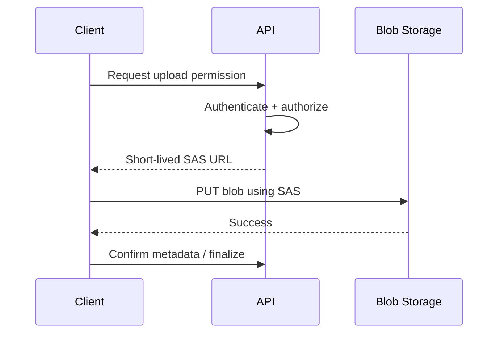
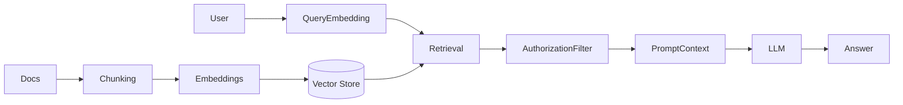

# Daily Knowledge Sharing — 2026-09-07

## Today’s Topics

1. `IDisposable`, `IAsyncDisposable` và finalizer: quản lý tài nguyên ngoài managed heap
2. ASP.NET Core model binding + validation: giữ HTTP contract tách khỏi domain invariants
3. JWT validation trong Production: issuer, audience, signing keys và clock skew
4. PostgreSQL composite index: leftmost prefix, selectivity và query-plan reasoning
5. DDD Aggregate: bảo vệ invariant mà không biến mọi object thành Aggregate Root
6. Azure Blob Storage + SAS: upload lớn, quyền tối thiểu và lifecycle của temporary access
7. Response Compression: Brotli/gzip, CPU trade-off và khi CDN nên làm thay application
8. Integration testing với real infrastructure: Testcontainers, database isolation và test reliability
9. IIS Application Pool recycle: startup failure, warm-up và deployment behavior trên Windows Server
10. RAG pipeline: chunking, embeddings, retrieval và tại sao deterministic authorization phải nằm ngoài LLM

---

# 1. `IDisposable`, `IAsyncDisposable` và finalizer: quản lý tài nguyên ngoài managed heap

## 1. What is it?

`IDisposable` và `IAsyncDisposable` là contracts để application chủ động giải phóng resource có lifecycle cần kết thúc rõ ràng: file handle, socket, database connection wrapper, stream, semaphore, native handle hoặc resource có asynchronous cleanup.

Mental model quan trọng: Garbage Collector chỉ quản lý managed memory. GC không đảm bảo resource bên ngoài managed heap được trả lại đúng thời điểm. Một object có thể nhỏ trên heap nhưng đang giữ một OS handle rất đắt.

Finalizer là cơ chế fallback do GC gọi trước khi reclaim object có finalizer, nhưng finalizer không phải substitute cho deterministic disposal. Nó chạy không xác định thời điểm, tốn thêm GC overhead và có thể kéo dài lifetime của object.

## 2. Why does it exist?

Nếu resource cleanup phụ thuộc hoàn toàn vào GC, file có thể vẫn bị lock, socket vẫn mở hoặc native handle tiếp tục tồn tại lâu sau khi code “không còn dùng object”. Trong server process dài hạn, điều này có thể dẫn tới handle exhaustion hoặc resource pressure dù managed heap trông bình thường.

`IDisposable` tồn tại để owner của resource kết thúc lifecycle ngay khi dùng xong. `IAsyncDisposable` được dùng khi cleanup bản thân có I/O, ví dụ flushing một asynchronous stream.

## 3. How does it work?

```text
Acquire resource
    |
    v
Use resource
    |
    v
Dispose / DisposeAsync
    |
    v
Return OS/native/external resource
```

`using` và `await using` compile thành `try/finally` để đảm bảo cleanup ngay cả khi exception xảy ra.

```csharp
await using var stream = await blobClient.OpenReadAsync(cancellationToken: ct);
await ProcessAsync(stream, ct);
```

Nếu class trực tiếp sở hữu một `IDisposable`, nó thường cũng cần implement `IDisposable`. Nếu chỉ tham chiếu service được DI container quản lý, không nên tự dispose service đó.

## 4. Practical implementation

Một wrapper sở hữu `SemaphoreSlim`:

```csharp
public sealed class AsyncGate : IDisposable
{
    private readonly SemaphoreSlim _semaphore = new(1, 1);
    private bool _disposed;

    public async Task<IDisposable> EnterAsync(CancellationToken ct)
    {
        ObjectDisposedException.ThrowIf(_disposed, this);
        await _semaphore.WaitAsync(ct);
        return new Releaser(_semaphore);
    }

    public void Dispose()
    {
        if (_disposed) return;
        _semaphore.Dispose();
        _disposed = true;
    }

    private sealed class Releaser(SemaphoreSlim semaphore) : IDisposable
    {
        public void Dispose() => semaphore.Release();
    }
}
```

Điểm đáng chú ý là ownership rõ ràng: `AsyncGate` tạo `SemaphoreSlim`, vì vậy `AsyncGate` chịu trách nhiệm dispose nó.

## 5. Real production scenario

Một service đọc hàng nghìn files trong background job bằng `FileStream` nhưng quên dispose khi một branch exception xảy ra. Job chạy vài giờ và cuối cùng process không mở thêm file được dù RAM chưa cao.

Root cause không phải memory leak theo nghĩa managed object giữ lại, mà là OS handle leak.

## 6. Failure scenario & troubleshooting

**Symptom** → Process báo lỗi mở file/socket, handle count tăng liên tục, memory không nhất thiết tăng tương ứng.

**Evidence** → Windows Process Explorer hoặc runtime metrics cho thấy handle count tăng theo số job đã xử lý.

**Hypothesis** → Resource lifecycle không được đóng deterministic.

**Diagnosis** → Tìm code path tạo `Stream`, `DbConnection`, `HttpResponseMessage`, native wrapper hoặc custom disposable mà thiếu `using`/`await using`.

**Fix** → Xác định ownership, thêm disposal ở đúng boundary, tránh double-dispose object do DI container quản lý.

**Verification** → Chạy soak test dài, theo dõi handle count ổn định theo thời gian.

## 7. Common mistakes

* Nghĩ GC sẽ đóng file “sớm thôi”.
* Implement finalizer cho class không sở hữu native resource.
* Tự dispose `HttpClient` mỗi request thay vì dùng `IHttpClientFactory`.
* Dispose object lấy từ DI container dù container mới là owner.
* Quên `await using` khi cleanup async có ý nghĩa.
* Dùng finalizer như business cleanup hook.

## 8. Alternatives

Nếu class không sở hữu resource cần cleanup, không cần implement disposal chỉ vì convention. Với native handles, `SafeHandle` thường tốt hơn tự viết raw finalizer logic.

## 9. Trade-offs

### Advantages

* Deterministic resource release.
* Giảm handle/socket/file exhaustion.
* Ownership rõ hơn trong design.

### Costs / Risks

* Lifecycle complexity tăng nếu ownership mơ hồ.
* `IAsyncDisposable` lan async cleanup lên caller.
* Custom finalizer làm object đắt hơn cho GC.

## 10. Junior → Middle → Senior → Technical Lead

### Junior

Hiểu managed memory khác OS/native resources và biết dùng `using`.

### Middle

Biết implement `IDisposable` đúng ownership và dùng `await using` khi cần.

### Senior

Phân biệt managed leak, handle leak và lifetime bug; tránh disposal conflict với DI container.

### Technical Lead / Architect

Thiết kế ownership boundary cho resources, library APIs và long-running processes để cleanup predictable và testable.

## 11. Key takeaway

* GC không thay thế deterministic resource cleanup.
* Dispose object bạn sở hữu; đừng dispose object mà framework/container sở hữu.
* Finalizer là safety net hiếm dùng, không phải lifecycle API chính.

---

# 2. ASP.NET Core model binding + validation: giữ HTTP contract tách khỏi domain invariants

## 1. What is it?

Model binding chuyển dữ liệu từ route, query string, headers, form hoặc request body thành .NET parameters/objects cho endpoint. Validation kiểm tra input contract trước khi business logic chạy.

Mental model quan trọng: request DTO validation và domain invariant validation là hai lớp khác nhau. “Email field bắt buộc” có thể là API contract rule; “employee không thể approve timesheet của chính mình” là business invariant và phải được bảo vệ ở domain/application boundary.

## 2. Why does it exist?

Nếu endpoint tự parse mọi string, JSON và query parameter bằng code tay, logic lặp lại và error response không nhất quán. Model binding chuẩn hóa conversion và validation ở HTTP boundary.

Nhưng nếu dồn toàn business rule vào Data Annotations, domain trở thành phụ thuộc vào transport contract và rule quan trọng có thể bị bypass từ background job hoặc message consumer.

## 3. How does it work?

```text
HTTP Request
   |
   v
Routing
   |
   v
Model Binding
   |
   v
Input Validation
   |
   v
Endpoint/Application Service
   |
   v
Domain Invariants
```

Ví dụ DTO:

```csharp
public sealed record CreateEmployeeRequest(
    [property: Required] string Name,
    [property: EmailAddress] string Email);
```

Model binding tạo object; validation có thể tạo 400 response nếu contract invalid.

## 4. Practical implementation

Minimal API với explicit validation service:

```csharp
app.MapPost("/employees", async (
    CreateEmployeeRequest request,
    IValidator<CreateEmployeeRequest> validator,
    EmployeeService service,
    CancellationToken ct) =>
{
    var result = await validator.ValidateAsync(request, ct);
    if (!result.IsValid)
    {
        return Results.ValidationProblem(
            result.Errors
                .GroupBy(x => x.PropertyName)
                .ToDictionary(
                    g => g.Key,
                    g => g.Select(x => x.ErrorMessage).ToArray()));
    }

    var employee = await service.CreateAsync(request, ct);
    return Results.Created($"/employees/{employee.Id}", employee);
});
```

Domain rule vẫn nằm bên trong `Employee` hoặc domain service, không phụ thuộc request DTO.

## 5. Real production scenario

Một hệ thống approval có REST API và Azure Service Bus consumer cùng tạo approval request. Nếu business rule chỉ tồn tại ở controller validation, message consumer có thể tạo state invalid.

Rule transport-level nên chạy ở HTTP boundary; invariant phải chạy ở business boundary được chia sẻ.

## 6. Failure scenario & troubleshooting

**Symptom** → API reject input đúng hoặc background job tạo state mà API không bao giờ cho phép.

**Evidence** → Validation rule bị duplicated giữa controller, frontend và consumer với semantics khác nhau.

**Hypothesis** → Boundary giữa input validation và domain validation bị sai.

**Diagnosis** → Phân loại từng rule: format/shape/required thuộc contract; business consistency/invariant thuộc application/domain.

**Fix** → Move invariant vào shared business layer, giữ DTO validation ở transport boundary.

**Verification** → Integration test API invalid requests và domain tests cho invariant từ cả API lẫn consumer path.

## 7. Common mistakes

* Dùng entity EF Core trực tiếp làm request model.
* Đặt business rule quan trọng chỉ trong Data Annotations.
* Tin frontend validation là đủ.
* Return generic 500 cho validation failure.
* Bind quá nhiều properties dẫn tới over-posting risk.
* Reuse một DTO cho create/update/read dù semantics khác nhau.

## 8. Alternatives

Data Annotations phù hợp validation đơn giản. FluentValidation hoặc custom validators phù hợp rule contract phức tạp hơn. Domain invariant vẫn nên ở domain/application model khi cần bảo vệ mọi entry point.

## 9. Trade-offs

### Advantages

* HTTP boundary rõ.
* Error contract nhất quán.
* Giảm parsing boilerplate.

### Costs / Risks

* Validation duplication nếu layer boundaries không rõ.
* DTO proliferation khi system lớn.
* Automatic binding có thể che mất over-posting nếu dùng entity trực tiếp.

## 10. Junior → Middle → Senior → Technical Lead

### Junior

Hiểu request JSON được bind thành .NET object trước khi business logic chạy.

### Middle

Thiết kế DTO, validation response và integration tests.

### Senior

Phân tách contract validation với invariant để tránh bypass qua non-HTTP paths.

### Technical Lead / Architect

Định ownership của validation rules giữa frontend, API, application và domain để tránh drift và duplicated truth.

## 11. Key takeaway

* Model binding là transport concern; domain invariant là business concern.
* Không dùng EF entity làm public API contract theo mặc định.
* Validation quan trọng phải được bảo vệ ở mọi entry point phù hợp.

---

# 3. JWT validation trong Production: issuer, audience, signing keys và clock skew

## 1. What is it?

JWT validation là quá trình API xác minh access token có thực sự được phát bởi trusted issuer, dành cho đúng audience, còn hiệu lực và có signature hợp lệ.

Mental model: decode JWT không phải validate JWT. Bất kỳ ai cũng có thể Base64-decode payload; security đến từ cryptographic signature + strict validation rules.

## 2. Why does it exist?

Nếu API chỉ đọc claims mà không xác minh issuer/signature/audience, attacker có thể tự tạo token chứa role hoặc permission giả.

Trong Production, key rotation, clock differences và multiple environments làm validation phức tạp hơn local development.

## 3. How does it work?

```text
Client sends bearer token
        |
        v
API reads token header
        |
        v
Resolve signing key via issuer metadata/JWKS
        |
        v
Validate signature
        |
        +--> issuer
        +--> audience
        +--> exp / nbf
        |
        v
Build ClaimsPrincipal
```

OIDC issuer thường publish metadata và JWKS. API không nên hardcode long-lived signing key khi provider hỗ trợ rotation discovery.

## 4. Practical implementation

```csharp
builder.Services
    .AddAuthentication(JwtBearerDefaults.AuthenticationScheme)
    .AddJwtBearer(options =>
    {
        options.Authority = configuration["Auth:Authority"];
        options.Audience = configuration["Auth:Audience"];
        options.TokenValidationParameters = new TokenValidationParameters
        {
            ValidateIssuer = true,
            ValidateAudience = true,
            ValidateLifetime = true,
            ClockSkew = TimeSpan.FromMinutes(1)
        };
    });
```

Không đặt `ValidateIssuer = false` chỉ để “fix Production”. Nếu token fail, cần hiểu issuer thực tế và environment config.

## 5. Real production scenario

Local API dùng tenant dev, Production dùng Entra ID app registration khác. Token hợp lệ cryptographically nhưng `aud` là client ID khác, nên Production trả 401.

Developer tắt audience validation để chạy được; điều đó biến API thành chấp nhận token cấp cho resource khác.

## 6. Failure scenario & troubleshooting

**Symptom** → Local login thành công nhưng Production 401, log báo signature key not found hoặc audience invalid.

**Evidence** → Token header `kid`, issuer `iss`, audience `aud`, `exp/nbf` khác cấu hình API.

**Hypothesis** → Config mismatch, stale metadata/JWKS hoặc clock skew.

**Diagnosis** → Inspect validated metadata, không log raw access token; so sánh issuer/audience với app registration và API resource configuration.

**Fix** → Correct Authority/Audience, đảm bảo outbound access tới metadata endpoint nếu cần, refresh signing keys theo framework behavior.

**Verification** → Test token đúng resource, token sai audience, expired token và rotated key scenario.

## 7. Common mistakes

* Chỉ decode token rồi trust claims.
* Tắt issuer/audience validation để sửa nhanh.
* Log full JWT vào centralized logs.
* Dùng ID token để gọi API thay access token.
* Clock skew quá lớn khiến expired token vẫn được chấp nhận lâu.
* Hardcode signing key không hỗ trợ rotation.

## 8. Alternatives

Opaque token + introspection có thể phù hợp một số identity systems nhưng tăng network dependency. JWT phù hợp offline validation nhưng yêu cầu key/metadata management đúng.

## 9. Trade-offs

### Advantages

* API validate token mà không gọi identity provider mỗi request.
* Claims-based authorization thuận tiện.

### Costs / Risks

* Revocation không tức thời nếu token còn hạn.
* Key rotation/config mismatch tạo production incidents.
* Token lớn tăng request overhead.

## 10. Junior → Middle → Senior → Technical Lead

### Junior

Phân biệt decode và validate token.

### Middle

Cấu hình `JwtBearer`, issuer/audience/lifetime đúng.

### Senior

Debug key rotation, multiple issuers, audience mismatch và logging/security implications.

### Technical Lead / Architect

Thiết kế token lifetime, identity boundaries, resource audiences và authorization model cho nhiều services/environments.

## 11. Key takeaway

* Signature + issuer + audience + lifetime đều là validation boundaries.
* 401 trong Production cần evidence-driven diagnosis, không phải tắt validation.
* Không log access token đầy đủ.

---

# 4. PostgreSQL composite index: leftmost prefix, selectivity và query-plan reasoning

## 1. What is it?

Composite index là index trên nhiều columns theo một thứ tự xác định, ví dụ `(tenant_id, status, created_at DESC)`.

Mental model: một composite index không phải tập hợp ba single-column indexes. Column order quyết định search path và khả năng database tận dụng index cho một query cụ thể.

## 2. Why does it exist?

Enterprise queries thường filter/sort theo nhiều dimensions. Một index đúng có thể giảm heap/page reads và tránh sort đắt tiền. Nhưng thêm index tùy tiện làm write chậm hơn, tăng storage và maintenance.

## 3. How does it work?

Ví dụ:

```sql
CREATE INDEX ix_orders_tenant_status_created
ON orders (tenant_id, status, created_at DESC);
```

Query phù hợp:

```sql
SELECT id, total, created_at
FROM orders
WHERE tenant_id = $1
  AND status = $2
ORDER BY created_at DESC
LIMIT 50;
```

B-tree thường tận dụng tốt equality columns đầu rồi range/order column phía sau. Query chỉ filter `created_at` mà bỏ qua các leading columns thường không hưởng cùng hiệu quả.

## 4. Practical implementation

Dùng `EXPLAIN (ANALYZE, BUFFERS)`:

```sql
EXPLAIN (ANALYZE, BUFFERS)
SELECT id, total, created_at
FROM orders
WHERE tenant_id = 't-123'
  AND status = 'Pending'
ORDER BY created_at DESC
LIMIT 50;
```

Đọc các tín hiệu:

* `Index Scan` hay `Seq Scan`?
* actual rows vs estimated rows có lệch lớn không?
* buffer hits/reads bao nhiêu?
* có explicit `Sort` không?
* query mất thời gian ở scan hay lock/I/O?

## 5. Real production scenario

Multi-tenant SaaS có hàng chục triệu orders. Query dashboard theo `tenant_id + status + newest first`. Chỉ có index riêng cho từng column nên planner vẫn đọc nhiều rows và sort.

Composite index đúng access pattern giảm I/O rõ rệt, nhưng cần xác minh bằng plan thay vì mặc định “càng nhiều index càng nhanh”.

## 6. Failure scenario & troubleshooting

**Symptom** → Query chậm sau khi data tăng dù đã có index ở các columns liên quan.

**Evidence** → Plan dùng Seq Scan hoặc bitmap strategy không hiệu quả, estimates sai hoặc phải sort nhiều rows.

**Hypothesis** → Index order không match predicate/order, statistics stale hoặc selectivity thấp.

**Diagnosis** → So sánh predicate shape với index definition, kiểm tra `ANALYZE`, row estimates và buffers.

**Fix** → Thiết kế index theo real query pattern; có thể dùng partial index hoặc `INCLUDE` nếu phù hợp.

**Verification** → So sánh execution time, buffers, plan stability và write overhead sau thay đổi.

## 7. Common mistakes

* Tạo một index cho mọi column.
* Nghĩ composite index luôn dùng tốt cho mọi subset columns.
* Bỏ qua write amplification.
* Chỉ nhìn execution time, không xem plan/buffers.
* Dùng `SELECT *` khiến covering strategy mất lợi ích.
* Không cập nhật statistics sau data distribution thay đổi lớn.

## 8. Alternatives

Single-column indexes đủ khi predicates độc lập. Partial index rất mạnh khi query tập trung một subset nhỏ, ví dụ `WHERE status = 'Pending'`. Materialized view phù hợp aggregation nặng nhưng tăng freshness complexity.

## 9. Trade-offs

### Advantages

* Giảm I/O đáng kể cho access pattern cụ thể.
* Có thể hỗ trợ ordering và filtering cùng lúc.

### Costs / Risks

* Tăng storage và write cost.
* Index quá specialized có value thấp.
* Data distribution thay đổi có thể khiến plan behavior đổi.

## 10. Junior → Middle → Senior → Technical Lead

### Junior

Hiểu index là data structure hỗ trợ access path, không phải magic flag.

### Middle

Biết tạo composite index từ real query pattern và đọc plan cơ bản.

### Senior

Phân tích estimates, selectivity, buffer I/O và write cost.

### Technical Lead / Architect

Định indexing strategy theo workload read/write, tenant model và operational maintenance thay vì local query tuning riêng lẻ.

## 11. Key takeaway

* Column order trong composite index là design decision quan trọng.
* Query plan + buffers đáng tin hơn trực giác.
* Mỗi index cải thiện read nhưng làm writes/storage đắt hơn.

---

# 5. DDD Aggregate: bảo vệ invariant mà không biến mọi object thành Aggregate Root

## 1. What is it?

Aggregate là một consistency boundary trong Domain-Driven Design. Aggregate Root là entry point duy nhất mà external code dùng để thay đổi state bên trong aggregate.

Mental model: Aggregate không phải “entity có repository”. Nó đại diện nhóm state cần consistency tức thời trong một transaction boundary.

## 2. Why does it exist?

Nếu mọi entity trong domain có thể bị modify độc lập, invariant xuyên nhiều object dễ bị phá. Ngược lại, nếu gom quá nhiều entities vào một aggregate khổng lồ, transaction contention và load graph tăng mạnh.

Aggregate tồn tại để cân bằng correctness boundary và transactional scope.

## 3. How does it work?

```text
Application Service
      |
      v
Aggregate Root
      |
      +--> Entity
      +--> Value Object
      |
      v
Invariant checked before state transition
```

External code không nên sửa internal collection trực tiếp. Aggregate Root expose behavior thay vì setters công khai.

## 4. Practical implementation

```csharp
public sealed class Timesheet
{
    private readonly List<TimesheetEntry> _entries = [];

    public Guid Id { get; private set; }
    public TimesheetStatus Status { get; private set; }
    public IReadOnlyCollection<TimesheetEntry> Entries => _entries;

    public void AddEntry(DateOnly date, decimal hours)
    {
        if (Status != TimesheetStatus.Draft)
            throw new InvalidOperationException("Only draft timesheets can be edited.");

        if (hours <= 0 || hours > 24)
            throw new ArgumentOutOfRangeException(nameof(hours));

        _entries.Add(new TimesheetEntry(date, hours));
    }

    public void Submit()
    {
        if (_entries.Count == 0)
            throw new InvalidOperationException("Cannot submit an empty timesheet.");

        Status = TimesheetStatus.Submitted;
    }
}
```

Repository, nếu có, thường load/save root chứ không expose repository riêng cho internal entity.

## 5. Real production scenario

Order có `OrderItems`. Nếu code cho phép update item trực tiếp mà không đi qua `Order`, total, discount threshold hoặc order status invariant có thể lệch.

Nhưng `Customer` không nhất thiết phải chứa toàn bộ orders trong cùng aggregate. Đó là một consistency boundary quá lớn.

## 6. Failure scenario & troubleshooting

**Symptom** → Database chứa state technically valid theo FK nhưng business-invalid, ví dụ submitted timesheet không có entry.

**Evidence** → Multiple code paths update child rows trực tiếp.

**Hypothesis** → Consistency boundary không được enforce ở domain model.

**Diagnosis** → Xác định invariant cần atomic consistency; trace các write paths vượt qua root.

**Fix** → Encapsulate state transition qua root, giảm public setters, điều chỉnh repository/use cases.

**Verification** → Domain tests + integration tests chứng minh invalid transitions không thể persist.

## 7. Common mistakes

* Mỗi entity đều là Aggregate Root.
* Aggregate = database table group.
* Aggregate chứa quá nhiều object vì “cùng business domain”.
* Public setters phá encapsulation.
* Dùng MediatR/Repository rồi gọi đó là DDD.
* Cố giữ consistency tức thời giữa bounded contexts qua distributed transaction.

## 8. Alternatives

Anemic model + application services có thể đủ cho CRUD-centric domain đơn giản. Rich aggregate hữu ích khi invariants và state transitions thực sự phức tạp. Không nên dùng DDD tactical patterns cho mọi module.

## 9. Trade-offs

### Advantages

* Business rules tập trung và khó bypass.
* Transaction boundary rõ hơn.
* Domain model diễn đạt intent tốt.

### Costs / Risks

* Over-modeling làm code nặng.
* Aggregate quá lớn gây concurrency/contention.
* ORM mapping có thể phức tạp hơn CRUD model đơn giản.

## 10. Junior → Middle → Senior → Technical Lead

### Junior

Hiểu entity không chỉ là row, và behavior có thể bảo vệ state.

### Middle

Implement root methods, value objects và invariant tests.

### Senior

Chọn consistency boundary đúng, tránh oversized aggregate và persistence leakage.

### Technical Lead / Architect

Quyết định module nào đủ CRUD, module nào cần DDD, và invariant nào cần atomic transaction vs eventual consistency.

## 11. Key takeaway

* Aggregate là consistency boundary, không phải folder/repository convention.
* Giữ aggregate nhỏ theo invariant cần atomicity.
* DDD chỉ đáng giá khi business complexity justify complexity kỹ thuật.

---

# 6. Azure Blob Storage + SAS: upload lớn, quyền tối thiểu và lifecycle của temporary access

## 1. What is it?

Azure Blob Storage là object storage cho files/blobs. SAS (Shared Access Signature) cấp quyền giới hạn theo resource, operation và thời gian mà không cần chia sẻ storage account key.

Mental model: SAS là delegated temporary capability. Ai có SAS hợp lệ có thể thực hiện quyền được cấp trong thời hạn đó, vì vậy URL SAS bản thân là sensitive credential.

## 2. Why does it exist?

Nếu mọi file upload đi xuyên qua web server, server phải chịu bandwidth và memory/connection pressure lớn. Direct-to-Blob upload giúp client upload trực tiếp vào storage sau khi backend cấp temporary permission.

Nhưng cấp storage account key cho client là unacceptable vì quyền quá lớn và khó revoke theo request.

## 3. How does it work?



Backend vẫn quyết định user có quyền upload path nào, file size/type policy nào; SAS chỉ chuyển data-plane transfer sang storage.

## 4. Practical implementation

Nếu dùng User Delegation SAS với Managed Identity là lựa chọn phù hợp, tránh account key trong app config.

Ví dụ conceptual generation bằng SDK:

```csharp
var sasBuilder = new BlobSasBuilder
{
    BlobContainerName = containerName,
    BlobName = blobName,
    Resource = "b",
    StartsOn = DateTimeOffset.UtcNow.AddMinutes(-1),
    ExpiresOn = DateTimeOffset.UtcNow.AddMinutes(10)
};

sasBuilder.SetPermissions(BlobSasPermissions.Create | BlobSasPermissions.Write);
```

Không cấp `Delete`, `List`, `Read` nếu upload flow không cần.

## 5. Real production scenario

CMS cho editor upload video 500 MB. Nếu API nhận multipart rồi buffer/upload tiếp, App Service instance chịu double bandwidth và request duration rất dài.

Direct upload bằng short-lived SAS giảm app load và scale tốt hơn. API chỉ giữ metadata/finalization workflow.

## 6. Failure scenario & troubleshooting

**Symptom** → User báo SAS hết hạn giữa upload hoặc unauthorized dù vừa nhận URL.

**Evidence** → Large upload trên mạng chậm vượt expiry; clock mismatch; permissions không bao gồm required operation.

**Hypothesis** → SAS lifetime/permission không match upload behavior.

**Diagnosis** → Kiểm tra expiry, resource path, HTTP verb, storage logs và client upload duration.

**Fix** → Chọn expiry đủ cho workload nhưng vẫn ngắn; dùng block blob/chunk upload cho file lớn; renew SAS qua authenticated API nếu cần.

**Verification** → Test slow-network upload, expired SAS, path tampering và unauthorized user.

## 7. Common mistakes

* Log SAS URL đầy đủ.
* Cấp account key cho frontend.
* SAS expiry hàng ngày/tháng không cần thiết.
* Cấp permissions rộng hơn use case.
* Tin client-supplied blob path mà không authorize.
* Không scan/validate file sau upload nếu business yêu cầu security checks.

## 8. Alternatives

Proxy upload qua API đơn giản hơn cho file nhỏ và policy rất chặt. Direct upload hợp lý cho payload lớn. Managed upload gateways có thể phù hợp nếu cần virus scanning/content processing pipeline.

## 9. Trade-offs

### Advantages

* Giảm application bandwidth và memory pressure.
* Scale file transfer độc lập với API.
* Least-privilege temporary access.

### Costs / Risks

* Upload flow phức tạp hơn.
* SAS URL cần bảo vệ như credential.
* Cleanup orphan blobs và finalize metadata cần thiết kế.

## 10. Junior → Middle → Senior → Technical Lead

### Junior

Hiểu Blob Storage lưu object và SAS cấp quyền tạm thời.

### Middle

Implement direct upload, expiry, permissions và metadata finalization.

### Senior

Thiết kế chunking, retry, orphan cleanup, security scanning và observability.

### Technical Lead / Architect

Quyết định proxy vs direct upload dựa trên payload size, security, network cost và operational ownership.

## 11. Key takeaway

* SAS nên ngắn hạn và least privilege.
* Direct-to-Blob upload giảm App Service pressure đáng kể cho file lớn.
* SAS URL là secret; đừng log hoặc expose rộng.

---

# 7. Response Compression: Brotli/gzip, CPU trade-off và khi CDN nên làm thay application

## 1. What is it?

Response Compression giảm kích thước HTTP payload bằng thuật toán như gzip hoặc Brotli trước khi gửi qua network.

Mental model: compression đổi CPU lấy bandwidth/latency. Không phải response nào cũng nên compress; file đã nén như JPEG, MP4 hoặc ZIP thường không hưởng lợi đáng kể.

## 2. Why does it exist?

JSON, HTML, CSS, JavaScript và text compress rất tốt. Với client ở xa hoặc mobile network, giảm bytes transfer có thể cải thiện page/API latency rõ rệt.

Nhưng compress dynamic response ở application cho mọi request có thể tăng CPU và giảm throughput dưới load cao.

## 3. How does it work?

Client gửi:

```http
Accept-Encoding: br, gzip
```

Server/CDN chọn encoding và trả:

```http
Content-Encoding: br
Vary: Accept-Encoding
```

`Vary` giúp caches phân biệt representation nén khác nhau.

## 4. Practical implementation

ASP.NET Core:

```csharp
builder.Services.AddResponseCompression(options =>
{
    options.EnableForHttps = true;
    options.Providers.Add<BrotliCompressionProvider>();
    options.Providers.Add<GzipCompressionProvider>();
});

var app = builder.Build();
app.UseResponseCompression();
```

Sau đó đo CPU, response size và latency thay vì giả định level nén cao nhất là tốt nhất.

## 5. Real production scenario

Marketing website qua Akamai phục vụ JS/CSS/static JSON. Nếu origin compress mọi static asset mỗi request, CPU app lãng phí vì edge CDN hoàn toàn có thể cache compressed representation.

Một architecture tốt hơn thường để CDN xử lý static compression/caching, application tập trung dynamic responses.

## 6. Failure scenario & troubleshooting

**Symptom** → Sau bật Brotli level cao, bandwidth giảm nhưng CPU tăng mạnh và p99 API xấu hơn.

**Evidence** → Payload nhỏ hơn, app CPU saturation cao hơn, compression middleware chiếm CPU trong profile.

**Hypothesis** → Compression cost vượt bandwidth benefit ở current workload.

**Diagnosis** → So sánh payload types/sizes, client network, CPU profile và CDN behavior.

**Fix** → Giảm compression level, exclude small/already-compressed content, offload static content cho CDN.

**Verification** → Load test lại p95/p99, throughput, CPU và bytes transferred.

## 7. Common mistakes

* Compress JPEG/ZIP/MP4.
* Dùng max compression level trong hot path.
* Không đặt `Vary: Accept-Encoding` đúng khi cache.
* Compress response rất nhỏ không đáng cost.
* Application và CDN cùng làm redundant work.
* Chỉ nhìn transfer size mà không đo CPU/latency.

## 8. Alternatives

CDN/edge compression phù hợp static/public content. Pre-compressed assets phù hợp build pipeline. Application compression phù hợp dynamic text response nếu CPU budget cho phép.

## 9. Trade-offs

### Advantages

* Giảm network bytes.
* Cải thiện latency trên slow links.
* Brotli thường hiệu quả tốt cho text assets.

### Costs / Risks

* CPU overhead.
* Cache complexity.
* Có thể làm tail latency tệ hơn khi app CPU-bound.

## 10. Junior → Middle → Senior → Technical Lead

### Junior

Hiểu nén giảm bytes nhưng dùng CPU.

### Middle

Cấu hình middleware và kiểm tra headers bằng DevTools/curl.

### Senior

Load test, profile CPU và phân loại content types.

### Technical Lead / Architect

Quyết định compression nằm ở origin, reverse proxy hay CDN dựa trên traffic, caching và cost model.

## 11. Key takeaway

* Compression là CPU-vs-bandwidth trade-off.
* CDN thường là nơi tốt hơn cho static content compression.
* Đo p95/p99 + CPU + transfer size cùng lúc.

---

# 8. Integration testing với real infrastructure: Testcontainers, database isolation và test reliability

## 1. What is it?

Integration test xác minh nhiều real components hoạt động cùng nhau: application code, EF Core mapping, SQL translation, database constraints, serialization, routing hoặc message broker behavior.

Testcontainers cho phép test khởi chạy temporary Docker containers như PostgreSQL, SQL Server, Redis để test gần Production behavior hơn mock.

## 2. Why does it exist?

Unit test với mocked repository không phát hiện SQL translation lỗi, migration sai, collation khác, unique constraint hoặc transaction behavior thực tế.

Nhưng shared permanent test database cũng dễ tạo flaky test do data leakage và test chạy song song.

## 3. How does it work?

```text
Test runner
   |
   v
Start disposable container
   |
   v
Apply schema/migrations
   |
   v
Run tests against real service
   |
   v
Destroy container
```

Test vẫn cần isolation ở data level: transaction rollback, unique schema/database per test suite hoặc deterministic cleanup.

## 4. Practical implementation

Ví dụ PostgreSQL container:

```csharp
public sealed class PostgresFixture : IAsyncLifetime
{
    private readonly PostgreSqlContainer _container =
        new PostgreSqlBuilder()
            .WithImage("postgres:16-alpine")
            .Build();

    public string ConnectionString => _container.GetConnectionString();

    public Task InitializeAsync() => _container.StartAsync();
    public Task DisposeAsync() => _container.DisposeAsync().AsTask();
}
```

Test sau đó build real `DbContextOptions` với connection string này và apply migrations.

## 5. Real production scenario

Một LINQ query pass unit test vì repository mock trả in-memory collection nhưng fail Production do EF Core không translate custom method sang SQL.

Integration test chạy real provider sẽ bắt lỗi trước deployment.

## 6. Failure scenario & troubleshooting

**Symptom** → Test suite thỉnh thoảng fail khi chạy CI song song nhưng pass khi chạy riêng.

**Evidence** → Tests dùng cùng rows/database, cleanup phụ thuộc order.

**Hypothesis** → Test isolation kém chứ không phải application race condition.

**Diagnosis** → Track shared test data, sequence dependency, container/database reuse và parallel execution.

**Fix** → Unique identifiers, isolated schema/database, Respawn/transaction strategy hoặc fixture scope rõ ràng.

**Verification** → Chạy suite lặp lại nhiều lần và parallelized trong CI.

## 7. Common mistakes

* Mock EF Core `DbSet` và nghĩ đó là database integration test.
* Dùng EF InMemory provider để test relational semantics.
* Shared test DB không cleanup deterministic.
* E2E hóa mọi thứ làm suite quá chậm.
* Pin image `latest` gây drift bất ngờ.
* Không test migrations trên real provider.

## 8. Alternatives

Unit tests nhanh cho pure domain logic. SQLite có thể useful nhưng không hoàn toàn giống SQL Server/PostgreSQL. Testcontainers phù hợp khi provider-specific behavior quan trọng.

## 9. Trade-offs

### Advantages

* Bắt lỗi integration thực tế.
* Reproducible infrastructure.
* Giảm dependency vào shared CI environments.

### Costs / Risks

* Test chậm hơn unit tests.
* Docker dependency trong CI/dev.
* Setup/cleanup phức tạp hơn.

## 10. Junior → Middle → Senior → Technical Lead

### Junior

Phân biệt unit test và integration test.

### Middle

Viết API/DB integration tests với deterministic data.

### Senior

Thiết kế fixture scope, provider parity và flaky-test diagnosis.

### Technical Lead / Architect

Xây test strategy theo risk: unit cho logic, integration cho contracts/infrastructure, E2E cho critical journeys.

## 11. Key takeaway

* Mock không thể chứng minh database/provider behavior.
* Real infrastructure test đáng giá ở các boundaries có risk cao.
* Isolation quan trọng hơn số lượng integration tests.

---

# 9. IIS Application Pool recycle: startup failure, warm-up và deployment behavior trên Windows Server

## 1. What is it?

IIS Application Pool cung cấp process isolation cho web applications trên Windows Server. Worker process (`w3wp.exe`) chạy application; recycle tạo worker process mới theo event/config mà không nhất thiết restart toàn IIS.

Mental model: recycle là process lifecycle event. Mọi in-memory state, local cache, timers và static singleton state có thể mất khi process cũ kết thúc.

## 2. Why does it exist?

Process isolation giúp một application lỗi không kéo toàn IIS xuống, đồng thời cho phép resource limits, identities và recycling policies riêng.

Nhưng application phải được thiết kế stateless enough để process restart không làm mất business correctness.

## 3. How does it work?

```text
IIS receives request
      |
      v
Application Pool
      |
      v
w3wp.exe
      |
      v
ASP.NET Core Module / application process model
```

Tùy hosting model, ASP.NET Core Module quản lý request forwarding/process integration. Deployment hoặc recycle có thể tạo startup window và warm-up behavior.

## 4. Practical implementation

Health endpoint:

```csharp
builder.Services.AddHealthChecks()
    .AddSqlServer(configuration.GetConnectionString("Default")!);

app.MapHealthChecks("/health/ready");
```

Application initialization/warm-up nên chỉ kiểm tra dependencies cần thiết; không chạy migration dài hoặc pre-load hàng GB cache trong startup path.

## 5. Real production scenario

Legacy enterprise app deploy lên IIS. Sau deployment, file copy thành công nhưng first request mất 40 giây vì app startup, JIT và cache warm-up. Load balancer gửi traffic ngay khiến users thấy 502/503.

Deployment tốt hơn cần readiness/warm-up trước khi route traffic đầy đủ.

## 6. Failure scenario & troubleshooting

**Symptom** → Sau deploy, site 503 hoặc Application Pool stop; local chạy bình thường.

**Evidence** → Windows Event Viewer, IIS logs, stdout logs của ASP.NET Core Module cho thấy startup exception hoặc permission/config error.

**Hypothesis** → Hosting/config/filesystem identity khác local.

**Diagnosis** → Check App Pool identity, environment variables, certificate access, filesystem permissions, installed hosting bundle và event logs.

**Fix** → Correct runtime/hosting bundle, permissions/config; không random recycle như “fix”.

**Verification** → Recycle có chủ đích, chạy health checks, warm-up và theo dõi startup telemetry.

## 7. Common mistakes

* Lưu session/business state chỉ trong process memory.
* Dùng recycle để che memory leak.
* Không đọc Event Viewer/IIS logs.
* App Pool identity không có quyền certificate/file.
* Startup chạy migration nguy hiểm đồng thời trên nhiều servers.
* Deploy trực tiếp rồi route traffic ngay.

## 8. Alternatives

Azure App Service giảm Windows/IIS operational burden nhưng vẫn có process restart/startup concerns. Containers giúp environment reproducibility nhưng thêm orchestration complexity.

## 9. Trade-offs

### Advantages

* Mature Windows hosting.
* Process isolation và enterprise compatibility tốt.
* Phù hợp nhiều legacy workloads.

### Costs / Risks

* Windows/IIS-specific operations.
* Configuration drift giữa servers.
* Recycle/startup behavior cần observability.

## 10. Junior → Middle → Senior → Technical Lead

### Junior

Hiểu IIS host application qua Application Pool/worker process.

### Middle

Debug bindings, permissions, logs và startup failures.

### Senior

Thiết kế warm-up, statelessness, deployment/recycle strategy.

### Technical Lead / Architect

Quyết định tiếp tục IIS, migrate App Service/container hay modernization khác dựa trên operational cost và compatibility.

## 11. Key takeaway

* Recycle là process restart event; in-memory state không được xem là durable.
* Event Viewer + IIS/ANCM logs là evidence quan trọng cho startup failure.
* Deployment cần health validation và warm-up, không chỉ “copy file thành công”.

---

# 10. RAG pipeline: chunking, embeddings, retrieval và tại sao deterministic authorization phải nằm ngoài LLM

## 1. What is it?

RAG (Retrieval-Augmented Generation) là architecture trong đó application tìm các tài liệu/chunks liên quan từ knowledge source rồi đưa chúng vào context cho LLM tạo response.

Mental model: RAG không “dạy model dữ liệu mới”. Nó cung cấp evidence runtime cho model. Retrieval quality và authorization boundary quyết định model nhìn thấy context nào.

## 2. Why does it exist?

LLM base knowledge có thể stale, không biết private enterprise data và có thể hallucinate. RAG giúp ground response vào tài liệu hiện tại mà không fine-tune model cho từng knowledge change.

Nhưng nếu retrieval layer trả tài liệu user không có quyền xem, model có thể leak nội dung dù prompt nói “đừng tiết lộ”. Security phải enforced trước context construction.

## 3. How does it work?



Chunking ảnh hưởng retrieval granularity. Embedding chuyển text thành vector representation phục vụ similarity search. Retrieval thường kết hợp metadata filters, lexical search hoặc reranking.

## 4. Practical implementation

Pseudo-near-production C# flow:

```csharp
public async Task<string> AskAsync(
    UserContext user,
    string question,
    CancellationToken ct)
{
    var queryVector = await embeddings.CreateAsync(question, ct);

    var candidates = await vectorStore.SearchAsync(
        queryVector,
        topK: 20,
        metadataFilter: new { TenantId = user.TenantId },
        ct);

    var authorized = candidates
        .Where(x => authorization.CanRead(user, x.DocumentMetadata))
        .Take(6)
        .ToList();

    var context = string.Join("\n\n", authorized.Select(x => x.Text));

    return await llm.AnswerAsync(question, context, ct);
}
```

Authorization filter là deterministic code. Model không được quyết định tenant/document access.

## 5. Real production scenario

Enterprise assistant index policies, project documents và customer records. Nếu vector search chỉ filter semantic similarity mà không filter tenant/security metadata, employee A có thể retrieve chunk của customer B.

Prompt-level instruction không đủ vì leak đã xảy ra ngay lúc context được đưa vào model.

## 6. Failure scenario & troubleshooting

**Symptom** → Model trả câu trả lời không liên quan hoặc trích tài liệu user không nên thấy.

**Evidence** → Retrieved chunks có low relevance hoặc wrong tenant/document ACL.

**Hypothesis** → Retrieval/configuration problem, không phải “model reasoning” đơn thuần.

**Diagnosis** → Log document IDs, scores, metadata filters, latency và retrieval traces; không log sensitive full content nếu policy không cho phép.

**Fix** → Improve chunking, metadata filtering, hybrid retrieval/reranking, enforce deterministic ACL trước prompt.

**Verification** → Offline eval set đo retrieval recall/precision, security tests cho cross-tenant access và answer grounding metrics.

## 7. Common mistakes

* Dùng vector similarity như authorization.
* Chunk theo kích thước cố định mà bỏ structure/semantics.
* Top-K rất lớn rồi nhét hết vào context.
* Không version/reindex embeddings khi model/schema đổi.
* Đánh giá chỉ bằng vài demo queries.
* Cho LLM quyết định action tài chính/security-critical mà không deterministic guardrails.

## 8. Alternatives

Simple full-text search đủ cho nhiều knowledge bases nhỏ. Hybrid search kết hợp lexical + vector thường robust hơn pure vector. Fine-tuning phù hợp behavior/style hơn việc cập nhật factual private knowledge liên tục.

## 9. Trade-offs

### Advantages

* Ground response bằng current/private data.
* Dễ update knowledge hơn fine-tuning.
* Có thể cite source/evidence.

### Costs / Risks

* Retrieval quality trở thành hệ thống riêng phải monitor.
* Embedding/indexing cost.
* Prompt injection/data leakage risk.
* Eventual consistency giữa source documents và index.

## 10. Junior → Middle → Senior → Technical Lead

### Junior

Hiểu RAG = retrieve evidence rồi mới generate.

### Middle

Implement chunking, embeddings, vector search và basic metadata filters.

### Senior

Thiết kế evals, reranking, index lifecycle, security filters và observability.

### Technical Lead / Architect

Quyết định liệu RAG có cần thiết, dữ liệu nào được index, ACL enforcement nằm ở đâu và logic nào bắt buộc deterministic.

## 11. Key takeaway

* RAG quality phụ thuộc retrieval, không chỉ model quality.
* Authorization phải chạy deterministic trước khi context đến LLM.
* Eval retrieval và security riêng biệt, không chỉ nhìn câu trả lời cuối.
