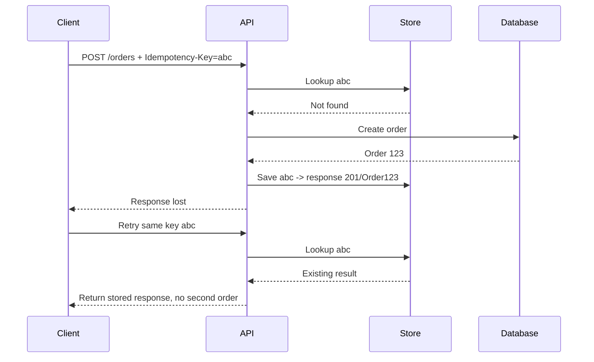

# Daily Knowledge Sharing — 2026-09-07

## Today’s Topics

1. C# source generators vs reflection: chuyển work từ runtime sang compile time có thực sự đáng giá?
2. HTTP idempotency keys trong ASP.NET Core: ngăn duplicate side effect mà không phá semantics của API
3. EF Core raw SQL: composability, parameterization và ranh giới giữa LINQ với SQL thủ công
4. SQL Server cardinality estimation: khi execution plan sai vì database đoán sai số lượng rows
5. MongoDB compound index: ESR guideline, sort coverage và trade-off giữa read speed với write cost
6. Circuit Breaker + Bulkhead + Retry: resilience pipeline đúng thứ tự để tránh retry storm
7. Azure App Service autoscaling: scale-out, sticky state và graceful shutdown dưới production traffic
8. Expand-Contract database migration: deploy schema thay đổi mà vẫn giữ backward compatibility
9. Headless CMS vs traditional CMS: content ownership, delivery boundary và operational complexity
10. AI-assisted repository analysis: source grounding, verification và cách tránh agent “đọc nhầm kiến trúc”

---

# 1. C# source generators vs reflection: chuyển work từ runtime sang compile time có thực sự đáng giá?

## 1. What is it?

Source Generator là cơ chế của Roslyn cho phép analyzer chạy trong quá trình compile và sinh thêm C# source code vào compilation. Mental model quan trọng là: thay vì application chờ đến runtime rồi dùng reflection để khám phá type, attribute hoặc metadata, một phần work có thể được thực hiện trước tại compile time.

Reflection thì đi theo hướng ngược lại: application inspect metadata của assemblies/types khi đang chạy. Reflection rất linh hoạt, nhưng flexibility đó đi kèm runtime overhead, trimming/AOT complexity và khả năng fail muộn hơn.

## 2. Why does it exist?

Nhiều framework cần lặp lại cùng một loại work:

* tìm property có attribute
* tạo serializer metadata
* generate mapping code
* đăng ký DI services
* build strongly typed API clients

Nếu làm bằng reflection mỗi lần process start hoặc request hot path, application phải trả runtime cost cho một thứ compiler có thể biết trước.

Source generators tồn tại để chuyển một số discovery/boilerplate work sang build time, tăng khả năng static validation và giảm reflection dependency khi Native AOT hoặc trimming quan trọng.

## 3. How does it work?

```text
Your source code
      |
      v
Roslyn compilation
      |
      +--> Source Generator inspects syntax/semantic model
      |
      +--> Emits additional .cs source
      |
      v
Final compilation
      |
      v
Assembly
```

Generator không sửa source file gốc. Nó cung cấp source bổ sung vào compilation.

Reflection flow khác:

```text
Application starts
      |
      v
Load assembly metadata
      |
      v
Discover types / methods / properties
      |
      v
Build runtime behavior
```

## 4. Practical implementation

Ví dụ rất đơn giản: thay vì reflection để tìm property cho serialization, `System.Text.Json` hỗ trợ source generation:

```csharp
using System.Text.Json.Serialization;

[JsonSerializable(typeof(EmployeeDto))]
[JsonSourceGenerationOptions(
    PropertyNamingPolicy = JsonKnownNamingPolicy.CamelCase)]
public partial class AppJsonContext : JsonSerializerContext
{
}
```

Sau đó:

```csharp
var json = JsonSerializer.Serialize(
    employee,
    AppJsonContext.Default.EmployeeDto);
```

Điểm chính không phải syntax. Điểm chính là metadata serialization đã được generate trước thay vì runtime reflection discovery.

## 5. Real production scenario

Một ASP.NET Core API có hàng trăm DTO và đang chuẩn bị chạy Native AOT cho một workload serverless yêu cầu startup nhanh. Reflection-heavy serialization và dynamic type discovery gây warnings khi trimming và làm cold start khó dự đoán.

Source-generated metadata giúp startup ổn định hơn và giảm các dependency vào runtime discovery.

## 6. Failure scenario & troubleshooting

**Symptom** → Build pass ở runtime thường, nhưng Native AOT publish phát sinh trimming warnings hoặc production missing metadata.

**Evidence** → Stack trace cho thấy reflection trên members bị trimmed; serializer cần metadata không còn tồn tại.

**Hypothesis** → Runtime reflection dependency không tương thích tốt với trimming/AOT assumptions.

**Diagnosis** → Kiểm tra publish warnings, reflection usage và source-generation support của library liên quan.

**Fix** → Dùng source-generated metadata ở hot/critical paths, hoặc annotate reflection requirements đúng cách nếu dynamic behavior thực sự cần thiết.

**Verification** → Publish AOT/trimming build, chạy integration tests trên artifact thực tế và đo startup/allocation.

## 7. Common mistakes

* Dùng source generator chỉ vì “nhanh hơn” mà không profiling.
* Tự viết generator phức tạp để thay vài dòng reflection startup-only.
* Không tính đến build complexity và debugging experience.
* Generate code khó đọc, khó trace khi lỗi.
* Giả định source generation loại bỏ mọi runtime reflection.

## 8. Alternatives

* Reflection: đơn giản và đủ tốt khi discovery ít, startup không critical.
* Hand-written mapping/registration: rõ ràng nhưng boilerplate.
* Expression trees hoặc compiled delegates: phù hợp một số runtime dynamic cases.
* Source generation: tốt khi metadata ổn định, hot path hoặc AOT/trimming quan trọng.

## 9. Trade-offs

### Advantages

* Giảm runtime discovery cost.
* Static diagnostics sớm hơn.
* Hợp với AOT/trimming.
* Có thể giảm allocations/startup time.

### Costs / Risks

* Build pipeline phức tạp hơn.
* Debug generated code khó hơn.
* Incremental generator viết kém có thể làm build chậm.
* Dynamic use cases vẫn cần reflection.

## 10. Junior → Middle → Senior → Technical Lead

### Junior

Hiểu compile time và runtime là hai phase khác nhau; reflection là runtime discovery.

### Middle

Biết sử dụng source-generated APIs có sẵn như `System.Text.Json` khi có nhu cầu thực tế.

### Senior

Đo startup/allocation, hiểu trimming/AOT và quyết định reflection nào thực sự cần loại bỏ.

### Technical Lead / Architect

Quyết định có đáng nhận thêm build/tooling complexity để đổi lấy runtime predictability hay không; không biến source generation thành architecture goal tự thân.

## 11. Key takeaway

* Source Generator đổi runtime flexibility lấy compile-time work và predictability.
* Reflection không xấu; vấn đề là dùng nó ở đâu và với tần suất nào.
* AOT/trimming là lý do mạnh hơn “micro-performance” để cân nhắc source generation.

---

# 2. HTTP idempotency keys trong ASP.NET Core: ngăn duplicate side effect mà không phá semantics của API

## 1. What is it?

Idempotency nghĩa là thực hiện cùng một operation nhiều lần nhưng business effect cuối cùng giống như thực hiện một lần.

HTTP methods như `GET`, `PUT`, `DELETE` được thiết kế có idempotent semantics ở protocol level, nhưng `POST` thường không. Idempotency key là một application-level mechanism để client gắn một key duy nhất cho operation; server ghi nhớ result của key đó và không thực hiện side effect lần thứ hai.

## 2. Why does it exist?

Distributed systems không thể giả định request chỉ đến một lần.

Ví dụ client gửi `POST /payments`, server commit database thành công nhưng response bị mất do network timeout. Client không biết operation đã thành công nên retry.

Nếu server đơn giản tạo payment lần nữa, user bị charge hai lần.

## 3. How does it work?



Key phải được scoped hợp lý, ví dụ theo user/tenant + endpoint + operation.

## 4. Practical implementation

Một model đơn giản:

```csharp
public sealed class IdempotencyRecord
{
    public required string Key { get; init; }
    public required string Scope { get; init; }
    public int StatusCode { get; set; }
    public string? ResponseBody { get; set; }
    public string? RequestHash { get; set; }
    public DateTimeOffset CreatedAt { get; init; }
}
```

Endpoint:

```csharp
app.MapPost("/orders", async (
    HttpRequest request,
    CreateOrderRequest body,
    AppDbContext db,
    CancellationToken ct) =>
{
    var key = request.Headers["Idempotency-Key"].SingleOrDefault();
    if (string.IsNullOrWhiteSpace(key))
        return Results.BadRequest("Idempotency-Key is required");

    var scope = $"orders:create:{body.CustomerId}";

    var existing = await db.IdempotencyRecords
        .SingleOrDefaultAsync(x => x.Key == key && x.Scope == scope, ct);

    if (existing is not null)
        return Results.Content(existing.ResponseBody!, statusCode: existing.StatusCode);

    // business operation + idempotency record should share a reliable transaction boundary
    // when using the same database.

    return Results.Created();
});
```

Production implementation nên có unique constraint trên `(Scope, Key)` để concurrent retries không vượt qua check cùng lúc.

## 5. Real production scenario

Mobile app tạo booking. User bấm “Confirm”, network 4G chập chờn khiến request timeout. App retry sau 2 giây.

Backend không có idempotency protection tạo hai bookings khác nhau. UI chỉ hiển thị một vì request đầu không nhận response, nhưng downstream inventory đã giữ hai slots.

## 6. Failure scenario & troubleshooting

**Symptom** → Duplicate orders/payments xuất hiện chủ yếu khi latency cao hoặc mobile network không ổn định.

**Evidence** → Correlation logs cho thấy hai requests payload giống nhau trong vài giây nhưng request IDs khác nhau.

**Hypothesis** → Client retry sau timeout và endpoint `POST` không idempotent.

**Diagnosis** → Correlate client retry policy, network timeout và database creation timestamps.

**Fix** → Idempotency key + unique constraint + replay stored result; bảo đảm side effect và idempotency record không tạo race window.

**Verification** → Chạy concurrent/retry tests với cùng key; chỉ một business entity được tạo.

## 7. Common mistakes

* Chỉ check key bằng query rồi insert, không có unique constraint.
* Cho cùng key nhưng payload khác mà vẫn replay silently.
* TTL idempotency record quá ngắn so với retry window.
* Dùng request ID thay cho idempotency key; request ID thường thay đổi mỗi retry.
* Cho server tự generate key sau khi request đã tới, mất ý nghĩa dedup từ client intent.

## 8. Alternatives

* Natural business key/unique constraint: tốt nếu domain có identity tự nhiên.
* PUT với client-chosen resource ID: rất đẹp khi resource semantics phù hợp.
* Message-level deduplication: hữu ích downstream nhưng không thay API idempotency.

## 9. Trade-offs

### Advantages

* Bảo vệ duplicate side effect do retry.
* Cho phép client retry an toàn hơn.
* Rất quan trọng với payment/order/booking workflows.

### Costs / Risks

* Phải lưu state cho key.
* Cần expiry policy.
* Payload mismatch detection tăng complexity.
* Transaction boundary phải thiết kế cẩn thận.

## 10. Junior → Middle → Senior → Technical Lead

### Junior

Hiểu retry có thể tạo duplicate business effect.

### Middle

Implement idempotency record, unique constraint và basic replay.

### Senior

Xử lý concurrent duplicate, request hash, TTL, partial failure và downstream side effects.

### Technical Lead / Architect

Quyết định endpoint nào bắt buộc idempotency, scope/key ownership nằm ở client hay server, retention bao lâu và consistency boundary ra sao.

## 11. Key takeaway

* Retry an toàn chỉ khi operation có idempotency semantics rõ.
* Idempotency key cần database-level uniqueness, không chỉ application `if`.
* Timeout không có nghĩa operation thất bại; đó chính là lý do duplicate xảy ra.

---

# 3. EF Core raw SQL: composability, parameterization và ranh giới giữa LINQ với SQL thủ công

## 1. What is it?

EF Core cho phép dùng raw SQL khi LINQ translation không diễn đạt tốt query cần thiết hoặc khi cần gọi stored procedure/native SQL feature. Mental model đúng là raw SQL không phải “thoát khỏi EF Core”; nó vẫn đi qua DbContext, mapping và connection/transaction lifecycle nếu dùng đúng API.

## 2. Why does it exist?

LINQ cung cấp type safety và composability rất tốt, nhưng không phải mọi SQL construct/provider feature đều translate tối ưu.

Một số reporting query, window function phức tạp, database hint hoặc stored procedure có thể rõ và hiệu quả hơn bằng SQL trực tiếp.

## 3. How does it work?

Ví dụ `FromSqlInterpolated`:

```csharp
var minTotal = 1000m;

var customers = await db.Customers
    .FromSqlInterpolated($"""
        SELECT c.*
        FROM Customers c
        WHERE c.TotalSpend >= {minTotal}
        """)
    .AsNoTracking()
    .ToListAsync(ct);
```

Interpolation ở API đúng sẽ tạo parameter, không nối literal trực tiếp.

Một query có thể composable:

```csharp
var query = db.Customers
    .FromSqlInterpolated($"SELECT * FROM Customers WHERE Region = {region}")
    .Where(x => x.IsActive);
```

EF Core sẽ compose LINQ bên ngoài raw SQL khi provider/query shape cho phép.

## 4. Practical implementation

Không làm:

```csharp
var sql = $"SELECT * FROM Users WHERE Email = '{email}'";
var users = await db.Users.FromSqlRaw(sql).ToListAsync(ct);
```

Làm:

```csharp
var users = await db.Users
    .FromSqlInterpolated($"SELECT * FROM Users WHERE Email = {email}")
    .AsNoTracking()
    .ToListAsync(ct);
```

Nếu tên column/table cần dynamic, parameterization không áp dụng cho identifier; phải whitelist thay vì đưa input trực tiếp vào SQL.

## 5. Real production scenario

Dashboard tài chính có query gồm CTE, window function và aggregate phức tạp. LINQ expression dài, khó review, SQL generated không ổn định giữa provider versions.

Team chuyển riêng read-model query đó sang raw SQL được test bằng integration test, trong khi CRUD thông thường vẫn dùng LINQ.

## 6. Failure scenario & troubleshooting

**Symptom** → Security scan báo SQL injection hoặc production query fail khi input chứa `'`.

**Evidence** → Code dùng `FromSqlRaw` với string interpolation/concatenation.

**Hypothesis** → User input được đưa vào SQL text thay vì parameter.

**Diagnosis** → Inspect generated SQL/parameters và source path tạo string.

**Fix** → Dùng `FromSqlInterpolated` hoặc explicit parameters; whitelist identifiers.

**Verification** → Test malicious inputs, inspect executed commands và chạy security tests.

## 7. Common mistakes

* Nghĩ raw SQL luôn nhanh hơn LINQ.
* String concatenate user input.
* Return full entity khi chỉ cần projection nhỏ.
* Dùng raw SQL làm default vì developer quen SQL hơn LINQ.
* Không có integration test cho provider-specific SQL.
* Quên rằng tracked entity từ raw SQL vẫn có Change Tracker semantics nếu không `AsNoTracking()`.

## 8. Alternatives

* LINQ: default tốt cho maintainability/type safety.
* Raw SQL trong EF Core: hợp query đặc biệt nhưng vẫn cần DbContext.
* Dapper: hữu ích khi read-heavy SQL-first layer cần mapping nhẹ.
* Stored procedure: hợp khi database ownership/logic thực sự justify.

## 9. Trade-offs

### Advantages

* Full SQL expressiveness.
* Dễ tối ưu provider-specific query.
* Có thể rõ hơn LINQ quá phức tạp.

### Costs / Risks

* Coupling chặt hơn với database dialect.
* Refactor compile-time safety giảm.
* Injection risk nếu API dùng sai.
* Test setup cần real database nhiều hơn.

## 10. Junior → Middle → Senior → Technical Lead

### Junior

Hiểu parameterization và tại sao string concatenation nguy hiểm.

### Middle

Biết khi nào dùng `FromSqlInterpolated`, `ExecuteSql*` và `AsNoTracking()`.

### Senior

So sánh generated SQL, execution plan, maintainability và provider coupling.

### Technical Lead / Architect

Đặt boundary rõ: LINQ là default, raw SQL là explicit optimization/read-model tool chứ không biến persistence layer thành hỗn hợp tùy hứng.

## 11. Key takeaway

* Raw SQL là escape hatch có chủ đích, không phải default.
* Parameterization là security requirement, không phải style preference.
* Chọn LINQ hay SQL dựa trên clarity + plan + maintenance, không dựa trên niềm tin rằng một bên “luôn nhanh hơn”.

---

# 4. SQL Server cardinality estimation: khi execution plan sai vì database đoán sai số lượng rows

## 1. What is it?

Cardinality estimation là quá trình optimizer ước lượng số rows đi qua từng operator trước khi query chạy. Optimizer dùng estimates này để chọn join algorithm, index access, memory grant và plan shape.

Một plan có thể tệ không phải vì SQL syntax sai, mà vì optimizer dự đoán sai dữ liệu.

## 2. Why does it exist?

Optimizer cần chọn plan trước khi biết chính xác runtime rows. Nó phải dựa vào statistics, predicates và assumptions.

Nếu estimate là 10 rows nhưng thực tế là 5 triệu rows, Nested Loops có thể được chọn trong khi Hash Join hợp hơn. Nếu estimate quá lớn, memory grant có thể quá cao và gây concurrency pressure.

## 3. How does it work?

```text
Query predicate
      |
      v
Statistics histogram / density
      |
      v
Estimated rows
      |
      v
Cost model
      |
      v
Chosen execution plan
      |
      v
Actual execution
```

Khi đọc execution plan cần so sánh:

```text
Estimated Rows vs Actual Rows
```

Khoảng cách lớn thường là signal quan trọng.

## 4. Practical implementation

Ví dụ:

```sql
SELECT o.Id, o.CustomerId, o.Total
FROM Orders o
WHERE o.Status = @status
  AND o.CreatedAt >= @from;
```

Nếu `Status = 'Pending'` chỉ chiếm 0.1% rows nhưng `Status = 'Completed'` chiếm 90%, một cached plan cho một value có thể không phù hợp value khác.

Kiểm tra actual plan và statistics:

```sql
DBCC SHOW_STATISTICS ('dbo.Orders', 'IX_Orders_Status_CreatedAt');
```

Không nên update statistics mù trước khi xác định estimate problem thực sự tồn tại.

## 5. Real production scenario

API order search thường chạy với `Status='Completed'`, nhưng batch job thỉnh thoảng gọi `Status='Pending'`. Một plan cached từ distribution khác làm query latency tăng từ 100 ms lên 20 giây.

CPU database tăng, connection pool bắt đầu chờ và API p99 tăng theo.

## 6. Failure scenario & troubleshooting

**Symptom** → Cùng SQL text lúc nhanh lúc chậm tùy parameter.

**Evidence** → Actual plan cho thấy Estimated Rows lệch hàng nghìn lần so với Actual Rows.

**Hypothesis** → Statistics/cardinality/parameter sensitivity dẫn đến plan không phù hợp.

**Diagnosis** → Capture Query Store/actual plan, compare parameter values, estimates, operators, reads và memory grant.

**Fix** → Tùy evidence: cập nhật statistics, index phù hợp, rewrite predicate, Parameter Sensitive Plan feature, `OPTION (RECOMPILE)` cho case đặc biệt hoặc split query paths.

**Verification** → Test representative parameter distributions, không chỉ một sample value.

## 7. Common mistakes

* Thấy slow query là thêm index ngay.
* Chỉ nhìn operator cost percentage.
* Không so estimated vs actual rows.
* Benchmark với một parameter duy nhất.
* Dùng `RECOMPILE` toàn bộ nơi mà compile cost cao.
* Không kiểm tra Query Store sau deployment.

## 8. Alternatives

Không có một fix universal. Các lựa chọn gồm statistics maintenance, better indexing, query rewrite, plan forcing có kiểm soát hoặc tách query path theo distribution.

## 9. Trade-offs

### Advantages của recompile/specialized plan

* Có thể chọn plan phù hợp runtime parameter.

### Costs / Risks

* Compile CPU tăng.
* Plan forcing có thể trở nên sai khi data distribution thay đổi.
* More indexes làm write cost tăng.

## 10. Junior → Middle → Senior → Technical Lead

### Junior

Hiểu execution plan là optimizer estimate trước khi query chạy.

### Middle

Biết đọc estimated/actual rows và logical reads.

### Senior

Liên kết statistics, parameter distribution, join choice, memory grant và latency.

### Technical Lead / Architect

Thiết kế observability/Query Store và quyết định fix ở query, schema hay workload boundary thay vì áp dụng hint dài hạn không kiểm soát.

## 11. Key takeaway

* Bad plan thường bắt đầu từ bad estimate.
* Estimated vs Actual Rows là một trong các signal mạnh nhất khi đọc plan.
* Query tuning phải dùng representative data distribution.

---

# 5. MongoDB compound index: ESR guideline, sort coverage và trade-off giữa read speed với write cost

## 1. What is it?

Compound index là index trên nhiều fields theo thứ tự xác định. Trong MongoDB, field order quyết định loại query/sort nào có thể sử dụng index hiệu quả.

Một mental model hữu ích là ESR guideline:

**Equality → Sort → Range**

Nó không phải luật tuyệt đối, nhưng là điểm khởi đầu tốt cho nhiều query patterns.

## 2. Why does it exist?

Ví dụ query:

```javascript
db.orders.find({
  tenantId: "t1",
  status: "Pending",
  createdAt: { $gte: ISODate("2026-09-01") }
}).sort({ priority: -1 })
```

Single-field indexes riêng lẻ không nhất thiết tạo access path tối ưu. Compound index có thể hỗ trợ filter + sort trong cùng traversal.

## 3. How does it work?

Một index:

```javascript
{ tenantId: 1, status: 1, priority: -1, createdAt: 1 }
```

cho phép narrowing theo equality fields trước, giữ sort order theo `priority`, rồi xử lý range `createdAt`.

Nếu range field đứng quá sớm, phần phía sau có thể ít hữu ích hơn cho sort/index bounds.

## 4. Practical implementation

```javascript
db.orders.createIndex({
  tenantId: 1,
  status: 1,
  priority: -1,
  createdAt: 1
})
```

Kiểm tra plan:

```javascript
db.orders.find({
  tenantId: "t1",
  status: "Pending",
  createdAt: { $gte: ISODate("2026-09-01") }
})
.sort({ priority: -1 })
.explain("executionStats")
```

Quan tâm tới:

* `totalKeysExamined`
* `totalDocsExamined`
* returned documents
* có in-memory sort hay không

## 5. Real production scenario

SaaS notification center query theo tenant + unread status + sort newest-first. Collection có hàng chục triệu documents.

Index chỉ trên `createdAt` khiến query scan rất nhiều docs của tenants khác. Compound index bắt đầu bằng `tenantId` giúp bounded access theo tenant tốt hơn.

## 6. Failure scenario & troubleshooting

**Symptom** → Query latency tăng dần theo collection size dù CPU application ổn.

**Evidence** → `docsExamined` cao gấp hàng nghìn lần `nReturned`; query có blocking sort.

**Hypothesis** → Index không match access pattern/order.

**Diagnosis** → `explain("executionStats")`, đo index size và write latency.

**Fix** → Thiết kế compound index theo dominant access pattern, nhưng loại indexes dư thừa.

**Verification** → Keys/docs examined giảm, sort stage biến mất khi đúng, write cost vẫn trong budget.

## 7. Common mistakes

* Tạo index cho từng field riêng lẻ và nghĩ MongoDB sẽ luôn combine tốt.
* Dùng ESR như luật bất biến.
* Tạo quá nhiều compound indexes.
* Không xem tenant/partition access pattern.
* Index field có cardinality rất thấp mà không kết hợp đúng context.

## 8. Alternatives

* Single-field index: đủ cho query đơn giản.
* Compound index: phù hợp stable multi-field access pattern.
* Denormalized/materialized read model: hợp khi query shape rất đặc thù.
* Chuyển workload sang search engine nếu full-text/relevance là yêu cầu chính.

## 9. Trade-offs

### Advantages

* Giảm scanned documents.
* Có thể cover filter + sort.
* Latency ổn định hơn khi collection lớn.

### Costs / Risks

* Mỗi index tăng write amplification.
* Tốn memory/disk.
* Quá nhiều indexes làm planner và operations phức tạp.

## 10. Junior → Middle → Senior → Technical Lead

### Junior

Hiểu index order matter.

### Middle

Biết dùng `explain()` và đọc docs/keys examined.

### Senior

Thiết kế index từ access pattern, sort/range/selectivity và đo write cost.

### Technical Lead / Architect

Quyết định data model/index strategy dựa trên read/write workload thật; biết khi nào query requirement đang ép document model đi sai hướng.

## 11. Key takeaway

* Compound index phải bắt đầu từ access pattern, không từ danh sách fields.
* ESR là heuristic, không phải giáo điều.
* Read speed luôn được mua bằng write/storage cost.

---

# 6. Circuit Breaker + Bulkhead + Retry: resilience pipeline đúng thứ tự để tránh retry storm

## 1. What is it?

Retry, Circuit Breaker và Bulkhead giải quyết ba vấn đề khác nhau:

* **Retry**: transient failure có thể thành công nếu thử lại.
* **Circuit Breaker**: dependency đang unhealthy thì tạm ngừng gọi để tránh làm tình hình tệ hơn.
* **Bulkhead**: giới hạn lượng resource/concurrency một dependency được phép chiếm.

Chúng không phải ba checkbox bật độc lập. Cách compose quyết định failure behavior.

## 2. Why does it exist?

Một remote API bắt đầu timeout 10 giây. Nếu 1.000 requests cùng retry 3 lần, hệ thống tạo tới 3.000 calls vào dependency đang chết, chiếm sockets/threads/connections và gây cascading failure.

## 3. How does it work?

```text
Request
  |
  v
Bulkhead / concurrency limit
  |
  v
Circuit Breaker
  |
  v
Timeout
  |
  v
Retry with backoff + jitter
  |
  v
Remote dependency
```

Thứ tự cụ thể tùy library/policy semantics, nhưng mental model là cần bounded concurrency + bounded time + bounded retry.

## 4. Practical implementation

Với .NET resilience stack hiện đại, cấu hình phải thể hiện budget rõ ràng. Pseudo-config gần production:

```csharp
services.AddHttpClient("reviews", client =>
{
    client.BaseAddress = new Uri(config.ReviewsBaseUrl);
})
.AddStandardResilienceHandler(options =>
{
    options.TotalRequestTimeout.Timeout = TimeSpan.FromSeconds(5);
    options.AttemptTimeout.Timeout = TimeSpan.FromSeconds(2);
    options.Retry.MaxRetryAttempts = 2;
    options.Retry.Delay = TimeSpan.FromMilliseconds(200);
    options.CircuitBreaker.SamplingDuration = TimeSpan.FromSeconds(30);
});
```

Điểm quan trọng là timeout/retry budget phải nhỏ hơn upstream SLA, không phải copy default.

## 5. Real production scenario

Product page gọi review provider. Provider latency tăng từ 200 ms lên 8 giây.

Nếu request page chờ reviews bắt buộc, toàn product page chậm. Nếu retry aggressive, app instances cạn connection pool HTTP.

Một thiết kế tốt hơn: timeout ngắn, circuit breaker, stale cached reviews hoặc render page không reviews khi dependency degraded.

## 6. Failure scenario & troubleshooting

**Symptom** → Dependency outage nhỏ biến thành API-wide latency spike.

**Evidence** → Outbound calls tăng gấp nhiều lần inbound requests; retry count tăng, sockets/concurrency saturated.

**Hypothesis** → Retry amplification + không có isolation.

**Diagnosis** → Trace một inbound request qua từng retry attempt, đo concurrent outbound calls, timeout distribution và breaker state.

**Fix** → Giảm attempts, thêm exponential backoff+jitter, concurrency limit/bulkhead, circuit breaker và fallback business-aware.

**Verification** → Chaos test dependency timeout; application vẫn giữ p95/throughput trong degradation target.

## 7. Common mistakes

* Retry mọi lỗi, kể cả `400`/validation.
* Retry non-idempotent operation mù.
* Timeout 30s × 3 attempts trong request SLA 10s.
* Circuit breaker nhưng không có fallback/degradation strategy.
* Mỗi service tự chọn policy khác nhau không có observability.

## 8. Alternatives

* Không retry: đúng nếu operation không idempotent hoặc failure không transient.
* Queue/messaging: hợp khi business không cần synchronous completion.
* Cache/stale data: hợp read dependency có freshness tolerance.

## 9. Trade-offs

### Advantages

* Resilience trước transient failures.
* Isolation tốt hơn khi dependency degraded.
* Giảm cascading failure.

### Costs / Risks

* Policy sai có thể làm outage nặng hơn.
* Circuit breaker gây temporary rejection kể cả dependency vừa hồi phục.
* Fallback có thể tạo stale/partial data semantics.

## 10. Junior → Middle → Senior → Technical Lead

### Junior

Hiểu remote call có thể timeout và retry không phải luôn an toàn.

### Middle

Configure timeout/retry cơ bản và log attempts.

### Senior

Thiết kế budget, jitter, breaker threshold, idempotency và degradation behavior.

### Technical Lead / Architect

Quyết định dependency nào được synchronous, failure propagation tới đâu và resilience policy có phù hợp business criticality hay không.

## 11. Key takeaway

* Retry là load multiplier.
* Resilience cần bounded time + bounded concurrency + bounded attempts.
* Fallback phải có business semantics rõ, không chỉ “catch exception rồi return null”.

---

# 7. Azure App Service autoscaling: scale-out, sticky state và graceful shutdown dưới production traffic

## 1. What is it?

Azure App Service scale-out tăng số application instances để chia traffic. Autoscale thay đổi instance count theo metric/rule hoặc platform capability.

Mental model quan trọng: khi scale-out, application phải hành xử như một distributed application nhiều process độc lập. Memory local, static variable và background timer không còn là global state.

## 2. Why does it exist?

Một instance có giới hạn CPU, memory và concurrent work. Khi traffic tăng, scale-up có giới hạn; scale-out tăng capacity bằng nhiều instances.

Nhưng scale-out chỉ hiệu quả nếu downstream database/cache và application state model chịu được concurrency tăng.

## 3. How does it work?

```text
Client
  |
  v
App Service front end / load balancing
  |
  +--> Instance A
  +--> Instance B
  +--> Instance C
          |
          v
      Shared DB / Redis / APIs
```

Khi instance bị scale-in/recycle, process nhận shutdown window. Long-running request/background work phải handle cancellation/graceful termination.

## 4. Practical implementation

Không giữ session-critical state trong static memory:

```csharp
public static Dictionary<string, Cart> Carts = new(); // dangerous in multi-instance
```

Thay bằng shared store nếu business cần cross-request/shared state:

```csharp
builder.Services.AddStackExchangeRedisCache(options =>
{
    options.Configuration = configuration.GetConnectionString("Redis");
});
```

Background work phải nhận `CancellationToken`:

```csharp
protected override async Task ExecuteAsync(CancellationToken stoppingToken)
{
    while (!stoppingToken.IsCancellationRequested)
    {
        await consumer.ProcessNextAsync(stoppingToken);
    }
}
```

## 5. Real production scenario

SaaS API scale từ 2 lên 8 instances khi CPU > 70%. API latency vẫn tăng vì SQL Database connection/session capacity không đổi; tổng connection pool potential tăng 4 lần.

Scale-out application đã chuyển bottleneck xuống database.

## 6. Failure scenario & troubleshooting

**Symptom** → Autoscale tăng instances nhưng p95 không giảm, SQL timeouts tăng.

**Evidence** → App CPU giảm nhưng DB active sessions/IO/locks tăng mạnh.

**Hypothesis** → Downstream dependency là bottleneck thật.

**Diagnosis** → Compare before/after scale: app CPU, request queue, DB connections, query latency, Redis/external APIs.

**Fix** → Tối ưu/bound concurrency, cache đúng chỗ, scale database khi justified; không scale app mù.

**Verification** → Load test toàn system, không chỉ web tier.

## 7. Common mistakes

* Static/in-memory state cần nhất quán giữa instances.
* Timer job chạy trên từng instance.
* Pool sizes không tính theo tổng instance count.
* Scale rule dựa một metric duy nhất.
* Không test scale-in shutdown.
* Dùng sticky sessions để che state design problem.

## 8. Alternatives

* Scale-up: đơn giản hơn nhưng có ceiling.
* Azure Container Apps/AKS: control/scaling model khác, operational cost cao hơn.
* Queue-based load leveling: tốt với background workload.

## 9. Trade-offs

### Advantages

* Tăng capacity và availability.
* Có thể hấp thụ traffic burst.

### Costs / Risks

* Downstream load tăng.
* Shared-state complexity.
* Scale lag/cold startup.
* Cost tăng theo instance count.

## 10. Junior → Middle → Senior → Technical Lead

### Junior

Hiểu nhiều instances không share memory.

### Middle

Biết dùng distributed cache/session và graceful cancellation.

### Senior

Capacity-plan connection pools, background work, scale metrics và downstream bottlenecks.

### Technical Lead / Architect

Quyết định scale dimension nào thực sự giải quyết bottleneck và hệ thống có đủ statelessness/observability để scale-out an toàn hay không.

## 11. Key takeaway

* Scale-out app không tự động scale toàn hệ thống.
* Tổng downstream concurrency tăng theo instance count.
* Multi-instance semantics phải được thiết kế trước, không chữa bằng sticky session sau.

---

# 8. Expand-Contract database migration: deploy schema thay đổi mà vẫn giữ backward compatibility

## 1. What is it?

Expand-Contract là chiến lược thay đổi database schema theo nhiều bước để version cũ và mới của application có thể cùng chạy trong rollout.

Thay vì rename/drop column trực tiếp, ta:

1. **Expand**: thêm schema mới nhưng giữ schema cũ.
2. Migrate code/data dần.
3. **Contract**: chỉ xóa schema cũ sau khi không còn consumer.

## 2. Why does it exist?

Trong rolling/Blue-Green deployment, old và new app versions có thể chạy đồng thời. Nếu migration rename/drop column ngay, version cũ có thể crash giữa deployment.

Database rollback thường khó hơn code rollback vì data đã thay đổi.

## 3. How does it work?

Ví dụ đổi `FullName` thành `FirstName` + `LastName`:

```text
Phase 1: Add FirstName, LastName (keep FullName)
Phase 2: New app writes both / reads new with fallback
Phase 3: Backfill old rows
Phase 4: Stop old app versions
Phase 5: Remove fallback and old writes
Phase 6: Drop FullName later
```

## 4. Practical implementation

Migration đầu:

```sql
ALTER TABLE Customers ADD FirstName nvarchar(100) NULL;
ALTER TABLE Customers ADD LastName  nvarchar(100) NULL;
```

Application transitional write:

```csharp
customer.FirstName = request.FirstName;
customer.LastName = request.LastName;
customer.FullName = $"{request.FirstName} {request.LastName}".Trim();
```

Sau backfill và khi old version không còn, mới remove `FullName` ở một deployment sau.

## 5. Real production scenario

E-commerce release dùng deployment slot swap. New code deploy thành công nhưng migration drop column `LegacySku` trước swap. Production slot cũ vẫn đang chạy và query column đó trong vài phút, gây 500 trước khi swap hoàn tất.

Expand-Contract tránh breaking schema trong coexistence window.

## 6. Failure scenario & troubleshooting

**Symptom** → Deployment mới chưa route traffic nhưng production cũ bắt đầu 500 ngay sau migration.

**Evidence** → SQL exception invalid column/missing object ở old version.

**Hypothesis** → Migration không backward compatible.

**Diagnosis** → Map app versions đang live với schema contract mỗi version cần.

**Fix** → Restore compatible schema nếu có thể; về lâu dài tách destructive migration sang contract release riêng.

**Verification** → Test old + new artifacts cùng against expanded schema trong staging.

## 7. Common mistakes

* Rename/drop column cùng deployment code.
* `NOT NULL` column mới không default/backfill strategy.
* Backfill hàng triệu rows trong blocking transaction.
* Assume slot swap nghĩa chỉ một version chạm DB.
* Không biết background workers cũ vẫn chạy.

## 8. Alternatives

* Maintenance window: đơn giản nếu downtime được phép.
* Blue-Green với separate database: isolation tốt nhưng data cutover phức tạp.
* Expand-Contract: phù hợp continuous deployment/shared database.

## 9. Trade-offs

### Advantages

* Rollout/rollback an toàn hơn.
* Hỗ trợ coexistence nhiều app versions.

### Costs / Risks

* Schema tạm thời phức tạp.
* Dual-write/backfill cần correctness.
* Cleanup bị trì hoãn dễ thành technical debt.

## 10. Junior → Middle → Senior → Technical Lead

### Junior

Hiểu code version và schema version có thể coexist.

### Middle

Viết additive migration và backfill an toàn.

### Senior

Thiết kế dual-read/write, batching backfill, rollback và monitoring.

### Technical Lead / Architect

Đặt deployment contract: destructive schema changes chỉ được contract sau khi mọi consumer cũ đã biến mất và evidence xác nhận an toàn.

## 11. Key takeaway

* Database migration là phần của release architecture.
* Additive trước, destructive sau thường an toàn hơn.
* Rollback code vô nghĩa nếu schema đã phá version cũ.

---

# 9. Headless CMS vs traditional CMS: content ownership, delivery boundary và operational complexity

## 1. What is it?

Traditional CMS thường quản lý content + page composition + rendering trong cùng platform. Headless CMS tách content management khỏi presentation; frontend lấy content qua API và tự render.

Mental model quan trọng: headless không đơn giản là “CMS có API”. Nó thay đổi ownership boundary giữa editorial platform và frontend application.

## 2. Why does it exist?

Khi cùng content cần phục vụ web, mobile, kiosk hoặc nhiều frontend stacks, presentation bị coupling chặt vào CMS rendering có thể hạn chế reuse.

Headless giúp content trở thành channel-neutral hơn, nhưng đổi lại preview, personalization, caching và editorial composition phức tạp hơn.

## 3. How does it work?

Traditional:

```text
Editor -> CMS content + page composition -> CMS rendering -> Browser
```

Headless:

```text
Editor -> CMS content model -> Content API
                              |
                              +--> Web frontend
                              +--> Mobile app
                              +--> Other channels
```

Trong Optimizely, cùng platform có thể dùng traditional rendering hoặc content-delivery/headless patterns tùy architecture.

## 4. Practical implementation

Một content DTO frontend-oriented:

```csharp
public sealed record HeroBlockDto(
    string Heading,
    string? Subheading,
    string ImageUrl,
    string? CtaText,
    string? CtaUrl);
```

API layer nên map CMS internal model thành stable contract thay vì leak mọi CMS-specific field/type nếu frontend cần loose coupling.

## 5. Real production scenario

Marketing site dùng Optimizely traditional MVC rendering và editor preview rất tốt. Sau đó mobile app cần reuse product editorial content.

Thay toàn site thành headless có thể không cần thiết. Một lựa chọn tốt hơn là expose content API cho shared content domains trong khi giữ traditional rendering cho marketing pages có editor composition mạnh.

## 6. Failure scenario & troubleshooting

**Symptom** → Editors publish content nhưng frontend headless hiển thị stale/khác preview.

**Evidence** → CMS publish thành công; CDN/API cache giữ version cũ; preview environment dùng contract khác production.

**Hypothesis** → Delivery/caching boundary tách khỏi editorial publish lifecycle.

**Diagnosis** → Trace publish event → API → CDN → frontend cache; kiểm tra locale/version/personalization context.

**Fix** → Thiết kế cache invalidation/purge và preview contract rõ; observability cho content version.

**Verification** → Publish test content và xác minh propagated version end-to-end.

## 7. Common mistakes

* Chọn headless vì trend.
* Model content theo component UI quá cụ thể, mất reuse.
* Leak CMS internals trực tiếp cho frontend.
* Bỏ qua preview/editor experience.
* Không tính CDN/cache invalidation.
* Dùng headless nhưng vẫn coupling frontend vào every CMS schema detail.

## 8. Alternatives

* Traditional CMS: tốt cho content-heavy web, editorial composition cao.
* Headless: tốt cho multi-channel/independent frontend lifecycle.
* Hybrid: thường thực tế nhất trong enterprise migration.

## 9. Trade-offs

### Advantages của headless

* Frontend technology freedom.
* Multi-channel reuse.
* Independent delivery pipeline.

### Costs / Risks

* Preview/personalization phức tạp hơn.
* Thêm API/cache/integration components.
* Editorial workflow có thể kém trực quan nếu modeling sai.

## 10. Junior → Middle → Senior → Technical Lead

### Junior

Hiểu content management và rendering có thể tách nhau.

### Middle

Implement content API mapping, caching và frontend consumption.

### Senior

Thiết kế preview, versioning, localization, cache invalidation và failure behavior.

### Technical Lead / Architect

Quyết định boundary nào cần headless thật sự; tránh biến modernization CMS thành rewrite frontend + content model cùng lúc nếu business không justify.

## 11. Key takeaway

* Headless là boundary decision, không phải feature checkbox.
* Editorial experience là requirement kiến trúc thực sự.
* Hybrid architecture thường hợp lý hơn “all headless” hoặc “all traditional”.

---

# 10. AI-assisted repository analysis: source grounding, verification và cách tránh agent “đọc nhầm kiến trúc”

## 1. What is it?

AI-assisted repository analysis dùng coding agent/LLM để đọc source tree, search symbol, trace dependencies, review architecture hoặc đề xuất thay đổi.

Mental model đúng: model là probabilistic reasoning layer trên context được cung cấp. Nếu context thiếu hoặc retrieval sai, câu trả lời có thể rất thuyết phục nhưng sai repository thực tế.

## 2. Why does it exist?

Repository enterprise có thể hàng nghìn files. Human phải tốn nhiều thời gian tìm entry points, dependency registration, configuration và data flows.

Agent có thể tăng tốc discovery, nhưng chỉ hữu ích nếu output grounded vào files/symbols thật và được verify.

## 3. How does it work?

```text
User question
    |
    v
Repository search / file retrieval
    |
    v
Relevant context
    |
    v
LLM reasoning
    |
    v
Claim / recommendation
    |
    v
Verification against code, build, tests, docs
```

Nếu bỏ bước retrieval hoặc verification:

```text
Prompt -> model prior knowledge -> plausible but ungrounded answer
```

## 4. Practical implementation

Một workflow tốt khi hỏi agent “Authentication chạy thế nào?”:

1. Tìm `AddAuthentication`, `AddAuthorization`, `UseAuthentication`, `UseAuthorization`.
2. Tìm config `Authority`, `Audience`, schemes.
3. Trace custom handlers/policies.
4. Tìm integration tests.
5. Chỉ sau đó tạo architecture summary.

Khi agent đề xuất code, chạy:

```bash
dotnet build
dotnet test
```

và static analysis nếu pipeline có.

## 5. Real production scenario

Agent thấy `IRepository<T>` trong một module và kết luận toàn hệ thống dùng Generic Repository. Thực tế nhiều modules mới inject `DbContext` trực tiếp; generic repository chỉ còn ở legacy module.

Nếu architect dựa vào summary không grounded, họ có thể đề xuất “standardize repository” và vô tình kéo legacy abstraction trở lại toàn codebase.

## 6. Failure scenario & troubleshooting

**Symptom** → AI review nói project dùng Redis distributed cache nhưng developer không tìm thấy production registration nào.

**Evidence** → Agent dựa vào package reference hoặc test helper, không trace runtime DI/configuration.

**Hypothesis** → Retrieval/context selection nhầm evidence.

**Diagnosis** → Yêu cầu claim map tới exact files/symbols; phân biệt package present vs runtime configured vs actively used.

**Fix** → Ground analysis vào entry points, runtime wiring, call sites và tests; verify bằng search/build.

**Verification** → Human hoặc deterministic tool có thể reproduce evidence độc lập.

## 7. Common mistakes

* Hỏi kiến trúc toàn repo nhưng chỉ cung cấp README.
* Coi package reference là bằng chứng technology đang dùng.
* Model nhìn example/test code rồi kết luận production behavior.
* Chấp nhận API/package version do model nhớ mà không check project file.
* Cho agent refactor lớn trước khi baseline tests/build pass.
* Dùng generated tests như bằng chứng code đúng khi tests cũng do cùng model suy ra.

## 8. Alternatives

* Manual code exploration: chậm hơn nhưng tốt cho high-risk decisions.
* Static analysis/code graph tools: deterministic hơn nhưng reasoning kém linh hoạt.
* Tốt nhất thường là kết hợp: search/static tools cung cấp evidence, LLM tổng hợp và human review quyết định.

## 9. Trade-offs

### Advantages

* Tăng tốc repository discovery.
* Hữu ích cho cross-cutting trace và migration analysis.
* Có thể surface candidate risks nhanh.

### Costs / Risks

* Hallucinated relationships.
* Context truncation.
* Overconfident recommendations.
* Token/tool cost với repository lớn.

## 10. Junior → Middle → Senior → Technical Lead

### Junior

Hiểu AI output phải kiểm tra với source code.

### Middle

Biết yêu cầu agent cite files/symbols và chạy build/tests sau thay đổi.

### Senior

Phân biệt evidence, inference và assumption; kiểm soát scope/refactor blast radius.

### Technical Lead / Architect

Thiết kế agent workflow có source grounding, verification gates, human approval và deterministic checks cho security/correctness-critical changes.

## 11. Key takeaway

* AI repository analysis mạnh nhất khi retrieval và verification mạnh.
* “Có package” không đồng nghĩa “đang dùng trong runtime architecture”.
* Security, authorization, data correctness và production behavior phải được kiểm chứng bằng deterministic evidence.
