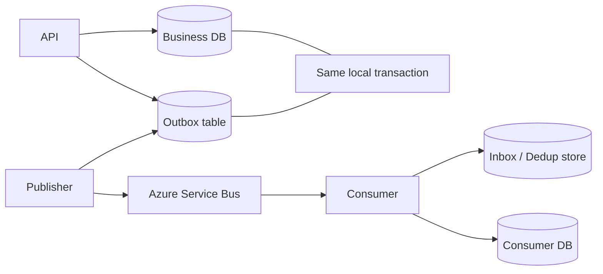

# Daily Knowledge Sharing — 2026-09-07

## Today’s Topics

1. .NET ThreadPool starvation: sync-over-async, blocking và vì sao CPU thấp vẫn có thể làm API treo
2. ASP.NET Core streaming + backpressure: xử lý payload lớn mà không biến RAM thành buffer vô hạn
3. EF Core DbContext pooling: khác gì connection pooling và khi nào pooling làm lộ bug state leakage
4. SQL keyset pagination: tránh OFFSET ngày càng chậm trên bảng lớn
5. Azure Cosmos DB partition key: hot partition, RU distribution và data modeling theo access pattern
6. Outbox + Inbox Pattern: nối database transaction với message delivery mà không giả vờ có exactly-once
7. Azure Key Vault + Managed Identity: secretless access, rotation và failure mode khi identity/network sai
8. Kubernetes readiness, liveness và startup probes: tránh tự tạo restart loop khi dependency chậm
9. OpenTelemetry distributed tracing: trace context, sampling và cách nối request với dependency latency
10. SonarQube, code coverage và static analysis: dùng quality signal để quản lý risk thay vì chạy theo score

---

# 1. .NET ThreadPool starvation: sync-over-async, blocking và vì sao CPU thấp vẫn có thể làm API treo

## 1. What is it?

ThreadPool starvation xảy ra khi application cần thêm worker threads để tiếp tục xử lý work nhưng phần lớn threads hiện có đang bị block hoặc chiếm giữ quá lâu. Mental model quan trọng: một ASP.NET Core API có thể “đứng” dù CPU chưa 100% nếu request pipeline đang chờ threads rảnh để continuation chạy.

Trong .NET, nhiều asynchronous continuations, timers và framework callbacks dùng ThreadPool. Nếu code biến asynchronous I/O thành blocking wait bằng `.Result`, `.Wait()`, `GetAwaiter().GetResult()` hoặc giữ worker thread trong synchronous network/database call, throughput có thể sụp theo kiểu nonlinear dưới load.

## 2. Why does it exist?

ThreadPool tồn tại để tái sử dụng một tập worker threads thay vì tạo thread mới cho mọi request/work item. Với I/O-bound workload, async/await giúp thread được trả lại pool trong lúc chờ network hoặc storage.

Nếu application block thread cho mỗi request, concurrency thực tế bị giới hạn bởi số worker threads. Khi traffic tăng, request mới phải xếp hàng. Runtime có cơ chế hill-climbing để bổ sung threads, nhưng việc tăng thread không tức thời và không miễn phí. Quá nhiều threads lại làm context switching và memory overhead tăng.

## 3. How does it work?

```text
HTTP requests arrive
       |
       v
ThreadPool workers execute handlers
       |
       +--> async I/O -> thread returned to pool
       |
       +--> blocking wait -> thread remains occupied

Many blocking waits
       |
       v
ThreadPool queue grows
       |
       v
Continuations cannot run promptly
       |
       v
p95/p99 latency explodes
```

Đây là lý do CPU thấp không loại trừ bottleneck. CPU có thể rảnh vì threads đang ngủ/chờ, không phải vì hệ thống có capacity.

## 4. Practical implementation

Code nguy hiểm:

```csharp
public IActionResult GetEmployee(string id)
{
    var employee = employeeClient.GetAsync(id).Result;
    return Ok(employee);
}
```

Tốt hơn:

```csharp
public async Task<IActionResult> GetEmployee(
    string id,
    CancellationToken cancellationToken)
{
    var employee = await employeeClient.GetAsync(id, cancellationToken);
    return Ok(employee);
}
```

Nếu bạn có CPU-bound work thật sự nặng, đừng mặc định bọc bằng `Task.Run` trong ASP.NET Core. `Task.Run` vẫn dùng ThreadPool và có thể chỉ chuyển bottleneck sang queue khác. CPU-heavy workloads thường cần bounded concurrency, dedicated worker hoặc scale-out riêng.

## 5. Real production scenario

Một e-commerce API gọi 3 downstream services. Developer dùng `.Result` để “giữ code đơn giản”. Local test với vài requests không sao. Khi peak traffic đạt 500 concurrent requests, worker threads bị giữ trong network wait. Request queue tăng, p99 vượt 10 giây dù CPU chỉ 35–45%.

Service bị scale-out nhưng mỗi instance vẫn chứa cùng bug, nên throughput tăng không tuyến tính. Root cause không phải downstream chậm bất thường mà là application biến I/O wait thành thread occupancy.

## 6. Failure scenario & troubleshooting

**Symptom**  
Latency tăng mạnh, request timeout, CPU không quá cao.

**Evidence**  
ThreadPool queue length tăng, active threads tăng dần, traces có gap dài giữa asynchronous spans, stack traces có `.Wait()` / `.Result`.

**Hypothesis**  
ThreadPool starvation hoặc sync-over-async.

**Diagnosis**  
Dùng `dotnet-counters`, Application Insights, OpenTelemetry traces và profiler. Quan sát:

* ThreadPool thread count
* queue length
* request rate
* dependency duration
* request p95/p99
* blocked stack traces

**Fix**  
Chuyển I/O path sang async end-to-end; thêm timeout/cancellation; giới hạn concurrency cho CPU-bound work; loại bỏ synchronous network/database call nếu provider có async API.

**Verification**  
Load test lại và xác nhận queue length ổn định, latency không tăng đột biến khi concurrency tăng.

## 7. Common mistakes

* Dùng `.Result` trong controller/service.
* Dùng `Task.Run` để “biến mọi thứ thành async”.
* Không phân biệt CPU-bound với I/O-bound.
* Chỉ nhìn CPU utilization rồi kết luận server còn capacity.
* Retry synchronous dependency call nhiều lần, giữ thread lâu hơn.
* Không propagate `CancellationToken`.

## 8. Alternatives

* Async I/O end-to-end: lựa chọn chuẩn cho database/network/file I/O.
* Dedicated Worker Service: phù hợp CPU-heavy hoặc long-running background work.
* `Channel<T>` / bounded queue: phù hợp khi cần backpressure và bounded concurrency.
* Scale-out: hữu ích sau khi per-instance concurrency model đã đúng; không phải thuốc chữa blocking bug.

## 9. Trade-offs

### Advantages

Async I/O giải phóng worker thread trong lúc chờ, giúp một process phục vụ nhiều concurrent requests hơn.

### Costs / Risks

* Async call chain phải được propagate đúng.
* Cancellation/error handling phức tạp hơn synchronous code đơn giản.
* CPU-bound work vẫn cần capacity planning riêng.
* Quá nhiều parallel I/O có thể chuyển bottleneck sang downstream.

## 10. Junior → Middle → Senior → Technical Lead

### Junior

Hiểu `await` không có nghĩa “tạo thread mới”; nó cho phép thread không bị block trong lúc chờ I/O.

### Middle

Biết viết async end-to-end, propagate `CancellationToken`, tránh `.Result` và đọc basic ThreadPool metrics.

### Senior

Phân biệt starvation, downstream latency, CPU saturation và connection-pool exhaustion; load-test để xác minh hypothesis.

### Technical Lead / Architect

Định concurrency model của service, quyết định workload nào nằm trong request path, workload nào đi qua queue/worker, và đặt capacity budgets cho downstream dependencies.

## 11. Key takeaway

* CPU thấp không chứng minh application còn capacity.
* Sync-over-async có thể làm ThreadPool queue nổ dưới load.
* Async I/O cần đi xuyên suốt call chain, không chỉ ở controller.
* Scale-out không thay thế việc sửa concurrency model sai.

---

# 2. ASP.NET Core streaming + backpressure: xử lý payload lớn mà không biến RAM thành buffer vô hạn

## 1. What is it?

Streaming là xử lý dữ liệu theo chunks thay vì đọc toàn bộ payload vào memory trước khi xử lý hoặc gửi đi. Backpressure là cơ chế giới hạn tốc độ producer khi consumer/downstream không theo kịp.

Mental model: nếu client upload 2 GB file, application không nên mặc định cần 2 GB RAM. Nếu downstream chỉ xử lý 20 MB/s, application cũng không nên tiếp tục đọc 200 MB/s rồi tích dữ liệu trong memory.

## 2. Why does it exist?

Buffering toàn bộ payload đơn giản về code nhưng tạo memory amplification. Với nhiều concurrent uploads/downloads, memory tăng theo:

`payload size × concurrent requests × number of copies`

Một request 200 MB có thể tạo nhiều copies trong `byte[]`, `MemoryStream`, serialization hoặc encryption layer. Chỉ vài chục requests có thể đẩy process vào GC pressure hoặc OOM.

## 3. How does it work?

```text
Client
  |
  v
Kestrel request body stream
  |
  v
Application reads bounded chunk
  |
  v
Blob Storage / downstream stream
  |
  v
Consumer applies backpressure
```

Khi `CopyToAsync` hoặc `PipeReader/PipeWriter` chờ downstream, producer tự nhiên bị chậm lại. Đây là flow-control hữu ích hơn việc tự tạo unbounded queue trong memory.

## 4. Practical implementation

Upload stream trực tiếp sang Blob Storage:

```csharp
app.MapPost("/files", async (
    HttpRequest request,
    BlobContainerClient container,
    CancellationToken ct) =>
{
    var blobName = Guid.NewGuid().ToString("N");
    var blob = container.GetBlobClient(blobName);

    await blob.UploadAsync(
        request.Body,
        overwrite: false,
        cancellationToken: ct);

    return Results.Created($"/files/{blobName}", new { blobName });
});
```

Trong production cần thêm content-length limit, content-type validation, antivirus/file scanning workflow và authorization. Nếu cần transform stream, dùng bounded buffer thay vì đọc toàn bộ file.

## 5. Real production scenario

Một employee portal cho upload video training. Phiên bản đầu dùng `IFormFile.CopyToAsync(new MemoryStream())`, sau đó `ToArray()` rồi upload Azure Blob Storage. 20 users upload 500 MB cùng lúc làm process memory tăng hàng chục GB.

Chuyển sang streaming + request size limits + direct-to-Blob SAS upload giúp web app không còn là data plane cho file lớn, giảm cả memory lẫn bandwidth cost trên App Service.

## 6. Failure scenario & troubleshooting

**Symptom**  
Memory tăng nhanh trong peak upload, request latency khác cũng tăng, GC Gen 2 xuất hiện nhiều.

**Evidence**  
Allocation profiler thấy large `byte[]` / `MemoryStream`; request traces trùng thời gian với upload.

**Hypothesis**  
Buffering payload lớn và duplicate copies.

**Diagnosis**  
Đo working set, LOH size, concurrent upload count, request body size và downstream throughput.

**Fix**  
Stream trực tiếp, đặt size limit, dùng direct upload với SAS nếu phù hợp, giới hạn concurrency cho transform/scanning.

**Verification**  
Memory gần như không tăng tuyến tính theo file size; p95 request khác không bị ảnh hưởng đáng kể.

## 7. Common mistakes

* Đọc toàn bộ request body thành string/byte array.
* Dùng `MemoryStream.ToArray()` trên payload lớn.
* Không giới hạn request body size.
* Streaming nhưng ghi vào unbounded `Channel<T>` phía sau.
* Tin `Content-Type` từ client mà không kiểm tra file signature/policy.
* Cho application server proxy mọi file lớn dù direct-to-storage upload phù hợp hơn.

## 8. Alternatives

* Direct-to-Blob upload bằng SAS: tốt khi client có thể upload thẳng storage.
* Reverse proxy upload: phù hợp khi cần inspection/authorization tại edge.
* Background ingestion pipeline: phù hợp khi transform/scanning nặng.
* Full buffering: chấp nhận được cho payload nhỏ, bounded và đơn giản.

## 9. Trade-offs

### Advantages

* Memory ổn định hơn.
* Hỗ trợ file lớn.
* Tận dụng flow control tự nhiên.

### Costs / Risks

* Error recovery giữa stream khó hơn atomic buffer.
* Có thể cần resumable upload.
* Security scanning có thể cần staged storage.
* Direct upload làm client/storage integration phức tạp hơn.

## 10. Junior → Middle → Senior → Technical Lead

### Junior

Hiểu streaming nghĩa là xử lý từng phần, không phải giữ toàn file trong RAM.

### Middle

Biết implement streaming endpoint, cancellation và size limit.

### Senior

Biết điều tra LOH/GC pressure, backpressure và failure semantics của partial upload.

### Technical Lead / Architect

Quyết định app server có nên nằm trong data path hay client nên upload trực tiếp storage; đánh giá security, cost và operational impact.

## 11. Key takeaway

* Payload lớn phải được coi là capacity problem, không chỉ API problem.
* Streaming giảm memory nhưng cần backpressure và bounded concurrency.
* Direct-to-storage thường tốt hơn nếu app không cần xử lý byte stream trực tiếp.

---

# 3. EF Core DbContext pooling: khác gì connection pooling và khi nào pooling làm lộ bug state leakage

## 1. What is it?

`AddDbContextPool<TContext>` cho phép EF Core tái sử dụng các `DbContext` instances thay vì tạo context mới hoàn toàn cho mỗi scope. Nó khác database connection pooling: connection pooling tái sử dụng physical DB connections, còn DbContext pooling tái sử dụng object/context infrastructure phía application.

Mental model: pooled `DbContext` được reset và trả vào pool; vì thế custom mutable state gắn vào context phải được thiết kế cực kỳ cẩn thận.

## 2. Why does it exist?

Tạo DbContext không thường là bottleneck lớn, nhưng trong high-throughput service, setup internal services/change-tracking structures có cost. Pooling có thể giảm allocation và initialization overhead.

Tuy nhiên, nếu team chưa đo thấy DbContext creation là bottleneck, pooling có thể thêm complexity mà benefit không đáng kể.

## 3. How does it work?

```text
HTTP request
   |
   v
DI scope asks for DbContext
   |
   +--> take existing context from pool
   |
   v
Use context
   |
   v
Dispose
   |
   v
EF resets internal state
   |
   v
Return context to pool
```

Database connection bên trong context vẫn được mở/đóng theo query/transaction lifecycle và dùng connection pool riêng.

## 4. Practical implementation

```csharp
builder.Services.AddDbContextPool<AppDbContext>(options =>
{
    options.UseSqlServer(builder.Configuration.GetConnectionString("AppDb"));
});
```

Sai mental model:

```csharp
public sealed class AppDbContext : DbContext
{
    public string? CurrentTenantId { get; set; }
}
```

Nếu `CurrentTenantId` được set tùy request và không được reset đúng cách, pooled context có nguy cơ carry state ngoài EF internal state.

Tốt hơn là tenant-specific filter dựa trên service scoped được thiết kế đúng, hoặc factory pattern phù hợp với multi-tenant requirement.

## 5. Real production scenario

Một SaaS API multi-tenant dùng pooled DbContext. Developer set `CurrentTenantId` trên context khi request bắt đầu. Dưới load test, hiếm khi một request đọc nhầm tenant filter vì state custom không reset như team giả định.

Bug cực nguy hiểm vì local testing gần như không tái hiện. Đây là ví dụ performance optimization làm tăng correctness risk.

## 6. Failure scenario & troubleshooting

**Symptom**  
Data filter thỉnh thoảng sai giữa requests hoặc context có behavior không deterministic.

**Evidence**  
Bug chỉ xuất hiện khi pooling bật và concurrency cao; context instance hash codes được tái sử dụng.

**Hypothesis**  
Mutable request-specific state nằm trong pooled context.

**Diagnosis**  
Tắt DbContext pooling để A/B test; audit custom fields/services; log tenant ID từ request và query filter context.

**Fix**  
Loại request-specific mutable state khỏi context hoặc dùng factory/scoped abstraction rõ ràng; chỉ giữ pooling nếu benchmark chứng minh benefit.

**Verification**  
Concurrency/integration test multi-tenant, negative access tests và benchmark trước/sau.

## 7. Common mistakes

* Nhầm DbContext pooling với connection pooling.
* Bật pooling theo thói quen mà không benchmark.
* Lưu tenant/user state mutable trong context.
* Giữ DbContext quá lâu dù có pooling.
* Dùng pooled context như Singleton.
* Tối ưu context creation trong khi bottleneck thật là SQL/query latency.

## 8. Alternatives

* `AddDbContext`: default đơn giản, thường đủ.
* `IDbContextFactory<T>`: hữu ích cho explicit context creation hoặc background/multi-unit-of-work scenarios.
* DbContext pooling: phù hợp khi throughput cao và benchmark xác nhận cost khởi tạo đáng kể.

## 9. Trade-offs

### Advantages

* Giảm allocation/context setup overhead.
* Có thể cải thiện throughput trong hot path.

### Costs / Risks

* Tăng nguy cơ state leakage nếu custom state không stateless/reset-safe.
* Debug khó hơn.
* Benefit có thể nhỏ hơn nhiều so với query optimization.

## 10. Junior → Middle → Senior → Technical Lead

### Junior

Hiểu DbContext đại diện cho unit-of-work scope và không phải DB connection duy nhất sống suốt request.

### Middle

Biết dùng scoped DbContext đúng lifetime và hiểu connection pooling riêng biệt.

### Senior

Benchmark trước khi pooling, kiểm tra tenant/state leakage và query bottleneck.

### Technical Lead / Architect

Quyết định performance optimization nào xứng đáng complexity; đặc biệt với multi-tenant system phải ưu tiên correctness và isolation.

## 11. Key takeaway

* DbContext pooling và connection pooling là hai lớp khác nhau.
* Pooling chỉ đáng dùng khi benchmark chứng minh benefit.
* Request-specific mutable state trong pooled context là red flag.

---

# 4. SQL keyset pagination: tránh OFFSET ngày càng chậm trên bảng lớn

## 1. What is it?

Keyset pagination lấy trang tiếp theo dựa trên giá trị sort key cuối cùng đã thấy, thay vì dùng `OFFSET N`. Ví dụ thay vì “bỏ qua 500.000 rows rồi lấy 50”, query hỏi “lấy 50 rows sau `(CreatedAt, Id)` này”.

Mental model: OFFSET pagination định vị theo vị trí tương đối; keyset pagination định vị theo key ổn định trong index order.

## 2. Why does it exist?

OFFSET rất tiện cho page 1–10, nhưng cost thường tăng khi offset lớn vì database vẫn phải traverse/discard nhiều rows. Trên feed/log/audit table hàng chục triệu rows, deep paging có thể tạo I/O lớn và latency không ổn định.

Ngoài performance, concurrent inserts/deletes còn làm OFFSET pagination dễ skip hoặc duplicate records giữa pages.

## 3. How does it work?

OFFSET:

```sql
SELECT Id, CreatedAt, Message
FROM AuditLog
ORDER BY CreatedAt DESC, Id DESC
OFFSET 500000 ROWS FETCH NEXT 50 ROWS ONLY;
```

Keyset:

```sql
SELECT TOP (50) Id, CreatedAt, Message
FROM AuditLog
WHERE CreatedAt < @LastCreatedAt
   OR (CreatedAt = @LastCreatedAt AND Id < @LastId)
ORDER BY CreatedAt DESC, Id DESC;
```

Composite index phù hợp:

```sql
CREATE INDEX IX_AuditLog_CreatedAt_Id
ON AuditLog (CreatedAt DESC, Id DESC)
INCLUDE (Message);
```

## 4. Practical implementation

DTO cursor:

```csharp
public sealed record AuditCursor(DateTimeOffset CreatedAt, long Id);
```

EF Core query:

```csharp
var query = db.AuditLogs
    .AsNoTracking()
    .OrderByDescending(x => x.CreatedAt)
    .ThenByDescending(x => x.Id);

if (cursor is not null)
{
    query = query.Where(x =>
        x.CreatedAt < cursor.CreatedAt ||
        (x.CreatedAt == cursor.CreatedAt && x.Id < cursor.Id));
}

var items = await query.Take(50).ToListAsync(ct);
```

Trong thực tế có thể cần expression composition vì type inference/orderable query chain.

## 5. Real production scenario

CRM activity feed có 80 triệu rows. UI cho infinite scroll. OFFSET page 1 nhanh 20 ms, nhưng deep pages lên vài giây và gây high reads.

Đổi sang cursor/keyset pagination giữ query latency gần ổn định vì database seek từ key gần đúng vị trí thay vì skip hàng trăm nghìn rows.

## 6. Failure scenario & troubleshooting

**Symptom**  
Trang đầu nhanh, trang sâu ngày càng chậm.

**Evidence**  
Execution plan/IO statistics cho thấy scanned rows tăng theo OFFSET.

**Hypothesis**  
Deep pagination đang trả cost proportional với offset.

**Diagnosis**  
So sánh logical reads và execution time của page 1, page 1000, page 10000; xem index order có match query không.

**Fix**  
Dùng stable keyset cursor, composite index match sort order, giới hạn requirement “jump to arbitrary page” nếu business không cần.

**Verification**  
Latency và logical reads gần ổn định qua nhiều cursor depths.

## 7. Common mistakes

* Dùng key không unique, gây duplicate/skip khi nhiều rows cùng timestamp.
* Không có deterministic tiebreaker như `Id`.
* Cursor encode client-side nhưng không validate/sign nếu chứa sensitive/internal state.
* Dùng keyset nhưng index order không phù hợp.
* Cố hỗ trợ “go to page 7421” bằng keyset dù UX không cần.

## 8. Alternatives

* OFFSET: đơn giản và phù hợp dataset nhỏ hoặc shallow paging.
* Keyset/cursor: tốt cho feeds, infinite scroll, large ordered datasets.
* Search engine pagination: phù hợp search workload nhưng có semantics riêng như `search_after`.

## 9. Trade-offs

### Advantages

* Stable deep-page performance.
* Ít bị ảnh hưởng bởi concurrent inserts/deletes.
* Tận dụng ordered index tốt.

### Costs / Risks

* Khó jump arbitrary page number.
* Cursor design phức tạp hơn.
* Sort phải deterministic và map tốt vào index.

## 10. Junior → Middle → Senior → Technical Lead

### Junior

Hiểu OFFSET phải “đi qua” nhiều rows trước khi lấy page sâu.

### Middle

Implement cursor với tiebreaker và index phù hợp.

### Senior

Đọc execution plan/logical reads và xử lý consistency khi data thay đổi giữa pages.

### Technical Lead / Architect

Chuyển discussion từ “API muốn page number” sang access pattern thật của product và chọn pagination semantics phù hợp.

## 11. Key takeaway

* OFFSET đơn giản nhưng deep paging có cost tăng dần.
* Keyset pagination cần stable, deterministic sort key.
* Index và pagination strategy phải được thiết kế cùng nhau.

---

# 5. Azure Cosmos DB partition key: hot partition, RU distribution và data modeling theo access pattern

## 1. What is it?

Partition key xác định cách Cosmos DB phân phối documents vào logical partitions, từ đó map xuống physical partitions. Đây là quyết định kiến trúc quan trọng vì nó ảnh hưởng scalability, query cost, transaction scope và khả năng tránh hot partition.

Mental model: Cosmos DB scale bằng partitioning; chọn partition key sai có thể làm một phần nhỏ workload chịu gần như toàn bộ traffic dù tổng database còn nhiều capacity.

## 2. Why does it exist?

Một database phân tán không thể tăng vô hạn trên một máy. Data và throughput phải được chia qua nhiều partitions. Cosmos DB cần một key ổn định để quyết định document nằm ở đâu và request route tới partition nào.

Nếu mọi write dùng cùng key như `tenantId = global`, toàn workload có thể dồn vào một logical partition.

## 3. How does it work?

```text
Document
  |
  +--> partition key value
  |
  v
Logical partition
  |
  v
Physical partition
  |
  v
RU / storage / throughput constraints
```

Point read với `id + partition key` thường rất efficient vì request route trực tiếp. Cross-partition query cần fan-out và tổng RU cost cao hơn.

## 4. Practical implementation

Ví dụ event store-like container cho multi-tenant SaaS:

```json
{
  "id": "evt-123",
  "tenantId": "tenant-42",
  "aggregateId": "order-9001",
  "type": "OrderConfirmed",
  "createdAt": "2026-09-07T10:00:00Z"
}
```

Nếu access pattern chủ yếu theo tenant và tenant sizes tương đối cân bằng, `/tenantId` có thể hợp lý. Nhưng nếu một enterprise tenant chiếm 70% traffic, partitioning chỉ theo tenant có thể tạo hot logical partition.

Có thể cân nhắc synthetic key như `tenantId + bucket`, nhưng đổi lại query theo tenant phải fan-out nhiều buckets.

## 5. Real production scenario

Một event-management platform dùng `/eventId` làm partition key. Một sự kiện lớn có 500.000 attendees trong khi hàng nghìn events khác nhỏ. Trong giờ check-in, một event duy nhất nhận gần toàn bộ writes, tạo throttling `429` dù database tổng thể còn RU.

Giải pháp có thể là bucket partition theo `eventId + shard`, nhưng phải thiết kế lại query/transaction assumptions.

## 6. Failure scenario & troubleshooting

**Symptom**  
`429 Request Rate Too Large` tập trung ở một subset traffic; tăng tổng RU không cải thiện tương xứng.

**Evidence**  
Metrics cho thấy một partition nóng, RU distribution lệch mạnh.

**Hypothesis**  
Partition key cardinality/distribution không phù hợp access pattern.

**Diagnosis**  
Phân tích top partition key values, RU per operation, item size, query fan-out và traffic skew.

**Fix**  
Thay access pattern, synthetic partitioning/bucketing, cache/read model hoặc redesign container. Migration partition key thường không phải change nhỏ; thường cần copy/recreate container.

**Verification**  
Per-partition RU/latency cân bằng hơn và 429 giảm dưới peak load.

## 7. Common mistakes

* Chọn key chỉ vì “field này unique”.
* Chọn `/tenantId` mà không xem tenant skew.
* Dùng cross-partition query cho hot request path.
* Không truyền partition key cho point read.
* Nghĩ Cosmos DB là “schema-less nên model sau cũng được”.
* Đánh giá SQL vs Cosmos bằng “structured vs unstructured”.

## 8. Alternatives

* SQL Server/PostgreSQL: tốt khi relational joins/transactions mạnh và scale requirements phù hợp.
* MongoDB: document model với operational model khác.
* Cosmos DB: phù hợp globally distributed, predictable access patterns và partition-aware design.

## 9. Trade-offs

### Advantages

* Horizontal scale.
* Low-latency point reads nếu partition key tốt.
* Global distribution và consistency options.

### Costs / Risks

* Partition key rất khó thay đổi sau này.
* Cross-partition queries tốn RU.
* Hot partitions gây throttling dù tổng capacity nhìn còn dư.
* Data duplication thường cần thiết để tối ưu access pattern.

## 10. Junior → Middle → Senior → Technical Lead

### Junior

Hiểu document được phân phối dựa trên partition key.

### Middle

Biết dùng point reads, đo RU và tránh query fan-out không cần thiết.

### Senior

Phân tích traffic skew, 429, hot partitions và trade-off của bucketing.

### Technical Lead / Architect

Thiết kế partition key từ access pattern, growth model và tenant distribution; đánh giá migration cost trước khi commit schema.

## 11. Key takeaway

* Partition key là architecture decision, không phải field annotation.
* Hot partition có thể tồn tại dù tổng RU còn nhiều.
* Cosmos DB modeling phải bắt đầu từ access pattern và traffic distribution.

---

# 6. Outbox + Inbox Pattern: nối database transaction với message delivery mà không giả vờ có exactly-once

## 1. What is it?

Outbox Pattern ghi business state và message-to-publish trong cùng local database transaction. Một background publisher sau đó đọc outbox và gửi message tới broker.

Inbox Pattern lưu dấu message đã xử lý ở consumer để duplicate delivery không gây duplicate side effect.

Mental model: thay vì cố có một distributed transaction giữa SQL và message broker, ta chấp nhận at-least-once delivery rồi xây idempotency/recovery rõ ràng.

## 2. Why does it exist?

Naive flow:

```text
1. Save database
2. Publish Service Bus message
```

Nếu process crash giữa 1 và 2, state đã commit nhưng event không được publish.

Đảo thứ tự:

```text
1. Publish message
2. Save database
```

Nếu bước 2 fail, downstream đã nhận event cho state chưa tồn tại.

Outbox đóng failure gap bằng local atomic transaction.

## 3. How does it work?



Publisher có thể publish cùng message nhiều lần nếu crash sau broker accept nhưng trước mark-as-sent. Vì vậy consumer vẫn phải idempotent.

## 4. Practical implementation

Outbox entity:

```csharp
public sealed class OutboxMessage
{
    public Guid Id { get; init; }
    public string Type { get; init; } = default!;
    public string Payload { get; init; } = default!;
    public DateTimeOffset OccurredAtUtc { get; init; }
    public DateTimeOffset? PublishedAtUtc { get; set; }
}
```

Trong transaction:

```csharp
order.Confirm();

db.OutboxMessages.Add(new OutboxMessage
{
    Id = Guid.NewGuid(),
    Type = "OrderConfirmed",
    Payload = JsonSerializer.Serialize(new { order.Id }),
    OccurredAtUtc = clock.UtcNow
});

await db.SaveChangesAsync(ct);
```

Consumer dedup:

```csharp
if (await db.InboxMessages.AnyAsync(x => x.MessageId == messageId, ct))
    return;

// apply business change

db.InboxMessages.Add(new InboxMessage(messageId, clock.UtcNow));
await db.SaveChangesAsync(ct);
```

Inbox record và business side effect nên cùng transaction nếu cần atomic dedup.

## 5. Real production scenario

Timesheet service approve timesheet và cần notification service gửi email. Nếu API commit approval nhưng Service Bus publish fail, user thấy approved nhưng không có notification.

Outbox đảm bảo approval và “intent to publish” cùng commit. Publisher retry độc lập. Notification consumer dùng Inbox để tránh gửi email hai lần khi Service Bus redelivers.

## 6. Failure scenario & troubleshooting

**Symptom**  
Outbox table backlog tăng liên tục; business transactions thành công nhưng downstream stale.

**Evidence**  
Oldest unpublished message age tăng, publisher errors hoặc Service Bus throttling.

**Hypothesis**  
Publisher không theo kịp hoặc broker unavailable.

**Diagnosis**  
Theo dõi backlog count, oldest-message age, publish latency, retry count, dead-letter/error details.

**Fix**  
Scale publisher, batch publish, xử lý poison payload, repair broker connectivity. Không xóa outbox để “clear backlog” nếu chưa đánh giá data loss.

**Verification**  
Backlog giảm về steady-state và downstream catches up trong defined SLO.

## 7. Common mistakes

* Gọi Outbox là exactly-once delivery.
* Không có idempotent consumer.
* Mark message published trước broker ack.
* Retry vô hạn poison message.
* Outbox table không có cleanup/indexing strategy.
* Consumer dedup record và business update không cùng transaction.

## 8. Alternatives

* Distributed transaction/2PC: hiếm khi phù hợp cloud microservices và broker boundaries.
* Direct publish: đủ nếu event không critical hoặc compensating/reconciliation acceptable.
* Change Data Capture: có thể publish từ DB log, giảm custom polling nhưng tăng platform complexity.

## 9. Trade-offs

### Advantages

* Loại bỏ dual-write gap phổ biến.
* Recovery/replay rõ ràng.
* Hợp với at-least-once messaging.

### Costs / Risks

* Thêm table, publisher, cleanup và monitoring.
* Eventual consistency.
* Duplicate delivery vẫn tồn tại.
* Backlog có thể trở thành operational burden.

## 10. Junior → Middle → Senior → Technical Lead

### Junior

Hiểu database và broker không commit atomically mặc định.

### Middle

Implement outbox publisher và idempotent consumer.

### Senior

Thiết kế retry, dedup, cleanup, ordering và backlog SLO.

### Technical Lead / Architect

Quyết định business flow nào cần Outbox, consistency delay nào chấp nhận được và ai sở hữu recovery tooling.

## 11. Key takeaway

* Outbox giải dual-write gap, không tạo exactly-once magic.
* At-least-once delivery đòi hỏi idempotency phía consumer.
* Backlog age phải là production metric cấp một.

---

# 7. Azure Key Vault + Managed Identity: secretless access, rotation và failure mode khi identity/network sai

## 1. What is it?

Managed Identity cho phép Azure resource có identity do Azure quản lý để lấy token từ Microsoft Entra ID mà không cần lưu client secret trong application config. Azure Key Vault lưu secrets, certificates và keys với access control/auditing.

Mental model: application không cần biết “password của chính nó” để truy cập Key Vault; nó chứng minh identity với platform rồi nhận token theo quyền được cấp.

## 2. Why does it exist?

Static secrets trong appsettings, environment variables hoặc CI/CD pipelines dễ bị leak, khó rotate và thường có lifetime quá dài.

Managed Identity loại bỏ một lớp secret bootstrap. Key Vault tập trung lifecycle, RBAC/access policy, audit và rotation tốt hơn config file.

## 3. How does it work?

```text
App Service / Function / VM
        |
        v
Managed Identity
        |
        v
Microsoft Entra ID token
        |
        v
Azure Key Vault
        |
        v
Secret / key / certificate
```

Nếu Key Vault dùng Private Endpoint, DNS/network path cũng trở thành part của authentication success. Identity đúng nhưng network sai vẫn fail.

## 4. Practical implementation

```csharp
var client = new SecretClient(
    new Uri(keyVaultUri),
    new DefaultAzureCredential());

KeyVaultSecret secret = await client.GetSecretAsync(
    "ThirdPartyApiKey",
    cancellationToken: ct);
```

`DefaultAzureCredential` giúp local development dùng developer credentials và Production dùng Managed Identity tùy environment. Cần kiểm soát chain behavior và không assume local auth giống Production.

## 5. Real production scenario

App Service cần gọi payment provider. API key provider được lưu Key Vault. App Service system-assigned Managed Identity có role chỉ đọc secret cần thiết. Khi key rotate, deployment không cần thay config nếu application đọc version mới theo strategy phù hợp.

## 6. Failure scenario & troubleshooting

**Symptom**  
Local chạy được nhưng Production startup fail vì `403` hoặc timeout khi đọc Key Vault.

**Evidence**  
Identity token lấy được nhưng Key Vault access denied; hoặc DNS resolve private endpoint sai; hoặc firewall chặn App Service outbound path.

**Hypothesis**  
RBAC/network/DNS problem, không phải SDK bug.

**Diagnosis**  
Kiểm tra:

* Managed Identity object/principal ID
* RBAC assignment scope
* Key Vault firewall/private endpoint
* DNS resolution
* Azure Monitor diagnostic logs
* secret name/version

**Fix**  
Sửa RBAC đúng least-privilege, network route/DNS, hoặc deployment dependency ordering.

**Verification**  
Cold-start mới có thể đọc secret; revoke quyền và xác minh access bị chặn như mong muốn.

## 7. Common mistakes

* Lưu client secret để truy cập Key Vault dù Managed Identity khả dụng.
* Cấp `Owner`/`Contributor` thay vì data-plane role tối thiểu.
* Không plan secret rotation.
* Fetch secret mỗi request, biến Key Vault thành latency dependency.
* Cache secret vĩnh viễn nên không thấy rotation.
* Chỉ test identity, bỏ qua DNS/private networking.

## 8. Alternatives

* Environment variables: đơn giản nhưng lifecycle/audit kém hơn.
* App Configuration + Key Vault references: hữu ích cho config composition.
* Workload identity trong Kubernetes: phù hợp AKS.
* Static service principal secret: chỉ dùng khi managed identity không khả dụng và phải quản rotation nghiêm ngặt.

## 9. Trade-offs

### Advantages

* Giảm static secret sprawl.
* Centralized audit/rotation.
* Identity-based least privilege.

### Costs / Risks

* Startup phụ thuộc identity/network.
* RBAC propagation có delay.
* Private Endpoint/DNS tăng networking complexity.
* Secret caching/refresh cần design.

## 10. Junior → Middle → Senior → Technical Lead

### Junior

Hiểu Managed Identity là identity của workload, không phải secret string.

### Middle

Biết cấu hình SDK, RBAC và local/Production credentials.

### Senior

Debug 401/403 vs network timeout, rotation, caching và private networking.

### Technical Lead / Architect

Thiết kế secret lifecycle, least privilege, break-glass process và dependency behavior khi Key Vault unavailable.

## 11. Key takeaway

* Managed Identity loại bỏ secret bootstrap cho Azure workloads.
* Key Vault access là identity + authorization + network problem.
* Đừng đọc Key Vault trên mọi request nếu không có lý do.

---

# 8. Kubernetes readiness, liveness và startup probes: tránh tự tạo restart loop khi dependency chậm

## 1. What is it?

Readiness probe trả lời: “Pod này có nên nhận traffic không?”

Liveness probe trả lời: “Process này có bị kẹt đến mức cần restart không?”

Startup probe bảo vệ application có startup chậm khỏi bị liveness giết quá sớm.

Mental model: readiness điều khiển routing; liveness điều khiển lifecycle/restart. Nhầm hai mục đích này có thể biến dependency outage thành restart storm.

## 2. Why does it exist?

Trong distributed runtime, process tồn tại không có nghĩa nó sẵn sàng phục vụ traffic. App có thể đang warm cache, migrate data, load model hoặc chưa kết nối resource cần thiết.

Ngược lại, một app có thể tạm mất downstream nhưng vẫn khỏe và có thể trả graceful error. Restart process trong trường hợp này không giúp gì.

## 3. How does it work?

```text
Pod starts
   |
   v
startupProbe
   |
   +--> success -> liveness/readiness active
   |
readinessProbe
   |
   +--> fail -> remove from Service endpoints

livenessProbe
   |
   +--> repeated fail -> container restart
```

## 4. Practical implementation

ASP.NET Core health checks:

```csharp
builder.Services.AddHealthChecks()
    .AddCheck("self", () => HealthCheckResult.Healthy());

app.MapHealthChecks("/health/live", new HealthCheckOptions
{
    Predicate = r => r.Name == "self"
});

app.MapHealthChecks("/health/ready");
```

Kubernetes:

```yaml
startupProbe:
  httpGet:
    path: /health/live
    port: 8080
  failureThreshold: 30
  periodSeconds: 5

livenessProbe:
  httpGet:
    path: /health/live
    port: 8080
  periodSeconds: 10

readinessProbe:
  httpGet:
    path: /health/ready
    port: 8080
  periodSeconds: 5
```

Không nên nhét mọi external dependency vào liveness.

## 5. Real production scenario

API phụ thuộc Redis cho optional cache. Redis outage làm health endpoint trả unhealthy. Cùng endpoint được dùng cho liveness. Kubernetes restart toàn bộ pods liên tục, làm startup load tăng và biến cache outage thành full application outage.

Đúng hơn: Redis có thể ảnh hưởng readiness nếu app không thể phục vụ core traffic, hoặc chỉ được expose telemetry nếu app có DB fallback. Liveness nên phản ánh process health chứ không phải mọi dependency.

## 6. Failure scenario & troubleshooting

**Symptom**  
Pods vào restart loop khi database/Redis tạm chậm.

**Evidence**  
`kubectl describe pod` cho thấy liveness probe failures; app logs chỉ có dependency timeout chứ không crash.

**Hypothesis**  
Probe semantics sai hoặc timeout thresholds quá aggressive.

**Diagnosis**  
Kiểm tra probe endpoint contents, timeout, initial delay/startup behavior và dependency graph.

**Fix**  
Tách live/readiness, thêm startup probe, bỏ non-critical dependency khỏi liveness, tuning thresholds dựa trên measured startup/latency.

**Verification**  
Simulate downstream outage: pods không restart storm, readiness/routing phản ánh đúng desired behavior.

## 7. Common mistakes

* Dùng cùng “check all dependencies” endpoint cho liveness.
* Probe quá thường xuyên hoặc timeout quá thấp.
* Không có startup probe cho app warm-up dài.
* Readiness luôn `200` dù app chưa sẵn sàng.
* Health check query database quá nặng.
* Không test probe behavior trong failure injection.

## 8. Alternatives

* Platform-specific health on App Service/Container Apps có semantics tương tự nhưng implementation khác.
* External synthetic monitoring kiểm tra user journey, không thay thế pod health probes.

## 9. Trade-offs

### Advantages

* Traffic chỉ tới ready instances.
* Hung process có thể self-heal bằng restart.
* Safer rolling deployments.

### Costs / Risks

* Probe sai tạo cascading failures.
* Health endpoint trở thành operational contract cần maintain.
* Too-deep checks tăng dependency load.

## 10. Junior → Middle → Senior → Technical Lead

### Junior

Phân biệt “running”, “ready” và “alive”.

### Middle

Implement endpoints và Kubernetes probes đúng mục đích.

### Senior

Tuning thresholds, dependency semantics và investigate restart loops.

### Technical Lead / Architect

Định nghĩa degraded mode: dependency nào làm service unready, dependency nào chỉ giảm feature, dependency nào thật sự cần restart process khi fail.

## 11. Key takeaway

* Readiness điều khiển traffic; liveness điều khiển restart.
* External dependency failure hiếm khi nên tự động nghĩa process dead.
* Probe configuration sai có thể khuếch đại outage.

---

# 9. OpenTelemetry distributed tracing: trace context, sampling và cách nối request với dependency latency

## 1. What is it?

Distributed tracing theo dõi một request xuyên qua nhiều services/dependencies bằng trace/span identifiers. OpenTelemetry chuẩn hóa instrumentation, context propagation và export telemetry.

Mental model: một trace là cây thời gian của một transaction phân tán; span là từng đoạn work như HTTP request, SQL query, Redis call hoặc Service Bus processing.

## 2. Why does it exist?

Trong monolith, một stack trace/log file đôi khi đủ. Trong distributed system, latency 2 giây có thể đến từ API gateway, service A, SQL, service B hoặc retry ở network layer.

Không có trace context, logs từ mỗi component giống các mảnh rời. Correlation bằng timestamp thủ công rất chậm và dễ sai.

## 3. How does it work?

```text
Client request
   |
   v
TraceId = abc
   |
   +--> API span
          |
          +--> SQL span
          |
          +--> HTTP downstream span
                  |
                  +--> downstream DB span
```

W3C Trace Context thường propagate qua `traceparent`. Sampling quyết định trace nào được giữ/export để kiểm soát volume/cost.

## 4. Practical implementation

```csharp
builder.Services.AddOpenTelemetry()
    .WithTracing(tracing => tracing
        .AddAspNetCoreInstrumentation()
        .AddHttpClientInstrumentation()
        .AddEntityFrameworkCoreInstrumentation()
        .AddSource("MyCompany.Ordering")
        .AddAzureMonitorTraceExporter());
```

Custom span:

```csharp
private static readonly ActivitySource ActivitySource =
    new("MyCompany.Ordering");

using var activity = ActivitySource.StartActivity("CalculateOrderTotal");
activity?.SetTag("order.id", orderId);
```

Không đưa PII/secrets vào span attributes.

## 5. Real production scenario

Checkout p99 tăng từ 700 ms lên 2.8 s. Average SQL query vẫn bình thường. Distributed trace cho thấy 10% requests retry inventory API một lần sau timeout 900 ms; retry thành công nhưng làm tail latency tăng mạnh.

Không có trace, team có thể tối ưu database sai chỗ.

## 6. Failure scenario & troubleshooting

**Symptom**  
Logs có nhiều request IDs nhưng trace bị đứt giữa services.

**Evidence**  
Downstream tạo TraceId mới thay vì tiếp tục parent context.

**Hypothesis**  
Context propagation bị strip bởi custom HTTP/messaging integration hoặc proxy.

**Diagnosis**  
Inspect `traceparent`, messaging properties, instrumentation versions và proxy behavior.

**Fix**  
Chuẩn hóa W3C propagation, instrument custom transports, tránh manually tạo root activity nếu parent đã tồn tại.

**Verification**  
Một end-to-end business transaction hiển thị liên tục qua tất cả hops mong đợi.

## 7. Common mistakes

* Log trace ID nhưng không instrument dependencies.
* Sample quá thấp nên incident traces biến mất.
* Sample 100% ở hệ thống cực lớn, gây telemetry cost khổng lồ.
* Gắn high-cardinality/PII tags vô tội vạ.
* Dùng baggage cho dữ liệu nhạy cảm và propagate khắp hệ thống.
* Nhìn trace mà bỏ qua metrics tổng thể.

## 8. Alternatives

* Correlation IDs custom: đơn giản hơn nhưng ít cấu trúc/khó visualize dependency tree.
* Vendor-specific APM: tiện nhưng dễ lock-in; nhiều vendor vẫn ingest OpenTelemetry.
* Logs only: không đủ cho multi-hop latency analysis phức tạp.

## 9. Trade-offs

### Advantages

* Localize latency/failure propagation nhanh.
* Standard instrumentation ecosystem.
* Vendor-neutral signal generation.

### Costs / Risks

* Telemetry volume/cost.
* Sampling làm mất một số traces.
* Context propagation cần consistency across languages/transports.
* Instrumentation có overhead dù thường nhỏ.

## 10. Junior → Middle → Senior → Technical Lead

### Junior

Hiểu trace = toàn hành trình, span = một đoạn work.

### Middle

Instrument ASP.NET Core, HttpClient, EF Core và đọc waterfall trace.

### Senior

Thiết kế sampling, custom spans, messaging propagation và điều tra tail latency.

### Technical Lead / Architect

Định observability standards, data classification, retention/cost budget và SLO-driven telemetry.

## 11. Key takeaway

* Distributed tracing nối latency qua service boundaries.
* Context propagation đúng quan trọng ngang instrumentation.
* Sampling là reliability/cost decision, không chỉ SDK setting.

---

# 10. SonarQube, code coverage và static analysis: dùng quality signal để quản lý risk thay vì chạy theo score

## 1. What is it?

Static analysis kiểm tra source/bytecode mà không cần chạy application để tìm bug patterns, security issues, duplication, complexity hoặc maintainability concerns. SonarQube tổng hợp các rules và quality gates. Code coverage đo phần code được tests execute, không đo chất lượng assertion hay business correctness.

Mental model: đây là engineering signals để ưu tiên review/risk, không phải proof rằng software đúng.

## 2. Why does it exist?

Human code review dễ bỏ sót repetitive issues như nullability misuse, dead code, insecure API calls hoặc complexity tăng dần. Automation giúp enforce baseline nhất quán.

Coverage tồn tại để cho thấy vùng code chưa được test execute, nhưng coverage cao vẫn có thể đi kèm tests vô nghĩa.

## 3. How does it work?

```text
Commit
  |
  v
Build
  |
  +--> unit/integration tests -> coverage report
  |
  +--> static analyzer -> issues / smells / vulnerabilities
  |
  v
SonarQube analysis
  |
  v
Quality Gate
  |
  +--> pass -> continue pipeline
  +--> fail -> review/fix/exception process
```

Quality gate nên tập trung new code để không block modernization chỉ vì legacy codebase có hàng nghìn existing issues.

## 4. Practical implementation

Ví dụ pipeline concept:

```text
1. Restore
2. Build with analyzers
3. Run unit + integration tests
4. Generate coverage
5. SonarQube scan
6. Fail only on agreed new-code gate
7. Publish artifact
```

Một test có coverage nhưng chất lượng thấp:

```csharp
[Fact]
public void CalculateTotal_Runs()
{
    var result = calculator.CalculateTotal(order);
    Assert.NotNull(result);
}
```

Nếu business rule là discount phải đúng 15%, assertion `NotNull` không bảo vệ invariant.

## 5. Real production scenario

Legacy CMS solution có 55% coverage và 8.000 historical Sonar issues. Team đặt gate “0 issues toàn repository” làm mọi PR fail, nên cuối cùng mọi người bypass gate.

Tốt hơn là ratchet strategy: new/changed code phải đáp ứng agreed standards, critical security issues không được tăng, coverage on new code đạt threshold hợp lý, và legacy debt được xử lý theo risk hotspots.

## 6. Failure scenario & troubleshooting

**Symptom**  
Quality gate luôn đỏ hoặc team viết tests chỉ để tăng percentage.

**Evidence**  
Coverage tăng nhưng escaped defects không giảm; assertions yếu; nhiều suppressions.

**Hypothesis**  
Metric đã biến thành target thay vì signal.

**Diagnosis**  
Review defect classes, test mutation/quality samples, analyzer false positives và PR behavior.

**Fix**  
Định gate theo new code/risk severity, review assertions ở critical logic, dùng integration tests nơi mocks đang che bug thật.

**Verification**  
Quality gate ít bị bypass hơn, critical regressions bị bắt trước Production và technical debt trend giảm thực tế.

## 7. Common mistakes

* Equate `100% coverage = quality`.
* Chặn build vì mọi code smell mức thấp.
* Suppress warning hàng loạt thay vì hiểu nguyên nhân.
* Dùng complexity metric mà không xem domain complexity.
* Mock tất cả dependencies khiến tests không bảo vệ integration contracts.
* Không version/pin analyzer rules, làm pipeline thay behavior bất ngờ.

## 8. Alternatives

* Roslyn analyzers: lightweight và gần compiler.
* ESLint/TypeScript rules cho frontend.
* SAST tools chuyên security.
* Mutation testing: đánh giá assertion strength nhưng cost cao hơn.
* Human review: không thể thay thế hoàn toàn bởi static analysis.

## 9. Trade-offs

### Advantages

* Consistent automated baseline.
* Detect defect patterns sớm.
* Visibility vào maintainability/security trends.

### Costs / Risks

* False positives và alert fatigue.
* Metric gaming.
* Pipeline time/cost.
* Rule-set changes có thể tạo noise lớn.

## 10. Junior → Middle → Senior → Technical Lead

### Junior

Hiểu warning/coverage là tín hiệu cần đọc, không phải điểm số để tối đa hóa mù quáng.

### Middle

Biết sửa meaningful analyzer issues và viết tests bảo vệ behavior thật.

### Senior

Phân biệt false positive, risk hotspot, integration gap và metric gaming.

### Technical Lead / Architect

Thiết kế quality gate theo risk profile, legacy strategy và delivery velocity; quyết định rule nào bắt buộc và exception process nào hợp lý.

## 11. Key takeaway

* Coverage đo execution, không đo correctness.
* Static analysis tốt nhất khi trở thành guardrail, không phải bureaucracy.
* Quality gates nên giảm risk trên new code thay vì làm legacy codebase không thể thay đổi.
* Human engineering judgment vẫn cần thiết.
