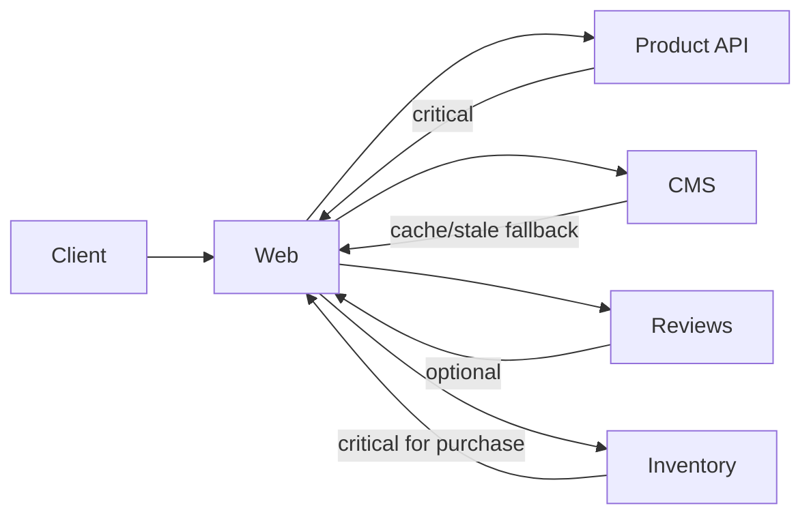

# Daily Knowledge Sharing — 2026-09-07

## Today’s Topics

1. C# generic variance: covariance, contravariance và thiết kế API không phá type safety
2. ASP.NET Core DI lifetimes: Scoped, Singleton, Transient và captive dependency trong Production
3. EF Core `IQueryable` vs `IEnumerable`: query translation boundary và bug từ client-side execution
4. SQL constraints như business invariant cuối cùng: `FOREIGN KEY`, `UNIQUE`, `CHECK` và migration risk
5. Cosmos DB consistency levels: Strong, Session, Eventual và tác động thật tới user experience
6. Resilience composition: timeout → retry → Circuit Breaker → Bulkhead mà không tạo retry storm
7. Azure Container Apps cho queue consumer: autoscaling, concurrency và scale-to-zero trade-off
8. Load testing đúng cách: throughput, saturation, p95/p99 và vì sao test “100 users” chưa nói lên nhiều
9. OAuth 2.0 Client Credentials: service-to-service authentication, token caching và secretless access
10. E-commerce integration failure isolation: Product, Reviews, Search, CMS và graceful degradation

---

# 1. C# generic variance: covariance, contravariance và thiết kế API không phá type safety

## 1. What is it?

Variance mô tả việc một generic type có thể thay đổi type argument theo quan hệ kế thừa mà vẫn giữ type safety hay không.

Mental model đơn giản:

* **Covariance**: “đọc ra” type cụ thể hơn nhưng expose dưới type tổng quát hơn.
* **Contravariance**: “nhận vào” type tổng quát hơn nhưng dùng ở nơi yêu cầu type cụ thể hơn.
* **Invariant**: không cho phép đổi type argument theo inheritance.

Trong C#, variance chủ yếu xuất hiện ở generic interfaces và delegates qua `out` và `in`.

```csharp
IEnumerable<Dog> dogs = GetDogs();
IEnumerable<Animal> animals = dogs; // covariance
```

Điều này hợp lệ vì `IEnumerable<T>` chỉ expose `T` theo hướng output.

## 2. Why does it exist?

Nếu mọi generic type đều invariant, API sẽ cần rất nhiều conversion hoặc wrapper không cần thiết.

Ví dụ một component chỉ đọc sequence của `Animal` đáng lẽ phải nhận được `IEnumerable<Dog>`. Không có covariance, caller phải copy hoặc cast dữ liệu chỉ để thỏa compiler.

Ngược lại, nếu variance được cho phép tùy tiện thì type safety sẽ bị phá. Ví dụ `List<Dog>` không thể được xem là `List<Animal>` vì nếu được phép, caller có thể thêm `Cat` vào một list vốn chỉ chứa `Dog`.

## 3. How does it work?

Covariance yêu cầu generic parameter chỉ xuất hiện ở output position:

```csharp
public interface IReadOnlySource<out T>
{
    T Get();
}
```

Contravariance yêu cầu parameter chỉ xuất hiện ở input position:

```csharp
public interface IHandler<in T>
{
    void Handle(T item);
}
```

Ví dụ:

```csharp
IHandler<Animal> animalHandler = new LoggingAnimalHandler();
IHandler<Dog> dogHandler = animalHandler; // contravariance
```

Nếu handler xử lý được mọi `Animal`, nó chắc chắn xử lý được `Dog`.

## 4. Practical implementation

Giả sử hệ thống notification có processor chỉ đọc event:

```csharp
public interface IEventReader<out TEvent>
{
    TEvent Read();
}

public sealed record DomainEvent(DateTimeOffset OccurredAt);
public sealed record OrderCreated(Guid OrderId, DateTimeOffset OccurredAt)
    : DomainEvent(OccurredAt);
```

Ta có thể dùng:

```csharp
IEventReader<OrderCreated> orderReader = GetOrderReader();
IEventReader<DomainEvent> eventReader = orderReader;
```

Không cần adapter chỉ để chuyển từ `OrderCreated` sang `DomainEvent`.

## 5. Real production scenario

Một enterprise platform có nhiều event handlers dùng generic abstraction. Nếu design generic API không hiểu variance, team thường tạo hàng loạt overload hoặc cast thủ công.

Ví dụ middleware pipeline chỉ cần `IReadOnlyCollection<BaseNotification>`, nhưng provider trả `IReadOnlyCollection<EmailNotification>`. Khi abstraction được thiết kế đúng hướng đọc, covariance giúp composition tự nhiên hơn và giảm glue code.

## 6. Failure scenario & troubleshooting

**Symptom**  
Developer thấy compiler báo không convert được `List<Dog>` sang `List<Animal>` và cố ép cast.

**Evidence**  
Generic type là mutable collection nên invariant.

**Hypothesis**  
Abstraction đang expose cả read và write semantics trong cùng type.

**Diagnosis**  
Kiểm tra generic parameter xuất hiện ở input, output hay cả hai.

**Fix**  
Nếu consumer chỉ đọc, expose `IEnumerable<T>` hoặc `IReadOnlyCollection<T>` thay vì `List<T>`. Không dùng unsafe cast để “lách” compiler.

**Verification**  
Compiler chấp nhận composition mà không cần runtime cast và API vẫn không cho phép write sai type.

## 7. Common mistakes

* Nghĩ covariance áp dụng cho mọi collection.
* Dùng `List<T>` làm public contract khi chỉ cần read semantics.
* Thêm `in`/`out` mà không hiểu input/output position.
* Cast generic types để làm compiler im lặng.
* Thiết kế interface quá rộng, khiến variance không thể áp dụng.

## 8. Alternatives

Nếu abstraction thực sự vừa đọc vừa ghi, invariant generic type là đúng.

Các lựa chọn khác:

* adapter rõ ràng
* projection bằng LINQ
* non-generic base abstraction trong một số legacy design

Nhưng không nên đổi sang untyped API chỉ để tránh generic constraints.

## 9. Trade-offs

### Advantages

* API composition linh hoạt hơn.
* Giảm conversion/wrapper không cần thiết.
* Compiler vẫn giữ type safety.

### Costs / Risks

* Generic signatures khó đọc hơn với developer chưa quen.
* Abstraction quá clever có thể giảm maintainability.
* Variance không giải quyết business polymorphism; nó chỉ giải quyết type relationship.

## 10. Junior → Middle → Senior → Technical Lead

### Junior

Hiểu vì sao `IEnumerable<Dog>` có thể dùng như `IEnumerable<Animal>`, nhưng `List<Dog>` không phải `List<Animal>`.

### Middle

Biết dùng `in`/`out` đúng nơi và chọn read-only abstraction phù hợp.

### Senior

Nhận ra API design đang expose quá nhiều mutation và gây coupling generic không cần thiết.

### Technical Lead / Architect

Quyết định contract công khai nên expose capability tối thiểu nào: read-only, write-only hay mutable. Variance chỉ là hệ quả của boundary design tốt.

## 11. Key takeaway

* Covariance phù hợp output; contravariance phù hợp input.
* Mutable generic collections thường phải invariant để bảo vệ type safety.
* Chọn abstraction theo capability thực sự, không theo implementation concrete.

---

# 2. ASP.NET Core DI lifetimes: Scoped, Singleton, Transient và captive dependency trong Production

## 1. What is it?

ASP.NET Core Dependency Injection quản lý lifecycle của services theo ba lifetime chính:

* `Transient`: tạo instance mới mỗi lần resolve.
* `Scoped`: một instance trong một scope, thường là một HTTP request.
* `Singleton`: một instance cho toàn application lifetime.

Mental model quan trọng: lifetime không chỉ là tối ưu memory. Nó quyết định **state sharing, thread safety và resource ownership**.

## 2. Why does it exist?

Các component có lifecycle khác nhau.

`DbContext` thường gắn với request/unit of work nên phù hợp `Scoped`. Stateless formatter có thể `Singleton` hoặc `Transient`. Một client abstraction có internal connection pool có thể được dùng lâu dài.

Nếu mọi service đều tạo mới hoặc đều Singleton, hệ thống sẽ gặp hoặc allocation/resource churn, hoặc state leakage/thread-safety bug.

## 3. How does it work?

Một HTTP request tạo DI scope:

```text
Application Root Scope
    |
    +--> Singleton instances
    |
    +--> Request Scope A
    |      +--> Scoped DbContext A
    |
    +--> Request Scope B
           +--> Scoped DbContext B
```

Captive dependency xảy ra khi Singleton giữ reference tới Scoped service lâu hơn scope hợp lệ của nó.

Ví dụ sai:

```csharp
public sealed class ReportCache
{
    private readonly AppDbContext _db;

    public ReportCache(AppDbContext db)
    {
        _db = db;
    }
}
```

Nếu `ReportCache` là Singleton, `AppDbContext` bị “captured”.

## 4. Practical implementation

Đăng ký thông thường:

```csharp
builder.Services.AddDbContext<AppDbContext>(options =>
    options.UseSqlServer(connectionString));

builder.Services.AddScoped<IOrderService, OrderService>();
builder.Services.AddSingleton<ISystemClock, SystemClock>();
builder.Services.AddTransient<IEmailFormatter, EmailFormatter>();
```

Trong `BackgroundService`, không inject trực tiếp scoped service vào constructor. Tạo scope cho mỗi unit of work:

```csharp
public sealed class QueueWorker(
    IServiceScopeFactory scopeFactory,
    ILogger<QueueWorker> logger) : BackgroundService
{
    protected override async Task ExecuteAsync(CancellationToken stoppingToken)
    {
        while (!stoppingToken.IsCancellationRequested)
        {
            using var scope = scopeFactory.CreateScope();

            var processor = scope.ServiceProvider
                .GetRequiredService<IMessageProcessor>();

            await processor.ProcessNextAsync(stoppingToken);
        }
    }
}
```

## 5. Real production scenario

Một e-commerce API có Singleton `PricingCacheService` vô tình inject `DbContext`. Local test ít concurrency nên có vẻ ổn.

Trong Production, nhiều request cùng dùng một `DbContext`, tạo lỗi kiểu:

`A second operation was started on this context before a previous operation completed.`

Đây không phải “EF Core chậm”; root cause là lifecycle violation.

## 6. Failure scenario & troubleshooting

**Symptom**  
Lỗi concurrency ngẫu nhiên, state cũ xuất hiện giữa requests, hoặc object disposed bất thường.

**Evidence**  
Dependency graph cho thấy Singleton phụ thuộc Scoped service.

**Hypothesis**  
Captive dependency hoặc shared mutable state.

**Diagnosis**  
Inspect registrations, constructors và scope creation. Bật DI validation ở Development khi phù hợp.

**Fix**  
Đổi lifetime, tách stateful dependency hoặc dùng `IServiceScopeFactory` trong long-lived worker.

**Verification**  
Load test concurrent requests và xác minh mỗi request có scoped state độc lập.

## 7. Common mistakes

* Đăng ký mọi service là `Scoped` cho “an toàn”.
* Đăng ký mọi stateless service là `Singleton` để “nhanh hơn”.
* Inject `DbContext` vào Singleton.
* Inject scoped service trực tiếp vào `BackgroundService`.
* Giữ mutable per-request data trong Singleton.
* Tạo scope nhưng giữ object scoped ra ngoài scope.

## 8. Alternatives

Không phải mọi dependency đều cần DI container.

* Pure functions/static helpers có thể không cần registration.
* Factory phù hợp object lifecycle đặc biệt.
* `IDbContextFactory<T>` hữu ích ở một số background/concurrent scenarios.

DI không nên biến thành service locator.

## 9. Trade-offs

### Advantages

* Lifecycle ownership rõ ràng.
* Testability và composition tốt.
* Framework quản lý scope nhất quán.

### Costs / Risks

* Lifetime mismatch có thể tạo bug khó tái hiện.
* Quá nhiều abstractions làm dependency graph khó hiểu.
* Singleton yêu cầu thread safety nếu có mutable state.

## 10. Junior → Middle → Senior → Technical Lead

### Junior

Phân biệt ba lifetime và hiểu mỗi request thường có một scope.

### Middle

Đăng ký đúng services, biết `DbContext` thường Scoped và biết tạo scope trong worker.

### Senior

Debug captive dependency, race condition và resource lifetime dưới concurrency.

### Technical Lead / Architect

Đặt quy tắc lifecycle theo ownership thực tế; review dependency graph ở boundaries như background workers, caching và message consumers.

## 11. Key takeaway

* DI lifetime là correctness concern, không chỉ performance setting.
* Singleton + Scoped dependency là dấu hiệu cần review ngay.
* Long-lived worker phải chủ động tạo scope cho scoped unit of work.

---

# 3. EF Core `IQueryable` vs `IEnumerable`: query translation boundary và bug từ client-side execution

## 1. What is it?

`IQueryable<T>` đại diện cho một query expression chưa nhất thiết được execute. EF Core có thể đọc expression tree và translate nhiều operations thành SQL.

`IEnumerable<T>` đại diện cho sequence xử lý bằng .NET enumeration semantics.

Mental model:

```text
IQueryable
    -> build expression
    -> translate to SQL
    -> database executes

IEnumerable
    -> objects already materialized or streamed
    -> .NET processes remaining operators
```

Boundary giữa hai thế giới này quyết định dữ liệu được filter ở database hay kéo về application trước.

## 2. Why does it exist?

LINQ cho phép cùng syntax dùng trên nhiều data sources. Đây là lợi ích lớn, nhưng cũng dễ tạo illusion rằng mọi LINQ expression đều tương đương về cost.

`Where()` chạy trước materialization có thể trở thành SQL `WHERE`. Cùng `Where()` chạy sau `ToListAsync()` lại lọc trong memory.

## 3. How does it work?

Ví dụ tốt:

```csharp
var employees = await db.Employees
    .Where(x => x.IsActive)
    .OrderBy(x => x.LastName)
    .Select(x => new EmployeeDto(x.Id, x.FirstName, x.LastName))
    .ToListAsync(ct);
```

EF Core translate thành SQL chỉ lấy columns cần thiết.

Ví dụ nguy hiểm:

```csharp
var employees = await db.Employees.ToListAsync(ct);

var active = employees
    .Where(x => x.IsActive)
    .OrderBy(x => x.LastName)
    .ToList();
```

Toàn bộ table đã được load trước khi filter.

## 4. Practical implementation

Giữ query dạng `IQueryable` cho tới gần execution:

```csharp
IQueryable<Order> query = db.Orders.AsNoTracking();

if (status is not null)
{
    query = query.Where(x => x.Status == status);
}

if (customerId is not null)
{
    query = query.Where(x => x.CustomerId == customerId);
}

var result = await query
    .OrderByDescending(x => x.CreatedAt)
    .Take(100)
    .Select(x => new OrderListItem(
        x.Id,
        x.Number,
        x.Total,
        x.Status))
    .ToListAsync(ct);
```

Điểm quan trọng: execution xảy ra ở `ToListAsync`, `SingleAsync`, `CountAsync`… chứ không phải lúc viết `Where`.

## 5. Real production scenario

Một API admin search orders có bảng 5 triệu rows. Developer thêm helper:

```csharp
private static IEnumerable<Order> FilterByKeyword(
    IEnumerable<Order> orders,
    string keyword)
```

Caller vô tình chuyển query sang `IEnumerable` quá sớm. Production memory tăng, SQL query trở thành `SELECT` rất rộng, latency p99 tăng mạnh.

Root cause không phải thiếu index đầu tiên; vấn đề là filter đã rời database boundary.

## 6. Failure scenario & troubleshooting

**Symptom**  
API search dùng nhiều RAM, SQL trả rất nhiều rows dù response chỉ có vài chục items.

**Evidence**  
Generated SQL thiếu expected `WHERE`/`SELECT projection`.

**Hypothesis**  
Materialization hoặc `AsEnumerable()` xảy ra quá sớm.

**Diagnosis**  
Inspect EF Core generated SQL, query logs và call chain.

**Fix**  
Đẩy filter/projection/pagination trở lại `IQueryable` trước materialization.

**Verification**  
SQL row count, bytes transferred và application allocations giảm.

## 7. Common mistakes

* `ToList()` quá sớm.
* `AsEnumerable()` để tránh translation error mà không hiểu cost.
* Trả `IQueryable` xuyên qua quá nhiều architectural layers, làm persistence concern leak.
* Dùng custom C# method trong query mà provider không translate được.
* `Include` toàn bộ graph rồi mới projection.

## 8. Alternatives

* Direct EF query trong application layer khi persistence coupling chấp nhận được.
* Query object/specification nếu filtering logic phức tạp và cần tái sử dụng.
* Raw SQL/Dapper khi query shape đặc thù và profiling chứng minh giá trị.

Không nên wrap mọi query bằng generic repository chỉ để “ẩn EF”.

## 9. Trade-offs

### Advantages

* Database làm filtering/projection tại nơi dữ liệu tồn tại.
* Giảm network, allocation và tracking.

### Costs / Risks

* Query translation constraints khác C# runtime semantics.
* Expression phức tạp có thể sinh SQL khó tối ưu.
* Leak `IQueryable` quá rộng làm boundary khó kiểm soát.

## 10. Junior → Middle → Senior → Technical Lead

### Junior

Hiểu LINQ chưa chắc đã execute ngay.

### Middle

Biết giữ filter/projection trước `ToListAsync()` và xem generated SQL.

### Senior

Phân tích translation boundary, SQL shape, round trips và memory consequences.

### Technical Lead / Architect

Quyết định persistence abstraction nên expose query capability tới đâu mà vẫn giữ application boundary rõ ràng.

## 11. Key takeaway

* `IQueryable` là query description; materialization mới tạo database round trip.
* `ToList`/`AsEnumerable` quá sớm có thể chuyển workload từ database sang application.
* Luôn kiểm tra generated SQL cho query quan trọng.

---

# 4. SQL constraints như business invariant cuối cùng: `FOREIGN KEY`, `UNIQUE`, `CHECK` và migration risk

## 1. What is it?

Database constraints là rule được enforce ngay tại relational database.

Các dạng phổ biến:

* `PRIMARY KEY`
* `FOREIGN KEY`
* `UNIQUE`
* `CHECK`
* `NOT NULL`

Mental model: application validation giúp UX và domain behavior; database constraint là **last line of defense** bảo vệ data integrity khi nhiều code paths cùng ghi dữ liệu.

## 2. Why does it exist?

Application không phải nguồn write duy nhất mãi mãi. Có background job, migration script, admin tool, ETL hoặc service khác cùng truy cập database.

Nếu invariant chỉ tồn tại trong C# validation, một write path quên check là đủ tạo dữ liệu hỏng.

Ví dụ business rule “employee email phải unique” nên có validation ở app để trả lỗi đẹp, nhưng uniqueness cuối cùng nên được enforce ở database.

## 3. How does it work?

Ví dụ schema:

```sql
CREATE TABLE Employees
(
    Id uniqueidentifier NOT NULL PRIMARY KEY,
    DepartmentId uniqueidentifier NOT NULL,
    Email nvarchar(320) NOT NULL,
    Status varchar(20) NOT NULL,
    CONSTRAINT UQ_Employees_Email UNIQUE (Email),
    CONSTRAINT CK_Employees_Status
        CHECK (Status IN ('Active', 'Inactive', 'Suspended')),
    CONSTRAINT FK_Employees_Departments
        FOREIGN KEY (DepartmentId)
        REFERENCES Departments(Id)
);
```

Database từ chối write vi phạm constraint bất kể write đến từ EF Core, script hay tool khác.

## 4. Practical implementation

EF Core configuration:

```csharp
builder.Entity<Employee>(entity =>
{
    entity.HasIndex(x => x.Email)
        .IsUnique();

    entity.Property(x => x.Email)
        .HasMaxLength(320)
        .IsRequired();

    entity.HasOne(x => x.Department)
        .WithMany(x => x.Employees)
        .HasForeignKey(x => x.DepartmentId)
        .OnDelete(DeleteBehavior.Restrict);
});
```

Application vẫn nên detect lỗi domain trước khi SaveChanges nếu có thể, nhưng phải handle database constraint violation vì race condition vẫn xảy ra.

## 5. Real production scenario

Hai requests đồng thời đăng ký cùng email.

Cả hai cùng chạy:

```text
SELECT WHERE Email = ... -> no row
```

Nếu app chỉ kiểm tra trước rồi insert, cả hai đều nghĩ email chưa tồn tại.

Unique constraint đảm bảo chỉ một transaction thành công.

Đây là ví dụ classic cho việc “check trước” không thể thay thế invariant atomically enforced ở database.

## 6. Failure scenario & troubleshooting

**Symptom**  
Deployment migration thêm `UNIQUE` constraint thất bại.

**Evidence**  
Production đã có duplicate rows từ dữ liệu lịch sử.

**Hypothesis**  
Schema mới giả định invariant chưa từng được enforce.

**Diagnosis**  
Chạy data profiling trước migration:

```sql
SELECT Email, COUNT(*)
FROM Employees
GROUP BY Email
HAVING COUNT(*) > 1;
```

**Fix**  
Clean dữ liệu, định policy merge/delete, sau đó mới add constraint.

**Verification**  
Migration chạy trên production-like copy và queries xác minh không còn violations.

## 7. Common mistakes

* Chỉ validate ở frontend.
* Kiểm tra uniqueness bằng query nhưng không tạo unique constraint.
* Dùng cascade delete mặc định mà không review blast radius.
* Thêm constraint vào bảng lớn mà không test lock/duration.
* Migration production không kiểm tra dữ liệu legacy.

## 8. Alternatives

Một số invariant không thể biểu diễn gọn bằng constraint, ví dụ rule cross-aggregate phức tạp hoặc phụ thuộc external state. Khi đó cần domain logic và transaction design.

Nhưng invariant relational đơn giản nên ưu tiên database-native constraints hơn trigger phức tạp.

## 9. Trade-offs

### Advantages

* Integrity được enforce cho mọi write path.
* Giảm corrupted state lâu dài.
* Một số constraints giúp optimizer hiểu relationships tốt hơn.

### Costs / Risks

* Migration có thể fail trên legacy data.
* Foreign keys/check constraints thêm write validation cost.
* Schema coupling mạnh hơn nếu services không thật sự cùng ownership boundary.

## 10. Junior → Middle → Senior → Technical Lead

### Junior

Hiểu PK/FK/UNIQUE không chỉ là syntax mà là rule dữ liệu.

### Middle

Thiết kế constraints phù hợp và handle database errors.

### Senior

Hiểu concurrency race, migration locking và legacy-data cleanup.

### Technical Lead / Architect

Quyết định invariant nào thuộc database ownership boundary và tránh shared-database coupling giữa bounded contexts không cần thiết.

## 11. Key takeaway

* App validation cải thiện UX; database constraint bảo vệ integrity.
* `SELECT` trước `INSERT` không thay thế `UNIQUE` constraint.
* Constraint migration phải kiểm tra dữ liệu lịch sử và operational impact.

---

# 5. Cosmos DB consistency levels: Strong, Session, Eventual và tác động thật tới user experience

## 1. What is it?

Cosmos DB cho phép chọn consistency model giữa replicas và regions.

Các mức thường gặp gồm:

* Strong
* Bounded Staleness
* Session
* Consistent Prefix
* Eventual

Mental model: consistency quyết định **mức đảm bảo một read thấy write mới đến đâu**, đổi lại bằng latency, availability behavior và cost/throughput constraints.

## 2. Why does it exist?

Trong distributed database, dữ liệu được replicate qua nhiều nodes/regions. Không thể mặc định mọi read ở mọi nơi luôn thấy write mới nhất mà không trả giá về coordination.

Một shopping cart cần read-your-writes cho user hiện tại, nhưng product recommendation có thể chấp nhận eventual consistency.

Vì vậy một consistency model duy nhất cho mọi workload thường là lãng phí hoặc không đủ.

## 3. How does it work?

Với Session consistency:

```text
Client Session
   |
   | Write item
   v
Replica A
   |
   +--> returns session token
   |
Client carries token
   |
   v
Subsequent read observes session progress
```

Session consistency giúp cùng client/session có read-your-writes mà không cần Strong consistency toàn hệ thống.

Eventual consistency cho phép replica trả state cũ trong khoảng propagation.

## 4. Practical implementation

Trong .NET SDK, consistency có thể được cấu hình ở client/database/request level tùy scenario.

Ví dụ client mặc định Session:

```csharp
var client = new CosmosClient(
    connectionString,
    new CosmosClientOptions
    {
        ConsistencyLevel = ConsistencyLevel.Session
    });
```

Không nên đổi consistency level theo cảm giác. Bắt đầu từ business requirement: user có cần thấy write của chính họ ngay không? Cross-user freshness chịu được bao lâu?

## 5. Real production scenario

Mobile backend lưu user preferences trong Cosmos DB multi-region.

User đổi language rồi ngay lập tức reload profile. Với Eventual consistency, một replica có thể trả preference cũ, khiến UI “nhảy ngược”.

Session consistency thường hợp lý hơn vì user cần read-your-writes nhưng không nhất thiết yêu cầu mọi user toàn cầu lập tức thấy update đó.

## 6. Failure scenario & troubleshooting

**Symptom**  
User vừa update nhưng GET ngay sau đó đôi khi trả dữ liệu cũ.

**Evidence**  
Requests đi qua clients/sessions khác nhau hoặc consistency thấp hơn requirement.

**Hypothesis**  
Application đang giả định read-after-write guarantee mạnh hơn datastore cung cấp.

**Diagnosis**  
Kiểm tra configured consistency, request routing/session-token behavior và multi-region setup.

**Fix**  
Chọn Session hoặc Strong khi requirement thật sự cần, hoặc thay đổi UX/workflow để chịu stale window.

**Verification**  
Test read-after-write và failover scenarios theo consistency contract đã chọn.

## 7. Common mistakes

* Nghĩ NoSQL đồng nghĩa “eventual consistency”.
* Chọn Strong cho mọi workload để “an toàn”.
* Không định nghĩa stale tolerance bằng business terms.
* Không test multi-region/failover behavior.
* Chỉ nhìn RU cost mà bỏ qua latency và user-visible consistency.

## 8. Alternatives

* SQL database với transaction/isolation mạnh hơn cho relational invariants.
* MongoDB có consistency/replication semantics khác.
* Cache layer có thể làm consistency tệ hơn nếu invalidation không rõ.

Không nên chọn Cosmos DB chỉ vì cần scale; data model, partition key và consistency phải cùng phù hợp.

## 9. Trade-offs

### Advantages

* Có thể chọn consistency phù hợp workload.
* Session thường cân bằng tốt giữa UX và distributed cost.

### Costs / Risks

* Strong consistency tăng coordination.
* Eventual consistency đòi hỏi application/UX chấp nhận stale data.
* Team phải hiểu consistency contract thay vì coi database là black box.

## 10. Junior → Middle → Senior → Technical Lead

### Junior

Hiểu replica có thể chưa đồng bộ tức thời.

### Middle

Biết cấu hình consistency và test read-after-write behavior.

### Senior

Phân tích stale read, region/failover và session behavior.

### Technical Lead / Architect

Biến business freshness requirement thành consistency decision thay vì chọn mức cao nhất theo bản năng.

## 11. Key takeaway

* Consistency là product/architecture decision, không chỉ database setting.
* Session consistency thường rất hữu ích cho read-your-writes.
* Strong consistency có cost; Eventual consistency có UX consequences.

---

# 6. Resilience composition: timeout → retry → Circuit Breaker → Bulkhead mà không tạo retry storm

## 1. What is it?

Resilience không phải một pattern duy nhất. Một outbound dependency thường cần nhiều cơ chế kết hợp:

* timeout
* retry
* exponential backoff + jitter
* Circuit Breaker
* Bulkhead/concurrency limit

Mental model đúng là: mỗi policy giải quyết **một failure mode khác nhau**.

Retry không sửa dependency đang down lâu dài. Circuit Breaker không giới hạn concurrency. Timeout không đảm bảo request an toàn để retry.

## 2. Why does it exist?

Remote calls có partial failure: network mất, upstream chậm, 503 tạm thời, rate limit, DNS issue.

Nếu application chỉ gọi một lần, transient failure có thể làm user request fail không cần thiết.

Nếu application retry vô hạn, upstream outage biến thành retry storm và làm dependency chết nặng hơn.

## 3. How does it work?

Một flow hợp lý:

```text
Request
  |
  v
Bulkhead capacity check
  |
  v
Circuit Breaker open?
  | yes -> fail fast
  | no
  v
Attempt with timeout
  |
  +--> transient failure
          |
          v
      backoff + jitter
          |
          v
        retry
```

Policy order cụ thể phụ thuộc library và semantics, nhưng engineering intent phải rõ.

## 4. Practical implementation

Với modern .NET, resilience có thể dùng `Microsoft.Extensions.Http.Resilience` hoặc Polly-based pipeline.

Ví dụ khái niệm:

```csharp
builder.Services
    .AddHttpClient<InventoryClient>(client =>
    {
        client.BaseAddress = new Uri(inventoryBaseUrl);
    })
    .AddStandardResilienceHandler(options =>
    {
        options.AttemptTimeout.Timeout = TimeSpan.FromSeconds(2);
        options.TotalRequestTimeout.Timeout = TimeSpan.FromSeconds(5);
        options.Retry.MaxRetryAttempts = 2;
        options.CircuitBreaker.SamplingDuration = TimeSpan.FromSeconds(30);
    });
```

Retry chỉ nên áp dụng khi operation retry-safe hoặc có idempotency protection.

## 5. Real production scenario

Product page gọi Reviews API. Reviews API bắt đầu timeout 10 giây.

Nếu Web App có 3 retries mà mỗi attempt 10 giây, một request có thể giữ resource 30+ giây. Khi traffic cao, connection pool/thread/concurrency budgets bị chiếm, tạo cascading failure.

Tốt hơn:

* timeout ngắn theo dependency budget
* retry ít lần với jitter
* circuit breaker mở khi failure rate cao
* graceful fallback: ẩn reviews tạm thời

## 6. Failure scenario & troubleshooting

**Symptom**  
Dependency outage làm outbound request count tăng gấp 3–4 lần.

**Evidence**  
Telemetry cho thấy retry attempts tăng đồng thời với 5xx/timeout.

**Hypothesis**  
Retry policy đang amplify failure.

**Diagnosis**  
Đếm original calls vs retry calls, latency budget và concurrent pending requests.

**Fix**  
Giảm retry, thêm jitter/circuit breaker, giới hạn concurrency và phân loại status codes retryable.

**Verification**  
Chaos/load test khi dependency trả 503; xác minh outbound traffic bị bounded và app vẫn responsive.

## 7. Common mistakes

* Retry mọi exception.
* Retry `POST` không có idempotency.
* Timeout per-attempt nhưng không có total timeout budget.
* Không dùng jitter nên mọi instances retry cùng lúc.
* Circuit Breaker nhưng fallback vẫn gọi dependency khác cũng đang fail.
* Không có bulkhead nên một dependency chiếm toàn capacity.

## 8. Alternatives

* Queue/asynchronous messaging nếu synchronous response không cần thiết.
* Cache/stale fallback nếu dữ liệu chịu được độ cũ.
* Không retry nếu failure không transient hoặc operation không an toàn để lặp.

Đôi khi fail-fast là lựa chọn đúng hơn retry.

## 9. Trade-offs

### Advantages

* Chịu transient failure tốt hơn.
* Giảm cascading failure khi dependency unhealthy.

### Costs / Risks

* Retry tăng load và latency.
* Circuit Breaker thêm state/complexity.
* Bulkhead có thể reject traffic sớm.
* Policy sai có thể che root cause và làm incident khó hiểu hơn.

## 10. Junior → Middle → Senior → Technical Lead

### Junior

Hiểu timeout, retry và circuit breaker giải quyết vấn đề khác nhau.

### Middle

Cấu hình retry có backoff/jitter, timeout và classify errors.

### Senior

Thiết kế idempotency, retry budget, concurrency budget và fallback.

### Technical Lead / Architect

Quyết định dependency nào nên synchronous, dependency nào nên async, failure nào phải propagate và blast radius chấp nhận được.

## 11. Key takeaway

* Retry là load multiplier; dùng sai sẽ biến outage nhỏ thành outage lớn.
* Mọi outbound dependency cần timeout budget rõ ràng.
* Resilience tốt là giới hạn failure propagation, không phải cố “thành công bằng mọi giá”.

---

# 7. Azure Container Apps cho queue consumer: autoscaling, concurrency và scale-to-zero trade-off

## 1. What is it?

Azure Container Apps là managed container platform cho application và background workloads mà không yêu cầu team vận hành Kubernetes cluster trực tiếp.

Với queue consumer, platform có thể scale replicas theo event source/metrics thông qua cơ chế autoscaling dựa trên KEDA concepts.

Mental model:

```text
Queue backlog
   |
   v
Scaling rule
   |
   v
0..N container replicas
   |
   v
Consumers process messages
```

## 2. Why does it exist?

Worker Service chạy trên fixed App Service/VM đơn giản nhưng có thể lãng phí capacity khi queue rỗng hoặc thiếu capacity khi backlog tăng.

AKS cho control lớn nhưng operational burden cao.

Container Apps phù hợp khi cần containerized workload, autoscaling và event-driven execution mà chưa cần full Kubernetes ownership.

## 3. How does it work?

Queue length hoặc event metric kích hoạt scale rule.

Nếu backlog tăng, platform tăng replicas. Mỗi replica có thể xử lý nhiều messages concurrent tùy app design.

Capacity thực tế gần đúng:

```text
replicas × concurrency per replica × processing rate
```

Scale out không giúp nếu downstream database/API không chịu thêm concurrency.

## 4. Practical implementation

Worker vẫn nên idempotent:

```csharp
public sealed class OrderMessageProcessor
{
    public async Task ProcessAsync(OrderMessage message, CancellationToken ct)
    {
        if (await AlreadyProcessedAsync(message.MessageId, ct))
            return;

        await HandleOrderAsync(message, ct);
        await MarkProcessedAsync(message.MessageId, ct);
    }
}
```

Container image nên shutdown gracefully:

```csharp
protected override async Task ExecuteAsync(CancellationToken stoppingToken)
{
    await consumer.RunAsync(stoppingToken);
}
```

Platform có thể terminate/restart replica; cancellation không phải optional concern.

## 5. Real production scenario

Notification system nhận 500 messages/phút bình thường nhưng campaign tạo 50.000 messages trong vài phút.

Fixed worker 2 instances tạo backlog lớn. Container Apps có thể scale consumers theo queue depth.

Nhưng nếu mỗi consumer ghi cùng SQL database, scale từ 2 lên 50 replicas có thể làm database connection pool và write I/O quá tải.

Autoscaling phải dựa trên **system capacity**, không chỉ queue length.

## 6. Failure scenario & troubleshooting

**Symptom**  
Queue backlog giảm chậm dù replicas đã scale rất cao; database latency tăng mạnh.

**Evidence**  
Consumer throughput không tăng tuyến tính, SQL waits/connection usage tăng.

**Hypothesis**  
Downstream database là bottleneck.

**Diagnosis**  
Correlate replica count, message throughput, database p95 latency và connection count.

**Fix**  
Giới hạn max replicas/concurrency, batch writes hoặc redesign downstream processing.

**Verification**  
Tìm operating point nơi throughput cao nhưng dependency vẫn dưới saturation.

## 7. Common mistakes

* Nghĩ autoscaling luôn tăng throughput tuyến tính.
* Không giới hạn max replicas.
* Consumer không idempotent.
* Scale-to-zero nhưng workload cần immediate response rất nhạy cold start.
* Không handle SIGTERM/graceful shutdown.
* Dùng Container Apps khi một simple Function đủ.

## 8. Alternatives

### Azure Functions

Tốt cho trigger-based workload và ít container/runtime control hơn.

### Worker Service trên App Service/VM

Đơn giản, predictable capacity nhưng ít elastic hơn.

### AKS

Control cao nhất, operational complexity lớn nhất.

### Container Apps Jobs

Phù hợp finite/scheduled jobs hơn long-running consumer trong một số trường hợp.

## 9. Trade-offs

### Advantages

* Container flexibility.
* Managed autoscaling.
* Không phải vận hành control plane Kubernetes.

### Costs / Risks

* Scale behavior cần hiểu rõ.
* Cold start/scale-to-zero có latency cost.
* Downstream bottleneck vẫn tồn tại.
* Cost tăng nhanh nếu max scale quá rộng.

## 10. Junior → Middle → Senior → Technical Lead

### Junior

Hiểu replica là nhiều process độc lập cùng consume work.

### Middle

Containerize worker, handle cancellation và configure scaling rule cơ bản.

### Senior

Đo throughput, idempotency, downstream saturation và cold-start impact.

### Technical Lead / Architect

Chọn Functions, Container Apps, App Service Worker hay AKS dựa trên workload profile và operational ownership.

## 11. Key takeaway

* Autoscaling không xóa downstream bottleneck.
* Queue consumer phải idempotent và shutdown gracefully.
* Max replicas/concurrency là capacity-control decision, không phải chỉ scaling setting.

---

# 8. Load testing đúng cách: throughput, saturation, p95/p99 và vì sao test “100 users” chưa nói lên nhiều

## 1. What is it?

Load testing là quá trình tạo workload có kiểm soát để đo behavior của hệ thống khi traffic tăng.

Mental model tốt hơn “bao nhiêu virtual users” là:

* arrival rate
* throughput
* concurrency
* latency percentiles
* error rate
* resource saturation

Một test 100 users có thể nhẹ hoặc cực nặng tùy mỗi user gửi 1 request/phút hay 20 request/giây.

## 2. Why does it exist?

Hệ thống thường hoạt động tốt ở low traffic nhưng failure xuất hiện nonlinear khi resource gần saturation:

* connection pool cạn
* ThreadPool starvation
* CPU queueing
* database lock contention
* Redis latency tăng
* queue backlog phát triển

Functional testing không phát hiện được các threshold này.

## 3. How does it work?

Ví dụ một latency curve:

```text
Load increases
   |
   v
Throughput rises
   |
   v
Resource approaches saturation
   |
   +--> queueing increases
   +--> p95/p99 rise sharply
   +--> timeouts/errors appear
```

Average latency có thể vẫn “ổn” trong khi 1–5% requests rất chậm.

## 4. Practical implementation

Ví dụ k6-style test:

```javascript
import http from 'k6/http';
import { check } from 'k6';

export const options = {
  scenarios: {
    api_load: {
      executor: 'constant-arrival-rate',
      rate: 100,
      timeUnit: '1s',
      duration: '10m',
      preAllocatedVUs: 100,
      maxVUs: 500,
    },
  },
  thresholds: {
    http_req_duration: ['p(95)<500', 'p(99)<1000'],
    http_req_failed: ['rate<0.01'],
  },
};

export default function () {
  const res = http.get('https://example/api/products/42');
  check(res, { 'status 200': r => r.status === 200 });
}
```

Quan trọng hơn script là observability phía server trong cùng thời gian test.

## 5. Real production scenario

Checkout API chịu 40 req/s bình thường. Team test 500 concurrent users nhưng mỗi user có think time dài nên actual throughput chỉ 25 req/s. Test “pass” nhưng không đại diện peak sale traffic 120 req/s.

Test lại theo constant arrival rate cho thấy ở 80 req/s database connections bắt đầu chờ, p99 tăng từ 600 ms lên 8 giây.

## 6. Failure scenario & troubleshooting

**Symptom**  
Load test latency tăng mạnh sau một threshold nhưng CPU app chỉ 50%.

**Evidence**  
Database pool wait hoặc outbound dependency concurrency đạt limit.

**Hypothesis**  
Bottleneck không nằm ở CPU.

**Diagnosis**  
Correlate p95/p99 với connection pools, SQL waits, GC, ThreadPool, downstream latency.

**Fix**  
Tối ưu đúng bottleneck hoặc giảm concurrency bằng backpressure/rate limiting.

**Verification**  
Chạy lại cùng arrival rate và so sánh saturation point trước/sau.

## 7. Common mistakes

* Chỉ báo “X users” mà không biết requests/second.
* Không warm up system.
* Test từ laptop với network bottleneck ở client.
* Không dùng production-like data volume.
* Chỉ nhìn average latency.
* Không monitor server/dependencies.
* Tăng traffic quá nhanh nên không biết saturation bắt đầu từ đâu.

## 8. Alternatives

* BenchmarkDotNet: phù hợp microbenchmark code path, không thay load test hệ thống.
* Synthetic monitoring: kiểm tra liên tục nhưng load thấp.
* Chaos testing: kiểm tra failure resilience, mục tiêu khác load testing.

Các kỹ thuật bổ sung cho nhau.

## 9. Trade-offs

### Advantages

* Phát hiện bottleneck trước Production.
* Xác định capacity và SLO thực tế.

### Costs / Risks

* Production-like environment có chi phí.
* Test sai workload tạo kết luận sai.
* Load test có thể phá shared environment nếu không cô lập.

## 10. Junior → Middle → Senior → Technical Lead

### Junior

Hiểu latency và throughput khác nhau.

### Middle

Viết load scenario và đọc p95/p99, error rate.

### Senior

Localize saturation bằng telemetry xuyên app/database/dependencies.

### Technical Lead / Architect

Định nghĩa capacity target, traffic model, headroom và test gate trước major release.

## 11. Key takeaway

* “100 users” không phải workload specification đầy đủ.
* Saturation thường lộ ra ở p95/p99 trước average.
* Load test chỉ có giá trị khi server-side telemetry được thu cùng lúc.

---

# 9. OAuth 2.0 Client Credentials: service-to-service authentication, token caching và secretless access

## 1. What is it?

OAuth 2.0 Client Credentials Grant dùng cho machine-to-machine authentication khi application tự đại diện cho chính nó, không đại diện user interactive.

Mental model:

```text
Service A
  |
  | client identity
  v
Authorization Server / Entra ID
  |
  | access token
  v
Service A -> Service B API
```

Token mang application identity/permissions; không có user session hay refresh token theo flow typical này.

## 2. Why does it exist?

Hard-code API key giữa services làm rotation, least privilege và centralized identity management khó hơn.

OAuth/OIDC ecosystem cho phép service nhận short-lived access token từ trusted issuer và API validate signature, issuer, audience và permissions.

Trên Azure, Managed Identity có thể loại bỏ client secret khỏi application configuration trong nhiều scenarios.

## 3. How does it work?

Service A authenticate với identity provider bằng credential riêng hoặc Managed Identity.

Identity provider trả access token cho audience/scope của Service B.

Service B validate token:

* signature
* issuer
* audience
* lifetime
* application roles/scopes theo contract

Token caching quan trọng vì không nên request token mới cho mỗi outbound API call.

## 4. Practical implementation

Với Azure Identity + `DefaultAzureCredential`:

```csharp
var credential = new DefaultAzureCredential();

var token = await credential.GetTokenAsync(
    new TokenRequestContext(
        new[] { "api://inventory-service/.default" }),
    ct);

httpClient.DefaultRequestHeaders.Authorization =
    new AuthenticationHeaderValue("Bearer", token.Token);
```

Trong production, client library thường cache token internally. Không tự viết cache token nếu SDK đã xử lý đúng.

ASP.NET Core API validation:

```csharp
builder.Services
    .AddAuthentication(JwtBearerDefaults.AuthenticationScheme)
    .AddJwtBearer(options =>
    {
        options.Authority = authority;
        options.Audience = "api://inventory-service";
    });
```

## 5. Real production scenario

Pricing service gọi Inventory API trong Azure.

Ban đầu dùng client secret lưu trong App Service configuration. Secret hết hạn sau 12 tháng và Production bắt đầu 401 hàng loạt.

Chuyển sang Managed Identity giúp loại bỏ rotation secret thủ công; Inventory API cấp app role cụ thể cho identity của Pricing service.

## 6. Failure scenario & troubleshooting

**Symptom**  
Local hoạt động, Production trả 401/403.

**Evidence**  
Token issuer đúng nhưng audience sai, hoặc identity chưa được assign app role.

**Hypothesis**  
Authentication thành công với identity provider nhưng authorization contract với API sai.

**Diagnosis**  
Decode metadata an toàn, kiểm tra `iss`, `aud`, app roles/scopes và API configuration. Không log raw token.

**Fix**  
Sửa audience/resource/scope assignment hoặc authorization policy.

**Verification**  
Integration test từ actual workload identity trong target environment.

## 7. Common mistakes

* Xin token mới cho mỗi request.
* Log access token.
* Chỉ validate signature nhưng bỏ issuer/audience.
* Dùng user delegated flow cho service-to-service không cần user.
* Dùng một client credential cho nhiều services.
* Secret tồn tại lâu trong source/config khi Managed Identity khả dụng.

## 8. Alternatives

* Managed Identity: ưu tiên trong Azure khi supported.
* mTLS: mạnh cho service identity nhưng certificate lifecycle phức tạp hơn.
* API key: đơn giản nhưng yếu hơn về identity governance/rotation.

Không có lựa chọn universal; environment và threat model quyết định.

## 9. Trade-offs

### Advantages

* Short-lived tokens.
* Centralized identity và authorization.
* Least privilege dễ quản lý hơn shared secrets.

### Costs / Risks

* Identity configuration phức tạp hơn API key.
* Token acquisition phụ thuộc identity provider.
* Permission assignment sai dẫn đến 401/403 khó debug nếu observability kém.

## 10. Junior → Middle → Senior → Technical Lead

### Junior

Phân biệt user authentication với application identity.

### Middle

Cấu hình token acquisition/validation và authorization policy.

### Senior

Debug audience/issuer/role, token caching và credential rotation.

### Technical Lead / Architect

Thiết kế service identity model, least privilege và secretless strategy toàn hệ thống.

## 11. Key takeaway

* Client Credentials là machine identity, không phải user session.
* Token phải cache/reuse theo SDK semantics, không xin mới mỗi call.
* Managed Identity giảm đáng kể secret-management burden trong Azure.

---

# 10. E-commerce integration failure isolation: Product, Reviews, Search, CMS và graceful degradation

## 1. What is it?

Một product page nhìn đơn giản nhưng thường phụ thuộc nhiều systems:

```text
Client
  |
  v
CDN
  |
  v
Web Application
  |
  +--> CMS
  +--> Product API
  +--> Inventory
  +--> Reviews
  +--> Search/Recommendations
  +--> Authentication
  +--> Cache
```

Failure isolation là thiết kế để lỗi ở một dependency không nhất thiết kéo sập toàn page hoặc toàn request.

Mental model: phân loại dependency thành **critical** và **degradable**.

## 2. Why does it exist?

Distributed page composition tăng business capability nhưng cũng tăng failure probability.

Nếu page cần 6 remote calls và bất kỳ call nào fail đều làm request trả 500, availability tổng thể sẽ thấp hơn availability từng dependency.

Reviews timeout không nên ngăn customer xem price/product details nếu Reviews không critical cho checkout correctness.

## 3. How does it work?

Một architecture có degradation policy:



Criticality phụ thuộc user action. Inventory có thể optional khi chỉ browse nhưng trở thành critical khi add-to-cart/checkout.

## 4. Practical implementation

Ví dụ parallel fetch có selective fallback:

```csharp
var productTask = productClient.GetAsync(productId, ct);
var inventoryTask = inventoryClient.GetAsync(productId, ct);
var reviewsTask = GetReviewsSafelyAsync(productId, ct);

await Task.WhenAll(productTask, inventoryTask, reviewsTask);

return new ProductPageDto(
    Product: await productTask,
    Inventory: await inventoryTask,
    Reviews: await reviewsTask);
```

Reviews fallback:

```csharp
private async Task<ReviewSummary?> GetReviewsSafelyAsync(
    Guid productId,
    CancellationToken ct)
{
    try
    {
        return await reviewsClient.GetSummaryAsync(productId, ct);
    }
    catch (Exception ex) when (IsTransient(ex))
    {
        logger.LogWarning(ex,
            "Reviews unavailable for product {ProductId}",
            productId);

        return null;
    }
}
```

Không nên catch-all và bỏ qua mọi exception nếu dữ liệu critical.

## 5. Real production scenario

Reviews provider bên thứ ba gặp outage 45 phút.

Architecture A: backend chờ Reviews 8 giây rồi toàn product page fail 500.

Architecture B: Reviews có timeout 800 ms, circuit breaker và fallback “Reviews temporarily unavailable”. Product, price và inventory vẫn hiển thị.

Business impact khác nhau rất lớn dù cùng dependency outage.

## 6. Failure scenario & troubleshooting

**Symptom**  
p95 product-page latency tăng từ 400 ms lên 7 giây.

**Evidence**  
Distributed traces cho thấy Reviews dependency chiếm 6.5 giây, error rate 40%.

**Hypothesis**  
Optional dependency đang nằm trên critical synchronous path với timeout quá dài.

**Diagnosis**  
Trace dependency waterfall, identify criticality và compare timeout budgets.

**Fix**  
Timeout ngắn hơn, circuit breaker, cached/stale fallback hoặc client-side lazy load nếu phù hợp.

**Verification**  
Simulate Reviews outage; product page SLO vẫn đạt và purchase flow không bị ảnh hưởng.

## 7. Common mistakes

* Mọi dependency đều được coi là critical.
* Timeout tất cả services giống nhau.
* Retry optional dependency trong user request nhiều lần.
* Fallback trả dữ liệu stale mà không hiểu business consequence.
* Một shared integration client không có per-dependency telemetry.
* Hide error quá mức khiến incident không được phát hiện.

## 8. Alternatives

* Server-side aggregation: kiểm soát tốt nhưng backend chịu dependency complexity.
* Client-side composition: có thể isolate tốt hơn nhưng tăng frontend/network complexity.
* Precomputed/cache projection: giảm synchronous dependencies nhưng tăng freshness/sync complexity.
* BFF pattern: hữu ích khi UI-specific composition đủ phức tạp.

## 9. Trade-offs

### Advantages

* Tăng user-visible availability.
* Giảm cascading failure.
* Cho phép mỗi dependency có timeout/fallback phù hợp.

### Costs / Risks

* UX cần xử lý partial data.
* Fallback logic tăng test matrix.
* Cached stale data có consistency cost.
* Operational telemetry phải phân biệt degraded success với full success.

## 10. Junior → Middle → Senior → Technical Lead

### Junior

Hiểu một page có thể phụ thuộc nhiều backend systems.

### Middle

Implement timeout, fallback và error handling theo dependency.

### Senior

Dùng traces để xác định critical path, dependency budget và cascading failure.

### Technical Lead / Architect

Phân loại dependency critical/degradable theo business capability, xác định ownership và quyết định synchronous composition có còn phù hợp khi hệ thống lớn lên.

## 11. Key takeaway

* Availability của user journey phụ thuộc cách compose dependencies, không chỉ uptime từng service.
* Optional dependency không nên kéo sập critical flow.
* Graceful degradation phải có telemetry; “page vẫn 200” không nghĩa hệ thống khỏe mạnh.
