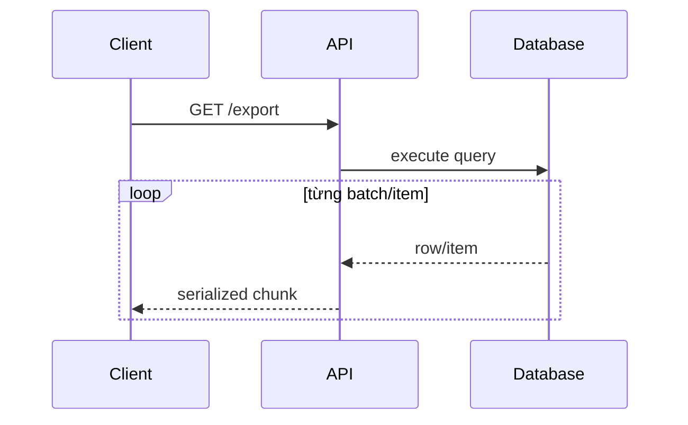
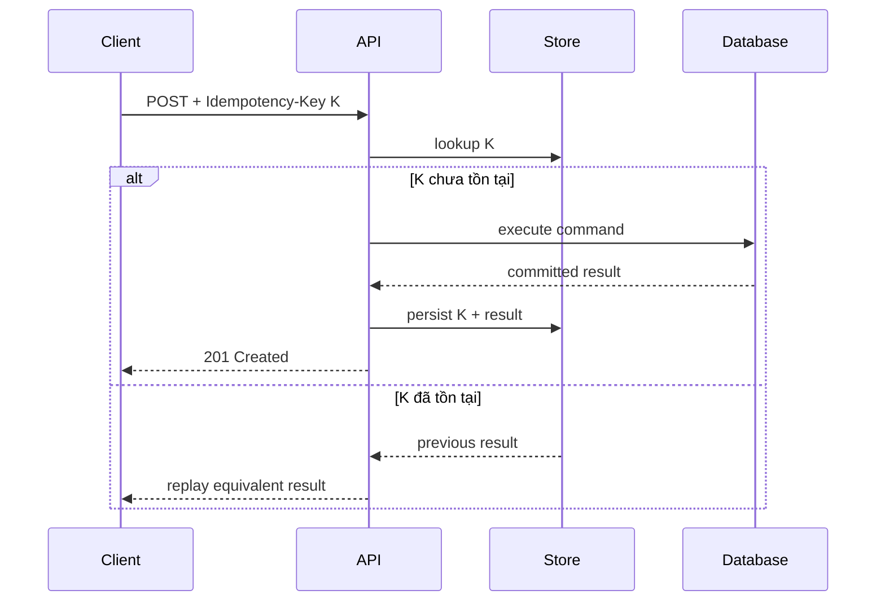
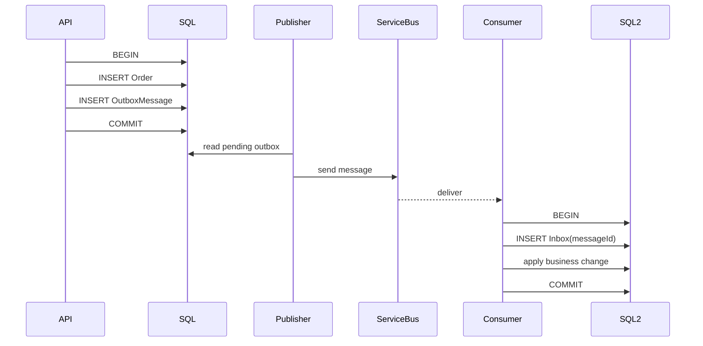
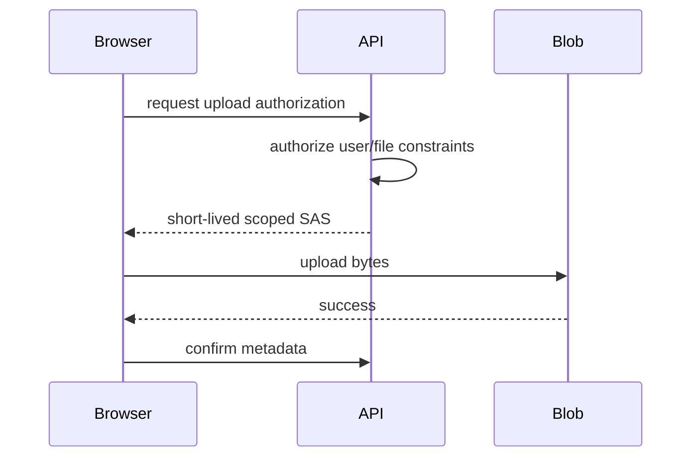
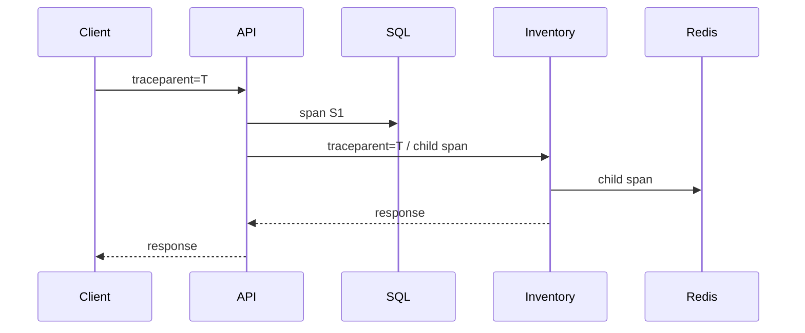

# Daily Knowledge Sharing — 2026-09-07

## Today’s Topics

1. `IAsyncDisposable` và async cleanup: khi resource teardown cũng là I/O
2. ASP.NET Core response streaming với `IAsyncEnumerable<T>`: giảm memory nhưng phải hiểu backpressure và cancellation
3. SQL composite index order + covering index: tối ưu theo access pattern, không theo danh sách cột
4. Cosmos DB partition key: logical partition, hot partition và RU distribution
5. API idempotency key: chống duplicate side effect khi client retry request
6. Transactional Outbox + Inbox: nối database transaction với message delivery mà không cần distributed transaction
7. Azure Blob Storage large-file upload: streaming, Managed Identity, SAS và failure recovery
8. Kubernetes readiness vs liveness probes: tránh biến health check thành nguyên nhân outage
9. OpenTelemetry distributed tracing: trace context, sampling và cách điều tra latency xuyên nhiều dependency
10. Integration testing với real infrastructure: Testcontainers, test isolation và khi mock làm bạn tự tin sai

---

# 1. `IAsyncDisposable` và async cleanup: khi resource teardown cũng là I/O

## 1. What is it?

`IAsyncDisposable` là contract của .NET cho resource cần cleanup theo cách bất đồng bộ thông qua `DisposeAsync()`. Mental model quan trọng: `IDisposable` phù hợp khi cleanup là công việc synchronous, còn `IAsyncDisposable` tồn tại cho trường hợp **việc đóng resource tự nó phải chờ I/O hoặc asynchronous coordination**.

Ví dụ điển hình gồm flushing một asynchronous writer, đóng một protocol session cần gửi frame cuối, hoàn tất buffered output hoặc giải phóng một resource mà underlying library expose async cleanup.

Cú pháp sử dụng là:

```csharp
await using var resource = await CreateResourceAsync(ct);
```

Compiler sẽ đảm bảo `DisposeAsync()` được await khi scope kết thúc, kể cả khi code ném exception.

## 2. Why does it exist?

Nếu một resource cần asynchronous cleanup nhưng chỉ expose `Dispose()`, implementation có thể buộc phải block thread bằng `.GetAwaiter().GetResult()` hoặc bỏ qua bước flush/close đúng protocol. Cả hai đều nguy hiểm trong server code.

Blocking async cleanup có thể góp phần vào ThreadPool starvation. Không cleanup đúng có thể làm mất buffered data, giữ connection lâu hơn cần thiết hoặc để server phía xa coi session bị disconnect bất thường.

`IAsyncDisposable` cho phép lifecycle của resource phản ánh đúng bản chất asynchronous thay vì giả vờ mọi teardown đều synchronous.

## 3. How does it work?

Lifecycle khái niệm:

```text
Acquire resource asynchronously
        |
        v
Use resource
        |
        +--> success
        |
        +--> exception
        |
        v
DisposeAsync()
        |
        v
await flush / close / release
```

Một type có thể implement cả `IDisposable` và `IAsyncDisposable`. Khi đó caller cần chọn lifecycle phù hợp. Với `await using`, compiler gọi `DisposeAsync()` thay vì `Dispose()`.

`DisposeAsync()` trả `ValueTask`, vì nhiều resource có thể hoàn tất cleanup đồng bộ trong fast path nhưng đôi khi phải chờ I/O.

## 4. Practical implementation

Một wrapper cho asynchronous writer:

```csharp
public sealed class CsvExportWriter : IAsyncDisposable
{
    private readonly StreamWriter _writer;
    private bool _disposed;

    public CsvExportWriter(Stream stream)
    {
        _writer = new StreamWriter(stream, leaveOpen: false);
    }

    public Task WriteRowAsync(string row, CancellationToken ct) =>
        _writer.WriteLineAsync(row.AsMemory(), ct).AsTask();

    public async ValueTask DisposeAsync()
    {
        if (_disposed)
            return;

        _disposed = true;
        await _writer.FlushAsync();
        await _writer.DisposeAsync();
    }
}
```

Caller:

```csharp
await using var blobStream = await blobClient.OpenWriteAsync(
    overwrite: true,
    cancellationToken: ct);

await using var csv = new CsvExportWriter(blobStream);

foreach (var row in rows)
{
    await csv.WriteRowAsync(row, ct);
}
```

Điểm đáng chú ý không phải cú pháp `await using`, mà là **ownership**: component nào acquire resource phải có trách nhiệm rõ ràng về thời điểm release nó.

## 5. Real production scenario

Một background job export hàng trăm MB dữ liệu ra Azure Blob Storage. Writer buffer dữ liệu để giảm số lần network write. Nếu process chỉ gọi synchronous dispose không flush đúng asynchronous path, job có thể báo thành công nhưng file cuối bị thiếu phần cuối hoặc connection bị giữ bất thường.

Một implementation dùng `await using` giúp completion của job chỉ được tính là thành công sau khi write pipeline đã flush và close đúng.

## 6. Failure scenario & troubleshooting

**Symptom** → Memory/connection count tăng sau nhiều job, hoặc file output đôi lúc thiếu dữ liệu cuối.

**Evidence** → Telemetry cho thấy stream/session vẫn sống sau business operation; logs không có completion event của cleanup; code tạo async resource nhưng không `await using`.

**Hypothesis** → Resource lifecycle bị kết thúc sai hoặc cleanup không được await.

**Diagnosis** → Trace acquire/dispose boundary, kiểm tra active connections/handles, xem exception trong cleanup có bị nuốt hay không.

**Fix** → Dùng `await using`, xác định owner của resource, propagate cancellation hợp lý nhưng tránh làm cleanup critical bị hủy quá sớm.

**Verification** → So sánh active resource count, file integrity và shutdown behavior trước/sau.

## 7. Common mistakes

* Implement `IAsyncDisposable` chỉ vì “modern hơn” dù cleanup hoàn toàn synchronous.
* Gọi `DisposeAsync().AsTask().Wait()` trong request path.
* Quên dispose object được tạo từ factory async.
* Cho nhiều layers cùng nghĩ mình sở hữu cùng một stream/connection.
* Nuốt exception trong cleanup khiến operation báo thành công giả.
* Dùng cancellation token của request cho mọi cleanup critical sau khi request đã bị abort.

## 8. Alternatives

`IDisposable` vẫn là lựa chọn đúng khi cleanup chỉ là release managed/unmanaged resource synchronous. Không nên chuyển mọi `Dispose()` thành async.

Với object lifetime được DI container quản lý, container có thể dispose service đúng cách nếu service implement lifecycle tương ứng; nhưng điều đó không thay thế việc quản lý resource ngắn hạn tạo bên trong method.

## 9. Trade-offs

### Advantages

* Không block thread cho async cleanup.
* Lifecycle phản ánh đúng underlying I/O.
* Tăng correctness cho buffered/network resources.

### Costs / Risks

* API trở nên asynchronous từ acquisition đến cleanup.
* Ownership phức tạp hơn nếu nhiều wrapper lồng nhau.
* Cleanup error cần policy rõ ràng, đặc biệt trong shutdown path.

## 10. Junior → Middle → Senior → Technical Lead

### Junior

Hiểu `using`/`await using` là lifecycle guarantee, không phải syntax trang trí.

### Middle

Biết khi nào resource cần `IAsyncDisposable`, biết propagate cleanup qua wrapper và test exceptional path.

### Senior

Đánh giá blocking teardown, resource leak, shutdown semantics và ownership giữa layers.

### Technical Lead / Architect

Thiết kế resource ownership rõ: layer nào acquire, layer nào release, cleanup có nằm trong request lifetime hay background lifecycle, và failure lúc cleanup được coi là business failure hay operational warning.

## 11. Key takeaway

* Async acquisition thường cần nghĩ luôn tới async cleanup.
* `IAsyncDisposable` giải quyết teardown có I/O, không phải thay thế mặc định cho `IDisposable`.
* Resource ownership không rõ ràng là nguồn leak phổ biến hơn bản thân API dispose.

---

# 2. ASP.NET Core response streaming với `IAsyncEnumerable<T>`: giảm memory nhưng phải hiểu backpressure và cancellation

## 1. What is it?

Response streaming là cách gửi dữ liệu dần về client thay vì materialize toàn bộ payload trong memory trước khi trả response. Trong .NET, `IAsyncEnumerable<T>` cho phép producer tạo item từng phần và caller consume bằng `await foreach`.

Mental model đúng:

```text
Produce một phần
→ serialize/write
→ chờ downstream nhận
→ produce phần tiếp theo
```

Thay vì:

```text
Load toàn bộ
→ giữ trong RAM
→ serialize toàn bộ
→ gửi một lần
```

## 2. Why does it exist?

Một endpoint export 500.000 records nếu gọi `ToListAsync()` trước rồi serialize JSON có thể giữ cả entity list, DTO list và serialized buffers cùng lúc. Peak memory tăng mạnh và GC pressure ảnh hưởng toàn process.

Streaming giảm peak memory và time-to-first-byte. Nhưng straightforward assumption “streaming luôn nhanh hơn” không đúng: database reader, serializer, network socket và client speed trở thành một pipeline phụ thuộc lẫn nhau.

## 3. How does it work?



Nếu client đọc chậm, write tới response body có thể chậm. Đây là backpressure tự nhiên: server không nên tiếp tục produce vô hạn nếu downstream không tiêu thụ kịp.

Nếu client disconnect, `HttpContext.RequestAborted` phải được truyền xuống query/stream để công việc dừng sớm.

## 4. Practical implementation

Một endpoint stream dữ liệu từ EF Core:

```csharp
app.MapGet("/api/orders/export", async (
    AppDbContext db,
    HttpContext http,
    CancellationToken ct) =>
{
    http.Response.ContentType = "application/x-ndjson";

    var query = db.Orders
        .AsNoTracking()
        .OrderBy(x => x.Id)
        .Select(x => new
        {
            x.Id,
            x.Number,
            x.Total
        })
        .AsAsyncEnumerable();

    await foreach (var item in query.WithCancellation(ct))
    {
        await JsonSerializer.SerializeAsync(
            http.Response.Body,
            item,
            cancellationToken: ct);

        await http.Response.WriteAsync("\n", ct);
    }
});
```

NDJSON phù hợp hơn một JSON array lớn khi consumer có thể xử lý từng record độc lập.

Với file download, `FileStreamResult` hoặc copy trực tiếp stream vào `Response.Body` thường đơn giản hơn tự tạo byte arrays.

## 5. Real production scenario

Một employee platform cho phép tải toàn bộ timesheet trong một khoảng thời gian. Dataset nhỏ ở UAT nên implementation `ToListAsync()` chạy tốt. Production tenant lớn có vài triệu rows, endpoint làm process memory tăng hàng GB và gây Gen 2 collection cho cả application.

Chuyển sang projection + streaming giảm memory đáng kể, nhưng team cũng cần đặt query timeout, limit export range và cân nhắc chuyển export rất lớn sang background job.

## 6. Failure scenario & troubleshooting

**Symptom** → Request kéo dài, database connection bị giữ lâu, concurrent exports làm connection pool căng dù memory đã giảm.

**Evidence** → Trace cho thấy mỗi streaming request giữ data reader/connection hàng chục phút; clients tải chậm.

**Hypothesis** → Streaming giải quyết buffering nhưng kéo dài resource lifetime.

**Diagnosis** → Đo duration của database reader, active connections, bytes/sec và client disconnect rate.

**Fix** → Batch/chunk dữ liệu, giới hạn concurrent exports, dùng background export tới Blob Storage cho dataset rất lớn, hoặc tách database read khỏi client speed bằng durable artifact.

**Verification** → Peak memory, connection hold time, p95 export completion và pool wait đều nằm trong budget.

## 7. Common mistakes

* Stream EF query trực tiếp cho hàng triệu rows mà không nghĩ tới connection lifetime.
* Không truyền `CancellationToken` khi client disconnect.
* Flush sau từng byte/chunk rất nhỏ làm throughput giảm.
* Dùng streaming để né pagination cho API bình thường.
* Cho response bắt đầu rồi mới phát hiện validation error; lúc đó status code có thể đã được gửi.
* Không đặt concurrency limit cho expensive exports.

## 8. Alternatives

* Pagination/keyset pagination cho interactive API.
* Background export → Blob Storage → signed download URL cho export lớn.
* Buffer toàn bộ vẫn đúng nếu payload nhỏ và simplicity quan trọng hơn tối ưu memory.

## 9. Trade-offs

### Advantages

* Giảm peak memory.
* Time-to-first-byte nhanh hơn.
* Có thể xử lý dataset lớn hơn.

### Costs / Risks

* Resource lifetime dài hơn.
* Error handling sau khi response bắt đầu khó hơn.
* Client chậm có thể giữ server work lâu.
* Observability và retry phức tạp hơn full-buffer response.

## 10. Junior → Middle → Senior → Technical Lead

### Junior

Hiểu streaming khác buffering ở chỗ dữ liệu được produce và gửi từng phần.

### Middle

Biết dùng `IAsyncEnumerable<T>`, projection, cancellation và response body đúng cách.

### Senior

Nhìn được trade-off memory vs connection lifetime, backpressure và client disconnect.

### Technical Lead / Architect

Quyết định endpoint nào nên stream, endpoint nào nên paginate, và workload nào phải chuyển thành asynchronous export artifact thay vì giữ HTTP request sống lâu.

## 11. Key takeaway

* Streaming giảm memory nhưng không làm resource cost biến mất.
* Backpressure và cancellation là phần của correctness.
* Export cực lớn thường phù hợp background artifact hơn long-lived HTTP stream.

---

# 3. SQL composite index order + covering index: tối ưu theo access pattern, không theo danh sách cột

## 1. What is it?

Composite index là index chứa nhiều key columns theo một thứ tự xác định. Thứ tự này ảnh hưởng trực tiếp tới việc database có thể seek hiệu quả cho predicate, ordering và range condition nào.

Ví dụ:

```sql
CREATE INDEX IX_Orders_TenantId_Status_CreatedAt
ON Orders (TenantId, Status, CreatedAt DESC)
INCLUDE (Number, Total);
```

Index không chỉ là “có các cột cần query”. Key order mô tả cách dữ liệu được sắp xếp trong cấu trúc index. `INCLUDE` columns giúp query lấy thêm dữ liệu mà không phải lookup về base table nhưng không tham gia ordering của key.

## 2. Why does it exist?

Một query enterprise thường lọc theo tenant, trạng thái rồi sắp xếp theo thời gian:

```sql
SELECT TOP (50) Id, Number, Total, CreatedAt
FROM Orders
WHERE TenantId = @tenantId
  AND Status = @status
ORDER BY CreatedAt DESC;
```

Nếu chỉ có ba index đơn lẻ trên `TenantId`, `Status`, `CreatedAt`, optimizer có thể vẫn phải đọc nhiều pages hoặc sort. Composite index phù hợp access pattern có thể seek thẳng vào vùng nhỏ đã đúng thứ tự.

## 3. How does it work?

Mental model gần đúng:

```text
Index key:
(TenantId, Status, CreatedAt)

Tenant A
  ├─ Pending
  │    ├─ 2026-09-07
  │    ├─ 2026-09-06
  │    └─ ...
  └─ Completed
Tenant B
  └─ ...
```

Predicate equality trên left-most columns giúp thu hẹp nhanh. Sau đó `CreatedAt` có thể được dùng cho range/order.

Query chỉ lọc `Status` mà không có `TenantId` có thể không hưởng lợi tương tự vì index được tổ chức bắt đầu từ `TenantId`.

## 4. Practical implementation

Query:

```sql
SELECT TOP (100)
    Id,
    Number,
    Total,
    CreatedAt
FROM dbo.Orders
WHERE TenantId = @TenantId
  AND Status = @Status
  AND CreatedAt < @Cursor
ORDER BY CreatedAt DESC, Id DESC;
```

Index phù hợp keyset pagination tốt hơn:

```sql
CREATE INDEX IX_Orders_Tenant_Status_Created_Id
ON dbo.Orders
(
    TenantId,
    Status,
    CreatedAt DESC,
    Id DESC
)
INCLUDE (Number, Total);
```

Điểm phải kiểm tra bằng execution plan là actual rows, logical reads, seek predicates, residual predicates và lookup count.

## 5. Real production scenario

Một CRM có bảng `Activities` 200 triệu rows. Query dashboard luôn lọc `TenantId`, `ActivityType`, khoảng thời gian và lấy 30 records mới nhất. Team ban đầu thêm từng index riêng và thấy storage tăng nhưng latency vẫn vài giây.

Một composite index đúng thứ tự equality → range/order giảm logical reads từ hàng trăm nghìn xuống vài chục/hàng trăm pages. Lợi ích đến từ access pattern, không đơn giản từ “thêm nhiều index”.

## 6. Failure scenario & troubleshooting

**Symptom** → Query dùng index nhưng vẫn chậm và đọc rất nhiều pages.

**Evidence** → Execution plan có Index Seek nhưng residual predicate lọc phần lớn rows sau seek; key lookup lặp hàng chục nghìn lần.

**Hypothesis** → Index key order hoặc covering columns không phù hợp.

**Diagnosis** → So sánh seek predicates vs predicates, logical reads (`SET STATISTICS IO ON`), actual row counts, lookup count.

**Fix** → Thiết kế lại key order dựa trên equality/range/sort, cân nhắc `INCLUDE`; không thêm columns vô hạn.

**Verification** → Logical reads và elapsed time giảm dưới representative production parameters.

## 7. Common mistakes

* Nghĩ `(A, B)` tương đương `(B, A)`.
* Đưa mọi selected column vào key thay vì `INCLUDE`.
* Tạo covering index quá rộng làm write cost và storage tăng mạnh.
* Chỉ test với một parameter value.
* Chỉ nhìn estimated plan, bỏ qua actual rows/statistics.
* Tạo index trùng lặp vì mỗi slow query thêm một index riêng.

## 8. Alternatives

* Filtered/partial index nếu chỉ một subset nhỏ thường xuyên query.
* Keyset pagination thay `OFFSET` lớn.
* Denormalized read model nếu dashboard access pattern quá khác transactional model.
* Không thêm index nếu query hiếm và write overhead không justify.

## 9. Trade-offs

### Advantages

* Giảm I/O đáng kể cho access pattern đúng.
* Có thể loại sort và key lookup.
* Tăng predictability cho top-N/keyset queries.

### Costs / Risks

* Mỗi index làm insert/update/delete đắt hơn.
* Tăng storage và maintenance.
* Index quá chuyên biệt có thể chỉ phục vụ một query hiếm.

## 10. Junior → Middle → Senior → Technical Lead

### Junior

Hiểu index là cấu trúc sắp xếp, không phải magic lookup table.

### Middle

Biết đọc basic execution plan và phân biệt key columns với included columns.

### Senior

Thiết kế index từ access pattern, cardinality, range condition và write cost; đo logical reads.

### Technical Lead / Architect

Quản lý index portfolio toàn bảng: query nào thực sự đáng tối ưu, index nào duplicate, read performance có đáng đổi lấy write/storage cost không.

## 11. Key takeaway

* Composite index order phải khớp cách query truy cập dữ liệu.
* `Index Seek` không tự động nghĩa query tối ưu.
* Đo logical reads + actual plan trước và sau thay đổi.

---

# 4. Cosmos DB partition key: logical partition, hot partition và RU distribution

## 1. What is it?

Partition key trong Azure Cosmos DB là giá trị quyết định cách documents được nhóm thành logical partitions và phân phối lên physical partitions. Đây là một quyết định data modeling cốt lõi, không phải field thêm vào cho đủ schema.

Mental model:

```text
Document
  |
  v
Partition key value
  |
  v
Logical partition
  |
  v
Mapped onto physical partition(s)
```

Một partition key tốt phân phối storage và request load đủ đều, đồng thời giữ các query/transaction thường xuyên trong boundary hợp lý.

## 2. Why does it exist?

Cosmos DB scale bằng cách phân phối dữ liệu và throughput. Nếu mọi request đều dồn vào một partition key value, hệ thống có tổng RU cao vẫn có thể bị throttling ở một vùng nóng.

Không có partitioning hợp lý, horizontal scale không giúp nhiều vì một physical partition trở thành bottleneck.

## 3. How does it work?

Ví dụ document:

```json
{
  "id": "order-123",
  "tenantId": "tenant-a",
  "customerId": "customer-42",
  "status": "Pending"
}
```

Nếu chọn `/tenantId` làm partition key, toàn bộ dữ liệu của một tenant nằm trong cùng logical partition key value. Điều này tốt nếu tenants tương đối cân bằng và queries luôn theo tenant.

Nhưng nếu một tenant lớn chiếm 70% traffic, `/tenantId` có thể trở thành hot partition.

Cross-partition query thường tiêu thụ RU cao hơn vì phải fan out.

## 4. Practical implementation

SDK .NET:

```csharp
var container = database.GetContainer("orders");

var order = new OrderDocument
{
    Id = Guid.NewGuid().ToString(),
    TenantId = tenantId,
    CustomerId = customerId,
    Status = "Pending"
};

await container.CreateItemAsync(
    order,
    new PartitionKey(order.TenantId),
    cancellationToken: ct);
```

Point read tối ưu khi biết cả `id` và partition key:

```csharp
var response = await container.ReadItemAsync<OrderDocument>(
    orderId,
    new PartitionKey(tenantId),
    cancellationToken: ct);
```

Điều cần đo là RU charge, throttled requests (`429`) và distribution theo partition key value.

## 5. Real production scenario

Một SaaS multi-tenant chọn `/tenantId`. Hầu hết tenant nhỏ, nhưng một enterprise customer có traffic gấp hàng trăm lần. Tổng provisioned throughput còn dư nhưng riêng partition chứa enterprise tenant thường xuyên bị `429`.

Giải pháp có thể là hierarchical/compound partitioning strategy phù hợp workload, hoặc thêm shard dimension nếu data model cho phép. Không thể fix triệt để chỉ bằng retry.

## 6. Failure scenario & troubleshooting

**Symptom** → API có latency spike và nhiều `429 Too Many Requests` dù account-level RU chưa dùng hết.

**Evidence** → Metrics cho thấy normalized RU consumption cao ở một partition, request charge tập trung vào một partition key.

**Hypothesis** → Hot partition do skewed traffic/data distribution.

**Diagnosis** → Phân tích top partition key values, RU per operation, query fan-out và document size.

**Fix** → Điều chỉnh partition strategy cho dữ liệu mới, redesign access pattern hoặc migrate/repartition nếu business justify; thêm backoff chỉ là mitigation.

**Verification** → RU distribution cân bằng hơn, `429` giảm và p95 ổn định dưới peak traffic.

## 7. Common mistakes

* Chọn partition key vì field “có vẻ unique”.
* Chọn key có cardinality quá thấp như `status`.
* Bỏ qua tenant size skew.
* Query không truyền partition key rồi chấp nhận fan-out mặc định.
* Dùng retry để che hot partition lâu dài.
* Thiết kế schema trước rồi mới nghĩ partition key sau.

## 8. Alternatives

SQL Server/PostgreSQL có thể phù hợp hơn nếu workload cần relational constraints, complex joins và scale chưa yêu cầu distributed document store.

MongoDB có shard key với trade-off tương tự về distribution. Cosmos DB phù hợp khi global distribution, elastic throughput và document access pattern justify operational/cost model.

## 9. Trade-offs

### Advantages

* Horizontal scale và distribution rõ ràng.
* Point reads theo partition key rất hiệu quả.
* Transaction scope trong logical partition dễ lý luận hơn.

### Costs / Risks

* Partition key khó thay đổi sau khi system lớn.
* Data/traffic skew gây hot partition.
* Cross-partition queries tăng RU và latency.

## 10. Junior → Middle → Senior → Technical Lead

### Junior

Hiểu partition key quyết định dữ liệu nằm ở đâu và query được route thế nào.

### Middle

Biết luôn truyền partition key cho point operations và đọc RU charge.

### Senior

Phân tích key cardinality, traffic skew, hot partition và query fan-out.

### Technical Lead / Architect

Chọn partitioning từ access pattern + growth model, dự đoán tenant skew và đánh giá migration cost trước khi data volume trở nên lớn.

## 11. Key takeaway

* Partition key là architecture decision, không phải schema detail.
* Tổng RU còn dư không loại trừ hot partition.
* Model Cosmos DB theo access pattern và distribution ngay từ đầu.

---

# 5. API idempotency key: chống duplicate side effect khi client retry request

## 1. What is it?

Idempotency key là một identifier do client gửi cùng command request để server nhận biết nhiều lần gửi có cùng **business intent** và không thực hiện side effect lặp lại.

Ví dụ:

```http
POST /api/payments
Idempotency-Key: 7d32c3d2-...
```

Nếu client timeout sau khi server đã tạo payment nhưng chưa nhận response, client có thể retry với cùng key. Server trả lại kết quả trước đó thay vì tạo payment thứ hai.

## 2. Why does it exist?

Trong distributed systems, timeout không nói cho client biết operation đã thất bại hay chỉ response bị mất.

```text
Client -> API: POST
API -> DB: commit thành công
API --X Client: response mất do network timeout
```

Client không thể phân biệt “server chưa xử lý” và “server xử lý rồi nhưng tôi không nhận được kết quả”. Nếu retry một POST không idempotent, duplicate side effect xảy ra.

## 3. How does it work?



Correctness quan trọng nhất là việc ghi business result và idempotency record phải có consistency boundary đủ mạnh. Nếu ghi chúng tách rời, vẫn có failure window.

## 4. Practical implementation

Một model đơn giản trong SQL:

```sql
CREATE TABLE ApiIdempotency (
    IdempotencyKey varchar(100) NOT NULL PRIMARY KEY,
    RequestHash varbinary(32) NOT NULL,
    StatusCode int NULL,
    ResponseBody nvarchar(max) NULL,
    CreatedAt datetime2 NOT NULL
);
```

Application flow:

```csharp
public async Task<CreateOrderResult> HandleAsync(
    string idempotencyKey,
    CreateOrder command,
    CancellationToken ct)
{
    var existing = await db.IdempotencyRecords
        .SingleOrDefaultAsync(x => x.Key == idempotencyKey, ct);

    if (existing is not null)
        return Deserialize(existing.ResponseJson);

    var order = Order.Create(command.CustomerId, command.Items);
    db.Orders.Add(order);

    var result = new CreateOrderResult(order.Id);
    db.IdempotencyRecords.Add(IdempotencyRecord.Create(
        idempotencyKey,
        Serialize(result)));

    await db.SaveChangesAsync(ct);
    return result;
}
```

Production implementation phải xử lý concurrent requests cùng key bằng unique constraint và conflict path, không chỉ `SELECT` rồi `INSERT` naive.

## 5. Real production scenario

Mobile app gửi request đặt order khi mạng 4G không ổn định. Server commit order nhưng response mất. SDK retry tự động sau 2 giây.

Không có idempotency key, khách hàng thấy hai orders giống nhau. Có idempotency key gắn với một user action, server trả lại order ID cũ.

## 6. Failure scenario & troubleshooting

**Symptom** → Duplicate orders xuất hiện theo cặp, timestamp cách nhau vài giây, thường trùng lúc latency/network errors tăng.

**Evidence** → Access logs cho thấy cùng logical action được POST lại nhiều lần; mỗi request có request ID khác nhau nhưng payload giống nhau.

**Hypothesis** → Client retry một non-idempotent command mà server không deduplicate.

**Diagnosis** → Correlate retries, gateway timeout, client telemetry và duplicate rows.

**Fix** → Thiết kế idempotency key contract, unique storage, request-hash validation và retention window.

**Verification** → Replay cùng key nhiều lần và concurrent calls; chỉ một business side effect tồn tại.

## 7. Common mistakes

* Dùng request ID làm idempotency key dù mỗi retry tạo request ID mới.
* Chỉ cache response in-memory nên mất protection khi scale/restart.
* Không kiểm tra cùng key nhưng payload khác nhau.
* `SELECT` rồi `INSERT` không có unique constraint.
* Giữ idempotency records vô hạn không có retention policy.
* Nghĩ HTTP PUT idempotent nghĩa mọi implementation tự động an toàn với retry.

## 8. Alternatives

Natural business unique key có thể tốt hơn explicit idempotency table, ví dụ `ExternalPaymentReference` có unique constraint.

Message consumers thường dùng Inbox/deduplication dựa trên message ID thay vì HTTP idempotency key.

## 9. Trade-offs

### Advantages

* Cho phép retry command an toàn hơn.
* Giảm duplicate side effects do ambiguous timeout.
* Tạo contract rõ giữa client và server.

### Costs / Risks

* Cần persistent deduplication state.
* Retention/storage policy phức tạp hơn.
* Response replay và payload mismatch phải được định nghĩa.

## 10. Junior → Middle → Senior → Technical Lead

### Junior

Hiểu retry có thể gửi cùng business action nhiều lần.

### Middle

Implement key validation, unique storage và deterministic replay.

### Senior

Xử lý concurrency race, crash window, retention và security scope của key.

### Technical Lead / Architect

Xác định command nào cần idempotency, key được sinh ở đâu, consistency boundary là gì và contract này tương tác ra sao với gateway/client retry policy.

## 11. Key takeaway

* Timeout là trạng thái không chắc chắn, không đồng nghĩa server chưa commit.
* Retry non-idempotent command cần deduplication strategy.
* Unique constraint/persistent state quan trọng hơn check application-level đơn thuần.

---

# 6. Transactional Outbox + Inbox: nối database transaction với message delivery mà không cần distributed transaction

## 1. What is it?

Transactional Outbox ghi business change và message-to-publish trong **cùng một local database transaction**. Một background publisher sau đó đọc outbox và gửi message tới broker.

Inbox là pattern phía consumer để ghi nhận message đã xử lý, giúp duplicate delivery không tạo duplicate business effect.

Kết hợp:

```text
Producer DB transaction
  business data + outbox
            |
            v
       message broker
            |
            v
Consumer DB transaction
  inbox + business change
```

## 2. Why does it exist?

Dual-write naive có failure gap:

```text
1. Save order to SQL   ✅
2. Publish message     ❌
```

Order tồn tại nhưng downstream không bao giờ biết.

Đảo thứ tự cũng lỗi:

```text
1. Publish message     ✅
2. Save order to SQL   ❌
```

Downstream phản ứng với entity chưa tồn tại.

Distributed transaction giữa SQL và broker thường không khả dụng hoặc tăng coupling/operational complexity. Outbox chuyển bài toán thành reliable local transaction + asynchronous delivery.

## 3. How does it work?



Publisher có thể crash sau khi send nhưng trước khi mark outbox processed, vì vậy message có thể gửi lại. Đây là lý do consumer phải idempotent/Inbox-aware.

## 4. Practical implementation

Producer:

```csharp
await using var tx = await db.Database.BeginTransactionAsync(ct);

var order = Order.Create(command.CustomerId);
db.Orders.Add(order);

db.OutboxMessages.Add(new OutboxMessage
{
    Id = Guid.NewGuid(),
    Type = "OrderCreated",
    Payload = JsonSerializer.Serialize(new { order.Id }),
    OccurredAt = clock.UtcNow
});

await db.SaveChangesAsync(ct);
await tx.CommitAsync(ct);
```

Consumer dedupe:

```csharp
if (await db.InboxMessages.AnyAsync(x => x.MessageId == message.Id, ct))
    return;

await ApplyOrderCreatedAsync(message, ct);

db.InboxMessages.Add(new InboxMessage
{
    MessageId = message.Id,
    ProcessedAt = clock.UtcNow
});

await db.SaveChangesAsync(ct);
```

Production cần unique constraint trên `InboxMessages.MessageId` để xử lý concurrent duplicate deliveries.

## 5. Real production scenario

Order service tạo order và Inventory service phải reserve stock qua Azure Service Bus. Khi Service Bus outage 10 phút, order writes vẫn commit cùng outbox. Publisher retry sau khi broker hồi phục và backlog giảm dần.

Business phải chấp nhận trạng thái tạm thời `PendingInventory`, thay vì giả vờ toàn hệ thống consistent tức thời.

## 6. Failure scenario & troubleshooting

**Symptom** → Outbox backlog tăng liên tục; orders được tạo nhưng inventory chưa cập nhật.

**Evidence** → `oldest_unprocessed_outbox_age` tăng, Service Bus send errors hoặc consumer lag tăng.

**Hypothesis** → Publisher/broker/downstream không theo kịp producer.

**Diagnosis** → Theo dõi outbox count, oldest age, publish throughput, consumer backlog và poison messages.

**Fix** → Khắc phục broker/network/schema issue, scale publisher/consumer, quarantine poison message, replay an toàn.

**Verification** → Backlog age trở lại SLO và data downstream hội tụ đúng.

## 7. Common mistakes

* Nghĩ Outbox mang lại exactly-once delivery.
* Publish message trực tiếp trong DB transaction và giữ transaction mở khi network chậm.
* Mark outbox processed trước khi send thành công.
* Consumer không idempotent.
* Không có retention/cleanup cho outbox/inbox tables.
* Không monitor oldest backlog age, chỉ monitor row count.

## 8. Alternatives

* Direct publish đủ cho non-critical event có thể mất.
* CDC có thể dùng làm synchronization mechanism nếu platform/team hỗ trợ.
* Distributed transaction chỉ nên cân nhắc khi infrastructure thực sự hỗ trợ và complexity justify.

## 9. Trade-offs

### Advantages

* Loại bỏ lost-message gap giữa DB commit và publish.
* Không cần 2PC giữa database và broker.
* Có durable replay source.

### Costs / Risks

* Eventual consistency.
* Thêm tables, publisher, cleanup và monitoring.
* Duplicate delivery vẫn tồn tại.
* Schema evolution/message compatibility trở thành concern dài hạn.

## 10. Junior → Middle → Senior → Technical Lead

### Junior

Hiểu một database transaction không bao phủ message broker.

### Middle

Implement outbox publisher và idempotent consumer cơ bản.

### Senior

Thiết kế crash recovery, batching, duplicate handling, poison message và telemetry backlog.

### Technical Lead / Architect

Quyết định workflow nào thật sự cần Outbox, consistency expectation với business là gì, và operational burden có justify so với direct synchronous flow hay không.

## 11. Key takeaway

* Outbox giải quyết atomicity giữa business write và intent-to-publish, không tạo exactly-once delivery.
* Inbox/idempotency là nửa còn lại của at-least-once messaging.
* Backlog age phải là production signal hạng nhất.

---

# 7. Azure Blob Storage large-file upload: streaming, Managed Identity, SAS và failure recovery

## 1. What is it?

Azure Blob Storage là object storage cho file/binary data. Với large-file upload, điều quan trọng không chỉ là gọi SDK `UploadAsync`, mà là thiết kế **data path, identity, memory usage, retry và ownership của upload session**.

Một kiến trúc có thể là:

```text
Browser -> API -> Blob Storage
```

hoặc:

```text
Browser -> Blob Storage trực tiếp bằng SAS
           ^
           |
        API cấp quyền giới hạn
```

## 2. Why does it exist?

Proxy file 5 GB xuyên qua web application giữ socket, bandwidth, memory buffers và instance capacity rất lâu. Nếu application chỉ cần authorize upload chứ không cần inspect toàn bộ bytes, direct-to-Blob có thể giảm tải lớn.

Ngược lại, public storage credentials hoặc long-lived SAS tạo security risk. Vì vậy identity và permission scope phải được coi là phần của architecture.

## 3. How does it work?

Azure Blob SDK có thể upload stream hoặc block blobs theo chunks. Với block blob, client có thể stage blocks và commit block list cuối cùng.

Direct upload flow:



Backend-to-Blob nên ưu tiên Managed Identity thay vì storage account keys khi hosting environment hỗ trợ.

## 4. Practical implementation

Backend với Managed Identity:

```csharp
var credential = new DefaultAzureCredential();
var service = new BlobServiceClient(
    new Uri("https://myaccount.blob.core.windows.net"),
    credential);

var container = service.GetBlobContainerClient("exports");
var blob = container.GetBlobClient(blobName);

await blob.UploadAsync(
    sourceStream,
    new BlobUploadOptions
    {
        HttpHeaders = new BlobHttpHeaders
        {
            ContentType = "application/octet-stream"
        }
    },
    ct);
```

Không cần:

```csharp
var bytes = await File.ReadAllBytesAsync(path, ct);
```

nếu nguồn đã là stream.

## 5. Real production scenario

Một automotive marketplace cho dealer upload video 2–5 GB. Ban đầu video đi qua ASP.NET Core API. Khi nhiều dealers upload đồng thời, App Service bandwidth/connection capacity tăng mạnh và deployments phải chờ long-lived requests drain.

Chuyển sang short-lived SAS upload trực tiếp Blob, API chỉ kiểm soát metadata/quota và xử lý event sau upload. Web tier trở lại stateless/lightweight hơn.

## 6. Failure scenario & troubleshooting

**Symptom** → Upload lớn thường fail ở 70–90%, user phải tải lại từ đầu.

**Evidence** → Network interruption, client timeout, no resumable/block strategy; server logs chỉ thấy request aborted.

**Hypothesis** → Upload architecture giả định connection dài luôn ổn định.

**Diagnosis** → Đo file-size distribution, failure position, retry bytes, upload duration và client network type.

**Fix** → Dùng chunk/block upload có resume/retry, short-lived scoped credentials, idempotent finalization và orphaned-block cleanup policy.

**Verification** → Simulate network interruption và xác minh upload resume thay vì restart toàn bộ.

## 7. Common mistakes

* Đọc file lớn toàn bộ vào memory.
* Dùng storage account key trong application config.
* SAS TTL quá dài hoặc scope cả container khi chỉ cần một blob.
* Tin `Content-Type`/filename từ client mà không validate.
* Không có max-size/quota policy.
* Không xử lý orphaned uploads hoặc metadata record không khớp blob state.

## 8. Alternatives

* API proxy upload phù hợp file nhỏ hoặc khi server bắt buộc inspect/transform bytes inline.
* Azure Files phù hợp shared filesystem semantics hơn object storage trong một số legacy workload.
* Direct Blob upload tốt khi object lớn và web tier không cần sở hữu data path.

## 9. Trade-offs

### Advantages

* Scale storage/bandwidth độc lập web app.
* Streaming/chunking giảm memory và retry cost.
* Managed Identity giảm secret management.

### Costs / Risks

* Direct upload flow phức tạp hơn frontend/backend coordination.
* Cần policy cho incomplete/orphaned blobs.
* SAS misuse có thể mở quyền rộng hơn dự kiến.

## 10. Junior → Middle → Senior → Technical Lead

### Junior

Hiểu Blob Storage là object store, không phải database table hay local filesystem.

### Middle

Biết upload stream, set metadata và dùng identity đúng.

### Senior

Thiết kế chunking, retry, cancellation, SAS scope, large-file performance và reconciliation.

### Technical Lead / Architect

Chọn data path: client→API→Blob hay client→Blob; quyết định security boundary, lifecycle policy, cost egress/storage và post-upload processing architecture.

## 11. Key takeaway

* Với file lớn, data path là architecture decision.
* Stream/chunk thay vì buffer toàn bộ.
* Managed Identity và short-lived least-privilege SAS tốt hơn long-lived storage secrets.

---

# 8. Kubernetes readiness vs liveness probes: tránh biến health check thành nguyên nhân outage

## 1. What is it?

Readiness probe trả lời: **Pod này hiện có nên nhận traffic không?**

Liveness probe trả lời: **Process này có bị kẹt đến mức cần restart không?**

Hai câu hỏi khác nhau. Một dependency tạm thời chậm không nhất thiết nghĩa process phải bị restart.

## 2. Why does it exist?

Trong rolling deployment, pod mới cần thời gian startup trước khi nhận request. Khi app mất khả năng serve traffic tạm thời, Service cần ngừng route tới pod đó. Nếu process deadlock/hung thực sự, kubelet cần restart.

Nếu chỉ dùng một `/health` endpoint cho cả readiness và liveness rồi endpoint kiểm tra SQL, Redis, Service Bus, bất kỳ dependency outage nào cũng có thể kích hoạt mass restart.

## 3. How does it work?

```text
Kubernetes Service
      |
      v
Readiness probe == healthy?
      |
   yes|no
      |
      +--> yes: endpoint receives traffic
      +--> no : removed from Service endpoints

Kubelet
      |
      v
Liveness probe repeatedly failing?
      |
      v
restart container
```

ASP.NET Core Health Checks cho phép gắn tags để tách checks.

## 4. Practical implementation

```csharp
builder.Services.AddHealthChecks()
    .AddCheck("self", () => HealthCheckResult.Healthy(), tags: ["live"])
    .AddSqlServer(
        connectionString,
        name: "sql",
        tags: ["ready"]);

app.MapHealthChecks("/health/live", new HealthCheckOptions
{
    Predicate = check => check.Tags.Contains("live")
});

app.MapHealthChecks("/health/ready", new HealthCheckOptions
{
    Predicate = check => check.Tags.Contains("ready")
});
```

Deployment:

```yaml
readinessProbe:
  httpGet:
    path: /health/ready
    port: 8080
  periodSeconds: 5

livenessProbe:
  httpGet:
    path: /health/live
    port: 8080
  periodSeconds: 10
  failureThreshold: 3
```

## 5. Real production scenario

SQL database có 30 giây failover. Nếu liveness probe phụ thuộc SQL, tất cả pods đồng thời fail liveness và restart. Database đang recover lại phải chịu connection storm từ pods khởi động lại.

Nếu SQL chỉ nằm trong readiness, pods tạm ngừng nhận traffic nhưng process không bị restart vô ích. Khi DB phục hồi, readiness pass và traffic quay lại.

## 6. Failure scenario & troubleshooting

**Symptom** → Dependency outage nhỏ biến thành toàn cluster pods restart liên tục.

**Evidence** → `kubectl describe pod` cho thấy liveness failures; restart count tăng đúng lúc DB/cache outage.

**Hypothesis** → Liveness đang kiểm tra dependency external.

**Diagnosis** → Inspect probe endpoint, timeout/failureThreshold, application startup duration và pod events.

**Fix** → Tách self-process liveness khỏi dependency readiness; tuning thresholds dựa trên real startup/failure behavior.

**Verification** → Chaos test dependency outage: pods không restart hàng loạt, traffic behavior đúng policy.

## 7. Common mistakes

* Cùng một deep health endpoint cho cả readiness/liveness.
* Liveness check database/third-party API.
* Probe timeout quá ngắn so với GC/startup spikes bình thường.
* Readiness luôn 200 dù app chưa load config/migrations cần thiết.
* Dùng health probe như business monitoring đầy đủ.
* Không xem restart reason trong pod events.

## 8. Alternatives

Trên Azure App Service không có Kubernetes probes nhưng vẫn có Health Check/traffic routing concepts tương tự. Container Apps cũng có probes. Principle vẫn là phân biệt “có nên nhận traffic” với “process có cần restart”.

## 9. Trade-offs

### Advantages

* Rolling deployment an toàn hơn.
* Tách traffic eligibility khỏi process survival.
* Giảm cascading restart khi dependency fail.

### Costs / Risks

* Probe design sai có thể tự gây outage.
* Deep readiness check có thể tạo thêm load cho dependencies.
* Threshold tuning cần production evidence.

## 10. Junior → Middle → Senior → Technical Lead

### Junior

Phân biệt readiness và liveness bằng hai câu hỏi khác nhau.

### Middle

Configure ASP.NET Health Checks và Kubernetes probes đúng endpoint.

### Senior

Debug restart loop, dependency failover, startup timing và cascading failure.

### Technical Lead / Architect

Định nghĩa health semantics cho service: dependency nào bắt buộc để nhận traffic, dependency nào có fallback, và failure nào thật sự justify process restart.

## 11. Key takeaway

* Dependency down thường là readiness concern, không phải liveness concern.
* Health checks có thể gây cascading failure nếu semantics sai.
* Probe thresholds phải phản ánh runtime thực tế, không copy từ template.

---

# 9. OpenTelemetry distributed tracing: trace context, sampling và cách điều tra latency xuyên nhiều dependency

## 1. What is it?

Distributed tracing theo dõi một request qua nhiều process/dependencies bằng trace gồm nhiều spans. OpenTelemetry cung cấp standard instrumentation/context propagation để application, HTTP client, database và messaging operations có thể nối cùng một causal chain.

Mental model:

```text
Trace = toàn bộ journey
Span  = một operation trong journey
```

Ví dụ:

```text
HTTP GET /checkout          800 ms
 ├─ SQL query               30 ms
 ├─ Redis GET                5 ms
 └─ Inventory HTTP call    700 ms
```

## 2. Why does it exist?

Một API báo p95 1.2 giây không nói bottleneck nằm ở đâu. Logs từng service riêng lẻ yêu cầu ghép thủ công timestamp/correlation ID và dễ bỏ sót async dependency.

Trace context cho phép nhìn dependency latency và causal relationship thay vì chỉ aggregate metrics.

## 3. How does it work?

W3C Trace Context thường propagate `traceparent` qua HTTP headers. Mỗi service tạo child span và tiếp tục trace ID.



Sampling quyết định trace nào được giữ/export để kiểm soát cost. Sampling 1% có thể đủ baseline throughput nhưng dễ bỏ rare errors nếu strategy không thoughtful.

## 4. Practical implementation

ASP.NET Core:

```csharp
builder.Services.AddOpenTelemetry()
    .WithTracing(tracing => tracing
        .AddAspNetCoreInstrumentation()
        .AddHttpClientInstrumentation()
        .AddSqlClientInstrumentation()
        .AddSource("Orders.Application")
        .AddOtlpExporter());
```

Custom span:

```csharp
private static readonly ActivitySource ActivitySource =
    new("Orders.Application");

using var activity = ActivitySource.StartActivity("ReserveInventory");
activity?.SetTag("order.id", orderId);

await inventoryClient.ReserveAsync(orderId, ct);
```

Không nên tag dữ liệu nhạy cảm hoặc cardinality cực cao tùy tiện.

## 5. Real production scenario

Checkout p99 tăng từ 800 ms lên 3 giây. SQL metrics bình thường, CPU app bình thường. Trace cho thấy 15% requests gọi Reviews API ngoài critical path và dependency này retry 3 lần sau timeout 700 ms.

Không có tracing, team có thể tối ưu SQL sai chỗ. Trace giúp localize latency vào dependency + retry policy.

## 6. Failure scenario & troubleshooting

**Symptom** → Dashboard có trace nhưng một số service xuất hiện như root trace mới, không nối với upstream.

**Evidence** → Trace IDs khác nhau giữa API và background consumer; custom HTTP/messaging code không propagate context.

**Hypothesis** → Trace context bị mất tại integration boundary.

**Diagnosis** → Inspect headers/message properties, instrumentation coverage và async context handling.

**Fix** → Propagate/extract standard context, instrument messaging producer/consumer, tránh tự tạo correlation format riêng không cần thiết.

**Verification** → Một test request hiển thị end-to-end trace xuyên toàn chain.

## 7. Common mistakes

* Log correlation ID nhưng gọi đó là distributed tracing đầy đủ.
* Tag user email/token/payload nhạy cảm vào spans.
* Sampling quá thấp rồi không bắt được errors quan trọng.
* Export mọi span với 100% sampling ở high-throughput service mà không tính cost.
* Tạo custom spans cho mọi function nhỏ, sinh noise.
* Không đồng bộ trace với metrics/logs.

## 8. Alternatives

Structured logs với correlation ID đủ cho hệ thống đơn giản. Tracing đáng giá hơn khi request đi qua nhiều services/dependencies hoặc latency causality khó thấy.

Vendor-native tracing như Application Insights vẫn có thể là backend hiển thị; OpenTelemetry chủ yếu giúp instrumentation portable/standardized.

## 9. Trade-offs

### Advantages

* Localize latency theo dependency.
* Hiểu causal chain xuyên process.
* Hỗ trợ incident investigation mạnh khi kết hợp logs/metrics.

### Costs / Risks

* Telemetry volume/cost.
* Sampling có thể che rare events.
* Cardinality/PII mistakes tạo cost hoặc security issue.
* Instrumentation không đầy đủ cho cảm giác “trace bị đứt”.

## 10. Junior → Middle → Senior → Technical Lead

### Junior

Hiểu trace, span và correlation là gì.

### Middle

Instrument ASP.NET Core/HttpClient/SQL và đọc waterfall trace.

### Senior

Thiết kế sampling, custom spans, baggage/tags và điều tra cross-service incident.

### Technical Lead / Architect

Đặt observability standard: propagation format, data classification, sampling budget, retention và backend ownership; quyết định đâu cần tracing và đâu chỉ metrics/logs là đủ.

## 11. Key takeaway

* Metrics nói “có vấn đề”; trace thường giúp nói “vấn đề nằm trên path nào”.
* Context propagation là nền tảng của end-to-end tracing.
* Sampling/cardinality là architecture + cost decision, không chỉ config mặc định.

---

# 10. Integration testing với real infrastructure: Testcontainers, test isolation và khi mock làm bạn tự tin sai

## 1. What is it?

Integration test kiểm tra nhiều component thật tương tác với nhau: application code + EF Core provider + database engine, hoặc API + serialization + auth pipeline + persistence.

Testcontainers là cách chạy dependency thật như PostgreSQL, SQL Server, Redis hoặc broker trong container cho test lifecycle.

Mental model quan trọng: mock kiểm tra **assumption của code về dependency**; real integration test kiểm tra **dependency thực sự có hành xử như assumption đó không**.

## 2. Why does it exist?

Một repository test dùng mocked `DbSet` có thể pass LINQ expression mà EF Core không translate được. Một fake Redis không tái hiện TTL/serialization/network behavior. Một mocked HTTP client có thể không bắt header encoding hoặc JSON contract issue.

Unit test vẫn rất có giá trị cho pure business logic. Nhưng boundary với database/protocol cần một lớp test khác để phát hiện integration risk.

## 3. How does it work?

```text
Test runner
   |
   +--> start disposable DB/container
   |
   +--> apply migrations/schema
   |
   +--> boot application/test host
   |
   +--> execute real interaction
   |
   +--> assert state/response
   |
   +--> cleanup container/data
```

Isolation có thể theo database-per-test-class, schema-per-test hoặc transaction rollback tùy engine/test behavior.

## 4. Practical implementation

Ví dụ với Testcontainers PostgreSQL:

```csharp
public sealed class PostgresFixture : IAsyncLifetime
{
    private readonly PostgreSqlContainer _container =
        new PostgreSqlBuilder()
            .WithImage("postgres:16-alpine")
            .Build();

    public string ConnectionString => _container.GetConnectionString();

    public Task InitializeAsync() => _container.StartAsync();

    public Task DisposeAsync() => _container.DisposeAsync().AsTask();
}
```

Test EF Core:

```csharp
[Fact]
public async Task Duplicate_employee_email_is_rejected()
{
    await using var db = CreateDbContext();

    db.Employees.Add(new Employee("a@example.com"));
    await db.SaveChangesAsync();

    db.Employees.Add(new Employee("a@example.com"));

    await Assert.ThrowsAsync<DbUpdateException>(
        () => db.SaveChangesAsync());
}
```

Test này bảo vệ real unique constraint, không chỉ application validation.

## 5. Real production scenario

Team dùng EF Core InMemory provider cho integration tests. Query production dùng case-insensitive comparison và transaction semantics khác; tests pass nhưng SQL Server production trả behavior khác.

Chuyển critical persistence tests sang real SQL Server/PostgreSQL container bắt được migration, constraint, translation và collation behavior gần production hơn.

## 6. Failure scenario & troubleshooting

**Symptom** → Test suite flaky hoặc quá chậm sau khi thêm containers.

**Evidence** → Mỗi test start một container mới; tests dùng shared static data; parallel tests đụng cùng IDs/schema.

**Hypothesis** → Test lifecycle/isolation strategy kém chứ không phải real infrastructure “không test được”.

**Diagnosis** → Đo startup vs execution time, identify shared-state conflicts, inspect container reuse scope.

**Fix** → Reuse container theo collection/suite, reset database deterministically, generate isolated IDs, chỉ chạy real-infra tests cho boundaries có rủi ro phù hợp.

**Verification** → Suite chạy lặp nhiều lần ổn định, duration nằm trong CI budget.

## 7. Common mistakes

* Mock database rồi gọi đó là integration test.
* Dùng EF Core InMemory để khẳng định SQL translation correctness.
* Mỗi test khởi động full environment khiến suite kéo dài hàng giờ.
* Shared mutable test data gây order dependency.
* Test internal implementation thay vì contract/state observable.
* Cố đạt 100% test coverage bằng E2E đắt tiền.

## 8. Alternatives

* Unit test: nhanh nhất cho domain/business logic thuần.
* Integration test với container: tốt cho persistence/protocol boundary.
* E2E/Playwright: tốt cho critical user journeys nhưng đắt và dễ flaky hơn.
* Contract test: hữu ích giữa independently deployed services.

Một test strategy tốt dùng nhiều lớp theo risk thay vì chọn một loại duy nhất.

## 9. Trade-offs

### Advantages

* Bắt real SQL/provider/protocol behavior.
* Tăng confidence cho migrations và constraints.
* Giảm false confidence từ mocks.

### Costs / Risks

* Chậm hơn unit tests.
* CI cần Docker/container support.
* Isolation/data reset phải được thiết kế.
* Real infra tests quá nhiều sẽ làm feedback loop chậm.

## 10. Junior → Middle → Senior → Technical Lead

### Junior

Hiểu unit test và integration test bảo vệ hai loại risk khác nhau.

### Middle

Biết setup fixture, seed/reset data và test real database/API boundary.

### Senior

Chọn đúng boundary cần real dependency, thiết kế deterministic isolation và debug flaky CI.

### Technical Lead / Architect

Xây test portfolio theo risk: logic nào unit-test, integration nào bắt buộc dùng real engine, flow nào cần E2E, và CI budget bao nhiêu để vẫn giữ feedback nhanh.

## 11. Key takeaway

* Mock xác minh assumption; real integration test xác minh assumption đó đúng với dependency thật.
* Không cần mọi test dùng container—hãy dùng ở boundary có integration risk thật.
* Isolation và deterministic data quan trọng hơn số lượng integration tests.
