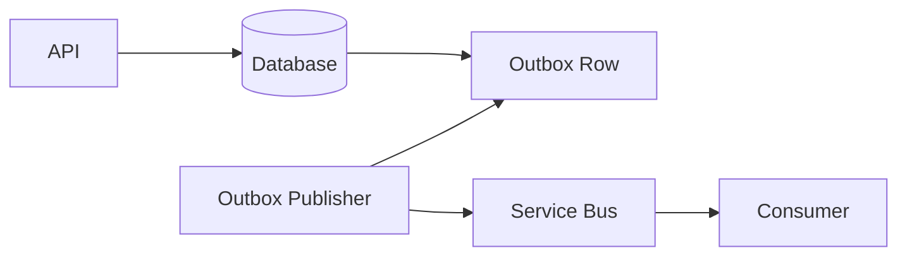

# Daily Knowledge Sharing — 2026-09-08

## Today’s Topics

1. .NET Large Object Heap và GC pressure: khi allocation pattern biến thành latency spike
2. ASP.NET Core Rate Limiting: bảo vệ capacity bằng policy thay vì chờ hệ thống quá tải
3. EF Core optimistic concurrency: phát hiện lost update bằng concurrency token thay vì khóa dài
4. Redis cache stampede: ngăn hàng nghìn request cùng đánh xuống database khi cache hết hạn
5. Modular Monolith: tạo boundary thật trong một deployment unit trước khi nghĩ tới Microservices
6. Transactional Outbox Pattern: nối database transaction với message publishing mà không cần distributed transaction
7. Azure Service Bus dead-letter queue: thiết kế failure path cho message không thể xử lý
8. OpenTelemetry correlation: nối Logs, Metrics và Traces thành một production investigation flow
9. Database migration trong CI/CD: expand-contract để deploy application và schema mà không tạo breaking window
10. Webhook security: signature verification, replay protection và idempotent processing cho third-party integration

---

# 1. .NET Large Object Heap và GC pressure: khi allocation pattern biến thành latency spike

## 1. What is it?

Trong .NET, object đủ lớn được cấp phát trên Large Object Heap (LOH). Mental model quan trọng không phải là “object lớn nằm ở heap khác”, mà là: **allocation lớn có chi phí thu gom và memory behavior khác allocation nhỏ**, nên workload tạo nhiều buffer lớn có thể làm latency tăng dù CPU business logic không đổi.

Ví dụ thường gặp là `byte[]` cho upload/download, serialization buffer, image processing hoặc payload aggregation. Khi các buffer này được tạo liên tục, process có thể tăng memory, GC chạy tốn kém hơn và request p95/p99 xuất hiện spike.

## 2. Why does it exist?

Di chuyển object lớn trong memory rất đắt. Runtime vì thế xử lý chúng khác object nhỏ để tránh copy/compaction quá nhiều. Đây là optimization hợp lý ở runtime level, nhưng application phải tránh tạo allocation pattern khiến LOH trở thành vùng churn liên tục.

Nếu mỗi request tạo một `byte[5_000_000]`, throughput cao sẽ nhanh chóng biến một quyết định code đơn giản thành vấn đề memory pressure toàn process.

## 3. How does it work?

Flow đơn giản:

```text
Request
  → allocate large buffer
  → buffer becomes unreachable
  → GC eventually discovers it
  → large objects accumulate between collections
  → memory pressure rises
  → GC cost / pause / CPU rise
```

LOH không phải memory leak. Leak nghĩa là object vẫn còn reachable ngoài ý muốn. LOH pressure có thể xảy ra dù object cuối cùng được collect hoàn toàn.

Một Senior cần phân biệt ba tình huống:

- allocation rate cao;
- retention cao;
- fragmentation hoặc working set cao.

Ba vấn đề này có symptom gần giống nhau nhưng cách xử lý khác nhau.

## 4. Practical implementation

Thay vì luôn materialize file thành một array lớn, ưu tiên streaming khi business flow cho phép:

```csharp
app.MapPost("/files", async (HttpRequest request, BlobClient blob, CancellationToken ct) =>
{
    await blob.UploadAsync(request.Body, overwrite: true, cancellationToken: ct);
    return Results.Accepted();
});
```

Nếu thực sự cần temporary buffer lớn và lifecycle rõ ràng, có thể cân nhắc pooling thay vì allocate lặp lại:

```csharp
var pool = ArrayPool<byte>.Shared;
var buffer = pool.Rent(128 * 1024);

try
{
    var read = await stream.ReadAsync(buffer.AsMemory(), cancellationToken);
    // process buffer[..read]
}
finally
{
    pool.Return(buffer, clearArray: false);
}
```

Pooling không phải mặc định cho mọi code. Nó tăng complexity và có rủi ro giữ memory lâu hơn nếu rent size quá lớn.

## 5. Real production scenario

Một API export report đọc toàn bộ file 20 MB từ Blob Storage vào `byte[]`, sau đó mới trả về client. Khi có 200 request đồng thời, application giữ hàng GB temporary buffers. CPU business logic thấp nhưng memory tăng mạnh, GC time tăng và App Service bắt đầu response chậm hoặc recycle.

Streaming giảm peak working set vì dữ liệu được chuyển theo chunk thay vì materialize toàn bộ payload.

## 6. Failure scenario & troubleshooting

**Symptom** → p99 latency tăng theo traffic, memory sawtooth lớn, GC CPU tăng.

**Evidence** → `dotnet-counters`, Application Insights metrics, allocation profile cho thấy nhiều `byte[]` lớn.

**Hypothesis** → request path đang materialize payload lớn.

**Diagnosis** → profile allocation stack và xác định call site tạo buffer.

**Fix** → streaming, giảm copy, bounded buffering hoặc pooling khi có bằng chứng phù hợp.

**Verification** → load test lại và so sánh allocation rate, working set, GC time, p95/p99.

## 7. Common mistakes

- Gọi `GC.Collect()` để “fix” memory pressure.
- Pool mọi buffer mà không đo trước.
- Nhầm memory pressure với leak.
- Đọc toàn bộ stream bằng `ToArray()` chỉ vì API downstream dễ dùng hơn.
- Tối ưu allocation nhỏ trong khi bottleneck thật là vài object cực lớn.

## 8. Alternatives

Streaming thường đơn giản và an toàn hơn pooling nếu pipeline hỗ trợ. Pooling phù hợp khi cần reusable temporary buffers có bounded lifetime. Với file cực lớn, đưa processing sang background worker hoặc chunked pipeline có thể tốt hơn giữ request HTTP mở lâu.

## 9. Trade-offs

### Advantages

Giảm allocation lớn giúp giảm memory pressure, GC overhead và tail latency.

### Costs / Risks

Streaming làm error handling phức tạp hơn vì response có thể đã bắt đầu. Pooling tăng ownership complexity và dễ tạo data leakage nếu buffer chứa sensitive data mà reuse không đúng cách.

## 10. Junior → Middle → Senior → Technical Lead

### Junior

Hiểu object không biến mất ngay khi ra khỏi scope và allocation có cost.

### Middle

Biết dùng streaming, `ArrayPool<T>`, profiler và tránh materialize payload không cần thiết.

### Senior

Phân biệt leak, retention, allocation rate và fragmentation; dùng measurement thay vì đoán.

### Technical Lead / Architect

Thiết kế data flow để payload lớn không mặc định đi qua memory của web process; quyết định khi nào cần streaming API, background processing hoặc object storage direct upload.

## 11. Key takeaway

- Memory performance phụ thuộc allocation pattern, không chỉ tổng dung lượng object “đang dùng”.
- Với payload lớn, ưu tiên giảm copy và streaming trước khi dùng optimization phức tạp.
- Mọi thay đổi performance phải được chứng minh bằng allocation và latency measurements.

---

# 2. ASP.NET Core Rate Limiting: bảo vệ capacity bằng policy thay vì chờ hệ thống quá tải

## 1. What is it?

Rate Limiting giới hạn lượng request một caller hoặc một nhóm traffic có thể gửi trong một khoảng thời gian hoặc mức concurrency nhất định. Nó là **capacity protection mechanism**, không đơn thuần là anti-abuse feature.

Một API có thể hoạt động tốt ở 500 RPS nhưng sụp khi dependency chỉ chịu được 800 concurrent operations. Rate limiting giúp hệ thống từ chối có kiểm soát trước khi queue, connection pool và ThreadPool bị bão hòa.

## 2. Why does it exist?

Không có hệ thống nào có capacity vô hạn. Khi load vượt capacity, latency thường tăng trước, rồi timeout xuất hiện, retry bắt đầu và cuối cùng tạo retry storm. Reject sớm một phần traffic có thể giữ phần còn lại khỏe mạnh hơn nhiều so với cố xử lý tất cả.

## 3. How does it work?

ASP.NET Core có Rate Limiting middleware hỗ trợ các thuật toán như fixed window, sliding window, token bucket và concurrency limiter.

Flow:

```text
Client
  → Rate Limiter
      → allowed → endpoint → downstream
      → rejected → 429 Too Many Requests
```

Partition key có thể là user ID, API key, tenant hoặc route. Chọn sai partition sẽ khiến một noisy tenant ảnh hưởng toàn bộ khách hàng hoặc ngược lại cho phép attacker tạo vô số identity để bypass limit.

## 4. Practical implementation

```csharp
builder.Services.AddRateLimiter(options =>
{
    options.AddFixedWindowLimiter("write-api", limiter =>
    {
        limiter.PermitLimit = 100;
        limiter.Window = TimeSpan.FromMinutes(1);
        limiter.QueueLimit = 0;
    });

    options.RejectionStatusCode = StatusCodes.Status429TooManyRequests;
});

var app = builder.Build();
app.UseRateLimiter();

app.MapPost("/orders", CreateOrder)
   .RequireRateLimiting("write-api");
```

Với public API, response nên cung cấp contract rõ ràng và `Retry-After` khi semantics phù hợp.

## 5. Real production scenario

Một client integration lỗi loop và gọi endpoint create-order hàng nghìn lần/phút. Nếu API chỉ scale-out, database transaction rate và downstream payment lookup có thể bị kéo theo. Rate limit theo client credential cô lập lỗi về đúng caller thay vì để incident lan toàn hệ thống.

## 6. Failure scenario & troubleshooting

**Symptom** → 429 tăng đột biến sau release.

**Evidence** → metrics theo route/partition cho thấy legitimate traffic bị reject.

**Hypothesis** → policy không phản ánh burst pattern thật.

**Diagnosis** → so sánh request distribution, concurrency và downstream capacity.

**Fix** → chọn algorithm phù hợp, điều chỉnh permit/burst, tách policy read/write hoặc tenant tier.

**Verification** → load test với steady traffic và burst traffic; xác nhận downstream vẫn trong safe envelope.

## 7. Common mistakes

- Chọn một global limit cho mọi endpoint.
- Rate limit theo IP khi hệ thống đi qua shared proxy/NAT mà không hiểu forwarded headers.
- Queue quá dài trong limiter khiến request chỉ “chết chậm”.
- Retry 429 ngay lập tức không backoff.
- Xem rate limiting là replacement cho autoscaling hoặc authentication.

## 8. Alternatives

API Gateway, Azure API Management hoặc CDN/WAF có thể rate limit ở edge. Application-level limiter có nhiều business context hơn. Hai lớp có thể phối hợp nhưng phải tránh policy chồng chéo khó debug.

## 9. Trade-offs

### Advantages

Bảo vệ downstream, cô lập noisy neighbor, tạo predictable degradation.

### Costs / Risks

Policy sai sẽ reject khách hàng hợp lệ. Distributed enforcement cần cân nhắc consistency; per-instance limiter có thể cho tổng throughput tăng theo số instance.

## 10. Junior → Middle → Senior → Technical Lead

### Junior

Hiểu `429` nghĩa là server chủ động giới hạn request, không phải generic failure.

### Middle

Biết cấu hình limiter, partition và test burst behavior.

### Senior

Liên hệ rate limit với queueing, retries, dependency capacity và multi-instance deployment.

### Technical Lead / Architect

Xác định enforcement boundary: edge, gateway hay application; thiết kế quota theo tenant/SLA và operational metrics để policy có thể điều chỉnh bằng dữ liệu.

## 11. Key takeaway

- Rate limiting là overload protection trước khi là anti-abuse.
- Limit phải dựa trên capacity và traffic shape thật.
- Reject sớm có kiểm soát thường tốt hơn để toàn hệ thống timeout cùng lúc.

---

# 3. EF Core optimistic concurrency: phát hiện lost update bằng concurrency token thay vì khóa dài

## 1. What is it?

Optimistic concurrency giả định conflict không xảy ra thường xuyên, nên các request được phép đọc và chỉnh sửa song song. Khi update, application kiểm tra dữ liệu có thay đổi kể từ lúc đọc hay không.

Mục tiêu chính là tránh **lost update**: user A và B cùng đọc version 1, A lưu version 2, sau đó B vô tình ghi đè thay đổi của A bằng dữ liệu cũ.

## 2. Why does it exist?

Giữ database lock từ lúc user mở form đến lúc bấm Save là không thực tế: transaction có thể kéo dài phút hoặc giờ. Optimistic concurrency chuyển bài toán thành validation tại thời điểm write.

## 3. How does it work?

Với SQL Server `rowversion`, EF Core đưa token vào `WHERE` của `UPDATE`:

```sql
UPDATE Products
SET Name = @name
WHERE Id = @id AND RowVersion = @originalRowVersion;
```

Nếu row đã đổi, `WHERE` match 0 rows. EF Core phát hiện và ném `DbUpdateConcurrencyException`.

## 4. Practical implementation

```csharp
public sealed class Product
{
    public int Id { get; set; }
    public string Name { get; set; } = "";

    [Timestamp]
    public byte[] RowVersion { get; set; } = Array.Empty<byte>();
}
```

Xử lý conflict phải là business decision, không chỉ retry mù:

```csharp
try
{
    await db.SaveChangesAsync(ct);
}
catch (DbUpdateConcurrencyException)
{
    return Results.Conflict(new
    {
        code = "product_changed",
        message = "Resource was modified by another operation. Reload and retry."
    });
}
```

## 5. Real production scenario

Hai nhân viên cùng chỉnh thông tin sản phẩm. Một người sửa giá, người kia sửa mô tả trên UI đã mở từ trước. Nếu payload PUT gửi toàn bộ entity, update thứ hai có thể ghi đè giá cũ. Concurrency token buộc API nhận biết conflict thay vì âm thầm mất dữ liệu.

## 6. Failure scenario & troubleshooting

**Symptom** → user báo “save thành công nhưng thay đổi của người khác biến mất”.

**Evidence** → audit log có hai update sát nhau trên cùng resource; API không dùng concurrency token.

**Hypothesis** → last-write-wins đang che lost update.

**Diagnosis** → trace request payload và generated SQL.

**Fix** → thêm token/ETag semantics và conflict handling.

**Verification** → integration test hai DbContext cùng đọc một row rồi update cạnh tranh; update thứ hai phải phát hiện conflict.

## 7. Common mistakes

- Catch `DbUpdateConcurrencyException` rồi retry vô hạn.
- Trả `500` cho expected concurrency conflict.
- Có token ở database nhưng không đưa token qua API contract.
- Dùng optimistic concurrency cho invariant cần serialization mạnh mà không phân tích.
- Map DTO vào toàn entity làm overwrite field user không thực sự sửa.

## 8. Alternatives

Pessimistic locking phù hợp khi conflict phải bị ngăn ngay và transaction rất ngắn. Application-level version number cũng có thể dùng thay `rowversion`. HTTP API có thể biểu diễn version bằng ETag + `If-Match`.

## 9. Trade-offs

### Advantages

Không giữ lock dài, scale tốt cho collaborative CRUD với conflict hiếm.

### Costs / Risks

Application phải định nghĩa UX khi conflict xảy ra: reload, merge hay reject. Với hot rows conflict thường xuyên, retry cost có thể cao.

## 10. Junior → Middle → Senior → Technical Lead

### Junior

Hiểu hai request có thể đọc cùng dữ liệu nhưng save ở thời điểm khác nhau.

### Middle

Biết cấu hình token, catch exception và viết integration test concurrency.

### Senior

Quyết định khi nào merge, reject, retry; phân biệt concurrency conflict với transient database error.

### Technical Lead / Architect

Xác định consistency requirement theo aggregate/business invariant và đưa version semantics xuyên suốt database, API, client và audit trail.

## 11. Key takeaway

- Optimistic concurrency không ngăn conflict; nó làm conflict **visible**.
- Retry là business decision, không phải default exception handling.
- Versioning phải tồn tại xuyên boundary, không chỉ trong EF Core model.

---

# 4. Redis cache stampede: ngăn hàng nghìn request cùng đánh xuống database khi cache hết hạn

## 1. What is it?

Cache stampede xảy ra khi một hot cache key hết hạn hoặc bị eviction và nhiều request đồng thời đều thấy cache miss, rồi cùng chạy expensive computation/database query để rebuild cùng một giá trị.

Mental model:

```text
1 hot key expires
→ 2,000 requests see MISS
→ 2,000 DB queries
→ DB slows
→ request latency rises
→ retries may amplify load
```

## 2. Why does it exist?

Cache thường được thêm để giảm load. Nhưng nếu invalidation/expiration khiến toàn bộ load quay lại origin cùng một thời điểm, cache vô tình biến load steady thành burst cực lớn.

## 3. How does it work?

Stampede phụ thuộc ba yếu tố: key đủ hot, rebuild đủ đắt và requests đến cùng lúc. TTL giống nhau cho hàng nghìn key còn có thể tạo synchronized expiration wave.

Các mitigation phổ biến gồm single-flight/locking, TTL jitter, stale-while-revalidate hoặc background refresh.

## 4. Practical implementation

Một cách đơn giản là local keyed lock nếu chỉ cần chống duplicate work trong **một instance**:

```csharp
private readonly SemaphoreSlim _gate = new(1, 1);

public async Task<ProductDto?> GetAsync(int id, CancellationToken ct)
{
    var key = $"product:{id}";
    var cached = await cache.GetStringAsync(key, ct);
    if (cached is not null)
        return JsonSerializer.Deserialize<ProductDto>(cached);

    await _gate.WaitAsync(ct);
    try
    {
        cached = await cache.GetStringAsync(key, ct);
        if (cached is not null)
            return JsonSerializer.Deserialize<ProductDto>(cached);

        var product = await db.Products
            .Where(x => x.Id == id)
            .Select(x => new ProductDto(x.Id, x.Name))
            .SingleOrDefaultAsync(ct);

        if (product is not null)
            await cache.SetStringAsync(key, JsonSerializer.Serialize(product), ct);

        return product;
    }
    finally
    {
        _gate.Release();
    }
}
```

Trong multi-instance system, local lock không đủ; cần distributed strategy hoặc stale serving tùy consistency requirement.

## 5. Real production scenario

Product detail page có key `product:123` nhận 5,000 RPS trong campaign. TTL 10 phút. Mỗi 10 phút key expire và database đột ngột nhận hàng nghìn query giống nhau. Trung bình DB load trông bình thường, nhưng p99 và CPU spike theo chu kỳ TTL.

## 6. Failure scenario & troubleshooting

**Symptom** → latency spike định kỳ đúng khoảng TTL.

**Evidence** → Redis miss rate tăng đồng thời, DB query count burst trên cùng query shape.

**Hypothesis** → synchronized cache expiration.

**Diagnosis** → correlate cache miss metrics với DB load và hot-key telemetry.

**Fix** → jitter TTL, single-flight rebuild, background refresh hoặc stale-while-revalidate.

**Verification** → load test qua nhiều expiration cycles; DB QPS không được spike theo số concurrent callers.

## 7. Common mistakes

- Dùng distributed lock không timeout.
- Lock toàn cache thay vì theo key.
- Cho tất cả key cùng TTL chính xác.
- Khi Redis lỗi, mọi request lập tức fallback DB không giới hạn.
- Cache dữ liệu không có ownership/invalidation strategy.

## 8. Alternatives

Có thể tránh cache hoàn toàn nếu database đã đủ nhanh. CDN/output cache phù hợp nếu dữ liệu có HTTP caching semantics. Materialized read model phù hợp khi “rebuild” thực chất là expensive aggregation lặp lại.

## 9. Trade-offs

### Advantages

Mitigation đúng giúp cache thực sự làm phẳng load và bảo vệ origin.

### Costs / Risks

Distributed coordination tăng complexity. Stale serving đổi freshness lấy availability. Background refresh tạo thêm scheduler/worker cần monitoring.

## 10. Junior → Middle → Senior → Technical Lead

### Junior

Hiểu cache miss nghĩa là request phải xuống origin.

### Middle

Biết double-check after lock, TTL và cache metrics.

### Senior

Nhận ra hot-key, synchronized expiry, failure fallback và multi-instance coordination.

### Technical Lead / Architect

Quyết định liệu cache có thật sự cần tồn tại, freshness budget là bao nhiêu và Redis outage phải degrade thế nào để không kéo sập database.

## 11. Key takeaway

- Cache stampede là concurrency problem, không chỉ cache problem.
- TTL cần được thiết kế cùng traffic shape và origin capacity.
- Redis failure path quan trọng ngang happy path.

---

# 5. Modular Monolith: tạo boundary thật trong một deployment unit trước khi nghĩ tới Microservices

## 1. What is it?

Modular Monolith là một application được deploy như một unit nhưng bên trong chia thành các module có boundary, ownership và dependency rõ ràng. Nó khác “monolith có nhiều folder” ở chỗ module phải thực sự kiểm soát contract và data access.

Ví dụ:

```text
Application
├── Orders
├── Catalog
├── Billing
└── Identity
```

`Orders` không nên query thẳng bảng nội bộ của `Billing` chỉ vì cùng database connection.

## 2. Why does it exist?

Một codebase lớn thất bại không nhất thiết vì một deployment unit, mà vì coupling không kiểm soát. Microservices giải quyết deployment/ownership boundaries nhưng thêm network, eventual consistency, observability và operational cost. Modular Monolith cho phép xây boundary logic trước mà chưa trả ngay chi phí distributed system.

## 3. How does it work?

Mỗi module sở hữu:

- business capability;
- public contract;
- internal implementation;
- data ownership logic;
- module-specific tests.

Dependency nên đi qua explicit contract thay vì reference tùy tiện:

```text
Orders ──contract──> Catalog
   │
   └── owns order transaction
```

Cross-module communication có thể synchronous in-process hoặc domain/integration events trong cùng process, tùy nhu cầu.

## 4. Practical implementation

Một contract đơn giản:

```csharp
public interface IProductAvailability
{
    Task<bool> IsAvailableAsync(Guid productId, int quantity, CancellationToken ct);
}
```

`Orders` chỉ phụ thuộc abstraction được công khai bởi `Catalog`, không tham chiếu repository/entity nội bộ của `Catalog`.

Architecture tests có thể ngăn dependency vi phạm convention nếu codebase đủ lớn để cần enforcement.

## 5. Real production scenario

Một SaaS ban đầu có 20 developers và 8 business modules. Chuyển ngay sang 20 services sẽ yêu cầu CI/CD, service discovery, distributed tracing, retries, message contracts và ownership maturity mà team chưa có. Modular Monolith giúp module hóa domain trước và vẫn deploy đơn giản.

## 6. Failure scenario & troubleshooting

**Symptom** → thay đổi `Customer` entity làm vỡ hàng loạt module không liên quan.

**Evidence** → nhiều project tham chiếu trực tiếp entity/repository chung; shared database tables bị query tùy ý.

**Hypothesis** → boundary chỉ tồn tại ở folder structure.

**Diagnosis** → dependency graph và cross-module data access.

**Fix** → xác định ownership, public contracts, module API và dần loại reference xuyên boundary.

**Verification** → architecture tests/build references đảm bảo module không truy cập internals ngoài contract.

## 7. Common mistakes

- Một `Common` project chứa toàn bộ domain entities.
- Generic Repository dùng chung làm mọi module thấy mọi table.
- Tạo event cho mọi method call để “giống microservices”.
- Chia module theo technical layer thay vì business capability.
- Nghĩ rằng modular monolith tự động dễ tách thành services dù data ownership chưa rõ.

## 8. Alternatives

Layered Monolith đơn giản hơn cho hệ thống nhỏ. Microservices hợp lý khi cần independent deployment, scaling hoặc team ownership đủ mạnh. Một số module có thể tách riêng, phần còn lại vẫn ở monolith.

## 9. Trade-offs

### Advantages

Deployment đơn giản, local transaction thuận tiện, latency thấp, dễ refactor hơn distributed system.

### Costs / Risks

Boundary enforcement phụ thuộc discipline/tooling. Shared process nghĩa là memory/CPU failure vẫn có thể ảnh hưởng toàn application. Independent scaling theo module khó hơn.

## 10. Junior → Middle → Senior → Technical Lead

### Junior

Hiểu module là business boundary, không chỉ namespace.

### Middle

Biết giữ internal types private, dùng explicit contracts và tránh cross-module database access.

### Senior

Phân tích coupling, transaction boundary, failure propagation và integration semantics.

### Technical Lead / Architect

Quyết định module nào cần isolation thật, module nào có thể ở chung; chỉ tách service khi có operational/business reason rõ ràng.

## 11. Key takeaway

- Microservices không sửa được domain boundary chưa rõ.
- Modular Monolith là architecture về ownership và dependency, không phải folder layout.
- Boundary tốt tạo option để tách service sau này, không ép phải tách.

---

# 6. Transactional Outbox Pattern: nối database transaction với message publishing mà không cần distributed transaction

## 1. What is it?

Transactional Outbox lưu business change và message cần publish trong **cùng database transaction**. Một background publisher sau đó đọc Outbox và gửi message tới broker.

Mục tiêu là tránh dual-write inconsistency:

```text
DB commit succeeds
Message publish fails
```

hoặc ngược lại.

## 2. Why does it exist?

Nếu code làm:

```text
Save Order
Publish OrderCreated
```

hai operation thuộc hai systems khác nhau. Không có atomicity tự nhiên giữa SQL transaction và Azure Service Bus. Một network failure ở giữa có thể khiến database và message broker nhìn thấy hai reality khác nhau.

## 3. How does it work?



Business row và Outbox row commit cùng transaction. Publisher có thể retry. Vì publish có thể xảy ra hơn một lần, consumer vẫn phải idempotent.

## 4. Practical implementation

```csharp
await using var tx = await db.Database.BeginTransactionAsync(ct);

var order = Order.Create(request.CustomerId);
db.Orders.Add(order);

db.OutboxMessages.Add(new OutboxMessage
{
    Id = Guid.NewGuid(),
    Type = "OrderCreated",
    Payload = JsonSerializer.Serialize(new { order.Id }),
    OccurredUtc = DateTime.UtcNow
});

await db.SaveChangesAsync(ct);
await tx.CommitAsync(ct);
```

Publisher xử lý record chưa publish, gửi broker rồi đánh dấu processed. Query cần batching và retry bounded để Outbox không trở thành table tăng vô hạn.

## 5. Real production scenario

Order service tạo order và cần Billing/Notification biết sự kiện. Nếu order đã commit nhưng publish fail vì Service Bus outage, Outbox giữ intent lại. Khi broker hồi phục, publisher tiếp tục gửi mà không cần user tạo order lại.

## 6. Failure scenario & troubleshooting

**Symptom** → Outbox backlog tăng liên tục.

**Evidence** → oldest unprocessed age tăng, Service Bus publish errors xuất hiện.

**Hypothesis** → broker degraded hoặc publisher throughput thấp.

**Diagnosis** → kiểm tra dependency latency, retry rate, batch size, lock/concurrency của publisher.

**Fix** → xử lý dependency issue, scale publisher có kiểm soát, DLQ nội bộ nếu payload invalid.

**Verification** → backlog drain về mức bình thường và consumer không tạo duplicate side effect.

## 7. Common mistakes

- Ghi Outbox sau khi business transaction đã commit.
- Xóa Outbox row ngay sau send mà không có audit/retention strategy.
- Nghĩ Outbox tạo exactly-once delivery.
- Consumer không idempotent.
- Publisher scan toàn table mỗi vòng không index trạng thái/thời gian.

## 8. Alternatives

Distributed transaction chỉ khả thi trong phạm vi hẹp và tăng coupling. Change Data Capture có thể publish từ database log nhưng tăng infrastructure complexity. Với operation không cần event reliability cao, direct publish có thể đủ đơn giản hơn.

## 9. Trade-offs

### Advantages

Loại bỏ dual-write gap giữa database commit và message intent; chịu được broker outage tốt hơn.

### Costs / Risks

Event delivery bị delayed, cần publisher, monitoring, cleanup, schema/versioning và idempotency.

## 10. Junior → Middle → Senior → Technical Lead

### Junior

Hiểu database và message broker không cùng một transaction mặc định.

### Middle

Biết tạo Outbox row cùng transaction và background publisher.

### Senior

Thiết kế retries, deduplication, ordering, retention và backlog observability.

### Technical Lead / Architect

Quyết định nơi nào reliability cần Outbox, nơi nào complexity không đáng; định nghĩa event ownership và consistency expectation giữa bounded contexts.

## 11. Key takeaway

- Outbox bảo đảm message intent đi cùng database state, không bảo đảm exactly-once side effect.
- Consumer idempotency vẫn bắt buộc trong at-least-once systems.
- Backlog age phải là production metric hạng nhất.

---

# 7. Azure Service Bus dead-letter queue: thiết kế failure path cho message không thể xử lý

## 1. What is it?

Dead-letter queue (DLQ) là nơi chứa message không thể hoàn tất normal processing. Nó không phải “thùng rác”, mà là **operational recovery boundary**: message được tách khỏi main delivery loop để hệ thống không retry vô hạn.

## 2. Why does it exist?

Có những failure transient: database timeout, network glitch. Nhưng cũng có poison message: invalid schema, missing business reference, unsupported version. Retry poison message liên tục chỉ tiêu tốn throughput và làm queue backlog lớn hơn.

## 3. How does it work?

Azure Service Bus dùng delivery count và settlement. Consumer có thể `Complete`, `Abandon`, `DeadLetter`; khi delivery vượt `MaxDeliveryCount`, message cũng có thể được chuyển DLQ.

```text
Queue
 → process success → Complete
 → transient fail → Abandon / retry
 → permanent fail → DeadLetter
 → DLQ → inspect / repair / replay
```

## 4. Practical implementation

```csharp
processor.ProcessMessageAsync += async args =>
{
    try
    {
        var command = args.Message.Body.ToObjectFromJson<CreateInvoice>();
        await handler.HandleAsync(command, args.CancellationToken);
        await args.CompleteMessageAsync(args.Message, args.CancellationToken);
    }
    catch (UnsupportedMessageVersionException ex)
    {
        await args.DeadLetterMessageAsync(
            args.Message,
            deadLetterReason: "unsupported_version",
            deadLetterErrorDescription: ex.Message,
            cancellationToken: args.CancellationToken);
    }
};
```

Không nên dead-letter mọi exception ngay lần đầu; cần classification transient vs permanent.

## 5. Real production scenario

Sau deployment, một consumer cũ nhận event schema mới mà nó không hỗ trợ. Nếu cứ retry, message chiếm capacity và cuối cùng backlog lan sang event hợp lệ. DLQ tách lỗi ra để team điều tra và triển khai compatibility fix.

## 6. Failure scenario & troubleshooting

**Symptom** → DLQ count tăng sau release.

**Evidence** → `DeadLetterReason` tập trung vào `unsupported_version`.

**Hypothesis** → producer phát contract mới không backward compatible.

**Diagnosis** → compare payload/schema với consumer deployed version.

**Fix** → restore compatibility, deploy consumer hỗ trợ version, sau đó replay có kiểm soát.

**Verification** → replay sample trước, đảm bảo idempotency và DLQ không tăng trở lại.

## 7. Common mistakes

- Không monitor DLQ vì “main queue vẫn chạy”.
- Auto-replay mọi DLQ message liên tục.
- Log payload chứa PII/secrets khi debug.
- Không ghi reason đủ actionable.
- Fix consumer rồi replay hàng triệu message mà không kiểm tra downstream capacity.

## 8. Alternatives

Application-owned poison queue có thể cần nếu muốn workflow remediation riêng. Với invalid business data, đôi khi manual review system phù hợp hơn generic DLQ replay.

## 9. Trade-offs

### Advantages

Ngăn retry vô hạn, giữ main queue healthy, bảo tồn evidence để recovery.

### Costs / Risks

DLQ yêu cầu monitoring, runbook, retention và replay tooling. Nếu không có ownership, nó chỉ trở thành nơi tích tụ lỗi bị quên.

## 10. Junior → Middle → Senior → Technical Lead

### Junior

Hiểu message failure không đồng nghĩa phải retry mãi.

### Middle

Biết settlement, delivery count, DLQ inspection và replay cơ bản.

### Senior

Phân loại transient/permanent, thiết kế idempotent replay và observability.

### Technical Lead / Architect

Định nghĩa error taxonomy, ownership, SLA xử lý DLQ và contract evolution giữa producer/consumer.

## 11. Key takeaway

- DLQ là recovery mechanism, không phải nơi bỏ quên message.
- Retry chỉ có giá trị khi failure có khả năng trở thành success.
- Replay phải được đối xử như một production operation có blast radius.

---

# 8. OpenTelemetry correlation: nối Logs, Metrics và Traces thành một production investigation flow

## 1. What is it?

OpenTelemetry cung cấp chuẩn instrumentation để tạo traces, metrics và liên kết telemetry xuyên process/dependency. Giá trị lớn nhất không phải “có thêm dashboard”, mà là khả năng đi từ symptom hệ thống tới một execution path cụ thể.

Mental model:

```text
Metric says: p99 is bad
  → Trace shows: SQL dependency slow
      → Logs show: query + business context
```

## 2. Why does it exist?

Log riêng lẻ trả lời “đã xảy ra message gì”. Metric trả lời “hệ thống đang thay đổi thế nào theo thời gian”. Trace trả lời “request này đi qua đâu và tốn thời gian ở đâu”. Incident investigation mạnh nhất khi ba loại evidence có correlation context chung.

## 3. How does it work?

Một request tạo `TraceId`. Child activities/spans truyền context qua HTTP/messaging headers. Structured logs trong execution scope có thể chứa cùng `TraceId`, cho phép pivot giữa trace và log.

Không nên biến high-cardinality business IDs thành metric labels tùy tiện vì chi phí cardinality có thể bùng nổ.

## 4. Practical implementation

```csharp
builder.Services.AddOpenTelemetry()
    .WithTracing(tracing => tracing
        .AddAspNetCoreInstrumentation()
        .AddHttpClientInstrumentation()
        .AddEntityFrameworkCoreInstrumentation())
    .WithMetrics(metrics => metrics
        .AddAspNetCoreInstrumentation()
        .AddRuntimeInstrumentation());
```

Custom activity cho business boundary:

```csharp
private static readonly ActivitySource Source = new("Orders.Application");

using var activity = Source.StartActivity("Order.Submit");
activity?.SetTag("order.channel", request.Channel);
```

Tag nên có bounded cardinality; tránh `customer.email`, raw token hoặc full payload.

## 5. Real production scenario

Dashboard báo checkout p95 tăng từ 300 ms lên 1.8 s. Trace breakdown cho thấy 70% thời gian ở một HTTP dependency. Logs cùng `TraceId` cho biết dependency trả chậm theo một route cụ thể. Team có evidence để sửa đúng integration thay vì tối ưu EF Core ngẫu nhiên.

## 6. Failure scenario & troubleshooting

**Symptom** → có traces nhưng không nối được với background consumer.

**Evidence** → producer trace kết thúc ở Service Bus publish, consumer tạo TraceId mới hoàn toàn.

**Hypothesis** → propagation context không được inject/extract qua message properties.

**Diagnosis** → inspect message headers và instrumentation configuration.

**Fix** → dùng supported messaging instrumentation hoặc explicit propagation.

**Verification** → một transaction test phải xuất hiện thành connected trace từ HTTP request qua message consumer.

## 7. Common mistakes

- Log mọi thứ nhưng không structured fields.
- Dùng user ID/order ID làm metric label cardinality vô hạn.
- Sample traces quá mạnh đến mức incident path biến mất.
- Log secrets để “debug nhanh”.
- Có telemetry nhưng không có SLO/alert nên chỉ mở dashboard sau khi user báo lỗi.

## 8. Alternatives

Application Insights SDK trực tiếp có thể đủ trong Azure-centric system. Vendor-specific agents đơn giản hơn lúc đầu. OpenTelemetry có lợi khi cần standardization, portability hoặc multi-backend observability.

## 9. Trade-offs

### Advantages

Tăng khả năng root-cause analysis, giảm guesswork, chuẩn hóa instrumentation.

### Costs / Risks

Telemetry có storage/ingestion cost, instrumentation overhead và privacy concern. Càng nhiều data không đồng nghĩa càng observability tốt.

## 10. Junior → Middle → Senior → Technical Lead

### Junior

Hiểu khác nhau giữa log, metric và trace.

### Middle

Biết tìm `TraceId`, dependency span và structured log.

### Senior

Thiết kế telemetry để validate hypothesis, quản lý cardinality/sampling và instrument business boundaries.

### Technical Lead / Architect

Xác định telemetry contract toàn hệ thống, SLI/SLO, retention/cost và dữ liệu nào tuyệt đối không được ghi.

## 11. Key takeaway

- Metrics phát hiện, traces localize, logs giải thích context.
- Correlation là thứ biến telemetry rời rạc thành investigation system.
- Observability phải được thiết kế cùng privacy và cost boundaries.

---

# 9. Database migration trong CI/CD: expand-contract để deploy application và schema mà không tạo breaking window

## 1. What is it?

Expand-contract là migration strategy chia breaking schema change thành nhiều deployment tương thích ngược.

Thay vì rename column ngay:

```text
OldName → NewName
```

flow an toàn hơn thường là:

```text
add NewName
→ application supports both
→ backfill
→ switch reads/writes
→ remove OldName later
```

## 2. Why does it exist?

Trong rolling deployment hoặc deployment slots, old version và new version có thể chạy đồng thời. Nếu migration phá schema mà old code vẫn cần, deployment có thể “thành công” nhưng một phần instances trả 500.

Database thường là shared state khó rollback hơn application binary, vì vậy schema evolution phải được xem là compatibility problem.

## 3. How does it work?

Deploy theo phases:

1. **Expand**: thêm schema mới nhưng giữ cái cũ.
2. **Migrate**: backfill/dual-write nếu cần.
3. **Switch**: application sử dụng contract mới.
4. **Contract**: xóa schema cũ sau khi xác nhận không còn consumer.

Mỗi phase phải deploy độc lập và có rollback story.

## 4. Practical implementation

Ví dụ EF Core migration chỉ thêm nullable column trước:

```csharp
migrationBuilder.AddColumn<string>(
    name: "DisplayName",
    table: "Customers",
    type: "nvarchar(200)",
    nullable: true);
```

Backfill nên tách khỏi startup migration nếu dữ liệu lớn. Một `UPDATE` hàng triệu rows trong deployment path có thể lock table quá lâu.

Sau khi application đã sử dụng `DisplayName` ổn định, migration ở release sau mới drop old column.

## 5. Real production scenario

Một App Service dùng deployment slot. New slot chạy migration rename column trước swap. Production slot cũ vẫn query column cũ và bắt đầu fail ngay dù traffic chưa swap. Expand-contract cho phép cả hai version hoạt động trong transition window.

## 6. Failure scenario & troubleshooting

**Symptom** → deployment mới healthy nhưng old instances trả SQL “Invalid column name”.

**Evidence** → migration history cho thấy destructive rename/drop chạy trước khi old instances biến mất.

**Hypothesis** → application/schema compatibility window bị vi phạm.

**Diagnosis** → map app versions nào sử dụng column nào.

**Fix** → restore compatibility schema hoặc rollback app theo runbook; redesign migration thành phased change.

**Verification** → test N và N+1 application versions cùng chạy trên expanded schema trước production.

## 7. Common mistakes

- Chạy mọi migration tự động lúc app startup trong multi-instance deployment.
- Drop column cùng release đổi code.
- Backfill khối lượng lớn trong một transaction không đo lock/log growth.
- Nghĩ rollback binary sẽ rollback được schema destructive.
- Không inventory background workers/BI jobs cũng dùng database.

## 8. Alternatives

Maintenance window có thể hợp lý cho hệ thống nội bộ nhỏ. Blue-Green với database tách riêng có thể đơn giản một số cases nhưng data synchronization khó hơn. Feature flags có thể hỗ trợ phased switch ở application layer.

## 9. Trade-offs

### Advantages

Giảm downtime và rollback risk, hỗ trợ rolling/slot deployments an toàn hơn.

### Costs / Risks

Cần nhiều releases hơn, temporary duplicate schema, backfill tooling và cleanup discipline.

## 10. Junior → Middle → Senior → Technical Lead

### Junior

Hiểu database migration là production change, không chỉ file code generated.

### Middle

Biết phân biệt additive vs destructive migration và test migration.

### Senior

Phân tích locks, backfill size, compatibility giữa versions và rollback path.

### Technical Lead / Architect

Thiết kế schema evolution policy gắn với deployment strategy; xác định ai phê duyệt destructive changes và khi nào cần maintenance window.

## 11. Key takeaway

- Database schema và application version có thể coexist trong transition window.
- Additive change trước, destructive cleanup sau thường an toàn hơn.
- Migration strategy phải phù hợp deployment topology thật.

---

# 10. Webhook security: signature verification, replay protection và idempotent processing cho third-party integration

## 1. What is it?

Webhook là inbound HTTP request do hệ thống bên ngoài chủ động gửi khi có event. Vì endpoint public và sender nằm ngoài trust boundary, webhook phải được coi là **untrusted external input** cho đến khi xác minh authenticity, freshness và semantics.

Ba câu hỏi chính:

1. Request có thật từ provider không?
2. Event này có bị replay không?
3. Nếu provider gửi lặp, side effect có bị chạy hai lần không?

## 2. Why does it exist?

Polling lãng phí request và tạo delay. Webhook cho near-real-time integration, nhưng đổi lại application mở một ingress path mà attacker cũng có thể gọi. HTTPS chỉ bảo vệ transport; nó không tự chứng minh caller là provider mong muốn.

## 3. How does it work?

Provider thường ký raw request body bằng shared secret hoặc asymmetric key:

```text
Provider
  → payload + timestamp
  → HMAC/signature
  → Webhook endpoint
      → verify timestamp
      → verify signature over raw body
      → deduplicate event ID
      → process
```

Verification phải dùng raw bytes đúng như provider định nghĩa. Parse JSON rồi serialize lại có thể làm signature mismatch vì whitespace/property ordering thay đổi.

## 4. Practical implementation

Ví dụ HMAC-SHA256 đơn giản:

```csharp
static bool VerifySignature(byte[] body, string provided, string secret)
{
    using var hmac = new HMACSHA256(Encoding.UTF8.GetBytes(secret));
    var expected = hmac.ComputeHash(body);

    if (!Convert.TryFromHexString(provided, new byte[expected.Length], out var written))
        return false;

    Span<byte> actual = stackalloc byte[expected.Length];
    Convert.TryFromHexString(provided, actual, out written);

    return written == expected.Length &&
           CryptographicOperations.FixedTimeEquals(expected, actual);
}
```

Trong code thật phải làm đúng canonicalization/signature scheme của provider; không tự phát minh format. Event ID nên được lưu vào Inbox/dedup store trước side effect hoặc cùng transaction khi phù hợp.

## 5. Real production scenario

Payment provider gửi `payment.succeeded`. Network timeout xảy ra sau khi API đã xử lý nhưng trước khi provider nhận `2xx`, nên provider retry cùng event. Nếu handler chỉ “create invoice” mỗi lần nhận request, customer có thể nhận hai invoice. Idempotent handling theo provider event ID ngăn duplicate side effect.

## 6. Failure scenario & troubleshooting

**Symptom** → signature verification fail sau middleware refactor.

**Evidence** → provider dashboard cho thấy payload hợp lệ; application log cho thấy body đã được model binding/normalize trước verification.

**Hypothesis** → signature được tính trên bytes khác raw request body.

**Diagnosis** → capture safe hash/length metadata, so sánh verification order với provider docs.

**Fix** → verify signature trên raw body trước business parsing, enable buffering đúng cách nếu framework cần đọc lại stream.

**Verification** → dùng official provider test fixture và negative tests cho tampered payload, expired timestamp, duplicate event.

## 7. Common mistakes

- Chỉ kiểm tra secret trong query string.
- Log raw webhook headers/body có credentials hoặc PII.
- So sánh MAC bằng string equality không constant-time khi threat model yêu cầu.
- Không kiểm tra timestamp nên signed request cũ có thể replay.
- Trả `500` cho duplicate event dù duplicate đã xử lý thành công.
- Retry side effect không idempotent.

## 8. Alternatives

Polling phù hợp nếu provider không hỗ trợ secure webhook hoặc business không cần realtime. Message broker integration tốt hơn khi hai bên cùng hỗ trợ private asynchronous channel, nhưng third-party SaaS thường chỉ cung cấp webhook.

## 9. Trade-offs

### Advantages

Near-real-time, giảm polling cost, decouple event detection khỏi scheduled scans.

### Costs / Risks

Public ingress, signature/key management, retry semantics, event ordering, duplicate delivery và provider-specific contracts làm integration phức tạp hơn tưởng tượng.

## 10. Junior → Middle → Senior → Technical Lead

### Junior

Hiểu webhook là request từ external system và không nên trust payload mặc định.

### Middle

Biết verify signature, validate schema, deduplicate event ID và trả status code đúng.

### Senior

Thiết kế replay window, key rotation, idempotency, retry classification, observability và failure recovery.

### Technical Lead / Architect

Xác định trust boundary, secret ownership, provider dependency strategy và business behavior khi webhook delayed, duplicated, reordered hoặc unavailable.

## 11. Key takeaway

- HTTPS không thay thế sender authentication.
- Signature verification và idempotency giải quyết hai vấn đề khác nhau; thường cần cả hai.
- Webhook handler phải được thiết kế theo giả định duplicate, delay và retry chắc chắn sẽ xảy ra.