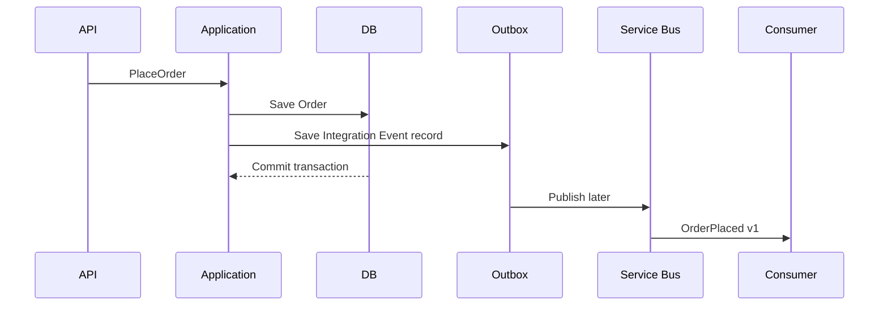

# Daily Knowledge Sharing — 2026-09-08

## Today’s Topics

1. `ArrayPool<T>` và buffer ownership trong .NET: giảm allocation nhưng không được đánh mất lifetime safety
2. ASP.NET Core health checks: readiness, liveness và vì sao `/health` trả 200 chưa nói lên hệ thống khỏe
3. EF Core `ExecuteUpdate` / `ExecuteDelete`: bulk-style mutation không qua Change Tracker và các consistency trap đi kèm
4. SQL Server parameter sniffing: vì sao cùng một query có thể nhanh với user này nhưng chậm với user khác
5. Domain Event vs Integration Event: giữ transaction boundary trong domain nhưng không làm coupling lan qua service boundary
6. Azure Service Bus Sessions: ordering theo business key, competing consumers và cái giá của serialized processing
7. Azure Private Endpoint + Private DNS: bảo vệ data plane nhưng dễ tạo lỗi “local chạy, production timeout”
8. Integration testing với `WebApplicationFactory` và real database: test contract thật thay vì mock cả hệ thống
9. Akamai / CDN cache-control: freshness, invalidation và vì sao cache sai có thể trở thành production data bug
10. BackgroundService graceful shutdown: `StopAsync`, queue draining và tránh mất work khi App Service/Kubernetes restart

---

# 1. `ArrayPool<T>` và buffer ownership trong .NET: giảm allocation nhưng không được đánh mất lifetime safety

## 1. What is it?

`ArrayPool<T>` là một object pool chuyên tái sử dụng array. Thay vì mỗi request tạo một `byte[]` mới rồi chờ Garbage Collector thu hồi, code có thể `Rent` một buffer đủ lớn, dùng xong rồi `Return` để request sau tái sử dụng.

Mental model:

```text
Allocate every time:
Request A -> new byte[64 KB] -> GC later
Request B -> new byte[64 KB] -> GC later

ArrayPool:
Request A -> Rent buffer -> use -> Return
Request B ----------------------^ reuse
```

Điểm khó không nằm ở API `Rent/Return`. Điểm khó là **ownership**: ai được phép giữ buffer, giữ trong bao lâu, và khi nào buffer chắc chắn không còn bị đọc/ghi nữa.

## 2. Why does it exist?

Các hot path xử lý serialization, compression, networking, file parsing hoặc image/data transformation có thể tạo hàng nghìn temporary arrays mỗi giây. Dù từng allocation không quá lớn, tổng allocation rate làm Gen 0/Gen 1 collection tăng; array lớn còn có thể đi vào LOH.

Nếu workload có pattern buffer lặp lại và lifetime ngắn, tái sử dụng memory giúp giảm GC pressure.

Nhưng nếu code chỉ chạy vài lần mỗi phút, `new byte[]` thường đơn giản và đủ tốt. Pooling chỉ đáng dùng khi profiling chỉ ra allocation là bottleneck có thật.

## 3. How does it work?

`ArrayPool<T>.Shared.Rent(minimumLength)` trả một array có **length ít nhất** bằng yêu cầu; length thực tế có thể lớn hơn.

```text
Rent(10 KB)
   ↓
Pool bucket phù hợp
   ↓
Có buffer sẵn? -> reuse
Không có?       -> allocate
```

Sau khi dùng xong:

```csharp
ArrayPool<byte>.Shared.Return(buffer);
```

Buffer được trả lại pool nhưng dữ liệu cũ có thể vẫn còn. Vì vậy buffer chứa secret hoặc PII cần cân nhắc `clearArray: true`, đổi lại chi phí zeroing memory.

Không được giữ reference tới array sau khi `Return`, vì một thread khác có thể thuê đúng array đó và ghi dữ liệu mới.

## 4. Practical implementation

Ví dụ đọc stream vào temporary buffer:

```csharp
public static async Task<long> CopyWithPoolAsync(
    Stream source,
    Stream destination,
    CancellationToken cancellationToken)
{
    var buffer = ArrayPool<byte>.Shared.Rent(64 * 1024);

    try
    {
        long total = 0;

        while (true)
        {
            var read = await source.ReadAsync(
                buffer.AsMemory(0, buffer.Length),
                cancellationToken);

            if (read == 0)
                break;

            await destination.WriteAsync(
                buffer.AsMemory(0, read),
                cancellationToken);

            total += read;
        }

        return total;
    }
    finally
    {
        ArrayPool<byte>.Shared.Return(buffer);
    }
}
```

`finally` là phần quan trọng. Exception hoặc cancellation vẫn phải trả buffer.

Nếu dữ liệu nhạy cảm:

```csharp
ArrayPool<byte>.Shared.Return(buffer, clearArray: true);
```

## 5. Real production scenario

Một API nhận file upload, kiểm tra header, tính hash rồi stream lên Azure Blob Storage. Mỗi request cần temporary buffer 128 KB. 2.000 uploads đồng thời tạo allocation rate rất lớn và GC pause bắt đầu xuất hiện trong p99.

Sau profiling, team xác nhận temporary arrays chiếm phần đáng kể allocation. Chuyển hot path sang pooled buffer giúp giảm GC pressure mà không thay đổi business logic.

Điều đáng chú ý: họ không pool DTO, entity hay object tùy tiện. Chỉ pool buffer có lifecycle rõ và cực kỳ lặp lại.

## 6. Failure scenario & troubleshooting

**Symptom** → thỉnh thoảng file bị corruption hoặc hash sai dù code không có race rõ ràng.

**Evidence** → buffer được `Return` trước khi một asynchronous consumer hoàn tất đọc từ memory đó.

**Hypothesis** → lifetime violation: buffer được tái sử dụng trong khi operation cũ vẫn còn dùng.

**Diagnosis** → audit mọi path `Rent`/`Return`; xem reference buffer có escape sang background task, channel hoặc callback hay không.

**Fix** → không `Return` trước khi consumer hoàn tất; nếu ownership phải vượt scope, copy dữ liệu hoặc dùng abstraction có ownership rõ hơn như `IMemoryOwner<T>`.

**Verification** → stress test concurrency lớn, bật checksum validation và chạy nhiều iteration.

## 7. Common mistakes

* Giả định `Rent(1024)` sẽ trả array length đúng 1024.
* Dùng toàn bộ `buffer.Length` thay vì actual data length.
* Quên `Return` khi exception xảy ra.
* `Return` rồi vẫn giữ reference.
* Pool buffer chứa secret nhưng không cân nhắc clearing.
* Dùng pooling trước khi có profiling evidence.

## 8. Alternatives

* `new byte[]`: đơn giản nhất, thường đủ cho workload không nóng.
* `stackalloc` + `Span<T>`: phù hợp buffer nhỏ, synchronous và lifetime rất ngắn.
* `MemoryPool<T>` / `IMemoryOwner<T>`: ownership semantics rõ hơn cho một số pipeline async.
* `RecyclableMemoryStream` hoặc library tương tự: phù hợp khi bottleneck là large `MemoryStream` allocations, nhưng thêm dependency và tuning.

## 9. Trade-offs

### Advantages

* Giảm allocation rate.
* Giảm GC pressure trong hot path.
* Tái sử dụng large temporary buffers.

### Costs / Risks

* Ownership phức tạp hơn.
* Có nguy cơ data leakage giữa renters nếu xử lý dữ liệu nhạy cảm sai.
* Có thể tạo corruption rất khó debug nếu `Return` quá sớm.
* Code khó đọc hơn `new[]`.

## 10. Junior → Middle → Senior → Technical Lead

### Junior

Hiểu pool tái sử dụng memory và buffer được thuê không thuộc sở hữu vĩnh viễn của caller.

### Middle

Biết `Rent`, `Return`, `try/finally`, actual length và cancellation-safe usage.

### Senior

Đánh giá allocation profile, sensitive-data clearing, async lifetime và race conditions.

### Technical Lead / Architect

Quyết định hot path nào xứng đáng pooling; chuẩn hóa abstraction để team không tự tạo lifetime bug ở nhiều chỗ.

## 11. Key takeaway

* `ArrayPool<T>` tối ưu allocation, không tối ưu business logic.
* Ownership và lifetime quan trọng hơn API `Rent/Return`.
* Chỉ pool sau khi đo được allocation là bottleneck thật.

---

# 2. ASP.NET Core health checks: readiness, liveness và vì sao `/health` trả 200 chưa nói lên hệ thống khỏe

## 1. What is it?

Health check là machine-readable signal cho platform biết application đang ở trạng thái nào. Tuy nhiên “healthy” không chỉ có một nghĩa.

Hai mental model quan trọng:

```text
Liveness:  process có còn sống và có khả năng tiếp tục chạy không?
Readiness: instance này có nên nhận traffic ngay bây giờ không?
```

Một endpoint `/health` duy nhất kiểm tra mọi dependency có thể tạo quyết định sai: Redis chậm vài giây không nhất thiết nghĩa process cần restart.

## 2. Why does it exist?

Platform như Kubernetes, App Service, load balancer hoặc deployment pipeline cần signal tự động để:

* loại instance chưa ready khỏi traffic;
* phát hiện startup failure;
* xác nhận deployment;
* restart process thật sự bị kẹt.

Nếu health signal quá nông, platform gửi traffic vào instance chưa usable. Nếu health signal quá nhạy, platform có thể tự khuếch đại outage bằng restart loop.

## 3. How does it work?

ASP.NET Core health checks chạy một hoặc nhiều `IHealthCheck` và aggregate kết quả.

Có thể tag checks:

```text
self      -> liveness
sql/cache -> readiness
```

Routing:

```text
/live  -> chỉ kiểm tra process-level condition
/ready -> kiểm tra dependency cần thiết để phục vụ request
```

Không phải dependency nào cũng nên nằm trong readiness. Ví dụ Reviews API là optional trên product page thì Reviews outage không nên khiến toàn bộ product API bị remove khỏi load balancer.

## 4. Practical implementation

```csharp
builder.Services
    .AddHealthChecks()
    .AddSqlServer(
        builder.Configuration.GetConnectionString("MainDb")!,
        name: "sql",
        tags: new[] { "ready" })
    .AddCheck("self", () => HealthCheckResult.Healthy(),
        tags: new[] { "live" });
```

Map endpoint:

```csharp
app.MapHealthChecks("/health/live", new HealthCheckOptions
{
    Predicate = check => check.Tags.Contains("live")
});

app.MapHealthChecks("/health/ready", new HealthCheckOptions
{
    Predicate = check => check.Tags.Contains("ready")
});
```

Với Kubernetes:

```yaml
livenessProbe:
  httpGet:
    path: /health/live
    port: 8080

readinessProbe:
  httpGet:
    path: /health/ready
    port: 8080
```

## 5. Real production scenario

Một checkout API phụ thuộc SQL Server để đọc cart và ghi order. Sau deployment, application process start thành công nhưng migration chưa hoàn tất và DB permission mới chưa được áp dụng.

Liveness vẫn healthy vì process không chết. Readiness fail vì SQL query kiểm tra dependency không thành công. Load balancer giữ instance ngoài rotation, tránh gửi production traffic vào version chưa usable.

## 6. Failure scenario & troubleshooting

**Symptom** → pod restart liên tục trong khi chỉ Redis đang timeout.

**Evidence** → liveness endpoint gọi Redis; Redis outage làm probe fail; orchestrator restart process khỏe.

**Hypothesis** → dependency readiness bị nhét nhầm vào liveness.

**Diagnosis** → xem probe path, health-check tags, restart count và dependency telemetry.

**Fix** → liveness chỉ phản ánh self/process health; dependency critical cho traffic chuyển sang readiness; dependency optional có thể chỉ monitor/alert.

**Verification** → fault-injection Redis outage; pod không restart vô ích, nhưng behavior fallback/readiness đúng với thiết kế.

## 7. Common mistakes

* Một `/health` duy nhất cho mọi use case.
* Liveness gọi external dependency.
* Health check chạy query nặng mỗi vài giây.
* Trả 200 dù startup initialization chưa hoàn tất.
* Readiness phụ thuộc mọi third-party dù business có fallback.
* Không bảo vệ endpoint health khỏi việc expose chi tiết secret/error nội bộ.

## 8. Alternatives

* TCP probe: kiểm tra port mở, rẻ nhưng rất nông.
* Synthetic monitoring: kiểm tra end-to-end business flow từ bên ngoài, tốt cho user-facing reliability nhưng không thay probe nội bộ.
* Deployment validation script: hữu ích sau deploy nhưng không thay runtime readiness.

## 9. Trade-offs

### Advantages

* Tự động traffic gating.
* Hỗ trợ safe deployment.
* Cho platform signal rõ về instance state.

### Costs / Risks

* Check quá nặng tạo load lên dependency.
* Check sai semantics tạo restart storm hoặc remove toàn bộ capacity.
* Aggregate health dễ che mất dependency optional/critical distinction.

## 10. Junior → Middle → Senior → Technical Lead

### Junior

Hiểu liveness khác readiness.

### Middle

Biết cấu hình ASP.NET Core health checks và probe endpoint.

### Senior

Biết dependency nào nên ảnh hưởng readiness, dependency nào chỉ nên degrade gracefully.

### Technical Lead / Architect

Thiết kế health semantics theo failure domain, deployment strategy và capacity protection; tránh để platform tự tạo outage từ signal sai.

## 11. Key takeaway

* Liveness hỏi “process có cần restart không?”, readiness hỏi “có nên nhận traffic không?”.
* External dependency thường không thuộc liveness.
* Health check là control-plane contract, không chỉ là một endpoint trả 200.

---

# 3. EF Core `ExecuteUpdate` / `ExecuteDelete`: bulk-style mutation không qua Change Tracker và các consistency trap đi kèm

## 1. What is it?

`ExecuteUpdateAsync` và `ExecuteDeleteAsync` cho phép EF Core phát SQL `UPDATE` / `DELETE` trực tiếp từ LINQ query mà không materialize entity và không dùng Change Tracker.

Mental model:

```text
Traditional tracked update:
SELECT rows -> materialize entities -> modify -> DetectChanges -> UPDATE

ExecuteUpdate:
LINQ predicate ---------------------> UPDATE ... WHERE ...
```

Đây không phải generic bulk-import engine, nhưng rất hữu ích cho set-based mutation.

## 2. Why does it exist?

Nếu cần đóng 100.000 expired sessions, load 100.000 entities rồi update từng tracked entity là access pattern lãng phí:

* database trả dữ liệu không cần thiết;
* application allocate object graph;
* Change Tracker giữ state;
* nhiều commands phải được generated.

Relational database vốn mạnh ở set-based operations. `ExecuteUpdate` đưa use case này về gần capability tự nhiên của SQL.

## 3. How does it work?

Ví dụ:

```csharp
await db.Sessions
    .Where(x => x.ExpiresAt < now && x.Status == SessionStatus.Active)
    .ExecuteUpdateAsync(setters => setters
        .SetProperty(x => x.Status, SessionStatus.Expired)
        .SetProperty(x => x.UpdatedAt, now),
        cancellationToken);
```

EF translate thành một `UPDATE ... WHERE ...` trực tiếp.

Quan trọng: tracked entity đang nằm trong `DbContext` **không tự được đồng bộ** với mutation đó.

```text
DbContext tracked state = old value
Database row            = new value
```

Nếu sau đó `SaveChanges()` chạy, tracked state có thể ghi đè lại database tùy field/state.

## 4. Practical implementation

Ví dụ deactivate users không đăng nhập 365 ngày:

```csharp
var cutoff = DateTimeOffset.UtcNow.AddDays(-365);

var affected = await db.Users
    .Where(x => x.IsActive && x.LastLoginAt < cutoff)
    .ExecuteUpdateAsync(setters => setters
        .SetProperty(x => x.IsActive, false)
        .SetProperty(x => x.DeactivatedReason, "Inactive365Days"),
        cancellationToken);
```

Nếu operation phải atomic cùng mutation khác:

```csharp
await using var tx = await db.Database.BeginTransactionAsync(cancellationToken);

await db.Users
    .Where(...)
    .ExecuteUpdateAsync(..., cancellationToken);

await db.AuditEntries.AddAsync(auditEntry, cancellationToken);
await db.SaveChangesAsync(cancellationToken);

await tx.CommitAsync(cancellationToken);
```

Đừng giả định tất cả calls tự tạo một transaction business-level chung chỉ vì dùng cùng `DbContext`.

## 5. Real production scenario

Một SaaS cần expire 3 triệu notification records mỗi đêm. Bản cũ load theo batch 10.000 entities, update status rồi `SaveChanges`. Job tốn hàng chục phút và tạo CPU/memory pressure.

Set-based `ExecuteUpdate` giảm data transfer và object tracking. Nhưng team vẫn chia operation theo business partition để tránh một transaction quá lớn gây lock/log pressure.

## 6. Failure scenario & troubleshooting

**Symptom** → database row đã được set `IsActive = false`, nhưng cuối request lại quay về `true`.

**Evidence** → cùng `DbContext` đã tracking `User` từ trước khi `ExecuteUpdate`; sau đó code thay field khác và gọi `SaveChanges`.

**Hypothesis** → stale tracked entity ghi đè database state.

**Diagnosis** → inspect `ChangeTracker.Entries()`, generated SQL và ordering của operations.

**Fix** → không mix tracked entity state với set-based update trong cùng scope nếu không có strategy rõ; reload/clear tracker hoặc tách `DbContext` boundary.

**Verification** → integration test đúng sequence thực tế và assert final database row.

## 7. Common mistakes

* Nghĩ `ExecuteUpdate` sẽ update tracked entity trong memory.
* Dùng một gigantic update gây lock escalation/log growth.
* Bỏ qua concurrency token/business invariant vốn nằm trong entity logic.
* Dùng set-based mutation cho aggregate cần domain validation per entity.
* Giả định `ExecuteUpdate` và `SaveChanges` tự nằm cùng transaction.

## 8. Alternatives

* Tracked update: tốt khi entity invariants và per-row behavior quan trọng.
* Raw SQL/stored procedure: kiểm soát SQL sâu hơn, phù hợp logic DB-specific.
* Bulk library: phù hợp ingest/update dataset rất lớn từ application memory, nhưng thêm dependency và semantics riêng.

## 9. Trade-offs

### Advantages

* Ít round-trip/data transfer.
* Không materialize entity.
* Không Change Tracker overhead.
* Set-based SQL tự nhiên hơn cho mass mutation.

### Costs / Risks

* Bỏ qua tracked state.
* Có thể bypass domain behavior.
* Large transaction vẫn có lock/log cost.
* Cần transaction boundary rõ ràng.

## 10. Junior → Middle → Senior → Technical Lead

### Junior

Hiểu `ExecuteUpdate` update database trực tiếp, không phải entity object.

### Middle

Biết dùng cho batch mutation có predicate rõ.

### Senior

Đánh giá stale Change Tracker, transaction, locking và domain invariant.

### Technical Lead / Architect

Quyết định mutation nào là set-based data operation, mutation nào phải đi qua aggregate/domain behavior; tránh biến convenience API thành bypass layer tùy tiện.

## 11. Key takeaway

* `ExecuteUpdate/Delete` là database-centric operation, không phải tracked entity operation.
* Không mix với tracked state mà không hiểu consistency consequence.
* Set-based nhanh hơn không có nghĩa phù hợp với mọi business invariant.

---

# 4. SQL Server parameter sniffing: vì sao cùng một query có thể nhanh với user này nhưng chậm với user khác

## 1. What is it?

Parameter sniffing xảy ra khi SQL Server compile execution plan dựa trên parameter values của lần compile, rồi cache plan đó để tái sử dụng cho các parameter khác.

Mental model:

```text
First execution: @CustomerId = small customer
Optimizer sees few rows -> chooses Nested Loops + seek
Plan cached

Later: @CustomerId = huge customer
Same cached plan -> millions of loop operations -> slow
```

Parameter sniffing không phải luôn là bug. Plan reuse là optimization quan trọng. Vấn đề xuất hiện khi data distribution bị skew và “một plan cho mọi parameter” không phù hợp.

## 2. Why does it exist?

SQL compilation tốn CPU. Cache plan giúp giảm compilation overhead và tăng throughput. Optimizer cần cardinality estimate để chọn join type, memory grant, access path.

Nếu parameter đầu tiên đại diện tốt cho workload, plan reuse rất hiệu quả. Nếu distribution cực lệch, parameter đầu tiên có thể dẫn đến plan tệ cho nhóm khác.

## 3. How does it work?

Query:

```sql
SELECT o.Id, o.CreatedAt, o.Total
FROM Orders o
WHERE o.CustomerId = @CustomerId
ORDER BY o.CreatedAt DESC;
```

Nếu customer A có 20 orders và customer B có 20 triệu orders, optimal plan có thể khác đáng kể.

Execution flow:

```text
Query text + parameterized shape
        ↓
Plan cache lookup
        ↓
cache miss -> compile using observed parameter/cardinality
        ↓
cache hit  -> reuse existing plan
```

Statistics, histogram và Cardinality Estimator ảnh hưởng estimate; nhưng skew lớn vẫn có thể tạo parameter-sensitive workload.

## 4. Practical implementation

Trước hết phải đo:

```sql
SET STATISTICS IO, TIME ON;
```

So actual execution plans với parameter representative.

Các mitigation tùy trường hợp:

```sql
OPTION (RECOMPILE);
```

hoặc:

```sql
OPTION (OPTIMIZE FOR UNKNOWN);
```

hoặc tách query path theo known skew.

Không nên tự động thêm `RECOMPILE` mọi nơi vì compile CPU cũng là cost.

SQL Server versions mới còn có Parameter Sensitive Plan optimization trong một số trường hợp, nhưng engineer vẫn cần hiểu workload và compatibility level thay vì giả định engine sẽ luôn cứu mình.

## 5. Real production scenario

CRM multi-tenant có tenant nhỏ vài nghìn rows và một tenant enterprise hàng chục triệu rows. Endpoint `/orders` dùng cùng query. p50 tốt nhưng tenant lớn p99 lên 12 giây sau plan cache refresh.

Incident không phải “database lúc nhanh lúc chậm” ngẫu nhiên. Plan compile sau request của tenant nhỏ rồi bị reuse cho tenant lớn.

## 6. Failure scenario & troubleshooting

**Symptom** → query thỉnh thoảng từ 100 ms nhảy lên 8–12 s mà SQL text không đổi.

**Evidence** → actual plan trong slow case có estimated rows lệch rất xa actual rows; plan cache reuse cùng plan cho parameters có distribution khác nhau.

**Hypothesis** → parameter-sensitive plan / sniffing.

**Diagnosis** → Query Store, actual execution plan, parameter values, statistics histogram, logical reads và memory grant.

**Fix** → tùy workload: update statistics, index/access pattern, Parameter Sensitive Plan, `RECOMPILE`, `OPTIMIZE FOR`, hoặc query branching.

**Verification** → test representative parameter distribution, không benchmark chỉ một tenant.

## 7. Common mistakes

* Gọi mọi plan instability là parameter sniffing.
* Xóa plan cache trong production như “fix”.
* Dùng local dataset không có skew để benchmark.
* Thêm `OPTION (RECOMPILE)` không đo compile CPU.
* Chỉ nhìn duration mà không xem estimated vs actual rows.

## 8. Alternatives

* Một cached plan: đơn giản và hiệu quả khi distribution đều.
* Recompile: adaptive theo từng call nhưng tốn compile CPU.
* Query branching: rõ ràng hơn cho known workload classes nhưng tăng code/query maintenance.
* Specialized read model/partitioning: có thể phù hợp nếu tenant size khác nhau đến mức access pattern thực sự khác.

## 9. Trade-offs

### Advantages của plan reuse

* Giảm compile CPU.
* Throughput cao với workload ổn định.

### Costs / Risks

* Skew làm cached plan không phù hợp cho mọi parameter.
* Plan instability khó reproduce.
* Mitigation như recompile có operational cost riêng.

## 10. Junior → Middle → Senior → Technical Lead

### Junior

Hiểu execution plan có thể được cache và reuse.

### Middle

Biết đọc actual plan, statistics IO và estimated/actual rows.

### Senior

Phân tích data skew, Query Store, plan regression và parameter-sensitive workload.

### Technical Lead / Architect

Thiết kế tenant isolation/read model/index strategy khi skew là đặc tính kiến trúc chứ không còn là một query tuning issue đơn lẻ.

## 11. Key takeaway

* Cùng SQL text không đồng nghĩa cùng workload.
* Parameter sniffing chỉ nguy hiểm khi cached plan không đại diện cho distribution thật.
* Diagnosis phải dựa trên plan + cardinality + representative parameters.

---

# 5. Domain Event vs Integration Event: giữ transaction boundary trong domain nhưng không làm coupling lan qua service boundary

## 1. What is it?

Domain Event mô tả một sự kiện có ý nghĩa **bên trong domain/bounded context**, thường gắn với thay đổi state và invariant của aggregate.

Integration Event là message public được phát cho hệ thống/bounded context khác.

Mental model:

```text
Order Aggregate
   ↓ raises
OrderPlacedDomainEvent
   ↓ application layer decides integration consequence
OrderPlacedIntegrationEvent
   ↓ broker
Inventory / Email / Analytics
```

Hai loại event có thể cùng nói về một business fact, nhưng contract, lifecycle và audience khác nhau.

## 2. Why does it exist?

Nếu domain object publish trực tiếp Azure Service Bus message, domain bị coupling với transport, schema public và delivery failure.

Nếu integration consumer lại phụ thuộc trực tiếp class domain nội bộ, mọi refactor domain trở thành breaking change xuyên service.

Tách hai lớp giúp:

* giữ domain model tập trung vào business semantics;
* giữ external contract ổn định;
* đặt asynchronous delivery ở application/infrastructure boundary.

## 3. How does it work?

Một flow điển hình:



Domain Event có thể được handled trước/đồng thời với `SaveChanges` tùy design, nhưng external publish đáng tin cậy thường cần Outbox thay vì publish trực tiếp trước commit.

## 4. Practical implementation

Domain event:

```csharp
public sealed record OrderPlacedDomainEvent(
    Guid OrderId,
    Guid CustomerId,
    decimal Total);
```

Aggregate:

```csharp
public void Place()
{
    if (Status != OrderStatus.Draft)
        throw new InvalidOperationException("Only draft orders can be placed.");

    Status = OrderStatus.Placed;
    _domainEvents.Add(new OrderPlacedDomainEvent(Id, CustomerId, Total));
}
```

Application handler chuyển thành integration contract:

```csharp
public sealed record OrderPlacedIntegrationEvent(
    Guid EventId,
    Guid OrderId,
    decimal Total,
    DateTimeOffset OccurredAt);
```

Record integration event nên được persist vào Outbox cùng transaction với Order state.

## 5. Real production scenario

Checkout đặt order thành công. Trong cùng bounded context, domain event kích hoạt logic tạo payment schedule nội bộ. Sau commit, integration event báo Inventory service reserve stock và Analytics ghi conversion.

Nếu Analytics down, Order vẫn phải được đặt. Nếu payment invariant nội bộ fail, transaction Order lại không được commit.

Đây là boundary khác nhau về consistency requirement.

## 6. Failure scenario & troubleshooting

**Symptom** → Order đã commit nhưng Inventory không nhận message.

**Evidence** → application publish message sau `SaveChanges`, process crash giữa DB commit và broker publish.

**Hypothesis** → dual-write gap.

**Diagnosis** → trace timeline DB commit và broker publish; kiểm tra không có Outbox record.

**Fix** → persist integration event vào Outbox trong cùng transaction; background publisher retry độc lập.

**Verification** → fault injection crash ngay sau DB commit và xác nhận Outbox vẫn publish sau restart.

## 7. Common mistakes

* Dùng cùng một class cho Domain Event và public Integration Event.
* Domain project reference Azure Service Bus SDK.
* Publish integration event trước khi transaction commit.
* Nhầm “eventual consistency” với “không cần reliability”.
* Thay integration schema bất cẩn vì “consumer chắc update cùng lúc”.

## 8. Alternatives

* Direct synchronous REST: phù hợp nếu caller thực sự cần result ngay và dependency phải cùng failure boundary.
* Database polling/change feed: có thể giảm application event plumbing nhưng contract/change semantics khác.
* Shared database: đơn giản hơn ở một số monolith nhưng tạo ownership coupling nếu dùng xuyên bounded context.

## 9. Trade-offs

### Advantages

* Domain không phụ thuộc transport.
* Integration contract có versioning độc lập.
* Failure boundary rõ hơn.

### Costs / Risks

* Thêm mapping và Outbox infrastructure.
* Eventual consistency phải được product chấp nhận.
* Consumer deduplication/idempotency vẫn cần thiết.

## 10. Junior → Middle → Senior → Technical Lead

### Junior

Hiểu Domain Event là chuyện bên trong domain; Integration Event là contract giữa hệ thống.

### Middle

Biết raise domain event và map sang integration message.

### Senior

Hiểu transaction timing, Outbox, duplicate delivery và schema evolution.

### Technical Lead / Architect

Định nghĩa event ownership, public contract governance và bounded context boundaries; quyết định khi nào sync call đơn giản hơn messaging.

## 11. Key takeaway

* Domain Event và Integration Event có audience và reliability boundary khác nhau.
* Không publish external message trực tiếp từ aggregate.
* Outbox giải quyết DB commit + broker publish gap, không giải quyết mọi business consistency.

---

# 6. Azure Service Bus Sessions: ordering theo business key, competing consumers và cái giá của serialized processing

## 1. What is it?

Azure Service Bus Sessions cho phép nhóm message bằng `SessionId` và đảm bảo một session được xử lý bởi một receiver tại một thời điểm, hỗ trợ ordering tương đối theo session.

Mental model:

```text
Order-123 messages -> SessionId = Order-123 -> one active session receiver
Order-456 messages -> SessionId = Order-456 -> another receiver can run in parallel
```

Sessions không tạo global ordering cho toàn queue. Chúng tạo ordered/serialized lane theo business key.

## 2. Why does it exist?

Một số workflow cần sequence:

```text
Created -> Paid -> Shipped -> Cancelled
```

Nếu competing consumers xử lý hoàn toàn song song, `Shipped` có thể tới trước `Paid` ở application layer hoặc two messages cùng aggregate bị xử lý cạnh tranh.

Global single consumer giữ ordering nhưng phá scalability. Session cho phép serialized processing **per key** trong khi nhiều key vẫn chạy parallel.

## 3. How does it work?

Producer set:

```text
SessionId = AggregateId / WorkflowId / CustomerId
```

Broker phân phối session lock cho một receiver. Receiver xử lý messages thuộc session đó. Khi session lock expire hoặc receiver chết, session có thể được receiver khác tiếp quản.

At-least-once semantics vẫn tồn tại. Session ordering không loại bỏ duplicate delivery.

## 4. Practical implementation

Producer:

```csharp
var message = new ServiceBusMessage(BinaryData.FromObjectAsJson(evt))
{
    MessageId = evt.EventId.ToString(),
    SessionId = evt.OrderId.ToString()
};

await sender.SendMessageAsync(message, cancellationToken);
```

Processor:

```csharp
var processor = client.CreateSessionProcessor(queueName,
    new ServiceBusSessionProcessorOptions
    {
        MaxConcurrentSessions = 32,
        MaxConcurrentCallsPerSession = 1,
        AutoCompleteMessages = false
    });
```

Handler vẫn phải idempotent:

```csharp
if (await inbox.AlreadyProcessedAsync(message.MessageId, ct))
{
    await args.CompleteMessageAsync(args.Message, ct);
    return;
}
```

## 5. Real production scenario

Order fulfillment service xử lý `OrderPlaced`, `PaymentCaptured`, `ShipmentCreated`. Các event của cùng Order cần sequential behavior; các Order khác có thể chạy độc lập.

`SessionId = OrderId` cho phép 1 order serialize, 1.000 orders khác vẫn chạy trên nhiều instances.

## 6. Failure scenario & troubleshooting

**Symptom** → queue backlog tăng dù CPU consumers còn thấp.

**Evidence** → một vài `SessionId` cực nóng có hàng trăm nghìn messages; mỗi session chỉ xử lý tuần tự.

**Hypothesis** → partition key/session key tạo hot session.

**Diagnosis** → metric active sessions, message count theo business key, processing duration/session.

**Fix** → xem lại granularity của ordering requirement; giảm work trong session handler; tách unrelated messages; không dùng `CustomerId` nếu một mega-customer tạo toàn bộ traffic mà chỉ cần ordering per Order.

**Verification** → load test skewed traffic và đo throughput per session.

## 7. Common mistakes

* Nghĩ Sessions đảm bảo exactly-once.
* Dùng một `SessionId` cho toàn queue.
* Chọn key quá rộng tạo hot session.
* `MaxConcurrentCallsPerSession > 1` trong khi business cần strict sequential processing.
* Bỏ qua session lock renewal cho long-running work.

## 8. Alternatives

* No session + idempotent consumers: đơn giản hơn nếu ordering không quan trọng.
* Partitioned workflow in application: linh hoạt nhưng ownership/locking phức tạp hơn.
* Durable orchestrator/state machine: phù hợp long-running workflow có state và timers, nhưng operational model khác.

## 9. Trade-offs

### Advantages

* Ordering per business key.
* Parallelism giữa keys.
* Broker hỗ trợ session ownership.

### Costs / Risks

* Throughput bị giới hạn trong từng session.
* Hot session tạo backlog.
* Lock lifecycle và recovery phức tạp hơn queue thường.
* Duplicate delivery vẫn tồn tại.

## 10. Junior → Middle → Senior → Technical Lead

### Junior

Hiểu ordering là per `SessionId`, không phải toàn queue.

### Middle

Biết set `SessionId`, configure session processor và complete message.

### Senior

Thiết kế idempotency, lock handling, hot-session analysis và retry/DLQ behavior.

### Technical Lead / Architect

Xác định ordering requirement có thật không; chọn đúng session key để cân bằng correctness với throughput và operational complexity.

## 11. Key takeaway

* Session tạo serialized lane theo business key.
* Ordering không đồng nghĩa exactly-once.
* Session key sai có thể biến scalable queue thành single-threaded bottleneck.

---

# 7. Azure Private Endpoint + Private DNS: bảo vệ data plane nhưng dễ tạo lỗi “local chạy, production timeout”

## 1. What is it?

Private Endpoint đưa một Azure PaaS resource như Key Vault, Storage, SQL hoặc Cosmos DB vào private IP trong Virtual Network thông qua Azure Private Link.

Mental model:

```text
App Service / VNet
      ↓ private DNS resolves
myvault.vault.azure.net
      ↓
10.x.x.x Private Endpoint
      ↓
Key Vault private data plane
```

Điểm quan trọng: networking không chỉ là “có Private Endpoint”. DNS phải resolve hostname public sang private IP đúng trong network context của workload.

## 2. Why does it exist?

Public endpoint + firewall/IP allowlist vẫn đi qua public address space. Private Endpoint cho phép data plane traffic đi qua private networking và giảm exposure.

Enterprise thường cần:

* deny public network access;
* private ingress/egress path;
* centralized network control;
* compliance boundary.

Nhưng lợi ích security đi kèm DNS, VNet integration và routing complexity.

## 3. How does it work?

Một Private Endpoint tạo NIC/private IP trong subnet. Azure Private DNS Zone thường map hostname private-link variant về IP đó.

Ví dụ Key Vault:

```text
vault.azure.net
   CNAME -> vault.privatelink.vaultcore.azure.net
              ↓ private DNS A record
             10.20.3.4
```

Nếu application không nhìn thấy private DNS zone, hostname có thể resolve public IP trong khi public access đã bị disable → timeout/403 tùy service/path.

## 4. Practical implementation

Trong code, URI thường **không đổi**:

```csharp
var client = new SecretClient(
    new Uri("https://myvault.vault.azure.net/"),
    new DefaultAzureCredential());
```

Networking quyết định hostname resolve về private endpoint.

Troubleshooting từ environment tương tự workload:

```bash
nslookup myvault.vault.azure.net
```

hoặc Linux:

```bash
dig myvault.vault.azure.net
```

Kỳ vọng cuối chain resolve về private IP.

## 5. Real production scenario

Team enable Private Endpoint cho Key Vault và disable public access. Developer local vẫn chạy vì local dùng public endpoint trước khi policy đổi; App Service production bắt đầu timeout khi startup đọc secret.

Nguyên nhân không phải Key Vault SDK. App Service chưa VNet-integrated đúng route/private DNS link.

## 6. Failure scenario & troubleshooting

**Symptom** → local hoạt động, Production timeout khi gọi Key Vault/Blob.

**Evidence** → DNS trong Production resolve public IP hoặc không resolve private-link record; Network Watcher cho thấy không có path private endpoint.

**Hypothesis** → Private DNS/VNet integration sai.

**Diagnosis** → resolve hostname trong runtime network, kiểm tra DNS zone link, subnet, VNet integration, NSG/UDR và public-network setting.

**Fix** → link Private DNS Zone đúng VNet, đảm bảo workload đi vào VNet, sửa route/security rule.

**Verification** → DNS trả private IP; connectivity test thành công; public access vẫn disabled.

## 7. Common mistakes

* Hard-code private IP vào application config.
* Đổi SDK endpoint sang `privatelink...` hostname không đúng contract service.
* Tạo Private Endpoint nhưng quên Private DNS Zone link.
* Test từ laptop rồi kết luận Production network đúng.
* Disable public access trước khi validate private path.
* Cấp network access nhưng quên identity/RBAC; networking pass không có nghĩa authorization pass.

## 8. Alternatives

* Public endpoint + firewall/IP restriction: đơn giản hơn nhưng exposure model khác.
* Service Endpoint: phù hợp một số Azure services, nhưng semantics khác Private Link và resource vẫn có public endpoint model.
* Self-hosted private service: kiểm soát sâu hơn nhưng operational burden lớn hơn.

## 9. Trade-offs

### Advantages

* Private data-plane connectivity.
* Giảm public exposure.
* Hợp enterprise network segmentation.

### Costs / Risks

* DNS phức tạp.
* Khó troubleshoot hơn public endpoint.
* Cross-VNet/on-prem connectivity cần planning.
* Thêm resource/cost và operational ownership.

## 10. Junior → Middle → Senior → Technical Lead

### Junior

Hiểu Private Endpoint là private network path, không phải authentication mechanism.

### Middle

Biết kiểm tra DNS, VNet integration và basic connectivity.

### Senior

Phân biệt DNS, routing, firewall và RBAC failure; debug từ đúng network context.

### Technical Lead / Architect

Thiết kế private connectivity, DNS ownership, rollout order và break-glass strategy toàn platform; cân bằng compliance với complexity.

## 11. Key takeaway

* Private Endpoint thành công hay thất bại thường nằm ở DNS + routing, không phải SDK.
* Networking và identity là hai control plane khác nhau.
* Validate private path trước khi disable public access.

---

# 8. Integration testing với `WebApplicationFactory` và real database: test contract thật thay vì mock cả hệ thống

## 1. What is it?

Integration test kiểm tra nhiều component thật làm việc cùng nhau: ASP.NET Core pipeline, DI, authentication/authorization policy, serialization, EF Core mapping và database behavior.

Mental model:

```text
Test Client
   ↓ HTTP
ASP.NET Core pipeline
   ↓
Application
   ↓
EF Core
   ↓
Real SQL/PostgreSQL test database
```

Mục tiêu không phải “test mọi thứ end-to-end”. Mục tiêu là bảo vệ integration boundaries nơi unit test bằng mocks không thể phát hiện lỗi thật.

## 2. Why does it exist?

Mock repository có thể trả đúng object nhưng không phát hiện:

* LINQ không translate được;
* unique constraint fail;
* migration/schema lệch;
* JSON enum/date contract sai;
* middleware ordering sai;
* authorization policy không chạy;
* transaction behavior khác giả định.

Unit tests vẫn quan trọng cho domain logic nhanh và deterministic. Integration tests bảo vệ wiring và infrastructure semantics.

## 3. How does it work?

`WebApplicationFactory<TEntryPoint>` host application trong test process và tạo `HttpClient` gọi thật pipeline.

Database nên càng gần production engine càng tốt. SQLite/InMemory provider không luôn mô phỏng SQL Server/PostgreSQL semantics đúng.

Một strategy phổ biến:

```text
Test run starts DB container
        ↓
apply migrations
        ↓
WebApplicationFactory overrides connection string
        ↓
execute HTTP tests
        ↓
reset test data
```

## 4. Practical implementation

Factory:

```csharp
public sealed class ApiFactory : WebApplicationFactory<Program>
{
    private readonly string _connectionString;

    public ApiFactory(string connectionString)
    {
        _connectionString = connectionString;
    }

    protected override void ConfigureWebHost(IWebHostBuilder builder)
    {
        builder.ConfigureAppConfiguration((_, config) =>
        {
            config.AddInMemoryCollection(new Dictionary<string, string?>
            {
                ["ConnectionStrings:MainDb"] = _connectionString
            });
        });
    }
}
```

Test:

```csharp
[Fact]
public async Task Create_order_returns_201_and_persists_order()
{
    using var client = _factory.CreateClient();

    var response = await client.PostAsJsonAsync("/api/orders", new
    {
        customerId = _customerId,
        items = new[] { new { productId = _productId, quantity = 2 } }
    });

    response.StatusCode.Should().Be(HttpStatusCode.Created);

    await using var db = _dbFactory.CreateDbContext();
    var order = await db.Orders.SingleAsync();
    order.Items.Should().HaveCount(1);
}
```

Authentication có thể dùng test auth handler nếu mục tiêu test policy behavior chứ không phải Entra token issuance.

## 5. Real production scenario

Một endpoint pass toàn bộ unit tests nhưng Production trả 500 vì SQL Server unique filtered index không tồn tại trong EF InMemory test provider. Sau incident, team chuyển critical persistence tests sang real SQL Server container và apply migrations thật.

Integration suite phát hiện migration regression ngay trong CI.

## 6. Failure scenario & troubleshooting

**Symptom** → integration tests flaky khi chạy parallel.

**Evidence** → tests dùng chung database và cùng email/customer keys; test A cleanup dữ liệu của test B.

**Hypothesis** → shared mutable test state.

**Diagnosis** → chạy isolated vs parallel, inspect database rows/test fixture lifecycle.

**Fix** → unique test data, transaction rollback khi phù hợp, schema/database per fixture hoặc deterministic reset tool.

**Verification** → chạy suite hàng trăm lần parallel và theo randomized order.

## 7. Common mistakes

* Mock database trong “integration test”.
* Dùng EF InMemory rồi tin rằng relational semantics được cover.
* Mỗi test spin up full infrastructure quá nặng làm CI mất hàng giờ.
* Shared global test data gây flaky.
* E2E test mọi branch thay vì giữ unit/integration boundaries hợp lý.
* Không apply migrations thật.

## 8. Alternatives

* Unit test: nhanh, tốt cho pure business logic.
* SQLite in-memory: nhẹ nhưng semantics khác production DB.
* Contract test: bảo vệ service boundary mà không cần full consumer/provider environment.
* Full E2E: bảo vệ critical user journeys nhưng chậm và dễ flaky hơn.

## 9. Trade-offs

### Advantages

* Bắt lỗi wiring và database semantics thật.
* Confidence cao hơn trước release.
* Phát hiện migration/serialization/auth integration regression.

### Costs / Risks

* Chậm hơn unit test.
* Test data lifecycle phức tạp.
* CI cần container/database infrastructure.
* Nếu quá nhiều có thể kéo feedback loop dài.

## 10. Junior → Middle → Senior → Technical Lead

### Junior

Hiểu unit test không cover mọi integration behavior.

### Middle

Biết dùng `WebApplicationFactory`, test DB và deterministic fixtures.

### Senior

Thiết kế test pyramid theo risk, giảm flaky và giữ suite đủ nhanh cho CI.

### Technical Lead / Architect

Xác định boundary nào bắt buộc test với real infrastructure; chuẩn hóa test platform để team không phải tự dựng boilerplate cho từng service.

## 11. Key takeaway

* Integration tests nên bảo vệ behavior mà mocks không thể chứng minh.
* Với persistence-critical logic, test trên database engine gần production.
* Test strategy phải tối ưu risk coverage, không phải số lượng test.

---

# 9. Akamai / CDN cache-control: freshness, invalidation và vì sao cache sai có thể trở thành production data bug

## 1. What is it?

CDN cache đưa response gần user hơn bằng cách lưu object tại edge. `Cache-Control`, TTL, cache key và invalidation policy quyết định response nào được reuse, trong bao lâu và cho user nào.

Mental model:

```text
Browser
   ↓
Akamai Edge
   ├─ HIT  -> trả cached response
   └─ MISS -> Origin -> cache -> client
```

Cache là replicated state. Vì vậy vấn đề không chỉ là performance; nó là bài toán freshness và correctness.

## 2. Why does it exist?

Static assets và public content không cần origin render lại cho mọi request. CDN giảm:

* latency user-to-origin;
* bandwidth origin;
* application CPU;
* traffic spike vào backend.

Nhưng nếu cache personalized hoặc stale content sai cách, CDN có thể phát response của user này cho user khác hoặc giữ campaign/legal content cũ lâu hơn dự kiến.

## 3. How does it work?

Origin trả header:

```http
Cache-Control: public, max-age=60, s-maxage=300
```

`max-age` thường liên quan downstream/browser cache; `s-maxage` có thể được shared cache/CDN ưu tiên.

Một simplified lifecycle:

```text
Request -> edge cache key
          ↓
fresh object? yes -> HIT
          no
          ↓
origin fetch -> store with TTL -> return
```

Cache key phải phản ánh dimensions làm response khác nhau: path, query string cần thiết, headers được cho phép. Nếu bỏ sót auth/personalization dimension, có thể leak data.

## 4. Practical implementation

ASP.NET Core cho public CMS page:

```csharp
context.Response.Headers.CacheControl =
    "public, max-age=60, s-maxage=300, stale-while-revalidate=30";
```

User-specific response:

```csharp
context.Response.Headers.CacheControl = "private, no-store";
```

Static asset nên fingerprint filename:

```text
/app.7f2a91c.js
```

rồi cache dài:

```http
Cache-Control: public, max-age=31536000, immutable
```

Content thay đổi bằng filename mới, tránh purge toàn cầu thường xuyên.

## 5. Real production scenario

Marketing site dùng Optimizely CMS phía sau Akamai. Editor publish legal disclaimer mới nhưng edge vẫn serve version cũ 20 phút do TTL 1 giờ và purge hook lỗi.

Đây không chỉ là “cache chậm”. Nếu content có compliance requirement, stale cache là correctness incident.

## 6. Failure scenario & troubleshooting

**Symptom** → một số region thấy content mới, region khác thấy cũ.

**Evidence** → response headers cho thấy `Age` khác nhau; cache HIT tại một edge, MISS tại edge khác; purge status không đồng nhất.

**Hypothesis** → distributed cache entries có TTL/purge state khác nhau.

**Diagnosis** → kiểm tra cache key, TTL, `Age`, `Via`/vendor debug headers, origin version và purge request.

**Fix** → sửa invalidation pipeline; dùng versioned URLs cho assets; giảm TTL ở content cần freshness cao; thiết kế stale tolerance rõ.

**Verification** → kiểm tra nhiều POP/region và compare origin vs edge.

## 7. Common mistakes

* Cache response có user-specific data dưới `public`.
* Không hiểu query string có nằm trong cache key hay không.
* Dựa hoàn toàn vào manual purge.
* TTL cực dài cho content thay đổi thường xuyên.
* TTL cực ngắn cho static asset fingerprinted khiến mất lợi ích CDN.
* Không quan sát `Age`, hit ratio và origin request rate.

## 8. Alternatives

* Browser cache only: đơn giản nhưng không giảm origin traffic giữa users.
* Reverse proxy cache tại origin region: ít distributed hơn nhưng user xa vẫn latency cao.
* Application/Redis cache: cache data/rendering gần application, không thay edge delivery.

## 9. Trade-offs

### Advantages

* Latency thấp hơn.
* Giảm origin load.
* Chịu traffic spike tốt hơn.

### Costs / Risks

* Stale content.
* Cache invalidation phức tạp.
* Cache-key bug có thể thành security incident.
* Purge/freshness policy tạo operational dependency.

## 10. Junior → Middle → Senior → Technical Lead

### Junior

Hiểu HIT/MISS, TTL và browser vs CDN cache.

### Middle

Biết thiết lập `Cache-Control`, fingerprint assets và debug cache headers.

### Senior

Đánh giá cache key, personalization, stale tolerance, purge failure và multi-region behavior.

### Technical Lead / Architect

Định nghĩa cache policy theo content classification: immutable asset, public CMS content, personalized API, compliance-sensitive content; phân rõ ownership invalidation giữa CMS, CDN và application.

## 11. Key takeaway

* CDN cache là distributed state, không chỉ performance trick.
* Cache key sai có thể thành data leak; TTL sai có thể thành correctness incident.
* Versioned assets tốt hơn việc phụ thuộc purge cho mọi thay đổi.

---

# 10. BackgroundService graceful shutdown: `StopAsync`, queue draining và tránh mất work khi App Service/Kubernetes restart

## 1. What is it?

`BackgroundService` là abstraction .NET cho long-running hosted work gắn lifetime với host. Graceful shutdown nghĩa là khi host nhận tín hiệu dừng, background worker phải ngừng nhận work mới, hoàn tất hoặc checkpoint work đang chạy trong thời gian cho phép, rồi thoát sạch.

Mental model:

```text
Running
  ↓ shutdown signal
stop intake
  ↓
finish / abandon safely current work
  ↓
flush/checkpoint
  ↓
process exits before termination deadline
```

`CancellationToken` không tự đảm bảo work được drain. Worker design mới quyết định message nào safe để abandon/retry.

## 2. Why does it exist?

App Service recycle, Kubernetes rollout, VM restart hoặc deployment có thể terminate process bất kỳ lúc nào.

Nếu worker:

1. lấy message;
2. thực hiện external side effect;
3. process bị kill trước ack;

message có thể được deliver lại. Nếu side effect không idempotent, duplicate xảy ra.

Ngược lại, nếu worker ignore shutdown token, orchestrator cuối cùng sẽ hard-kill process và work vẫn mất context.

## 3. How does it work?

`BackgroundService.ExecuteAsync(stoppingToken)` nhận token báo host đang dừng.

```csharp
public sealed class NotificationWorker : BackgroundService
{
    protected override async Task ExecuteAsync(CancellationToken stoppingToken)
    {
        while (!stoppingToken.IsCancellationRequested)
        {
            var message = await _queue.ReceiveAsync(stoppingToken);
            await ProcessAsync(message, stoppingToken);
        }
    }
}
```

Nhưng production flow tốt thường tách token “ngừng nhận message mới” và token/deadline cho message hiện tại. Nếu dùng `stoppingToken` trực tiếp cho mọi operation, shutdown vừa bắt đầu có thể cancel message giữa transaction ở điểm không mong muốn.

## 4. Practical implementation

Một pattern đơn giản:

```csharp
public sealed class Worker : BackgroundService
{
    private readonly Channel<Job> _channel;

    protected override async Task ExecuteAsync(CancellationToken stoppingToken)
    {
        await foreach (var job in _channel.Reader.ReadAllAsync(stoppingToken))
        {
            await ProcessJobAsync(job, stoppingToken);
        }
    }

    public override async Task StopAsync(CancellationToken cancellationToken)
    {
        _channel.Writer.TryComplete();
        await base.StopAsync(cancellationToken);
    }
}
```

Với broker như Service Bus, tốt hơn là stop processor intake, chờ handlers active hoàn tất trong shutdown budget, rồi dispose client.

Host timeout có thể configure:

```csharp
builder.Services.Configure<HostOptions>(options =>
{
    options.ShutdownTimeout = TimeSpan.FromSeconds(30);
});
```

Tăng timeout không thay thế idempotency.

## 5. Real production scenario

Một Worker Service gửi invoice email từ Service Bus. Deployment rolling restart mỗi instance.

Thiết kế cũ cancel handler ngay khi shutdown token set. Một số email provider đã nhận request nhưng message chưa `Complete`; sau restart, message được deliver lại và customer nhận hai email.

Thiết kế mới:

* stop intake trước;
* handler có idempotency key theo InvoiceId + notification type;
* hoàn tất active handler trong grace period;
* nếu không đủ thời gian, broker redelivery vẫn safe.

## 6. Failure scenario & troubleshooting

**Symptom** → duplicate processing tăng mạnh mỗi lần deploy.

**Evidence** → duplicates tập trung timestamp deployment; Service Bus delivery count tăng; worker logs có shutdown cancellation giữa handler.

**Hypothesis** → worker abandon message giữa side effect và acknowledgement.

**Diagnosis** → trace lifecycle receive → external call → DB/inbox → complete message; correlate với host shutdown timestamp.

**Fix** → idempotent handler, stop intake trước, transaction/outbox/inbox phù hợp, shutdown budget hợp lý.

**Verification** → deployment/fault test khi message đang chạy; kết quả business chỉ xảy ra một lần dù delivery có thể lặp.

## 7. Common mistakes

* Nghĩ graceful shutdown loại bỏ duplicate delivery.
* Ignore `stoppingToken` hoàn toàn.
* Cancel toàn bộ business transaction ngay lập tức mà không hiểu side effect state.
* Tăng `ShutdownTimeout` lên vài phút để “fix” worker thiết kế kém.
* Scheduled job chạy trong mỗi web instance mà không xét scale-out duplicate execution.
* Không log message ID/correlation ID khi shutdown.

## 8. Alternatives

* Azure Functions queue trigger: platform quản lý nhiều lifecycle concern, nhưng retry/idempotency vẫn cần.
* Dedicated Worker Service: kiểm soát throughput/lifecycle tốt hơn, operational component riêng.
* Durable orchestration: phù hợp workflow dài, checkpointed state và timers.
* Synchronous request handling: phù hợp work ngắn và caller cần result ngay.

## 9. Trade-offs

### Advantages

* Giảm interrupted work trong deployment/restart.
* Predictable shutdown behavior.
* Hỗ trợ rolling deployment an toàn hơn.

### Costs / Risks

* Cần lifecycle design rõ.
* Shutdown budget ảnh hưởng deployment speed.
* External side effect vẫn có ambiguous outcome.
* Idempotency và observability thêm complexity.

## 10. Junior → Middle → Senior → Technical Lead

### Junior

Hiểu `BackgroundService` sống cùng host và shutdown có thể xảy ra bất kỳ lúc nào.

### Middle

Biết dùng `CancellationToken`, `StopAsync` và stop intake.

### Senior

Thiết kế idempotency, broker settlement, ambiguous side effects và graceful drain trong deadline.

### Technical Lead / Architect

Quyết định work nào nên nằm trong web host, dedicated worker hay managed trigger; định nghĩa shutdown SLA, deployment behavior và ownership của duplicate handling.

## 11. Key takeaway

* Graceful shutdown giảm interruption nhưng không tạo exactly-once processing.
* Stop nhận work mới trước, rồi xử lý active work trong deadline có kiểm soát.
* Idempotency là lớp bảo vệ bắt buộc khi shutdown có thể xảy ra giữa side effect và acknowledgement.
