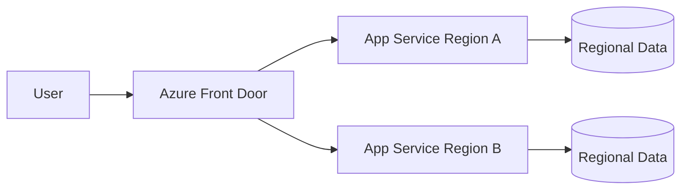

# Daily Knowledge Sharing — 2026-09-08

## Today’s Topics

1. C# `async` / `await` state machine: vì sao sync-over-async gây ThreadPool starvation dù code “trông vẫn async”
2. ASP.NET Core API Versioning: giữ backward compatibility mà không biến API thành nghĩa địa version
3. SQL Server lock escalation: khi hàng nghìn row locks bất ngờ biến thành table lock và làm throughput sụp
4. Redis outage design: cache phải là accelerator hay đang vô tình trở thành hard dependency?
5. Saga Pattern: phối hợp transaction phân tán bằng compensating actions thay vì distributed transaction
6. Azure Service Bus `PeekLock`: lock renewal, message settlement và duplicate delivery trong consumer thực tế
7. Azure Front Door: edge routing, origin health và failure isolation cho web application đa-region
8. Kubernetes `CrashLoopBackOff`: đọc container lifecycle để tìm root cause thay vì restart Pod vô hạn
9. SSRF trong backend integration: vì sao một URL do user nhập có thể biến server thành network proxy nội bộ
10. Git `bisect`: tìm commit gây regression bằng binary search thay vì đọc lịch sử bằng mắt

---

# 1. C# `async` / `await` state machine: vì sao sync-over-async gây ThreadPool starvation dù code “trông vẫn async”

## 1. What is it?

`async` / `await` trong C# là syntax để compiler biến một method bất đồng bộ thành state machine. Nó không tự tạo thread mới. Khi gặp một `await` chưa hoàn thành, method lưu state hiện tại rồi trả control về caller; continuation sẽ chạy khi operation hoàn thành.

Mental model:

```text
Call async method
   ↓
Run synchronously until first incomplete await
   ↓
Save state + return Task
   ↓
I/O completes
   ↓
Continuation scheduled
   ↓
Resume state machine
```

Vấn đề production thường không nằm ở `await` mà ở việc developer phá cơ chế này bằng `.Result`, `.Wait()` hoặc blocking call ở giữa async pipeline.

## 2. Why does it exist?

Server backend dành phần lớn thời gian chờ network, database, file hoặc service khác. Nếu mỗi request giữ một thread chỉ để chờ I/O, throughput sẽ bị giới hạn bởi thread count và context switching.

`async` cho phép thread quay lại ThreadPool trong lúc I/O đang chờ, nhờ đó một số lượng thread tương đối nhỏ có thể phục vụ rất nhiều concurrent requests.

## 3. How does it work?

Compiler sinh state machine gồm:

* state hiện tại;
* captured local variables;
* awaiter;
* logic resume continuation.

Ví dụ:

```csharp
public async Task<OrderDto> GetOrderAsync(Guid id)
{
    var order = await _repository.GetAsync(id);
    var price = await _pricing.GetAsync(order.ProductId);
    return new OrderDto(order, price);
}
```

Không có thread nào bị “park” cho mỗi `await` I/O. Nhưng nếu code viết:

```csharp
var order = _repository.GetAsync(id).Result;
```

thread request bị block cho tới khi `Task` hoàn tất. Dưới tải cao, nhiều thread cùng bị block có thể làm ThreadPool thiếu worker cho các continuation đang cần chạy.

## 4. Practical implementation

Code đúng:

```csharp
public async Task<IResult> GetOrder(
    Guid id,
    OrderService service,
    CancellationToken cancellationToken)
{
    var result = await service.GetAsync(id, cancellationToken);
    return result is null
        ? Results.NotFound()
        : Results.Ok(result);
}
```

Code nguy hiểm:

```csharp
public IResult GetOrder(Guid id, OrderService service)
{
    var result = service.GetAsync(id).Result;
    return result is null
        ? Results.NotFound()
        : Results.Ok(result);
}
```

Rule thực dụng: một khi call chain là async, giữ nó async xuyên suốt tới boundary.

## 5. Real production scenario

Một ASP.NET Core API có 1.000 concurrent requests. Mỗi request gọi SQL Server mất 200 ms. Developer thêm `.Result` trong mapping layer vì interface cũ là synchronous.

Ban đầu staging vẫn ổn. Production traffic tăng, ThreadPool worker bị giữ trong lúc chờ SQL. Queue length tăng, request mới phải chờ worker, p99 latency tăng mạnh dù CPU chỉ 30%.

Đây là dấu hiệu điển hình: **CPU thấp nhưng latency cao và ThreadPool queue tăng**.

## 6. Failure scenario & troubleshooting

**Symptom** → latency tăng theo tải, CPU không cao, request timeout hàng loạt.

**Evidence** → `dotnet-counters` hoặc Application Insights cho thấy ThreadPool queue length tăng; stack traces có `.Result`, `.Wait()` hoặc synchronous I/O.

**Hypothesis** → sync-over-async đang block worker threads.

**Diagnosis** → tìm blocking call trên `Task`, synchronous database/network APIs, locks dài.

**Fix** → chuyển interface/call chain sang async end-to-end; không dùng `Task.Run` để che I/O blocking.

**Verification** → load test lại và quan sát queue length, p95/p99, worker thread count.

## 7. Common mistakes

* Dùng `.Result` vì “Task này thường chạy nhanh”.
* Bọc I/O bằng `Task.Run` trong ASP.NET Core.
* Nghĩ `async` nghĩa là chạy song song.
* Tạo quá nhiều concurrent Tasks mà không giới hạn.
* Bỏ `CancellationToken` trong long-running async work.

## 8. Alternatives

Nếu workload thực sự CPU-bound, `Task.Run`, `Parallel.ForEachAsync` hoặc worker pool có thể phù hợp hơn. Nhưng đó là parallelism, không phải asynchronous I/O.

## 9. Trade-offs

### Advantages

* Tăng scalability cho I/O-bound workload.
* Giảm số thread bị giữ trong thời gian chờ.
* Tích hợp tốt với cancellation và timeout.

### Costs / Risks

* Call chain phải async xuyên nhiều layer.
* Debug stack traces khó đọc hơn.
* Unbounded concurrency vẫn có thể gây overload.
* Async không làm operation intrinsically nhanh hơn.

## 10. Junior → Middle → Senior → Technical Lead

### Junior

Hiểu `await` không tạo thread mới và không block thread khi chờ I/O đúng cách.

### Middle

Viết async end-to-end, dùng `CancellationToken`, tránh `.Result` / `.Wait()`.

### Senior

Chẩn đoán ThreadPool starvation, phân biệt I/O-bound với CPU-bound và quản lý concurrency.

### Technical Lead / Architect

Đặt async coding conventions, chọn concurrency boundaries và quyết định nơi nào cần worker/queue thay vì request-bound processing.

## 11. Key takeaway

* `async` là cơ chế giải phóng thread khi chờ, không phải magic performance switch.
* Sync-over-async có thể phá scalability mà CPU vẫn thấp.
* Async pipeline nên được giữ async từ HTTP boundary tới dependency boundary.

---

# 2. ASP.NET Core API Versioning: giữ backward compatibility mà không biến API thành nghĩa địa version

## 1. What is it?

API Versioning là chiến lược thay đổi contract HTTP mà không phá client đang dùng contract cũ. Version có thể nằm trong URL, header, media type hoặc query string.

Mental model:

```text
Client A → /api/v1/orders
Client B → /api/v2/orders
             ↓
       application logic
```

Versioning chỉ là công cụ quản lý breaking changes, không phải lý do để tạo version mới cho mọi thay đổi.

## 2. Why does it exist?

API là contract giữa producer và consumer. Nếu producer rename field, thay semantics, đổi status code hoặc xóa endpoint mà client chưa nâng cấp, production integration có thể hỏng ngay.

Backward compatibility cho phép server evolve với migration window thay vì buộc mọi consumer deploy đồng thời.

## 3. How does it work?

Một thay đổi thường **không breaking** nếu chỉ thêm optional field hoặc endpoint mới. Breaking changes gồm:

* xóa/rename field;
* đổi kiểu dữ liệu;
* đổi semantics;
* thay required validation;
* thay status code/error contract theo cách client phụ thuộc.

Version boundary nên được đặt ở HTTP contract. Application/domain logic có thể reuse nếu business semantics giống nhau.

## 4. Practical implementation

Ví dụ với ASP.NET API Versioning package:

```csharp
builder.Services
    .AddApiVersioning(options =>
    {
        options.DefaultApiVersion = new ApiVersion(1, 0);
        options.AssumeDefaultVersionWhenUnspecified = true;
        options.ReportApiVersions = true;
    })
    .AddApiExplorer();
```

Controller:

```csharp
[ApiController]
[Route("api/v{version:apiVersion}/orders")]
[ApiVersion("1.0")]
[ApiVersion("2.0")]
public sealed class OrdersController : ControllerBase
{
    [HttpGet("{id:guid}")]
    [MapToApiVersion("1.0")]
    public async Task<ActionResult<OrderV1Dto>> GetV1(Guid id) => ...;

    [HttpGet("{id:guid}")]
    [MapToApiVersion("2.0")]
    public async Task<ActionResult<OrderV2Dto>> GetV2(Guid id) => ...;
}
```

## 5. Real production scenario

Mobile app v1 đang parse `price` là integer cents. Backend muốn chuyển sang decimal amount + currency object. Nếu thay trực tiếp contract, app cũ có thể crash hoặc tính sai.

V2 có thể trả:

```json
{
  "price": {
    "amount": 125.50,
    "currency": "USD"
  }
}
```

Trong migration window, v1 và v2 cùng được phục vụ.

## 6. Failure scenario & troubleshooting

**Symptom** → deploy API mới, một nhóm mobile clients bắt đầu 400/500.

**Evidence** → telemetry phân đoạn theo API version cho thấy chỉ v1 lỗi; schema diff phát hiện validation mới áp dụng chung DTO.

**Hypothesis** → shared model vô tình đưa breaking rule vào version cũ.

**Diagnosis** → kiểm tra request DTO, validation, status-code contract từng version.

**Fix** → tách transport models; map vào cùng application command nếu semantics phù hợp.

**Verification** → contract tests cho v1/v2 và replay real payloads.

## 7. Common mistakes

* Version database/domain model thay vì HTTP contract.
* Tạo v2 chỉ vì thêm optional property.
* Reuse cùng DTO cho mọi version rồi vô tình phá v1.
* Không có deprecation policy.
* Giữ mọi version vĩnh viễn.

## 8. Alternatives

* Additive backward-compatible evolution.
* Consumer-driven contract testing.
* Feature negotiation qua headers.
* GraphQL schema evolution nếu domain phù hợp.

## 9. Trade-offs

### Advantages

* Consumer migration có kiểm soát.
* Giảm coordinated deployment.
* Cho phép breaking evolution khi thật sự cần.

### Costs / Risks

* Tăng test matrix.
* Tăng code path và documentation.
* Old versions tạo maintenance burden.
* Mapping logic có thể phình to.

## 10. Junior → Middle → Senior → Technical Lead

### Junior

Hiểu API là contract, không chỉ endpoint code.

### Middle

Biết phân biệt breaking/non-breaking change và implement versioned DTO.

### Senior

Thiết kế compatibility test, deprecation window và telemetry theo version.

### Technical Lead / Architect

Quyết định versioning strategy tổ chức-wide, lifecycle policy và mức backward compatibility cần bảo đảm.

## 11. Key takeaway

* Đừng version khi thay đổi vẫn backward-compatible.
* Version transport contract, không nhân đôi domain vô cớ.
* Mỗi version mới tạo chi phí vận hành và test lâu dài.

---

# 3. SQL Server lock escalation: khi hàng nghìn row locks bất ngờ biến thành table lock và làm throughput sụp

## 1. What is it?

Lock escalation là cơ chế SQL Server có thể thay nhiều row/page locks bằng lock cấp cao hơn như table lock để giảm memory overhead quản lý locks.

Mental model:

```text
Many row locks
   ↓ memory/lock threshold
Table-level lock
   ↓
More blocking across unrelated rows
```

## 2. Why does it exist?

Mỗi lock tiêu tốn memory và metadata. Một transaction update hàng trăm nghìn rows với row locks có thể làm lock manager chịu chi phí lớn. Escalation đánh đổi concurrency để giảm resource quản lý lock.

## 3. How does it work?

SQL Server theo dõi số lượng locks và memory pressure. Khi threshold phù hợp, engine có thể cố escalate.

Ví dụ:

```sql
UPDATE Orders
SET Status = 'Archived'
WHERE CreatedAt < DATEADD(year, -5, SYSUTCDATETIME());
```

Nếu statement chạm rất nhiều rows, transaction có thể giữ số lượng locks lớn. Khi table lock xuất hiện, request update một order hoàn toàn khác cũng có thể bị block.

## 4. Practical implementation

Thay batch khổng lồ bằng chunk có transaction nhỏ:

```sql
WHILE 1 = 1
BEGIN
    DELETE TOP (1000)
    FROM AuditLogs
    WHERE CreatedAt < @Cutoff;

    IF @@ROWCOUNT = 0 BREAK;
END
```

Trong application, background archival job nên commit từng batch và quan sát duration/locks thay vì mở một transaction kéo dài hàng phút.

## 5. Real production scenario

Nightly cleanup xóa 8 triệu audit rows lúc 01:00. Sau một phút, API update customer profile bắt đầu timeout. Database CPU không quá cao nhưng blocking chain dài.

Root cause không phải query API mà là maintenance transaction escalate lock và giữ table trong thời gian dài.

## 6. Failure scenario & troubleshooting

**Symptom** → nhiều unrelated queries cùng block.

**Evidence** → `sys.dm_exec_requests`, `sys.dm_tran_locks` hoặc blocked-process report cho thấy table-level lock từ maintenance session.

**Hypothesis** → large transaction gây lock escalation.

**Diagnosis** → kiểm tra row count affected, transaction duration, execution plan, lock mode.

**Fix** → batch nhỏ, index/filter phù hợp, giảm transaction scope, chạy workload ở window hợp lý.

**Verification** → quan sát blocking duration và lock count trong lần chạy tiếp theo.

## 7. Common mistakes

* Nghĩ row-level update luôn chỉ khóa row.
* Chạy cleanup hàng triệu rows trong một transaction.
* Dùng `NOLOCK` ở reader như cách “fix blocking”.
* Tắt escalation toàn cục mà không hiểu memory consequence.
* Chỉ nhìn CPU, bỏ qua wait stats và blocking chain.

## 8. Alternatives

* Batch processing.
* Partitioning + partition switch cho archival lớn.
* Snapshot-based isolation cho read contention trong use case phù hợp.
* Off-hours maintenance, nhưng không thay thế transaction design tốt.

## 9. Trade-offs

### Advantages

Lock escalation giúp SQL Server giảm memory quản lý locks.

### Costs / Risks

* Giảm concurrency.
* Blocking scope tăng mạnh.
* Long transaction làm log growth và rollback lâu hơn.

## 10. Junior → Middle → Senior → Technical Lead

### Junior

Hiểu transaction lớn có thể khóa nhiều hơn row mà code tưởng tượng.

### Middle

Biết xem blocking sessions và chia batch.

### Senior

Đọc wait stats, lock modes, transaction scope và execution plan.

### Technical Lead / Architect

Thiết kế data-retention/archival strategy phù hợp scale thay vì coi cleanup là một câu SQL đơn giản.

## 11. Key takeaway

* Locking behavior phụ thuộc số rows và transaction scope, không chỉ câu lệnh.
* Batch nhỏ thường an toàn hơn mass update/delete.
* Blocking investigation phải nhìn lock owner và wait chain, không chỉ CPU.

---

# 4. Redis outage design: cache phải là accelerator hay đang vô tình trở thành hard dependency?

## 1. What is it?

Redis cache thường được đưa vào để giảm latency và database load. Nhưng tùy thiết kế, Redis có thể trở thành hard dependency: Redis down đồng nghĩa API down.

Mental model cần hỏi:

```text
Request
  ↓
Redis unavailable
  ├─ fallback DB?  → degraded but alive
  └─ fail request? → Redis is critical dependency
```

## 2. Why does it exist?

Cache tồn tại vì nguồn dữ liệu gốc chậm hoặc đắt. Tuy nhiên, thêm cache tạo thêm distributed component, network call, serialization, invalidation và outage mode mới.

Senior engineer phải quyết định rõ: cache là **optimization** hay **source cần thiết cho correctness**.

## 3. How does it work?

Với cache-aside:

```text
GET key
  ├─ hit  → return
  └─ miss → query DB → SET cache → return
```

Khi Redis unavailable, có ba strategy phổ biến:

* fail-open: bỏ cache, đọc DB;
* fail-closed: trả lỗi vì dữ liệu/cache state bắt buộc;
* degraded fallback: stale/local cache/limited feature.

## 4. Practical implementation

```csharp
public async Task<ProductDto?> GetAsync(
    Guid id,
    CancellationToken cancellationToken)
{
    try
    {
        var cached = await _cache.GetStringAsync(
            $"product:{id}",
            cancellationToken);

        if (cached is not null)
            return JsonSerializer.Deserialize<ProductDto>(cached);
    }
    catch (RedisConnectionException ex)
    {
        _logger.LogWarning(ex, "Redis unavailable; falling back to database");
    }

    return await _db.Products
        .AsNoTracking()
        .Where(x => x.Id == id)
        .Select(x => new ProductDto(x.Id, x.Name))
        .SingleOrDefaultAsync(cancellationToken);
}
```

Nhưng fallback chỉ an toàn nếu database đủ capacity chịu cache-miss storm.

## 5. Real production scenario

Product catalog có 95% cache hit. Redis cluster outage khiến toàn bộ traffic đổ về SQL Server trong vài giây. API chưa chết vì Redis, nhưng database connection pool và CPU bị bão hòa, cuối cùng hệ thống vẫn outage.

Vì vậy fail-open cần kèm rate limiting, stale cache, request coalescing hoặc capacity planning.

## 6. Failure scenario & troubleshooting

**Symptom** → Redis outage rồi SQL latency và error rate tăng đột biến.

**Evidence** → cache hit ratio về 0, DB QPS tăng 10x, connection pool saturation.

**Hypothesis** → fallback path đúng logic nhưng không chịu được full traffic.

**Diagnosis** → load-test no-cache mode, xem DB capacity, hot keys và request fan-out.

**Fix** → stale/local fallback, admission control, cache warming, throttling hoặc tăng source capacity có chủ đích.

**Verification** → chaos test Redis unavailable trong production-like load.

## 7. Common mistakes

* Catch mọi exception rồi âm thầm fallback DB.
* Không có timeout ngắn cho Redis.
* Retry Redis quá nhiều trong outage.
* Không đo behavior khi 100% cache miss.
* Lưu dữ liệu duy nhất trong cache rồi gọi nó “cache”.

## 8. Alternatives

* `IMemoryCache` cho per-instance data.
* CDN/edge caching cho HTTP assets/content.
* Database/materialized read model nếu dữ liệu cần ổn định hơn.
* Không cache nếu source đã đủ nhanh.

## 9. Trade-offs

### Advantages

* Latency thấp.
* Giảm database load.
* Tăng throughput.

### Costs / Risks

* Invalidation và consistency.
* Outage amplification.
* Serialization/network overhead.
* Thêm operational dependency.

## 10. Junior → Middle → Senior → Technical Lead

### Junior

Hiểu cache không phải source of truth mặc định.

### Middle

Implement cache-aside, TTL, timeout và fallback.

### Senior

Đánh giá stampede, no-cache capacity, stale tolerance và failure amplification.

### Technical Lead / Architect

Quyết định cache có nên tồn tại, correctness ownership ở đâu và degraded-mode contract của hệ thống là gì.

## 11. Key takeaway

* Redis outage plan phải được thiết kế trước, không phải sau incident.
* “Fallback về DB” chỉ đúng nếu DB chịu được traffic đó.
* Cache tốt là accelerator có failure semantics rõ ràng.

---

# 5. Saga Pattern: phối hợp transaction phân tán bằng compensating actions thay vì distributed transaction

## 1. What is it?

Saga Pattern chia một business transaction xuyên nhiều service thành chuỗi local transactions. Nếu bước sau thất bại, hệ thống chạy compensating actions để đảo ngược business effect của các bước trước.

Mental model:

```text
Create Order
   ↓
Reserve Inventory
   ↓
Charge Payment
   ↓
Confirm Order

If Charge fails:
Release Inventory
Cancel Order
```

## 2. Why does it exist?

Trong Microservices, mỗi service thường sở hữu database riêng. Không có một ACID transaction đơn giản bao trùm SQL của Order, Inventory và Payment.

Distributed transaction/2PC thường không phù hợp về availability, coupling hoặc platform support. Saga chấp nhận eventual consistency và xử lý failure ở business level.

## 3. How does it work?

Có hai style:

* choreography: services publish/subscribe events;
* orchestration: một saga orchestrator quyết định bước tiếp theo.

Choreography giảm central coordinator nhưng flow khó quan sát khi event chain dài. Orchestration rõ state hơn nhưng coordinator trở thành component quan trọng.

## 4. Practical implementation

Một orchestrator đơn giản có state:

```csharp
public sealed record OrderSagaState(
    Guid OrderId,
    bool InventoryReserved,
    bool PaymentCaptured,
    SagaStatus Status);
```

Flow application:

```text
OrderCreated
→ ReserveInventory command
→ InventoryReserved
→ CapturePayment command
→ PaymentCaptured
→ ConfirmOrder
```

Mỗi command consumer phải idempotent vì message có thể được giao lại.

## 5. Real production scenario

Checkout tạo order, reserve stock và charge payment. Payment provider timeout sau khi đã charge nhưng trước response. Nếu hệ thống retry mù quáng có thể double-charge.

Saga cần:

* payment idempotency key;
* state transition durable;
* compensation rõ ràng;
* reconciliation khi trạng thái remote không chắc chắn.

## 6. Failure scenario & troubleshooting

**Symptom** → order ở `Pending` hàng giờ, stock đã reserved.

**Evidence** → saga state cho thấy `InventoryReserved=true`, payment command exhausted retries và vào DLQ.

**Hypothesis** → saga bị stuck giữa steps.

**Diagnosis** → trace correlation ID qua Order/Inventory/Payment, xem message history và idempotency records.

**Fix** → operator retry có kiểm soát, compensation release stock hoặc manual reconciliation tùy business state.

**Verification** → saga đạt terminal state và không tạo duplicate side effects.

## 7. Common mistakes

* Nghĩ compensation là database rollback hoàn hảo.
* Không persist saga state.
* Consumer không idempotent.
* Không có timeout/terminal state.
* Dùng choreography cho flow quá phức tạp mà không có observability.

## 8. Alternatives

* Single database transaction trong Modular Monolith nếu boundaries chưa cần tách.
* 2PC trong môi trường hỗ trợ đặc biệt.
* Eventual consistency đơn giản không cần Saga nếu business không có multi-step invariant.

## 9. Trade-offs

### Advantages

* Không cần global transaction coordinator.
* Tôn trọng service ownership.
* Failure được model ở business level.

### Costs / Risks

* Eventual consistency.
* Compensation phức tạp.
* Debugging và observability khó.
* State machine cần governance tốt.

## 10. Junior → Middle → Senior → Technical Lead

### Junior

Hiểu distributed transaction không giống transaction trong một database.

### Middle

Biết implement idempotent handlers và compensation cơ bản.

### Senior

Thiết kế saga state, retry, timeout, reconciliation và failure recovery.

### Technical Lead / Architect

Quyết định có cần phân tán transaction hay nên giữ boundary trong một deployable/database đơn giản hơn.

## 11. Key takeaway

* Saga không tạo ACID xuyên services; nó quản lý eventual consistency có chủ đích.
* Compensation là business action, không phải rollback kỹ thuật hoàn hảo.
* Nếu một database transaction đủ đáp ứng, Saga có thể là overengineering.

---

# 6. Azure Service Bus `PeekLock`: lock renewal, message settlement và duplicate delivery trong consumer thực tế

## 1. What is it?

`PeekLock` là receive mode trong Azure Service Bus: consumer nhận message nhưng message chưa bị xóa. Broker khóa message tạm thời. Consumer phải `Complete`, `Abandon`, `DeadLetter` hoặc để lock hết hạn.

## 2. Why does it exist?

Nếu broker xóa message ngay khi deliver và consumer crash trước khi xử lý xong, dữ liệu bị mất. `PeekLock` cho at-least-once delivery: message chỉ được remove khi consumer xác nhận hoàn tất.

## 3. How does it work?

```text
Broker → deliver message + lock
Consumer processes
   ├─ success → Complete → remove
   ├─ transient fail → Abandon / lock expiry → redelivery
   └─ poison → DeadLetter
```

Nếu processing lâu hơn lock duration, client có thể auto-renew lock trong giới hạn. Nhưng lock renewal không đảm bảo exactly-once.

## 4. Practical implementation

```csharp
var processor = client.CreateProcessor(queueName, new ServiceBusProcessorOptions
{
    AutoCompleteMessages = false,
    MaxConcurrentCalls = 8,
    MaxAutoLockRenewalDuration = TimeSpan.FromMinutes(5)
});

processor.ProcessMessageAsync += async args =>
{
    try
    {
        await handler.HandleAsync(args.Message, args.CancellationToken);
        await args.CompleteMessageAsync(args.Message);
    }
    catch (BusinessValidationException ex)
    {
        await args.DeadLetterMessageAsync(
            args.Message,
            "InvalidBusinessMessage",
            ex.Message);
    }
};
```

## 5. Real production scenario

Invoice generation mất 90 giây, lock duration là 30 giây. Nếu auto-renew không đủ hoặc process bị pause, lock hết hạn. Message được consumer khác nhận trong khi instance cũ vẫn tiếp tục xử lý.

Nếu generation không idempotent, customer có thể nhận hai invoices/email.

## 6. Failure scenario & troubleshooting

**Symptom** → cùng `MessageId` được process nhiều lần.

**Evidence** → logs có `MessageLockLostException`; processing duration vượt lock settings.

**Hypothesis** → lock expired trước `Complete`.

**Diagnosis** → xem handler latency, renewal duration, concurrency, GC pauses, dependency timeouts.

**Fix** → rút ngắn handler, chia work, tăng lock/renewal hợp lý và bắt buộc idempotency.

**Verification** → fault test process > lock duration và xác minh side effect chỉ xảy ra một lần.

## 7. Common mistakes

* Nghĩ `PeekLock` tạo exactly-once processing.
* `Complete` trước khi side effect durable.
* Handler lâu vô hạn dựa vào auto-renew.
* Retry poison message mãi không DLQ.
* Không dùng stable `MessageId` / business idempotency key.

## 8. Alternatives

* `ReceiveAndDelete`: latency đơn giản hơn nhưng có risk mất message nếu consumer crash.
* Durable workflow cho long-running orchestration.
* Blob + short queue message cho file workload lớn.

## 9. Trade-offs

### Advantages

* Giảm message loss khi consumer crash.
* Hỗ trợ retry và DLQ.
* Phù hợp competing consumers.

### Costs / Risks

* Duplicate delivery vẫn có thể xảy ra.
* Lock lifecycle cần monitor.
* Handler duration/concurrency phải được kiểm soát.

## 10. Junior → Middle → Senior → Technical Lead

### Junior

Hiểu message chưa bị xóa khi vừa receive ở `PeekLock`.

### Middle

Biết settlement, retry và DLQ.

### Senior

Thiết kế idempotency, lock duration, renewal và concurrency.

### Technical Lead / Architect

Quyết định queue semantics, processing SLA, deduplication ownership và long-running workflow boundary.

## 11. Key takeaway

* `PeekLock` hỗ trợ at-least-once, không phải exactly-once.
* Lock expiry có thể tạo concurrent duplicate processing.
* Idempotency là requirement của consumer production-grade.

---

# 7. Azure Front Door: edge routing, origin health và failure isolation cho web application đa-region

## 1. What is it?

Azure Front Door là global Layer 7 edge service đứng trước web origins. Nó cung cấp routing, TLS termination, health probing, CDN/caching capabilities và Web Application Firewall tùy cấu hình.

Mental model:

```text
User
  ↓ nearest edge
Azure Front Door
  ├─ healthy region A
  └─ healthy region B
```

## 2. Why does it exist?

Một web app toàn cầu cần:

* endpoint thống nhất;
* route user tới origin phù hợp;
* detect unhealthy origin;
* giảm latency static/cacheable content;
* shield origin khỏi direct exposure trong một số architecture.

## 3. How does it work?

Front Door liên tục health probe origins. Routing decision có thể dựa trên priority, latency và weight.



Routing traffic chỉ giải quyết compute failover. Data layer vẫn phải có consistency/failover strategy riêng.

## 4. Practical implementation

Application nên expose health endpoint phản ánh khả năng phục vụ request thật sự:

```csharp
builder.Services.AddHealthChecks()
    .AddSqlServer(connectionString, name: "sql");

app.MapHealthChecks("/health/ready");
```

Nhưng không nên đưa mọi non-critical dependency vào probe nếu dependency đó có fallback; nếu không, một reviews service lỗi có thể khiến toàn region bị loại khỏi rotation dù core storefront vẫn dùng được.

## 5. Real production scenario

E-commerce chạy ở West Europe và Southeast Asia. Region A gặp App Service failure. Front Door health probe fail và route traffic sang region B.

Nếu database chỉ active ở region A mà không có failover strategy, compute failover vẫn vô nghĩa. Đây là lỗi architecture phổ biến: global routing nhưng state không global-ready.

## 6. Failure scenario & troubleshooting

**Symptom** → Front Door chuyển origin liên tục, user gặp intermittent 503.

**Evidence** → health probe logs cho thấy readiness endpoint flapping vì dependency phụ trợ timeout.

**Hypothesis** → health probe quá strict hoặc dependency unstable.

**Diagnosis** → tách liveness/readiness/business dependency; kiểm tra origin health history.

**Fix** → chỉ probe capability critical, thêm hysteresis/threshold phù hợp, sửa dependency timeout.

**Verification** → simulate dependency degradation và xác minh origin không bị loại vô lý.

## 7. Common mistakes

* Nghĩ Front Door tự giải quyết database failover.
* Health endpoint luôn trả 200.
* Hoặc ngược lại, probe mọi dependency phụ.
* Caching dynamic personalized response sai key/header.
* Không chặn bypass trực tiếp vào origin khi security model yêu cầu edge-only access.

## 8. Alternatives

* Azure Application Gateway: regional Layer 7 ingress.
* Azure Load Balancer: Layer 4 regional.
* CDN thuần cho static content.
* DNS-based failover: chậm/coarse hơn vì DNS caching.

## 9. Trade-offs

### Advantages

* Global edge routing.
* Health-based failover.
* WAF/CDN integration.

### Costs / Risks

* Thêm routing/caching complexity.
* Cost tăng theo traffic/features.
* Data failover vẫn phải thiết kế riêng.
* Misconfigured caching/rules có thể gây incident toàn cầu.

## 10. Junior → Middle → Senior → Technical Lead

### Junior

Hiểu Front Door nằm trước application origins.

### Middle

Biết health probe, route và origin group.

### Senior

Đánh giá failover semantics, caching, WAF, private origin connectivity và telemetry.

### Technical Lead / Architect

Thiết kế end-to-end multi-region gồm compute, data, DNS/edge, identity và operational runbook.

## 11. Key takeaway

* Global router không tự tạo multi-region architecture hoàn chỉnh.
* Health probe phải phản ánh khả năng phục vụ, không phải “mọi dependency đều xanh”.
* Failover design phải bao gồm state/data layer.

---

# 8. Kubernetes `CrashLoopBackOff`: đọc container lifecycle để tìm root cause thay vì restart Pod vô hạn

## 1. What is it?

`CrashLoopBackOff` là trạng thái Kubernetes khi container liên tục start, crash rồi được restart. Kubernetes tăng dần delay giữa các lần restart để tránh loop quá nhanh.

Đây không phải root cause; nó chỉ là **symptom của repeated container failure**.

## 2. Why does it exist?

Containers được kỳ vọng có thể restart. Nếu process chết, kubelet cố khôi phục. Backoff bảo vệ node khỏi vòng restart quá dày và cho operator thời gian điều tra.

## 3. How does it work?

```text
Container starts
  ↓
Process exits / probe kills container
  ↓
Restart policy applies
  ↓
Repeated failures
  ↓
Backoff delay grows
```

Nguyên nhân có thể là:

* startup exception;
* missing config/secret;
* DB unreachable;
* OOMKilled;
* liveness probe sai;
* permission/filesystem issue;
* invalid command/entrypoint.

## 4. Practical implementation

Điều tra theo thứ tự:

```bash
kubectl get pods
kubectl describe pod my-api-abc123
kubectl logs my-api-abc123
kubectl logs my-api-abc123 --previous
```

`--previous` đặc biệt quan trọng vì container hiện tại có thể vừa restart và log root cause nằm ở instance trước.

Nếu suspect OOM:

```bash
kubectl describe pod my-api-abc123
```

Tìm `Last State: Terminated`, `Reason: OOMKilled`.

## 5. Real production scenario

Deployment mới thêm Key Vault configuration provider. Pod start trước khi workload identity/RBAC sẵn sàng, app throw exception lúc startup và exit.

Kubernetes restart Pod liên tục. Restart không giải quyết permission; chỉ tạo noise.

## 6. Failure scenario & troubleshooting

**Symptom** → Pod `CrashLoopBackOff` sau deployment.

**Evidence** → `kubectl logs --previous` có `UnauthorizedAccessException`; Events không báo scheduling issue.

**Hypothesis** → startup dependency permission fail.

**Diagnosis** → kiểm tra ServiceAccount/workload identity/RBAC và config version.

**Fix** → sửa identity hoặc tránh hard-fail startup cho dependency có thể recover nếu architecture cho phép.

**Verification** → rollout mới, Pod Ready ổn định và restart count không tăng.

## 7. Common mistakes

* Xóa Pod liên tục mà không đọc logs/events.
* Tăng liveness timeout để che startup crash.
* Dùng liveness để check dependency ngoài process.
* Không xem `--previous` logs.
* Không phân biệt application exit với OOMKilled.

## 8. Alternatives

Nếu workload không cần Kubernetes, App Service, Container Apps hoặc Worker Service có operational burden thấp hơn. Kubernetes chỉ đáng dùng khi orchestration requirements thực sự cần.

## 9. Trade-offs

### Advantages

* Automatic restart/self-healing.
* Standardized lifecycle.
* Rich scheduling/probe model.

### Costs / Risks

* Failure semantics phức tạp hơn VM/process truyền thống.
* Probe/resource misconfiguration có thể tự tạo outage.
* Team cần đủ operational skill.

## 10. Junior → Middle → Senior → Technical Lead

### Junior

Biết `CrashLoopBackOff` không phải lỗi cụ thể.

### Middle

Biết đọc `describe`, current/previous logs và events.

### Senior

Phân biệt startup crash, OOM, probe kill, config/identity failure.

### Technical Lead / Architect

Quyết định workload có cần Kubernetes và chuẩn hóa diagnostics/probes/resource policies.

## 11. Key takeaway

* Đừng “fix” `CrashLoopBackOff`; hãy tìm process exit reason.
* `kubectl logs --previous` thường là bằng chứng quan trọng nhất.
* Restart loop chỉ là cơ chế recovery, không thay thế root-cause analysis.

---

# 9. SSRF trong backend integration: vì sao một URL do user nhập có thể biến server thành network proxy nội bộ

## 1. What is it?

SSRF — Server-Side Request Forgery — xảy ra khi attacker kiểm soát URL hoặc destination mà server backend sẽ request tới. Vì server có network access khác browser của attacker, attacker có thể lợi dụng server để truy cập internal services, metadata endpoints hoặc private IPs.

Mental model:

```text
Attacker input URL
      ↓
Backend HttpClient
      ↓
Internal network / metadata / private service
```

## 2. Why does it exist?

Các tính năng tưởng vô hại như:

* import image from URL;
* webhook tester;
* PDF screenshot service;
* URL preview;
* remote file fetch;

đều biến backend thành HTTP client theo input từ user.

Nếu validation chỉ check `https://`, attacker vẫn có thể dùng DNS, redirects hoặc private address ranges.

## 3. How does it work?

Attack input có thể là:

```text
http://127.0.0.1:5000/admin
http://10.0.0.4/internal-api
http://169.254.169.254/...
```

Ngay cả hostname public ban đầu cũng có thể redirect sang private target. DNS rebinding có thể làm hostname resolve khác theo thời điểm.

## 4. Practical implementation

An toàn hơn là allowlist destinations thay vì blacklist:

```csharp
private static readonly HashSet<string> AllowedHosts =
    new(StringComparer.OrdinalIgnoreCase)
    {
        "images.example.com",
        "cdn.partner.com"
    };

public static bool IsAllowed(Uri uri)
{
    return uri.Scheme == Uri.UriSchemeHttps
        && AllowedHosts.Contains(uri.Host);
}
```

Với generic URL fetcher, cần thêm network-layer controls: resolve IP rồi reject loopback/private/link-local ranges, kiểm tra redirect từng hop, egress firewall/proxy và timeout/size limits.

## 5. Real production scenario

CMS cho editor nhập URL để import external image. Endpoint backend fetch URL bằng Managed Identity-enabled environment. Attacker/editor compromised account thử URL tới internal admin API.

Nếu backend có private network access, SSRF có thể bypass perimeter mà external attacker không truy cập được trực tiếp.

## 6. Failure scenario & troubleshooting

**Symptom** → logs cho thấy image-import endpoint gọi IP private lạ.

**Evidence** → request input là public-looking URL nhưng redirect tới `10.x.x.x`.

**Hypothesis** → redirect validation chỉ thực hiện ở initial URL.

**Diagnosis** → capture redirect chain, DNS resolution và egress logs.

**Fix** → validate mỗi hop, disable automatic redirects khi cần, enforce egress allowlist.

**Verification** → security tests với loopback, private IP, encoded IP, redirect chain và DNS tricks.

## 7. Common mistakes

* Chỉ regex URL.
* Chỉ block `localhost` nhưng quên `127.0.0.1`, IPv6, private CIDR.
* Validate hostname trước nhưng không re-check resolved IP.
* Cho `HttpClient` auto-follow redirect mà không validate hop.
* Cho workload egress tự do tới toàn VNet.

## 8. Alternatives

* Không cho arbitrary URL; chỉ nhận uploaded file.
* Proxy service cô lập với egress policy chặt.
* Pre-signed upload vào Blob Storage.

## 9. Trade-offs

### Advantages của remote fetch

* UX tiện.
* Giảm client upload burden.

### Costs / Risks

* SSRF.
* Bandwidth abuse.
* Huge file/slow response attacks.
* Egress dependency và observability burden.

## 10. Junior → Middle → Senior → Technical Lead

### Junior

Hiểu backend request có network privileges khác user browser.

### Middle

Validate scheme/host, timeout, size và redirects.

### Senior

Đánh giá DNS, IP ranges, egress controls, identity exposure và logging.

### Technical Lead / Architect

Quyết định có cho arbitrary remote fetch hay tách thành sandboxed service/network boundary.

## 11. Key takeaway

* URL validation chỉ ở string level là chưa đủ chống SSRF.
* Egress network policy là defense-in-depth quan trọng.
* Tốt nhất là allowlist hoặc loại bỏ arbitrary server-side fetch nếu business không cần.

---

# 10. Git `bisect`: tìm commit gây regression bằng binary search thay vì đọc lịch sử bằng mắt

## 1. What is it?

`git bisect` dùng binary search trên commit history để tìm commit đầu tiên gây bug. Bạn đánh dấu một commit “good” và một commit “bad”; Git checkout commit ở giữa, bạn test rồi tiếp tục cho tới khi khoanh vùng culprit.

Mental model:

```text
100 commits between good and bad
↓ binary search
~7 test rounds instead of checking 100 commits
```

## 2. Why does it exist?

Production regression thường xuất hiện sau nhiều commits. Đọc PR history bằng mắt dễ bias và tốn thời gian. Binary search biến bài toán từ O(n) thành gần O(log n) lần kiểm tra.

## 3. How does it work?

```bash
git bisect start
git bisect bad HEAD
git bisect good v2.4.0
```

Sau mỗi checkout:

```bash
git bisect good
# hoặc
git bisect bad
```

Khi xong:

```bash
git bisect reset
```

Nếu có automated test:

```bash
git bisect run dotnet test tests/Regression.Tests
```

Exit code 0 = good, non-zero = bad theo convention của command chạy.

## 4. Practical implementation

Giả sử API latency regression có integration test:

```bash
git bisect start
git bisect bad main
git bisect good release/2026.09.01
git bisect run ./scripts/check-query-regression.sh
```

Script nên deterministic và đủ nhanh để chạy nhiều lần.

## 5. Real production scenario

Sau hai tuần phát triển, SQL query từ EF Core bắt đầu tạo N+1. Có 84 commits giữa release tốt và release lỗi.

Một integration test đo số DB commands cho endpoint `/orders`. `git bisect run` tìm ra commit thêm lazy-loading navigation chỉ sau vài vòng.

## 6. Failure scenario & troubleshooting

**Symptom** → bisect cho kết quả không ổn định, mỗi run chỉ ra commit khác.

**Evidence** → test phụ thuộc external service hoặc timing.

**Hypothesis** → oracle “good/bad” flaky.

**Diagnosis** → chạy test nhiều lần trên cùng commit.

**Fix** → tạo deterministic reproduction, freeze test data, mock only unstable external dependency nếu cần.

**Verification** → repeated run trên good/bad commits luôn cho cùng kết quả.

## 7. Common mistakes

* Chọn “good” commit thực ra đã có bug.
* Dùng flaky test làm bisect oracle.
* Bisect trên history có build break mà không dùng `git bisect skip`.
* Sau khi tìm commit chỉ revert mà không hiểu root cause.
* Không reset workspace sau bisect.

## 8. Alternatives

* `git log` / PR review khi suspect range rất nhỏ.
* `git blame` cho line-specific history.
* Feature flag/telemetry correlation nếu regression gắn với runtime configuration hơn code commit.

## 9. Trade-offs

### Advantages

* Rất nhanh với history lớn.
* Giảm guessing.
* Automation được nếu có deterministic test.

### Costs / Risks

* Cần reproducible bug.
* Historical commits phải build/test được tương đối.
* Merge-heavy history có thể phức tạp.

## 10. Junior → Middle → Senior → Technical Lead

### Junior

Hiểu binary search trên commit history.

### Middle

Dùng bisect thủ công cho regression.

### Senior

Viết automated regression oracle và xử lý flaky/history complications.

### Technical Lead / Architect

Khuyến khích release observability và testability để incident có thể map nhanh về change set cụ thể.

## 11. Key takeaway

* `git bisect` biến lịch sử lớn thành vài vòng kiểm tra có hệ thống.
* Giá trị của bisect phụ thuộc khả năng reproduce bug deterministically.
* Tìm commit chỉ là bước đầu; vẫn cần hiểu failure mechanism và ngăn regression quay lại.
