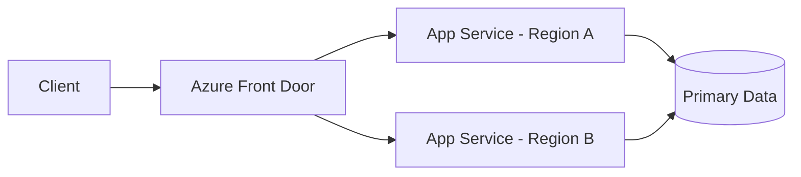

# Daily Knowledge Sharing — 2026-09-11

## Today’s Topics

1. .NET Large Object Heap + GC compaction: hiểu vì sao allocation lớn có thể làm memory footprint phình dù object đã chết
2. ASP.NET Core DI captive dependency: khi Singleton giữ Scoped service và biến lifetime bug thành data race hoặc stale state
3. EF Core migration theo Expand–Migrate–Contract: thay đổi schema không downtime khi nhiều application version cùng tồn tại
4. SQL Server Snapshot Isolation: giảm reader/writer blocking nhưng đổi chi phí sang version store và conflict handling
5. MongoDB embedding vs referencing: thiết kế document theo access pattern thay vì sao chép quan hệ SQL sang NoSQL
6. Anti-Corruption Layer: bảo vệ domain khỏi third-party model mà không biến integration layer thành boilerplate vô nghĩa
7. Azure Front Door + origin failover: đưa routing, health probe và edge resilience ra ngoài application nhưng hiểu rõ giới hạn của failover
8. `BackgroundService` + bounded `Channel<T>`: xây background pipeline có backpressure thay vì queue vô hạn trong memory
9. SSRF defense trong ASP.NET Core: bảo vệ outbound HTTP path khỏi việc biến server thành proxy truy cập mạng nội bộ
10. Integration testing với real infrastructure: dùng containerized database để kiểm tra SQL/EF behavior thay vì mock một persistence layer không tồn tại

---

# 1. .NET Large Object Heap + GC compaction: hiểu vì sao allocation lớn có thể làm memory footprint phình dù object đã chết

## 1. What is it?

Large Object Heap (LOH) là vùng managed heap mà .NET dùng cho object lớn, điển hình là array hoặc buffer có kích thước từ khoảng 85 KB trở lên. LOH vẫn do Garbage Collector quản lý, nhưng behavior khác Small Object Heap: object lớn đắt để di chuyển nên GC thường tránh compact LOH trong mỗi collection.

Mental model nên giữ là:

```text
managed allocation
   |
   +-- nhỏ -> SOH -> Gen 0 / Gen 1 / Gen 2
   |
   +-- lớn -> LOH -> collected cùng Gen 2
```

Điều quan trọng không phải chỉ là “object lớn nằm ở LOH”, mà là lifetime và fragmentation của các object lớn có thể ảnh hưởng trực tiếp đến working set, pause time và khả năng cấp phát object lớn tiếp theo.

## 2. Why does it exist?

Compacting một object 5 MB tốn nhiều memory bandwidth hơn rất nhiều so với object vài chục byte. Nếu runtime liên tục copy large buffers chỉ để loại fragmentation, GC pause sẽ trở nên đắt đỏ.

LOH tồn tại để cân bằng giữa allocation throughput và compaction cost. Cái giá phải trả là fragmentation dễ nhìn thấy hơn khi application tạo và giải phóng nhiều buffer kích thước khác nhau.

## 3. How does it work?

Ví dụ application liên tục tạo các array:

```text
[100 KB][5 MB][200 KB][8 MB][120 KB]
```

Sau một thời gian, một số object chết:

```text
[ free ][5 MB][ free ][8 MB][120 KB]
```

Tổng free memory có thể đủ lớn, nhưng các khoảng trống rời rạc không nhất thiết đủ cho allocation 6 MB tiếp theo. Runtime có thể phải mở rộng heap dù tổng số byte “đang sống” không lớn.

LOH được thu gom trong full/Gen 2 collection. .NET cũng hỗ trợ LOH compaction có chủ đích, nhưng đây không phải knob nên bật như một cách chữa mọi memory problem.

## 4. Practical implementation

Ví dụ endpoint xử lý file theo cách dễ tạo LOH pressure:

```csharp
public async Task<byte[]> DownloadAndTransformAsync(
    Uri source,
    CancellationToken ct)
{
    var bytes = await _httpClient.GetByteArrayAsync(source, ct);

    // bytes có thể vài MB -> LOH
    return Transform(bytes);
}
```

Tốt hơn nếu business flow cho phép streaming:

```csharp
public async Task CopyAsync(
    Uri source,
    Stream destination,
    CancellationToken ct)
{
    using var response = await _httpClient.GetAsync(
        source,
        HttpCompletionOption.ResponseHeadersRead,
        ct);

    response.EnsureSuccessStatusCode();

    await using var input = await response.Content.ReadAsStreamAsync(ct);
    await input.CopyToAsync(destination, ct);
}
```

Nếu buộc phải dùng large temporary buffers trong hot path, `ArrayPool<T>` có thể giúp tái sử dụng buffer, nhưng phải quản lý lifetime và không giữ buffer quá lâu.

## 5. Real production scenario

Một service generate PDF tải nhiều hình ảnh lớn về memory rồi resize. Request rate tăng vào giờ cao điểm. Heap dump cho thấy live objects chỉ khoảng 700 MB nhưng process working set lên hơn 2 GB và full GC xảy ra thường xuyên.

Root cause không phải memory leak cổ điển. Application tạo hàng nghìn large arrays với kích thước khác nhau, gây LOH churn và fragmentation. Chuyển pipeline sang streaming + pooling ở một số bước giúp giảm allocation rate và Gen 2 pressure đáng kể.

## 6. Failure scenario & troubleshooting

**Symptom** → memory tăng theo traffic, Gen 2 GC tăng, p95 latency có spike, đôi lúc `OutOfMemoryException` dù dashboard cho thấy lượng object sống không tương ứng.

**Evidence** → `dotnet-counters` cho thấy allocation rate và Gen 2 collections cao; dump/profiler cho thấy nhiều `byte[]` lớn; GC heap report cho thấy LOH fragmentation đáng kể.

**Hypothesis** → large transient allocation gây LOH pressure chứ không phải object retention đơn thuần.

**Diagnosis** → dùng `dotnet-gcdump`, `dotnet-dump`, PerfView hoặc profiler để phân biệt live size, allocation rate và fragmentation.

**Fix** → stream dữ liệu, reuse buffers, tránh materialize payload lớn nhiều lần, giới hạn concurrency và chỉ cân nhắc explicit LOH compaction khi đã hiểu workload.

**Verification** → chạy lại production-like load test; so allocation/sec, Gen 2 frequency, pause duration, process working set và p95/p99.

## 7. Common mistakes

- Kết luận “memory leak” chỉ vì process memory không giảm ngay.
- Chỉ gọi `GC.Collect()` để ép cleanup.
- Dùng `ToArray()` nhiều lần trên payload lớn mà không nhìn allocation profile.
- Pool buffer nhưng quên `Return`, hoặc trả buffer trong khi code khác vẫn tham chiếu.
- Tối ưu LOH khi chưa đo allocation path thực tế.

## 8. Alternatives

Nếu payload có thể xử lý theo chunk, streaming thường đơn giản và an toàn hơn pooling. Nếu cần random access toàn bộ payload, memory-mapped file hoặc temporary storage có thể phù hợp hơn giữ nhiều bản sao trong RAM.

## 9. Trade-offs

### Advantages

Giảm large allocation thường giúp giảm GC pressure, working set và tail latency.

### Costs / Risks

Streaming/pooling làm code lifetime-sensitive hơn, khó debug hơn và đôi khi tăng I/O hoặc complexity. Không nên đánh đổi maintainability nếu workload nhỏ và không có bằng chứng memory pressure.

## 10. Junior → Middle → Senior → Technical Lead

### Junior

Hiểu object lớn vẫn là managed memory và LOH không đồng nghĩa memory leak.

### Middle

Biết tránh materialize payload lớn không cần thiết, dùng streaming và đọc basic GC counters.

### Senior

Phân biệt retention, fragmentation và allocation pressure; profile trước khi tối ưu; hiểu pooling có thể tạo correctness bug.

### Technical Lead / Architect

Quyết định pipeline nào cần streaming, concurrency limit nào phù hợp và memory budget của service là bao nhiêu thay vì để từng endpoint tự tiêu thụ RAM tùy ý.

## 11. Key takeaway

- LOH problem thường là allocation/lifetime problem, không chỉ là “GC chưa chạy”.
- Đo live size, allocation rate và fragmentation riêng biệt.
- Streaming và bounded concurrency thường có giá trị hơn ép GC thủ công.

---

# 2. ASP.NET Core DI captive dependency: khi Singleton giữ Scoped service và biến lifetime bug thành data race hoặc stale state

## 1. What is it?

Captive dependency xảy ra khi một service có lifetime dài hơn giữ trực tiếp dependency có lifetime ngắn hơn. Case phổ biến nhất trong ASP.NET Core là `Singleton` capture một `Scoped` service như `DbContext` hoặc request-specific state.

Mental model:

```text
Singleton lifetime:  app start -------------------------- app stop
Scoped lifetime:        request A ----|
                       request B ----|
```

Nếu Singleton giữ instance tạo từ request A, instance đó vô tình sống vượt boundary ban đầu.

## 2. Why does it exist?

DI lifetime không phải cấu hình “performance”. Nó mô tả ownership và state boundary.

- `Singleton`: một instance dùng cho toàn application process.
- `Scoped`: thường một instance cho mỗi HTTP request.
- `Transient`: instance mới mỗi lần resolve.

Nếu boundary bị phá, state vốn được thiết kế cho một request có thể bị chia sẻ giữa nhiều request hoặc giữ tài nguyên lâu hơn dự kiến.

## 3. How does it work?

Ví dụ sai:

```csharp
builder.Services.AddDbContext<AppDbContext>(); // Scoped
builder.Services.AddSingleton<OrderCacheWarmup>();

public sealed class OrderCacheWarmup
{
    private readonly AppDbContext _db;

    public OrderCacheWarmup(AppDbContext db)
    {
        _db = db;
    }
}
```

Built-in container thường phát hiện một số captive dependency khi scope validation bật, nhưng không phải mọi lifetime bug đều được phát hiện nếu dependency được lấy gián tiếp hoặc qua service locator.

## 4. Practical implementation

Nếu Singleton/background component cần scoped dependency cho từng operation, tạo scope rõ ràng:

```csharp
public sealed class CacheRefreshWorker : BackgroundService
{
    private readonly IServiceScopeFactory _scopeFactory;

    public CacheRefreshWorker(IServiceScopeFactory scopeFactory)
        => _scopeFactory = scopeFactory;

    protected override async Task ExecuteAsync(CancellationToken stoppingToken)
    {
        while (!stoppingToken.IsCancellationRequested)
        {
            await using var scope = _scopeFactory.CreateAsyncScope();
            var db = scope.ServiceProvider.GetRequiredService<AppDbContext>();

            await RefreshAsync(db, stoppingToken);
            await Task.Delay(TimeSpan.FromMinutes(5), stoppingToken);
        }
    }
}
```

Scope ở đây tương ứng một unit of work, không phải lifetime của worker.

## 5. Real production scenario

Một singleton metrics collector vô tình inject repository dùng EF Core `DbContext`. Local test một request một lúc vẫn chạy. Production có nhiều concurrent requests, `DbContext` bị dùng đồng thời và xuất hiện exception kiểu “A second operation was started on this context instance…”.

Nếu service chứa mutable state request-specific, bug còn nguy hiểm hơn vì có thể trộn dữ liệu giữa user.

## 6. Failure scenario & troubleshooting

**Symptom** → random concurrency exception, stale data hoặc object đã disposed.

**Evidence** → dependency graph cho thấy long-lived component giữ scoped/transient stateful object; instance IDs giống nhau giữa nhiều request.

**Hypothesis** → lifetime mismatch.

**Diagnosis** → kiểm tra registrations, constructors, factory/service locator code và bật `ValidateScopes`/`ValidateOnBuild` ở môi trường phù hợp.

**Fix** → align lifetime hoặc tạo explicit scope tại operation boundary.

**Verification** → concurrent integration test và logging instance lifetime; không còn shared request-state ngoài ý muốn.

## 7. Common mistakes

- Đổi mọi service thành Singleton để “tối ưu allocation”.
- Inject `IServiceProvider` rồi resolve scoped service tùy ý ở mọi nơi.
- Singleton giữ mutable collections nhưng không có synchronization.
- Dùng `DbContext` như global cache.
- Nghĩ transient luôn an toàn khi dependency bên trong lại giữ unmanaged resource dài hạn.

## 8. Alternatives

Một stateless singleton hoàn toàn hợp lý nếu dependencies cũng thread-safe và long-lived. Với background workflow, `IDbContextFactory<TContext>` có thể phù hợp hơn tự quản scope nếu mục tiêu chính là tạo `DbContext` theo operation.

## 9. Trade-offs

### Advantages

Lifetime đúng giúp boundary state rõ, resource được dispose đúng lúc và concurrency model dễ reasoning.

### Costs / Risks

Tạo scope/factory thêm một ít ceremony. Tuy nhiên abstraction này có ý nghĩa nếu nó làm ownership rõ; không nên dựng layer phức tạp chỉ để né DI validation.

## 10. Junior → Middle → Senior → Technical Lead

### Junior

Hiểu ba lifetime cơ bản và `DbContext` thường là Scoped.

### Middle

Biết nhận diện lifetime mismatch và tạo scope đúng cho background work.

### Senior

Đánh giá thread safety, ownership, disposal và hidden service-locator usage.

### Technical Lead / Architect

Định nghĩa lifetime convention cho application, review background components và xác định state nào được phép shared process-wide.

## 11. Key takeaway

- DI lifetime là ownership boundary, không chỉ syntax registration.
- Singleton không được giữ request-scoped mutable state.
- Scope nên map vào unit of work rõ ràng.

---

# 3. EF Core migration theo Expand–Migrate–Contract: thay đổi schema không downtime khi nhiều application version cùng tồn tại

## 1. What is it?

Expand–Migrate–Contract là strategy thay đổi database schema theo nhiều bước tương thích ngược thay vì deploy một migration breaking ngay lập tức.

Mental model:

```text
Expand   -> schema hỗ trợ old + new app
Migrate  -> chuyển/backfill dữ liệu
Contract -> bỏ schema cũ khi không còn consumer
```

Đây là release-engineering pattern hơn là một EF Core API cụ thể.

## 2. Why does it exist?

Trong rolling deployment, Blue-Green hoặc deployment slot, version cũ và mới có thể cùng chạy một khoảng thời gian. Nếu migration rename/drop column ngay trước khi tất cả old instances biến mất, request vào old version có thể fail.

Database là shared dependency nên backward compatibility thường khó hơn application binary deployment.

## 3. How does it work?

Giả sử đổi `FullName` thành `DisplayName`.

Không nên deploy thẳng:

```sql
EXEC sp_rename 'Users.FullName', 'DisplayName', 'COLUMN';
```

Strategy an toàn hơn:

```text
Release A:
- ADD DisplayName nullable
- app đọc fallback DisplayName ?? FullName
- app ghi cả hai hoặc dùng sync strategy tạm thời

Data migration:
- backfill DisplayName

Release B:
- app chỉ dùng DisplayName

Contract:
- DROP FullName sau khi xác nhận không còn old consumer
```

## 4. Practical implementation

EF Core migration cho bước expand:

```csharp
protected override void Up(MigrationBuilder migrationBuilder)
{
    migrationBuilder.AddColumn<string>(
        name: "DisplayName",
        table: "Users",
        type: "nvarchar(200)",
        nullable: true);
}
```

Backfill nên được cân nhắc tách khỏi migration transaction nếu bảng rất lớn:

```sql
UPDATE TOP (5000) Users
SET DisplayName = FullName
WHERE DisplayName IS NULL;
```

Chạy theo batch giúp giảm transaction log growth và lock duration.

## 5. Real production scenario

Một SaaS API chạy 12 App Service instances. Deployment mới rename column trực tiếp trong migration startup. Một nửa instances cũ vẫn đang nhận traffic và bắt đầu trả 500 vì SQL query tham chiếu column đã biến mất.

Root cause không nằm ở EF migration “sai”, mà ở việc schema change không tương thích với deployment topology.

## 6. Failure scenario & troubleshooting

**Symptom** → 5xx chỉ xuất hiện trong deployment window; một số instances thành công, một số thất bại.

**Evidence** → application version khác nhau phát SQL khác nhau tới cùng database; SQL error “invalid column name”.

**Hypothesis** → breaking schema migration chạy trước khi old version drain hết.

**Diagnosis** → correlate app version, deployment slot/instance và migration history.

**Fix** → rollback application hoặc restore compatibility column/view nếu an toàn; sau đó chuyển sang expand-contract sequence.

**Verification** → chạy staging deployment với old/new binaries đồng thời và migration production-like.

## 7. Common mistakes

- Chạy mọi EF migration tự động lúc app startup trong multi-instance environment mà không coordination.
- Gộp backfill hàng trăm triệu rows vào một blocking migration.
- Drop column ngay sau khi code mới merge mà chưa xác minh old job/report/integration.
- Chỉ kiểm tra application deploy mà không kiểm tra rollback compatibility.
- Nghĩ transaction làm migration “an toàn” với availability.

## 8. Alternatives

Maintenance window có thể đơn giản hơn nếu hệ thống cho phép downtime. Với hệ thống nhỏ, một migration atomic vẫn hợp lý. Feature flag có thể phối hợp switch read/write path khi migration kéo dài.

## 9. Trade-offs

### Advantages

Giảm deployment coupling, hỗ trợ rollback và rolling deployment an toàn hơn.

### Costs / Risks

Schema tạm thời phức tạp, dual-write/backfill dễ tạo drift và cần cleanup discipline. Expand-contract không miễn phí; chỉ đáng dùng khi availability/release topology yêu cầu.

## 10. Junior → Middle → Senior → Technical Lead

### Junior

Hiểu migration thay đổi shared contract, không chỉ thay model class.

### Middle

Viết migration backward-compatible và kiểm tra generated SQL.

### Senior

Thiết kế backfill, rollout/rollback sequence, lock/log impact và coexistence old/new version.

### Technical Lead / Architect

Quyết định migration ownership, deployment choreography và tiêu chí khi nào contract cũ được phép xóa.

## 11. Key takeaway

- Database migration phải tương thích với deployment model thực tế.
- Expand trước, migrate dữ liệu, contract sau.
- Rollback application chỉ an toàn nếu schema vẫn tương thích.

---

# 4. SQL Server Snapshot Isolation: giảm reader/writer blocking nhưng đổi chi phí sang version store và conflict handling

## 1. What is it?

Snapshot Isolation cho transaction đọc một snapshot nhất quán của dữ liệu tại thời điểm transaction bắt đầu thay vì chờ writer lock như một số isolation mode lock-based.

SQL Server duy trì row versions trong version store để reader có thể thấy phiên bản cũ trong khi writer cập nhật row mới.

## 2. Why does it exist?

Read-heavy systems có thể bị blocking khi reader và writer tranh chấp cùng data pages/rows. Tăng timeout không giải quyết root cause. Snapshot semantics cho phép reader tiến lên mà không chặn writer trong nhiều tình huống.

Nhưng đây không phải “free concurrency”. Storage/tempdb pressure và write conflict trở thành phần của cost model.

## 3. How does it work?

```text
T1 begin snapshot
  sees Row version = 10

T2 updates row -> version = 11 -> commit

T1 continues reading
  still sees version = 10
```

Nếu T1 sau đó cố update row đã bị transaction khác thay đổi kể từ snapshot, SQL Server có thể báo update conflict thay vì im lặng overwrite.

## 4. Practical implementation

Bật Snapshot Isolation:

```sql
ALTER DATABASE SalesDb
SET ALLOW_SNAPSHOT_ISOLATION ON;
```

Trong transaction:

```sql
SET TRANSACTION ISOLATION LEVEL SNAPSHOT;
BEGIN TRANSACTION;

SELECT Balance
FROM Accounts
WHERE Id = @AccountId;

-- business work

UPDATE Accounts
SET Balance = Balance - @Amount
WHERE Id = @AccountId;

COMMIT;
```

Application vẫn phải xử lý conflict như một concurrency event, không coi đó là transient timeout mặc định.

## 5. Real production scenario

Một reporting API chạy query dài trong khi order-processing service liên tục update cùng bảng. Với lock-based read pattern, reporting giữ/chờ locks và làm p95 của write API tăng.

Snapshot isolation giảm reader/writer blocking, nhưng sau rollout tempdb version store tăng mạnh vì một số report transaction mở quá lâu. Team phải tối ưu report và giới hạn transaction duration.

## 6. Failure scenario & troubleshooting

**Symptom** → blocking giảm nhưng tempdb tăng nhanh; hoặc update conflict xuất hiện trong code chưa từng xử lý.

**Evidence** → version store usage cao, long-running snapshot transactions, transaction duration dài.

**Hypothesis** → old row versions không thể cleanup vì snapshot sống quá lâu.

**Diagnosis** → kiểm tra active transactions, tempdb/version store counters, query duration và execution plan.

**Fix** → rút ngắn transaction, tối ưu/report split, provision tempdb phù hợp và xử lý write conflict có chủ đích.

**Verification** → đo blocking time, tempdb growth, transaction duration và error rate trước/sau.

## 7. Common mistakes

- Nghĩ Snapshot Isolation loại bỏ toàn bộ lock.
- Bật isolation level để “fix performance” mà không đo tempdb.
- Giữ transaction mở xuyên qua network/API call.
- Retry update conflict mù quáng mà không re-evaluate business state.
- Nhầm Snapshot Isolation với `READ_COMMITTED_SNAPSHOT`.

## 8. Alternatives

`READ COMMITTED SNAPSHOT` thay semantics của read committed bằng row versioning và thường phù hợp hơn nếu muốn giảm blocking rộng trong application. Pessimistic locking vẫn hữu ích khi conflict phải được serialize rõ. Optimistic concurrency token ở application layer giải quyết lost update ở boundary khác.

## 9. Trade-offs

### Advantages

Reader ít block writer, query có snapshot consistency và concurrency tốt hơn trong nhiều workload.

### Costs / Risks

Tăng version-store I/O/storage, cần quản lý long-running transactions và application phải hiểu update conflicts.

## 10. Junior → Middle → Senior → Technical Lead

### Junior

Hiểu isolation level quyết định transaction nhìn thấy dữ liệu nào và tương tác với concurrent work ra sao.

### Middle

Biết set transaction scope ngắn và tái hiện blocking/conflict bằng integration test.

### Senior

Phân tích lock waits, version store, tempdb và workload-specific behavior.

### Technical Lead / Architect

Chọn isolation policy dựa trên correctness invariant và workload, không dựa trên khẩu hiệu “snapshot nhanh hơn”.

## 11. Key takeaway

- Snapshot chuyển một phần concurrency cost từ blocking sang row versioning.
- Transaction càng dài, version-store burden càng lớn.
- Isolation choice là correctness + operations decision.

---

# 5. MongoDB embedding vs referencing: thiết kế document theo access pattern thay vì sao chép quan hệ SQL sang NoSQL

## 1. What is it?

Embedding lưu related data bên trong cùng document. Referencing lưu identifier trỏ sang document khác.

Ví dụ embedded order:

```json
{
  "_id": "order-123",
  "customerId": "c42",
  "items": [
    { "sku": "A1", "name": "Keyboard", "price": 100 }
  ]
}
```

Thay vì lưu `OrderItems` như một collection riêng chỉ vì trong SQL ta quen bảng quan hệ.

## 2. Why does it exist?

Document database tối ưu tốt khi aggregate dữ liệu thường được đọc/cập nhật cùng nhau nằm chung document. Nếu mô hình hóa MongoDB như relational database rồi join bằng nhiều client-side queries, ta đánh mất locality và tăng round trips.

Ngược lại, embed mọi thứ có thể tạo document khổng lồ, duplicated data và update fan-out.

## 3. How does it work?

Quyết định dựa trên:

```text
access together?
update together?
owned lifecycle?
bounded cardinality?
need independent querying?
```

Nếu child có lifecycle phụ thuộc parent và cardinality có giới hạn, embedding thường tự nhiên. Nếu child được dùng độc lập, tăng không giới hạn hoặc cập nhật từ nhiều aggregate, referencing thường hợp lý hơn.

## 4. Practical implementation

C# model embedded:

```csharp
public sealed class OrderDocument
{
    public ObjectId Id { get; init; }
    public string CustomerId { get; init; } = default!;
    public List<OrderItemSnapshot> Items { get; init; } = [];
}

public sealed class OrderItemSnapshot
{
    public string Sku { get; init; } = default!;
    public string Name { get; init; } = default!;
    public decimal UnitPrice { get; init; }
}
```

`Name` và `UnitPrice` có thể cố ý là snapshot tại thời điểm order, không nhất thiết phải luôn sync với product hiện tại.

## 5. Real production scenario

Một order service cần hiển thị lịch sử order đúng như lúc khách mua. Nếu chỉ reference `Product` rồi đọc name/price hiện tại, product rename hoặc repricing sẽ làm lịch sử order thay đổi.

Embedding product snapshot trong order là denormalization có business meaning, không phải duplication “xấu”.

## 6. Failure scenario & troubleshooting

**Symptom** → API order detail thực hiện hàng chục queries; hoặc document size tăng liên tục tới giới hạn.

**Evidence** → profiler/log cho thấy N+1 collection reads, hoặc document chứa unbounded activity array.

**Hypothesis** → model không khớp access/cardinality.

**Diagnosis** → review actual query patterns, document growth, update frequency và ownership.

**Fix** → embed bounded owned state; reference high-cardinality/shared entities; đôi khi maintain read-optimized projection riêng.

**Verification** → đo round trips, query latency, document size distribution và update cost.

## 7. Common mistakes

- Chuyển từng SQL table thành một MongoDB collection.
- Embed list tăng vô hạn như audit events vào parent document.
- Normalize mọi field để tránh duplication dù read path luôn cần chúng cùng nhau.
- Denormalize nhưng không xác định field nào là snapshot, field nào phải eventually sync.
- Chọn MongoDB chỉ vì schema “linh hoạt”.

## 8. Alternatives

Relational database phù hợp hơn nếu domain phụ thuộc mạnh vào ad-hoc joins, cross-entity constraints và multi-row transaction. Cosmos DB cũng là document model nhưng partitioning/RU economics tạo thêm constraint riêng.

## 9. Trade-offs

### Advantages

Embedding giảm round trips, tăng locality và cho phép atomic update trong một document.

### Costs / Risks

Duplication, document growth và update fan-out nếu embedded data phải sync từ nguồn khác.

## 10. Junior → Middle → Senior → Technical Lead

### Junior

Hiểu document model không phải SQL schema viết bằng JSON.

### Middle

Thiết kế embed/reference dựa trên query và lifecycle.

### Senior

Đánh giá cardinality, document growth, consistency và index/query cost.

### Technical Lead / Architect

Quyết định storage model từ business aggregate + access pattern và sẵn sàng chọn SQL nếu document model không mang lại lợi ích thực.

## 11. Key takeaway

- Modeling NoSQL bắt đầu từ access pattern và ownership.
- Duplication có thể là thiết kế đúng nếu semantics rõ.
- Unbounded embedded collections là dấu hiệu nguy hiểm.

---

# 6. Anti-Corruption Layer: bảo vệ domain khỏi third-party model mà không biến integration layer thành boilerplate vô nghĩa

## 1. What is it?

Anti-Corruption Layer (ACL) là boundary dịch model/protocol của external system sang model mà domain nội bộ hiểu. Nó ngăn terminology, status code, lifecycle hoặc quirks của vendor lan sâu vào core business code.

Ví dụ external CRM dùng `LeadState = "WON"`; domain nội bộ dùng `CustomerLifecycle.Activated`. ACL quyết định mapping giữa hai thế giới.

## 2. Why does it exist?

External systems thay đổi theo release cadence khác, có model được thiết kế theo business khác và có thể chứa concepts không phù hợp domain của ta.

Nếu application sử dụng vendor DTO ở khắp domain:

```text
Vendor SDK DTO
   -> Controller
   -> Domain service
   -> Database
   -> Reporting
```

thì vendor schema trở thành de facto domain model. Đổi provider hoặc version API sau này trở thành migration toàn codebase.

## 3. How does it work?

```text
Domain
  |
  | internal contract
  v
Port / interface
  |
  v
ACL adapter
  |
  | vendor DTO + protocol
  v
Third-party API
```

ACL chịu trách nhiệm translation, error normalization, retry policy ở integration boundary và đôi khi semantic reconciliation.

## 4. Practical implementation

```csharp
public interface ICustomerRiskService
{
    Task<RiskAssessment> AssessAsync(
        CustomerProfile customer,
        CancellationToken ct);
}

public sealed class VendorRiskAdapter : ICustomerRiskService
{
    private readonly VendorRiskClient _client;

    public async Task<RiskAssessment> AssessAsync(
        CustomerProfile customer,
        CancellationToken ct)
    {
        var response = await _client.ScoreAsync(new VendorRequest
        {
            ExternalId = customer.Id.ToString(),
            CountryCode = customer.Country.Code
        }, ct);

        return response.Code switch
        {
            "L" => RiskAssessment.Low,
            "M" => RiskAssessment.Medium,
            "H" => RiskAssessment.High,
            _ => throw new InvalidOperationException(
                $"Unknown vendor risk code: {response.Code}")
        };
    }
}
```

Domain không biết `VendorRequest` hoặc code `L/M/H` tồn tại.

## 5. Real production scenario

E-commerce platform tích hợp review provider. Vendor đổi `rating` từ integer 1–5 sang decimal 0–10 và đổi availability semantics. Nếu UI, CMS và product domain đều dùng vendor DTO trực tiếp, change lan qua nhiều modules.

Nếu provider được bao bởi ACL với internal `ReviewSummary`, chỉ adapter + mapping tests cần thay đổi trong phần lớn trường hợp.

## 6. Failure scenario & troubleshooting

**Symptom** → vendor thêm enum value mới làm mapping throw exception hoặc silently map sai.

**Evidence** → integration logs chứa raw provider response chưa được nhận diện.

**Hypothesis** → external contract drift.

**Diagnosis** → contract test/sampled payload, provider changelog và adapter telemetry.

**Fix** → update mapping, thiết kế unknown-value policy, version contract nội bộ nếu semantics thực sự thay đổi.

**Verification** → replay production-like payload và contract tests.

## 7. Common mistakes

- Tạo một interface wrapper chỉ đổi tên method nhưng vẫn leak toàn bộ vendor DTO.
- Copy mọi field external vào internal DTO dù domain không dùng.
- Che mất error detail cần cho observability khi normalize exception.
- Dùng ACL cho dependency đơn giản tới mức adapter chỉ thêm ceremony không có semantic boundary.
- Đặt business invariant vào vendor adapter thay vì domain.

## 8. Alternatives

Một thin client trực tiếp đủ tốt khi integration nhỏ, stable và không ảnh hưởng domain semantics. Generic “integration layer” không tự động là ACL; chỉ có giá trị khi thật sự có model boundary cần bảo vệ.

## 9. Trade-offs

### Advantages

Giảm coupling với provider, cô lập contract drift và làm domain terminology nhất quán.

### Costs / Risks

Thêm mapping, tests và nguy cơ over-abstraction. Nếu internal contract quá generic để “support mọi vendor”, ACL lại trở thành abstraction khó hiểu.

## 10. Junior → Middle → Senior → Technical Lead

### Junior

Hiểu external DTO không nên mặc định trở thành domain object.

### Middle

Viết adapter, mapping và error translation rõ ràng.

### Senior

Phân biệt protocol translation với business logic; thiết kế contract drift handling và observability.

### Technical Lead / Architect

Quyết định integration nào cần ACL, boundary đặt ở bounded context nào và migration provider sẽ tốn bao nhiêu nếu abstraction hiện tại thất bại.

## 11. Key takeaway

- ACL bảo vệ semantics, không chỉ che SDK bằng interface.
- Chỉ map concepts domain thực sự cần.
- Đừng overengineer ACL khi dependency đơn giản và stable.

---

# 7. Azure Front Door + origin failover: đưa routing, health probe và edge resilience ra ngoài application nhưng hiểu rõ giới hạn của failover

## 1. What is it?

Azure Front Door là global edge service có thể terminate client traffic, route request tới origin phù hợp, cache một số content, áp dụng WAF và health-based origin selection.

Origin failover nghĩa là Front Door có nhiều backend/origin và có thể ngừng route tới origin được đánh giá unhealthy.

## 2. Why does it exist?

Nếu client gọi trực tiếp một App Service region duy nhất, regional/network failure có thể làm toàn bộ endpoint mất availability. Đưa routing ra edge cho phép chuyển traffic giữa origins mà không yêu cầu client biết topology.

Tuy nhiên routing failover không tự giải quyết data consistency, session state hoặc database regional failover.

## 3. How does it work?



Front Door health probes đánh giá origin health. Origin priority/weight quyết định active-passive hay load-distributed routing.

Nếu Region A fail health check, request mới có thể chuyển sang Region B, nhưng thời gian detection phụ thuộc probe interval/sample thresholds và DNS/app connection behavior không phải zero.

## 4. Practical implementation

Application nên có health endpoint phản ánh khả năng serve traffic nhưng tránh probe quá nặng:

```csharp
builder.Services.AddHealthChecks()
    .AddCheck<AppReadinessCheck>("readiness");

app.MapHealthChecks("/health/ready");
```

Với private origins, cần thiết kế network access, origin validation và tránh để origin public bypass Front Door nếu security model yêu cầu chỉ đi qua edge.

## 5. Real production scenario

Marketing/e-commerce site chạy West Europe và North Europe. Front Door active-passive route tới West Europe. App region A gặp platform incident, health probe fail và traffic chuyển sang region B.

Web tier sống lại, nhưng checkout vẫn lỗi vì database primary chỉ tồn tại region A. Đây là ví dụ classic: edge failover không đồng nghĩa application failover end-to-end.

## 6. Failure scenario & troubleshooting

**Symptom** → Front Door route sang secondary nhưng user vẫn gặp 5xx hoặc stale data.

**Evidence** → edge health healthy nhưng downstream database/Redis/service bus ở secondary unavailable hoặc replication lag.

**Hypothesis** → failover topology chỉ cover ingress, không cover dependency graph.

**Diagnosis** → distributed tracing + regional dependency health + Front Door origin metrics.

**Fix** → thiết kế data-plane failover, stateless session, regional configuration/secrets và runbook phù hợp.

**Verification** → game day/failover drill toàn stack, không chỉ disable một origin.

## 7. Common mistakes

- Nghĩ “multi-region web app” đồng nghĩa multi-region system.
- Health probe gọi quá nhiều dependencies và tạo false failover.
- Secondary region không được warm/test thường xuyên.
- Config/secret/version giữa regions drift.
- Cache edge dynamic response mà không hiểu user-specific data.

## 8. Alternatives

Application Gateway phù hợp regional Layer 7 routing. Traffic Manager là DNS-based routing, behavior failover khác. Với application chỉ cần một region và RTO chấp nhận được, backup/restore + redeploy có thể rẻ và đơn giản hơn active-passive multi-region.

## 9. Trade-offs

### Advantages

Global entry point, WAF/caching/routing centralized, hỗ trợ regional resilience tốt hơn.

### Costs / Risks

Thêm cost, config surface và false sense of HA nếu dependency layer không multi-region. Failover testing trở thành operational requirement.

## 10. Junior → Middle → Senior → Technical Lead

### Junior

Hiểu Front Door đứng trước origin và quyết định route request.

### Middle

Cấu hình health endpoint, origin groups và đọc routing/health telemetry.

### Senior

Phân tích full dependency graph, probe semantics, caching và regional configuration drift.

### Technical Lead / Architect

Quyết định RTO/RPO, active-active vs active-passive và liệu business impact có đáng trả complexity multi-region hay không.

## 11. Key takeaway

- Edge failover chỉ là một lớp trong availability design.
- Secondary phải được test như production, không phải “region dự phòng trên sơ đồ”.
- HA architecture bắt đầu từ RTO/RPO và dependency graph.

---

# 8. `BackgroundService` + bounded `Channel<T>`: xây background pipeline có backpressure thay vì queue vô hạn trong memory

## 1. What is it?

`Channel<T>` là primitive trong .NET cho producer/consumer asynchronous communication. Bounded channel đặt giới hạn số item có thể chờ trong memory.

Khi queue đầy, producer phải chờ, drop theo policy hoặc fail; đó chính là backpressure.

## 2. Why does it exist?

Một pattern nguy hiểm:

```csharp
ConcurrentQueue<Job> queue = new();
```

Request cứ enqueue nhanh hơn background worker xử lý. Hệ thống trông “nhanh” trong vài phút vì API trả 202 ngay, nhưng backlog tăng vô hạn cho tới khi process memory cạn hoặc restart làm mất queue.

Bounded queue buộc architecture phải trả lời: capacity là bao nhiêu và behavior khi overload là gì?

## 3. How does it work?

```text
Producers
   |
   v
[ bounded Channel: max 1000 ]
   |
   v
BackgroundService consumers
   |
   v
External dependency
```

Nếu consumer throughput 100 jobs/s nhưng producer gửi 500 jobs/s, queue cuối cùng sẽ đầy. Backpressure làm overload visible thay vì ẩn trong memory growth.

## 4. Practical implementation

```csharp
builder.Services.AddSingleton(Channel.CreateBounded<EmailJob>(
    new BoundedChannelOptions(1000)
    {
        FullMode = BoundedChannelFullMode.Wait,
        SingleReader = false,
        SingleWriter = false
    }));
```

Producer:

```csharp
public async Task EnqueueAsync(EmailJob job, CancellationToken ct)
{
    await _channel.Writer.WriteAsync(job, ct);
}
```

Consumer:

```csharp
protected override async Task ExecuteAsync(CancellationToken stoppingToken)
{
    await foreach (var job in _channel.Reader.ReadAllAsync(stoppingToken))
    {
        try
        {
            await _sender.SendAsync(job, stoppingToken);
        }
        catch (Exception ex)
        {
            _logger.LogError(ex, "Failed email job {JobId}", job.Id);
        }
    }
}
```

## 5. Real production scenario

Notification API enqueue email trong memory. Provider chậm 20 phút nhưng API traffic vẫn bình thường. Queue tăng lên hàng trăm nghìn jobs, memory tăng, pod restart và toàn bộ pending jobs mất.

Bounded channel sẽ giới hạn damage, nhưng nếu jobs cần durability, Azure Service Bus/database-backed queue mới là boundary phù hợp.

## 6. Failure scenario & troubleshooting

**Symptom** → API latency tăng khi enqueue hoặc rejected work tăng.

**Evidence** → channel depth/capacity gần 100%, consumer throughput thấp, external dependency latency cao.

**Hypothesis** → consumer bottleneck hoặc downstream degradation.

**Diagnosis** → đo enqueue wait time, queue depth, processing duration, failure rate và concurrency.

**Fix** → tăng consumer throughput có kiểm soát, giảm producer rate, degrade feature, hoặc chuyển sang durable broker nếu backlog phải sống qua restart.

**Verification** → overload test và dependency-failure test; memory giữ bounded và behavior đúng policy.

## 7. Common mistakes

- Dùng unbounded queue cho production workload.
- Tăng channel capacity cực lớn để “fix” backlog.
- Không đo queue depth và oldest-item age.
- Scale consumers không giới hạn rồi overload database/provider.
- Dùng in-memory channel cho job cần durability.

## 8. Alternatives

Azure Service Bus phù hợp khi cần durability, retry, DLQ và multi-instance consumption. `BackgroundService` + Channel phù hợp cho process-local pipeline ngắn, loss-tolerant hoặc work có thể recreate.

## 9. Trade-offs

### Advantages

Rất nhẹ, low-latency, native async và backpressure rõ.

### Costs / Risks

Không durable, process restart mất backlog và multi-instance coordination không tự có.

## 10. Junior → Middle → Senior → Technical Lead

### Junior

Hiểu producer có thể nhanh hơn consumer và queue không thể vô hạn.

### Middle

Implement bounded channel, cancellation và worker lifecycle.

### Senior

Thiết kế capacity, overflow policy, metrics, downstream concurrency và graceful shutdown.

### Technical Lead / Architect

Quyết định work nào được phép process-local và work nào phải đi qua durable messaging infrastructure.

## 11. Key takeaway

- Backpressure biến overload thành behavior có kiểm soát.
- Queue capacity lớn không giải quyết throughput mismatch.
- Durability requirement quyết định Channel hay message broker.

---

# 9. SSRF defense trong ASP.NET Core: bảo vệ outbound HTTP path khỏi việc biến server thành proxy truy cập mạng nội bộ

## 1. What is it?

Server-Side Request Forgery (SSRF) xảy ra khi attacker điều khiển hoặc ảnh hưởng destination mà server gọi tới. Vì server thường có network privilege lớn hơn client, attacker có thể lợi dụng server để truy cập internal service, metadata endpoint hoặc tài nguyên không public.

Ví dụ nguy hiểm:

```http
POST /preview
{
  "url": "http://169.254.169.254/..."
}
```

Nếu backend fetch URL đó không kiểm soát, application trở thành network proxy ngoài ý muốn.

## 2. Why does it exist?

Các feature như URL preview, webhook tester, image import, PDF generation từ URL hoặc callback verification đều cần outbound HTTP tới user-controlled destination.

Validation chỉ kiểm tra `https://` chưa đủ. DNS resolution, redirect và private IP ranges có thể bypass kiểm tra đơn giản.

## 3. How does it work?

Attack path:

```text
Attacker input URL
   -> Application validator
   -> DNS resolve
   -> internal/private address
   -> server HttpClient
   -> protected service
```

Security boundary cần kiểm soát destination trước và trong request flow, đặc biệt redirect/re-resolution.

## 4. Practical implementation

Approach tốt nhất thường là allowlist business destinations thay vì arbitrary URL fetch.

```csharp
private static readonly HashSet<string> AllowedHosts =
    new(StringComparer.OrdinalIgnoreCase)
    {
        "images.partner-a.com",
        "cdn.partner-b.net"
    };

public static Uri ValidateExternalUri(string input)
{
    if (!Uri.TryCreate(input, UriKind.Absolute, out var uri))
        throw new ArgumentException("Invalid URL");

    if (uri.Scheme != Uri.UriSchemeHttps)
        throw new ArgumentException("HTTPS required");

    if (!AllowedHosts.Contains(uri.Host))
        throw new UnauthorizedAccessException("Destination not allowed");

    return uri;
}
```

Nếu business thực sự cần arbitrary external URL, cần chặn loopback/private/link-local ranges sau DNS resolution, kiểm soát redirects và tốt hơn nữa là egress proxy/network policy.

## 5. Real production scenario

CMS cho editor nhập image URL để server import asset. Endpoint public chỉ kiểm tra URL bắt đầu bằng `http`. Attacker dùng URL trỏ tới internal admin service qua private hostname và backend trả response body ra ngoài.

Bug không nằm ở authentication của admin service riêng lẻ; hệ thống đã vô tình cho untrusted user điều khiển trusted network client.

## 6. Failure scenario & troubleshooting

**Symptom** → outbound traffic từ application tới private IP/unknown domains; security alert hoặc unusual DNS queries.

**Evidence** → structured logs/traces ghi destination host, resolved IP và request origin.

**Hypothesis** → SSRF qua user-controlled URL hoặc redirect.

**Diagnosis** → review validation, redirect policy, DNS behavior và network egress rules.

**Fix** → allowlist, block unsafe IP ranges, disable/validate redirects, isolate outbound fetcher, enforce firewall/NSG/proxy policy.

**Verification** → security tests với loopback, private IPv4/IPv6, link-local, encoded addresses, DNS rebinding-like scenarios và redirect chain.

## 7. Common mistakes

- Chặn string `localhost` nhưng cho `127.0.0.1`, IPv6 loopback hoặc alternate encoding.
- Validate hostname một lần rồi tự động follow redirect tới private target.
- Nghĩ HTTPS destination luôn an toàn.
- Log full URL có embedded credentials/token.
- Cho application unrestricted egress dù feature chỉ cần vài partner domains.

## 8. Alternatives

Upload file trực tiếp có thể an toàn và đơn giản hơn server-side URL import. Nếu cần fetch external content thường xuyên, dedicated isolated fetch service/proxy có network boundary riêng giúp giảm blast radius.

## 9. Trade-offs

### Advantages

Egress restriction và allowlist giảm attack surface mạnh và làm network behavior dễ audit.

### Costs / Risks

Allowlist giảm flexibility và cần maintenance khi partner endpoints đổi. Arbitrary URL support cần nhiều security engineering hơn nhiều so với vẻ ngoài của feature.

## 10. Junior → Middle → Senior → Technical Lead

### Junior

Hiểu outbound request cũng là input-security problem.

### Middle

Validate URI đúng, không trust redirects và không log secrets.

### Senior

Threat-model DNS/IP/redirect bypass, design defense-in-depth với application + network controls.

### Technical Lead / Architect

Quyết định feature có thật sự cần arbitrary egress không; nếu có, isolate ở boundary nào và monitoring/incident response ra sao.

## 11. Key takeaway

- SSRF là privilege-boundary problem, không chỉ URL-validation problem.
- Allowlist destination tốt hơn blacklist nếu business cho phép.
- Network egress control phải bổ sung application validation.

---

# 10. Integration testing với real infrastructure: dùng containerized database để kiểm tra SQL/EF behavior thay vì mock một persistence layer không tồn tại

## 1. What is it?

Integration test với real infrastructure chạy application code thật cùng database/service thật hoặc production-compatible instance trong test environment. Với EF Core, điều này thường có nghĩa dùng SQL Server/PostgreSQL container thay vì mock `DbSet` hoặc thay provider bằng in-memory database cho mọi test.

Mental model:

```text
Unit test -> business logic cô lập
Integration test -> application + EF Core + real database behavior
E2E -> full system/user flow
```

## 2. Why does it exist?

Nhiều bug persistence chỉ xuất hiện ở provider thật:

- LINQ translation khác.
- collation/case sensitivity khác.
- transaction/isolation khác.
- unique/foreign-key constraint khác.
- raw SQL syntax khác.
- migrations fail.
- execution plan/query behavior khác.

Mock repository có thể chứng minh code gọi `SaveAsync()`, nhưng không chứng minh SQL thật hoạt động.

## 3. How does it work?

Test lifecycle điển hình:

```text
start DB container
  -> apply migrations
  -> seed minimal data
  -> call application/API
  -> assert result + persisted state
  -> reset database state
```

Isolation cần deterministic. Có thể reset schema/data giữa test, dùng transaction rollback khi phù hợp hoặc tạo database per test suite.

## 4. Practical implementation

Ví dụ Testcontainers for .NET với SQL Server:

```csharp
public sealed class SqlFixture : IAsyncLifetime
{
    private readonly MsSqlContainer _sql =
        new MsSqlBuilder().Build();

    public string ConnectionString => _sql.GetConnectionString();

    public async Task InitializeAsync()
    {
        await _sql.StartAsync();
    }

    public async Task DisposeAsync()
    {
        await _sql.DisposeAsync();
    }
}
```

Sau đó cấu hình `DbContext` bằng connection string container và chạy migrations trước suite.

Một test có giá trị:

```csharp
[Fact]
public async Task Duplicate_email_is_rejected_by_database_constraint()
{
    await CreateUserAsync("a@example.com");

    var act = () => CreateUserAsync("a@example.com");

    await Assert.ThrowsAsync<DbUpdateException>(act);
}
```

Test này bảo vệ constraint thật, không chỉ validation ở C#.

## 5. Real production scenario

Team dùng EF Core InMemory provider cho toàn bộ repository tests. Query dùng method mà SQL Server provider không translate được. CI xanh vì InMemory chạy LINQ-to-Objects; Production endpoint fail ngay request đầu tiên.

Một integration test với SQL Server container sẽ phát hiện bug trước deployment.

## 6. Failure scenario & troubleshooting

**Symptom** → integration suite flaky hoặc chậm bất thường.

**Evidence** → shared database state, parallel tests conflict, container startup lặp lại cho từng test, migration data không reset.

**Hypothesis** → test isolation/lifecycle sai chứ không phải “real DB tests vốn flaky”.

**Diagnosis** → xem ownership fixture, parallelization, deterministic seed và external timing assumptions.

**Fix** → reuse container per suite, reset data có kiểm soát, tránh shared mutable fixtures, wait theo readiness thay vì `Task.Delay`.

**Verification** → chạy suite lặp lại/parallel trong CI và theo dõi failure rate.

## 7. Common mistakes

- Biến mọi test thành integration test và làm feedback loop quá chậm.
- Mock EF Core IQueryable phức tạp để giả lập SQL translation.
- Dùng SQLite/InMemory rồi cho rằng behavior bằng SQL Server.
- Seed dataset khổng lồ không liên quan scenario.
- Không test migrations/constraints vì “ORM đã lo”.

## 8. Alternatives

Unit test vẫn phù hợp cho pure domain logic. Contract test phù hợp external API boundary. E2E test bảo vệ critical user journeys nhưng đắt hơn và khó localize failure. Không có một layer test thay thế tất cả layer khác.

## 9. Trade-offs

### Advantages

Độ tin cậy cao cho persistence semantics, migrations, constraints và provider-specific behavior.

### Costs / Risks

CI chậm hơn, cần Docker/container runtime và test-data lifecycle tốt. Nếu lạm dụng, suite trở nên đắt và feedback chậm.

## 10. Junior → Middle → Senior → Technical Lead

### Junior

Hiểu mock không chứng minh integration thật chạy đúng.

### Middle

Viết integration test với real database, migration và deterministic seed.

### Senior

Thiết kế test pyramid theo risk, tối ưu lifecycle và chọn scenario cần provider thật.

### Technical Lead / Architect

Xác định quality gate nào phải dùng real infrastructure, runtime/cost budget của CI và cách tránh test suite trở thành bottleneck delivery.

## 11. Key takeaway

- Test persistence behavior bằng persistence engine đủ giống Production.
- Mock phù hợp cho boundary nhất định, không phải thay thế database semantics.
- Integration test tốt cần deterministic isolation và scope hợp lý.
