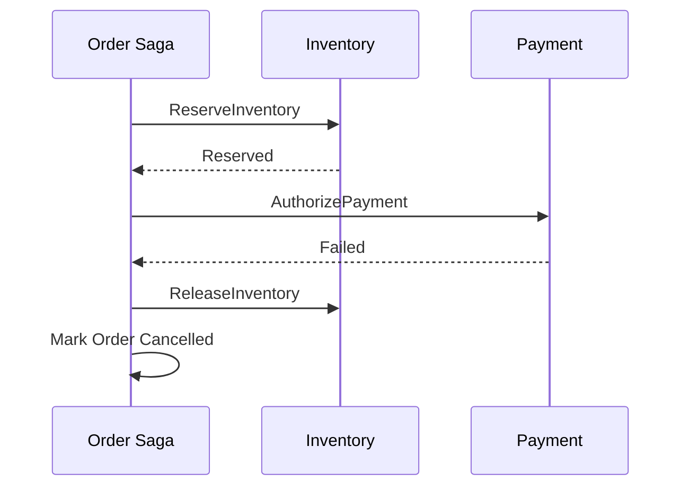

# Daily Knowledge Sharing — 2026-09-11

## Today’s Topics

1. .NET GC generations + Large Object Heap: hiểu allocation pressure trước khi tối ưu memory bằng cảm giác
2. ASP.NET Core Forwarded Headers: giữ đúng scheme, host và client IP khi chạy sau reverse proxy mà không mở trust boundary quá rộng
3. EF Core connection resiliency + `ExecutionStrategy`: retry transient failure mà không phá transaction semantics
4. Database connection pool exhaustion: vì sao query nhanh vẫn có thể làm API treo khi connection lifecycle sai
5. MongoDB embedding vs referencing: thiết kế document theo access pattern thay vì mô phỏng relational schema
6. Saga Pattern + compensating transaction: xử lý business workflow nhiều service mà không giả vờ có distributed ACID transaction
7. Azure Front Door vs Application Gateway: chọn global edge ingress và regional Layer 7 routing đúng boundary
8. Expand-contract database migration: thay đổi schema mà nhiều application version vẫn chạy an toàn trong rollout
9. Optimizely CMS content type evolution: thay model nội dung mà không phá dữ liệu editor và deployment production
10. AI-assisted coding với verification pipeline: dùng coding agent để tăng tốc nhưng không giao correctness cho model

---

# 1. .NET GC generations + Large Object Heap: hiểu allocation pressure trước khi tối ưu memory bằng cảm giác

## 1. What is it?

.NET Garbage Collector quản lý managed memory theo các generation để tối ưu giả định rằng phần lớn object sống rất ngắn. Object mới thường vào Gen 0; object sống qua collection có thể được promote lên Gen 1 rồi Gen 2. Các object lớn, thường từ khoảng 85 KB trở lên, thường đi vào Large Object Heap (LOH).

Mental model quan trọng là: **GC cost không chỉ phụ thuộc vào tổng memory đang dùng, mà phụ thuộc tốc độ allocation, tuổi thọ object, promotion và kích thước heap cần scan/compact**.

## 2. Why does it exist?

Nếu GC scan toàn bộ managed heap mỗi lần cần reclaim memory, chi phí sẽ quá cao. Generational GC khai thác observation thực tế rằng nhiều object tạm thời như request DTO, strings, arrays và intermediate collections chết rất sớm.

LOH tồn tại vì move/compact object rất lớn tốn CPU và copy cost đáng kể. Nhưng đổi lại, allocation pattern xấu trên LOH có thể tạo memory pressure và fragmentation.

## 3. How does it work?

Một request có thể tạo hàng nghìn object nhỏ:

```text
Request
  -> allocate DTO/string/list
  -> Gen 0
  -> request hoàn tất
  -> Gen 0 collection reclaim phần lớn object
```

Nếu application giữ reference lâu hơn:

```text
Gen 0 -> Gen 1 -> Gen 2
```

Nếu tạo buffer lớn:

```text
byte[200_000] -> LOH
```

Gen 2 collection thường đắt hơn vì phải xem xét vùng heap lâu sống hơn. Khi allocation rate cao, GC có thể chạy thường xuyên; khi object sống quá lâu, heap lớn dần và Gen 2 pause trở nên đáng kể.

## 4. Practical implementation

Đừng tối ưu trước khi đo. Với .NET có thể bắt đầu bằng:

```bash
dotnet-counters monitor --process-id <PID> System.Runtime
```

Theo dõi các signal như allocation rate, Gen 0/1/2 GC count, heap size và time in GC.

Ví dụ code tạo allocation không cần thiết:

```csharp
public string BuildCsv(IEnumerable<Order> orders)
{
    var lines = orders.Select(x => $"{x.Id},{x.Total},{x.CreatedAt:O}");
    return string.Join(Environment.NewLine, lines);
}
```

Nếu đây là hot path với dataset lớn, streaming qua `StreamWriter` có thể tránh giữ toàn bộ output trong memory:

```csharp
public async Task WriteCsvAsync(
    IEnumerable<Order> orders,
    Stream output,
    CancellationToken ct)
{
    await using var writer = new StreamWriter(output, leaveOpen: true);

    foreach (var order in orders)
    {
        ct.ThrowIfCancellationRequested();
        await writer.WriteLineAsync(
            $"{order.Id},{order.Total},{order.CreatedAt:O}");
    }
}
```

## 5. Real production scenario

Một API export dữ liệu tạo `byte[]` lớn cho mỗi request rồi trả file. Khi 100 user export đồng thời, LOH tăng nhanh. CPU không nhất thiết chạm 100%, nhưng Gen 2 collections tăng, pause dài hơn và memory peak làm container bị OOMKill.

Nếu chuyển sang streaming response, allocation peak giảm đáng kể vì không cần giữ toàn bộ file trong RAM.

## 6. Failure scenario & troubleshooting

**Symptom** → p95/p99 latency tăng theo traffic, memory tăng saw-tooth mạnh, đôi lúc process restart.

**Evidence** → allocation rate cao, LOH size lớn, Gen 2 collections tăng, trace cho thấy nhiều array/string allocation từ một hot path.

**Hypothesis** → allocation pressure hoặc long-lived object retention.

**Diagnosis** → dùng `dotnet-counters`, `dotnet-gcdump`, profiler và heap dump để xác định allocation type và reference chain.

**Fix** → giảm allocation thực sự nóng, stream large payload, tránh materialize collection không cần thiết, dùng pooling khi measurement chứng minh có lợi.

**Verification** → chạy cùng load profile và so allocation/sec, heap size, GC pause, p95/p99 latency trước/sau.

## 7. Common mistakes

- Thấy memory cao rồi kết luận có memory leak mà chưa xem heap có ổn định sau GC hay không.
- Dùng `ArrayPool<T>` ở mọi nơi rồi tạo lifetime bug.
- Cache object lâu dài khiến chúng bị promote Gen 2 nhưng không đánh giá memory budget.
- Tạo JSON/string/file buffer lớn trong memory vì implementation đơn giản.
- Chỉ nhìn average latency mà bỏ qua pause ở tail latency.

## 8. Alternatives

Với object nhỏ và path không nóng, allocation bình thường thường là lựa chọn đúng. Pooling, `Span<T>`, `Memory<T>` hay custom buffer chỉ nên dùng khi profiling cho thấy allocation thật sự là bottleneck.

Streaming là alternative tự nhiên cho large payload vì giảm peak memory mà không tăng object-lifetime complexity quá nhiều.

## 9. Trade-offs

### Advantages

Hiểu GC giúp tối ưu dựa trên mechanism thay vì micro-optimization. Streaming và allocation reduction có thể giảm memory footprint và tail latency.

### Costs / Risks

Low-allocation code thường khó đọc hơn, pooling tăng lifetime complexity và có thể giữ buffer lớn lâu hơn cần thiết. Tối ưu sai chỗ làm code phức tạp mà không cải thiện production.

## 10. Junior → Middle → Senior → Technical Lead

### Junior

Hiểu managed memory vẫn có cost; GC không có nghĩa memory là miễn phí.

### Middle

Biết nhận diện allocation-heavy path, dùng runtime counters và tránh materialize large payload không cần thiết.

### Senior

Phân tích Gen 2/LOH behavior, heap dump, object retention và liên hệ GC pause với p95/p99 latency.

### Technical Lead / Architect

Quyết định memory budget, streaming boundary, caching policy và mức complexity tối ưu hóa mà team có thể duy trì.

## 11. Key takeaway

- GC tối ưu cho short-lived objects nhưng allocation rate cao vẫn tạo cost.
- LOH pressure thường xuất hiện trong large buffers, serialization và file handling.
- Đo allocation/GC trước khi đưa pooling hoặc low-level optimization vào codebase.

---

# 2. ASP.NET Core Forwarded Headers: giữ đúng scheme, host và client IP khi chạy sau reverse proxy mà không mở trust boundary quá rộng

## 1. What is it?

Khi ASP.NET Core chạy sau Nginx, IIS, Azure Front Door, Application Gateway hoặc một load balancer, connection mà application thấy thường đến từ proxy chứ không phải client thật. Proxy truyền thông tin gốc qua các header như `X-Forwarded-For` và `X-Forwarded-Proto`.

Forwarded Headers Middleware cho phép ASP.NET Core reconstruct một phần request context ban đầu.

## 2. Why does it exist?

Nếu application không hiểu reverse proxy boundary, nó có thể nghĩ request HTTPS là HTTP, sinh redirect sai, tạo callback URL sai hoặc ghi log toàn bộ request với cùng proxy IP.

Nhưng nếu application tin mọi forwarded header từ Internet, attacker có thể spoof client IP hoặc scheme. Vì vậy vấn đề không chỉ là “đọc header”, mà là **xác định proxy nào được tin**.

## 3. How does it work?

```text
Client HTTPS
   |
   v
Reverse Proxy
   | HTTP nội bộ + X-Forwarded-Proto: https
   | X-Forwarded-For: client-ip
   v
ASP.NET Core
```

Middleware đọc các header chỉ trong phạm vi proxy/network được cấu hình tin cậy rồi cập nhật `Request.Scheme`, `RemoteIpAddress` và các field liên quan.

## 4. Practical implementation

```csharp
builder.Services.Configure<ForwardedHeadersOptions>(options =>
{
    options.ForwardedHeaders =
        ForwardedHeaders.XForwardedFor |
        ForwardedHeaders.XForwardedProto;

    options.KnownProxies.Add(IPAddress.Parse("10.0.1.10"));
});

var app = builder.Build();

app.UseForwardedHeaders();
app.UseHttpsRedirection();
app.UseAuthentication();
app.UseAuthorization();
```

Ordering quan trọng: forwarded headers phải được xử lý trước middleware phụ thuộc scheme/client IP.

## 5. Real production scenario

Ứng dụng login bằng OpenID Connect chạy sau Application Gateway. Proxy terminate TLS rồi forward HTTP vào App Service. Nếu application nghĩ request là HTTP, callback URL có thể trở thành `http://.../signin-oidc`, không match redirect URI đã đăng ký ở identity provider.

Cùng lúc, security logging ghi IP của proxy thay vì client, làm incident investigation kém giá trị.

## 6. Failure scenario & troubleshooting

**Symptom** → redirect loop, OAuth callback mismatch, generated URL dùng `http`, rate limiting theo IP hoạt động sai.

**Evidence** → raw proxy headers đúng nhưng `Request.Scheme` hoặc `RemoteIpAddress` trong app không đúng.

**Hypothesis** → middleware thiếu, sai ordering hoặc trust configuration không match proxy topology.

**Diagnosis** → log có kiểm soát raw/normalized request metadata, kiểm tra proxy chain và network path.

**Fix** → cấu hình known proxy/network chính xác và đặt middleware đúng thứ tự.

**Verification** → test trực tiếp qua production-like proxy; forged header từ untrusted path không được application tin.

## 7. Common mistakes

- `KnownNetworks.Clear()` và `KnownProxies.Clear()` rồi tin mọi source chỉ để “cho chạy”.
- Dùng `X-Forwarded-For` trực tiếp làm security decision.
- Đặt `UseForwardedHeaders()` sau `UseHttpsRedirection()`.
- Không tính đến nhiều proxy hop.
- Ghi log client IP nhưng không ghi proxy/request correlation nên khó audit đường đi.

## 8. Alternatives

Một số managed hosting tích hợp proxy metadata sẵn ở tầng platform, nhưng application vẫn cần hiểu trust boundary. Có thể dùng standardized `Forwarded` header nếu toàn bộ stack hỗ trợ nhất quán.

## 9. Trade-offs

### Advantages

Application có đúng scheme/client context, redirect và telemetry chính xác hơn khi chạy sau proxy.

### Costs / Risks

Trust configuration sai có thể trở thành security vulnerability. Multi-proxy topology làm debugging phức tạp hơn.

## 10. Junior → Middle → Senior → Technical Lead

### Junior

Hiểu application thường không nói chuyện trực tiếp với client trong production.

### Middle

Cấu hình middleware đúng và debug scheme/IP mismatch.

### Senior

Threat-model spoofed forwarded headers, multi-hop proxy và impact tới auth/rate limiting/logging.

### Technical Lead / Architect

Xác định ingress topology, nơi terminate TLS, proxy nào được tin và metadata nào được phép dùng cho security decision.

## 11. Key takeaway

- Forwarded headers là một trust-boundary problem, không chỉ configuration problem.
- Middleware ordering ảnh hưởng trực tiếp tới redirect/auth behavior.
- Không tin client-supplied forwarding metadata nếu chưa xác minh proxy chain.

---

# 3. EF Core connection resiliency + `ExecutionStrategy`: retry transient failure mà không phá transaction semantics

## 1. What is it?

EF Core connection resiliency cho phép retry một số transient database failure như network glitch hoặc failover. Với SQL Server, `EnableRetryOnFailure()` cấu hình execution strategy có thể chạy lại database operation.

Điểm quan trọng: **retry một query đơn lẻ khác hoàn toàn retry một transaction có nhiều bước**.

## 2. Why does it exist?

Cloud database có thể failover, connection reset hoặc transient timeout. Nếu mọi transient failure đều lập tức trả 500, availability kém. Nhưng retry mù quáng có thể duplicate side effect hoặc replay một phần workflow sai semantics.

## 3. How does it work?

```csharp
builder.Services.AddDbContext<AppDbContext>(options =>
    options.UseSqlServer(connectionString, sql =>
        sql.EnableRetryOnFailure(
            maxRetryCount: 5,
            maxRetryDelay: TimeSpan.FromSeconds(10),
            errorNumbersToAdd: null)));
```

Khi dùng explicit transaction, toàn bộ transaction unit cần được execution strategy execute như một replayable unit:

```csharp
var strategy = db.Database.CreateExecutionStrategy();

await strategy.ExecuteAsync(async () =>
{
    await using var transaction = await db.Database.BeginTransactionAsync(ct);

    db.Orders.Add(order);
    await db.SaveChangesAsync(ct);

    db.AuditLogs.Add(audit);
    await db.SaveChangesAsync(ct);

    await transaction.CommitAsync(ct);
});
```

## 4. Practical implementation

Nếu transaction còn gọi external API, không nên đơn giản đặt call đó bên trong retry block:

```csharp
await strategy.ExecuteAsync(async () =>
{
    // Database-only replayable work ở đây.
});
```

Remote side effect nên được tách bằng Outbox/idempotency hoặc workflow boundary rõ ràng. Nếu payment API được gọi trong block retry, transient DB error sau payment success có thể khiến payment bị gọi lần hai.

## 5. Real production scenario

Azure SQL failover trong lúc API tạo order. Insert order thành công ở server nhưng connection drop trước khi client nhận acknowledgment. Application không biết commit đã thành công hay chưa.

Đây là **ambiguous commit**. Retry có thể gặp duplicate key nếu business ID unique, hoặc tệ hơn tạo duplicate order nếu ID được sinh mới mỗi lần.

## 6. Failure scenario & troubleshooting

**Symptom** → thỉnh thoảng duplicate operation, unique-key violation hoặc retry storm trong lúc database degrade.

**Evidence** → dependency telemetry có transient SQL errors, nhiều attempt cùng correlation ID.

**Hypothesis** → retry boundary không idempotent hoặc max retry quá aggressive.

**Diagnosis** → xem execution strategy logs, transaction scope và side effect nào nằm trong retry block.

**Fix** → dùng stable business identifier, idempotent operation, Outbox và retry budget có giới hạn.

**Verification** → fault injection connection reset/failover và xác nhận state cuối cùng chỉ xuất hiện một lần theo business semantics.

## 7. Common mistakes

- Nghĩ `EnableRetryOnFailure()` tự làm mọi transaction an toàn.
- Retry cả external API call cùng database transaction.
- Retry timeout dài mà không có tổng request deadline.
- Không phân biệt transient failure với constraint/business error.
- Không có unique business key để reconcile ambiguous commit.

## 8. Alternatives

Một số workflow chấp nhận fail-fast và retry ở message level thay vì request level. Với command quan trọng, queue + idempotent consumer thường tạo recovery model rõ hơn.

## 9. Trade-offs

### Advantages

Giảm impact của transient database failure và cải thiện availability trong cloud environment.

### Costs / Risks

Retry tăng latency, load và complexity; operation không idempotent có thể trở nên nguy hiểm hơn chính failure ban đầu.

## 10. Junior → Middle → Senior → Technical Lead

### Junior

Hiểu transient error khác permanent error.

### Middle

Biết cấu hình retry và dùng execution strategy với explicit transaction.

### Senior

Phân tích ambiguous commit, idempotency và interaction giữa retry budget với request timeout.

### Technical Lead / Architect

Quyết định retry nằm ở layer nào, operation nào replayable và workflow nào nên chuyển sang asynchronous recovery.

## 11. Key takeaway

- Retry phải bao quanh một unit có thể replay an toàn.
- Database transaction không bảo vệ external side effect.
- Ambiguous commit cần stable identifier và reconciliation strategy.

---

# 4. Database connection pool exhaustion: vì sao query nhanh vẫn có thể làm API treo khi connection lifecycle sai

## 1. What is it?

ADO.NET connection pooling giữ lại physical database connections để tái sử dụng. `SqlConnection.Open()` thường không tạo TCP connection mới; nó mượn một connection từ pool tương ứng với connection string.

Pool exhaustion xảy ra khi mọi connection đang bị giữ và request mới phải chờ connection được trả lại.

## 2. Why does it exist?

Mở database connection mới rất đắt: TCP/TLS/login/session setup. Pooling giảm overhead. Nhưng capacity của database không vô hạn, nên pool cũng hoạt động như một resource boundary.

Query có thể chỉ chạy 20 ms nhưng transaction giữ connection 30 giây vì code chờ external API. Khi concurrency tăng, pool vẫn cạn.

## 3. How does it work?

```text
Request 1 -> rent connection -> query -> return
Request 2 -> rent connection -> query -> return
...
Pool full + all rented
Request N -> wait for available connection
```

EF Core `DbContext` thường mở connection khi cần rồi đóng sau operation, trừ khi transaction/explicit connection giữ nó lâu hơn.

## 4. Practical implementation

Không nên giữ transaction qua remote call:

```csharp
await using var tx = await db.Database.BeginTransactionAsync(ct);

await db.SaveChangesAsync(ct);
await paymentClient.AuthorizeAsync(request, ct); // giữ DB transaction lâu
await tx.CommitAsync(ct);
```

Tốt hơn là thiết kế boundary để database transaction ngắn:

```csharp
await db.SaveChangesAsync(ct);
// remote workflow được điều phối bằng state machine/outbox/idempotency
```

Nếu dùng raw ADO.NET:

```csharp
await using var connection = new SqlConnection(connectionString);
await connection.OpenAsync(ct);
// use briefly
```

`await using`/`using` đảm bảo connection được return pool khi scope kết thúc.

## 5. Real production scenario

API employee timesheet bình thường chạy tốt. Sau release, một transaction mới bao gồm cả gọi approval service. Khi approval service latency tăng từ 100 ms lên 8 giây, mỗi request giữ SQL connection 8 giây. Pool cạn và cả endpoint không liên quan cũng timeout vì dùng cùng pool.

## 6. Failure scenario & troubleshooting

**Symptom** → request chờ lâu trước query; SQL server CPU thấp; lỗi timeout khi obtaining connection.

**Evidence** → active DB sessions chạm giới hạn application pool, request traces có khoảng trống trước dependency SQL.

**Hypothesis** → connection leak hoặc transaction lifetime quá dài.

**Diagnosis** → đo pool counters/telemetry, inspect open transaction, stack traces và connection lifetime.

**Fix** → rút ngắn transaction, dispose đúng, giới hạn concurrency và tách slow external work khỏi connection-held scope.

**Verification** → load test với downstream latency injection; pool usage phải recover ổn định.

## 7. Common mistakes

- Tăng `Max Pool Size` ngay mà không tìm lý do connection bị giữ lâu.
- Nhầm query execution time với connection lifetime.
- Tạo nhiều connection string tương đương nhưng khác text, vô tình tạo nhiều pool.
- Không dispose command/reader/connection đúng cách ở raw ADO.NET.
- Giữ transaction xuyên qua network call.

## 8. Alternatives

Tăng pool size có thể hợp lý nếu database thực sự chịu được concurrency cao hơn và workload đã được đo. Queue/bounded concurrency phù hợp hơn nếu downstream database cần bảo vệ khỏi burst.

## 9. Trade-offs

### Advantages

Pooling giảm connection setup cost và tăng throughput đáng kể.

### Costs / Risks

Pool che giấu physical connection lifecycle; cấu hình quá lớn có thể chuyển bottleneck từ app sang database, tạo nhiều concurrent query hơn mức DB chịu được.

## 10. Junior → Middle → Senior → Technical Lead

### Junior

Hiểu connection là resource cần trả lại, không phải object “nhẹ” vô hạn.

### Middle

Biết dùng `using`, transaction scope ngắn và đọc dependency timing.

### Senior

Phân biệt pool exhaustion, DB saturation và slow query; liên hệ connection lifetime với downstream latency.

### Technical Lead / Architect

Đặt concurrency budget giữa application và database, quyết định pool size theo capacity thay vì mặc định tăng giới hạn.

## 11. Key takeaway

- Query nhanh không đảm bảo connection được giữ ngắn.
- Pool exhaustion thường là symptom của lifecycle/concurrency problem.
- Tăng pool size chỉ đúng khi database capacity và workload chứng minh điều đó.

---

# 5. MongoDB embedding vs referencing: thiết kế document theo access pattern thay vì mô phỏng relational schema

## 1. What is it?

Embedding lưu dữ liệu liên quan trong cùng document. Referencing lưu identifier trỏ sang document khác.

MongoDB modeling không nên bắt đầu bằng câu hỏi “entity relation là one-to-many hay many-to-many” mà nên bắt đầu bằng: **application đọc/ghi dữ liệu này theo access pattern nào, kích thước và lifecycle ra sao?**

## 2. Why does it exist?

Document database tối ưu cho việc lấy một aggregate dữ liệu liên quan trong một read. Nếu model giống relational database rồi join thủ công mọi nơi, ta mất nhiều lợi ích của document model.

Ngược lại, embed dữ liệu tăng vô hạn có thể tạo document khổng lồ, write amplification và contention.

## 3. How does it work?

Embedding:

```json
{
  "_id": "order-123",
  "customerId": "c1",
  "items": [
    { "sku": "A", "qty": 2, "unitPrice": 10.5 }
  ]
}
```

Reference:

```json
{
  "_id": "review-1",
  "productId": "p1",
  "rating": 5
}
```

Order lines thường có lifecycle gắn chặt với order và cần snapshot price tại thời điểm mua nên embedding hợp lý. Product reviews có thể tăng rất lớn và query độc lập nên reference/separate collection thường tốt hơn.

## 4. Practical implementation

Với C# MongoDB Driver:

```csharp
public sealed record OrderDocument(
    string Id,
    string CustomerId,
    IReadOnlyList<OrderItemDocument> Items,
    DateTimeOffset CreatedAt);

public sealed record OrderItemDocument(
    string Sku,
    int Quantity,
    decimal UnitPrice);
```

Index phải theo actual query:

```csharp
await orders.Indexes.CreateOneAsync(
    new CreateIndexModel<OrderDocument>(
        Builders<OrderDocument>.IndexKeys
            .Ascending(x => x.CustomerId)
            .Descending(x => x.CreatedAt)));
```

## 5. Real production scenario

Automotive marketplace có vehicle listing với 20–30 static attributes và một lịch sử hàng nghìn price-change events. Embed attributes vào listing hợp lý vì đọc cùng nhau. Embed toàn bộ event history vào cùng document làm mỗi update ngày càng nặng và document tăng không giới hạn.

Tách history sang collection riêng giữ listing document nhỏ và read path chính nhanh hơn.

## 6. Failure scenario & troubleshooting

**Symptom** → update latency tăng dần theo tuổi document, network payload lớn, write conflict/size issue.

**Evidence** → average document size tăng, read trả nhiều field không dùng, profiler cho thấy large payload.

**Hypothesis** → over-embedding hoặc access pattern thay đổi.

**Diagnosis** → map query frequency, field co-access, cardinality và growth rate.

**Fix** → tách unbounded child collection, denormalize snapshot cần đọc nhanh và index theo query mới.

**Verification** → benchmark payload size, read/write latency và document growth theo realistic dataset.

## 7. Common mistakes

- Chuyển từng SQL table thành một MongoDB collection rồi “join” ở application.
- Embed collection tăng vô hạn.
- Reference mọi thứ vì sợ duplicate data.
- Không chấp nhận denormalization dù consistency requirement cho phép.
- Thiết kế schema trước khi biết top query/access pattern.

## 8. Alternatives

Relational database phù hợp hơn nếu workload cần nhiều ad-hoc joins, complex transactions và relational constraints. Cosmos DB cũng là document model nhưng partition key/RU economics làm modeling có thêm dimension về distribution.

## 9. Trade-offs

### Advantages

Embedding giảm round trip và có thể giữ aggregate data atomic trong một document.

### Costs / Risks

Duplicate data, document growth và write amplification. Referencing giảm duplication nhưng tăng query/round-trip complexity.

## 10. Junior → Middle → Senior → Technical Lead

### Junior

Hiểu document không phải “table viết bằng JSON”.

### Middle

Model theo common read/write path và tạo index tương ứng.

### Senior

Đánh giá growth, atomicity, duplication, consistency và migration cost.

### Technical Lead / Architect

Quyết định khi nào document database thực sự phù hợp và ownership boundary nào đáng denormalize.

## 11. Key takeaway

- Embed theo lifecycle + access pattern, không theo cảm tính.
- Unbounded child collection là tín hiệu mạnh để cân nhắc reference.
- Schema flexibility không loại bỏ nhu cầu thiết kế schema.

---

# 6. Saga Pattern + compensating transaction: xử lý business workflow nhiều service mà không giả vờ có distributed ACID transaction

## 1. What is it?

Saga chia một business workflow dài thành nhiều local transaction. Khi bước sau thất bại, hệ thống chạy compensating action cho các bước trước nếu business cho phép.

Ví dụ:

```text
Create Order
 -> Reserve Inventory
 -> Authorize Payment
 -> Confirm Order
```

Nếu payment fail, compensation có thể release inventory và cancel order.

## 2. Why does it exist?

Microservices thường sở hữu database riêng. Không có một ACID transaction đơn giản bao phủ Order DB, Inventory DB và Payment provider. Cố giữ distributed lock hoặc 2PC qua network làm availability và operational complexity tăng mạnh.

Saga chấp nhận eventual consistency và encode recovery vào business workflow.

## 3. How does it work?

Orchestration style:



Mỗi step phải idempotent vì message có thể duplicate. Saga state phải durable để process restart vẫn tiếp tục recovery.

## 4. Practical implementation

Một saga state đơn giản:

```csharp
public sealed class OrderSagaState
{
    public Guid OrderId { get; init; }
    public SagaStatus Status { get; set; }
    public bool InventoryReserved { get; set; }
    public bool PaymentAuthorized { get; set; }
}
```

Handler không nên dựa vào in-memory state. Sau mỗi transition, persist state trước khi phát command tiếp theo, thường kết hợp Outbox để tránh state/message dual-write gap.

## 5. Real production scenario

E-commerce order reserve inventory thành công nhưng payment provider timeout. Timeout không chứng minh payment fail; nó có thể đã authorize nhưng response mất.

Saga phải có trạng thái `PaymentUnknown` hoặc reconciliation path thay vì lập tức charge lại hoặc release inventory một cách mù quáng.

## 6. Failure scenario & troubleshooting

**Symptom** → order stuck `Processing`, inventory giữ mãi hoặc user bị charge nhưng order cancelled.

**Evidence** → saga state không advance, message retry nhiều, payment provider có transaction nhưng local state không biết.

**Hypothesis** → ambiguous external result hoặc missing compensation.

**Diagnosis** → correlate saga ID, message IDs, outbox/inbox và provider transaction reference.

**Fix** → explicit intermediate states, reconciliation job/API, idempotent command và compensation policy.

**Verification** → fault injection ở từng transition, restart orchestrator và duplicate message; state cuối phải đúng business rule.

## 7. Common mistakes

- Gọi mọi rollback là compensation; nhiều real-world action không thể “undo” thật sự.
- Không persist saga state.
- Không có timeout/reconciliation cho step chờ vô hạn.
- Compensation không idempotent.
- Chia microservice quá nhỏ khiến workflow nào cũng trở thành saga phức tạp.

## 8. Alternatives

Modular Monolith với một database transaction có thể đơn giản hơn nếu service boundaries chưa cần independent deployment/scale. Với workflow chỉ có một database và một broker, Outbox có thể đủ mà không cần full Saga.

## 9. Trade-offs

### Advantages

Cho phép workflow phân tán phục hồi có chủ đích mà không phụ thuộc distributed transaction.

### Costs / Risks

Tăng state-machine complexity, eventual consistency, observability requirement và business handling cho partial completion.

## 10. Junior → Middle → Senior → Technical Lead

### Junior

Hiểu distributed workflow có thể ở trạng thái trung gian hợp lệ.

### Middle

Implement state transition, idempotency và compensation handler.

### Senior

Thiết kế ambiguous-state recovery, timeout, ordering và reconciliation.

### Technical Lead / Architect

Quyết định service boundary có đáng trả giá Saga hay một transaction trong Modular Monolith đơn giản hơn.

## 11. Key takeaway

- Saga quản lý partial failure, không biến distributed system thành ACID.
- Compensation là business action, không phải database rollback.
- Nếu workflow quá phức tạp, hãy xem lại service boundary trước khi thêm framework.

---

# 7. Azure Front Door vs Application Gateway: chọn global edge ingress và regional Layer 7 routing đúng boundary

## 1. What is it?

Azure Front Door là global Layer 7 entry point hoạt động ở Microsoft edge, phù hợp global routing, acceleration, CDN/WAF và failover giữa regions.

Application Gateway là regional Layer 7 load balancer/reverse proxy trong Azure region/VNet, phù hợp routing tới regional workloads và private networking patterns.

## 2. Why does it exist?

Một global SaaS có hai bài toán khác nhau:

1. User trên Internet cần được đưa tới region phù hợp và edge gần họ.
2. Trong region, traffic cần route tới backend pool/private services theo host/path và network topology.

Dùng một service để giải cả hai mà không hiểu scope dễ tạo architecture đắt và khó vận hành.

## 3. How does it work?

```text
Global user
   |
   v
Azure Front Door (global edge)
   |
   +--> Region A ingress
   |
   +--> Region B ingress

Region A
   |
   v
Application Gateway
   |
   +--> App Service / AKS / VM backend
```

Không phải hệ thống nào cũng cần cả hai.

## 4. Practical implementation

Một quyết định đơn giản:

```text
Single-region public App Service
-> Front Door có thể đủ nếu cần WAF/global edge/CDN behavior.

Private regional AKS with complex path routing
-> Application Gateway có thể phù hợp.

Multi-region private backends
-> Front Door + regional ingress có thể hợp lý.
```

Trong application, vẫn cần health endpoint và forwarded-header handling đúng để upstream routing hoạt động chính xác.

## 5. Real production scenario

Marketing/e-commerce site phục vụ EU và APAC. Front Door route user tới healthy region gần nhất. Mỗi region có Application Gateway route `/api/*` tới backend API và `/cms/*` tới CMS cluster private.

Nếu APAC region fail health check, Front Door có thể chuyển traffic sang EU, nhưng database/data residency/latency phải được architecture xử lý riêng.

## 6. Failure scenario & troubleshooting

**Symptom** → Front Door trả 502 dù backend pod vẫn healthy.

**Evidence** → edge health probe fail, Application Gateway backend health unhealthy hoặc TLS hostname mismatch.

**Hypothesis** → health path, certificate/SNI, DNS hoặc private network route sai.

**Diagnosis** → đi theo từng hop: Front Door health -> regional ingress health -> backend health -> application logs.

**Fix** → sửa probe/host header/certificate/network boundary tương ứng.

**Verification** → synthetic test từ nhiều region và failover drill có chủ đích.

## 7. Common mistakes

- Dùng cả Front Door và Application Gateway chỉ vì “enterprise architecture hay có”.
- Không phân biệt global vs regional responsibility.
- Health probe quá nặng, phụ thuộc database rồi tạo false unhealthy.
- Quên origin security, cho phép bypass Front Door gọi backend trực tiếp.
- Không tính egress/cost và operational complexity.

## 8. Alternatives

Azure Load Balancer phù hợp Layer 4. Nginx/Ingress Controller có thể xử lý regional HTTP routing trong AKS. Một single-region App Service nhỏ có thể không cần dedicated gateway nào ngoài platform ingress.

## 9. Trade-offs

### Advantages

Front Door cải thiện global routing/failover/edge security; Application Gateway cung cấp regional routing và network integration mạnh.

### Costs / Risks

Thêm hop, cost, TLS/probe/DNS configuration và nhiều control plane cần monitor.

## 10. Junior → Middle → Senior → Technical Lead

### Junior

Hiểu global ingress và regional ingress là hai scope khác nhau.

### Middle

Debug health probe, routing và forwarded headers qua nhiều hop.

### Senior

Thiết kế origin protection, failover behavior, private networking và observability end-to-end.

### Technical Lead / Architect

Quyết định service nào thật sự cần thiết dựa trên regions, security, latency, VNet và cost thay vì diagram aesthetics.

## 11. Key takeaway

- Front Door giải global edge problem; Application Gateway giải regional Layer 7 ingress problem.
- Không mặc định cần cả hai.
- Multi-hop ingress chỉ đáng giá khi requirement về global routing/security/networking thực sự tồn tại.

---

# 8. Expand-contract database migration: thay đổi schema mà nhiều application version vẫn chạy an toàn trong rollout

## 1. What is it?

Expand-contract là chiến lược thay schema theo nhiều bước tương thích ngược.

Thay vì rename/drop column ngay lập tức:

1. **Expand**: thêm schema mới nhưng giữ schema cũ.
2. Deploy application có thể đọc/ghi theo cách tương thích.
3. Migrate/backfill dữ liệu.
4. Chuyển traffic hoàn toàn sang version mới.
5. **Contract**: xóa schema cũ sau khi không còn consumer.

## 2. Why does it exist?

Trong rolling/blue-green/canary deployment, version cũ và mới có thể chạy đồng thời. Migration phá tương thích như rename/drop column có thể làm version cũ crash ngay khi database được migrate.

Database thường là shared state nên rollback application không tự rollback schema an toàn.

## 3. How does it work?

Ví dụ cần rename `FullName` thành `DisplayName`.

Không nên:

```sql
EXEC sp_rename 'Users.FullName', 'DisplayName', 'COLUMN';
```

Ngay lập tức.

Expand:

```sql
ALTER TABLE Users ADD DisplayName nvarchar(200) NULL;
```

Application transition có thể dual-read/dual-write trong thời gian ngắn. Sau backfill và rollout hoàn tất, contract:

```sql
ALTER TABLE Users DROP COLUMN FullName;
```

## 4. Practical implementation

EF Core migration đầu tiên chỉ additive:

```csharp
migrationBuilder.AddColumn<string>(
    name: "DisplayName",
    table: "Users",
    type: "nvarchar(200)",
    nullable: true);
```

Backfill lớn nên chạy theo batch thay vì một transaction khổng lồ:

```sql
UPDATE TOP (5000) Users
SET DisplayName = FullName
WHERE DisplayName IS NULL;
```

Lặp lại có monitoring cho tới khi complete.

## 5. Real production scenario

SaaS có 20 App Service instances rolling deployment. Nếu migration drop column trước khi instance cũ drain hết, một số request vào old version trả 500 trong deployment window.

Expand-contract cho phép old/new version cùng hoạt động trong giai đoạn chuyển tiếp.

## 6. Failure scenario & troubleshooting

**Symptom** → deployment mới healthy nhưng random request 500 chỉ trong rollout.

**Evidence** → error đến từ instance version cũ truy vấn column đã bị đổi/xóa.

**Hypothesis** → schema migration không backward compatible.

**Diagnosis** → map application versions đang chạy với database schema version.

**Fix** → restore compatibility hoặc rollback schema có kiểm soát; về lâu dài dùng expand-contract gate trong release process.

**Verification** → test old + new version đồng thời trên migrated schema trước production rollout.

## 7. Common mistakes

- Gộp add, backfill và drop vào một migration deployment.
- Backfill toàn bảng trong một transaction làm lock/log tăng mạnh.
- Assume deploy atomic trong khi platform rolling instance theo thời gian.
- Không có telemetry cho phần dữ liệu đã backfill.
- Xóa old column ngay sau deploy mà chưa xác nhận mọi consumer đã migrate.

## 8. Alternatives

Maintenance window có thể đơn giản hơn cho internal system nhỏ với downtime chấp nhận được. Feature flag và compatibility view đôi khi giúp migration phức tạp hơn.

## 9. Trade-offs

### Advantages

Giảm deployment coupling, hỗ trợ rollback application và zero/low-downtime releases.

### Costs / Risks

Tạm thời có duplicate schema/logic, dual-write complexity và cleanup discipline.

## 10. Junior → Middle → Senior → Technical Lead

### Junior

Hiểu database schema và application version có thể không đổi cùng một thời điểm.

### Middle

Viết additive migration và backward-compatible code.

### Senior

Thiết kế backfill, dual-read/write, lock impact và rollback plan.

### Technical Lead / Architect

Đưa compatibility window thành release contract và xác định khi nào maintenance window đơn giản hơn zero-downtime complexity.

## 11. Key takeaway

- Zero-downtime deployment đòi hỏi schema backward compatibility.
- Add -> migrate -> switch -> remove an toàn hơn destructive migration một bước.
- Rollback application chỉ khả thi khi database vẫn hiểu version cũ.

---

# 9. Optimizely CMS content type evolution: thay model nội dung mà không phá dữ liệu editor và deployment production

## 1. What is it?

Trong Optimizely CMS, code-defined content types và properties trở thành contract giữa application code, persisted CMS metadata và editor content đã tồn tại.

Đổi tên/xóa property không đơn thuần là refactor class C#. Nó có thể là data migration và editorial compatibility change.

## 2. Why does it exist?

CMS khác DTO thuần túy vì content có tuổi thọ dài hơn release code. Editor có thể đã tạo hàng nghìn pages/blocks dựa trên model cũ. Một rename thiếu migration có thể làm content “biến mất” khỏi editor hoặc rendering.

## 3. How does it work?

```text
C# Content Type
   |
   v
CMS type metadata
   |
   v
Persisted content values
   |
   v
Rendering / API delivery
```

Khi code thay đổi, CMS synchronization phải map thay đổi đó với existing metadata. Stable GUID/type identity quan trọng để CMS biết đây là cùng một type được evolve chứ không phải type hoàn toàn mới.

## 4. Practical implementation

Ví dụ content type:

```csharp
[ContentType(
    DisplayName = "Campaign Page",
    GUID = "8d73fa46-3cb1-4a3c-8674-2d47f8e1442e")]
public class CampaignPage : PageData
{
    [Display(Name = "Heading", Order = 10)]
    public virtual string? Heading { get; set; }
}
```

Nếu cần thay semantics của `Heading`, đừng vội xóa property cũ. Có thể thêm property mới, migrate content, update render path rồi cleanup ở release sau.

## 5. Real production scenario

Marketing team có 5.000 campaign pages. Developer rename `HeroTitle` thành `Heading` bằng cách xóa property cũ và thêm property mới. Code compile và deployment thành công, nhưng production pages mất hero title vì persisted values vẫn gắn với old property definition.

Một staged migration giữ cả hai field tạm thời sẽ an toàn hơn.

## 6. Failure scenario & troubleshooting

**Symptom** → content vẫn tồn tại nhưng field trống sau deployment, hoặc editor UI khác production trước đó.

**Evidence** → CMS metadata/property definition thay đổi; old values vẫn hiện trong export/database nhưng model mới không đọc.

**Hypothesis** → breaking content-model evolution.

**Diagnosis** → so sánh type/property metadata giữa releases, kiểm tra migration logs và sample existing content.

**Fix** → restore compatible property identity, chạy migration có kiểm soát và cập nhật renderer sau khi data chuyển hoàn tất.

**Verification** → regression test với snapshot production-like content, không chỉ content mới tạo.

## 7. Common mistakes

- Coi property rename như IDE refactor bình thường.
- Thay GUID của content type khi chỉ muốn đổi tên hiển thị.
- Test chỉ bằng page mới, không test existing content.
- Xóa field cũ cùng release với code bắt đầu dùng field mới.
- Không coordinate migration với editor workflow và rollback plan.

## 8. Alternatives

Headless CMS khác có schema migration workflow riêng nhưng cùng principle: persisted content schema là public contract. Với field chỉ đổi label editor, thay display metadata có thể đủ mà không thay persisted identity.

## 9. Trade-offs

### Advantages

Staged content evolution bảo vệ dữ liệu editor và giảm production surprise.

### Costs / Risks

Tạm thời model có legacy fields, migration tooling và cleanup release; code nhìn kém “sạch” trong transition period.

## 10. Junior → Middle → Senior → Technical Lead

### Junior

Hiểu CMS model class đại diện cho persisted content contract, không chỉ runtime object.

### Middle

Biết thêm field tương thích, test existing content và giữ stable content type identity.

### Senior

Thiết kế migration/rollback, assess editorial impact và cache/search reindex implications.

### Technical Lead / Architect

Đặt versioning/migration discipline cho CMS model và quyết định khi nào breaking change cần staged rollout hoặc content freeze.

## 11. Key takeaway

- CMS schema evolution là data migration problem.
- Existing content quan trọng hơn việc code mới compile.
- Add/migrate/remove theo nhiều release thường an toàn hơn rename/drop trực tiếp.

---

# 10. AI-assisted coding với verification pipeline: dùng coding agent để tăng tốc nhưng không giao correctness cho model

## 1. What is it?

AI coding assistant/agent có thể đọc repository, tạo code, refactor, viết test và đề xuất migration. Nhưng model sinh output theo xác suất; nó có thể dùng API không tồn tại, version sai, hiểu nhầm invariant hoặc viết test chỉ chứng minh chính implementation sai của nó.

Mental model đúng: **AI là code producer không đáng tin cậy tuyệt đối, còn repository toolchain là verification authority**.

## 2. Why does it exist?

AI giúp giảm chi phí search, boilerplate và repository navigation. Tuy nhiên tốc độ generation cao làm review burden tăng: một agent có thể tạo hàng trăm dòng code nhanh hơn con người kiểm tra từng assumption.

Vì vậy workflow cần chuyển trọng tâm từ “AI có vẻ đúng” sang “evidence nào chứng minh change đúng?”.

## 3. How does it work?

```text
Requirement
   |
   v
AI proposes change
   |
   v
Build / static analysis
   |
   v
Unit + integration tests
   |
   v
Security / migration checks
   |
   v
Human review of behavior + trade-offs
   |
   v
Merge
```

Model có thể hỗ trợ từng bước nhưng không được tự xác nhận correctness chỉ bằng chính explanation của nó.

## 4. Practical implementation

Ví dụ repository .NET tối thiểu:

```bash
dotnet restore
dotnet build --no-restore
dotnet test --no-build
```

Có thể thêm formatting/static analysis, dependency audit và targeted integration tests.

Khi agent thêm package, review exact package/version trong `.csproj` thay vì tin package name từ model. Khi agent thay EF migration, inspect generated SQL hoặc migration behavior trên database test.

## 5. Real production scenario

Agent refactor authentication code và test suite vẫn xanh vì tests mock `IAuthorizationService`. Nhưng production requirement phụ thuộc policy configuration thực tế; agent đã bỏ một claim check khi “simplify”.

Integration test chạy real authorization pipeline mới bắt được regression. Đây là ví dụ test boundary quan trọng hơn số lượng test generated.

## 6. Failure scenario & troubleshooting

**Symptom** → code compile nhưng production behavior sai hoặc dependency API không tương thích environment.

**Evidence** → generated change dựa trên assumption không có trong repository, tests chỉ mock path chính.

**Hypothesis** → insufficient grounding/verification.

**Diagnosis** → trace requirement -> code diff -> tests -> runtime contract; tìm assumption nào chưa được evidence bảo vệ.

**Fix** → thêm source-grounded check, integration test hoặc manual review ở boundary rủi ro cao.

**Verification** → rerun deterministic toolchain và regression scenario độc lập với generated implementation.

## 7. Common mistakes

- Merge vì agent nói “all tests pass” mà không chạy tool thực tế.
- Cho agent tự thêm package/version không kiểm tra compatibility.
- Dùng generated unit tests chỉ mirror implementation.
- Để agent quyết định security/financial invariant từ prompt mơ hồ.
- Đánh giá productivity bằng số dòng code generated thay vì lead time + defect rate.

## 8. Alternatives

Với change nhỏ và well-understood, manual coding có thể nhanh hơn prompt/agent overhead. Với large mechanical migration, agent rất hữu ích nếu có strong compiler/test safety net.

## 9. Trade-offs

### Advantages

Tăng tốc repository discovery, repetitive refactor, test scaffolding và documentation.

### Costs / Risks

Review volume tăng, false confidence, hallucinated APIs và architecture drift nếu model không grounded vào repository/requirements.

## 10. Junior → Middle → Senior → Technical Lead

### Junior

Học dùng AI như pair programmer nhưng luôn chạy build/test và đọc code sinh ra.

### Middle

Viết prompt có context, giới hạn scope change và tự xác minh package/API behavior.

### Senior

Thiết kế test boundary để phát hiện assumption sai, review security/performance/migration impact.

### Technical Lead / Architect

Xây policy cho agent access, approval, CI evidence và loại change nào được phép tự động hóa; tối ưu hệ thống delivery thay vì tối đa code generation.

## 11. Key takeaway

- AI output là proposal, không phải evidence.
- Compiler, tests, static analysis và production-like verification tạo trust.
- Càng tự động generate nhanh, verification pipeline càng phải mạnh và độc lập với model.
