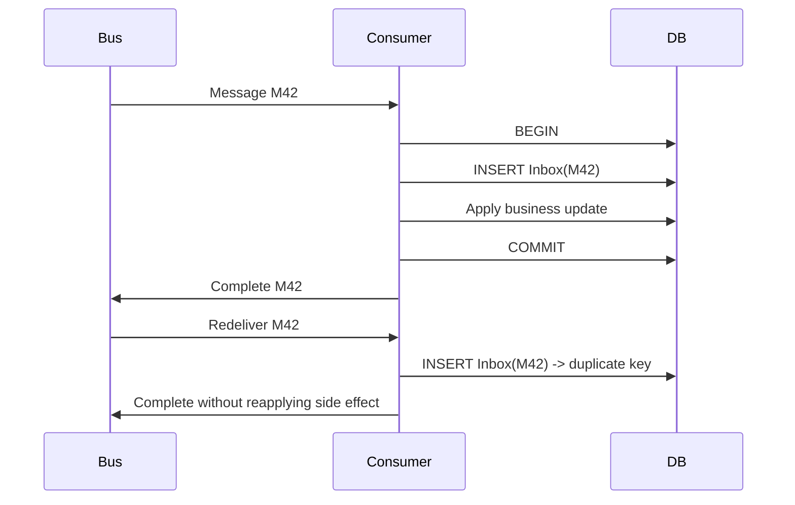

# Daily Knowledge Sharing — 2026-09-11

## Today’s Topics

1. C# event handler memory leak: vì sao subscriber sống lâu có thể giữ object không còn dùng và cách quản lý lifetime đúng
2. ASP.NET Core Output Caching vs browser/CDN caching: cache ở đúng layer thay vì gom mọi thứ thành “cache response”
3. EF Core `DbContext` pooling: giảm allocation nhưng có thể làm rò mutable per-request state nếu dùng sai
4. SQL deadlock graph + consistent lock ordering: debug deadlock bằng bằng chứng thay vì tăng timeout
5. Cosmos DB consistency levels + session token: chọn freshness và latency theo business semantics
6. Inbox Pattern + idempotent consumer: xử lý duplicate delivery mà không biến retry thành duplicate side effect
7. Azure Private Endpoint + DNS: private connectivity không chỉ là “bật private link”
8. Kubernetes resource requests/limits: tránh CPU throttling, OOMKilled và autoscaling sai tín hiệu
9. Integration testing với real infrastructure: khi mock database/message broker làm test nhanh nhưng sai thế giới Production
10. CDN cache key design: query string, cookie và header có thể phá hit ratio hoặc trả nhầm nội dung giữa users

---

# 1. C# event handler memory leak: vì sao subscriber sống lâu có thể giữ object không còn dùng và cách quản lý lifetime đúng

## 1. What is it?

Trong C#, event được xây trên delegate. Khi một object subscribe vào event của object khác, publisher giữ reference tới delegate, và delegate thường giữ reference tới instance subscriber.

Mental model:

```text
Long-lived publisher
        |
        v
   event delegate
        |
        v
 short-lived subscriber
```

Nếu publisher sống lâu hơn subscriber và subscriber không unsubscribe, Garbage Collector vẫn thấy subscriber reachable qua publisher. Object “không còn dùng” theo business flow nhưng vẫn chưa garbage collected.

Đây là một dạng memory retention bug, thường bị gọi là memory leak dù memory vẫn nằm trong managed heap và GC hoạt động đúng theo reachability rules.

## 2. Why does it exist?

Event giúp tách publisher khỏi subscriber: publisher không cần biết ai đang lắng nghe. Nhưng abstraction này đổi ownership problem thành lifetime problem.

Nếu subscriber sống bằng hoặc lâu hơn publisher, gần như không có vấn đề. Nhưng UI component, request-scoped object, temporary worker hay plugin thường có lifetime ngắn hơn singleton/event aggregator.

Không hiểu ownership khiến code trông hoàn toàn hợp lệ nhưng heap tăng dần sau nhiều lần subscribe/unsubscribe lifecycle.

## 3. How does it work?

Ví dụ:

```csharp
public sealed class PriceFeed
{
    public event EventHandler<PriceChangedEventArgs>? PriceChanged;

    public void Publish(decimal price)
        => PriceChanged?.Invoke(this, new PriceChangedEventArgs(price));
}

public sealed class ProductViewModel
{
    private readonly PriceFeed _feed;

    public ProductViewModel(PriceFeed feed)
    {
        _feed = feed;
        _feed.PriceChanged += OnPriceChanged;
    }

    private void OnPriceChanged(object? sender, PriceChangedEventArgs e)
    {
        // update state
    }
}
```

Invocation list của `PriceChanged` chứa delegate trỏ tới `ProductViewModel.OnPriceChanged`. Delegate đó giữ target instance `ProductViewModel`.

Nếu `PriceFeed` là singleton và nhiều `ProductViewModel` được tạo rồi bỏ đi, những instance cũ vẫn reachable qua event invocation list.

## 4. Practical implementation

Một cách rõ ràng là unsubscribe theo lifetime boundary:

```csharp
public sealed class ProductViewModel : IDisposable
{
    private readonly PriceFeed _feed;
    private bool _disposed;

    public ProductViewModel(PriceFeed feed)
    {
        _feed = feed;
        _feed.PriceChanged += OnPriceChanged;
    }

    private void OnPriceChanged(object? sender, PriceChangedEventArgs e)
    {
        // handle update
    }

    public void Dispose()
    {
        if (_disposed) return;

        _feed.PriceChanged -= OnPriceChanged;
        _disposed = true;
    }
}
```

Nếu lifecycle do DI container quản lý, phải đảm bảo container thật sự dispose instance. Nếu object do application tự `new`, application phải sở hữu cleanup.

Trong một số framework/UI stack có weak-event pattern, nhưng không nên dùng weak reference như cách mặc định để né lifetime ownership không rõ ràng.

## 5. Real production scenario

Một desktop admin tool mở/đóng màn hình “live orders” nhiều lần. `OrderFeed` là singleton service giữ WebSocket connection, mỗi màn hình subscribe vào event.

Sau vài giờ, memory tăng từ 300 MB lên 1.5 GB. Người dùng đóng màn hình nhưng GC không thu hồi ViewModel cũ vì singleton feed vẫn giữ event handlers.

Heap dump cho thấy hàng nghìn `OrderViewModel` instances, retained path:

```text
GC Root
 -> SingletonServiceProvider
 -> OrderFeed
 -> OrderChanged delegate
 -> OrderViewModel
```

## 6. Failure scenario & troubleshooting

**Symptom** → managed heap tăng theo số lần một workflow được mở/đóng; memory không giảm đáng kể sau Gen 2 collections.

**Evidence** → heap dump có nhiều instance lẽ ra đã chết; retained-path analysis trỏ về event delegate.

**Hypothesis** → long-lived publisher đang giữ short-lived subscribers.

**Diagnosis** → dùng `dotnet-gcdump`, `dotnet-dump`, Visual Studio Diagnostic Tools hoặc memory profiler; so instance count trước/sau repeated lifecycle.

**Fix** → thiết lập explicit unsubscribe/disposal boundary; tránh anonymous lambda khó unsubscribe nếu không giữ delegate reference.

**Verification** → chạy lại lifecycle hàng trăm lần, force diagnostic GC trong test environment và xác nhận instance count ổn định.

## 7. Common mistakes

- Nghĩ GC sẽ tự hiểu object “không còn hữu ích”. GC chỉ hiểu reachability.
- Subscribe bằng lambda rồi không giữ reference để unsubscribe.
- Dùng singleton event bus cho mọi interaction mà không có subscription lifetime.
- Implement `IDisposable` nhưng caller không bao giờ dispose.
- Chuyển sang weak event ngay lập tức thay vì làm rõ ownership.

## 8. Alternatives

`IObservable<T>` / Reactive Streams có thể biểu diễn subscription lifecycle rõ hơn nếu application đã dùng reactive model.

`Channel<T>` phù hợp với producer/consumer work queue hơn event callback.

Mediator/event bus vẫn có thể dùng, nhưng phải có subscription ownership và scope rõ ràng.

Nếu publisher và subscriber có cùng lifetime ngắn, event thông thường thường là đủ.

## 9. Trade-offs

### Advantages

Events đơn giản, idiomatic và giúp decouple publisher/subscriber trong cùng process.

### Costs / Risks

Lifetime coupling bị ẩn. Debugging memory retention khó hơn compile-time dependency. Unsubscribe logic thêm cleanup path và có thể tạo race nếu event đang phát đồng thời.

## 10. Junior → Middle → Senior → Technical Lead

### Junior

Hiểu rằng event subscription tạo reference từ publisher tới subscriber.

### Middle

Biết unsubscribe theo lifecycle, dùng `IDisposable` đúng ownership và tránh lambda không thể remove.

### Senior

Đọc retained paths trong heap dump, phân biệt allocation pressure với retention leak, đánh giá thread-safety khi unsubscribe.

### Technical Lead / Architect

Quyết định event model nào phù hợp, lifetime boundary nằm ở đâu và có cần event aggregator/reactive abstraction hay event C# đơn giản đã đủ.

## 11. Key takeaway

- GC không thu object nếu publisher vẫn giữ reference qua delegate.
- Event lifetime phải được thiết kế giống resource lifetime.
- Heap dump + retained path tốt hơn việc đoán “GC có vấn đề”.

---

# 2. ASP.NET Core Output Caching vs browser/CDN caching: cache ở đúng layer thay vì gom mọi thứ thành “cache response”

## 1. What is it?

ASP.NET Core Output Caching lưu response đã tạo ở phía server để request tương đương sau đó không phải chạy toàn bộ endpoint pipeline/application logic.

Nó khác browser cache và CDN cache:

```text
Browser cache -> nằm ở client
CDN cache     -> nằm ở edge
Output cache  -> nằm ở application/server side
```

Ba layer có thể cùng tồn tại, nhưng semantics về privacy, variation và invalidation khác nhau.

## 2. Why does it exist?

Có endpoint public tạo response đắt: query database, compose CMS content, serialize JSON lớn. Dù browser/CDN không cache được hoặc cache miss, application có thể tránh recompute bằng Output Cache.

Ngược lại, nếu content hoàn toàn public và cacheable ở CDN, dùng Output Cache làm layer duy nhất có thể bỏ lỡ lợi ích giảm network latency và origin traffic.

## 3. How does it work?

ASP.NET Core Output Caching đặt middleware trước endpoint execution. Policy quyết định request có thể lookup/store response hay không và cache key vary theo route/query/header phù hợp.

```csharp
builder.Services.AddOutputCache(options =>
{
    options.AddPolicy("catalog", policy =>
        policy
            .Expire(TimeSpan.FromSeconds(30))
            .SetVaryByQuery("category", "page"));
});

app.UseOutputCache();

app.MapGet("/catalog", GetCatalog)
   .CacheOutput("catalog");
```

Flow:

```text
Request
 -> Output Cache lookup
 -> hit: return cached response
 -> miss: execute endpoint
 -> build response
 -> store response
 -> return
```

Browser/CDN caching lại dựa nhiều vào HTTP headers như `Cache-Control`, `ETag`, `Vary`.

## 4. Practical implementation

Public endpoint có thể kết hợp origin output cache và downstream caching:

```csharp
app.MapGet("/api/products/{id:int}", async (
    int id,
    ProductDbContext db,
    HttpContext http,
    CancellationToken ct) =>
{
    var product = await db.Products
        .AsNoTracking()
        .Where(x => x.Id == id)
        .Select(x => new ProductDto(x.Id, x.Name, x.Price))
        .SingleOrDefaultAsync(ct);

    if (product is null)
        return Results.NotFound();

    http.Response.GetTypedHeaders().CacheControl =
        new Microsoft.Net.Http.Headers.CacheControlHeaderValue
        {
            Public = true,
            MaxAge = TimeSpan.FromSeconds(30)
        };

    return Results.Ok(product);
})
.CacheOutput(policy => policy.Expire(TimeSpan.FromSeconds(30)));
```

Nếu response phụ thuộc authenticated user, không nên vô thức biến nó thành shared public cache.

## 5. Real production scenario

Trang category e-commerce nhận hàng nghìn request/phút. Data thay đổi vài lần mỗi phút, nhưng mỗi request hiện tại query SQL và CMS.

Akamai đã cache static assets nhưng API JSON không cache do team sợ stale data. Kết quả origin chịu load cao.

Một policy hợp lý có thể là:

- Output Cache 10–20 giây để bảo vệ application/database.
- CDN cache 10 giây cho public catalog.
- Purge/tag invalidation khi có critical publish event.

Business chấp nhận freshness vài giây để đổi lấy latency và resilience tốt hơn.

## 6. Failure scenario & troubleshooting

**Symptom** → user A thấy data của user B, hoặc content thay đổi nhưng response cũ tồn tại lâu hơn TTL mong đợi.

**Evidence** → cache headers/key không vary theo user/tenant/locale; traces cho thấy endpoint không chạy dù request context khác.

**Hypothesis** → cache key thiếu dimension hoặc shared cache dùng cho private data.

**Diagnosis** → inspect response headers, vary policy, CDN cache key configuration và application cache metrics.

**Fix** → không cache shared content cá nhân hóa; thêm variation cần thiết; tách public/private endpoints; thiết kế invalidation owner.

**Verification** → test nhiều users/tenants/locales và kiểm tra cache hit/miss độc lập.

## 7. Common mistakes

- Gọi mọi response caching mechanism là “Redis cache”.
- Cache response authenticated theo URL nhưng không vary theo identity/tenant.
- Vary theo quá nhiều headers làm hit ratio gần bằng 0.
- Đặt TTL dài nhưng không có invalidation cho content nhạy freshness.
- Thêm Output Cache dù CDN đã giải quyết đủ, tạo thêm layer khó debug.

## 8. Alternatives

Data caching với Redis cache object/data trước khi render response.

CDN caching giảm cả origin traffic và geographic latency.

Browser caching giúp client không gửi request lại.

Nếu endpoint rẻ và traffic thấp, không cache có thể là phương án tốt nhất.

## 9. Trade-offs

### Advantages

Giảm CPU, serialization, DB round trips và dependency pressure; cải thiện latency khi cache hit.

### Costs / Risks

Stale data, invalidation complexity, privacy risk và nhiều layer cache khiến troubleshooting khó hơn.

## 10. Junior → Middle → Senior → Technical Lead

### Junior

Phân biệt browser/CDN/output/data cache.

### Middle

Configure policy, TTL, vary key và test cache behavior.

### Senior

Đánh giá freshness, privacy, stampede, invalidation và hit-ratio telemetry.

### Technical Lead / Architect

Quyết định layer nào nên cache, ai sở hữu invalidation và khi nào không nên thêm thêm một cache layer.

## 11. Key takeaway

- Cache layer khác nhau giải quyết latency/load ở boundary khác nhau.
- Cache key là correctness contract, không chỉ performance setting.
- Shared cache cho personalized data có thể trở thành security bug.

---

# 3. EF Core `DbContext` pooling: giảm allocation nhưng có thể làm rò mutable per-request state nếu dùng sai

## 1. What is it?

`AddDbContextPool<TContext>` cho phép EF Core tái sử dụng `DbContext` instances thay vì tạo instance mới hoàn toàn cho mỗi scope.

Điểm dễ hiểu sai: pooling `DbContext` không đồng nghĩa pooling database connection. Connection pooling thuộc ADO.NET provider; DbContext pooling là reuse object/context-level infrastructure.

## 2. Why does it exist?

Tạo `DbContext` thường không quá đắt, nhưng với high-throughput workload, setup metadata/internal services và allocation có thể trở thành overhead đo được.

Pooling giảm allocation và initialization cost. Tuy nhiên nó chỉ đáng dùng khi profiling cho thấy `DbContext` creation là meaningful cost.

## 3. How does it work?

```csharp
builder.Services.AddDbContextPool<AppDbContext>(options =>
    options.UseSqlServer(connectionString));
```

Lifecycle logic:

```text
Request A
 -> rent context #7
 -> use
 -> EF resets internal state
 -> return pool

Request B
 -> rent context #7 again
```

EF reset nhiều internal state, nhưng application-specific mutable fields bạn thêm vào context không tự nhiên được hiểu semantic để reset đúng.

## 4. Practical implementation

Sai pattern:

```csharp
public sealed class AppDbContext : DbContext
{
    public Guid TenantId { get; set; }

    public IQueryable<Order> TenantOrders =>
        Orders.Where(x => x.TenantId == TenantId);
}
```

Nếu `TenantId` được set per request trên pooled context mà không quản lý reset chắc chắn, context tái sử dụng có thể mang state từ request trước.

An toàn hơn là đưa tenant identity qua scoped service hoặc factory có boundary rõ, và global query filter phải được thiết kế sao cho không cache nhầm state tại model-building time.

Ví dụ application service truyền tenant vào query:

```csharp
public async Task<List<OrderDto>> GetOrdersAsync(
    Guid tenantId,
    CancellationToken ct)
{
    return await _db.Orders
        .AsNoTracking()
        .Where(x => x.TenantId == tenantId)
        .Select(x => new OrderDto(x.Id, x.Total))
        .ToListAsync(ct);
}
```

## 5. Real production scenario

Một SaaS multi-tenant bật `AddDbContextPool` để giảm allocation. Team lưu `CurrentTenantId` trong field của context và set sau resolve.

Dưới load test concurrency cao, một số request hiếm trả data tenant trước. Bug khó reproduce local vì cần đúng reuse timing.

Đây là ví dụ điển hình performance optimization làm thay đổi lifetime assumptions.

## 6. Failure scenario & troubleshooting

**Symptom** → intermittent cross-tenant filtering sai hoặc query filter behavior không ổn định sau khi bật pooling.

**Evidence** → cùng context instance hash/code xuất hiện qua nhiều scopes; application field có giá trị cũ.

**Hypothesis** → mutable per-request state sống lâu hơn request qua pooled context.

**Diagnosis** → tắt pooling để A/B compare; log tenant + context identity trong test environment; review custom fields/interceptors/state.

**Fix** → remove mutable request state khỏi pooled context hoặc dùng factory pattern được thiết kế cho multi-tenancy.

**Verification** → concurrency test nhiều tenants, property-based isolation test và security regression test.

## 7. Common mistakes

- Nghĩ pooling luôn tăng performance đáng kể.
- Nhầm DbContext pool với SQL connection pool.
- Gắn user/tenant/request data vào context instance.
- Dùng long-lived DbContext vì “đằng nào cũng pooled”.
- Bật optimization trước khi benchmark.

## 8. Alternatives

`AddDbContext` scoped thông thường đơn giản và an toàn hơn trong phần lớn application.

`IDbContextFactory<T>` hữu ích cho background/concurrent scenarios nơi scope không map tự nhiên tới một context lifetime.

Nếu bottleneck nằm ở SQL, network hoặc serialization, DbContext pooling có thể không tạo khác biệt đáng kể.

## 9. Trade-offs

### Advantages

Giảm initialization/allocation overhead trong high-throughput workloads.

### Costs / Risks

Tăng lifetime complexity, đặc biệt với tenant/user mutable state; performance gain có thể nhỏ so với complexity.

## 10. Junior → Middle → Senior → Technical Lead

### Junior

Hiểu DbContext vẫn phải có unit-of-work lifetime ngắn.

### Middle

Biết cấu hình pooling và viết query không phụ thuộc hidden mutable state.

### Senior

Benchmark trước/sau, phát hiện state leakage và hiểu separation giữa DbContext pooling với connection pooling.

### Technical Lead / Architect

Quyết định optimization này có đáng hay không và đặt guardrails cho multi-tenant/security-sensitive application.

## 11. Key takeaway

- DbContext pooling là object reuse optimization, không phải connection pooling.
- Mutable per-request state trên pooled context là rủi ro correctness/security.
- Chỉ bật khi measurement chứng minh benefit đáng kể.

---

# 4. SQL deadlock graph + consistent lock ordering: debug deadlock bằng bằng chứng thay vì tăng timeout

## 1. What is it?

Deadlock xảy ra khi hai hoặc nhiều transactions giữ lock mà transaction kia cần, tạo cycle không thể tự tiến tiếp.

Ví dụ:

```text
Tx A giữ Order #1 -> chờ Customer #5
Tx B giữ Customer #5 -> chờ Order #1
```

Database engine phát hiện cycle và chọn một transaction làm deadlock victim để rollback.

Deadlock khác blocking. Blocking có thể tự giải phóng khi transaction trước hoàn tất; deadlock là cycle cần engine phá.

## 2. Why does it exist?

Concurrency cho phép nhiều transactions chạy song song. Lock đảm bảo isolation/correctness nhưng khi resource được lấy theo thứ tự khác nhau, cycle có thể hình thành.

Tăng timeout không giải quyết deadlock vì cycle không tự biến mất theo cách blocking thông thường.

## 3. How does it work?

Transaction A:

```sql
BEGIN TRANSACTION;

UPDATE Orders
SET Status = 'Approved'
WHERE Id = 10;

UPDATE Customers
SET LastActivityAt = SYSUTCDATETIME()
WHERE Id = 5;
```

Transaction B:

```sql
BEGIN TRANSACTION;

UPDATE Customers
SET CreditScore = 700
WHERE Id = 5;

UPDATE Orders
SET ReviewedAt = SYSUTCDATETIME()
WHERE Id = 10;
```

Nếu A lock Order trước, B lock Customer trước, rồi cả hai yêu cầu resource còn lại, cycle xuất hiện.

SQL Server deadlock graph cho biết processes, resources, lock mode và victim.

## 4. Practical implementation

Một mitigation mạnh là consistent lock ordering: mọi code path update Customer rồi Order, hoặc ngược lại, nhưng phải thống nhất.

Ngoài ra transaction nên ngắn:

```csharp
await using var tx = await db.Database.BeginTransactionAsync(ct);

var customer = await db.Customers
    .SingleAsync(x => x.Id == customerId, ct);

var order = await db.Orders
    .SingleAsync(x => x.Id == orderId, ct);

customer.LastActivityAt = clock.UtcNow;
order.Status = OrderStatus.Approved;

await db.SaveChangesAsync(ct);
await tx.CommitAsync(ct);
```

Không gọi remote API bên trong transaction nếu không thật sự cần, vì giữ locks lâu hơn trong khi chờ network.

## 5. Real production scenario

Approval workflow có hai paths:

- Web API approve request: update Approval -> Employee.
- Background sync: update Employee -> Approval.

Traffic bình thường ít lỗi. Cuối tháng, concurrency cao và deadlock tăng đột biến. Team ban đầu tăng command timeout từ 30 lên 120 giây nhưng lỗi vẫn xảy ra.

Deadlock graph cho thấy lock order ngược nhau. Sửa access order + rút ngắn transaction làm incident biến mất.

## 6. Failure scenario & troubleshooting

**Symptom** → database trả deadlock victim error ngẫu nhiên dưới concurrency.

**Evidence** → deadlock graph/Extended Events cho thấy cycle chính xác.

**Hypothesis** → hai code paths acquire locks khác thứ tự hoặc scan quá rộng giữ nhiều locks.

**Diagnosis** → map query/resource trong graph về application code; kiểm tra execution plan vì missing/selectivity issue có thể khiến lock footprint lớn.

**Fix** → consistent ordering, transaction ngắn, index/access pattern tốt hơn; thêm retry có giới hạn cho deadlock victim nếu operation idempotent/safe.

**Verification** → concurrency load test và theo dõi deadlock event rate.

## 7. Common mistakes

- Tăng timeout để “fix deadlock”.
- Retry vô hạn không jitter/backoff.
- Chỉ nhìn SQL text mà bỏ qua execution plan và lock footprint.
- Giữ transaction mở trong lúc gọi HTTP hoặc xử lý file.
- Cho rằng snapshot isolation tự động chữa mọi deadlock.

## 8. Alternatives

Optimistic concurrency tránh một số lock duration nhưng giải quyết bài toán khác.

Snapshot-based isolation có thể giảm reader/writer blocking nhưng writer-writer conflicts vẫn tồn tại.

Queue serialization theo business key có thể phù hợp với hot aggregate cực kỳ contention-heavy, nhưng tăng latency/complexity.

## 9. Trade-offs

### Advantages

Locking đảm bảo isolation mạnh và consistency trực tiếp trong database.

### Costs / Risks

Concurrency cao + transaction rộng làm tăng contention, blocking và deadlock probability.

## 10. Junior → Middle → Senior → Technical Lead

### Junior

Phân biệt blocking với deadlock.

### Middle

Biết lấy deadlock graph, map queries và giữ transaction ngắn.

### Senior

Phân tích lock order, execution plan, retry safety và isolation-level interaction.

### Technical Lead / Architect

Thiết kế transaction boundary, ownership và concurrency model sao cho database không phải giải quyết business coordination mơ hồ.

## 11. Key takeaway

- Deadlock là cycle, không phải đơn giản “query chậm”.
- Deadlock graph là nguồn bằng chứng chính.
- Consistent lock order và transaction ngắn thường mạnh hơn việc tăng timeout.

---

# 5. Cosmos DB consistency levels + session token: chọn freshness và latency theo business semantics

## 1. What is it?

Cosmos DB cung cấp nhiều consistency levels để cân bằng freshness, availability và latency: Strong, Bounded Staleness, Session, Consistent Prefix và Eventual.

Trong nhiều application, Session consistency là lựa chọn thực dụng vì cùng một logical session có read-your-writes behavior mà không yêu cầu global strong consistency.

## 2. Why does it exist?

Distributed database replicate data qua nhiều nodes/regions. Nếu mọi read phải chờ tất cả replicas đồng thuận, latency và availability bị ảnh hưởng. Nếu read từ replica bất kỳ, response có thể stale.

Consistency level định nghĩa contract về thứ tự/freshness mà client có thể kỳ vọng.

## 3. How does it work?

Với Session consistency, response write/read có thể mang session token đại diện cho replication progress. Client SDK quản lý token để subsequent reads trong cùng session không “đi lùi” so với write đã quan sát.

Mental model:

```text
Client writes item
 -> Region A accepts
 -> replication progresses
 -> client gets session token T42

Next read with T42
 -> SDK yêu cầu replica ít nhất đạt T42
 -> read-your-writes trong session
```

Nếu request chuyển qua một stateless backend nhưng session token không được propagate phù hợp, semantics user quan sát có thể khác kỳ vọng.

## 4. Practical implementation

Thông thường Cosmos SDK quản lý session token trong `CosmosClient`, vì vậy nên reuse singleton `CosmosClient` thay vì tạo mới per request.

```csharp
builder.Services.AddSingleton(sp =>
{
    var configuration = sp.GetRequiredService<IConfiguration>();
    return new CosmosClient(
        configuration["Cosmos:ConnectionString"],
        new CosmosClientOptions
        {
            ConsistencyLevel = ConsistencyLevel.Session
        });
});
```

Với multi-tier flows đặc biệt, có thể cần capture/forward session token từ response metadata thay vì giả định mọi request chia sẻ cùng SDK state.

## 5. Real production scenario

User cập nhật profile rồi ngay lập tức chuyển sang trang summary. Write đi vào region gần user, read tiếp theo có thể route tới replica khác.

Nếu application chấp nhận Eventual consistency hoàn toàn, user có thể thấy dữ liệu cũ vài giây và nghĩ update thất bại.

Session consistency cung cấp read-your-writes cho trải nghiệm này mà không bắt toàn bộ global workload dùng Strong consistency.

## 6. Failure scenario & troubleshooting

**Symptom** → sau update thành công, request kế tiếp đôi khi đọc giá trị cũ.

**Evidence** → write status thành công, nhưng read từ region/replica chưa catch up; session token không được preserve theo path mong đợi.

**Hypothesis** → consistency contract thấp hơn UX requirement hoặc token lifecycle bị phá.

**Diagnosis** → inspect SDK diagnostics, region routing, consistency setting và client lifetime.

**Fix** → reuse client đúng cách, chọn Session/Strong nơi cần, hoặc thiết kế UI chấp nhận eventual state rõ ràng.

**Verification** → test read-immediately-after-write qua region failover/network scenarios.

## 7. Common mistakes

- Nghĩ “NoSQL = eventual consistency”.
- Chọn Strong cho mọi workload vì “an toàn hơn” mà không đo latency/cost.
- Tạo `CosmosClient` per request.
- Không phân biệt user-facing freshness requirement với backend analytics tolerance.
- Không quan sát RU/latency implications của query và consistency choices.

## 8. Alternatives

SQL Server/PostgreSQL primary database phù hợp khi relational transaction/invariant mạnh là trọng tâm.

MongoDB cũng có read/write concern knobs nhưng semantics khác.

Nếu requirement chỉ là read-your-writes trong một workflow nhỏ, application-side state hoặc direct read-from-write region có thể đủ tùy architecture.

## 9. Trade-offs

### Advantages

Consistency tunable giúp business chọn đúng balance thay vì một contract duy nhất cho mọi dữ liệu.

### Costs / Risks

Consistency mạnh hơn thường tăng coordination/latency hoặc giảm flexibility. Consistency yếu hơn chuyển complexity sang application UX/business logic.

## 10. Junior → Middle → Senior → Technical Lead

### Junior

Hiểu distributed replicas có thể không cập nhật cùng lúc.

### Middle

Biết Session consistency, singleton client và đọc diagnostics cơ bản.

### Senior

Map consistency level tới UX/invariant, hiểu region failover và session-token semantics.

### Technical Lead / Architect

Quyết định dữ liệu nào thật sự cần Strong semantics, dữ liệu nào chấp nhận stale và cost/availability trade-off ra sao.

## 11. Key takeaway

- Consistency là business contract, không chỉ database setting.
- Session consistency thường phù hợp read-your-writes mà không cần global Strong.
- Client/session lifecycle ảnh hưởng trực tiếp behavior người dùng quan sát.

---

# 6. Inbox Pattern + idempotent consumer: xử lý duplicate delivery mà không biến retry thành duplicate side effect

## 1. What is it?

Inbox Pattern lưu message identifier đã xử lý ở phía consumer để cùng message nếu được delivery lại sẽ không thực hiện business side effect lần hai.

Nó bổ sung cho Outbox Pattern:

```text
Producer DB + Outbox
      -> Broker
      -> Consumer Inbox + Business State
```

Outbox giảm nguy cơ mất event khi publish. Inbox giảm nguy cơ duplicate side effect khi broker redelivery.

## 2. Why does it exist?

Nhiều message brokers, bao gồm Azure Service Bus trong các delivery semantics phổ biến, vận hành theo at-least-once. Nếu consumer xử lý xong nhưng crash trước khi ack/complete, broker có thể giao lại cùng message.

Không có idempotency, một `OrderPaid` event có thể gửi email hai lần, cộng điểm hai lần hoặc tạo shipment hai lần.

## 3. How does it work?



Điểm chính là Inbox record và business mutation nên nằm cùng local transaction nếu cùng database.

## 4. Practical implementation

```csharp
public async Task HandleAsync(OrderPaid message, CancellationToken ct)
{
    await using var tx = await _db.Database.BeginTransactionAsync(ct);

    var alreadyProcessed = await _db.InboxMessages
        .AnyAsync(x => x.MessageId == message.MessageId, ct);

    if (alreadyProcessed)
    {
        await tx.CommitAsync(ct);
        return;
    }

    _db.InboxMessages.Add(new InboxMessage
    {
        MessageId = message.MessageId,
        ProcessedAtUtc = DateTimeOffset.UtcNow
    });

    var order = await _db.Orders.SingleAsync(x => x.Id == message.OrderId, ct);
    order.MarkPaid();

    await _db.SaveChangesAsync(ct);
    await tx.CommitAsync(ct);
}
```

Database phải có unique constraint trên `MessageId`; chỉ `AnyAsync` không đủ chống race giữa concurrent deliveries.

## 5. Real production scenario

Payment service publish `PaymentCaptured`. Fulfillment consumer cập nhật order và tạo shipment.

Consumer commit DB thành công nhưng process restart trước `CompleteMessageAsync`. Service Bus redeliver event. Không có Inbox, shipment thứ hai được tạo.

Với unique Inbox record và transaction atomic, redelivery trở thành no-op về business side effect.

## 6. Failure scenario & troubleshooting

**Symptom** → duplicate emails/shipments/ledger entries sau broker retry hoặc consumer restart.

**Evidence** → cùng `MessageId` xuất hiện nhiều delivery attempts.

**Hypothesis** → consumer giả định exactly-once delivery.

**Diagnosis** → correlate broker delivery count, message ID và database writes.

**Fix** → stable message identity, unique Inbox constraint, atomic business mutation + Inbox write.

**Verification** → fault injection: crash consumer sau DB commit trước ack; redelivery không được tạo side effect mới.

## 7. Common mistakes

- Dùng in-memory `HashSet` để deduplicate trong multi-instance consumer.
- Check rồi insert nhưng không có unique constraint.
- Dùng generated new GUID mỗi retry nên duplicate không còn cùng identity.
- Lưu Inbox sau business side effect trong transaction khác.
- Giữ Inbox vô hạn mà không có retention policy.

## 8. Alternatives

Natural business idempotency key có thể đủ: ví dụ unique `Shipment(OrderId)` đảm bảo chỉ một shipment cho order.

Broker-level duplicate detection hữu ích nhưng không thay thế business-level idempotency hoàn toàn.

Nếu side effect là external API, cần idempotency support của external provider hoặc reconciliation strategy.

## 9. Trade-offs

### Advantages

Biến redelivery thành behavior an toàn và làm retry policy khả thi hơn.

### Costs / Risks

Tăng storage, lookup/write overhead và retention cleanup. Exactly-once end-to-end vẫn không tự nhiên xuất hiện nếu external side effects không transactional.

## 10. Junior → Middle → Senior → Technical Lead

### Junior

Hiểu message có thể được giao nhiều lần dù broker “hoạt động bình thường”.

### Middle

Implement unique message ID + Inbox transaction.

### Senior

Thiết kế retention, concurrent delivery, poison message và external side-effect idempotency.

### Technical Lead / Architect

Quyết định idempotency boundary nằm ở infrastructure hay domain natural key, và failure model nào hệ thống cam kết chịu được.

## 11. Key takeaway

- At-least-once delivery yêu cầu consumer idempotent.
- Inbox record và business change nên atomic khi có thể.
- Unique constraint là correctness mechanism, không chỉ optimization.

---

# 7. Azure Private Endpoint + DNS: private connectivity không chỉ là “bật private link”

## 1. What is it?

Azure Private Endpoint tạo network interface với private IP trong Virtual Network để truy cập một Azure PaaS resource qua private address thay vì public endpoint path.

Nhưng connectivity chỉ hoạt động đúng nếu DNS resolve resource hostname sang private IP trong đúng network context.

Mental model:

```text
App in VNet
  -> DNS resolves service hostname
  -> private IP
  -> Private Endpoint NIC
  -> Azure PaaS resource
```

## 2. Why does it exist?

Enterprise environments thường yêu cầu data-plane traffic không đi qua public network path, muốn kiểm soát egress/ingress và giảm public exposure.

Chỉ firewall IP allowlist không luôn phù hợp vì PaaS endpoints có network topology/scale riêng. Private Endpoint đưa service vào address space mà VNet có thể route tới.

## 3. How does it work?

Ví dụ Key Vault private endpoint thường liên quan Private DNS Zone như:

```text
privatelink.vaultcore.azure.net
```

Public hostname vẫn là:

```text
myvault.vault.azure.net
```

DNS chain phải cuối cùng trả private IP cho workload trong VNet.

Nếu DNS vẫn trả public IP nhưng public access đã disable, application nhận timeout/403/network failure dù Private Endpoint “Connected”.

## 4. Practical implementation

Trong application code thường không cần đổi URL:

```csharp
var client = new SecretClient(
    new Uri("https://myvault.vault.azure.net/"),
    new DefaultAzureCredential());
```

Đúng thiết kế là DNS/network làm hostname resolve về private route, không hard-code private IP trong code.

Operational checks từ workload network:

```bash
nslookup myvault.vault.azure.net
```

Kỳ vọng private address. Sau đó test TCP/TLS/application auth riêng biệt để tách DNS/network khỏi RBAC issue.

## 5. Real production scenario

Team tạo Private Endpoint cho Azure SQL và disable public network access. Deployment xanh nhưng App Service bắt đầu timeout database.

Root cause: App Service VNet integration đúng, Private Endpoint tồn tại, nhưng Private DNS Zone chưa link vào VNet. DNS vẫn resolve public endpoint.

Infrastructure trông “đủ checkbox” nhưng end-to-end path sai.

## 6. Failure scenario & troubleshooting

**Symptom** → service reachable từ laptop/public network trước đây nhưng timeout sau khi bật Private Endpoint.

**Evidence** → DNS trong workload resolve public IP hoặc sai private IP; network trace không tới Private Endpoint.

**Hypothesis** → DNS zone/link/conditional forwarder sai.

**Diagnosis** → kiểm tra DNS resolution từ chính runtime network; route/NSG; Private Endpoint state; sau đó mới kiểm tra application authentication.

**Fix** → link đúng Private DNS Zone, cấu hình custom DNS forwarder nếu hybrid network, tránh split-brain record sai.

**Verification** → `nslookup`/connection test từ Production-equivalent subnet; confirm public access có thể disable mà app vẫn hoạt động.

## 7. Common mistakes

- Tạo Private Endpoint nhưng bỏ DNS.
- Hard-code private IP vào connection string.
- Debug RBAC trước khi xác nhận TCP/DNS path.
- Giả định local developer machine tự truy cập private endpoint mà không VPN/peering.
- Tạo quá nhiều private endpoints không đánh giá DNS/operational complexity và cost.

## 8. Alternatives

Service Endpoint là model khác, không đưa resource thành private IP theo cách tương tự.

Public endpoint + firewall có thể đủ cho workload risk thấp hơn.

App Service access restrictions, NAT Gateway và egress controls giải quyết các boundary khác.

## 9. Trade-offs

### Advantages

Giảm public exposure, phù hợp enterprise network segmentation và private data-plane requirements.

### Costs / Risks

DNS/hybrid networking complexity, additional cost, troubleshooting khó hơn và nhiều infrastructure dependencies.

## 10. Junior → Middle → Senior → Technical Lead

### Junior

Hiểu hostname, DNS resolution và network path là các bước riêng.

### Middle

Biết kiểm tra Private Endpoint state, DNS zone/link và connectivity từ workload.

### Senior

Debug hybrid DNS, VNet integration, failover và phân biệt network vs identity failure.

### Technical Lead / Architect

Quyết định resource nào thực sự cần private connectivity, network ownership ra sao và team có đủ operational capability để vận hành topology đó không.

## 11. Key takeaway

- Private Endpoint thành công chưa nghĩa application có private connectivity đúng.
- DNS là phần cốt lõi của Private Link architecture.
- Debug theo thứ tự: DNS → route/TCP → TLS → identity/authorization.

---

# 8. Kubernetes resource requests/limits: tránh CPU throttling, OOMKilled và autoscaling sai tín hiệu

## 1. What is it?

Trong Kubernetes:

- `requests` mô tả lượng resource scheduler dùng để đặt Pod lên Node và thường là baseline cho resource planning.
- `limits` đặt trần resource mà container được phép dùng.

CPU và memory có behavior khác nhau: vượt CPU limit thường bị throttling; vượt memory limit có thể dẫn tới OOM kill.

## 2. Why does it exist?

Nếu không có resource governance, một container noisy có thể chiếm CPU/memory và ảnh hưởng workloads khác. Nhưng limit quá thấp lại tự tạo reliability problem.

Scheduler cần requests để biết Node nào đủ capacity. Autoscaling cũng thường dựa trên utilization relative to request, vì vậy request sai có thể làm HPA scale sai.

## 3. How does it work?

```yaml
resources:
  requests:
    cpu: "250m"
    memory: "256Mi"
  limits:
    cpu: "1"
    memory: "512Mi"
```

Nếu container dùng 900m CPU, nó vẫn dưới 1 CPU limit. Nếu muốn vượt 1 CPU, Linux cgroup scheduling có thể throttle.

Nếu process cần 600 MiB nhưng limit 512 MiB, container có thể bị OOMKilled.

HPA với target CPU 70% và request 250m xem 175m là 70%. Nếu request đặt 50m không thực tế, cùng 175m được xem là 350% và HPA scale mạnh.

## 4. Practical implementation

Đối với ASP.NET Core API, bắt đầu từ measurement:

1. Load test representative traffic.
2. Quan sát CPU working set/GC heap/p95 latency.
3. Đặt requests gần normal sustained usage với headroom.
4. Đặt memory limit cao hơn realistic peak + GC behavior.
5. Test burst và rollout.

Không nên copy:

```yaml
requests:
  cpu: 100m
  memory: 128Mi
limits:
  cpu: 100m
  memory: 128Mi
```

cho mọi service chỉ vì template cũ dùng như vậy.

## 5. Real production scenario

Một .NET API có CPU limit 500m. Sau release thêm JSON transformation nặng, CPU demand thực tế ~800m/container.

CPU dashboard trên Pod luôn ~500m nên team nghĩ Node có vấn đề. p99 tăng cao nhưng process không crash. Cgroup throttling metric cho thấy container liên tục bị giới hạn.

Ở service khác, memory limit 256 MiB khiến GC có ít headroom; peak allocation làm container OOMKilled và restart loop dưới burst traffic.

## 6. Failure scenario & troubleshooting

**Symptom** → latency cao nhưng CPU metric “không bao giờ vượt limit”, hoặc Pod restart với `OOMKilled`.

**Evidence** → `container_cpu_cfs_throttled_*`, Kubernetes events, `kubectl describe pod`, memory working set và exit reason.

**Hypothesis** → resource limit không khớp workload.

**Diagnosis** → so demand khi load test với requests/limits; kiểm tra Node pressure và HPA behavior.

**Fix** → tune request/limit từ measurement, tối ưu workload nếu thật sự bottleneck, scale replicas hoặc Node capacity phù hợp.

**Verification** → p95/p99 ổn định, throttling/OOM events giảm, HPA scale theo expected traffic.

## 7. Common mistakes

- Đặt requests cực thấp để “nhét nhiều Pod lên Node”.
- Đặt memory limit sát average working set.
- Chỉ nhìn CPU usage mà không nhìn throttling.
- Dùng HPA target nhưng request values vô nghĩa.
- Tăng limit vô hạn thay vì tìm memory leak/allocation issue.

## 8. Alternatives

Vertical Pod Autoscaler có thể hỗ trợ recommendation/adjustment tùy operating model.

Azure Container Apps/App Service abstract một phần Kubernetes resource mechanics nhưng vẫn có compute sizing và scaling constraints tương tự về bản chất.

Nếu service nhỏ, static sizing với monitoring có thể đơn giản hơn autoscaling phức tạp.

## 9. Trade-offs

### Advantages

Resource controls tăng isolation, scheduling predictability và cost governance.

### Costs / Risks

Sai số cấu hình tạo artificial bottleneck. Requests quá cao lãng phí capacity; quá thấp làm scheduler/HPA nhìn sai demand.

## 10. Junior → Middle → Senior → Technical Lead

### Junior

Phân biệt request với limit và CPU throttling với memory OOM.

### Middle

Đọc Pod events/metrics và tune từ load test.

### Senior

Liên kết cgroup behavior, .NET GC, HPA và node capacity.

### Technical Lead / Architect

Định nghĩa resource policy, observability và cost/reliability guardrails theo workload class thay vì template one-size-fits-all.

## 11. Key takeaway

- CPU limit thường throttle; memory limit có thể kill container.
- Requests ảnh hưởng scheduling và autoscaling semantics.
- Resource values phải đến từ measurement, không phải copy template.

---

# 9. Integration testing với real infrastructure: khi mock database/message broker làm test nhanh nhưng sai thế giới Production

## 1. What is it?

Integration test kiểm tra nhiều thành phần thật hoạt động cùng nhau: application + database provider + serialization + transaction + broker/client behavior.

Mục tiêu không phải test toàn bộ production environment. Mục tiêu là dùng đủ infrastructure thật để bắt lỗi mà unit test/mock không thể mô phỏng đáng tin cậy.

## 2. Why does it exist?

Mock thường chỉ trả đúng điều developer cấu hình. Nó không tự bắt:

- LINQ không translate được.
- SQL constraint sai.
- transaction/isolation behavior.
- case-sensitivity/provider differences.
- migration lỗi.
- broker settlement/redelivery semantics.

Nếu persistence risk cao, fake repository test có thể xanh trong khi Production fail ngay query đầu tiên.

## 3. How does it work?

Một practical setup dùng disposable infrastructure container:

```text
Test process
  -> start SQL/PostgreSQL container
  -> apply migrations
  -> boot ASP.NET Core test host
  -> call HTTP endpoint
  -> assert response + database state
  -> destroy container
```

Testcontainers là một lựa chọn phổ biến trong .NET ecosystem, nhưng concept quan trọng là ephemeral real dependency, không phải tool cụ thể.

## 4. Practical implementation

Ví dụ test với `WebApplicationFactory` và real database fixture:

```csharp
public sealed class CreateOrderTests : IClassFixture<ApiFactory>
{
    private readonly HttpClient _client;

    public CreateOrderTests(ApiFactory factory)
    {
        _client = factory.CreateClient();
    }

    [Fact]
    public async Task CreateOrder_PersistsOrder()
    {
        var response = await _client.PostAsJsonAsync("/orders", new
        {
            customerId = Guid.NewGuid(),
            items = new[] { new { sku = "ABC", quantity = 2 } }
        });

        response.EnsureSuccessStatusCode();

        var created = await response.Content.ReadFromJsonAsync<OrderDto>();
        created.Should().NotBeNull();
    }
}
```

Factory setup nên point application tới ephemeral DB, run migrations và isolate test data.

## 5. Real production scenario

Team dùng EF Core InMemory provider cho repository tests. Query production dùng relational-specific behavior, composite unique index và transaction.

Tests đều xanh nhưng release fail vì SQL Server reject duplicate key trong flow mà InMemory provider không phản ánh đúng.

Sau khi chuyển critical persistence tests sang real SQL container, regression được bắt trong CI trước deployment.

## 6. Failure scenario & troubleshooting

**Symptom** → test suite xanh nhưng Production fail ở SQL translation/constraint/migration.

**Evidence** → test không chạy cùng provider/schema semantics.

**Hypothesis** → mocking/fake infrastructure che mất integration risk.

**Diagnosis** → liệt kê behavior đang mock nhưng Production phụ thuộc; reproduce bằng real dependency.

**Fix** → giữ unit tests cho pure domain logic, thêm integration tests ở boundary có provider semantics.

**Verification** → test mới fail trên buggy implementation và pass sau fix; CI chạy deterministic.

## 7. Common mistakes

- Biến toàn bộ test suite thành E2E chậm.
- Dùng shared database giữa parallel tests làm flaky.
- Mock `DbSet`/`IQueryable` phức tạp để giả SQL engine.
- Không test migrations.
- Chạy real infrastructure nhưng seed data khổng lồ, khiến suite quá chậm.

## 8. Alternatives

Unit tests vẫn tốt nhất cho pure functions/domain invariants.

Contract tests phù hợp external API boundary.

E2E browser tests bảo vệ user flow quan trọng nhưng đắt hơn.

Một test strategy tốt phối hợp nhiều tầng thay vì chọn “mock everything” hoặc “real everything”.

## 9. Trade-offs

### Advantages

Độ tin cậy cao hơn cho persistence/integration behavior và giảm gap giữa test với Production.

### Costs / Risks

CI chậm hơn, cần container/runtime setup, test isolation và deterministic fixtures.

## 10. Junior → Middle → Senior → Technical Lead

### Junior

Phân biệt unit test với integration test theo dependency boundary.

### Middle

Viết integration test real database, isolation data và migrations.

### Senior

Chọn đúng risk để test thật, tối ưu CI parallelism và xử lý flaky infrastructure.

### Technical Lead / Architect

Thiết kế test portfolio dựa trên business/technical risk, không dựa trên code coverage percentage.

## 11. Key takeaway

- Mock chỉ kiểm tra contract bạn tưởng tồn tại.
- Provider-specific behavior cần real integration test ở những boundary quan trọng.
- Test pyramid là risk allocation, không phải luật số lượng tuyệt đối.

---

# 10. CDN cache key design: query string, cookie và header có thể phá hit ratio hoặc trả nhầm nội dung giữa users

## 1. What is it?

CDN cache key là identity dùng để quyết định hai HTTP requests có thể dùng cùng cached object hay không.

Một key có thể dựa trên:

- Host
- Path
- Query string
- Selected headers
- Cookies
- Device/language dimensions

Thiết kế key là bài toán correctness trước, performance sau.

## 2. Why does it exist?

Nếu key quá hẹp, hai requests thực chất cần response khác nhau có thể share cùng cache object → trả sai nội dung.

Nếu key quá rộng, mỗi request trở thành unique → cache hit ratio thấp, origin vẫn chịu load và CDN gần như vô ích.

## 3. How does it work?

Giả sử URL:

```text
/products?category=shoe&utm_source=facebook
```

Nếu `utm_source` không ảnh hưởng response nhưng vẫn nằm trong cache key, các campaign khác tạo nhiều object duplicate.

Ngược lại:

```text
/profile
Cookie: session=userA
```

Nếu CDN cache shared `/profile` mà không bypass/vary đúng theo auth state, user B có thể nhận response của user A.

## 4. Practical implementation

Application nên phát HTTP headers rõ:

```csharp
http.Response.Headers.CacheControl = "public,max-age=60,s-maxage=300";
http.Response.Headers.Vary = "Accept-Encoding";
```

Nhưng CDN configuration vẫn phải xác định query/cookie/header dimensions nào tham gia key.

Một design cho product listing có thể:

```text
Include in key:
- path
- category
- page
- locale

Ignore in key:
- utm_source
- utm_campaign
- tracking-only query parameters
```

Chỉ ignore parameter nếu chắc chắn nó không ảnh hưởng origin response.

## 5. Real production scenario

Marketing website dùng Akamai. Campaign thêm `utm_*` vào mọi link. CDN config mặc định include toàn bộ query string.

Traffic tăng nhưng hit ratio giảm từ 92% xuống 35%, origin CPU và database load tăng mạnh dù page content giống hệt.

Một incident khác nguy hiểm hơn: cache personalized pricing nhưng key không vary theo market/customer segment, dẫn đến price leakage giữa users.

## 6. Failure scenario & troubleshooting

**Symptom** → origin load tăng dù CDN traffic cao, hoặc user thấy content/pricing không đúng context.

**Evidence** → CDN analytics cho hit ratio thấp hoặc nhiều cache objects chỉ khác tracking parameters; response headers cho thấy unexpected cache hit.

**Hypothesis** → cache key over-vary hoặc under-vary.

**Diagnosis** → compare requests/responses theo từng dimension; inspect CDN cache status/debug headers và origin logs.

**Fix** → normalize/ignore non-semantic parameters, bypass private content, vary đúng locale/device/market khi thật sự ảnh hưởng response.

**Verification** → hit ratio tăng mà correctness test qua dimensions vẫn pass; origin request volume giảm.

## 7. Common mistakes

- Include mọi query string “cho chắc”.
- Ignore query parameter mà không kiểm tra nó có ảnh hưởng response.
- Cache authenticated HTML/API shared ở edge.
- Dùng cookie trong key quá nhiều làm gần như mỗi user có object riêng.
- Purge toàn site vì cache model không có tag/path invalidation rõ.

## 8. Alternatives

Browser cache phù hợp asset/user-local reuse.

Output Cache giảm origin compute nhưng không giảm request tới origin như edge cache.

Không cache dynamic personalized response có thể đúng nếu risk cao và traffic thấp.

Edge Side Includes/composable edge techniques có thể tách public và personalized fragments, nhưng tăng complexity đáng kể.

## 9. Trade-offs

### Advantages

Cache key đúng tăng hit ratio, giảm latency geographic và bảo vệ origin khỏi burst traffic.

### Costs / Risks

Under-vary là correctness/security risk; over-vary làm cache ineffective. Configuration nằm ngoài application code nên dễ drift giữa environments.

## 10. Junior → Middle → Senior → Technical Lead

### Junior

Hiểu cache key quyết định khi nào hai requests được coi là “cùng response”.

### Middle

Đọc cache headers, CDN hit/miss và phân tích query/cookie variation.

### Senior

Thiết kế key theo response semantics, privacy và origin load; kiểm chứng bằng analytics.

### Technical Lead / Architect

Quyết định boundary public/private, ownership giữa application và CDN team, invalidation strategy và complexity nào đáng trả cho edge caching.

## 11. Key takeaway

- Cache key là correctness contract.
- Over-vary phá hit ratio; under-vary có thể leak dữ liệu hoặc trả sai content.
- Tracking parameters thường nên được đánh giá riêng thay vì mặc định thành cache dimension.
