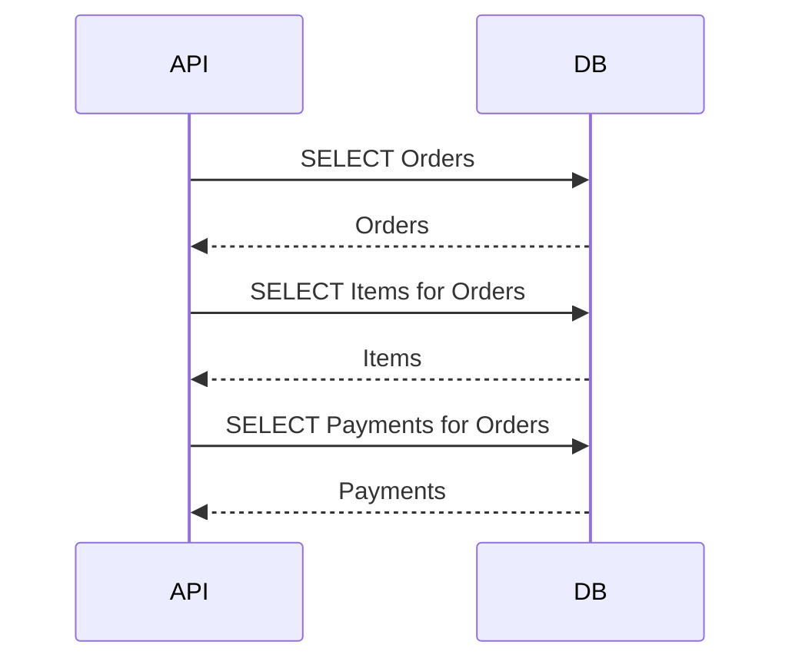

# Daily Knowledge Sharing — 2026-09-14

## Today’s Topics

1. C# `ArrayPool<T>` ownership: giảm allocation mà không biến pooled buffer thành use-after-return bug
2. ASP.NET Core graceful shutdown: drain request, dừng nhận traffic và kết thúc background work an toàn khi deploy
3. EF Core `AsSplitQuery`: tránh cartesian explosion nhưng phải hiểu consistency window và số round trip
4. PostgreSQL MVCC và `VACUUM`: non-blocking reads không miễn phí, dead tuples vẫn tạo I/O và bloat
5. Elasticsearch alias-based reindexing: thay đổi mapping gần zero-downtime nhưng phải kiểm soát dual-write và cutover
6. Timeout, retry budget và jitter trong distributed systems: retry sai cách có thể khuếch đại outage thành retry storm
7. Azure Blob Storage large-file upload với SAS: stream dữ liệu mà không đưa storage credentials vào application boundary
8. SLO, error budget và tail latency: biến “hệ thống ổn” thành mục tiêu reliability có thể đo và ra quyết định
9. Optimizely CMS content modeling: thiết kế Page/Block theo editorial capability thay vì copy cấu trúc UI hiện tại
10. Webhook verification và replay protection: chữ ký đúng chưa đủ nếu attacker có thể phát lại request hợp lệ

---

# 1. C# `ArrayPool<T>` ownership: giảm allocation mà không biến pooled buffer thành use-after-return bug

## 1. What is it?

`ArrayPool<T>` là một pool các array có thể tái sử dụng. Thay vì mỗi request tạo một `byte[]` lớn rồi chờ GC thu hồi, code có thể `Rent` một buffer, dùng trong một scope rõ ràng, sau đó `Return` về pool.

Mental model quan trọng nhất không phải “pool = cache”. Nó là **borrowed memory**:

```text
Pool
  │ Rent
  ▼
Caller owns buffer temporarily
  │ use
  │ finally
  ▼
Return
  │
  └── buffer có thể được caller khác tái sử dụng ngay
```

Buffer sau `Return` không còn thuộc quyền sở hữu logic của caller nữa.

## 2. Why does it exist?

Allocation lặp lại của các array trung bình/lớn có thể tạo GC pressure, đặc biệt trong parsing, compression, file processing, network protocol handling hoặc serialization hot path.

Không có pooling, một service xử lý hàng nghìn request/giây có thể tạo hàng nghìn buffer có lifetime rất ngắn. Chi phí không chỉ là allocation time; nó còn là GC bookkeeping, memory retention và đôi khi LOH pressure nếu buffer đủ lớn.

`ArrayPool<T>` tồn tại để đổi chi phí từ “allocate rồi collect” sang “rent, reuse, return”. Đổi lại, code phải quản lý ownership nghiêm ngặt hơn.

## 3. How does it work?

`ArrayPool<T>.Shared.Rent(minimumLength)` trả về một array có độ dài **ít nhất** bằng yêu cầu, không đảm bảo đúng bằng kích thước yêu cầu.

```csharp
var buffer = ArrayPool<byte>.Shared.Rent(64 * 1024);
try
{
    // Chỉ dùng phần logic mình cần.
}
finally
{
    ArrayPool<byte>.Shared.Return(buffer);
}
```

Array trả về có thể chứa dữ liệu từ lần sử dụng trước. Vì vậy với dữ liệu nhạy cảm, có thể cần:

```csharp
ArrayPool<byte>.Shared.Return(buffer, clearArray: true);
```

Nhưng clearing cũng có CPU cost. Đây là trade-off giữa security/data hygiene và throughput.

## 4. Practical implementation

Ví dụ đọc stream rồi hash mà không tạo buffer mới cho mỗi operation:

```csharp
using System.Buffers;
using System.Security.Cryptography;

public static async Task<byte[]> ComputeSha256Async(
    Stream stream,
    CancellationToken cancellationToken)
{
    var buffer = ArrayPool<byte>.Shared.Rent(64 * 1024);

    try
    {
        using var hash = IncrementalHash.CreateHash(HashAlgorithmName.SHA256);

        while (true)
        {
            var read = await stream.ReadAsync(
                buffer.AsMemory(0, buffer.Length),
                cancellationToken);

            if (read == 0)
                break;

            hash.AppendData(buffer, 0, read);
        }

        return hash.GetHashAndReset();
    }
    finally
    {
        ArrayPool<byte>.Shared.Return(buffer, clearArray: true);
    }
}
```

Điểm cần chú ý: mọi exit path, exception và cancellation đều phải đi qua `finally`.

## 5. Real production scenario

Một API upload tài liệu nhận hàng trăm file đồng thời. Mỗi request trước đây tạo buffer 1 MB để scan metadata và tính checksum. Khi traffic tăng, allocation rate tăng mạnh, Gen 2 GC xuất hiện thường xuyên hơn và p99 latency dao động.

Sau profiling cho thấy buffer allocation là hot path, team đổi sang `ArrayPool<byte>`. Throughput tăng và allocation giảm rõ rệt. Tuy nhiên optimization chỉ hợp lý sau khi có evidence; nếu mỗi phút chỉ có vài file, pooling có thể chỉ làm code phức tạp hơn.

## 6. Failure scenario & troubleshooting

**Symptom** → đôi lúc dữ liệu parse sai hoặc hash mismatch không tái hiện ổn định.

**Evidence** → buffer đã được `Return` trước khi asynchronous consumer dùng xong.

**Hypothesis** → code giữ reference tới rented array ngoài lifetime cho phép.

**Diagnosis** → trace ownership path và tìm các callback/task capture array sau `Return`.

**Fix** → chỉ return sau khi toàn bộ consumer hoàn tất; hoặc copy phần dữ liệu cần sống lâu hơn sang owned memory.

**Verification** → stress test với concurrency cao, assertions về lifetime và checksum determinism.

## 7. Common mistakes

* Giả định `Rent(1024)` luôn trả array dài đúng 1024.
* `Return` rồi vẫn giữ reference và đọc tiếp.
* Quên `finally`, làm buffer “rò” khỏi pool khi exception xảy ra.
* Dùng pooled buffer cho dữ liệu bí mật nhưng không cân nhắc clearing.
* Pool mọi thứ mà không đo allocation/GC trước.
* Trả buffer về quá sớm trong async pipeline.

## 8. Alternatives

* `new byte[]`: đơn giản nhất; phù hợp khi allocation nhỏ hoặc không nằm trên hot path.
* `stackalloc` + `Span<T>`: phù hợp buffer nhỏ, lifetime rất ngắn và synchronous.
* `MemoryPool<T>`: hữu ích khi cần ownership abstraction (`IMemoryOwner<T>`), đặc biệt trong pipeline/network code.
* Reuse buffer ở object lifecycle riêng: đôi khi đơn giản hơn nếu ownership rõ và concurrency thấp.

## 9. Trade-offs

### Advantages

* Giảm allocation rate và GC pressure.
* Tốt cho workload lặp lại với buffer tương đối lớn.
* Có thể cải thiện tail latency khi GC là bottleneck.

### Costs / Risks

* Ownership phức tạp hơn.
* Dễ tạo data corruption khó tái hiện nếu dùng sau `Return`.
* Có thể giữ memory lâu hơn cần thiết do pool caching.
* Clearing buffer tăng CPU cost.

## 10. Junior → Middle → Senior → Technical Lead

### Junior

Hiểu rằng rented buffer chỉ là memory mượn tạm và phải trả lại đúng scope.

### Middle

Có thể dùng `try/finally`, giới hạn vùng dữ liệu hợp lệ và tránh capture buffer sai lifetime.

### Senior

Biết đo allocation, GC, p95/p99 trước và sau optimization; nhận diện use-after-return và security implication của dữ liệu còn sót trong buffer.

### Technical Lead / Architect

Quyết định pooling có đáng thêm complexity hay không, đặt ownership convention chung cho codebase và chọn abstraction phù hợp giữa raw array pool, `MemoryPool<T>` hoặc giải pháp đơn giản hơn.

## 11. Key takeaway

* `ArrayPool<T>` là borrowed memory, không phải array “của mình”.
* Optimization chỉ đáng làm khi allocation/GC thực sự là bottleneck.
* Lifetime và ownership sai nguy hiểm hơn chi phí allocation ban đầu.

---

# 2. ASP.NET Core graceful shutdown: drain request, dừng nhận traffic và kết thúc background work an toàn khi deploy

## 1. What is it?

Graceful shutdown là quá trình application ngừng phục vụ một cách có kiểm soát: dừng nhận work mới, cho request/work đang chạy một khoảng thời gian để hoàn tất, propagate cancellation và đóng resource sạch sẽ trước khi process bị terminate.

Nó đặc biệt quan trọng khi application chạy sau load balancer, trong App Service, container hoặc Kubernetes, nơi restart/deploy là hành vi bình thường chứ không phải exception.

## 2. Why does it exist?

Nếu process bị kill ngay:

* request đang ghi database có thể dở dang,
* file upload có thể bị cắt giữa chừng,
* background consumer có thể mất lock message rồi bị redelivery,
* in-memory state chưa flush,
* client nhận reset thay vì response có nghĩa.

Graceful shutdown giảm blast radius của deploy/restart và biến lifecycle platform thành hành vi application có thể dự đoán.

## 3. How does it work?

Ở mức khái niệm:

```text
Deployment / SIGTERM
        │
        ▼
Stop routing new traffic
        │
        ▼
Application receives shutdown signal
        │
        ├── RequestCancellation
        ├── BackgroundService cancellation
        └── Dispose resources
        │
        ▼
Grace period expires
        │
        └── Force terminate if still running
```

ASP.NET Core host propagate cancellation tới hosted services. Nhưng application code chỉ graceful nếu nó **thực sự tôn trọng cancellation**.

## 4. Practical implementation

Một `BackgroundService` nên dừng nhanh khi host shutdown:

```csharp
public sealed class QueueWorker : BackgroundService
{
    private readonly ILogger<QueueWorker> _logger;

    public QueueWorker(ILogger<QueueWorker> logger)
        => _logger = logger;

    protected override async Task ExecuteAsync(CancellationToken stoppingToken)
    {
        while (!stoppingToken.IsCancellationRequested)
        {
            try
            {
                await ProcessNextMessageAsync(stoppingToken);
            }
            catch (OperationCanceledException)
                when (stoppingToken.IsCancellationRequested)
            {
                break;
            }
        }

        _logger.LogInformation("Queue worker stopped cleanly");
    }

    private static Task ProcessNextMessageAsync(CancellationToken ct)
        => Task.Delay(TimeSpan.FromSeconds(1), ct);
}
```

Với HTTP downstream call:

```csharp
await httpClient.SendAsync(request, HttpCompletionOption.ResponseHeadersRead, cancellationToken);
```

Cancellation phải đi xuyên call chain, không dừng ở controller.

## 5. Real production scenario

Một e-commerce API deploy bằng rolling update. Load balancer ngừng gửi traffic tới instance cũ, nhưng instance đó vẫn có vài request checkout đang xử lý. Grace period cho phép request đang chạy hoàn tất transaction và trả response trước khi container dừng.

Nếu có queue consumer trong cùng process, worker cũng phải dừng nhận message mới và hoàn tất/abandon message hiện tại đúng semantics của broker.

## 6. Failure scenario & troubleshooting

**Symptom** → sau mỗi deploy xuất hiện spike 499/502 hoặc duplicate message processing.

**Evidence** → request duration kéo dài qua thời điểm instance terminate; worker không phản ứng với shutdown token.

**Hypothesis** → application không drain work đúng hoặc platform termination grace period ngắn hơn thời gian xử lý tối đa.

**Diagnosis** → correlate deployment timestamp với request failure, lifecycle log, broker redelivery và process termination.

**Fix** → propagate cancellation, giới hạn request/work duration, dừng accept work mới, tune grace period và tránh long-running work không checkpoint.

**Verification** → chạy controlled rolling deployment dưới load và đo request success, message duplication, shutdown duration.

## 7. Common mistakes

* Nghĩ rằng “host hỗ trợ graceful shutdown” là đủ dù code bỏ qua `CancellationToken`.
* Chạy fire-and-forget task không thuộc host lifecycle.
* Đặt shutdown timeout cực dài để che long-running design problem.
* Consumer tiếp tục nhận work mới sau khi shutdown bắt đầu.
* Không phân biệt cancellation do client với cancellation do host shutdown.

## 8. Alternatives

* Đưa long-running work sang queue/Worker Service thay vì xử lý trong request.
* Dùng Azure Functions cho event-driven work có lifecycle do platform quản lý.
* Trong Kubernetes, readiness transition + `terminationGracePeriodSeconds` giúp coordination với traffic routing.

## 9. Trade-offs

### Advantages

* Deploy ít gây lỗi người dùng hơn.
* Giảm partial work và duplicate bất ngờ.
* Lifecycle predictable hơn.

### Costs / Risks

* Shutdown path cũng là code path cần test.
* Grace period dài làm rollout chậm.
* Cancellation có thể làm transaction/business flow phức tạp hơn nếu boundary không rõ.

## 10. Junior → Middle → Senior → Technical Lead

### Junior

Hiểu process restart/deploy là bình thường và code phải có cách dừng sạch.

### Middle

Propagate `CancellationToken`, viết `BackgroundService` tôn trọng shutdown và tránh fire-and-forget.

### Senior

Phân tích request draining, broker semantics, transaction boundary và behavior khi grace period hết.

### Technical Lead / Architect

Quyết định work nào được phép sống trong request process, work nào phải tách ra queue/worker, và thiết kế deployment/lifecycle contract giữa platform với application.

## 11. Key takeaway

* Graceful shutdown chỉ hiệu quả khi application code tôn trọng lifecycle signal.
* Deploy/restart phải được xem như production path thường xuyên.
* Long-running work cần boundary và recovery semantics rõ ràng.

---

# 3. EF Core `AsSplitQuery`: tránh cartesian explosion nhưng phải hiểu consistency window và số round trip

## 1. What is it?

`AsSplitQuery()` yêu cầu EF Core load một graph có nhiều collection bằng nhiều SQL query thay vì gộp tất cả vào một query JOIN lớn.

Ví dụ:

```csharp
var orders = await db.Orders
    .Include(o => o.Items)
    .Include(o => o.Payments)
    .AsSplitQuery()
    .ToListAsync(cancellationToken);
```

Mental model:

```text
Single query:
Orders × Items × Payments

Split query:
Orders
  + query Items for loaded Orders
  + query Payments for loaded Orders
```

## 2. Why does it exist?

Khi include nhiều collection, JOIN có thể nhân số row rất mạnh. Một order có 20 items và 5 payments có thể tạo 100 joined rows cho chính order đó. Database đọc, network truyền và materializer phải xử lý lượng dữ liệu lớn hơn business entity thực tế.

Split query đổi “một query rất phình” thành nhiều query nhỏ hơn.

## 3. How does it work?

EF Core chạy query root trước rồi các query liên quan, sau đó fix-up relationship trong memory.

Điểm quan trọng: nhiều query có thể quan sát database ở các thời điểm hơi khác nhau nếu không có transaction/isolation phù hợp.



Nếu một transaction khác sửa dữ liệu giữa các query, graph có thể không đại diện một snapshot duy nhất.

## 4. Practical implementation

```csharp
var query = db.Orders
    .Where(o => o.CustomerId == customerId)
    .OrderByDescending(o => o.CreatedAt)
    .Take(50)
    .Include(o => o.Items)
    .Include(o => o.Payments)
    .AsSplitQuery();

var result = await query
    .AsNoTracking()
    .ToListAsync(cancellationToken);
```

Nếu API thực sự chỉ cần summary, projection thường tốt hơn cả `Include`:

```csharp
var result = await db.Orders
    .Where(o => o.CustomerId == customerId)
    .Select(o => new OrderSummaryDto(
        o.Id,
        o.Items.Count,
        o.Payments.Sum(p => p.Amount)))
    .ToListAsync(cancellationToken);
```

## 5. Real production scenario

Trang admin load order cùng line items, payment attempts và shipment records. Single query tạo hàng chục nghìn row intermediate dù chỉ có vài trăm object cuối cùng. p95 query tăng, network payload lớn và API tốn CPU materialize.

`AsSplitQuery` giảm duplication đáng kể. Nhưng team vẫn phải kiểm tra số round trip và consistency requirement; với read-only admin screen, hơi lệch snapshot có thể chấp nhận được, còn financial reconciliation có thể không.

## 6. Failure scenario & troubleshooting

**Symptom** → query single rất chậm, memory allocation lớn; sau khi split thì latency lại tăng ở environment có network latency cao.

**Evidence** → SQL logs cho thấy một JOIN phình trước đó, sau đổi thành nhiều database round trip.

**Hypothesis** → cartesian explosion đã giảm nhưng round-trip cost trở thành bottleneck.

**Diagnosis** → đo row count, bytes transferred, SQL duration, number of commands và end-to-end latency.

**Fix** → projection, paging root set, chọn split/single theo graph shape; không dùng Include rộng theo thói quen.

**Verification** → load test với production-like data cardinality.

## 7. Common mistakes

* Gọi `Include` cho mọi navigation “để chắc có dữ liệu”.
* Nghĩ `AsSplitQuery` luôn nhanh hơn.
* Bỏ qua consistency giữa nhiều query.
* Không page root entities trước khi include collection lớn.
* Dùng entity graph khi endpoint chỉ cần DTO nhỏ.

## 8. Alternatives

* `AsSingleQuery()`: ít round trip, có thể tốt cho graph nhỏ.
* Projection bằng `Select`: thường tối ưu hơn nếu response chỉ cần subset dữ liệu.
* Explicit query: kiểm soát rõ từng bước nhưng code nhiều hơn.
* Raw SQL/Dapper: phù hợp hot path rất đặc thù, đổi lại mất nhiều EF abstraction.

## 9. Trade-offs

### Advantages

* Giảm cartesian explosion.
* Giảm duplicated payload và materialization overhead trong graph lớn.

### Costs / Risks

* Tăng round trip.
* Có consistency window giữa các query.
* Có thể che việc data shape của endpoint đang quá lớn.

## 10. Junior → Middle → Senior → Technical Lead

### Junior

Hiểu `Include` không miễn phí và nhiều collection có thể làm row count nhân lên.

### Middle

Biết dùng `AsSplitQuery`, projection và logging để quan sát SQL thực tế.

### Senior

Đánh giá cardinality, round-trip latency, isolation và memory/materialization cost.

### Technical Lead / Architect

Đặt guideline về query shape, DTO boundary và consistency expectation thay vì chuẩn hóa mù quáng “luôn split” hoặc “luôn single”.

## 11. Key takeaway

* `AsSplitQuery` giải quyết cartesian explosion, không giải quyết mọi query-performance problem.
* Projection thường là lựa chọn tốt hơn khi API không cần full entity graph.
* Consistency và round trip là trade-off bắt buộc phải xét.

---

# 4. PostgreSQL MVCC và `VACUUM`: non-blocking reads không miễn phí, dead tuples vẫn tạo I/O và bloat

## 1. What is it?

PostgreSQL dùng MVCC — Multi-Version Concurrency Control — để nhiều transaction đọc/ghi đồng thời mà không phải khóa read theo kiểu đơn giản.

Khi row được update, PostgreSQL thường tạo tuple version mới thay vì sửa in-place theo nghĩa logic. Version cũ trở thành dead tuple khi không transaction nào còn cần nhìn thấy nó. `VACUUM` dọn metadata/storage để space đó có thể được tái sử dụng.

## 2. Why does it exist?

Nếu read và write luôn khóa nhau, throughput của transactional system sẽ giảm mạnh khi concurrency tăng. MVCC cho phép mỗi transaction nhìn snapshot phù hợp với isolation rule của nó.

Đổi lại, database phải quản lý nhiều version của cùng logical row và cần cleanup.

## 3. How does it work?

Simplified flow:

```text
UPDATE row
   │
   ├── old tuple remains temporarily
   └── new tuple version created

Readers choose visible version by transaction snapshot

Later:
VACUUM determines old tuple no longer visible to any transaction
   │
   └── marks/reclaims space for reuse
```

Một long-running transaction có thể giữ snapshot cũ rất lâu, khiến nhiều dead tuples chưa thể được cleanup hiệu quả.

## 4. Practical implementation

Quan sát bảng có dead tuples cao:

```sql
SELECT
    relname,
    n_live_tup,
    n_dead_tup,
    last_autovacuum,
    autovacuum_count
FROM pg_stat_user_tables
ORDER BY n_dead_tup DESC
LIMIT 20;
```

Tìm transaction chạy lâu:

```sql
SELECT
    pid,
    usename,
    state,
    xact_start,
    now() - xact_start AS xact_age,
    query
FROM pg_stat_activity
WHERE xact_start IS NOT NULL
ORDER BY xact_start;
```

Không nên reflexively chạy `VACUUM FULL` trên production vì nó có locking/operational impact lớn hơn `VACUUM` thông thường.

## 5. Real production scenario

Một SaaS table cập nhật status liên tục. Traffic tăng nhưng schema không đổi. Sau vài tuần, query sequential scan chậm hơn, disk usage tăng và autovacuum luôn bận.

Root cause không phải chỉ “thiếu index”; update churn tạo nhiều dead tuples, cộng với một reporting transaction kéo dài hàng giờ giữ snapshot cũ. Điều tra phải nhìn transaction age, autovacuum behavior, table bloat và query plan cùng nhau.

## 6. Failure scenario & troubleshooting

**Symptom** → table size tăng nhanh, I/O tăng, latency xấu dần dù row count gần như không đổi.

**Evidence** → `n_dead_tup` cao, autovacuum chạy nhiều hoặc bị chậm, có transaction rất dài.

**Hypothesis** → MVCC cleanup bị cản hoặc autovacuum tuning không theo kịp write rate.

**Diagnosis** → kiểm tra long-running transaction, vacuum stats, table/index size, update/delete rate.

**Fix** → kết thúc transaction bất thường, rút ngắn transaction boundary, tune autovacuum theo bảng nếu có evidence, xem lại update pattern.

**Verification** → dead tuple trend giảm, bloat ổn định, I/O và latency cải thiện.

## 7. Common mistakes

* Nghĩ MVCC đồng nghĩa “không có lock”.
* Giữ transaction mở trong lúc gọi external API hoặc chờ user interaction.
* Chạy `VACUUM FULL` như maintenance mặc định.
* Chỉ nhìn CPU mà bỏ qua I/O/bloat.
* Tuning autovacuum toàn cluster khi chỉ một vài table có churn đặc biệt.

## 8. Alternatives

Không có “alternative” trực tiếp cho MVCC trong PostgreSQL application code, nhưng có thể thay đổi access pattern:

* chia bảng/partition khi workload phù hợp,
* batch update hợp lý,
* giảm update không cần thiết,
* archival data,
* rút ngắn transaction.

Nếu workload là append-only analytics, data engine khác có thể phù hợp hơn OLTP PostgreSQL.

## 9. Trade-offs

### Advantages

* Read concurrency tốt.
* Snapshot semantics mạnh.
* Giảm read/write blocking trong nhiều workload.

### Costs / Risks

* Dead tuples và cleanup overhead.
* Long-running transaction gây hậu quả hệ thống.
* Cần monitoring vacuum/bloat, không chỉ query latency.

## 10. Junior → Middle → Senior → Technical Lead

### Junior

Hiểu update có thể tạo version mới và version cũ chưa biến mất ngay.

### Middle

Biết đọc `pg_stat_activity`, `pg_stat_user_tables` và tránh transaction mở quá lâu.

### Senior

Liên hệ MVCC, bloat, I/O, autovacuum và transaction lifetime khi điều tra performance.

### Technical Lead / Architect

Thiết kế workload và transaction boundary để database maintenance vẫn theo kịp production scale; tránh biến reporting hoặc batch job thành blocker hệ thống.

## 11. Key takeaway

* MVCC mua concurrency bằng chi phí version management và cleanup.
* Transaction dài có thể gây hậu quả vượt xa chính request đó.
* Performance PostgreSQL phải nhìn cả query plan, I/O, bloat và vacuum behavior.

---

# 5. Elasticsearch alias-based reindexing: thay đổi mapping gần zero-downtime nhưng phải kiểm soát dual-write và cutover

## 1. What is it?

Elasticsearch mapping của field không phải lúc nào cũng có thể thay đổi in-place theo cách mong muốn. Khi cần migration lớn, pattern phổ biến là tạo index mới, reindex dữ liệu, rồi chuyển alias từ index cũ sang index mới.

```text
search-products alias
        │
        ▼
products-v1

Migration:
products-v1 ──reindex──> products-v2

Cutover:
search-products alias ──> products-v2
```

## 2. Why does it exist?

Search schema evolve: analyzer thay đổi, field type đổi, autocomplete strategy đổi, scoring fields thêm mới. Transactional database có migration semantics khác; Elasticsearch thường cần rebuild index để materialize cấu trúc inverted index mới.

Alias cho phép application không hard-code physical index version và cutover nhanh hơn.

## 3. How does it work?

Flow an toàn hơn thường gồm:

1. Tạo `products-v2` với mapping/settings mới.
2. Backfill dữ liệu từ primary source hoặc từ old index nếu phù hợp.
3. Đồng bộ change phát sinh trong thời gian backfill.
4. Verify document count, sample query, relevance và lag.
5. Atomic alias switch.
6. Giữ old index trong rollback window.
7. Xóa index cũ sau khi ổn định.

Alias switch nhanh, nhưng **data synchronization trước cutover** mới là phần khó.

## 4. Practical implementation

Tạo alias switch atomically:

```json
POST /_aliases
{
  "actions": [
    { "remove": { "index": "products-v1", "alias": "products-search" } },
    { "add":    { "index": "products-v2", "alias": "products-search" } }
  ]
}
```

Application query alias thay vì physical name:

```csharp
var response = await client.SearchAsync<ProductDocument>(s => s
    .Index("products-search")
    .Query(q => q.Match(m => m.Field(f => f.Name).Query(searchText))),
    cancellationToken);
```

Tên API client cụ thể phụ thuộc Elasticsearch .NET client version; cần verify package/version trước khi copy production code.

## 5. Real production scenario

E-commerce search muốn đổi analyzer để hỗ trợ synonym và normalization tốt hơn. Mapping cũ không thể đáp ứng chỉ bằng config nhỏ. Team tạo index mới, backfill hàng triệu product, chạy incremental sync từ change feed, compare search result, rồi switch alias.

Search API không cần deploy chỉ để đổi physical index name.

## 6. Failure scenario & troubleshooting

**Symptom** → sau cutover, một số product mới không xuất hiện hoặc tồn tại dữ liệu cũ.

**Evidence** → document count tổng thể gần đúng nhưng records thay đổi trong backfill window bị lệch.

**Hypothesis** → migration chỉ reindex snapshot cũ, không capture concurrent updates.

**Diagnosis** → so primary DB change timestamp với index version, check sync lag và missing IDs.

**Fix** → dùng change capture/outbox/versioning để replay delta trước cutover; có rollback alias nếu impact cao.

**Verification** → count không đủ; cần sample consistency, version comparison và query-level acceptance test.

## 7. Common mistakes

* Dùng Elasticsearch làm source of truth cho migration khi primary DB mới là authority.
* Chỉ so document count rồi kết luận migration đúng.
* Không giữ rollback window.
* Hard-code physical index trong application.
* Reindex xong mới nhận ra writes trong lúc migration bị mất.
* Không benchmark analyzer mới với relevance dataset thật.

## 8. Alternatives

* Update mapping in-place cho additive changes được Elasticsearch hỗ trợ.
* Dual-read/canary query từ index mới trước full cutover.
* Rebuild hoàn toàn từ primary database nếu old index không đáng tin.

## 9. Trade-offs

### Advantages

* Cutover nhanh, application ít downtime.
* Rollback alias đơn giản hơn rollback data mutation.
* Physical index có version rõ ràng.

### Costs / Risks

* Tạm thời cần gấp đôi storage.
* Đồng bộ delta phức tạp.
* Reindex tạo cluster load đáng kể.
* Search correctness phụ thuộc migration verification tốt.

## 10. Junior → Middle → Senior → Technical Lead

### Junior

Hiểu alias là logical name tách application khỏi physical index.

### Middle

Có thể tạo index mới, reindex và switch alias trong môi trường test.

### Senior

Thiết kế backfill + delta sync, rollback và validation dựa trên source of truth.

### Technical Lead / Architect

Quyết định migration strategy, capacity headroom, consistency expectation và ownership giữa transactional source với search projection.

## 11. Key takeaway

* Alias giải quyết cutover; nó không tự giải quyết data consistency trong migration.
* Primary database thường vẫn là source of truth.
* Reindex production phải có verification và rollback plan.

---

# 6. Timeout, retry budget và jitter trong distributed systems: retry sai cách có thể khuếch đại outage thành retry storm

## 1. What is it?

Timeout giới hạn thời gian một caller sẵn sàng chờ dependency. Retry cho phép thử lại transient failure. Retry budget giới hạn tổng số retry hệ thống cho phép. Jitter thêm randomness vào backoff để nhiều caller không retry đồng loạt.

Ba khái niệm này phải được thiết kế cùng nhau, không phải bật độc lập.

## 2. Why does it exist?

Network và remote service có partial failure. Một request có thể timeout dù dependency phục hồi ngay sau đó. Retry hợp lý tăng resilience.

Nhưng khi dependency đang quá tải, retry làm traffic tăng thêm. Nếu 10.000 request cùng retry 3 lần, dependency có thể phải nhận tới hàng chục nghìn request bổ sung đúng lúc nó yếu nhất.

## 3. How does it work?

Không có jitter:

```text
10,000 callers fail at T0
    │
    └── all retry at T0 + 1s
              │
              └── synchronized load spike
```

Có exponential backoff + jitter:

```text
retry delay ≈ exponential backoff + random spread
```

Retry budget thêm upper bound theo request chain hoặc theo service-level policy.

Quan trọng hơn: timeout của downstream call phải nhỏ hơn end-to-end deadline còn lại.

## 4. Practical implementation

Với modern .NET resilience stack, ý tưởng policy có thể là:

```csharp
builder.Services.AddHttpClient("Catalog", client =>
{
    client.BaseAddress = new Uri("https://catalog.internal");
    client.Timeout = TimeSpan.FromSeconds(3);
});
```

Nếu dùng resilience handler/policy, chỉ retry operation an toàn:

```text
Retry:
- network reset trước khi request được xử lý: có thể
- HTTP 503: có thể, nếu policy cho phép
- HTTP 400: không
- POST tạo payment không có idempotency key: rất nguy hiểm
```

Retry logic cần dựa trên semantics, không chỉ status code.

## 5. Real production scenario

Checkout API gọi Inventory API. Inventory bắt đầu chậm vì database connection pool gần cạn. Checkout timeout sau 2 giây rồi retry 3 lần. Traffic tới Inventory tăng gấp nhiều lần, pool cạn hoàn toàn và outage lan sang service khác.

Root cause ban đầu có thể là dependency saturation; retry storm biến degradation thành full outage.

## 6. Failure scenario & troubleshooting

**Symptom** → dependency request rate tăng mạnh đúng lúc success rate giảm.

**Evidence** → traces cho thấy một logical request phát sinh nhiều attempt; retry metrics tăng; p99 tăng theo stair-step.

**Hypothesis** → retry policy khuếch đại load.

**Diagnosis** → đo attempts/request, retry reason, downstream saturation, timeout hierarchy và queue depth.

**Fix** → giảm retries, thêm jitter, circuit breaker/load shedding, honor end-to-end deadline, chỉ retry idempotent/safe operations.

**Verification** → chaos/load test dependency degradation, đảm bảo total request amplification nằm trong budget.

## 7. Common mistakes

* Retry mọi exception.
* Retry POST có side effect mà không có idempotency.
* Đặt timeout 30 giây ở từng hop trong request deadline 5 giây.
* Không có jitter.
* Mỗi layer đều retry, tạo multiplicative attempts.
* Không đo retry rate như metric riêng.

## 8. Alternatives

* Circuit Breaker: fail fast khi dependency đang unhealthy.
* Bulkhead: giới hạn concurrency để cô lập failure.
* Queue: chuyển synchronous dependency thành asynchronous khi business semantics cho phép.
* Fallback/cache: chấp nhận stale/partial data cho non-critical path.
* Load shedding: từ chối work sớm thay vì kéo cả system xuống.

## 9. Trade-offs

### Advantages

* Retry có thể che transient failure.
* Timeout tránh resource bị giữ vô hạn.
* Jitter giảm synchronized retry spikes.

### Costs / Risks

* Retry tăng load và latency.
* Timeout quá ngắn tạo false failure.
* Timeout quá dài giữ thread/socket/connection budget.
* Resilience policy phức tạp nếu mỗi team tự cấu hình khác nhau.

## 10. Junior → Middle → Senior → Technical Lead

### Junior

Hiểu remote call có thể fail một phần và retry không luôn đúng.

### Middle

Phân biệt lỗi retryable/non-retryable và cấu hình timeout có giới hạn.

### Senior

Tính request amplification, deadline propagation, idempotency và saturation behavior.

### Technical Lead / Architect

Thiết kế resilience budget toàn call graph, tránh retry chồng tầng và xác định khi nào async decoupling tốt hơn synchronous retries.

## 11. Key takeaway

* Retry là thêm load; chỉ retry khi xác suất thành công đáng giá chi phí đó.
* Jitter và retry budget quan trọng ở scale lớn.
* Timeout phải phù hợp end-to-end deadline, không cấu hình từng service độc lập.

---

# 7. Azure Blob Storage large-file upload với SAS: stream dữ liệu mà không đưa storage credentials vào application boundary

## 1. What is it?

Với file lớn, backend không nhất thiết phải nhận toàn bộ payload rồi upload tiếp sang Blob Storage. Một pattern phổ biến là backend authorize business action, phát SAS có scope/thời hạn giới hạn, rồi client upload trực tiếp tới Blob Storage.

```text
Client ──request upload permission──> API
Client <──── short-lived SAS ─────── API
Client ───── upload blob directly ──> Blob Storage
Client ───── notify completion ─────> API
```

## 2. Why does it exist?

Proxy toàn bộ file qua API khiến application trả chi phí network hai lần, giữ connection/resource lâu và khó scale cho file lớn.

Direct upload chuyển data plane sang storage service, trong khi API vẫn giữ control plane: ai được upload gì, vào đâu, trong bao lâu và sau upload cần validation gì.

## 3. How does it work?

Backend authenticate user, validate business intent, chọn blob path, tạo quyền upload có expiry ngắn và permission tối thiểu.

Client upload theo block/stream semantics. Sau đó backend không nên chỉ tin “client nói đã upload xong”; cần kiểm tra blob properties, metadata, size và nếu cần trigger malware scan/content validation.

SAS là delegated capability. Ai có URL trong thời gian hiệu lực có quyền tương ứng, nên nó phải được bảo vệ như credential tạm thời.

## 4. Practical implementation

Khi backend dùng Managed Identity, ưu tiên User Delegation SAS thay vì giữ account key lâu dài.

Pseudo-flow gần production:

```csharp
public sealed record UploadTicket(string BlobName, Uri UploadUri, DateTimeOffset ExpiresAt);

public async Task<UploadTicket> CreateUploadTicketAsync(
    string userId,
    string fileName,
    CancellationToken ct)
{
    var blobName = $"uploads/{userId}/{Guid.NewGuid():N}/{Sanitize(fileName)}";

    // 1. Authorize business operation.
    // 2. Resolve BlobClient with Managed Identity credentials.
    // 3. Generate short-lived upload-only SAS / user delegation SAS.
    // 4. Persist upload intent if workflow requires completion tracking.

    throw new NotImplementedException();
}
```

Chi tiết API generate SAS phụ thuộc Azure SDK/version và credential type, nên production implementation phải bám docs của package đang dùng.

## 5. Real production scenario

CMS cho editor upload video 500 MB. Nếu file đi qua ASP.NET Core instance, một deployment hoặc scale event có thể cắt upload, app chịu egress/ingress pressure và request timeout khó quản lý.

Direct-to-Blob upload giúp App Service chỉ xử lý authorization và metadata. Sau upload, Event Grid/queue có thể trigger transcoding hoặc scan pipeline.

## 6. Failure scenario & troubleshooting

**Symptom** → user upload được blob nhưng application không biết file tồn tại, hoặc blob “orphan” tăng dần.

**Evidence** → storage có object không có corresponding DB record/workflow state.

**Hypothesis** → direct upload tách storage success khỏi business transaction.

**Diagnosis** → so upload intent table, blob list, completion events và TTL của pending upload.

**Fix** → upload intent + completion state, scheduled cleanup orphan, idempotent finalize endpoint/event consumer.

**Verification** → test failure giữa upload thành công và finalize call, đảm bảo recovery/cleanup deterministic.

## 7. Common mistakes

* SAS expiry quá dài.
* Permission rộng hơn cần thiết như read/list/delete khi chỉ cần write.
* Log full SAS URL.
* Cho client tự chọn arbitrary container/blob path.
* Tin content type/filename từ client.
* Không cleanup abandoned upload.
* Dùng account key trong app dù Managed Identity có thể giải quyết identity.

## 8. Alternatives

* Backend proxy upload: đơn giản và kiểm soát trực tiếp hơn cho file nhỏ.
* Azure Functions/Event Grid cho post-processing.
* Multipart/block upload do backend orchestrate khi client capability hạn chế.

## 9. Trade-offs

### Advantages

* Giảm load/network trên application server.
* Scale file transfer theo storage service.
* Credential có thể giới hạn scope/thời gian.

### Costs / Risks

* Workflow trở thành distributed state machine.
* Phải xử lý orphan, incomplete upload và post-upload validation.
* SAS leakage là security concern.

## 10. Junior → Middle → Senior → Technical Lead

### Junior

Hiểu API có thể authorize upload mà không cần proxy bytes.

### Middle

Thiết kế path, expiry, permission và finalize flow cơ bản.

### Senior

Xử lý orphan, idempotency, malware/content validation, Managed Identity và observability.

### Technical Lead / Architect

Quyết định control-plane/data-plane boundary, threat model của delegated credential và lifecycle của file trong toàn hệ thống.

## 11. Key takeaway

* Direct upload giảm application bottleneck nhưng tạo workflow phân tán cần recovery rõ.
* SAS phải short-lived, least-privilege và không được log tùy tiện.
* Upload success không đồng nghĩa business workflow đã complete.

---

# 8. SLO, error budget và tail latency: biến “hệ thống ổn” thành mục tiêu reliability có thể đo và ra quyết định

## 1. What is it?

SLI là metric đại diện trải nghiệm reliability, ví dụ tỷ lệ request thành công hoặc latency dưới ngưỡng.

SLO là target nội bộ cho SLI, ví dụ:

```text
99.9% successful checkout requests over 30 days
```

Error budget là phần failure được phép trong target đó:

```text
Error budget = 100% - SLO
```

Với 99.9%, budget là 0.1% requests không đạt mục tiêu trong window.

## 2. Why does it exist?

“Không có incident” hoặc “average latency 200 ms” không đủ để quyết định system có đáng tin hay không.

SLO tạo shared contract giữa Product, Engineering và Operations: reliability nào đủ cho business? Khi error budget đang cháy nhanh, team ưu tiên stability. Khi budget dư, có thể chấp nhận thay đổi nhiều hơn.

## 3. How does it work?

Ví dụ latency SLI:

```text
Good event:
HTTP 2xx/3xx AND duration < 800 ms

SLI = good events / valid events
SLO = 99.5% over rolling 28 days
```

Tail latency quan trọng vì average che user ở “đuôi”.

```text
p50 = user điển hình
p95 = 5% request chậm hơn mức này
p99 = 1% request chậm hơn mức này
```

Nếu average 200 ms nhưng p99 8 s, một subset user vẫn có trải nghiệm rất tệ.

## 4. Practical implementation

Ví dụ custom metric/trace dimensions với OpenTelemetry cần được thiết kế tránh cardinality explosion.

Một dashboard nên tách:

* availability SLI,
* latency p50/p95/p99,
* error budget consumption,
* burn rate,
* dependency health.

Pseudo-query tư duy:

```text
successful_fast_requests / eligible_requests
```

Không nên tính health check hoặc bot traffic vào denominator nếu chúng không đại diện user journey cần bảo vệ.

## 5. Real production scenario

Checkout service có SLO 99.95%. Trong 2 giờ sau release, error rate chỉ 0.8% — nghe có vẻ nhỏ — nhưng burn rate cao đến mức có thể tiêu hết monthly error budget trong một ngày.

Alert theo burn rate giúp team rollback sớm hơn alert “CPU > 80%”, vì nó đo trực tiếp user impact.

## 6. Failure scenario & troubleshooting

**Symptom** → dashboard system “green” nhưng support ticket nói checkout chậm.

**Evidence** → average latency ổn nhưng p99 tăng mạnh; error budget burn tăng.

**Hypothesis** → một dependency hoặc data partition chỉ ảnh hưởng tail.

**Diagnosis** → trace slow percentile, group theo dependency/region/operation, tìm correlation với release hoặc downstream latency.

**Fix** → remediation vào bottleneck thật, không tối ưu p50 nếu p99 mới là vấn đề.

**Verification** → percentile và burn rate quay lại baseline qua representative window.

## 7. Common mistakes

* Dùng CPU/memory làm SLO thay vì user-visible outcome.
* Đặt SLO 100% vì “hệ thống quan trọng”.
* Đo average latency duy nhất.
* SLI denominator chứa traffic không liên quan.
* Alert mỗi lỗi lẻ thay vì rate/burn.
* SLO tồn tại trên slide nhưng không ảnh hưởng release decision.

## 8. Alternatives

Không có thay thế trực tiếp cho reliability objective, nhưng có nhiều cách biểu diễn:

* availability-based SLO,
* latency-based SLO,
* journey/business SLO,
* dependency SLO.

SLA là cam kết bên ngoài/contractual, không nên đồng nhất với SLO nội bộ.

## 9. Trade-offs

### Advantages

* Reliability có ngôn ngữ đo lường chung.
* Alert gần user impact hơn infrastructure noise.
* Error budget giúp cân bằng release velocity với stability.

### Costs / Risks

* Chọn SLI sai dẫn tới tối ưu sai.
* High-cardinality telemetry có cost lớn.
* SLO quá cao làm team sợ thay đổi; quá thấp làm user suffer.

## 10. Junior → Middle → Senior → Technical Lead

### Junior

Hiểu p95/p99 và availability rate phản ánh user experience khác average.

### Middle

Biết instrument request, tạo dashboard percentile và phân biệt SLI/SLO/SLA.

### Senior

Thiết kế valid denominator, burn-rate alert và điều tra tail latency bằng trace.

### Technical Lead / Architect

Đặt reliability target theo business criticality, dùng error budget để ảnh hưởng release/process và quyết định investment vào resilience.

## 11. Key takeaway

* SLO phải đại diện trải nghiệm user/business, không chỉ sức khỏe server.
* p99 có thể xấu nghiêm trọng dù average đẹp.
* Error budget biến reliability thành quyết định engineering cụ thể.

---

# 9. Optimizely CMS content modeling: thiết kế Page/Block theo editorial capability thay vì copy cấu trúc UI hiện tại

## 1. What is it?

Content modeling là việc định nghĩa loại nội dung, field, relationship và reuse boundary để editor quản lý nội dung độc lập tương đối với implementation UI.

Trong Optimizely CMS, Page và Block là các building block quen thuộc. Sai lầm phổ biến là model content theo đúng HTML/component tree hiện tại thay vì theo semantic capability của content.

## 2. Why does it exist?

UI thay đổi thường xuyên hơn ý nghĩa business của content. Nếu CMS model bám quá chặt layout hiện tại, redesign nhỏ cũng kéo theo content migration, editor workflow phức tạp và technical debt.

Ví dụ “HeroBannerV3ForDesktop” là model theo presentation. “CampaignHero” với heading, media, CTA, audience metadata là model gần business/editorial intent hơn.

## 3. How does it work?

Boundary tốt thường tách:

```text
Content model
    │ semantic fields
    ▼
Rendering component / ViewModel mapping
    │ presentation rules
    ▼
Web UI
```

Editor quản lý content intent. Rendering layer quyết định responsive layout, CSS, tracking và device-specific behavior.

Block nên reusable khi reuse mang nghĩa editorial thực sự, không phải vì developer thích component hóa mọi thứ.

## 4. Practical implementation

Ví dụ simplified Optimizely content type:

```csharp
[ContentType(
    DisplayName = "Campaign Hero",
    GUID = "11111111-2222-3333-4444-555555555555")]
public class CampaignHeroBlock : BlockData
{
    [Display(Order = 10)]
    public virtual string Heading { get; set; } = string.Empty;

    [Display(Order = 20)]
    public virtual string? SupportingText { get; set; }

    [UIHint(UIHint.Image)]
    [Display(Order = 30)]
    public virtual ContentReference? Image { get; set; }

    [Display(Order = 40)]
    public virtual Url? CallToActionUrl { get; set; }
}
```

Trong production, cần thêm validation, localization, allowed types và editor guidance phù hợp.

## 5. Real production scenario

Marketing site có 200 campaign pages. Frontend redesign đổi grid và mobile layout. Nếu content model chỉ chứa semantic hero fields, rendering thay đổi mà không cần migrate toàn bộ content.

Ngược lại, nếu CMS lưu `DesktopColumnWidth`, `MobileOffset`, `CssClass`, editor content bị trói vào presentation detail và trở nên khó bảo trì.

## 6. Failure scenario & troubleshooting

**Symptom** → mỗi redesign phải tạo content type mới hoặc migration hàng trăm page.

**Evidence** → content model chứa nhiều field layout/CSS/device-specific.

**Hypothesis** → content boundary bị leak presentation concern.

**Diagnosis** → review field usage: field nào thực sự là business/editorial intent, field nào chỉ phục vụ renderer hiện tại.

**Fix** → tạo semantic model mới, mapping layer và migration có kế hoạch; tránh breaking editor workflow không cần thiết.

**Verification** → thử render cùng content ở nhiều layout/channel mà không sửa source content.

## 7. Common mistakes

* Một Block cho mỗi React/Vue component dù editor không cần reuse độc lập.
* Lưu CSS class trực tiếp để “linh hoạt”.
* Content type quá generic kiểu “Component” với hàng chục optional fields.
* Không đặt validation/allowed type dẫn tới content graph khó đoán.
* Tạo model theo screenshot của một campaign duy nhất.

## 8. Alternatives

* Page-specific properties: đơn giản khi content không cần reuse.
* Reusable Block: phù hợp khi editor thực sự tái sử dụng/quản lý độc lập.
* Headless/composable model: tốt khi nhiều channels consume cùng content.
* Code-driven static content: đủ cho nội dung hiếm thay đổi, không cần editor ownership.

## 9. Trade-offs

### Advantages

* Semantic model sống lâu hơn UI implementation.
* Editor experience ổn định hơn qua redesign.
* Tăng reuse có ý nghĩa.

### Costs / Risks

* Abstraction quá generic làm editor khó hiểu.
* Reusable content tăng governance/ownership complexity.
* Migration model cũ cần versioning và backward compatibility.

## 10. Junior → Middle → Senior → Technical Lead

### Junior

Hiểu Page/Block không chỉ là mirror của HTML component.

### Middle

Tạo content type có validation, naming và rendering mapping rõ.

### Senior

Phân biệt semantic content với presentation metadata và dự báo migration cost khi model evolve.

### Technical Lead / Architect

Thiết kế content boundary phục vụ editor workflow, multi-channel strategy, caching/search và long-term evolution mà không over-generalize.

## 11. Key takeaway

* CMS model nên mô tả ý nghĩa nội dung trước khi mô tả layout.
* Reuse chỉ có giá trị khi business/editorial workflow thực sự cần.
* Content modeling tốt giảm chi phí redesign và migration đáng kể.

---

# 10. Webhook verification và replay protection: chữ ký đúng chưa đủ nếu attacker có thể phát lại request hợp lệ

## 1. What is it?

Webhook verification kiểm tra request có thực sự đến từ provider mong đợi và payload không bị sửa. Thường provider ký payload bằng HMAC hoặc asymmetric signature.

Replay protection ngăn một request **hợp lệ đã từng được ký** bị gửi lại nhiều lần để kích hoạt side effect lặp.

Hai lớp này giải quyết hai threat khác nhau.

## 2. Why does it exist?

Chỉ whitelist IP thường không đủ. IP có thể thay đổi, proxy/CDN làm phức tạp source attribution và request vẫn có thể bị giả mạo trong nhiều topology.

Signature xác thực payload. Nhưng nếu attacker lấy được một request hợp lệ và replay nó, signature vẫn đúng. Với payment, account provisioning hoặc email send, replay có thể tạo duplicate side effect.

## 3. How does it work?

Typical flow:

```text
Provider
  │ payload + timestamp + signature
  ▼
Webhook endpoint
  │
  ├── validate timestamp freshness
  ├── recompute/verify signature over raw body
  ├── check event ID / nonce deduplication
  └── enqueue/process idempotently
```

Signature thường phải tính trên **raw request body**. Parse JSON rồi serialize lại có thể đổi whitespace/property order và làm signature mismatch.

## 4. Practical implementation

Ví dụ HMAC verification simplified:

```csharp
using System.Security.Cryptography;
using System.Text;

static bool IsValidSignature(
    ReadOnlySpan<byte> body,
    string providedHexSignature,
    ReadOnlySpan<byte> secret)
{
    using var hmac = new HMACSHA256(secret.ToArray());
    var computed = hmac.ComputeHash(body.ToArray());

    Span<byte> provided = stackalloc byte[computed.Length];
    if (!Convert.TryFromHexString(providedHexSignature, provided, out var written) ||
        written != computed.Length)
    {
        return false;
    }

    return CryptographicOperations.FixedTimeEquals(
        computed,
        provided[..written]);
}
```

Production implementation phải theo exact canonicalization/signature spec của provider, không tự sáng tạo format.

Idempotency layer có thể lưu `eventId` với unique constraint:

```sql
CREATE TABLE ProcessedWebhookEvents (
    EventId varchar(200) PRIMARY KEY,
    ProcessedAtUtc timestamp NOT NULL
);
```

## 5. Real production scenario

Payment provider gửi `payment.succeeded`. Endpoint verify HMAC đúng, nhưng do network timeout provider retry event 4 lần. Nếu handler mỗi lần đều tạo invoice và gửi email, hệ thống sinh duplicate dù không hề có attacker.

Replay protection vì thế không chỉ là security; nó còn là correctness requirement do webhook delivery thường là at-least-once.

## 6. Failure scenario & troubleshooting

**Symptom** → provider dashboard nói webhook gửi thành công nhiều lần, application tạo duplicate side effect.

**Evidence** → cùng event ID xuất hiện nhiều lần, signature đều hợp lệ.

**Hypothesis** → handler trusted signature nhưng không idempotent.

**Diagnosis** → correlate event ID, delivery attempt, business record và retry reason.

**Fix** → unique deduplication key, transactional processing hoặc inbox-style pattern, timestamp freshness policy khi provider hỗ trợ.

**Verification** → replay cùng request 10 lần; business effect chỉ xảy ra một lần nhưng endpoint vẫn trả response hợp lệ theo contract.

## 7. Common mistakes

* Verify signature trên JSON đã deserialize/reserialize thay vì raw body.
* So sánh secret/hash bằng string equality không constant-time khi threat model yêu cầu cryptographic comparison.
* Không validate timestamp window nếu provider ký timestamp.
* Không deduplicate event ID.
* Trả 500 sau khi business effect đã commit, khiến provider retry và tạo duplicate.
* Log secret/signature payload nhạy cảm không cần thiết.

## 8. Alternatives

* Polling provider API: dễ kiểm soát hơn ở vài use case nhưng latency/cost cao hơn.
* Message broker integration: mạnh hơn nếu provider hỗ trợ native broker/event bus.
* mTLS: bổ sung transport identity nhưng không thay thế idempotency.

## 9. Trade-offs

### Advantages

* Signature bảo vệ authenticity/integrity.
* Deduplication bảo vệ business effect trước retry/replay.
* Decoupled webhook có thể scale tốt.

### Costs / Risks

* Secret rotation/canonicalization cần quản lý cẩn thận.
* Dedup store có retention/storage cost.
* Clock skew ảnh hưởng timestamp freshness validation.
* Endpoint vẫn phải chống abuse/rate spikes.

## 10. Junior → Middle → Senior → Technical Lead

### Junior

Hiểu request ký đúng vẫn có thể được gửi nhiều lần.

### Middle

Implement raw-body signature verification và event-ID deduplication.

### Senior

Thiết kế idempotent side effect, secret rotation, replay window, retry response semantics và observability.

### Technical Lead / Architect

Xác định trust boundary với third-party provider, retention strategy cho deduplication, recovery model và mức assurance phù hợp cho từng loại event.

## 11. Key takeaway

* Signature verification và replay protection giải quyết hai vấn đề khác nhau.
* Webhook handler phải giả định duplicate delivery.
* Idempotency là correctness boundary, không chỉ security hardening.
