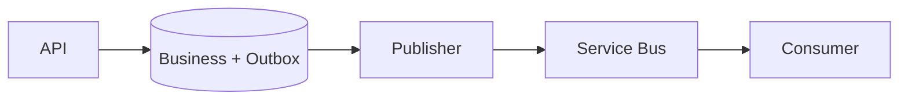

# Daily Knowledge Sharing — 2026-09-16

## Today’s Topics

1. `CancellationToken` propagation và cooperative cancellation trong ASP.NET Core
2. EF Core optimistic concurrency với concurrency token
3. SQL Server keyset pagination thay cho `OFFSET`
4. Redis cache stampede và request coalescing
5. Outbox Pattern: nối database transaction với message delivery
6. Azure Service Bus duplicate delivery và idempotent consumer
7. OpenTelemetry: nối Logs, Metrics và Traces khi điều tra production
8. Kubernetes readiness probe và zero-downtime deployment
9. Contract testing cho REST API giữa các service
10. Structured Outputs cho LLM: giữ deterministic boundary quanh AI

---

# 1. `CancellationToken` propagation và cooperative cancellation trong ASP.NET Core

## 1. What is it?

`CancellationToken` là tín hiệu cooperative cancellation: caller thông báo rằng công việc không còn cần thiết, còn code nhận token quyết định dừng ở các điểm an toàn. Nó không phải cơ chế cưỡng bức kill thread.

Trong ASP.NET Core, `HttpContext.RequestAborted` đại diện cho việc client đã ngắt request. Token nên đi xuyên qua application layer tới EF Core, `HttpClient`, queue/storage SDK hoặc các operation async hỗ trợ cancellation.

## 2. Why does it exist?

Nếu browser đóng kết nối sau 200 ms nhưng server vẫn chạy SQL 20 giây, gọi API ngoài và serialize response thì toàn bộ tài nguyên đó trở thành wasted work. Dưới tải lớn, wasted work làm tăng connection usage, ThreadPool pressure và latency cho request còn sống.

## 3. How does it work?

```text
Client disconnect
  -> RequestAborted cancelled
  -> Endpoint/Application receives token
  -> EF Core/HttpClient observes token
  -> operation aborts cooperatively
  -> resources released earlier
```

Cancellation chỉ hiệu quả nếu mọi boundary có khả năng hỗ trợ đều nhận cùng signal.

## 4. Practical implementation

```csharp
app.MapGet("/orders/{id:int}", async (
    int id,
    AppDbContext db,
    CancellationToken cancellationToken) =>
{
    var order = await db.Orders
        .AsNoTracking()
        .SingleOrDefaultAsync(x => x.Id == id, cancellationToken);

    return order is null ? Results.NotFound() : Results.Ok(order);
});
```

Service method cũng phải nhận token:

```csharp
public Task<Order?> GetAsync(int id, CancellationToken ct) =>
    _db.Orders.AsNoTracking().SingleOrDefaultAsync(x => x.Id == id, ct);
```

## 5. Real production scenario

Search API fan-out sang SQL và external pricing service. Người dùng đổi filter liên tục nên frontend hủy request cũ. Nếu backend propagate cancellation, query/API call cũ có thể kết thúc sớm thay vì cạnh tranh tài nguyên với request mới.

## 6. Failure scenario & troubleshooting

**Symptom:** request client đã timeout nhưng DB CPU và outbound calls vẫn cao. → **Evidence:** trace cho thấy server spans tiếp tục sau khi inbound request kết thúc. → **Hypothesis:** token bị mất ở application/service boundary. → **Diagnosis:** method tạo `CancellationToken.None` hoặc không truyền token vào EF/HTTP SDK. → **Fix:** propagate token. → **Verification:** cancelled requests có dependency duration ngắn hơn và resource usage giảm.

## 7. Common mistakes

Nuốt `OperationCanceledException` rồi log Error; dùng token cho operation bắt buộc phải hoàn tất sau commit; tạo token mới vô cớ; hoặc chỉ nhận token ở controller nhưng không truyền xuống dependency.

## 8. Alternatives

Timeout giới hạn thời lượng; cancellation thể hiện caller không còn cần kết quả. Hai cơ chế bổ sung nhau. Background durable work nên được enqueue thay vì phụ thuộc lifetime của HTTP request.

## 9. Trade-offs

### Advantages

Giảm wasted work, giải phóng connection sớm và cải thiện behavior khi overload.

### Costs / Risks

Phải xác định điểm nào có thể cancel an toàn. Sau khi business transaction đã đạt point-of-no-return, hủy tùy tiện có thể tạo trạng thái khó hiểu.

## 10. Junior → Middle → Senior → Technical Lead

### Junior

Hiểu cancellation là signal, không phải thread termination.

### Middle

Propagate token qua controller/service/repository/SDK và test cancellation.

### Senior

Phân biệt timeout, cancellation, shutdown và business operation phải hoàn tất.

### Technical Lead / Architect

Thiết kế boundary giữa request-scoped work và durable work; quyết định operation nào được phép bị hủy mà không phá invariant.

## 11. Key takeaway

- Cancellation chỉ hữu ích khi được propagate tới I/O boundary.
- Client disconnect không đồng nghĩa server tự động dừng mọi work.
- Không cancel mù quáng sau điểm business state đã phải được hoàn tất.

---

# 2. EF Core optimistic concurrency với concurrency token

## 1. What is it?

Optimistic concurrency cho phép nhiều request đọc cùng entity mà không giữ lock dài; khi update, application kiểm tra dữ liệu có thay đổi kể từ lúc đọc hay không. EF Core thực hiện điều này bằng concurrency token như SQL Server `rowversion`.

## 2. Why does it exist?

Không có concurrency control, hai user cùng sửa một order có thể gây lost update: người B ghi đè thay đổi của người A mà không biết.

## 3. How does it work?

Với `Version` là concurrency token, EF tạo SQL về bản chất:

```sql
UPDATE Orders
SET Status = @status
WHERE Id = @id AND Version = @originalVersion;
```

Nếu affected rows = 0, EF suy ra state đã thay đổi và ném `DbUpdateConcurrencyException`.

## 4. Practical implementation

```csharp
public sealed class Order
{
    public int Id { get; set; }
    public string Status { get; set; } = null!;
    [Timestamp]
    public byte[] Version { get; set; } = null!;
}
```

```csharp
try
{
    await db.SaveChangesAsync(ct);
}
catch (DbUpdateConcurrencyException)
{
    return Results.Conflict(new
    {
        message = "Order đã được thay đổi bởi request khác."
    });
}
```

## 5. Real production scenario

Hai nhân viên cùng mở approval screen. Người thứ nhất Approve; người thứ hai Reject dựa trên snapshot cũ. Concurrency token cho phép hệ thống phát hiện conflict thay vì silently chấp nhận last-write-wins.

## 6. Failure scenario & troubleshooting

**Symptom:** status thỉnh thoảng quay lại giá trị cũ. → **Evidence:** audit log có hai updates sát nhau. → **Hypothesis:** lost update. → **Diagnosis:** UPDATE chỉ filter theo primary key. → **Fix:** concurrency token + explicit conflict policy. → **Verification:** concurrent integration test tạo conflict thay vì overwrite.

## 7. Common mistakes

Retry `SaveChanges` tự động mà không reload/merge state; trả 500 thay vì conflict có ý nghĩa; hoặc coi mọi field conflict giống nhau dù business rule khác nhau.

## 8. Alternatives

Pessimistic locking phù hợp khi conflict rất đắt và transaction ngắn. Application-managed version hữu ích trên database không có `rowversion`. ETag/`If-Match` có thể đưa optimistic concurrency lên HTTP contract.

## 9. Trade-offs

### Advantages

Không giữ lock dài, scale tốt cho workload conflict thấp.

### Costs / Risks

Conflict resolution chuyển sang application/business UX; retry sai có thể tái tạo lost update.

## 10. Junior → Middle → Senior → Technical Lead

### Junior

Hiểu lost update.

### Middle

Cấu hình concurrency token và xử lý `DbUpdateConcurrencyException`.

### Senior

Thiết kế merge/reload/reject policy theo invariant.

### Technical Lead / Architect

Quyết định concurrency model theo conflict rate, transaction boundary và UX/API contract.

## 11. Key takeaway

- Optimistic concurrency phát hiện stale write, không tự giải quyết conflict.
- `DbUpdateConcurrencyException` thường là business concurrency signal, không chỉ technical error.
- Retry chỉ đúng khi semantics cho phép.

---

# 3. SQL Server keyset pagination thay cho `OFFSET`

## 1. What is it?

Keyset pagination lấy trang tiếp theo dựa trên giá trị sort cuối cùng của trang trước thay vì yêu cầu database bỏ qua N rows bằng `OFFSET`.

## 2. Why does it exist?

`OFFSET 500000 ROWS` vẫn buộc engine đi qua lượng dữ liệu lớn trước khi trả vài chục rows. Ngoài ra dữ liệu insert/delete giữa hai request có thể làm page bị duplicate hoặc skip.

## 3. How does it work?

Nếu sort ổn định theo `(CreatedAt, Id)`:

```sql
WHERE CreatedAt < @lastCreatedAt
   OR (CreatedAt = @lastCreatedAt AND Id < @lastId)
ORDER BY CreatedAt DESC, Id DESC
```

Index phù hợp cho phép seek gần vị trí cần đọc.

## 4. Practical implementation

```sql
CREATE INDEX IX_Orders_CreatedAt_Id
ON Orders (CreatedAt DESC, Id DESC)
INCLUDE (CustomerId, Status, Total);
```

```sql
SELECT TOP (@take)
    Id, CreatedAt, CustomerId, Status, Total
FROM Orders
WHERE CreatedAt < @cursorDate
   OR (CreatedAt = @cursorDate AND Id < @cursorId)
ORDER BY CreatedAt DESC, Id DESC;
```

Cursor API có thể encode hai giá trị cuối thành opaque token.

## 5. Real production scenario

Order history có hàng chục triệu rows. Trang đầu nhanh nhưng page 5,000 tăng từ 40 ms lên vài giây với offset pagination. Keyset giữ lượng đọc gần với page size khi index phù hợp.

## 6. Failure scenario & troubleshooting

**Symptom:** deep-page latency và logical reads tăng tuyến tính. → **Evidence:** execution plan/`STATISTICS IO` cho thấy scan nhiều rows. → **Hypothesis:** OFFSET cost. → **Diagnosis:** query bỏ qua hàng trăm nghìn rows. → **Fix:** keyset + stable composite ordering + index. → **Verification:** p95 và logical reads gần ổn định giữa các cursor pages.

## 7. Common mistakes

Sort chỉ theo `CreatedAt` không unique; cursor không chứa tie-breaker; thêm index mà không kiểm tra plan; hoặc dùng keyset khi UI bắt buộc jump trực tiếp tới page 827.

## 8. Alternatives

Offset pagination đơn giản và phù hợp dataset nhỏ/jump-to-page. Keyset tốt cho feeds, infinite scroll và large ordered datasets.

## 9. Trade-offs

### Advantages

Hiệu năng deep pagination tốt và ít page drift.

### Costs / Risks

API cursor phức tạp hơn; khó random page access; sort/filter combinations cần index strategy cẩn thận.

## 10. Junior → Middle → Senior → Technical Lead

### Junior

Hiểu `OFFSET` không miễn phí.

### Middle

Viết cursor query có deterministic ordering.

### Senior

Đọc execution plan, logical I/O và thiết kế index theo access pattern.

### Technical Lead / Architect

Chọn pagination contract dựa trên UX, data volume và consistency expectations.

## 11. Key takeaway

- Deep pagination là access-pattern problem, không chỉ SQL syntax problem.
- Keyset cần stable unique ordering.
- Đo logical reads và execution plan trước/sau thay đổi.

---

# 4. Redis cache stampede và request coalescing

## 1. What is it?

Cache stampede xảy ra khi một hot key hết hạn và nhiều request đồng thời cùng miss, sau đó tất cả cùng truy vấn database hoặc upstream.

## 2. Why does it exist?

Cache giảm tải bình thường nhưng expiration đồng bộ có thể biến cache thành bộ khuếch đại load đúng lúc backend yếu nhất.

## 3. How does it work?

```text
1000 requests -> Redis key expired
              -> 1000 misses
              -> 1000 DB queries
              -> DB saturation
              -> latency/retry tăng
```

Request coalescing cho phép một request refresh, các request khác chờ hoặc dùng stale value.

## 4. Practical implementation

Trong một process, `SemaphoreSlim` có thể coalesce load:

```csharp
private readonly SemaphoreSlim _gate = new(1, 1);

public async Task<Product> GetAsync(int id, CancellationToken ct)
{
    var key = $"product:{id}";
    var cached = await _cache.GetStringAsync(key, ct);
    if (cached is not null) return JsonSerializer.Deserialize<Product>(cached)!;

    await _gate.WaitAsync(ct);
    try
    {
        cached = await _cache.GetStringAsync(key, ct);
        if (cached is not null) return JsonSerializer.Deserialize<Product>(cached)!;

        var product = await _repository.GetAsync(id, ct);
        await _cache.SetStringAsync(key, JsonSerializer.Serialize(product),
            new DistributedCacheEntryOptions
            {
                AbsoluteExpirationRelativeToNow = TimeSpan.FromMinutes(5)
            }, ct);
        return product;
    }
    finally { _gate.Release(); }
}
```

Production multi-instance cần strategy khác; process-local lock không bảo vệ toàn fleet.

## 5. Real production scenario

Homepage campaign có một product key nhận 20k RPS. TTL đúng 5 phút khiến hàng chục instances miss gần cùng lúc và đập vào Product DB.

## 6. Failure scenario & troubleshooting

**Symptom:** DB spike theo chu kỳ TTL. → **Evidence:** Redis miss rate và DB QPS tăng cùng timestamp. → **Hypothesis:** stampede. → **Diagnosis:** hot keys expire đồng thời. → **Fix:** jitter TTL, coalescing, stale-while-revalidate hoặc refresh ahead. → **Verification:** miss burst và DB p99 giảm.

## 7. Common mistakes

Dùng một global lock cho mọi key; distributed lock không có timeout; cache null vô thời hạn; hoặc retry Redis liên tục khi Redis outage.

## 8. Alternatives

`IMemoryCache` phù hợp local data; Redis cho shared cache. CDN phù hợp HTTP content. Đôi khi query/database đã đủ nhanh và cache chỉ tăng complexity.

## 9. Trade-offs

### Advantages

Giảm backend amplification và giữ latency ổn định.

### Costs / Risks

Locking/coalescing thêm contention và failure modes; stale serving đánh đổi freshness.

## 10. Junior → Middle → Senior → Technical Lead

### Junior

Hiểu cache miss có thể đồng thời.

### Middle

Implement cache-aside, TTL và double-check sau lock.

### Senior

Phân tích hot key, jitter, stale strategy và Redis failure.

### Technical Lead / Architect

Quyết định dữ liệu nào đáng cache, owner invalidation và degraded mode khi Redis unavailable.

## 11. Key takeaway

- Cache có thể khuếch đại load khi hot key hết hạn.
- TTL nên được xem cùng concurrency, không độc lập.
- Không phải mọi cache problem đều cần distributed lock.

---

# 5. Outbox Pattern: nối database transaction với message delivery

## 1. What is it?

Outbox Pattern ghi business state và một outbox record trong cùng local database transaction. Một publisher riêng đọc outbox và gửi message ra broker.

## 2. Why does it exist?

Không thể atomically `SaveChanges()` vào SQL và publish Azure Service Bus bằng một transaction đơn giản đáng tin cậy. Nếu DB commit nhưng publish fail, event bị mất; nếu publish trước rồi DB rollback, consumer thấy event cho state không tồn tại.

## 3. How does it work?



Outbox chuyển bài toán từ atomic cross-system commit thành local atomic commit + eventual delivery.

## 4. Practical implementation

```csharp
await using var tx = await db.Database.BeginTransactionAsync(ct);

order.MarkPaid();
db.OutboxMessages.Add(new OutboxMessage
{
    Id = Guid.NewGuid(),
    Type = "OrderPaid",
    Payload = JsonSerializer.Serialize(new { order.Id }),
    OccurredAtUtc = DateTime.UtcNow
});

await db.SaveChangesAsync(ct);
await tx.CommitAsync(ct);
```

Publisher phải mark processed sau khi broker chấp nhận message và chấp nhận khả năng publish lại.

## 5. Real production scenario

Checkout commit payment state nhưng Service Bus tạm unavailable. API vẫn có thể hoàn tất local transaction; outbox worker retry việc publish sau.

## 6. Failure scenario & troubleshooting

**Symptom:** outbox table tăng liên tục. → **Evidence:** oldest unprocessed age tăng, publish errors tăng. → **Hypothesis:** publisher/broker lỗi. → **Diagnosis:** auth/network/quota hoặc poison payload. → **Fix:** restore publisher, bounded retry, quarantine poison record. → **Verification:** backlog age giảm và consumer nhận message.

## 7. Common mistakes

Xóa outbox trước khi publish confirmed; không index unprocessed rows; giữ payload khổng lồ; nghĩ Outbox tạo exactly-once end-to-end.

## 8. Alternatives

Distributed transaction hiếm khi phù hợp cloud boundaries. CDC có thể phát change từ transaction log nhưng tăng platform complexity. Nếu không cần event reliability, synchronous call có thể đơn giản hơn.

## 9. Trade-offs

### Advantages

Không mất event sau local commit; decouple broker availability khỏi transaction chính.

### Costs / Risks

Eventual consistency, outbox cleanup, publisher operations và duplicate delivery.

## 10. Junior → Middle → Senior → Technical Lead

### Junior

Hiểu dual-write failure.

### Middle

Implement outbox transaction và publisher.

### Senior

Thiết kế retry, batching, ordering, cleanup và telemetry.

### Technical Lead / Architect

Quyết định nơi consistency boundary kết thúc và liệu eventual consistency có phù hợp business workflow.

## 11. Key takeaway

- Outbox giải quyết reliable dual-write, không tạo exactly-once.
- Consumer vẫn phải idempotent.
- Backlog age là operational signal quan trọng.

---

# 6. Azure Service Bus duplicate delivery và idempotent consumer

## 1. What is it?

Message broker thường vận hành theo at-least-once semantics: cùng logical message có thể được consumer xử lý hơn một lần. Idempotent consumer bảo đảm duplicate không tạo duplicate business effect.

## 2. Why does it exist?

Consumer có thể hoàn tất DB commit nhưng crash trước khi `CompleteMessageAsync`. Broker không biết side effect đã thành công và redeliver message.

## 3. How does it work?

```text
Receive M1 -> DB commit -> process crashes -> no settlement
                                      |
                                      v
                               lock expires
                                      |
                                      v
                               M1 delivered again
```

Consumer cần durable deduplication key hoặc naturally idempotent business operation.

## 4. Practical implementation

```csharp
await using var tx = await db.Database.BeginTransactionAsync(ct);

if (await db.InboxMessages.AnyAsync(x => x.MessageId == message.MessageId, ct))
    return;

await ApplyBusinessChange(message, ct);
db.InboxMessages.Add(new InboxMessage(message.MessageId, DateTime.UtcNow));
await db.SaveChangesAsync(ct);
await tx.CommitAsync(ct);
```

`MessageId` cần unique constraint để race cũng bị chặn ở database.

## 5. Real production scenario

`OrderPaid` consumer cấp loyalty points. Nếu duplicate message cộng điểm lần hai, đó là financial/business correctness bug chứ không chỉ messaging bug.

## 6. Failure scenario & troubleshooting

**Symptom:** cùng order được cộng điểm hai lần. → **Evidence:** Service Bus delivery count > 1 và hai audit entries cùng message ID. → **Hypothesis:** non-idempotent consumer. → **Diagnosis:** side effect commit trước settlement nhưng không dedupe. → **Fix:** Inbox/unique business key. → **Verification:** replay cùng message nhiều lần chỉ tạo một effect.

## 7. Common mistakes

Dựa hoàn toàn vào broker duplicate detection; dedupe chỉ trong memory; mark Inbox trước business commit bằng transaction khác; hoặc retry poison message vô hạn.

## 8. Alternatives

Natural idempotency như `SET status = Paid` có thể đủ; Inbox Pattern phù hợp side effect nhạy cảm. Sessions hỗ trợ ordering nhưng không thay thế idempotency.

## 9. Trade-offs

### Advantages

Biến redelivery thành behavior an toàn và cho phép retry mạnh hơn.

### Costs / Risks

Thêm storage, index, cleanup và transaction contention.

## 10. Junior → Middle → Senior → Technical Lead

### Junior

Không giả định message chỉ đến một lần.

### Middle

Dùng stable message ID và transactional dedupe.

### Senior

Xử lý race, poison message, lock expiry và replay.

### Technical Lead / Architect

Định nghĩa idempotency key theo business semantics và retention window của dedupe state.

## 11. Key takeaway

- At-least-once delivery bắt buộc suy nghĩ về duplicate effect.
- Broker settlement và DB commit không phải một atomic operation.
- Unique constraint là lớp bảo vệ quan trọng cho deduplication.

---

# 7. OpenTelemetry: nối Logs, Metrics và Traces khi điều tra production

## 1. What is it?

OpenTelemetry cung cấp chuẩn instrumentation để tạo traces, metrics và liên kết telemetry xuyên service boundaries. Mental model: trace trả lời request đi đâu; metrics trả lời hệ thống đang thay đổi thế nào; logs cung cấp event detail.

## 2. Why does it exist?

Một log `SQL timeout` không cho biết request nào, dependency nào trước đó chậm, hay lỗi xảy ra ở 1% hay 40% traffic. Distributed systems cần correlation thay vì log rời rạc.

## 3. How does it work?

```text
Client -> API(trace/span) -> Service B(span) -> SQL(span)
                  |               |
                logs            logs
                  \------ trace id ------/
Metrics: request rate/error/latency across time
```

Context propagation qua HTTP headers cho phép spans thuộc cùng trace.

## 4. Practical implementation

```csharp
builder.Services.AddOpenTelemetry()
    .WithTracing(t => t
        .AddAspNetCoreInstrumentation()
        .AddHttpClientInstrumentation()
        .AddEntityFrameworkCoreInstrumentation())
    .WithMetrics(m => m
        .AddAspNetCoreInstrumentation()
        .AddHttpClientInstrumentation());
```

Custom span chỉ nên thêm khi nó đại diện operation có ý nghĩa:

```csharp
using var activity = ActivitySource.StartActivity("Checkout.CalculatePrice");
activity?.SetTag("checkout.channel", channel);
```

## 5. Real production scenario

p95 checkout tăng gấp đôi sau deployment. Metrics xác nhận scope; traces cho thấy 80% latency nằm ở pricing dependency; correlated logs cho thấy timeout bắt đầu sau DNS/config change.

## 6. Failure scenario & troubleshooting

**Symptom:** telemetry bill tăng mạnh nhưng incident vẫn khó debug. → **Evidence:** hàng triệu high-cardinality tags, traces thiếu downstream correlation. → **Hypothesis:** instrumentation quantity cao nhưng semantic quality thấp. → **Diagnosis:** user IDs/order IDs dùng làm metric dimensions; propagation bị mất. → **Fix:** cardinality discipline, sampling và propagation. → **Verification:** trace continuity tăng, metric series giảm.

## 7. Common mistakes

Log mọi thứ; đưa PII vào tags; dùng unique IDs làm metric labels; sampling mà không hiểu mất traces; hoặc coi Application Insights/OpenTelemetry là thay thế cho SLO design.

## 8. Alternatives

Vendor SDK trực tiếp có thể nhanh hơn ban đầu nhưng tăng coupling. OpenTelemetry tạo instrumentation portability, exporter vẫn có thể gửi Azure Monitor/Application Insights backend.

## 9. Trade-offs

### Advantages

Correlation tốt, vendor-neutral instrumentation và visibility xuyên service.

### Costs / Risks

Telemetry volume/cost, sampling complexity và governance cho semantic conventions.

## 10. Junior → Middle → Senior → Technical Lead

### Junior

Phân biệt logs, metrics, traces.

### Middle

Instrument inbound/outbound/DB và dùng trace ID khi debug.

### Senior

Thiết kế sampling, cardinality và incident queries.

### Technical Lead / Architect

Định nghĩa observability standard, SLI/SLO và cost envelope toàn hệ thống.

## 11. Key takeaway

- Telemetry phải hỗ trợ hypothesis testing, không chỉ thu thập dữ liệu.
- Metrics localize thời gian/scope; traces localize dependency path; logs giải thích detail.
- High cardinality có thể phá cost và usability.

---

# 8. Kubernetes readiness probe và zero-downtime deployment

## 1. What is it?

Readiness probe trả lời: pod hiện có nên nhận traffic không? Nó khác liveness probe, vốn trả lời process có cần restart không.

## 2. Why does it exist?

Container process có thể đã chạy nhưng application còn migrate cache, load configuration hoặc chưa kết nối dependency cần thiết. Gửi traffic quá sớm tạo 5xx trong rolling deployment.

## 3. How does it work?

```text
Pod starts -> readiness=false -> Service excludes pod
           -> app ready
           -> readiness=true  -> Service routes traffic
```

Khi terminating, readiness nên chuyển false trước khi process biến mất để traffic drain.

## 4. Practical implementation

ASP.NET Core:

```csharp
builder.Services.AddHealthChecks()
    .AddCheck<StartupReadyCheck>("ready");

app.MapHealthChecks("/health/ready");
```

Kubernetes:

```yaml
readinessProbe:
  httpGet:
    path: /health/ready
    port: 8080
  periodSeconds: 5
  failureThreshold: 3
```

## 5. Real production scenario

Deployment có 6 replicas. Image start trong 2 giây nhưng app cần 15 giây warm-up. Không có readiness, Service route traffic vào pod chưa sẵn sàng và error rate spike mỗi release.

## 6. Failure scenario & troubleshooting

**Symptom:** pods Running nhưng không nhận traffic. → **Evidence:** readiness failures trong `kubectl describe pod`. → **Hypothesis:** probe dependency quá strict hoặc endpoint lỗi. → **Diagnosis:** readiness gọi external non-critical API đang down. → **Fix:** readiness chỉ phản ánh dependency thực sự cần để serve; tune thresholds. → **Verification:** endpoint transitions đúng và rollout không 5xx.

## 7. Common mistakes

Dùng cùng endpoint cho liveness/readiness với semantics giống nhau; liveness phụ thuộc database khiến DB outage restart toàn fleet; probe quá aggressive; không xử lý graceful shutdown.

## 8. Alternatives

App Service health checks giải quyết bài toán tương tự ở managed hosting. Nếu chỉ một instance, readiness vẫn hữu ích nhưng zero-downtime cần platform routing/deployment strategy.

## 9. Trade-offs

### Advantages

Traffic chỉ đến instance sẵn sàng, rollout an toàn hơn.

### Costs / Risks

Probe sai có thể tự loại toàn bộ capacity hoặc tạo restart loop nếu liveness bị lạm dụng.

## 10. Junior → Middle → Senior → Technical Lead

### Junior

Phân biệt process alive với application ready.

### Middle

Tạo health endpoints và cấu hình probes.

### Senior

Thiết kế dependency semantics, startup/shutdown và rollout behavior.

### Technical Lead / Architect

Quyết định health contract, capacity during deployment và failure isolation khi dependency down.

## 11. Key takeaway

- Readiness điều khiển traffic; liveness điều khiển restart.
- Dependency outage không mặc định là lý do restart process.
- Probe là một phần của deployment architecture, không chỉ YAML.

---

# 9. Contract testing cho REST API giữa các service

## 1. What is it?

Contract testing kiểm tra provider và consumer có còn đồng ý về HTTP contract: route, method, fields, types, status/error semantics và compatibility assumptions.

## 2. Why does it exist?

Unit tests của Service A và Service B đều xanh nhưng deployment vẫn có thể fail nếu B rename field mà A đang parse. E2E phát hiện muộn và thường khó xác định owner.

## 3. How does it work?

Consumer expectations được biểu diễn thành contract; provider verification chạy contract đó against provider implementation. Mục tiêu là phát hiện breaking change trước production.

## 4. Practical implementation

Ngay cả integration test đơn giản cũng bảo vệ schema quan trọng:

```csharp
[Fact]
public async Task GetOrder_contract_contains_required_fields()
{
    var response = await _client.GetAsync("/api/orders/123");
    response.EnsureSuccessStatusCode();

    using var json = JsonDocument.Parse(await response.Content.ReadAsStringAsync());
    var root = json.RootElement;

    Assert.Equal(JsonValueKind.Number, root.GetProperty("id").ValueKind);
    Assert.Equal(JsonValueKind.String, root.GetProperty("status").ValueKind);
}
```

Ở hệ thống lớn, consumer-driven contract tooling giúp publish/verify contracts giữa pipelines.

## 5. Real production scenario

Product API đổi `price` từ number sang object `{ amount, currency }`. Provider unit tests pass, nhưng web checkout cũ crash khi deserialize. Contract verification phải chặn release này hoặc yêu cầu additive/versioned migration.

## 6. Failure scenario & troubleshooting

**Symptom:** consumer production deserialization errors ngay sau provider deploy. → **Evidence:** trace xác định provider version mới; payload diff cho thấy schema change. → **Hypothesis:** breaking contract. → **Diagnosis:** CI chỉ test từng repository độc lập. → **Fix:** contract verification + compatibility policy. → **Verification:** breaking fixture làm provider pipeline fail.

## 7. Common mistakes

Snapshot toàn JSON khiến test brittle; contract test business implementation detail; nghĩ OpenAPI file tự động bảo đảm runtime compatibility; hoặc chỉ test happy path.

## 8. Alternatives

Shared integration environment/E2E cho confidence rộng hơn nhưng chậm và flaky hơn. OpenAPI diff hữu ích cho static contract. Contract tests tập trung boundary giữa consumer-provider.

## 9. Trade-offs

### Advantages

Feedback sớm, ownership rõ và giảm cross-service regression.

### Costs / Risks

Contract lifecycle, versioning và pipeline coordination; quá nhiều consumer assumptions có thể làm provider khó evolve.

## 10. Junior → Middle → Senior → Technical Lead

### Junior

Hiểu API contract rộng hơn DTO compile-time.

### Middle

Test success/error schema và backward compatibility.

### Senior

Phân biệt breaking/additive changes và thiết kế migration window.

### Technical Lead / Architect

Định nghĩa compatibility policy, contract ownership và khi nào cần versioning thay vì lock provider vĩnh viễn.

## 11. Key takeaway

- Hai service test xanh độc lập không chứng minh integration compatible.
- Contract tests bảo vệ boundary, không nên đóng băng implementation.
- Compatibility là release-engineering concern, không chỉ API design concern.

---

# 10. Structured Outputs cho LLM: giữ deterministic boundary quanh AI

## 1. What is it?

Structured Outputs yêu cầu model trả dữ liệu theo schema thay vì prose tự do. Nó làm integration machine-readable hơn nhưng không biến model thành deterministic business engine.

## 2. Why does it exist?

Parser dựa trên câu chữ như `"Approved: yes"` rất mong manh. Application cần shape ổn định để validate và xử lý output, đặc biệt khi agent/tool workflow có nhiều bước.

## 3. How does it work?

```text
Application -> prompt + schema -> LLM
                            -> structured response
Application -> schema validation -> deterministic policy checks -> action
```

Schema correctness và semantic correctness là hai vấn đề khác nhau: JSON có thể hợp schema nhưng kết luận vẫn sai.

## 4. Practical implementation

Boundary model:

```csharp
public sealed record TicketClassification(
    string Category,
    double Confidence,
    string Summary);
```

Sau khi deserialize, application vẫn áp deterministic rules:

```csharp
if (result.Confidence < 0.85)
    return QueueForHumanReview(result);

if (!AllowedCategories.Contains(result.Category))
    return RejectModelOutput();
```

Authorization không được quyết định chỉ bằng model output:

```csharp
// Sai boundary:
// if (llmResult.AllowRefund) ExecuteRefund();

// Đúng hơn:
// model đề xuất classification; application kiểm tra policy,
// user permissions, order state và refund limits bằng code deterministic.
```

## 5. Real production scenario

Support system dùng LLM phân loại ticket và đề xuất workflow. Model có thể chọn `RefundRequest`, nhưng backend policy engine mới quyết định user có quyền refund, amount hợp lệ và order có đủ điều kiện hay không.

## 6. Failure scenario & troubleshooting

**Symptom:** schema-valid response dẫn tới sai workflow. → **Evidence:** JSON parse thành công nhưng classification sai trên một nhóm input. → **Hypothesis:** team nhầm structural reliability với semantic accuracy. → **Diagnosis:** không có eval dataset/gating. → **Fix:** evaluation, confidence/human fallback và deterministic policy. → **Verification:** regression eval đo false routing trước release.

## 7. Common mistakes

Tin schema validation đồng nghĩa factual correctness; cho model trực tiếp tạo SQL/action nguy hiểm; log prompt chứa PII; retry vô hạn khi rate-limit; không pin/track model behavior và prompt version.

## 8. Alternatives

Rule engine tốt hơn cho logic ổn định, explainable và correctness-critical. LLM phù hợp classification/extraction trên dữ liệu ngôn ngữ khó biểu diễn bằng rules. Hybrid thường thực tế nhất.

## 9. Trade-offs

### Advantages

Integration ổn định hơn prose parsing; dễ validate, test và nối Tool Calling/workflow.

### Costs / Risks

Token/cost/latency, probabilistic semantics, model drift, prompt injection và data governance.

## 10. Junior → Middle → Senior → Technical Lead

### Junior

Hiểu structured JSON không làm LLM deterministic.

### Middle

Validate schema, timeout, retry và error handling.

### Senior

Xây evals, fallback, security boundary và observability.

### Technical Lead / Architect

Quyết định phần nào được giao cho probabilistic model và phần nào bắt buộc nằm trong deterministic application logic; đánh giá cost, privacy và failure blast radius.

## 11. Key takeaway

- Structured output giải quyết shape, không bảo đảm truth.
- Authorization, financial correctness và invariants phải nằm ở deterministic boundary.
- AI feature cần evals và production telemetry giống một dependency probabilistic, không phải magic function.
