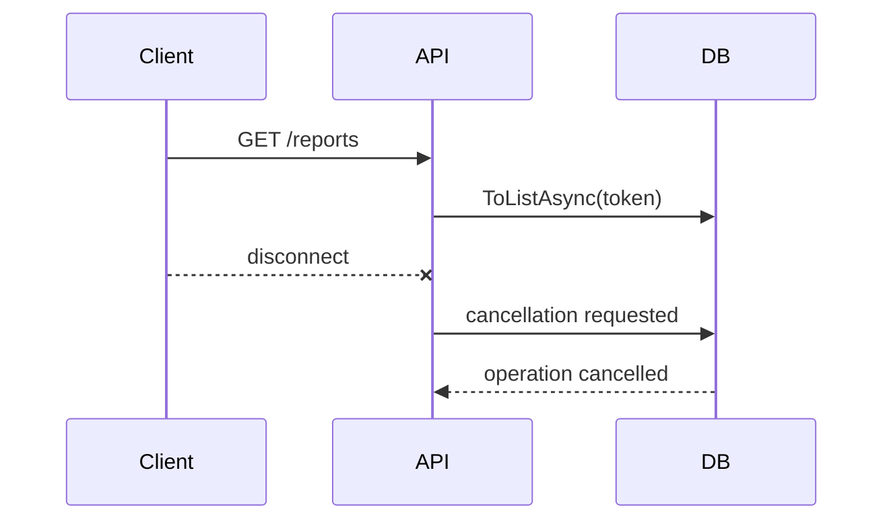
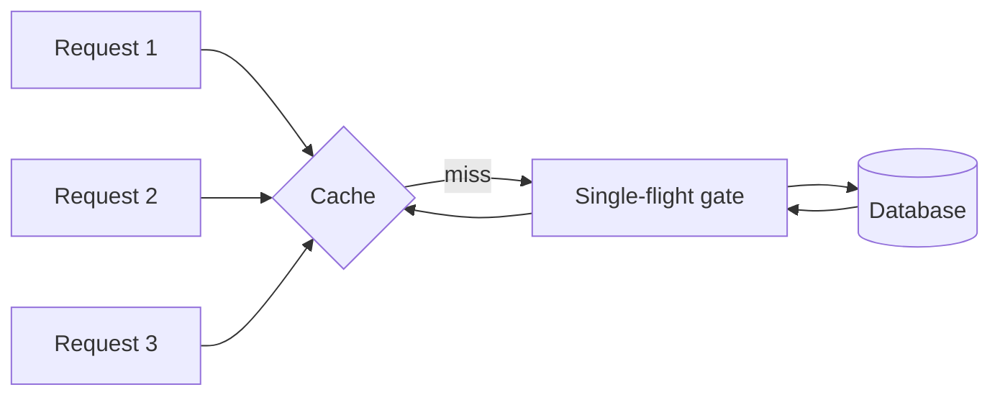
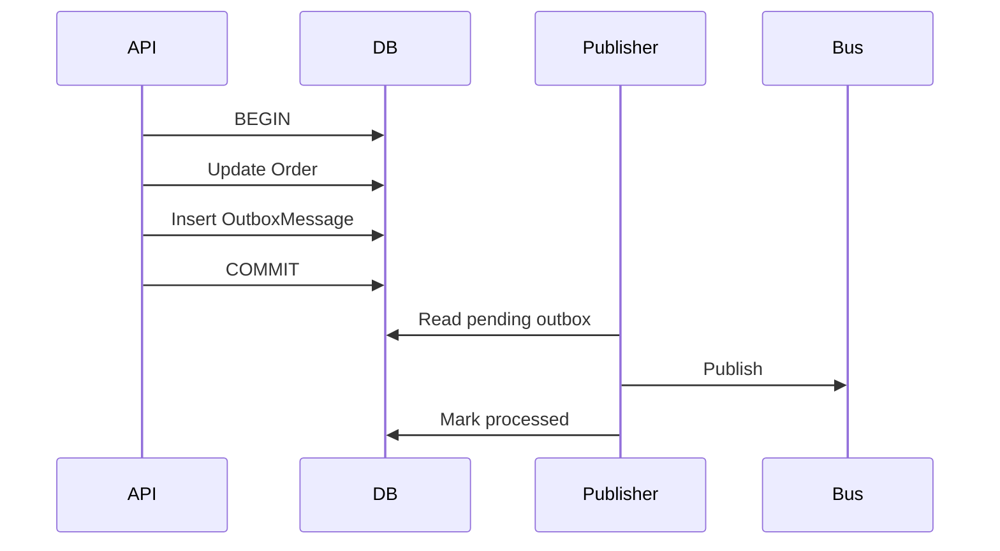
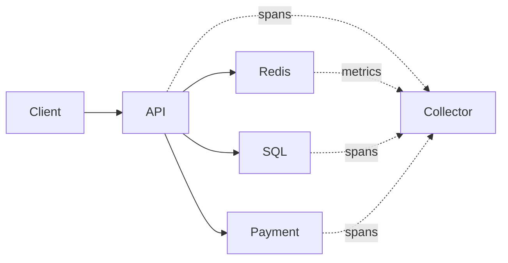
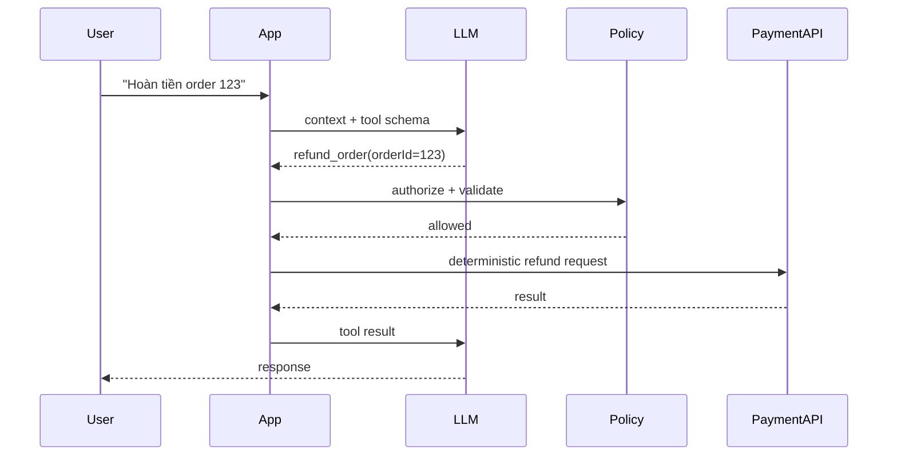

# Daily Knowledge Sharing — 2026-09-16

## Today’s Topics

1. `CancellationToken` propagation và cooperative cancellation trong ASP.NET Core
2. EF Core optimistic concurrency với `rowversion`
3. SQL Server keyset pagination thay cho `OFFSET/FETCH`
4. Redis cache stampede và request coalescing
5. Outbox Pattern: nối database transaction với message publishing
6. Azure Service Bus idempotent consumer và duplicate delivery
7. OpenTelemetry: nối Logs, Metrics và Traces khi điều tra latency
8. Kubernetes readiness probe và zero-downtime rolling deployment
9. Contract testing cho API giữa các service
10. AI Tool Calling: giữ business-critical logic deterministic

---

# 1. `CancellationToken` propagation và cooperative cancellation trong ASP.NET Core

## 1. What is it?

`CancellationToken` là tín hiệu cooperative cancellation: nó không cưỡng chế dừng thread mà cho phép các tầng đang thực hiện công việc nhận biết rằng kết quả không còn cần thiết và tự kết thúc an toàn. Trong ASP.NET Core, `HttpContext.RequestAborted` đại diện cho việc request đã bị client hủy hoặc connection bị đóng.

Mental model quan trọng là cancellation phải đi xuyên suốt call chain:

`HTTP request → application service → EF Core / HttpClient → dependency`.

## 2. Why does it exist?

Nếu browser đã đóng tab nhưng API vẫn query database 20 giây, gọi ba external APIs và serialize response thì toàn bộ tài nguyên đó trở thành wasted work. Ở tải lớn, wasted work làm tăng connection usage, ThreadPool pressure và tail latency cho request còn sống.

## 3. How does it work?

ASP.NET Core cung cấp token cho endpoint. API truyền token xuống dependency. API bất đồng bộ như EF Core và `HttpClient` quan sát token và hủy operation nếu có thể.



Cancellation là cooperative nên code CPU-bound phải tự kiểm tra token; token không tự động giết execution.

## 4. Practical implementation

```csharp
app.MapGet("/reports/{id:int}", async (
    int id,
    ReportService service,
    CancellationToken cancellationToken) =>
{
    var report = await service.GetAsync(id, cancellationToken);
    return report is null ? Results.NotFound() : Results.Ok(report);
});

public Task<ReportDto?> GetAsync(int id, CancellationToken ct) =>
    db.Reports
      .AsNoTracking()
      .Where(x => x.Id == id)
      .Select(x => new ReportDto(x.Id, x.Name))
      .SingleOrDefaultAsync(ct);
```

Đừng nhận token ở controller rồi bỏ nó khi xuống repository hoặc external client.

## 5. Real production scenario

Một endpoint export report chạy query lớn. Người dùng cancel request sau 2 giây nhưng query vẫn chạy 40 giây. Khi nhiều người retry, database bị chất đầy query không còn consumer. Propagation token giúp giải phóng capacity sớm hơn.

## 6. Failure scenario & troubleshooting

**Symptom:** request timeout ở gateway nhưng SQL CPU vẫn cao. **Evidence:** trace kết thúc ở gateway trong khi database query tiếp tục chạy. **Hypothesis:** cancellation không được propagate. **Diagnosis:** tìm các call `ToListAsync()`/`SendAsync()` không nhận token. **Fix:** truyền token xuyên call chain. **Verification:** cancel load-test request và xác nhận dependency duration giảm, connection được trả pool sớm.

## 7. Common mistakes

- Tạo `new CancellationTokenSource()` ở mỗi layer và làm mất token gốc.
- Catch `OperationCanceledException` rồi log `Error` như application failure.
- Dùng cancellation thay cho timeout; hai khái niệm liên quan nhưng không giống nhau.
- Cho rằng mọi operation sẽ dừng tức thì.

## 8. Alternatives

Timeout giới hạn thời lượng operation; cancellation thể hiện caller không còn cần kết quả. Production thường cần cả hai và có thể linked token khi muốn kết hợp deadline nội bộ với request cancellation.

## 9. Trade-offs

### Advantages

Giảm wasted work, giải phóng dependency capacity và làm shutdown sạch hơn.

### Costs / Risks

Code phải propagate token nhất quán; cancellation giữa một transaction cần được thiết kế để không để state dở dang.

## 10. Junior → Middle → Senior → Technical Lead

### Junior

Hiểu token là tín hiệu, không phải thread-kill mechanism.

### Middle

Truyền token qua controller, service, EF Core và `HttpClient`.

### Senior

Phân biệt cancellation, timeout, retry; quan sát behavior khi transaction hoặc external dependency bị hủy.

### Technical Lead / Architect

Đặt cancellation/deadline policy nhất quán cho request, background work và service-to-service calls thay vì để từng team tự quyết tùy ý.

## 11. Key takeaway

- Cancellation chỉ có giá trị khi được propagate tới nơi thực sự tiêu tài nguyên.
- Request đã chết nhưng dependency vẫn chạy là một dạng capacity leak.
- Cancellation và timeout giải quyết hai intent khác nhau.

---

# 2. EF Core optimistic concurrency với `rowversion`

## 1. What is it?

Optimistic concurrency cho phép nhiều request đọc cùng dữ liệu nhưng phát hiện conflict tại thời điểm update thay vì khóa record từ lúc đọc. Với SQL Server, `rowversion` là concurrency token thuận tiện: database thay đổi giá trị này mỗi lần row được update.

## 2. Why does it exist?

Nếu hai manager cùng mở một employee record, A sửa salary rồi B lưu form cũ, update của B có thể âm thầm ghi đè thay đổi của A. Đây là lost update. Giữ database lock suốt thời gian người dùng xem form là không thực tế, nên conflict được kiểm tra khi ghi.

## 3. How does it work?

EF Core đưa concurrency token vào `WHERE`:

```sql
UPDATE Employees
SET Salary = @salary
WHERE Id = @id AND Version = @originalVersion;
```

Nếu row đã đổi, affected rows bằng 0 và EF Core ném `DbUpdateConcurrencyException`.

## 4. Practical implementation

```csharp
public sealed class Employee
{
    public int Id { get; set; }
    public decimal Salary { get; set; }

    [Timestamp]
    public byte[] Version { get; set; } = [];
}
```

API nên round-trip version, ví dụ qua DTO/ETag, rồi xử lý conflict có chủ đích:

```csharp
try
{
    await db.SaveChangesAsync(ct);
}
catch (DbUpdateConcurrencyException)
{
    return Results.Conflict(new
    {
        code = "employee_concurrency_conflict",
        message = "Dữ liệu đã được thay đổi bởi request khác."
    });
}
```

## 5. Real production scenario

Approval workflow có hai approver thao tác gần đồng thời. Một người approve, người kia reject dựa trên state cũ. Concurrency token ngăn thao tác thứ hai giả định rằng state vẫn như lúc đọc.

## 6. Failure scenario & troubleshooting

**Symptom:** thay đổi của người dùng biến mất mà không có error. **Evidence:** audit log cho thấy hai updates gần nhau. **Hypothesis:** last-write-wins không chủ đích. **Diagnosis:** SQL update chỉ lọc theo primary key. **Fix:** thêm concurrency token và conflict handling. **Verification:** chạy hai DbContext đọc cùng version; save context A rồi context B, context B phải conflict.

## 7. Common mistakes

- Catch `DbUpdateConcurrencyException` rồi retry vô điều kiện; retry với dữ liệu stale có thể lại ghi đè business decision.
- Không trả version cho client.
- Dùng concurrency token nhưng map DTO làm mất original value.
- Nhầm optimistic concurrency với database transaction isolation.

## 8. Alternatives

Pessimistic locking phù hợp với critical section ngắn và contention đặc biệt; application-managed token hữu ích trên database không có `rowversion`; ETag/`If-Match` đưa concurrency semantics lên HTTP contract.

## 9. Trade-offs

### Advantages

Không giữ lock trong user think-time, scale tốt cho workload contention thấp.

### Costs / Risks

Conflict phải được xử lý ở UX/business layer; merge tự động không phải lúc nào đúng.

## 10. Junior → Middle → Senior → Technical Lead

### Junior

Hiểu lost update và version check.

### Middle

Cấu hình token, bắt exception và viết integration test conflict.

### Senior

Quyết định retry, merge hay trả conflict dựa trên business invariant.

### Technical Lead / Architect

Xác định concurrency contract xuyên API, persistence và UX cho các aggregate quan trọng.

## 11. Key takeaway

- Optimistic concurrency phát hiện stale write; nó không tự quyết định cách giải conflict.
- Retry concurrency conflict vô điều kiện thường là sai business semantics.
- Concurrency là contract, không chỉ là annotation trên entity.

---

# 3. SQL Server keyset pagination thay cho `OFFSET/FETCH`

## 1. What is it?

Keyset pagination lấy trang tiếp theo dựa trên giá trị cuối cùng đã thấy, ví dụ `(CreatedAt, Id)`, thay vì yêu cầu database bỏ qua N rows bằng `OFFSET`.

## 2. Why does it exist?

`OFFSET 500000 ROWS` vẫn buộc engine đi qua lượng dữ liệu lớn trước khi trả 20 rows. Với feed lớn, latency tăng theo page depth và dữ liệu chèn/xóa giữa các request có thể làm duplicate hoặc skip item.

## 3. How does it work?

Với ordering ổn định:

```sql
ORDER BY CreatedAt DESC, Id DESC
```

cursor chứa row cuối của trang trước. Trang sau query:

```sql
WHERE CreatedAt < @createdAt
   OR (CreatedAt = @createdAt AND Id < @id)
ORDER BY CreatedAt DESC, Id DESC
```

Composite index tương ứng cho phép seek thay vì deep scan.

## 4. Practical implementation

```csharp
var query = db.Orders.AsNoTracking();

if (cursor is not null)
{
    query = query.Where(x =>
        x.CreatedAt < cursor.CreatedAt ||
        (x.CreatedAt == cursor.CreatedAt && x.Id < cursor.Id));
}

var page = await query
    .OrderByDescending(x => x.CreatedAt)
    .ThenByDescending(x => x.Id)
    .Take(51)
    .ToListAsync(ct);
```

Index nên phù hợp với access pattern, ví dụ `(CreatedAt DESC, Id DESC)` và `INCLUDE` các column cần thiết nếu evidence cho thấy lookup cost đáng kể.

## 5. Real production scenario

Order history có hàng chục triệu rows. Trang đầu nhanh 40 ms nhưng page 10.000 mất vài giây. Chuyển sang cursor-based API làm latency gần như ổn định theo depth.

## 6. Failure scenario & troubleshooting

**Symptom:** p95 tăng mạnh khi `pageNumber` lớn. **Evidence:** execution plan và logical reads tăng theo offset. **Hypothesis:** deep pagination. **Diagnosis:** query dùng `Skip(page * size)`. **Fix:** keyset pagination với stable ordering/index. **Verification:** benchmark page đầu và cursor ở vùng dữ liệu sâu; so logical reads và duration.

## 7. Common mistakes

- Cursor chỉ dùng `CreatedAt` dù nhiều rows cùng timestamp.
- Ordering không deterministic.
- Encode cursor nhưng không validate/filter context.
- Chọn keyset dù UI bắt buộc jump trực tiếp tới page 4.321.

## 8. Alternatives

`OFFSET/FETCH` đơn giản và phù hợp dataset nhỏ hoặc admin UI cần random page access. Keyset phù hợp feed/scroll/next-page APIs. Search engine có cơ chế cursor riêng cho search workloads.

## 9. Trade-offs

### Advantages

Latency ổn định hơn, ít duplicate/skip do mutation, index seek hiệu quả.

### Costs / Risks

Khó jump arbitrary page; cursor contract phức tạp hơn và gắn với sort/filter semantics.

## 10. Junior → Middle → Senior → Technical Lead

### Junior

Hiểu `OFFSET` khác `WHERE key > lastKey`.

### Middle

Viết deterministic ordering và cursor DTO.

### Senior

Đọc execution plan, logical reads và thiết kế composite index.

### Technical Lead / Architect

Chọn pagination contract dựa trên UX, scale, consistency expectation và backward compatibility.

## 11. Key takeaway

- Pagination là database access pattern, không chỉ API parameter.
- Keyset cần unique deterministic ordering.
- Đừng thêm index theo cảm tính; đo execution plan và I/O.

---

# 4. Redis cache stampede và request coalescing

## 1. What is it?

Cache stampede xảy ra khi một hot key hết hạn và nhiều request đồng thời cùng miss cache rồi cùng truy vấn backend. Request coalescing cho phép một execution tải dữ liệu, các request khác chờ cùng kết quả thay vì nhân tải xuống dependency.

## 2. Why does it exist?

Cache thường che database khỏi traffic cao. Nhưng đúng thời điểm TTL hết, 1.000 request có thể biến thành 1.000 SQL queries. Cache từ performance optimization trở thành trigger cho outage.

## 3. How does it work?



Gate có thể local per instance hoặc distributed tùy topology. TTL jitter giảm khả năng nhiều keys expire cùng lúc.

## 4. Practical implementation

Trong một instance, có thể dùng keyed `SemaphoreSlim` hoặc thư viện cache có stampede protection. Logic tối giản:

```csharp
await gate.WaitAsync(ct);
try
{
    var cached = await cache.GetStringAsync(key, ct);
    if (cached is not null)
        return Deserialize(cached);

    var value = await repository.LoadAsync(id, ct);
    await cache.SetStringAsync(key, Serialize(value), options, ct);
    return value;
}
finally
{
    gate.Release();
}
```

Quan trọng là **double-check cache sau khi lấy gate**; request trước có thể đã populate cache.

## 5. Real production scenario

Product detail page có flash sale. Key inventory summary TTL 60 giây. Mỗi phút database CPU spike vì hàng nghìn requests cùng miss. Jitter + request coalescing làm backend load mượt hơn.

## 6. Failure scenario & troubleshooting

**Symptom:** Redis hit rate nhìn chung cao nhưng DB có spike tuần hoàn. **Evidence:** spike trùng timestamp expiration của hot keys. **Hypothesis:** stampede. **Diagnosis:** cache miss fan-out. **Fix:** single-flight, jitter, stale-while-revalidate nếu business cho phép. **Verification:** load test qua expiration boundary và đo concurrent DB calls.

## 7. Common mistakes

- Dùng một global lock cho mọi cache key.
- Distributed lock không có timeout/ownership safety.
- TTL của hàng nghìn keys giống hệt nhau.
- Khi Redis down, toàn bộ traffic lập tức đổ vào DB mà không có protection.

## 8. Alternatives

Stale-while-revalidate ưu tiên availability/freshness trade-off; proactive refresh phù hợp hot predictable data; no-cache có thể đơn giản hơn nếu DB vốn đủ capacity.

## 9. Trade-offs

### Advantages

Giảm backend amplification và ổn định latency quanh expiration.

### Costs / Risks

Locking/coalescing tăng complexity; stale serving ảnh hưởng freshness; distributed coordination có operational cost.

## 10. Junior → Middle → Senior → Technical Lead

### Junior

Hiểu cache miss không phải lúc nào chỉ tạo một DB call.

### Middle

Implement double-check và per-key coalescing.

### Senior

Thiết kế behavior khi Redis lỗi, gate timeout, hot key và multi-instance.

### Technical Lead / Architect

Quyết định cache có đáng tồn tại và consistency/failure policy nào business chấp nhận.

## 11. Key takeaway

- Cache có thể khuếch đại tải đúng lúc nó hết hạn.
- Stampede protection phải xét multi-instance topology.
- Redis outage behavior quan trọng không kém happy path.

---

# 5. Outbox Pattern: nối database transaction với message publishing

## 1. What is it?

Outbox Pattern lưu business state và một message record trong **cùng local database transaction**. Một publisher riêng đọc outbox và gửi message ra broker sau đó.

## 2. Why does it exist?

Không có distributed transaction, sequence này có lỗ hổng:

`Save DB → process crash → Publish message`.

Database đã commit nhưng event chưa bao giờ được gửi. Đảo thứ tự lại tạo lỗi ngược: message đã gửi nhưng DB rollback.

## 3. How does it work?



Outbox biến atomicity problem giữa DB và broker thành eventual delivery problem. Publisher vẫn có thể gửi duplicate nếu crash sau publish trước khi mark processed.

## 4. Practical implementation

```csharp
await using var tx = await db.Database.BeginTransactionAsync(ct);

order.Confirm();

db.OutboxMessages.Add(new OutboxMessage
{
    Id = Guid.NewGuid(),
    Type = "OrderConfirmed",
    Payload = JsonSerializer.Serialize(new { order.Id }),
    OccurredAtUtc = DateTimeOffset.UtcNow
});

await db.SaveChangesAsync(ct);
await tx.CommitAsync(ct);
```

Publisher chạy batch, có retry/backoff và telemetry cho oldest pending message.

## 5. Real production scenario

Checkout commit order rồi cần gửi `OrderConfirmed` để inventory và notification xử lý. Nếu broker tạm unavailable, checkout transaction vẫn có thể commit; outbox giữ intent để publish sau.

## 6. Failure scenario & troubleshooting

**Symptom:** order tồn tại nhưng inventory không reserve. **Evidence:** outbox row pending lâu. **Hypothesis:** publisher/broker failure. **Diagnosis:** kiểm tra outbox age, publisher logs, broker health. **Fix:** phục hồi publisher và retry an toàn. **Verification:** backlog drain, consumer nhận event, alert trở về normal.

## 7. Common mistakes

- Insert outbox ngoài transaction business.
- Xóa row ngay sau publish mà không có retention/audit strategy.
- Giả định Outbox tạo exactly-once delivery.
- Không monitor backlog/oldest message.

## 8. Alternatives

Distributed transaction chỉ khả dụng trong topology hạn chế và tăng coupling. Direct publish đơn giản hơn nếu mất message thực sự chấp nhận được. CDC có thể phát change nhưng semantics business cần thiết kế rõ.

## 9. Trade-offs

### Advantages

Loại bỏ dual-write gap và chịu được broker outage tốt hơn.

### Costs / Risks

Thêm table, publisher, cleanup, duplicate handling và eventual consistency.

## 10. Junior → Middle → Senior → Technical Lead

### Junior

Hiểu vì sao hai writes tới hai systems không atomic.

### Middle

Implement transaction + outbox publisher.

### Senior

Xử lý duplicate, ordering, poison messages, cleanup và observability.

### Technical Lead / Architect

Quyết định boundary nào cần reliable event publication và operational burden có đáng hay không.

## 11. Key takeaway

- Outbox giải dual-write consistency, không tạo exactly-once processing.
- Consumer vẫn phải idempotent.
- Outbox backlog là production signal cần monitor.

---

# 6. Azure Service Bus idempotent consumer và duplicate delivery

## 1. What is it?

Azure Service Bus consumer phải giả định message có thể được delivery nhiều lần. Idempotent consumer đảm bảo xử lý cùng logical message nhiều lần nhưng business effect chỉ xảy ra một lần.

## 2. Why does it exist?

Trong `PeekLock`, consumer xử lý message rồi `Complete`. Nếu business transaction commit nhưng process crash trước `Complete`, lock hết hạn và message được delivery lại. Đây là behavior bình thường của at-least-once delivery.

## 3. How does it work?

```text
Receive message M
   ↓
Check Inbox(M.Id)
   ↓ not processed
Business update + Inbox insert
   ↓ same DB transaction
Commit
   ↓
Complete message
```

Nếu message quay lại, Inbox cho biết effect đã được commit.

## 4. Practical implementation

```csharp
await using var tx = await db.Database.BeginTransactionAsync(ct);

if (await db.InboxMessages.AnyAsync(x => x.MessageId == message.MessageId, ct))
{
    await receiver.CompleteMessageAsync(message, ct);
    return;
}

await ApplyBusinessChangeAsync(message, ct);

db.InboxMessages.Add(new InboxMessage
{
    MessageId = message.MessageId,
    ProcessedAtUtc = DateTimeOffset.UtcNow
});

await db.SaveChangesAsync(ct);
await tx.CommitAsync(ct);
await receiver.CompleteMessageAsync(message, ct);
```

Database nên enforce unique constraint trên `MessageId` để race vẫn an toàn.

## 5. Real production scenario

Payment event bị redeliver sau worker restart. Nếu handler gửi shipment lần nữa, doanh nghiệp chịu double fulfillment. Idempotency key gắn với business operation ngăn effect lặp.

## 6. Failure scenario & troubleshooting

**Symptom:** duplicate invoice/shipment. **Evidence:** cùng `MessageId` xuất hiện nhiều lần. **Hypothesis:** handler không idempotent. **Diagnosis:** business write commit trước crash nhưng không có inbox/dedup record. **Fix:** transactional deduplication. **Verification:** cố tình crash sau DB commit rồi để redelivery; effect count vẫn bằng một.

## 7. Common mistakes

- Tin rằng broker duplicate detection thay thế consumer idempotency.
- Dedup record và business change ở hai transaction khác nhau.
- Dùng in-memory `HashSet` trên nhiều replicas.
- Retry non-idempotent external API mà không có idempotency contract.

## 8. Alternatives

Business operation tự nhiên idempotent (`SET status = X`) có thể đủ. Broker duplicate detection giảm duplicate ở send side nhưng không bao phủ mọi redelivery scenario. Exactly-once end-to-end thường đắt và khó hơn nhiều so với idempotent effects.

## 9. Trade-offs

### Advantages

Cho phép retry/redelivery an toàn và tăng reliability.

### Costs / Risks

Cần storage, retention, unique key và xác định đúng logical idempotency boundary.

## 10. Junior → Middle → Senior → Technical Lead

### Junior

Hiểu message có thể đến lại dù broker hoạt động đúng.

### Middle

Implement inbox/unique constraint và settlement đúng.

### Senior

Phân tích lock expiry, retry, external side effects và ordering.

### Technical Lead / Architect

Đặt message identity/idempotency contract xuyên producer-consumer và quyết định retention/correctness policy.

## 11. Key takeaway

- At-least-once delivery đòi hỏi idempotent effect.
- Deduplication phải atomic với business change nếu muốn bảo vệ crash window.
- `Complete` message không phải business transaction.

---

# 7. OpenTelemetry: nối Logs, Metrics và Traces khi điều tra latency

## 1. What is it?

OpenTelemetry cung cấp chuẩn instrumentation cho traces, metrics và logs. Mental model không phải “thêm logging”, mà là tạo evidence có correlation để theo request qua nhiều components.

## 2. Why does it exist?

Log riêng lẻ trả lời “đã xảy ra gì ở process này”; metric trả lời “hệ thống đang xấu đến mức nào”; trace trả lời “thời gian đi đâu trong request cụ thể”. Incident investigation cần kết hợp cả ba.

## 3. How does it work?



Trace context (`trace_id`, `span_id`) propagate qua HTTP/messaging để telemetry từ nhiều service có thể liên kết.

## 4. Practical implementation

```csharp
builder.Services.AddOpenTelemetry()
    .WithTracing(t => t
        .AddAspNetCoreInstrumentation()
        .AddHttpClientInstrumentation()
        .AddEntityFrameworkCoreInstrumentation())
    .WithMetrics(m => m
        .AddAspNetCoreInstrumentation()
        .AddHttpClientInstrumentation()
        .AddRuntimeInstrumentation());
```

Custom span chỉ nên thêm khi nó biểu diễn operation có giá trị chẩn đoán, không instrument mọi method.

## 5. Real production scenario

API p95 từ 300 ms lên 1.8 s. Metrics chỉ ra degradation bắt đầu 14:05. Trace samples cho thấy SQL vẫn 50 ms nhưng external pricing API tăng từ 100 ms lên 1.5 s. Logs của dependency call cùng `trace_id` xác nhận timeout/retry.

## 6. Failure scenario & troubleshooting

**Symptom:** dashboard báo latency tăng nhưng logs không chỉ ra component. **Evidence:** telemetry thiếu dependency spans. **Hypothesis:** context/instrumentation gap. **Diagnosis:** kiểm tra propagation và instrumentation. **Fix:** instrument outbound HTTP/DB và chuẩn hóa resource/service metadata. **Verification:** một synthetic request tạo trace hoàn chỉnh xuyên service boundary.

## 7. Common mistakes

- Log mọi thứ ở `Information` rồi gọi đó là observability.
- High-cardinality labels như `userId` trong metrics.
- Sampling quá mạnh làm mất rare failures mà không có strategy.
- Không propagate context qua message headers.

## 8. Alternatives

Vendor-native agents có thể nhanh hơn để bắt đầu; Application Insights cung cấp integrated Azure experience; OpenTelemetry giảm coupling với một telemetry backend và chuẩn hóa instrumentation.

## 9. Trade-offs

### Advantages

Correlation tốt, portability và ecosystem instrumentation rộng.

### Costs / Risks

Telemetry volume/cost, sampling complexity và data governance cần quản lý.

## 10. Junior → Middle → Senior → Technical Lead

### Junior

Phân biệt log, metric, trace.

### Middle

Instrument ASP.NET Core, HTTP và DB; dùng trace để tìm slow span.

### Senior

Thiết kế sampling, cardinality, SLI và incident investigation.

### Technical Lead / Architect

Đặt observability contract, retention/cost policy và ownership để telemetry phục vụ vận hành thay vì chỉ tạo dữ liệu.

## 11. Key takeaway

- Metrics phát hiện, traces localize, logs giải thích chi tiết.
- Correlation context phải đi qua service boundary.
- Telemetry không có query/alert strategy chỉ là chi phí lưu trữ.

---

# 8. Kubernetes readiness probe và zero-downtime rolling deployment

## 1. What is it?

Readiness probe trả lời: “Pod này hiện có nên nhận traffic không?”. Nó khác liveness: “Process này có cần restart không?”. Trong rolling deployment, readiness là một phần quan trọng để Service chỉ route tới replica đã sẵn sàng.

## 2. Why does it exist?

Container process có thể start trong 500 ms nhưng application cần 10 giây load configuration, warm cache hoặc establish dependencies. Route traffic quá sớm tạo 5xx ngay trong deployment.

## 3. How does it work?

```text
New Pod starts
   ↓
readiness = false
   ↓
startup completes
   ↓
readiness = true
   ↓
Service endpoints include Pod
   ↓
traffic arrives
```

Khi shutdown, application cần trở thành unready và có thời gian drain inflight requests trước termination.

## 4. Practical implementation

ASP.NET Core:

```csharp
builder.Services.AddHealthChecks()
    .AddCheck<StartupHealthCheck>("startup", tags: ["ready"]);

app.MapHealthChecks("/health/ready", new HealthCheckOptions
{
    Predicate = check => check.Tags.Contains("ready")
});
```

Kubernetes:

```yaml
readinessProbe:
  httpGet:
    path: /health/ready
    port: 8080
  periodSeconds: 5
  timeoutSeconds: 2
```

Không nên đưa mọi optional dependency vào readiness nếu một dependency phụ bị down sẽ làm toàn bộ replicas cùng bị rút khỏi traffic.

## 5. Real production scenario

Release mới chạy migration/warmup trong startup. Không có readiness, ingress gửi request ngay và user thấy 503/500 trong 15 giây đầu mỗi rollout.

## 6. Failure scenario & troubleshooting

**Symptom:** deployment tạo burst 5xx dù pods cuối cùng `Running`. **Evidence:** requests tới pod vài giây trước khi initialization hoàn tất. **Hypothesis:** readiness không phản ánh serving state. **Diagnosis:** xem probe events, endpoint membership và startup logs. **Fix:** readiness đúng semantics + graceful termination. **Verification:** rolling deploy dưới load và theo dõi error rate/p95.

## 7. Common mistakes

- Dùng cùng endpoint cho liveness và readiness với dependency check nặng.
- Liveness fail khi database tạm lỗi, khiến tất cả pods restart và làm incident nặng hơn.
- Readiness luôn trả 200 dù app chưa warmup.
- Không xét graceful shutdown và connection draining.

## 8. Alternatives

Azure App Service health checks có semantics khác nhưng cùng mục tiêu routing healthy instances. Với app đơn giản một instance, orchestration phức tạp có thể không cần thiết; deployment slot có thể là lựa chọn dễ vận hành hơn.

## 9. Trade-offs

### Advantages

Giảm deployment-induced errors và tách process health khỏi traffic eligibility.

### Costs / Risks

Probe sai có thể tự tạo outage; dependency checks tăng coupling giữa service health và downstream health.

## 10. Junior → Middle → Senior → Technical Lead

### Junior

Phân biệt `Running` với `Ready`.

### Middle

Implement health endpoints và probes.

### Senior

Thiết kế startup/shutdown, dependency health semantics và rollout test.

### Technical Lead / Architect

Quyết định deployment strategy, availability budget và health contract phù hợp với topology.

## 11. Key takeaway

- `Running` không có nghĩa là sẵn sàng nhận traffic.
- Readiness và liveness có mục đích khác nhau.
- Health check sai có thể biến dependency degradation thành toàn hệ thống unavailable.

---

# 9. Contract testing cho API giữa các service

## 1. What is it?

Contract testing xác minh provider và consumer đồng ý về interface: route, method, schema, required fields, status/error semantics và đôi khi message schema. Nó nằm giữa unit test và full E2E test.

## 2. Why does it exist?

Hai service có thể đều pass unit tests nhưng production vẫn vỡ vì provider rename field hoặc thay nullable thành required. Full E2E bắt được một số lỗi nhưng chậm, fragile và khó bao phủ mọi consumer expectation.

## 3. How does it work?

Consumer contract mô tả interaction mà consumer thực sự phụ thuộc. Provider verification chạy contract đó trên provider build. Pipeline ngăn deployment nếu provider phá contract chưa được phối hợp.

```text
Consumer expectation
       ↓
Contract artifact
       ↓
Provider verification
       ↓
Compatibility decision
```

## 4. Practical implementation

Với OpenAPI-based workflow, CI có thể compare schema compatibility và chạy integration tests trên representative requests. Một consumer test nên tập trung behavior cần thiết:

```csharp
var response = await client.GetAsync("/api/products/42");
response.EnsureSuccessStatusCode();

var product = await response.Content.ReadFromJsonAsync<ProductContract>();
Assert.NotNull(product);
Assert.Equal(42, product.Id);
Assert.False(string.IsNullOrWhiteSpace(product.Name));
```

Quan trọng hơn framework là ownership và compatibility policy.

## 5. Real production scenario

Product API đổi `price` từ number sang object `{ amount, currency }`. Frontend BFF chưa migrate. Provider contract verification phải phát hiện breaking change trước production.

## 6. Failure scenario & troubleshooting

**Symptom:** deployment provider thành công nhưng consumer bắt đầu deserialize fail. **Evidence:** payload production khác consumer expectation. **Hypothesis:** contract drift. **Diagnosis:** pipeline không verify consumer contract. **Fix:** version/compatibility strategy và provider verification. **Verification:** cố tình đưa breaking schema change; CI phải fail.

## 7. Common mistakes

- Snapshot toàn payload, làm test quá brittle.
- Contract test business internals thay vì public boundary.
- Tin rằng contract test thay thế integration/E2E tests.
- Không quản lý contract version và consumer ownership.

## 8. Alternatives

Shared DTO package tạo compile-time coupling và không giải runtime deployment compatibility hoàn toàn. E2E mạnh hơn cho user journey nhưng đắt và flaky hơn. Schema diff hữu ích nhưng không chứng minh semantic behavior.

## 9. Trade-offs

### Advantages

Feedback sớm, isolate compatibility risk và giảm nhu cầu giant E2E environments.

### Costs / Risks

Thêm pipeline/artifact governance; stale contracts có thể tạo false confidence.

## 10. Junior → Middle → Senior → Technical Lead

### Junior

Hiểu API contract không chỉ là method signature trong code.

### Middle

Viết consumer/provider integration tests và validate schema.

### Senior

Phân loại breaking/non-breaking changes và thiết kế versioning rollout.

### Technical Lead / Architect

Đặt ownership, compatibility window và deployment policy cho service boundaries.

## 11. Key takeaway

- Contract testing bảo vệ boundary, không thay thế mọi test layer.
- Compatibility là vấn đề deployment, không chỉ compile-time.
- Test đúng những gì consumer phụ thuộc, tránh snapshot toàn implementation.

---

# 10. AI Tool Calling: giữ business-critical logic deterministic

## 1. What is it?

Tool Calling cho phép LLM chọn một tool/function với structured arguments; application thực thi tool và đưa kết quả trở lại model. Model quyết định **đề xuất hành động**, nhưng application vẫn sở hữu authorization, validation và side effects.

## 2. Why does it exist?

LLM giỏi diễn giải ngôn ngữ tự nhiên nhưng output mang tính probabilistic. Enterprise workflow cần kết nối model với dữ liệu/actions thật mà không cho model trực tiếp trở thành nguồn chân lý cho financial/security decisions.

## 3. How does it work?



Tool schema giới hạn shape, không chứng minh arguments đúng hoặc user được phép thực hiện action.

## 4. Practical implementation

Boundary nên validate lại bằng code:

```csharp
public async Task<RefundResult> RefundOrderAsync(
    RefundArgs args,
    ClaimsPrincipal user,
    CancellationToken ct)
{
    if (!user.IsInRole("RefundApprover"))
        throw new ForbiddenException();

    if (args.Amount <= 0)
        throw new ValidationException("Amount must be positive.");

    var order = await orders.GetAsync(args.OrderId, ct);
    if (args.Amount > order.RefundableAmount)
        throw new ValidationException("Refund exceeds refundable amount.");

    return await payments.RefundAsync(
        order.PaymentId,
        args.Amount,
        idempotencyKey: args.OperationId,
        ct);
}
```

Model không được tự quyết `RefundableAmount` hay authorization.

## 5. Real production scenario

Support agent dùng AI assistant để tra order, tóm tắt case và đề xuất refund. LLM có thể gọi read tools tự động; write tool yêu cầu deterministic policy và có thể cần human approval tùy amount.

## 6. Failure scenario & troubleshooting

**Symptom:** model gọi tool với order ID không thuộc tenant hiện tại. **Evidence:** tool-call arguments hợp schema nhưng sai authorization scope. **Hypothesis:** team coi Structured Output là security validation. **Diagnosis:** tool executor không enforce tenant/user policy. **Fix:** authorize tại deterministic tool boundary. **Verification:** adversarial tests với cross-tenant IDs và prompt injection phải bị từ chối bởi application dù model yêu cầu action.

## 7. Common mistakes

- Tin structured JSON nghĩa là dữ liệu đúng.
- Đưa secret vào prompt/tool result không cần thiết.
- Cho model quyết định authorization hoặc giá tiền cuối cùng.
- Retry write tool mà không có idempotency.
- Không log tool name, sanitized arguments, outcome và correlation ID.

## 8. Alternatives

Workflow deterministic hoàn toàn phù hợp nếu intent hữu hạn và rule rõ. LLM chỉ nên được thêm khi natural-language interpretation/flexible reasoning tạo giá trị. RAG cung cấp context nhưng không thay thế action boundary.

## 9. Trade-offs

### Advantages

Natural-language UX linh hoạt, dễ orchestration nhiều capabilities và giảm glue code cho intent interpretation.

### Costs / Risks

Probabilistic decisions, token/latency cost, prompt injection, observability/evaluation burden và security boundary phức tạp hơn.

## 10. Junior → Middle → Senior → Technical Lead

### Junior

Hiểu model đề xuất tool call; application thực thi.

### Middle

Implement schema, validation, timeout, retry và error handling.

### Senior

Thiết kế idempotency, authorization, prompt-injection defenses, evaluation và telemetry.

### Technical Lead / Architect

Quyết định capability nào được model orchestrate, capability nào phải deterministic/human-approved, cùng data boundary và blast radius.

## 11. Key takeaway

- Tool schema là interface contract, không phải authorization boundary.
- Security-critical và financial correctness phải được enforce bằng deterministic code.
- Write tools cần idempotency, auditability và blast-radius controls.

---
