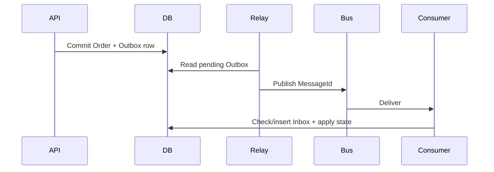

# Daily Knowledge Sharing — 2026-09-17

## Today’s Topics

1. .NET `CancellationToken`: deadline propagation và cooperative cancellation xuyên call chain
2. ASP.NET Core Rate Limiting: partition key, queueing và bảo vệ downstream thay vì chỉ chặn request
3. EF Core optimistic concurrency: concurrency token, lost update và conflict resolution
4. SQL Server `READ_COMMITTED_SNAPSHOT`: giảm blocking bằng row versioning nhưng không xóa concurrency problem
5. Redis cache stampede: single-flight, TTL jitter và stale-while-revalidate
6. Outbox + Inbox Pattern: at-least-once delivery và ảo tưởng “exactly once”
7. Azure Blob Storage security: Managed Identity, SAS và ownership của quyền truy cập
8. OpenTelemetry sampling: giữ trace hữu ích mà không biến observability thành bottleneck
9. Playwright E2E: deterministic test, test isolation và chống flaky UI automation
10. Structured Outputs trong LLM integration: schema contract nhưng business correctness vẫn phải deterministic

---

# 1. .NET `CancellationToken`: deadline propagation và cooperative cancellation xuyên call chain

## 1. What is it?

`CancellationToken` là cơ chế **cooperative cancellation**: caller phát tín hiệu rằng công việc không còn giá trị, còn code đang chạy phải chủ động quan sát token và dừng ở điểm an toàn. Token không “kill thread”. Mental model đúng là một cancellation signal được truyền xuyên toàn bộ dependency chain.

## 2. Why does it exist?

Một HTTP client đã disconnect nhưng API vẫn query database, gọi external API và serialize response là công việc vô ích. Nếu nhiều request như vậy tồn tại, tài nguyên bị giữ lâu hơn cần thiết và có thể gây connection-pool pressure hoặc queue backlog. Cancellation cho phép lifetime của work bám theo lifetime của request hoặc deadline nghiệp vụ.

## 3. How does it work?

Trong ASP.NET Core, `HttpContext.RequestAborted` được signal khi request bị hủy. Token nên được truyền xuống application service, EF Core, `HttpClient` và các API async hỗ trợ cancellation.

```text
Client disconnect
      │
      ▼
RequestAborted
      │
      ├── Application Service
      ├── EF Core query
      └── HttpClient call
```

Cancellation chỉ hiệu quả nếu từng layer không nuốt token và dependency thực sự hỗ trợ nó.

## 4. Practical implementation

```csharp
app.MapGet("/orders/{id:guid}", async (
    Guid id,
    OrderDbContext db,
    CancellationToken cancellationToken) =>
{
    var order = await db.Orders
        .AsNoTracking()
        .SingleOrDefaultAsync(x => x.Id == id, cancellationToken);

    return order is null ? Results.NotFound() : Results.Ok(order);
});
```

Khi có internal deadline riêng, link token thay vì thay thế request token:

```csharp
using var timeout = new CancellationTokenSource(TimeSpan.FromSeconds(2));
using var linked = CancellationTokenSource.CreateLinkedTokenSource(
    cancellationToken, timeout.Token);

await client.SendAsync(request, linked.Token);
```

## 5. Real production scenario

API tổng hợp dữ liệu từ SQL và pricing service. SLA endpoint là 3 giây. Nếu pricing service mất 10 giây mới timeout, request đã vô nghĩa trước khi dependency kết thúc. Deadline propagation giúp giải phóng socket, thread continuation và database work sớm hơn.

## 6. Failure scenario & troubleshooting

**Symptom** → client timeout ở 3 giây nhưng dependency telemetry vẫn cho thấy call 30 giây.  
**Evidence** → trace span của downstream sống lâu hơn request span.  
**Hypothesis** → token không được propagate.  
**Diagnosis** → application service gọi `SendAsync`/EF Core overload không nhận token.  
**Fix** → truyền token xuyên boundary và đặt timeout budget phù hợp.  
**Verification** → canceled request làm downstream span kết thúc gần deadline và pool pressure giảm.

## 7. Common mistakes

Nuốt `OperationCanceledException` rồi log như lỗi 500; tạo `CancellationToken.None` ở giữa call chain; dùng một timeout mới nhưng quên link với caller; cancel giữa một transaction có side effect mà không hiểu trạng thái đã commit hay chưa.

## 8. Alternatives

Timeout bảo vệ thời gian tối đa; cancellation truyền ý định dừng; circuit breaker ngăn gọi dependency đang lỗi. Chúng bổ sung nhau, không thay thế nhau.

## 9. Trade-offs

### Advantages

Giảm wasted work, cải thiện resource recovery và shutdown behavior.

### Costs / Risks

Code phải propagate token nhất quán; side-effecting operation cần boundary rõ ràng vì cancellation không phải rollback toàn cục.

## 10. Junior → Middle → Senior → Technical Lead

### Junior

Hiểu token là signal cooperative, không phải thread termination.

### Middle

Truyền token qua async call, EF Core và `HttpClient`; phân biệt cancellation với failure.

### Senior

Thiết kế timeout budget, xử lý partial side effects và đọc trace để tìm work tiếp tục sau request cancellation.

### Technical Lead / Architect

Định nghĩa deadline policy xuyên service boundary và quyết định operation nào được phép tiếp tục độc lập với request, ví dụ durable background work.

## 11. Key takeaway

- Cancellation phải được propagate end-to-end mới có giá trị.
- Timeout, cancellation và resilience policy giải quyết các vấn đề khác nhau.
- Không giả định cancellation tự động rollback side effects.

---

# 2. ASP.NET Core Rate Limiting: partition key, queueing và bảo vệ downstream thay vì chỉ chặn request

## 1. What is it?

Rate limiting giới hạn lượng work được chấp nhận theo một boundary như user, API key, tenant hoặc endpoint. Mental model quan trọng: mục tiêu chính là **admission control** để bảo vệ capacity hữu hạn phía sau API.

## 2. Why does it exist?

Nếu database chịu ổn định 500 expensive queries/giây nhưng API nhận 5.000 request/giây, nhận tất cả request chỉ biến overload thành latency, timeout và retry storm. Rate limiter từ chối sớm để hệ thống còn phục vụ được phần traffic hợp lệ.

## 3. How does it work?

ASP.NET Core có fixed window, sliding window, token bucket và concurrency limiter. Partitioned limiter tạo bucket riêng theo identity thay vì một global bucket.

```text
Requests
   │
   ▼
Partition by tenant/API key
   │
   ├── Tenant A limiter
   ├── Tenant B limiter
   └── Anonymous limiter
          │
          ▼
       Endpoint → DB
```

## 4. Practical implementation

```csharp
builder.Services.AddRateLimiter(options =>
{
    options.RejectionStatusCode = StatusCodes.Status429TooManyRequests;
    options.AddPolicy("tenant", httpContext =>
        RateLimitPartition.GetTokenBucketLimiter(
            httpContext.User.FindFirst("tenant_id")?.Value ?? "anonymous",
            _ => new TokenBucketRateLimiterOptions
            {
                TokenLimit = 100,
                TokensPerPeriod = 50,
                ReplenishmentPeriod = TimeSpan.FromSeconds(1),
                AutoReplenishment = true,
                QueueLimit = 20
            }));
});
```

## 5. Real production scenario

Một SaaS có tenant import dữ liệu bằng script lỗi, gửi hàng nghìn request/giây. Partition theo tenant ngăn tenant đó chiếm toàn bộ database capacity trong khi tenant khác vẫn hoạt động.

## 6. Failure scenario & troubleshooting

**Symptom** → p99 tăng mạnh dù 429 rất ít.  
**Evidence** → limiter queue luôn đầy, request chờ trước endpoint.  
**Hypothesis** → queueing đang chuyển overload thành latency.  
**Diagnosis** → `QueueLimit` quá lớn so với SLA.  
**Fix** → giảm queue, điều chỉnh replenishment theo downstream capacity.  
**Verification** → p99 ổn định hơn và overload được phản ánh bằng 429 rõ ràng.

## 7. Common mistakes

Rate limit theo IP sau reverse proxy mà không cấu hình forwarded headers; dùng global limiter gây noisy-neighbor; đặt limit theo con số tùy ý không dựa trên capacity; client retry 429 ngay lập tức.

## 8. Alternatives

API Gateway/Front Door có thể rate limit ở edge; queue phù hợp khi work có thể xử lý async; concurrency limiter phù hợp khi giới hạn chính là số operation đồng thời.

## 9. Trade-offs

### Advantages

Failure sớm, fairness tốt hơn và bảo vệ downstream.

### Costs / Risks

Cần identity đáng tin cậy, capacity model và client retry contract; distributed deployment có thể cần limiter ở gateway để có global semantics.

## 10. Junior → Middle → Senior → Technical Lead

### Junior

Hiểu 429 và lý do không thể nhận vô hạn request.

### Middle

Cấu hình limiter và partition theo user/tenant.

### Senior

Chọn algorithm dựa trên burst, concurrency, SLA và retry behavior.

### Technical Lead / Architect

Quyết định enforcement nằm ở application hay gateway, capacity nào cần bảo vệ và fairness model giữa tenant.

## 11. Key takeaway

- Rate limiting là capacity protection, không chỉ anti-abuse.
- Partition key quyết định fairness.
- Queue quá lớn có thể biến overload thành timeout.

---

# 3. EF Core optimistic concurrency: concurrency token, lost update và conflict resolution

## 1. What is it?

Optimistic concurrency cho phép nhiều transaction đọc cùng dữ liệu mà không giữ lock dài, nhưng phát hiện khi một update dựa trên version đã cũ. Mental model: **update chỉ hợp lệ nếu record vẫn ở version mà tôi đã đọc**.

## 2. Why does it exist?

Hai nhân viên mở cùng một order. Người A đổi địa chỉ, người B đổi trạng thái dựa trên snapshot cũ. Nếu update cuối ghi đè update trước mà không phát hiện, hệ thống có lost update.

## 3. How does it work?

Với SQL Server `rowversion`, EF Core thêm concurrency token vào `WHERE`:

```sql
UPDATE Orders
SET Status = @status
WHERE Id = @id AND Version = @originalVersion;
```

Nếu zero rows affected, EF Core ném `DbUpdateConcurrencyException`.

## 4. Practical implementation

```csharp
public sealed class Order
{
    public Guid Id { get; set; }
    public string Status { get; set; } = null!;
    [Timestamp]
    public byte[] Version { get; set; } = null!;
}

try
{
    await db.SaveChangesAsync(cancellationToken);
}
catch (DbUpdateConcurrencyException)
{
    return Results.Conflict(new ProblemDetails
    {
        Title = "Order was modified by another operation"
    });
}
```

## 5. Real production scenario

Approval workflow có manager và background synchronization cùng cập nhật request. Concurrency token ngăn background job vô tình ghi đè quyết định vừa được manager thực hiện.

## 6. Failure scenario & troubleshooting

**Symptom** → API thỉnh thoảng trả 409 sau khi user edit.  
**Evidence** → zero rows affected với version mismatch.  
**Hypothesis** → legitimate concurrent update.  
**Diagnosis** → đọc current values và original values để xác định field conflict.  
**Fix** → reload, merge hoặc yêu cầu user xác nhận lại tùy business invariant.  
**Verification** → không còn silent lost update; conflict được quan sát và xử lý rõ ràng.

## 7. Common mistakes

Catch exception rồi retry `SaveChanges` vô điều kiện; dùng last-write-wins cho dữ liệu quan trọng; trả 500 thay vì conflict contract; đặt concurrency token nhưng DTO update không giữ version cần thiết.

## 8. Alternatives

Pessimistic locking phù hợp khi conflict rất đắt và critical section ngắn. Serializable transaction mạnh hơn nhưng tăng contention. Application-level ETag hữu ích cho HTTP API.

## 9. Trade-offs

### Advantages

Không giữ lock qua thời gian user suy nghĩ; scale tốt khi conflict hiếm.

### Costs / Risks

Conflict resolution chuyển complexity lên application/business layer.

## 10. Junior → Middle → Senior → Technical Lead

### Junior

Hiểu lost update.

### Middle

Cấu hình token và xử lý `DbUpdateConcurrencyException`.

### Senior

Phân biệt technical retry với business merge; thiết kế API 409/ETag phù hợp.

### Technical Lead / Architect

Xác định aggregate nào cần concurrency protection và policy giải quyết conflict theo invariant nghiệp vụ.

## 11. Key takeaway

- Optimistic concurrency phát hiện stale write, không tự giải quyết conflict.
- Retry mù có thể tái tạo lost update ở tầng khác.
- Conflict policy là quyết định nghiệp vụ.

---

# 4. SQL Server `READ_COMMITTED_SNAPSHOT`: giảm blocking bằng row versioning nhưng không xóa concurrency problem

## 1. What is it?

`READ_COMMITTED_SNAPSHOT` (RCSI) thay read behavior của `READ COMMITTED`: reader thường đọc row version thay vì chờ writer release lock. Writer vẫn dùng lock. Đây là cơ chế giảm reader-writer blocking, không phải “no locking database”.

## 2. Why does it exist?

Workload OLTP có nhiều read thường bị latency spike khi transaction update giữ lock lâu. RCSI cho reader thấy committed version trước đó và tiếp tục thay vì block.

## 3. How does it work?

SQL Server lưu row versions trong version store. Một statement đọc snapshot committed phù hợp với thời điểm statement bắt đầu.

```text
Writer: Row v2 (uncommitted)
          │
Reader ───┴──> Version store → Row v1 (committed)
```

## 4. Practical implementation

```sql
ALTER DATABASE CommerceDb
SET READ_COMMITTED_SNAPSHOT ON;
```

Trước khi bật, đo blocking, transaction duration, version-store usage và test semantics của workload. Đây là database-level behavior change, không phải tuning flag vô hại.

## 5. Real production scenario

Order dashboard chạy read queries trong lúc batch cập nhật trạng thái hàng nghìn order. Với lock-based `READ COMMITTED`, dashboard có thể chờ writer; với RCSI, dashboard đọc committed version gần nhất và latency ổn định hơn.

## 6. Failure scenario & troubleshooting

**Symptom** → blocking giảm nhưng storage/tempdb pressure tăng.  
**Evidence** → version store tăng, long-running transaction giữ old versions lâu.  
**Hypothesis** → row-version retention quá lớn.  
**Diagnosis** → tìm transaction kéo dài và workload update cao.  
**Fix** → rút ngắn transaction, xử lý query/batch pattern; không đơn giản tắt RCSI mà chưa hiểu root cause.  
**Verification** → version-store growth và latency cùng ổn định.

## 7. Common mistakes

Cho rằng RCSI ngăn lost update; bật trực tiếp Production không load test; giữ transaction rất dài; nhầm RCSI với `SNAPSHOT` transaction isolation.

## 8. Alternatives

Lock-based `READ COMMITTED` đơn giản nhưng có blocking; explicit `SNAPSHOT` cho transaction-level snapshot; `SERIALIZABLE` mạnh hơn về isolation nhưng contention cao hơn.

## 9. Trade-offs

### Advantages

Giảm reader-writer blocking và thường cải thiện latency consistency.

### Costs / Risks

Version storage/I/O tăng; semantics thay đổi; writer-writer conflict vẫn tồn tại.

## 10. Junior → Middle → Senior → Technical Lead

### Junior

Hiểu lock và row version là hai cách cho reader thấy dữ liệu.

### Middle

Nhận diện blocking bằng telemetry/DMV và hiểu isolation hiện tại.

### Senior

Đánh giá version-store pressure, long transaction và correctness semantics.

### Technical Lead / Architect

Quyết định isolation strategy dựa trên consistency requirement và workload, không dựa trên mẹo performance.

## 11. Key takeaway

- RCSI giảm reader-writer blocking, không loại bỏ concurrency.
- Isolation level là correctness decision trước khi là performance tuning.
- Long transaction gây chi phí lớn cho row versioning.

---

# 5. Redis cache stampede: single-flight, TTL jitter và stale-while-revalidate

## 1. What is it?

Cache stampede xảy ra khi nhiều request đồng thời miss cùng key và cùng đổ xuống source of truth. Cache vốn để giảm tải lại trở thành bộ khuếch đại burst.

## 2. Why does it exist?

Một product key có TTL 5 phút. Khi hết hạn, 2.000 request cùng lúc thấy miss và chạy cùng SQL query. Database có thể overload trước khi request đầu tiên kịp populate cache.

## 3. How does it work?

```text
2000 requests
      │
      ▼
 Redis: MISS
      │
      ├──────────────┐
      ▼              ▼
  DB query       DB query ... x2000
```

Single-flight/coalescing cho một request refresh, các request khác chờ hoặc dùng stale value. TTL jitter tránh nhiều key hết hạn cùng thời điểm.

## 4. Practical implementation

Trong một process có thể dùng keyed semaphore; với nhiều instance cần hiểu semaphore local không tạo global single-flight.

```csharp
var cached = await cache.GetStringAsync(key, ct);
if (cached is not null) return Deserialize(cached);

await gate.WaitAsync(ct);
try
{
    cached = await cache.GetStringAsync(key, ct);
    if (cached is not null) return Deserialize(cached);

    var value = await repository.LoadAsync(id, ct);
    var ttl = TimeSpan.FromMinutes(5) + TimeSpan.FromSeconds(Random.Shared.Next(0, 30));
    await cache.SetStringAsync(key, Serialize(value), new() { AbsoluteExpirationRelativeToNow = ttl }, ct);
    return value;
}
finally { gate.Release(); }
```

## 5. Real production scenario

Homepage e-commerce có hot product list. Deployment làm cold cache, traffic tăng ngay sau campaign. Không có warming/coalescing, database CPU tăng đột ngột dù Redis hoàn toàn healthy.

## 6. Failure scenario & troubleshooting

**Symptom** → DB QPS spike theo chu kỳ TTL.  
**Evidence** → cache miss rate spike cùng lúc; cùng query signature tăng mạnh.  
**Hypothesis** → synchronized expiration.  
**Diagnosis** → correlation giữa key expiry và DB load.  
**Fix** → TTL jitter, stale serving, refresh-ahead hoặc single-flight.  
**Verification** → miss burst phẳng hơn và DB QPS không còn spike định kỳ.

## 7. Common mistakes

Distributed lock cho mọi key dù không cần; lock không có timeout; cache null sai cách gây penetration; TTL giống nhau cho hàng nghìn key; fallback về DB vô hạn khi Redis outage.

## 8. Alternatives

Refresh-ahead phù hợp hot predictable data; stale-while-revalidate phù hợp khi freshness có tolerance; CDN phù hợp public HTTP content; không cache nếu source đủ nhanh và invalidation quá phức tạp.

## 9. Trade-offs

### Advantages

Bảo vệ source of truth và làm latency ổn định.

### Costs / Risks

Coordination, stale-data semantics và failure behavior phức tạp hơn.

## 10. Junior → Middle → Senior → Technical Lead

### Junior

Hiểu miss không phải lúc nào cũng chỉ tạo một DB query.

### Middle

Triển khai cache-aside, TTL và double-check sau gate.

### Senior

Thiết kế stampede protection cho multi-instance và Redis outage.

### Technical Lead / Architect

Quyết định dữ liệu nào đáng cache, freshness budget, invalidation owner và liệu Redis đang trở thành critical dependency hay không.

## 11. Key takeaway

- Hot-key expiry có thể tạo load burst lớn hơn traffic bình thường.
- TTL jitter và request coalescing giải quyết hai nguyên nhân khác nhau.
- Cache failure policy phải bảo vệ database, không chỉ “fallback to DB”.

---

# 6. Outbox + Inbox Pattern: at-least-once delivery và ảo tưởng “exactly once”

## 1. What is it?

Outbox ghi business state và event cần publish trong cùng local transaction. Inbox/deduplication ở consumer ghi nhận message đã xử lý. Kết hợp hai pattern giúp hệ thống chịu duplicate và crash trong môi trường at-least-once.

## 2. Why does it exist?

Nếu service commit database rồi publish message và process crash giữa hai bước, state đã đổi nhưng event mất. Nếu publish trước rồi DB rollback, event mô tả state không tồn tại. Distributed transaction thường không khả dụng hoặc quá đắt.

## 3. How does it work?



Relay có thể publish duplicate nếu crash sau publish nhưng trước khi mark sent; consumer phải idempotent.

## 4. Practical implementation

```csharp
await using var tx = await db.Database.BeginTransactionAsync(ct);
order.Confirm();
db.OutboxMessages.Add(new OutboxMessage
{
    Id = Guid.NewGuid(),
    Type = "OrderConfirmed",
    Payload = JsonSerializer.Serialize(new { order.Id }),
    OccurredUtc = DateTime.UtcNow
});
await db.SaveChangesAsync(ct);
await tx.CommitAsync(ct);
```

Consumer nên dùng `MessageId` với unique constraint trong Inbox cùng transaction với side effect local.

## 5. Real production scenario

Order Service xác nhận đơn và Inventory Service reserve stock. Service Bus redeliver event sau consumer timeout. Inbox ngăn stock bị reserve hai lần.

## 6. Failure scenario & troubleshooting

**Symptom** → cùng `MessageId` xuất hiện hai lần trong trace.  
**Evidence** → broker delivery count > 1, relay retry sau crash.  
**Hypothesis** → expected at-least-once duplicate.  
**Diagnosis** → consumer side effect không idempotent.  
**Fix** → Inbox/unique key hoặc business idempotency key.  
**Verification** → duplicate delivery vẫn xảy ra nhưng business state chỉ thay đổi một lần.

## 7. Common mistakes

Gọi broker trong DB transaction và nghĩ atomic; mark Outbox sent trước publish; dedupe chỉ bằng in-memory cache; xóa Inbox quá sớm; tuyên bố “exactly once” mà không xác định boundary.

## 8. Alternatives

Transactional broker integration nếu platform hỗ trợ cùng resource boundary; CDC có thể publish database changes; synchronous API đơn giản hơn khi không cần async decoupling.

## 9. Trade-offs

### Advantages

Loại dual-write gap và làm failure recoverable.

### Costs / Risks

Eventual consistency, storage cleanup, relay monitoring, duplicate handling và schema evolution.

## 10. Junior → Middle → Senior → Technical Lead

### Junior

Hiểu vì sao DB commit + message publish không atomic mặc định.

### Middle

Triển khai Outbox relay và idempotent consumer.

### Senior

Reason về crash points, retry, ordering, poison message và cleanup.

### Technical Lead / Architect

Xác định consistency boundary, ownership và nơi async messaging thực sự đáng complexity.

## 11. Key takeaway

- Outbox giải quyết dual-write gap; Inbox giải quyết duplicate effect.
- At-least-once phải được coi là normal behavior.
- “Exactly once” chỉ có nghĩa khi chỉ rõ boundary và side effect.

---

# 7. Azure Blob Storage security: Managed Identity, SAS và ownership của quyền truy cập

## 1. What is it?

Azure Blob Storage có nhiều access model. Backend thường nên dùng Managed Identity để truy cập storage; client có thể nhận SAS giới hạn quyền/thời gian khi cần upload/download trực tiếp. Mental model: **identity cho service, delegated capability cho client**.

## 2. Why does it exist?

Đưa storage account key vào application hoặc browser trao quyền quá rộng và làm rotation khó. SAS cho phép cấp quyền tối thiểu, có expiry và scope cụ thể mà không lộ master credential.

## 3. How does it work?

```text
Browser ──request upload permission──> API
API ──Managed Identity──> Storage/Auth
API ──short-lived SAS──> Browser
Browser ──PUT blob with SAS──────────> Blob Storage
```

User delegation SAS thường tốt hơn account-key SAS vì dựa trên Microsoft Entra credentials.

## 4. Practical implementation

Backend dùng `DefaultAzureCredential`:

```csharp
var service = new BlobServiceClient(
    new Uri("https://myaccount.blob.core.windows.net"),
    new DefaultAzureCredential());

var container = service.GetBlobContainerClient("uploads");
await container.GetBlobClient(blobName)
    .UploadAsync(stream, overwrite: false, cancellationToken: ct);
```

Production identity cần RBAC tối thiểu như `Storage Blob Data Contributor` ở scope phù hợp.

## 5. Real production scenario

CMS cho editor upload video 500 MB. Proxy toàn bộ file qua App Service làm tăng bandwidth, memory/socket pressure. Short-lived write-only SAS cho phép browser upload trực tiếp, còn API kiểm soát filename, ownership và metadata trước khi cấp quyền.

## 6. Failure scenario & troubleshooting

**Symptom** → local chạy được nhưng Production trả 403.  
**Evidence** → credential chain khác; Managed Identity có token nhưng thiếu data-plane role.  
**Hypothesis** → RBAC/scope sai.  
**Diagnosis** → kiểm tra principal, role assignment và storage firewall/private endpoint.  
**Fix** → cấp role tối thiểu đúng scope hoặc sửa network path.  
**Verification** → access thành công mà không dùng account key fallback.

## 7. Common mistakes

SAS sống nhiều ngày; SAS có read/write/list dù chỉ cần upload một blob; log full SAS URL; dùng account key trong source code; chỉ kiểm tra authorization lúc download mà không kiểm tra ownership khi cấp SAS.

## 8. Alternatives

Backend proxy upload đơn giản hơn và phù hợp file nhỏ/inspection bắt buộc; private container + API streaming cho dữ liệu nhạy cảm; CDN phù hợp public delivery.

## 9. Trade-offs

### Advantages

Least privilege, giảm secret management và offload data path khỏi application.

### Costs / Risks

SAS là bearer capability; expiry, revocation, CORS và network policy cần thiết kế cẩn thận.

## 10. Junior → Middle → Senior → Technical Lead

### Junior

Phân biệt account key, identity và SAS.

### Middle

Dùng `DefaultAzureCredential`, RBAC và short-lived SAS.

### Senior

Threat-model SAS leakage, network boundary và large-file flow.

### Technical Lead / Architect

Quyết định data path, authorization owner, retention/lifecycle và private connectivity dựa trên security/cost/scale.

## 11. Key takeaway

- Không đưa storage master credential vào application khi Managed Identity đủ dùng.
- SAS phải ngắn hạn, scope nhỏ và được coi như secret.
- Direct-to-Blob upload thay đổi security boundary, không chỉ performance.

---

# 8. OpenTelemetry sampling: giữ trace hữu ích mà không biến observability thành bottleneck

## 1. What is it?

Sampling quyết định trace nào được record/export. Khi traffic lớn, lưu 100% trace có thể tốn CPU, network và ingestion cost. Sampling là trade-off giữa visibility và telemetry volume.

## 2. Why does it exist?

10.000 request/giây với nhiều spans/request có thể tạo hàng triệu spans/phút. Nếu export tất cả, observability pipeline tự trở thành dependency đắt tiền hoặc gây backpressure.

## 3. How does it work?

Head sampling quyết định ở đầu trace; tail sampling quyết định sau khi đã thấy toàn bộ hoặc phần lớn trace, nên có thể giữ error/slow trace chính xác hơn nhưng cần collector state.

```text
App → spans → OpenTelemetry Collector → sampling → backend
                                  ├─ keep errors
                                  ├─ keep slow traces
                                  └─ sample healthy traces
```

## 4. Practical implementation

```csharp
builder.Services.AddOpenTelemetry()
    .WithTracing(t => t
        .SetSampler(new ParentBasedSampler(
            new TraceIdRatioBasedSampler(0.10)))
        .AddAspNetCoreInstrumentation()
        .AddHttpClientInstrumentation()
        .AddEntityFrameworkCoreInstrumentation());
```

Parent-based sampling giúp downstream tôn trọng quyết định trace của upstream.

## 5. Real production scenario

Checkout API có 20 triệu request/ngày. Giữ 10% healthy trace nhưng 100% error trace bằng tail-sampling policy có thể giảm cost đáng kể mà vẫn giữ incident evidence quan trọng.

## 6. Failure scenario & troubleshooting

**Symptom** → incident 500 xảy ra nhưng trace liên quan không tồn tại.  
**Evidence** → head sampling ratio thấp và error không có policy ưu tiên.  
**Hypothesis** → trace bị drop trước khi biết outcome.  
**Diagnosis** → xem sampler/collector config và correlation với logs.  
**Fix** → tail sampling hoặc policy giữ error/high-latency trace.  
**Verification** → synthetic failure luôn xuất hiện trong trace backend.

## 7. Common mistakes

Sample logs, metrics và traces như cùng một loại signal; dùng ratio quá thấp cho low-volume critical endpoint; bỏ propagation; export synchronous/blocking trên request path; không theo dõi collector health.

## 8. Alternatives

100% tracing phù hợp traffic nhỏ; adaptive/vendor sampling giảm vận hành; metrics cho aggregate signal rẻ hơn trace và nên dùng để phát hiện trước khi trace để điều tra.

## 9. Trade-offs

### Advantages

Kiểm soát cost và telemetry overhead.

### Costs / Risks

Có thể mất rare event; tail sampling cần collector capacity và state.

## 10. Junior → Middle → Senior → Technical Lead

### Junior

Hiểu logs, metrics, traces có mục đích khác nhau.

### Middle

Instrument ASP.NET Core và propagate trace context.

### Senior

Thiết kế sampling theo traffic/error/SLO và điều tra missing trace.

### Technical Lead / Architect

Xác định telemetry budget, retention, PII policy và collector topology như một production subsystem.

## 11. Key takeaway

- Sampling là observability design, không chỉ cost knob.
- Error và slow trace thường đáng giữ hơn random healthy trace.
- Metrics phát hiện vấn đề; traces giúp localize dependency path.

---

# 9. Playwright E2E: deterministic test, test isolation và chống flaky UI automation

## 1. What is it?

Playwright E2E test chạy browser thật để kiểm tra user journey xuyên frontend, API và đôi khi backend infrastructure. Giá trị lớn nhất là bảo vệ integration boundary mà unit test không thấy; chi phí lớn nhất là nondeterminism.

## 2. Why does it exist?

Component có thể pass unit test nhưng login redirect, CORS, routing, JavaScript bundle hoặc API contract vẫn hỏng khi ghép hệ thống. E2E kiểm tra critical flow ở boundary gần người dùng.

## 3. How does it work?

```text
Playwright
   │
   ▼
Browser → Frontend → API → Test DB
   │                    │
   └──── assertions ────┘
```

Determinism đến từ isolated test data, stable locator và chờ condition thực thay vì sleep theo thời gian.

## 4. Practical implementation

```ts
import { test, expect } from '@playwright/test';

test('manager approves timesheet', async ({ page }) => {
  await page.goto('/timesheets/seeded-123');
  await page.getByRole('button', { name: 'Approve' }).click();
  await expect(page.getByText('Approved')).toBeVisible();
});
```

Ưu tiên role/test-id ổn định; seed dữ liệu qua API/fixture thay vì phụ thuộc dữ liệu còn sót từ test trước.

## 5. Real production scenario

Release thay authentication cookie settings. Backend unit tests và frontend component tests đều pass nhưng browser không gửi cookie cross-site. Một critical login E2E test bắt regression trước deployment.

## 6. Failure scenario & troubleshooting

**Symptom** → test fail 1/20 lần ở CI nhưng local pass.  
**Evidence** → screenshot/trace cho thấy element chưa ready; test dùng `waitForTimeout(2000)`.  
**Hypothesis** → timing race.  
**Diagnosis** → xem Playwright trace/network và readiness condition.  
**Fix** → auto-wait locator, explicit business condition, isolated fixture.  
**Verification** → chạy lặp nhiều lần/parallel mà không tăng timeout tùy tiện.

## 7. Common mistakes

Dùng CSS selector gắn với layout; test mọi edge case bằng E2E; share một account mutable giữa parallel tests; retry che flaky test; phụ thuộc third-party live API trong CI.

## 8. Alternatives

Unit test nhanh cho logic; integration test tốt cho API/database boundary; contract test bảo vệ schema giữa service; E2E chỉ nên bảo vệ critical journeys có giá trị cao.

## 9. Trade-offs

### Advantages

Phát hiện integration/regression gần trải nghiệm thật.

### Costs / Risks

Chậm, infrastructure-heavy và dễ flaky nếu test data/timing không được kiểm soát.

## 10. Junior → Middle → Senior → Technical Lead

### Junior

Viết locator và assertion theo user-visible behavior.

### Middle

Thiết kế fixture, trace debugging và parallel-safe test.

### Senior

Chọn boundary đúng giữa unit/integration/E2E và loại bỏ root cause của flakiness.

### Technical Lead / Architect

Định nghĩa risk-based test strategy, critical journeys và quality gate mà không biến pipeline thành hàng giờ chạy UI tests.

## 11. Key takeaway

- E2E test bảo vệ integration, không thay unit/integration tests.
- Flaky test là defect của test system, không phải noise bình thường.
- Chờ condition, không chờ thời gian.

---

# 10. Structured Outputs trong LLM integration: schema contract nhưng business correctness vẫn phải deterministic

## 1. What is it?

Structured Outputs buộc model trả dữ liệu theo schema mong đợi, giúp application parse kết quả đáng tin cậy hơn. Nó cải thiện **shape correctness**, không đảm bảo factual correctness hay business correctness.

## 2. Why does it exist?

Nếu application yêu cầu JSON nhưng model đôi khi thêm prose, thiếu field hoặc đổi type, integration trở nên brittle. Schema-constrained output giảm lớp lỗi serialization/contract này.

## 3. How does it work?

```text
User/Input
    │
    ▼
LLM + schema constraint
    │
    ▼
Schema-valid object
    │
    ├── deterministic validation
    ├── authorization
    └── business rules
```

Application vẫn phải validate range, identity, permissions và state transition.

## 4. Practical implementation

Ví dụ application contract:

```csharp
public sealed record SupportClassification(
    string Category,
    int Priority,
    string Summary);

public static bool IsValid(SupportClassification x) =>
    x.Priority is >= 1 and <= 5 &&
    AllowedCategories.Contains(x.Category);
```

Model có thể tạo object đúng schema nhưng `Priority = 5` vẫn có thể sai về nghiệp vụ; deterministic validation và policy vẫn cần tồn tại.

## 5. Real production scenario

AI phân loại support ticket và đề xuất route. Model trả structured object `{category, priority, summary}`. Workflow engine chỉ dùng category đã allow-list và không cho model tự quyết định quyền truy cập, refund hay security escalation cuối cùng.

## 6. Failure scenario & troubleshooting

**Symptom** → JSON luôn parse được nhưng ticket bị route sai.  
**Evidence** → schema valid, classification accuracy giảm sau prompt/model change.  
**Hypothesis** → semantic quality regression chứ không phải parser bug.  
**Diagnosis** → chạy evaluation dataset, slice theo category và model version.  
**Fix** → prompt/context/model/evaluation threshold; fallback human review cho low-confidence/high-risk case.  
**Verification** → offline eval và production outcome metric phục hồi.

## 7. Common mistakes

Đồng nhất schema validity với truth; cho model tạo authorization decision; không version prompt/schema; retry vô hạn khi output không phù hợp; log sensitive prompt/output; không có evaluation dataset.

## 8. Alternatives

Function/Tool Calling phù hợp khi model cần chọn operation; deterministic parser/rules phù hợp bài toán có grammar rõ; classic classifier có thể rẻ và ổn định hơn cho taxonomy cố định.

## 9. Trade-offs

### Advantages

Integration contract rõ, giảm parsing failure và đơn giản hóa downstream code.

### Costs / Risks

Model vẫn probabilistic; schema phức tạp tăng coupling; token/cost/latency và model-version behavior cần theo dõi.

## 10. Junior → Middle → Senior → Technical Lead

### Junior

Hiểu structured JSON không đồng nghĩa câu trả lời đúng.

### Middle

Deserialize, validate schema/business rule, timeout/retry và xử lý failure.

### Senior

Thiết kế eval, observability, fallback và phân tách probabilistic decision khỏi deterministic control.

### Technical Lead / Architect

Quyết định AI được phép ảnh hưởng tới boundary nào; security/authorization/financial correctness phải giữ deterministic guardrail và auditability.

## 11. Key takeaway

- Structured Outputs giải quyết contract shape, không giải quyết truth.
- Business invariants và authorization phải được enforce bằng deterministic code.
- AI integration cần evaluation và observability giống một dependency production thực sự.
