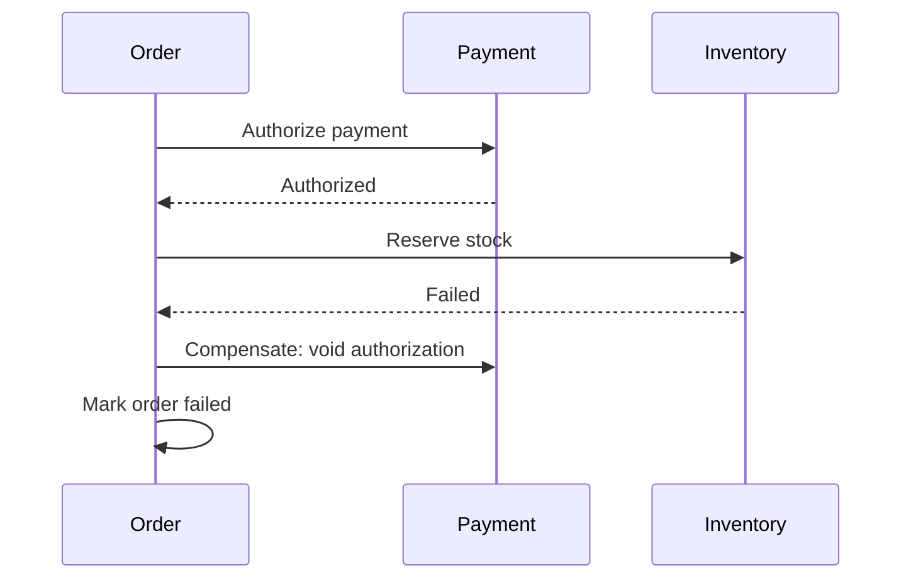

# Daily Knowledge Sharing — 2026-09-17

## Today’s Topics

1. .NET Large Object Heap: allocation pressure, compaction và production memory spikes
2. ASP.NET Core DI lifetimes: captive dependency và scope boundary trong background work
3. EF Core `ExecuteUpdate` / `ExecuteDelete`: set-based mutation và change-tracker consistency
4. SQL connection pooling: pool exhaustion, transaction lifetime và latency amplification
5. Saga Pattern: business transaction xuyên services mà không dùng distributed ACID
6. Azure Key Vault + Managed Identity: secretless authentication và rotation boundary
7. Docker/Kubernetes resource limits: CPU throttling, OOMKill và capacity engineering
8. SSRF trong backend integrations: outbound request cũng là security boundary
9. Elasticsearch alias-based reindexing: schema evolution mà không dừng Search API
10. Feature flags trong release engineering: tách deployment khỏi activation nhưng không tạo permanent complexity

---

# 1. .NET Large Object Heap: allocation pressure, compaction và production memory spikes

## 1. What is it?

Large Object Heap (LOH) là vùng managed heap mà CLR dùng cho các object lớn, theo runtime threshold. Mental model quan trọng không phải “object lớn nằm ở heap khác”, mà là: allocation lớn có lifecycle và GC economics khác allocation nhỏ; nếu request path liên tục tạo buffer lớn, GC có thể trở thành bottleneck dù code không có memory leak theo nghĩa truyền thống.

## 2. Why does it exist?

Di chuyển object lớn trong quá trình compaction rất tốn CPU và memory bandwidth. CLR vì vậy xử lý chúng khác các object nhỏ để tránh chi phí copy quá cao. Đổi lại, workload tạo nhiều large temporary objects có thể làm heap tăng nhanh, tăng Gen 2 GC và fragmentation pressure.

## 3. How does it work?

```text
Request
  │
  ├─ allocate small objects ─► SOH generations
  │
  └─ allocate large buffers ─► LOH
                               │
                               └─ collected with Gen 2 lifecycle
```

Một byte array lớn được allocate rồi bỏ ngay vẫn có thể tạo áp lực đáng kể vì tốc độ allocation quyết định tần suất GC. Memory usage vì vậy phải được phân tích theo allocation rate, retained objects và GC behavior, không chỉ nhìn working set.

## 4. Practical implementation

Thay vì materialize toàn bộ file:

```csharp
var bytes = await File.ReadAllBytesAsync(path, ct);
await response.Body.WriteAsync(bytes, ct);
```

ưu tiên streaming khi contract cho phép:

```csharp
await using var stream = File.OpenRead(path);
await stream.CopyToAsync(response.Body, ct);
```

Với reusable temporary buffers, `ArrayPool<byte>` có thể phù hợp nhưng phải return buffer đúng lifecycle và không giữ reference ngoài thời gian thuê.

## 5. Real production scenario

API export báo cáo tạo `MemoryStream` 20–50 MB cho mỗi request trước khi trả client. 30 users export đồng thời làm memory tăng hàng GB, Gen 2 GC dày lên và p99 của các endpoint không liên quan cũng tăng. Root cause là allocation pattern, không phải database.

## 6. Failure scenario & troubleshooting

**Symptom** → memory dạng răng cưa lớn, pause tăng, latency toàn service tăng.  
**Evidence** → `dotnet-counters` cho thấy allocation rate/Gen 2 collections tăng; dump cho thấy nhiều `byte[]`/`MemoryStream`.  
**Hypothesis** → large temporary allocations.  
**Diagnosis** → allocation profiling và trace request tạo buffers.  
**Fix** → streaming, bounded buffers, pooling khi có bằng chứng.  
**Verification** → load test lại, so allocation rate, GC pause, working set và p99.

## 7. Common mistakes

Gọi mọi memory growth là leak; ép `GC.Collect()` sau request; dùng pooling nhưng quên return; giữ pooled buffer trong cache; tối ưu LOH trước khi đo allocation profile.

## 8. Alternatives

Streaming đơn giản và an toàn hơn pooling nếu dữ liệu có thể xử lý tuần tự. Pooling phù hợp khi buffer reuse thực sự giảm allocation hot path. Với workload file lớn, Blob Storage + direct download/SAS đôi khi tốt hơn để web process làm data pump.

## 9. Trade-offs

### Advantages

Streaming/pooling có thể giảm peak memory và GC pressure đáng kể.

### Costs / Risks

Pooling tăng ownership complexity; streaming thay đổi error semantics vì response có thể đã bắt đầu trước khi lỗi xảy ra.

## 10. Junior → Middle → Senior → Technical Lead

### Junior

Hiểu managed memory vẫn có chi phí và GC không biến allocation thành miễn phí.

### Middle

Biết tránh materialize dữ liệu lớn không cần thiết và dùng streaming APIs.

### Senior

Phân biệt allocation pressure, retention và leak bằng counters/dump/profiler.

### Technical Lead / Architect

Quyết định file/data flow nào nên đi qua application, giới hạn concurrency nào cần thiết và khi nào phải đổi architecture thay vì micro-optimize GC.

## 11. Key takeaway

- Memory problem phải được đo bằng allocation + retention + GC behavior.
- Large temporary buffers có thể phá latency dù cuối cùng vẫn được GC.
- Streaming thường là optimization kiến trúc tốt hơn việc ép GC.

---

# 2. ASP.NET Core DI lifetimes: captive dependency và scope boundary trong background work

## 1. What is it?

ASP.NET Core DI có `Singleton`, `Scoped`, `Transient`. Lifetime không chỉ là “object sống bao lâu”; nó xác định ownership và concurrency boundary. Captive dependency xảy ra khi component sống lâu giữ dependency đáng lẽ phải sống ngắn hơn.

## 2. Why does it exist?

Web request cần một scope tự nhiên: `DbContext`, request-specific state và transactional collaborators thường chỉ nên tồn tại trong request. Singleton lại được dùng chung toàn process. Nếu singleton capture scoped service, state có thể sống sai lifecycle và bị dùng concurrent ngoài thiết kế.

## 3. How does it work?

```text
Application lifetime
└─ Singleton
   ├─ Request Scope A ─► Scoped services
   ├─ Request Scope B ─► Scoped services
   └─ Background scope ─► Scoped services
```

`BackgroundService` được đăng như singleton. Vì vậy nó không nên inject trực tiếp `DbContext`; mỗi work unit cần tạo scope.

## 4. Practical implementation

```csharp
public sealed class InvoiceWorker(
    IServiceScopeFactory scopeFactory,
    ILogger<InvoiceWorker> logger) : BackgroundService
{
    protected override async Task ExecuteAsync(CancellationToken stoppingToken)
    {
        while (!stoppingToken.IsCancellationRequested)
        {
            await using var scope = scopeFactory.CreateAsyncScope();
            var db = scope.ServiceProvider.GetRequiredService<AppDbContext>();

            await ProcessBatchAsync(db, stoppingToken);
            await Task.Delay(TimeSpan.FromSeconds(5), stoppingToken);
        }
    }
}
```

Scope nên tương ứng một logical unit of work, không phải toàn lifetime của worker.

## 5. Real production scenario

Notification worker inject repository dùng scoped `DbContext` vào singleton service. Khi validation bị tắt hoặc cấu hình sai, context sống quá lâu, change tracker phình to và concurrent operations phát sinh lỗi “A second operation was started on this context”.

## 6. Failure scenario & troubleshooting

**Symptom** → concurrency exception, stale tracked entities hoặc memory tăng.  
**Evidence** → dependency graph cho thấy singleton giữ scoped collaborator.  
**Hypothesis** → lifetime mismatch.  
**Diagnosis** → kiểm tra registrations và object ownership.  
**Fix** → tạo scope theo work unit hoặc đổi boundary/service lifetime.  
**Verification** → concurrency test + scope validation + memory observation.

## 7. Common mistakes

Cho mọi service thành singleton để “nhanh hơn”; inject `IServiceProvider` khắp code rồi service-locate tùy ý; tạo một scope duy nhất cho worker; coi `Transient` là luôn thread-safe.

## 8. Alternatives

Factory abstraction có thể rõ ownership hơn raw `IServiceProvider`. `IDbContextFactory<T>` phù hợp cho một số background/concurrent scenarios khi cần tạo context độc lập.

## 9. Trade-offs

### Advantages

DI lifetime đúng giúp ownership rõ, cleanup đúng và tránh shared mutable state.

### Costs / Risks

Quá nhiều factory/scope thủ công có thể che architectural smell; singleton tối ưu allocation nhưng đòi thread safety nghiêm ngặt.

## 10. Junior → Middle → Senior → Technical Lead

### Junior

Hiểu ba lifetime và request scope.

### Middle

Đăng ký service đúng lifetime, tạo scope cho background work.

### Senior

Nhìn lifetime như concurrency/state ownership problem, không chỉ DI syntax.

### Technical Lead / Architect

Định nghĩa component boundaries để lifetime tự nhiên, tránh service locator và captive dependency lan rộng.

## 11. Key takeaway

- Lifetime là ownership + concurrency contract.
- Singleton không được vô tình kéo scoped state sống lâu hơn scope.
- Background work phải tạo scope theo logical unit of work.

---

# 3. EF Core `ExecuteUpdate` / `ExecuteDelete`: set-based mutation và change-tracker consistency

## 1. What is it?

`ExecuteUpdate` và `ExecuteDelete` cho phép EF Core phát lệnh SQL set-based trực tiếp từ LINQ query mà không load từng entity vào memory. Chúng bypass normal tracked-entity mutation và `SaveChanges` flow.

## 2. Why does it exist?

Nếu cần đóng 100.000 expired sessions, load 100.000 rows, track chúng, mutate từng entity rồi `SaveChanges` tạo memory/round-trip overhead không cần thiết. Database vốn đã tối ưu set-based operations.

## 3. How does it work?

```text
LINQ predicate
     │
     ▼
ExecuteUpdate
     │
     ▼
single SQL UPDATE ... WHERE ...
```

Không có entity materialization và change tracker không tự đồng bộ các tracked instances đang tồn tại.

## 4. Practical implementation

```csharp
var affected = await db.Sessions
    .Where(x => x.ExpiresAt < now && x.Status == SessionStatus.Active)
    .ExecuteUpdateAsync(setters => setters
        .SetProperty(x => x.Status, SessionStatus.Expired)
        .SetProperty(x => x.UpdatedAt, now), ct);
```

Nếu cùng `DbContext` đang track các `Session` đó, phải hiểu rằng in-memory state có thể stale.

## 5. Real production scenario

Nightly maintenance job expire hàng triệu records. Chuyển từ load/update/save sang set-based update giảm thời gian và memory mạnh, nhưng một code path sau đó đọc tracked entity cũ và ghi ngược status khi `SaveChanges`.

## 6. Failure scenario & troubleshooting

**Symptom** → bulk update báo thành công nhưng sau đó một số row quay về giá trị cũ.  
**Evidence** → SQL trace cho thấy `ExecuteUpdate`, rồi `SaveChanges` từ tracked entity ghi đè.  
**Hypothesis** → tracker/database state divergence.  
**Diagnosis** → xác định context lifetime và tracked instances.  
**Fix** → tách context/work unit, clear/reload tracker khi cần, tránh trộn hai mutation model mơ hồ.  
**Verification** → integration test với cùng sequence thực tế.

## 7. Common mistakes

Cho rằng `ExecuteUpdate` gọi domain logic; kỳ vọng change tracker tự refresh; chạy bulk mutation ngoài transaction boundary cần thiết; dùng nó để bypass invariants mà domain yêu cầu.

## 8. Alternatives

Tracked updates phù hợp khi mỗi entity cần domain behavior/concurrency handling. Raw SQL/bulk libraries cho control hoặc throughput khác nhưng tăng abstraction gap.

## 9. Trade-offs

### Advantages

Ít materialization, ít memory, set-based SQL hiệu quả.

### Costs / Risks

Bypass tracker và có thể bypass application/domain invariants; cần explicit transaction/concurrency reasoning.

## 10. Junior → Middle → Senior → Technical Lead

### Junior

Hiểu khác biệt giữa entity mutation và set-based database mutation.

### Middle

Dùng đúng predicate và kiểm tra affected rows.

### Senior

Quản lý tracker consistency, transaction, concurrency và business invariants.

### Technical Lead / Architect

Quyết định mutation nào thuộc domain workflow và mutation nào là data-maintenance operation hợp lý để xử lý set-based.

## 11. Key takeaway

- `ExecuteUpdate` tối ưu data mutation, không thay thế domain behavior.
- Tracker không tự biết database vừa bị bulk-update.
- Tách work unit rõ để tránh stale state ghi ngược dữ liệu.

---

# 4. SQL connection pooling: pool exhaustion, transaction lifetime và latency amplification

## 1. What is it?

ADO.NET connection pooling tái sử dụng physical database connections. `Open()` thường lấy connection từ pool thay vì tạo TCP/login session mới; `Close`/`Dispose` trả nó về pool nếu connection còn hợp lệ.

## 2. Why does it exist?

Tạo database connection mới đắt. Pooling amortize handshake/authentication cost. Nhưng pool là finite shared resource; giữ connection lâu làm request khác phải chờ dù database CPU chưa cao.

## 3. How does it work?

```text
Requests ─► logical Open()
              │
              ▼
        Connection Pool
        [busy][busy][idle]
              │
              ▼
          SQL Server
```

Pool thường phân tách theo connection string/identity. Transaction dài, slow query hoặc code quên dispose đều tăng hold time và giảm effective throughput.

## 4. Practical implementation

```csharp
await using var connection = new SqlConnection(connectionString);
await connection.OpenAsync(ct);

await using var command = connection.CreateCommand();
command.CommandText = "SELECT Id, Status FROM Orders WHERE Id = @id";
command.Parameters.AddWithValue("@id", id);

await using var reader = await command.ExecuteReaderAsync(ct);
```

Mở muộn, dispose sớm; không giữ connection trong singleton/service field.

## 5. Real production scenario

API có 100 pooled connections. External API được gọi bên trong database transaction và mất 8 giây. 100 concurrent requests giữ toàn bộ pool; request thứ 101 chờ connection và timeout. Root cause nhìn ngoài giống “SQL down”, nhưng database có thể gần như idle.

## 6. Failure scenario & troubleshooting

**Symptom** → “Timeout expired prior to obtaining a connection from the pool”.  
**Evidence** → DB CPU thấp, active request count cao, traces cho thấy transaction/request giữ connection lâu.  
**Hypothesis** → pool exhaustion.  
**Diagnosis** → đo connection duration, slow queries, transaction scope, external calls trong transaction.  
**Fix** → rút ngắn hold time, sửa query/dependency flow; chỉ tăng pool sau capacity analysis.  
**Verification** → load test và theo dõi wait/latency/DB sessions.

## 7. Common mistakes

Tăng `Max Pool Size` ngay lập tức; giữ transaction qua network call; tạo nhiều connection strings chỉ khác formatting; không dispose reader/connection; nhầm command timeout với pool-acquisition timeout.

## 8. Alternatives

Không pooling gần như luôn tệ hơn cho web workload. Architecture có thể dùng queue để flatten burst hoặc read replica nếu bottleneck thực sự là DB workload, nhưng không chữa connection leak.

## 9. Trade-offs

### Advantages

Giảm connection establishment cost và tăng throughput.

### Costs / Risks

Pool tạo finite concurrency boundary; tăng pool quá lớn có thể chuyển bottleneck sang database.

## 10. Junior → Middle → Senior → Technical Lead

### Junior

Dispose connection không nhất thiết đóng physical connection; nó trả về pool.

### Middle

Giữ connection/transaction scope ngắn và dùng async APIs.

### Senior

Phân biệt pool exhaustion với slow SQL/DB saturation và tìm hold-time root cause.

### Technical Lead / Architect

Thiết kế concurrency budget giữa app instances và database; 20 pods × 100 connections không phải con số vô hại.

## 11. Key takeaway

- Connection pool là finite shared capacity.
- Hold time quan trọng ngang pool size.
- Scale application có thể vô tình nhân database connection pressure.

---

# 5. Saga Pattern: business transaction xuyên services mà không dùng distributed ACID

## 1. What is it?

Saga chia một business transaction dài thành chuỗi local transactions. Khi bước sau thất bại, hệ thống chạy compensating actions phù hợp thay vì rollback ACID toàn hệ thống.

## 2. Why does it exist?

Trong Microservices, Orders, Payment và Inventory sở hữu data riêng. Distributed transaction coordinator thường làm coupling, availability và operations phức tạp. Nhưng business vẫn cần workflow nhất quán ở mức nghiệp vụ.

## 3. How does it work?



Compensation không phải time travel. Nếu email đã gửi hoặc shipment đã rời kho, “undo” có thể là một business action mới.

## 4. Practical implementation

```csharp
public async Task HandleAsync(OrderSaga saga, CancellationToken ct)
{
    if (!saga.PaymentAuthorized)
        await bus.SendAsync(new AuthorizePayment(saga.OrderId), ct);

    if (saga.PaymentAuthorized && !saga.InventoryReserved)
        await bus.SendAsync(new ReserveInventory(saga.OrderId), ct);
}
```

Saga state transitions phải idempotent; message có thể được redeliver.

## 5. Real production scenario

Marketplace nhận order, authorize payment, reserve inventory rồi tạo shipment. Inventory failure sau payment authorization không thể rollback database transaction của Payment service; saga phát command void authorization và chuyển order sang failed/pending recovery.

## 6. Failure scenario & troubleshooting

**Symptom** → payment đã authorize nhưng saga đứng ở `WaitingInventory`.  
**Evidence** → message trace cho thấy reserve command gửi nhưng response mất/retry.  
**Hypothesis** → partial failure.  
**Diagnosis** → kiểm tra saga state, Outbox, broker delivery, idempotency records.  
**Fix** → retry/reconciliation/compensation theo state machine.  
**Verification** → chaos test từng failure point và assert eventual terminal state.

## 7. Common mistakes

Gọi mọi distributed workflow là Saga; compensation bằng “DELETE dữ liệu”; không lưu durable saga state; assume exactly-once; không có timeout/reconciliation cho workflow treo.

## 8. Alternatives

Nếu toàn workflow nằm trong một database, local ACID transaction đơn giản hơn. Modular Monolith có thể tránh Saga hoàn toàn. Chỉ trả distributed-systems tax khi service boundaries thực sự cần thiết.

## 9. Trade-offs

### Advantages

Giữ service autonomy và hỗ trợ long-running workflow qua partial failures.

### Costs / Risks

Eventual consistency, state-machine complexity, compensation semantics, observability và testing khó hơn đáng kể.

## 10. Junior → Middle → Senior → Technical Lead

### Junior

Hiểu local transaction khác business transaction xuyên services.

### Middle

Implement idempotent handlers và durable state transitions.

### Senior

Thiết kế timeout, compensation, retry, Outbox/Inbox và reconciliation.

### Technical Lead / Architect

Trước tiên phải hỏi liệu service split có đáng để business transaction trở thành Saga hay không.

## 11. Key takeaway

- Saga quản lý business consistency, không tạo distributed ACID giả.
- Compensation là nghiệp vụ mới, không nhất thiết là inverse SQL.
- Nếu một DB transaction giải quyết được, Saga có thể là complexity không cần thiết.

---

# 6. Azure Key Vault + Managed Identity: secretless authentication và rotation boundary

## 1. What is it?

Managed Identity cung cấp workload identity do Azure quản lý; Key Vault bảo vệ secrets/keys/certificates. Kết hợp hai thứ cho phép application authenticate tới Key Vault mà không cần lưu credential của chính nó trong config.

## 2. Why does it exist?

Nếu app cần secret để đọc secret store, ta tạo bootstrap-secret problem. Managed Identity chuyển authentication sang platform identity, giảm credential distribution và rotation burden.

## 3. How does it work?

```text
App Service / Function
       │ Managed Identity token
       ▼
Microsoft Entra ID
       │ access token
       ▼
Azure Key Vault
       │ authorized secret read
       ▼
Application
```

Identity không tự cấp quyền. RBAC/access policy vẫn phải tuân least privilege; networking có thể tiếp tục chặn request dù identity đúng.

## 4. Practical implementation

```csharp
var client = new SecretClient(
    new Uri(configuration["KeyVaultUri"]!),
    new DefaultAzureCredential());

KeyVaultSecret secret = await client.GetSecretAsync("PaymentsApiKey", cancellationToken: ct);
```

Production có thể dùng Managed Identity; local development dùng developer credential chain phù hợp mà không hard-code production secret.

## 5. Real production scenario

Payment integration API key được rotate trong Key Vault. Nếu app chỉ đọc secret lúc startup, instance cũ tiếp tục dùng value cũ cho đến restart. Rotation design vì vậy phải xác định refresh semantics và overlap window với provider.

## 6. Failure scenario & troubleshooting

**Symptom** → production trả 403 từ Key Vault trong khi local chạy tốt.  
**Evidence** → Azure diagnostics cho thấy principal ID không có role hoặc Private Endpoint/DNS path sai.  
**Hypothesis** → identity/authorization/network boundary mismatch.  
**Diagnosis** → xác nhận principal, RBAC scope, token audience, DNS/network.  
**Fix** → cấp quyền tối thiểu đúng identity và sửa connectivity.  
**Verification** → test từ chính workload environment và audit logs.

## 7. Common mistakes

Gán broad `Owner`; lưu client secret để truy cập Key Vault dù Managed Identity có sẵn; log secret value; assume rotation tự refresh mọi consumer; dùng một vault/identity không boundary cho mọi app.

## 8. Alternatives

Environment secret/config store đơn giản hơn nhưng rotation/audit kém hơn. Kubernetes Secrets vẫn cần protection strategy; workload identity + external secret store thường tốt hơn cho sensitive credentials.

## 9. Trade-offs

### Advantages

Giảm stored credentials, audit tốt, centralized rotation và access control.

### Costs / Risks

Runtime dependency, RBAC/network complexity, caching/refresh semantics và Key Vault availability phải được thiết kế.

## 10. Junior → Middle → Senior → Technical Lead

### Junior

Phân biệt identity của workload với secret mà workload cần đọc.

### Middle

Cấu hình Managed Identity, RBAC và `DefaultAzureCredential` đúng môi trường.

### Senior

Thiết kế rotation, caching, fallback, network isolation và audit.

### Technical Lead / Architect

Định nghĩa secret ownership, vault boundaries, blast radius và break-glass process.

## 11. Key takeaway

- Managed Identity giải bootstrap credential problem.
- Authentication đúng chưa đủ; authorization và networking vẫn độc lập.
- Secret rotation phải có consumer refresh strategy.

---

# 7. Docker/Kubernetes resource limits: CPU throttling, OOMKill và capacity engineering

## 1. What is it?

Container resource requests/limits mô tả resource scheduling và enforcement boundary. Với Kubernetes, request giúp scheduler placement; limit đặt trần sử dụng. Mental model: limit không “đảm bảo performance”; nó có thể chủ động throttle hoặc kill workload.

## 2. Why does it exist?

Nhiều workloads chia sẻ node. Không có boundary, một process runaway có thể ăn CPU/memory của workloads khác. Nhưng limit đặt sai biến protection mechanism thành source của outage.

## 3. How does it work?

```text
Node capacity
├─ Pod A: request 500m, CPU limit 1
├─ Pod B: request 1 CPU, memory limit 1Gi
└─ Pod C
```

CPU vượt limit thường bị throttled; memory vượt cgroup limit có thể dẫn đến OOMKill. Đây là hai failure modes khác nhau.

## 4. Practical implementation

```yaml
resources:
  requests:
    cpu: "500m"
    memory: "512Mi"
  limits:
    cpu: "1"
    memory: "1Gi"
```

Các con số phải đến từ load test/production telemetry, không copy từ template.

## 5. Real production scenario

ASP.NET Core API có CPU limit 500m. Traffic tăng, GC + JSON serialization cần burst CPU nhưng container bị throttled. p99 tăng dù node tổng thể còn CPU. Team scale replica nhưng mỗi replica vẫn bị cùng limit quá thấp.

## 6. Failure scenario & troubleshooting

**Symptom** → latency tăng hoặc pod restart.  
**Evidence** → CPU throttling metrics hoặc pod status `OOMKilled`; node CPU có thể chưa đầy.  
**Hypothesis** → container boundary, không phải application deadlock.  
**Diagnosis** → correlate request rate, CPU throttling, memory working set, GC và restart reason.  
**Fix** → right-size resources, giảm allocation/CPU nếu root cause nằm trong code, chỉnh HPA strategy.  
**Verification** → load test ở cùng limits và theo dõi p95/p99.

## 7. Common mistakes

Set request=limit theo thói quen; tăng memory limit để che leak; không xem OOM reason; HPA scale theo CPU percentage nhưng request CPU đặt vô lý; benchmark ngoài container rồi áp kết quả vào production.

## 8. Alternatives

Azure App Service/Container Apps che bớt scheduler detail nhưng vẫn có compute/memory boundaries. VM hosting cho control rộng hơn nhưng tăng operational burden.

## 9. Trade-offs

### Advantages

Isolation, predictable scheduling và blast-radius control.

### Costs / Risks

Right-sizing khó; limit thấp gây throttling/OOM, limit cao làm bin-packing kém và tăng cost.

## 10. Junior → Middle → Senior → Technical Lead

### Junior

Phân biệt CPU throttling và memory OOM.

### Middle

Đọc pod events/metrics và cấu hình resources cơ bản.

### Senior

Liên hệ resource boundaries với .NET GC, ThreadPool, latency và autoscaling.

### Technical Lead / Architect

Thiết kế capacity model, headroom, HPA signal và cost/reliability trade-off.

## 11. Key takeaway

- Resource limit là enforcement boundary, không phải performance guarantee.
- OOMKill và CPU throttling cần evidence khác nhau.
- Right-sizing phải dựa trên workload telemetry.

---

# 8. SSRF trong backend integrations: outbound request cũng là security boundary

## 1. What is it?

Server-Side Request Forgery (SSRF) xảy ra khi attacker khiến server gửi request tới destination mà attacker không nên truy cập trực tiếp. Backend có network trust khác browser/client, nên một URL tưởng vô hại có thể trở thành đường vào internal services hoặc metadata endpoints.

## 2. Why does it exist?

Các tính năng “import image from URL”, webhook tester, PDF renderer hoặc URL preview thường nhận URL từ user rồi server fetch. Straightforward implementation trao cho user một phần quyền điều khiển outbound network của server.

## 3. How does it work?

```text
Attacker
   │ supplies URL
   ▼
Public API
   │ server-side HTTP request
   ▼
Internal/private destination
```

Validation chỉ kiểm tra string hostname chưa đủ nếu redirect, DNS resolution hoặc alternate IP representation cho phép bypass.

## 4. Practical implementation

Ưu tiên allowlist destinations khi business domain hữu hạn:

```csharp
static bool IsAllowed(Uri uri)
{
    if (uri.Scheme != Uri.UriSchemeHttps) return false;

    return uri.Host.Equals("images.partner.example", StringComparison.OrdinalIgnoreCase);
}
```

Ngoài application validation, outbound firewall/network policy là defense-in-depth quan trọng. Không cho workload truy cập arbitrary internal networks nếu không cần.

## 5. Real production scenario

CMS cho editor nhập external image URL. Endpoint production có quyền truy cập internal admin service. Một compromised editor account nhập internal URL và application trả nội dung fetch được ra response.

## 6. Failure scenario & troubleshooting

**Symptom** → outbound logs xuất hiện requests tới private IP/unknown host.  
**Evidence** → correlation cho thấy user-controlled URL path.  
**Hypothesis** → SSRF.  
**Diagnosis** → kiểm tra redirect behavior, DNS resolution, egress rules và response exposure.  
**Fix** → allowlist, disable/limit redirects, egress restrictions, response size/time limits.  
**Verification** → security tests với localhost/private ranges/redirect chains.

## 7. Common mistakes

Chỉ block chuỗi `localhost`; chỉ regex URL; cho phép redirect không kiểm tra destination mới; trả nguyên response body; để request không timeout; nghĩ CORS bảo vệ server-side HTTP calls.

## 8. Alternatives

Nếu chỉ cần upload asset, client upload trực tiếp an toàn hơn server fetch arbitrary URL. Với known providers, integration-specific connector tốt hơn generic URL fetcher.

## 9. Trade-offs

### Advantages

URL-fetch features tiện cho user và integrations.

### Costs / Risks

Mở outbound attack surface, bandwidth abuse, internal discovery và data exfiltration risk.

## 10. Junior → Middle → Senior → Technical Lead

### Junior

Hiểu server có network privileges khác user browser.

### Middle

Validate scheme/host, timeout, size và không tin redirects.

### Senior

Thiết kế DNS/IP/redirect-aware protection và egress controls.

### Technical Lead / Architect

Hỏi liệu generic outbound fetch có cần tồn tại; nếu có, cô lập nó vào boundary có network privileges tối thiểu.

## 11. Key takeaway

- Outbound HTTP cũng là security boundary.
- URL string validation đơn lẻ không đủ chống SSRF.
- Allowlist + egress restriction thường mạnh hơn blacklist.

---

# 9. Elasticsearch alias-based reindexing: schema evolution mà không dừng Search API

## 1. What is it?

Elasticsearch mapping/analyzer changes thường không thể sửa an toàn in-place cho dữ liệu đã index. Alias cho phép Search API dùng logical index name trong khi backend chuyển giữa physical index versions.

## 2. Why does it exist?

Search schema tiến hóa: analyzer, field type hoặc normalization thay đổi. Reindex trực tiếp trên active index có thể tạo downtime hoặc mixed semantics. Versioned index + alias tạo migration boundary.

## 3. How does it work?

```text
Search API ─► alias: products-read
                    │
                    ▼
              products-v1

Build products-v2 ─► reindex/backfill
                    │
             validate results
                    │
             atomic alias switch
                    ▼
              products-v2
```

Database vẫn là source of truth; migration phải xử lý changes phát sinh trong thời gian backfill.

## 4. Practical implementation

```json
POST /_aliases
{
  "actions": [
    { "remove": { "index": "products-v1", "alias": "products-read" } },
    { "add":    { "index": "products-v2", "alias": "products-read" } }
  ]
}
```

Alias switch chỉ là bước cuối; trước đó cần mapping validation, document counts, representative queries và sync catch-up.

## 5. Real production scenario

E-commerce search đổi product name analyzer để cải thiện Vietnamese search. Team tạo `products-v2`, backfill từ primary DB, replay changes qua Outbox, chạy relevance smoke tests rồi chuyển alias mà Search API không đổi endpoint.

## 6. Failure scenario & troubleshooting

**Symptom** → sau switch, một số sản phẩm mới biến mất.  
**Evidence** → v2 thiếu events xảy ra trong backfill window.  
**Hypothesis** → migration không có catch-up strategy.  
**Diagnosis** → so DB watermark/outbox offsets với indexed version.  
**Fix** → replay từ durable change stream rồi chỉ switch khi lag về ngưỡng chấp nhận.  
**Verification** → count/checksum samples + query tests + lag metrics.

## 7. Common mistakes

Chỉ so document count; xóa v1 ngay sau switch; dual-write không có recovery log; dùng Elasticsearch làm source of truth; thay analyzer mà không đo relevance regression.

## 8. Alternatives

In-place settings change chỉ phù hợp với settings thực sự mutable. Blue/green index strategy bằng alias thường rõ hơn cho breaking mapping changes.

## 9. Trade-offs

### Advantages

Low-downtime migration, rollback nhanh bằng alias và schema versioning rõ.

### Costs / Risks

Tạm thời cần gấp đôi storage, backfill cost, synchronization/catch-up complexity.

## 10. Junior → Middle → Senior → Technical Lead

### Junior

Hiểu alias là logical name trỏ tới physical index.

### Middle

Tạo versioned index, reindex và switch alias an toàn.

### Senior

Thiết kế catch-up, validation, rollback và relevance verification.

### Technical Lead / Architect

Định nghĩa source-of-truth và migration protocol để search projection luôn rebuildable.

## 11. Key takeaway

- Search index nên được coi là rebuildable projection.
- Alias switch giải cutover, không tự giải synchronization window.
- Rollback chỉ đáng tin khi old index chưa bị phá/xóa quá sớm.

---

# 10. Feature flags trong release engineering: tách deployment khỏi activation nhưng không tạo permanent complexity

## 1. What is it?

Feature flag cho phép code được deploy nhưng behavior được activation riêng theo environment, user cohort hoặc operational condition. Mental model: deployment đưa capability vào runtime; release/activation quyết định ai được dùng capability đó.

## 2. Why does it exist?

Một release lớn gắn deployment với business activation làm rollback thô: chỉ cần feature mới lỗi là phải rollback toàn artifact. Flag cho phép progressive exposure và kill switch mà không rebuild/deploy lại.

## 3. How does it work?

```text
Commit → Build → Test → Deploy
                       │
                       ▼
                 Feature disabled
                       │
              enable 1% / internal
                       │
                 observe telemetry
                       │
                 expand exposure
```

Flag evaluation phải có deterministic fallback. Critical authorization rule không nên phụ thuộc vào remote flag service theo cách fail-open.

## 4. Practical implementation

```csharp
if (await featureManager.IsEnabledAsync("NewCheckout"))
{
    return await newCheckout.ExecuteAsync(request, ct);
}

return await legacyCheckout.ExecuteAsync(request, ct);
```

Cả hai path cần compatibility với database/API contracts trong transition window.

## 5. Real production scenario

Checkout V2 được deploy thứ Hai nhưng chỉ bật cho internal users. Metrics ổn thì tăng 5%, 25%, 100%. Khi payment error rate tăng ở 25%, team disable flag trong vài phút mà không rollback unrelated fixes trong cùng artifact.

## 6. Failure scenario & troubleshooting

**Symptom** → bug chỉ xảy ra với một cohort và khó reproduce.  
**Evidence** → telemetry không ghi flag state.  
**Hypothesis** → behavior phụ thuộc runtime configuration.  
**Diagnosis** → correlate request/user với evaluated flag version/state.  
**Fix** → include safe flag metadata trong telemetry, deterministic targeting, kill switch.  
**Verification** → test enabled/disabled paths và staged rollout.

## 7. Common mistakes

Không có owner/expiry; để flag tồn tại nhiều năm; nested flags tạo combinatorial explosion; chỉ test enabled path; dùng flag để che incompatible database migration; remote flag outage làm request fail.

## 8. Alternatives

Deployment slots/Blue-Green chuyển cả version theo environment, không target fine-grained cohorts. Canary deployment route traffic theo deployment version. Feature flag có thể kết hợp Canary nhưng không nên thay thế release hygiene.

## 9. Trade-offs

### Advantages

Giảm blast radius, progressive delivery, nhanh disable risky behavior.

### Costs / Risks

Tăng runtime branches, test matrix, configuration dependency và technical debt nếu không cleanup.

## 10. Junior → Middle → Senior → Technical Lead

### Junior

Hiểu flag không chỉ là `if`; nó thay runtime behavior sau deployment.

### Middle

Test cả on/off và không hard-code flag state.

### Senior

Thiết kế telemetry, fallback, data compatibility, rollout/rollback criteria.

### Technical Lead / Architect

Đặt governance: owner, expiry date, flag classes, security constraints và cleanup SLA; quyết định khi nào Canary/Blue-Green đơn giản hơn.

## 11. Key takeaway

- Feature flag tách deployment khỏi activation.
- Mỗi flag là temporary runtime complexity cần owner và expiry.
- Progressive release chỉ an toàn khi telemetry và rollback criteria đã có trước activation.
