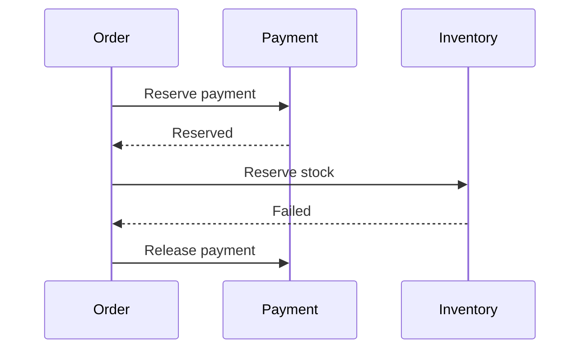

# Daily Knowledge Sharing — 2026-09-20

## Today’s Topics

1. C# `IAsyncDisposable`: async cleanup và resource lifetime trong production
2. ASP.NET Core `HttpClientFactory`: connection reuse, DNS rotation và handler lifetime
3. EF Core compiled queries: khi query compilation thực sự trở thành bottleneck
4. SQL Server isolation levels: consistency, blocking và row versioning
5. Redis outage strategy: cache là optimization hay hidden critical dependency?
6. Saga Pattern: business transaction xuyên service mà không có distributed ACID
7. Azure Managed Identity + Key Vault: bỏ secrets khỏi application configuration
8. Kubernetes resource requests/limits: CPU throttling, OOMKilled và capacity planning
9. SLI/SLO cho API: biến telemetry thành reliability decision thay vì dashboard trang trí
10. Vue/TypeScript API cancellation: tránh stale response ghi đè UI state

---

# 1. C# `IAsyncDisposable`: async cleanup và resource lifetime trong production

## 1. What is it?

`IAsyncDisposable` là contract cho resource cần cleanup có asynchronous work. Mental model: `Dispose()` phù hợp khi cleanup hoàn toàn synchronous; `DisposeAsync()` tồn tại khi việc kết thúc resource có thể cần flush, network I/O hoặc asynchronous shutdown.

## 2. Why does it exist?

Nếu cleanup cần I/O nhưng API chỉ có `Dispose()`, implementation dễ rơi vào sync-over-async bằng `.GetAwaiter().GetResult()`, giữ thread trong lúc chờ I/O và có thể làm giảm throughput. Bỏ cleanup hoàn toàn lại gây connection/resource leak.

## 3. How does it work?

`await using` được compiler chuyển thành `try/finally` và gọi `DisposeAsync()` ở cuối scope. Cleanup vẫn phải được chờ hoàn tất trước khi lifetime kết thúc.

```text
Acquire resource
      ↓
    use
      ↓
finally → await DisposeAsync()
```

## 4. Practical implementation

```csharp
public sealed class ExportWriter : IAsyncDisposable
{
    private readonly Stream _stream;

    public ExportWriter(Stream stream) => _stream = stream;

    public async ValueTask DisposeAsync()
    {
        await _stream.FlushAsync();
        await _stream.DisposeAsync();
    }
}

await using var writer = new ExportWriter(stream);
```

Cancellation cho business operation và cleanup lifetime cần được cân nhắc riêng: đôi khi request đã cancelled nhưng cleanup vẫn phải hoàn thành để resource trở về trạng thái an toàn.

## 5. Real production scenario

Một file-processing service ghi output vào stream rồi upload. Request bị cancel giữa chừng. Nếu stream không được async-dispose đúng cách, buffer chưa flush hoặc connection còn mở, khiến file lỗi và pool/resource cạn dần.

## 6. Failure scenario & troubleshooting

**Symptom** → latency tăng dần và số connection/resource mở tăng. **Evidence** → traces cho thấy resource tạo nhiều nhưng completion/close thiếu. **Hypothesis** → lifetime không đi qua cleanup khi exception/cancellation. **Diagnosis** → inspect code path và resource counters. **Fix** → `await using`, `try/finally`, ownership rõ. **Verification** → fault-injection test và xác nhận resource count trở về baseline.

## 7. Common mistakes

Dùng `using` cho resource chỉ hỗ trợ async cleanup; gọi `DisposeAsync()` mà không await; để nhiều object cùng nghĩ mình sở hữu cùng resource; làm business work nặng trong dispose; bỏ cleanup khi cancellation xảy ra.

## 8. Alternatives

`IDisposable` vẫn đúng cho synchronous resources. DI container có thể quản lý lifetime của registered services; nhưng object tự tạo ngoài container vẫn cần ownership rõ.

## 9. Trade-offs

### Advantages

Cleanup không block thread và diễn đạt đúng lifetime của I/O resource.

### Costs / Risks

Call chain phải async-aware; disposal có thể tăng tail latency và failure trong cleanup cũng cần observability.

## 10. Junior → Middle → Senior → Technical Lead

### Junior

Hiểu resource lifetime khác GC lifetime.

### Middle

Dùng `await using` và ownership đúng.

### Senior

Thiết kế cleanup khi exception/cancellation và theo dõi resource leak.

### Technical Lead / Architect

Quyết định boundary nào sở hữu resource và tránh API khiến consumer không thể cleanup đúng.

## 11. Key takeaway

- GC không thay thế deterministic cleanup.
- Async resource cần async cleanup khi có I/O.
- Ownership phải rõ hơn cả cú pháp `await using`.

---

# 2. ASP.NET Core `HttpClientFactory`: connection reuse, DNS rotation và handler lifetime

## 1. What is it?

`IHttpClientFactory` tạo `HttpClient` theo cấu hình nhưng quản lý/reuse underlying handlers. Mental model: `HttpClient` là façade; connection pooling nằm ở handler phía dưới.

## 2. Why does it exist?

Tạo/dispose `HttpClient` cho mỗi request có thể tạo connection churn và socket exhaustion. Giữ một client/handler vô hạn lại có thể giữ connection/DNS state lâu hơn mong muốn trong môi trường endpoint thay đổi.

## 3. How does it work?

Factory tạo logical clients nhưng pool `HttpMessageHandler` theo lifetime. `SocketsHttpHandler` quản lý connection pools theo destination. Handler rotation cho phép connections/DNS được refresh theo policy mà không tạo socket churn cho mỗi call.

## 4. Practical implementation

```csharp
builder.Services.AddHttpClient<IProductClient, ProductClient>(client =>
{
    client.BaseAddress = new Uri(config.ProductApiBaseUrl);
    client.Timeout = TimeSpan.FromSeconds(3);
});

public sealed class ProductClient(HttpClient http)
{
    public Task<HttpResponseMessage> GetAsync(string id, CancellationToken ct) =>
        http.GetAsync($"products/{id}", ct);
}
```

Timeout, retry và Circuit Breaker phải dựa trên dependency semantics; không phải cứ có factory là remote call đã resilient.

## 5. Real production scenario

E-commerce API gọi inventory service hàng nghìn lần/phút. Per-request `new HttpClient()` tạo connection churn; trong incident, outbound sockets tăng và request bắt đầu timeout dù inventory service khỏe.

## 6. Failure scenario & troubleshooting

**Symptom** → outbound timeout tăng nhưng dependency latency bình thường. **Evidence** → socket/connection metrics và traces cho thấy connect time cao. **Hypothesis** → connection churn/pool pressure. **Diagnosis** → inspect client creation, handler lifetime và destination cardinality. **Fix** → factory/long-lived client phù hợp. **Verification** → load test và đo connection reuse/connect latency.

## 7. Common mistakes

Tạo client mới bằng `new HttpClient()` trong hot path; retry mọi `POST`; đặt timeout quá dài; duplicate retries ở nhiều layers; log authorization headers; dùng factory nhưng vẫn tạo custom handler mỗi call.

## 8. Alternatives

Long-lived `HttpClient` với `SocketsHttpHandler.PooledConnectionLifetime` cũng là lựa chọn tốt cho một số designs. Typed/named clients giúp encapsulate dependency contract.

## 9. Trade-offs

### Advantages

Connection reuse tốt, centralized configuration và dễ tích hợp resilience/telemetry.

### Costs / Risks

Misconfigured lifetime/retry vẫn gây outage; factory không thay thế dependency design.

## 10. Junior → Middle → Senior → Technical Lead

### Junior

Hiểu remote HTTP call sử dụng pooled network connections.

### Middle

Cấu hình typed client, timeout và cancellation.

### Senior

Điều tra DNS, pool, retry amplification và dependency latency.

### Technical Lead / Architect

Chuẩn hóa outbound HTTP policies nhưng giữ policy theo semantics của từng dependency.

## 11. Key takeaway

- `HttpClient` lifetime liên quan connection pooling.
- Timeout/retry phải được thiết kế, không copy-paste.
- Remote dependency sẽ fail; factory chỉ là một phần của solution.

---

# 3. EF Core compiled queries: khi query compilation thực sự trở thành bottleneck

## 1. What is it?

Compiled query cho phép EF Core tái sử dụng pipeline đã compile cho một LINQ query shape. Nó tối ưu chi phí client-side query compilation, không làm SQL execution, network I/O hoặc database plan tự nhiên nhanh hơn.

## 2. Why does it exist?

Trong hot path rất ngắn, được gọi với tần suất cực cao, overhead expression processing/query compilation có thể trở nên đo được sau khi database access đã được tối ưu. Đây là optimization hẹp, không phải default pattern.

## 3. How does it work?

EF Core bình thường đã cache query theo shape. Explicit compiled query bỏ thêm một số lookup/processing overhead bằng delegate đã compile trước.

```text
LINQ shape → EF translation/compilation → SQL → DB
             ↑ compiled query tối ưu phần này
```

## 4. Practical implementation

```csharp
private static readonly Func<AppDbContext, int, Task<Product?>> GetProduct =
    EF.CompileAsyncQuery((AppDbContext db, int id) =>
        db.Products.AsNoTracking().SingleOrDefault(x => x.Id == id));

var product = await GetProduct(db, productId);
```

Chỉ nên dùng sau benchmark với representative workload.

## 5. Real production scenario

Lookup endpoint trả một row theo primary key, database ở cùng region và latency rất thấp. Sau profiling, EF query overhead chiếm tỷ lệ đáng kể CPU ở 50k calls/s. Đây mới là candidate hợp lý.

## 6. Failure scenario & troubleshooting

**Symptom** → team thêm compiled queries nhưng p95 không thay đổi. **Evidence** → trace cho thấy 95% latency nằm ở SQL/network. **Diagnosis** → tối ưu sai bottleneck. **Fix** → quay lại execution plan/I/O/round trips. **Verification** → benchmark trước/sau và production telemetry.

## 7. Common mistakes

Compile mọi repository query; nghĩ compiled query compile database execution plan; bỏ qua indexes/round trips; làm code khó đọc để tiết kiệm microseconds không đo được.

## 8. Alternatives

EF automatic query cache thường đủ. Projection, query-shape simplification, reducing round trips và database tuning thường có impact lớn hơn.

## 9. Trade-offs

### Advantages

Giảm overhead trên extremely hot stable query paths.

### Costs / Risks

Thêm static delegates/complexity và dễ tối ưu nhầm layer.

## 10. Junior → Middle → Senior → Technical Lead

### Junior

Hiểu LINQ phải được translate trước khi DB execute.

### Middle

Đọc generated SQL và đo query duration.

### Senior

Profile client-side vs database-side cost trước khi compile.

### Technical Lead / Architect

Không biến micro-optimization thành repository-wide convention nếu evidence không hỗ trợ.

## 11. Key takeaway

- Compiled query tối ưu EF-side overhead, không sửa SQL chậm.
- EF đã cache query shapes thông thường.
- Chỉ dùng khi profiling chứng minh hot path cần nó.

---

# 4. SQL Server isolation levels: consistency, blocking và row versioning

## 1. What is it?

Isolation level xác định một transaction được phép quan sát thay đổi concurrent như thế nào. Nó là trade-off giữa consistency guarantees, locking/blocking và version-store overhead.

## 2. Why does it exist?

Nếu mọi transaction luôn khóa dữ liệu đến mức serializable, correctness cao nhưng concurrency có thể sụp. Nếu đọc dữ liệu chưa commit, throughput tốt hơn nhưng application có thể ra quyết định dựa trên state chưa từng tồn tại ổn định.

## 3. How does it work?

`READ COMMITTED` mặc định thường ngăn dirty reads bằng locks. `READ_COMMITTED_SNAPSHOT` dùng row versions để readers không chặn writers theo cách tương tự. `SNAPSHOT` cung cấp transaction-level snapshot. `SERIALIZABLE` mạnh hơn nhưng có thể tăng range locks/blocking.

## 4. Practical implementation

```sql
ALTER DATABASE SalesDb SET READ_COMMITTED_SNAPSHOT ON;

SET TRANSACTION ISOLATION LEVEL SERIALIZABLE;
BEGIN TRANSACTION;
-- critical read/write sequence
COMMIT;
```

Không bật isolation mạnh chỉ vì “an toàn”; phải hiểu invariant đang bảo vệ.

## 5. Real production scenario

Approval system đọc remaining budget rồi ghi approval. Hai transactions đồng thời có thể cùng thấy budget đủ. Isolation/concurrency strategy phải bảo vệ invariant, không chỉ tránh dirty read.

## 6. Failure scenario & troubleshooting

**Symptom** → request latency tăng, DB CPU bình thường. **Evidence** → blocked sessions/waits và long transactions. **Hypothesis** → lock contention. **Diagnosis** → inspect blockers, transaction duration, isolation và access order. **Fix** → shorten transaction, index/query đúng, hoặc row-versioning nếu semantics phù hợp. **Verification** → concurrency test và lock/wait metrics.

## 7. Common mistakes

Dùng `NOLOCK` như performance switch; transaction bao quanh remote HTTP call; tăng isolation mà không hiểu invariant; không retry đúng cách khi serialization/concurrency conflict.

## 8. Alternatives

Optimistic concurrency tokens phù hợp entity update conflicts. Application-level serialization/queue có thể phù hợp một số workflows nhưng thêm complexity.

## 9. Trade-offs

### Advantages

Cho phép chọn consistency phù hợp business invariant.

### Costs / Risks

Isolation mạnh tăng contention; row versioning dùng tempdb/version storage và vẫn không giải mọi write conflict.

## 10. Junior → Middle → Senior → Technical Lead

### Junior

Hiểu transaction không chỉ là commit/rollback.

### Middle

Nhận biết blocking và giữ transaction ngắn.

### Senior

Phân tích isolation, locks, row versions và invariants.

### Technical Lead / Architect

Chọn consistency model theo business correctness, không theo một default chung cho mọi workload.

## 11. Key takeaway

- Isolation là business-correctness decision có performance cost.
- `NOLOCK` không phải free performance.
- Điều tra locks/waits trước khi đổi isolation.

---

# 5. Redis outage strategy: cache là optimization hay hidden critical dependency?

## 1. What is it?

Redis outage strategy định nghĩa application làm gì khi distributed cache chậm hoặc unavailable: fallback database, serve stale data, reject một phần traffic hay fail closed. Câu hỏi cốt lõi là cache có thực sự optional hay đã trở thành dependency bắt buộc.

## 2. Why does it exist?

Cache-aside diagram thường giả định cache miss thì query DB. Nhưng nếu Redis đang phục vụ 90% reads, chuyển 100% traffic xuống DB trong một giây có thể làm database quá tải. “Fallback” không đồng nghĩa “safe fallback”.

## 3. How does it work?

```text
Request → Redis
           ├─ hit → response
           └─ unavailable
                ├─ bounded fallback → DB
                ├─ stale/local data
                └─ controlled degradation
```

Circuit breaking, concurrency limits và load shedding có thể cần thiết để bảo vệ origin.

## 4. Practical implementation

```csharp
try
{
    var cached = await cache.GetStringAsync(key, ct);
    if (cached is not null) return Deserialize(cached);
}
catch (RedisException ex)
{
    logger.LogWarning(ex, "Redis unavailable for {Key}", key);
}

await dbFallbackGate.WaitAsync(ct);
try { return await LoadFromDatabaseAsync(ct); }
finally { dbFallbackGate.Release(); }
```

Gate chỉ minh họa capacity protection; multi-instance production cần budget/capacity design tổng thể.

## 5. Real production scenario

Catalog API có 20k RPS, Redis hit rate 95%. Redis outage làm 20k RPS đổ xuống SQL vốn chỉ chịu được 3k RPS. Database chết sau cache, kéo theo checkout và admin cùng database.

## 6. Failure scenario & troubleshooting

**Symptom** → Redis lỗi trước, vài phút sau SQL timeout toàn hệ thống. **Evidence** → cache errors đi trước DB QPS/connection spike. **Diagnosis** → unbounded fallback. **Fix** → circuit breaker, bounded fallback, stale serving/load shedding và capacity plan. **Verification** → chaos test Redis outage dưới production-like load.

## 7. Common mistakes

Catch Redis exception rồi query DB vô hạn; retry Redis aggressively; không có stale policy; cache session/authorization-critical state nhưng vẫn gọi nó “optional”; không monitor hit rate/latency/evictions.

## 8. Alternatives

`IMemoryCache` giảm distributed dependency nhưng data per-instance. Database-only có thể đơn giản hơn nếu đáp ứng SLO. CDN/edge cache phù hợp public cacheable responses.

## 9. Trade-offs

### Advantages

Redis giảm latency/origin load đáng kể.

### Costs / Risks

Thêm consistency, invalidation, memory và failure mode; fallback có thể gây cascading failure.

## 10. Junior → Middle → Senior → Technical Lead

### Junior

Hiểu cache miss và cache outage khác nhau.

### Middle

Implement timeout, telemetry và fallback có kiểm soát.

### Senior

Capacity-model origin khi cache mất và thiết kế stale/degradation policy.

### Technical Lead / Architect

Quyết định Redis là optimization hay tier bắt buộc, và kiến trúc phải nói thật điều đó.

## 11. Key takeaway

- Fallback chỉ an toàn nếu origin chịu được tải fallback.
- Cache outage có thể gây cascading failure.
- Chaos/load test failure path, không chỉ happy path.

---

# 6. Saga Pattern: business transaction xuyên service mà không có distributed ACID

## 1. What is it?

Saga là chuỗi local transactions giữa nhiều services, với các bước tiếp theo và compensating actions khi workflow không thể hoàn tất. Nó quản lý business consistency theo thời gian thay vì giả vờ có một ACID transaction xuyên services.

## 2. Why does it exist?

Order, payment và inventory có data ownership khác nhau. Giữ distributed database transaction xuyên network làm coupling và availability rất xấu, thậm chí không được infrastructure hỗ trợ.

## 3. How does it work?



Compensation là business action mới, không phải database rollback quay ngược thời gian.

## 4. Practical implementation

```csharp
public async Task HandleInventoryFailed(Guid orderId, CancellationToken ct)
{
    var saga = await db.OrderSagas.SingleAsync(x => x.OrderId == orderId, ct);
    if (saga.PaymentReserved && !saga.PaymentReleased)
        outbox.Add(PaymentCommands.Release(saga.PaymentReservationId));

    saga.MarkFailed();
    await db.SaveChangesAsync(ct);
}
```

Commands/events phải idempotent vì retries và duplicate delivery là bình thường.

## 5. Real production scenario

Checkout reserve payment thành công nhưng inventory hết hàng. Hệ thống phải release authorization, mark order failed và đảm bảo duplicate inventory-failed event không release payment hai lần.

## 6. Failure scenario & troubleshooting

**Symptom** → saga stuck ở `PaymentReserved`. **Evidence** → no inventory outcome hoặc DLQ message. **Hypothesis** → message lost/poison/dependency failure. **Diagnosis** → correlate saga ID, broker telemetry và Outbox/Inbox. **Fix** → timeout/recovery/replay có kiểm soát. **Verification** → fault injection ở từng transition.

## 7. Common mistakes

Gọi compensation là rollback; không persist saga state; không idempotent; infinite retry; orchestration service sở hữu business data của services khác; không có manual recovery path.

## 8. Alternatives

Single database transaction đơn giản hơn nếu bounded context chưa cần tách. Synchronous workflow phù hợp khi latency/reliability cho phép. Choreography giảm central coordinator nhưng có thể khó quan sát hơn.

## 9. Trade-offs

### Advantages

Giữ service autonomy và xử lý partial failure rõ.

### Costs / Risks

Eventual consistency, state machine complexity, compensation semantics và operational recovery.

## 10. Junior → Middle → Senior → Technical Lead

### Junior

Hiểu distributed operation có thể thành công một phần.

### Middle

Implement idempotent handlers và persisted state.

### Senior

Thiết kế timeout, compensation, retries và observability.

### Technical Lead / Architect

Hỏi trước liệu services có thật sự cần tách; nếu một DB transaction giải được thì Saga có thể là complexity không cần thiết.

## 11. Key takeaway

- Saga không tạo distributed ACID.
- Compensation là business operation mới.
- Persisted state và idempotency là nền tảng recovery.

---

# 7. Azure Managed Identity + Key Vault: bỏ secrets khỏi application configuration

## 1. What is it?

Managed Identity cho Azure resource một identity do platform quản lý. Application dùng identity đó lấy token từ Microsoft Entra ID để truy cập Key Vault hoặc Azure services mà không lưu client secret trong code/config.

## 2. Why does it exist?

Client secrets phải được tạo, lưu, phân phối và rotate. Chúng dễ rò qua source control, environment dump hoặc deployment configuration. Managed Identity loại bỏ secret credential mà application phải sở hữu.

## 3. How does it work?

```text
App Service / Function
      ↓ Managed Identity
Microsoft Entra ID
      ↓ access token
Key Vault
      ↓ authorized secret/key operation
Application
```

Key Vault vẫn cần RBAC/access policy đúng; Managed Identity không tự cấp quyền.

## 4. Practical implementation

```csharp
var client = new SecretClient(
    new Uri(configuration["KeyVaultUri"]!),
    new DefaultAzureCredential());

KeyVaultSecret secret = await client.GetSecretAsync("ThirdPartyApiKey", cancellationToken: ct);
```

Local development có thể dùng developer identity qua `DefaultAzureCredential`; production dùng Managed Identity.

## 5. Real production scenario

App Service cần third-party payment key trong Key Vault. Deployment chỉ chứa vault URI; workload identity được RBAC quyền đọc đúng secret thay vì mang client secret riêng để đăng nhập Azure.

## 6. Failure scenario & troubleshooting

**Symptom** → local chạy nhưng production trả 403 từ Key Vault. **Evidence** → authentication có token nhưng authorization denied. **Hypothesis** → identity đúng nhưng RBAC thiếu/sai scope. **Diagnosis** → xác định principal thực tế, role assignment và vault/network access. **Fix** → least-privilege role đúng scope. **Verification** → access từ production identity và audit logs.

## 7. Common mistakes

Nghĩ Managed Identity thay thế mọi secrets; cấp Contributor thay vì secret-read role; dùng cùng identity cho quá nhiều apps; Key Vault public network bị chặn nhưng app không có private connectivity/DNS phù hợp.

## 8. Alternatives

Workload identity/service principal với certificate phù hợp ngoài managed Azure environment. Environment secrets đơn giản hơn nhưng rotation/distribution burden cao hơn.

## 9. Trade-offs

### Advantages

Không quản lý Azure credential secret, rotation tốt hơn và identity/audit rõ.

### Costs / Risks

Phụ thuộc Entra/RBAC/networking; local-vs-production identity differences cần hiểu rõ.

## 10. Junior → Middle → Senior → Technical Lead

### Junior

Phân biệt authentication identity với authorization permission.

### Middle

Dùng `DefaultAzureCredential` và Key Vault client.

### Senior

Debug token/RBAC/private networking và thiết kế least privilege.

### Technical Lead / Architect

Chuẩn hóa workload identity, ownership, rotation cho secrets còn lại và blast radius của permissions.

## 11. Key takeaway

- Managed Identity loại bỏ credential secret để app đăng nhập Azure.
- Nó không loại bỏ authorization design.
- Identity, RBAC và networking phải được troubleshoot riêng.

---

# 8. Kubernetes resource requests/limits: CPU throttling, OOMKilled và capacity planning

## 1. What is it?

`requests` mô tả lượng resource scheduler dùng để đặt Pod; `limits` đặt upper bound thực thi. CPU limit thường dẫn đến throttling; memory limit có thể dẫn tới container bị OOMKilled khi vượt ngưỡng.

## 2. Why does it exist?

Không có resource governance, một workload có thể chiếm node và làm noisy-neighbor ảnh hưởng services khác. Nhưng limits đặt sai cũng tự tạo bottleneck dù node còn capacity.

## 3. How does it work?

Scheduler dùng requests để chọn node. Runtime/cgroup enforcement kiểm soát consumption. CPU là compressible: process bị chậm/throttle. Memory không thể “throttle” tương tự; vượt limit có thể bị kill.

## 4. Practical implementation

```yaml
resources:
  requests:
    cpu: "250m"
    memory: "256Mi"
  limits:
    cpu: "1000m"
    memory: "512Mi"
```

Các con số phải đến từ load test và production telemetry, không copy từ service khác.

## 5. Real production scenario

.NET API có CPU limit 500m. Node CPU chỉ 40% nhưng API p99 tăng trong peak. Container metric cho thấy CPU throttling vì Pod chạm limit dù node còn headroom.

## 6. Failure scenario & troubleshooting

**Symptom** → Pod restart với `OOMKilled`. **Evidence** → working set tiến sát memory limit trước restart. **Hypothesis** → limit quá thấp hoặc memory growth/leak. **Diagnosis** → correlate GC heap, native memory, allocations và traffic. **Fix** → sửa leak/working set hoặc điều chỉnh limit dựa trên evidence. **Verification** → soak test và restart count ổn định.

## 7. Common mistakes

Requests bằng limits theo template mà không đo; chỉ nhìn managed heap khi OOM; CPU limit quá thấp; autoscaling theo CPU nhưng request sai khiến utilization signal méo.

## 8. Alternatives

App Service/Container Apps có resource abstractions khác nhưng capacity planning vẫn tồn tại. VM không có Kubernetes limits nhưng noisy-neighbor/resource sizing vẫn phải giải.

## 9. Trade-offs

### Advantages

Scheduling predictable hơn và isolation tốt hơn.

### Costs / Risks

Over-request lãng phí cluster; under-limit gây throttling/OOM; tuning cần telemetry liên tục.

## 10. Junior → Middle → Senior → Technical Lead

### Junior

Phân biệt request và limit.

### Middle

Đọc Pod status/events và metrics.

### Senior

Correlate CPU throttling, GC/native memory và autoscaling.

### Technical Lead / Architect

Định nghĩa sizing/capacity process theo SLO và cost thay vì static YAML convention.

## 11. Key takeaway

- CPU limit có thể làm app chậm khi node chưa bận.
- OOMKilled không đồng nghĩa managed-memory leak.
- Requests/limits phải dựa trên measurement.

---

# 9. SLI/SLO cho API: biến telemetry thành reliability decision thay vì dashboard trang trí

## 1. What is it?

SLI là measurement của service behavior, ví dụ successful request ratio hoặc latency dưới threshold. SLO là target cho SLI trong một time window. SLA là cam kết bên ngoài/business và không nên bị đồng nhất với internal SLO.

## 2. Why does it exist?

Dashboard có CPU, memory và request count nhưng không trả lời: “Service có đang đáng tin cậy theo trải nghiệm user không?” SLO tạo decision boundary cho reliability work và error budget.

## 3. How does it work?

Ví dụ availability SLI:

```text
Good requests / Eligible requests
```

SLO có thể là 99.9% good requests trong 30 ngày. Error budget là phần failure được chấp nhận tương ứng. Cần định nghĩa rõ eligible/good thay vì lấy mọi HTTP status máy móc.

## 4. Practical implementation

```csharp
meter.CreateCounter<long>("checkout.requests");
meter.CreateCounter<long>("checkout.failures");
```

Trong thực tế có thể derive từ OpenTelemetry/Application Insights request telemetry; quan trọng là semantics nhất quán và dimensions không bùng cardinality.

## 5. Real production scenario

Checkout có average latency 180 ms nhưng p99 8 giây trong peak. Average dashboard xanh trong khi một nhóm user gặp timeout. Latency SLI dựa trên threshold/percentiles phản ánh user experience tốt hơn.

## 6. Failure scenario & troubleshooting

**Symptom** → alerts liên tục nhưng user impact thấp, team bỏ qua alert. **Evidence** → alert dựa CPU threshold tĩnh không liên quan SLO. **Diagnosis** → monitoring infrastructure metric thay vì service outcome. **Fix** → SLO-based alerting/burn-rate cùng supporting resource alerts. **Verification** → incident simulations tạo alert khi error budget burn thực sự đáng kể.

## 7. Common mistakes

SLO 100%; dùng average latency; coi mọi 4xx là service failure; metric labels có user/order ID; đặt SLO mà không có owner/action khi vi phạm.

## 8. Alternatives

Traditional threshold alerts vẫn cần cho imminent resource exhaustion. SLO không thay logs/traces; nó giúp quyết định khi nào cần điều tra và ưu tiên reliability.

## 9. Trade-offs

### Advantages

Gắn telemetry với user outcome và tạo reliability target có thể quản lý.

### Costs / Risks

Định nghĩa sai SLI dẫn tới incentives sai; instrumentation và governance cần effort.

## 10. Junior → Middle → Senior → Technical Lead

### Junior

Phân biệt logs, metrics và user-facing reliability.

### Middle

Instrument request/dependency metrics và dashboards.

### Senior

Thiết kế meaningful SLI, percentiles và burn-rate alerts.

### Technical Lead / Architect

Dùng SLO/error budget để cân bằng feature velocity, reliability investment và operational risk.

## 11. Key takeaway

- SLI phải phản ánh user outcome.
- Average latency thường che tail latency.
- SLO chỉ hữu ích khi nó dẫn tới engineering decisions.

---

# 10. Vue/TypeScript API cancellation: tránh stale response ghi đè UI state

## 1. What is it?

Frontend request cancellation dùng `AbortController` để hủy request không còn relevant. Nó không chỉ tiết kiệm network; nó còn giúp kiểm soát race khi user thay đổi state nhanh và response cũ về sau response mới.

## 2. Why does it exist?

Search-as-you-type có thể gửi query `car`, rồi `cars`, rồi `cars suv`. Network không đảm bảo response về đúng thứ tự gửi. Nếu component luôn apply response cuối cùng đến, UI có thể hiển thị kết quả cũ.

## 3. How does it work?

Mỗi request có `AbortSignal`. Khi intent mới xuất hiện hoặc component unmount, controller cũ abort. Backend ASP.NET Core có thể nhận client disconnect qua `RequestAborted`, nhưng cancellation là cooperative và không đảm bảo mọi downstream operation dừng tức thì.

## 4. Practical implementation

```ts
let controller: AbortController | undefined;

async function search(term: string) {
  controller?.abort();
  controller = new AbortController();

  const response = await fetch(`/api/search?q=${encodeURIComponent(term)}`, {
    signal: controller.signal
  });

  return await response.json();
}
```

ASP.NET Core endpoint nên truyền `CancellationToken` xuống EF Core/HTTP calls khi hợp lý.

## 5. Real production scenario

Automotive marketplace filter thay đổi nhanh theo make/model/location. Request A chậm vì cache miss; request B nhanh. Không cancellation/version guard, A về sau và ghi đè kết quả B.

## 6. Failure scenario & troubleshooting

**Symptom** → UI thỉnh thoảng hiển thị kết quả không khớp filter hiện tại. **Evidence** → DevTools network cho response order khác request order. **Hypothesis** → race/stale response. **Diagnosis** → correlate request params và state update timestamp. **Fix** → abort previous request hoặc sequence/version guard. **Verification** → throttle network và thay filter nhanh liên tục.

## 7. Common mistakes

Coi abort như error cần toast; nghĩ browser abort chắc chắn rollback server work; không propagate cancellation backend; cancellation nhưng vẫn apply stale promise result trong wrapper khác.

## 8. Alternatives

Debounce giảm số request nhưng không loại mọi race. Sequence ID/version check ngăn stale update ngay cả khi transport không hủy được. Data-fetching libraries có thể quản lý cancellation/cache nhưng vẫn cần hiểu semantics.

## 9. Trade-offs

### Advantages

UI consistency tốt hơn, giảm unnecessary work và cải thiện responsiveness.

### Costs / Risks

Cancellation flow làm error handling phức tạp hơn; server-side side effects không được coi là rollback chỉ vì client abort.

## 10. Junior → Middle → Senior → Technical Lead

### Junior

Hiểu asynchronous responses có thể về sai thứ tự.

### Middle

Dùng `AbortController`, debounce và state guards.

### Senior

Nối frontend cancellation với backend `CancellationToken`, phân biệt safe read với side effects.

### Technical Lead / Architect

Thiết kế API/UI interaction để cancellation không bị nhầm thành transactional guarantee và chọn caching/query strategy phù hợp.

## 11. Key takeaway

- Request order không đảm bảo response order.
- Cancellation giúp UX nhưng không phải server rollback.
- Với side effects, correctness phải dựa trên API semantics/idempotency, không dựa client abort.
