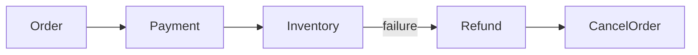

# Daily Knowledge Sharing — 2026-09-20

## Today’s Topics

1. C# `ArrayPool<T>`: tái sử dụng buffer mà không giữ memory vô hạn
2. ASP.NET Core rate limiting: bảo vệ capacity thay vì chỉ chặn user
3. EF Core split queries: tránh cartesian explosion nhưng hiểu round-trip cost
4. PostgreSQL transaction isolation: MVCC, snapshot và write conflict
5. Redis outage strategy: cache failure không được biến thành database outage
6. Saga Pattern: consistency xuyên service mà không giả vờ có distributed ACID
7. Azure Key Vault + Managed Identity: secret retrieval, rotation và failure boundary
8. IIS Application Pool recycling: vì sao process restart tạo lỗi “ngẫu nhiên”
9. SonarQube và code coverage: quality gate phải gắn với risk, không phải con số đẹp
10. AI coding agent repository context: kiểm chứng assumption trước khi cho agent sửa code

---

# 1. C# `ArrayPool<T>`: tái sử dụng buffer mà không giữ memory vô hạn

## 1. What is it?

`ArrayPool<T>` là pool các array có thể thuê (`Rent`) và trả (`Return`) để giảm allocation của temporary buffers. Mental model: bạn mượn capacity, không sở hữu một array có kích thước chính xác và cũng không được giả định dữ liệu cũ đã được xóa.

## 2. Why does it exist?

Hot path xử lý serialization, compression hoặc file/network buffers có thể tạo hàng nghìn arrays mỗi giây. Arrays lớn còn có thể đi vào LOH, tăng GC pressure và pause. Pooling đổi allocation churn lấy memory reuse.

## 3. How does it work?

`Rent(needed)` trả array có `Length >= needed`. Sau khi dùng, caller phải `Return`. Pool giữ buffers để reuse; nó không bảo đảm mọi buffer luôn được giữ hay cùng buffer sẽ quay lại.

```text
Rent → use bounded slice → Return
          │
          └─ không giữ reference sau Return
```

## 4. Practical implementation

```csharp
var pool = ArrayPool<byte>.Shared;
var buffer = pool.Rent(64 * 1024);
try
{
    var read = await stream.ReadAsync(buffer.AsMemory(0, 64 * 1024), ct);
    await ProcessAsync(buffer.AsMemory(0, read), ct);
}
finally
{
    pool.Return(buffer, clearArray: false);
}
```

Với dữ liệu nhạy cảm, cân nhắc `clearArray: true` hoặc tránh shared pool tùy threat model.

## 5. Real production scenario

File-processing API đọc nhiều uploads đồng thời. Profiling cho thấy allocation rate và LOH collections cao do tạo `byte[1MB]` liên tục. Pooling buffer giảm allocation mà không thay đổi business flow.

## 6. Failure scenario & troubleshooting

**Symptom** → dữ liệu request A xuất hiện trong request B hoặc memory corruption logic. **Evidence** → code giữ reference sau `Return`, hoặc đọc toàn `Length` thay vì phần đã ghi. **Diagnosis** → ownership/lifetime sai. **Fix** → chỉ dùng buffer trong lexical scope và truyền slice có length thật. **Verification** → concurrency tests và poison-buffer tests.

## 7. Common mistakes

Không `Return` khi exception; assume exact size; trả buffer rồi tiếp tục dùng; pool tiny arrays dù allocation không đáng kể; dùng pooling trước khi profiling.

## 8. Alternatives

Array allocation bình thường đơn giản hơn. `MemoryPool<T>` hữu ích khi cần owner/lifetime abstraction. `Span<T>` giảm copy nhưng không tự cung cấp reusable storage.

## 9. Trade-offs

### Advantages

Giảm allocation và GC pressure trên hot paths.

### Costs / Risks

Ownership phức tạp, stale data risk và pool có thể giữ memory lâu hơn mong đợi.

## 10. Junior → Middle → Senior → Technical Lead

### Junior

Hiểu `Rent`/`Return` và array có thể lớn hơn requested size.

### Middle

Bảo đảm `try/finally`, slicing và cancellation đúng.

### Senior

Đo allocation/LOH trước và sau; đánh giá data sensitivity.

### Technical Lead / Architect

Giới hạn pooling trong infrastructure hot paths thay vì làm business code khó hiểu.

## 11. Key takeaway

- Pooling là optimization dựa trên measurement.
- Ownership/lifetime quan trọng hơn cú pháp.
- Không được tin buffer được zeroed hoặc có exact length.

---

# 2. ASP.NET Core rate limiting: bảo vệ capacity thay vì chỉ chặn user

## 1. What is it?

Rate limiting kiểm soát lượng work được chấp nhận theo key/window/concurrency. Mục tiêu production là bảo vệ finite capacity của application và dependencies, không đơn thuần chống abuse.

## 2. Why does it exist?

Một endpoint đắt tiền có thể làm cạn connection pool hoặc saturate downstream dù traffic hợp lệ. Không có admission control, overload làm latency tăng, timeout tăng và retries tiếp tục khuếch đại tải.

## 3. How does it work?

Request được partition theo identity/IP/API key/route rồi policy quyết định permit, queue hoặc reject. Concurrency limiter đặc biệt hữu ích khi bottleneck là số operation đồng thời thay vì requests/second.

## 4. Practical implementation

```csharp
builder.Services.AddRateLimiter(options =>
{
    options.AddFixedWindowLimiter("writes", o =>
    {
        o.PermitLimit = 50;
        o.Window = TimeSpan.FromSeconds(1);
        o.QueueLimit = 0;
    });
    options.RejectionStatusCode = StatusCodes.Status429TooManyRequests;
});

app.UseRateLimiter();
app.MapPost("/orders", Handle).RequireRateLimiting("writes");
```

## 5. Real production scenario

Partner import API bắn burst hàng nghìn writes, làm SQL connection pool cạn và ảnh hưởng checkout. Per-partner limiter cô lập burst trước khi database bị overload.

## 6. Failure scenario & troubleshooting

**Symptom** → 429 tăng nhưng database vẫn overload. **Evidence** → policy giới hạn per-instance trong khi App Service scale 20 instances. **Hypothesis** → effective global limit lớn hơn dự kiến. **Fix** → thiết kế distributed/gateway-level admission control hoặc capacity-aware partitioning. **Verification** → load test xuyên nhiều instances.

## 7. Common mistakes

Rate limit mọi route cùng mức; dùng IP sau reverse proxy sai; queue quá dài làm latency tệ hơn; retry 429 ngay lập tức; coi limiter là authorization.

## 8. Alternatives

API gateway/CDN limiting bảo vệ trước application. Queue-based load leveling phù hợp asynchronous work. Bulkhead/concurrency limit bảo vệ dependency khác với fixed RPS.

## 9. Trade-offs

### Advantages

Failure isolation, predictable capacity và overload protection.

### Costs / Risks

False rejection, fairness complexity và distributed coordination nếu cần global quota.

## 10. Junior → Middle → Senior → Technical Lead

### Junior

Hiểu `429` và capacity hữu hạn.

### Middle

Implement policies, partition keys và tests.

### Senior

Chọn algorithm theo bottleneck và multi-instance behavior.

### Technical Lead / Architect

Đặt admission control ở boundary đúng và liên kết limits với SLO/capacity evidence.

## 11. Key takeaway

- Rate limiting là capacity protection.
- Per-instance limit không tự thành global limit.
- Queueing quá mức chỉ đổi overload thành latency.

---

# 3. EF Core split queries: tránh cartesian explosion nhưng hiểu round-trip cost

## 1. What is it?

Split query cho phép EF Core load nhiều collection navigations bằng nhiều SQL queries thay vì một JOIN khổng lồ.

## 2. Why does it exist?

`Include` nhiều one-to-many collections có thể nhân rows: 20 lines × 10 notes tạo 200 rows cho một order. Network payload và materialization tăng dù số entities thật nhỏ hơn nhiều.

## 3. How does it work?

`AsSplitQuery()` tách root và collections thành queries riêng rồi EF Core fix-up graph ở client. Nó giảm row multiplication nhưng tăng database round trips và consistency considerations giữa queries.

## 4. Practical implementation

```csharp
var orders = await db.Orders
    .Include(x => x.Lines)
    .Include(x => x.Notes)
    .AsSplitQuery()
    .Where(x => x.Id == id)
    .SingleAsync(ct);
```

Nếu response chỉ cần subset fields, projection thường tốt hơn cả single lẫn split include.

## 5. Real production scenario

Order details endpoint include Lines, Discounts và AuditEntries. Single query trả hàng chục nghìn physical rows. Split query giảm bytes/read nhưng thêm queries.

## 6. Failure scenario & troubleshooting

**Symptom** → sau `AsSplitQuery`, latency tăng ở cloud DB. **Evidence** → row count giảm nhưng round trips tăng và network RTT cao. **Diagnosis** → trade-off không phù hợp. **Fix** → projection hoặc reshape queries. **Verification** → đo SQL duration, bytes, round trips và p95.

## 7. Common mistakes

Dùng split query như universal fix; không inspect generated SQL; load aggregate graph quá lớn; bỏ qua consistency khi dữ liệu thay đổi giữa queries.

## 8. Alternatives

Single query tốt cho graph nhỏ. Projection tốt cho read APIs. Explicit queries phù hợp khi từng collection có access rule riêng.

## 9. Trade-offs

### Advantages

Giảm cartesian explosion và duplicated row payload.

### Costs / Risks

Nhiều round trips, transaction/isolation considerations và client-side assembly.

## 10. Junior → Middle → Senior → Technical Lead

### Junior

Hiểu `Include` ảnh hưởng SQL shape.

### Middle

Biết inspect SQL và dùng split query có chủ đích.

### Senior

Đo row multiplication, RTT và consistency.

### Technical Lead / Architect

Ưu tiên read model phù hợp thay vì mặc định load domain graph cho mọi endpoint.

## 11. Key takeaway

- Split query đổi row explosion lấy round trips.
- Projection thường là lựa chọn tốt cho API reads.
- Luôn đo SQL shape và network cost.

---

# 4. PostgreSQL transaction isolation: MVCC, snapshot và write conflict

## 1. What is it?

PostgreSQL dùng MVCC để transaction đọc version dữ liệu phù hợp thay vì khóa readers/writers theo cách đơn giản. Isolation level quyết định snapshot visibility và loại anomaly được phép.

## 2. Why does it exist?

Concurrency cần cân bằng correctness và throughput. Serial execution dễ reasoning nhưng không scale; MVCC cho phép nhiều reads/writes tiến hành đồng thời với rules rõ.

## 3. How does it work?

`Read Committed` tạo snapshot theo statement; `Repeatable Read` giữ snapshot ổn định hơn trong transaction; `Serializable` phát hiện dependency patterns có thể vi phạm serial execution và có thể abort transaction để retry.

## 4. Practical implementation

```csharp
await using var tx = await db.Database.BeginTransactionAsync(
    IsolationLevel.Serializable, ct);

var account = await db.Accounts.SingleAsync(x => x.Id == id, ct);
account.Balance -= amount;
await db.SaveChangesAsync(ct);
await tx.CommitAsync(ct);
```

Serializable failures phải được coi là expected concurrency outcome và retry toàn transaction có giới hạn khi operation an toàn.

## 5. Real production scenario

Hai approval requests cùng kiểm tra quota rồi ghi allocation. Logic “check then write” có thể vi phạm invariant nếu isolation/concurrency control không đủ.

## 6. Failure scenario & troubleshooting

**Symptom** → sporadic serialization failures. **Evidence** → PostgreSQL reports serialization conflict dưới load. **Diagnosis** → isolation đang chủ động bảo vệ invariant. **Fix** → bounded retry toàn transaction và giảm contention/access pattern. **Verification** → concurrency test giữ invariant.

## 7. Common mistakes

Tăng isolation mà không hiểu invariant; retry chỉ `SaveChanges`; giữ transaction qua remote API call; nghĩ MVCC nghĩa là không có locks.

## 8. Alternatives

Optimistic concurrency token phù hợp entity updates. Explicit locking phù hợp một số contention patterns. Atomic SQL update có thể đơn giản hơn read-modify-write.

## 9. Trade-offs

### Advantages

Strong correctness options mà vẫn hỗ trợ concurrency tốt.

### Costs / Risks

Higher isolation có abort/retry cost và contention; transaction dài giữ resources/versions lâu.

## 10. Junior → Middle → Senior → Technical Lead

### Junior

Hiểu transaction không chỉ là `Commit`/`Rollback`.

### Middle

Biết isolation ảnh hưởng visibility/concurrency.

### Senior

Thiết kế invariant, retries và transaction duration.

### Technical Lead / Architect

Chọn consistency mechanism theo business invariant thay vì mặc định isolation cao nhất.

## 11. Key takeaway

- MVCC giảm blocking nhưng không xóa concurrency anomalies.
- Serializable có thể hợp lệ khi abort transaction.
- Isolation phải xuất phát từ invariant cần bảo vệ.

---

# 5. Redis outage strategy: cache failure không được biến thành database outage

## 1. What is it?

Cache outage strategy định nghĩa hệ thống làm gì khi Redis chậm hoặc unavailable: bypass, stale serve, fail closed/open, hoặc shed load. Đây là reliability design chứ không chỉ exception handling.

## 2. Why does it exist?

Nếu mọi cache miss/error fallback ngay xuống SQL, Redis outage có thể chuyển toàn bộ cached traffic sang database trong vài giây và làm database sập theo.

## 3. How does it work?

```text
Redis failure
   ├─ bounded bypass → DB capacity guard
   ├─ stale local data → degraded response
   └─ reject noncritical work → protect core flow
```

Fallback phải có capacity model.

## 4. Practical implementation

```csharp
try
{
    return await cache.GetAsync<Product>(key, ct);
}
catch (RedisException ex)
{
    logger.LogWarning(ex, "Redis unavailable for {Key}", key);
    if (!dbBulkhead.TryEnter())
        throw new ServiceUnavailableException();
    return await repository.GetAsync(id, ct);
}
```

Production code cần bulkhead/circuit breaker phù hợp, không phải custom semaphore tùy tiện.

## 5. Real production scenario

Catalog API có 95% cache hit. Redis cluster outage làm SQL QPS lý thuyết tăng 20×. Degraded mode ưu tiên product detail và reject expensive recommendations/search enrichment.

## 6. Failure scenario & troubleshooting

**Symptom** → Redis outage kéo theo SQL timeout. **Evidence** → cache errors xuất hiện trước DB connections/CPU spike. **Diagnosis** → uncontrolled fallback. **Fix** → capacity guard, stale policy, load shedding. **Verification** → chaos test Redis outage dưới peak traffic.

## 7. Common mistakes

Retry Redis nhiều lần trong request; fallback vô hạn; không monitor hit rate; cache trở thành mandatory dependency dù business cho phép stale; không định nghĩa recovery/warm-up.

## 8. Alternatives

`IMemoryCache` có thể giữ small local fallback. Không cache nếu origin đủ capacity. CDN phù hợp public/cacheable HTTP data.

## 9. Trade-offs

### Advantages

Cache tăng performance và giảm origin load.

### Costs / Risks

Outage amplification, stale data, invalidation và hidden critical dependency.

## 10. Junior → Middle → Senior → Technical Lead

### Junior

Hiểu cache unavailable khác cache miss.

### Middle

Implement timeout và observable fallback.

### Senior

Thiết kế load shedding, stale tolerance và recovery.

### Technical Lead / Architect

Xác định liệu Redis có cần thiết và origin phải chịu được bao nhiêu bypass traffic.

## 11. Key takeaway

- Fallback không có capacity guard có thể phá origin.
- Redis failure phải được chaos/load test.
- Cache strategy luôn cần degraded-mode strategy.

---

# 6. Saga Pattern: consistency xuyên service mà không giả vờ có distributed ACID

## 1. What is it?

Saga là chuỗi local transactions giữa services, với compensating actions khi bước sau thất bại. Nó quản lý business consistency trong distributed workflow, không tạo rollback vật lý xuyên databases.

## 2. Why does it exist?

Order, payment và inventory có thể sở hữu databases riêng. Một ACID transaction chung thường không khả thi hoặc làm coupling/availability tệ. Business vẫn cần xử lý partial completion.

## 3. How does it work?



Compensation là business action mới; không phải time travel. Refund có thể khác hoàn toàn “undo payment”.

## 4. Practical implementation

```csharp
public async Task HandleAsync(OrderPlaced e, CancellationToken ct)
{
    var result = await payment.ReserveAsync(e.OrderId, e.Total, ct);
    await bus.PublishAsync(
        result.Success
            ? new PaymentReserved(e.OrderId)
            : new PaymentRejected(e.OrderId), ct);
}
```

Handlers cần idempotency; state machine/orchestrator thường lưu saga state bền vững.

## 5. Real production scenario

Checkout reserve payment thành công nhưng inventory hết hàng. Workflow phải release/refund reservation và cancel order, đồng thời chịu được duplicate messages và delayed compensation.

## 6. Failure scenario & troubleshooting

**Symptom** → orders kẹt `PaymentReserved` nhiều giờ. **Evidence** → saga state không tiến triển, message retry/DLQ. **Diagnosis** → missing transition hoặc poison event. **Fix** → replay/quarantine, timeout transition và operator tooling. **Verification** → failure injection ở từng bước.

## 7. Common mistakes

Gọi compensation là rollback; không lưu saga state; không idempotent; workflow quá dài; dùng Saga khi một database transaction đơn giản đủ.

## 8. Alternatives

Single transaction tốt nhất khi cùng ownership/database. Outbox giải reliable publication nhưng không tự orchestrate workflow. Choreography giảm central coordinator nhưng khó quan sát khi flow lớn.

## 9. Trade-offs

### Advantages

Cho phép distributed business workflow và failure recovery.

### Costs / Risks

Eventual consistency, state-machine complexity, compensation semantics và operational tooling.

## 10. Junior → Middle → Senior → Technical Lead

### Junior

Hiểu local transaction và compensation.

### Middle

Implement idempotent handlers/transitions.

### Senior

Thiết kế timeout, DLQ, replay và invariants.

### Technical Lead / Architect

Quyết định workflow có thật sự cần service boundaries hay nên giữ trong modular monolith/single transaction.

## 11. Key takeaway

- Saga không cung cấp distributed rollback.
- Compensation là business operation.
- Dùng Saga chỉ khi distributed boundary thực sự tồn tại.

---

# 7. Azure Key Vault + Managed Identity: secret retrieval, rotation và failure boundary

## 1. What is it?

Managed Identity cho Azure workload một identity do platform quản lý; Key Vault lưu secrets/keys/certificates và kiểm soát access. Kết hợp chúng giúp application không phải chứa credential để lấy credential khác.

## 2. Why does it exist?

Connection strings/API keys trong source, pipeline variables hoặc config files tăng blast radius và rotation cost. Identity-based access giảm static credentials.

## 3. How does it work?

App Service/Function lấy token từ Azure identity platform, dùng token đó authenticate tới Key Vault; Key Vault authorization quyết định secret nào được đọc.

## 4. Practical implementation

```csharp
var client = new SecretClient(
    new Uri(vaultUri),
    new DefaultAzureCredential());

KeyVaultSecret secret = await client.GetSecretAsync("PartnerApiKey", cancellationToken: ct);
```

Production nên kết hợp least privilege, private networking khi cần và strategy cache/rotation rõ.

## 5. Real production scenario

Backend gọi payment partner bằng API key. Key được rotate trong Key Vault mà không commit config mới; application refresh theo policy.

## 6. Failure scenario & troubleshooting

**Symptom** → app start fail chỉ ở Production. **Evidence** → `403` Key Vault hoặc token acquisition failure. **Hypothesis** → identity/RBAC/network mismatch. **Diagnosis** → kiểm tra principal, role scope, firewall/private endpoint và DNS. **Fix** → cấp quyền tối thiểu đúng identity. **Verification** → test từ actual hosting environment.

## 7. Common mistakes

Dùng developer credential trong Production; cấp Vault-wide admin; gọi Key Vault cho mỗi request; rotation nhưng app cache secret vô hạn; log secret values.

## 8. Alternatives

Environment secrets đơn giản hơn cho small deployments nhưng rotation/governance yếu hơn. Managed Identity trực tiếp tới Azure SQL/Storage có thể loại bỏ secret hoàn toàn.

## 9. Trade-offs

### Advantages

Giảm static credentials, central rotation/audit và least privilege tốt hơn.

### Costs / Risks

Thêm identity/network dependency, startup/fetch failure modes và Azure coupling.

## 10. Junior → Middle → Senior → Technical Lead

### Junior

Phân biệt identity với secret.

### Middle

Configure Managed Identity/RBAC và client.

### Senior

Thiết kế caching, rotation, networking và observability.

### Technical Lead / Architect

Ưu tiên secretless authentication khi service hỗ trợ và xác định failure behavior khi Key Vault unavailable.

## 11. Key takeaway

- Managed Identity giúp loại static credential khỏi application.
- Key Vault access vẫn là remote dependency.
- Rotation chỉ hiệu quả nếu application refresh đúng.

---

# 8. IIS Application Pool recycling: vì sao process restart tạo lỗi “ngẫu nhiên”

## 1. What is it?

Application Pool quản lý worker process (`w3wp`) cho IIS-hosted applications. Recycling thay worker process theo policy/config/health để giải phóng hoặc thay thế process.

## 2. Why does it exist?

Long-running process có thể cần refresh vì configuration, memory policy, deployment hoặc operational maintenance. IIS cung cấp process management thay vì để application tự quản lý lifecycle hoàn toàn.

## 3. How does it work?

Recycle có thể tạo worker mới rồi drain worker cũ, nhưng in-memory state, static caches và background work gắn với process cũ không được đảm bảo sống sót.

## 4. Practical implementation

ASP.NET Core background work phải quan sát shutdown:

```csharp
protected override async Task ExecuteAsync(CancellationToken stoppingToken)
{
    while (!stoppingToken.IsCancellationRequested)
    {
        await ProcessNextAsync(stoppingToken);
    }
}
```

Durable work không nên tồn tại chỉ trong memory queue của web process.

## 5. Real production scenario

Legacy enterprise site chạy scheduled export trong IIS. App Pool recycle giữa job làm file dở dang nhưng database đánh dấu “processing”, gây stuck records.

## 6. Failure scenario & troubleshooting

**Symptom** → job/request dài thỉnh thoảng mất giữa đêm. **Evidence** → IIS recycle/event logs trùng timestamp. **Diagnosis** → process lifecycle assumption sai. **Fix** → durable queue/checkpoint và graceful shutdown; chuyển long-running worker ra process phù hợp. **Verification** → chủ động recycle trong test.

## 7. Common mistakes

Lưu session/job state chỉ in-memory; coi web process là daemon vĩnh viễn; không log startup/shutdown; tăng recycle timeout thay vì sửa durability.

## 8. Alternatives

Windows Service/Worker Service cho continuous background processing; Azure WebJobs/Functions/Service Bus consumers cho managed execution tùy workload.

## 9. Trade-offs

### Advantages

IIS cung cấp mature process hosting và enterprise Windows integration.

### Costs / Risks

Lifecycle/recycle semantics, Windows coupling và background-work limitations.

## 10. Junior → Middle → Senior → Technical Lead

### Junior

Hiểu application process có thể restart bất kỳ lúc nào.

### Middle

Handle cancellation và externalize durable state.

### Senior

Correlate IIS events với incidents và thiết kế graceful recovery.

### Technical Lead / Architect

Đặt long-running work vào hosting model đúng thay vì chống lại web-process lifecycle.

## 11. Key takeaway

- Process memory không phải durable storage.
- Recycle phải là expected lifecycle event.
- Background work cần checkpoint/queue nếu không được phép mất.

---

# 9. SonarQube và code coverage: quality gate phải gắn với risk, không phải con số đẹp

## 1. What is it?

SonarQube/static analysis tìm classes của maintainability, reliability và security issues; coverage đo phần code được tests thực thi. Chúng là signals, không phải bằng chứng độc lập rằng software đúng.

## 2. Why does it exist?

Human review khó phát hiện nhất quán duplicated patterns, obvious bugs hoặc untested code. Automation tạo baseline nhưng cần policy gắn với engineering risk.

## 3. How does it work?

CI build/test sinh coverage report; scanner phân tích source và quality rules; gate có thể fail PR theo new-code policy. Quan trọng là kiểm soát regression trên code thay đổi thay vì ép toàn legacy repository đạt target tức thì.

## 4. Practical implementation

```bash
dotnet test --collect:"XPlat Code Coverage"
dotnet sonarscanner begin /k:"orders-api"
dotnet build
dotnet test
dotnet sonarscanner end
```

Pipeline thực tế phải đặt scanner lifecycle đúng theo tool/version đang dùng.

## 5. Real production scenario

Team đạt 90% coverage nhưng payment refund bug vẫn lọt vì tests chỉ assert mock calls. Coverage cao nhưng không bảo vệ business invariant.

## 6. Failure scenario & troubleshooting

**Symptom** → developers viết trivial tests chỉ để gate xanh. **Evidence** → coverage tăng nhưng mutation/regression quality không cải thiện. **Diagnosis** → metric trở thành target. **Fix** → gate new code hợp lý và review test intent/risk. **Verification** → production bug reproduction tests thực sự fail trước fix.

## 7. Common mistakes

`100% coverage = quality`; block legacy codebase bằng unrealistic gate; ignore false positives không governance; test implementation details; bỏ integration tests vì unit coverage cao.

## 8. Alternatives

Compiler analyzers, GitHub/code review, mutation testing và integration/E2E tests bảo vệ failure classes khác nhau.

## 9. Trade-offs

### Advantages

Automated feedback, consistent baseline và visibility technical debt.

### Costs / Risks

Noise, gaming metrics và pipeline time nếu policy kém.

## 10. Junior → Middle → Senior → Technical Lead

### Junior

Hiểu coverage chỉ nói code đã chạy trong test.

### Middle

Viết tests bảo vệ behavior và xử lý findings đúng.

### Senior

Phân loại risk, false positive và test strategy.

### Technical Lead / Architect

Thiết kế quality gate thúc đẩy chất lượng thật thay vì tối ưu dashboard.

## 11. Key takeaway

- Coverage là signal, không phải mục tiêu cuối.
- Test phải bảo vệ risk/invariant.
- Quality gate tốt tập trung vào actionable new-code regressions.

---

# 10. AI coding agent repository context: kiểm chứng assumption trước khi cho agent sửa code

## 1. What is it?

Repository context là tập source, tests, docs, dependency versions, conventions và runtime evidence mà coding agent dùng để reasoning. Agent không biết repository chỉ vì prompt mô tả stack.

## 2. Why does it exist?

LLM có thể sinh API hợp lý nhưng sai version, bỏ qua local abstraction hoặc “fix” symptom bằng architecture không phù hợp. Context grounding giảm assumption nhưng vẫn cần verification.

## 3. How does it work?

```text
Task
 ↓
Retrieve relevant code/docs/tests
 ↓
Form hypothesis
 ↓
Edit minimal boundary
 ↓
Build + test + static analysis
 ↓
Review diff against requirements
```

Deterministic tools phải xác nhận compilation/tests; model output không phải source of truth.

## 4. Practical implementation

Một agent sửa EF Core bug nên đọc `.csproj`, `DbContext`, entity mappings, failing test và generated SQL trước khi đề xuất Repository Pattern hoặc package API mới. Sau edit phải chạy targeted tests rồi broader suite.

## 5. Real production scenario

Agent thấy `Include` chậm và tự thêm Redis. Root cause thật là projection thiếu và query trả cartesian product. Không có SQL evidence, agent tăng complexity mà không sửa bottleneck.

## 6. Failure scenario & troubleshooting

**Symptom** → PR compile fail hoặc dùng API không tồn tại. **Evidence** → package version/repository code mâu thuẫn với generated patch. **Diagnosis** → agent reasoning từ generic knowledge thay vì repo source. **Fix** → retrieval-first workflow, version grounding và executable verification. **Verification** → clean build/tests và diff review.

## 7. Common mistakes

Prompt cực dài nhưng không đọc source; tin generated tests khi tests encode cùng assumption sai; cho agent sửa nhiều layers cùng lúc; bỏ security review; không inspect diff.

## 8. Alternatives

Human-only implementation phù hợp high-risk/unclear tasks. AI assistant nhỏ theo file có blast radius thấp hơn autonomous repository agent. Static tooling tốt hơn cho deterministic refactors.

## 9. Trade-offs

### Advantages

Tăng tốc repository navigation, repetitive edits, test generation và hypothesis exploration.

### Costs / Risks

Hallucinated assumptions, insecure code, overengineering và review burden.

## 10. Junior → Middle → Senior → Technical Lead

### Junior

Dùng AI để giải thích nhưng luôn đối chiếu source/build.

### Middle

Cung cấp failing test, relevant files và acceptance criteria.

### Senior

Kiểm soát scope, validate architecture/security và yêu cầu evidence.

### Technical Lead / Architect

Thiết kế agent workflow với permissions, verification gates, auditability và human approval cho high-impact changes.

## 11. Key takeaway

- Repository source và executable tests quan trọng hơn prompt tự mô tả.
- Agent phải tạo hypothesis từ evidence rồi verification bằng deterministic tools.
- AI tăng tốc engineering; nó không thay ownership của technical decision.
