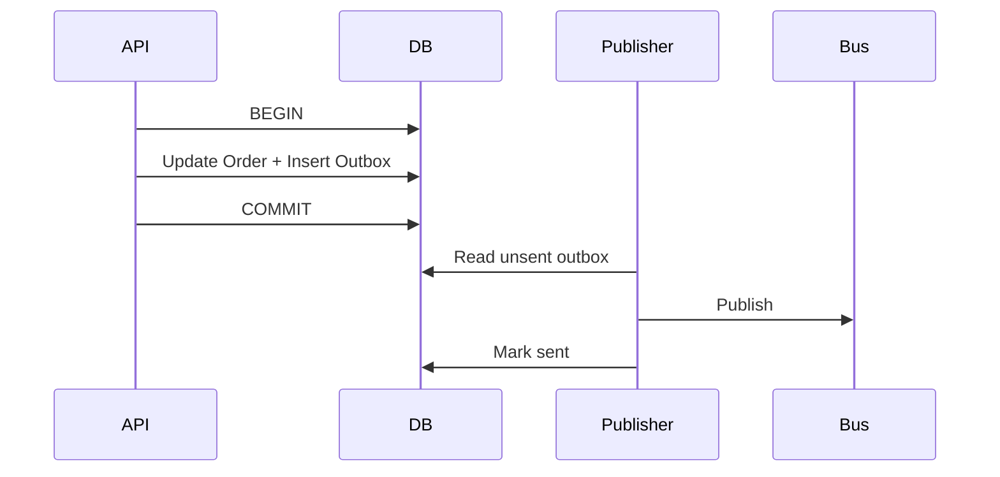

# Daily Knowledge Sharing — 2026-09-20

## Today’s Topics

1. C# `CancellationToken`: cancellation là cooperative protocol, không phải kill switch
2. ASP.NET Core DI lifetimes: Scoped dependency bị giữ bởi Singleton và captive dependency
3. EF Core compiled queries: giảm query compilation cost chỉ khi profiling chứng minh hot path
4. SQL Server covering index: giảm lookup nhưng trả giá bằng write amplification
5. Outbox Pattern: nối database transaction với message publishing mà không cần distributed transaction
6. Azure App Service deployment slots: swap an toàn cần configuration và warm-up đúng boundary
7. Redis cache stampede: một key hết hạn có thể biến cache thành database outage
8. OpenTelemetry sampling: giảm telemetry cost mà không làm mất incident evidence
9. Docker multi-stage build: image nhỏ hơn, attack surface thấp hơn và artifact reproducible
10. Vue.js async state: race condition phía browser khi response cũ ghi đè state mới

---

# 1. C# `CancellationToken`: cancellation là cooperative protocol, không phải kill switch

## 1. What is it?

`CancellationToken` là tín hiệu cooperative cancellation được truyền xuyên call chain. Mental model đúng: caller thông báo “kết quả này không còn cần thiết”; code đang chạy phải chủ động quan sát token và dừng tại boundary an toàn. Runtime không cưỡng bức terminate thread.

## 2. Why does it exist?

Một HTTP request bị client đóng kết nối nhưng backend vẫn query database, gọi API ngoài và serialize response là wasted work. Trong load cao, hàng nghìn operations “mồ côi” tiếp tục giữ connection, ThreadPool work và downstream capacity.

## 3. How does it work?

```text
Client disconnect
      ↓
HttpContext.RequestAborted
      ↓
Application service
      ↓
EF Core / HttpClient / queue operation
```

Token chỉ có hiệu lực ở nơi API quan sát nó. `ThrowIfCancellationRequested()` tạo `OperationCanceledException`; nhiều async APIs tự làm điều này.

## 4. Practical implementation

```csharp
app.MapGet("/orders/{id:guid}", async (
    Guid id,
    AppDbContext db,
    HttpClient client,
    CancellationToken ct) =>
{
    var order = await db.Orders
        .AsNoTracking()
        .SingleOrDefaultAsync(x => x.Id == id, ct);

    if (order is null) return Results.NotFound();

    using var response = await client.GetAsync(
        $"pricing/{order.ProductId}", ct);

    return Results.Ok(order);
});
```

Token nên được propagate, không tạo `new CancellationTokenSource()` tùy tiện ở từng layer.

## 5. Real production scenario

Search API có p95 800 ms. User đổi filter liên tục và browser abort request cũ. Nếu token đi xuyên tới SQL và Elasticsearch client, backend giải phóng work sớm thay vì tiếp tục chạy queries mà không ai sử dụng kết quả.

## 6. Failure scenario & troubleshooting

**Symptom** → request rate giảm nhưng SQL vẫn có nhiều long-running queries. **Evidence** → trace kết thúc ở HTTP layer trong khi dependency spans tiếp tục. **Hypothesis** → cancellation không propagate. **Diagnosis** → kiểm tra call chain và API overload không nhận token. **Fix** → truyền token đến I/O boundaries. **Verification** → abort load test và quan sát dependency duration/concurrency giảm.

Không coi `OperationCanceledException` do request abort là application error 500.

## 7. Common mistakes

Bỏ token ở repository; catch `Exception` rồi log cancellation như lỗi; dùng `CancellationToken.None`; cancel sau khi irreversible side effect đã commit rồi giả vờ operation chưa xảy ra; dùng cancellation thay transaction compensation.

## 8. Alternatives

Timeout giới hạn duration theo policy; cancellation phản ánh caller intent. Hai cơ chế có thể linked bằng `CancellationTokenSource.CreateLinkedTokenSource`. Hard process termination chỉ dành cho process supervision, không phải request control.

## 9. Trade-offs

### Advantages

Giảm wasted work, giải phóng downstream resources và hỗ trợ graceful shutdown.

### Costs / Risks

Phải thiết kế cancellation boundary; dừng sai chỗ có thể để workflow ở trạng thái business không rõ ràng.

## 10. Junior → Middle → Senior → Technical Lead

### Junior

Hiểu token là tín hiệu cooperative và phải được truyền xuống.

### Middle

Propagate token qua EF Core, `HttpClient`, background work và test cancellation.

### Senior

Phân biệt safe cancellation trước/giữa/sau side effect; quan sát cancellation trong telemetry.

### Technical Lead / Architect

Định nghĩa deadline/cancellation policy xuyên service và transaction boundary; quyết định operation nào phải hoàn tất dù client disconnect.

## 11. Key takeaway

- Cancellation không kill thread; code phải hợp tác.
- Propagate token tới I/O boundary để thực sự tiết kiệm capacity.
- Sau irreversible side effect, cancellation cần business reasoning chứ không chỉ `throw`.

---

# 2. ASP.NET Core DI lifetimes: Scoped dependency bị giữ bởi Singleton và captive dependency

## 1. What is it?

ASP.NET Core DI có ba lifetime phổ biến: `Transient`, `Scoped`, `Singleton`. Captive dependency xuất hiện khi component sống lâu giữ reference tới dependency đáng lẽ sống ngắn hơn. Trường hợp nguy hiểm nhất là Singleton giữ Scoped service.

## 2. Why does it exist?

Lifetime mô tả ownership và state boundary. `DbContext` thường Scoped vì change tracker và transaction context thuộc request/unit of work. Nếu Singleton giữ nó, request isolation bị phá và object không thread-safe có thể được dùng đồng thời.

## 3. How does it work?

```text
Root container
  └─ Singleton (lifetime = app)
       └─ Scoped dependency (?)  <- lifetime bị kéo dài sai

Request scope A -> scoped services
Request scope B -> scoped services
```

Built-in container có scope validation trong development cho nhiều lỗi lifetime, nhưng design vẫn cần hiểu ownership.

## 4. Practical implementation

Sai:

```csharp
public sealed class PriceCache(AppDbContext db) // registered Singleton
{
    public Task<Product?> GetAsync(int id, CancellationToken ct) =>
        db.Products.FindAsync([id], ct).AsTask();
}
```

Nếu Singleton thực sự cần thực hiện scoped work, tạo scope theo operation:

```csharp
public sealed class RefreshWorker(IServiceScopeFactory scopeFactory)
{
    public async Task RefreshAsync(CancellationToken ct)
    {
        await using var scope = scopeFactory.CreateAsyncScope();
        var db = scope.ServiceProvider.GetRequiredService<AppDbContext>();
        await db.Products.AsNoTracking().LoadAsync(ct);
    }
}
```

Không dùng pattern này để che một lifetime design sai trong request flow.

## 5. Real production scenario

Background singleton cache refresher inject trực tiếp repository chứa `DbContext`. Sau load tăng, xuất hiện concurrent-operation exception và stale tracked entities. Root cause là request-scoped persistence state bị kéo dài thành process lifetime.

## 6. Failure scenario & troubleshooting

**Symptom** → `A second operation was started on this context...`, memory tăng hoặc dữ liệu tracking lạ. **Evidence** → cùng instance ID của service/DbContext xuất hiện ở nhiều operations. **Hypothesis** → captive dependency. **Diagnosis** → inspect registrations và dependency graph. **Fix** → sửa lifetime hoặc tạo explicit scope tại đúng operation boundary. **Verification** → scope validation + concurrency integration test.

## 7. Common mistakes

Đổi `DbContext` thành Singleton để “reuse connection”; inject Scoped service vào hosted Singleton; giữ request data trong Singleton; dùng service locator khắp nơi để né lifetime rules; coi Transient luôn vô hại dù object giữ expensive resources.

## 8. Alternatives

`IDbContextFactory<T>` phù hợp khi cần tạo context ngoài normal request scope. Scoped application services là default tự nhiên cho HTTP workflows. Singleton chỉ nên giữ state thread-safe và process-wide thật sự.

## 9. Trade-offs

### Advantages

Lifetime đúng làm ownership, disposal và concurrency rõ ràng.

### Costs / Risks

Tách scopes cho background workflows thêm ceremony; lifetime graph phức tạp khi hệ thống lạm dụng cross-cutting services.

## 10. Junior → Middle → Senior → Technical Lead

### Junior

Biết Scoped thường là một instance mỗi request scope.

### Middle

Chọn registration phù hợp và debug scope validation errors.

### Senior

Reason về thread safety, disposal và state leakage xuyên lifetime boundaries.

### Technical Lead / Architect

Đặt ownership conventions và tránh service graph khiến lifetime semantics khó kiểm soát.

## 11. Key takeaway

- Lifetime là ownership/concurrency contract, không chỉ DI syntax.
- Singleton không được vô tình kéo Scoped state thành process-wide state.
- `DbContext` reuse xuyên requests không phải connection pooling.

---

# 3. EF Core compiled queries: giảm query compilation cost chỉ khi profiling chứng minh hot path

## 1. What is it?

EF Core compiled query cho phép compile một LINQ query shape trước và reuse delegate. Mental model: nó tối ưu CPU overhead của EF query pipeline, không làm SQL server thực thi query nhanh hơn và không sửa query/index kém.

## 2. Why does it exist?

EF Core đã cache query compilation theo query shape. Nhưng ở extremely hot paths, lookup/processing của query cache vẫn có overhead. Explicit compiled queries có thể giảm phần overhead đó.

## 3. How does it work?

```text
LINQ expression
   ↓ one-time compile
compiled delegate
   ↓ parameters
SQL command
   ↓
database execution
```

Nếu database mất 300 ms thì tiết kiệm vài microseconds phía EF gần như không có ý nghĩa.

## 4. Practical implementation

```csharp
private static readonly Func<AppDbContext, Guid, IAsyncEnumerable<OrderDto>>
    GetOrder = EF.CompileAsyncQuery(
        (AppDbContext db, Guid id) =>
            db.Orders
              .AsNoTracking()
              .Where(x => x.Id == id)
              .Select(x => new OrderDto(x.Id, x.Status)));

await foreach (var order in GetOrder(db, id).WithCancellation(ct))
{
    return order;
}
```

Benchmark end-to-end và allocation/CPU trước khi giữ complexity này.

## 5. Real production scenario

High-throughput authorization service chạy cùng một tiny lookup hàng trăm nghìn lần/phút, database query đã dưới vài milliseconds. Profiling cho thấy EF pipeline chiếm tỷ lệ CPU đáng kể; compiled query mới trở thành candidate hợp lý.

## 6. Failure scenario & troubleshooting

**Symptom** → team thêm compiled queries nhưng p95 không đổi. **Evidence** → trace cho thấy 95% latency nằm ở SQL I/O/locking. **Diagnosis** → tối ưu sai layer. **Fix** → đọc execution plan, waits và access pattern. **Verification** → benchmark trước/sau tại bottleneck thật.

## 7. Common mistakes

Compile mọi query; nghĩ compiled query tương đương database prepared plan; dùng để chữa N+1; bỏ projection/index analysis; làm dynamic query composition khó maintain chỉ để tiết kiệm overhead nhỏ.

## 8. Alternatives

Normal EF query cache đủ cho đa số workload. Dapper/raw SQL có thể giảm ORM overhead ở specialized hot paths nhưng tăng mapping/maintenance responsibility. Database optimization thường đem lợi ích lớn hơn.

## 9. Trade-offs

### Advantages

Giảm một phần CPU/allocation ở repeated stable query shapes.

### Costs / Risks

Code kém linh hoạt hơn và dễ tạo premature optimization.

## 10. Junior → Middle → Senior → Technical Lead

### Junior

Hiểu EF đã có query caching và compiled query không phải default requirement.

### Middle

Biết tạo compiled query và benchmark chính xác.

### Senior

Phân tách ORM CPU khỏi database latency bằng profiler/traces.

### Technical Lead / Architect

Chỉ cho phép optimization này ở measured hot paths; ưu tiên clarity cho phần còn lại.

## 11. Key takeaway

- Compiled query tối ưu EF overhead, không tối ưu SQL plan hay I/O.
- Đo bottleneck trước khi áp dụng.
- Query shape, projection và index thường quan trọng hơn.

---

# 4. SQL Server covering index: giảm lookup nhưng trả giá bằng write amplification

## 1. What is it?

Covering index là index chứa đủ columns để query được trả lời từ index mà không cần lookup thêm vào clustered index/heap. Key columns phục vụ seek/order; `INCLUDE` columns bổ sung payload ở leaf level.

## 2. Why does it exist?

Một selective nonclustered index có thể tìm đúng keys nhanh nhưng sau đó phải thực hiện Key Lookup cho mỗi row để lấy columns còn thiếu. Với nhiều rows, random I/O/CPU từ lookup có thể trở thành bottleneck.

## 3. How does it work?

```text
Query
  ↓
Nonclustered Index Seek
  ├─ covered -> return
  └─ not covered -> Key Lookup -> clustered index
```

Covering index loại lookup cho query cụ thể, nhưng index lớn hơn phải được maintain trên INSERT/UPDATE/DELETE.

## 4. Practical implementation

```sql
CREATE INDEX IX_Orders_CustomerId_CreatedAt
ON dbo.Orders(CustomerId, CreatedAt DESC)
INCLUDE (Status, TotalAmount);

SELECT CreatedAt, Status, TotalAmount
FROM dbo.Orders
WHERE CustomerId = @customerId
ORDER BY CreatedAt DESC;
```

Đánh giá actual execution plan, logical reads và write workload trước/sau.

## 5. Real production scenario

Customer order-history endpoint đọc bốn columns, hàng nghìn lần/phút. Plan trước đó có Index Seek + hàng trăm Key Lookups. Covering index giảm logical reads đáng kể mà không cần cache.

## 6. Failure scenario & troubleshooting

**Symptom** → read nhanh hơn nhưng checkout writes chậm và index storage tăng mạnh. **Evidence** → write latency/index maintenance tăng sau deployment. **Hypothesis** → index quá rộng hoặc overlap indexes. **Diagnosis** → inspect usage stats, page count và write workload. **Fix** → thu hẹp `INCLUDE`, consolidate indexes hoặc bỏ index ít giá trị. **Verification** → đo cả read lẫn write p95.

## 7. Common mistakes

Include mọi column; tạo index cho từng query mà không xem overlap; key order sai access pattern; tin “covering” luôn tốt; bỏ qua filtered index; không xem selectivity và actual plan.

## 8. Alternatives

Projection nhỏ hơn có thể tự loại lookup need. Clustered index design khác có thể phù hợp. Cache chỉ hợp lý nếu freshness/invalidation economics tốt; không dùng cache để che schema/query design kém.

## 9. Trade-offs

### Advantages

Giảm lookup và I/O cho targeted reads.

### Costs / Risks

Tăng storage, write amplification, maintenance và buffer-pool footprint.

## 10. Junior → Middle → Senior → Technical Lead

### Junior

Hiểu index có thể chứa cả search keys và included payload.

### Middle

Đọc execution plan và nhận diện Key Lookup.

### Senior

Đo read/write trade-off, index overlap và workload frequency.

### Technical Lead / Architect

Quản lý index portfolio theo workload thay vì cho mỗi feature tự thêm index vô hạn.

## 11. Key takeaway

- Covering index là workload optimization, không phải free performance.
- Luôn đo logical reads và write cost.
- Index design bắt đầu từ access pattern và execution plan.

---

# 5. Outbox Pattern: nối database transaction với message publishing mà không cần distributed transaction

## 1. What is it?

Outbox Pattern lưu business state và một outbound message record trong cùng local database transaction. Một publisher riêng sau đó đọc outbox và gửi message tới broker. Mental model: commit intent-to-publish cùng dữ liệu, rồi delivery diễn ra asynchronous.

## 2. Why does it exist?

Flow naïve có dual-write problem:

```text
Save DB -> publish message
```

Nếu process crash giữa hai bước, DB đã commit nhưng event mất. Đảo thứ tự lại tạo trường hợp message được publish nhưng DB rollback.

## 3. How does it work?



Publisher có thể publish duplicate nếu crash sau publish trước mark-sent; consumer vẫn phải idempotent.

## 4. Practical implementation

```csharp
await using var tx = await db.Database.BeginTransactionAsync(ct);

order.Confirm();
db.OutboxMessages.Add(new OutboxMessage
{
    Id = Guid.NewGuid(),
    Type = "OrderConfirmed",
    Payload = JsonSerializer.Serialize(new { order.Id }),
    OccurredAtUtc = DateTime.UtcNow
});

await db.SaveChangesAsync(ct);
await tx.CommitAsync(ct);
```

Publisher nên batch, retry có backoff, emit metrics về oldest-message age và backlog.

## 5. Real production scenario

Checkout service commit order rồi cần notification/inventory workflows. Outbox đảm bảo nếu order tồn tại thì intent event cũng tồn tại, kể cả process chết ngay sau commit.

## 6. Failure scenario & troubleshooting

**Symptom** → outbox backlog tăng, downstream không nhận event. **Evidence** → oldest outbox age tăng, broker publish errors. **Hypothesis** → publisher/broker failure. **Diagnosis** → inspect publisher traces, broker connectivity và poison payload. **Fix** → restore publisher/broker, quarantine permanent errors. **Verification** → backlog drain và consumers xử lý idempotently.

## 7. Common mistakes

Ghi outbox ngoài transaction; xóa record trước publish; assume exactly-once; không index pending records; không retention/cleanup; serialize internal domain object thành permanent external contract.

## 8. Alternatives

Distributed transaction có thể tồn tại ở một số stack nhưng tăng coupling/operational constraints. Change Data Capture có thể publish database changes nhưng contract/intent semantics khác. Direct publish đủ cho non-critical best-effort notifications.

## 9. Trade-offs

### Advantages

Loại dual-write loss giữa local DB và broker; failure recoverable.

### Costs / Risks

Eventual consistency, duplicate delivery, outbox storage và publisher operations.

## 10. Junior → Middle → Senior → Technical Lead

### Junior

Hiểu hai independent systems không thể commit atomically bằng hai method calls.

### Middle

Implement outbox transaction và background publisher.

### Senior

Thiết kế idempotency, cleanup, batching, ordering và observability.

### Technical Lead / Architect

Quyết định nơi cần delivery guarantee này và liệu complexity có xứng với business consequence của message loss.

## 11. Key takeaway

- Outbox giải dual-write bằng local atomicity + asynchronous delivery.
- Nó cung cấp at-least-once style behavior, không phải exactly-once magic.
- Monitor backlog age, không chỉ publisher error count.

---

# 6. Azure App Service deployment slots: swap an toàn cần configuration và warm-up đúng boundary

## 1. What is it?

Deployment slot là một live App Service environment trong cùng app, thường dùng `staging` để deploy/validate trước khi swap vào `production`. Mental model: slot là deployment boundary với hostname/configuration riêng, không phải một bản copy hoàn toàn độc lập của production.

## 2. Why does it exist?

Deploy trực tiếp có thể làm request gặp cold start, bad artifact hoặc startup failure. Slot cho phép warm application và smoke-test trước khi production traffic chuyển sang version mới.

## 3. How does it work?

```text
Build artifact -> staging slot -> warm/health validate -> swap -> production traffic
```

Một số settings có thể được đánh dấu deployment-slot setting để “stick” với slot thay vì swap. Database schema vẫn là shared external dependency nếu cả slots dùng cùng DB.

## 4. Practical implementation

Application cần health endpoint phản ánh readiness:

```csharp
builder.Services.AddHealthChecks()
    .AddDbContextCheck<AppDbContext>();

app.MapHealthChecks("/health/ready");
```

Pipeline nên deploy artifact vào staging, chạy smoke tests, xác nhận health/telemetry rồi mới swap. Secrets nên qua Managed Identity/Key Vault thay vì bake vào artifact.

## 5. Real production scenario

E-commerce API deploy .NET version mới. Staging slot warm JIT/configuration, smoke-test critical endpoint, sau đó swap. Production tránh phần lớn cold-start window và rollback có thể thực hiện bằng swap-back nếu artifact cũ còn healthy.

## 6. Failure scenario & troubleshooting

**Symptom** → staging healthy nhưng production lỗi ngay sau swap. **Evidence** → connection string hoặc external endpoint khác giữa slots; migration incompatible với old/new versions. **Hypothesis** → config/schema compatibility issue. **Diagnosis** → compare slot-sticky settings và dependency traces. **Fix** → correct slot configuration; dùng expand-contract migration. **Verification** → pre-swap tests với production-equivalent dependencies và post-swap monitoring.

## 7. Common mistakes

Coi slot là full environment isolation; chạy destructive migration trước swap; quên sticky settings; smoke-test chỉ `/`; không monitor sau swap; assume swap rollback sẽ rollback database.

## 8. Alternatives

Blue-Green trên separate environments cho isolation mạnh hơn nhưng cost cao. Canary cho gradual traffic exposure. Rolling deployment phù hợp container orchestrator. Direct deployment đơn giản hơn cho low-risk internal app.

## 9. Trade-offs

### Advantages

Warm-up, validation và application rollback nhanh hơn.

### Costs / Risks

Config complexity, shared dependency risk, extra App Service resources và schema rollback vẫn khó.

## 10. Junior → Middle → Senior → Technical Lead

### Junior

Hiểu staging slot nhận artifact trước production.

### Middle

Thiết lập health checks, sticky settings và smoke tests.

### Senior

Thiết kế backward-compatible schema/config và post-swap telemetry.

### Technical Lead / Architect

Chọn slot, Blue-Green hay Canary theo blast radius, cost và rollback requirements; xác định dependency nào thực sự được isolation.

## 11. Key takeaway

- Slot swap không rollback database.
- Health check phải kiểm chứng readiness có ý nghĩa.
- Deployment safety phụ thuộc compatibility của app + config + dependencies, không chỉ artifact.

---

# 7. Redis cache stampede: một key hết hạn có thể biến cache thành database outage

## 1. What is it?

Cache stampede xảy ra khi nhiều requests cùng miss một hot key và đồng thời rebuild dữ liệu từ origin. Cache vốn giảm load lại trở thành trigger khiến origin nhận burst lớn đúng thời điểm key hết hạn.

## 2. Why does it exist?

Cache-aside naïve:

```text
GET key -> miss -> query DB -> SET key
```

Hoạt động tốt với traffic thấp. Với 5,000 concurrent requests cho cùng key, một expiry có thể tạo 5,000 database queries.

## 3. How does it work?

```text
Hot key expires
   ↓
N callers miss
   ↓
N origin requests
   ↓
DB saturation -> slower rebuild -> more concurrent misses
```

Mitigations gồm request coalescing/single-flight, distributed coordination, stale-while-revalidate và TTL jitter tùy workload.

## 4. Practical implementation

Trong một process có thể coalesce bằng keyed lock/semaphore; distributed fleet cần chiến lược rộng hơn. Ví dụ concept với `HybridCache`-style abstraction hoặc application single-flight:

```csharp
return await cache.GetOrCreateAsync(
    $"product:{id}",
    async token => await repository.GetProductAsync(id, token),
    cancellationToken: ct);
```

Đừng giả định mọi cache library tự chống stampede xuyên nhiều instances; kiểm tra semantics thực tế.

## 5. Real production scenario

Homepage promotion key có TTL 10 phút và traffic rất cao. Mỗi 10 phút SQL CPU spike. Root cause không phải query riêng lẻ chậm mà tất cả instances expire cùng thời điểm và rebuild đồng thời.

## 6. Failure scenario & troubleshooting

**Symptom** → periodic DB spikes trùng cache expiry. **Evidence** → Redis miss rate và DB QPS tăng đồng thời cho cùng key. **Hypothesis** → stampede. **Diagnosis** → correlate key TTL/miss telemetry với SQL traces. **Fix** → single-flight, jitter TTL, refresh-ahead hoặc stale fallback. **Verification** → forced-expiry load test không tạo origin burst.

## 7. Common mistakes

Chỉ tăng TTL; dùng global distributed lock cho mọi key; lock không có timeout; cache empty/not-found sai strategy; mọi instances warm cùng lúc; fallback xuống DB không có backpressure khi Redis outage.

## 8. Alternatives

No cache nếu database đủ capacity và complexity không đáng. CDN phù hợp public HTTP content. Precomputed/materialized data phù hợp expensive deterministic views.

## 9. Trade-offs

### Advantages

Stampede protection giữ origin stable và làm latency predictable hơn.

### Costs / Risks

Coordination complexity, stale-data windows và lock/refresh component cần observability.

## 10. Junior → Middle → Senior → Technical Lead

### Junior

Hiểu một cache miss và hàng nghìn simultaneous misses là hai bài toán khác nhau.

### Middle

Implement TTL, coalescing và load test expiry behavior.

### Senior

Thiết kế stale tolerance, backpressure và Redis-outage behavior.

### Technical Lead / Architect

Quyết định cache có đáng tồn tại; xác định freshness SLA và ownership của invalidation/refresh.

## 11. Key takeaway

- Hot-key expiry là concurrency event, không chỉ cache event.
- Protect origin trước burst miss.
- Cache failure strategy phải tránh chuyển outage sang database.

---

# 8. OpenTelemetry sampling: giảm telemetry cost mà không làm mất incident evidence

## 1. What is it?

Sampling quyết định trace/span nào được record/export để kiểm soát telemetry volume và cost. Mental model: observability là measurement system; sampling phải giữ đủ signal để điều tra tail latency/errors, không đơn giản “giữ 1% để rẻ hơn”.

## 2. Why does it exist?

High-throughput API có thể tạo hàng tỷ spans. Export tất cả tăng network, storage và vendor cost. Nhưng random sampling thấp có thể bỏ mất rare 5xx hoặc p99 incidents.

## 3. How does it work?

Head sampling quyết định sớm khi trace bắt đầu; tail sampling có thể xem kết quả trace rồi mới quyết định, ví dụ giữ errors/slow traces. Trace context phải propagate nhất quán để sampling không phá distributed correlation.

```text
Request -> spans -> sampler -> exporter -> backend
                    ├─ keep errors
                    ├─ keep slow traces
                    └─ sample normal traffic
```

## 4. Practical implementation

```csharp
builder.Services.AddOpenTelemetry()
    .WithTracing(t => t
        .AddAspNetCoreInstrumentation()
        .AddHttpClientInstrumentation()
        .SetSampler(new ParentBasedSampler(
            new TraceIdRatioBasedSampler(0.10))));
```

Production policy có thể phức tạp hơn qua OpenTelemetry Collector để tail-sample slow/error traces.

## 5. Real production scenario

Checkout có 20k requests/min. Full tracing quá đắt. Team sample normal success traffic nhưng giữ high-value error/latency traces qua collector policy, đồng thời metrics vẫn aggregate toàn traffic.

## 6. Failure scenario & troubleshooting

**Symptom** → dashboard báo 5xx nhưng không tìm được trace tương ứng. **Evidence** → aggressive head sampling drop trace trước khi biết outcome. **Hypothesis** → sampling policy không bảo toàn rare failures. **Diagnosis** → inspect sampler/collector rules và sampled flags. **Fix** → tail sampling hoặc targeted routes/rules. **Verification** → fault injection tạo 5xx và xác nhận traces được giữ.

## 7. Common mistakes

Sample logs/metrics/traces giống nhau; giảm sampling mà không tính incident discoverability; không propagate parent sampling decision; export sensitive attributes; nghĩ sampling sửa cardinality explosion của metrics.

## 8. Alternatives

Full tracing phù hợp low-volume critical systems. Adaptive/vendor sampling có thể giảm vận hành. Metrics + exemplars hỗ trợ đi từ aggregate symptom sang representative trace.

## 9. Trade-offs

### Advantages

Giảm telemetry ingestion/storage cost và collector load.

### Costs / Risks

Mất forensic detail nếu policy sai; tail sampling cần buffering/collector capacity.

## 10. Junior → Middle → Senior → Technical Lead

### Junior

Hiểu metrics aggregate toàn hệ thống còn trace mô tả từng request path.

### Middle

Configure instrumentation, propagation và basic sampling.

### Senior

Thiết kế policy giữ errors, slow traces và critical journeys; kiểm chứng bằng fault injection.

### Technical Lead / Architect

Cân bằng SLO observability, privacy, ingestion budget và incident investigation requirements.

## 11. Key takeaway

- Sampling là reliability/cost decision, không chỉ config percentage.
- Rare failures và tail latency cần chiến lược giữ evidence.
- Metrics, logs và traces có vai trò khác nhau; không sample chúng máy móc giống nhau.

---

# 9. Docker multi-stage build: image nhỏ hơn, attack surface thấp hơn và artifact reproducible

## 1. What is it?

Multi-stage Docker build dùng một stage có SDK/toolchain để compile/publish và một runtime stage chỉ chứa artifact cần chạy. Mental model: build environment và runtime environment có trách nhiệm khác nhau.

## 2. Why does it exist?

Nếu production image chứa .NET SDK, source code, package caches và build tools, image lớn hơn, pull chậm hơn và có nhiều binaries/packages không cần thiết để attacker khai thác.

## 3. How does it work?

```text
SDK image
  -> restore
  -> build/test/publish
        ↓ copy published output
Runtime image
  -> application only
```

Docker layer caching còn cho phép restore dependencies được reuse nếu project files chưa đổi.

## 4. Practical implementation

```dockerfile
FROM mcr.microsoft.com/dotnet/sdk:10.0 AS build
WORKDIR /src
COPY MyApi.csproj .
RUN dotnet restore MyApi.csproj
COPY . .
RUN dotnet publish MyApi.csproj -c Release -o /app/publish --no-restore

FROM mcr.microsoft.com/dotnet/aspnet:10.0 AS runtime
WORKDIR /app
COPY --from=build /app/publish .
USER $APP_UID
ENTRYPOINT ["dotnet", "MyApi.dll"]
```

Pin/patch base-image strategy phải nằm trong dependency/security process.

## 5. Real production scenario

CI trước đây ship SDK image >1 GB. Chuyển multi-stage giảm image transfer/startup overhead và loại compiler/tooling khỏi runtime container. Vulnerability scanner cũng có ít packages hơn để triage.

## 6. Failure scenario & troubleshooting

**Symptom** → app build được nhưng container runtime thiếu native library. **Evidence** → startup log báo shared library missing. **Hypothesis** → build stage có dependency mà runtime stage không có. **Diagnosis** → inspect published runtime requirements/base distro. **Fix** → chọn compatible runtime image hoặc install minimal required runtime package. **Verification** → run integration test trên exact final image.

## 7. Common mistakes

Copy toàn source vào runtime; chạy root; dùng `latest`; restore lại sau mọi source change vì layer order kém; test SDK artifact nhưng không test final image; giữ secrets trong build args/layers.

## 8. Alternatives

Framework-dependent deployment trên VM/App Service có thể đơn giản hơn nếu containerization không mang giá trị. Chiseled/distroless-style images giảm surface thêm nhưng troubleshooting/tool availability khó hơn.

## 9. Trade-offs

### Advantages

Image nhỏ, ít runtime tooling, deployment reproducible hơn.

### Costs / Risks

Build pipeline phức tạp hơn; minimal images giảm interactive debugging capability.

## 10. Junior → Middle → Senior → Technical Lead

### Junior

Hiểu SDK để build, runtime để chạy.

### Middle

Viết multi-stage Dockerfile và test final image.

### Senior

Tối ưu layers, non-root execution, SBOM/scanning và native dependency compatibility.

### Technical Lead / Architect

Quyết định container có thực sự cần thiết và đặt base-image patch/rebuild policy cho toàn estate.

## 11. Key takeaway

- Production image không cần mang cả build toolchain.
- Test chính final runtime image, không chỉ `dotnet run` trong CI.
- Image nhỏ hơn hỗ trợ security nhưng không thay vulnerability management.

---

# 10. Vue.js async state: race condition phía browser khi response cũ ghi đè state mới

## 1. What is it?

Frontend race condition xảy ra khi nhiều asynchronous requests cùng cập nhật một state nhưng completion order khác request order. Mental model: “request gửi sau” không đảm bảo “response về sau”.

## 2. Why does it exist?

Search/filter UI thường request mỗi khi input thay đổi. Network latency biến động khiến query `abc` có thể trả trước query `ab`, rồi response cũ `ab` ghi đè kết quả mới.

## 3. How does it work?

```text
User: "ab"  -> Request A ---------> response A (late)
User: "abc" -> Request B ---> response B
                            state=abc
                                      state=ab  <- stale overwrite
```

Giải pháp phổ biến: cancel request cũ bằng `AbortController`, hoặc dùng monotonically increasing request version và chỉ commit latest response.

## 4. Practical implementation

```ts
import { ref, watch } from 'vue'

const query = ref('')
const results = ref<any[]>([])
let controller: AbortController | undefined

watch(query, async value => {
  controller?.abort()
  controller = new AbortController()

  try {
    const response = await fetch(
      `/api/search?q=${encodeURIComponent(value)}`,
      { signal: controller.signal }
    )
    results.value = await response.json()
  } catch (error: any) {
    if (error.name !== 'AbortError') throw error
  }
})
```

Debounce có thể giảm request count nhưng không tự đảm bảo ordering.

## 5. Real production scenario

Automotive marketplace filter theo make/model/location. User thay location nhanh; UI đôi khi hiển thị inventory của location trước. Backend hoàn toàn đúng—bug nằm ở client state ownership và async ordering.

## 6. Failure scenario & troubleshooting

**Symptom** → UI thỉnh thoảng hiển thị kết quả không khớp filter hiện tại. **Evidence** → DevTools Network cho thấy response order đảo ngược. **Hypothesis** → stale response overwrite. **Diagnosis** → log request IDs/query state lúc commit. **Fix** → abort/version requests. **Verification** → throttle network và thay filter liên tục; state cuối luôn tương ứng input cuối.

## 7. Common mistakes

Chỉ debounce; clear loading flag từ request cũ; hiển thị AbortError như lỗi user-facing; assume HTTP/2 giữ application completion order; mutate shared state từ nhiều components không có ownership rõ.

## 8. Alternatives

Data-fetching libraries có cancellation/cache/stale-response semantics. Server-side rendering phù hợp initial page nhưng không loại client races sau hydration. Request sequence number đơn giản khi transport không hỗ trợ cancellation hữu ích.

## 9. Trade-offs

### Advantages

Cancellation giảm stale UI và có thể giảm backend work nếu cancellation propagate.

### Costs / Risks

State machine phức tạp hơn; abort client không đảm bảo remote side effect chưa xảy ra.

## 10. Junior → Middle → Senior → Technical Lead

### Junior

Hiểu Promise completion order không bằng invocation order.

### Middle

Dùng `AbortController`, loading/error state và network throttling để reproduce.

### Senior

Thiết kế state ownership, cache semantics và cancellation xuyên frontend/backend.

### Technical Lead / Architect

Chọn frontend data-access conventions để race handling nhất quán; phân biệt read cancellation với mutation/idempotency semantics.

## 11. Key takeaway

- Async UI phải bảo vệ state khỏi stale responses.
- Debounce giảm volume nhưng không giải ordering.
- Browser DevTools với network throttling là cách reproduce rất hiệu quả.
