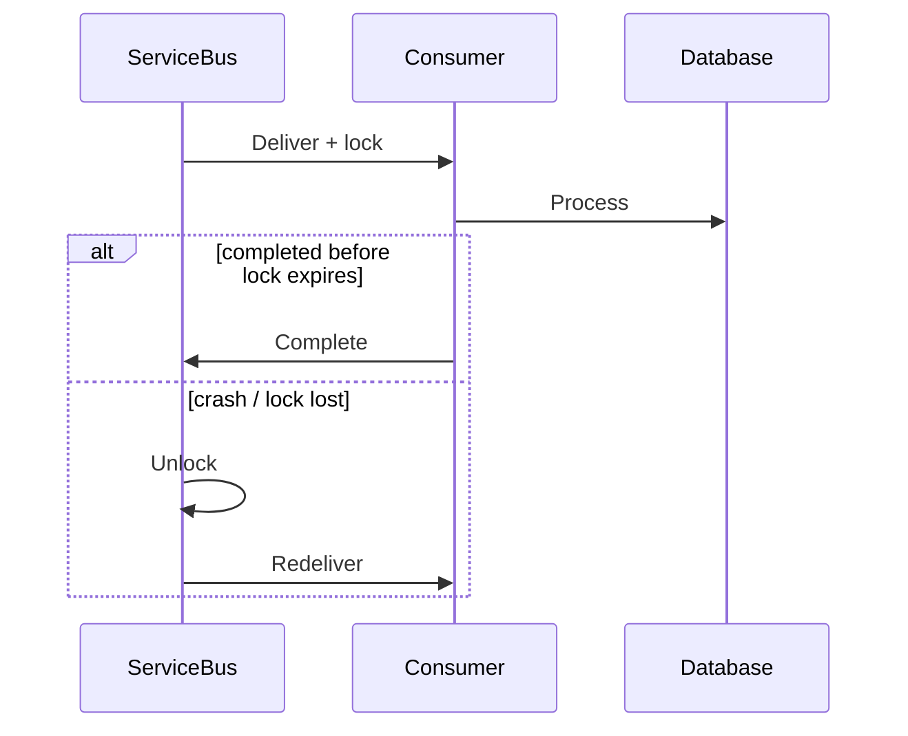

# Daily Knowledge Sharing — 2026-09-21

## Today’s Topics

1. C# `IAsyncEnumerable<T>`: streaming dữ liệu với cancellation và bounded memory
2. EF Core interceptors: cross-cutting database behavior mà không giấu query semantics
3. SQL SARGability: viết predicate để optimizer có thể seek thay vì scan
4. Redis hot keys: một key nổi tiếng có thể phá scalability của cả cache cluster
5. Anti-Corruption Layer: bảo vệ domain boundary trước model của hệ thống bên ngoài
6. Azure Service Bus message lock: settlement, lock renewal và duplicate processing
7. Azure Private Endpoint DNS: private connectivity thất bại dù firewall đã đúng
8. .NET memory leak investigation với `dotnet-dump`: từ symptom đến retention path
9. CORS trust model: browser policy không phải API authorization
10. Architecture Decision Record: lưu reasoning để quyết định kỹ thuật còn hiểu được sau nhiều tháng

---

# 1. C# `IAsyncEnumerable<T>`: streaming dữ liệu với cancellation và bounded memory

## 1. What is it?

`IAsyncEnumerable<T>` biểu diễn một chuỗi phần tử được tạo bất đồng bộ và tiêu thụ từng phần bằng `await foreach`. Mental model quan trọng: thay vì đợi toàn bộ collection hoàn thành rồi trả `List<T>`, producer có thể phát từng item khi sẵn sàng. Điều này giảm time-to-first-item và memory footprint cho pipeline dữ liệu lớn.

## 2. Why does it exist?

Một API đọc 500.000 rows rồi `ToListAsync()` phải materialize toàn bộ dữ liệu trước khi consumer xử lý phần tử đầu tiên. Với file export, event stream hoặc database cursor, cách này làm tăng allocation, GC pressure và latency. Streaming cho phép producer và consumer tiến triển đồng thời, nhưng cũng buộc ta suy nghĩ về lifetime, cancellation và backpressure.

## 3. How does it work?

Compiler biến async iterator thành state machine. Mỗi lần consumer gọi `MoveNextAsync()`, producer chạy đến `yield return` tiếp theo hoặc hoàn thành. Consumer quyết định tốc độ kéo dữ liệu; producer không tự đẩy vô hạn như một queue.

```text
Database cursor
   │ MoveNextAsync
   ▼
Async iterator
   │ yield return
   ▼
Consumer
   │ process item
   └──> request next item
```

## 4. Practical implementation

```csharp
public async IAsyncEnumerable<OrderDto> StreamOrdersAsync(
    [System.Runtime.CompilerServices.EnumeratorCancellation]
    CancellationToken cancellationToken = default)
{
    await foreach (var order in db.Orders
        .AsNoTracking()
        .OrderBy(x => x.Id)
        .AsAsyncEnumerable()
        .WithCancellation(cancellationToken))
    {
        yield return new OrderDto(order.Id, order.Status);
    }
}
```

Consumer:

```csharp
await foreach (var order in service.StreamOrdersAsync(ct))
{
    await writer.WriteLineAsync($"{order.Id},{order.Status}");
}
```

Cancellation phải đi xuyên iterator tới I/O thật sự.

## 5. Real production scenario

Một endpoint export orders ra CSV. Thay vì load toàn bộ rows vào RAM, application đọc từng batch/row và ghi vào response stream. Time-to-first-byte giảm và memory gần như không tăng tuyến tính theo số records.

## 6. Failure scenario & troubleshooting

**Symptom** → client hủy download nhưng SQL query vẫn chạy lâu. **Evidence** → request đã aborted nhưng trace cho thấy database command tiếp tục. **Hypothesis** → `CancellationToken` không được propagate vào async iterator. **Diagnosis** → kiểm tra `[EnumeratorCancellation]`, `WithCancellation` và provider support. **Fix** → propagate request token tới query/read/write. **Verification** → abort request và xác nhận database command bị cancel, connection được trả về pool.

## 7. Common mistakes

Streaming nhưng bên trong vẫn gọi `ToListAsync()`; giữ `DbContext` sau khi scope đã dispose; bỏ cancellation; thực hiện expensive per-item remote call làm stream rất chậm; hiểu streaming như producer queue có backpressure tự động cho mọi kiến trúc.

## 8. Alternatives

`List<T>` đơn giản hơn khi result nhỏ và consumer cần random access. Pagination phù hợp public APIs cần resumability. `Channel<T>` phù hợp producer/consumer độc lập và cần bounded buffer. `IAsyncEnumerable<T>` tốt cho pull-based sequential stream.

## 9. Trade-offs

### Advantages

Giảm peak memory, cải thiện time-to-first-item, phù hợp dữ liệu lớn và I/O sequential.

### Costs / Risks

Lifetime kéo dài, error có thể xảy ra giữa stream, retry khó hơn sau khi đã gửi một phần response, transaction/connection có thể bị giữ lâu.

## 10. Junior → Middle → Senior → Technical Lead

### Junior

Hiểu khác biệt giữa materialize toàn bộ và consume từng item.

### Middle

Implement async iterator, cancellation và disposal đúng.

### Senior

Đánh giá connection lifetime, partial failure, serialization và client disconnect.

### Technical Lead / Architect

Chọn streaming chỉ khi access pattern cần nó; quyết định resumability, error contract và giới hạn resource khi stream sống lâu.

## 11. Key takeaway

- Streaming giảm memory nhưng kéo dài resource lifetime.
- Cancellation phải propagate tới I/O thực sự.
- `IAsyncEnumerable<T>` là pull stream, không thay thế queue.

---

# 2. EF Core interceptors: cross-cutting database behavior mà không giấu query semantics

## 1. What is it?

EF Core interceptors cho phép quan sát hoặc can thiệp vào các operation như command execution, connection, transaction và `SaveChanges`. Mental model: interceptor nằm ở infrastructure boundary của EF Core, phù hợp cross-cutting behavior; nó không nên trở thành nơi chứa business rules bí mật.

## 2. Why does it exist?

Một số concerns cần áp dụng nhất quán cho toàn persistence layer: command diagnostics, audit metadata, query tagging hoặc policy kỹ thuật. Nếu lặp logic ở mọi repository/service, behavior dễ lệch. Interceptor cung cấp hook tập trung gần database pipeline.

## 3. How does it work?

EF Core tạo command/transaction rồi gọi interceptor callbacks trước/sau execution. Interceptor có thể log, đo thời gian hoặc trong trường hợp đặc biệt thay đổi behavior. Càng thay đổi semantics, độ khó reasoning càng tăng.

```text
LINQ
 -> EF translation
 -> DbCommand
 -> Interceptor before
 -> Database
 -> Interceptor after
 -> Materialization
```

## 4. Practical implementation

```csharp
public sealed class SlowCommandInterceptor : DbCommandInterceptor
{
    private readonly ILogger<SlowCommandInterceptor> _logger;

    public SlowCommandInterceptor(ILogger<SlowCommandInterceptor> logger)
        => _logger = logger;

    public override async ValueTask<DbDataReader> ReaderExecutedAsync(
        DbCommand command,
        CommandExecutedEventData eventData,
        DbDataReader result,
        CancellationToken cancellationToken = default)
    {
        if (eventData.Duration > TimeSpan.FromSeconds(1))
            _logger.LogWarning("Slow SQL {DurationMs}ms: {CommandText}",
                eventData.Duration.TotalMilliseconds, command.CommandText);

        return await base.ReaderExecutedAsync(
            command, eventData, result, cancellationToken);
    }
}
```

Đăng ký interceptor qua `DbContextOptionsBuilder.AddInterceptors(...)`.

## 5. Real production scenario

Một SaaS API cần phát hiện query regressions sau release. Interceptor ghi structured telemetry cho commands vượt threshold, kèm trace correlation. Team có thể nối API latency với SQL command cụ thể mà không thêm logging thủ công ở hàng trăm call sites.

## 6. Failure scenario & troubleshooting

**Symptom** → mọi query chậm thêm vài milliseconds và log volume tăng đột biến. **Evidence** → profiler cho thấy interceptor serialize command parameters và log ở mọi request. **Hypothesis** → observability hook tự trở thành bottleneck. **Diagnosis** → benchmark pipeline với/không interceptor. **Fix** → sampling, threshold, tránh expensive formatting và không log sensitive values. **Verification** → latency và log ingestion cost trở lại baseline trong khi slow-query signal vẫn đủ.

## 7. Common mistakes

Đưa authorization/business validation vào interceptor; sửa SQL text tùy tiện; log PII/secrets trong parameters; chạy remote I/O trong `SaveChanges` interceptor; giả định interceptor thay thế Application Insights/database monitoring.

## 8. Alternatives

Application-level decorators rõ hơn cho use-case behavior. EF logging/diagnostic listeners phù hợp pure observation. Database-native Query Store/`pg_stat_statements` cho server-side evidence. Interceptor phù hợp khi concern gắn chặt EF pipeline.

## 9. Trade-offs

### Advantages

Centralized cross-cutting behavior, ít duplication, truy cập metadata sát database operation.

### Costs / Risks

Hidden behavior, overhead trên hot path, dễ làm debugging khó nếu interceptor thay đổi semantics.

## 10. Junior → Middle → Senior → Technical Lead

### Junior

Hiểu interceptor là hook của infrastructure pipeline.

### Middle

Implement diagnostics/auditing nhỏ, test được và không chứa business rule.

### Senior

Đo overhead, bảo vệ sensitive data và hiểu ordering/lifecycle.

### Technical Lead / Architect

Quyết định concern nào đủ cross-cutting để centralize và concern nào cần explicit code để giữ transparency.

## 11. Key takeaway

- Interceptor tốt cho infrastructure concerns, không phải hidden business logic.
- Cross-cutting code vẫn nằm trên hot path và phải được đo.
- Observability không được tạo thêm security leak.

---

# 3. SQL SARGability: viết predicate để optimizer có thể seek thay vì scan

## 1. What is it?

SARGable predicate là điều kiện mà optimizer có thể dùng trực tiếp để tìm range trong index. Khi bọc indexed column trong function hoặc implicit conversion, database thường khó dùng index seek hiệu quả dù index vẫn tồn tại.

## 2. Why does it exist?

Index được sắp xếp theo giá trị key. Predicate `CreatedAt >= @from AND CreatedAt < @to` xác định range rõ. `CAST(CreatedAt AS date) = @date` yêu cầu tính expression trên rows, có thể biến seek thành scan và tăng I/O mạnh khi table lớn.

## 3. How does it work?

```text
SARGable predicate
 -> optimizer maps range to index keys
 -> seek
 -> fewer pages
 -> less I/O/CPU

Non-SARGable predicate
 -> evaluate expression for many rows
 -> scan/filter
 -> more I/O
```

Execution plan và logical reads mới là bằng chứng; không kết luận chỉ từ syntax.

## 4. Practical implementation

Không nên:

```sql
SELECT Id, Total
FROM Orders
WHERE CAST(CreatedAt AS date) = @date;
```

Ưu tiên:

```sql
SELECT Id, Total
FROM Orders
WHERE CreatedAt >= @date
  AND CreatedAt < DATEADD(day, 1, @date);
```

Sau đó kiểm tra actual execution plan và `SET STATISTICS IO, TIME ON`.

## 5. Real production scenario

Dashboard orders chạy tốt với 100.000 rows nhưng sau một năm có 80 triệu rows, query theo ngày tăng từ 40 ms lên 4 giây. Index `CreatedAt` có sẵn nhưng plan scan vì predicate bọc column trong conversion.

## 6. Failure scenario & troubleshooting

**Symptom** → CPU và logical reads tăng, latency p95 cao. **Evidence** → execution plan có scan trên large index/table. **Hypothesis** → predicate không SARGable. **Diagnosis** → so sánh estimated/actual rows, implicit conversions và predicate. **Fix** → rewrite range, align data types, cân nhắc computed indexed column nếu business query thật sự cần expression. **Verification** → plan chuyển sang phù hợp hơn và logical reads giảm.

## 7. Common mistakes

Thêm index mới mà không sửa predicate; dùng `LOWER(Column)` cho search mà không có strategy tương ứng; parameter type không khớp column; tin rằng seek luôn tốt hơn scan kể cả query trả phần lớn table.

## 8. Alternatives

Computed/persisted indexed column có thể phù hợp expression phổ biến. Full-text search phù hợp text search phức tạp. Scan có thể là lựa chọn đúng khi selectivity thấp.

## 9. Trade-offs

### Advantages

Giúp optimizer khai thác index, giảm I/O và latency cho selective queries.

### Costs / Risks

Rewrite có thể phức tạp; thêm computed indexes tăng storage/write cost; ép seek không đúng có thể tệ hơn optimizer choice.

## 10. Junior → Middle → Senior → Technical Lead

### Junior

Biết function trên indexed column có thể làm mất lợi thế index.

### Middle

Đọc plan cơ bản và đo logical reads.

### Senior

Phân tích selectivity, statistics, conversions và plan alternatives.

### Technical Lead / Architect

Thiết kế query/access pattern cùng schema; không biến tuning thành danh sách index chắp vá.

## 11. Key takeaway

- Có index không có nghĩa query dùng index hiệu quả.
- Đo plan và I/O trước khi tối ưu.
- Predicate, data type và index phải được xem như một thiết kế thống nhất.

---

# 4. Redis hot keys: một key nổi tiếng có thể phá scalability của cả cache cluster

## 1. What is it?

Hot key là key nhận tỷ lệ traffic quá lớn so với phần còn lại. Dù Redis cluster có nhiều nodes, một key thường thuộc một hash slot và được phục vụ chủ yếu bởi một shard; vì vậy traffic không tự phân tán chỉ vì cluster lớn hơn.

## 2. Why does it exist?

Workload thực tế thường skewed: homepage config, flash-sale product hoặc global feature data có thể được đọc hàng trăm nghìn lần/giây. Capacity tổng của cluster không giúp nếu một shard trở thành bottleneck.

## 3. How does it work?

```text
Clients
  ├──────── GET product:flash-sale ───────┐
  ├──────── GET product:flash-sale ───────┤
  └──────── GET product:flash-sale ───────┤
                                          ▼
                                     Redis shard A
                                     CPU/network hot

Other shards: mostly idle
```

Hot-key mitigation phụ thuộc freshness và consistency requirements.

## 4. Practical implementation

Với read-mostly config, thêm L1 cache ngắn trong từng instance:

```csharp
var value = await memoryCache.GetOrCreateAsync(
    "homepage-config",
    async entry =>
    {
        entry.AbsoluteExpirationRelativeToNow = TimeSpan.FromSeconds(5);
        return await redis.StringGetAsync("homepage-config");
    });
```

TTL ngắn giảm fan-in vào Redis nhưng phải chấp nhận stale window và invalidation semantics.

## 5. Real production scenario

Flash sale khiến một product detail key nhận 70% cache reads. Redis node chứa slot đó chạm network/CPU limit trong khi các nodes khác nhàn rỗi. API timeout rồi fallback SQL, tạo cascading database outage.

## 6. Failure scenario & troubleshooting

**Symptom** → Redis cluster utilization trung bình bình thường nhưng một node latency tăng mạnh. **Evidence** → per-node metrics và command/key sampling cho thấy traffic tập trung. **Hypothesis** → hot key. **Diagnosis** → kiểm tra top commands, shard distribution và application access pattern. **Fix** → L1 cache, request coalescing, replication/read strategy hoặc key sharding nếu semantics cho phép. **Verification** → per-node load cân bằng hơn và fallback SQL không spike.

## 7. Common mistakes

Nhìn average cluster CPU; tăng nodes nhưng key vẫn ở một shard; shard key bằng random suffix nhưng không có read aggregation strategy; fallback database không có concurrency limit; TTL đồng loạt gây stampede.

## 8. Alternatives

`IMemoryCache` đủ cho per-instance non-critical data. CDN/edge cache tốt cho public HTTP responses. Database direct read có thể đơn giản hơn nếu traffic thấp. Redis không nên được thêm chỉ vì “cache luôn nhanh”.

## 9. Trade-offs

### Advantages

Redis cung cấp shared low-latency cache và rich data structures.

### Costs / Risks

Hot keys tạo single-shard bottleneck; thêm L1 cache tăng stale-data complexity; sharding logical key làm application phức tạp.

## 10. Junior → Middle → Senior → Technical Lead

### Junior

Hiểu distributed cache không tự động phân tán một key.

### Middle

Đo key frequency và triển khai TTL/L1 hợp lý.

### Senior

Thiết kế fallback, coalescing và failure containment.

### Technical Lead / Architect

Quyết định dữ liệu nào cần Redis, freshness nào chấp nhận được và liệu CDN/local cache đơn giản hơn có đủ.

## 11. Key takeaway

- Scale cluster không giải quyết mọi hot key.
- Quan sát per-node/per-key, không chỉ average.
- Cache failure phải được thiết kế để không phá database.

---

# 5. Anti-Corruption Layer: bảo vệ domain boundary trước model của hệ thống bên ngoài

## 1. What is it?

Anti-Corruption Layer (ACL) là boundary dịch model/protocol của external hoặc legacy system sang model của bounded context nội bộ. “Corruption” ở đây là domain language bị kéo theo assumptions của hệ thống khác, không phải security corruption.

## 2. Why does it exist?

Một ERP có `CustomerStatus = 7`, SOAP DTO lớn và lifecycle khác CRM mới. Nếu application truyền DTO đó xuyên domain, external model trở thành dependency ở mọi layer. Khi ERP đổi schema hoặc được thay thế, blast radius lan toàn hệ thống.

## 3. How does it work?

```text
External ERP
    │ vendor DTO/protocol
    ▼
Infrastructure Adapter
    │
    ▼
Anti-Corruption Mapping
    │ internal concepts
    ▼
Application / Domain
```

Domain không phụ thuộc vendor SDK. Infrastructure phụ thuộc inward vào application contracts; mapping ownership nằm ở integration boundary.

## 4. Practical implementation

```csharp
public interface ICustomerCreditGateway
{
    Task<CreditDecision> EvaluateAsync(
        CustomerId customerId,
        Money orderTotal,
        CancellationToken ct);
}

internal sealed class ErpCreditGateway : ICustomerCreditGateway
{
    public async Task<CreditDecision> EvaluateAsync(
        CustomerId id, Money total, CancellationToken ct)
    {
        var response = await erpClient.CheckCreditAsync(id.Value, total.Amount, ct);
        return response.Code switch
        {
            0 => CreditDecision.Approved,
            4 => CreditDecision.ManualReview,
            _ => CreditDecision.Rejected
        };
    }
}
```

Domain thấy `CreditDecision`, không thấy vendor codes.

## 5. Real production scenario

E-commerce platform tích hợp ERP cho credit approval. Sau hai năm ERP được thay bằng SaaS provider. Vì application contract phản ánh business need thay vì ERP DTO, migration chủ yếu thay adapter và mapping.

## 6. Failure scenario & troubleshooting

**Symptom** → vendor thêm status mới và orders bị reject sai. **Evidence** → mapping default gom unknown status vào `Rejected`. **Hypothesis** → ACL thiếu explicit unknown-state handling. **Diagnosis** → contract test với vendor samples. **Fix** → map unknown thành safe operational state, alert và version mapping. **Verification** → integration tests cho known/unknown statuses và production metrics.

## 7. Common mistakes

Tạo ACL chỉ là folder tên `Adapters`; copy nguyên vendor DTO thành internal DTO; business rule nằm trong adapter; che giấu mọi external feature sau generic abstraction vô nghĩa; thêm ACL cho dependency rất nhỏ và ổn định mà không có isolation value.

## 8. Alternatives

Direct integration đơn giản hơn khi dependency nhỏ và replacement risk thấp. Shared kernel phù hợp hai contexts thật sự đồng sở hữu model. Event translation phù hợp asynchronous integration.

## 9. Trade-offs

### Advantages

Giảm coupling, bảo vệ ubiquitous language, cô lập schema/protocol changes, dễ thay provider hơn.

### Costs / Risks

Thêm mapping, tests và code; có thể duplicate concepts; abstraction sai có thể che mất capabilities cần thiết.

## 10. Junior → Middle → Senior → Technical Lead

### Junior

Hiểu external DTO không nhất thiết là domain model.

### Middle

Implement adapter/mapping và contract tests.

### Senior

Thiết kế error semantics, versioning, timeout và failure propagation tại boundary.

### Technical Lead / Architect

Quyết định boundary nào đáng được bảo vệ và abstraction nào phản ánh business capability thay vì vendor API.

## 11. Key takeaway

- ACL bảo vệ domain language và change boundary.
- Dependency direction phải giữ vendor model ở infrastructure edge.
- Không cần ACL nặng nếu direct integration đơn giản đã đủ.

---

# 6. Azure Service Bus message lock: settlement, lock renewal và duplicate processing

## 1. What is it?

Trong Peek-Lock mode, consumer nhận message nhưng message chưa bị xóa. Broker khóa message trong một khoảng thời gian. Consumer phải `Complete`, `Abandon`, `DeadLetter` hoặc để lock hết hạn. Đây là nền tảng của at-least-once delivery.

## 2. Why does it exist?

Nếu broker xóa message ngay khi giao và process crash trước khi commit business work, dữ liệu bị mất. Lock cho phép message xuất hiện lại khi consumer không hoàn tất, đổi data loss risk thành duplicate-delivery risk có thể kiểm soát bằng idempotency.

## 3. How does it work?



Auto lock renewal kéo dài thời gian xử lý nhưng không biến delivery thành exactly-once.

## 4. Practical implementation

```csharp
var processor = client.CreateProcessor(queueName, new ServiceBusProcessorOptions
{
    AutoCompleteMessages = false,
    MaxConcurrentCalls = 8,
    MaxAutoLockRenewalDuration = TimeSpan.FromMinutes(5)
});

processor.ProcessMessageAsync += async args =>
{
    if (await inbox.ExistsAsync(args.Message.MessageId, args.CancellationToken))
    {
        await args.CompleteMessageAsync(args.Message, args.CancellationToken);
        return;
    }

    await handler.HandleAsync(args.Message, args.CancellationToken);
    await inbox.MarkProcessedAsync(args.Message.MessageId, args.CancellationToken);
    await args.CompleteMessageAsync(args.Message, args.CancellationToken);
};
```

Durable deduplication phải gắn với business transaction khi correctness yêu cầu.

## 5. Real production scenario

Invoice generation mất 90 giây vì downstream PDF service chậm. Lock mặc định ngắn hơn processing time; message bị redeliver trong khi instance đầu vẫn chạy. Hai invoices có thể được tạo nếu handler không idempotent.

## 6. Failure scenario & troubleshooting

**Symptom** → cùng `MessageId` được xử lý hai lần. **Evidence** → logs có `MessageLockLost` và processing duration vượt lock. **Hypothesis** → lock hết hạn hoặc renewal thất bại. **Diagnosis** → correlate delivery count, lock expiry, handler duration và dependency latency. **Fix** → rút ngắn work, cấu hình renewal hợp lý, giới hạn concurrency và thêm Inbox/idempotency. **Verification** → inject slow dependency; duplicate delivery không tạo duplicate side effect.

## 7. Common mistakes

Giả định queue exactly-once; `Complete` trước khi business commit; tăng lock duration vô hạn; không xử lý poison messages/DLQ; retry remote side effect không idempotent; dùng `MessageId` không ổn định.

## 8. Alternatives

Receive-and-delete đơn giản hơn nhưng chấp nhận data loss khi crash. Azure Functions Service Bus trigger giảm boilerplate nhưng delivery semantics vẫn tồn tại. Storage Queue đơn giản hơn cho workload ít tính năng.

## 9. Trade-offs

### Advantages

At-least-once delivery tăng reliability trước consumer crash và transient failure.

### Costs / Risks

Duplicate processing, lock management, DLQ/replay và operational complexity.

## 10. Junior → Middle → Senior → Technical Lead

### Junior

Hiểu nhận message không đồng nghĩa message đã bị xóa.

### Middle

Implement settlement và error handling đúng.

### Senior

Thiết kế idempotency, concurrency, lock renewal và DLQ recovery.

### Technical Lead / Architect

Định nghĩa delivery contract, business deduplication boundary và operational playbook cho replay.

## 11. Key takeaway

- Peek-Lock đổi data-loss risk thành duplicate risk.
- Lock renewal không tạo exactly-once.
- Idempotent consumer là requirement, không phải optional optimization.

---

# 7. Azure Private Endpoint DNS: private connectivity thất bại dù firewall đã đúng

## 1. What is it?

Private Endpoint gắn một Azure PaaS resource với private IP trong VNet. DNS phải resolve service hostname sang private IP phù hợp. Network path và name resolution là hai phần của cùng thiết kế; chỉ tạo endpoint chưa đủ.

## 2. Why does it exist?

Application thường kết nối bằng hostname như Storage/SQL/Key Vault. Nếu DNS vẫn trả public endpoint, traffic không đi qua private path và có thể bị public-network firewall chặn. Vì vậy nhiều lỗi “network” thực chất là DNS architecture lỗi.

## 3. How does it work?

```text
App in VNet
   │ resolve vault.azure.net
   ▼
Private DNS Zone / resolver
   │ private IP
   ▼
Private Endpoint NIC
   ▼
Key Vault / Storage / SQL
```

Hybrid/on-prem cần conditional forwarding hoặc Azure DNS Private Resolver phù hợp.

## 4. Practical implementation

Từ workload, kiểm tra resolution trước connectivity:

```bash
nslookup myvault.vault.azure.net
```

Sau đó kiểm tra TCP/TLS/application. Trong .NET, giữ hostname chuẩn để TLS certificate/SNI đúng; không hard-code private IP vào connection string.

## 5. Real production scenario

App Service VNet integration gọi Key Vault. Private Endpoint đã tạo và public access bị disable. Local laptop chạy được qua public route nhưng Production 403/timeout. `nslookup` trong app environment cho thấy hostname vẫn resolve public IP vì Private DNS Zone chưa link VNet.

## 6. Failure scenario & troubleshooting

**Symptom** → timeout sau khi bật private access. **Evidence** → DNS trả public IP hoặc wrong private IP. **Hypothesis** → missing zone link/forwarder. **Diagnosis** → kiểm tra resolution từ chính workload, VNet links, custom DNS và routes. **Fix** → link correct private DNS zone hoặc cấu hình forwarding. **Verification** → hostname resolve private IP và telemetry xác nhận private path.

## 7. Common mistakes

Hard-code IP; test DNS từ laptop thay vì workload; tạo Private Endpoint nhưng quên DNS zone; custom DNS server không forward Azure private zones; nhầm Private Endpoint với service endpoint.

## 8. Alternatives

Public endpoint + firewall/identity đơn giản hơn cho threat model nhẹ. Service Endpoint cung cấp network restriction khác nhưng resource vẫn dùng public endpoint semantics. Private Endpoint phù hợp khi cần private IP/data-exfiltration controls mạnh hơn.

## 9. Trade-offs

### Advantages

Private addressing, giảm public exposure, kiểm soát network path tốt hơn.

### Costs / Risks

DNS/hybrid networking phức tạp, thêm cost và operational dependencies, troubleshooting khó hơn.

## 10. Junior → Middle → Senior → Technical Lead

### Junior

Hiểu hostname phải resolve đúng trước khi debug application.

### Middle

Kiểm tra DNS, route, firewall và TLS theo lớp.

### Senior

Thiết kế Private DNS Zones, custom resolver và hybrid forwarding.

### Technical Lead / Architect

Chỉ chọn private networking khi security/compliance value xứng đáng operational complexity và team có khả năng vận hành.

## 11. Key takeaway

- Private Endpoint không hoàn chỉnh nếu DNS sai.
- Debug từ chính workload environment.
- Không hard-code private IP để “sửa” DNS.

---

# 8. .NET memory leak investigation với `dotnet-dump`: từ symptom đến retention path

## 1. What is it?

Trong managed .NET, “memory leak” thường nghĩa object không còn hữu ích nhưng vẫn reachable từ GC roots nên GC không thể thu hồi. Điều cần tìm không chỉ là type nào nhiều bytes, mà là reference path nào giữ chúng sống.

## 2. Why does it exist?

GC tự quản lý memory nhưng không hiểu business lifetime. Static collections, event subscriptions, unbounded caches hoặc singleton giữ scoped objects đều có thể tạo retention. Restart chỉ xóa symptom, không giải thích root cause.

## 3. How does it work?

```text
GC Root
  └─ Singleton
      └─ Dictionary
          └─ Session objects
              └─ large graphs
```

Heap dump chụp object graph. `dumpheap -stat` tìm types chiếm nhiều memory; `gcroot` tìm chain giữ object sống.

## 4. Practical implementation

```bash
dotnet-counters monitor --process-id 1234 System.Runtime
dotnet-dump collect --process-id 1234
dotnet-dump analyze core_*.dmp
```

Trong analyzer:

```text
> dumpheap -stat
> dumpheap -type MyCompany.SessionState
> gcroot 000001ABCDEF1234
```

Trước dump, theo dõi `gc-heap-size`, allocation rate và Gen 2 collections để xác nhận pattern.

## 5. Real production scenario

ASP.NET Core instance tăng từ 500 MB lên 6 GB trong 12 giờ. Traffic ổn định. Dump cho thấy hàng triệu `TenantContext` được giữ bởi static `ConcurrentDictionary` không có eviction.

## 6. Failure scenario & troubleshooting

**Symptom** → memory tăng liên tục và chỉ giảm khi restart. **Evidence** → Gen 2 heap tăng sau full GC. **Hypothesis** → long-lived retention. **Diagnosis** → so sánh dumps theo thời gian, tìm growing types rồi `gcroot`. **Fix** → sửa ownership/eviction/unsubscribe. **Verification** → soak test; heap đạt plateau và retained count ổn định sau GC.

## 7. Common mistakes

Kết luận leak chỉ vì RSS cao; chỉ nhìn allocation rate; dump Production không cân nhắc size/sensitive data; optimize object size trước khi tìm retention root; restart định kỳ như permanent fix.

## 8. Alternatives

`dotnet-gcdump` nhẹ hơn cho heap statistics. PerfView/Visual Studio profiler hữu ích local. Application Insights metrics giúp phát hiện trend nhưng không thay heap graph analysis.

## 9. Trade-offs

### Advantages

Dump cung cấp evidence cụ thể về retained objects và root paths.

### Costs / Risks

Dump lớn, có thể chứa sensitive data, collection/analysis tốn resource và cần production-safe procedure.

## 10. Junior → Middle → Senior → Technical Lead

### Junior

Hiểu GC không thu object vẫn reachable.

### Middle

Đọc heap stats và phân biệt allocation với retention.

### Senior

Correlate runtime counters, dumps, traffic và deployment changes.

### Technical Lead / Architect

Thiết kế ownership/eviction boundaries và incident procedure an toàn cho memory dumps.

## 11. Key takeaway

- Managed memory leak là retention problem.
- Tìm `gcroot`, không chỉ tìm type lớn.
- Verification cần soak/load test và heap plateau.

---

# 9. CORS trust model: browser policy không phải API authorization

## 1. What is it?

CORS là browser-enforced policy quyết định JavaScript từ một origin có được đọc/gửi một số cross-origin requests hay không. Nó không phải cơ chế authentication hoặc authorization của API và không ngăn non-browser clients gọi endpoint.

## 2. Why does it exist?

Same-Origin Policy bảo vệ browser user khỏi website tùy ý đọc dữ liệu từ origin khác. CORS cho server khai báo exceptions có kiểm soát. Nó giải quyết browser-origin interaction, không xác định user có quyền đọc `Order 123` hay không.

## 3. How does it work?

Với request cần preflight:

```text
Browser -> OPTIONS /api/orders
          Origin: https://app.example.com
          Access-Control-Request-Method: POST
API     -> Access-Control-Allow-Origin: https://app.example.com
Browser -> POST /api/orders
```

Browser enforce response headers. `curl` không bị CORS policy ràng buộc.

## 4. Practical implementation

```csharp
builder.Services.AddCors(options =>
{
    options.AddPolicy("Frontend", policy =>
        policy.WithOrigins("https://app.example.com")
              .WithMethods("GET", "POST", "PUT")
              .WithHeaders("Content-Type", "Authorization"));
});

app.UseCors("Frontend");
app.UseAuthentication();
app.UseAuthorization();
```

Authorization vẫn phải áp dụng tại endpoint/resource.

## 5. Real production scenario

Vue SPA ở `app.example.com` gọi API ở `api.example.com`. CORS cho phép origin SPA. Attacker vẫn có thể gọi API bằng script/server client; JWT/policy authorization mới quyết định request có được phép hay không.

## 6. Failure scenario & troubleshooting

**Symptom** → browser báo CORS error nhưng API logs cho thấy 500 thật sự. **Evidence** → error response thiếu CORS header vì middleware ordering hoặc exception xảy ra trước CORS. **Hypothesis** → CORS message che root error. **Diagnosis** → kiểm tra Network tab, server logs và preflight riêng. **Fix** → sửa root 500 và pipeline ordering. **Verification** → preflight/actual response có headers đúng và authorization vẫn chặn unauthorized caller.

## 7. Common mistakes

Dùng `AllowAnyOrigin` như fix mặc định; kết hợp credentials với origin policy sai; coi CORS là security boundary cho server-to-server; quên preflight; cho rằng Postman chạy được nghĩa browser cũng chạy được.

## 8. Alternatives

Same-origin deployment/reverse proxy tránh cross-origin complexity. Backend-for-Frontend có thể giữ browser cùng origin. Nhưng authentication/authorization vẫn bắt buộc bất kể topology.

## 9. Trade-offs

### Advantages

Cho phép browser integrations cross-origin có kiểm soát.

### Costs / Risks

Configuration dễ sai, preflight thêm request, wildcard policy có thể mở rộng browser exposure ngoài ý muốn.

## 10. Junior → Middle → Senior → Technical Lead

### Junior

Nhớ CORS là browser policy, không phải auth.

### Middle

Cấu hình exact origins và debug preflight.

### Senior

Hiểu credentials, caching, proxy/middleware ordering và error behavior.

### Technical Lead / Architect

Chọn origin topology đơn giản, định nghĩa browser trust riêng với API authorization model.

## 11. Key takeaway

- CORS không thay thế authentication/authorization.
- Debug preflight và actual request riêng.
- Exact origin policy tốt hơn wildcard theo thói quen.

---

# 10. Architecture Decision Record: lưu reasoning để quyết định kỹ thuật còn hiểu được sau nhiều tháng

## 1. What is it?

Architecture Decision Record (ADR) là tài liệu ngắn ghi context, decision, alternatives và consequences của một quyết định kỹ thuật quan trọng. Giá trị chính không phải lưu “đã chọn Redis”, mà lưu vì sao chọn, assumptions nào đúng tại thời điểm đó và trade-offs nào đã chấp nhận.

## 2. Why does it exist?

Code chỉ cho thấy trạng thái hiện tại, không cho biết constraints lúc quyết định. Sau 12 tháng, team dễ lặp lại tranh luận cũ hoặc giữ một quyết định đã hết assumptions vì không ai nhớ reasoning ban đầu.

## 3. How does it work?

ADR thường immutable theo lịch sử: decision cũ được đánh dấu superseded thay vì rewrite quá khứ. Một decision mới link ADR trước để thể hiện evolution.

```text
Context -> Options -> Decision -> Consequences
                         │
                         └── future evidence -> superseding ADR
```

## 4. Practical implementation

```markdown
# ADR-014: Use Redis for shared product availability cache

Status: Accepted

## Context
App runs on 8 instances; availability read load exceeds database budget.
Staleness up to 15 seconds is acceptable.

## Decision
Use Redis cache-aside with 15-second TTL and DB fallback guarded by concurrency limits.

## Alternatives
- IMemoryCache only
- direct database reads

## Consequences
+ shared cache across instances
- new operational dependency
- stale-data window
- requires outage/fallback monitoring
```

ADR nên nằm gần source/docs và được review cùng change liên quan.

## 5. Real production scenario

Team định tách Orders thành microservice. ADR cũ cho thấy monolith được chọn khi team chỉ có ba developers và transaction xuyên modules còn cao. Hai năm sau constraints thay đổi; team có evidence để đánh giá lại thay vì coi kiến trúc hiện tại là dogma.

## 6. Failure scenario & troubleshooting

**Symptom** → repository có 80 ADRs nhưng engineers không dùng. **Evidence** → documents dài, status không cập nhật, không link PR/code. **Hypothesis** → ADR trở thành ceremony. **Diagnosis** → review decision discoverability và usage trong architecture reviews. **Fix** → chỉ ghi decisions có lasting consequences, template ngắn, owner/status rõ, link superseding records. **Verification** → engineers có thể tìm reasoning trong incident/design review mà không hỏi người đã rời team.

## 7. Common mistakes

Ghi mọi coding choice thành ADR; chỉ ghi decision mà không ghi alternatives/consequences; sửa ADR cũ để khớp hiện tại; biến ADR thành approval bureaucracy; không cập nhật status khi decision bị thay thế.

## 8. Alternatives

README/design docs phù hợp overview lớn. PR description phù hợp implementation context ngắn hạn. RFC phù hợp proposal cần thảo luận rộng. ADR phù hợp durable decision history.

## 9. Trade-offs

### Advantages

Giữ institutional knowledge, làm trade-offs explicit, hỗ trợ onboarding và architecture evolution.

### Costs / Risks

Documentation overhead, stale records nếu không có discipline, dễ thành ceremony nếu phạm vi quá rộng.

## 10. Junior → Middle → Senior → Technical Lead

### Junior

Học đọc ADR để hiểu “why” phía sau code.

### Middle

Ghi context và consequences cho quyết định có tác động dài hạn.

### Senior

So sánh alternatives bằng evidence, assumptions và operational cost.

### Technical Lead / Architect

Dùng ADR để quản lý evolution: decision có owner, assumptions có thể bị invalidated và path thay đổi rõ ràng.

## 11. Key takeaway

- ADR lưu reasoning, không chỉ outcome.
- Decision tốt luôn gắn với context và consequences.
- Documentation chỉ có giá trị nếu ngắn, discoverable và được dùng khi quyết định thay đổi.
