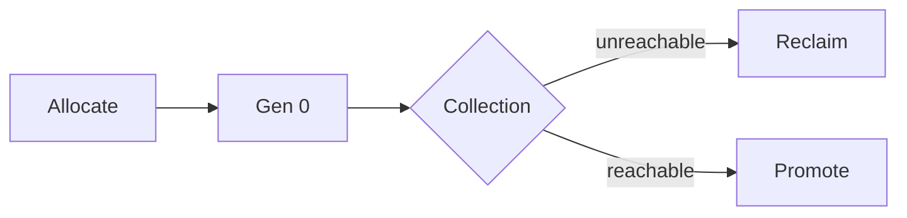
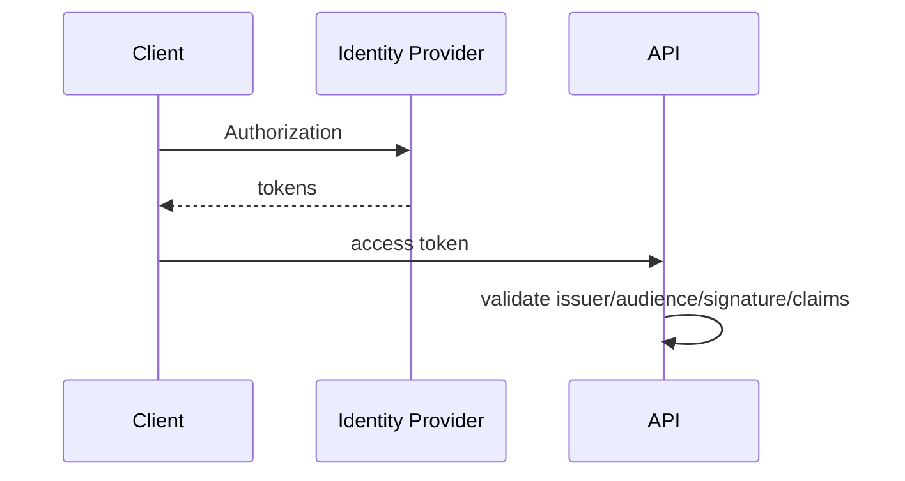
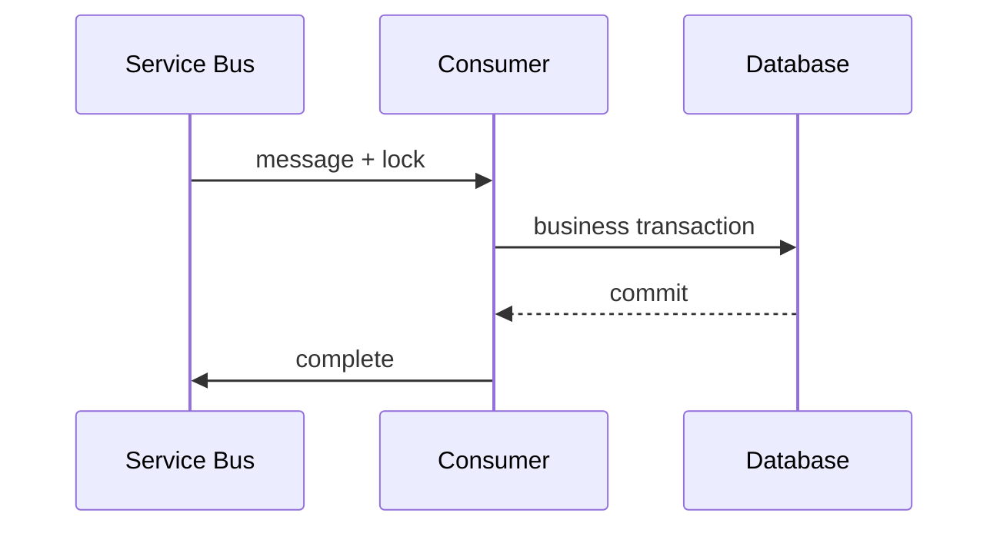
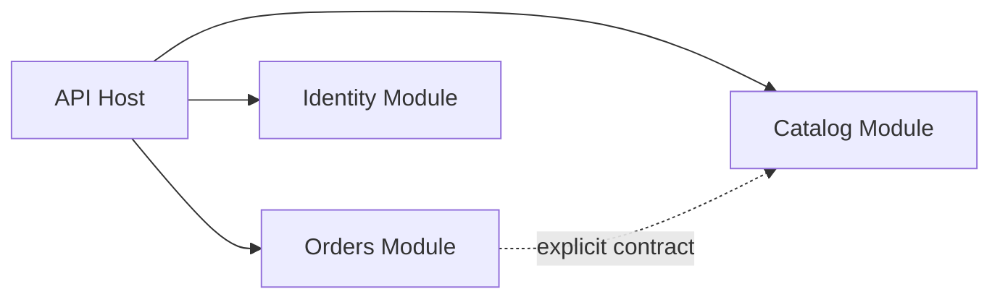

# Daily Knowledge Sharing — 2026-09-21

## Today’s Topics

1. CLR Garbage Collector: allocation rate, generations và GC pause
2. ASP.NET Core DI: lifetime mismatch và captive dependency
3. OAuth 2.0 / OpenID Connect: access token và API authorization
4. EF Core optimistic concurrency và lost update
5. SQL Server deadlock và transaction ordering
6. Redis cache stampede và TTL jitter
7. Azure Service Bus PeekLock và idempotent consumer
8. OpenTelemetry distributed tracing và context propagation
9. BackgroundService graceful shutdown
10. Modular Monolith và module boundaries

---

# 1. CLR Garbage Collector: allocation rate, generations và GC pause

## 1. What is it?
.NET GC quản lý managed heap dựa trên object reachability. Gen 0 dành cho object mới; object sống lâu có thể được promote lên Gen 1/Gen 2. Mental model quan trọng: GC giúp memory safety nhưng không làm chi phí allocation biến mất.

## 2. Why does it exist?
Manual memory management tạo rủi ro dangling pointer, double-free và ownership phức tạp. GC chuyển trách nhiệm thu hồi memory sang runtime, nhưng application vẫn phải quản lý allocation rate và object lifetime.

## 3. How does it work?

Allocation thường rẻ; collection trở nên đáng kể khi runtime phải scan live graph và compact/copy memory.

## 4. Practical implementation
Đo trước khi tối ưu:
```bash
dotnet-counters monitor --process-id <PID> System.Runtime
```
Theo dõi allocation rate, GC collections, heap size và CPU dưới production-like load.

## 5. Real production scenario
API có p50 40 ms nhưng p99 tăng mạnh khi traffic cao. Profiling cho thấy endpoint deserialize payload lớn rồi tạo nhiều intermediate collections, làm Gen 2 collections tăng dù SQL vẫn nhanh.

## 6. Failure scenario & troubleshooting
Dùng vòng lặp: symptom → counters → allocation profile → hypothesis → change → load test. High process memory không tự động chứng minh managed memory leak.

## 7. Common mistakes
- Gọi `GC.Collect()` trong request path.
- Tối ưu allocation chưa được đo.
- Cache không giới hạn rồi đổ lỗi cho GC.
- Nhầm high memory với memory leak.

## 8. Alternatives
Có thể dùng projection, streaming, `Span<T>`, pooling hoặc thay đổi data shape. Chọn giải pháp đơn giản nhất giải quyết bottleneck đã chứng minh.

## 9. Trade-offs
Low-allocation code có thể phức tạp hơn. Pooling giảm allocation nhưng thêm ownership và stale-state risk.

## 10. Junior → Middle → Senior → Technical Lead
### Junior
Hiểu managed heap và generations.
### Middle
Biết dùng runtime counters.
### Senior
Phân tích allocation, retention và tail latency.
### Technical Lead
Đặt performance budget và load-test methodology.

## 11. Key takeaway
- GC không loại bỏ memory engineering.
- Allocation rate thường quan trọng hơn một snapshot memory đơn lẻ.
- Profile trước, tối ưu sau.

---

# 2. ASP.NET Core DI: lifetime mismatch và captive dependency

## 1. What is it?
`Singleton`, `Scoped`, `Transient` mô tả lifetime và ownership của service. Captive dependency xảy ra khi object sống lâu giữ dependency đáng lẽ chỉ sống trong scope ngắn hơn.

## 2. Why does it exist?
DI container quản lý construction và disposal nhất quán, nhưng không thể biến một lifetime design sai thành đúng.

## 3. How does it work?
Mỗi HTTP request thường có một scope. Scoped service được reuse trong scope đó; singleton sống ở root container.

## 4. Practical implementation
Không inject scoped `DbContext` trực tiếp vào singleton worker. Tạo scope tại work boundary:
```csharp
await using var scope = scopeFactory.CreateAsyncScope();
var handler = scope.ServiceProvider.GetRequiredService<JobHandler>();
await handler.ExecuteAsync(ct);
```

## 5. Real production scenario
Worker singleton giữ repository scoped, dẫn tới lifetime validation failure hoặc resource/state bị giữ sai ownership.

## 6. Failure scenario & troubleshooting
Vẽ dependency chain từ singleton xuống leaf dependencies khi gặp disposed object, shared state hoặc `DbContext` concurrency errors.

## 7. Common mistakes
- Singleton giữ `DbContext`.
- Mutable per-user state trong singleton.
- Giữ scoped service sau khi scope đã dispose.

## 8. Alternatives
Factory, explicit scope hoặc stateless singleton có thể phù hợp tùy resource ownership.

## 9. Trade-offs
Singleton giảm creation overhead nhưng yêu cầu thread safety; scoped tự nhiên cho request unit-of-work nhưng cần scope riêng trong background processing.

## 10. Junior → Middle → Senior → Technical Lead
### Junior
Phân biệt ba lifetime.
### Middle
Hiểu request scope và disposal.
### Senior
Thiết kế lifetime theo concurrency/resource ownership.
### Technical Lead
Review dependency graph và registration conventions.

## 11. Key takeaway
- Lifetime là ownership decision.
- Long-lived service không nên capture short-lived resource.
- Background work cần scope boundary rõ.

---

# 3. OAuth 2.0 / OpenID Connect: access token và API authorization

## 1. What is it?
OAuth 2.0 tập trung vào authorization; OpenID Connect bổ sung identity layer. Access token dành cho resource server, còn ID token phục vụ client trong authentication flow.

## 2. Why does it exist?
Các protocol này tránh việc application chia sẻ password hoặc tự phát minh token integration giữa client, identity provider và API.

## 3. How does it work?


## 4. Practical implementation
```csharp
builder.Services.AddAuthentication("Bearer")
    .AddJwtBearer("Bearer", o =>
    {
        o.Authority = configuration["Auth:Authority"];
        o.Audience = "orders-api";
    });
```
Authorization tiếp tục kiểm tra policy/claims phù hợp resource.

## 5. Real production scenario
Token có signature hợp lệ nhưng được phát cho audience khác. Orders API phải reject thay vì tin mọi token từ cùng issuer.

## 6. Failure scenario & troubleshooting
401: kiểm tra issuer, audience, signature, expiry và authority metadata. 403 thường nghĩa authentication thành công nhưng authorization thất bại.

## 7. Common mistakes
- Dùng ID token gọi API.
- Chỉ decode JWT rồi tin claims.
- Log access token.
- Dùng role quá rộng thay resource policy.

## 8. Alternatives
Cookie auth phù hợp server-rendered web; Managed Identity thường phù hợp Azure service-to-service; API key phù hợp một số integration đơn giản.

## 9. Trade-offs
JWT giảm lookup nhưng revocation tức thời khó hơn. Federation giảm password sharing nhưng tăng identity infrastructure complexity.

## 10. Junior → Middle → Senior → Technical Lead
### Junior
Phân biệt authentication/authorization.
### Middle
Hiểu issuer, audience, expiry, claims.
### Senior
Thiết kế validation và policy.
### Technical Lead
Định nghĩa trust boundaries và token lifecycle.

## 11. Key takeaway
- OAuth 2.0 và OIDC giải quyết concern khác nhau.
- API phải validate token đầy đủ.
- 401 và 403 là hai lớp failure khác nhau.

---

# 4. EF Core optimistic concurrency và lost update

## 1. What is it?
Optimistic concurrency phát hiện dữ liệu đã đổi kể từ lúc application đọc nó, thay vì giữ lock trong toàn thời gian business interaction.

## 2. Why does it exist?
Hai user cùng đọc Order rồi save có thể gây lost update nếu update sau silently overwrite update trước.

## 3. How does it work?
Concurrency token được đưa vào `WHERE` của `UPDATE`. Zero affected rows nghĩa state gốc không còn đúng.

## 4. Practical implementation
```csharp
public class Order
{
    public int Id { get; set; }
    [Timestamp]
    public byte[] RowVersion { get; set; } = null!;
}
```
Handle `DbUpdateConcurrencyException` bằng business decision: reload, merge hoặc reject.

## 5. Real production scenario
Customer service sửa shipping address trong khi fulfillment process đổi order state. Conflict resolution cần domain rule, không chỉ retry.

## 6. Failure scenario & troubleshooting
Kiểm tra concurrency token có round-trip đúng qua DTO và original value có được attach đúng hay không.

## 7. Common mistakes
- Retry concurrency exception vô điều kiện.
- Không truyền token qua disconnected client.
- Nhầm optimistic conflict với deadlock.

## 8. Alternatives
Pessimistic locking, application version number hoặc HTTP ETag/`If-Match`.

## 9. Trade-offs
Optimistic concurrency scale tốt khi conflict hiếm nhưng yêu cầu application xử lý merge/reject semantics.

## 10. Junior → Middle → Senior → Technical Lead
### Junior
Hiểu lost update.
### Middle
Cấu hình token và handle exception.
### Senior
Thiết kế conflict resolution.
### Technical Lead
Chọn concurrency model theo contention và business invariants.

## 11. Key takeaway
- Detection không đồng nghĩa resolution.
- Blind retry có thể phá business intent.
- Concurrency policy phải phản ánh domain invariant.

---

# 5. SQL Server deadlock và transaction ordering

## 1. What is it?
Deadlock là circular wait giữa transactions. Nó khác blocking thông thường vì không participant nào trong cycle có thể tự tiến tiếp.

## 2. Why does it exist?
Transactions cần locks để bảo vệ consistency. Resource acquisition order khác nhau có thể tạo cycle.

## 3. How does it work?
Transaction A giữ X chờ Y; Transaction B giữ Y chờ X. SQL Server chọn victim để rollback và phá cycle.

## 4. Practical implementation
Khi business semantics cho phép, update resources theo deterministic order và giữ transaction scope ngắn. Không coi đây là universal fix; cần deadlock graph.

## 5. Real production scenario
Checkout update Orders rồi Inventory; reconciliation worker update Inventory rồi Orders. Peak load làm circular wait xuất hiện.

## 6. Failure scenario & troubleshooting
Thu deadlock graph qua Extended Events/system health; kiểm tra statements, lock modes, indexes, execution plans và acquisition order.

## 7. Common mistakes
- Gọi mọi timeout là deadlock.
- Tăng command timeout để fix deadlock.
- Retry vô hạn.
- Giữ transaction mở qua external HTTP call.

## 8. Alternatives
Giảm transaction scope, consistent ordering, cải thiện index hoặc serialize một số work qua queue.

## 9. Trade-offs
Retry che transient failure nhưng tăng load; isolation mạnh hơn có thể tăng contention.

## 10. Junior → Middle → Senior → Technical Lead
### Junior
Phân biệt blocking/deadlock.
### Middle
Hiểu lock ordering.
### Senior
Đọc deadlock graph và execution plan.
### Technical Lead
Chuẩn hóa transaction/retry strategy.

## 11. Key takeaway
- Deadlock là wait cycle.
- Deadlock graph là evidence chính.
- Retry không thay root-cause remediation.

---

# 6. Redis cache stampede và TTL jitter

## 1. What is it?
Cache stampede xảy ra khi nhiều request cùng miss một hot key và đồng thời rebuild dữ liệu từ origin.

## 2. Why does it exist?
Cache làm origin load thấp khi hit, nhưng synchronized expiry có thể biến lượng lớn hit thành lượng lớn database/API calls tức thời.

## 3. How does it work?
Hot key expire → nhiều request miss → origin QPS spike → latency tăng → retries có thể khuếch đại overload.

## 4. Practical implementation
Kết hợp double-check với single-flight/keyed synchronization và TTL jitter. Distributed deployment cần cân nhắc cross-instance coordination thay vì chỉ local lock.

## 5. Real production scenario
Product cache được warm cùng lúc sau deployment và dùng cùng TTL. Mười phút sau hàng nghìn keys expire đồng loạt, SQL CPU tăng mạnh.

## 6. Failure scenario & troubleshooting
Correlate cache hit ratio, origin QPS, Redis errors và latency. Khi Redis outage, fallback phải tránh chuyển toàn bộ load sang database ngay lập tức.

## 7. Common mistakes
- TTL đồng nhất cho hot keys.
- Distributed lock không có timeout/ownership.
- Retry Redis quá mạnh khi dependency lỗi.
- Không có policy cho negative caching.

## 8. Alternatives
Refresh-ahead, stale-while-revalidate, local + distributed cache hoặc không cache nếu origin đã đủ rẻ.

## 9. Trade-offs
Stale serving tăng availability nhưng giảm freshness. Coordination giảm duplicate rebuild nhưng thêm complexity.

## 10. Junior → Middle → Senior → Technical Lead
### Junior
Hiểu hit/miss/TTL.
### Middle
Implement cache-aside.
### Senior
Xử lý stampede và cache failure.
### Technical Lead
Định nghĩa freshness SLO và fallback architecture.

## 11. Key takeaway
- Concurrent misses mới là failure mode nguy hiểm.
- TTL cũng là reliability parameter.
- Cache outage behavior phải được thiết kế trước.

---

# 7. Azure Service Bus PeekLock và idempotent consumer

## 1. What is it?
PeekLock giao message cho consumer nhưng chưa xóa ngay. Consumer xử lý rồi settle; nếu lock hết hạn hoặc process crash, message có thể được delivery lại.

## 2. Why does it exist?
Nếu broker xóa message lúc giao, consumer crash giữa processing sẽ làm mất work. Redelivery tăng reliability nhưng tạo duplicate possibility.

## 3. How does it work?

Crash sau DB commit trước `Complete` tạo duplicate delivery.

## 4. Practical implementation
Dùng stable message ID và inbox/idempotency record trong cùng transaction với business update khi phù hợp.

## 5. Real production scenario
`PaymentCaptured` đã update Order nhưng settle thất bại do network. Message được redeliver; handler phải nhận ra operation đã áp dụng.

## 6. Failure scenario & troubleshooting
Theo dõi backlog, delivery count, dead-letter count, processing p99 và lock expiry. Processing dài hơn lock duration cần renewal hoặc work decomposition.

## 7. Common mistakes
- Giả định exactly-once delivery.
- Complete trước durable business outcome.
- Không monitor poison messages.
- External side effect không idempotent.

## 8. Alternatives
Receive-and-delete đơn giản hơn nhưng có loss window; synchronous HTTP phù hợp interaction cần immediate response.

## 9. Trade-offs
At-least-once tăng reliability nhưng application phải trả chi phí idempotency và replay handling.

## 10. Junior → Middle → Senior → Technical Lead
### Junior
Hiểu receive/complete/abandon.
### Middle
Implement retry và DLQ handling.
### Senior
Thiết kế idempotent handler.
### Technical Lead
Định nghĩa delivery/replay/ownership strategy.

## 11. Key takeaway
- Duplicate delivery là expected behavior.
- Settlement phải đi sau durable outcome.
- Idempotency là phần của message processing design.

---

# 8. OpenTelemetry distributed tracing và context propagation

## 1. What is it?
Distributed trace nối các spans của cùng logical request qua process/service boundaries. Trace context giúp downstream biết operation hiện tại thuộc trace nào.

## 2. Why does it exist?
Trong distributed system, request có thể đi qua API, worker, database và third-party service; log riêng từng service không cho thấy critical path đầy đủ.

## 3. How does it work?
Trace ID liên kết toàn request; Span ID mô tả operation. W3C Trace Context cho phép propagation qua HTTP và các integration hỗ trợ chuẩn.

## 4. Practical implementation
```csharp
builder.Services.AddOpenTelemetry()
    .WithTracing(t => t
        .AddAspNetCoreInstrumentation()
        .AddHttpClientInstrumentation()
        .AddSource("Orders.Application"));
```

## 5. Real production scenario
Checkout p99 lên 4 giây. Trace cho thấy Orders API chỉ dùng 100 ms local, còn Inventory dependency chiếm 3.5 giây.

## 6. Failure scenario & troubleshooting
Trace bị đứt: kiểm tra propagation headers, custom messaging/HTTP code, sampling và async boundaries.

## 7. Common mistakes
- Tạo span cho mọi method.
- Tag token/email/payload nhạy cảm.
- Không propagate context.
- Sampling không phù hợp incident profile.

## 8. Alternatives
Correlation ID tự xây đơn giản hơn; Azure-centric system có thể dùng Application Insights instrumentation. OpenTelemetry tăng portability.

## 9. Trade-offs
Tracing tăng diagnostic power nhưng tạo telemetry storage/cost và cardinality risk.

## 10. Junior → Middle → Senior → Technical Lead
### Junior
Hiểu trace/span.
### Middle
Instrument inbound/outbound calls.
### Senior
Thiết kế spans, tags và sampling.
### Technical Lead
Đặt observability standard và cost governance.

## 11. Key takeaway
- Tracing trả lời thời gian đi đâu qua boundaries.
- Context propagation quan trọng hơn số lượng spans.
- Telemetry cần security/cost discipline.

---

# 9. BackgroundService graceful shutdown

## 1. What is it?
Graceful shutdown ngừng nhận work mới, truyền cancellation và cho in-flight work cơ hội hoàn tất/checkpoint trong shutdown budget.

## 2. Why does it exist?
Cloud host có thể restart vì deployment, scale hoặc maintenance. Shutdown là lifecycle bình thường, không phải edge case.

## 3. How does it work?
Host truyền `stoppingToken`; worker phải propagate token và xác định ownership của work đang xử lý.

## 4. Practical implementation
```csharp
protected override async Task ExecuteAsync(CancellationToken stoppingToken)
{
    while (!stoppingToken.IsCancellationRequested)
    {
        var job = await queue.ReceiveAsync(stoppingToken);
        await processor.ProcessAsync(job, stoppingToken);
    }
}
```

## 5. Real production scenario
Rolling deployment restart worker trong export dài 15 phút. Shutdown window 30 giây buộc work phải chunk/checkpoint hoặc có retry/lease semantics.

## 6. Failure scenario & troubleshooting
Correlate deployment time với duplicate jobs, lock lost, partial output và shutdown timeout logs.

## 7. Common mistakes
- Ignore cancellation.
- Nhận thêm work sau shutdown signal.
- Durable business work chỉ nằm trong memory.
- Work unit quá lớn để recover.

## 8. Alternatives
Queue-triggered Functions hoặc durable workflow engine có thể externalize orchestration cho long-running work.

## 9. Trade-offs
Checkpointing tăng complexity nhưng giảm restart cost. Work nhỏ dễ retry nhưng tăng coordination overhead.

## 10. Junior → Middle → Senior → Technical Lead
### Junior
Propagate cancellation.
### Middle
Hiểu host lifecycle.
### Senior
Thiết kế restartable/idempotent work.
### Technical Lead
Định nghĩa shutdown, recovery và deployment contract.

## 11. Key takeaway
- Shutdown là normal cloud event.
- Cancellation phải xuyên call graph.
- Durable work cần recovery ngoài process memory.

---

# 10. Modular Monolith và module boundaries

## 1. What is it?
Modular Monolith là một deployable application với business modules có ownership, contracts và dependency boundaries rõ. Monolith mô tả deployment topology; modularity mô tả internal architecture.

## 2. Why does it exist?
Unstructured monolith dễ coupling; Microservices enforce process/network boundaries nhưng mang distributed-system cost. Modular Monolith cho phép isolation tốt mà chưa phải trả toàn bộ operational cost đó.

## 3. How does it work?


## 4. Practical implementation
```text
src/
  Host/
  Modules/
    Orders/
      Orders.Application/
      Orders.Domain/
      Orders.Infrastructure/
    Catalog/
      Catalog.Application/
      Catalog.Domain/
      Catalog.Infrastructure/
```
Project references, visibility và architecture tests mới enforce boundary; folder structure một mình không đủ.

## 5. Real production scenario
E-commerce system có Orders, Catalog, Content nhưng chưa cần independent scaling. Modular Monolith giữ transaction/deployment đơn giản trong khi cô lập change theo capability.

## 6. Failure scenario & troubleshooting
Architecture suy thoái khi Orders đọc trực tiếp Catalog tables, shared project chứa mọi domain model và mọi module reference lẫn nhau.

## 7. Common mistakes
- Shared kernel quá lớn.
- Generic abstraction làm mờ ownership.
- Cross-module DB access tùy ý.
- Gọi folder structure là architecture.
- Tách module theo technical layer thay business capability.

## 8. Alternatives
Layered Monolith đơn giản hơn cho domain nhỏ. Microservices hợp lý khi independent deployment, scaling, ownership hoặc fault isolation tạo đủ giá trị.

## 9. Trade-offs
Một process đơn giản hóa transaction/debugging/deployment nhưng không có process-level fault isolation. Boundary enforcement phụ thuộc tooling và engineering discipline.

## 10. Junior → Middle → Senior → Technical Lead
### Junior
Hiểu module khác folder.
### Middle
Giữ dependency direction rõ.
### Senior
Thiết kế domain/data ownership.
### Technical Lead
Quyết định khi nào logical boundary cần trở thành deployment boundary.

## 11. Key takeaway
- Boundary xuất phát từ ownership và change isolation.
- Microservices không phải default để có modularity.
- Chỉ phân tán khi lợi ích vượt distributed-system cost.
