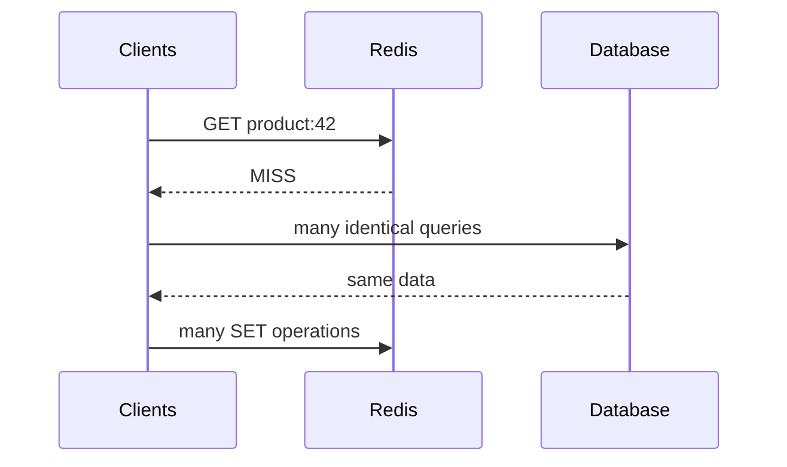

# Daily Knowledge Sharing — 2026-09-21

## Today’s Topics

1. .NET GC, Large Object Heap và allocation pressure
2. ASP.NET Core DI: Captive Dependency và lifetime boundary
3. SQL Server: Isolation Level, blocking và deadlock
4. Redis: Cache Stampede và request coalescing
5. DDD: Aggregate là consistency boundary, không phải object graph
6. Azure Service Bus: PeekLock, duplicate delivery và idempotent consumer
7. Kubernetes: Readiness vs Liveness probe trong rollout
8. OpenTelemetry: Trace một request xuyên nhiều dependency
9. JWT validation: signature đúng chưa đủ để authorization an toàn
10. AI Integration: Structured Outputs và deterministic validation boundary

---

# 1. .NET GC, Large Object Heap và allocation pressure

## 1. What is it?

Garbage Collector (GC) của .NET quản lý managed memory bằng cách tìm object không còn reachable và thu hồi vùng nhớ. Mental model quan trọng không phải “GC tự dọn nên không cần quan tâm memory”, mà là: **allocation tạo ra công việc tương lai cho GC**.

Managed heap chủ yếu được chia theo generations. Object sống ngắn thường ở Gen 0; object sống qua collection được promote. Các allocation lớn (thường từ khoảng 85 KB trở lên) đi vào Large Object Heap (LOH), nơi chi phí collection và fragmentation có đặc điểm khác small-object heap.

## 2. Why does it exist?

Manual memory management dễ tạo use-after-free, double-free và leak. GC đổi bài toán sang automatic lifetime management. Nhưng server có throughput cao vẫn phải trả chi phí CPU, pause, memory footprint và cache locality.

Một endpoint tạo nhiều `byte[]`, string hoặc JSON buffer lớn có thể đúng về logic nhưng tạo allocation rate quá cao, khiến GC chạy liên tục và latency p99 tăng.

## 3. How does it work?

Allocation nhỏ thường rất nhanh vì runtime bump một pointer. Chi phí xuất hiện khi segment đầy: GC xác định roots, đánh dấu object reachable, compact khi phù hợp và promote survivors.

```text
Request load tăng
  → allocation/sec tăng
  → Gen 0/1 collection tăng
  → object sống lâu bị promote
  → Gen 2/LOH pressure tăng
  → CPU + pause + memory tăng
  → tail latency xấu đi
```

LOH đặc biệt đáng chú ý với serialization, file processing, image/document processing và large response buffering.

## 4. Practical implementation

Đừng pool mọi thứ. Pool khi profiling chứng minh buffer allocation là bottleneck và ownership rõ ràng:

```csharp
var pool = ArrayPool<byte>.Shared;
var buffer = pool.Rent(128 * 1024);

try
{
    var read = await stream.ReadAsync(buffer.AsMemory(0, buffer.Length), ct);
    await ProcessAsync(buffer.AsMemory(0, read), ct);
}
finally
{
    pool.Return(buffer, clearArray: false);
}
```

Với ASP.NET Core, ưu tiên streaming thay vì đọc toàn bộ file vào `byte[]` nếu business flow cho phép.

## 5. Real production scenario

API import CSV nhận file 20 MB. Phiên bản đầu dùng `ReadAllBytesAsync`, convert nhiều lần sang string rồi deserialize thành object graph. Khi 30 import chạy đồng thời, memory tăng mạnh dù không có classic leak. Nguyên nhân là allocation burst + object lifetime kéo dài + LOH pressure.

## 6. Failure scenario & troubleshooting

**Symptom** → p99 tăng, CPU cao, memory dạng răng cưa lớn.

**Evidence** → `dotnet-counters` cho thấy allocation rate và Gen 2 collection tăng; memory dump không có một loại object tăng vô hạn.

**Hypothesis** → allocation pressure chứ không phải leak.

**Diagnosis** → profiler chỉ ra large arrays và strings từ file pipeline.

**Fix** → streaming, giảm copy, reuse buffer có kiểm soát.

**Verification** → so sánh allocation/sec, GC pause, working set và p95/p99 dưới cùng workload.

## 7. Common mistakes

- Gọi `GC.Collect()` để “sửa memory”.
- Cho rằng memory cao luôn là leak.
- Dùng `ArrayPool<T>` nhưng quên `Return` hoặc giữ reference sau khi return.
- Tối ưu allocation trước khi profiling.
- Buffer toàn bộ payload lớn dù có thể stream.

## 8. Alternatives

`ArrayPool<T>` phù hợp buffer tái sử dụng; `Span<T>` giúp xử lý slice không allocation; streaming giảm peak memory; đôi khi allocation bình thường vẫn đơn giản và nhanh hơn pooling.

## 9. Trade-offs

### Advantages

Giảm allocation có thể giảm GC CPU, memory pressure và tail latency.

### Costs / Risks

Pooling làm ownership phức tạp, có nguy cơ data corruption hoặc data leakage nếu buffer bị dùng sai. Zero-allocation code khó đọc hơn và không đáng nếu đường code không nóng.

## 10. Junior → Middle → Senior → Technical Lead

### Junior

Hiểu managed memory không đồng nghĩa memory miễn phí; object còn reachable thì GC không thu hồi.

### Middle

Biết dùng profiler/counters, phân biệt allocation pressure với leak và tránh buffering không cần thiết.

### Senior

Hiểu generations, LOH, lifetime, pooling risks và tác động lên p99.

### Technical Lead / Architect

Quyết định khi nào performance budget yêu cầu streaming/pooling và khi nào code đơn giản quan trọng hơn micro-optimization.

## 11. Key takeaway

- Allocation rẻ ở thời điểm tạo nhưng tạo GC work về sau.
- Memory cao không tự động có nghĩa memory leak.
- Chỉ tối ưu allocation sau khi có evidence.

---

# 2. ASP.NET Core DI: Captive Dependency và lifetime boundary

## 1. What is it?

Captive Dependency xảy ra khi một service sống lâu giữ reference tới dependency có lifetime ngắn hơn dự kiến, điển hình Singleton giữ Scoped service. Lifetime không chỉ là cấu hình DI; nó là **ownership boundary của state và resource**.

## 2. Why does it exist?

ASP.NET Core dùng DI container để quản lý object graph. `Scoped` thường gắn với một request, `Singleton` sống suốt process, `Transient` được tạo theo resolution. Nếu lifetime graph sai, state request có thể bị giữ quá lâu, resource không dispose đúng lúc hoặc component không thread-safe bị chia sẻ giữa requests.

## 3. How does it work?

```text
Application lifetime
└── Singleton
    └── Scoped dependency  ← lifetime bị kéo dài sai
```

`DbContext` mặc định là Scoped. Singleton trực tiếp giữ `DbContext` không chỉ gây lifetime mismatch mà còn có concurrency problem vì `DbContext` không thread-safe.

## 4. Practical implementation

Sai:

```csharp
builder.Services.AddSingleton<ReportCache>();
builder.Services.AddDbContext<AppDbContext>();

public sealed class ReportCache(AppDbContext db) { }
```

Nếu background singleton cần tạo unit-of-work độc lập, dùng factory:

```csharp
builder.Services.AddDbContextFactory<AppDbContext>();

public sealed class ReportWorker(IDbContextFactory<AppDbContext> factory)
{
    public async Task RunAsync(CancellationToken ct)
    {
        await using var db = await factory.CreateDbContextAsync(ct);
        var rows = await db.Reports.AsNoTracking().ToListAsync(ct);
    }
}
```

## 5. Real production scenario

Một `BackgroundService` được đăng ký Singleton inject repository Scoped. Local chạy ít tải nên không lộ lỗi. Production chạy nhiều batch đồng thời và xuất hiện “A second operation was started on this context” vì cùng `DbContext` bị dùng concurrent.

## 6. Failure scenario & troubleshooting

**Symptom** → lỗi concurrency ngẫu nhiên, dữ liệu tracking lẫn giữa operations hoặc connection/resource sống lâu.

**Evidence** → inspect DI registration và object graph; log instance identifier của context.

**Diagnosis** → long-lived component giữ request-scoped state.

**Fix** → tạo scope theo operation hoặc dùng `IDbContextFactory<T>`.

**Verification** → concurrency test nhiều operations và kiểm tra mỗi unit-of-work có context riêng.

## 7. Common mistakes

- Nghĩ Singleton chỉ là optimization để giảm `new`.
- Inject `IServiceProvider` khắp nơi để che lifetime design sai.
- Tạo scope nhưng giữ scoped object ra ngoài scope.
- Cho rằng Transient luôn an toàn khi dependency bên dưới giữ resource.

## 8. Alternatives

`IServiceScopeFactory` phù hợp khi cần explicit scope; `IDbContextFactory<T>` rõ hơn cho EF Core; có thể redesign service thành Scoped nếu nó thực chất thuộc request boundary.

## 9. Trade-offs

### Advantages

Lifetime đúng giúp ownership, disposal và thread-safety rõ ràng.

### Costs / Risks

Factory/scope tạo thêm ceremony. Quá nhiều service lifetime khác nhau làm object graph khó reason; vì vậy nên ưu tiên boundary đơn giản.

## 10. Junior → Middle → Senior → Technical Lead

### Junior

Biết Singleton, Scoped, Transient khác nhau về lifetime.

### Middle

Đăng ký đúng `DbContext`, repository, request service và background component.

### Senior

Review lifetime graph theo state, thread-safety, disposal và concurrency.

### Technical Lead / Architect

Định nghĩa application/request/job boundaries rõ thay vì chữa lỗi bằng service locator.

## 11. Key takeaway

- DI lifetime là ownership model, không chỉ container setting.
- Dependency sống ngắn không nên bị long-lived component giữ lại.
- `DbContext` cần unit-of-work boundary rõ và không được dùng concurrent.

---

# 3. SQL Server: Isolation Level, blocking và deadlock

## 1. What is it?

Isolation Level quy định transaction được phép quan sát thay đổi concurrent đến mức nào. Nó cân bằng consistency với concurrency. Blocking là transaction chờ lock hợp lệ; deadlock là vòng chờ mà database phải phá bằng cách chọn một victim.

## 2. Why does it exist?

Nếu mọi transaction chạy như chỉ có một user, consistency đơn giản nhưng throughput thấp. Nếu không có isolation, concurrent writes/reads có thể tạo dirty read, non-repeatable read hoặc business invariant sai.

## 3. How does it work?

Hai transaction có thể lock resource theo thứ tự ngược nhau:

```text
T1 locks Order 10 → waits Customer 5
T2 locks Customer 5 → waits Order 10
                ↑             ↓
                └── deadlock ─┘
```

SQL Server phát hiện cycle và rollback một transaction. Isolation cao hơn thường giữ nhiều/ lâu hơn các protection, nhưng behavior còn phụ thuộc row versioning và database configuration.

## 4. Practical implementation

Giảm transaction scope và giữ access order nhất quán:

```csharp
await using var tx = await db.Database.BeginTransactionAsync(ct);

var order = await db.Orders.SingleAsync(x => x.Id == orderId, ct);
order.Status = OrderStatus.Approved;

await db.SaveChangesAsync(ct);
await tx.CommitAsync(ct);
```

Không gọi remote API trong transaction nếu không thật sự cần.

## 5. Real production scenario

Approval API update `Timesheet` rồi `EmployeeSummary`; nightly job update `EmployeeSummary` rồi `Timesheet`. Khi tải tăng, hai đường code lock cùng dữ liệu theo thứ tự khác nhau và deadlock xuất hiện.

## 6. Failure scenario & troubleshooting

**Symptom** → một số request fail với deadlock victim; latency tăng trước lỗi.

**Evidence** → deadlock graph/Extended Events chỉ ra statements và lock cycle.

**Hypothesis** → inconsistent resource access order hoặc transaction quá rộng.

**Diagnosis** → map statement về hai code paths.

**Fix** → thống nhất lock order, rút ngắn transaction, cải thiện query/index nếu scan giữ nhiều locks; retry deadlock chỉ khi operation an toàn.

**Verification** → stress test cùng contention pattern và theo dõi deadlock count.

## 7. Common mistakes

- Dùng `NOLOCK` như thuốc chữa blocking.
- Tăng timeout thay vì tìm lock holder.
- Retry mọi transaction vô hạn.
- Giữ transaction trong lúc gọi HTTP.
- Nghĩ index chỉ ảnh hưởng speed, không ảnh hưởng lock footprint.

## 8. Alternatives

Optimistic concurrency giải quyết lost update ở application level; row-versioning isolation giảm read/write blocking trong nhiều trường hợp; pessimistic locking phù hợp khi conflict cần serialize rõ.

## 9. Trade-offs

### Advantages

Isolation mạnh giúp invariant dễ bảo vệ.

### Costs / Risks

Isolation/locking mạnh có thể giảm concurrency; row versioning dùng thêm version store; retry tăng load nếu root cause là contention kéo dài.

## 10. Junior → Middle → Senior → Technical Lead

### Junior

Hiểu transaction không chỉ là commit/rollback mà còn tương tác với concurrent transactions.

### Middle

Biết đọc blocking/deadlock evidence và giữ transaction ngắn.

### Senior

Liên hệ query plan, index, lock footprint, isolation và latency.

### Technical Lead / Architect

Chọn consistency strategy theo business invariant thay vì mặc định tăng isolation.

## 11. Key takeaway

- Blocking có thể bình thường; deadlock là cycle cần phân tích.
- Transaction càng rộng, contention risk càng lớn.
- Query plan và index có thể thay đổi cả locking behavior.

---

# 4. Redis: Cache Stampede và request coalescing

## 1. What is it?

Cache Stampede xảy ra khi một hot key hết hạn và nhiều request cùng cache miss, sau đó đồng loạt đánh vào database/downstream. Cache vốn để giảm tải lại tạo spike đúng thời điểm dữ liệu biến mất.

## 2. Why does it exist?

Cache-aside đơn giản thường là `GET → miss → load → SET`. Với một request thì đúng; với hàng nghìn request cùng key thì tất cả đều thấy miss trước khi request đầu refill cache.

## 3. How does it work?



Mitigation gồm request coalescing/single-flight, TTL jitter, stale-while-revalidate hoặc distributed coordination tùy topology.

## 4. Practical implementation

Trong một process, có thể coalesce bằng `SemaphoreSlim` theo key; production cần cleanup key-lock để tránh leak:

```csharp
var value = await cache.GetStringAsync(key, ct);
if (value is not null) return Deserialize(value);

await gate.WaitAsync(ct);
try
{
    value = await cache.GetStringAsync(key, ct);
    if (value is not null) return Deserialize(value);

    var data = await repository.LoadAsync(id, ct);
    await cache.SetStringAsync(key, Serialize(data), options, ct);
    return data;
}
finally
{
    gate.Release();
}
```

Điểm quan trọng là **double-check cache sau khi lấy gate**.

## 5. Real production scenario

Product detail page có một sản phẩm flash sale. Key TTL 5 phút. Mỗi 5 phút, hàng nghìn requests đồng thời miss và SQL CPU spike, dù Redis bình thường.

## 6. Failure scenario & troubleshooting

**Symptom** → DB spike có chu kỳ trùng TTL; cache hit rate tụt ngắn rồi hồi phục.

**Evidence** → trace cho thấy nhiều identical DB queries ngay sau expiration.

**Fix** → TTL jitter, single-flight, pre-refresh hoặc stale response nếu business cho phép.

**Verification** → load test đúng hot-key distribution, không chỉ random keys.

## 7. Common mistakes

- Chỉ tăng TTL.
- Dùng distributed lock không timeout/fencing strategy.
- Cache null vô thời hạn.
- Tất cả key hết hạn cùng thời điểm.
- Redis outage làm application fail hoàn toàn dù DB vẫn có thể phục vụ degraded mode.

## 8. Alternatives

`IMemoryCache` coalescing chỉ trong một instance; Redis coordination hoạt động cross-instance nhưng phức tạp hơn; stale-while-revalidate ưu tiên availability/freshness trade-off.

## 9. Trade-offs

### Advantages

Stampede protection bảo vệ downstream và làm latency ổn định hơn.

### Costs / Risks

Coordination tạo thêm state và failure modes. Distributed lock có thể trở thành bottleneck. Stale serving đổi consistency lấy availability.

## 10. Junior → Middle → Senior → Technical Lead

### Junior

Hiểu cache miss không phải lúc nào cũng độc lập.

### Middle

Implement cache-aside, TTL và double-check locking đúng.

### Senior

Thiết kế cho hot keys, Redis outage và multi-instance behavior.

### Technical Lead / Architect

Quyết định dữ liệu nào đáng cache, freshness SLA và liệu complexity chống stampede có thực sự cần.

## 11. Key takeaway

- Hot-key expiration có thể biến cache thành load amplifier.
- Test cache dưới concurrent distribution thực tế.
- Invalidation, freshness và failure behavior phải được thiết kế cùng nhau.

---

# 5. DDD: Aggregate là consistency boundary, không phải object graph

## 1. What is it?

Aggregate là nhóm domain objects được bảo vệ bởi một Aggregate Root và một consistency boundary. Nó không có nghĩa “mọi object liên quan đến nhau phải nằm chung aggregate”.

Ví dụ `Order` có thể là Aggregate Root và `OrderLine` nằm trong aggregate vì invariant tổng tiền/số lượng cần nhất quán trong cùng transaction.

## 2. Why does it exist?

Nếu domain model cho phép mọi entity sửa mọi entity khác, transaction boundary trở nên mơ hồ, coupling lớn và concurrent modification khó kiểm soát. Aggregate giới hạn nơi invariant phải được bảo vệ atomically.

## 3. How does it work?

```text
Order Aggregate
┌──────────────────────────┐
│ Order (Aggregate Root)   │
│  ├─ OrderLine            │
│  └─ OrderLine            │
│ invariant: Total, Status │
└──────────────────────────┘

Customer Aggregate  ← tham chiếu bằng CustomerId, không cần load cả Customer
```

Cross-aggregate consistency thường cần workflow/event thay vì một giant transaction.

## 4. Practical implementation

```csharp
public sealed class Order
{
    private readonly List<OrderLine> _lines = [];
    public IReadOnlyCollection<OrderLine> Lines => _lines;
    public OrderStatus Status { get; private set; }

    public void AddLine(ProductId productId, int quantity, Money price)
    {
        if (Status != OrderStatus.Draft)
            throw new DomainException("Only draft orders can be changed.");
        if (quantity <= 0)
            throw new DomainException("Quantity must be positive.");

        _lines.Add(new OrderLine(productId, quantity, price));
    }
}
```

Invariant nằm trong domain behavior thay vì controller set property tùy ý.

## 5. Real production scenario

E-commerce order cần đảm bảo line không thay đổi sau khi submitted. Inventory lại thuộc bounded context khác. Order không nên giữ toàn bộ inventory entity chỉ để kiểm tra stock; reservation có thể là cross-context workflow.

## 6. Failure scenario & troubleshooting

**Symptom** → transaction update hàng chục bảng, contention cao, entity graph khổng lồ.

**Evidence** → một “aggregate” chứa Customer, Orders, Products, Inventory, Payments.

**Diagnosis** → aggregate boundary được vẽ theo relationship thay vì invariant.

**Fix** → tách theo consistency requirement; cross-boundary dùng IDs/events/workflow.

**Verification** → mỗi command chỉ cần load aggregate thực sự cần để bảo vệ invariant.

## 7. Common mistakes

- Mỗi table = một aggregate.
- Aggregate = navigation graph.
- Expose public setters làm invariant vô nghĩa.
- Dùng Domain Event cho mọi property change.
- Ép DDD vào CRUD đơn giản.

## 8. Alternatives

CRUD/application-service model đơn giản phù hợp domain ít business rules. Transaction Script có thể tốt hơn rich domain model nếu complexity thấp.

## 9. Trade-offs

### Advantages

Aggregate làm invariant, ownership và transaction boundary rõ.

### Costs / Risks

DDD tăng modeling effort. Aggregate quá nhỏ tạo coordination phức tạp; quá lớn gây contention và coupling.

## 10. Junior → Middle → Senior → Technical Lead

### Junior

Hiểu Entity khác Value Object và Aggregate Root kiểm soát thay đổi bên trong boundary.

### Middle

Implement behavior giữ invariant và repository theo aggregate khi phù hợp.

### Senior

Phân tích consistency/concurrency để chọn boundary.

### Technical Lead / Architect

Quyết định bounded context và nơi chấp nhận eventual consistency; biết khi nào không cần DDD.

## 11. Key takeaway

- Aggregate là consistency boundary, không phải database relationship graph.
- Boundary nên xuất phát từ invariant và concurrency.
- Domain đơn giản không cần bị ép thành DDD phức tạp.

---

# 6. Azure Service Bus: PeekLock, duplicate delivery và idempotent consumer

## 1. What is it?

Với PeekLock, consumer nhận message nhưng message chưa bị xóa. Broker khóa message tạm thời; consumer xử lý rồi `Complete`. Nếu lock hết hạn hoặc processing thất bại, message có thể được delivery lại.

## 2. Why does it exist?

Nếu broker xóa message ngay khi giao và consumer crash giữa processing, work bị mất. PeekLock ưu tiên reliable delivery, đổi lại consumer phải chịu duplicate delivery.

## 3. How does it work?

```text
Service Bus → lock message → Consumer
                         → business work
                         → Complete

Crash / lock expires
        ↓
message becomes available again
```

“At-least-once” nghĩa side effect phải idempotent; không được giả định mỗi message chỉ đến một lần.

## 4. Practical implementation

```csharp
processor.ProcessMessageAsync += async args =>
{
    var messageId = args.Message.MessageId;

    if (await inbox.ExistsAsync(messageId, args.CancellationToken))
    {
        await args.CompleteMessageAsync(args.Message, args.CancellationToken);
        return;
    }

    await handler.HandleAsync(args.Message.Body, args.CancellationToken);
    await inbox.MarkProcessedAsync(messageId, args.CancellationToken);
    await args.CompleteMessageAsync(args.Message, args.CancellationToken);
};
```

Trong hệ thống nghiêm ngặt, business change và inbox marker nên có transaction boundary phù hợp để tránh crash window.

## 5. Real production scenario

`OrderPaid` consumer tạo invoice. Invoice generation mất 70 giây nhưng lock duration ngắn hơn và auto-renew cấu hình không đủ. Message được delivery lại, hai worker cùng tạo invoice.

## 6. Failure scenario & troubleshooting

**Symptom** → duplicate invoice dù chỉ có một payment.

**Evidence** → cùng `MessageId` xuất hiện ở nhiều trace; delivery count tăng.

**Diagnosis** → lock expiration hoặc crash sau side effect trước `Complete`.

**Fix** → idempotent consumer/inbox, điều chỉnh lock renewal, giảm processing time hoặc tách long-running work.

**Verification** → fault injection: kill consumer sau DB commit nhưng trước complete.

## 7. Common mistakes

- Cho rằng queue đảm bảo exactly-once business processing.
- Dùng random MessageId mỗi retry.
- `Complete` trước business commit.
- Retry poison message vô hạn.
- Không monitor DLQ và queue age.

## 8. Alternatives

Storage Queue đơn giản/rẻ hơn cho một số workload; Event Grid phù hợp event routing; synchronous HTTP phù hợp khi caller cần immediate response. Không công cụ nào loại bỏ nhu cầu thiết kế failure semantics.

## 9. Trade-offs

### Advantages

Messaging decouple producer/consumer, absorb burst và tăng resilience.

### Costs / Risks

Eventual consistency, duplicate handling, observability và DLQ operations tăng complexity.

## 10. Junior → Middle → Senior → Technical Lead

### Junior

Hiểu queue không đồng nghĩa “message chạy đúng một lần”.

### Middle

Implement settlement, retry và DLQ handling.

### Senior

Thiết kế idempotency, lock duration, concurrency và poison-message strategy.

### Technical Lead / Architect

Quyết định khi messaging đáng operational cost và định nghĩa delivery/consistency contract giữa services.

## 11. Key takeaway

- PeekLock bảo vệ khỏi message loss nhưng cho phép redelivery.
- Idempotency là trách nhiệm business consumer.
- Test crash windows, không chỉ happy path.

---

# 7. Kubernetes: Readiness vs Liveness probe trong rollout

## 1. What is it?

Readiness trả lời: **pod hiện có nên nhận traffic không?** Liveness trả lời: **process có cần restart không?** Hai câu hỏi khác nhau; dùng cùng một check cho cả hai có thể gây outage.

## 2. Why does it exist?

Process “đang chạy” chưa chắc sẵn sàng phục vụ. Ngược lại, dependency tạm thời down không có nghĩa process cần bị kill. Kubernetes cần signal riêng cho traffic routing và restart decision.

## 3. How does it work?

```text
Pod starts
  → startup/readiness false
  → app warms up
  → readiness true
  → Service routes traffic

Temporary DB outage
  → readiness may become false
  → liveness should usually remain true
```

Nếu liveness phụ thuộc database, DB outage có thể restart toàn bộ fleet và làm recovery tệ hơn.

## 4. Practical implementation

ASP.NET Core có thể tách endpoints:

```csharp
builder.Services.AddHealthChecks()
    .AddSqlServer(connectionString, tags: ["ready"]);

app.MapHealthChecks("/health/live", new HealthCheckOptions
{
    Predicate = _ => false
});

app.MapHealthChecks("/health/ready", new HealthCheckOptions
{
    Predicate = r => r.Tags.Contains("ready")
});
```

Deployment cấu hình probe khác nhau theo semantics.

## 5. Real production scenario

Sau deploy, app cần 20 giây warm-up. Không có readiness probe nên Service gửi traffic ngay, tạo 5xx trong rollout. Team thêm DB check vào liveness; lần sau DB chậm 30 giây, toàn bộ pods restart đồng thời.

## 6. Failure scenario & troubleshooting

**Symptom** → `CrashLoopBackOff` hoặc rollout không đạt available replicas.

**Evidence** → `kubectl describe pod` cho thấy probe failures; app logs cho thấy process không crash tự nhiên.

**Diagnosis** → probe semantics/timing sai.

**Fix** → tách live/ready, chỉnh initial delay/threshold hoặc startup probe; không biến transient dependency failure thành restart storm.

**Verification** → simulate dependency outage và rolling deployment.

## 7. Common mistakes

- Liveness gọi tất cả dependencies.
- Health endpoint luôn trả 200 dù app không thể phục vụ.
- Probe quá aggressive khi startup chậm.
- Readiness check quá nặng gây thêm load.

## 8. Alternatives

App Service health checks đơn giản hơn khi không dùng Kubernetes; orchestrator khác có health semantics tương tự. Nếu workload không cần Kubernetes, tránh mang operational complexity chỉ để có probes.

## 9. Trade-offs

### Advantages

Probe đúng giúp rollout an toàn, traffic routing tốt và self-healing hợp lý.

### Costs / Risks

Probe sai có thể tự tạo outage. Dependency-rich readiness có thể làm toàn service bị rút khỏi traffic vì một dependency phụ.

## 10. Junior → Middle → Senior → Technical Lead

### Junior

Phân biệt alive và ready.

### Middle

Implement health endpoints và đọc probe events.

### Senior

Thiết kế dependency checks theo degradation behavior và rollout.

### Technical Lead / Architect

Quyết định health contract của service và liệu Kubernetes có đáng chi phí vận hành.

## 11. Key takeaway

- Readiness điều khiển traffic; liveness điều khiển restart.
- Dependency outage không mặc định là lý do restart process.
- Probe configuration là reliability code dưới dạng infrastructure.

---

# 8. OpenTelemetry: Trace một request xuyên nhiều dependency

## 1. What is it?

Distributed tracing biểu diễn một operation end-to-end bằng trace gồm nhiều spans. OpenTelemetry chuẩn hóa instrumentation và context propagation để request qua API, database, HTTP dependency và message consumer vẫn có thể được liên kết.

## 2. Why does it exist?

Log riêng từng service không trả lời tốt câu hỏi “500 ms biến mất ở đâu?”. Trong distributed system, một user request có thể qua nhiều process; cần correlation có cấu trúc thay vì grep timestamp.

## 3. How does it work?

```text
Trace 7f...
├─ ASP.NET Core request       420 ms
├─ SQL query                   35 ms
├─ HTTP Product API           310 ms
└─ serialization               18 ms
```

Trace context thường được propagate qua HTTP headers; instrumentation tạo spans và exporter gửi telemetry tới backend như Application Insights-compatible pipeline.

## 4. Practical implementation

```csharp
builder.Services.AddOpenTelemetry()
    .WithTracing(tracing => tracing
        .AddAspNetCoreInstrumentation()
        .AddHttpClientInstrumentation()
        .AddEntityFrameworkCoreInstrumentation());
```

Custom business span chỉ nên thêm khi nó giúp chẩn đoán boundary có ý nghĩa:

```csharp
using var activity = ActivitySource.StartActivity("Order.CalculatePrice");
activity?.SetTag("order.type", order.Type);
```

Không tag PII hoặc high-cardinality data bừa bãi.

## 5. Real production scenario

Checkout p95 tăng từ 600 ms lên 1.8 s. API CPU và SQL latency bình thường. Trace chỉ ra Review API chiếm 1.2 s do retry hai lần; local service metrics không thể hiện rõ failure propagation này.

## 6. Failure scenario & troubleshooting

**Symptom** → trace bị đứt giữa services.

**Evidence** → downstream có spans nhưng trace ID khác.

**Hypothesis** → context propagation bị mất qua custom HTTP/messaging code.

**Diagnosis** → kiểm tra headers/message properties và instrumentation.

**Fix** → dùng standard propagation, instrument producer/consumer boundary.

**Verification** → một synthetic request tạo được trace end-to-end.

## 7. Common mistakes

- Log mọi thứ nhưng không correlation.
- Tag user email/token vào spans.
- Sampling quá thấp làm mất rare failures.
- High-cardinality metrics thay vì trace attributes.
- Có telemetry nhưng không có SLO/alert dẫn đến không ai dùng.

## 8. Alternatives

Application Insights SDK có thể cung cấp instrumentation trực tiếp; OpenTelemetry tăng portability và chuẩn hóa. Logs vẫn cần cho discrete events; metrics tốt cho aggregate health; traces tốt cho request causality.

## 9. Trade-offs

### Advantages

Trace rút ngắn localization time và cho thấy dependency waterfall.

### Costs / Risks

Telemetry có ingestion cost, storage cost và privacy risk. Sampling/retention cần thiết kế theo SLO và incident needs.

## 10. Junior → Middle → Senior → Technical Lead

### Junior

Hiểu logs, metrics, traces giải quyết câu hỏi khác nhau.

### Middle

Instrument HTTP/DB và dùng trace ID để debug.

### Senior

Thiết kế sampling, semantic attributes và incident workflow.

### Technical Lead / Architect

Chuẩn hóa observability contract, retention/cost và ownership trên toàn hệ thống.

## 11. Key takeaway

- Trace cho biết latency/failure đi qua dependency chain như thế nào.
- Context propagation là phần cốt lõi, không phải dashboard.
- Observability phải phục vụ SLO và troubleshooting, không phải thu thập vô hạn.

---

# 9. JWT validation: signature đúng chưa đủ để authorization an toàn

## 1. What is it?

JWT validation xác minh token có đáng tin cho **API cụ thể trong context cụ thể** hay không. Signature chỉ chứng minh token được ký bởi key tương ứng; API còn phải kiểm tra issuer, audience, lifetime và claims cần thiết.

## 2. Why does it exist?

Một token hợp lệ cho API A không nên tự động được chấp nhận bởi API B. Nếu chỉ verify signature nhưng bỏ audience/issuer, token từ trust context khác có thể bị dùng sai mục đích.

## 3. How does it work?

```text
Bearer token
 → parse header/payload
 → resolve signing key
 → verify signature
 → validate issuer
 → validate audience
 → validate lifetime
 → build ClaimsPrincipal
 → authorization policy
```

Authentication trả lời “identity/token có hợp lệ không”; authorization trả lời “identity này có quyền thực hiện operation không”.

## 4. Practical implementation

```csharp
builder.Services
    .AddAuthentication(JwtBearerDefaults.AuthenticationScheme)
    .AddJwtBearer(options =>
    {
        options.Authority = configuration["Auth:Authority"];
        options.Audience = configuration["Auth:Audience"];
        options.TokenValidationParameters.ValidateIssuer = true;
        options.TokenValidationParameters.ValidateAudience = true;
        options.TokenValidationParameters.ValidateLifetime = true;
    });

builder.Services.AddAuthorization(options =>
{
    options.AddPolicy("CanApproveTimesheet", policy =>
        policy.RequireClaim("permission", "timesheet.approve"));
});
```

## 5. Real production scenario

Hai APIs cùng trust một identity provider. API Orders vô tình bỏ audience validation. Access token cấp cho Profile API có cùng issuer/signing keys nên signature pass và bị Orders API chấp nhận.

## 6. Failure scenario & troubleshooting

**Symptom** → token chạy local nhưng Production trả 401, hoặc token không đúng API vẫn được accept.

**Evidence** → decode metadata an toàn để so `iss`, `aud`, `exp`; kiểm tra authority/JWKS configuration, không log raw token.

**Diagnosis** → environment config sai hoặc validation bị nới lỏng.

**Fix** → explicit issuer/audience/lifetime; authorization policy theo permission.

**Verification** → negative tests với wrong audience, expired token, wrong issuer và missing permission.

## 7. Common mistakes

- Decode JWT rồi coi claims là trusted mà chưa validate signature.
- Tắt audience validation để “fix 401”.
- Dùng role/claim từ client input.
- Log access token.
- Confuse CORS với authentication/security boundary.

## 8. Alternatives

Cookie authentication phù hợp browser server-rendered flows; opaque/reference tokens có centralized introspection nhưng thêm network dependency; JWT phù hợp distributed validation nhưng revocation tức thời khó hơn.

## 9. Trade-offs

### Advantages

JWT cho phép stateless local validation và scale tốt.

### Costs / Risks

Key rotation, claim design, token lifetime và revocation cần quản lý. Token quá nhiều claims làm coupling và tăng header size.

## 10. Junior → Middle → Senior → Technical Lead

### Junior

Phân biệt authentication với authorization.

### Middle

Cấu hình issuer/audience/lifetime và policy-based authorization.

### Senior

Threat-model token misuse, key rotation, clock skew và service-to-service scopes.

### Technical Lead / Architect

Thiết kế trust boundaries, token audiences và permission model giữa APIs.

## 11. Key takeaway

- Valid signature không có nghĩa token hợp lệ cho API này.
- Validate issuer, audience, lifetime trước authorization.
- Authorization phải dựa trên server-enforced policy, không dựa vào client assertion.

---

# 10. AI Integration: Structured Outputs và deterministic validation boundary

## 1. What is it?

Structured Outputs buộc model trả dữ liệu theo schema mong muốn thay vì free-form text. Nó làm integration ổn định hơn, nhưng **schema-valid không đồng nghĩa business-correct**.

Mental model: LLM chịu trách nhiệm suy luận/xử lý ngôn ngữ có tính probabilistic; application vẫn chịu trách nhiệm deterministic validation và side-effect control.

## 2. Why does it exist?

Parse natural-language output bằng regex/string matching dễ vỡ. Structured schema giảm parsing ambiguity và giúp application có contract rõ. Tuy nhiên model vẫn có thể chọn giá trị hợp schema nhưng sai fact hoặc sai business intent.

## 3. How does it work?

```text
User input
  → LLM + schema
  → schema-valid object
  → deterministic validation
  → authorization/business rules
  → optional tool/action
```

Ví dụ model trả `{ "action": "refund", "amount": 100 }` đúng schema. Application vẫn phải xác minh order tồn tại, user có quyền, amount không vượt refundable balance và operation idempotent.

## 4. Practical implementation

Application model:

```csharp
public sealed record RefundSuggestion(
    string OrderId,
    decimal Amount,
    string Reason);

public async Task ExecuteAsync(RefundSuggestion suggestion, ClaimsPrincipal user, CancellationToken ct)
{
    var order = await orders.GetAsync(suggestion.OrderId, ct)
        ?? throw new ValidationException("Order not found");

    authorization.EnsureCanRefund(user, order);

    if (suggestion.Amount <= 0 || suggestion.Amount > order.RefundableAmount)
        throw new ValidationException("Invalid refund amount");

    await refunds.CreateIdempotentlyAsync(order.Id, suggestion.Amount, ct);
}
```

LLM đề xuất; deterministic code quyết định action có hợp lệ hay không.

## 5. Real production scenario

Support assistant đọc email khách hàng và đề xuất refund. Model extract đúng JSON nhưng hiểu nhầm “refund shipping only” thành refund toàn order. Nếu backend tin output trực tiếp, lỗi tài chính xảy ra dù schema hoàn toàn valid.

## 6. Failure scenario & troubleshooting

**Symptom** → JSON parse thành công nhưng action sai business rule.

**Evidence** → evaluation dataset cho thấy semantic error; audit log cho biết model input/output và validation result đã được redaction phù hợp.

**Hypothesis** → team coi structural correctness là semantic correctness.

**Fix** → deterministic constraints, approval threshold, tool permissions tối thiểu và eval cases cho adversarial/ambiguous input.

**Verification** → replay evaluation suite và negative cases; side effect tests phải chứng minh invalid proposal không thể thực thi.

## 7. Common mistakes

- Cho model tự quyết authorization.
- Tin structured output như database truth.
- Retry model vô hạn khi schema fail.
- Đưa secrets/PII không cần thiết vào context.
- Tool có permission rộng hơn agent cần.
- Không version schema/prompt/evaluation set.

## 8. Alternatives

Rule engine phù hợp logic deterministic; traditional parser phù hợp format ổn định; human approval phù hợp high-impact action. LLM có giá trị nhất ở ambiguous language/reasoning, không phải thay thế logic đã xác định rõ.

## 9. Trade-offs

### Advantages

Structured Outputs giảm parser fragility, làm contract rõ và dễ test hơn free-form output.

### Costs / Risks

Model vẫn probabilistic, có latency/token cost, rate limits và semantic errors. Validation, observability và eval tạo thêm engineering work nhưng là phần bắt buộc của production system.

## 10. Junior → Middle → Senior → Technical Lead

### Junior

Hiểu JSON đúng schema không đảm bảo nội dung đúng.

### Middle

Implement typed contract, validation, timeout/retry và error handling.

### Senior

Thiết kế evals, security boundary, prompt-injection defense và idempotent tool execution.

### Technical Lead / Architect

Quyết định phần nào nên probabilistic, phần nào bắt buộc deterministic; giới hạn blast radius và cost của AI component.

## 11. Key takeaway

- Structured Outputs giải quyết shape, không giải quyết truth.
- Authorization, money, invariants và side effects phải có deterministic guardrails.
- Production AI cần eval, observability và least-privilege tool boundaries.