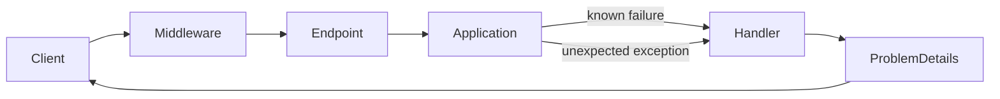
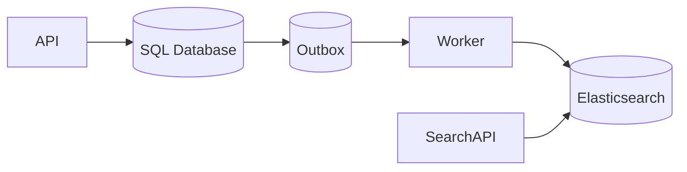
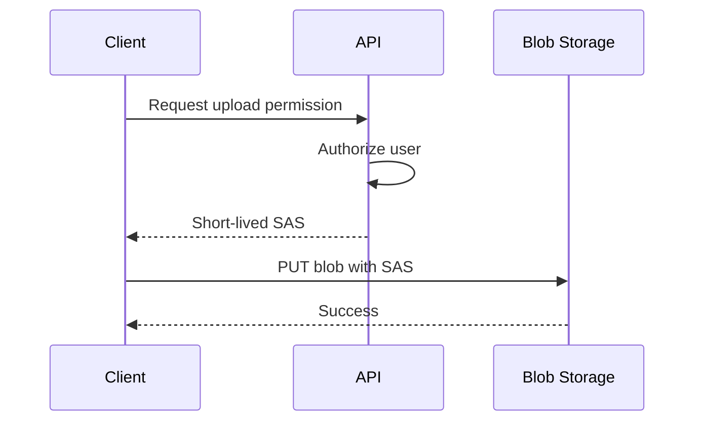
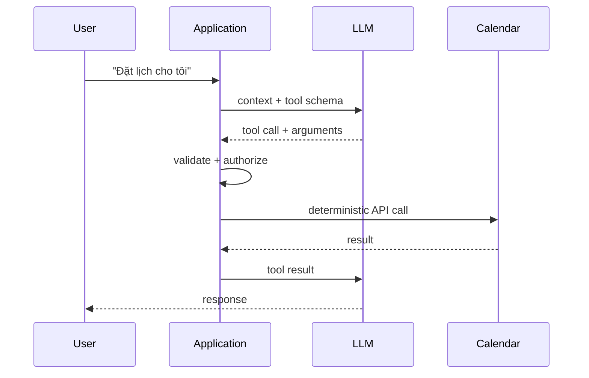

# Daily Knowledge Sharing — 2026-09-21

## Today’s Topics

1. C# async state machine: allocation, `Task` và khi nào `ValueTask` thực sự có ích
2. ASP.NET Core: thiết kế error contract với `ProblemDetails`
3. EF Core: cartesian explosion, `Include` và `AsSplitQuery`
4. Elasticsearch: đồng bộ dữ liệu từ transactional database mà không biến search thành source of truth
5. Architecture: Anti-Corruption Layer cho third-party và legacy integration
6. Azure Blob Storage: SAS, Managed Identity và security boundary cho file access
7. CI/CD: Expand-and-Contract database migration để deploy backward-compatible
8. Production Engineering: điều tra database connection pool exhaustion
9. Optimizely CMS: content modeling, reusable blocks và cache invalidation
10. AI Engineering: Tool Calling và deterministic execution boundary

---

# 1. C# async state machine: allocation, `Task` và khi nào `ValueTask` thực sự có ích

## 1. What is it?

`async`/`await` là cú pháp để viết asynchronous control flow theo dạng tuần tự. Compiler không “biến method thành thread khác”; nó rewrite method thành một state machine có thể tạm dừng tại `await`, lưu state cần thiết và tiếp tục khi operation hoàn tất.

`Task<T>` vừa biểu diễn eventual result vừa là object có thể được await nhiều lần. `ValueTask<T>` là struct có thể biểu diễn result đồng bộ trực tiếp hoặc wrap một asynchronous operation, nhằm tránh một số allocation trong hot path.

## 2. Why does it exist?

Trước `async`/`await`, callback và continuation chain làm control flow, exception propagation và cleanup khó đọc. State machine cho phép giữ mô hình lập trình tuần tự nhưng không block thread trong lúc chờ I/O.

`ValueTask<T>` tồn tại vì một số API hiệu năng cao thường hoàn tất synchronously, ví dụ đọc từ buffer đã có dữ liệu. Nếu mỗi lần đều tạo một `Task<T>`, allocation có thể đáng kể ở hàng triệu operations.

## 3. How does it work?

Nếu awaited operation chưa hoàn tất, state machine lưu vị trí hiện tại và đăng ký continuation. Thread hiện tại được trả về pool. Khi I/O hoàn tất, continuation được schedule và state machine chạy tiếp.

Nếu operation đã hoàn tất, continuation có thể đi fast path mà không cần suspension thực sự. Đây là lý do synchronous completion rate quan trọng khi đánh giá `ValueTask`.

```text
Call async method
   │
   ├─ awaited operation completed? ── yes ──> continue inline/fast path
   │
   └─ no ──> store state ──> return thread ──> continuation ──> resume
```

## 4. Practical implementation

```csharp
public sealed class ProductCache
{
    private readonly ConcurrentDictionary<int, Product> _cache = new();
    private readonly ProductRepository _repository;

    public ProductCache(ProductRepository repository) => _repository = repository;

    public ValueTask<Product?> GetAsync(int id, CancellationToken ct)
    {
        if (_cache.TryGetValue(id, out var product))
            return ValueTask.FromResult<Product?>(product);

        return new ValueTask<Product?>(LoadAsync(id, ct));
    }

    private async Task<Product?> LoadAsync(int id, CancellationToken ct)
    {
        var product = await _repository.GetAsync(id, ct);
        if (product is not null)
            _cache[id] = product;
        return product;
    }
}
```

Chỉ nên làm vậy khi profiling chứng minh allocation của `Task` đáng quan tâm và synchronous completion xảy ra thường xuyên.

## 5. Real production scenario

Một high-throughput gateway đọc metadata từ in-memory cache trong 98% request, còn 2% phải gọi remote store. API cache có thể hưởng lợi từ `ValueTask`. Ngược lại, endpoint luôn gọi SQL qua network gần như luôn asynchronous; đổi hàng loạt `Task` sang `ValueTask` thường chỉ tăng complexity.

## 6. Failure scenario & troubleshooting

**Symptom** → code dùng `ValueTask` nhưng allocation/latency không giảm, thậm chí code khó debug hơn.

**Evidence** → profiler cho thấy phần lớn operation không complete synchronously; bottleneck nằm ở network/database.

**Diagnosis** → tối ưu sai tầng.

**Fix** → quay lại `Task`, tập trung vào I/O, batching hoặc query.

**Verification** → benchmark lại allocation rate, throughput và p99.

## 7. Common mistakes

- Cho rằng `async` tạo thread mới.
- Dùng `Task.Run` cho I/O API vốn đã asynchronous.
- Chọn `ValueTask` chỉ vì nghĩ “value type luôn nhanh hơn”.
- Await/reuse `ValueTask` không đúng contract của producer.
- Tối ưu allocation trước khi đo.

## 8. Alternatives

`Task<T>` là default an toàn và composable hơn. `ValueTask<T>` phù hợp cho library/hot path có synchronous completion cao. Với synchronous logic thuần túy, đừng tạo async abstraction nếu không có asynchronous boundary.

## 9. Trade-offs

### Advantages

- `async`/`await` giúp I/O concurrency mà không giữ blocked thread.
- `ValueTask` có thể giảm allocation ở hot path phù hợp.

### Costs / Risks

- State machine vẫn có overhead.
- `ValueTask` có semantics phức tạp hơn, struct lớn hơn reference và khó compose hơn.
- Micro-optimization có thể che mất bottleneck thật.

## 10. Junior → Middle → Senior → Technical Lead

### Junior

Hiểu `await` không đồng nghĩa tạo thread mới và asynchronous I/O giải phóng thread trong lúc chờ.

### Middle

Viết async end-to-end, propagate `CancellationToken`, tránh sync-over-async.

### Senior

Đọc profiler, hiểu state machine, synchronous completion và allocation trước khi chọn `ValueTask`.

### Technical Lead / Architect

Đặt guideline: `Task` là default; chỉ cho phép abstraction phức tạp hơn khi có measurement và workload chứng minh lợi ích.

## 11. Key takeaway

- `async`/`await` là state-machine transformation, không phải thread creation.
- `ValueTask` là optimization tool, không phải replacement mặc định cho `Task`.
- Tối ưu dựa trên profiling và synchronous completion rate.

---

# 2. ASP.NET Core: thiết kế error contract với `ProblemDetails`

## 1. What is it?

`ProblemDetails` là representation chuẩn cho HTTP API error, giúp client nhận một contract ổn định gồm `type`, `title`, `status`, `detail`, `instance` và extension fields.

Mental model: exception là implementation detail trong server; error response là public API contract.

## 2. Why does it exist?

Nếu mỗi endpoint tự trả `{ message: ... }`, `{ error: ... }` hoặc raw exception, frontend và integration client phải viết nhiều nhánh parsing. Raw exception còn có thể làm lộ stack trace, SQL hoặc internal identifiers.

## 3. How does it work?

Exception/validation failure được chuyển tại một centralized boundary thành HTTP semantics thích hợp. Business conflict có thể thành 409; validation thành 400; resource không tồn tại thành 404; lỗi không dự đoán thành 500 với correlation identifier thay vì stack trace.



## 4. Practical implementation

```csharp
builder.Services.AddProblemDetails();

var app = builder.Build();
app.UseExceptionHandler();

app.MapPost("/orders", async (CreateOrder command, OrderService service, CancellationToken ct) =>
{
    var result = await service.CreateAsync(command, ct);

    return result switch
    {
        CreateOrderResult.Success s => Results.Created($"/orders/{s.Id}", s),
        CreateOrderResult.Duplicate => Results.Conflict(new ProblemDetails
        {
            Title = "Order already exists",
            Status = StatusCodes.Status409Conflict,
            Type = "https://errors.example.com/order-duplicate"
        }),
        _ => Results.Problem(statusCode: 500)
    };
});
```

Production system nên chuẩn hóa stable machine-readable error code trong extension thay vì buộc client parse `detail`.

## 5. Real production scenario

Mobile app gọi checkout API. UI cần phân biệt validation error, inventory conflict và temporary dependency failure để quyết định hiển thị field error, yêu cầu refresh hay cho retry. Stable error contract giúp client không phụ thuộc text tiếng Anh từ server.

## 6. Failure scenario & troubleshooting

**Symptom** → frontend sau deployment bắt đầu coi mọi lỗi là “unknown”.

**Evidence** → response 409 mới có shape khác 400 cũ; client parse field `errorCode` không tồn tại.

**Diagnosis** → error contract thay đổi breaking nhưng OpenAPI/contract test không phát hiện.

**Fix** → chuẩn hóa ProblemDetails extensions và compatibility policy.

**Verification** → contract tests cho các error path chính.

## 7. Common mistakes

- Trả `exception.Message` trực tiếp cho client.
- Dùng HTTP 200 với `{ success:false }` cho mọi failure.
- Dùng 500 cho validation/business conflict.
- Để client parse human-readable `detail`.
- Không gắn trace/correlation ID để support điều tra.

## 8. Alternatives

Custom envelope có thể hợp với legacy ecosystem nhưng phải duy trì schema riêng. gRPC dùng status/trailers khác HTTP JSON API. Với REST/HTTP API, `ProblemDetails` giảm bespoke convention.

## 9. Trade-offs

### Advantages

- Error contract nhất quán.
- Dễ document, test và correlate.
- Giảm leak internal detail.

### Costs / Risks

- Cần taxonomy error rõ ràng.
- Mapping quá chi tiết có thể coupling domain với transport.
- Stable error codes trở thành compatibility surface phải duy trì.

## 10. Junior → Middle → Senior → Technical Lead

### Junior

Phân biệt exception trong code và HTTP error trả cho client.

### Middle

Map validation/not-found/conflict đúng status code và dùng centralized handling.

### Senior

Thiết kế stable error code, security-safe detail, telemetry correlation và contract tests.

### Technical Lead / Architect

Định nghĩa organization-wide error contract và backward-compatibility rules thay vì để từng API tự phát minh format.

## 11. Key takeaway

- Error response là API contract.
- `ProblemDetails` chuẩn hóa transport nhưng taxonomy lỗi vẫn cần engineering judgment.
- Không expose exception internals cho client.

---

# 3. EF Core: cartesian explosion, `Include` và `AsSplitQuery`

## 1. What is it?

Khi eager-load nhiều collection bằng `Include`, một SQL query có thể tạo cartesian multiplication: mỗi combination của child rows tạo một result row. `AsSplitQuery()` cho phép EF Core tách graph load thành nhiều SQL queries để giảm row duplication.

## 2. Why does it exist?

Một query duy nhất nghe có vẻ tối ưu vì ít round trip, nhưng join nhiều one-to-many collection có thể truyền lượng dữ liệu lớn hơn rất nhiều so với object graph thực tế.

## 3. How does it work?

Ví dụ một `Order` có 20 `Items` và 10 `Notes`. Join cả hai collection có thể tạo 200 rows cho một order. EF Core phải materialize/deduplicate entity từ result set đó.

Split query lấy root rồi từng collection riêng, đổi network round trips lấy result-set nhỏ hơn.

## 4. Practical implementation

```csharp
var order = await db.Orders
    .AsNoTracking()
    .Include(x => x.Items)
    .Include(x => x.Notes)
    .AsSplitQuery()
    .SingleAsync(x => x.Id == orderId, ct);
```

Nếu API chỉ cần summary, projection thường tốt hơn cả `Include` lẫn split query:

```csharp
var dto = await db.Orders
    .Where(x => x.Id == orderId)
    .Select(x => new OrderSummary(x.Id, x.Number, x.Items.Count, x.Total))
    .SingleAsync(ct);
```

## 5. Real production scenario

Order detail API load items, promotions, shipments và audit notes. Sau khi thêm một collection mới, SQL time tăng nhẹ nhưng response bytes từ DB tăng hàng chục lần và application allocation tăng mạnh.

## 6. Failure scenario & troubleshooting

**Symptom** → p95 tăng, memory allocation tăng sau khi thêm `Include`.

**Evidence** → generated SQL có nhiều sibling joins; actual row count lớn hơn số entity rất nhiều.

**Hypothesis** → cartesian explosion.

**Fix** → projection hoặc split query tùy read shape.

**Verification** → so sánh logical reads, transferred rows, allocations và end-to-end latency.

## 7. Common mistakes

- Dùng `Include` như default cho mọi navigation.
- Chỉ đếm số query mà bỏ qua số rows/bytes.
- Chọn `AsSplitQuery` toàn cục mà không xét consistency/round trips.
- Materialize full graph rồi mới map DTO.

## 8. Alternatives

Projection là lựa chọn tốt nhất cho read model cụ thể. Explicit loading phù hợp khi child chỉ cần trong một nhánh. Raw SQL/Dapper hữu ích cho read query đặc biệt nhưng tăng manual mapping.

## 9. Trade-offs

### Advantages

`AsSplitQuery` giảm duplication và memory pressure với graph lớn.

### Costs / Risks

Nhiều round trips hơn; dữ liệu giữa các query có thể thay đổi nếu không có transaction/isolation phù hợp; latency network cao có thể làm split query tệ hơn.

## 10. Junior → Middle → Senior → Technical Lead

### Junior

Hiểu `Include` tạo SQL join và không miễn phí.

### Middle

Biết xem generated SQL, projection và `AsSplitQuery`.

### Senior

Đo row amplification, round trips, consistency và allocation.

### Technical Lead / Architect

Thiết kế read model/API shape để tránh persistence graph trở thành public contract.

## 11. Key takeaway

- Ít query không đồng nghĩa ít work.
- Projection thường là tối ưu rõ ràng nhất cho API read model.
- `AsSplitQuery` là trade-off giữa row explosion và round trips/consistency.

---

# 4. Elasticsearch: đồng bộ dữ liệu từ transactional database mà không biến search thành source of truth

## 1. What is it?

Elasticsearch là search engine tối ưu cho full-text retrieval, filtering và aggregation. Trong enterprise application, transactional database thường giữ authoritative state; Elasticsearch giữ một search projection có thể rebuild.

## 2. Why does it exist?

SQL có thể search text cơ bản nhưng relevance scoring, analyzers, tokenization, typo-oriented search và large-scale faceting cần cấu trúc inverted index chuyên dụng. Đổi lại, search index thường eventual-consistent với source database.

## 3. How does it work?



Business transaction ghi database và outbox atomically. Worker publish/index document. Nếu Elasticsearch lỗi, outbox còn message để retry.

## 4. Practical implementation

```csharp
public async Task Handle(ProductChanged message, CancellationToken ct)
{
    var product = await repository.GetSearchProjectionAsync(message.ProductId, ct);

    await elasticClient.IndexAsync(product, x => x
        .Index("products-v3")
        .Id(product.Id), ct);
}
```

Indexer phải idempotent; cùng event chạy lại không được làm hỏng document.

## 5. Real production scenario

E-commerce admin cập nhật tên sản phẩm trong SQL. Product detail đọc SQL thấy dữ liệu mới ngay, nhưng search result có thể cũ vài giây. Đây là consistency model cần được product/business chấp nhận và đo bằng indexing lag.

## 6. Failure scenario & troubleshooting

**Symptom** → sản phẩm tồn tại nhưng không xuất hiện trong search.

**Evidence** → SQL row đúng; outbox backlog tăng; Elasticsearch bulk requests trả 429.

**Diagnosis** → indexing throughput không theo kịp write rate.

**Fix** → bounded retry/backoff, bulk sizing, capacity/index tuning.

**Verification** → backlog age giảm về SLO và reconciliation job không còn missing IDs.

## 7. Common mistakes

- Dual-write SQL rồi Elasticsearch trực tiếp trong request mà không có recovery path.
- Coi Elasticsearch là transactional source of truth.
- Retry vô hạn gây overload nặng hơn.
- Không version mapping/index alias khi reindex.
- Không đo indexing lag.

## 8. Alternatives

Database full-text search có thể đủ cho scope nhỏ. Managed search service giảm vận hành. CDC thay outbox polling khi scale lớn nhưng hạ tầng phức tạp hơn.

## 9. Trade-offs

### Advantages

Search quality và query capability mạnh, read workload tách khỏi OLTP.

### Costs / Risks

Eventual consistency, thêm cluster cần vận hành, schema/mapping migration, replay/reconciliation và cost.

## 10. Junior → Middle → Senior → Technical Lead

### Junior

Hiểu search index là projection, không nhất thiết là dữ liệu gốc.

### Middle

Implement indexing và query với mapping/analyzer đúng.

### Senior

Thiết kế retry, idempotency, reindex, lag monitoring và reconciliation.

### Technical Lead / Architect

Quyết định search engine có thật sự cần thiết, consistency SLO là gì và ai sở hữu pipeline đồng bộ.

## 11. Key takeaway

- Transactional DB và search index có trách nhiệm khác nhau.
- Đồng bộ phải có recovery path.
- Indexing lag là production signal cần đo.

---

# 5. Architecture: Anti-Corruption Layer cho third-party và legacy integration

## 1. What is it?

Anti-Corruption Layer (ACL) là boundary chuyển đổi model/protocol của hệ thống bên ngoài sang model nội bộ, ngăn external semantics lan vào domain/application code.

## 2. Why does it exist?

Nếu toàn codebase dùng trực tiếp `LegacyCustomerDto`, vendor status codes và vendor exceptions, thay provider hoặc nâng API sẽ tạo blast radius lớn. ACL cô lập sự thay đổi và dịch semantics tại một chỗ.

## 3. How does it work?

```text
Application → CustomerVerificationPort → VendorAdapter → External API
                                      ↑
                         mapping / retry / protocol
```

Application phụ thuộc vào capability nội bộ (`VerifyCustomerAsync`) thay vì SDK cụ thể.

## 4. Practical implementation

```csharp
public interface ICustomerVerification
{
    Task<VerificationResult> VerifyAsync(CustomerIdentity identity, CancellationToken ct);
}

public sealed class VendorVerificationAdapter : ICustomerVerification
{
    private readonly VendorClient _client;

    public async Task<VerificationResult> VerifyAsync(CustomerIdentity identity, CancellationToken ct)
    {
        var response = await _client.CheckAsync(identity.ExternalNumber, ct);
        return response.Code switch
        {
            "OK" => VerificationResult.Verified,
            "NF" => VerificationResult.NotFound,
            _ => VerificationResult.Unavailable
        };
    }
}
```

## 5. Real production scenario

CRM mới phải tích hợp ERP cũ dùng customer code, SOAP và status numeric. Domain mới dùng `CustomerId` và business states khác. ACL giữ mapping SOAP/status trong infrastructure thay vì để chúng xuất hiện trong use cases.

## 6. Failure scenario & troubleshooting

**Symptom** → vendor thêm status mới, application coi nó là success do default mapping sai.

**Evidence** → telemetry thấy unknown external code nhưng adapter silently maps về success.

**Diagnosis** → translation boundary fail-open.

**Fix** → explicit exhaustive mapping, unknown state fail-safe, metrics cho unmapped values.

**Verification** → contract tests với captured provider responses.

## 7. Common mistakes

- Tạo interface nhưng vẫn expose vendor DTO qua interface.
- Copy toàn bộ vendor model thành internal model 1:1 mà không dịch semantics.
- Đưa retry/authentication logic vào domain service.
- Over-abstract một API ổn định chỉ có một call đơn giản.

## 8. Alternatives

Direct integration đơn giản hơn cho low-risk dependency. Gateway/integration service riêng phù hợp khi nhiều applications chia sẻ cùng provider. ACL có thể nằm trong modular monolith hoặc service riêng tùy ownership/deployment need.

## 9. Trade-offs

### Advantages

Giảm coupling, dễ test, đổi vendor và kiểm soát failure semantics.

### Costs / Risks

Thêm mapping code, abstraction và nguy cơ tạo “generic integration framework” quá mức.

## 10. Junior → Middle → Senior → Technical Lead

### Junior

Hiểu không nên để external DTO trở thành domain model.

### Middle

Implement adapter và mapping có test.

### Senior

Thiết kế timeout, retry, error translation, observability và contract tests.

### Technical Lead / Architect

Quyết định boundary nằm ở đâu, dependency nào đáng cô lập và khi nào direct integration đơn giản hơn.

## 11. Key takeaway

- ACL bảo vệ semantics, không chỉ giấu SDK sau interface.
- Unknown external behavior phải observable và fail theo policy rõ ràng.
- Chỉ thêm boundary khi blast radius/risk biện minh cho complexity.

---

# 6. Azure Blob Storage: SAS, Managed Identity và security boundary cho file access

## 1. What is it?

Azure Blob Storage lưu object/file. Backend có thể truy cập bằng Managed Identity; client có thể được cấp SAS giới hạn quyền và thời gian để upload/download trực tiếp mà không đi qua application server.

## 2. Why does it exist?

Proxy file lớn qua API làm application tốn bandwidth, memory/socket và scale cost. Nhưng public container lại mở dữ liệu quá mức. SAS tạo delegated access có scope và expiry.

## 3. How does it work?



Backend nên dùng Managed Identity với RBAC thay vì storage account key khi có thể.

## 4. Practical implementation

```csharp
var serviceClient = new BlobServiceClient(
    new Uri(storageUri),
    new DefaultAzureCredential());

var container = serviceClient.GetBlobContainerClient("documents");
var blob = container.GetBlobClient(blobName);

await blob.UploadAsync(stream, overwrite: false, cancellationToken: ct);
```

Nếu cấp user delegation SAS, backend phải authorize business ownership trước khi tạo SAS và giới hạn permission/path/expiry.

## 5. Real production scenario

Employee portal upload payslip attachment 200 MB. API xác thực employee, tạo upload intent và short-lived SAS; browser upload trực tiếp Blob Storage. Worker sau đó scan/process file.

## 6. Failure scenario & troubleshooting

**Symptom** → upload production trả 403 nhưng local dùng connection string chạy được.

**Evidence** → Managed Identity token được cấp nhưng role assignment thiếu `Storage Blob Data Contributor` tại đúng scope.

**Diagnosis** → identity tồn tại nhưng authorization trên data plane chưa đủ.

**Fix** → cấp least-privilege RBAC đúng container/storage scope.

**Verification** → test bằng identity production/staging tương đương, không fallback account key.

## 7. Common mistakes

- Lưu account key trong config lâu dài.
- SAS expiry quá dài hoặc permission quá rộng.
- Dùng blob name từ client mà không validate namespace/ownership.
- Cho upload xong là trusted content, bỏ malware/content-type validation.
- Log full SAS URL làm leak credential.

## 8. Alternatives

Proxy upload qua API đơn giản cho file nhỏ và validation synchronous. Private Endpoint giải quyết network exposure nhưng không thay authorization. CDN phù hợp public/static delivery, không thay access-control model.

## 9. Trade-offs

### Advantages

Direct-to-Blob giảm application bandwidth và scale tốt; Managed Identity loại secret tĩnh.

### Costs / Risks

SAS lifecycle, CORS, client workflow và asynchronous validation phức tạp hơn; private networking tăng operational cost.

## 10. Junior → Middle → Senior → Technical Lead

### Junior

Hiểu container/blob và SAS là delegated credential có expiry.

### Middle

Implement upload/download an toàn, Managed Identity và cancellation.

### Senior

Thiết kế RBAC, SAS scope, malware pipeline, retry và observability.

### Technical Lead / Architect

Quyết định data path, network boundary, retention/lifecycle và compliance ownership.

## 11. Key takeaway

- Managed Identity cho service-to-storage; SAS cho delegated client access có giới hạn.
- Authorization business phải xảy ra trước khi cấp SAS.
- File upload là security workflow, không chỉ storage operation.

---

# 7. CI/CD: Expand-and-Contract database migration để deploy backward-compatible

## 1. What is it?

Expand-and-Contract là chiến lược thay schema qua nhiều deployment: trước tiên thêm schema mới theo cách backward-compatible, sau đó chuyển application sang schema mới, cuối cùng xóa schema cũ khi không còn consumer.

## 2. Why does it exist?

Trong rolling/slot deployment, old và new application version có thể chạy đồng thời. Migration kiểu rename/drop column ngay lập tức có thể làm version cũ crash trong lúc rollout hoặc rollback.

## 3. How does it work?

```text
Release A: ADD NewColumn (old code vẫn chạy)
Release B: code đọc/ghi NewColumn, migrate/backfill data
Release C: ngừng dùng OldColumn
Release D: DROP OldColumn
```

Schema evolution trở thành protocol compatibility giữa nhiều application versions.

## 4. Practical implementation

Thay vì rename `Name` thành `DisplayName` trong một bước:

```sql
ALTER TABLE Customers ADD DisplayName nvarchar(200) NULL;
```

Deploy code có thể dual-read/dual-write trong giai đoạn chuyển đổi, backfill theo batch, sau đó enforce constraint và cuối cùng drop cột cũ ở release riêng.

## 5. Real production scenario

App Service dùng deployment slot. Version mới warm-up trong staging slot trong khi production version cũ vẫn nhận traffic. Database là shared resource; migration destructive trước swap làm old version lỗi dù deployment mới chưa live.

## 6. Failure scenario & troubleshooting

**Symptom** → deployment mới rollback thành công nhưng app cũ vẫn 500.

**Evidence** → migration đã drop column mà old binary vẫn query.

**Diagnosis** → application rollback không đồng nghĩa database rollback.

**Fix** → restore schema/data hoặc hotfix; về lâu dài dùng expand-contract.

**Verification** → compatibility test chạy old và new binaries trên expanded schema trước production.

## 7. Common mistakes

- Gắn destructive migration vào startup của mọi instance.
- Assume deploy là atomic.
- Backfill hàng triệu rows trong một transaction.
- Add non-null column với expensive default trên bảng lớn mà không đánh giá lock/rewrite.
- Không có rollback plan.

## 8. Alternatives

Maintenance window phù hợp hệ thống nhỏ chấp nhận downtime. Blue-Green với database riêng giảm shared-schema coupling nhưng data synchronization phức tạp hơn. Feature flag hỗ trợ chuyển behavior nhưng không tự giải quyết incompatible schema.

## 9. Trade-offs

### Advantages

Rollback an toàn hơn, hỗ trợ rolling deployment và giảm downtime.

### Costs / Risks

Nhiều release hơn, temporary duplication, backfill logic và cleanup discipline.

## 10. Junior → Middle → Senior → Technical Lead

### Junior

Hiểu migration có thể ảnh hưởng binary đang chạy.

### Middle

Viết migration backward-compatible và test upgrade.

### Senior

Đánh giá lock, data volume, backfill, rollback và mixed-version window.

### Technical Lead / Architect

Thiết kế release protocol cho app + DB như một hệ thống, không coi migration là file phụ của ORM.

## 11. Key takeaway

- Database là shared compatibility boundary trong deployment.
- Destructive change nên đến sau khi mọi consumer đã rời schema cũ.
- Rollback application chỉ an toàn nếu schema vẫn backward-compatible.

---

# 8. Production Engineering: điều tra database connection pool exhaustion

## 1. What is it?

Connection pooling giữ các physical database connections để request tái sử dụng thay vì mở TCP/TLS/login mới mỗi lần. Pool exhaustion xảy ra khi không còn connection khả dụng trước timeout.

## 2. Why does it exist?

Mở database connection vật lý đắt. Pooling tăng throughput, nhưng tạo một capacity boundary. Nếu query giữ connection lâu, transaction bị treo hoặc concurrency tăng đột biến, pool trở thành queue.

## 3. How does it work?

```text
Request → OpenAsync → pool
                   ├─ idle connection → cấp ngay
                   └─ no idle connection → wait → timeout
```

Điểm quan trọng: `OpenAsync` có thể chậm không phải vì network connect chậm mà vì đang chờ pool slot.

## 4. Practical implementation

Đảm bảo lifetime rõ ràng:

```csharp
await using var connection = new SqlConnection(connectionString);
await connection.OpenAsync(ct);

await using var command = connection.CreateCommand();
command.CommandText = "SELECT Id, Status FROM Orders WHERE Id = @id";
command.Parameters.AddWithValue("@id", orderId);

await using var reader = await command.ExecuteReaderAsync(ct);
```

Với EF Core, scoped `DbContext` và dispose đúng request thường quản lý connection tốt; vấn đề thường là query/transaction giữ connection quá lâu hơn là “quên Close” đơn giản.

## 5. Real production scenario

Sau campaign, request rate tăng 4×. Một external HTTP call vô tình nằm bên trong database transaction. Mỗi request giữ SQL connection trong lúc chờ remote API 3 giây; pool nhanh chóng hết và cả endpoint không liên quan cũng timeout.

## 6. Failure scenario & troubleshooting

**Symptom** → lỗi timeout lấy connection, API p99 tăng mạnh.

**Evidence** → DB CPU chưa cao nhưng active connections sát pool limit; transaction duration tăng; traces cho thấy external call nằm giữa transaction.

**Hypothesis** → connection retention, không phải DB compute saturation.

**Fix** → rút ngắn transaction boundary, đưa remote I/O ra ngoài transaction, tối ưu slow query và giới hạn concurrency nếu cần.

**Verification** → connection wait time giảm, transaction duration giảm, p95/p99 phục hồi dưới load test.

## 7. Common mistakes

- Tăng `Max Pool Size` ngay mà không tìm nguyên nhân.
- Giữ transaction qua HTTP call.
- Stream result rất lâu trong khi giữ reader/connection.
- Không propagate cancellation.
- Nhầm pool exhaustion với database CPU saturation.

## 8. Alternatives

Tăng pool size chỉ hợp lý khi DB có capacity và workload cần concurrency cao hơn. Queue/bulkhead có thể bảo vệ DB. Read replica giảm một số read pressure nhưng không sửa connection leak/retention.

## 9. Trade-offs

### Advantages

Pooling giảm connection setup cost và tăng throughput.

### Costs / Risks

Pool là finite resource; tăng quá lớn có thể chuyển bottleneck sang database và làm overload nặng hơn.

## 10. Junior → Middle → Senior → Technical Lead

### Junior

Dispose connection/context và hiểu pool tái sử dụng physical connection.

### Middle

Đo query/transaction duration và đọc timeout evidence.

### Senior

Correlate traces, pool metrics, DB waits và workload concurrency.

### Technical Lead / Architect

Đặt capacity/bulkhead strategy, transaction boundary và load-test model phù hợp database limits.

## 11. Key takeaway

- Pool exhaustion thường là triệu chứng của connection retention hoặc concurrency mismatch.
- Đừng tăng pool size trước khi tìm bottleneck.
- Transaction boundary trực tiếp ảnh hưởng connection capacity.

---

# 9. Optimizely CMS: content modeling, reusable blocks và cache invalidation

## 1. What is it?

Trong Optimizely CMS, page types và blocks mô hình hóa nội dung mà editor quản lý. Content model tốt phản ánh editorial intent và reuse boundary, không đơn thuần mirror HTML component tree.

## 2. Why does it exist?

Nếu mỗi trang là một blob HTML hoặc hàng chục field presentation-specific, editor khó tái sử dụng nội dung, developer khó evolve UI và search/personalization khó hiểu semantics. Structured content tách content intent khỏi rendering.

## 3. How does it work?

Editor tạo content instance dựa trên content type. Application resolve content, render page/block và có thể cache output/data. Khi content publish, cache phụ thuộc phải được invalidated để visitor không thấy stale version.

```text
Editor → Content Repository → Publish
                         │
                         ├─ invalidation → application/cache
                         └─ indexing → search
Visitor → CDN/App → CMS content → rendering
```

## 4. Practical implementation

```csharp
[ContentType(DisplayName = "Promo Block", GUID = "11111111-2222-3333-4444-555555555555")]
public class PromoBlock : BlockData
{
    [CultureSpecific]
    public virtual string Heading { get; set; } = string.Empty;

    [CultureSpecific]
    public virtual XhtmlString? Body { get; set; }

    public virtual ContentReference? Image { get; set; }
}
```

Model nên diễn đạt “Promo” thay vì các field như `LeftColumnRedText`, vì layout có thể thay đổi mà editorial concept vẫn giữ nguyên.

## 5. Real production scenario

Marketing site có hero/promo được reuse trên nhiều landing pages. Editor publish thay đổi nhưng một tầng output cache/CDN còn TTL 30 phút. CMS đã đúng nhưng visitor thấy content cũ.

## 6. Failure scenario & troubleshooting

**Symptom** → editor thấy bản mới trong preview, production visitor thấy bản cũ.

**Evidence** → content version published đúng; origin trả mới khi bypass cache; CDN trả response cũ.

**Diagnosis** → invalidation boundary không đi xuyên toàn cache chain.

**Fix** → thiết kế cache tags/purge/versioned key và cache headers đúng ownership.

**Verification** → publish test content và trace response qua browser → CDN → app → CMS.

## 7. Common mistakes

- Content model mirror pixel/layout hiện tại.
- Tạo block quá generic với hàng chục optional fields.
- Cache theo URL nhưng bỏ qua language/variant/personalization dimension.
- Purge toàn site cho mọi content change.
- Coupling CMS model trực tiếp với external product transactional data.

## 8. Alternatives

Headless CMS tách delivery API và frontend mạnh hơn nhưng thêm integration/cache complexity. Traditional rendering đơn giản cho site server-rendered. Static generation phù hợp content ít thay đổi nhưng publish pipeline khác.

## 9. Trade-offs

### Advantages

Structured content tăng reuse, editor experience và khả năng evolve presentation.

### Costs / Risks

Content migration, cache invalidation, versioning và editorial governance trở thành concerns thực sự.

## 10. Junior → Middle → Senior → Technical Lead

### Junior

Hiểu page/block là content model, không chỉ UI component.

### Middle

Tạo content type, rendering và validation hợp lý.

### Senior

Thiết kế reuse, language/version, caching, search indexing và upgrade compatibility.

### Technical Lead / Architect

Quyết định content ownership giữa CMS, commerce/product systems và frontend; tránh biến CMS thành database cho mọi domain.

## 11. Key takeaway

- Model editorial intent, không model pixel layout.
- Cache invalidation phải xét toàn đường đi từ CMS tới CDN/browser.
- CMS nên sở hữu content, không mặc định sở hữu transactional domain data.

---

# 10. AI Engineering: Tool Calling và deterministic execution boundary

## 1. What is it?

Tool Calling cho phép LLM chọn một tool/function và sinh structured arguments; application mới là thành phần validate arguments, authorize và thực thi side effect. Model đề xuất hành động, không trực tiếp trở thành trusted execution engine.

## 2. Why does it exist?

LLM giỏi diễn giải natural language nhưng output probabilistic. Business system cần deterministic validation, authorization, idempotency và audit. Tool boundary kết nối hai thế giới mà không giao toàn quyền cho model.

## 3. How does it work?



## 4. Practical implementation

Application-side validation phải độc lập với model:

```csharp
public async Task<ToolResult> ExecuteAsync(CreateRefundArgs args, UserContext user, CancellationToken ct)
{
    if (!user.CanRefund(args.OrderId))
        return ToolResult.Forbidden();

    if (args.Amount <= 0)
        return ToolResult.Invalid("Amount must be positive");

    var order = await orders.GetAsync(args.OrderId, ct);
    if (args.Amount > order.RefundableAmount)
        return ToolResult.Invalid("Amount exceeds refundable balance");

    return await refunds.CreateIdempotentlyAsync(args, ct);
}
```

LLM không được là nơi duy nhất kiểm tra refund limit.

## 5. Real production scenario

Support agent cho phép nhân viên hỏi bằng tiếng Việt: “Hoàn 200k cho order X vì giao thiếu”. Model extract intent và arguments. Backend vẫn kiểm tra employee permission, order state, refundable amount và idempotency key trước khi gọi payment provider.

## 6. Failure scenario & troubleshooting

**Symptom** → model gọi tool đúng schema nhưng chọn sai order ID từ context.

**Evidence** → tool trace cho thấy argument syntactically valid nhưng không thuộc customer hiện tại.

**Diagnosis** → schema validation được dùng thay authorization/business validation.

**Fix** → scope resource server-side theo authenticated principal, yêu cầu confirmation cho high-impact action và không tin identifier chỉ vì model sinh đúng format.

**Verification** → adversarial/evaluation cases với cross-tenant IDs, prompt injection và ambiguous requests.

## 7. Common mistakes

- Coi Structured Output là bằng chứng dữ liệu đúng.
- Cho model quyết định authorization.
- Tool có quyền quá rộng.
- Không có idempotency cho side-effect tool.
- Đưa secret/tool credential vào prompt.
- Không log tool decision/result theo cách an toàn để audit.

## 8. Alternatives

Deterministic UI/form tốt hơn khi intent đã rõ và correctness quan trọng hơn natural-language flexibility. Workflow engine phù hợp process cố định. RAG chỉ cung cấp context, không thay tool execution.

## 9. Trade-offs

### Advantages

Natural-language orchestration linh hoạt, giảm glue UI cho nhiều capability và tận dụng reasoning để chọn tool.

### Costs / Risks

Non-determinism, token/latency cost, prompt injection, evaluation burden và security boundary phức tạp hơn.

## 10. Junior → Middle → Senior → Technical Lead

### Junior

Hiểu model sinh đề xuất/arguments; application thực thi.

### Middle

Implement schema, validation, timeout và error handling.

### Senior

Thiết kế authorization, idempotency, confirmation, observability, evals và prompt-injection defenses.

### Technical Lead / Architect

Quyết định action nào được agentic, action nào phải deterministic/manual approval; giới hạn blast radius của mỗi tool và ownership của audit/security.

## 11. Key takeaway

- Structured arguments không đồng nghĩa trusted arguments.
- Authorization và business invariants phải deterministic ở application boundary.
- Tool design nên tối thiểu quyền và blast radius.
