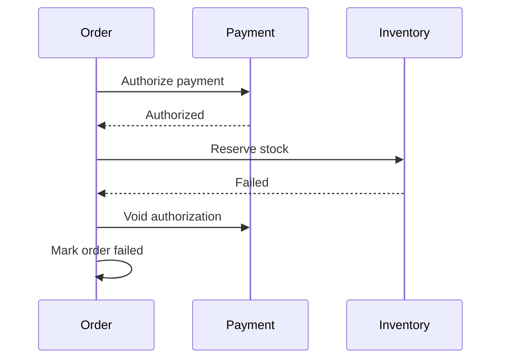

# Daily Knowledge Sharing — 2026-09-22

## Today’s Topics

1. CancellationToken propagation: cancellation là control flow xuyên suốt, không phải optional parameter
2. ASP.NET Core Rate Limiting: bảo vệ capacity thay vì chỉ “chặn request nhiều”
3. SQL keyset pagination: ổn định latency khi dataset lớn
4. Cosmos DB partition key: quyết định data distribution trước khi quyết định query
5. Distributed Systems: Saga và compensating transaction khi không có distributed ACID transaction
6. Azure Front Door và Private Endpoint: tách public ingress khỏi private origin
7. Deployment Slots: zero/low-downtime deployment và hidden state khi swap
8. Tail latency: vì sao p95/p99 quan trọng hơn average trong production
9. Playwright E2E: test user journey mà không biến suite thành flaky bottleneck
10. Vue/TypeScript API concurrency: stale response, AbortController và race condition phía browser

---

# 1. CancellationToken propagation: cancellation là control flow xuyên suốt, không phải optional parameter

## 1. What is it?

`CancellationToken` là cơ chế cooperative cancellation của .NET. Mental model quan trọng: cancellation không “kill” một thread hay cưỡng ép method dừng; caller phát tín hiệu rằng kết quả không còn cần thiết, còn từng layer phải chủ động quan sát và truyền tín hiệu đó xuống dependency.

Trong backend, token thường bắt đầu từ `HttpContext.RequestAborted`, đi qua application service, EF Core, `HttpClient`, queue/client SDK hoặc operation I/O khác.

## 2. Why does it exist?

Nếu client đóng connection nhưng server vẫn query database 20 giây, gọi ba external APIs rồi serialize response, toàn bộ công việc đó trở thành wasted work. Khi traffic cao, wasted work giữ connection, ThreadPool work item, memory và downstream capacity dù không còn ai nhận kết quả.

Cancellation tồn tại để lifetime của công việc phản ánh lifetime của nhu cầu tạo ra công việc đó.

## 3. How does it work?

`CancellationTokenSource.Cancel()` chuyển token sang trạng thái cancellation requested và chạy callbacks đã đăng ký. API hỗ trợ token thường kiểm tra trạng thái hoặc đăng ký callback để hủy I/O. `ThrowIfCancellationRequested()` ném `OperationCanceledException` gắn với token.

```text
HTTP disconnect
    │
RequestAborted
    ▼
Endpoint → Application → EF Core / HttpClient
                         │
                         └─ cancel pending I/O
```

Cancellation chỉ hiệu quả nếu chain không bị đứt.

## 4. Practical implementation

```csharp
app.MapGet("/orders/{id:guid}", async (
    Guid id,
    OrderDbContext db,
    HttpClient client,
    CancellationToken ct) =>
{
    var order = await db.Orders
        .AsNoTracking()
        .SingleOrDefaultAsync(x => x.Id == id, ct);

    if (order is null) return Results.NotFound();

    using var response = await client.GetAsync(
        $"inventory/{order.ProductId}", ct);

    response.EnsureSuccessStatusCode();
    return Results.Ok(order);
});
```

Application methods cũng nên nhận `CancellationToken` và forward token hiện có thay vì tạo token mới tùy tiện.

## 5. Real production scenario

Một search API fan-out tới SQL và external pricing API. User đổi filter liên tục trên UI, request cũ bị browser abort. Nếu cancellation được propagate, SQL command và HTTP call cũ có thể kết thúc sớm, giảm load đúng lúc traffic tăng.

## 6. Failure scenario & troubleshooting

**Symptom** → client timeout sau 5 giây nhưng database vẫn có query chạy 30 giây.

**Evidence** → request telemetry kết thúc sớm nhưng SQL dependency telemetry tiếp tục; connection pool tăng usage.

**Hypothesis** → token bị bỏ tại repository/service boundary.

**Diagnosis** → trace call chain, tìm `ToListAsync()`/`SendAsync()` không nhận token hoặc code dùng `CancellationToken.None`.

**Fix** → propagate token tới I/O boundary; phân biệt timeout policy với user cancellation.

**Verification** → abort request trong load test và xác nhận dependency duration giảm tương ứng.

## 7. Common mistakes

Thêm token ở controller nhưng không forward; catch `OperationCanceledException` rồi log Error; tạo `new CancellationTokenSource()` làm mất parent cancellation; dùng cancellation cho critical side effect đã bắt đầu mà không suy nghĩ transaction boundary; giả định cancellation đồng nghĩa rollback mọi thứ.

## 8. Alternatives

Timeout giới hạn thời gian operation; cancellation biểu diễn caller không còn cần operation. Hai cơ chế bổ sung nhau. `CancellationTokenSource.CreateLinkedTokenSource` hữu ích khi operation phải dừng nếu request bị hủy **hoặc** internal timeout hết hạn.

## 9. Trade-offs

### Advantages

Giảm wasted work, giải phóng downstream capacity sớm, hỗ trợ graceful shutdown và làm lifetime rõ ràng.

### Costs / Risks

Propagation làm API signatures dài hơn; cancellation giữa multi-step side effects có thể tạo partial state nếu transaction/idempotency không được thiết kế đúng.

## 10. Junior → Middle → Senior → Technical Lead

### Junior

Hiểu cancellation là cooperative signal, không phải thread termination.

### Middle

Propagate token qua ASP.NET Core, EF Core, `HttpClient`, background work và test cancellation path.

### Senior

Phân biệt request cancellation, timeout, shutdown và business cancellation; biết operation nào có thể dừng an toàn.

### Technical Lead / Architect

Xác định cancellation boundary, timeout budget và side-effect semantics xuyên service chain; tránh để một request đã chết tiếp tục tiêu thụ capacity toàn hệ thống.

## 11. Key takeaway

- Cancellation chỉ có giá trị khi được propagate tới I/O boundary.
- Timeout và cancellation giải quyết hai tín hiệu khác nhau.
- Không hủy mù quáng operation có side effect; phải xét consistency boundary.

---

# 2. ASP.NET Core Rate Limiting: bảo vệ capacity thay vì chỉ “chặn request nhiều”

## 1. What is it?

Rate limiting là admission control: quyết định request nào được phép tiêu thụ capacity tại một thời điểm. ASP.NET Core cung cấp Rate Limiting middleware với các thuật toán như fixed window, sliding window, token bucket và concurrency limiter.

Mental model đúng không phải “anti-spam”, mà là bảo vệ tài nguyên hữu hạn: CPU, DB connections, external API quota hoặc expensive endpoint.

## 2. Why does it exist?

Một hệ thống có thể healthy ở 500 requests/s nhưng collapse ở 2.000 requests/s vì queue tăng, timeout kéo dài và retry tạo thêm load. Nếu nhận mọi request cho tới khi resource cạn, failure lan rộng. Rate limiting từ chối có kiểm soát để giữ phần còn lại của hệ thống usable.

## 3. How does it work?

Limiter partition request theo key như user, tenant, API key hoặc IP. Mỗi partition có policy về permit và queue. Khi không còn permit, request có thể chờ giới hạn hoặc nhận `429 Too Many Requests`.

```text
Client → Rate Limiter → Endpoint → DB
            │
            └─ reject 429 khi capacity budget hết
```

Concurrency limiter đặc biệt hữu ích cho expensive operation vì giới hạn số request đang chạy, không chỉ số request theo thời gian.

## 4. Practical implementation

```csharp
builder.Services.AddRateLimiter(options =>
{
    options.AddConcurrencyLimiter("report", limiter =>
    {
        limiter.PermitLimit = 20;
        limiter.QueueLimit = 40;
        limiter.QueueProcessingOrder = QueueProcessingOrder.OldestFirst;
    });

    options.OnRejected = async (context, ct) =>
    {
        context.HttpContext.Response.StatusCode = StatusCodes.Status429TooManyRequests;
        await context.HttpContext.Response.WriteAsJsonAsync(
            new { error = "capacity_limit" }, ct);
    };
});

app.UseRateLimiter();
app.MapGet("/reports/monthly", GenerateReport)
   .RequireRateLimiting("report");
```

## 5. Real production scenario

Monthly report endpoint thực hiện aggregation nặng trên SQL. Bình thường chỉ vài người dùng; đầu tháng hàng trăm user mở report cùng lúc. Concurrency limiter giữ tối đa 20 report active để DB không bị saturated.

## 6. Failure scenario & troubleshooting

**Symptom** → sau khi thêm limiter, một tenant lớn nhận 429 liên tục trong khi tenant khác gần như không dùng hệ thống.

**Evidence** → metrics chỉ có global rejected count, không có partition dimension.

**Diagnosis** → global limiter tạo noisy-neighbor problem.

**Fix** → partition theo tenant/API key, đặt policy dựa trên downstream capacity và trả `Retry-After` khi phù hợp.

**Verification** → load test nhiều tenant, theo dõi rejection rate, queue time, DB saturation và p99.

## 7. Common mistakes

Rate limit chỉ theo IP sau reverse proxy mà không xử lý forwarded headers; queue quá lớn khiến request “được nhận” nhưng timeout trước khi chạy; đặt limit tùy ý không dựa trên capacity; retry 429 ngay lập tức; coi rate limiting là authorization.

## 8. Alternatives

API gateway/Azure Front Door có thể enforce limit trước application. Queue-based load leveling phù hợp khi work không cần synchronous response. Autoscaling tăng capacity nhưng không thay thế admission control khi downstream có hard limit.

## 9. Trade-offs

### Advantages

Failure có kiểm soát, bảo vệ downstream, giảm retry cascade và noisy neighbor.

### Costs / Risks

Policy sai có thể reject traffic hợp lệ; distributed/global quota phức tạp hơn per-instance limiter; queue tạo thêm latency.

## 10. Junior → Middle → Senior → Technical Lead

### Junior

Hiểu `429` và mục tiêu bảo vệ capacity.

### Middle

Cấu hình policy, partition key, response contract và integration test.

### Senior

Chọn thuật toán theo workload, đo queue/rejection và phối hợp client retry/backoff.

### Technical Lead / Architect

Đặt admission control ở boundary phù hợp, xác định fairness giữa tenant và capacity budget của downstream thay vì chọn con số theo cảm tính.

## 11. Key takeaway

- Rate limiting là capacity protection.
- Limit phải gắn với resource thực sự cần bảo vệ.
- Queue vô hạn chỉ chuyển overload thành latency và timeout.

---

# 3. SQL keyset pagination: ổn định latency khi dataset lớn

## 1. What is it?

Keyset pagination lấy trang tiếp theo dựa trên giá trị sort key cuối cùng của trang trước thay vì `OFFSET N`. Ví dụ sort theo `(CreatedAt DESC, Id DESC)`, cursor chứa cặp giá trị này và query trang sau dùng predicate nhỏ hơn cặp đó.

## 2. Why does it exist?

`OFFSET 500000 FETCH NEXT 50` không có nghĩa database có thể “nhảy miễn phí” qua 500.000 rows. Engine thường vẫn phải đọc/scan qua lượng dữ liệu đáng kể trước khi trả 50 rows. Offset càng sâu, latency và I/O càng tăng.

Ngoài ra, insert/delete giữa hai lần request có thể làm offset pagination bỏ sót hoặc lặp row.

## 3. How does it work?

Với ordering duy nhất:

```sql
ORDER BY CreatedAt DESC, Id DESC
```

trang tiếp theo:

```sql
SELECT TOP (50) Id, CreatedAt, Total
FROM Orders
WHERE CreatedAt < @createdAt
   OR (CreatedAt = @createdAt AND Id < @id)
ORDER BY CreatedAt DESC, Id DESC;
```

Index `(CreatedAt DESC, Id DESC)` cho phép seek từ boundary thay vì bỏ qua toàn bộ prefix.

## 4. Practical implementation

Trong EF Core:

```csharp
var page = await db.Orders
    .AsNoTracking()
    .Where(x => x.CreatedAt < cursor.CreatedAt ||
        (x.CreatedAt == cursor.CreatedAt && x.Id.CompareTo(cursor.Id) < 0))
    .OrderByDescending(x => x.CreatedAt)
    .ThenByDescending(x => x.Id)
    .Take(50)
    .Select(x => new OrderListItem(x.Id, x.CreatedAt, x.Total))
    .ToListAsync(ct);
```

Cursor nên encode opaque payload thay vì expose implementation detail không cần thiết.

## 5. Real production scenario

Order history có 80 triệu rows. Page 1 nhanh nhưng page 5.000 bằng offset mất vài giây và đọc nhiều pages. Keyset giữ access pattern gần như ổn định vì query bắt đầu từ vị trí index cụ thể.

## 6. Failure scenario & troubleshooting

**Symptom** → user thấy duplicate record khi hai orders có cùng `CreatedAt`.

**Evidence** → query chỉ dùng `CreatedAt < @cursor` hoặc ordering không deterministic.

**Diagnosis** → sort key không unique.

**Fix** → thêm tie-breaker `Id` vào cả `ORDER BY`, cursor và predicate.

**Verification** → test dataset có timestamp trùng, insert concurrent và đi qua nhiều pages.

## 7. Common mistakes

Dùng keyset nhưng thiếu composite index; cursor không chứa đủ sort keys; cho phép arbitrary sorting nhưng vẫn dùng một cursor format; cố hỗ trợ “jump to page 937” như offset; tính total count ở mọi request dù rất đắt.

## 8. Alternatives

Offset pagination đơn giản và tốt cho dataset nhỏ hoặc UI cần nhảy tới page bất kỳ. Keyset tốt cho feeds, infinite scroll, histories và deep pagination. Search engine có cơ chế như `search_after` cho bài toán tương tự.

## 9. Trade-offs

### Advantages

Latency ổn định hơn, ít I/O, hành vi tốt hơn dưới concurrent inserts.

### Costs / Risks

Khó nhảy trang tùy ý; cursor contract phức tạp; dynamic sort cần thiết kế thêm.

## 10. Junior → Middle → Senior → Technical Lead

### Junior

Hiểu `OFFSET` không miễn phí.

### Middle

Viết deterministic ordering, cursor và index tương ứng.

### Senior

Đọc execution plan, logical reads và đánh giá consistency khi dữ liệu thay đổi.

### Technical Lead / Architect

Chọn pagination contract dựa trên UX, data size và access pattern; không áp keyset chỉ vì “nhanh hơn”.

## 11. Key takeaway

- Keyset pagination biến deep page thành index seek theo boundary.
- Sort order phải deterministic.
- Pagination là API/data-access decision, không chỉ UI concern.

---

# 4. Cosmos DB partition key: quyết định data distribution trước khi quyết định query

## 1. What is it?

Partition key là thuộc tính Cosmos DB dùng để phân phối logical items thành logical partitions, sau đó ánh xạ lên physical partitions. Nó ảnh hưởng trực tiếp tới scalability, query fan-out, transaction scope và hot partition.

Mental model: partition key là quyết định “data nào nên sống và scale cùng nhau”.

## 2. Why does it exist?

Một node không thể giữ và phục vụ vô hạn dữ liệu/throughput. Distributed database phải chia dữ liệu. Nếu application không cung cấp một distribution dimension hợp lý, hệ thống khó scale đều và query phải chạm nhiều partitions.

## 3. How does it work?

Point read với `id + partition key` có routing rõ ràng. Query thiếu partition key có thể fan-out tới nhiều physical partitions. Throughput và storage được phân phối; một key quá nóng có thể trở thành bottleneck dù tổng RU/s còn dư ở nơi khác.

```text
Tenant A ─┐
Tenant B ─┼→ hash(partition key) → physical partitions
Tenant C ─┘
```

Transactional batch chỉ atomic trong cùng logical partition.

## 4. Practical implementation

Với multi-tenant SaaS, `/tenantId` thường là candidate tốt nếu access pattern chủ yếu theo tenant:

```csharp
var response = await container.ReadItemAsync<Order>(
    orderId,
    new PartitionKey(tenantId),
    cancellationToken: ct);
```

Đừng chọn `/status` chỉ vì query thường filter status; vài giá trị như `Pending`, `Done` tạo cardinality thấp và dễ hot partition.

## 5. Real production scenario

Event platform lưu registrations theo `eventId`. Một event toàn cầu có hàng triệu writes trong vài phút. `eventId` tưởng hợp lý vì query theo event, nhưng một mega-event trở thành hot logical partition. Có thể cần hierarchical/composite distribution strategy hoặc bucket dimension tùy access pattern.

## 6. Failure scenario & troubleshooting

**Symptom** → throttling `429` tăng nhưng tổng provisioned RU/s nhìn vẫn đủ.

**Evidence** → metrics cho thấy một partition key range tiêu thụ disproportionate throughput.

**Hypothesis** → hot partition.

**Diagnosis** → phân tích key cardinality, request distribution và query fan-out.

**Fix** → thay đổi model/partition strategy cho workload mới; với existing data có thể cần migration/rewrite container.

**Verification** → replay representative load và đo RU, throttling, latency theo partition.

## 7. Common mistakes

Chọn key theo field “có vẻ quan trọng”; cardinality thấp; key tăng tuần tự theo thời gian gây concentration; cross-partition query cho mọi request; bỏ qua transaction boundary; nghĩ có thể đổi partition key dễ dàng sau production.

## 8. Alternatives

SQL/PostgreSQL phù hợp hơn khi relational joins và cross-entity transaction là trung tâm. MongoDB sharding có quyết định shard key tương tự. Cosmos DB phù hợp khi global distribution, elastic scale và access pattern được model rõ.

## 9. Trade-offs

### Advantages

Scale-out, routing hiệu quả, transaction cục bộ rõ ràng.

### Costs / Risks

Data model bị ràng buộc bởi access pattern; sai key rất đắt để sửa; cross-partition query tốn RU và latency.

## 10. Junior → Middle → Senior → Technical Lead

### Junior

Hiểu partition key quyết định nơi dữ liệu được phân phối.

### Middle

Luôn truyền partition key cho point operations và đo RU.

### Senior

Phân tích cardinality, skew, hot key, fan-out và transaction scope.

### Technical Lead / Architect

Thiết kế partition strategy từ workload, growth model và migration cost; quyết định khi Cosmos DB thực sự phù hợp hơn relational database.

## 11. Key takeaway

- Partition key là architecture decision, không phải schema decoration.
- Query pattern và write distribution phải được xem cùng nhau.
- Hot partition có thể xảy ra dù tổng capacity còn dư.

---

# 5. Distributed Systems: Saga và compensating transaction khi không có distributed ACID transaction

## 1. What is it?

Saga là chuỗi local transactions giữa nhiều service, trong đó mỗi bước commit state của riêng service. Nếu bước sau thất bại, hệ thống chạy compensating actions để đưa business process về trạng thái chấp nhận được.

Compensation không nhất thiết là “rollback byte-for-byte”; nó là một business action đảo hoặc bù tác động trước đó.

## 2. Why does it exist?

Trong microservices, Order, Payment và Inventory thường sở hữu database riêng. Một ACID transaction xuyên ba database làm coupling cao, khó scale và nhiều hạ tầng không hỗ trợ distributed transaction thực tế. Nhưng business flow vẫn cần xử lý partial failure.

## 3. How does it work?



Saga có thể orchestration-based với coordinator quyết định bước tiếp theo, hoặc choreography-based qua events.

## 4. Practical implementation

State của saga nên explicit và durable:

```csharp
public enum CheckoutState
{
    Started,
    PaymentAuthorized,
    InventoryReserved,
    Completed,
    Compensating,
    Failed
}
```

Handler phải idempotent vì message có thể duplicate. Persist state transition và outgoing event an toàn, thường kết hợp Outbox Pattern.

## 5. Real production scenario

Checkout authorize thẻ thành công nhưng inventory hết. Hệ thống không thể “rollback” authorization bằng database transaction; nó phải gọi payment provider để void/release authorization, ghi trạng thái order và xử lý trường hợp compensation API cũng đang unavailable.

## 6. Failure scenario & troubleshooting

**Symptom** → order ở `Compensating` hàng giờ và customer thấy tiền bị giữ.

**Evidence** → payment compensation messages retry liên tục; provider trả timeout.

**Diagnosis** → compensation là remote operation và cũng có thể fail.

**Fix** → durable retry với backoff, idempotency key, dead-letter/manual recovery path và alert theo saga age.

**Verification** → chaos test failure ở từng transition, kể cả failure trong compensation.

## 7. Common mistakes

Gọi Saga là rollback transaction; không persist saga state; compensation không idempotent; choreography quá nhiều events khiến flow không ai sở hữu; retry vô hạn; không có operator recovery cho stuck saga.

## 8. Alternatives

Nếu toàn bộ invariant nằm trong một database, local ACID transaction đơn giản hơn. Modular Monolith có thể giữ transaction boundary lớn hơn. Two-phase commit tồn tại nhưng thường tăng coupling/availability cost và không phải default cho cloud services.

## 9. Trade-offs

### Advantages

Cho phép service autonomy và xử lý partial failure có chủ đích.

### Costs / Risks

Eventual consistency, nhiều intermediate states, compensation complexity, observability và operational recovery khó hơn.

## 10. Junior → Middle → Senior → Technical Lead

### Junior

Hiểu local transaction không tự rollback service khác.

### Middle

Implement idempotent step, state transition và retry.

### Senior

Thiết kế compensation semantics, timeout, deduplication, observability và recovery.

### Technical Lead / Architect

Quyết định có thật sự cần distributed workflow hay nên giữ invariant trong cùng boundary; chọn orchestration/choreography dựa trên ownership và complexity.

## 11. Key takeaway

- Saga quản lý business consistency, không tạo distributed ACID.
- Compensation cũng là distributed operation và cũng có thể fail.
- Nếu một database transaction đủ, đừng đưa Saga vào chỉ để “đúng microservices”.

---

# 6. Azure Front Door và Private Endpoint: tách public ingress khỏi private origin

## 1. What is it?

Azure Front Door là global Layer 7 entry point cho HTTP(S), routing, acceleration, TLS termination và WAF scenarios. Private Endpoint đưa một Azure PaaS resource vào private IP trong Virtual Network thông qua Private Link.

Kết hợp đúng giúp client truy cập public edge trong khi origin như App Service không cần expose public network path rộng rãi.

## 2. Why does it exist?

Nếu App Service vừa là public ingress vừa là application origin, attacker có thể bypass WAF/edge policy bằng cách gọi origin trực tiếp. Network boundary tốt hơn là ép traffic hợp lệ đi qua controlled ingress.

## 3. How does it work?

```text
Internet
   │
   ▼
Azure Front Door + WAF
   │
   │ private origin connectivity
   ▼
Private Endpoint
   │
   ▼
App Service / Origin
```

DNS, origin configuration và access restriction phải nhất quán; private connectivity không tự động sửa DNS resolution.

## 4. Practical implementation

Application không nên tin client-supplied forwarding headers vô điều kiện. ASP.NET Core cần cấu hình known proxies/networks phù hợp với topology. Health endpoint cho Front Door nên nhẹ, phản ánh readiness cần thiết nhưng không gây cascading load.

Ví dụ policy ở application vẫn phải enforce authentication/authorization; network isolation không thay thế app security.

## 5. Real production scenario

E-commerce site dùng Front Door để route global traffic và WAF. App Service origin tắt public access; deployment/operations đi qua private network path. User chỉ thấy edge hostname, certificate và routing được quản lý ở ingress.

## 6. Failure scenario & troubleshooting

**Symptom** → Front Door trả `502/503` sau khi origin chuyển sang private connectivity.

**Evidence** → application healthy nội bộ nhưng Front Door origin health probe fail.

**Hypothesis** → DNS/private link/origin approval hoặc routing chưa đúng.

**Diagnosis** → kiểm tra origin health, Private Endpoint state, DNS resolution, network policy và application logs.

**Fix** → sửa private origin configuration/DNS và xác nhận health probe path.

**Verification** → origin healthy từ Front Door và direct public origin access bị chặn.

## 7. Common mistakes

Giữ public origin mở nên WAF bị bypass; coi Private Endpoint là authentication; DNS zone cấu hình sai; health check phụ thuộc quá nhiều downstream; log chỉ client IP cuối cùng mà không hiểu proxy chain.

## 8. Alternatives

Application Gateway phù hợp regional ingress/VNet-centric scenarios. Load Balancer hoạt động lower layer và không cung cấp cùng HTTP/WAF semantics. Public App Service với access restrictions đơn giản hơn cho hệ thống nhỏ.

## 9. Trade-offs

### Advantages

Centralized ingress, WAF, global routing và giảm direct origin exposure.

### Costs / Risks

Networking/DNS phức tạp hơn, thêm dependency và cost, troubleshooting nhiều layer hơn.

## 10. Junior → Middle → Senior → Technical Lead

### Junior

Phân biệt edge ingress và application origin.

### Middle

Hiểu health probe, forwarding headers, DNS và private connectivity cơ bản.

### Senior

Troubleshoot 502 theo từng hop, đánh giá bypass path và observability.

### Technical Lead / Architect

Quyết định topology dựa trên threat model, global routing, availability, operational skill và cost; không thêm private networking chỉ vì “production phải có”.

## 11. Key takeaway

- Public edge không đồng nghĩa origin cũng phải public.
- Private Endpoint là network boundary, không phải authorization mechanism.
- DNS và health probing là phần thiết yếu của design.

---

# 7. Deployment Slots: zero/low-downtime deployment và hidden state khi swap

## 1. What is it?

Azure App Service Deployment Slots là các live deployment environments trong cùng App Service app, ví dụ `production` và `staging`. Code mới được deploy vào staging, warm up và validate trước khi swap routing/configuration phù hợp sang production.

## 2. Why does it exist?

Deploy trực tiếp vào production có thể khiến process restart, cold start hoặc lỗi startup xuất hiện ngay trên traffic thật. Slot tạo một nơi chạy artifact mới trước khi cutover.

## 3. How does it work?

```text
Build artifact → Staging Slot → warm-up → smoke test
                                      │
                                      ▼
                                    Swap
                                      │
                                      ▼
                                 Production
```

Một số settings có thể được đánh dấu slot-specific (“sticky”) để không swap, ví dụ secret hoặc endpoint riêng theo environment.

## 4. Practical implementation

Pipeline nên giữ cùng artifact qua environments:

```text
commit → build → test → artifact
                    ↓
              deploy staging
                    ↓
               health check
                    ↓
                  swap
                    ↓
             monitor / rollback
```

Application phải backward-compatible với database schema trong giai đoạn cả old/new code có thể tồn tại.

## 5. Real production scenario

API deploy version mới có startup cache warm-up 40 giây. Deploy staging trước giúp warm process và chạy smoke test. Swap sau đó giảm cold-start impact lên production traffic.

## 6. Failure scenario & troubleshooting

**Symptom** → staging test pass nhưng sau swap production gọi nhầm sandbox payment endpoint.

**Evidence** → configuration value di chuyển theo slot ngoài dự kiến.

**Diagnosis** → setting cần environment-specific nhưng không được đánh dấu slot setting, hoặc pipeline inject config sai.

**Fix** → phân loại config thành artifact config, environment config và slot-sticky config; kiểm tra trước swap.

**Verification** → automated post-swap smoke test kiểm tra dependency identity an toàn.

## 7. Common mistakes

Nghĩ slot swap giải quyết database migration; staging dùng database khác nên không phát hiện compatibility issue; không warm up; không có rollback criteria; secret/config sticky sai; swap rồi không monitor.

## 8. Alternatives

Blue-Green ở infrastructure level cho isolation lớn hơn. Canary chuyển một phần traffic để giảm blast radius. Rolling deployment phù hợp multi-instance/container platform. Direct deployment đơn giản hơn cho low-risk internal service.

## 9. Trade-offs

### Advantages

Validation trước cutover, rollback nhanh hơn, giảm startup downtime.

### Costs / Risks

Config/state phức tạp; không bảo vệ khỏi backward-incompatible DB change; staging capacity và operational discipline vẫn cần thiết.

## 10. Junior → Middle → Senior → Technical Lead

### Junior

Hiểu staging slot là live environment, không phải folder backup.

### Middle

Deploy, smoke test, swap và quản lý slot settings.

### Senior

Thiết kế database compatibility, warm-up, health validation và rollback signals.

### Technical Lead / Architect

Chọn slot, canary hay Blue-Green theo blast radius, state migration, traffic và release risk.

## 11. Key takeaway

- Slot swap giảm deployment risk nhưng không làm migration tự động an toàn.
- Configuration phải có ownership và swap semantics rõ ràng.
- Health validation và post-swap monitoring là một phần của deployment.

---

# 8. Tail latency: vì sao p95/p99 quan trọng hơn average trong production

## 1. What is it?

Latency percentile mô tả phân phối response time. p95 = 95% requests nhanh hơn hoặc bằng giá trị đó; p99 = 99%. Average có thể đẹp trong khi một nhóm nhỏ user chịu latency rất tệ.

Tail latency là phần “đuôi” chậm của distribution và thường phản ánh contention, GC pause, cache miss, network jitter hoặc downstream outlier.

## 2. Why does it exist?

Nếu 99 requests mất 100 ms và 1 request mất 10 s, average khoảng 199 ms — nghe không quá xấu, nhưng 1% traffic có trải nghiệm 10 giây. Ở 1 triệu requests/ngày, 1% là 10.000 requests.

## 3. How does it work?

Percentile phải được tính trên distribution/histogram phù hợp, không thể lấy “average của p99” từ các instance rồi coi là global p99. Với fan-out request, tail còn khuếch đại: request tổng chỉ hoàn tất khi dependency chậm nhất hoàn tất.

```text
API
 ├─ Product  80ms
 ├─ Price   120ms
 └─ Reviews 2.8s  ← total request bị giữ bởi tail
```

## 4. Practical implementation

Trong OpenTelemetry/Application Insights, track server duration và dependency duration; dashboard ít nhất nên có request rate, error rate và p50/p95/p99. Correlate slow traces với SQL duration, external calls, GC/CPU và cache outcome.

Load test cần đủ sample size; p99 từ 50 requests gần như không có giá trị thống kê.

## 5. Real production scenario

Product API average 180 ms nhưng p99 tăng từ 900 ms lên 4.5 s sau release. Trace cho thấy 1% cache miss chạy một SQL query có plan khác với common parameter values. Average che mất regression vì 99% cache hit vẫn nhanh.

## 6. Failure scenario & troubleshooting

**Symptom** → support báo “thỉnh thoảng rất chậm”, average dashboard bình thường.

**Evidence** → p99 spike đồng thời dependency p99 spike.

**Hypothesis** → outlier nằm ở SQL hoặc external dependency.

**Diagnosis** → lấy representative slow traces, so execution plan/parameters/cache hit, kiểm tra resource saturation.

**Fix** → xử lý bottleneck thực tế.

**Verification** → so distribution trước/sau, không chỉ average.

## 7. Common mistakes

Chỉ alert average; percentile window quá nhỏ; aggregate percentile sai; tối ưu p99 bằng cách tăng timeout; không tách endpoint/tenant/dependency; nhìn p99 mà bỏ qua traffic volume.

## 8. Alternatives

Histogram và heatmap cho distribution chi tiết hơn. SLO có thể dùng tỷ lệ request dưới threshold, ví dụ 99.9% dưới 1 giây, dễ gắn với user experience hơn một percentile duy nhất.

## 9. Trade-offs

### Advantages

Thấy trải nghiệm outlier và contention mà average che khuất.

### Costs / Risks

Tail metrics nhiễu khi sample ít; cardinality cao làm telemetry đắt; tối ưu cực đoan cho p99.99 có thể không đáng business cost.

## 10. Junior → Middle → Senior → Technical Lead

### Junior

Hiểu khác biệt giữa average và percentile.

### Middle

Đọc p50/p95/p99 và correlate với traces.

### Senior

Phân tích tail amplification, workload segmentation và statistical validity.

### Technical Lead / Architect

Đặt SLO dựa trên user/business impact và cân bằng reliability cost thay vì chọn percentile vì thông lệ.

## 11. Key takeaway

- Average có thể che hàng nghìn slow requests.
- Tail latency cần được trace tới dependency/root cause.
- SLO phải gắn với trải nghiệm và business requirement.

---

# 9. Playwright E2E: test user journey mà không biến suite thành flaky bottleneck

## 1. What is it?

Playwright điều khiển browser thật để kiểm thử hệ thống từ góc nhìn user: navigation, DOM interaction, network behavior và browser context. E2E test bảo vệ integration giữa frontend, backend, auth và infrastructure mà unit test riêng lẻ không thể chứng minh.

## 2. Why does it exist?

Một React/Vue component có thể pass unit test, API pass integration test, nhưng login redirect, cookie policy hoặc routing sai vẫn làm user không checkout được. E2E test kiểm tra critical journey xuyên boundaries.

## 3. How does it work?

Test khởi tạo isolated browser context, điều hướng tới application, thao tác bằng locator và chờ condition thay vì sleep cố định. Auto-wait giúp giảm timing race nhưng không thể sửa test data/shared state kém.

```text
Playwright → Browser → Frontend → API → Database/Test dependencies
```

## 4. Practical implementation

```ts
import { test, expect } from '@playwright/test';

test('employee submits timesheet', async ({ page }) => {
  await page.goto('/timesheets/current');
  await page.getByLabel('Hours').fill('8');
  await page.getByRole('button', { name: 'Submit' }).click();

  await expect(page.getByText('Submitted')).toBeVisible();
});
```

Ưu tiên semantic locator (`getByRole`, `getByLabel`) thay vì brittle CSS selector.

## 5. Real production scenario

Release thay đổi auth cookie `SameSite` và backend vẫn pass API tests. E2E login journey trên browser phát hiện callback thành công nhưng session không tồn tại khi redirect về application.

## 6. Failure scenario & troubleshooting

**Symptom** → test checkout fail ngẫu nhiên 1/20 lần trên CI.

**Evidence** → trace/video cho thấy test click trước khi shared test data hoàn tất hoặc record bị test khác sửa.

**Hypothesis** → test isolation/race, không phải UI “chậm”.

**Diagnosis** → chạy repeat/parallel, xem Playwright trace và network.

**Fix** → deterministic fixtures, unique test data, condition-based waiting; loại `waitForTimeout(5000)`.

**Verification** → chạy suite lặp lại và parallel nhiều lần.

## 7. Common mistakes

E2E mọi branch logic; dùng sleep; shared account/state; selector theo CSS layout; mock toàn bộ backend khiến test không còn E2E; retry để che flaky test; không lưu trace khi failure.

## 8. Alternatives

Unit tests nhanh cho business logic/component behavior. Integration tests tốt cho API/database boundary. Contract tests bảo vệ service contract. E2E nên tập trung critical journeys, không thay thế test pyramid.

## 9. Trade-offs

### Advantages

Confidence cao cho user-facing integration và browser-specific behavior.

### Costs / Risks

Chậm hơn, setup phức tạp, dễ flaky nếu state không deterministic, failure diagnosis đắt hơn unit test.

## 10. Junior → Middle → Senior → Technical Lead

### Junior

Viết locator ổn định và assertion theo user-visible behavior.

### Middle

Quản lý fixtures, auth state, trace và CI execution.

### Senior

Phân bổ risk giữa unit/integration/E2E, loại flaky root cause và giữ suite deterministic.

### Technical Lead / Architect

Định nghĩa critical journeys nào xứng đáng E2E và quality gate nào không làm pipeline thành bottleneck.

## 11. Key takeaway

- E2E bảo vệ integration risk, không phải coverage number.
- Flakiness thường là state/timing design problem.
- Ít critical E2E tests đáng tin cậy tốt hơn hàng trăm test retry liên tục.

---

# 10. Vue/TypeScript API concurrency: stale response, AbortController và race condition phía browser

## 1. What is it?

Frontend race condition xảy ra khi nhiều asynchronous requests liên quan cùng UI state hoàn tất không theo thứ tự gửi. Request cũ có thể về sau request mới và overwrite state mới bằng dữ liệu stale.

Đây là concurrency problem dù JavaScript chạy application code chủ yếu trên một event loop thread.

## 2. Why does it exist?

Network completion order không được đảm bảo. Search-as-you-type, filter, route change và autocomplete đều có thể tạo nhiều in-flight requests. “Request gửi sau sẽ về sau” là giả định sai.

## 3. How does it work?

```text
User types "ca"   → Request A ───────────────→ response at 900ms
User types "car"  → Request B ─────→ response at 300ms
                                  UI = car
Request A returns later          UI = ca   ← stale overwrite
```

Có hai chiến lược phổ biến: cancel request cũ hoặc chỉ accept response thuộc request/version mới nhất.

## 4. Practical implementation

```ts
import { ref, onBeforeUnmount } from 'vue';

const results = ref<SearchItem[]>([]);
let controller: AbortController | undefined;

async function search(query: string) {
  controller?.abort();
  controller = new AbortController();

  try {
    const response = await fetch(`/api/search?q=${encodeURIComponent(query)}`, {
      signal: controller.signal
    });
    if (!response.ok) throw new Error(`HTTP ${response.status}`);
    results.value = await response.json();
  } catch (error) {
    if (error instanceof DOMException && error.name === 'AbortError') return;
    throw error;
  }
}

onBeforeUnmount(() => controller?.abort());
```

Backend nên nhận cancellation qua request disconnect khi stack hỗ trợ, nhưng không được dựa vào client abort để đảm bảo business correctness.

## 5. Real production scenario

Automotive marketplace có filter Make/Model. User đổi BMW → Audi nhanh; Audi response về trước nhưng BMW query nặng hơn về sau và UI hiển thị BMW dưới filter Audi. Bug khó reproduce trên local network nhanh nhưng xuất hiện trên mobile latency cao.

## 6. Failure scenario & troubleshooting

**Symptom** → UI đôi khi hiển thị dữ liệu không khớp filter hiện tại.

**Evidence** → DevTools Network cho thấy response completion order khác request order.

**Hypothesis** → stale request overwrites reactive state.

**Diagnosis** → throttle network, log request sequence/query và state update.

**Fix** → abort previous read request hoặc dùng monotonically increasing request version và ignore stale completion.

**Verification** → automated test với delayed responses đảo thứ tự.

## 7. Common mistakes

Debounce rồi nghĩ race đã biến mất; abort mutation request có side effect mà không hiểu server có thể đã commit; catch `AbortError` như application error; component unmount nhưng request vẫn update shared state; không encode query parameter.

## 8. Alternatives

Request versioning đơn giản khi cancellation không khả dụng. Data-fetching libraries có cache/deduplication/cancellation semantics. Server-side aggregation có thể giảm số round trips nhưng tăng coupling và backend work.

## 9. Trade-offs

### Advantages

Abort giảm wasted client/server work và stale UI; version guard đảm bảo state correctness rõ ràng.

### Costs / Risks

Cancellation không đảm bảo server side effect chưa xảy ra; thêm lifecycle/state management; aggressive cancellation có thể làm cache reuse kém.

## 10. Junior → Middle → Senior → Technical Lead

### Junior

Hiểu Promise completion order không theo request order.

### Middle

Dùng `AbortController`, lifecycle cleanup và error handling đúng.

### Senior

Phân biệt cancellable reads với mutations, thiết kế stale-response guard và test race có chủ đích.

### Technical Lead / Architect

Xác định concurrency semantics giữa frontend và API, đặc biệt với search, optimistic UI và side effects; chọn library/pattern dựa trên complexity thật.

## 11. Key takeaway

- JavaScript single-threaded không loại bỏ race condition ở asynchronous state.
- Debounce giảm request count nhưng không đảm bảo ordering.
- Cancellation tối ưu resource; state/version guard bảo vệ correctness.
