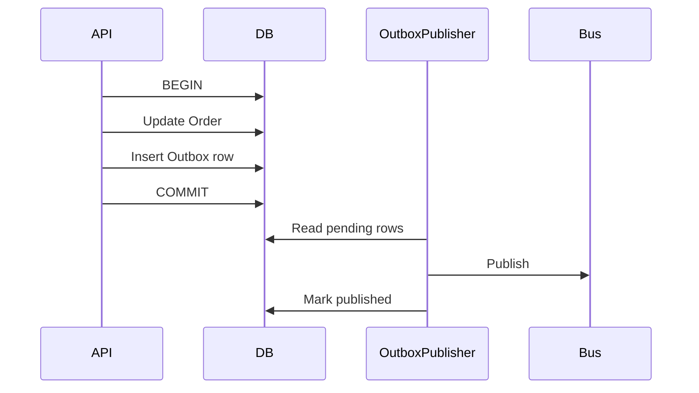

# Daily Knowledge Sharing — 2026-09-23

## Today’s Topics

1. .NET `IAsyncDisposable`: asynchronous cleanup và resource lifetime qua failure path
2. ASP.NET Core `ProblemDetails`: error contract ổn định thay vì leak exception semantics
3. PostgreSQL keyset pagination: ổn định latency khi dataset tăng lớn
4. MongoDB embedding vs referencing: model document theo access pattern và consistency boundary
5. Transactional Outbox: nối database commit với message publication mà không cần distributed transaction
6. Azure Blob Storage SAS: delegated access, blast radius và upload trực tiếp an toàn
7. Application Insights p95/p99: tail latency và cách điều tra regression mà average che giấu
8. Docker image layers: reproducible build, cache efficiency và giảm production attack surface
9. Vue/TypeScript request cancellation: chống stale response ghi đè state mới
10. Git `bisect`: biến regression investigation thành tìm kiếm có bằng chứng

---

# 1. .NET `IAsyncDisposable`: asynchronous cleanup và resource lifetime qua failure path

## 1. What is it?

`IAsyncDisposable` biểu diễn resource có quá trình cleanup cần asynchronous I/O. `DisposeAsync()` trả về `ValueTask`, và `await using` bảo đảm cleanup được await khi scope kết thúc, kể cả khi code bên trong throw exception.

Mental model: `IDisposable` phù hợp khi release là synchronous; `IAsyncDisposable` tồn tại vì một số resource cần **flush, complete hoặc close qua I/O** trước khi lifetime thực sự kết thúc.

## 2. Why does it exist?

Nếu cleanup cần network/disk I/O nhưng chỉ có `Dispose()`, implementation thường phải block thread hoặc fire-and-forget cleanup. Cả hai đều nguy hiểm: blocking làm giảm scalability; fire-and-forget làm caller tưởng resource đã đóng trong khi dữ liệu vẫn chưa flush.

## 3. How does it work?

```text
enter scope
   |
 acquire async resource
   |
 business work
   |
 success / exception
   |
   v
await DisposeAsync()
   |
resource actually released
```

Compiler hạ `await using` thành `try/finally` có asynchronous disposal. Vì cleanup nằm trong failure path, cancellation và exception semantics của cleanup cần được thiết kế cẩn thận.

## 4. Practical implementation

```csharp
public sealed class BatchWriter : IAsyncDisposable
{
    private readonly Stream _stream;

    public BatchWriter(Stream stream) => _stream = stream;

    public async ValueTask DisposeAsync()
    {
        await _stream.FlushAsync(CancellationToken.None);
        await _stream.DisposeAsync();
    }
}

await using var writer = new BatchWriter(stream);
// write batch
```

Không nên dùng request `CancellationToken` một cách mù quáng cho cleanup bắt buộc: request đã bị cancel không có nghĩa resource có thể bị bỏ mặc ở trạng thái nửa đóng.

## 5. Real production scenario

Worker ghi một export lớn vào stream-backed storage. Processing hoàn tất nhưng response/job status chỉ nên chuyển `Completed` sau khi stream được flush và close. Nếu disposal bị fire-and-forget, job có thể báo thành công trước khi bytes cuối cùng thực sự được gửi.

## 6. Failure scenario & troubleshooting

**Symptom** → thỉnh thoảng file bị thiếu phần cuối dù business handler không báo lỗi.

**Evidence** → trace cho thấy upload stream bị dispose mà không await; process shutdown xảy ra ngay sau handler.

**Hypothesis** → asynchronous cleanup chưa hoàn thành.

**Diagnosis** → kiểm tra lifetime và tất cả exit paths, đặc biệt exception/shutdown.

**Fix** → dùng `await using`, await disposal và để shutdown grace period đủ dài.

**Verification** → fault-injection khi shutdown giữa upload và xác nhận file checksum/length.

## 7. Common mistakes

Gọi `DisposeAsync()` nhưng không await; implement cả `Dispose` và `DisposeAsync` nhưng semantics khác nhau khó đoán; dùng cancellation token đã cancel để bỏ cleanup; giữ resource async quá lâu vì scope quá rộng.

## 8. Alternatives

`IDisposable` vẫn đúng cho memory-only/native handle cleanup synchronous. Không nên chuyển mọi type sang `IAsyncDisposable` chỉ vì application có async code.

## 9. Trade-offs

### Advantages

Cleanup đúng semantics cho I/O, không block thread, failure path rõ ràng.

### Costs / Risks

Call chain phải hỗ trợ async; shutdown phức tạp hơn; cleanup exception có thể che exception gốc nếu xử lý kém.

## 10. Junior → Middle → Senior → Technical Lead

### Junior

Hiểu disposal là ownership/lifetime, không phải “GC sẽ dọn hết”.

### Middle

Dùng `await using` đúng scope và test exception path.

### Senior

Thiết kế cleanup khi cancellation, shutdown và partial failure xảy ra.

### Technical Lead / Architect

Quyết định resource ownership boundary và shutdown contract của component.

## 11. Key takeaway

- Async resource cần async cleanup được await.
- Cleanup là một phần của correctness, không chỉ housekeeping.
- Cancellation của request và nghĩa vụ release resource là hai concern khác nhau.

---

# 2. ASP.NET Core `ProblemDetails`: error contract ổn định thay vì leak exception semantics

## 1. What is it?

`ProblemDetails` là representation chuẩn cho HTTP API errors, dựa trên problem details format. Nó tách **internal exception model** khỏi **external API error contract**.

Client cần biết status, loại lỗi, message an toàn và correlation identifier; client không cần stack trace hay tên exception nội bộ.

## 2. Why does it exist?

Nếu mỗi endpoint trả một shape lỗi khác nhau, frontend phải viết parsing đặc thù. Nếu API serialize exception trực tiếp, refactor exception class có thể thành breaking change và còn leak implementation/security details.

## 3. How does it work?

```text
Exception / validation failure
          |
          v
Exception handler / problem service
          |
   classify + sanitize
          |
          v
HTTP status + ProblemDetails
          |
          v
Client uses stable contract
```

Mapping nên dựa trên semantic category như validation, conflict, not-found, unauthorized dependency failure; không phải mọi exception đều thành `500` với message gốc.

## 4. Practical implementation

```csharp
builder.Services.AddProblemDetails();

var app = builder.Build();
app.UseExceptionHandler();

app.MapGet("/orders/{id:guid}", async (Guid id, AppDbContext db) =>
{
    var order = await db.Orders.FindAsync(id);
    return order is null ? Results.NotFound() : Results.Ok(order);
});
```

Với domain exceptions, tạo mapping tập trung và thêm `traceId` vào extensions để support team correlate với telemetry.

## 5. Real production scenario

Frontend checkout cần phân biệt `409` inventory conflict với `500` infrastructure failure. Error contract ổn định cho phép UI hướng dẫn user refresh cart ở conflict nhưng hiển thị generic retry message ở server failure.

## 6. Failure scenario & troubleshooting

**Symptom** → Production response trả stack trace, SQL table name và connection details.

**Evidence** → exception message được gán thẳng vào `detail` cho mọi lỗi.

**Hypothesis** → internal diagnostic data bị trộn với public contract.

**Diagnosis** → review middleware và response sample ở Production environment.

**Fix** → sanitize public details; log exception đầy đủ server-side cùng `traceId`.

**Verification** → security/integration tests xác nhận sensitive exception không xuất hiện trong response.

## 7. Common mistakes

Trả `200` kèm `{success:false}`; dùng `400` cho mọi lỗi; expose exception message; đổi `type`/error code tùy tiện; client dựa vào human-readable `detail` thay vì stable machine-readable identifier.

## 8. Alternatives

Custom envelope có thể hợp lý khi organization đã có mature contract, nhưng phải giữ HTTP semantics. gRPC dùng status/details khác; nguyên tắc tách internal failure khỏi public contract vẫn giữ nguyên.

## 9. Trade-offs

### Advantages

Contract nhất quán, client integration đơn giản, giảm leak implementation detail.

### Costs / Risks

Cần taxonomy lỗi và governance; mapping quá tổng quát có thể mất thông tin business cần thiết.

## 10. Junior → Middle → Senior → Technical Lead

### Junior

Hiểu status code và response body cùng tạo error contract.

### Middle

Implement centralized exception handling và validation responses.

### Senior

Thiết kế stable error taxonomy, security boundary và observability correlation.

### Technical Lead / Architect

Quyết định organization-wide API error contract và backward compatibility policy.

## 11. Key takeaway

- Exception type nội bộ không nên trở thành API contract.
- Public error cần ổn định, an toàn và machine-readable.
- Chi tiết điều tra nằm trong telemetry, nối bằng correlation/trace ID.

---

# 3. PostgreSQL keyset pagination: ổn định latency khi dataset tăng lớn

## 1. What is it?

Keyset pagination lấy trang tiếp theo dựa trên giá trị sort key cuối cùng của trang trước thay vì `OFFSET N`. Ví dụ với `(created_at, id)` descending, cursor chứa cặp giá trị cuối trang.

Mental model: đừng yêu cầu database “bỏ qua 500.000 rows”; hãy nói “tiếp tục từ key này”.

## 2. Why does it exist?

`OFFSET` dễ dùng nhưng deep page thường phải scan/sort rồi discard nhiều rows. Dataset càng lớn, latency càng tăng. Đồng thời concurrent insert/delete làm page boundaries dịch chuyển, gây duplicate hoặc missing rows.

## 3. How does it work?

```sql
SELECT id, created_at, total
FROM orders
WHERE (created_at, id) < (@created_at, @id)
ORDER BY created_at DESC, id DESC
LIMIT 50;
```

Composite index phù hợp:

```sql
CREATE INDEX ix_orders_created_id
ON orders (created_at DESC, id DESC);
```

`id` đóng vai trò tie-breaker để ordering deterministic.

## 4. Practical implementation

Cursor có thể encode timestamp + id thành opaque token. API không nên để client tự sửa cursor semantics tùy ý; validate format/version và giữ filter set tương thích với cursor.

```csharp
query = query
    .Where(x => x.CreatedAt < cursor.CreatedAt ||
        (x.CreatedAt == cursor.CreatedAt && x.Id.CompareTo(cursor.Id) < 0))
    .OrderByDescending(x => x.CreatedAt)
    .ThenByDescending(x => x.Id)
    .Take(pageSize);
```

## 5. Real production scenario

Audit log có 80 triệu rows. Admin chủ yếu “load more” theo thời gian. OFFSET page 10.000 mất vài giây; keyset vẫn seek gần vị trí cursor và đọc số rows gần page size.

## 6. Failure scenario & troubleshooting

**Symptom** → user thấy record lặp lại giữa hai pages.

**Evidence** → query sort chỉ theo `created_at`, nhiều rows có cùng timestamp.

**Hypothesis** → ordering không deterministic.

**Diagnosis** → kiểm tra sort key uniqueness và generated SQL.

**Fix** → thêm stable tie-breaker như `id`, cursor chứa toàn bộ ordering keys.

**Verification** → concurrent insert test và paginate toàn bộ sample không duplicate/missing ngoài semantics đã định.

## 7. Common mistakes

Dùng keyset nhưng sort column không có index; cursor thiếu tie-breaker; cho phép đổi filter giữa pages; encode cursor nhưng không version; giả định keyset hỗ trợ “jump tới page 917” hiệu quả.

## 8. Alternatives

OFFSET phù hợp dataset nhỏ, shallow pagination và UI cần page number. Keyset phù hợp feed, timeline, infinite scroll, large datasets. Materialized/search index có thể phù hợp với query/search phức tạp hơn.

## 9. Trade-offs

### Advantages

Latency ổn định hơn ở deep navigation, ít row discard, tốt hơn dưới concurrent changes.

### Costs / Risks

Không random-jump tự nhiên; cursor contract phức tạp; arbitrary sort combinations cần index strategy tương ứng.

## 10. Junior → Middle → Senior → Technical Lead

### Junior

Hiểu `OFFSET` bỏ qua rows còn keyset tiếp tục từ key.

### Middle

Implement deterministic ordering và opaque cursor.

### Senior

Đọc execution plan, thiết kế composite index và consistency semantics.

### Technical Lead / Architect

Chọn pagination model dựa trên UX, scale, query flexibility và database cost.

## 11. Key takeaway

- Pagination là access-pattern decision, không chỉ API formatting.
- Keyset cần deterministic ordering và index phù hợp.
- Đừng dùng keyset nếu business thật sự cần random page navigation mà dataset nhỏ.

---

# 4. MongoDB embedding vs referencing: model document theo access pattern và consistency boundary

## 1. What is it?

Embedding lưu related data bên trong cùng document; referencing lưu identifier trỏ sang document khác. Quyết định này không tương đương “denormalize luôn vì MongoDB là NoSQL”.

Mental model: document nên phản ánh dữ liệu thường được đọc/thay đổi cùng nhau và có lifecycle phù hợp.

## 2. Why does it exist?

Document database tối ưu cho aggregate-like reads. Embedding giảm round trips và cho atomic update trong một document. Nhưng embedded collection tăng không giới hạn hoặc dữ liệu được share rộng sẽ tạo duplication và update fan-out.

## 3. How does it work?

```text
Embedding:
Order
 ├─ customerSnapshot
 └─ items[]

Referencing:
ProductReview
 ├─ productId ---> Product
 └─ authorId  ---> User
```

Một snapshot như shipping address trong Order thường nên giữ lịch sử tại thời điểm mua, không “join” sang current customer address rồi làm lịch sử thay đổi.

## 4. Practical implementation

```csharp
public sealed class OrderDocument
{
    public ObjectId Id { get; init; }
    public CustomerSnapshot Customer { get; init; } = default!;
    public List<OrderLine> Lines { get; init; } = [];
    public DateTime CreatedAt { get; init; }
}
```

`OrderLine` phù hợp embedding nếu số lượng bounded và luôn được đọc cùng order.

## 5. Real production scenario

Marketplace có product với hàng trăm nghìn reviews. Embedding tất cả reviews vào Product tạo document growth, contention và size risk. Reviews nên là collection riêng theo `productId`; trong khi vài chục OrderLines lại phù hợp embedding trong Order.

## 6. Failure scenario & troubleshooting

**Symptom** → update product name phải sửa hàng triệu documents và queue sync tăng liên tục.

**Evidence** → cùng mutable field bị duplicated ở nhiều aggregates dù UI luôn cần latest value.

**Hypothesis** → denormalization không có ownership/freshness strategy.

**Diagnosis** → phân loại field là historical snapshot hay live shared reference.

**Fix** → reference shared mutable entity, hoặc chấp nhận denormalization nhưng có explicit async propagation/SLA.

**Verification** → đo write amplification, document size và query round trips sau redesign.

## 7. Common mistakes

Embed unbounded arrays; reference mọi thứ như relational schema; duplicate mutable data mà không có synchronization; chọn model trước khi biết query patterns; bỏ qua document size/index cost.

## 8. Alternatives

Relational database tốt hơn nếu workload cần ad-hoc joins và relational constraints mạnh. MongoDB referencing vẫn hợp lý nhưng không nên cố tái tạo toàn bộ relational model bằng application-side joins.

## 9. Trade-offs

### Advantages

Embedding: atomicity và read locality. Referencing: giảm duplication, độc lập lifecycle, hỗ trợ unbounded relationships.

### Costs / Risks

Embedding tăng document growth/write amplification; referencing tăng round trips hoặc aggregation complexity.

## 10. Junior → Middle → Senior → Technical Lead

### Junior

Hiểu embedding và referencing là hai cách model relationship.

### Middle

Chọn theo read/write pattern và boundedness.

### Senior

Đánh giá atomicity, document growth, index, duplication và consistency.

### Technical Lead / Architect

Xác định aggregate/data ownership và liệu document database có thực sự phù hợp workload.

## 11. Key takeaway

- MongoDB schema flexibility không loại bỏ nhu cầu thiết kế schema.
- Embed dữ liệu bounded, cùng lifecycle và thường đọc cùng nhau.
- Mutable shared data cần ownership và freshness strategy rõ ràng.

---

# 5. Transactional Outbox: nối database commit với message publication mà không cần distributed transaction

## 1. What is it?

Transactional Outbox ghi business change và outbound message record vào **cùng local database transaction**. Một publisher riêng đọc Outbox rồi publish sang broker.

Nó giải quyết dual-write gap giữa database và message broker.

## 2. Why does it exist?

Flow ngây thơ:

```text
UPDATE database
PUBLISH message
```

Nếu DB commit thành công nhưng process crash trước publish, state đã đổi mà event mất. Nếu publish trước rồi DB rollback, consumer nhận event về state chưa tồn tại.

## 3. How does it work?



Atomicity chỉ nằm ở DB transaction. Publication thường là at-least-once, vì crash có thể xảy ra sau broker accept nhưng trước `Mark published`.

## 4. Practical implementation

```csharp
await using var tx = await db.Database.BeginTransactionAsync(ct);

order.MarkPaid();

db.OutboxMessages.Add(new OutboxMessage
{
    Id = Guid.NewGuid(),
    Type = "OrderPaid",
    Payload = JsonSerializer.Serialize(new { order.Id }),
    OccurredAtUtc = DateTime.UtcNow
});

await db.SaveChangesAsync(ct);
await tx.CommitAsync(ct);
```

Publisher cần batch, retry, monitoring và retention. Consumer vẫn phải idempotent.

## 5. Real production scenario

Order API commit payment status rồi phát event cho Fulfillment. Broker outage 15 phút không được phép rollback payment đã xác nhận. Outbox giữ events trong SQL; publisher catch up khi Service Bus phục hồi.

## 6. Failure scenario & troubleshooting

**Symptom** → business state đúng nhưng downstream chậm hàng giờ.

**Evidence** → Outbox pending count/oldest age tăng; broker publish errors tăng.

**Hypothesis** → publisher degraded hoặc broker unavailable.

**Diagnosis** → kiểm tra backlog age, publisher throughput, locks và broker telemetry.

**Fix** → phục hồi publisher/broker, scale có kiểm soát và tránh retry storm.

**Verification** → backlog age trở về baseline và downstream state reconcile đúng.

## 7. Common mistakes

Ghi Outbox ngoài business transaction; xóa row ngay khi send mà không nghĩ tới crash window; tin rằng Outbox tạo exactly-once; không monitor oldest pending age; payload chứa toàn entity schema gây coupling.

## 8. Alternatives

Distributed transaction/2PC hiếm khi phù hợp với cloud broker/service boundaries. CDC có thể publish database changes nhưng semantics domain event khác raw table changes. Direct publish đủ cho non-critical best-effort notifications.

## 9. Trade-offs

### Advantages

Không mất event sau DB commit, decouple broker availability khỏi request transaction, failure recoverable.

### Costs / Risks

Thêm publisher, table growth, duplicate publication và eventual consistency.

## 10. Junior → Middle → Senior → Technical Lead

### Junior

Hiểu dual-write failure window.

### Middle

Implement Outbox trong cùng transaction và basic publisher.

### Senior

Thiết kế idempotency, batching, ordering, retry và observability.

### Technical Lead / Architect

Quyết định event contract, consistency SLA, ownership và khi nào Outbox complexity thực sự cần thiết.

## 11. Key takeaway

- Outbox giải quyết atomic DB change + durable publication intent.
- Nó không tạo exactly-once delivery.
- Backlog age là production signal quan trọng hơn chỉ đếm publish errors.

---

# 6. Azure Blob Storage SAS: delegated access, blast radius và upload trực tiếp an toàn

## 1. What is it?

Shared Access Signature (SAS) cấp quyền giới hạn theo resource, operation và thời gian mà không trao storage account credential cho client.

Mental model: backend phát một **capability có scope và expiry**, client dùng capability đó trực tiếp với Blob Storage.

## 2. Why does it exist?

Upload file lớn qua API làm application trở thành data pipe: tốn bandwidth, memory/connection và scale cost. Nhưng đưa storage key cho browser/mobile là không thể chấp nhận vì blast radius quá lớn.

## 3. How does it work?

```text
Client -> API: request upload permission
API -> authorize business action
API -> Blob: prepare target / user delegation SAS
API -> Client: short-lived scoped SAS
Client -> Blob Storage: upload directly
Client -> API: confirm metadata
```

Backend vẫn quyết định user có quyền upload vào object nào; SAS chỉ là delegated transport authorization.

## 4. Practical implementation

Ưu tiên Managed Identity + user delegation SAS khi phù hợp thay vì giữ account key trong app. SAS nên giới hạn blob path, write permission, HTTPS và thời gian ngắn.

```csharp
var sas = new BlobSasBuilder
{
    BlobContainerName = container,
    BlobName = blobName,
    Resource = "b",
    ExpiresOn = DateTimeOffset.UtcNow.AddMinutes(10)
};
sas.SetPermissions(BlobSasPermissions.Create | BlobSasPermissions.Write);
```

Việc ký cụ thể phụ thuộc credential model; không nên hard-code account key trong source/config client-visible.

## 5. Real production scenario

CMS cho editor upload video 2 GB. API authorize editor, tạo target blob name server-side và trả short-lived SAS. Browser upload thẳng Blob Storage; API instances không phải proxy 2 GB payload.

## 6. Failure scenario & troubleshooting

**Symptom** → SAS URL bị leak trong logs và vẫn dùng được hàng ngày.

**Evidence** → token expiry 7 ngày, permission rộng cả container.

**Hypothesis** → delegated credential có blast radius quá lớn.

**Diagnosis** → inspect scope, permissions, expiry và logging pipeline.

**Fix** → short TTL, single-blob scope, minimum permission, redact query strings; rotate/revoke strategy theo SAS type.

**Verification** → security tests xác nhận token hết hạn và không truy cập blob khác.

## 7. Common mistakes

SAS expiry quá dài; cấp read/write/delete khi chỉ cần create; client tự chọn arbitrary blob path; log full SAS URL; coi upload thành công là file an toàn mà không scan/validate content.

## 8. Alternatives

API-proxied upload đơn giản cho file nhỏ và validation inline. Managed Identity phù hợp service-to-storage, không phải public browser. Private Endpoint giải quyết network exposure nhưng không thay authorization.

## 9. Trade-offs

### Advantages

Giảm API bandwidth, scale tốt cho file lớn, credential scope nhỏ hơn account key.

### Costs / Risks

SAS là bearer capability; leak token cho phép dùng trong scope còn hiệu lực; workflow upload/confirmation phức tạp hơn.

## 10. Junior → Middle → Senior → Technical Lead

### Junior

Hiểu SAS là temporary scoped access, không phải storage key.

### Middle

Tạo short-lived least-privilege SAS và direct upload flow.

### Senior

Thiết kế naming, malware scanning, abandoned upload cleanup và observability.

### Technical Lead / Architect

Chọn identity/network/access model và threat model cho file pipeline.

## 11. Key takeaway

- SAS phải ngắn hạn, scope nhỏ và permission tối thiểu.
- Backend authorization vẫn đứng trước delegated upload.
- Direct-to-Blob giảm application load nhưng không bỏ validation/security pipeline.

---

# 7. Application Insights p95/p99: tail latency và cách điều tra regression mà average che giấu

## 1. What is it?

p95 là latency mà 95% requests nhanh hơn hoặc bằng; p99 tương tự cho 99%. Chúng mô tả **tail latency** — trải nghiệm của nhóm request chậm nhất — tốt hơn average trong nhiều production systems.

## 2. Why does it exist?

Average có thể đẹp dù một nhóm user chịu latency rất tệ. Ví dụ 99 requests mất 100 ms và 1 request mất 10 s: average tăng nhưng không nói rõ tail distribution; ở scale lớn, “1% chậm” có thể là hàng nghìn requests.

## 3. How does it work?

```text
Latency distribution
| many requests: 80-150ms
| some:          300-800ms
| tail:          2-10s
+-------------------------->
             p95      p99
```

Percentile phải được segment theo endpoint, dependency, region, instance/version. Global p95 có thể che một endpoint nhỏ nhưng critical.

## 4. Practical implementation

Ví dụ Kusto-style investigation:

```text
requests
| where timestamp > ago(1h)
| summarize p50=percentile(duration, 50),
            p95=percentile(duration, 95),
            p99=percentile(duration, 99)
  by name, bin(timestamp, 5m)
```

Sau khi phát hiện endpoint regression, drill down dependency spans/traces thay vì đoán cache/index.

## 5. Real production scenario

Sau deployment, average checkout tăng từ 220 lên 240 ms — có vẻ nhỏ. p99 tăng từ 900 ms lên 8 s. Trace của slow cohort cho thấy một fallback external API chỉ chạy với một loại payment method.

## 6. Failure scenario & troubleshooting

**Symptom** → user complaint tăng nhưng dashboard average gần như không đổi.

**Evidence** → p95/p99 theo operation tăng; error rate chưa tăng.

**Hypothesis** → slow path chỉ ảnh hưởng subset traffic.

**Diagnosis** → filter slow traces, compare dependency duration và deployment version.

**Fix** → sửa dependency timeout/fallback hoặc regression cụ thể.

**Verification** → percentile trở lại baseline và slow-trace signature biến mất.

## 7. Common mistakes

Alert chỉ trên average; trộn endpoint khác nhau; percentile trên sample quá nhỏ; tăng sampling rồi tưởng latency thay đổi; nhìn p99 nhưng không kiểm tra traffic volume; tối ưu trước khi localize bottleneck.

## 8. Alternatives

Histogram/SLO buckets hữu ích cho alerting và distribution. Average vẫn hữu ích cho capacity/cost ở một số context, nhưng không đủ để đại diện user experience.

## 9. Trade-offs

### Advantages

Phát hiện tail regression, gần user experience hơn, hỗ trợ SLO reasoning.

### Costs / Risks

p99 nhiễu với low traffic; telemetry sampling/aggregation cần hiểu đúng; nhiều dimensions làm tăng cardinality/cost.

## 10. Junior → Middle → Senior → Technical Lead

### Junior

Hiểu percentile khác average.

### Middle

Đọc p50/p95/p99 và drill vào slow traces.

### Senior

Segment theo operation/version/dependency và correlate logs-metrics-traces.

### Technical Lead / Architect

Định nghĩa SLI/SLO, alert thresholds và telemetry retention/sampling theo business criticality.

## 11. Key takeaway

- Average có thể che tail latency nghiêm trọng.
- Percentile chỉ hữu ích khi đặt đúng traffic context.
- Investigation phải đi từ symptom → trace evidence → bottleneck, không nhảy thẳng tới “thêm cache”.

---

# 8. Docker image layers: reproducible build, cache efficiency và giảm production attack surface

## 1. What is it?

Docker image gồm các immutable filesystem layers tạo từ Dockerfile instructions. Build cache có thể reuse layer nếu inputs tương ứng không đổi. Multi-stage build tách build toolchain khỏi runtime image.

## 2. Why does it exist?

Container cần artifact nhất quán giữa environments. Nhưng Dockerfile ngây thơ có thể rebuild dependency mỗi lần source đổi, chứa SDK/compiler trong Production và vô tình copy secrets/test files vào image.

## 3. How does it work?

```text
Layer 1: runtime base
Layer 2: app dependencies
Layer 3: published application
        |
        v
Production image

Build stage: SDK + source + compiler
        X not copied wholesale
Runtime stage: only publish output
```

Thứ tự `COPY` ảnh hưởng cache invalidation.

## 4. Practical implementation

```dockerfile
FROM mcr.microsoft.com/dotnet/sdk:10.0 AS build
WORKDIR /src
COPY MyApp.csproj .
RUN dotnet restore MyApp.csproj
COPY . .
RUN dotnet publish MyApp.csproj -c Release -o /out --no-restore

FROM mcr.microsoft.com/dotnet/aspnet:10.0 AS runtime
WORKDIR /app
COPY --from=build /out .
ENTRYPOINT ["dotnet", "MyApp.dll"]
```

Pinning strategy và base image patching phải thuộc release process; “image immutable” không có nghĩa base vulnerabilities tự biến mất.

## 5. Real production scenario

CI build mất 12 phút vì `COPY . .` trước `dotnet restore`, nên thay một `.cs` file làm restore layer invalidated. Tách project metadata copy trước giúp cache restore khi dependencies không đổi.

## 6. Failure scenario & troubleshooting

**Symptom** → security scanner báo SDK/compiler packages trong Production image và image >1 GB.

**Evidence** → final stage dùng `sdk` image.

**Hypothesis** → build/runtime concerns chưa tách.

**Diagnosis** → inspect image history/layers.

**Fix** → multi-stage build, runtime base nhỏ hơn, `.dockerignore`, non-root configuration khi platform/app cho phép.

**Verification** → compare image size, SBOM/vulnerability scan và runtime smoke test.

## 7. Common mistakes

Copy `.git`, local secrets và test artifacts; dùng `latest`; cache package restore sai; chạy process bằng root mặc định mà không đánh giá; build image khác nhau giữa staging/production thay vì promote cùng artifact.

## 8. Alternatives

Native App Service deployment đơn giản hơn nếu container portability không cần. Buildpacks có thể giảm Dockerfile maintenance nhưng ít explicit control hơn.

## 9. Trade-offs

### Advantages

Reproducible artifact, dependency isolation, portable deployment, efficient layer transfer/cache.

### Costs / Risks

Base image patch ownership, registry/storage, container security và build complexity.

## 10. Junior → Middle → Senior → Technical Lead

### Junior

Hiểu image khác container và layers là immutable build output.

### Middle

Viết multi-stage Dockerfile, `.dockerignore`, optimize cache.

### Senior

Quản lý supply-chain scan, base patching, runtime user và artifact promotion.

### Technical Lead / Architect

Quyết định container có tạo giá trị thực hay chỉ thêm operational layer cho workload hiện tại.

## 11. Key takeaway

- Docker layer ordering ảnh hưởng build time và artifact content.
- Build SDK không nên tự động đi vào Production image.
- Containerization chỉ hữu ích khi team sở hữu cả patching và runtime operations.

---

# 9. Vue/TypeScript request cancellation: chống stale response ghi đè state mới

## 1. What is it?

Khi UI phát nhiều requests liên tiếp, response không đảm bảo về đúng thứ tự gửi. Cancellation với `AbortController` giúp hủy request cũ khi intent mới thay thế intent trước.

Đây là correctness problem, không chỉ performance optimization.

## 2. Why does it exist?

Search-as-you-type có thể gửi query `car`, rồi `cargo`. Nếu `cargo` trả trước nhưng `car` trả sau, code ngây thơ sẽ ghi state bằng kết quả cũ và UI hiển thị sai intent hiện tại.

## 3. How does it work?

```text
request A: "car"   --------slow--------> response A
request B: "cargo" ----fast----> response B

Without guard: B updates state, then A overwrites it.
With cancellation/version guard: A is ignored/aborted.
```

Client cancellation không đảm bảo server đã dừng xử lý; backend cũng cần propagate request cancellation nếu operation hỗ trợ.

## 4. Practical implementation

```ts
let controller: AbortController | undefined;

async function search(term: string) {
  controller?.abort();
  controller = new AbortController();

  try {
    const response = await fetch(`/api/search?q=${encodeURIComponent(term)}`, {
      signal: controller.signal
    });
    results.value = await response.json();
  } catch (error) {
    if (error instanceof DOMException && error.name === 'AbortError') return;
    throw error;
  }
}
```

Debounce có thể giảm request volume nhưng không thay thế cancellation/versioning hoàn toàn.

## 5. Real production scenario

Automotive marketplace có autocomplete theo model xe. Mobile network reorder responses khiến dropdown đôi khi hiển thị term trước đó. Bug khó reproduce trên local Wi-Fi nhưng rõ khi thêm artificial latency.

## 6. Failure scenario & troubleshooting

**Symptom** → UI thỉnh thoảng quay về dữ liệu cũ sau khi user đã đổi filter.

**Evidence** → Network waterfall cho thấy response cũ hoàn thành sau response mới.

**Hypothesis** → race giữa async requests.

**Diagnosis** → log request sequence/filter snapshot và inspect state mutation timing.

**Fix** → abort superseded request hoặc dùng monotonic request version và chỉ apply latest.

**Verification** → Playwright test với delayed/reordered mocked responses.

## 7. Common mistakes

Chỉ debounce nhưng vẫn cho response cũ mutate state; hiển thị aborted request như error; assume abort ở browser rollback server side effect; dùng GET cancellation cho operation thực chất có side effect.

## 8. Alternatives

Request sequence/version guard hữu ích khi transport không cancel được. RxJS `switchMap` giải quyết pattern tương tự trong reactive stack. Server-side idempotency vẫn cần cho side-effecting operations.

## 9. Trade-offs

### Advantages

UI state đúng với latest intent, giảm wasted client/network work.

### Costs / Risks

Lifecycle/controller management; cancellation semantics khác nhau giữa client và server; test concurrency khó hơn happy path.

## 10. Junior → Middle → Senior → Technical Lead

### Junior

Hiểu async responses có thể về sai thứ tự.

### Middle

Implement abort/version guard và error handling.

### Senior

Phân biệt cancellation, idempotency và side-effect semantics xuyên frontend/backend.

### Technical Lead / Architect

Chuẩn hóa data-fetching pattern để race prevention không phụ thuộc từng component tự nhớ.

## 11. Key takeaway

- Async UI có race conditions dù JavaScript chạy event loop một thread.
- Debounce giảm volume; cancellation/versioning bảo vệ state correctness.
- Client abort không đồng nghĩa server transaction đã bị undo.

---

# 10. Git `bisect`: biến regression investigation thành tìm kiếm có bằng chứng

## 1. What is it?

`git bisect` dùng binary search trên commit history để tìm commit đầu tiên làm behavior chuyển từ good sang bad. Thay vì đọc tuần tự hàng trăm commits, mỗi bước loại bỏ khoảng một nửa search space.

## 2. Why does it exist?

Regression thường được phát hiện muộn hơn commit gây lỗi. “Nhìn commit nào đáng ngờ” dễ bị confirmation bias, đặc biệt khi release chứa nhiều thay đổi không liên quan.

## 3. How does it work?

```text
Good ------------------------------ Bad
                  test midpoint
          good? --------> search right half
          bad?  --------> search left half
```

Nếu có 128 candidate commits, lý tưởng chỉ cần khoảng 7 lần phân loại good/bad.

## 4. Practical implementation

```bash
git bisect start
git bisect bad HEAD
git bisect good v2.4.0

# Git checkout midpoint; chạy reproduction test
git bisect good   # hoặc: git bisect bad

# khi xong
git bisect reset
```

Tốt hơn nữa, tự động hóa bằng deterministic test:

```bash
git bisect run dotnet test tests/Regression.Tests --filter CheckoutLatencyRegression
```

Exit code phải phản ánh good/bad đúng semantics.

## 5. Real production scenario

Sau 3 tuần development, export CSV bắt đầu double-escape quotes. Release có hơn 200 commits. Team viết regression test tái hiện output sai và dùng `git bisect run`; culprit là refactor serializer tưởng không liên quan tới export.

## 6. Failure scenario & troubleshooting

**Symptom** → bisect chỉ ra commit khác nhau mỗi lần.

**Evidence** → reproduction test flaky hoặc phụ thuộc external service/data/time.

**Hypothesis** → oracle good/bad không deterministic.

**Diagnosis** → chạy test nhiều lần trên cùng commit.

**Fix** → isolate fixture, freeze time/data, mock only unstable external boundary hoặc dùng reproducible environment.

**Verification** → repeated runs trên known-good/known-bad commits ổn định trước khi bisect lại.

## 7. Common mistakes

Đánh dấu commit `bad` dựa trên cảm giác; bisect qua history không build được mà không dùng `skip`; quên submodule/schema/environment compatibility; tìm culprit xong revert ngay mà chưa hiểu root cause.

## 8. Alternatives

`git log`, blame và PR search tốt khi đã biết file/line. Telemetry/deployment diff tốt để localize production regression trước. Bisect mạnh nhất khi có deterministic reproduction và một known-good boundary.

## 9. Trade-offs

### Advantages

Giảm mạnh search space, evidence-driven, có thể tự động hóa.

### Costs / Risks

Mỗi historical commit phải build/test được hoặc xử lý `skip`; flaky test phá kết quả; culprit commit chưa chắc là nơi nên sửa lâu dài.

## 10. Junior → Middle → Senior → Technical Lead

### Junior

Biết xác định known-good và known-bad.

### Middle

Dùng bisect thủ công và viết regression test.

### Senior

Tạo deterministic reproduction, xử lý non-buildable commits và phân tích root cause sau culprit.

### Technical Lead / Architect

Đầu tư vào testability, artifact/version traceability để production regression có thể map nhanh về code change.

## 11. Key takeaway

- `git bisect` hiệu quả khi good/bad criterion deterministic.
- Nó tìm transition commit; không thay thế root-cause analysis.
- Regression test tốt biến lịch sử Git thành một searchable evidence space.
