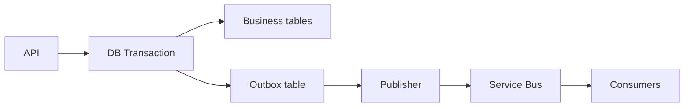
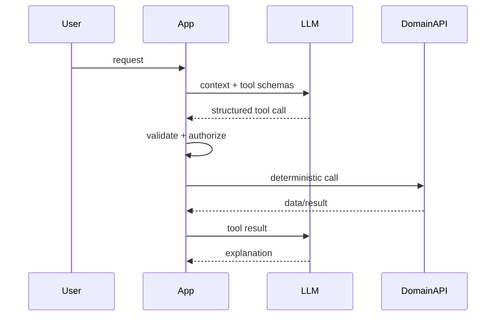

# Daily Knowledge Sharing — 2026-09-23

## Today’s Topics

1. ASP.NET Core DI captive dependency: khi Singleton vô tình giữ Scoped service
2. SQL keyset pagination: ổn định latency khi dataset lớn và dữ liệu thay đổi liên tục
3. MongoDB embedding vs referencing: modeling theo access pattern thay vì mô phỏng relational schema
4. Transactional Outbox: nối database transaction với message publishing mà không cần distributed transaction
5. Azure Blob Storage delegated upload: tách data plane khỏi application
6. p95/p99 latency: tail latency mới thường là nơi Production bắt đầu đau
7. Docker image layers: build cache, image size và deployment artifact
8. ASP.NET Core authorization policy: authentication thành công chưa đủ để cho phép action
9. Vue/TypeScript async request cancellation: tránh stale response ghi đè state mới
10. AI Tool Calling: model chọn hành động, application giữ business correctness deterministic

---

# 1. ASP.NET Core DI captive dependency: khi Singleton vô tình giữ Scoped service

## 1. What is it?

ASP.NET Core DI lifetime xác định object sống bao lâu: `Transient` tạo theo resolution, `Scoped` thường sống trong một HTTP request, còn `Singleton` sống suốt application process. Captive dependency xảy ra khi object lifetime dài giữ dependency lifetime ngắn hơn, điển hình `Singleton -> Scoped`.

Mental model: object cha không được kéo object con vượt khỏi lifetime mà object con được thiết kế để tồn tại.

## 2. Why does it exist?

`DbContext`, request-specific state và nhiều service scoped giả định chúng chỉ được dùng trong một request/unit of work. Nếu Singleton giữ chúng, state có thể bị chia sẻ giữa requests và thread-safety assumptions bị phá vỡ.

## 3. How does it work?

```text
Application lifetime
┌──────────────────────────────────────┐
│ Singleton                            │
│   └── captures Scoped DbContext ─────┼── lives too long
└──────────────────────────────────────┘

Request A scope: [expected DbContext lifetime]
Request B scope: [new DbContext expected]
```

DI container có thể phát hiện một số lifetime mismatch khi scope validation bật, nhưng architecture vẫn cần hiểu ownership.

## 4. Practical implementation

Sai:

```csharp
public sealed class ReportCache(AppDbContext db)
{
    public Task<int> CountAsync(CancellationToken ct) =>
        db.Reports.CountAsync(ct);
}

builder.Services.AddSingleton<ReportCache>();
builder.Services.AddDbContext<AppDbContext>();
```

Background Singleton cần unit of work riêng có thể tạo scope cho từng operation:

```csharp
public sealed class ReportWorker(IServiceScopeFactory scopeFactory)
{
    public async Task<int> CountAsync(CancellationToken ct)
    {
        await using var scope = scopeFactory.CreateAsyncScope();
        var db = scope.ServiceProvider.GetRequiredService<AppDbContext>();
        return await db.Reports.CountAsync(ct);
    }
}
```

## 5. Real production scenario

Một background coordinator đăng ký Singleton và giữ repository scoped. Nhiều jobs chạy đồng thời qua cùng `DbContext`, tạo lỗi concurrent operation và tracking state lẫn giữa jobs. Local test tuần tự không tái hiện.

## 6. Failure scenario & troubleshooting

**Symptom** → lỗi concurrent operation hoặc state tracking bất thường.

**Evidence** → dependency graph cho thấy Singleton giữ repository/DbContext scoped.

**Hypothesis** → lifetime mismatch.

**Diagnosis** → kiểm tra registrations và object ownership.

**Fix** → hạ lifetime consumer hoặc tạo explicit scope cho từng unit of work.

**Verification** → concurrency test xác nhận mỗi operation nhận DbContext riêng.

## 7. Common mistakes

Đổi `DbContext` thành Singleton; inject `IServiceProvider` khắp nơi; tạo scope nhưng cache scoped object ra field; cho rằng Singleton thread-safe làm mọi dependency bên trong thread-safe.

## 8. Alternatives

Service stateless có thể là Singleton nếu dependency chain phù hợp. Request service thông thường dùng Scoped đơn giản hơn. Background processing nên tạo scope theo message/job.

## 9. Trade-offs

### Advantages

Singleton phù hợp shared immutable state hoặc service expensive-to-create.

### Costs / Risks

Lifetime dài tăng yêu cầu thread safety, cleanup và ownership discipline.

## 10. Junior → Middle → Senior → Technical Lead

### Junior

Hiểu ba DI lifetimes và request scope.

### Middle

Chọn lifetime đúng và tránh Scoped trực tiếp trong Singleton.

### Senior

Phân tích ownership, concurrency và disposal trong background workloads.

### Technical Lead / Architect

Định nghĩa lifetime conventions và unit-of-work boundaries.

## 11. Key takeaway

- Lifetime là ownership contract, không chỉ DI syntax.
- Singleton không nên giữ request-scoped state.
- Background operation nên có explicit unit-of-work scope.

---

# 2. SQL keyset pagination: ổn định latency khi dataset lớn và dữ liệu thay đổi liên tục

## 1. What is it?

Keyset pagination lấy trang tiếp theo dựa trên sort key cuối của trang trước thay vì `OFFSET N`. Với sort `(CreatedAt DESC, Id DESC)`, cursor chứa `CreatedAt` và `Id` của row cuối.

## 2. Why does it exist?

`OFFSET 500000` vẫn buộc database đi qua lượng lớn rows trước khi trả vài chục rows cần thiết. Khi dữ liệu thay đổi giữa requests, offset còn dễ tạo duplicate hoặc skipped items.

## 3. How does it work?

```text
Page 1: [100][99][98][97]
                       ^ cursor
Page 2: WHERE key < cursor
        [96][95][94][93]
```

Cursor phải tương ứng deterministic ordering. Nếu sort column không unique, cần tie-breaker như primary key.

## 4. Practical implementation

```sql
SELECT TOP (50) Id, CreatedAt, Total
FROM dbo.Orders
WHERE CreatedAt < @LastCreatedAt
   OR (CreatedAt = @LastCreatedAt AND Id < @LastId)
ORDER BY CreatedAt DESC, Id DESC;
```

Index nên được đánh giá theo access pattern và execution plan, không thêm máy móc.

## 5. Real production scenario

Admin audit log có hàng chục triệu records. Page đầu nhanh nhưng deep page dùng offset tăng lên vài giây. Keyset cho phép database tiếp tục từ boundary gần vị trí cần đọc.

## 6. Failure scenario & troubleshooting

**Symptom** → cursor pagination vẫn duplicate records.

**Evidence** → ordering chỉ dùng `CreatedAt`, nhiều rows cùng timestamp.

**Hypothesis** → sort order không deterministic.

**Diagnosis** → kiểm tra generated predicate và duplicate sort values.

**Fix** → thêm stable unique tie-breaker.

**Verification** → paginate dưới concurrent inserts.

## 7. Common mistakes

Cursor chỉ chứa non-unique column; encode cursor nhưng không gắn filter/sort context; thêm index mà không đo I/O; cố hỗ trợ random page jump như offset.

## 8. Alternatives

Offset phù hợp dataset nhỏ và UI cần random page navigation. Keyset phù hợp feed, audit history và infinite scroll.

## 9. Trade-offs

### Advantages

Deep-page latency ổn định hơn và ít nhạy với concurrent inserts.

### Costs / Risks

Không tiện random jump; cursor contract phức tạp hơn; arbitrary sorting khó tối ưu.

## 10. Junior → Middle → Senior → Technical Lead

### Junior

Hiểu offset bỏ qua rows còn keyset tiếp tục từ boundary.

### Middle

Implement composite cursor và deterministic sort.

### Senior

Đọc execution plan, logical reads và thiết kế index theo access pattern.

### Technical Lead / Architect

Chọn pagination contract dựa trên UX, scale và consistency.

## 11. Key takeaway

- Deep offset thường có cost tăng theo vị trí trang.
- Keyset cần deterministic ordering.
- Pagination là API + database decision.

---

# 3. MongoDB embedding vs referencing: modeling theo access pattern thay vì mô phỏng relational schema

## 1. What is it?

Embedding lưu dữ liệu liên quan trong cùng document; referencing lưu identifier trỏ sang document khác. Quyết định này ảnh hưởng atomicity, document growth, query shape và duplication.

## 2. Why does it exist?

Nếu mọi relation đều reference như relational schema, application có thể tạo nhiều round trips. Nhưng embed mọi thứ lại tạo document lớn, duplication và update fan-out.

## 3. How does it work?

```text
Order {
  id,
  items: [{ sku, quantity, priceSnapshot }]
}
```

`priceSnapshot` thường hợp lý trong Order vì lịch sử mua hàng có lifecycle khác current Product price.

## 4. Practical implementation

```csharp
public sealed record OrderItem(string Sku, int Quantity, decimal UnitPrice);

public sealed class Order
{
    public ObjectId Id { get; init; }
    public List<OrderItem> Items { get; init; } = [];
    public decimal Total { get; init; }
}
```

Order và items thường được đọc/ghi như một aggregate nên embedding có thể tự nhiên hơn separate collection.

## 5. Real production scenario

Marketplace reference Product từ mọi OrderItem để tránh duplication. Khi product đổi giá, lịch sử order hiển thị giá hiện tại thay vì giá checkout. Historical snapshot thực ra là business requirement.

## 6. Failure scenario & troubleshooting

**Symptom** → order detail tạo hàng chục queries.

**Evidence** → mỗi item lookup Product riêng.

**Hypothesis** → model normalized quá mức cho read pattern.

**Diagnosis** → map read/write access patterns và lifecycle.

**Fix** → embed immutable snapshot cần cho order, reference dữ liệu có lifecycle độc lập.

**Verification** → đo round trips và update behavior.

## 7. Common mistakes

Embed unbounded arrays; duplicate mutable data không có synchronization strategy; reference mọi thứ vì quen SQL; chọn model trước khi biết query pattern.

## 8. Alternatives

Relational database phù hợp khi joins và strong multi-entity constraints là trung tâm. MongoDB referencing vẫn đúng cho entity shared và thay đổi độc lập.

## 9. Trade-offs

### Advantages

Embedding giảm round trips và cho atomic update trong document.

### Costs / Risks

Document growth, duplicated mutable data và write amplification.

## 10. Junior → Middle → Senior → Technical Lead

### Junior

Hiểu embed và reference.

### Middle

Model theo access pattern và bounded document size.

### Senior

Đánh giá consistency, duplication và indexing.

### Technical Lead / Architect

Quyết định aggregate/data ownership và database fit.

## 11. Key takeaway

- Document modeling bắt đầu từ access pattern.
- Duplication có thể là intentional snapshot.
- Unbounded embedding và over-referencing đều có cost.

---

# 4. Transactional Outbox: nối database transaction với message publishing mà không cần distributed transaction

## 1. What is it?

Transactional Outbox ghi business state và message-to-be-published vào cùng local database transaction. Publisher riêng đọc Outbox và gửi message tới broker.

## 2. Why does it exist?

Nếu database commit thành công nhưng process dừng trước publish, event bị mất. Nếu publish trước rồi database rollback, consumer nhận event cho state chưa tồn tại.

## 3. How does it work?



Outbox đảm bảo atomic persistence, không đảm bảo exactly-once delivery.

## 4. Practical implementation

```csharp
await using var tx = await db.Database.BeginTransactionAsync(ct);

order.MarkPaid();
db.OutboxMessages.Add(new OutboxMessage
{
    Id = Guid.NewGuid(),
    Type = "OrderPaid",
    Payload = JsonSerializer.Serialize(new { order.Id }),
    OccurredAtUtc = DateTime.UtcNow
});

await db.SaveChangesAsync(ct);
await tx.CommitAsync(ct);
```

Publisher xử lý pending rows theo batch và theo dõi oldest pending age.

## 5. Real production scenario

Order API commit trạng thái `Paid`; fulfillment phụ thuộc event. Process restart ngay sau commit. Outbox row vẫn tồn tại để publisher tiếp tục sau restart.

## 6. Failure scenario & troubleshooting

**Symptom** → Outbox tăng liên tục.

**Evidence** → oldest pending age tăng và publish dependency lỗi.

**Hypothesis** → publisher stalled.

**Diagnosis** → kiểm tra backlog, publish latency và retry rate.

**Fix** → phục hồi dependency, xử lý malformed rows và drain backlog có kiểm soát.

**Verification** → backlog trở về baseline và consumers đạt expected state.

## 7. Common mistakes

Publish trực tiếp trong DB transaction rồi nghĩ đã atomic; không idempotent consumer; không index pending rows; không monitor backlog age.

## 8. Alternatives

CDC có thể publish database changes nhưng business-event semantics cần thiết kế riêng. Direct publish đơn giản hơn nếu mất event thực sự chấp nhận được.

## 9. Trade-offs

### Advantages

Loại bỏ lost-event window giữa DB commit và publish intent.

### Costs / Risks

Eventual consistency, duplicate delivery và thêm publisher/storage/cleanup.

## 10. Junior → Middle → Senior → Technical Lead

### Junior

Hiểu database và broker là hai resources độc lập.

### Middle

Persist business state + Outbox cùng transaction.

### Senior

Thiết kế idempotency, ordering, retry và observability.

### Technical Lead / Architect

Quyết định nơi reliable event propagation đáng với complexity.

## 11. Key takeaway

- Outbox giải quyết atomic write intent, không tạo exactly-once.
- Consumer idempotency vẫn cần thiết.
- Backlog age là production signal quan trọng.

---

# 5. Azure Blob Storage delegated upload: tách data plane khỏi application

## 1. What is it?

Delegated upload cho phép client upload trực tiếp tới Blob Storage sau khi application xác thực user và cấp quyền truy cập tạm thời, giới hạn cho resource/action cần thiết. Application giữ control plane; file bytes đi thẳng qua storage data plane.

## 2. Why does it exist?

Proxy file lớn qua API khiến application chịu bandwidth, connection duration và scaling cost. Public container lại mở access quá rộng.

## 3. How does it work?

```text
Client -> API: request upload
API -> authorization + create short-lived upload capability
API -> Client: upload URL
Client -> Blob Storage: upload bytes directly
Client -> API: confirm/complete metadata
```

Server nên kiểm soát blob path và quyền được cấp dựa trên business authorization.

## 4. Practical implementation

Application tạo upload intent chứa `blobName`, expected content type/size và expiry. Sau upload, background process có thể validate metadata, scan/process file và chỉ sau đó đánh dấu asset usable.

```csharp
public sealed record UploadIntent(
    string BlobName,
    DateTimeOffset ExpiresAt,
    long MaxBytes,
    string ExpectedContentType);
```

## 5. Real production scenario

CMS editor upload video 500 MB. API authorize editor và cấp capability ngắn hạn cho đúng blob. Browser upload trực tiếp, API không relay 500 MB.

## 6. Failure scenario & troubleshooting

**Symptom** → upload hoàn tất nhưng CMS không hiển thị asset.

**Evidence** → Blob tồn tại nhưng application metadata vẫn `Pending`.

**Hypothesis** → completion/processing pipeline thất bại.

**Diagnosis** → correlate upload intent, Blob metadata và processing telemetry.

**Fix** → idempotent completion, retry processing và cleanup orphaned uploads.

**Verification** → test upload thành công, expired intent, interrupted upload và retry.

## 7. Common mistakes

Cho client tự chọn arbitrary storage path; capability sống quá lâu; coi upload thành công là file đã được business-validated; không cleanup orphaned blobs.

## 8. Alternatives

API proxy đơn giản hơn cho file nhỏ. Server-side Managed Identity phù hợp server-to-storage. CDN phù hợp public delivery sau khi asset đã được chấp nhận.

## 9. Trade-offs

### Advantages

Giảm application bandwidth và scale tốt cho large files.

### Costs / Risks

Thêm upload lifecycle, cleanup, CORS và post-upload validation.

## 10. Junior → Middle → Senior → Technical Lead

### Junior

Hiểu control plane khác data plane.

### Middle

Implement short-lived upload intent và validate completion.

### Senior

Thiết kế large-file lifecycle, retry và orphan cleanup.

### Technical Lead / Architect

Chọn upload architecture dựa trên size, security, cost và processing requirements.

## 11. Key takeaway

- API không nhất thiết phải relay file bytes.
- Direct upload vẫn cần server-side authorization và lifecycle control.
- Upload success khác business acceptance.

---

# 6. p95/p99 latency: tail latency mới thường là nơi Production bắt đầu đau

## 1. What is it?

p95 là latency mà 95% requests nhanh hơn hoặc bằng; p99 tương tự cho 99%. Average có thể đẹp dù một nhóm users chịu latency rất tệ.

## 2. Why does it exist?

Cache miss, GC pause, lock contention, slow SQL plan và remote timeout thường chỉ ảnh hưởng subset requests. Tail latency là nơi saturation sớm lộ ra.

## 3. How does it work?

```text
p50  ───── typical
p95  ─────────── slower edge
p99  ─────────────────── tail
max  ───────────────────────── outlier
```

Percentile cần được tính trên window và dimension hợp lý.

## 4. Practical implementation

Theo dõi latency histogram theo route/status/dependency. Investigation nên đi từ request p99 tới dependency spans, SQL duration, cache behavior và runtime metrics.

## 5. Real production scenario

Checkout average 280 ms nhưng p99 5.2 s. Trace cho thấy cache-miss path gọi pricing dependency tuần tự nhiều lần. Average không thể hiện rõ trải nghiệm của nhóm request này.

## 6. Failure scenario & troubleshooting

**Symptom** → p99 tăng gấp ba, p50 gần như không đổi.

**Evidence** → slow traces đều có SQL connection acquisition delay.

**Hypothesis** → resource contention chỉ xuất hiện ở traffic peak.

**Diagnosis** → correlate connections, concurrency và dependency timing.

**Fix** → sửa root cause thay vì tăng timeout.

**Verification** → load test và so sánh percentile trước/sau.

## 7. Common mistakes

Chỉ monitor average; alert p99 trên sample quá nhỏ; trộn endpoints khác nhau; coi percentile là nguyên nhân thay vì symptom.

## 8. Alternatives

Histogram/heatmap cho distribution đầy đủ hơn; SLO có thể dùng tỷ lệ requests dưới threshold.

## 9. Trade-offs

### Advantages

Thấy tail degradation và saturation sớm.

### Costs / Risks

High percentile dễ noisy với traffic thấp và telemetry cardinality có cost.

## 10. Junior → Middle → Senior → Technical Lead

### Junior

Hiểu percentile khác average.

### Middle

Đọc p50/p95/p99 cùng traces.

### Senior

Localize tail latency theo dependency/resource saturation.

### Technical Lead / Architect

Định nghĩa latency SLI/SLO phù hợp business journey.

## 11. Key takeaway

- Average không đại diện tail experience.
- p99 tăng trong khi p50 ổn là signal đáng điều tra.
- Percentile phải dẫn tới evidence-driven diagnosis.

---

# 7. Docker image layers: build cache, image size và deployment artifact

## 1. What is it?

Docker image được tạo từ immutable filesystem layers. Layer cache giúp build nhanh khi inputs không đổi và multi-stage build tách build tooling khỏi runtime artifact.

## 2. Why does it exist?

Nếu mỗi build tạo lại toàn filesystem, CI chậm và registry/network waste lớn. Content-addressed layers cho phép reuse.

## 3. How does it work?

```text
base runtime layer
restore layer
publish layer
application output
```

Thay project dependency file có thể invalidate restore; thay source code nên chủ yếu invalidate build/publish layer phía sau.

## 4. Practical implementation

```dockerfile
FROM mcr.microsoft.com/dotnet/sdk:10.0 AS build
WORKDIR /src
COPY MyApi.csproj .
RUN dotnet restore MyApi.csproj
COPY . .
RUN dotnet publish MyApi.csproj -c Release -o /app/publish --no-restore

FROM mcr.microsoft.com/dotnet/aspnet:10.0 AS final
WORKDIR /app
COPY --from=build /app/publish .
ENTRYPOINT ["dotnet", "MyApi.dll"]
```

## 5. Real production scenario

CI mất nhiều phút vì `COPY . .` đứng trước restore; bất kỳ source change nào cũng invalidate dependency restore. Sắp xếp lại Dockerfile cải thiện cache reuse.

## 6. Failure scenario & troubleshooting

**Symptom** → image tăng hàng trăm MB sau một thay đổi nhỏ.

**Evidence** → image history cho thấy build artifacts và unnecessary files nằm trong runtime stage.

**Hypothesis** → stage boundary/build context sai.

**Diagnosis** → inspect layer sizes và Dockerfile.

**Fix** → multi-stage build, `.dockerignore`, chỉ copy publish output.

**Verification** → so image size và cold pull/deploy time.

## 7. Common mistakes

Copy toàn repo trước restore; dùng SDK image làm runtime; đưa `.git`/local artifacts vào context; dùng base image không có lifecycle update rõ.

## 8. Alternatives

Framework-dependent deployment trên IIS/App Service vẫn hợp lý. Containerization đem packaging consistency nhưng không tự làm operations đơn giản hơn.

## 9. Trade-offs

### Advantages

Reproducible artifact, layer reuse và immutable deployment unit.

### Costs / Risks

Base-image patching, registry, scanning và Dockerfile maintenance.

## 10. Junior → Middle → Senior → Technical Lead

### Junior

Hiểu image khác container và image gồm layers.

### Middle

Viết multi-stage Dockerfile và tận dụng restore cache.

### Senior

Tối ưu layer/cache và base-image lifecycle.

### Technical Lead / Architect

Quyết định containerization có đáng với operational burden.

## 11. Key takeaway

- Dockerfile order ảnh hưởng cache efficiency.
- Multi-stage build tách build tooling khỏi runtime.
- Container là deployment choice, không phải mục tiêu tự thân.

---

# 8. ASP.NET Core authorization policy: authentication thành công chưa đủ để cho phép action

## 1. What is it?

Authentication xác định caller identity; authorization quyết định identity đó có được thực hiện action trên resource hay không. ASP.NET Core policy-based authorization gom requirements theo business capability thay vì rải role checks trong controllers.

## 2. Why does it exist?

Một user đăng nhập hợp lệ không có nghĩa họ được approve timesheet của team khác hoặc đọc order của customer khác. Authentication-only design biến identity thành quyền truy cập quá rộng.

## 3. How does it work?

```text
Request
  -> Authentication
  -> ClaimsPrincipal
  -> Authorization policy
  -> resource/business checks
  -> endpoint
```

Policy có thể kiểm tra claim chung; resource-based authorization xử lý điều kiện phụ thuộc record cụ thể.

## 4. Practical implementation

```csharp
builder.Services.AddAuthorization(options =>
{
    options.AddPolicy("Timesheet.Approve", policy =>
        policy.RequireClaim("permission", "timesheet.approve"));
});

app.MapPost("/timesheets/{id}/approve", ApproveAsync)
   .RequireAuthorization("Timesheet.Approve");
```

Handler/application layer vẫn cần enforce ownership/business invariants nếu quyền phụ thuộc resource.

## 5. Real production scenario

Manager có permission approve nhưng chỉ được approve nhân viên trong organization unit của mình. Endpoint policy kiểm tra capability; application query kiểm tra target timesheet thuộc allowed scope.

## 6. Failure scenario & troubleshooting

**Symptom** → user hợp lệ nhận 403 ở Production.

**Evidence** → authentication thành công nhưng expected permission claim không có.

**Hypothesis** → authorization configuration/token mapping khác environment.

**Diagnosis** → inspect safe claims metadata và policy evaluation logs.

**Fix** → sửa permission assignment/mapping, không tắt policy.

**Verification** → positive và negative authorization tests.

## 7. Common mistakes

Chỉ kiểm tra `[Authorize]`; hard-code role string khắp code; tin resource ID từ client mà không scope query; trộn 401 và 403 semantics; bỏ authorization test.

## 8. Alternatives

Role-based authorization đủ cho hệ thống nhỏ với quyền đơn giản. Policy/permission model tốt hơn khi capability phức tạp. Resource-based checks cần khi quyền phụ thuộc object cụ thể.

## 9. Trade-offs

### Advantages

Centralized capability rules, dễ test và giảm duplicated checks.

### Costs / Risks

Permission taxonomy có thể phình to; mapping identity-provider claims với domain authorization cần ownership rõ.

## 10. Junior → Middle → Senior → Technical Lead

### Junior

Phân biệt authentication và authorization.

### Middle

Dùng policies và viết positive/negative tests.

### Senior

Thiết kế resource authorization và tránh duplicated/inconsistent rules.

### Technical Lead / Architect

Định nghĩa permission model, ownership và enforcement boundary xuyên APIs.

## 11. Key takeaway

- Authenticated không đồng nghĩa authorized.
- Endpoint policy và resource-level invariant giải quyết các tầng khác nhau.
- Authorization cần negative tests, không chỉ happy path.

---

# 9. Vue/TypeScript async request cancellation: tránh stale response ghi đè state mới

## 1. What is it?

Frontend có thể phát nhiều requests liên tiếp khi user search/filter. Response không đảm bảo về đúng thứ tự request. Cancellation hoặc request identity giúp ngăn response cũ ghi đè state của intent mới hơn.

## 2. Why does it exist?

User gõ `car`, rồi nhanh chóng `cargo`. Request `car` có thể trả về sau `cargo`. Nếu component commit mọi response, UI cuối cùng hiển thị kết quả sai dù API đúng.

## 3. How does it work?

```text
request A: car   ----------- response A (late)
request B: cargo ---- response B

Desired state = B
```

`AbortController` hủy fetch cũ; request sequence cũng có thể bảo vệ state commit.

## 4. Practical implementation

```ts
let currentController: AbortController | undefined;

async function search(term: string) {
  currentController?.abort();
  const controller = new AbortController();
  currentController = controller;

  try {
    const response = await fetch(`/api/search?q=${encodeURIComponent(term)}`, {
      signal: controller.signal
    });
    if (!response.ok) throw new Error(`HTTP ${response.status}`);
    results.value = await response.json();
  } catch (error) {
    if ((error as DOMException).name !== 'AbortError') throw error;
  }
}
```

## 5. Real production scenario

Product autocomplete gọi API theo input. Mobile network làm response cũ về muộn và ghi đè kết quả mới. Backend metrics không báo lỗi vì mọi request đều 200.

## 6. Failure scenario & troubleshooting

**Symptom** → UI đôi lúc hiển thị data không khớp input.

**Evidence** → DevTools Network cho thấy response cũ hoàn thành sau response mới.

**Hypothesis** → race condition ở async state update.

**Diagnosis** → log request sequence và state commit.

**Fix** → cancel previous request hoặc chỉ commit latest request ID.

**Verification** → throttle network và gõ nhanh.

## 7. Common mistakes

Chỉ debounce nhưng vẫn cho overlapping requests; hiển thị AbortError như lỗi user-facing; nghĩ client abort chắc chắn dừng server work.

## 8. Alternatives

Request sequence/version check đơn giản để chặn stale commit. Data-fetching libraries có thể cung cấp cancellation/deduplication nhưng vẫn cần hiểu semantics.

## 9. Trade-offs

### Advantages

UI state đúng với latest intent và giảm wasted work.

### Costs / Risks

Thêm lifecycle complexity; cancellation không đảm bảo remote side effect dừng.

## 10. Junior → Middle → Senior → Technical Lead

### Junior

Hiểu Promise completion order không nhất thiết bằng request order.

### Middle

Dùng AbortController và xử lý cancellation đúng.

### Senior

Thiết kế async state ownership và deduplication.

### Technical Lead / Architect

Chuẩn hóa frontend data-fetching pattern để race handling không ad-hoc.

## 11. Key takeaway

- Latest user intent phải thắng.
- Debounce và cancellation giải quyết hai vấn đề khác nhau.
- Client cancellation không đồng nghĩa remote work chắc chắn dừng.

---

# 10. AI Tool Calling: model chọn hành động, application giữ business correctness deterministic

## 1. What is it?

Tool Calling cho phép LLM tạo structured request để application gọi function/API bên ngoài. Model có thể đề xuất `get_order`, `search_docs` hoặc `create_ticket`, nhưng application mới validate arguments, kiểm tra quyền và thực thi side effect.

Mental model: LLM là probabilistic planner/interface; tool host là deterministic enforcement boundary.

## 2. Why does it exist?

LLM không tự có access đáng tin cậy tới application state. Tool Calling kết nối model với deterministic systems bằng schema rõ thay vì parse natural-language output tùy ý.

## 3. How does it work?



## 4. Practical implementation

```csharp
public async Task<OrderDto?> GetOrderAsync(
    string customerId,
    Guid orderId,
    CancellationToken ct)
{
    return await db.Orders
        .AsNoTracking()
        .Where(x => x.Id == orderId && x.CustomerId == customerId)
        .Select(x => new OrderDto(x.Id, x.Status))
        .SingleOrDefaultAsync(ct);
}
```

Business scope được enforce trong deterministic application path, không giao cho natural-language instruction.

## 5. Real production scenario

Support assistant có tools đọc order và tạo ticket. Model giúp chọn tool dựa trên user intent; application vẫn kiểm tra caller scope, tenant và record ownership trước mỗi operation.

## 6. Failure scenario & troubleshooting

**Symptom** → model thỉnh thoảng gọi tool với ID không tồn tại hoặc action không phù hợp.

**Evidence** → tool-call traces cho thấy schema-valid nhưng semantically invalid arguments.

**Hypothesis** → team nhầm structured output với business correctness.

**Diagnosis** → phân loại failures: schema, authorization, domain validation, dependency và model selection.

**Fix** → deterministic validation, tool surface hẹp, explicit error result và evaluation set.

**Verification** → eval gồm invalid IDs, duplicate action và conflicting business state.

## 7. Common mistakes

Tool quá rộng; dùng prompt thay business authorization; retry side-effect tool không có idempotency; coi schema-valid output là factually correct.

## 8. Alternatives

Deterministic workflow phù hợp khi sequence cố định. RAG cung cấp context nhưng không thực thi action. Tool Calling đáng dùng khi intent/action selection có variability đủ lớn.

## 9. Trade-offs

### Advantages

Natural-language orchestration và reusable tool contracts.

### Costs / Risks

Non-deterministic planning, latency/token cost, evaluation và observability complexity.

## 10. Junior → Middle → Senior → Technical Lead

### Junior

Hiểu model đề xuất tool call; application thực thi.

### Middle

Định nghĩa schemas hẹp và validate arguments.

### Senior

Thiết kế authorization, idempotency, retries, tracing và evaluations.

### Technical Lead / Architect

Quyết định action nào agentic, action nào phải deterministic và operational burden chấp nhận được.

## 11. Key takeaway

- Tool schema giới hạn hình dạng input, không đảm bảo business correctness.
- Tool host phải enforce identity, permission và invariants.
- High-impact side effects cần idempotency và auditability.
