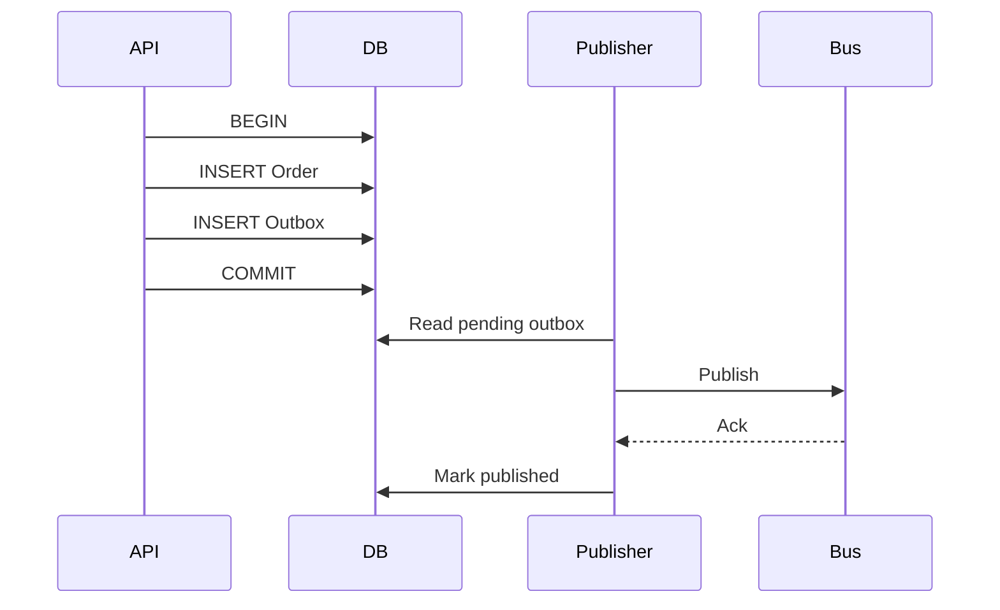

# Daily Knowledge Sharing — 2026-09-23

## Today’s Topics

1. ASP.NET Core DI captive dependency: khi `Singleton` giữ nhầm `Scoped` state
2. EF Core `AsSplitQuery`: tránh cartesian explosion nhưng không miễn phí round trip và consistency
3. SQL keyset pagination: pagination ổn định khi bảng lớn và dữ liệu liên tục thay đổi
4. Cosmos DB partition key: quyết định data distribution, RU cost và khả năng scale từ ngày đầu
5. Transactional Outbox: nối database transaction với message delivery mà không cần distributed transaction
6. Azure Blob Storage SAS: delegated access có giới hạn thay vì đưa storage credential cho client
7. p50 / p95 / p99 latency: average nhanh vẫn có thể che user experience rất tệ
8. JWT validation: signature hợp lệ chưa đủ nếu issuer, audience và lifetime sai
9. Vue/TypeScript request cancellation: tránh stale response ghi đè state mới hơn
10. Git bisect: biến “release nào làm hỏng?” thành tìm kiếm có bằng chứng

---

# 1. ASP.NET Core DI captive dependency: khi `Singleton` giữ nhầm `Scoped` state

## 1. What is it?

Mental model: DI lifetime không chỉ quyết định “object được tạo bao nhiêu lần”; nó quyết định **object được phép sống lâu đến đâu và state nào nó có thể giữ**. Trong ASP.NET Core, `Singleton` sống gần bằng application lifetime, `Scoped` thường sống theo request scope, còn `Transient` được tạo mỗi lần resolve.

Captive dependency xảy ra khi component lifetime dài giữ dependency lifetime ngắn hơn, đặc biệt `Singleton -> Scoped`. Khi đó request-scoped state bị kéo ra khỏi boundary mà nó được thiết kế để tồn tại.

## 2. Why does it exist?

`DbContext`, request context và nhiều unit-of-work objects cần scope rõ để tránh concurrent access và stale state. Nếu một singleton giữ chúng, object đáng lẽ thuộc request A có thể tiếp tục tồn tại khi request B đến.

Vấn đề không nằm ở DI container “khó tính”; lifetime mismatch phá ownership và concurrency assumptions.

## 3. How does it work?

```text
Application lifetime
Singleton Service -------------------------------------->
                       |
                       +--> Scoped DbContext (captured!) --->

Request A scope: [----------------]
Request B scope:                    [----------------]
```

Nếu scope validation bật, container có thể phát hiện một số mismatch ngay startup. Nhưng factory/service locator hoặc manual scope creation sai chỗ vẫn có thể che vấn đề.

## 4. Practical implementation

Sai về lifetime:

```csharp
builder.Services.AddDbContext<AppDbContext>();
builder.Services.AddSingleton<ReportCache>();

public sealed class ReportCache(AppDbContext db)
{
    public Task<int> CountAsync(CancellationToken ct) =>
        db.Orders.CountAsync(ct);
}
```

Tốt hơn: nếu singleton thực sự cần tạo unit of work độc lập, dùng factory có semantics rõ:

```csharp
builder.Services.AddDbContextFactory<AppDbContext>();

public sealed class ReportCache(IDbContextFactory<AppDbContext> factory)
{
    public async Task<int> CountAsync(CancellationToken ct)
    {
        await using var db = await factory.CreateDbContextAsync(ct);
        return await db.Orders.CountAsync(ct);
    }
}
```

Không dùng factory chỉ để né validation; cần xác nhận singleton có thực sự cần thiết.

## 5. Real production scenario

Một background cache refresher được đăng ký `Singleton`, constructor inject `DbContext`. Local test chạy tuần tự nên ổn. Production chạy timer đồng thời với request-triggered refresh và bắt đầu xuất hiện `A second operation was started on this context` hoặc dữ liệu tracking cũ.

## 6. Failure scenario & troubleshooting

**Symptom** → lỗi concurrency ngẫu nhiên, memory giữ entity lâu, dữ liệu đôi lúc stale.

**Evidence** → dependency graph cho thấy singleton giữ scoped service; heap/reference inspection cho thấy `DbContext` sống lâu hơn request.

**Hypothesis** → captive dependency.

**Diagnosis** → kiểm tra registrations, constructor graph và scope creation.

**Fix** → sửa lifetime hoặc tạo scope/unit-of-work đúng boundary.

**Verification** → bật scope validation ở Development/test và chạy concurrent integration test.

## 7. Common mistakes

Đổi mọi service thành `Singleton` để “nhanh hơn”; inject `IServiceProvider` rồi resolve tùy ý; tạo scope nhưng giữ resolved service sau khi scope dispose; giả định stateless class tự động thread-safe.

## 8. Alternatives

Nếu service không cần shared state, `Scoped` hoặc `Transient` thường đơn giản hơn. Với background worker cần scoped dependencies, `IServiceScopeFactory` hoặc `IDbContextFactory` phù hợp tùy ownership model.

## 9. Trade-offs

### Advantages

Singleton giảm số lần tạo object và phù hợp immutable/shared infrastructure.

### Costs / Risks

Đòi hỏi thread safety, không được giữ request-specific state, dễ kéo dependency ngắn hạn thành application lifetime.

## 10. Junior → Middle → Senior → Technical Lead

### Junior

Hiểu ba lifetime và request scope.

### Middle

Chọn lifetime đúng, nhận diện `Singleton -> Scoped`.

### Senior

Phân tích ownership, thread safety, disposal và background scopes.

### Technical Lead / Architect

Đặt convention lifetime cho application services/infrastructure và tránh singleton hóa không có measured need.

## 11. Key takeaway

- DI lifetime là ownership/concurrency contract, không chỉ optimization.
- Dependency không nên sống lâu hơn boundary mà state của nó cho phép.
- Factory/manual scope phải làm boundary rõ hơn, không phải che thiết kế sai.

---

# 2. EF Core `AsSplitQuery`: tránh cartesian explosion nhưng không miễn phí round trip và consistency

## 1. What is it?

Khi query `Include` nhiều collection, EF Core có thể tạo một SQL query lớn với nhiều joins. `AsSplitQuery()` yêu cầu EF Core tải graph bằng nhiều SQL queries thay vì một join khổng lồ.

Mental model: đây là trade-off **result-set duplication vs multiple database operations**, không phải nút “make Include fast”.

## 2. Why does it exist?

Hai collection độc lập cùng được join có thể nhân số rows. Một Order có 20 Items và 10 Notes có thể tạo 200 joined rows trước khi EF materialize lại thành object graph. Payload, database work và network I/O tăng mạnh.

## 3. How does it work?

```text
Single query:
Orders JOIN Items JOIN Notes
1 order x 20 items x 10 notes = potentially 200 rows

Split query:
Query 1 -> Orders
Query 2 -> Items for selected Orders
Query 3 -> Notes for selected Orders
```

EF Core dùng key information để stitch results vào graph ở client side.

## 4. Practical implementation

```csharp
var orders = await db.Orders
    .Where(x => x.CustomerId == customerId)
    .Include(x => x.Items)
    .Include(x => x.Notes)
    .AsSplitQuery()
    .AsNoTracking()
    .ToListAsync(cancellationToken);
```

Nếu endpoint chỉ cần summary, projection thường tốt hơn cả single lẫn split `Include`:

```csharp
var rows = await db.Orders
    .Where(x => x.CustomerId == customerId)
    .Select(x => new
    {
        x.Id,
        ItemCount = x.Items.Count,
        x.Total
    })
    .ToListAsync(cancellationToken);
```

## 5. Real production scenario

Order detail endpoint thêm `Items`, `Notes`, `Payments`. Sau release, SQL duration và response memory tăng mạnh. Generated SQL cho thấy nhiều collection joins. Split query giảm duplicated rows, nhưng projection mới là lựa chọn tốt nhất cho list endpoint.

## 6. Failure scenario & troubleshooting

**Symptom** → sau khi dùng split query, database round trips tăng và latency cao ở region có network latency lớn.

**Evidence** → trace cho thấy một logical EF query phát sinh nhiều SQL commands.

**Hypothesis** → cartesian explosion đã giảm nhưng round-trip cost trở thành bottleneck.

**Diagnosis** → so sánh row counts, bytes, SQL duration và total request duration giữa projection/single/split.

**Fix** → chọn access pattern phù hợp; không mặc định global split query chỉ vì một endpoint có vấn đề.

**Verification** → load test trên data cardinality gần Production.

## 7. Common mistakes

Dùng `Include` để lấy mọi thứ; bật split query mà không đo; quên rằng nhiều statements có thể quan sát database state ở các thời điểm khác nhau tùy transaction/isolation; giải quyết read-model problem bằng entity graph quá lớn.

## 8. Alternatives

Projection là lựa chọn ưu tiên cho API read models. Explicit loading hữu ích khi relation chỉ cần theo condition. Raw SQL/Dapper phù hợp query đặc thù cần control tuyệt đối.

## 9. Trade-offs

### Advantages

Giảm duplicated rows và memory/network cost khi nhiều collections được eager-load.

### Costs / Risks

Nhiều commands, thêm latency, consistency reasoning phức tạp hơn và vẫn có thể tải quá nhiều dữ liệu.

## 10. Junior → Middle → Senior → Technical Lead

### Junior

Hiểu `Include` có thể biến thành joins lớn.

### Middle

Biết xem generated SQL và thử `AsSplitQuery`/projection.

### Senior

Đo cardinality, round trips, isolation và materialization cost.

### Technical Lead / Architect

Quyết định read-model strategy thay vì để domain entity graph trở thành API contract.

## 11. Key takeaway

- `AsSplitQuery` đổi dạng chi phí, không xóa chi phí.
- Projection thường tốt hơn khi API không cần full entity graph.
- Quyết định phải dựa trên generated SQL và Production-like cardinality.

---

# 3. SQL keyset pagination: pagination ổn định khi bảng lớn và dữ liệu liên tục thay đổi

## 1. What is it?

Keyset pagination lấy trang tiếp theo dựa trên **giá trị sort cuối cùng của trang trước**, thay vì `OFFSET N`. Ví dụ sort theo `(CreatedAt DESC, Id DESC)`, cursor chứa cặp giá trị cuối.

## 2. Why does it exist?

`OFFSET 500000` vẫn yêu cầu database tìm/sắp xếp rồi bỏ qua rất nhiều rows. Ngoài ra khi rows mới được insert giữa hai requests, offset có thể làm item bị lặp hoặc bị bỏ qua.

## 3. How does it work?

```sql
SELECT TOP (@PageSize)
    Id, CreatedAt, Total
FROM Orders
WHERE
    CreatedAt < @LastCreatedAt
    OR (CreatedAt = @LastCreatedAt AND Id < @LastId)
ORDER BY CreatedAt DESC, Id DESC;
```

Index phù hợp với ordering cho phép database seek từ cursor thay vì scan/skipping lượng lớn rows.

## 4. Practical implementation

EF Core:

```csharp
var query = db.Orders.AsNoTracking();

if (cursor is not null)
{
    query = query.Where(x =>
        x.CreatedAt < cursor.CreatedAt ||
        (x.CreatedAt == cursor.CreatedAt && x.Id.CompareTo(cursor.Id) < 0));
}

var page = await query
    .OrderByDescending(x => x.CreatedAt)
    .ThenByDescending(x => x.Id)
    .Take(pageSize + 1)
    .Select(x => new OrderRow(x.Id, x.CreatedAt, x.Total))
    .ToListAsync(ct);
```

Sort phải deterministic; `CreatedAt` một mình thường chưa đủ vì nhiều rows có cùng timestamp.

## 5. Real production scenario

Audit log có 50 triệu rows. UI dùng infinite scroll. Offset pagination page đầu nhanh nhưng page sâu lên vài giây. Keyset với composite index `(CreatedAt DESC, Id DESC)` giữ access path gần như ổn định.

## 6. Failure scenario & troubleshooting

**Symptom** → một số records bị duplicate giữa pages.

**Evidence** → cursor chỉ chứa `CreatedAt`; nhiều records cùng timestamp.

**Hypothesis** → ordering không unique.

**Diagnosis** → kiểm tra sort keys và boundary predicate.

**Fix** → thêm stable tie-breaker như `Id` vào cả ORDER BY, cursor và predicate.

**Verification** → test concurrent inserts và timestamps trùng nhau.

## 7. Common mistakes

Cursor không encode toàn bộ sort key; cho phép arbitrary sort nhưng chỉ có một index; expose raw cursor dễ bị client sửa; cần “jump to page 837” nhưng vẫn chọn keyset mà không xét UX requirement.

## 8. Alternatives

Offset pagination đơn giản và phù hợp dataset nhỏ hoặc UI cần page numbers/random access. Snapshot/materialized result phù hợp export/report cần stable full traversal.

## 9. Trade-offs

### Advantages

Hiệu năng ổn định hơn ở deep pages, ít duplicate/skip do inserts trước cursor, phù hợp infinite scroll.

### Costs / Risks

Không jump trực tiếp đến page bất kỳ; cursor encoding phức tạp; dynamic sorting cần index strategy tương ứng.

## 10. Junior → Middle → Senior → Technical Lead

### Junior

Hiểu offset và cursor khác nhau.

### Middle

Implement deterministic cursor và composite ordering.

### Senior

Đọc execution plan, thiết kế index và xử lý concurrent changes.

### Technical Lead / Architect

Chọn pagination semantics dựa trên UX, scale, consistency và query flexibility.

## 11. Key takeaway

- Deep `OFFSET` thường là access-pattern problem.
- Keyset cần stable unique ordering.
- Pagination design phải đi cùng index và UX contract.

---

# 4. Cosmos DB partition key: quyết định data distribution, RU cost và khả năng scale từ ngày đầu

## 1. What is it?

Partition key là giá trị Cosmos DB dùng để phân phối items vào logical partitions, sau đó map lên physical partitions. Nó ảnh hưởng trực tiếp đến locality, throughput distribution và query fan-out.

Mental model: partition key là **routing decision của data model**, không phải secondary index tùy chọn.

## 2. Why does it exist?

Distributed database phải biết dữ liệu nào nên nằm gần nhau và cách chia load qua nodes. Nếu mọi traffic dồn vào một partition key value, thêm tổng RU không tự động loại bỏ hot partition.

## 3. How does it work?

```text
Container
  |
  +-- tenant:A ---> logical partition A ----+
  +-- tenant:B ---> logical partition B ----+--> physical partitions
  +-- tenant:C ---> logical partition C ----+
```

Point read với `id + partition key` có routing rõ và thường rẻ hơn cross-partition query phải fan out.

## 4. Practical implementation

```csharp
var response = await container.ReadItemAsync<OrderDocument>(
    id: orderId,
    partitionKey: new PartitionKey(tenantId),
    cancellationToken: cancellationToken);
```

Nếu SaaS access pattern gần như luôn theo tenant và tenant sizes tương đối cân bằng, `tenantId` có thể là candidate tốt. Nhưng một tenant cực lớn có thể yêu cầu hierarchical/composite modeling strategy khác.

## 5. Real production scenario

Notification system chọn `/status` làm partition key vì query hay filter status. 90% documents có `status = pending`, tạo hotspot đúng lúc campaign lớn. Model tối ưu filter nhưng phá distribution.

## 6. Failure scenario & troubleshooting

**Symptom** → throttling 429 dù container còn tổng throughput đáng kể.

**Evidence** → normalized RU consumption tập trung ở một partition key range; traffic tập trung vào vài key values.

**Hypothesis** → hot partition.

**Diagnosis** → phân tích request distribution theo partition key, item size và access pattern.

**Fix** → thay data model/partition strategy; trong hệ thống đang chạy có thể cần migration sang container mới.

**Verification** → load test với realistic key distribution, không chỉ uniform synthetic data.

## 7. Common mistakes

Chọn field có low cardinality; chọn key chỉ vì query hiện tại; bỏ qua tenant skew; dùng cross-partition query cho request path nóng; nghĩ autoscale RU chữa được bad partitioning.

## 8. Alternatives

SQL/PostgreSQL phù hợp khi relational transactions/query flexibility quan trọng hơn global distribution. MongoDB có sharding model khác nhưng vẫn tồn tại shard-key design problem.

## 9. Trade-offs

### Advantages

Partition key tốt cho scale-out, point routing và predictable access cost.

### Costs / Risks

Key khó thay đổi; sai key dẫn đến hotspot/fan-out; denormalization có thể cần để align access patterns.

## 10. Junior → Middle → Senior → Technical Lead

### Junior

Hiểu partition key quyết định nơi dữ liệu được route.

### Middle

Dùng partition key trong point reads và đo RU.

### Senior

Phân tích cardinality, skew, hot partitions và cross-partition cost.

### Technical Lead / Architect

Chọn key dựa trên workload tương lai, tenant distribution, migration cost và consistency boundaries.

## 11. Key takeaway

- Partition key là architectural data-model decision.
- High total RU không cứu được hotspot thiết kế sai.
- Chọn key từ access pattern + distribution, không từ tên field thuận mắt.

---

# 5. Transactional Outbox: nối database transaction với message delivery mà không cần distributed transaction

## 1. What is it?

Transactional Outbox ghi business state và một outbox record trong **cùng local database transaction**. Một publisher riêng đọc outbox rồi gửi message đến broker. Mục tiêu là tránh trạng thái “DB commit nhưng publish thất bại” hoặc “publish thành công nhưng DB rollback”.

## 2. Why does it exist?

Hai resource độc lập — SQL database và message broker — không thể được cập nhật atomically chỉ bằng hai lệnh tuần tự thông thường.

```text
Save Order -> success
Publish Event -> network timeout
```

Nếu không có recovery mechanism, downstream không bao giờ biết order đã thay đổi.

## 3. How does it work?



Publisher có thể crash sau broker ack nhưng trước `Mark published`; do đó duplicate delivery vẫn có thể xảy ra. Consumer phải idempotent.

## 4. Practical implementation

```csharp
await using var tx = await db.Database.BeginTransactionAsync(ct);

var order = Order.Create(command.CustomerId, command.Items);
db.Orders.Add(order);

db.OutboxMessages.Add(new OutboxMessage
{
    Id = Guid.NewGuid(),
    Type = "OrderCreated",
    Payload = JsonSerializer.Serialize(new { order.Id }),
    OccurredAtUtc = DateTimeOffset.UtcNow
});

await db.SaveChangesAsync(ct);
await tx.CommitAsync(ct);
```

Publisher cần batching, retry/backoff, locking/claim strategy và monitoring backlog.

## 5. Real production scenario

Order API commit order rồi cần gửi `OrderCreated` sang fulfillment qua Azure Service Bus. Broker outage 15 phút không làm mất event: outbox backlog tăng, publisher gửi lại khi broker hồi phục.

## 6. Failure scenario & troubleshooting

**Symptom** → downstream xử lý cùng event hai lần.

**Evidence** → outbox message có hai publish attempts quanh thời điểm publisher restart.

**Hypothesis** → crash window sau broker ack trước outbox status update.

**Diagnosis** → correlate message ID, publisher logs và consumer inbox/dedup records.

**Fix** → consumer idempotency/inbox unique key; không cố giả định publisher exactly-once.

**Verification** → fault-injection tại các điểm trước/sau publish/ack.

## 7. Common mistakes

Gọi broker bên trong DB transaction và giữ lock trong lúc network I/O; xóa outbox quá sớm; không alert backlog age; payload schema không version; tin rằng Outbox tự tạo exactly-once end-to-end.

## 8. Alternatives

Distributed transaction/2PC hiếm khi phù hợp cloud messaging và tăng coupling. CDC có thể publish database changes nhưng operational model khác. Với non-critical notification, đôi khi best-effort đơn giản đủ tốt.

## 9. Trade-offs

### Advantages

Không mất message sau DB commit, dùng local transaction quen thuộc, chịu broker outage tốt hơn.

### Costs / Risks

Thêm table, publisher, cleanup, lag, duplicate handling và observability.

## 10. Junior → Middle → Senior → Technical Lead

### Junior

Hiểu DB và broker là hai failure domains.

### Middle

Implement atomic business + outbox write.

### Senior

Thiết kế publisher concurrency, idempotency, cleanup và failure injection.

### Technical Lead / Architect

Quyết định consistency SLA có đáng với Outbox complexity và ai sở hữu vận hành pipeline.

## 11. Key takeaway

- Outbox giải quyết atomicity của **intent to publish**, không tạo exactly-once delivery.
- Duplicate delivery vẫn là normal condition.
- Backlog age và publish failure phải là production signals.

---

# 6. Azure Blob Storage SAS: delegated access có giới hạn thay vì đưa storage credential cho client

## 1. What is it?

Shared Access Signature (SAS) là token cho phép delegated access tới Azure Storage với phạm vi quyền và thời hạn cụ thể. Backend có thể cấp quyền upload/read giới hạn mà không proxy toàn bộ file bytes và không đưa account key cho browser/mobile app.

## 2. Why does it exist?

Upload file 2 GB qua Web API làm application chịu bandwidth, connection duration và memory/streaming complexity không cần thiết. Nhưng cho client storage account credential là unacceptable vì quyền quá rộng và khó revoke.

## 3. How does it work?

```text
Client ---> API: request upload authorization
API ------> Client: short-lived SAS for one blob/container scope
Client ---> Blob Storage: PUT directly with SAS
Client ---> API: confirm metadata/business workflow
```

Backend vẫn giữ authorization decision: user nào được upload file nào. SAS chỉ delegated data-plane permission sau khi quyết định đó được thực hiện.

## 4. Practical implementation

Với Azure-hosted backend, ưu tiên Managed Identity + user delegation SAS thay vì lưu account key. Pseudo-flow C# gần thực tế:

```csharp
var blob = container.GetBlobClient(blobName);
// Service obtains a user delegation key using its Azure identity,
// then builds a SAS restricted to the required blob, permission and expiry.
```

Policy nên giới hạn permission (`Create`/`Write` hoặc `Read`), expiry ngắn, HTTPS-only và blob path do server kiểm soát.

## 5. Real production scenario

CMS cho editor upload video. API kiểm tra role/editor workflow, tạo blob name server-side và cấp upload SAS 10 phút. Browser upload thẳng Blob Storage; API không phải giữ request 2 GB.

## 6. Failure scenario & troubleshooting

**Symptom** → user nhận 403 khi upload dù SAS vừa cấp.

**Evidence** → Storage logs cho thấy permission/time mismatch; server/client clock hoặc signed resource không đúng.

**Hypothesis** → SAS scope/permission/start time sai.

**Diagnosis** → kiểm tra signed permissions, expiry, resource path và clock skew; không log full SAS token.

**Fix** → dùng UTC, tránh start time quá sát nếu không cần, giới hạn đúng resource/operation.

**Verification** → test allowed operation thành công và disallowed read/list/delete bị từ chối.

## 7. Common mistakes

SAS sống nhiều ngày; cấp container-wide `rwdl` khi chỉ cần write một blob; đưa account key vào frontend; log URL chứa SAS; tin SAS thay thế application authorization; không validate file type/size sau upload.

## 8. Alternatives

Backend streaming phù hợp khi server phải inspect/transform bytes inline. Private API + Managed Identity phù hợp server-to-server. Public blob chỉ phù hợp nội dung thực sự public.

## 9. Trade-offs

### Advantages

Giảm application bandwidth, scale upload tốt, least-privilege delegation.

### Costs / Risks

Token bị lộ có thể dùng đến khi hết hạn; revoke granular SAS không luôn đơn giản; client flow phức tạp hơn.

## 10. Junior → Middle → Senior → Technical Lead

### Junior

Hiểu SAS là temporary delegated permission.

### Middle

Tạo scope/expiry/permission tối thiểu và direct-upload flow.

### Senior

Thiết kế Managed Identity, user delegation, validation, audit và abuse controls.

### Technical Lead / Architect

Quyết định data path, security boundary, lifecycle và cost cho large-file architecture.

## 11. Key takeaway

- Không đưa storage account key cho client.
- SAS phải ngắn hạn và least privilege.
- Direct upload giảm app load nhưng authorization/business validation vẫn thuộc backend.

---

# 7. p50 / p95 / p99 latency: average nhanh vẫn có thể che user experience rất tệ

## 1. What is it?

Percentile latency mô tả phân phối: p95 = 95% requests hoàn thành không chậm hơn giá trị đó; 5% còn lại chậm hơn. p50 gần median, p99 tập trung tail latency.

Average có thể bị che bởi lượng lớn request rất nhanh trong khi một nhóm user chịu latency cực cao.

## 2. Why does it exist?

Production performance không đồng đều: cache hit/miss, GC, SQL plans, tenant size, dependency retries và network đều tạo tail. SLO thường quan tâm trải nghiệm phần lớn users hoặc critical endpoint hơn một con số trung bình.

## 3. How does it work?

Ví dụ 100 requests: 95 requests = 100 ms, 5 requests = 5 s.

Average khoảng 345 ms nghe chưa quá xấu, nhưng 5% users đợi 5 giây. p95/p99 làm tail visible hơn.

Metrics backend thường dùng histogram/distribution để tính percentile trên time window; không nên tự average các percentile values từ nhiều instances.

## 4. Practical implementation

Trong OpenTelemetry, record request/dependency duration bằng histogram và gắn dimensions có cardinality kiểm soát:

```csharp
private static readonly Histogram<double> Duration =
    Meter.CreateHistogram<double>("checkout.duration", "ms");

var sw = Stopwatch.StartNew();
try
{
    await checkout.ExecuteAsync(ct);
}
finally
{
    Duration.Record(sw.Elapsed.TotalMilliseconds);
}
```

Không gắn `orderId` làm metric label vì cardinality sẽ bùng nổ.

## 5. Real production scenario

Checkout average = 280 ms sau release, gần như không đổi. Nhưng p99 tăng từ 1.2 s lên 8 s. Trace của slow cohort cho thấy cache miss dẫn tới SQL query với plan xấu cho tenant lớn.

## 6. Failure scenario & troubleshooting

**Symptom** → dashboard average xanh nhưng support báo timeout.

**Evidence** → p99 và timeout count tăng; phân đoạn theo endpoint/region cho thấy một nhóm bị ảnh hưởng.

**Hypothesis** → tail latency bị average che.

**Diagnosis** → exemplar/trace từ slow requests, dependency spans và SQL telemetry.

**Fix** → sửa bottleneck thật; không “tối ưu percentile” bằng bỏ telemetry slow requests.

**Verification** → so p50/p95/p99 trước-sau dưới cùng workload.

## 7. Common mistakes

Chỉ xem average; dùng p99 với sample quá nhỏ rồi phản ứng quá mức; tạo high-cardinality metric dimensions; aggregate percentile sai; tối ưu p50 trong khi SLO fail ở p95.

## 8. Alternatives

Apdex hoặc SLO success ratio có thể dễ diễn giải cho product/operations. Heatmap/histogram cho thấy toàn distribution. Percentiles nên đi cùng error rate và throughput.

## 9. Trade-offs

### Advantages

Lộ tail latency, phù hợp SLO và user experience hơn average.

### Costs / Risks

Percentile cao nhiễu ở traffic thấp; telemetry storage/cardinality có chi phí; cần hiểu aggregation semantics.

## 10. Junior → Middle → Senior → Technical Lead

### Junior

Biết p95 không phải average.

### Middle

Đọc dashboard p50/p95/p99 cùng throughput/error rate.

### Senior

Segment slow cohorts, correlate traces và hiểu histogram/cardinality.

### Technical Lead / Architect

Đặt SLI/SLO theo business journey và cân bằng telemetry fidelity với cost.

## 11. Key takeaway

- Average không mô tả tail latency.
- Percentile phải được đọc cùng traffic, errors và sample size.
- Điều tra performance phải đi từ metric tới trace/evidence cụ thể.

---

# 8. JWT validation: signature hợp lệ chưa đủ nếu issuer, audience và lifetime sai

## 1. What is it?

JWT access token là signed security artifact chứa claims. Validation đúng không chỉ verify cryptographic signature mà còn kiểm tra token có đến từ trusted issuer, dành cho API này (`audience`), còn hiệu lực và đáp ứng authorization policy.

Authentication trả lời “token có đại diện principal hợp lệ không”; authorization trả lời “principal có được phép làm action này không”.

## 2. Why does it exist?

Một token có signature hợp lệ từ cùng identity platform vẫn có thể được phát cho resource/API khác. Nếu API chỉ kiểm tra signature và bỏ audience, token dành cho service A có thể bị replay vào service B.

## 3. How does it work?

```text
Bearer token
   |
   v
Parse header/claims
   |
   +--> trusted signing key?
   +--> issuer allowed?
   +--> audience == this API?
   +--> nbf/exp valid?
   v
Authenticated principal
   |
   v
Authorization policy/claims/scopes
```

Key rotation thường được xử lý qua issuer metadata/JWKS; hard-code một signing key tạo operational problem.

## 4. Practical implementation

```csharp
builder.Services
    .AddAuthentication(JwtBearerDefaults.AuthenticationScheme)
    .AddJwtBearer(options =>
    {
        options.Authority = configuration["Auth:Authority"];
        options.Audience = configuration["Auth:Audience"];
        options.RequireHttpsMetadata = true;
    });

builder.Services.AddAuthorization(options =>
{
    options.AddPolicy("orders.read", policy =>
        policy.RequireClaim("scope", "orders.read"));
});
```

Production configuration phải theo semantics claims của identity provider; scope claim representation có thể khác.

## 5. Real production scenario

Hai APIs dùng cùng Microsoft Entra tenant. API B vô tình disable audience validation. Access token phát cho API A được API B chấp nhận vì signature/issuer đều hợp lệ. Đây là trust-boundary bug, không phải crypto bug.

## 6. Failure scenario & troubleshooting

**Symptom** → token chạy local nhưng Production trả 401.

**Evidence** → logs an toàn cho thấy issuer/audience mismatch hoặc clock/lifetime validation fail.

**Hypothesis** → environment dùng authority/audience khác hoặc token được lấy cho sai resource.

**Diagnosis** → inspect non-sensitive claims, identity metadata và app registration configuration; không paste production token vào logs/tools không tin cậy.

**Fix** → sửa token acquisition/configuration, không tắt validation để “cho chạy”.

**Verification** → negative tests: wrong audience, expired token, missing scope đều phải fail.

## 7. Common mistakes

Decode JWT rồi coi là validated; tắt issuer/audience/lifetime checks; dùng role thay cho resource-specific scope không có design; log raw access token; tự implement signature validation khi framework đã hỗ trợ chuẩn.

## 8. Alternatives

Opaque/reference token + introspection phù hợp một số architectures nhưng thêm network dependency. Cookie authentication phù hợp browser web app với CSRF considerations. Managed Identity tốt cho Azure service-to-service khi phù hợp.

## 9. Trade-offs

### Advantages

JWT validation local giảm introspection round trip và scale tốt.

### Costs / Risks

Revocation không tức thời theo mặc định, claim/token lifetime design phức tạp, misconfiguration dễ mở rộng trust ngoài ý muốn.

## 10. Junior → Middle → Senior → Technical Lead

### Junior

Phân biệt decode và validate; authentication và authorization.

### Middle

Cấu hình authority/audience và policy-based authorization.

### Senior

Phân tích token acquisition, key rotation, scopes, clock skew và multi-tenant trust.

### Technical Lead / Architect

Định nghĩa issuer/resource boundaries, service identity strategy và least-privilege authorization model.

## 11. Key takeaway

- Signature hợp lệ chỉ là một phần của token validation.
- Issuer, audience, lifetime và authorization claims đều là security boundary.
- Không sửa 401 Production bằng cách tắt validation.

---

# 9. Vue/TypeScript request cancellation: tránh stale response ghi đè state mới hơn

## 1. What is it?

Frontend cancellation dùng `AbortController` để hủy fetch/request không còn giá trị. Nhưng mục tiêu quan trọng hơn là quản lý **request race**: response cũ không được ghi đè state của request mới.

## 2. Why does it exist?

Search-as-you-type có thể gửi query `car`, rồi `cargo`. Network không đảm bảo response `car` về trước `cargo`. Nếu component cập nhật state theo “response nào về cuối”, UI có thể hiển thị kết quả cũ.

## 3. How does it work?

```text
Request A: q=car   ----------- response A (late)
Request B: q=cargo ----- response B

Without cancellation/version check:
B updates UI -> A arrives -> stale A overwrites UI
```

Abort signal cho browser/client biết operation cũ không còn cần thiết. Backend vẫn nên nhận request cancellation nhưng không được giả định mọi server-side side effect đã rollback.

## 4. Practical implementation

```ts
let activeController: AbortController | null = null;

async function search(query: string) {
  activeController?.abort();
  const controller = new AbortController();
  activeController = controller;

  try {
    const response = await fetch(`/api/search?q=${encodeURIComponent(query)}`, {
      signal: controller.signal
    });
    if (!response.ok) throw new Error(`HTTP ${response.status}`);
    results.value = await response.json();
  } catch (error) {
    if ((error as DOMException).name !== "AbortError") throw error;
  }
}
```

Debounce có thể giảm request count nhưng không thay thế race protection hoàn toàn.

## 5. Real production scenario

Automotive marketplace filter thay đổi nhanh theo brand/model/location. User thấy list “nhảy ngược” về filter trước do slow Elasticsearch request cũ về sau request mới.

## 6. Failure scenario & troubleshooting

**Symptom** → UI thỉnh thoảng hiển thị data không khớp filter hiện tại.

**Evidence** → DevTools Network cho thấy request cũ hoàn thành sau request mới.

**Hypothesis** → stale-response race.

**Diagnosis** → correlate query parameters, start/end time và state update sequence.

**Fix** → abort previous request hoặc gắn request sequence/version và chỉ accept latest response.

**Verification** → throttle network trong DevTools và thay filter liên tục.

## 7. Common mistakes

Chỉ debounce; hiển thị AbortError như lỗi user-facing; abort request nhưng backend vẫn thực hiện mutation và frontend tưởng transaction bị hủy; quên cleanup khi component unmount.

## 8. Alternatives

Latest-request sequence number đơn giản và đáng tin cho libraries không hỗ trợ abort. Data-fetching libraries có stale/cache/request management sẵn nhưng thêm abstraction.

## 9. Trade-offs

### Advantages

Giảm wasted work và stale UI, cải thiện perceived correctness.

### Costs / Risks

Cancellation semantics xuyên network không phải atomic rollback; code state management phức tạp hơn.

## 10. Junior → Middle → Senior → Technical Lead

### Junior

Hiểu responses có thể về khác thứ tự requests.

### Middle

Dùng AbortController và handle AbortError đúng.

### Senior

Phân biệt cancellation, debounce, deduplication và mutation idempotency.

### Technical Lead / Architect

Định nghĩa frontend data-fetching convention và API cancellation/idempotency semantics cho critical flows.

## 11. Key takeaway

- Request order không đảm bảo response order.
- Cancellation là optimization/correctness aid, không phải distributed rollback.
- Search/filter UI cần explicit stale-response strategy.

---

# 10. Git bisect: biến “release nào làm hỏng?” thành tìm kiếm có bằng chứng

## 1. What is it?

`git bisect` dùng binary search trên commit history để tìm commit đầu tiên làm behavior chuyển từ good sang bad. Thay vì đọc tuần tự hàng trăm commits, Git chọn midpoint và thu hẹp khoảng tìm kiếm theo kết quả test.

## 2. Why does it exist?

Production regression thường có symptom rõ nhưng root cause commit chưa rõ. “Review tất cả PR tuần này” vừa chậm vừa dễ bias. Nếu có reproducible pass/fail test, commit history trở thành searchable state space.

## 3. How does it work?

```text
known good ----------------------------- known bad
                    ^ test midpoint

bad midpoint  -> search left half
 good midpoint -> search right half
```

Với khoảng 128 commits, lý tưởng chỉ cần khoảng 7 bước thay vì inspect 128 commits.

## 4. Practical implementation

```bash
git bisect start
git bisect bad HEAD
git bisect good v2.4.0

# Git checks out a midpoint. Run reproduction/test:
dotnet test tests/Regression.Tests --filter "CheckoutLatencyRegression"

# Mark each midpoint:
git bisect good
# or
git bisect bad

# When finished:
git bisect reset
```

Nếu có deterministic script, `git bisect run <script>` có thể tự động hóa.

## 5. Real production scenario

Sau release, generated SQL cho một endpoint đổi và latency tăng. Team biết tag tuần trước tốt, current main xấu. Một integration test kiểm tra query behavior/reproduction được dùng với bisect để tìm commit thay navigation loading strategy.

## 6. Failure scenario & troubleshooting

**Symptom** → bisect chỉ ra commit khác nhau giữa các lần chạy.

**Evidence** → test reproduction flaky, phụ thuộc timing/external service/data không cố định.

**Hypothesis** → good/bad oracle không deterministic.

**Diagnosis** → chạy cùng commit nhiều lần và kiểm tra environment/data dependencies.

**Fix** → tạo deterministic regression test hoặc stable reproduction trước khi bisect.

**Verification** → candidate commit bad ổn định, parent commit good ổn định; revert/fix làm test pass.

## 7. Common mistakes

Chọn “good” commit chưa thực sự good; bisect bằng manual cảm giác thay vì test; history chứa commits không build được mà không dùng `skip`; coi commit được tìm thấy là root cause tuyệt đối mà không đọc diff và mechanism.

## 8. Alternatives

PR/deployment telemetry có thể khoanh release nhanh hơn. `git log`, blame và code search hữu ích khi biết vùng code. Feature flags giúp isolate behavior mà không cần history search.

## 9. Trade-offs

### Advantages

Giảm search space theo logarithm, evidence-driven, rất mạnh khi regression reproducible.

### Costs / Risks

Cần reliable good/bad test; historical commits có thể không build; merge-heavy history có thể khó diễn giải.

## 10. Junior → Middle → Senior → Technical Lead

### Junior

Biết bisect cần một known-good và known-bad point.

### Middle

Dùng bisect với regression test ổn định.

### Senior

Xử lý flaky oracle, non-buildable commits và xác nhận causal mechanism sau khi tìm candidate.

### Technical Lead / Architect

Đầu tư observability/regression tests để incident có thể được bisect nhanh và giữ commits đủ coherent để history hữu ích.

## 11. Key takeaway

- `git bisect` mạnh nhất khi pass/fail criterion deterministic.
- Commit được bisect tìm ra là điểm điều tra, vẫn cần hiểu mechanism.
- Regression test tốt biến incident hiện tại thành protection cho tương lai.
