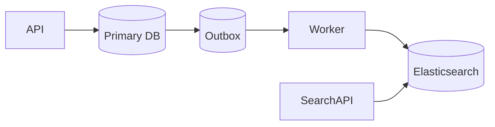
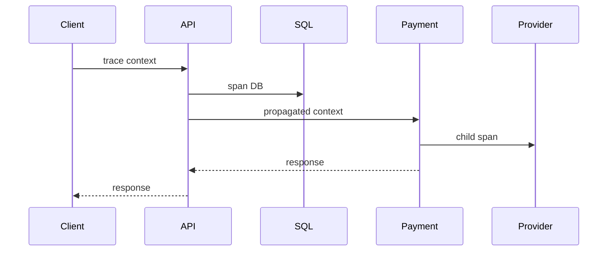

# Daily Knowledge Sharing — 2026-09-23

## Today’s Topics

1. .NET ThreadPool starvation: vì sao `async` API vẫn có thể nghẽn khi code block thread
2. EF Core projection: giảm materialization, tracking và data transfer bằng cách query đúng shape cần dùng
3. SQL Server deadlock: đọc wait-for graph thay vì tăng timeout hoặc retry mù
4. Elasticsearch synchronization: giữ search index eventual-consistent với primary database
5. Modular Monolith boundaries: cô lập thay đổi mà chưa trả operational cost của Microservices
6. Azure Service Bus dead-letter queue: DLQ là nơi điều tra poison message, không phải thùng rác
7. Kubernetes readiness vs liveness probes: đừng biến dependency outage thành restart storm
8. OpenTelemetry trace context: nối một request xuyên API, database và external dependency
9. Webhook security: xác minh signature, chống replay và xử lý delivery theo idempotency
10. LLM Structured Outputs: ép shape dữ liệu nhưng không biến model output thành business truth

---

# 1. .NET ThreadPool starvation: vì sao `async` API vẫn có thể nghẽn khi code block thread

## 1. What is it?

Mental model: ThreadPool là tập worker threads dùng để thực thi rất nhiều work items của .NET. ThreadPool starvation xảy ra khi các worker hiện có bị chiếm giữ lâu hơn mức cần thiết trong khi hàng đợi tiếp tục tăng, khiến work mới phải chờ dù CPU chưa chắc đã đạt 100%.

Trong web backend, nguyên nhân kinh điển là biến asynchronous I/O thành blocking bằng `.Result`, `.Wait()`, synchronous I/O hoặc giữ thread trong critical section quá lâu.

## 2. Why does it exist?

Thread là tài nguyên hữu hạn và đắt hơn một `Task`. Async I/O tồn tại để thread có thể quay lại pool trong lúc chờ network/database. Nếu ta block thread trong thời gian chờ I/O, scalability model đó bị phá vỡ.

Một service có thể xử lý 100 request bình thường nhưng suy sụp ở 1.000 concurrent requests không phải vì database chậm hơn nhiều, mà vì hàng trăm threads đang đứng chờ database thay vì được trả về pool.

## 3. How does it work?

```text
Request -> ThreadPool worker -> start I/O

Async đúng:
worker -> I/O pending -> worker trả về pool
                    -> completion -> worker tiếp tục continuation

Blocking:
worker -> .Result -> giữ worker trong lúc I/O pending
worker -> .Result -> giữ worker
worker -> .Result -> giữ worker
new request --------> chờ worker
```

ThreadPool có cơ chế tăng số worker, nhưng việc injection thread có kiểm soát; nó không thể lập tức tạo vô hạn threads mà không gây scheduling/memory cost.

## 4. Practical implementation

Không làm:

```csharp
public IActionResult Get()
{
    var result = _client.GetFromJsonAsync<OrderDto[]>("orders").Result;
    return Ok(result);
}
```

Giữ async xuyên call chain:

```csharp
public async Task<IResult> GetOrders(
    HttpClient client,
    CancellationToken cancellationToken)
{
    var orders = await client.GetFromJsonAsync<OrderDto[]>(
        "orders", cancellationToken);

    return Results.Ok(orders);
}
```

Với CPU-bound work, `async` không làm computation rẻ hơn. Cần giới hạn concurrency hoặc đưa heavy work sang worker phù hợp thay vì `Task.Run` vô điều kiện trong request path.

## 5. Real production scenario

Sau release, API checkout vẫn có CPU khoảng 45% nhưng p95 tăng từ 300 ms lên 8 giây. Một helper mới gọi external fraud API bằng `.Result`. Khi traffic tăng, request threads bị giữ trong lúc network I/O; request queue tăng và cả endpoint không liên quan cũng chậm.

## 6. Failure scenario & troubleshooting

**Symptom** → latency tăng mạnh theo concurrency, CPU không nhất thiết full, request queue tăng.

**Evidence** → `dotnet-counters` cho thấy ThreadPool queue length/thread count tăng; traces cho thấy thời gian chờ lớn; stack dump có nhiều `.Wait()`/`.Result`.

**Hypothesis** → sync-over-async hoặc blocking work đang giữ workers.

**Diagnosis** → correlate deployment, stack traces và ThreadPool metrics.

**Fix** → async all the way, bỏ blocking I/O, giới hạn expensive concurrency.

**Verification** → load test cùng concurrency và so sánh p95/p99, queue length, thread count.

## 7. Common mistakes

Dùng `Task.Run` để “biến thành async”; chỉ nhìn CPU; tăng minimum ThreadPool threads như permanent fix; bỏ `CancellationToken`; dùng synchronous SDK trong hot request path mà không đo.

## 8. Alternatives

CPU-heavy workload có thể dùng bounded background queue/Worker Service. Legacy synchronous dependency có thể cần isolation và concurrency limit trong lúc migration.

## 9. Trade-offs

### Advantages

Async I/O tăng khả năng phục vụ concurrent requests với ít blocked threads hơn.

### Costs / Risks

Async lan qua call chain, debugging phức tạp hơn và không giúp CPU-bound work tự nhiên nhanh hơn.

## 10. Junior → Middle → Senior → Technical Lead

### Junior

Phân biệt `Task` với thread và hiểu `await` không đồng nghĩa tạo thread mới.

### Middle

Viết async xuyên controller/service/repository và truyền cancellation.

### Senior

Nhận diện starvation từ runtime metrics, traces và dumps; phân biệt nó với CPU saturation hay slow dependency.

### Technical Lead / Architect

Quyết định workload nào ở request path, workload nào cần queue/worker và đặt concurrency boundary ở đâu.

## 11. Key takeaway

- Async I/O chỉ có giá trị khi không block thread trong lúc chờ.
- ThreadPool starvation có thể xảy ra trước khi CPU đạt 100%.
- Chẩn đoán bằng runtime evidence và load behavior, không bằng việc tăng thread theo cảm tính.

---

# 2. EF Core projection: query đúng shape thay vì materialize cả entity graph

## 1. What is it?

Projection là dùng `Select` để yêu cầu database trả về đúng fields/shape cần cho use case thay vì materialize toàn bộ entities. Đây không chỉ là syntax LINQ; nó thay đổi SQL, lượng dữ liệu truyền, change tracking và allocation phía application.

## 2. Why does it exist?

Một read endpoint thường chỉ cần 5 fields nhưng entity có 30 columns và nhiều navigation properties. Load toàn bộ entity làm tăng I/O, network payload, materialization và có thể vô tình kéo theo tracking không cần thiết.

## 3. How does it work?

EF Core phân tích expression tree của `Select`, dịch những phần hỗ trợ sang SQL và materialize DTO/anonymous shape từ result set.

```text
LINQ Select
   -> expression tree
   -> SQL translation
   -> SELECT required columns
   -> database result
   -> DTO materialization
```

Projection trước terminal operation giữ computation ở database nếu expression có thể translate.

## 4. Practical implementation

```csharp
public sealed record OrderListItem(
    long Id,
    string Number,
    decimal Total,
    string CustomerName);

var items = await db.Orders
    .Where(x => x.Status == OrderStatus.Paid)
    .OrderByDescending(x => x.CreatedAt)
    .Select(x => new OrderListItem(
        x.Id,
        x.Number,
        x.Total,
        x.Customer.Name))
    .Take(100)
    .ToListAsync(ct);
```

Kiểm tra generated SQL bằng logging hoặc `ToQueryString()` trong investigation; đừng đoán từ LINQ.

## 5. Real production scenario

Order listing endpoint trước đây `Include` Customer, Lines, Product chỉ để render 6 fields. Payload SQL và allocations tăng theo số lines. Chuyển sang projection tạo một read model nhỏ, giảm rows/columns và bỏ entity tracking khỏi read path.

## 6. Failure scenario & troubleshooting

**Symptom** → query endpoint đọc chậm, allocations cao, SQL trả nhiều columns/rows.

**Evidence** → generated SQL có joins/columns không dùng; profiler cho thấy materialization lớn.

**Hypothesis** → entity graph quá rộng so với response contract.

**Diagnosis** → map từng response field về query requirement.

**Fix** → projection, pagination và aggregate trực tiếp ở database khi hợp lý.

**Verification** → so sánh SQL logical reads, duration, payload và application allocations.

## 7. Common mistakes

Gọi `ToListAsync()` rồi mới `Select`; dùng `Include` trước projection mà không cần; trả EF entities trực tiếp từ API; giả định `AsNoTracking` tự giảm columns; viết helper không translate được rồi ép client-side work.

## 8. Alternatives

Entity materialization phù hợp cho command/update flow cần invariants và tracking. Raw SQL/Dapper hữu ích khi query cực kỳ đặc thù nhưng tăng mapping/maintenance responsibility.

## 9. Trade-offs

### Advantages

Giảm data transfer, allocations và accidental coupling giữa API contract với persistence entity.

### Costs / Risks

Nhiều use-case-specific DTOs hơn; projection phức tạp có thể khó đọc và vẫn cần kiểm tra SQL translation.

## 10. Junior → Middle → Senior → Technical Lead

### Junior

Hiểu `Select` quyết định dữ liệu được lấy.

### Middle

Thiết kế projection DTO và xác minh generated SQL.

### Senior

Đánh giá I/O, joins, translation và materialization cost thay vì chỉ nhìn LINQ.

### Technical Lead / Architect

Chọn read model boundary phù hợp; không ép domain entity phục vụ mọi read contract.

## 11. Key takeaway

- Read path nên query shape mà consumer thực sự cần.
- `AsNoTracking` và projection giải quyết hai vấn đề khác nhau.
- Luôn xác minh SQL và measurement trước/sau thay đổi.

---

# 3. SQL Server deadlock: đọc wait-for graph thay vì tăng timeout hoặc retry mù

## 1. What is it?

Deadlock xảy ra khi các transactions tạo chu kỳ chờ tài nguyên: transaction A giữ resource X và chờ Y, transaction B giữ Y và chờ X. SQL Server phát hiện cycle và chọn một victim để rollback nhằm phá deadlock.

## 2. Why does it exist?

Transactions cần locking để bảo vệ consistency. Khi nhiều transaction lấy locks theo thứ tự khác nhau hoặc giữ transaction quá lâu, legitimate locking có thể tạo circular wait. Đây khác blocking thông thường: blocking có thể tự hết; deadlock cycle không thể tự tiến triển.

## 3. How does it work?

```text
T1: lock Order 42 -------> waits Customer 7
      ^                         |
      |                         v
T2: waits Order 42 <------ lock Customer 7
```

Database deadlock detector chọn victim dựa trên cost/priorities, rollback transaction đó và trả deadlock error.

## 4. Practical implementation

Giữ thứ tự access nhất quán:

```sql
BEGIN TRANSACTION;

UPDATE dbo.Customers
SET UpdatedAt = SYSUTCDATETIME()
WHERE Id = @CustomerId;

UPDATE dbo.Orders
SET Status = @Status
WHERE Id = @OrderId;

COMMIT;
```

Mọi code path liên quan nên cố lấy Customer rồi Order theo cùng order. Retry chỉ nên dùng cho transaction được thiết kế idempotent/retriable và sau khi hiểu root cause.

## 5. Real production scenario

Checkout flow update Order rồi Customer; nightly reconciliation update Customer rồi Order. Ban ngày ít va chạm. Khi batch chạy lúc peak traffic, deadlock tăng đột biến và một phần requests trả 500.

## 6. Failure scenario & troubleshooting

**Symptom** → SQL error 1205 xuất hiện theo burst.

**Evidence** → Extended Events deadlock graph cho biết victim, processes, resources, lock modes và statements.

**Hypothesis** → hai transaction access cùng resources theo thứ tự đối nghịch hoặc scan khóa quá rộng.

**Diagnosis** → đọc graph, map statements về application paths, kiểm tra indexes và transaction duration.

**Fix** → consistent access order, rút ngắn transaction, cải thiện access path/index nếu scan mở rộng lock footprint; retry có bounded backoff nếu operation an toàn.

**Verification** → replay concurrent workload và theo dõi deadlock event count.

## 7. Common mistakes

Tăng command timeout; thêm `NOLOCK` bừa bãi; retry vô hạn; chỉ tối ưu victim query mà không xem transaction đối diện; gọi remote API bên trong DB transaction.

## 8. Alternatives

Optimistic concurrency giải quyết lost update nhưng không loại mọi lock/deadlock. Snapshot-based isolation có thể giảm một số reader/writer contention nhưng thay đổi semantics và tempdb/version-store cost.

## 9. Trade-offs

### Advantages

Transactions/locks cung cấp consistency mạnh và isolation rõ.

### Costs / Risks

Lock scope và duration tăng contention; isolation mạnh hơn thường đổi lấy concurrency thấp hơn hoặc versioning cost.

## 10. Junior → Middle → Senior → Technical Lead

### Junior

Phân biệt blocking và deadlock.

### Middle

Giữ transaction ngắn, access order ổn định và biết lấy deadlock graph.

### Senior

Đọc resource graph, execution plan, lock footprint và thiết kế retry có điều kiện.

### Technical Lead / Architect

Thiết kế transaction boundary và batch scheduling để giảm contention thay vì xử lý deadlock như exception ngẫu nhiên.

## 11. Key takeaway

- Deadlock là cycle của resource ownership/waiting.
- Deadlock graph là evidence chính; timeout không chữa root cause.
- Retry là resilience layer sau khi transaction semantics và root cause đã được hiểu.

---

# 4. Elasticsearch synchronization: giữ search index eventual-consistent với primary database

## 1. What is it?

Khi SQL/database là source of truth và Elasticsearch phục vụ search, hệ thống cần synchronization mechanism để biến domain/data changes thành index updates. Hai stores không cùng transaction boundary, nên search view thường eventual-consistent.

## 2. Why does it exist?

Dual-write trực tiếp `DB.Save(); Elasticsearch.Index();` tạo failure window: DB thành công nhưng indexing thất bại, hoặc ngược lại. Search index sẽ drift nếu không có durable mechanism để retry/rebuild.

## 3. How does it work?



DB change và outbox record commit cùng transaction. Worker publish/process event và update index. Elasticsearch có thể lag nhưng event không bị mất chỉ vì process crash sau DB commit.

## 4. Practical implementation

Một outbox event nên mang stable entity ID và version/time để consumer có thể re-read canonical state:

```csharp
public sealed record ProductChanged(long ProductId, long Version);

// Consumer
var product = await db.Products
    .AsNoTracking()
    .SingleOrDefaultAsync(x => x.Id == message.ProductId, ct);

if (product is null)
    await elastic.DeleteAsync<ProductDocument>(message.ProductId, ct);
else
    await elastic.IndexAsync(ProductDocument.From(product), ct);
```

Consumer phải chịu được duplicate delivery và out-of-order events theo strategy rõ ràng.

## 5. Real production scenario

Merchandiser đổi tên sản phẩm trong CMS/PIM. Product API đọc tên mới ngay từ database, nhưng search results vẫn hiển thị tên cũ trong 20 giây. Đây có thể là acceptable eventual consistency nếu có SLO về indexing lag và recovery path.

## 6. Failure scenario & troubleshooting

**Symptom** → sản phẩm tồn tại trong DB nhưng biến mất hoặc stale trong search.

**Evidence** → outbox backlog, consumer errors, Elasticsearch indexing rejection, version mismatch.

**Hypothesis** → synchronization lag/failure thay vì search query bug.

**Diagnosis** → trace entity ID qua outbox → queue → consumer → ES document.

**Fix** → repair consumer, retry poison-safe records, replay/reindex từ source of truth.

**Verification** → compare sampled canonical records với indexed documents và monitor indexing lag.

## 7. Common mistakes

Dual-write không durable; coi Elasticsearch là transactional source; không có reindex strategy; event thiếu stable ID/version; retry duplicate làm document lùi về version cũ.

## 8. Alternatives

CDC có thể capture database changes; scheduled batch sync đơn giản hơn cho freshness thấp; direct synchronous indexing phù hợp một số low-risk flows nhưng vẫn cần reconciliation.

## 9. Trade-offs

### Advantages

Search được tối ưu độc lập, full-text/relevance mạnh và read latency tốt.

### Costs / Risks

Thêm data pipeline, eventual consistency, operational monitoring và reindex complexity.

## 10. Junior → Middle → Senior → Technical Lead

### Junior

Hiểu DB và search index có vai trò khác nhau.

### Middle

Implement idempotent indexing consumer và error handling.

### Senior

Thiết kế lag metrics, replay, ordering/version semantics và reconciliation.

### Technical Lead / Architect

Quyết định freshness SLO, source of truth và liệu search complexity có đáng với business requirement.

## 11. Key takeaway

- Search index là derived view, không nên mặc định là transactional truth.
- Synchronization phải được thiết kế cho failure và replay.
- Eventual consistency cần SLO, telemetry và recovery path cụ thể.

---

# 5. Modular Monolith boundaries: cô lập thay đổi mà chưa trả operational cost của Microservices

## 1. What is it?

Modular Monolith là một deployable application nhưng bên trong được chia thành modules có ownership, dependency và data boundaries rõ. “Monolith” mô tả deployment topology; “modular” mô tả code/business boundaries.

## 2. Why does it exist?

Một layered monolith lớn thường cho phép mọi feature gọi mọi service/table. Coupling tăng đến mức thay đổi nhỏ cần hiểu toàn hệ thống. Microservices có thể tạo isolation nhưng thêm network, deployment, observability, distributed consistency và platform cost. Modular Monolith là cách lấy nhiều lợi ích boundary trước khi cần distributed deployment.

## 3. How does it work?

```text
Host
 ├─ Orders Module
 │   ├─ Application
 │   ├─ Domain
 │   └─ Persistence
 ├─ Catalog Module
 └─ Identity Module

Orders --contract/event--> Catalog
(no direct access to Catalog internals)
```

Modules có public contracts nhỏ. Internal types không trở thành shared global model. Data ownership nên rõ ngay cả khi cùng physical database.

## 4. Practical implementation

```csharp
public interface ICatalogQueries
{
    Task<ProductSnapshot?> GetProductAsync(long id, CancellationToken ct);
}

// Orders depends on a narrow module contract,
// not CatalogDbContext or Catalog internal entities.
```

Có thể enforce dependency bằng solution/project boundaries và architecture tests.

## 5. Real production scenario

E-commerce platform có Orders, Catalog, Reviews và CMS integration. Team chưa cần independent scaling/deployment. Tách modules giúp Orders không query thẳng Catalog tables, nhưng vẫn giữ single deployment và local transaction nơi business thực sự cần.

## 6. Failure scenario & troubleshooting

**Symptom** → “modular” solution nhưng module A reference project internals của B và join trực tiếp tables của B.

**Evidence** → dependency graph dày, shared entity assemblies, cross-module migrations.

**Hypothesis** → modules chỉ là folders.

**Diagnosis** → inspect compile-time dependencies, database ownership và change impact.

**Fix** → narrow contracts, move invariants về owner module, architecture tests và explicit integration paths.

**Verification** → một module có thể thay internal implementation mà consumers không đổi ngoài contract.

## 7. Common mistakes

Tạo 30 projects nhưng không có business boundary; shared `Common` chứa domain logic; dùng MediatR như boundary dù mọi handler truy cập mọi DbContext; thiết kế như Microservices nhưng deploy cùng process mà vẫn chịu unnecessary serialization/eventual consistency.

## 8. Alternatives

Simple layered architecture tốt cho domain nhỏ. Microservices hợp lý khi cần independent deployment/scaling/ownership hoặc isolation đủ mạnh để bù operational cost.

## 9. Trade-offs

### Advantages

Boundary rõ, deployment đơn giản, refactoring dễ hơn distributed system, có đường tiến hóa sang services nếu cần.

### Costs / Risks

Cần discipline; process/database vẫn là shared failure/deployment unit; module boundary sai vẫn gây complexity.

## 10. Junior → Middle → Senior → Technical Lead

### Junior

Hiểu module không đồng nghĩa folder.

### Middle

Tôn trọng public contracts và không bypass ownership.

### Senior

Thiết kế cohesion, data boundary và integration contract.

### Technical Lead / Architect

Quyết định khi nào single deployment vẫn đủ và tiêu chí thực tế nào mới biện minh cho service extraction.

## 11. Key takeaway

- Architecture boundary quan trọng hơn số project.
- Modular Monolith có thể là destination, không chỉ bước tạm trước Microservices.
- Chỉ phân tán deployment khi operational/business pressure thực sự yêu cầu.

---

# 6. Azure Service Bus dead-letter queue: DLQ là nơi điều tra poison message, không phải thùng rác

## 1. What is it?

Dead-letter queue (DLQ) là secondary subqueue giữ messages không thể hoàn tất processing bình thường, ví dụ vượt max delivery count hoặc bị application dead-letter chủ động. Nó bảo toàn evidence để điều tra/recover thay vì retry vô hạn.

## 2. Why does it exist?

Một poison message có thể fail deterministic vì schema/data/business rule. Nếu consumer cứ retry, message chiếm compute, tăng log noise và làm backlog. DLQ tách message có vấn đề khỏi healthy flow.

## 3. How does it work?

```text
Queue -> Consumer -> success -> Complete
                  -> transient fail -> Abandon/retry
                  -> repeated fail -> DLQ
                  -> invalid known -> DeadLetter

DLQ -> investigation/replay tooling
```

Service Bus cung cấp at-least-once semantics trong nhiều flows; DLQ không loại nhu cầu idempotency.

## 4. Practical implementation

```csharp
try
{
    await handler.Handle(message, ct);
    await args.CompleteMessageAsync(args.Message, ct);
}
catch (UnsupportedSchemaException ex)
{
    await args.DeadLetterMessageAsync(
        args.Message,
        deadLetterReason: "UnsupportedSchema",
        deadLetterErrorDescription: ex.Message,
        cancellationToken: ct);
}
catch (Exception)
{
    throw; // transient/unknown policy handles retry
}
```

Không đưa secrets/PII không cần thiết vào dead-letter description.

## 5. Real production scenario

Notification consumer deploy version mới nhưng một producer cũ gửi schema không tương thích. Những messages đó vào DLQ; messages hợp lệ tiếp tục chạy. Team có thể deploy compatibility fix rồi replay có kiểm soát.

## 6. Failure scenario & troubleshooting

**Symptom** → active queue ổn nhưng DLQ tăng liên tục.

**Evidence** → dead-letter reason, delivery count, message metadata, trace/correlation ID.

**Hypothesis** → deterministic poison data/schema hoặc dependency failure kéo dài.

**Diagnosis** → group DLQ theo reason/version/producer.

**Fix** → sửa consumer/producer/data; replay bounded batch sau fix.

**Verification** → DLQ growth về 0 và replay không tạo duplicate side effects.

## 7. Common mistakes

Không monitor DLQ; auto replay vô hạn; manual delete trước khi hiểu cause; retry validation error; consumer không idempotent; log toàn payload nhạy cảm.

## 8. Alternatives

Separate quarantine queue có thể hữu ích nếu cần custom workflow. Storage archive phù hợp forensic dài hạn nhưng không thay message settlement semantics.

## 9. Trade-offs

### Advantages

Failure isolation, evidence retention và recovery có kiểm soát.

### Costs / Risks

Cần runbook, alert, replay tooling và ownership; DLQ bị bỏ quên sẽ thành silent data-loss backlog.

## 10. Junior → Middle → Senior → Technical Lead

### Junior

Hiểu Complete/Retry/Dead-letter là các outcomes khác nhau.

### Middle

Phân loại transient vs permanent failure và preserve correlation metadata.

### Senior

Thiết kế idempotent replay, alert thresholds và poison-message diagnostics.

### Technical Lead / Architect

Xác định ownership/SLO cho DLQ và recovery policy phù hợp business criticality.

## 11. Key takeaway

- DLQ là operational workflow, không phải nơi kết thúc trách nhiệm.
- Permanent failure không nên retry như transient failure.
- Replay chỉ an toàn khi consumer và side effects được thiết kế cho duplicate delivery.

---

# 7. Kubernetes readiness vs liveness probes: đừng biến dependency outage thành restart storm

## 1. What is it?

Readiness trả lời: “Pod này hiện có nên nhận traffic không?” Liveness trả lời: “Process này còn có khả năng tự phục hồi nếu tiếp tục chạy không?” Hai probe phục vụ hai quyết định khác nhau: routing và restart.

## 2. Why does it exist?

Một process có thể đang sống nhưng chưa ready trong lúc warm-up. Ngược lại, app có thể tạm không phục vụ được vì dependency outage nhưng restart app không giải quyết dependency đó. Gộp mọi health condition vào liveness dễ tạo cascading restart.

## 3. How does it work?

```text
readiness fails -> Pod removed from Service endpoints
liveness fails  -> kubelet restarts container
```

Startup probe có thể bảo vệ app khởi động chậm khỏi bị liveness kill quá sớm.

## 4. Practical implementation

ASP.NET Core có thể tách tags:

```csharp
builder.Services.AddHealthChecks()
    .AddCheck<ProcessHealthCheck>("self", tags: ["live"])
    .AddSqlServer(connectionString, tags: ["ready"]);

app.MapHealthChecks("/health/live", new()
{
    Predicate = x => x.Tags.Contains("live")
});

app.MapHealthChecks("/health/ready", new()
{
    Predicate = x => x.Tags.Contains("ready")
});
```

Không mặc định đưa mọi external dependency vào liveness.

## 5. Real production scenario

SQL outage 5 phút. Nếu liveness check query SQL, tất cả API pods fail liveness và restart liên tục. Startup tạo thêm connection attempts, logs và CPU, làm recovery tệ hơn. Nếu chỉ readiness fail theo policy phù hợp, pods ngừng nhận traffic nhưng process không bị restart vô ích.

## 6. Failure scenario & troubleshooting

**Symptom** → `RESTARTS` tăng hàng loạt đúng lúc dependency outage.

**Evidence** → pod events báo liveness failure; dependency telemetry báo SQL/Redis unavailable.

**Hypothesis** → liveness phụ thuộc remote service.

**Diagnosis** → inspect probe endpoint semantics và event timeline.

**Fix** → liveness kiểm tra process-local recoverability; readiness phản ánh ability to serve; tune thresholds.

**Verification** → simulate dependency failure và quan sát pod không restart storm.

## 7. Common mistakes

Dùng cùng endpoint cho live/ready; probe quá aggressive; endpoint health làm expensive query; readiness luôn 200; không có startup probe cho app warm-up lâu.

## 8. Alternatives

App Service health checks có operational model khác nhưng cùng nguyên tắc: health signal phải map đúng remediation action.

## 9. Trade-offs

### Advantages

Probe đúng giúp traffic routing và self-healing tự động.

### Costs / Risks

Probe sai biến automation thành failure amplifier; thresholds quá nhạy gây churn, quá lỏng kéo dài degraded state.

## 10. Junior → Middle → Senior → Technical Lead

### Junior

Nhớ readiness = receive traffic, liveness = restart decision.

### Middle

Implement endpoints và Kubernetes probe config phù hợp.

### Senior

Thiết kế probe semantics theo failure mode và dependency graph.

### Technical Lead / Architect

Định nghĩa health contract, degradation strategy và remediation ownership toàn platform.

## 11. Key takeaway

- Health check chỉ hữu ích khi failure signal dẫn đến đúng action.
- Remote dependency outage thường không phải lý do để restart process.
- Test probes bằng failure injection, không chỉ kiểm tra HTTP 200 lúc hệ thống khỏe.

---

# 8. OpenTelemetry trace context: nối một request xuyên API, database và external dependency

## 1. What is it?

Distributed trace biểu diễn một transaction/request bằng trace gồm nhiều spans. Trace context mang identifiers xuyên process/network boundary để telemetry từ API, database call, HTTP dependency và message consumer có thể được nối thành cùng causal flow.

## 2. Why does it exist?

Trong distributed system, log “timeout” ở service B không đủ biết request nào từ service A gây ra, dependency nào chiếm thời gian và failure lan theo hướng nào. Correlation thủ công bằng text dễ không nhất quán.

## 3. How does it work?

W3C Trace Context thường truyền `traceparent` qua HTTP. Instrumentation tạo child span và propagate context tiếp.



Logs có thể enrich `TraceId`/`SpanId` để nhảy từ log sang trace.

## 4. Practical implementation

```csharp
builder.Services.AddOpenTelemetry()
    .WithTracing(tracing => tracing
        .AddAspNetCoreInstrumentation()
        .AddHttpClientInstrumentation()
        .AddSqlClientInstrumentation()
        .AddSource("Orders.Application"));

private static readonly ActivitySource Source =
    new("Orders.Application");

using var activity = Source.StartActivity("orders.validate");
activity?.SetTag("order.type", order.Type);
```

Không tag token, password, full request body hoặc high-cardinality sensitive data tùy tiện.

## 5. Real production scenario

Checkout p95 tăng. Trace waterfall cho thấy API xử lý local 40 ms nhưng payment dependency span mất 2.7 giây. Team tránh mất giờ tối ưu EF query vốn chỉ chiếm 15 ms.

## 6. Failure scenario & troubleshooting

**Symptom** → traces bị đứt giữa services hoặc message consumer tạo trace hoàn toàn mới.

**Evidence** → trace IDs khác nhau tại boundary.

**Hypothesis** → context không propagate hoặc custom client/queue headers bị mất.

**Diagnosis** → inspect outbound/inbound headers/properties và instrumentation coverage.

**Fix** → chuẩn hóa propagation và instrument custom boundaries.

**Verification** → synthetic request tạo một trace xuyên toàn expected path.

## 7. Common mistakes

Dùng correlation ID riêng nhưng không integrate tracing; sample 100% production traffic vô điều kiện; tag PII; tạo span cho mọi method nhỏ; chỉ collect traces mà không có metrics/alerts.

## 8. Alternatives

Application Insights SDK có auto-instrumentation sâu trong Azure/.NET. OpenTelemetry cung cấp vendor-neutral model/exporters; hai hướng có thể tích hợp tùy stack.

## 9. Trade-offs

### Advantages

Causal visibility tốt, localize latency/failure nhanh và giảm guessing trong incident.

### Costs / Risks

Telemetry volume/cost, sampling complexity, instrumentation gaps và data-governance concerns.

## 10. Junior → Middle → Senior → Technical Lead

### Junior

Hiểu trace, span và correlation.

### Middle

Instrument HTTP/DB/custom operations và tìm bottleneck trong trace.

### Senior

Thiết kế sampling, semantic attributes và cross-boundary propagation.

### Technical Lead / Architect

Chọn telemetry standard/backend, retention/cost strategy và observability requirements cho platform.

## 11. Key takeaway

- Trace trả lời “request đã đi đâu và thời gian nằm ở đâu?”.
- Context propagation là điều kiện để distributed trace có ý nghĩa.
- Observability phải cân bằng diagnostic value, cardinality, privacy và cost.

---

# 9. Webhook security: xác minh signature, chống replay và xử lý delivery theo idempotency

## 1. What is it?

Webhook là inbound HTTP callback từ external system. Vì endpoint thường public, application phải xác minh request thực sự đến từ provider, payload chưa bị sửa và delivery không bị replay ngoài policy.

## 2. Why does it exist?

HTTPS bảo vệ transport nhưng không tự chứng minh business sender nếu attacker có thể gọi public URL. API key đặt trong payload cũng dễ bị xử lý sai. HMAC/signature verification gắn payload với shared secret/private signing scheme của provider.

## 3. How does it work?

Typical flow:

```text
Provider
  -> timestamp + raw payload
  -> HMAC/signature
  -> HTTP request
Receiver
  -> read raw body
  -> validate timestamp window
  -> recompute/verify signature
  -> deduplicate event ID
  -> accept quickly
  -> process safely
```

Verification phải theo exact provider specification; canonicalization sai một byte có thể làm signature mismatch.

## 4. Practical implementation

Ví dụ HMAC tổng quát:

```csharp
static bool Verify(
    ReadOnlySpan<byte> payload,
    ReadOnlySpan<byte> providedSignature,
    byte[] secret)
{
    using var hmac = new HMACSHA256(secret);
    var expected = hmac.ComputeHash(payload.ToArray());
    return CryptographicOperations.FixedTimeEquals(
        expected,
        providedSignature);
}
```

Trong thực tế phải include timestamp/canonical string đúng tài liệu provider và parse signature encoding chính xác. Secret lấy từ Key Vault/config secret store, không hard-code.

## 5. Real production scenario

Payment provider gửi cùng `payment.succeeded` ba lần vì receiver timeout trước response. Endpoint signature hợp lệ cả ba. Nếu handler không deduplicate event/payment ID, hệ thống có thể cấp entitlement hoặc gửi invoice ba lần.

## 6. Failure scenario & troubleshooting

**Symptom** → signature fail chỉ ở Production hoặc duplicate side effects.

**Evidence** → raw-body hash, timestamp, provider event ID, delivery attempts.

**Hypothesis** → middleware đã thay đổi body/canonicalization, clock skew, wrong secret version hoặc missing idempotency.

**Diagnosis** → compare verification inputs với provider specification mà không log secret/full sensitive payload.

**Fix** → verify raw bytes, secret rotation strategy, replay window và durable deduplication.

**Verification** → test valid, tampered, expired, duplicated và rotated-secret requests.

## 7. Common mistakes

Trust source IP duy nhất; compare signature bằng normal string equality; log secret; parse JSON rồi reserialize trước verify; trả 200 trước durable acceptance nhưng không lưu event; xử lý side effect không idempotent.

## 8. Alternatives

mTLS hoặc asymmetric signatures phù hợp một số providers. Polling giảm inbound exposure nhưng tăng latency/quota và không loại authentication concerns.

## 9. Trade-offs

### Advantages

Signature verification và deduplication tạo trust boundary rõ cho external events.

### Costs / Risks

Secret/key rotation, clock handling, provider-specific canonicalization và durable event-state storage.

## 10. Junior → Middle → Senior → Technical Lead

### Junior

Hiểu webhook endpoint là public integration boundary cần authentication.

### Middle

Implement signature verification và duplicate-safe handler.

### Senior

Thiết kế replay protection, secret rotation, observability và failure/retry semantics.

### Technical Lead / Architect

Xác định trust model, ownership, data retention và recovery contract với provider.

## 11. Key takeaway

- HTTPS không thay thế sender verification.
- Verify signature trên exact bytes/specification của provider.
- Authentic request vẫn có thể được delivered nhiều lần; idempotency là vấn đề riêng.

---

# 10. LLM Structured Outputs: ép shape dữ liệu nhưng không biến model output thành business truth

## 1. What is it?

Structured Outputs là cách yêu cầu LLM trả dữ liệu theo schema có cấu trúc thay vì free-form text. Mental model quan trọng: schema compliance tăng tính machine-readable; nó không đảm bảo facts, business correctness hay authorization correctness.

## 2. Why does it exist?

Application code cần deterministic parsing. Nếu model trả “đây là kết quả: ...” với JSON gần đúng, parser dễ vỡ. Schema giúp giảm parsing ambiguity và làm contract giữa probabilistic model với deterministic code rõ hơn.

## 3. How does it work?

```text
Application
 -> prompt + schema
 -> LLM
 -> schema-constrained response
 -> deterministic parser
 -> business validation
 -> authorized application action
```

Có hai lớp validation khác nhau:

1. **Structural:** field/type/schema đúng.
2. **Semantic/business:** value có thật, user có quyền, transition có hợp lệ, amount có đúng.

LLM chỉ không được coi là authority cho lớp thứ hai.

## 4. Practical implementation

Giả sử model extract support ticket:

```csharp
public sealed record TicketExtraction(
    string Category,
    string Summary,
    string[] MentionedOrderNumbers);
```

Sau khi deserialize, application vẫn lookup order numbers trong database và authorization scope:

```csharp
foreach (var number in extraction.MentionedOrderNumbers)
{
    var order = await orders.FindVisibleToUserAsync(
        number, userId, ct);

    if (order is null)
        continue;

    // deterministic business logic starts here
}
```

Không để model output `CanRefund=true` rồi refund trực tiếp.

## 5. Real production scenario

AI support assistant đọc email và extract category/order numbers. Model giúp giảm manual triage. Nhưng order ownership, refund eligibility và amount được xác minh bằng backend rules/database trước khi bất kỳ side effect nào xảy ra.

## 6. Failure scenario & troubleshooting

**Symptom** → JSON parse ổn nhưng model invent order number hoặc classify sai category.

**Evidence** → schema validation pass nhưng business lookup/evaluation fail.

**Hypothesis** → team nhầm structural reliability với semantic correctness.

**Diagnosis** → tách metrics: schema failure, extraction accuracy, business validation rejection, human correction rate.

**Fix** → grounding/context tốt hơn, eval dataset, explicit deterministic validators và human approval cho high-impact actions.

**Verification** → regression eval gồm ambiguous/adversarial inputs và production-safe shadow measurement.

## 7. Common mistakes

Tin rằng valid JSON = correct answer; đưa authorization vào prompt; cho model tự chọn unrestricted tool arguments; không giới hạn enums/ranges; không version schema; retry model vô hạn khi semantic validation fail.

## 8. Alternatives

Function/Tool Calling phù hợp khi model cần đề xuất action/tool invocation; classic deterministic parser/rules tốt hơn khi input grammar ổn định; human review phù hợp high-impact uncertain cases.

## 9. Trade-offs

### Advantages

Integration ổn định hơn free text, parsing đơn giản, dễ telemetry/evaluation và giảm malformed response handling.

### Costs / Risks

Schema evolution, token/context overhead, false confidence và vẫn cần semantic validation/evaluation.

## 10. Junior → Middle → Senior → Technical Lead

### Junior

Hiểu LLM output là probabilistic dù shape hợp lệ.

### Middle

Parse schema, validate domain data và handle failures/timeouts/rate limits.

### Senior

Thiết kế evals, grounding, bounded tool permissions và deterministic safety checks.

### Technical Lead / Architect

Quyết định phần nào có thể probabilistic, phần nào bắt buộc deterministic; đặt trust boundary trước side effects và sensitive data.

## 11. Key takeaway

- Structured Outputs giải quyết structure, không chứng minh truth.
- Authorization, money, state transitions và security-critical decisions phải được deterministic code kiểm tra.
- Đánh giá AI bằng eval + production telemetry, không chỉ bằng vài prompt demo thành công.
