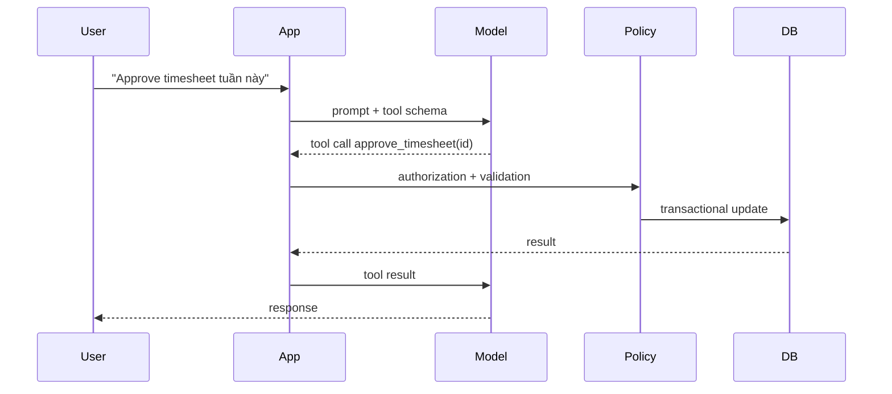

# Daily Knowledge Sharing — 2026-09-25

## Today’s Topics

1. .NET ThreadPool starvation: khi `async` tồn tại nhưng request vẫn bị nghẽn
2. EF Core optimistic concurrency: bảo vệ lost update bằng concurrency token
3. SQL Server deadlock: đọc deadlock graph thay vì tăng timeout
4. Redis cache stampede: single-flight, TTL jitter và stale-while-revalidate
5. Azure Service Bus idempotent consumer: at-least-once delivery nghĩa là duplicate là bình thường
6. OpenTelemetry distributed tracing: nối một request xuyên API, database và external service
7. Kubernetes readiness vs liveness probes: đừng để health check tự tạo outage
8. Optimizely CMS content modeling: thiết kế theo editorial capability thay vì layout hiện tại
9. Third-party API resilience: timeout budget, retry boundary và circuit breaker
10. AI Tool Calling: giữ business rules deterministic quanh một model không deterministic

---

# 1. .NET ThreadPool starvation: khi `async` tồn tại nhưng request vẫn bị nghẽn

## 1. What is it?

Mental model: ThreadPool starvation xảy ra khi application còn CPU hoặc dependency vẫn khỏe nhưng không có đủ worker thread sẵn sàng để chạy continuation và request mới. Đây không nhất thiết là “thiếu thread”; thường là thread hiện có bị giữ bởi blocking work.

Trong ASP.NET Core, `async/await` giúp thread được trả về pool trong lúc chờ I/O. Nhưng chỉ cần một đoạn `.Result`, `.Wait()`, synchronous database/network call hoặc CPU work dài nằm trên hot path, lợi ích đó có thể biến mất.

## 2. Why does it exist?

Server cần multiplex rất nhiều request trên số thread hữu hạn. Nếu mỗi request giữ một thread trong lúc chờ 500 ms I/O, 1.000 concurrent requests có thể đòi số thread lớn vô lý. Asynchronous I/O tồn tại để thread làm việc khác trong thời gian chờ.

Starvation xuất hiện khi code phá mô hình này: workload đến nhanh hơn tốc độ ThreadPool bổ sung worker, làm queue tăng và latency bùng lên.

## 3. How does it work?

```text
Request
  -> ThreadPool worker
  -> async DB call
  -> worker returned to pool
  -> I/O completes
  -> continuation queued
  -> available worker resumes
```

Với sync-over-async:

```text
worker -> service.GetAsync().Result -> worker blocked
I/O completes -> continuation queued -> needs worker
many blocked workers -> queue grows -> starvation
```

## 4. Practical implementation

Sai:

```csharp
public IActionResult Get()
{
    var result = _client.GetStringAsync("/catalog").Result;
    return Ok(result);
}
```

Đúng theo async-all-the-way:

```csharp
public async Task<IActionResult> Get(CancellationToken ct)
{
    using var response = await _client.GetAsync("/catalog", ct);
    response.EnsureSuccessStatusCode();
    return Content(await response.Content.ReadAsStringAsync(ct));
}
```

CPU-bound work lớn không nên giả vờ trở thành I/O bằng `Task.Run` trên request path. Cần giới hạn concurrency hoặc chuyển sang worker/background processing nếu phù hợp.

## 5. Real production scenario

Một API e-commerce chạy tốt ở 100 RPS nhưng p95 tăng từ 180 ms lên 8 giây khi traffic đạt 800 RPS. SQL CPU chỉ 30%, App Service CPU 45%. Một helper legacy gọi HTTP bằng `.Result`. Khi concurrency tăng, worker bị block và continuation xếp hàng.

## 6. Failure scenario & troubleshooting

**Symptom** → latency tăng mạnh, request queue tăng, CPU không nhất thiết cao.

**Evidence** → `dotnet-counters` cho thấy ThreadPool queue length tăng, thread count tăng dần; trace cho thấy nhiều stack block tại `Task.Wait`/result access.

**Hypothesis** → sync-over-async hoặc blocking I/O.

**Diagnosis** → trace hot path, tìm blocking calls và thời gian chờ.

**Fix** → async-all-the-way, propagate `CancellationToken`, giới hạn concurrency cho dependency chậm.

**Verification** → load test lại và so p95/p99, queue length, thread count.

## 7. Common mistakes

Tăng minimum worker threads trước khi tìm root cause; bọc mọi thứ bằng `Task.Run`; bỏ qua cancellation; nhìn CPU thấp rồi kết luận application không overload.

## 8. Alternatives

CPU-heavy workload có thể dùng bounded `Channel<T>` + Worker Service, queue ngoài process, hoặc dedicated compute service. Với synchronous library bắt buộc, cần cô lập và giới hạn concurrency thay vì để nó chiếm toàn bộ request workers.

## 9. Trade-offs

### Advantages

Async I/O tăng concurrency với ít thread hơn và giảm blocked resources.

### Costs / Risks

Async lan qua call chain; cancellation/error handling phức tạp hơn; quá nhiều concurrency vẫn có thể phá database hoặc external service.

## 10. Junior → Middle → Senior → Technical Lead

### Junior

Hiểu async không có nghĩa tạo thêm thread; nó chủ yếu tránh giữ thread khi chờ I/O.

### Middle

Viết async-all-the-way, propagate cancellation và nhận diện `.Result`/`.Wait()`.

### Senior

Đọc counters/traces, phân biệt starvation với CPU saturation và dependency latency.

### Technical Lead / Architect

Thiết kế concurrency budget, queue boundary và workload isolation; quyết định khi nào request/response không còn phù hợp cho công việc dài.

## 11. Key takeaway

- Async I/O chỉ giúp khi call chain không quay lại blocking.
- ThreadPool starvation thường biểu hiện bằng latency cao trước khi CPU cao.
- Chẩn đoán bằng telemetry và trace, không bằng tăng thread theo cảm tính.

---

# 2. EF Core optimistic concurrency: bảo vệ lost update bằng concurrency token

## 1. What is it?

Optimistic concurrency giả định conflict hiếm nên không giữ database lock suốt thời gian user chỉnh dữ liệu. EF Core ghi nhớ concurrency token khi entity được đọc và đưa token đó vào điều kiện `UPDATE`.

## 2. Why does it exist?

Hai người có thể cùng mở một timesheet. A approve trước, B vẫn đang nhìn version cũ rồi save. Nếu `UPDATE` chỉ dựa vào primary key, B có thể âm thầm ghi đè thay đổi của A: lost update.

## 3. How does it work?

Với SQL Server `rowversion`:

```sql
UPDATE Timesheets
SET Status = @status
WHERE Id = @id AND RowVersion = @originalRowVersion;
```

Nếu row đã thay đổi, affected rows = 0. EF Core phát hiện và ném `DbUpdateConcurrencyException`.

## 4. Practical implementation

```csharp
public sealed class Timesheet
{
    public int Id { get; set; }
    public string Status { get; set; } = "";
    [Timestamp]
    public byte[] RowVersion { get; set; } = [];
}

try
{
    await db.SaveChangesAsync(ct);
}
catch (DbUpdateConcurrencyException)
{
    return Results.Conflict(new
    {
        code = "timesheet_changed",
        message = "Dữ liệu đã được cập nhật bởi tiến trình khác."
    });
}
```

API nên round-trip token qua DTO/ETag thay vì giấu conflict.

## 5. Real production scenario

Manager A approve expense; payroll job đồng thời điều chỉnh trạng thái sau validation. Concurrency token ngăn request dựa trên snapshot cũ ghi đè trạng thái mới.

## 6. Failure scenario & troubleshooting

**Symptom** → user nhận 409 Conflict.

**Evidence** → affected rows bằng 0; log có entity key và original token.

**Hypothesis** → concurrent write hợp lệ hoặc token bị client gửi cũ.

**Diagnosis** → reload database values và so với original/current values.

**Fix** → chọn policy: reject, merge field-level, hoặc reload rồi yêu cầu user xác nhận.

**Verification** → integration test hai DbContext đọc cùng version rồi update theo thứ tự cạnh tranh.

## 7. Common mistakes

Catch exception rồi retry `SaveChanges` vô điều kiện; dùng last-write-wins cho dữ liệu có invariant; expose binary token không có contract rõ; nhầm optimistic concurrency với transaction isolation.

## 8. Alternatives

Pessimistic locking phù hợp khi conflict đắt và transaction ngắn. Application-level version number portable hơn `rowversion`. HTTP `ETag` + `If-Match` đưa concurrency lên API boundary.

## 9. Trade-offs

### Advantages

Không giữ lock trong thời gian user think-time; scale tốt cho conflict hiếm.

### Costs / Risks

Conflict phải được thiết kế UX/business policy; retry mù có thể tái tạo lost update ở tầng application.

## 10. Junior → Middle → Senior → Technical Lead

### Junior

Hiểu hai request có thể đọc cùng một trạng thái rồi cùng ghi.

### Middle

Cấu hình token và xử lý `DbUpdateConcurrencyException`.

### Senior

Thiết kế merge/reject semantics và test race condition.

### Technical Lead / Architect

Xác định aggregate nào cần concurrency boundary và conflict nào được tự động resolve.

## 11. Key takeaway

- Concurrency token biến silent overwrite thành conflict nhìn thấy được.
- Exception chỉ là tín hiệu; business policy mới quyết định xử lý.
- Không retry concurrency conflict nếu chưa hiểu thay đổi cạnh tranh.

---

# 3. SQL Server deadlock: đọc deadlock graph thay vì tăng timeout

## 1. What is it?

Deadlock là chu kỳ chờ: transaction A giữ resource X và chờ Y, trong khi B giữ Y và chờ X. SQL Server phát hiện chu kỳ và chọn một victim để rollback.

## 2. Why does it exist?

Transactions cần locks để bảo vệ consistency. Khi nhiều transaction lấy locks theo thứ tự khác nhau, circular wait có thể xuất hiện. Đây là hệ quả của concurrency control, không phải đơn giản là “database chậm”.

## 3. How does it work?

```text
Tx A: lock Order 42 -> waits Inventory 7
Tx B: lock Inventory 7 -> waits Order 42
                    ^             |
                    |_____________|
```

Deadlock monitor phát hiện cycle và rollback victim; client thường nhận SQL error 1205.

## 4. Practical implementation

Giảm nguy cơ bằng lock ordering nhất quán:

```sql
BEGIN TRAN;

UPDATE dbo.Inventory
SET Reserved = Reserved + @qty
WHERE ProductId = @productId;

UPDATE dbo.Orders
SET Status = 'Reserved'
WHERE Id = @orderId;

COMMIT;
```

Mọi workflow liên quan nên truy cập Inventory rồi Orders theo cùng thứ tự.

## 5. Real production scenario

Checkout API và cancellation worker cùng update `Orders` và `Inventory`, nhưng thứ tự ngược nhau. Ở traffic thấp không thấy lỗi; campaign tăng concurrency làm error 1205 xuất hiện hàng chục lần/phút.

## 6. Failure scenario & troubleshooting

**Symptom** → request thất bại ngắn, không phải timeout dài.

**Evidence** → Extended Events/deadlock graph chỉ ra victim, process, resource và statements.

**Hypothesis** → inconsistent lock ordering hoặc transaction giữ lock quá lâu.

**Diagnosis** → đọc graph từ victim sang owner/waiter, xác định access path và index.

**Fix** → thống nhất thứ tự, rút ngắn transaction, tối ưu query/index để khóa ít rows hơn; retry có backoff chỉ khi operation an toàn.

**Verification** → concurrency test tái tạo hai workflows song song.

## 7. Common mistakes

Tăng command timeout; thêm `NOLOCK` để “sửa”; retry vô hạn; chỉ nhìn statement victim mà không xem statement còn lại; transaction chứa external HTTP call.

## 8. Alternatives

Snapshot-based isolation có thể giảm reader/writer blocking nhưng không xóa mọi write/write deadlock. Optimistic application concurrency giải bài toán khác.

## 9. Trade-offs

### Advantages

Transactions/locking giữ invariants mạnh.

### Costs / Risks

Concurrency cao làm lock interactions phức tạp; isolation mạnh hơn thường tăng blocking/versioning cost.

## 10. Junior → Middle → Senior → Technical Lead

### Junior

Phân biệt blocking một chiều với deadlock dạng cycle.

### Middle

Thu thập deadlock graph và đọc statements/resources.

### Senior

Liên hệ query plan, index, transaction scope và lock ordering.

### Technical Lead / Architect

Thiết kế transaction boundary và workflow để contention có giới hạn, đồng thời xác định retry policy.

## 11. Key takeaway

- Deadlock là graph dependency, không phải timeout.
- Deadlock graph là evidence chính.
- Sửa access pattern/transaction trước khi nghĩ tới retry.

---

# 4. Redis cache stampede: single-flight, TTL jitter và stale-while-revalidate

## 1. What is it?

Cache stampede xảy ra khi nhiều request cùng miss một hot key và đồng loạt đánh xuống source of truth. Cache vốn giảm tải lại biến một expiration thành traffic spike.

## 2. Why does it exist?

Cache-aside đơn giản có race tự nhiên: `GET miss -> query DB -> SET`. Với một key được 5.000 request/s, TTL hết có thể tạo hàng nghìn query DB gần như đồng thời.

## 3. How does it work?

```text
1000 requests -> Redis: miss
               -> DB x 1000
               -> Redis SET x 1000
```

Single-flight/coalescing biến nhiều miss cùng key thành một refresh; TTL jitter tránh hàng loạt keys hết hạn cùng lúc; stale-while-revalidate cho phép trả dữ liệu hơi cũ trong lúc refresh.

## 4. Practical implementation

Trong một instance:

```csharp
private readonly ConcurrentDictionary<string, SemaphoreSlim> _locks = new();

public async Task<Product> GetProduct(int id, CancellationToken ct)
{
    var key = $"product:{id}";
    var cached = await cache.GetStringAsync(key, ct);
    if (cached is not null) return JsonSerializer.Deserialize<Product>(cached)!;

    var gate = _locks.GetOrAdd(key, _ => new SemaphoreSlim(1, 1));
    await gate.WaitAsync(ct);
    try
    {
        cached = await cache.GetStringAsync(key, ct);
        if (cached is not null) return JsonSerializer.Deserialize<Product>(cached)!;

        var product = await db.Products.AsNoTracking()
            .SingleAsync(x => x.Id == id, ct);

        var ttl = TimeSpan.FromMinutes(5) + TimeSpan.FromSeconds(Random.Shared.Next(0, 30));
        await cache.SetStringAsync(key, JsonSerializer.Serialize(product),
            new DistributedCacheEntryOptions { AbsoluteExpirationRelativeToNow = ttl }, ct);
        return product;
    }
    finally { gate.Release(); }
}
```

Local semaphore chỉ coalesce trong một process; multi-instance cần strategy phù hợp hơn.

## 5. Real production scenario

Homepage lấy promotion config từ Redis. Đúng 09:00, hàng nghìn keys được warm cùng TTL 30 phút; 09:30 tất cả expire, SQL CPU lên 95%.

## 6. Failure scenario & troubleshooting

**Symptom** → spike DB QPS theo chu kỳ TTL.

**Evidence** → Redis misses tăng cùng thời điểm; DB query count tăng nhưng business traffic không tăng tương ứng.

**Diagnosis** → correlate cache miss metrics với dependency latency.

**Fix** → TTL jitter, refresh-ahead, coalescing và stale policy nếu domain cho phép.

**Verification** → load test qua expiration boundary.

## 7. Common mistakes

Dùng distributed lock cho mọi cache read; TTL giống hệt cho hàng nghìn keys; không double-check cache sau khi lấy lock; để Redis failure làm API fail dù DB vẫn khỏe.

## 8. Alternatives

`IMemoryCache` phù hợp per-instance; CDN phù hợp public HTTP responses; không cache nếu query đã rẻ và freshness quan trọng. Một read model/materialized view đôi khi đúng hơn Redis.

## 9. Trade-offs

### Advantages

Giảm load và tail latency khi được thiết kế đúng.

### Costs / Risks

Freshness, invalidation, memory, extra dependency và failure mode mới.

## 10. Junior → Middle → Senior → Technical Lead

### Junior

Hiểu cache miss không chỉ ảnh hưởng một request.

### Middle

Implement cache-aside, TTL và invalidation.

### Senior

Thiết kế stampede protection và degraded mode khi Redis down.

### Technical Lead / Architect

Quyết định dữ liệu nào đáng cache, freshness budget và Redis có được phép trở thành critical dependency hay không.

## 11. Key takeaway

- Hot-key expiration là một concurrency event.
- TTL jitter và request coalescing giải hai nguyên nhân khác nhau.
- Cache phải có failure policy, không chỉ happy path.

---

# 5. Azure Service Bus idempotent consumer: at-least-once delivery nghĩa là duplicate là bình thường

## 1. What is it?

Idempotent consumer xử lý cùng logical message nhiều lần nhưng business effect chỉ xảy ra một lần. Với broker at-least-once, duplicate không phải anomaly; nó là delivery condition cần thiết kế.

## 2. Why does it exist?

Consumer có thể commit database rồi crash trước khi `CompleteMessageAsync`. Broker không biết side effect đã commit nên message được deliver lại.

## 3. How does it work?

```text
Receive message
 -> begin DB transaction
 -> check Inbox(MessageId)
 -> apply business change
 -> insert Inbox(MessageId)
 -> commit
 -> complete Service Bus message
```

Nếu crash sau DB commit nhưng trước complete, lần sau Inbox chặn side effect lặp.

## 4. Practical implementation

```csharp
await using var tx = await db.Database.BeginTransactionAsync(ct);

if (await db.Inbox.AnyAsync(x => x.MessageId == message.MessageId, ct))
{
    await tx.RollbackAsync(ct);
    await receiver.CompleteMessageAsync(message, ct);
    return;
}

order.MarkPaid();
db.Inbox.Add(new InboxMessage(message.MessageId, DateTimeOffset.UtcNow));
await db.SaveChangesAsync(ct);
await tx.CommitAsync(ct);

await receiver.CompleteMessageAsync(message, ct);
```

Database cần unique constraint trên `MessageId`; check-then-insert một mình vẫn có race.

## 5. Real production scenario

Payment event cập nhật order và gửi email downstream. Consumer restart đúng sau commit. Message quay lại; Inbox ngăn order transition lần hai.

## 6. Failure scenario & troubleshooting

**Symptom** → duplicate invoice/email.

**Evidence** → cùng `MessageId` hoặc business id xuất hiện nhiều delivery; `DeliveryCount > 1`.

**Diagnosis** → side effect không có idempotency key hoặc dedup record nằm ngoài transaction.

**Fix** → unique key + atomic business update/inbox; tách non-transactional external side effect qua Outbox.

**Verification** → integration test crash/re-delivery.

## 7. Common mistakes

Tin rằng queue đảm bảo exactly-once; complete trước DB commit; dùng in-memory HashSet; retry non-idempotent external call; dùng message ID ngẫu nhiên mới mỗi retry ở producer.

## 8. Alternatives

Broker duplicate detection giúp ở producer-side window nhưng không thay consumer idempotency. Outbox giải atomic publish; Inbox giải duplicate consume.

## 9. Trade-offs

### Advantages

Consumer chịu được crash/retry và broker redelivery.

### Costs / Risks

Thêm storage, retention cleanup và business-key design.

## 10. Junior → Middle → Senior → Technical Lead

### Junior

Hiểu message có thể đến hơn một lần.

### Middle

Implement Inbox + unique constraint.

### Senior

Thiết kế transaction và external side effects để replay an toàn.

### Technical Lead / Architect

Xác định idempotency boundary, retention, ordering và ownership giữa services.

## 11. Key takeaway

- At-least-once yêu cầu consumer chịu duplicate.
- Dedup state phải atomic với business state.
- Outbox và Inbox giải hai phía khác nhau của messaging reliability.

---

# 6. OpenTelemetry distributed tracing: nối một request xuyên API, database và external service

## 1. What is it?

Distributed trace biểu diễn một operation xuyên nhiều component bằng trace gồm nhiều spans. Mental model: log trả lời “đã xảy ra gì”, metric trả lời “bao nhiêu”, trace trả lời “request này đã đi qua đâu và mất thời gian ở đâu”.

## 2. Why does it exist?

Trong distributed system, request 4 giây có thể gồm API 50 ms, SQL 120 ms và external review API 3,7 giây. Log rời rạc khó nối nếu không có propagation context.

## 3. How does it work?

W3C Trace Context truyền `traceparent` qua HTTP. Instrumentation tạo spans cho ASP.NET Core, HttpClient, database; exporter gửi telemetry tới backend như Application Insights.

## 4. Practical implementation

```csharp
builder.Services.AddOpenTelemetry()
    .WithTracing(t => t
        .AddAspNetCoreInstrumentation()
        .AddHttpClientInstrumentation()
        .AddSqlClientInstrumentation()
        .AddSource("Checkout"))
    .WithMetrics(m => m.AddAspNetCoreInstrumentation());

private static readonly ActivitySource Source = new("Checkout");

using var activity = Source.StartActivity("ReserveInventory");
activity?.SetTag("order.id", orderId);
```

Không đưa token, password, PII hoặc high-cardinality payload tùy tiện vào tags.

## 5. Real production scenario

Checkout p95 tăng sau deployment. Trace cho thấy app code không đổi đáng kể nhưng span `POST reviews-provider` tăng từ 200 ms lên 2,5 s; retry làm tổng latency 7 s.

## 6. Failure scenario & troubleshooting

**Symptom** → trace bị đứt giữa services.

**Evidence** → child service có trace ID mới.

**Hypothesis** → custom HTTP client/proxy không propagate headers.

**Diagnosis** → inspect outgoing/incoming `traceparent`.

**Fix** → chuẩn hóa instrumentation và propagation.

**Verification** → synthetic request tạo một trace xuyên toàn flow.

## 7. Common mistakes

Log mọi payload; cardinality vô hạn; sampling quá mạnh làm mất rare errors; tạo manual spans cho thứ auto-instrumentation đã cover; trace mà không có metrics/alerts.

## 8. Alternatives

Application Insights SDK riêng có thể đủ trong Azure-centric system. Structured logs với correlation ID đơn giản hơn cho monolith. OpenTelemetry có lợi khi cần vendor-neutral instrumentation.

## 9. Trade-offs

### Advantages

Root-cause latency nhanh hơn, dependency map rõ hơn, portable instrumentation.

### Costs / Risks

Telemetry cost, sampling, privacy và instrumentation governance.

## 10. Junior → Middle → Senior → Technical Lead

### Junior

Hiểu trace/span/correlation.

### Middle

Instrument HTTP/database và thêm business spans có chọn lọc.

### Senior

Dùng traces cùng metrics/logs để điều tra p95/p99.

### Technical Lead / Architect

Đặt telemetry standards, sampling, retention, PII policy và SLO instrumentation.

## 11. Key takeaway

- Trace nối causal path của một request.
- Auto-instrumentation là nền; business spans chỉ thêm nơi có giá trị.
- Observability cần Logs + Metrics + Traces, không một loại telemetry đơn lẻ.

---

# 7. Kubernetes readiness vs liveness probes: đừng để health check tự tạo outage

## 1. What is it?

Readiness trả lời “Pod có nên nhận traffic không?”. Liveness trả lời “process có cần restart không?”. Hai câu hỏi khác nhau nhưng thường bị cấu hình cùng một endpoint.

## 2. Why does it exist?

Process có thể sống nhưng chưa sẵn sàng: startup, warm-up, migration, dependency tạm lỗi. Ngược lại process có thể thật sự deadlocked và cần restart.

## 3. How does it work?

Readiness failure làm Pod bị loại khỏi Service endpoints. Liveness failure khiến kubelet restart container. Nếu liveness phụ thuộc database, database outage có thể khiến toàn bộ Pods restart liên tục.

## 4. Practical implementation

```csharp
builder.Services.AddHealthChecks()
    .AddSqlServer(connectionString, name: "sql", tags: ["ready"]);

app.MapHealthChecks("/health/live", new HealthCheckOptions
{
    Predicate = _ => false
});

app.MapHealthChecks("/health/ready", new HealthCheckOptions
{
    Predicate = r => r.Tags.Contains("ready")
});
```

```yaml
readinessProbe:
  httpGet:
    path: /health/ready
    port: 8080
livenessProbe:
  httpGet:
    path: /health/live
    port: 8080
```

## 5. Real production scenario

SQL maintenance kéo dài 90 giây. Nếu liveness gọi SQL, tất cả API pods fail probe và restart, làm recovery chậm hơn. Nếu chỉ readiness phụ thuộc SQL, traffic được ngừng route mà process vẫn sống để recover.

## 6. Failure scenario & troubleshooting

**Symptom** → `CrashLoopBackOff` trong dependency outage.

**Evidence** → `kubectl describe pod` cho thấy liveness failures; app logs không có process crash trước restart.

**Diagnosis** → health endpoint quá sâu hoặc timeout quá ngắn.

**Fix** → tách live/ready, tune thresholds, dùng startup probe cho cold start dài.

**Verification** → fault-inject dependency outage và quan sát restart count/endpoints.

## 7. Common mistakes

Một `/health` cho cả hai; liveness kiểm tra mọi dependency; probe quá thường xuyên; health query đắt; không tính startup time.

## 8. Alternatives

App Service health check có semantics khác nhưng cùng nguyên tắc: health signal phải tương ứng hành động platform sẽ thực hiện.

## 9. Trade-offs

### Advantages

Traffic routing và self-healing chính xác hơn.

### Costs / Risks

Probe sai có thể trở thành automated outage amplifier.

## 10. Junior → Middle → Senior → Technical Lead

### Junior

Nhớ readiness = traffic, liveness = restart.

### Middle

Cấu hình endpoints/probes và đọc Pod events.

### Senior

Thiết kế degraded behavior, thresholds và dependency health semantics.

### Technical Lead / Architect

Quyết định dependency nào quyết định readiness, khi nào restart có ích và failure domain của platform automation.

## 11. Key takeaway

- Health check không chỉ đo; nó kích hoạt hành động.
- Dependency outage thường không phải lý do restart process.
- Test probe behavior bằng failure injection.

---

# 8. Optimizely CMS content modeling: thiết kế theo editorial capability thay vì layout hiện tại

## 1. What is it?

Content model mô tả ý nghĩa và khả năng tái sử dụng của content: Page, Block, properties, relationships và editorial constraints. Nó không nên chỉ mirror pixel layout của một design hiện tại.

## 2. Why does it exist?

Nếu model là `LeftColumnText`, `BlueBoxTitle`, `DesktopHeroImage`, redesign sẽ biến content schema thành technical debt. CMS cần sống lâu hơn một frontend layout.

## 3. How does it work?

Editor tạo typed content. Rendering layer ánh xạ content semantics sang presentation. Reusable Block nên đại diện capability như Promotion, CTA, ProductTeaser thay vì vị trí “RightColumnBlock”.

```text
Editor -> Content Model -> Published Content
                         -> Rendering/API -> Web
                         -> Rendering/API -> Mobile
```

## 4. Practical implementation

```csharp
[ContentType(DisplayName = "Promotion Block",
    GUID = "11111111-1111-1111-1111-111111111111")]
public class PromotionBlock : BlockData
{
    [Display(Name = "Heading")]
    public virtual string Heading { get; set; } = "";

    public virtual ContentReference Image { get; set; }

    public virtual Url TargetUrl { get; set; }
}
```

Tên field nói business meaning; CSS/layout nằm ở renderer.

## 5. Real production scenario

Marketing site đổi từ two-column desktop layout sang responsive card grid. Semantic `PromotionBlock` tái sử dụng được; `RightColumnBluePromoBlock` buộc migration hoặc compatibility hacks.

## 6. Failure scenario & troubleshooting

**Symptom** → editor cần copy cùng content vào nhiều page hoặc developer thêm hàng loạt special-case fields.

**Evidence** → content types tăng theo từng campaign/layout.

**Diagnosis** → model đang theo presentation thay vì editorial capability.

**Fix** → xác định reusable concepts, ownership và migration plan; không refactor schema mù vì published content đang tồn tại.

**Verification** → thử render cùng content trên hai presentation contexts.

## 7. Common mistakes

Một mega-page type có hàng chục optional fields; block quá generic không có semantics; content model phụ thuộc CSS; đổi property phá published content; cache không invalidated khi referenced block đổi.

## 8. Alternatives

Headless CMS tách delivery mạnh hơn nhưng vẫn cần content modeling tốt. Hard-coded pages đơn giản hơn nếu content hiếm thay đổi và không cần editorial workflow.

## 9. Trade-offs

### Advantages

Reuse, editorial consistency và frontend evolution tốt hơn.

### Costs / Risks

Model quá abstract làm editor khó dùng; migration/version compatibility cần quản trị.

## 10. Junior → Middle → Senior → Technical Lead

### Junior

Hiểu Page/Block là content concepts, không chỉ view models.

### Middle

Tạo typed content và renderer rõ ràng.

### Senior

Thiết kế reuse, cache, search indexing và migration compatibility.

### Technical Lead / Architect

Xác định content boundaries, delivery architecture và khi nào composable/headless đáng operational complexity.

## 11. Key takeaway

- Model content theo meaning/capability, không theo tọa độ UI.
- CMS schema là contract sống lâu và cần migration discipline.
- Reuse tốt phục vụ editor lẫn nhiều delivery channels.

---

# 9. Third-party API resilience: timeout budget, retry boundary và circuit breaker

## 1. What is it?

Resilience không phải “thêm retry”. Nó là thiết kế cách hệ thống tiêu thụ failure budget của dependency: timeout bao lâu, retry khi nào, bao nhiêu concurrency, khi nào fail fast và degraded mode là gì.

## 2. Why does it exist?

Network có partial failure. Một reviews API chậm 10 giây có thể giữ connection/request resources và kéo theo outage của product API dù core database hoàn toàn khỏe.

## 3. How does it work?

Giả sử endpoint SLO latency budget 2 giây. Không thể cho dependency timeout 10 giây. Timeout mỗi attempt + retry delay phải nằm trong caller budget. Circuit breaker ngừng gửi thêm request khi failure đủ cao, cho dependency thời gian recover và bảo vệ caller.

## 4. Practical implementation

Với resilience pipeline của .NET:

```csharp
builder.Services.AddHttpClient<ReviewsClient>(client =>
{
    client.BaseAddress = new Uri(config["Reviews:BaseUrl"]!);
})
.AddStandardResilienceHandler(options =>
{
    options.AttemptTimeout.Timeout = TimeSpan.FromMilliseconds(700);
    options.TotalRequestTimeout.Timeout = TimeSpan.FromSeconds(2);
    options.Retry.MaxRetryAttempts = 2;
});
```

Chỉ retry operation an toàn/idempotent hoặc có idempotency key.

## 5. Real production scenario

Product detail page gọi reviews provider. Provider latency tăng. Thay vì fail toàn page, application có timeout ngắn, trả product data và ẩn review section; circuit breaker giảm pressure lên provider.

## 6. Failure scenario & troubleshooting

**Symptom** → p99 tăng theo cấp số khi provider chậm.

**Evidence** → traces cho thấy ba attempts nối tiếp; mỗi attempt gần timeout; socket/concurrency tăng.

**Hypothesis** → retry amplification.

**Diagnosis** → tính total retry budget và request volume amplification.

**Fix** → giới hạn attempts, jitter, timeout budget, circuit breaker, bulkhead/concurrency limiter và fallback.

**Verification** → chaos test 50% timeout/5xx từ provider.

## 7. Common mistakes

Retry mọi 4xx/5xx; retry POST không idempotent; timeout ở từng layer đều dài hơn caller; fallback trả dữ liệu sai nhưng không đánh dấu stale; circuit breaker global cho các failure domain khác nhau.

## 8. Alternatives

Queue/asynchronous integration phù hợp khi không cần response tức thời. Cached snapshot phù hợp read-heavy data chấp nhận stale. Không gọi dependency trên critical path là resilience mạnh nhất nếu business cho phép.

## 9. Trade-offs

### Advantages

Failure isolation, bounded latency và recovery tốt hơn.

### Costs / Risks

Policy phức tạp; retry tăng load; fallback có consistency/product implications.

## 10. Junior → Middle → Senior → Technical Lead

### Junior

Hiểu timeout, retry và circuit breaker giải vấn đề khác nhau.

### Middle

Cấu hình HttpClient resilience và cancellation.

### Senior

Tính latency budget, retry amplification và idempotency.

### Technical Lead / Architect

Quyết định dependency có nằm trên synchronous critical path hay chuyển async/cache/degraded experience.

## 11. Key takeaway

- Retry không miễn phí; nó nhân traffic trong lúc dependency đang yếu.
- Timeout phải xuất phát từ end-to-end latency budget.
- Kiến trúc tốt giảm dependency criticality trước khi thêm policy.

---

# 10. AI Tool Calling: giữ business rules deterministic quanh một model không deterministic

## 1. What is it?

Tool Calling cho phép model chọn một function/tool có schema và tạo arguments; application thực thi tool rồi trả kết quả cho model. Model là planner/interpreter, không nên tự trở thành authority cho business invariant.

## 2. Why does it exist?

LLM giỏi hiểu intent và ngôn ngữ nhưng không phải transactional engine. Một assistant có thể hiểu “approve timesheet của Hà tuần này”, nhưng quyền approve, trạng thái hợp lệ và transaction phải do deterministic application code kiểm tra.

## 3. How does it work?



Model đề xuất action; application quyết định action có được phép thực thi hay không.

## 4. Practical implementation

```csharp
public async Task<ApproveResult> ApproveTimesheet(
    Guid timesheetId,
    ClaimsPrincipal user,
    CancellationToken ct)
{
    var item = await db.Timesheets.SingleAsync(x => x.Id == timesheetId, ct);

    if (!authorization.CanApprove(user, item))
        throw new ForbiddenException();

    if (item.Status != TimesheetStatus.Submitted)
        return ApproveResult.InvalidState(item.Status);

    item.Approve(user.GetUserId());
    await db.SaveChangesAsync(ct);
    return ApproveResult.Success(item.Id);
}
```

Tool schema có thể giới hạn shape, nhưng không thay authorization/domain validation.

## 5. Real production scenario

Internal HR assistant tra cứu leave balance, tạo draft request và gửi approval. Model được phép chọn tools, nhưng employee ID lấy từ authenticated context; model không được truyền arbitrary user ID để vượt quyền.

## 6. Failure scenario & troubleshooting

**Symptom** → model gọi đúng tool nhưng arguments nguy hiểm hoặc user prompt cố ép tool đọc dữ liệu khác tenant.

**Evidence** → tool-call audit cho thấy resource ID không thuộc authenticated principal.

**Hypothesis** → application tin model-provided authorization context.

**Diagnosis** → kiểm tra boundary giữa model arguments và server-owned context.

**Fix** → derive tenant/user/permissions server-side; allowlist tools; validate arguments; confirmation cho destructive action; idempotency key cho write.

**Verification** → adversarial tests/prompt-injection tests và authorization integration tests.

## 7. Common mistakes

Đưa secrets vào prompt; coi Structured Outputs là security boundary; để model tự quyết định role; expose generic SQL/HTTP tool quá rộng; retry tool write mà không idempotency; không audit tool execution.

## 8. Alternatives

Deterministic UI/workflow tốt hơn khi intent hữu hạn và predictable. RAG phù hợp retrieval nhưng không thay tool execution. Human approval phù hợp high-impact actions.

## 9. Trade-offs

### Advantages

Natural-language orchestration, linh hoạt với nhiều tools, giảm glue logic cho intent interpretation.

### Costs / Risks

Non-determinism, latency, token cost, prompt injection, data leakage và evaluation burden.

## 10. Junior → Middle → Senior → Technical Lead

### Junior

Hiểu model chọn tool nhưng application mới thực thi.

### Middle

Thiết kế schema, validation, timeout và error handling.

### Senior

Thiết kế authorization boundary, idempotency, observability và evals cho tool behavior.

### Technical Lead / Architect

Quyết định phần nào nên dùng model và phần nào bắt buộc deterministic; giới hạn blast radius và operational cost của agentic behavior.

## 11. Key takeaway

- LLM không phải authorization engine hay transaction manager.
- Server-owned identity và business invariants không được lấy từ model output.
- Tool Calling mạnh nhất khi model xử lý ambiguity còn deterministic code giữ correctness.
