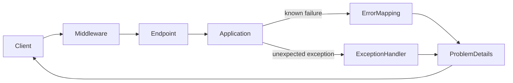
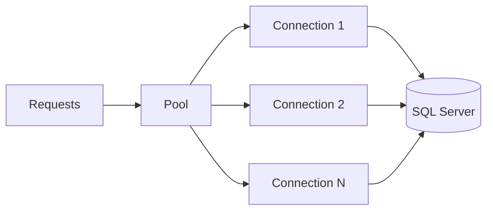
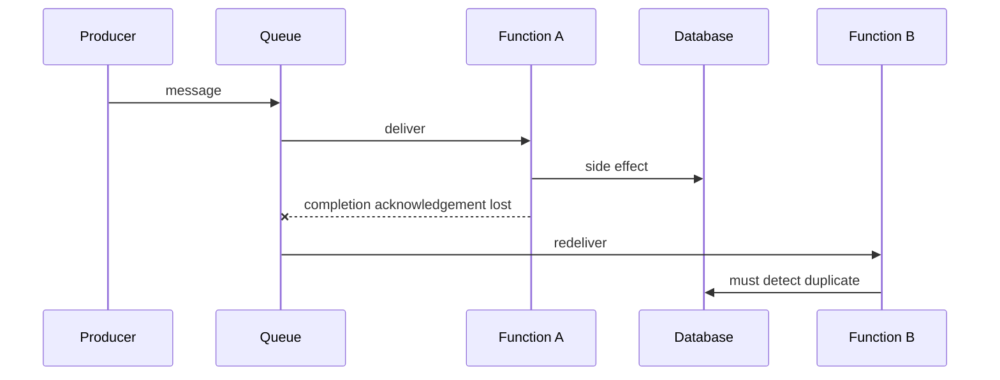
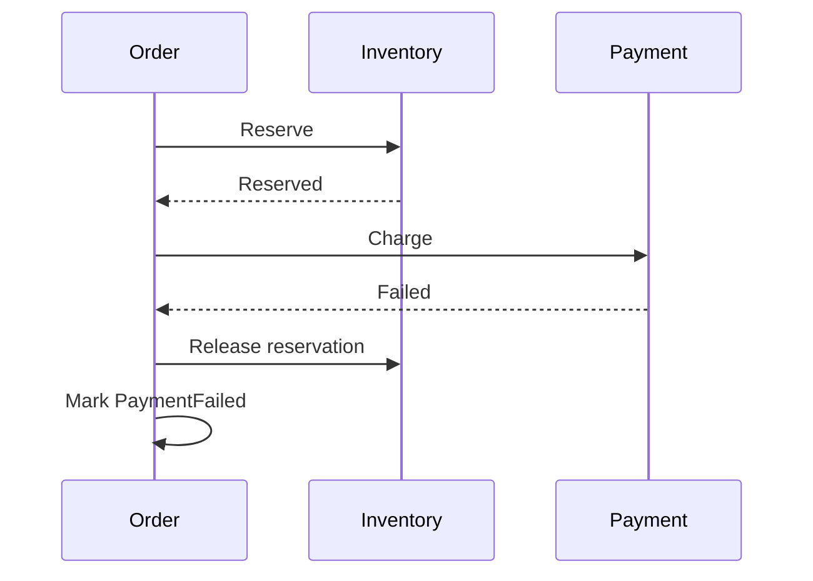

# Daily Knowledge Sharing — 2026-09-25

## Today’s Topics

1. .NET `ValueTask`: tối ưu allocation có điều kiện, không phải `Task` “nhanh hơn”
2. ASP.NET Core `ProblemDetails`: biến lỗi HTTP thành contract ổn định và quan sát được
3. EF Core compiled queries: tối ưu query pipeline sau khi đã đo đúng bottleneck
4. SQL connection pool exhaustion: khi database “không chậm” nhưng API vẫn timeout
5. Cosmos DB partition key: quyết định data locality, scale và chi phí từ lúc modeling
6. Azure Functions queue processing: scale-out, duplicate execution và idempotency
7. Saga Pattern: consistency xuyên service bằng local transaction và compensation
8. React `useEffect`: race condition khi UI gọi API bất đồng bộ
9. Playwright E2E: thiết kế test chống flaky thay vì tăng retry
10. Database deployment theo Expand–Migrate–Contract: release schema không khóa rollback

---

# 1. .NET `ValueTask`: tối ưu allocation có điều kiện, không phải `Task` “nhanh hơn”

## 1. What is it?

`ValueTask<T>` là awaitable có thể biểu diễn kết quả đồng bộ trực tiếp hoặc bọc một asynchronous operation. Mental model quan trọng: nó là công cụ giảm allocation của `Task<T>` trong hot path có tỷ lệ hoàn thành đồng bộ cao, không phải bản nâng cấp mặc định của `Task<T>`.

## 2. Why does it exist?

Một API được gọi hàng triệu lần có thể thường xuyên lấy dữ liệu từ buffer/cache và trả ngay. Nếu mỗi lần vẫn tạo `Task<T>`, allocation nhỏ tích lũy thành GC pressure. `ValueTask<T>` cho phép fast path không cần một `Task<T>` mới. Nhưng đổi lại caller và implementation phải tuân thủ contract phức tạp hơn.

## 3. How does it work?

`Task<T>` là reference object có identity và có thể await nhiều lần. `ValueTask<T>` là struct chứa hoặc giá trị hoàn tất, hoặc `Task<T>`, hoặc `IValueTaskSource<T>`. Copy struct không đồng nghĩa underlying source có thể được consume nhiều lần. Với `IValueTaskSource<T>`, thông thường chỉ nên await một lần.

```text
Call
 ├─ data available synchronously -> ValueTask<T>(value) -> no Task allocation
 └─ async I/O required           -> ValueTask<T>(Task/IValueTaskSource)
```

## 4. Practical implementation

```csharp
public sealed class ProductCache
{
    private readonly Dictionary<int, Product> _cache = new();

    public ValueTask<Product?> GetAsync(int id, CancellationToken ct)
    {
        if (_cache.TryGetValue(id, out var product))
            return ValueTask.FromResult<Product?>(product);

        return new ValueTask<Product?>(LoadAsync(id, ct));
    }

    private async Task<Product?> LoadAsync(int id, CancellationToken ct)
    {
        await Task.Delay(10, ct); // stand-in for real I/O
        return null;
    }
}
```

Nếu phần lớn call luôn đi I/O, `Task<T>` thường đơn giản hơn và có thể tốt hơn tổng thể.

## 5. Real production scenario

Một serializer hoặc pooled network component có fast path từ buffer. Profiling cho thấy hàng chục MB/s allocation đến từ completed `Task<T>`. Chuyển đúng hot method sang `ValueTask<T>` có thể giảm allocation; chuyển toàn bộ service layer chỉ vì “ValueTask ít allocation” lại tăng complexity mà không cải thiện latency.

## 6. Failure scenario & troubleshooting

**Symptom** → lỗi khó tái hiện hoặc operation bị consume sai sau refactor.  
**Evidence** → caller await cùng `ValueTask` nhiều lần hoặc gọi `.Result` rồi await lại.  
**Hypothesis** → underlying `IValueTaskSource` chỉ hỗ trợ một consumption.  
**Diagnosis** → trace call site và benchmark implementation thực.  
**Fix** → await trực tiếp một lần; nếu cần reuse, gọi `.AsTask()` một lần và giữ `Task`.  
**Verification** → correctness tests + BenchmarkDotNet allocation measurement.

## 7. Common mistakes

Dùng `ValueTask` cho mọi async method; lưu nó vào field; await nhiều lần; dùng khi operation hầu như luôn asynchronous; tối ưu trước khi đo allocation; quên rằng struct lớn hơn một reference và copy cũng có cost.

## 8. Alternatives

`Task<T>` là default tốt nhất cho phần lớn application code. Cached `Task`, synchronous API riêng hoặc redesign buffering đôi khi giải quyết đúng nguyên nhân hơn.

## 9. Trade-offs

### Advantages

Giảm `Task` allocation trong synchronous fast path và có ích cho performance-sensitive library code.

### Costs / Risks

Contract phức tạp hơn, dễ misuse, debugging khó hơn và lợi ích có thể bằng 0 nếu phần lớn operation thực sự asynchronous.

## 10. Junior → Middle → Senior → Technical Lead

### Junior

Hiểu `Task` là default; `ValueTask` không có nghĩa “nhanh hơn”.

### Middle

Biết implement fast path và consume `ValueTask` an toàn.

### Senior

Đo allocation/GC trước và sau, hiểu `IValueTaskSource` và workload distribution.

### Technical Lead / Architect

Quyết định optimization có xứng đáng với API complexity và maintenance burden hay không; với business service bình thường, câu trả lời thường là chưa cần.

## 11. Key takeaway

- Dùng `Task` mặc định; chỉ chọn `ValueTask` khi measurement chứng minh allocation đáng kể.
- `ValueTask` tối ưu synchronous completion, không biến I/O thành nhanh hơn.
- Correctness contract quan trọng hơn vài allocation tiết kiệm được.

---

# 2. ASP.NET Core `ProblemDetails`: biến lỗi HTTP thành contract ổn định và quan sát được

## 1. What is it?

`ProblemDetails` là representation chuẩn hóa cho HTTP API error. Mental model: exception là chi tiết bên trong process; error response là public contract với client. Hai thứ không nên bị đồng nhất.

## 2. Why does it exist?

Nếu controller tự trả `{ message = ex.Message }`, mỗi endpoint sinh một shape khác nhau, leak implementation detail và khiến frontend phải đoán. API cần mapping có chủ đích từ failure semantics sang HTTP status, machine-readable code và correlation metadata.

## 3. How does it work?



ASP.NET Core có `AddProblemDetails()` và exception handling middleware. Validation, domain conflict, authentication failure và unexpected exception nên được phân loại khác nhau.

## 4. Practical implementation

```csharp
var builder = WebApplication.CreateBuilder(args);
builder.Services.AddProblemDetails();

var app = builder.Build();

app.UseExceptionHandler(exceptionHandlerApp =>
{
    exceptionHandlerApp.Run(async context =>
    {
        var feature = context.Features
            .Get<Microsoft.AspNetCore.Diagnostics.IExceptionHandlerFeature>();

        context.Response.StatusCode = StatusCodes.Status500InternalServerError;

        await Results.Problem(
            statusCode: 500,
            title: "Unexpected server error",
            extensions: new Dictionary<string, object?>
            {
                ["traceId"] = context.TraceIdentifier
            }).ExecuteAsync(context);
    });
});
```

Domain errors nên được map có chủ đích, ví dụ duplicate business key → `409 Conflict`, invalid input → `400` hoặc validation-specific response.

## 5. Real production scenario

Frontend checkout cần phân biệt “coupon expired”, “inventory conflict” và “server unavailable”. Stable error code cho phép UI xử lý deterministic mà không parse message tiếng Anh. `traceId` cho phép support nối lỗi người dùng với distributed trace.

## 6. Failure scenario & troubleshooting

**Symptom** → production trả HTML 500 hoặc stack trace thay vì JSON.  
**Evidence** → response `Content-Type` không nhất quán; middleware order sai.  
**Hypothesis** → exception xảy ra ngoài handler hoặc Development exception page đang được dùng sai environment.  
**Diagnosis** → integration test full pipeline và kiểm tra middleware order.  
**Fix** → centralized exception handling, sanitize details, stable error mapping.  
**Verification** → test các status/shape và trace correlation.

## 7. Common mistakes

Trả raw `Exception.Message`; biến mọi lỗi thành 500; trả 200 với `success=false`; dùng message làm machine contract; không log exception server-side; đưa PII/SQL detail vào response.

## 8. Alternatives

Custom error envelope có thể hợp lý nếu organization đã có contract lâu đời. Tuy nhiên chuẩn `ProblemDetails` giảm bespoke convention và tương thích tooling tốt hơn.

## 9. Trade-offs

### Advantages

Contract nhất quán, client đơn giản hơn, observability tốt và giảm leak nội bộ.

### Costs / Risks

Cần taxonomy lỗi, governance và backward compatibility; mapping quá chi tiết có thể coupling client vào domain internals.

## 10. Junior → Middle → Senior → Technical Lead

### Junior

Phân biệt exception nội bộ với HTTP response public.

### Middle

Implement centralized handling và integration test error contract.

### Senior

Thiết kế status/error-code semantics, security sanitization và correlation.

### Technical Lead / Architect

Định nghĩa error contract xuyên service, ownership và migration policy; tránh một “global exception handler” biến thành nơi chứa business logic.

## 11. Key takeaway

- Error response là API contract, không phải serialization của exception.
- Status code, stable error code và trace ID phục vụ ba nhu cầu khác nhau.
- Unexpected error phải observable nhưng không được leak nội bộ.

---

# 3. EF Core compiled queries: tối ưu query pipeline sau khi đã đo đúng bottleneck

## 1. What is it?

Compiled query cho phép EF Core tái sử dụng query delegate đã compile, giảm một phần chi phí xử lý expression/query pipeline ở phía application. Nó không làm database execution plan tự nhiên tốt hơn và không sửa SQL xấu.

## 2. Why does it exist?

Với query cực nóng, đơn giản, chạy rất nhanh ở database, EF query-processing overhead có thể trở thành phần đáng kể. Khi DB query mất 2 ms nhưng application lặp lại hàng trăm nghìn lần, micro-overhead mới đáng quan tâm.

## 3. How does it work?

Thông thường EF Core cache query theo shape. Explicit compiled query đi xa hơn bằng cách tạo delegate tái sử dụng trực tiếp.

```text
LINQ expression
  -> EF query processing/translation
  -> SQL
  -> DB execution plan
  -> network
  -> materialization
```

Compiled query chủ yếu tối ưu phần đầu, không tối ưu network, I/O hay lock ở database.

## 4. Practical implementation

```csharp
private static readonly Func<AppDbContext, int, IAsyncEnumerable<Product>>
    ProductsByCategory =
        EF.CompileAsyncQuery(
            (AppDbContext db, int categoryId) =>
                db.Products
                  .AsNoTracking()
                  .Where(p => p.CategoryId == categoryId)
                  .Select(p => new Product
                  {
                      Id = p.Id,
                      Name = p.Name
                  }));

await foreach (var product in ProductsByCategory(db, categoryId)
    .WithCancellation(ct))
{
    // consume
}
```

Trong code thật, projection sang DTO thường rõ hơn việc tạo partial entity như ví dụ tối giản trên.

## 5. Real production scenario

Catalog API có endpoint lookup cực nóng. Trace cho thấy SQL dưới 1 ms, không có I/O issue, nhưng CPU application tăng theo request rate. Profiling xác nhận EF query compilation/processing là hotspot. Đây mới là candidate hợp lý.

## 6. Failure scenario & troubleshooting

**Symptom** → team thêm compiled query nhưng p95 không đổi.  
**Evidence** → trace cho thấy 80 ms nằm ở SQL execution và network.  
**Hypothesis** → tối ưu sai layer.  
**Diagnosis** → đo breakdown application/DB/materialization.  
**Fix** → xử lý access pattern, execution plan hoặc payload trước.  
**Verification** → benchmark end-to-end, không chỉ microbenchmark delegate.

## 7. Common mistakes

Compiled mọi query; bỏ qua `AsNoTracking`; nghĩ compiled query sửa N+1; dùng dynamic query shape không phù hợp; benchmark trên localhost rồi suy rộng production.

## 8. Alternatives

Query bình thường với EF cache, projection tốt, raw SQL/Dapper cho hotspot đặc biệt, hoặc redesign data access. Chọn theo evidence.

## 9. Trade-offs

### Advantages

Giảm CPU/overhead cho query cực nóng và ổn định shape.

### Costs / Risks

Code ít tự nhiên hơn, flexibility thấp hơn và thường tối ưu một phần rất nhỏ của total latency.

## 10. Junior → Middle → Senior → Technical Lead

### Junior

Hiểu LINQ cuối cùng phải được translate và chạy ở DB.

### Middle

Đọc generated SQL, projection đúng và đo query.

### Senior

Profile từng stage trước khi chọn compiled query.

### Technical Lead / Architect

Giữ optimization ở nơi có evidence; không biến compiled query thành data-access convention toàn hệ thống.

## 11. Key takeaway

- Compiled query tối ưu EF-side overhead, không tối ưu SQL plan.
- Đo latency breakdown trước.
- Query shape và access pattern thường quan trọng hơn micro-optimization.

---

# 4. SQL connection pool exhaustion: khi database “không chậm” nhưng API vẫn timeout

## 1. What is it?

ADO.NET connection pooling giữ các physical database connections để request tái sử dụng. Pool exhaustion xảy ra khi mọi connection khả dụng đang bị giữ và caller mới phải chờ, dù database CPU có thể vẫn thấp.

## 2. Why does it exist?

Mở TCP/TLS/database session cho mỗi query rất đắt. Pooling amortize cost đó. Nhưng pool là tài nguyên hữu hạn; giữ connection quá lâu biến concurrency của application thành hàng đợi trước database.

## 3. How does it work?



`DbConnection.Close/Dispose` thường trả connection về pool, không đóng physical connection. Transaction dài, streaming result, leaked context/connection hoặc slow query đều kéo dài hold time.

## 4. Practical implementation

```csharp
await using var connection = new SqlConnection(connectionString);
await connection.OpenAsync(ct);

await using var command = connection.CreateCommand();
command.CommandText = """
    SELECT Id, Status
    FROM Orders
    WHERE Id = @id
    """;
command.Parameters.AddWithValue("@id", orderId);

await using var reader = await command.ExecuteReaderAsync(ct);
while (await reader.ReadAsync(ct))
{
    // Consume promptly; do not hold the reader across unrelated work.
}
```

Với EF Core, scoped `DbContext` và query ngắn giúp connection được checkout/return theo operation.

## 5. Real production scenario

API gọi external payment provider trong cùng database transaction. External call chậm từ 200 ms lên 8 s. Mỗi request giữ transaction và connection 8 s; pool cạn trước khi SQL CPU tăng cao. Kết quả là toàn API timeout.

## 6. Failure scenario & troubleshooting

**Symptom** → timeout khi opening connection; DB CPU 30%.  
**Evidence** → active connections sát pool limit, request duration tăng, long transactions tồn tại.  
**Hypothesis** → connections bị giữ quá lâu.  
**Diagnosis** → correlate app traces, DB sessions và transaction duration.  
**Fix** → thu hẹp transaction, không gọi network khi giữ connection, dispose đúng, sửa slow query.  
**Verification** → pool wait về gần 0 dưới load test.

## 7. Common mistakes

Tăng `Max Pool Size` ngay lập tức; tạo connection string khác nhau làm phân mảnh pool; giữ transaction xuyên HTTP call; quên dispose reader; singleton `DbContext`; retry làm tăng concurrency khi DB đang nghẽn.

## 8. Alternatives

Tăng pool có thể là capacity adjustment hợp lệ sau khi chứng minh DB chịu được. Queue/bulkhead có thể giới hạn concurrency. Nhưng không thay thế việc sửa connection hold time.

## 9. Trade-offs

### Advantages

Pooling giảm connection setup latency mạnh.

### Costs / Risks

Pool che giấu finite-resource boundary; tăng pool có thể chuyển bottleneck từ app sang DB và tạo overload lớn hơn.

## 10. Junior → Middle → Senior → Technical Lead

### Junior

Luôn dispose connection/context đúng lifecycle.

### Middle

Biết đọc timeout và phân biệt query timeout với pool wait.

### Senior

Phân tích hold time, transaction, retry amplification và concurrency.

### Technical Lead / Architect

Thiết kế capacity boundary giữa API và DB; quyết định pool, backpressure và transaction ownership dựa trên load model.

## 11. Key takeaway

- Pool exhaustion là concurrency problem, không nhất thiết là DB CPU problem.
- Tối ưu thời gian giữ connection trước khi tăng pool.
- Không giữ DB transaction trong lúc chờ dependency mạng.

---

# 5. Cosmos DB partition key: quyết định data locality, scale và chi phí từ lúc modeling

## 1. What is it?

Partition key quyết định cách Cosmos DB phân phối logical items lên partitions. Mental model: đây không chỉ là index field; nó là routing và scalability boundary của dữ liệu.

## 2. Why does it exist?

Distributed database phải chia data và throughput qua nhiều máy. Nếu mọi request phải fan-out toàn cluster, latency và RU cost tăng. Partition key tốt đưa các operation liên quan đến đúng vùng dữ liệu đồng thời phân phối load đủ đều.

## 3. How does it work?

Item có partition-key value; các value được hash/range-map vào physical partitions. Query có partition key cụ thể có thể route trực tiếp. Query thiếu key có thể cross-partition fan-out. Transactional batch bị giới hạn trong cùng logical partition.

## 4. Practical implementation

```csharp
var container = cosmosClient.GetContainer("commerce", "orders");

var order = new
{
    id = Guid.NewGuid().ToString(),
    tenantId = "tenant-42",
    status = "Pending",
    total = 125.50m
};

await container.CreateItemAsync(
    order,
    new PartitionKey(order.tenantId),
    cancellationToken: ct);
```

Nếu access pattern chủ yếu “orders của tenant”, `tenantId` có thể phù hợp; nhưng tenant cực lớn có thể tạo hot partition.

## 5. Real production scenario

SaaS multi-tenant chọn `country` làm key vì “có nhiều quốc gia”. 70% traffic đến từ một thị trường, tạo hotspot. Query theo `tenantId` lại phải cross-partition. Modeling đã tối ưu cardinality bề mặt nhưng sai access pattern.

## 6. Failure scenario & troubleshooting

**Symptom** → RU tăng, 429 tập trung và latency không đều.  
**Evidence** → partition metrics cho thấy load skew; query metrics cho thấy fan-out.  
**Hypothesis** → partition key không phân phối workload.  
**Diagnosis** → map request pattern → key distribution → RU per partition.  
**Fix** → redesign key/hierarchical partitioning phù hợp, migration dữ liệu có kế hoạch.  
**Verification** → load distribution và RU/request ổn định hơn.

## 7. Common mistakes

Chọn key chỉ vì cardinality cao; dùng timestamp gây hotspot; bỏ qua transaction boundary; query thường xuyên không có partition key; nghĩ có thể đổi key dễ như thêm SQL index.

## 8. Alternatives

SQL Server/PostgreSQL phù hợp hơn nếu relational transactions/query flexibility là trọng tâm. MongoDB có sharding với trade-off tương tự. Cosmos chỉ đáng giá khi workload và operational model phù hợp.

## 9. Trade-offs

### Advantages

Horizontal scale, routing hiệu quả và isolation tốt khi key đúng.

### Costs / Risks

Sai key rất đắt để sửa; distributed consistency, RU và data migration trở thành concern ứng dụng.

## 10. Junior → Middle → Senior → Technical Lead

### Junior

Hiểu partition key quyết định vị trí logic của data.

### Middle

Luôn truyền key trong point read/write và đo RU.

### Senior

Phân tích skew, hot partition, fan-out và transaction needs.

### Technical Lead / Architect

Chọn key từ access patterns và growth model; đôi khi kết luận relational DB đơn giản hơn là đúng.

## 11. Key takeaway

- Partition key là architecture decision, không phải field trang trí.
- Tối ưu theo workload distribution và access pattern.
- Sai partitioning thường tốn migration hơn nhiều so với sai index.

---

# 6. Azure Functions queue processing: scale-out, duplicate execution và idempotency

## 1. What is it?

Queue-triggered Azure Function là consumer được platform kích hoạt khi message xuất hiện. Mental model: serverless loại bỏ việc tự quản worker process, nhưng không loại bỏ distributed-systems semantics.

## 2. Why does it exist?

Background workload biến động cần scale theo queue depth mà không giữ worker cố định. Platform quản trigger, host lifecycle và scale. Tuy nhiên message processing vẫn có thể retry hoặc chạy lại.

## 3. How does it work?



Scale-out tạo nhiều host. Delivery và settlement semantics phụ thuộc trigger/service, nhưng application phải giả định duplicate có thể xảy ra.

## 4. Practical implementation

```csharp
public async Task HandleAsync(OrderPaid message, CancellationToken ct)
{
    var alreadyProcessed = await db.ProcessedMessages
        .AnyAsync(x => x.MessageId == message.MessageId, ct);

    if (alreadyProcessed) return;

    db.ProcessedMessages.Add(new ProcessedMessage(message.MessageId));
    var order = await db.Orders.SingleAsync(x => x.Id == message.OrderId, ct);
    order.MarkPaid();

    await db.SaveChangesAsync(ct);
}
```

Trong production cần unique constraint trên `MessageId`; check-then-insert một mình vẫn có race.

## 5. Real production scenario

Function gửi email rồi crash trước khi message được xác nhận. Retry gửi email lần hai. “Function chỉ chạy một lần” là assumption sai; side effect phải idempotent hoặc có deduplication boundary.

## 6. Failure scenario & troubleshooting

**Symptom** → duplicate invoices và queue backlog tăng.  
**Evidence** → cùng message ID xuất hiện ở nhiều invocation; retries tăng.  
**Hypothesis** → handler có side effect trước durable deduplication.  
**Diagnosis** → trace message ID xuyên queue, DB và external calls.  
**Fix** → inbox/dedup record với unique key, idempotency key cho downstream, DLQ policy.  
**Verification** → replay cùng message nhiều lần nhưng business state chỉ thay đổi một lần.

## 7. Common mistakes

Dựa vào in-memory lock; nghĩ serverless = exactly-once; retry mọi exception vô hạn; không có poison-message path; không propagate correlation ID; xử lý non-idempotent external API không có key.

## 8. Alternatives

Worker Service/Container Apps cho workload ổn định hoặc cần process control; Service Bus consumer khi cần richer messaging semantics; scheduled Function cho timer workload.

## 9. Trade-offs

### Advantages

Elasticity, ít host management và integration trigger thuận tiện.

### Costs / Risks

Cold start/cost model, platform behavior, duplicate execution và observability phân tán.

## 10. Junior → Middle → Senior → Technical Lead

### Junior

Hiểu message có thể được retry.

### Middle

Implement idempotent handler và DLQ handling.

### Senior

Thiết kế dedup transaction, concurrency và downstream idempotency.

### Technical Lead / Architect

Chọn Functions hay long-running worker dựa trên workload, reliability semantics, cost và operational ownership.

## 11. Key takeaway

- Scale-out làm duplicate-safe processing quan trọng hơn.
- Idempotency phải tồn tại ở durable boundary.
- Retry không thay thế failure design.

---

# 7. Saga Pattern: consistency xuyên service bằng local transaction và compensation

## 1. What is it?

Saga là chuỗi local transactions giữa nhiều service, với các bước compensation để xử lý khi workflow thất bại giữa chừng. Nó không tạo ACID transaction xuyên services.

## 2. Why does it exist?

Trong microservices, Order, Payment và Inventory thường sở hữu database riêng. Distributed two-phase commit có coupling/availability cost lớn hoặc không được hạ tầng hỗ trợ. Business vẫn cần workflow có trạng thái và cách phục hồi.

## 3. How does it work?



Compensation là business action mới, không phải time travel rollback. “Refund payment” khác bản chất với “payment chưa từng xảy ra”.

## 4. Practical implementation

```csharp
public async Task ExecuteAsync(Guid orderId, CancellationToken ct)
{
    await inventory.ReserveAsync(orderId, ct);

    try
    {
        await payment.ChargeAsync(orderId, ct);
        await orders.MarkConfirmedAsync(orderId, ct);
    }
    catch
    {
        await inventory.ReleaseAsync(orderId, ct);
        await orders.MarkFailedAsync(orderId, ct);
        throw;
    }
}
```

Đây chỉ minh họa orchestration. Production cần persisted saga state, idempotent commands, retries và recovery sau process crash.

## 5. Real production scenario

Checkout reserve inventory thành công, payment provider timeout. Không biết payment đã charge hay chưa. Saga phải có state `PaymentUnknown`, reconciliation hoặc idempotency lookup; compensation mù có thể tạo lỗi tài chính mới.

## 6. Failure scenario & troubleshooting

**Symptom** → order Failed nhưng inventory vẫn Reserved.  
**Evidence** → compensation message thất bại.  
**Hypothesis** → team coi compensation là best-effort fire-and-forget.  
**Diagnosis** → kiểm tra saga state, message history và retry/DLQ.  
**Fix** → persist state, retry có giới hạn, manual reconciliation path.  
**Verification** → chaos test failure ở từng transition.

## 7. Common mistakes

Gọi chuỗi HTTP rồi gọi đó là Saga; không persist state; compensation không idempotent; giả định compensation luôn thành công; không model trạng thái “unknown”; chia microservice trước khi business boundary cần nó.

## 8. Alternatives

Một database transaction trong Modular Monolith đơn giản và mạnh hơn nếu ownership chưa cần tách. Outbox giải quyết reliable message publication nhưng không thay Saga cho multi-step business workflow.

## 9. Trade-offs

### Advantages

Cho phép autonomous services và recovery workflow mà không cần global transaction.

### Costs / Risks

Eventual consistency, nhiều trạng thái trung gian, compensation complexity và operational burden cao.

## 10. Junior → Middle → Senior → Technical Lead

### Junior

Hiểu mỗi service chỉ commit local transaction.

### Middle

Implement idempotent steps và explicit state.

### Senior

Xử lý unknown outcome, retries, compensation failure và observability.

### Technical Lead / Architect

Trước hết hỏi liệu service split có đáng khiến business transaction trở thành Saga hay không.

## 11. Key takeaway

- Saga quản business consistency, không cung cấp distributed ACID.
- Compensation cũng có thể thất bại.
- Nếu một DB transaction đủ đáp ứng boundary, đừng tạo Saga chỉ để “đúng microservices”.

---

# 8. React `useEffect`: race condition khi UI gọi API bất đồng bộ

## 1. What is it?

`useEffect` đồng bộ component với external systems sau render. Khi effect gọi API theo state/props, nhiều request có thể overlap và response về không theo thứ tự gửi.

## 2. Why does it exist?

Render phải mô tả UI; network subscription/timer/fetch là side effect. Effect tạo lifecycle để setup/cleanup. Nhưng browser network concurrency khiến “request mới nhất gửi sau sẽ về sau” không được đảm bảo.

## 3. How does it work?

User chọn Product A rồi rất nhanh Product B:

```text
t0 request A --------------------------> response A
t1      request B ----------> response B
                         UI=B
                                      UI=A  <-- stale overwrite
```

Cleanup bằng `AbortController` giúp hủy request cũ và ngăn stale update.

## 4. Practical implementation

```tsx
useEffect(() => {
  const controller = new AbortController();

  async function load() {
    try {
      const response = await fetch(`/api/products/${productId}`, {
        signal: controller.signal
      });
      if (!response.ok) throw new Error(`HTTP ${response.status}`);
      setProduct(await response.json());
    } catch (e) {
      if ((e as DOMException).name !== "AbortError") {
        setError("Cannot load product");
      }
    }
  }

  load();
  return () => controller.abort();
}, [productId]);
```

## 5. Real production scenario

Automotive marketplace filter thay đổi liên tục. Response cho filter cũ về sau response mới và ghi đè danh sách, khiến user thấy kết quả không khớp filter đang hiển thị.

## 6. Failure scenario & troubleshooting

**Symptom** → bug chỉ xuất hiện khi network chậm.  
**Evidence** → DevTools Network cho thấy request overlap và completion đảo thứ tự.  
**Hypothesis** → stale response cập nhật state.  
**Diagnosis** → throttle network, log request ID/filter snapshot.  
**Fix** → abort/cancel hoặc query library có stale-request semantics.  
**Verification** → rapid interaction dưới Slow 3G không làm UI rollback.

## 7. Common mistakes

Thiếu dependency; suppress ESLint để “hết loop”; effect chứa derived state không cần thiết; không cleanup; retry frontend và backend đồng thời; hiển thị lỗi từ request đã obsolete.

## 8. Alternatives

TanStack Query/SWR quản cache, cancellation/staleness và retries tốt hơn cho server state. Event handler trực tiếp phù hợp nếu side effect thực sự gắn với user action chứ không phải render synchronization.

## 9. Trade-offs

### Advantages

Effect là primitive linh hoạt và native React.

### Costs / Risks

Manual server-state lifecycle nhanh chóng phức tạp; cancellation, caching, dedup và stale data đều phải tự quản.

## 10. Junior → Middle → Senior → Technical Lead

### Junior

Hiểu render và side effect khác nhau.

### Middle

Implement dependency/cleanup đúng và debug Network tab.

### Senior

Nhận diện race, stale closure, cancellation và API load amplification.

### Technical Lead / Architect

Quyết định khi nào raw effects đủ, khi nào team cần server-state library và shared conventions.

## 11. Key takeaway

- Async response không đảm bảo đúng thứ tự request.
- Cleanup là correctness mechanism, không chỉ memory cleanup.
- Server-state complexity đủ lớn thì dùng abstraction chuyên dụng.

---

# 9. Playwright E2E: thiết kế test chống flaky thay vì tăng retry

## 1. What is it?

Playwright E2E test điều khiển browser thật để kiểm tra system behavior qua UI. Giá trị chính là bảo vệ critical integration path; mục tiêu không phải duplicate toàn bộ unit/integration test qua browser.

## 2. Why does it exist?

Unit test không phát hiện route sai, JavaScript bundle lỗi, auth redirect hỏng hay frontend/backend contract mismatch. E2E đi qua nhiều layer, đổi lại chậm và nhạy với environment hơn.

## 3. How does it work?

```text
Test runner
 -> Browser
 -> Frontend
 -> API
 -> Auth / DB / dependencies
```

Playwright locator có auto-wait. Test nên chờ user-observable condition thay vì sleep theo thời gian đoán.

## 4. Practical implementation

```typescript
test("manager approves timesheet", async ({ page }) => {
  await page.goto("/timesheets/42");
  await page.getByRole("button", { name: "Approve" }).click();

  await expect(page.getByText("Approved")).toBeVisible();
  await expect(page.getByRole("button", { name: "Approve" })).toBeDisabled();
});
```

Tránh `waitForTimeout(3000)`; hãy chờ trạng thái thực sự cần.

## 5. Real production scenario

PR pipeline thỉnh thoảng fail login test. Team tăng retry lên 3 nên build “xanh”. Thực tế redirect race trong application vẫn tồn tại và production user đôi khi gặp blank page. Retry đã che bug.

## 6. Failure scenario & troubleshooting

**Symptom** → cùng commit lúc pass lúc fail.  
**Evidence** → trace/video cho thấy element chưa ready hoặc test data collision.  
**Hypothesis** → nondeterministic synchronization/shared state.  
**Diagnosis** → chạy repeat, giữ trace, isolate worker data.  
**Fix** → deterministic seed, semantic locators, wait on observable state, isolate account/data.  
**Verification** → hàng trăm repeat không retry vẫn ổn định.

## 7. Common mistakes

CSS selector brittle; sleep; test phụ thuộc thứ tự; shared account; assert implementation detail; quá nhiều E2E; dùng retry như fix; mock mọi backend khiến test không còn E2E.

## 8. Alternatives

Unit test cho logic nhỏ; integration test cho API/database; contract test cho service boundary. E2E chỉ nên giữ các journey có business risk cao.

## 9. Trade-offs

### Advantages

Bắt integration regression thực và mô phỏng user journey.

### Costs / Risks

Chậm, setup data khó, environment-sensitive và diagnosis tốn thời gian.

## 10. Junior → Middle → Senior → Technical Lead

### Junior

Viết locator theo semantics và assertion theo behavior.

### Middle

Quản test data, trace và synchronization.

### Senior

Phân loại flaky root cause và đặt đúng test ở đúng layer.

### Technical Lead / Architect

Thiết kế test portfolio theo risk; không dùng browser test để bù cho thiếu integration architecture.

## 11. Key takeaway

- Flaky test là defect cần root-cause, không phải lý do tăng retry.
- Chờ condition, không chờ thời gian.
- E2E bảo vệ critical journeys; không thay thế các test layer rẻ hơn.

---

# 10. Database deployment theo Expand–Migrate–Contract: release schema không khóa rollback

## 1. What is it?

Expand–Migrate–Contract là chiến lược thay đổi schema qua nhiều release tương thích ngược. Thay vì rename/drop column cùng lúc deploy code, ta mở rộng schema trước, migrate traffic/data, rồi mới loại bỏ phần cũ.

## 2. Why does it exist?

Trong rolling/Blue-Green deployment, old và new application version có thể chạy đồng thời. Nếu migration phá contract cũ ngay, một phần fleet hoặc rollback binary sẽ không còn chạy được.

## 3. How does it work?

```text
Release N:   Expand   -> add new nullable column/table, old code still works
Release N+1: Migrate -> new code writes/reads new shape; backfill data
Release N+2: Contract -> verify no old consumers; remove legacy schema
```

Database migration vì thế là compatibility protocol giữa nhiều application versions, không chỉ là DDL script.

## 4. Practical implementation

Giả sử đổi `FullName` thành `DisplayName`.

```sql
-- Expand
ALTER TABLE Users ADD DisplayName nvarchar(200) NULL;

-- Backfill in controlled batches in production, conceptually:
UPDATE TOP (1000) Users
SET DisplayName = FullName
WHERE DisplayName IS NULL;
```

Application release tiếp theo có thể dual-write tạm thời. Sau khi telemetry xác nhận không còn reader cũ và backfill hoàn tất, mới drop `FullName` ở contract release.

## 5. Real production scenario

Azure App Service slot swap deploy v2 trong khi v1 vẫn nhận traffic. Migration rename column chạy trước swap; v1 lập tức lỗi SQL. Deployment artifact hoàn toàn healthy nhưng shared database contract đã bị phá.

## 6. Failure scenario & troubleshooting

**Symptom** → deployment mới rollback nhưng version cũ vẫn 500.  
**Evidence** → logs báo missing column/schema mismatch.  
**Hypothesis** → destructive migration không backward-compatible.  
**Diagnosis** → so migration timeline với app-version traffic.  
**Fix** → restore compatible schema hoặc forward-fix; về lâu dài áp dụng expand-contract.  
**Verification** → chạy old/new version song song trên schema trung gian trong pre-production.

## 7. Common mistakes

DDL destructive trong cùng release; migration khổng lồ giữ lock; backfill một transaction; dual-write không có observability; drop column dựa vào “chắc không ai dùng”; nghĩ rollback app đồng nghĩa rollback database an toàn.

## 8. Alternatives

Maintenance window có thể đơn giản hơn cho hệ thống nhỏ chấp nhận downtime. Feature flag giúp điều khiển behavior nhưng không tự giải quyết schema compatibility. Blue-Green chỉ an toàn khi database contract cũng tương thích.

## 9. Trade-offs

### Advantages

Giảm release risk, hỗ trợ rolling deployment và rollback binary tốt hơn.

### Costs / Risks

Nhiều release hơn, schema tạm thời phức tạp, dual-write/backfill cần monitoring và cleanup discipline.

## 10. Junior → Middle → Senior → Technical Lead

### Junior

Hiểu migration có thể ảnh hưởng code đang chạy.

### Middle

Viết additive migration và integration test nhiều version khi cần.

### Senior

Thiết kế backfill, lock avoidance, compatibility window và rollback plan.

### Technical Lead / Architect

Định nghĩa release protocol giữa application và database, ownership cho contract cleanup và tiêu chí khi downtime deployment đơn giản hơn là đủ.

## 11. Key takeaway

- Database schema là shared runtime contract trong rolling deployment.
- Expand trước, migrate có bằng chứng, contract sau.
- “Deploy thành công” không có nghĩa rollback an toàn nếu schema đã bị phá.

