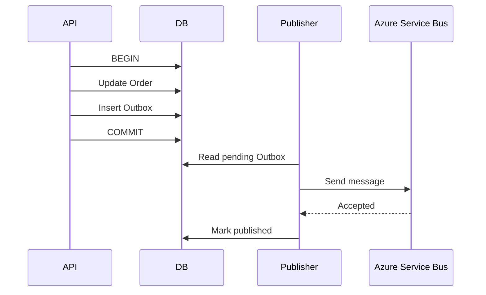

# Daily Knowledge Sharing — 2026-09-25

## Today’s Topics

1. C# `IAsyncDisposable`: cleanup bất đồng bộ và lifecycle của tài nguyên I/O
2. ASP.NET Core streaming response: giảm memory pressure nhưng thay đổi error boundary
3. EF Core transaction boundary: `SaveChanges`, explicit transaction và external side effects
4. PostgreSQL keyset pagination: ổn định latency khi dataset tăng lớn
5. Redis cache invalidation: ownership, versioned keys và stale-data budget
6. Azure Managed Identity + Key Vault: bỏ credentials khỏi application configuration
7. Outbox Pattern: nối database transaction với Azure Service Bus mà không cần distributed transaction
8. Application Insights metrics: p95/p99, dependency latency và điều tra regression
9. Kubernetes resource requests/limits: scheduling, throttling và OOMKilled
10. AI RAG security: prompt injection, data authorization và deterministic boundaries

---

# 1. C# `IAsyncDisposable`: cleanup bất đồng bộ và lifecycle của tài nguyên I/O

## 1. What is it?

Mental model: `IDisposable` giải phóng tài nguyên bằng một synchronous call; `IAsyncDisposable` cho phép bước cleanup tự nó cần `await`. Nó phù hợp khi đóng, flush hoặc hoàn tất tài nguyên phải thực hiện I/O thay vì chỉ giải phóng managed state.

`await using` đảm bảo `DisposeAsync()` được gọi khi rời scope, kể cả khi exception xảy ra.

## 2. Why does it exist?

Một resource như stream, transaction hoặc async writer đôi khi phải flush dữ liệu xuống network/storage trước khi đóng. Nếu cleanup đó bị ép thành synchronous blocking, request thread có thể bị giữ vô ích. Nếu bỏ cleanup, resource có thể leak hoặc dữ liệu chưa flush.

## 3. How does it work?

Compiler hạ `await using` thành một `try/finally` logic tương đương, trong đó `DisposeAsync()` được await trong đường thoát.

```text
acquire resource
   ↓
use asynchronously
   ↓
scope exits / exception
   ↓
await DisposeAsync()
   ↓
resource released
```

Cleanup vì vậy là một phần của latency và failure path, không phải “free operation”.

## 4. Practical implementation

```csharp
public sealed class ExportWriter : IAsyncDisposable
{
    private readonly StreamWriter _writer;

    public ExportWriter(Stream stream)
        => _writer = new StreamWriter(stream);

    public Task WriteAsync(string line, CancellationToken ct) =>
        _writer.WriteLineAsync(line.AsMemory(), ct).AsTask();

    public async ValueTask DisposeAsync()
    {
        await _writer.FlushAsync();
        await _writer.DisposeAsync();
    }
}

await using var writer = new ExportWriter(stream);
await writer.WriteAsync("order-123", cancellationToken);
```

Nếu class sở hữu nhiều resource, ownership phải rõ ràng: chỉ dispose thứ mà class thực sự sở hữu.

## 5. Real production scenario

Một background export ghi CSV lớn vào Blob stream. Request tạo writer, ghi hàng nghìn dòng rồi kết thúc. Async disposal flush buffer cuối cùng mà không block worker thread. Nếu process shutdown, lifecycle của worker vẫn phải cho operation đủ thời gian hoàn tất hoặc chấp nhận cancellation có kiểm soát.

## 6. Failure scenario & troubleshooting

**Symptom** → export đôi khi thiếu dòng cuối hoặc request latency tăng bất thường.

**Evidence** → trace cho thấy synchronous flush trên request thread hoặc code return trước khi async cleanup hoàn tất.

**Hypothesis** → resource được dùng bằng `using`/manual cleanup sai lifecycle.

**Diagnosis** → kiểm tra implementation có `IAsyncDisposable`, thời gian `DisposeAsync`, cancellation và ownership.

**Fix** → dùng `await using`, không fire-and-forget cleanup, giới hạn timeout ở lifecycle cao hơn.

**Verification** → test file integrity, trace thời gian cleanup và chạy shutdown test.

## 7. Common mistakes

Gọi `DisposeAsync().AsTask().Wait()`; dispose cùng resource ở nhiều layer; cho rằng finalizer thay thế deterministic cleanup; hoặc dùng async disposal cho object chỉ có in-memory cleanup, làm API phức tạp vô ích.

## 8. Alternatives

`IDisposable` tốt hơn khi cleanup hoàn toàn synchronous. Một lifecycle manager riêng phù hợp khi resource sống xuyên nhiều request. Không nên thêm `IAsyncDisposable` chỉ vì API “trông hiện đại”.

## 9. Trade-offs

### Advantages

Không block thread trong I/O cleanup; biểu diễn đúng lifecycle; phối hợp tốt với async pipeline.

### Costs / Risks

Call site phải hỗ trợ async; cleanup làm tăng thời gian thoát scope; ownership phức tạp có thể gây double-dispose hoặc dispose quá sớm.

## 10. Junior → Middle → Senior → Technical Lead

### Junior

Hiểu `using` là resource ownership, không chỉ syntax.

### Middle

Biết implement `IAsyncDisposable`, dùng `await using` và test exception path.

### Senior

Đánh giá cleanup latency, cancellation, shutdown và ownership xuyên abstraction.

### Technical Lead / Architect

Quyết định resource boundary ở đâu và liệu async lifecycle có thực sự cần thiết hay chỉ làm contract khó dùng hơn.

## 11. Key takeaway

- Async cleanup là một phần của production lifecycle.
- Không block trên `DisposeAsync`.
- Resource ownership phải rõ hơn cả syntax disposal.

---

# 2. ASP.NET Core streaming response: giảm memory pressure nhưng thay đổi error boundary

## 1. What is it?

Streaming response gửi dữ liệu dần về client thay vì materialize toàn bộ payload trong memory rồi mới trả. Mental model: producer tạo chunk, server đẩy chunk qua HTTP, client tiêu thụ dần.

## 2. Why does it exist?

Một API export 500 MB nếu build `byte[]` hoàn chỉnh sẽ tạo allocation lớn, tăng GC pressure và có thể làm process hết memory khi nhiều request chạy đồng thời. Streaming giữ working set nhỏ hơn và cho client nhận byte đầu sớm hơn.

## 3. How does it work?

```text
Database / Blob
      ↓
small buffer
      ↓
ASP.NET Core response body
      ↓
reverse proxy
      ↓
client
```

Sau khi response headers/body bắt đầu được gửi, server không còn tự do đổi sang một JSON `ProblemDetails` như trước. Đây là thay đổi quan trọng về error semantics.

## 4. Practical implementation

```csharp
app.MapGet("/exports/{id}", async (
    string id,
    HttpResponse response,
    IExportStore store,
    CancellationToken ct) =>
{
    response.ContentType = "text/csv";
    response.Headers.ContentDisposition =
        $"attachment; filename=\"{id}.csv\"";

    await foreach (var chunk in store.ReadChunksAsync(id, ct))
    {
        await response.Body.WriteAsync(chunk, ct);
        await response.Body.FlushAsync(ct);
    }
});
```

Production code cần validation và authorization **trước** khi bắt đầu response.

## 5. Real production scenario

E-commerce back office cho phép tải catalog lớn. API kiểm tra quyền, xác nhận export tồn tại, sau đó stream từ Blob Storage. Reverse proxy không phải giữ toàn bộ file trong application memory.

## 6. Failure scenario & troubleshooting

**Symptom** → client nhận file bị cắt giữa chừng nhưng status vẫn là `200`.

**Evidence** → server log có storage timeout sau khi response đã started.

**Hypothesis** → failure xảy ra sau commit headers.

**Diagnosis** → correlate request trace với dependency trace và số byte đã gửi.

**Fix** → validate sớm, hỗ trợ resumable download/range khi cần, đặt timeout hợp lý, và để client phát hiện incomplete transfer.

**Verification** → fault-injection giữa stream và xác nhận client xử lý partial response đúng.

## 7. Common mistakes

Materialize dữ liệu trước rồi gọi API “streaming”; flush từng vài byte làm throughput giảm; không propagate `CancellationToken` khi client disconnect; hoặc cố ghi `ProblemDetails` sau khi response đã started.

## 8. Alternatives

Pre-generate file vào Blob rồi trả SAS URL thường tốt hơn cho file rất lớn. Buffered response đơn giản hơn cho payload nhỏ. gRPC streaming phù hợp cho contract service-to-service có kiểm soát.

## 9. Trade-offs

### Advantages

Working set thấp, time-to-first-byte tốt, xử lý file lớn hiệu quả.

### Costs / Risks

Error handling khó hơn; connection sống lâu; backpressure, proxy timeout và client disconnect trở thành concern quan trọng.

## 10. Junior → Middle → Senior → Technical Lead

### Junior

Hiểu khác biệt giữa buffer toàn bộ và stream theo chunk.

### Middle

Implement streaming có cancellation và authorization đúng.

### Senior

Hiểu response commit, proxy behavior, backpressure và partial failure.

### Technical Lead / Architect

Quyết định application nên stream trực tiếp hay chuyển data plane sang Blob/CDN để giảm tải application.

## 11. Key takeaway

- Streaming giảm memory, không xóa chi phí network.
- Validate trước khi response bắt đầu.
- Với file lớn, direct object-storage delivery thường là boundary tốt hơn.

---

# 3. EF Core transaction boundary: `SaveChanges`, explicit transaction và external side effects

## 1. What is it?

Transaction boundary xác định tập thay đổi nào phải commit hoặc rollback như một đơn vị. Với relational provider, một lần `SaveChanges` thường được EF Core bao trong transaction khi cần.

## 2. Why does it exist?

Business invariant có thể yêu cầu nhiều row thay đổi cùng nhau. Nhưng database transaction không tự động bao phủ email, HTTP call hoặc message broker. Nhầm boundary là nguồn của nhiều lỗi “DB đã commit nhưng event chưa gửi”.

## 3. How does it work?

```text
Tracked changes
   ↓
SaveChanges
   ↓
BEGIN
 SQL statements
COMMIT / ROLLBACK
```

Explicit transaction cần khi nhiều `SaveChanges` phải atomic. Nhưng transaction càng dài càng giữ locks lâu và tăng contention.

## 4. Practical implementation

```csharp
await using var tx =
    await db.Database.BeginTransactionAsync(cancellationToken);

order.Approve(userId);
db.AuditEntries.Add(AuditEntry.For(order));

await db.SaveChangesAsync(cancellationToken);
await tx.CommitAsync(cancellationToken);
```

Không đặt `await serviceBus.SendMessageAsync(...)` bên trong rồi tưởng broker đã tham gia SQL transaction. Với event cần reliable publication, dùng Outbox.

## 5. Real production scenario

Approval workflow cập nhật trạng thái timesheet và ghi audit record. Hai thay đổi thuộc cùng invariant nên commit chung. Notification gửi sau là side effect khác consistency boundary.

## 6. Failure scenario & troubleshooting

**Symptom** → order ở trạng thái Approved nhưng notification event không tồn tại.

**Evidence** → SQL commit thành công, broker timeout ngay sau đó.

**Hypothesis** → dual-write không atomic.

**Diagnosis** → trace transaction và message publication.

**Fix** → lưu Outbox row trong cùng SQL transaction; publisher riêng gửi sau.

**Verification** → kill process giữa commit và publish, sau restart event vẫn được gửi.

## 7. Common mistakes

Transaction bao cả external HTTP call; nhiều `SaveChanges` không chủ đích; retry transaction không xét idempotency; hoặc generic Repository che mất transaction semantics của `DbContext`.

## 8. Alternatives

Một `SaveChanges` là lựa chọn đơn giản nhất khi đủ. Explicit transaction cho nhiều DB operations. Outbox cho DB + messaging. Distributed transaction chỉ phù hợp trong môi trường rất cụ thể và tăng coupling vận hành.

## 9. Trade-offs

### Advantages

Boundary đúng bảo vệ invariant và đơn giản hóa reasoning.

### Costs / Risks

Transaction dài tăng lock duration; retry phức tạp; boundary quá rộng ghép các dependency không cần thiết.

## 10. Junior → Middle → Senior → Technical Lead

### Junior

Hiểu commit/rollback và atomicity.

### Middle

Biết khi nào một `SaveChanges` đủ và khi nào cần explicit transaction.

### Senior

Nhận ra dual-write, retry và lock-duration failure mode.

### Technical Lead / Architect

Định nghĩa consistency boundary theo business invariant, không theo folder/service method.

## 11. Key takeaway

- Transaction boundary là business consistency decision.
- SQL transaction không làm HTTP/message broker atomic.
- Giữ transaction ngắn nhất có thể.

---

# 4. PostgreSQL keyset pagination: ổn định latency khi dataset tăng lớn

## 1. What is it?

Keyset pagination lấy trang kế tiếp dựa trên giá trị sort key cuối cùng đã thấy thay vì `OFFSET N`. Mental model: “tiếp tục sau record này” thay vì “bỏ qua N records”.

## 2. Why does it exist?

`OFFSET 500000 LIMIT 50` vẫn buộc database đi qua lượng lớn row trước khi trả 50 row. Khi table lớn, latency tăng theo page depth và concurrent insert/delete có thể làm item bị lặp hoặc bỏ sót.

## 3. How does it work?

Với sort `created_at DESC, id DESC`, cursor giữ cặp `(created_at, id)`.

```sql
SELECT id, created_at, total
FROM orders
WHERE (created_at, id) < (@created_at, @id)
ORDER BY created_at DESC, id DESC
LIMIT 50;
```

Index tương ứng:

```sql
CREATE INDEX ix_orders_created_id
ON orders (created_at DESC, id DESC);
```

Tie-breaker `id` tạo total ordering.

## 4. Practical implementation

API có thể trả opaque cursor thay vì expose raw values. Server decode cursor, validate shape, rồi bind parameters. Không concatenate cursor vào SQL.

## 5. Real production scenario

Order history có hàng chục triệu records. UI chỉ cần Next/Previous, không cần “nhảy tới trang 10,421”. Keyset giữ query gần O(page size) theo access pattern thay vì chi phí tăng sâu theo offset.

## 6. Failure scenario & troubleshooting

**Symptom** → page sâu mất vài giây dù page đầu chỉ 30 ms.

**Evidence** → `EXPLAIN (ANALYZE, BUFFERS)` cho thấy nhiều rows scanned/discarded bởi OFFSET.

**Hypothesis** → pagination strategy, không phải network, là bottleneck.

**Diagnosis** → so execution plan giữa offset và keyset; kiểm tra composite index.

**Fix** → cursor pagination + deterministic ordering.

**Verification** → benchmark page đầu và cursor sau hàng triệu rows, theo dõi p95.

## 7. Common mistakes

Sort không deterministic; chỉ dùng timestamp có duplicate; index order không khớp query; cursor cho phép client sửa tùy ý; hoặc chọn keyset khi product bắt buộc random page navigation.

## 8. Alternatives

Offset pagination đơn giản và phù hợp dataset nhỏ/admin UI. Windowing có thể cần cho reporting. Search engine có cơ chế riêng như `search_after`.

## 9. Trade-offs

### Advantages

Latency ổn định hơn, ít scan thừa, behavior tốt hơn khi dữ liệu thay đổi.

### Costs / Risks

Không nhảy arbitrary page tự nhiên; cursor contract phức tạp hơn; sorting tùy ý khó hỗ trợ.

## 10. Junior → Middle → Senior → Technical Lead

### Junior

Hiểu `LIMIT/OFFSET` và ordering.

### Middle

Implement cursor có composite key và index phù hợp.

### Senior

Đọc execution plan, hiểu concurrency behavior và index cost.

### Technical Lead / Architect

Chọn pagination contract từ UX + scale requirement, không mặc định offset vì dễ code.

## 11. Key takeaway

- Deep OFFSET là access-pattern problem.
- Keyset cần deterministic sort và matching index.
- API contract quyết định khả năng tối ưu database về sau.

---

# 5. Redis cache invalidation: ownership, versioned keys và stale-data budget

## 1. What is it?

Cache invalidation là cơ chế đảm bảo cached representation không sống lâu hơn mức freshness mà business chấp nhận. Mental model: cache là bản sao; phải có quy tắc ai tạo, ai làm stale, ai xóa và stale tối đa bao lâu.

## 2. Why does it exist?

TTL đơn thuần không giải quyết dữ liệu cần phản ánh thay đổi ngay. Xóa cache “ở đâu nhớ thì xóa” tạo hidden coupling và bug khó tái hiện.

## 3. How does it work?

Cache-aside phổ biến:

```text
Read:
API -> Redis
 miss -> DB -> Redis SET

Write:
API -> DB commit
        ↓
invalidate/update cache
```

Vấn đề là khoảng giữa DB commit và invalidation. Với nhiều service, event-driven invalidation có thể giảm coupling nhưng thêm eventual consistency.

## 4. Practical implementation

```csharp
var key = $"product:v3:{productId}";
var cached = await cache.GetStringAsync(key, ct);

if (cached is null)
{
    var dto = await db.Products
        .Where(x => x.Id == productId)
        .Select(x => new ProductDto(x.Id, x.Name, x.Price))
        .SingleAsync(ct);

    await cache.SetStringAsync(
        key,
        JsonSerializer.Serialize(dto),
        new DistributedCacheEntryOptions
        {
            AbsoluteExpirationRelativeToNow = TimeSpan.FromMinutes(5)
        },
        ct);
}
```

Version `v3` giúp đổi serialization/schema mà không cần purge toàn bộ key cũ ngay lập tức.

## 5. Real production scenario

Product detail được cache 5 phút. Giá thay đổi cần hiển thị trong tối đa 30 giây, còn description có thể stale 10 phút. Một cache object chung làm freshness contract mâu thuẫn; nên tách representation hoặc invalidation policy theo business requirement.

## 6. Failure scenario & troubleshooting

**Symptom** → một số node hiển thị giá cũ sau update.

**Evidence** → DB đúng, Redis key còn TTL 4 phút.

**Hypothesis** → write path không invalidated cache.

**Diagnosis** → trace update flow, audit key ownership, kiểm tra consumer invalidation event.

**Fix** → một ownership policy rõ ràng; invalidate sau successful commit; nếu event-based thì consumer idempotent.

**Verification** → integration test update→read và đo stale duration thực tế.

## 7. Common mistakes

Cache entity EF trực tiếp; wildcard delete trong hot path; TTL quá dài để “tăng hit rate”; không có fallback khi Redis down; nhiều service cùng tự đặt key convention.

## 8. Alternatives

Không cache nếu DB đã đủ nhanh. `IMemoryCache` phù hợp single instance/non-shared data. CDN tốt cho HTTP representation. Materialized read model phù hợp khi vấn đề là query model chứ không phải cache.

## 9. Trade-offs

### Advantages

Giảm latency và backend load.

### Costs / Risks

Staleness, invalidation complexity, memory cost và thêm dependency có thể fail.

## 10. Junior → Middle → Senior → Technical Lead

### Junior

Hiểu cache là copy, không phải source of truth.

### Middle

Implement cache-aside, TTL, serialization và invalidation.

### Senior

Thiết kế stampede protection, failure fallback và freshness SLO.

### Technical Lead / Architect

Trả lời trước: cache có thật sự cần không, ai sở hữu invalidation và business chịu stale bao lâu.

## 11. Key takeaway

- Cache correctness bắt đầu từ freshness contract.
- TTL không thay thế ownership.
- Cache có thể giảm latency nhưng tăng consistency complexity.

---

# 6. Azure Managed Identity + Key Vault: bỏ credentials khỏi application configuration

## 1. What is it?

Managed Identity cung cấp identity do Azure quản lý cho workload; Key Vault lưu secrets/keys/certificates. Kết hợp hai thứ cho phép application xác thực tới Key Vault mà không chứa client secret trong config.

## 2. Why does it exist?

Secret trong `appsettings.json`, pipeline variable hoặc environment variable vẫn phải được tạo, phân phối và rotate. Managed Identity loại bỏ credential tĩnh cho Azure-to-Azure authentication khi service hỗ trợ Microsoft Entra ID.

## 3. How does it work?

```text
App Service / Container App
        │ workload identity
        ▼
Microsoft Entra ID
        │ token
        ▼
Key Vault
        │ RBAC permits secret read
        ▼
Application
```

Identity không tự cấp quyền. Authorization vẫn phải được cấu hình bằng RBAC/appropriate access policy.

## 4. Practical implementation

```csharp
var client = new SecretClient(
    new Uri(configuration["KeyVaultUri"]!),
    new DefaultAzureCredential());

KeyVaultSecret secret =
    await client.GetSecretAsync("PartnerApiKey", cancellationToken: ct);
```

Local development có thể dùng developer credential chain; production dùng Managed Identity. Không hard-code fallback secret.

## 5. Real production scenario

ASP.NET Core App Service cần API key của legacy partner chưa hỗ trợ Entra ID. App dùng Managed Identity để đọc secret từ Key Vault. Với Azure SQL/Storage hỗ trợ Entra, tốt hơn nữa là dùng Managed Identity trực tiếp và không cần secret trung gian.

## 6. Failure scenario & troubleshooting

**Symptom** → local chạy được nhưng Production trả `403` khi đọc Key Vault.

**Evidence** → authentication lấy token thành công; Key Vault audit cho thấy authorization denied.

**Hypothesis** → identity tồn tại nhưng thiếu RBAC hoặc gán nhầm principal.

**Diagnosis** → xác định object/principal ID thực tế của workload, scope role assignment và network restrictions.

**Fix** → least-privilege role đúng scope; nếu vault dùng Private Endpoint, kiểm tra DNS/VNet path.

**Verification** → request secret từ workload production và kiểm tra audit log.

## 7. Common mistakes

Cho identity quyền quá rộng; nhầm authentication với authorization; vẫn copy secret từ Key Vault vào log; fetch secret trên mỗi request; hoặc dùng Key Vault để chứa thứ không phải secret chỉ vì “secure”.

## 8. Alternatives

Environment secret có thể đủ cho local/small deployment nhưng rotation khó hơn. Workload Identity trong AKS giải quyết pod identity. Với service hỗ trợ Entra trực tiếp, Managed Identity → service tốt hơn Managed Identity → Key Vault → password.

## 9. Trade-offs

### Advantages

Không quản lý client secret, rotation tốt hơn, audit và least privilege rõ hơn.

### Costs / Risks

Phụ thuộc Entra/Key Vault availability, RBAC và networking phức tạp hơn; secret retrieval vẫn cần caching/lifecycle hợp lý.

## 10. Junior → Middle → Senior → Technical Lead

### Junior

Phân biệt identity, credential và permission.

### Middle

Cấu hình `DefaultAzureCredential`, Managed Identity và Key Vault access.

### Senior

Debug token/RBAC/network, thiết kế secret caching và rotation.

### Technical Lead / Architect

Giảm số secret toàn hệ thống bằng identity-based auth, không chỉ chuyển secret từ config sang vault.

## 11. Key takeaway

- Managed Identity giải quyết credential ownership.
- Key Vault không thay thế least privilege.
- Nếu downstream hỗ trợ Entra, ưu tiên token trực tiếp hơn secret trung gian.

---

# 7. Outbox Pattern: nối database transaction với Azure Service Bus mà không cần distributed transaction

## 1. What is it?

Outbox Pattern lưu business change và message-to-publish trong cùng local database transaction. Một publisher riêng đọc Outbox và gửi message tới broker.

## 2. Why does it exist?

Dual-write:

```text
UPDATE database
SEND message
```

không atomic. DB có thể commit rồi broker fail, hoặc broker nhận message nhưng DB rollback. Outbox chuyển vấn đề từ “atomic cross-system commit” sang “reliable eventual publication”.

## 3. How does it work?



Publisher có thể crash sau broker accept nhưng trước mark-published. Vì vậy duplicate delivery vẫn có thể xảy ra; consumer phải idempotent.

## 4. Practical implementation

```csharp
order.MarkPaid();

db.OutboxMessages.Add(new OutboxMessage
{
    Id = Guid.NewGuid(),
    Type = "OrderPaid",
    Payload = JsonSerializer.Serialize(
        new OrderPaid(order.Id, order.Total)),
    OccurredAtUtc = DateTimeOffset.UtcNow
});

await db.SaveChangesAsync(ct);
```

Publisher nên batch, có retry/backoff và telemetry cho oldest pending age.

## 5. Real production scenario

Payment API cập nhật order và cần fulfillment bắt đầu. Nếu Service Bus tạm unavailable, checkout vẫn commit transaction; Outbox giữ event để publisher gửi khi broker hồi phục.

## 6. Failure scenario & troubleshooting

**Symptom** → queue backlog bình thường nhưng order không được fulfillment.

**Evidence** → Outbox có hàng nghìn pending rows, oldest age 40 phút.

**Hypothesis** → publisher bị lỗi/permission/broker outage.

**Diagnosis** → kiểm tra publisher health, Service Bus dependency telemetry, retry rate và dead-letter behavior.

**Fix** → phục hồi publisher; replay pending an toàn; consumer deduplicate theo message ID.

**Verification** → oldest-outbox-age giảm về SLO và mỗi order tạo đúng business outcome.

## 7. Common mistakes

Xóa Outbox trước khi broker ack; tin rằng Outbox tạo exactly-once; không index pending rows; không retention cleanup; serialize domain object tùy tiện thành integration contract.

## 8. Alternatives

Synchronous call đơn giản hơn nếu consistency requirement cho phép. Transactional broker/database integration có thể tồn tại trong platform cụ thể nhưng coupling cao. CDC có thể publish từ database log nhưng vận hành phức tạp hơn.

## 9. Trade-offs

### Advantages

Không mất event sau DB commit; chịu broker outage tốt; transaction local rõ ràng.

### Costs / Risks

Eventual consistency, duplicate handling, Outbox growth, publisher và monitoring mới.

## 10. Junior → Middle → Senior → Technical Lead

### Junior

Hiểu vì sao DB + broker là hai failure domains.

### Middle

Implement Outbox record và background publisher.

### Senior

Thiết kế idempotency, batching, retry, retention và observability.

### Technical Lead / Architect

Quyết định workflow nào thật sự cần reliable asynchronous integration và chấp nhận eventual consistency ở đâu.

## 11. Key takeaway

- Outbox giải quyết lost publication, không tạo exactly-once.
- Consumer vẫn phải idempotent.
- Monitor **oldest pending age**, không chỉ row count.

---

# 8. Application Insights metrics: p95/p99, dependency latency và điều tra regression

## 1. What is it?

Metrics là số liệu tổng hợp theo thời gian; p95/p99 mô tả tail latency: 95%/99% request hoàn tất nhanh hơn ngưỡng đó. Chúng cho thấy trải nghiệm xấu của nhóm request mà average dễ che mất.

## 2. Why does it exist?

Average 200 ms có thể trông tốt trong khi 1% request mất 8 giây. Production capacity và user experience thường bị chi phối bởi tail latency, dependency timeout và retry.

## 3. How does it work?

```text
Request metric
  ├─ duration
  ├─ status
  └─ dimensions
       ↓
percentiles / rate
       ↓
trace exemplars
       ↓
dependency spans
```

Metrics phát hiện “có vấn đề”; traces giúp định vị request; logs cung cấp context chi tiết.

## 4. Practical implementation

Với OpenTelemetry trong ASP.NET Core:

```csharp
builder.Services.AddOpenTelemetry()
    .WithTracing(t => t
        .AddAspNetCoreInstrumentation()
        .AddHttpClientInstrumentation()
        .AddEntityFrameworkCoreInstrumentation())
    .WithMetrics(m => m
        .AddAspNetCoreInstrumentation()
        .AddHttpClientInstrumentation());
```

Đừng tạo metric dimension bằng `userId`/request ID vì cardinality sẽ bùng nổ.

## 5. Real production scenario

Sau deployment, average API latency tăng từ 180 lên 220 ms nhưng p99 tăng từ 900 ms lên 6 s. Dependency trace chỉ ra một SQL query mới chỉ chậm cho tenant có dataset lớn.

## 6. Failure scenario & troubleshooting

**Symptom** → p99 tăng mạnh, CPU bình thường.

**Evidence** → dependency p99 của SQL tăng; trace chậm cùng endpoint/version mới.

**Hypothesis** → data-dependent query regression.

**Diagnosis** → correlate deployment marker, query span, execution plan và tenant data shape.

**Fix** → sửa access pattern/index/query; rollback nếu impact cao.

**Verification** → p95/p99 quay về baseline và error/timeout rate giảm.

## 7. Common mistakes

Chỉ nhìn average; log mọi request nhưng không có metrics; high-cardinality dimensions; alert trên một spike đơn lẻ; hoặc coi telemetry sampling là “mất dữ liệu” mà không hiểu mục tiêu.

## 8. Alternatives

Prometheus/Grafana là stack phổ biến khác. Azure Monitor/Application Insights thuận tiện trong Azure. OpenTelemetry giúp instrumentation ít phụ thuộc backend hơn.

## 9. Trade-offs

### Advantages

Phát hiện regression nhanh, liên kết app với dependency, hỗ trợ SLO.

### Costs / Risks

Telemetry có chi phí ingestion/storage; cardinality và sampling cần thiết kế; dashboard sai có thể tạo false confidence.

## 10. Junior → Middle → Senior → Technical Lead

### Junior

Hiểu logs, metrics, traces giải quyết câu hỏi khác nhau.

### Middle

Instrument endpoint/dependency và đọc percentile.

### Senior

Correlate telemetry thành hypothesis, tránh metric cardinality và noisy alerts.

### Technical Lead / Architect

Định nghĩa SLI/SLO và telemetry budget dựa trên user journey, không dựa trên thứ dễ đo.

## 11. Key takeaway

- Average không đại diện tail latency.
- Metrics phát hiện; traces định vị; logs giải thích context.
- Telemetry phải phục vụ quyết định vận hành.

---

# 9. Kubernetes resource requests/limits: scheduling, throttling và OOMKilled

## 1. What is it?

`requests` mô tả resource Kubernetes dùng để schedule Pod; `limits` đặt trần resource container được phép tiêu thụ. CPU và memory có semantics khác nhau: vượt CPU limit thường bị throttling; vượt memory limit có thể dẫn tới OOM kill.

## 2. Why does it exist?

Không có resource contract, một workload noisy có thể chiếm node và ảnh hưởng workload khác. Nhưng limit đặt tùy tiện cũng tự tạo outage.

## 3. How does it work?

```yaml
resources:
  requests:
    cpu: "250m"
    memory: "256Mi"
  limits:
    cpu: "1000m"
    memory: "512Mi"
```

Scheduler chủ yếu dựa vào requests để placement. Runtime enforcement dùng cgroups. `.NET` runtime nhận biết container memory limit ở các phiên bản hiện đại, nhưng application vẫn phải kiểm soát working set và allocation.

## 4. Practical implementation

Bắt đầu từ measurement của workload representative, không copy một YAML template. Theo dõi CPU usage/throttling, working set, GC heap, allocation rate và restart reason. Load test với concurrency thực tế trước khi chọn limit.

## 5. Real production scenario

ASP.NET Core API bình thường dùng 220 MiB nhưng image-processing endpoint spike lên 650 MiB. Limit 512 MiB làm Pod bị OOMKilled đúng lúc traffic cao; readiness chuyển traffic sang Pod còn lại, khiến chúng cũng quá tải.

## 6. Failure scenario & troubleshooting

**Symptom** → Pod restart, API 5xx, application log không có exception cuối cùng.

**Evidence** → `kubectl describe pod` cho thấy `OOMKilled`; memory metric chạm limit.

**Hypothesis** → container bị kernel kill, không phải app graceful crash.

**Diagnosis** → correlate workload, GC/memory profile và limit.

**Fix** → giảm peak allocation/stream workload, điều chỉnh concurrency và sau khi đo mới tăng resource nếu cần.

**Verification** → load test không còn OOM, restart count ổn định và node vẫn có headroom.

## 7. Common mistakes

Requests bằng 0; limit memory quá sát average; tăng limit thay vì tìm leak; nhầm CPU throttling với “server thiếu thread”; hoặc cấu hình HPA chỉ dựa trên CPU mà không hiểu request value.

## 8. Alternatives

VM/App Service che bớt scheduling complexity nhưng vẫn có capacity limits. Container Apps cung cấp abstraction cao hơn. Kubernetes hợp lý khi platform requirement thực sự cần orchestration flexibility.

## 9. Trade-offs

### Advantages

Isolation, predictable scheduling, capacity planning tốt hơn.

### Costs / Risks

Sai sizing gây throttling/OOM; tăng operational tuning; over-request làm cluster utilization thấp.

## 10. Junior → Middle → Senior → Technical Lead

### Junior

Phân biệt request và limit.

### Middle

Biết đọc Pod status, metrics và restart reason.

### Senior

Liên kết cgroups với .NET GC, load shape, HPA và node pressure.

### Technical Lead / Architect

Quyết định resource policy dựa trên SLO/cost/capacity và xem Kubernetes có đáng operational burden hay không.

## 11. Key takeaway

- Requests phục vụ scheduling; limits phục vụ enforcement.
- CPU throttling và memory OOM là hai failure mode khác nhau.
- Resource values phải đến từ measurement.

---

# 10. AI RAG security: prompt injection, data authorization và deterministic boundaries

## 1. What is it?

RAG đưa dữ liệu truy xuất được vào model context để model trả lời dựa trên knowledge source. Security mental model: retrieved text là **untrusted input**, không phải trusted instruction; retrieval relevance cũng không đồng nghĩa user được phép xem document.

## 2. Why does it exist?

Một chatbot enterprise có thể tìm đúng tài liệu nhưng vẫn leak dữ liệu nếu authorization chỉ tồn tại ở UI. Document cũng có thể chứa câu “ignore previous instructions...” khiến model bị prompt injection nếu hệ thống coi content như instruction.

## 3. How does it work?

```text
User
  ↓ authenticated identity
Query
  ↓
Authorization-aware retrieval
  ↓
Allowed documents only
  ↓
Prompt assembly
  ↓
LLM
  ↓
Output validation / policy
  ↓
User
```

Authorization phải xảy ra trước hoặc trong retrieval. Model không phải authorization engine.

## 4. Practical implementation

```csharp
var allowedIds = await acl.GetReadableDocumentIdsAsync(
    user.Id, cancellationToken);

var hits = await search.SearchAsync(
    query,
    filter: SearchFilter.In("documentId", allowedIds),
    cancellationToken);

var context = hits.Select(h => new
{
    h.DocumentId,
    h.Text,
    Trust = "untrusted_retrieved_content"
});
```

Ở scale lớn, không nên materialize hàng nghìn ID; dùng security trimming/filter theo tenant/group metadata hoặc retrieval architecture phù hợp.

Tool actions như approve payment, delete record, change role phải được server-side deterministic authorization dù model đề nghị action.

## 5. Real production scenario

Internal engineering assistant truy xuất runbook, incident report và customer-specific architecture docs. User nhóm A hỏi về customer B. Vector similarity có thể tìm đúng tài liệu B; ACL filter phải loại nó trước khi context tới model.

## 6. Failure scenario & troubleshooting

**Symptom** → red-team prompt khiến assistant tiết lộ đoạn từ restricted document.

**Evidence** → retrieval trace cho thấy restricted chunk đã vào model context.

**Hypothesis** → authorization được áp sau generation hoặc chỉ dựa trên prompt instruction.

**Diagnosis** → inspect retrieval filters, identity propagation, tenant metadata và tool authorization.

**Fix** → security trimming trước model; treat retrieved content as data; server-side authorization cho tools; output filtering chỉ là defense-in-depth.

**Verification** → adversarial eval matrix theo role/tenant/document và prompt-injection corpus.

## 7. Common mistakes

Tin system prompt đủ để chống injection; dùng vector similarity như ACL; log raw confidential prompts; cho model tự quyết định permission; retry model vô hạn; hoặc cho tool token có quyền rộng hơn user.

## 8. Alternatives

Keyword/search API với deterministic filters có thể đủ nếu không cần generative synthesis. Fine-tuning không thay thế retrieval authorization. Workflow deterministic tốt hơn LLM cho business rules cần correctness tuyệt đối.

## 9. Trade-offs

### Advantages

RAG cập nhật knowledge mà không retrain, có thể trích nguồn và giới hạn context theo domain.

### Costs / Risks

Retrieval quality, ACL complexity, injection, token cost, latency, evaluation và observability trở thành production concerns mới.

## 10. Junior → Middle → Senior → Technical Lead

### Junior

Hiểu model context không phải security boundary.

### Middle

Implement authenticated retrieval, metadata filters và safe prompt assembly.

### Senior

Threat-model injection/data leakage, instrument retrieval, xây adversarial evaluations và deterministic tool guards.

### Technical Lead / Architect

Quyết định dữ liệu nào được phép vào AI system, identity truyền xuyên retrieval ra sao, action nào tuyệt đối không giao quyền quyết định cho model, và operational cost có đáng giá trị business không.

## 11. Key takeaway

- Retrieval relevance không phải authorization.
- Retrieved content phải được coi là untrusted data.
- Deterministic authorization và business rules phải nằm ngoài model.
