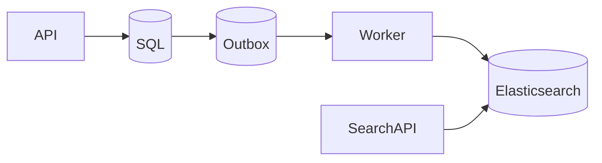
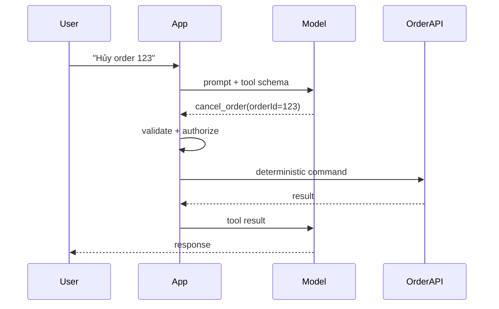

# Daily Knowledge Sharing — 2026-09-26

## Today’s Topics

1. .NET ThreadPool starvation và sync-over-async trong ASP.NET Core
2. REST API idempotency key cho các lệnh có side effect
3. EF Core optimistic concurrency với concurrency token
4. SQL Server deadlock: lock order, execution plan và retry đúng chỗ
5. Elasticsearch synchronization lag và eventual consistency
6. Azure Service Bus message lock, settlement và poison message
7. OpenTelemetry distributed tracing: nối request xuyên service
8. Akamai/CDN cache semantics: Cache-Control, stale content và purge
9. Optimizely CMS content modeling: page, block và boundary nội dung
10. AI Tool Calling: deterministic boundary, validation và observability

---

# 1. .NET ThreadPool starvation và sync-over-async trong ASP.NET Core

## 1. What is it?

ThreadPool starvation xảy ra khi application còn công việc nhưng không có đủ worker thread sẵn sàng để thực thi. Mental model quan trọng: `async` không tạo thêm CPU; nó giúp thread được trả về pool trong lúc chờ I/O. Nếu request dùng `.Result`, `.Wait()` hoặc blocking I/O, thread bị giữ lại trong khi công việc tiếp tục lại cũng cần ThreadPool.

## 2. Why does it exist?

ASP.NET Core cần xử lý nhiều request đồng thời với số thread hữu hạn. Nếu mỗi request giữ một thread chỉ để chờ database/HTTP, throughput sẽ sụp trước khi CPU đạt 100%. Async I/O tồn tại để tách concurrency khỏi số lượng thread.

## 3. How does it work?

```text
Request -> ThreadPool worker -> await HTTP/SQL
                         |
                         +-> worker trả về pool
I/O completion -> continuation được queue -> worker khác tiếp tục
```

Với sync-over-async, worker không được trả về. Khi nhiều request cùng block, continuation xếp hàng, ThreadPool phải tăng thread từ từ và latency tăng mạnh.

## 4. Practical implementation

```csharp
public async Task<ProductDto> GetProductAsync(
    int id, CancellationToken ct)
{
    using var response = await _httpClient.GetAsync(
        $"products/{id}", ct);

    response.EnsureSuccessStatusCode();

    return (await response.Content
        .ReadFromJsonAsync<ProductDto>(cancellationToken: ct))!;
}
```

Giữ chuỗi gọi “async all the way”; truyền `CancellationToken` xuống dependency thay vì chuyển sang `.Result`.

## 5. Real production scenario

API e-commerce gọi Product API và SQL. Bình thường p95 180 ms. Khi traffic tăng, một adapter legacy dùng `.Result`; request threads bị giữ trong lúc HTTP call chờ 500 ms. CPU chỉ 45% nhưng p95 tăng lên nhiều giây.

## 6. Failure scenario & troubleshooting

**Symptom** → latency tăng, request queue tăng, CPU không nhất thiết cao.  
**Evidence** → runtime counters cho thấy ThreadPool queue length và thread count tăng; trace có khoảng chờ dài trước continuation.  
**Hypothesis** → blocking hoặc sync-over-async.  
**Diagnosis** → profile stack tìm `Task.Wait`, `Task<T>.Result`, synchronous I/O.  
**Fix** → async end-to-end, timeout/cancellation hợp lý.  
**Verification** → load test lại và so p95/p99, queue length, throughput.

## 7. Common mistakes

Dùng `Task.Run` quanh I/O để “biến thành async”; tăng `MinThreads` như cách chữa gốc; bỏ qua blocking của SDK cũ; không propagate cancellation.

## 8. Alternatives

CPU-bound work có thể dùng bounded background processing hoặc parallelism có kiểm soát. SDK chỉ có synchronous API có thể cần isolation riêng, nhưng đó là compatibility strategy chứ không phải async I/O.

## 9. Trade-offs

### Advantages

Async I/O tăng concurrency và giảm số thread bị giữ khi chờ.

### Costs / Risks

Async lan qua call chain; cancellation và exception flow cần được thiết kế; concurrency cao hơn có thể đẩy bottleneck sang database hoặc downstream.

## 10. Junior → Middle → Senior → Technical Lead

### Junior

Hiểu `await` giải phóng thread trong lúc chờ I/O.

### Middle

Viết async end-to-end, propagate `CancellationToken`, tránh `.Result`.

### Senior

Phân biệt CPU saturation, ThreadPool starvation và downstream latency bằng telemetry.

### Technical Lead / Architect

Quyết định concurrency limits, dependency budgets và isolation cho legacy blocking components thay vì chỉ tăng tài nguyên.

## 11. Key takeaway

- Async I/O là cơ chế quản lý concurrency, không phải “làm code nhanh hơn”.
- CPU thấp không loại trừ ThreadPool starvation.
- Đo queue, traces và thread behavior trước khi chỉnh ThreadPool.

---

# 2. REST API idempotency key cho các lệnh có side effect

## 1. What is it?

Idempotency key là identity của một logical command do client gửi, giúp server nhận biết retry của cùng một thao tác. Nó đặc biệt hữu ích cho `POST` tạo payment/order khi network timeout khiến client không biết request đầu đã commit hay chưa.

## 2. Why does it exist?

Distributed systems có trạng thái “unknown outcome”: server đã commit nhưng response bị mất. Nếu client retry mù, side effect có thể xảy ra hai lần.

## 3. How does it work?

```text
Client -- POST + Idempotency-Key --> API
API --> Idempotency Store
  | new key      -> execute -> persist result
  | completed    -> replay prior result
  | same key,
    different body -> reject
```

Key phải gắn với caller/operation và thường lưu request fingerprint, status, result cùng TTL.

## 4. Practical implementation

```csharp
app.MapPost("/orders", async (
    HttpRequest request,
    CreateOrder command,
    AppDbContext db,
    CancellationToken ct) =>
{
    var key = request.Headers["Idempotency-Key"].ToString();
    if (string.IsNullOrWhiteSpace(key))
        return Results.BadRequest();

    var existing = await db.IdempotencyRecords
        .SingleOrDefaultAsync(x => x.Key == key, ct);

    if (existing is not null)
        return Results.Content(existing.ResponseJson,
            "application/json", statusCode: existing.StatusCode);

    // Production: unique constraint + transaction are required.
    var order = new Order(command.CustomerId);
    db.Add(order);
    db.Add(new IdempotencyRecord(key, 201,
        JsonSerializer.Serialize(new { order.Id })));
    await db.SaveChangesAsync(ct);

    return Results.Created($"/orders/{order.Id}", new { order.Id });
});
```

## 5. Real production scenario

Mobile app gửi checkout qua mạng yếu. Server tạo order nhưng response mất. App retry với cùng key; API trả lại kết quả cũ thay vì tạo order thứ hai.

## 6. Failure scenario & troubleshooting

**Symptom** → duplicate orders dù client có retry policy.  
**Evidence** → cùng business payload xuất hiện nhiều lần với key khác nhau hoặc key không được lưu atomically.  
**Diagnosis** → key lifecycle không gắn transaction với side effect.  
**Fix** → unique constraint, atomic persistence, request fingerprint, TTL phù hợp.  
**Verification** → fault-injection làm rơi response sau commit và xác nhận chỉ có một order.

## 7. Common mistakes

Chỉ cache key trong memory; không scope key theo tenant; chấp nhận cùng key cho payload khác; lưu key sau side effect; coi idempotency là replacement cho database constraints.

## 8. Alternatives

PUT với client-generated resource ID tự nhiên có idempotent semantics. Business unique key hoặc database constraint phù hợp nếu domain đã có identity duy nhất. Messaging có Inbox/deduplication cho consumer.

## 9. Trade-offs

### Advantages

Retry an toàn hơn và giảm duplicate side effects.

### Costs / Risks

Cần storage, TTL, atomicity và contract rõ ràng; replay response có thể chứa dữ liệu đã stale.

## 10. Junior → Middle → Senior → Technical Lead

### Junior

Hiểu retry không đồng nghĩa request đầu thất bại.

### Middle

Implement key validation, persistence và unique constraint.

### Senior

Thiết kế race handling, retention, payload fingerprint và failure injection.

### Technical Lead / Architect

Xác định operation nào cần idempotency và boundary nào sở hữu deduplication.

## 11. Key takeaway

- Idempotency giải quyết “unknown outcome”, không chỉ duplicate click.
- Side effect và idempotency record phải có atomicity phù hợp.
- Retry policy không an toàn nếu command không idempotent.

---

# 3. EF Core optimistic concurrency với concurrency token

## 1. What is it?

Optimistic concurrency giả định conflict hiếm, cho phép nhiều transaction đọc cùng dữ liệu nhưng phát hiện khi update nếu row đã thay đổi. EF Core dùng concurrency token để đưa phiên bản cũ vào điều kiện `UPDATE`.

## 2. Why does it exist?

Không có kiểm soát, hai user cùng sửa employee có thể gây lost update: người lưu sau âm thầm ghi đè thay đổi của người trước.

## 3. How does it work?

SQL Server `rowversion` thường dẫn đến SQL dạng:

```sql
UPDATE Employees
SET Title = @title
WHERE Id = @id AND RowVersion = @originalVersion;
```

Nếu affected rows = 0, EF Core ném `DbUpdateConcurrencyException`.

## 4. Practical implementation

```csharp
public sealed class Employee
{
    public int Id { get; set; }
    public string Title { get; set; } = "";
    [Timestamp]
    public byte[] RowVersion { get; set; } = [];
}

try
{
    await db.SaveChangesAsync(ct);
}
catch (DbUpdateConcurrencyException)
{
    return Results.Conflict(new ProblemDetails
    {
        Title = "The employee was modified by another user."
    });
}
```

API nên đưa version qua ETag hoặc DTO để client biết version đang chỉnh.

## 5. Real production scenario

Manager A đổi job title; HR B đồng thời sửa cùng employee từ form đã mở 20 phút. B nhận 409 thay vì ghi đè dữ liệu của A.

## 6. Failure scenario & troubleshooting

**Symptom** → 409 tăng sau UI rollout.  
**Evidence** → concurrency exceptions tập trung ở form long-lived.  
**Hypothesis** → client giữ version quá lâu hoặc update toàn entity.  
**Diagnosis** → so original/current/database values.  
**Fix** → merge theo field, refresh workflow hoặc command hẹp hơn.  
**Verification** → test hai DbContext update cùng row.

## 7. Common mistakes

Catch exception rồi retry cùng giá trị cũ vô hạn; không trả version cho client; dùng timestamp thời gian ứng dụng thay cho reliable token; update detached entity làm thay đổi quá nhiều columns.

## 8. Alternatives

Pessimistic locking phù hợp cho critical short transaction nhưng tăng blocking. Domain-specific version number portable hơn `rowversion`. Field-level commands giảm conflict giả.

## 9. Trade-offs

### Advantages

Không giữ lock dài, scale tốt cho interactive workflows.

### Costs / Risks

Conflict phải có UX/business policy; merge logic có thể phức tạp.

## 10. Junior → Middle → Senior → Technical Lead

### Junior

Hiểu lost update.

### Middle

Cấu hình token và xử lý `DbUpdateConcurrencyException`.

### Senior

Thiết kế merge/retry theo invariant, không retry mù.

### Technical Lead / Architect

Chọn concurrency contract theo business criticality và user workflow.

## 11. Key takeaway

- Optimistic concurrency biến silent overwrite thành explicit conflict.
- Conflict handling là business decision, không chỉ EF exception handling.
- Command càng rộng càng dễ tạo conflict không cần thiết.

---

# 4. SQL Server deadlock: lock order, execution plan và retry đúng chỗ

## 1. What is it?

Deadlock là chu trình chờ: transaction A giữ resource X và chờ Y, transaction B giữ Y và chờ X. SQL Server chọn một victim để rollback nhằm phá chu trình.

## 2. Why does it exist?

Transactions cần locks để bảo vệ isolation. Khi nhiều transaction khóa resources theo thứ tự khác nhau, circular wait có thể hình thành dù từng query riêng lẻ “đúng”.

## 3. How does it work?

```text
T1: lock Order(1) -> waits Customer(7)
T2: lock Customer(7) -> waits Order(1)
                 ^ cycle ^
```

Execution plan quyết định access path và vì thế ảnh hưởng thứ tự/khối lượng lock.

## 4. Practical implementation

```sql
BEGIN TRAN;

UPDATE dbo.Customers
SET UpdatedAt = SYSUTCDATETIME()
WHERE Id = @CustomerId;

UPDATE dbo.Orders
SET Status = @Status
WHERE Id = @OrderId;

COMMIT;
```

Nếu mọi code path cần cả hai resources, thống nhất lock order. Đồng thời tối ưu query/index để transaction giữ ít locks và ngắn hơn.

## 5. Real production scenario

Approval service update Timesheet rồi Employee; payroll job update Employee rồi Timesheet. Cao điểm cuối tháng xuất hiện SQL error 1205.

## 6. Failure scenario & troubleshooting

**Symptom** → intermittent 1205, retry đôi khi thành công.  
**Evidence** → deadlock graph chỉ rõ victim, owner/waiter, resource và statement.  
**Hypothesis** → inconsistent access order hoặc scan giữ nhiều locks.  
**Diagnosis** → đọc deadlock XML cùng execution plan.  
**Fix** → consistent ordering, index/access-pattern correction, rút ngắn transaction.  
**Verification** → concurrency load test và theo dõi deadlock count.

## 7. Common mistakes

Chỉ tăng timeout; thêm `NOLOCK`; retry vô hạn; nhìn query text mà không đọc deadlock graph; giữ transaction qua external HTTP call.

## 8. Alternatives

Optimistic concurrency giải quyết lost update nhưng không loại bỏ mọi deadlock. Snapshot-based isolation giảm một số reader/writer blocking nhưng có chi phí version store.

## 9. Trade-offs

### Advantages

Retry bounded cho deadlock victim thường hợp lý vì rollback đã hoàn tất.

### Costs / Risks

Retry che giấu thiết kế lock xấu nếu không điều tra root cause; isolation thay đổi có correctness implications.

## 10. Junior → Middle → Senior → Technical Lead

### Junior

Phân biệt blocking với deadlock.

### Middle

Thu thập deadlock graph và nhận diện statements liên quan.

### Senior

Liên hệ execution plan, index, lock order và transaction scope.

### Technical Lead / Architect

Thiết kế transaction boundaries và retry policy theo correctness contract.

## 11. Key takeaway

- Deadlock là vấn đề của tương tác transaction, không phải một query đơn lẻ.
- Deadlock graph là evidence chính.
- Retry có giới hạn là resilience; retry thay cho root-cause analysis là technical debt.

---

# 5. Elasticsearch synchronization lag và eventual consistency

## 1. What is it?

Trong kiến trúc phổ biến, SQL là source of truth còn Elasticsearch là search projection. Synchronization lag là khoảng thời gian từ lúc transaction chính commit đến lúc document tương ứng searchable.

## 2. Why does it exist?

Elasticsearch tối ưu full-text search, scoring và aggregations; database transactional tối ưu consistency và constraints. Tách hai hệ thống tạo dual-state và eventual consistency.

## 3. How does it work?



Outbox tránh việc “SQL commit nhưng publish event thất bại” bằng cách lưu business change và integration event trong cùng transaction.

## 4. Practical implementation

```csharp
var batch = await db.OutboxMessages
    .Where(x => x.ProcessedAt == null)
    .OrderBy(x => x.Id)
    .Take(100)
    .ToListAsync(ct);

foreach (var message in batch)
{
    await searchIndexer.UpsertAsync(message, ct);
    message.ProcessedAt = DateTimeOffset.UtcNow;
}
await db.SaveChangesAsync(ct);
```

Production cần idempotency, retries, poison handling và metrics cho oldest-unprocessed age.

## 5. Real production scenario

Editor publish CMS page. Page detail đọc từ CMS thấy ngay, nhưng search không thấy trong 20 giây. Đây có thể là expected consistency window; 40 phút thì là incident.

## 6. Failure scenario & troubleshooting

**Symptom** → search thiếu sản phẩm mới.  
**Evidence** → SQL có row, outbox backlog tăng, ES indexing errors tăng.  
**Hypothesis** → consumer lag hoặc mapping rejection.  
**Diagnosis** → trace event ID từ source đến indexer.  
**Fix** → xử lý mapping/data lỗi, replay idempotently.  
**Verification** → backlog age về SLO và document xuất hiện.

## 7. Common mistakes

Dual-write SQL + Elasticsearch trực tiếp trong request; coi ES là transactional truth; không có replay; chỉ monitor worker “up” mà không monitor lag.

## 8. Alternatives

Database full-text search có thể đủ cho nhu cầu nhỏ. CDC là lựa chọn khác cho synchronization. Không nên thêm Elasticsearch nếu query/search requirement chưa biện minh operational cost.

## 9. Trade-offs

### Advantages

Search capability mạnh và tách read workload.

### Costs / Risks

Eventual consistency, cluster operations, mapping/versioning và recovery complexity.

## 10. Junior → Middle → Senior → Technical Lead

### Junior

Hiểu search index là projection.

### Middle

Implement idempotent indexing và retry.

### Senior

Thiết kế lag metrics, replay và mapping migration.

### Technical Lead / Architect

Quyết định có cần Elasticsearch không và consistency SLO nào business chấp nhận.

## 11. Key takeaway

- Search freshness phải được định nghĩa bằng SLO.
- Monitor lag, không chỉ health của process.
- Source of truth và search projection cần boundary rõ ràng.

---

# 6. Azure Service Bus message lock, settlement và poison message

## 1. What is it?

Ở Peek-Lock mode, consumer nhận message nhưng broker chưa xóa nó. Consumer phải settlement bằng `Complete`, `Abandon`, `DeadLetter` hoặc để lock hết hạn.

## 2. Why does it exist?

Nếu broker xóa message ngay khi giao và consumer crash giữa xử lý, dữ liệu mất. Peek-Lock hỗ trợ at-least-once delivery: reliability đổi lấy khả năng duplicate.

## 3. How does it work?

```text
Receive -> lock message -> process
                    | success -> Complete
                    | transient -> Abandon / lock expires
                    | poison -> DeadLetter
```

Long-running handler có thể cần auto lock renewal, nhưng renewal không thay thế việc thiết kế handler bounded.

## 4. Practical implementation

```csharp
processor.ProcessMessageAsync += async args =>
{
    try
    {
        await handler.HandleAsync(args.Message, args.CancellationToken);
        await args.CompleteMessageAsync(args.Message);
    }
    catch (ValidationException ex)
    {
        await args.DeadLetterMessageAsync(
            args.Message, "InvalidPayload", ex.Message);
    }
};
```

Transient exception nên đi qua bounded retry/backoff; business-invalid message thường không có ích khi retry vô hạn.

## 5. Real production scenario

Invoice consumer gọi external ERP mất 90 giây trong khi lock 60 giây. Message được giao lại; nếu handler không idempotent, ERP nhận invoice hai lần.

## 6. Failure scenario & troubleshooting

**Symptom** → duplicate processing và delivery count tăng.  
**Evidence** → lock-lost exceptions, handler duration vượt lock budget.  
**Hypothesis** → processing quá lâu hoặc renewal thất bại.  
**Diagnosis** → correlate MessageId với traces.  
**Fix** → idempotency, lock configuration hợp lý, chia nhỏ work.  
**Verification** → inject slow dependency và xác nhận duplicate không tạo duplicate side effect.

## 7. Common mistakes

Giả định exactly-once; Complete trước side effect; retry poison message; không monitor DLQ; dùng MessageId nhưng không có durable deduplication.

## 8. Alternatives

Storage Queue đơn giản/rẻ hơn cho use case cơ bản. Event Grid phù hợp event notification. Synchronous HTTP phù hợp khi caller cần immediate response và coupling chấp nhận được.

## 9. Trade-offs

### Advantages

Decoupling, buffering và resilience tốt.

### Costs / Risks

Duplicate delivery, eventual consistency, DLQ operations và debugging xuyên async boundary.

## 10. Junior → Middle → Senior → Technical Lead

### Junior

Hiểu receive không đồng nghĩa message đã bị xóa.

### Middle

Implement settlement, cancellation và error classification.

### Senior

Thiết kế idempotency, retry budget, DLQ replay.

### Technical Lead / Architect

Quyết định messaging boundary, ownership và SLO cho backlog.

## 11. Key takeaway

- At-least-once nghĩa là duplicate là trạng thái bình thường cần thiết kế.
- Lock duration phải phù hợp processing behavior.
- DLQ cần owner và recovery procedure.

---

# 7. OpenTelemetry distributed tracing: nối request xuyên service

## 1. What is it?

Distributed trace mô tả một request xuyên nhiều process bằng trace gồm nhiều spans. OpenTelemetry chuẩn hóa instrumentation/context propagation/export thay vì khóa code vào một observability vendor.

## 2. Why does it exist?

Trong distributed system, log của từng service không đủ trả lời “500 ms mất ở đâu?”. Correlation ID thủ công cho biết liên quan nhưng không tự biểu diễn parent/child timing.

## 3. How does it work?

W3C Trace Context truyền `traceparent` qua HTTP/messaging. Mỗi operation tạo span với duration, status và attributes; exporter gửi telemetry đến backend như Application Insights.

## 4. Practical implementation

```csharp
builder.Services.AddOpenTelemetry()
    .WithTracing(t => t
        .AddAspNetCoreInstrumentation()
        .AddHttpClientInstrumentation()
        .AddEntityFrameworkCoreInstrumentation()
        .AddOtlpExporter());
```

Custom spans chỉ nên bổ sung business boundary có giá trị, không tạo span cho mọi method.

## 5. Real production scenario

Checkout p95 tăng từ 400 ms lên 1.8 s. Trace cho thấy API chỉ tốn 40 ms local, 1.4 s nằm ở Review API downstream; team tránh tối ưu nhầm SQL của checkout.

## 6. Failure scenario & troubleshooting

**Symptom** → trace bị đứt tại queue consumer.  
**Evidence** → producer và consumer có trace IDs khác nhau.  
**Hypothesis** → context không được inject/extract qua message metadata.  
**Diagnosis** → kiểm tra headers/properties và instrumentation.  
**Fix** → propagate context theo chuẩn.  
**Verification** → một trace hiển thị đầy đủ producer → broker → consumer.

## 7. Common mistakes

Ghi PII/secrets vào attributes; sampling quá thấp làm mất incident hiếm; cardinality cao; coi trace là replacement cho metrics/logs.

## 8. Alternatives

Vendor-specific APM nhanh triển khai nhưng tăng coupling. Correlation IDs vẫn hữu ích cho logs nhưng ít cấu trúc hơn trace.

## 9. Trade-offs

### Advantages

Localize latency/failure xuyên service và có chuẩn portable.

### Costs / Risks

Telemetry volume, sampling, storage cost và instrumentation overhead.

## 10. Junior → Middle → Senior → Technical Lead

### Junior

Hiểu trace/span và parent-child relationship.

### Middle

Instrument HTTP, EF Core và propagate context.

### Senior

Thiết kế sampling, attributes và incident workflow.

### Technical Lead / Architect

Đặt observability standard xuyên teams và kiểm soát cost/data governance.

## 11. Key takeaway

- Trace trả lời “thời gian đi đâu” xuyên boundaries.
- Context propagation là phần cốt lõi.
- Logs + Metrics + Traces bổ sung nhau, không thay thế nhau.

---

# 8. Akamai/CDN cache semantics: Cache-Control, stale content và purge

## 1. What is it?

CDN cache lưu response gần user tại edge. Cache correctness phụ thuộc cache key, HTTP headers, TTL và invalidation; “có CDN” không tự động nghĩa là nội dung được cache đúng.

## 2. Why does it exist?

Static assets và một số public content không cần đi về origin cho mọi request. Edge cache giảm latency, bandwidth và origin load.

## 3. How does it work?

```text
Browser -> Akamai Edge -- HIT --> response
                    |
                   MISS
                    v
                 Origin -> cache according to policy
```

`Cache-Control: public, max-age=60, s-maxage=300` có thể cho browser cache 60 giây và shared cache 300 giây.

## 4. Practical implementation

```csharp
app.MapGet("/catalog/{slug}", async (string slug, CatalogService svc) =>
{
    var page = await svc.GetAsync(slug);
    return Results.Ok(page);
})
.WithMetadata(new ResponseCacheAttribute
{
    Duration = 60,
    Location = ResponseCacheLocation.Any
});
```

Trong production, verify headers thực tế qua reverse proxy/CDN; framework metadata không đảm bảo edge policy cuối cùng.

## 5. Real production scenario

Marketing publish giá campaign mới nhưng edge vẫn serve HTML cũ 15 phút. Origin và database đều đúng; lỗi nằm ở cache freshness contract.

## 6. Failure scenario & troubleshooting

**Symptom** → một số region thấy nội dung cũ.  
**Evidence** → edge response age/cache headers cho thấy HIT cũ; direct-origin response mới.  
**Hypothesis** → TTL hoặc purge không đúng cache key.  
**Diagnosis** → so URL variants, query string, host và headers.  
**Fix** → sửa cache key/policy hoặc purge chính xác.  
**Verification** → request nhiều POP/variant và kiểm tra age/content version.

## 7. Common mistakes

Cache personalized response; dùng query string không kiểm soát; purge toàn site cho thay đổi nhỏ; fingerprint asset nhưng vẫn đặt TTL ngắn; quên `Vary`.

## 8. Alternatives

Browser cache chỉ giảm request từ cùng client. Reverse-proxy cache gần origin không giảm network distance toàn cầu. Không cache là đúng với dữ liệu highly personalized/fresh.

## 9. Trade-offs

### Advantages

Latency thấp, giảm origin load, tăng resilience khi traffic spike.

### Costs / Risks

Stale data, invalidation complexity và debugging nhiều lớp cache.

## 10. Junior → Middle → Senior → Technical Lead

### Junior

Hiểu browser cache, edge cache và origin là ba lớp khác nhau.

### Middle

Đọc `Cache-Control`, cache key và response headers.

### Senior

Điều tra stale response theo từng layer và thiết kế versioned assets.

### Technical Lead / Architect

Xác định freshness budget, purge strategy và dữ liệu nào tuyệt đối không được shared-cache.

## 11. Key takeaway

- Cache policy là correctness contract.
- Debug CDN phải chứng minh response đến từ layer nào.
- Versioning thường an toàn hơn purge rộng cho static assets.

---

# 9. Optimizely CMS content modeling: page, block và boundary nội dung

## 1. What is it?

Content modeling định nghĩa semantic structure mà editor quản lý: page đại diện route/content identity; block đại diện reusable composition. Model tốt phản ánh business content, không đơn giản mirror UI component tree.

## 2. Why does it exist?

Nếu CMS model bám quá sát layout hiện tại, redesign UI buộc migration content. Nếu model quá generic, editor mất guidance và validation.

## 3. How does it work?

```text
Content Type
  -> strongly typed properties
  -> editor creates content
  -> publish workflow
  -> content loader/API
  -> rendering/cache/search projection
```

Boundary nên ổn định theo ý nghĩa nội dung: HeroCampaign, ProductTeaser, Article metadata thay vì “LeftColumnBoxV2”.

## 4. Practical implementation

```csharp
[ContentType(
    DisplayName = "Article Page",
    GUID = "4C0B2D0D-4B1A-4EAB-9D9A-111111111111")]
public class ArticlePage : PageData
{
    [CultureSpecific]
    [Display(Name = "Heading", Order = 10)]
    public virtual string Heading { get; set; } = string.Empty;

    [Display(Name = "Main content", Order = 20)]
    public virtual ContentArea MainContent { get; set; } = default!;
}
```

Validation và allowed types nên bảo vệ editorial intent mà không khóa editor vào implementation detail.

## 5. Real production scenario

Commerce site có campaign block dùng trên homepage, category page và landing page. Reusable block hợp lý vì content có lifecycle riêng; một decorative wrapper chỉ dùng một nơi có thể nên nằm trong rendering code.

## 6. Failure scenario & troubleshooting

**Symptom** → editor phải copy cùng nội dung ở hàng chục page hoặc content migration nổ khi redesign.  
**Evidence** → duplicated fields/blocks và type names gắn layout.  
**Hypothesis** → modeling theo UI thay vì domain content.  
**Diagnosis** → map content ownership/reuse/lifecycle.  
**Fix** → refactor types có migration plan và backward compatibility.  
**Verification** → editor workflow test + rendering regression.

## 7. Common mistakes

Tạo block cho mọi div; một “mega block” hàng chục optional fields; đổi property/type gây mất compatibility; không nghĩ tới localization, search indexing và cache invalidation.

## 8. Alternatives

Headless CMS tách delivery/rendering mạnh hơn nhưng không loại bỏ nhu cầu modeling. Hard-coded application config phù hợp với dữ liệu không do editor sở hữu.

## 9. Trade-offs

### Advantages

Model semantic giúp reuse, validation và editor experience tốt.

### Costs / Risks

Type evolution và migrations cần discipline; quá nhiều reusable types làm authoring phức tạp.

## 10. Junior → Middle → Senior → Technical Lead

### Junior

Hiểu Page và Block có lifecycle/ownership khác nhau.

### Middle

Implement content types, validation và rendering.

### Senior

Thiết kế model chịu được localization, search, caching và redesign.

### Technical Lead / Architect

Quyết định content boundary giữa CMS, commerce/product system và application code.

## 11. Key takeaway

- Content model nên bền hơn UI layout.
- Reuse chỉ có giá trị khi content có semantic/lifecycle thực.
- CMS architecture bao gồm authoring, delivery, cache, search và evolution.

---

# 10. AI Tool Calling: deterministic boundary, validation và observability

## 1. What is it?

Tool Calling cho phép model đề xuất structured invocation của capability như tra order, tạo ticket hoặc query hệ thống. Model quyết định intent/arguments; application vẫn phải validate, authorize và thực thi tool.

## 2. Why does it exist?

Natural language linh hoạt nhưng business actions cần structured contracts. Tool Calling tạo bridge giữa probabilistic model output và deterministic application logic.

## 3. How does it work?



Model không nên được xem là authorization engine.

## 4. Practical implementation

```csharp
public sealed record CancelOrderArgs(Guid OrderId);

public async Task<ToolResult> CancelOrderAsync(
    CancelOrderArgs args,
    ClaimsPrincipal user,
    CancellationToken ct)
{
    if (!user.HasClaim("permission", "orders.cancel"))
        return ToolResult.Forbidden();

    var order = await _orders.GetAsync(args.OrderId, ct);
    if (order is null) return ToolResult.NotFound();

    return await _orders.CancelAsync(order, ct);
}
```

Schema validation, authorization, business invariants và idempotency nằm trong application/tool layer.

## 5. Real production scenario

Internal support assistant cho phép nhân viên tra order và đề xuất refund. Read tool có thể tự động; refund trên ngưỡng cần deterministic policy và human approval trước execution.

## 6. Failure scenario & troubleshooting

**Symptom** → model gọi tool đúng tên nhưng arguments nguy hiểm hoặc bị prompt injection dẫn dắt.  
**Evidence** → trace cho thấy untrusted document yêu cầu model “call refund”.  
**Hypothesis** → application tin model như trusted principal.  
**Diagnosis** → audit prompt, tool call, auth context và retrieved sources.  
**Fix** → least-privilege tools, server-side authorization, approval gates, allowlists.  
**Verification** → adversarial evals xác nhận injected instructions không vượt policy.

## 7. Common mistakes

Đưa secret vào prompt; cho tool quá rộng; để model tự quyết authorization; retry action không idempotent; log toàn prompt chứa PII; không version tool schema.

## 8. Alternatives

Deterministic UI/workflow tốt hơn cho quy trình rõ và ít ambiguity. RAG chỉ cung cấp context, không phải action execution. Rules engine phù hợp quyết định policy có thể biểu diễn rõ.

## 9. Trade-offs

### Advantages

Natural-language orchestration linh hoạt, giảm coupling giữa UI conversation và capability discovery.

### Costs / Risks

Non-determinism, security surface, latency, token cost, evaluation và audit complexity.

## 10. Junior → Middle → Senior → Technical Lead

### Junior

Hiểu model đề xuất call; application thực thi.

### Middle

Implement schemas, validation, timeout và error handling.

### Senior

Thiết kế idempotency, auth, tracing, prompt-injection defenses và evals.

### Technical Lead / Architect

Quyết định action nào được tự động hóa, action nào cần approval và deterministic boundary nằm ở đâu.

## 11. Key takeaway

- Model output là untrusted input.
- Authorization và business invariants phải deterministic.
- Tool Calling production cần observability, evals và least privilege.

---
