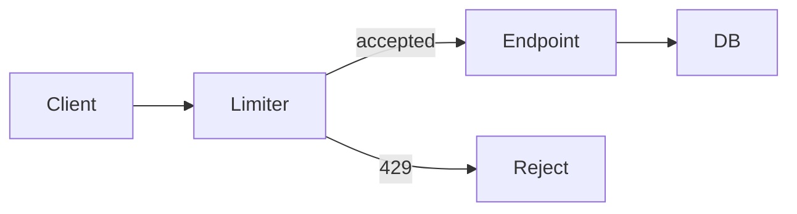
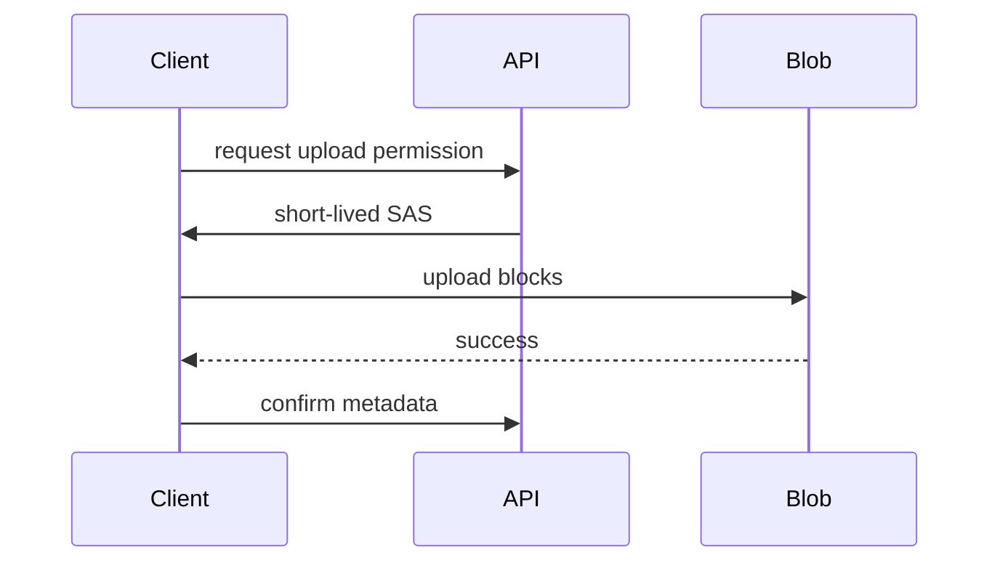
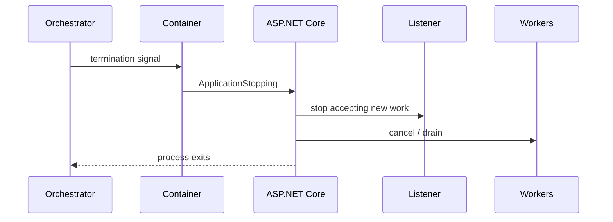

# Daily Knowledge Sharing — 2026-09-26

## Today’s Topics

1. C# `ArrayPool<T>`: giảm allocation cho buffer nhưng quản lý ownership và data leakage
2. ASP.NET Core rate limiting: bảo vệ capacity thay vì chỉ “chặn request”
3. EF Core compiled queries: khi query compilation thực sự là bottleneck
4. SQL Server isolation levels: consistency, blocking và snapshot semantics
5. Cosmos DB partition key: data locality, hot partition và RU economics
6. Azure Blob Storage large-file upload: streaming, SAS và failure recovery
7. Modular Monolith: boundary mạnh mà chưa trả operational cost của Microservices
8. OpenTelemetry metrics + traces: điều tra p99 latency bằng evidence
9. Playwright E2E: bảo vệ critical user journey mà không tạo flaky test suite
10. Docker container lifecycle: graceful shutdown của ASP.NET Core khi deploy

---

# 1. C# `ArrayPool<T>`: giảm allocation cho buffer nhưng quản lý ownership và data leakage

## 1. What is it?

Mental model: `ArrayPool<T>` cho application mượn một array đã tồn tại, dùng tạm rồi trả lại pool. Nó không làm dữ liệu “nhanh hơn” một cách thần kỳ; giá trị chính là giảm allocation rate và GC pressure ở hot path có buffer ngắn hạn.

Pool sở hữu storage, caller chỉ sở hữu quyền sử dụng tạm thời. Array nhận được có thể lớn hơn kích thước yêu cầu và có thể chứa dữ liệu từ lần sử dụng trước.

## 2. Why does it exist?

Một API xử lý hàng nghìn payload/giây mà liên tục `new byte[64 * 1024]` tạo lượng allocation lớn. Dù object sống ngắn, GC vẫn phải thu gom. Reuse buffer chuyển chi phí từ allocation liên tục sang lifecycle management.

## 3. How does it work?

```text
Rent(size) -> pool bucket -> byte[]
                         |
                      caller
                         |
Return(array) <- reuse <-+
```

Pool chia array theo bucket kích thước. `Rent` không đảm bảo exact length; `Return` đưa array về pool để request khác tái sử dụng.

## 4. Practical implementation

```csharp
using System.Buffers;

static async Task<int> ReadChunkAsync(Stream stream, CancellationToken ct)
{
    byte[] buffer = ArrayPool<byte>.Shared.Rent(64 * 1024);
    try
    {
        return await stream.ReadAsync(buffer.AsMemory(0, 64 * 1024), ct);
    }
    finally
    {
        ArrayPool<byte>.Shared.Return(buffer, clearArray: true);
    }
}
```

`finally` là boundary quan trọng: exception hoặc cancellation không được làm mất buffer.

## 5. Real production scenario

File-processing API nhận ảnh lớn. Trước tối ưu, mỗi chunk tạo array mới và allocation rate tăng mạnh khi traffic burst. Pooling buffer làm Gen 0 collections giảm, nhưng chỉ đáng dùng sau khi profiler xác nhận allocation là bottleneck.

## 6. Failure scenario & troubleshooting

**Symptom** → memory tăng hoặc dữ liệu nhạy cảm xuất hiện sai request.  
**Evidence** → profiler cho thấy buffer không được return; dump cho thấy pooled arrays bị giữ reference.  
**Hypothesis** → code return thiếu `finally` hoặc giữ array sau khi return.  
**Diagnosis** → trace ownership từ `Rent` tới mọi exit path.  
**Fix** → `try/finally`, không escape reference, clear dữ liệu nhạy cảm.  
**Verification** → allocation rate, GC count và correctness test ổn định dưới load.

## 7. Common mistakes

Giả định array có đúng requested length; return quá sớm trong khi async consumer còn đọc; quên return khi exception; pool mọi allocation dù không đo GC pressure; không clear secrets.

## 8. Alternatives

Array thông thường đơn giản hơn cho buffer nhỏ/tần suất thấp. `MemoryPool<T>` hữu ích khi cần owner abstraction. `Span<T>` giảm copy nhưng không thay thế ownership/lifetime của pooled storage.

## 9. Trade-offs

### Advantages

Giảm allocation và GC pressure; phù hợp hot path có buffer lặp lại.

### Costs / Risks

Ownership phức tạp hơn, nguy cơ use-after-return logic, data leakage và retained buffer. Optimization này làm code khó reasoning hơn.

## 10. Junior → Middle → Senior → Technical Lead

### Junior

Hiểu `Rent → use → Return` và pool không chuyển ownership vĩnh viễn.

### Middle

Viết lifecycle an toàn với `try/finally`, giới hạn slice và cancellation.

### Senior

Dùng allocation profiling để chứng minh lợi ích; nhận diện security/lifetime failure.

### Technical Lead / Architect

Quyết định hot path nào đủ giá trị để chấp nhận complexity; không biến pooling thành convention toàn codebase.

## 11. Key takeaway

- Pooling giải quyết allocation pressure, không phải mọi performance problem.
- Ownership và return path quan trọng hơn cú pháp.
- Chỉ tối ưu sau khi đo.

---

# 2. ASP.NET Core rate limiting: bảo vệ capacity thay vì chỉ “chặn request”

## 1. What is it?

Rate limiting đặt admission-control boundary trước phần tài nguyên đắt tiền. Mental model đúng là bảo vệ capacity hữu hạn của API, database hoặc downstream dependency, không chỉ chống bot.

## 2. Why does it exist?

Nếu API nhận 20.000 request/s nhưng database chỉ chịu 3.000 operations/s, nhận toàn bộ traffic làm queue tăng, timeout lan truyền và cuối cùng request hợp lệ cũng thất bại.

## 3. How does it work?



Fixed window đơn giản nhưng burst ở biên cửa sổ. Sliding window mượt hơn. Token bucket cho phép burst có kiểm soát. Concurrency limiter trực tiếp giới hạn số request đang thực thi.

## 4. Practical implementation

```csharp
builder.Services.AddRateLimiter(options =>
{
    options.AddConcurrencyLimiter("expensive", o =>
    {
        o.PermitLimit = 50;
        o.QueueLimit = 20;
    });
    options.RejectionStatusCode = StatusCodes.Status429TooManyRequests;
});

app.UseRateLimiter();
app.MapPost("/reports", GenerateReport)
   .RequireRateLimiting("expensive");
```

## 5. Real production scenario

Report endpoint chạy query nặng. Thay vì để 500 report đồng thời làm connection pool cạn, limiter giữ concurrency trong capacity đã load-test.

## 6. Failure scenario & troubleshooting

**Symptom** → 429 tăng đột biến sau deployment.  
**Evidence** → limiter rejection tăng nhưng CPU/DB còn thấp.  
**Hypothesis** → limit quá thấp hoặc partition key sai.  
**Diagnosis** → so sánh accepted concurrency, dependency latency và queue time.  
**Fix** → tune từ capacity evidence; phân vùng theo tenant/API key nếu phù hợp.  
**Verification** → p95 ổn định và rejection chỉ xuất hiện khi capacity thực sự bão hòa.

## 7. Common mistakes

Một global limit cho mọi endpoint; retry 429 ngay lập tức; đặt limiter sau expensive work; coi rate limiting là authorization; không trả retry semantics phù hợp.

## 8. Alternatives

API Gateway/Azure Front Door có thể limit ở edge. Queue phù hợp khi work có thể asynchronous. Autoscaling tăng capacity nhưng không thay admission control khi dependency có hard limit.

## 9. Trade-offs

### Advantages

Failure có kiểm soát, bảo vệ dependency và tail latency.

### Costs / Risks

Có thể từ chối traffic hợp lệ; distributed rate limiting thêm state và operational complexity.

## 10. Junior → Middle → Senior → Technical Lead

### Junior

Phân biệt 429 với 401/403 và hiểu capacity boundary.

### Middle

Cấu hình limiter, test burst và client retry.

### Senior

Chọn algorithm dựa trên workload, fairness và downstream saturation.

### Technical Lead / Architect

Quyết định limiter nằm ở edge, application hay cả hai; xác định capacity budget và tenant isolation.

## 11. Key takeaway

- Rate limiting là reliability mechanism.
- Limit phải dựa trên measured capacity.
- Retry không kiểm soát có thể phá lợi ích của limiter.

---

# 3. EF Core compiled queries: khi query compilation thực sự là bottleneck

## 1. What is it?

EF Core compiled query cache bỏ bớt công việc xử lý expression tree lặp lại cho một query shape ổn định. Nó không làm SQL execution nhanh hơn và không sửa query plan xấu.

## 2. Why does it exist?

Ở endpoint cực nóng với query nhỏ, database latency thấp, overhead phía EF có thể trở thành phần đáng kể. Khi đó explicit compiled query có thể giảm CPU application.

## 3. How does it work?

```text
LINQ expression -> translate/compile -> SQL command -> DB
       ^                 |
       +--- cached shape-+
```

Parameter value thay đổi nhưng query shape cần ổn định để reuse hiệu quả.

## 4. Practical implementation

```csharp
private static readonly Func<AppDbContext, Guid, Task<User?>>
    GetUser = EF.CompileAsyncQuery(
        (AppDbContext db, Guid id) =>
            db.Users.AsNoTracking().FirstOrDefault(x => x.Id == id));

var user = await GetUser(db, userId);
```

## 5. Real production scenario

Lookup endpoint đạt hàng chục nghìn RPS, SQL query đã index tốt và DB trả dưới vài millisecond. Profiling cho thấy expression/query pipeline chiếm CPU đáng kể; compiled query mới có cơ sở.

## 6. Failure scenario & troubleshooting

**Symptom** → team thêm compiled query nhưng p95 gần như không đổi.  
**Evidence** → trace cho thấy 95% latency vẫn nằm ở SQL I/O.  
**Diagnosis** → tối ưu sai layer.  
**Fix** → đọc execution plan, round trip và data volume trước.  
**Verification** → benchmark riêng application CPU và end-to-end latency.

## 7. Common mistakes

Compile mọi query; nhầm query compilation với database plan compilation; tạo dynamic shape khiến cache lợi ích thấp; hy sinh readability trước khi benchmark.

## 8. Alternatives

Query cache mặc định của EF Core thường đủ. Projection, index/access-pattern correction hoặc raw SQL có thể tạo lợi ích lớn hơn tùy bottleneck.

## 9. Trade-offs

### Advantages

Giảm một phần CPU overhead trên hot path ổn định.

### Costs / Risks

Code ít linh hoạt, optimization nhỏ và dễ che khuất bottleneck thật.

## 10. Junior → Middle → Senior → Technical Lead

### Junior

Hiểu LINQ cuối cùng phải được translate và execute ở DB.

### Middle

Đo query timing, projection và tracking trước.

### Senior

Benchmark compilation overhead riêng với DB execution.

### Technical Lead / Architect

Cho phép optimization này ở measured hot path thay vì thành repository convention.

## 11. Key takeaway

- Compiled query không sửa SQL chậm.
- Profile trước khi áp dụng.
- Query shape ổn định mới có giá trị.

---

# 4. SQL Server isolation levels: consistency, blocking và snapshot semantics

## 1. What is it?

Isolation level định nghĩa transaction được phép quan sát thay đổi concurrent tới mức nào. Đây là policy cân bằng consistency với concurrency, không phải nút “performance mode”.

## 2. Why does it exist?

Hai request cùng đọc/ghi dữ liệu có thể tạo dirty read, non-repeatable read, phantom hoặc lost-update logic. Serialize mọi thứ bảo toàn mạnh nhưng có thể gây blocking lớn.

## 3. How does it work?

`READ COMMITTED` thường ngăn dirty read bằng locking semantics; `SNAPSHOT` đọc version đã commit theo transaction snapshot; `SERIALIZABLE` cung cấp isolation mạnh hơn bằng cách hạn chế concurrent changes trong phạm vi đọc.

## 4. Practical implementation

```csharp
await using var tx = await db.Database.BeginTransactionAsync(
    System.Data.IsolationLevel.Serializable, ct);

var stock = await db.Inventory.SingleAsync(x => x.Sku == sku, ct);
if (stock.Quantity < requested) throw new InvalidOperationException();

stock.Quantity -= requested;
await db.SaveChangesAsync(ct);
await tx.CommitAsync(ct);
```

Không nên copy `Serializable` vào mọi flow; đây chỉ là ví dụ invariant cần reasoning rõ.

## 5. Real production scenario

Hai checkout đồng thời mua SKU cuối cùng. Transaction boundary và isolation/concurrency strategy phải bảo vệ invariant “inventory không âm”.

## 6. Failure scenario & troubleshooting

**Symptom** → latency spike, deadlock tăng.  
**Evidence** → blocked-session graph cho thấy range/key locks giữ lâu.  
**Hypothesis** → isolation mạnh hơn nhu cầu cộng với transaction dài.  
**Diagnosis** → xem lock duration, execution plan và code nằm trong transaction.  
**Fix** → rút ngắn transaction, index đúng access path hoặc chuyển optimistic strategy nếu business cho phép.  
**Verification** → concurrency test vừa bảo toàn invariant vừa giảm blocking.

## 7. Common mistakes

Dùng `NOLOCK` như performance fix; transaction chứa external HTTP call; chọn isolation mà không hiểu anomaly; tăng timeout thay vì điều tra blocking.

## 8. Alternatives

Optimistic concurrency token phù hợp conflict hiếm. Atomic SQL update có thể đơn giản hơn transaction nhiều bước. Snapshot-based isolation giảm reader/writer blocking nhưng trả giá version storage.

## 9. Trade-offs

### Advantages

Isolation đúng bảo vệ correctness dưới concurrency.

### Costs / Risks

Isolation mạnh có thể giảm throughput; snapshot tăng version-store cost; isolation yếu chuyển complexity sang application.

## 10. Junior → Middle → Senior → Technical Lead

### Junior

Hiểu transaction không đồng nghĩa mọi concurrency problem tự biến mất.

### Middle

Reproduce concurrent writes và đọc lock evidence.

### Senior

Chọn isolation theo invariant và contention profile.

### Technical Lead / Architect

Định nghĩa consistency requirement theo use case, không theo preference kỹ thuật.

## 11. Key takeaway

- Isolation là business-correctness decision có operational cost.
- Transaction càng dài, contention risk càng lớn.
- Đo blocking thay vì đoán.

---

# 5. Cosmos DB partition key: data locality, hot partition và RU economics

## 1. What is it?

Partition key quyết định cách logical data được phân phối lên physical partitions. Mental model: nó đồng thời ảnh hưởng locality, scalability, query fan-out và giới hạn throughput.

## 2. Why does it exist?

Một node không thể scale storage/throughput vô hạn. Distributed database phải có quy tắc phân phối dữ liệu; key xấu khiến một vùng nóng dù tổng capacity còn dư.

## 3. How does it work?

```text
tenantId=A -> hash -> partition P1
tenantId=B -> hash -> partition P3
tenantId=C -> hash -> partition P2
```

Point read biết id + partition key có thể định tuyến trực tiếp; query thiếu partition key có thể fan out.

## 4. Practical implementation

```csharp
var response = await container.ReadItemAsync<Order>(
    id: orderId,
    partitionKey: new PartitionKey(tenantId),
    cancellationToken: ct);
```

API contract nên mang đủ routing information nếu access pattern cần point read.

## 5. Real production scenario

Multi-tenant SaaS partition theo `tenantId`. Hầu hết tenant nhỏ, một enterprise tenant tạo 40% traffic và trở thành hot logical partition.

## 6. Failure scenario & troubleshooting

**Symptom** → 429 throttling dù account RU tổng thể chưa dùng hết.  
**Evidence** → metrics theo partition key range cho thấy traffic skew.  
**Hypothesis** → hot partition.  
**Diagnosis** → map request distribution và RU/query.  
**Fix** → redesign key/hierarchical partition strategy hoặc workload distribution; retry chỉ là mitigation.  
**Verification** → RU phân bố đều hơn và throttling giảm.

## 7. Common mistakes

Chọn key có cardinality thấp; partition theo ngày mà mọi write đổ vào “hôm nay”; query cross-partition không đo RU; coi autoscale là cách chữa hot key.

## 8. Alternatives

SQL phù hợp transaction/relational query mạnh. MongoDB cũng yêu cầu shard-key reasoning. Nếu workload nhỏ, database đơn giản hơn có thể tốt hơn distributed store.

## 9. Trade-offs

### Advantages

Scale-out và locality tốt khi key khớp access pattern.

### Costs / Risks

Key khó đổi, query fan-out tốn RU, skew tạo hotspot.

## 10. Junior → Middle → Senior → Technical Lead

### Junior

Hiểu partition key là routing decision.

### Middle

Thiết kế query có key và theo dõi RU.

### Senior

Phân tích cardinality, skew, growth và hot tenants.

### Technical Lead / Architect

Chọn data model từ access patterns dài hạn và migration cost.

## 11. Key takeaway

- Partition key là architectural decision.
- Tổng RU không phản ánh hotspot.
- Thiết kế từ access pattern, không từ tên cột thuận mắt.

---

# 6. Azure Blob Storage large-file upload: streaming, SAS và failure recovery

## 1. What is it?

Blob Storage là object storage cho dữ liệu lớn như ảnh, video, export và document. Với upload lớn, mục tiêu là tránh đẩy toàn bộ file qua memory/application khi không cần.

## 2. Why does it exist?

Lưu file lớn trong relational DB hoặc buffer toàn bộ trong web process làm memory pressure, timeout và scale cost tăng. Object storage tách binary lifecycle khỏi transactional database.

## 3. How does it work?



SAS giới hạn permission, resource và lifetime; application vẫn phải authorize ai được nhận SAS.

## 4. Practical implementation

```csharp
var blob = container.GetBlobClient(blobName);
await blob.UploadAsync(
    stream,
    new BlobUploadOptions
    {
        HttpHeaders = new BlobHttpHeaders { ContentType = contentType }
    },
    ct);
```

Với browser upload lớn, direct-to-Blob bằng scoped SAS thường tránh application làm data proxy.

## 5. Real production scenario

CMS cho editor upload video 2 GB. API xác thực editor, cấp write-only SAS ngắn hạn cho một blob name server-generated; browser upload trực tiếp.

## 6. Failure scenario & troubleshooting

**Symptom** → upload dở dang hoặc metadata DB tồn tại nhưng blob thiếu.  
**Evidence** → request log cho thấy client disconnect giữa flow.  
**Diagnosis** → workflow thiếu state machine/cleanup.  
**Fix** → trạng thái Pending/Ready, block upload resumable, cleanup orphan định kỳ.  
**Verification** → chaos test disconnect và retry không tạo duplicate asset.

## 7. Common mistakes

SAS lifetime quá dài; container-level write rộng; tin filename/content-type từ client; proxy file qua API không cần thiết; thiếu malware/content validation.

## 8. Alternatives

API proxy hợp lý khi server phải transform/scan inline. Managed Identity phù hợp server-to-Blob. Database BLOB chỉ nên dùng khi transaction semantics thực sự quan trọng và scale chấp nhận được.

## 9. Trade-offs

### Advantages

Scale storage tốt, giảm memory/bandwidth của web tier.

### Costs / Risks

Workflow trở thành multi-step eventual state; SAS/security và orphan cleanup cần ownership.

## 10. Junior → Middle → Senior → Technical Lead

### Junior

Hiểu metadata và binary có lifecycle khác nhau.

### Middle

Implement streaming, SAS scope và validation.

### Senior

Thiết kế retry, resumability, orphan cleanup và observability.

### Technical Lead / Architect

Quyết định data path nào đi trực tiếp Blob, boundary security và consistency model.

## 11. Key takeaway

- Đừng buffer file lớn nếu có thể stream/direct-upload.
- SAS là capability token, phải scope chặt.
- Upload workflow cần thiết kế failure state.

---

# 7. Modular Monolith: boundary mạnh mà chưa trả operational cost của Microservices

## 1. What is it?

Modular Monolith là một deployable application nhưng bên trong chia thành module có ownership và dependency boundary rõ. Nó không phải “monolith với nhiều folder”.

## 2. Why does it exist?

Microservices giải quyết independent deployment/scale/ownership nhưng thêm network failure, observability, messaging và data consistency complexity. Nhiều hệ thống cần domain boundaries trước khi cần distributed deployment.

## 3. How does it work?

```text
Host
 ├─ Orders     -> Orders schema/data ownership
 ├─ Catalog    -> Catalog ownership
 └─ Identity   -> Identity ownership

Orders --contract/event--> Catalog
(no direct internal-table reach-through)
```

Module boundary kiểm soát dependency và data access dù cùng process.

## 4. Practical implementation

```csharp
public static class OrdersModule
{
    public static IServiceCollection AddOrders(
        this IServiceCollection services,
        IConfiguration config)
    {
        services.AddDbContext<OrdersDbContext>(o =>
            o.UseSqlServer(config.GetConnectionString("Orders")));
        services.AddScoped<IOrderService, OrderService>();
        return services;
    }
}
```

Điểm chính không phải extension method mà là module không phụ thuộc implementation internals của module khác.

## 5. Real production scenario

E-commerce có Catalog, Orders, Reviews. Team cần tách domain ownership nhưng traffic chưa yêu cầu independent scaling. Modular Monolith giữ deployment đơn giản và tạo seam cho extraction sau này.

## 6. Failure scenario & troubleshooting

**Symptom** → “module” thay đổi một bảng chung làm ba feature hỏng.  
**Evidence** → dependency graph và SQL access cho thấy cross-module reach-through.  
**Diagnosis** → boundary chỉ tồn tại ở namespace.  
**Fix** → ownership rõ, contract/API nội bộ và architecture tests.  
**Verification** → module tests + dependency rules chặn reference trái phép.

## 7. Common mistakes

Shared `Common` chứa domain logic; một DbContext toàn hệ thống; circular module dependency; dùng MediatR nhưng không có ownership; tách module theo technical layer.

## 8. Alternatives

Layered Monolith đơn giản hơn cho domain nhỏ. Microservices hợp lý khi independent deployment/scale/team autonomy tạo giá trị thực.

## 9. Trade-offs

### Advantages

Boundary tốt với deployment, debugging và transaction đơn giản hơn distributed system.

### Costs / Risks

Không independent scale/deploy; discipline boundary phải được enforce bằng code/test/review.

## 10. Junior → Middle → Senior → Technical Lead

### Junior

Hiểu module là business boundary.

### Middle

Giữ dependency và data access trong boundary.

### Senior

Thiết kế contracts, transaction ownership và migration seam.

### Technical Lead / Architect

Quyết định khi nào monolith vẫn tối ưu và khi nào evidence đủ để extract service.

## 11. Key takeaway

- Boundary trước, distribution sau.
- Một process không có nghĩa một domain.
- Microservices chỉ đáng giá khi lợi ích vượt operational cost.

---

# 8. OpenTelemetry metrics + traces: điều tra p99 latency bằng evidence

## 1. What is it?

Metrics trả lời “hệ thống đang thay đổi thế nào”; traces trả lời “request cụ thể đã đi đâu và mất thời gian ở đâu”. OpenTelemetry chuẩn hóa instrumentation/export thay vì khóa application vào một backend duy nhất.

## 2. Why does it exist?

Average latency 120 ms có thể che 1% request mất 4 giây. Logs riêng lẻ cũng khó nối API → SQL → Redis → external API.

## 3. How does it work?

```text
request metric: p50/p95/p99
          |
          +-> traceId
                API span
                 ├─ SQL span
                 ├─ Redis span
                 └─ HTTP span
```

Correlation cho phép từ symptom ở percentile đi xuống dependency span.

## 4. Practical implementation

```csharp
builder.Services.AddOpenTelemetry()
    .WithTracing(t => t
        .AddAspNetCoreInstrumentation()
        .AddHttpClientInstrumentation()
        .AddEntityFrameworkCoreInstrumentation())
    .WithMetrics(m => m
        .AddAspNetCoreInstrumentation()
        .AddHttpClientInstrumentation());
```

Production cần sampling/export policy phù hợp volume và cost.

## 5. Real production scenario

Checkout p99 tăng từ 900 ms lên 3.5 s nhưng p50 không đổi. Trace của slow cohort cho thấy một review API external thỉnh thoảng mất 3 s.

## 6. Failure scenario & troubleshooting

**Symptom** → telemetry bill tăng mạnh hoặc trace bị đứt.  
**Evidence** → span volume/cardinality tăng sau thêm tag `userId`.  
**Diagnosis** → high-cardinality dimension và context propagation thiếu chuẩn.  
**Fix** → bỏ PII/high-cardinality metric labels, sampling traces, propagate W3C context.  
**Verification** → trace continuity giữ được trong khi ingestion volume về budget.

## 7. Common mistakes

Log mọi thứ; metric label theo user/order ID; sampling trước khi hiểu incident needs; không instrument dependency; coi dashboard là observability strategy.

## 8. Alternatives

Application Insights có auto-instrumentation mạnh trên Azure. Prometheus/Grafana mạnh cho metrics. Elasticsearch/Kibana mạnh cho logs. OpenTelemetry là instrumentation layer, không nhất thiết thay backend.

## 9. Trade-offs

### Advantages

Vendor-neutral telemetry, correlation xuyên dependency.

### Costs / Risks

Storage/ingestion cost, sampling complexity và privacy/cardinality risk.

## 10. Junior → Middle → Senior → Technical Lead

### Junior

Phân biệt logs, metrics và traces.

### Middle

Theo traceId điều tra request chậm.

### Senior

Thiết kế sampling, semantic attributes và SLI.

### Technical Lead / Architect

Định nghĩa telemetry budget, ownership và evidence cần cho incident response.

## 11. Key takeaway

- Percentile cho thấy tail latency mà average che giấu.
- Trace localize bottleneck; metric cho thấy quy mô.
- Telemetry cũng có cost và data-governance boundary.

---

# 9. Playwright E2E: bảo vệ critical user journey mà không tạo flaky test suite

## 1. What is it?

Playwright E2E điều khiển browser thật để kiểm chứng hệ thống qua UI, network và backend như user. Nó bảo vệ integration seams mà unit test không nhìn thấy.

## 2. Why does it exist?

Frontend component có thể pass unit test, API pass integration test nhưng login redirect, cookie, routing hoặc deployment config vẫn làm user flow hỏng.

## 3. How does it work?

Browser automation thao tác qua user-visible locator, chờ trạng thái web thay vì sleep cố định, rồi assert outcome cuối cùng.

## 4. Practical implementation

```typescript
test("user can create an order", async ({ page }) => {
  await page.goto("/orders");
  await page.getByRole("button", { name: "New order" }).click();
  await page.getByLabel("Customer").fill("Contoso");
  await page.getByRole("button", { name: "Save" }).click();

  await expect(page.getByText("Order created")).toBeVisible();
});
```

## 5. Real production scenario

Release thay đổi reverse-proxy base path. API tests vẫn xanh nhưng SPA redirect sau login thành 404. Một smoke E2E trên deployed environment bắt lỗi trước promotion.

## 6. Failure scenario & troubleshooting

**Symptom** → test đỏ ngẫu nhiên CI nhưng local pass.  
**Evidence** → screenshot/trace cho thấy element chưa ổn định khi test click.  
**Hypothesis** → timing/data coupling.  
**Diagnosis** → xem Playwright trace, network và test data.  
**Fix** → semantic locator, deterministic fixture, chờ observable state; không thêm arbitrary sleep.  
**Verification** → chạy lặp nhiều lần và parallel CI.

## 7. Common mistakes

Test mọi edge case bằng E2E; selector dựa CSS implementation; shared mutable test data; `waitForTimeout`; retry vô hạn để che flaky behavior.

## 8. Alternatives

Unit test nhanh cho pure logic; API integration test tốt cho backend contract; contract test bảo vệ service boundary. E2E nên tập trung critical journey.

## 9. Trade-offs

### Advantages

Confidence cao ở user-visible integration.

### Costs / Risks

Chậm, môi trường phức tạp, debugging khó và dễ flaky nếu thiết kế kém.

## 10. Junior → Middle → Senior → Technical Lead

### Junior

Viết test theo hành vi user thay vì DOM implementation.

### Middle

Quản lý fixture, auth state và trace.

### Senior

Phân bổ risk giữa unit/integration/E2E và triage flaky test.

### Technical Lead / Architect

Xác định critical journeys bắt buộc block release và budget thời gian CI.

## 11. Key takeaway

- E2E bảo vệ seam, không thay toàn bộ test pyramid.
- Flakiness là engineering defect.
- Trace và deterministic data quan trọng hơn retry.

---

# 10. Docker container lifecycle: graceful shutdown của ASP.NET Core khi deploy

## 1. What is it?

Container là process isolation/package boundary. Khi orchestrator thay pod/container, process nhận termination signal và chỉ có một khoảng thời gian để ngừng nhận work, hoàn tất việc đang làm và thoát.

## 2. Why does it exist?

Rolling deployment không nên cắt ngang HTTP request, queue message hoặc database transaction. Graceful shutdown biến process termination từ “kill bất ngờ” thành lifecycle có thể quản lý.

## 3. How does it work?



Nếu grace period hết, orchestrator có thể force kill.

## 4. Practical implementation

```csharp
public sealed class QueueWorker : BackgroundService
{
    protected override async Task ExecuteAsync(CancellationToken stoppingToken)
    {
        while (!stoppingToken.IsCancellationRequested)
        {
            var message = await ReceiveAsync(stoppingToken);
            await ProcessAsync(message, stoppingToken);
        }
    }
}
```

Downstream calls cũng phải nhận `stoppingToken`; nếu token dừng ở loop thì shutdown vẫn có thể treo trong dependency.

## 5. Real production scenario

ASP.NET Core API chạy container và có background consumer. Rolling deployment tạo instance mới rồi terminate instance cũ. Readiness cần chuyển false trước khi process bị kill để traffic ngừng đổ vào.

## 6. Failure scenario & troubleshooting

**Symptom** → mỗi deployment tạo spike 499/5xx hoặc duplicate message.  
**Evidence** → log cho thấy process terminated khi request/message còn active.  
**Hypothesis** → grace period quá ngắn hoặc code bỏ qua cancellation.  
**Diagnosis** → correlate deployment timestamp, shutdown logs và in-flight telemetry.  
**Fix** → propagate cancellation, drain work, điều chỉnh termination grace và readiness behavior.  
**Verification** → rolling deployment dưới load không tăng error/duplicate side effect.

## 7. Common mistakes

Không truyền `CancellationToken`; bắt `OperationCanceledException` rồi tiếp tục loop; health probe vẫn ready trong shutdown; shutdown chạy cleanup lâu hơn grace period; message side effect không idempotent.

## 8. Alternatives

Long-running durable work có thể chuyển sang queue + separate Worker Service/Azure Functions. IIS/App Service cũng có lifecycle riêng; nguyên tắc drain/cancellation vẫn áp dụng.

## 9. Trade-offs

### Advantages

Deployment an toàn hơn, giảm request loss và partial work.

### Costs / Risks

Shutdown logic, idempotency và orchestrator timing phải đồng bộ; grace period dài làm rollout chậm.

## 10. Junior → Middle → Senior → Technical Lead

### Junior

Hiểu container không phải VM; process có lifecycle và signal.

### Middle

Propagate cancellation và test graceful shutdown.

### Senior

Reason về in-flight request, queue settlement, idempotency và probe behavior.

### Technical Lead / Architect

Thiết kế workload ownership: cái gì phải drain, cái gì có thể retry, grace budget bao nhiêu và deployment strategy nào phù hợp.

## 11. Key takeaway

- Graceful shutdown là correctness concern, không chỉ deployment polish.
- Cancellation phải đi xuyên toàn call chain.
- Deployment dưới load phải được test như một failure scenario.
