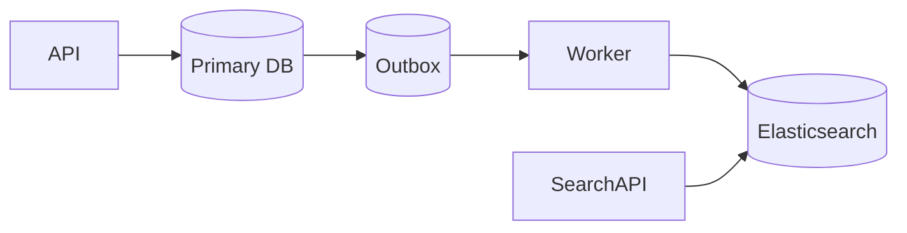
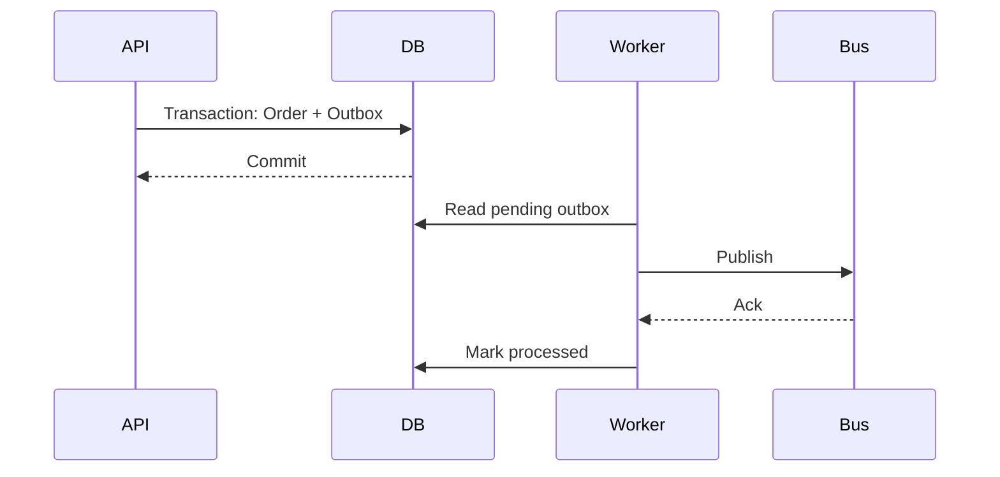

# Daily Knowledge Sharing — 2026-09-26

## Today’s Topics

1. C# `ValueTask`: tối ưu async hot path mà không biến API thành bẫy correctness
2. REST API idempotency key: chống double side effect khi client retry
3. EF Core optimistic concurrency: phát hiện lost update bằng concurrency token
4. SQL keyset pagination: ổn định latency khi dữ liệu lớn và thay đổi liên tục
5. Elasticsearch synchronization: giữ search index nhất quán đủ dùng với primary database
6. Azure Managed Identity + Key Vault: bỏ secrets khỏi application configuration
7. Outbox Pattern: nối database transaction với messaging mà không cần distributed transaction
8. IIS Application Pool recycling: hiểu process lifetime để tránh “production tự nhiên restart”
9. React rendering và stale closure: khi UI dùng state cũ dù API trả đúng
10. AI Structured Outputs: giữ phần quyết định deterministic quanh LLM

---

# 1. C# `ValueTask`: tối ưu async hot path mà không biến API thành bẫy correctness

## 1. What is it?

Mental model: `Task<T>` là một object đại diện cho kết quả bất đồng bộ; `ValueTask<T>` là một value type có thể đại diện cho kết quả đã có sẵn hoặc bọc một operation bất đồng bộ. Nó hữu ích khi một API rất thường xuyên hoàn thành synchronously và allocation của `Task<T>` đã được đo là đáng kể.

`ValueTask<T>` không phải “Task nhanh hơn”. Nó đổi allocation tiềm năng lấy API semantics phức tạp hơn.

## 2. Why does it exist?

Một hot path như parser, pool hoặc cache lookup có thể trả kết quả ngay trong phần lớn request. Nếu mỗi lần vẫn tạo một `Task<T>`, throughput cao có thể tạo allocation đáng kể. `ValueTask<T>` cho phép fast path trả value trực tiếp.

Nếu chưa có evidence về allocation pressure, `Task<T>` thường đơn giản và an toàn hơn.

## 3. How does it work?

Caller vẫn có thể `await` bình thường. Bên trong, `ValueTask<T>` có thể chứa trực tiếp `T`, chứa `Task<T>`, hoặc dùng `IValueTaskSource<T>` cho pooling nâng cao.

Điểm quan trọng: một `ValueTask` không nên mặc định được await nhiều lần, lưu lâu, hoặc dùng như một `Task` có identity ổn định.

## 4. Practical implementation

```csharp
public sealed class ProductCache
{
    private readonly ConcurrentDictionary<int, Product> _cache = new();
    private readonly ProductRepository _repository;

    public ProductCache(ProductRepository repository) => _repository = repository;

    public ValueTask<Product?> GetAsync(int id, CancellationToken ct)
    {
        if (_cache.TryGetValue(id, out var cached))
            return ValueTask.FromResult<Product?>(cached);

        return LoadAsync(id, ct);
    }

    private async ValueTask<Product?> LoadAsync(int id, CancellationToken ct)
    {
        var product = await _repository.GetAsync(id, ct);
        if (product is not null)
            _cache[id] = product;
        return product;
    }
}
```

Chỉ cân nhắc thiết kế này sau profiling; nếu cache hit thấp, lợi ích giảm mạnh.

## 5. Real production scenario

Một pricing service xử lý hàng chục nghìn lookup/giây và phần lớn lookup hit local cache. Profiling cho thấy allocation rate của completed tasks đáng kể. Chuyển đúng hot API sang `ValueTask<T>` có thể giảm GC pressure mà không thay đổi business flow.

## 6. Failure scenario & troubleshooting

**Symptom** → behavior khó đoán khi consumer gọi `.AsTask()`, await nhiều lần hoặc lưu `ValueTask`.

**Evidence** → profiler cho thấy complexity tăng nhưng allocation gần như không giảm.

**Diagnosis** → operation phần lớn thực sự asynchronous hoặc optimization đặt sai hot path.

**Fix** → quay về `Task<T>` nếu lợi ích không được chứng minh; benchmark lại.

**Verification** → so sánh allocation/op, Gen 0 collections, throughput và p95 trước/sau.

## 7. Common mistakes

Dùng `ValueTask` cho mọi async method; tối ưu trước khi profile; expose nó qua public API mà không hiểu consumption semantics; gọi `.Result`; bỏ `CancellationToken`.

## 8. Alternatives

`Task<T>` là default tốt nhất. Caching completed `Task`, giảm temporary allocation hoặc thay đổi data flow đôi khi đem lại lợi ích lớn hơn.

## 9. Trade-offs

### Advantages

Giảm allocation khi synchronous completion rất thường xuyên; hữu ích cho library/hot path.

### Costs / Risks

API phức tạp hơn, dễ misuse, struct lớn hơn reference, lợi ích có thể bằng 0 nếu operation thường xuyên asynchronous.

## 10. Junior → Middle → Senior → Technical Lead

### Junior

Hiểu `Task` là default và async không đồng nghĩa tạo thread mới.

### Middle

Biết implement và propagate cancellation đúng trước khi nghĩ đến micro-optimization.

### Senior

Dùng benchmark/profiler để chứng minh allocation bottleneck và hiểu consumption rules của `ValueTask`.

### Technical Lead / Architect

Quyết định có đáng đưa complexity này vào public contract hay chỉ giữ trong internal hot path; ưu tiên maintainability nếu scale chưa yêu cầu.

## 11. Key takeaway

- `Task<T>` là default; `ValueTask<T>` là optimization có điều kiện.
- Chỉ tối ưu khi synchronous completion cao và profiler chứng minh allocation đáng kể.
- Correctness và API simplicity quan trọng hơn micro-allocation.

---

# 2. REST API idempotency key: chống double side effect khi client retry

## 1. What is it?

Idempotency key là client-generated identifier gắn với một logical operation. Server ghi nhớ kết quả xử lý key đó để request retry không tạo thêm side effect.

Nó đặc biệt quan trọng với `POST` tạo payment, order, booking hoặc command có side effect.

## 2. Why does it exist?

Distributed system không thể luôn phân biệt “request chưa chạy” với “request đã chạy nhưng response bị mất”. Client timeout rồi retry là hành vi hợp lý, nhưng retry mù có thể tạo hai order hoặc charge hai lần.

## 3. How does it work?

```text
Client -- POST + Idempotency-Key --> API
API --> Idempotency Store: reserve key
API --> Business transaction
API --> Store result for key
API --> Client: response

Retry same key --> return stored result
```

Key cần scope, TTL và request fingerprint để tránh cùng key nhưng payload khác nhau.

## 4. Practical implementation

```csharp
app.MapPost("/orders", async (
    HttpRequest request,
    CreateOrder command,
    AppDbContext db,
    CancellationToken ct) =>
{
    var key = request.Headers["Idempotency-Key"].ToString();
    if (string.IsNullOrWhiteSpace(key))
        return Results.BadRequest(new { error = "Idempotency-Key is required" });

    var existing = await db.IdempotencyRecords
        .SingleOrDefaultAsync(x => x.Key == key, ct);

    if (existing is not null)
        return Results.Content(existing.ResponseJson, "application/json",
            statusCode: existing.StatusCode);

    // Production code should reserve key atomically and enforce UNIQUE(Key).
    var order = new Order(command.CustomerId);
    db.Orders.Add(order);
    db.IdempotencyRecords.Add(IdempotencyRecord.Completed(
        key, 201, JsonSerializer.Serialize(new { order.Id })));

    await db.SaveChangesAsync(ct);
    return Results.Created($"/orders/{order.Id}", new { order.Id });
});
```

Database phải có unique constraint cho key; check-then-insert đơn thuần vẫn có race.

## 5. Real production scenario

Mobile app gửi `POST /checkout` qua mạng yếu. Server commit order nhưng response mất. App retry sau 5 giây. Với cùng idempotency key, API trả lại kết quả cũ thay vì tạo order thứ hai.

## 6. Failure scenario & troubleshooting

**Symptom** → duplicate orders xuất hiện dù client dùng idempotency key.

**Evidence** → hai requests cùng key chạy song song; logs cho thấy cả hai đều thấy “not found”.

**Hypothesis** → reservation không atomic.

**Diagnosis** → thiếu unique constraint hoặc transaction boundary sai.

**Fix** → unique index + atomic insert/reservation; xử lý conflict bằng cách đọc record hiện hữu.

**Verification** → concurrency test gửi hàng chục request cùng key và xác nhận chỉ một side effect.

## 7. Common mistakes

Chỉ lưu key trong memory trên một instance; không fingerprint payload; TTL quá ngắn; retry cả lỗi validation; nhầm idempotency với deduplication vĩnh viễn.

## 8. Alternatives

PUT với client-chosen resource ID tự nhiên có idempotent semantics tốt hơn khi domain phù hợp. Message consumer có thể dùng Inbox/deduplication thay vì HTTP idempotency store.

## 9. Trade-offs

### Advantages

Cho phép safe retry và cải thiện reliability.

### Costs / Risks

Thêm storage, cleanup, concurrency logic và contract với client.

## 10. Junior → Middle → Senior → Technical Lead

### Junior

Hiểu timeout không chứng minh operation thất bại.

### Middle

Implement header validation, unique constraint và replay response.

### Senior

Thiết kế atomic reservation, TTL, payload fingerprint, retry semantics và observability.

### Technical Lead / Architect

Quyết định operation nào cần idempotency, ownership của key store và consistency boundary giữa API với business transaction.

## 11. Key takeaway

- Timeout tạo trạng thái “unknown”, không phải “failed”.
- Idempotency phải được enforce atomically.
- Retry policy và idempotency design phải được thiết kế cùng nhau.

---

# 3. EF Core optimistic concurrency: phát hiện lost update bằng concurrency token

## 1. What is it?

Optimistic concurrency cho phép nhiều request đọc cùng dữ liệu nhưng phát hiện xung đột lúc update. EF Core thêm concurrency token vào điều kiện `UPDATE`; nếu không còn row nào khớp, nó ném `DbUpdateConcurrencyException`.

## 2. Why does it exist?

Nếu A và B cùng đọc version 5, A sửa rồi commit version 6, B vẫn update từ snapshot cũ thì thay đổi của A có thể bị ghi đè. Lock row từ lúc user mở màn hình đến lúc Save là không thực tế.

## 3. How does it work?

Với SQL Server `rowversion`:

```sql
UPDATE Employees
SET Title = @p0
WHERE Id = @id AND Version = @originalVersion;
```

Zero affected rows nghĩa là state đã thay đổi hoặc row đã bị xóa.

## 4. Practical implementation

```csharp
public class Employee
{
    public int Id { get; set; }
    public string Title { get; set; } = "";
    [Timestamp]
    public byte[] Version { get; set; } = [];
}

try
{
    await db.SaveChangesAsync(ct);
}
catch (DbUpdateConcurrencyException)
{
    return Results.Conflict(new ProblemDetails
    {
        Title = "Concurrent update detected",
        Detail = "The resource changed after it was loaded."
    });
}
```

API thực tế nên truyền version/ETag cho client để client biết snapshot nào đang sửa.

## 5. Real production scenario

Hai manager chỉnh cùng employee profile. Manager A đổi department; manager B giữ form cũ và đổi title. Nếu toàn entity được update mà không concurrency check, B có thể ghi department cũ trở lại.

## 6. Failure scenario & troubleshooting

**Symptom** → user báo dữ liệu “tự quay lại”.

**Evidence** → audit log có updates sát nhau từ hai request.

**Diagnosis** → last-write-wins ngoài ý muốn.

**Fix** → concurrency token + conflict response; cân nhắc merge field-level nếu business cho phép.

**Verification** → integration test hai DbContext cùng load một row, commit A rồi xác nhận B nhận conflict.

## 7. Common mistakes

Catch exception rồi retry tự động bằng dữ liệu cũ; dùng concurrency token nhưng không expose version cho disconnected client; update toàn entity từ DTO; coi conflict là 500.

## 8. Alternatives

Pessimistic locking phù hợp transaction ngắn cần exclusive access. Domain command có thể update theo invariant thay vì generic CRUD. HTTP ETag/`If-Match` là cách đưa optimistic concurrency lên protocol boundary.

## 9. Trade-offs

### Advantages

Không giữ lock dài; phát hiện lost update rõ ràng.

### Costs / Risks

Conflict resolution trở thành business/UI concern; cần version contract.

## 10. Junior → Middle → Senior → Technical Lead

### Junior

Hiểu hai request có thể cùng sửa một row.

### Middle

Cấu hình token và xử lý `DbUpdateConcurrencyException`.

### Senior

Thiết kế conflict semantics, partial updates và integration tests.

### Technical Lead / Architect

Quyết định entity nào cần optimistic concurrency, nơi resolve conflict và liệu aggregate boundary có đang quá rộng.

## 11. Key takeaway

- Optimistic concurrency phát hiện lost update; nó không tự resolve conflict.
- Retry mù có thể tái tạo chính lỗi cần ngăn.
- Conflict semantics là một phần của API/business contract.

---

# 4. SQL keyset pagination: ổn định latency khi dữ liệu lớn và thay đổi liên tục

## 1. What is it?

Keyset pagination lấy trang kế tiếp dựa trên giá trị cuối cùng đã thấy thay vì `OFFSET N`. Mental model: “tiếp tục sau cursor này”, không phải “bỏ qua N rows”.

## 2. Why does it exist?

`OFFSET 500000 FETCH 50` vẫn có thể buộc database đọc/sort/skip lượng lớn rows. Đồng thời insert/delete giữa các request có thể làm item bị lặp hoặc bị bỏ qua.

## 3. How does it work?

Với sort `CreatedAt DESC, Id DESC`, cursor chứa cặp cuối:

```sql
SELECT TOP (50) Id, CreatedAt, Total
FROM Orders
WHERE
    CreatedAt < @lastCreatedAt
    OR (CreatedAt = @lastCreatedAt AND Id < @lastId)
ORDER BY CreatedAt DESC, Id DESC;
```

Composite index phù hợp với filter/order giúp engine seek thay vì skip sâu.

## 4. Practical implementation

```csharp
var query = db.Orders.AsNoTracking();

if (cursor is not null)
{
    query = query.Where(x =>
        x.CreatedAt < cursor.CreatedAt ||
        (x.CreatedAt == cursor.CreatedAt && x.Id < cursor.Id));
}

var page = await query
    .OrderByDescending(x => x.CreatedAt)
    .ThenByDescending(x => x.Id)
    .Take(51)
    .Select(x => new OrderListItem(x.Id, x.CreatedAt, x.Total))
    .ToListAsync(ct);
```

Lấy 51 để biết có next page mà không cần `COUNT(*)` mỗi lần.

## 5. Real production scenario

Order history có hàng chục triệu rows. Admin chủ yếu bấm Next/scroll, không cần nhảy thẳng trang 8,742. Keyset giữ query cost gần với page size.

## 6. Failure scenario & troubleshooting

**Symptom** → deep pages tăng từ 80 ms lên 4 s.

**Evidence** → execution plan cho thấy scan/sort và logical reads tăng theo offset.

**Diagnosis** → pagination cost tỷ lệ với vị trí trang.

**Fix** → keyset + deterministic sort + index phù hợp.

**Verification** → đo logical reads và p95 ở cursor nông/sâu.

## 7. Common mistakes

Sort bằng cột không unique mà không thêm tie-breaker; encode cursor nhưng không validate; dùng keyset khi UI bắt buộc random page navigation; thêm index mà không kiểm tra write cost.

## 8. Alternatives

Offset pagination đơn giản và phù hợp dataset nhỏ hoặc admin grid cần page number. Search engine có cursor/search-after cho search workloads.

## 9. Trade-offs

### Advantages

Latency ổn định hơn, ít duplicate/skip khi dữ liệu thay đổi, tận dụng index seek.

### Costs / Risks

Không tiện random access; cursor contract phức tạp hơn; sort/filter phải thiết kế cẩn thận.

## 10. Junior → Middle → Senior → Technical Lead

### Junior

Hiểu `OFFSET` không miễn phí.

### Middle

Implement deterministic cursor và index cơ bản.

### Senior

Đọc execution plan, logical reads và kiểm tra behavior khi concurrent insert.

### Technical Lead / Architect

Chọn pagination semantics theo UX và scale thay vì áp dụng một pattern cho mọi endpoint.

## 11. Key takeaway

- Deep offset có chi phí tăng theo vị trí.
- Keyset cần deterministic ordering.
- Chọn pagination theo access pattern, không theo thói quen API.

---

# 5. Elasticsearch synchronization: giữ search index nhất quán đủ dùng với primary database

## 1. What is it?

Elasticsearch thường là derived read model cho search; database transactional vẫn là source of truth. Synchronization là pipeline đưa thay đổi từ primary database sang search index.

## 2. Why does it exist?

SQL tốt cho transaction nhưng full-text relevance, analyzers, autocomplete và faceting có nhu cầu khác. Nếu application dual-write trực tiếp DB rồi Elasticsearch, partial failure tạo inconsistency.

## 3. How does it work?



Index update thường eventual consistent. Consumer cần idempotent và có khả năng replay/rebuild.

## 4. Practical implementation

```csharp
public async Task IndexProductAsync(ProductChanged message, CancellationToken ct)
{
    var product = await db.Products.AsNoTracking()
        .Where(x => x.Id == message.ProductId)
        .Select(x => new ProductSearchDocument(
            x.Id, x.Name, x.Description, x.Price, x.UpdatedAt))
        .SingleOrDefaultAsync(ct);

    if (product is null)
    {
        await elastic.DeleteAsync<ProductSearchDocument>(
            message.ProductId, d => d, ct);
        return;
    }

    await elastic.IndexAsync(product, i => i.Index("products"), ct);
}
```

Production pipeline cần versioning hoặc ordering strategy để event cũ không ghi đè state mới.

## 5. Real production scenario

Editor publish product trong CMS/PIM. Product page đọc primary source ngay, nhưng search result cập nhật sau vài giây. Business chấp nhận lag 10–30 giây nhưng không chấp nhận mất update vĩnh viễn.

## 6. Failure scenario & troubleshooting

**Symptom** → product tồn tại trong DB nhưng không search được.

**Evidence** → queue backlog tăng, indexing errors xuất hiện, document version cũ.

**Hypothesis** → consumer fail hoặc mapping rejection.

**Diagnosis** → inspect DLQ/logs, compare DB `UpdatedAt` với indexed version.

**Fix** → sửa mapping/data, replay event hoặc reindex.

**Verification** → reconciliation job xác nhận sample/count/version alignment và backlog về bình thường.

## 7. Common mistakes

Dual-write đồng bộ; coi Elasticsearch là transactional source of truth; không có replay/reindex path; không monitor lag; update event không có version.

## 8. Alternatives

SQL full-text search có thể đủ cho nhu cầu đơn giản. Managed search service giảm operational burden. Không thêm search engine nếu business search chưa cần relevance/faceting nâng cao.

## 9. Trade-offs

### Advantages

Search capability mạnh, scale read độc lập.

### Costs / Risks

Eventual consistency, thêm cluster/pipeline, mapping migration, reindex và monitoring.

## 10. Junior → Middle → Senior → Technical Lead

### Junior

Hiểu search index là bản sao phục vụ truy vấn.

### Middle

Implement indexing, delete và error handling.

### Senior

Thiết kế replay, versioning, reconciliation và lag telemetry.

### Technical Lead / Architect

Quyết định search requirement có đủ giá trị để trả operational cost của một derived data store hay không.

## 11. Key takeaway

- Primary DB và search index có consistency model khác nhau.
- Synchronization phải chịu được partial failure và replay.
- Search lag là SLI cần đo, không phải chi tiết implementation.

---

# 6. Azure Managed Identity + Key Vault: bỏ secrets khỏi application configuration

## 1. What is it?

Managed Identity cung cấp identity do Azure quản lý cho workload. Key Vault lưu secrets/keys/certificates. Application dùng identity để xin token truy cập vault thay vì lưu client secret trong config.

## 2. Why does it exist?

Secret trong `appsettings.json`, pipeline variable hoặc environment variable vẫn cần phân phối, rotate và bảo vệ. Managed Identity loại bỏ credential dài hạn khỏi application.

## 3. How does it work?

```text
App Service / Function / VM
        |
        | Azure identity token
        v
Microsoft Entra ID
        |
        | access token
        v
Key Vault
```

Authorization vẫn cần RBAC/permissions tối thiểu.

## 4. Practical implementation

```csharp
var builder = WebApplication.CreateBuilder(args);

var vaultUri = new Uri(builder.Configuration["KeyVaultUri"]!);
builder.Configuration.AddAzureKeyVault(
    vaultUri,
    new Azure.Identity.DefaultAzureCredential());
```

Local development có thể dùng developer identity; production ưu tiên Managed Identity. Không hard-code fallback secret vào source.

## 5. Real production scenario

ASP.NET Core App Service cần API key của third-party payment provider. App identity chỉ có quyền đọc đúng secret cần thiết trong production vault.

## 6. Failure scenario & troubleshooting

**Symptom** → app start được local nhưng production trả 500 khi đọc secret.

**Evidence** → `CredentialUnavailableException` hoặc 403 từ Key Vault.

**Hypothesis** → identity chưa enable, RBAC thiếu hoặc network path bị chặn.

**Diagnosis** → kiểm tra identity, role assignment, vault firewall/private endpoint và token audience.

**Fix** → cấp quyền tối thiểu đúng identity; sửa network path.

**Verification** → test secret read từ workload identity và xác nhận audit logs.

## 7. Common mistakes

Cho identity quyền quá rộng; nhầm authentication với authorization; vault private nhưng app không có network route; cache secret vô hạn nên rotation không có tác dụng; log secret khi debug.

## 8. Alternatives

Environment variables/pipeline secret phù hợp hệ thống nhỏ nhưng rotation/distribution khó hơn. Workload identity trong Kubernetes giải quyết bài toán tương tự cho pods.

## 9. Trade-offs

### Advantages

Không lưu credential dài hạn; rotation và audit tốt hơn; least privilege rõ hơn.

### Costs / Risks

Phụ thuộc identity/network/RBAC; startup dependency; cần thiết kế cache và outage behavior.

## 10. Junior → Middle → Senior → Technical Lead

### Junior

Hiểu Key Vault không tự cấp quyền; workload cần identity.

### Middle

Cấu hình `DefaultAzureCredential`, RBAC và environment separation.

### Senior

Debug token/RBAC/network, thiết kế rotation và failure behavior.

### Technical Lead / Architect

Định nghĩa secret ownership, access boundary, private connectivity và break-glass procedure.

## 11. Key takeaway

- Managed Identity giảm secret distribution, không loại bỏ authorization design.
- RBAC và network path là hai failure boundary riêng.
- Secret rotation phải được kiểm thử end-to-end.

---

# 7. Outbox Pattern: nối database transaction với messaging mà không cần distributed transaction

## 1. What is it?

Outbox Pattern ghi business state và message-to-publish vào cùng local database transaction. Worker sau đó publish outbox record sang broker.

## 2. Why does it exist?

Flow “commit DB rồi publish message” có cửa sổ lỗi: DB thành công nhưng broker fail. Flow “publish rồi commit DB” có lỗi ngược lại. Distributed transaction thường không khả dụng hoặc không đáng complexity.

## 3. How does it work?



Delivery thường trở thành at-least-once; consumer vẫn cần idempotency.

## 4. Practical implementation

```csharp
await using var tx = await db.Database.BeginTransactionAsync(ct);

db.Orders.Add(order);
db.OutboxMessages.Add(new OutboxMessage
{
    Id = Guid.NewGuid(),
    Type = "OrderCreated",
    Payload = JsonSerializer.Serialize(new { order.Id }),
    OccurredAtUtc = DateTime.UtcNow
});

await db.SaveChangesAsync(ct);
await tx.CommitAsync(ct);
```

Publisher đọc pending records theo batch, publish, rồi đánh dấu processed. Cần retry, locking/claim strategy và cleanup.

## 5. Real production scenario

Order service tạo order và Inventory service cần nhận `OrderCreated`. Broker outage 15 phút không được phép làm mất event; outbox giữ event trong DB đến khi publisher phục hồi.

## 6. Failure scenario & troubleshooting

**Symptom** → queue không có event mới dù orders vẫn tạo.

**Evidence** → số pending outbox tăng liên tục.

**Diagnosis** → publisher down, broker unavailable hoặc poison payload.

**Fix** → phục hồi publisher/broker, isolate poison record, replay backlog.

**Verification** → backlog drain, publish latency trở về SLO, consumer state khớp.

## 7. Common mistakes

Cho rằng outbox tạo exactly-once; mark processed trước publish; không có index cho pending rows; không cleanup; nhiều publisher claim cùng row sai cách; consumer không idempotent.

## 8. Alternatives

Nếu không cần messaging, synchronous call đơn giản hơn. Change Data Capture có thể publish database changes. Broker transaction có thể hữu ích trong boundary hẹp nhưng không giải quyết mọi cross-resource transaction.

## 9. Trade-offs

### Advantages

Không mất message giữa DB commit và publish; recovery/replay rõ ràng.

### Costs / Risks

Eventual consistency, outbox growth, worker, duplicate delivery và monitoring.

## 10. Junior → Middle → Senior → Technical Lead

### Junior

Hiểu DB và broker là hai failure domains.

### Middle

Implement transactional insert và background publisher.

### Senior

Thiết kế claiming, retry, idempotency, ordering, cleanup và telemetry.

### Technical Lead / Architect

Quyết định business flow nào thực sự cần asynchronous boundary; không đưa Outbox vào CRUD đơn giản chỉ vì “best practice”.

## 11. Key takeaway

- Outbox giải quyết atomic intent, không tạo exactly-once delivery.
- Consumer idempotency vẫn bắt buộc.
- Pending count và publish lag phải được monitor.

---

# 8. IIS Application Pool recycling: hiểu process lifetime để tránh “production tự nhiên restart”

## 1. What is it?

IIS Application Pool cô lập web applications trong worker process `w3wp.exe`. Recycling thay worker process theo policy hoặc condition, tạo process mới và kết thúc process cũ.

## 2. Why does it exist?

Long-running process có thể cần recovery, config/application update hoặc resource isolation. Nhưng application hiện đại phải giả định process có thể biến mất; in-memory state không phải durable state.

## 3. How does it work?

Request đi qua IIS vào worker process. Khi recycle, IIS có thể overlap process cũ/mới để giảm downtime. ASP.NET Core hosted behind IIS còn có ASP.NET Core Module chuyển request đến .NET process tùy hosting model.

## 4. Practical implementation

Application phải shutdown có kiểm soát:

```csharp
public sealed class QueueWorker : BackgroundService
{
    protected override async Task ExecuteAsync(CancellationToken stoppingToken)
    {
        while (!stoppingToken.IsCancellationRequested)
        {
            var item = await ReceiveAsync(stoppingToken);
            await ProcessIdempotentlyAsync(item, stoppingToken);
        }
    }
}
```

Không dựa vào static dictionary để lưu workflow state quan trọng. Log startup/shutdown reason khi có thể.

## 5. Real production scenario

Legacy enterprise site chạy IIS, background timer gửi báo cáo lúc 02:00. App Pool recycle đúng thời điểm làm job dừng giữa chừng; sau startup timer chạy lại và gửi duplicate email.

## 6. Failure scenario & troubleshooting

**Symptom** → request đang ổn rồi đột nhiên cold-start; in-memory cache mất; background job dừng.

**Evidence** → Windows Event Viewer/IIS logs/process start time trùng thời điểm recycle.

**Hypothesis** → scheduled recycle, memory limit, deployment hoặc config change.

**Diagnosis** → correlate IIS events với application startup logs và deployment history.

**Fix** → điều chỉnh policy nếu phù hợp, nhưng quan trọng hơn là làm workload restart-safe, durable và idempotent.

**Verification** → chủ động recycle dưới load và xác nhận request/job phục hồi đúng.

## 7. Common mistakes

Tắt recycling để “fix”; lưu session quan trọng InProc trong multi-instance; background job không checkpoint; không graceful shutdown; nhầm recycle với application bug.

## 8. Alternatives

Azure App Service/container/Kubernetes có process lifecycle khác nhưng cùng nguyên tắc: instance là disposable. Durable background work nên dùng queue/worker hoặc scheduler chuyên dụng.

## 9. Trade-offs

### Advantages

Isolation/recovery và operational control.

### Costs / Risks

Cold start, mất in-memory state, interruption nếu application không restart-safe.

## 10. Junior → Middle → Senior → Technical Lead

### Junior

Hiểu web process không sống mãi.

### Middle

Biết đọc IIS logs/Event Viewer và tránh durable state trong memory.

### Senior

Thiết kế graceful shutdown, idempotent background work và correlate restart với telemetry.

### Technical Lead / Architect

Quyết định workload nào không nên nằm trong web process và modernization path nào giảm operational risk.

## 11. Key takeaway

- Process restart là điều kiện vận hành bình thường, không phải edge case.
- In-memory state phải được coi là disposable.
- Background work cần durable ownership nếu side effect quan trọng.

---

# 9. React rendering và stale closure: khi UI dùng state cũ dù API trả đúng

## 1. What is it?

Mỗi React render tạo một snapshot của props/state và các function closures tương ứng. Callback asynchronous có thể giữ snapshot cũ, tạo stale closure.

## 2. Why does it exist?

Functional rendering giúp reasoning theo immutable snapshot, nhưng async callback, timer và effect kéo dài qua nhiều render nên developer dễ tưởng callback luôn thấy state mới nhất.

## 3. How does it work?

Render A có `count = 1`; callback được tạo ở render A capture giá trị đó. Render B đổi `count = 2`, nhưng callback cũ vẫn có thể dùng `1`.

## 4. Practical implementation

Sai khi update phụ thuộc state trước:

```tsx
setCount(count + 1);
setCount(count + 1);
```

Đúng hơn:

```tsx
setCount(current => current + 1);
setCount(current => current + 1);
```

Với request lifecycle, dùng cleanup/`AbortController`:

```tsx
useEffect(() => {
  const controller = new AbortController();

  fetch(`/api/products?q=${query}`, { signal: controller.signal })
    .then(r => r.json())
    .then(setProducts)
    .catch(e => {
      if (e.name !== "AbortError") throw e;
    });

  return () => controller.abort();
}, [query]);
```

## 5. Real production scenario

User gõ search “car”, rồi nhanh chóng đổi thành “cargo”. Request “cargo” về trước, request “car” về sau và ghi đè UI. Backend hoàn toàn đúng; frontend request ownership sai.

## 6. Failure scenario & troubleshooting

**Symptom** → UI thỉnh thoảng hiển thị kết quả cũ.

**Evidence** → Network tab cho thấy response mới về trước response cũ.

**Diagnosis** → race giữa requests hoặc effect dependencies sai.

**Fix** → abort request cũ, sequence/version request hoặc query library quản lý stale request.

**Verification** → throttle network và thao tác nhanh để tái hiện deterministically.

## 7. Common mistakes

Bỏ dependency để “ngăn effect chạy”; dùng state cũ trong timer; không cleanup subscription; coi mọi re-render là performance bug; fix race bằng delay.

## 8. Alternatives

TanStack Query/SWR quản lý server-state lifecycle tốt hơn hand-written fetch cho application phức tạp. Vue có reactivity model khác nhưng async race vẫn tồn tại.

## 9. Trade-offs

### Advantages

React snapshot model predictable khi hiểu đúng.

### Costs / Risks

Closure + async lifecycle dễ tạo race; thêm library giảm boilerplate nhưng tăng dependency/convention.

## 10. Junior → Middle → Senior → Technical Lead

### Junior

Hiểu render là snapshot, không phải object state mutable liên tục.

### Middle

Quản lý dependencies, cleanup và functional updates.

### Senior

Debug race bằng browser DevTools và phân biệt client state với server state.

### Technical Lead / Architect

Chọn state/data-fetching strategy nhất quán và tránh tự xây lifecycle framework nếu thư viện chuẩn giải quyết tốt hơn.

## 11. Key takeaway

- Async callback có thể giữ state của render cũ.
- Network response order không đảm bảo request order.
- Reproduce race bằng throttling tốt hơn “fix” bằng timeout.

---

# 10. AI Structured Outputs: giữ phần quyết định deterministic quanh LLM

## 1. What is it?

Structured Outputs yêu cầu model trả dữ liệu theo schema xác định thay vì free-form text. Nó giúp integration parseable hơn, nhưng không biến nội dung model thành business truth.

## 2. Why does it exist?

Parsing text bằng regex hoặc “hãy trả JSON” dễ vỡ. Backend cần contract machine-readable để validation, routing và downstream processing đáng tin cậy hơn.

## 3. How does it work?

```text
User input
   |
   v
Deterministic validation
   |
   v
LLM + schema
   |
   v
Schema-valid output
   |
   v
Business validation / authorization
   |
   v
Deterministic side effect
```

Schema validity chỉ đảm bảo shape; semantic correctness vẫn cần kiểm tra.

## 4. Practical implementation

Một contract C# có thể là:

```csharp
public sealed record TicketClassification(
    string Category,
    string Priority,
    double Confidence);

public static bool IsAllowed(TicketClassification x) =>
    x.Category is "billing" or "technical" or "account"
    && x.Priority is "low" or "medium" or "high"
    && x.Confidence is >= 0 and <= 1;
```

LLM có thể đề xuất classification; code deterministic quyết định action được phép. Không để model tự bypass authorization hoặc trực tiếp thực hiện irreversible action chỉ vì output đúng schema.

## 5. Real production scenario

Support platform dùng model phân loại ticket. Output structured giúp backend route ticket, nhưng ticket “close account” vẫn cần deterministic permission và workflow rules trước khi gọi tool.

## 6. Failure scenario & troubleshooting

**Symptom** → JSON luôn parse được nhưng ticket bị route sai.

**Evidence** → schema validation pass; evaluation dataset cho thấy semantic accuracy giảm ở một category.

**Hypothesis** → prompt/model/data distribution thay đổi.

**Diagnosis** → chạy eval theo category, inspect confusion cases, correlate model/prompt version.

**Fix** → cải thiện instructions/examples, thêm deterministic rules cho high-risk cases hoặc human review threshold.

**Verification** → offline eval + canary metrics trước rollout rộng.

## 7. Common mistakes

Đồng nhất “valid JSON” với “correct answer”; cho model quyền quyết định authorization; retry vô hạn khi model/API fail; log sensitive prompts; không version prompt/schema/model; không đo token/cost/latency.

## 8. Alternatives

Rule engine tốt hơn khi logic rõ và ổn định. Classifier truyền thống có thể rẻ hơn ở high-volume narrow task. Free-form output phù hợp content generation không cần machine contract.

## 9. Trade-offs

### Advantages

Contract ổn định hơn, parsing đơn giản, dễ test integration.

### Costs / Risks

Model vẫn probabilistic; schema evolution, latency, cost, provider dependency và evaluation burden vẫn tồn tại.

## 10. Junior → Middle → Senior → Technical Lead

### Junior

Hiểu schema-valid không có nghĩa factually/business correct.

### Middle

Implement schema validation, timeout, cancellation, retry có giới hạn và error handling.

### Senior

Thiết kế evals, telemetry, prompt/model versioning, fallback và security boundary.

### Technical Lead / Architect

Quyết định phần nào nên dùng probabilistic AI và phần nào bắt buộc deterministic; đánh giá cost, privacy, vendor dependency và blast radius trước khi cho model gọi tools.

## 11. Key takeaway

- Structured Outputs giải quyết contract shape, không giải quyết semantic correctness.
- Authorization và irreversible side effects phải nằm sau deterministic checks.
- AI integration cần eval, observability, timeout, cost và fallback như mọi external dependency.
