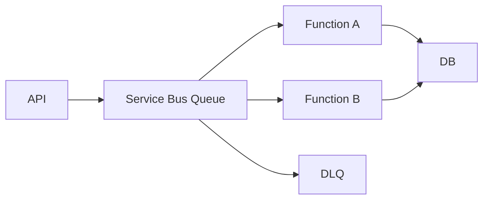

# Daily Knowledge Sharing — 2026-09-27

## Today’s Topics

1. .NET `ArrayPool<T>`: giảm allocation nhưng phải quản lý ownership và data leakage
2. ASP.NET Core middleware ordering: Authentication, Authorization và endpoint pipeline
3. EF Core `ExecuteUpdateAsync`: set-based update thay cho load–track–save
4. SQL connection pool exhaustion: khi database còn khỏe nhưng API vẫn timeout
5. MongoDB embedding vs referencing: thiết kế document theo access pattern
6. Azure Functions queue processing: scale-out, duplicate execution và idempotency
7. Retry + Circuit Breaker: resilience không đồng nghĩa với retry mọi lỗi
8. Blue-Green deployment với database migration: backward compatibility qua nhiều version
9. IIS Application Pool recycling: process lifetime và production interruption
10. TypeScript discriminated unions: giữ frontend API state explicit và type-safe

---

# 1. .NET `ArrayPool<T>`: giảm allocation nhưng phải quản lý ownership và data leakage

## 1. What is it?

`ArrayPool<T>` là pool các array có thể thuê bằng `Rent` và trả lại bằng `Return`. Mental model quan trọng: application không sở hữu buffer vĩnh viễn; nó chỉ mượn một vùng memory có capacity **ít nhất** bằng kích thước yêu cầu.

Pool hữu ích ở hot path có buffer tạm lớn hoặc allocation lặp lại. Nó không phải mặc định tốt hơn `new T[]`: đổi allocation/GC pressure lấy lifecycle complexity.

## 2. Why does it exist?

Một API xử lý hàng nghìn payload mỗi giây mà liên tục tạo byte array 64–256 KB sẽ tạo allocation rate cao, có thể đẩy object lên LOH và tăng GC pressure. Nếu buffer chỉ sống trong vài millisecond, tái sử dụng memory có thể rẻ hơn cấp phát mới.

Nhưng nếu workload nhỏ, GC đã xử lý tốt thì pooling chỉ thêm nguy cơ ownership bug.

## 3. How does it work?

`ArrayPool<T>.Shared` giữ các bucket buffer theo kích thước. `Rent(1000)` có thể trả array dài hơn 1000. `Return` đưa buffer về pool để request khác tái sử dụng.

Điều đó dẫn tới hai invariant: chỉ xử lý phần dữ liệu thực sự hợp lệ; không được dùng buffer sau khi đã trả pool.

## 4. Practical implementation

```csharp
using System.Buffers;

static int Transform(ReadOnlySpan<byte> input, Stream output)
{
    byte[] rented = ArrayPool<byte>.Shared.Rent(input.Length);
    try
    {
        var target = rented.AsSpan(0, input.Length);
        input.CopyTo(target);
        output.Write(target);
        return target.Length;
    }
    finally
    {
        ArrayPool<byte>.Shared.Return(rented, clearArray: true);
    }
}
```

`clearArray: true` có chi phí CPU nhưng hợp lý nếu buffer từng chứa token, PII hoặc dữ liệu nhạy cảm.

## 5. Real production scenario

Một file-processing API đọc chunk, giải nén và transform dữ liệu. Profiling cho thấy allocation rate cao và GC pause tăng theo throughput. Chuyển **buffer tạm đã đo được** sang `ArrayPool<byte>` giảm allocation mà không thay đổi contract của business layer.

## 6. Failure scenario & troubleshooting

**Symptom** → dữ liệu response đôi lúc chứa byte từ request trước.  
**Evidence** → lỗi chỉ xuất hiện dưới concurrency; buffer đến từ shared pool.  
**Hypothesis** → code dùng toàn bộ `rented.Length` thay vì logical length hoặc giữ reference sau `Return`.  
**Diagnosis** → trace ownership và length tại Rent/Return.  
**Fix** → giới hạn bằng `Span(0, actualLength)`, không escape buffer, clear khi cần.  
**Verification** → concurrency test + memory profiler + test dữ liệu nhạy cảm.

## 7. Common mistakes

Dùng `rented.Length` như kích thước dữ liệu; quên `Return`; return hai lần; giữ buffer trong field sau khi trả; pool mọi allocation dù profiler chưa chứng minh bottleneck; không clear dữ liệu nhạy cảm.

## 8. Alternatives

`new byte[]` đơn giản và thường đúng cho workload bình thường. `stackalloc` phù hợp buffer nhỏ, lifetime ngắn. `MemoryPool<T>` phù hợp khi cần owner abstraction. `Span<T>` giúp thao tác memory nhưng không tự pooling.

## 9. Trade-offs

### Advantages
Giảm allocation rate, GC pressure và đôi khi giảm tail latency trên hot path.

### Costs / Risks
Ownership phức tạp hơn, nguy cơ data leakage/use-after-return, buffer có thể lớn hơn yêu cầu, clearing tốn CPU.

## 10. Junior → Middle → Senior → Technical Lead

### Junior
Hiểu Rent/Return và buffer không thuộc ownership lâu dài của caller.
### Middle
Biết dùng `try/finally`, logical length và benchmark trước/sau.
### Senior
Phân tích allocation profile, LOH/GC impact, concurrency và security của reused memory.
### Technical Lead / Architect
Quyết định pooling có thực sự cần ở boundary nào, chuẩn hóa ownership để optimization không lan complexity khắp codebase.

## 11. Key takeaway

- Pool memory chỉ khi allocation thực sự là bottleneck.
- `Rent` trả capacity, không trả “đúng length”.
- Ownership và data hygiene quan trọng hơn vài microsecond tối ưu.

---

# 2. ASP.NET Core middleware ordering: Authentication, Authorization và endpoint pipeline

## 1. What is it?

ASP.NET Core middleware pipeline là chuỗi component xử lý request theo thứ tự đăng ký. Mental model: order chính là behavior; cùng middleware nhưng đặt sai vị trí có thể khiến security, exception handling hoặc telemetry hoạt động sai.

## 2. Why does it exist?

Cross-cutting concerns như exception handling, authentication, authorization, CORS và routing cần bao quanh endpoint mà không nhúng vào business code. Pipeline cho phép composition, nhưng đổi lại developer phải hiểu dependency về thứ tự.

## 3. How does it work?

Request đi từ middleware đầu đến cuối; response unwind ngược lại.

```text
ExceptionHandler
  -> Routing
    -> Authentication
      -> Authorization
        -> Endpoint
      <- Authorization
    <- Authentication
  <- Routing
<- ExceptionHandler
```

Authentication xây `HttpContext.User`; Authorization dùng identity/claims đó để quyết định access.

## 4. Practical implementation

```csharp
var app = builder.Build();

app.UseExceptionHandler();
app.UseHttpsRedirection();
app.UseRouting();
app.UseAuthentication();
app.UseAuthorization();
app.MapControllers();
app.Run();
```

```csharp
[Authorize(Policy = "TimesheetApprover")]
[HttpPost("/api/timesheets/{id}/approve")]
public async Task<IActionResult> Approve(Guid id) { /* ... */ }
```

## 5. Real production scenario

Employee platform dùng Entra ID. Endpoint approve yêu cầu claim cụ thể. Production protected endpoint luôn 403 vì custom middleware kiểm tra role trước khi authentication handler populate principal.

## 6. Failure scenario & troubleshooting

**Symptom** → token hợp lệ nhưng endpoint trả 401/403.  
**Evidence** → token validation log không xuất hiện trước custom authorization check.  
**Hypothesis** → pipeline order sai.  
**Diagnosis** → bật authentication/authorization logs và inspect `HttpContext.User`.  
**Fix** → đặt middleware theo dependency; dùng policy-based authorization khi đủ.  
**Verification** → integration tests cho anonymous, authenticated-without-claim và authorized user.

## 7. Common mistakes

Nhầm 401 với 403; custom middleware tự parse JWT; exception handler đặt quá muộn; authorization logic nằm rải rác trong controller.

## 8. Alternatives

Endpoint filters phù hợp concern gần Minimal API endpoint. MVC filters phù hợp MVC-specific behavior. Policy-based authorization nên được ưu tiên cho access control.

## 9. Trade-offs

### Advantages
Pipeline tạo composition rõ, centralized cross-cutting behavior và khả năng short-circuit.
### Costs / Risks
Behavior phụ thuộc order; custom middleware quá nhiều làm request lifecycle khó reasoning và test.

## 10. Junior → Middle → Senior → Technical Lead

### Junior
Hiểu request đi qua middleware theo thứ tự.
### Middle
Cấu hình authentication/authorization và viết integration tests đúng status code.
### Senior
Debug pipeline bằng logs, hiểu short-circuit và security consequences.
### Technical Lead / Architect
Đặt boundary: concern nào thuộc middleware, filter, endpoint hay application layer.

## 11. Key takeaway

- Middleware ordering là runtime behavior, không phải style.
- Authentication tạo identity; Authorization tiêu thụ identity.
- Security pipeline phải được integration-test.

---

# 3. EF Core `ExecuteUpdateAsync`: set-based update thay cho load–track–save

## 1. What is it?

`ExecuteUpdateAsync` cho phép EF Core tạo trực tiếp SQL `UPDATE` từ query mà không materialize entity và không dùng change tracker. Đây là set-based database operation, không phải shortcut của `SaveChanges`.

## 2. Why does it exist?

Load 50.000 rows chỉ để đổi một status gây network I/O, allocations, tracking overhead và nhiều statement không cần thiết. Relational database đã tối ưu set operation.

## 3. How does it work?

LINQ predicate được translate thành `WHERE`; setter thành `SET`. Query thực thi ngay khi gọi method, không chờ `SaveChanges`.

## 4. Practical implementation

```csharp
var affected = await db.Timesheets
    .Where(x => x.Status == Status.Pending && x.SubmittedAt < cutoff)
    .ExecuteUpdateAsync(s => s
        .SetProperty(x => x.Status, Status.Expired)
        .SetProperty(x => x.UpdatedAt, DateTimeOffset.UtcNow),
        cancellationToken);
```

Nếu cùng `DbContext` đang tracking entity tương ứng, state trong memory có thể stale.

## 5. Real production scenario

Nightly maintenance job expire hàng chục nghìn approval records. Phiên bản cũ `ToListAsync` rồi loop update, khiến memory spike. Set-based update giảm round trip và tracking cost.

## 6. Failure scenario & troubleshooting

**Symptom** → API bulk-update nhưng object tracked vẫn hiện status cũ.  
**Evidence** → SQL update đúng; change tracker chứa entity cũ.  
**Diagnosis** → direct update không synchronize tracked instances.  
**Fix** → tách DbContext, clear/reload tracker hoặc tránh mix hai model.  
**Verification** → integration test DB và subsequent read từ context mới.

## 7. Common mistakes

Giả định `SaveChanges` mới commit; mix tracked entity với bulk update; bỏ qua concurrency/business invariant; predicate quá rộng; không xem affected-row count.

## 8. Alternatives

Load–track–save phù hợp aggregate nhỏ cần domain logic. Raw SQL hữu ích khi SQL phức tạp. Bulk library hỗ trợ case chuyên sâu nhưng thêm dependency.

## 9. Trade-offs

### Advantages
Ít round trip, allocation và tracking; tận dụng set-based engine.
### Costs / Risks
Bypass change tracker, domain hooks và một số concurrency semantics; query sai có blast radius lớn.

## 10. Junior → Middle → Senior → Technical Lead

### Junior
Hiểu entity update và set-based update.
### Middle
Viết predicate an toàn, kiểm tra affected rows, integration-test.
### Senior
Quản lý transaction, concurrency, tracked state và execution plan.
### Technical Lead / Architect
Quyết định bulk operation thuộc workflow nào và invariant nào phải được bảo vệ.

## 11. Key takeaway

- Không materialize dữ liệu chỉ để update theo tập hợp.
- `ExecuteUpdateAsync` không đồng bộ change tracker.
- Performance không được đánh đổi business invariant vô thức.

---

# 4. SQL connection pool exhaustion: khi database còn khỏe nhưng API vẫn timeout

## 1. What is it?

ADO.NET connection pooling tái sử dụng physical database connections. Pool exhaustion xảy ra khi mọi connection trong pool đang bận và request mới phải chờ slot, dù database chưa nhất thiết quá tải.

## 2. Why does it exist?

Mở TCP/TLS/authenticated connection cho từng query rất đắt. Pooling amortize chi phí đó. Nhưng pool là finite resource; connection giữ quá lâu biến nó thành queue ẩn.

## 3. How does it work?

`OpenAsync` thường lấy connection từ pool theo connection string. `Dispose` trả logical connection về pool. Transaction dài, query chậm hoặc leaked connection làm hold time tăng. Concurrency cần thiết tăng theo throughput × thời gian giữ connection.

## 4. Practical implementation

```csharp
await using var connection = new SqlConnection(connectionString);
await connection.OpenAsync(ct);

await using var command = connection.CreateCommand();
command.CommandText = """
    SELECT Id, Status
    FROM Timesheets
    WHERE EmployeeId = @employeeId
    """;
command.Parameters.AddWithValue("@employeeId", employeeId);

await using var reader = await command.ExecuteReaderAsync(ct);
```

Không giữ connection xuyên qua network call.

## 5. Real production scenario

API mở transaction, update DB rồi gọi external payroll API 8 giây trước khi commit. Payroll chậm khiến hàng trăm request giữ connection; endpoint khác timeout dù query nhanh.

## 6. Failure scenario & troubleshooting

**Symptom** → timeout khi obtaining connection; DB CPU chỉ 35%.  
**Evidence** → active connection count chạm giới hạn, external dependency chậm.  
**Hypothesis** → connection hold time tăng.  
**Diagnosis** → correlate DB span + external span + transaction duration.  
**Fix** → rút ngắn transaction, không gọi network trong DB transaction, dispose đúng, tối ưu query.  
**Verification** → load test và quan sát pool wait time, active connections, p95/p99.

## 7. Common mistakes

Tăng `Max Pool Size` ngay; giữ DbContext quá lâu; transaction bao quanh HTTP call; retry pool timeout hàng loạt; nhầm DB saturation với pool saturation.

## 8. Alternatives

Tăng pool size chỉ hợp lý nếu DB còn capacity. Giảm request concurrency, queue work hoặc tối ưu hold time thường an toàn hơn.

## 9. Trade-offs

### Advantages
Pooling giảm setup latency và authentication overhead.
### Costs / Risks
Pool là finite shared resource; tăng pool có thể chuyển bottleneck sang database.

## 10. Junior → Middle → Senior → Technical Lead

### Junior
Dispose connection/DbContext đúng lifetime.
### Middle
Nhận diện pool timeout và transaction dài.
### Senior
Phân tích concurrency, traces, query duration, dependency latency và retry amplification.
### Technical Lead / Architect
Thiết kế transaction boundary và capacity budget giữa API, pool và database.

## 11. Key takeaway

- Pool exhaustion không đồng nghĩa database CPU cao.
- Tối ưu thời gian giữ connection trước khi tăng pool.
- Tránh giữ transaction qua slow external dependency.

---

# 5. MongoDB embedding vs referencing: thiết kế document theo access pattern

## 1. What is it?

Embedding lưu related data trong cùng document; referencing lưu identifier trỏ sang document khác. Mental model đúng không phải “NoSQL thì denormalize”, mà là model theo read/write pattern, consistency boundary và growth.

## 2. Why does it exist?

Document database tối ưu đọc aggregate-like data cùng nhau. Nhưng embed vô hạn gây document growth; reference quá mức lại tái tạo join-heavy relational model ở application.

## 3. How does it work?

Nếu order và line items thường đọc/ghi cùng nhau, line items có thể embed. Product catalog dùng chung không nên embed như nguồn sự thật thay đổi liên tục; order có thể snapshot field cần cho lịch sử.

## 4. Practical implementation

```csharp
public sealed class Order
{
    public ObjectId Id { get; init; }
    public Guid CustomerId { get; init; }
    public List<OrderLine> Lines { get; init; } = [];
}

public sealed class OrderLine
{
    public Guid ProductId { get; init; }
    public string ProductName { get; init; } = "";
    public decimal UnitPrice { get; init; }
    public int Quantity { get; init; }
}
```

Đây là hybrid: reference identity + embedded historical snapshot.

## 5. Real production scenario

Marketplace order phải giữ giá/tên sản phẩm tại thời điểm mua. Nếu order history luôn lookup current product, user có thể thấy dữ liệu hiện tại thay vì dữ liệu giao dịch lịch sử.

## 6. Failure scenario & troubleshooting

**Symptom** → document size tăng liên tục, update chậm.  
**Evidence** → customer document embed toàn bộ order history.  
**Diagnosis** → unbounded relationship bị model như embedded collection.  
**Fix** → tách order collection, giữ bounded summary nếu cần.  
**Verification** → đo document size distribution, latency và index footprint.

## 7. Common mistakes

Embed collection tăng vô hạn; reference mọi thứ như SQL; duplicate mutable data không có sync strategy; chọn schema trước query pattern; bỏ qua index.

## 8. Alternatives

SQL phù hợp quan hệ phức tạp và transactional constraints mạnh. MongoDB reference phù hợp shared/unbounded entity. Embedding phù hợp data cùng lifecycle và bounded cardinality.

## 9. Trade-offs

### Advantages
Embedding giảm round trip và giữ aggregate data gần nhau.
### Costs / Risks
Duplication, document growth, write amplification và consistency khó hơn.

## 10. Junior → Middle → Senior → Technical Lead

### Junior
Hiểu document không phải table row JSON hóa.
### Middle
Thiết kế schema từ access pattern và index.
### Senior
Đánh giá cardinality, lifecycle, consistency, growth và migration.
### Technical Lead / Architect
Chọn database/model dựa trên workload và ownership.

## 11. Key takeaway

- Embed khi cùng lifecycle và bounded growth.
- Reference khi entity shared, independent hoặc unbounded.
- Model bắt đầu từ access pattern và consistency requirement.

---

# 6. Azure Functions queue processing: scale-out, duplicate execution và idempotency

## 1. What is it?

Queue-triggered Azure Function là handler kích hoạt bởi message. Một message có thể được delivery lại; scale-out tạo nhiều instances xử lý song song. “Function chạy một lần” không phải invariant đáng tin cậy.

## 2. Why does it exist?

Queue decouple producer khỏi consumer, absorb burst và independent scaling. Đổi lại có asynchronous completion, duplicate delivery và poison-message handling.

## 3. How does it work?



Nếu handler crash sau side effect commit nhưng trước settlement, message có thể redeliver.

## 4. Practical implementation

```csharp
public async Task HandleAsync(OrderPaid message, CancellationToken ct)
{
    if (await db.ProcessedMessages.AnyAsync(x => x.Id == message.MessageId, ct))
        return;

    await using var tx = await db.Database.BeginTransactionAsync(ct);
    db.ProcessedMessages.Add(new ProcessedMessage(message.MessageId));
    db.Notifications.Add(Notification.ForPaidOrder(message.OrderId));
    await db.SaveChangesAsync(ct);
    await tx.CommitAsync(ct);
}
```

Cần unique constraint trên `ProcessedMessages.Id` để race không vượt dedup.

## 5. Real production scenario

E-commerce gửi invoice. Function commit invoice rồi crash trước complete message. Redelivery tạo invoice thứ hai nếu handler không idempotent.

## 6. Failure scenario & troubleshooting

**Symptom** → duplicate invoice và delivery count > 1.  
**Evidence** → cùng `MessageId` ở hai trace.  
**Diagnosis** → side effect không có idempotency boundary.  
**Fix** → unique dedup key, transactional inbox/outbox khi cần, DLQ policy.  
**Verification** → fault-injection sau DB commit rồi replay.

## 7. Common mistakes

Giả định exactly-once; in-memory dedup trên scale-out; retry non-idempotent external call; không monitor DLQ; poison message retry vô hạn.

## 8. Alternatives

Worker Service + Service Bus cho hosting control cao hơn. Container Apps Jobs phù hợp batch. Synchronous API đơn giản hơn nếu caller cần immediate completion.

## 9. Trade-offs

### Advantages
Burst absorption, independent scaling, failure isolation.
### Costs / Risks
Eventual consistency, duplicate delivery, distributed debugging và queue/DLQ operations.

## 10. Junior → Middle → Senior → Technical Lead

### Junior
Hiểu message có thể xử lý lại.
### Middle
Viết idempotent handler và monitor DLQ.
### Senior
Thiết kế settlement, retry, dedup, concurrency và failure injection.
### Technical Lead / Architect
Quyết định async boundary, ownership, backlog SLO và consistency model.

## 11. Key takeaway

- At-least-once delivery yêu cầu idempotency.
- Scale-out làm in-memory coordination không đủ.
- DLQ là operational workflow.

---

# 7. Retry + Circuit Breaker: resilience không đồng nghĩa với retry mọi lỗi

## 1. What is it?

Retry thử lại transient failure; Circuit Breaker tạm ngừng call tới dependency đang fail vượt ngưỡng. Retry xử lý failure ngắn hạn có khả năng hồi phục; Circuit Breaker giới hạn failure amplification.

## 2. Why does it exist?

Network có partial failure. Một timeout có thể recover. Nhưng retry 3 lần trên 1.000 request khi downstream chết biến 1.000 failures thành hàng nghìn calls.

## 3. How does it work?

Retry cần backoff + jitter + bounded attempts. Circuit Breaker quan sát outcome; khi unhealthy chuyển open và fail fast; sau cooldown probe ở half-open.

## 4. Practical implementation

```csharp
builder.Services.AddHttpClient<InventoryClient>(client =>
{
    client.Timeout = TimeSpan.FromSeconds(3);
})
.AddStandardResilienceHandler(options =>
{
    options.Retry.MaxRetryAttempts = 2;
    options.AttemptTimeout.Timeout = TimeSpan.FromSeconds(2);
    options.TotalRequestTimeout.Timeout = TimeSpan.FromSeconds(5);
});
```

Không retry validation error hoặc mọi POST một cách mù quáng.

## 5. Real production scenario

Product page gọi review provider. Provider latency tăng từ 200 ms lên 8 s. Retry nhiều lần làm request lifetime và outbound pressure tăng. Better design có timeout budget, circuit breaker và degraded response.

## 6. Failure scenario & troubleshooting

**Symptom** → dependency outage kéo CPU/request count API tăng.  
**Evidence** → mỗi incoming request tạo nhiều outbound retries.  
**Diagnosis** → retry amplification + timeout budget dài.  
**Fix** → giảm attempt, jitter/circuit breaker, controlled fallback, concurrency limit.  
**Verification** → chaos test và đo p95, outbound RPS, recovery time.

## 7. Common mistakes

Retry 4xx; retry non-idempotent operation; nested retries ở SDK + app + gateway; không có total timeout budget.

## 8. Alternatives

Fail-fast phù hợp dependency optional. Queue phù hợp operation async. Cached/stale response phù hợp read path chấp nhận freshness trade-off.

## 9. Trade-offs

### Advantages
Tăng success rate cho transient failure và ngăn cascading failure.
### Costs / Risks
Tăng latency/load, có thể duplicate side effect; resilience policy cần test.

## 10. Junior → Middle → Senior → Technical Lead

### Junior
Phân biệt transient và permanent failure.
### Middle
Cấu hình timeout/retry bounded và log attempt.
### Senior
Tính latency budget, idempotency và retry amplification.
### Technical Lead / Architect
Xác định resilience boundary và tránh policy chồng lấn.

## 11. Key takeaway

- Retry là thêm load vào hệ thống đang lỗi.
- Timeout budget phải bounded end-to-end.
- Circuit Breaker bảo vệ capacity; không chữa downstream.

---

# 8. Blue-Green deployment với database migration: backward compatibility qua nhiều version

## 1. What is it?

Blue-Green giữ hai application environments: version hiện tại và mới. Traffic switch nhanh, nhưng database thường là shared state. Rollback application dễ; rollback schema/data thường khó.

## 2. Why does it exist?

Ta muốn giảm downtime và có đường rollback. Nhưng nếu version mới migration destructive schema trước traffic switch, version cũ có thể chết ngay.

## 3. How does it work?

Safe evolution thường dùng **expand → migrate → contract**:

1. Expand schema tương thích old/new.
2. Deploy code mới tương thích.
3. Backfill/migrate data.
4. Chờ old version biến mất.
5. Contract ở release sau.

## 4. Practical implementation

Thay vì rename trực tiếp `FullName` → `DisplayName`:

```sql
ALTER TABLE Customers ADD DisplayName nvarchar(200) NULL;
UPDATE Customers
SET DisplayName = FullName
WHERE DisplayName IS NULL;
```

Sau khi mọi instance dùng schema mới mới drop `FullName`.

## 5. Real production scenario

App Service staging chạy vNext, production chạy vCurrent. Migration drop column cũ khi staging startup. Production vCurrent lập tức 500 dù chưa swap.

## 6. Failure scenario & troubleshooting

**Symptom** → deployment mới chưa swap nhưng production lỗi invalid column.  
**Evidence** → migration history đổi trước traffic switch.  
**Diagnosis** → schema không backward-compatible.  
**Fix** → restore compatibility/hotfix; dài hạn expand/contract.  
**Verification** → compatibility test old và new binaries trên transitional schema.

## 7. Common mistakes

Coi DB migration như artifact rollback được; rename/drop trực tiếp; migration nặng giữ lock; auto-migrate từ nhiều instances; không test mixed-version.

## 8. Alternatives

Rolling deployment cũng cần compatibility. Canary tăng mixed-version duration. Maintenance window đơn giản hơn nếu hệ thống chấp nhận downtime.

## 9. Trade-offs

### Advantages
Fast traffic rollback, deployment isolation, pre-release validation.
### Costs / Risks
Double environment cost, schema evolution phức tạp, temporary duplication.

## 10. Junior → Middle → Senior → Technical Lead

### Junior
Hiểu application rollback không rollback database.
### Middle
Viết additive migration và test compatibility.
### Senior
Thiết kế backfill, locking, mixed-version behavior, rollback plan.
### Technical Lead / Architect
Chọn release strategy theo SLO/risk và governance destructive changes.

## 11. Key takeaway

- Database là điểm khó của zero-downtime deployment.
- Expand trước, contract sau.
- Test old + new cùng transitional schema.

---

# 9. IIS Application Pool recycling: process lifetime và production interruption

## 1. What is it?

IIS Application Pool quản lý worker process `w3wp.exe`. Recycling thay worker process theo configuration/health condition. Process app không sống vĩnh viễn; in-memory state có thể biến mất.

## 2. Why does it exist?

Recycling giúp IIS thay process để áp configuration hoặc recover unhealthy state. Nhưng recycle để “chữa memory leak” chỉ che root cause.

## 3. How does it work?

IIS có thể start worker mới và drain worker cũ trong overlap period. Startup chạy lại; singleton/cache/background timer được tạo lại. Nếu shutdown không graceful, in-flight work có thể mất.

## 4. Practical implementation

```csharp
protected override async Task ExecuteAsync(CancellationToken stoppingToken)
{
    while (!stoppingToken.IsCancellationRequested)
    {
        await ProcessNextAsync(stoppingToken);
    }
}
```

Durable work không nên chỉ tồn tại trong memory; dùng queue/database nếu phải survive restart.

## 5. Real production scenario

Legacy app lưu workflow state trong static dictionary. Sau nightly recycle, user mất state dù database bình thường. Root cause là state ownership sai.

## 6. Failure scenario & troubleshooting

**Symptom** → lỗi spike cùng giờ mỗi ngày.  
**Evidence** → IIS event logs có recycle; startup logs/cold cache trùng spike.  
**Diagnosis** → recycle + expensive warm-up hoặc non-durable state.  
**Fix** → sửa recycle policy, tối ưu startup, externalize durable state, graceful shutdown.  
**Verification** → controlled recycle dưới load, theo dõi 5xx/p95.

## 7. Common mistakes

Scheduled recycle thay memory-leak investigation; lưu durable state trong process; background timer không cancellation; không xem IIS logs; recycle đồng thời mọi node.

## 8. Alternatives

Linux/systemd, containers hay App Service cũng có restart; platform khác không loại bỏ lifecycle problem. Stateless/durable-work mới là nguyên tắc chung.

## 9. Trade-offs

### Advantages
Process isolation và operational recovery mechanism.
### Costs / Risks
Cold start, cache loss, interrupted work và hidden in-memory dependency.

## 10. Junior → Middle → Senior → Technical Lead

### Junior
Biết app process có thể restart.
### Middle
Đọc IIS logs và implement graceful cancellation.
### Senior
Correlate recycle với telemetry, startup cost, session/background work.
### Technical Lead / Architect
Thiết kế app không phụ thuộc process immortality; quyết định state ownership.

## 11. Key takeaway

- Process restart là normal operational event.
- Durable business work không phụ thuộc RAM một worker.
- Recycle không thay root-cause analysis.

---

# 10. TypeScript discriminated unions: giữ frontend API state explicit và type-safe

## 1. What is it?

Discriminated union biểu diễn state machine bằng union object có discriminator chung. Với frontend, nó tránh combination vô nghĩa như `isLoading=true`, `error!=null` và `data!=null` cùng lúc.

## 2. Why does it exist?

Nhiều boolean độc lập tạo state space lớn hơn business reality. API call thường chỉ idle/loading/success/error. Type system có thể ép code xử lý từng state.

## 3. How does it work?

TypeScript narrow type theo field `status`. Mỗi branch chỉ expose dữ liệu hợp lệ.

## 4. Practical implementation

```typescript
type ApiState<T> =
  | { status: "idle" }
  | { status: "loading" }
  | { status: "success"; data: T }
  | { status: "error"; problem: ProblemDetails };

function render(state: ApiState<Order>) {
  switch (state.status) {
    case "idle": return null;
    case "loading": return "Loading...";
    case "success": return state.data.id;
    case "error": return state.problem.title;
  }
}
```

ASP.NET Core nên trả stable `ProblemDetails` contract để frontend không parse arbitrary string.

## 5. Real production scenario

Vue/React product page có skeleton, data và error. Ba boolean độc lập khiến stale product vẫn hiện dưới error banner. Union buộc transition explicit.

## 6. Failure scenario & troubleshooting

**Symptom** → UI hiển thị dữ liệu request trước sau khi request mới fail.  
**Evidence** → state giữ cả old data và new error.  
**Diagnosis** → state model cho phép invalid combinations.  
**Fix** → discriminated union/reducer, reset state theo transition; cancellation khi cần.  
**Verification** → tests cho success→loading→error và out-of-order response.

## 7. Common mistakes

Dùng `any`; discriminator optional; map backend error tùy tiện; không exhaustive; coi type safety là runtime validation.

## 8. Alternatives

State machine library hữu ích workflow phức tạp. Simple state đủ component nhỏ. Runtime schema validation như Zod bổ sung validation cho external payload.

## 9. Trade-offs

### Advantages
State rõ, compiler hỗ trợ refactor, giảm impossible states.
### Costs / Risks
Thêm modeling code; quá chi tiết với UI trivial; compile-time type không validate network runtime.

## 10. Junior → Middle → Senior → Technical Lead

### Junior
Hiểu union mô tả state hợp lệ.
### Middle
Model API state, exhaustive rendering và tests.
### Senior
Kết nối state với cancellation, error contract, races và runtime validation.
### Technical Lead / Architect
Chuẩn hóa API contract + frontend state conventions vừa đủ, tránh unnecessary complexity.

## 11. Key takeaway

- Model state hợp lệ thay vì nhiều boolean độc lập.
- TypeScript không validate network payload runtime.
- Stable backend error contract làm frontend đáng tin cậy hơn.
