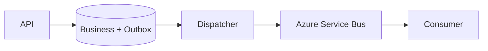

# Daily Knowledge Sharing — 2026-09-28

## Today’s Topics

1. .NET `Channel<T>`: backpressure cho producer–consumer thay vì queue vô hạn
2. ASP.NET Core API compatibility: versioning, additive change và contract evolution
3. EF Core split queries: tránh cartesian explosion nhưng hiểu consistency cost
4. SQL Server deadlock: wait-for cycle, execution plan và transaction design
5. Elasticsearch alias-based reindex: thay đổi mapping mà không downtime
6. Azure Key Vault + Managed Identity: secret access, rotation và failure boundary
7. Transactional Outbox: nối database transaction với message delivery đáng tin cậy
8. Deployment health validation: artifact promotion, rollback và database compatibility
9. Optimizely CMS content modeling: Page, Block và boundary theo editorial workflow
10. Playwright E2E reliability: auto-waiting, test isolation và triệt flaky test

---

# 1. .NET `Channel<T>`: backpressure cho producer–consumer thay vì queue vô hạn

## 1. What is it?

`Channel<T>` là abstraction asynchronous producer–consumer trong .NET. Mental model quan trọng không phải “một queue thread-safe”, mà là **ranh giới điều tiết tốc độ** giữa bên tạo công việc và bên xử lý công việc.

Producer ghi vào `ChannelWriter<T>`; consumer đọc từ `ChannelReader<T>`. Với bounded channel, capacity trở thành một phần của reliability design: khi consumer chậm, producer phải chờ, bỏ item hoặc áp dụng policy rõ ràng thay vì để memory tăng vô hạn.

## 2. Why does it exist?

Một `ConcurrentQueue<T>` cộng polling loop có thể thread-safe nhưng không tự giải quyết signaling, asynchronous waiting, completion hay overload. Nếu request đến 5.000/s nhưng worker chỉ xử lý 1.000/s, queue vô hạn chỉ biến overload thành memory growth rồi process crash.

Backpressure làm overload **hiện ra tại boundary**, nơi hệ thống có thể quyết định chờ, reject hoặc shed load.

## 3. How does it work?

```text
Producer -> bounded Channel -> Consumer
             |
             +-- full -> WriteAsync waits
```

`WriteAsync` và `ReadAllAsync` không cần block thread trong lúc chờ. `Complete()` báo rằng không còn item mới; consumer có thể drain phần còn lại trước shutdown. `BoundedChannelFullMode` quyết định hành vi khi đầy.

## 4. Practical implementation

```csharp
var channel = Channel.CreateBounded<WorkItem>(
    new BoundedChannelOptions(500)
    {
        FullMode = BoundedChannelFullMode.Wait,
        SingleReader = true,
        SingleWriter = false
    });

app.MapPost("/jobs", async (
    WorkItem item,
    CancellationToken ct) =>
{
    await channel.Writer.WriteAsync(item, ct);
    return Results.Accepted();
});

await foreach (var item in channel.Reader.ReadAllAsync(stoppingToken))
{
    await processor.ProcessAsync(item, stoppingToken);
}
```

Trong production, HTTP request không nên chờ vô hạn. Có thể đặt timeout ngắn và trả `429`/`503` khi capacity đã cạn.

## 5. Real production scenario

Một API nhận yêu cầu tạo thumbnail. CPU-bound processing chậm hơn ingress traffic trong giờ cao điểm. Bounded channel 500 item giữ burst ngắn, worker xử lý theo capacity thực. Nếu backlog duy trì ở mức đầy, API bắt đầu reject thay vì dùng toàn bộ RAM.

Nếu công việc phải sống qua process restart, in-memory channel không đủ; cần durable queue như Azure Service Bus.

## 6. Failure scenario & troubleshooting

**Symptom** → memory tăng, latency request tăng dần.

**Evidence** → channel depth luôn sát capacity; processing duration tăng; CPU 95%.

**Hypothesis** → consumer throughput thấp hơn producer throughput.

**Diagnosis** → đo arrival rate, completion rate và queue wait time; profiler cho thấy thumbnail resize là CPU bottleneck.

**Fix** → giới hạn ingress, scale worker hợp lý hoặc chuyển workload sang durable queue; không tăng capacity một cách mù quáng.

**Verification** → backlog trở về steady state, p95 queue wait ổn định, memory không tăng tuyến tính.

## 7. Common mistakes

Dùng unbounded channel cho workload không giới hạn; quên complete/drain khi shutdown; bắt exception trong consumer rồi làm worker chết âm thầm; dùng channel như durable message broker; tạo quá nhiều consumers cho CPU-bound work rồi gây contention.

## 8. Alternatives

`ConcurrentQueue<T>` phù hợp cho primitive queue khi tự quản signaling. `BlockingCollection<T>` hợp với synchronous producer–consumer legacy. Azure Service Bus phù hợp khi cần durability, retry, DLQ và scale qua nhiều process.

## 9. Trade-offs

### Advantages

API async tự nhiên, signaling hiệu quả, bounded capacity và backpressure rõ ràng.

### Costs / Risks

State nằm trong process, mất khi crash; capacity/policy phải được thiết kế; observability cho queue depth và processing latency phải tự bổ sung.

## 10. Junior → Middle → Senior → Technical Lead

### Junior

Hiểu producer nhanh hơn consumer sẽ tạo backlog; thread-safe không đồng nghĩa với overload-safe.

### Middle

Biết cấu hình bounded channel, cancellation, completion và background consumer.

### Senior

Đo throughput, chọn capacity theo burst budget, phân biệt I/O-bound với CPU-bound và thiết kế failure/shutdown.

### Technical Lead / Architect

Quyết định boundary nào được phép in-memory, boundary nào cần durable broker; xác định overload policy và SLO thay vì chỉ chọn API.

## 11. Key takeaway

- Bounded `Channel<T>` biến overload thành quyết định có kiểm soát.
- Queue capacity không tạo thêm throughput.
- Công việc cần durability không nên chỉ sống trong process memory.

---

# 2. ASP.NET Core API compatibility: versioning, additive change và contract evolution

## 1. What is it?

API compatibility là khả năng thay đổi server mà không phá vỡ client đang chạy. Versioning chỉ là một công cụ; mental model đúng là **contract evolution**: client đã compile/deploy dựa trên schema, HTTP semantics và behavior nào?

## 2. Why does it exist?

Frontend có thể deploy cùng ngày với backend, nhưng mobile app, partner integration hoặc hệ thống enterprise thường không. Một rename JSON property tưởng nhỏ có thể làm hàng nghìn client cũ deserialize sai.

## 3. How does it work?

Contract gồm route, method, status code, headers, JSON shape, validation rule và semantic behavior. Additive change thường an toàn hơn destructive change.

```text
Client v1 ----Client v2 -----+--> API compatibility layer --> Application
Partner v1 ---/
```

Version có thể nằm ở URL, header hoặc media type. Điều quan trọng là lifecycle: introduction → coexistence → deprecation → removal.

## 4. Practical implementation

```csharp
public sealed record OrderResponse(
    Guid Id,
    string Status,
    decimal Total,
    DateTimeOffset? EstimatedDelivery); // additive field

app.MapGet("/api/v1/orders/{id:guid}", async (
    Guid id, OrderService service, CancellationToken ct) =>
{
    var order = await service.GetAsync(id, ct);
    return order is null
        ? Results.NotFound()
        : Results.Ok(new OrderResponse(
            order.Id, order.Status, order.Total, order.EstimatedDelivery));
});
```

Không đổi `Status` từ stable enum string sang object trong cùng contract chỉ vì server model mới “đẹp hơn”.

## 5. Real production scenario

E-commerce backend muốn thêm delivery window. Web mới dùng field đó ngay; mobile cũ bỏ qua unknown JSON field. Đây là additive evolution. Ngược lại, đổi `total` từ number sang formatted string là breaking change và cần contract mới hoặc migration period.

## 6. Failure scenario & troubleshooting

**Symptom** → sau deploy, mobile checkout tăng lỗi parse nhưng web bình thường.

**Evidence** → telemetry phân nhóm theo client version cho thấy app 4.8 lỗi tại response mới.

**Hypothesis** → response contract thay đổi không backward-compatible.

**Diagnosis** → diff OpenAPI và replay response bằng client 4.8.

**Fix** → restore old shape; giới thiệu field mới hoặc version mới.

**Verification** → contract tests và error rate của client cũ trở về baseline.

## 7. Common mistakes

Cho rằng “JSON client sẽ bỏ qua field lạ” nên mọi thay đổi đều an toàn; đổi nullability; thay status code; tighten validation đột ngột; version API nhưng vẫn dùng chung DTO rồi vô tình phá cả hai version.

## 8. Alternatives

Không version nếu thay đổi hoàn toàn additive và semantics ổn định. Version endpoint khi contract thực sự cần diverge. Consumer-driven contract testing hữu ích khi có vài consumer quan trọng.

## 9. Trade-offs

### Advantages

Compatibility giảm coordinated deployment và production breakage.

### Costs / Risks

Nhiều version tăng test matrix, code path và deprecation burden. Giữ legacy vô hạn cũng là technical debt.

## 10. Junior → Middle → Senior → Technical Lead

### Junior

Hiểu API response là public contract, không chỉ là C# DTO.

### Middle

Biết nhận diện breaking change, viết integration/contract tests và duy trì OpenAPI.

### Senior

Đánh giá behavioral compatibility, migration path và telemetry theo consumer version.

### Technical Lead / Architect

Đặt compatibility policy, support window và ownership cho deprecation; quyết định khi nào versioning đáng chi phí.

## 11. Key takeaway

- Versioning không thay thế tư duy contract evolution.
- Additive change thường rẻ hơn coordinated migration.
- Compatibility phải được kiểm chứng bằng consumer behavior, không chỉ compile thành công.

---

# 3. EF Core split queries: tránh cartesian explosion nhưng hiểu consistency cost

## 1. What is it?

EF Core split query cho phép một query có nhiều collection navigation được thực thi thành nhiều SQL query thay vì một JOIN khổng lồ. Mental model: đổi **row multiplication** lấy **nhiều database round trips**.

## 2. Why does it exist?

Khi `Order` Include cả `Items` và `Payments`, một order có 20 items và 5 payments có thể tạo 100 rows trước khi EF dựng lại object graph. Payload, database CPU và network I/O tăng mạnh dù domain chỉ có 26 objects liên quan.

## 3. How does it work?

`AsSplitQuery()` query principal trước, sau đó query collection liên quan và correlate kết quả ở client. Điều này giảm duplication nhưng các query không mặc nhiên là một atomic snapshot.

## 4. Practical implementation

```csharp
var order = await db.Orders
    .AsNoTracking()
    .AsSplitQuery()
    .Include(x => x.Items)
    .Include(x => x.Payments)
    .SingleAsync(x => x.Id == orderId, ct);
```

Với read model, projection thường còn tốt hơn:

```csharp
var summary = await db.Orders
    .Where(x => x.Id == orderId)
    .Select(x => new {
        x.Id,
        x.Status,
        ItemCount = x.Items.Count,
        Total = x.Items.Sum(i => i.Quantity * i.UnitPrice)
    })
    .SingleAsync(ct);
```

## 5. Real production scenario

Order detail endpoint chậm sau khi thêm promotion history. Single JOIN trả 18 MB rows cho một order lớn. Split query giảm payload đáng kể; sau đó team nhận ra UI chỉ cần aggregate nên projection giảm thêm round trips và materialization.

## 6. Failure scenario & troubleshooting

**Symptom** → API đôi lúc trả order header và child collection không đồng nhất khi update đồng thời.

**Evidence** → SQL trace cho thấy các statement split chạy ở các thời điểm khác nhau.

**Hypothesis** → dữ liệu thay đổi giữa các query.

**Diagnosis** → reproduce concurrent update; kiểm tra isolation level.

**Fix** → nếu cần snapshot nhất quán, dùng transaction/isolation phù hợp hoặc thiết kế một query/read model khác.

**Verification** → concurrency test không còn mixed snapshot.

## 7. Common mistakes

Bật split query toàn cục mà không đo; dùng `Include` để lấy mọi thứ; nhầm split query với N+1; bỏ qua round-trip latency; dùng entity graph lớn khi projection đủ.

## 8. Alternatives

Single query phù hợp khi graph nhỏ. Projection phù hợp nhất cho API read model cụ thể. Explicit query cho từng phần hữu ích khi cần kiểm soát tải có điều kiện.

## 9. Trade-offs

### Advantages

Giảm cartesian explosion, duplicated columns và memory materialization.

### Costs / Risks

Nhiều round trips, consistency window giữa queries và complexity khi database ở xa.

## 10. Junior → Middle → Senior → Technical Lead

### Junior

Hiểu `Include` tạo SQL và dữ liệu truyền thật, không phải “load relation miễn phí”.

### Middle

Biết xem generated SQL, dùng projection, `AsNoTracking` và `AsSplitQuery`.

### Senior

Đo rows/bytes/round trips và đánh giá consistency requirement.

### Technical Lead / Architect

Quyết định read model boundary và tránh biến ORM convenience thành API data-access strategy mặc định.

## 11. Key takeaway

- Split query chữa row multiplication, không chữa mọi query chậm.
- Projection thường là lựa chọn tốt hơn cho read endpoint.
- Nhiều statement tạo consistency trade-off cần được hiểu rõ.

---

# 4. SQL Server deadlock: wait-for cycle, execution plan và transaction design

## 1. What is it?

Deadlock xảy ra khi các transaction tạo vòng chờ resource và không transaction nào có thể tiến tiếp. SQL Server chọn một deadlock victim để rollback nhằm phá vòng.

## 2. Why does it exist?

Lock bảo vệ isolation. Khi nhiều transaction giữ lock theo thứ tự khác nhau, correctness mechanism có thể tạo cycle. Deadlock không đồng nghĩa database “treo”; victim selection chính là cơ chế tự phục hồi.

## 3. How does it work?

```text
Tx A: holds Row 1 -> waits Row 2
Tx B: holds Row 2 -> waits Row 1
                 ^          |
                 +----------+
```

Execution plan quyết định thứ tự access thực tế, nên chỉ đọc source SQL chưa chắc đủ. Index và plan change có thể thay lock footprint.

## 4. Practical implementation

Một nguyên tắc quan trọng là update resource theo cùng thứ tự:

```sql
BEGIN TRAN;

UPDATE dbo.Accounts
SET Balance = Balance - @amount
WHERE AccountId = @fromId;

UPDATE dbo.Accounts
SET Balance = Balance + @amount
WHERE AccountId = @toId;

COMMIT;
```

Nếu mọi transfer lock account theo ID tăng dần, khả năng cycle giảm đáng kể. Business semantics vẫn phải được giữ đúng.

## 5. Real production scenario

Hai worker xử lý transfer ngược chiều A→B và B→A. Sau release mới, concurrency tăng và deadlock xuất hiện vài chục lần/phút. Retry che symptom nhưng DB CPU tăng vì transaction liên tục làm lại.

## 6. Failure scenario & troubleshooting

**Symptom** → exception 1205 rải rác dưới load.

**Evidence** → Extended Events deadlock graph cho thấy hai statements và lock resources.

**Hypothesis** → inconsistent access order hoặc transaction quá rộng.

**Diagnosis** → đọc deadlock graph, execution plan, indexes và transaction scope.

**Fix** → thống nhất access order, rút ngắn transaction, cải thiện access path; retry deadlock chỉ với operation idempotent/transaction-safe.

**Verification** → load test cùng concurrency và theo dõi deadlock event rate.

## 7. Common mistakes

Chỉ tăng timeout; thêm `NOLOCK`; retry vô hạn; giữ transaction qua external HTTP call; nhìn query text mà không xem plan/deadlock graph.

## 8. Alternatives

Optimistic concurrency giải quyết lost update nhưng không thay thế mọi lock. Snapshot-based isolation giảm một số reader/writer blocking nhưng không loại bỏ mọi writer deadlock.

## 9. Trade-offs

### Advantages

Locking cung cấp consistency mạnh trong transaction.

### Costs / Risks

Transaction dài, access path kém và concurrency cao làm lock footprint tăng. Isolation mạnh hơn có thể tăng blocking/version-store cost.

## 10. Junior → Middle → Senior → Technical Lead

### Junior

Phân biệt blocking với deadlock.

### Middle

Biết thu deadlock graph và xác định victim/statements.

### Senior

Liên hệ plan, index, transaction scope và retry semantics.

### Technical Lead / Architect

Thiết kế transaction boundary và concurrency model sao cho correctness rõ ràng trước khi tối ưu throughput.

## 11. Key takeaway

- Deadlock là cycle, không phải đơn giản là query chậm.
- Deadlock graph là evidence quan trọng nhất.
- Retry là safety net, không phải thay thế root-cause fix.

---

# 5. Elasticsearch alias-based reindex: thay đổi mapping mà không downtime

## 1. What is it?

Index alias là tên logic trỏ tới một hoặc nhiều Elasticsearch indexes. Nó cho phép application dùng tên ổn định trong khi infrastructure thay physical index phía sau.

## 2. Why does it exist?

Nhiều mapping change không thể sửa in-place theo cách mong muốn. Nếu application hard-code `products-v17`, reindex buộc deploy phối hợp hoặc downtime. Alias tạo indirection để migrate dữ liệu rồi atomically switch read target.

## 3. How does it work?

```text
Search API -> products-read -> products-v17

Reindex:
products-v17 -> products-v18

Switch alias:
Search API -> products-read -> products-v18
```

Write path cần strategy riêng: dual-write, event replay hoặc đồng bộ change phát sinh trong thời gian reindex.

## 4. Practical implementation

```json
POST /_aliases
{
  "actions": [
    { "remove": { "index": "products-v17", "alias": "products-read" }},
    { "add":    { "index": "products-v18", "alias": "products-read" }}
  ]
}
```

Application chỉ query `products-read`.

## 5. Real production scenario

Marketplace đổi analyzer cho product-name autocomplete. Team tạo index mới với mapping mới, bulk reindex, replay product events phát sinh sau checkpoint, validate count/search quality rồi switch alias.

## 6. Failure scenario & troubleshooting

**Symptom** → sau switch, một số product mới không tìm thấy.

**Evidence** → DB có record, v18 không có; v17 có.

**Hypothesis** → reindex snapshot bỏ lỡ writes xảy ra trong migration window.

**Diagnosis** → so checkpoint/event offsets và indexing logs.

**Fix** → replay change stream từ checkpoint; chỉ switch sau reconciliation.

**Verification** → compare IDs/counts, sample business queries và monitor indexing lag.

## 7. Common mistakes

Coi Elasticsearch là source of truth; switch alias trước validation; không có replayable synchronization; chỉ so document count mà không kiểm tra mapping/query behavior; xóa old index ngay lập tức.

## 8. Alternatives

In-place update chỉ phù hợp với thay đổi được Elasticsearch hỗ trợ. Blue/green index với alias là lựa chọn mạnh cho breaking mapping. Với search nhỏ, SQL full-text có thể đơn giản hơn.

## 9. Trade-offs

### Advantages

Near-zero downtime, rollback nhanh bằng alias, tách logical name khỏi physical lifecycle.

### Costs / Risks

Tốn storage gấp đôi khi migration, cần synchronization/reconciliation và operational tooling.

## 10. Junior → Middle → Senior → Technical Lead

### Junior

Hiểu Elasticsearch index là derived search representation.

### Middle

Biết tạo versioned index, reindex và switch alias.

### Senior

Thiết kế checkpoint, replay, reconciliation và rollback.

### Technical Lead / Architect

Quyết định search synchronization architecture và ownership; đánh giá liệu Elasticsearch có thực sự cần thiết.

## 11. Key takeaway

- Alias giải coupling giữa application và physical index.
- Reindex đúng phải xử lý writes trong migration window.
- Primary database vẫn nên là transactional source of truth.

---

# 6. Azure Key Vault + Managed Identity: secret access, rotation và failure boundary

## 1. What is it?

Managed Identity cung cấp identity cho Azure workload; Key Vault lưu secret, key và certificate. Kết hợp hai thứ cho phép application authenticate tới vault mà không chứa client secret để lấy secret khác.

## 2. Why does it exist?

Secret trong source, pipeline variable hoặc config file dễ bị copy, log và quên rotate. Managed Identity loại bỏ bootstrap credential do team tự quản.

## 3. How does it work?

```text
App Service
   |
   | Managed Identity token
   v
Microsoft Entra ID
   |
   v
Key Vault -- RBAC --> secret
```

Application xin token cho Key Vault qua Azure identity chain. Key Vault kiểm tra RBAC/access policy rồi trả secret nếu được phép.

## 4. Practical implementation

```csharp
var client = new SecretClient(
    new Uri(configuration["KeyVaultUri"]!),
    new DefaultAzureCredential());

KeyVaultSecret secret =
    await client.GetSecretAsync("Payments--ApiKey", cancellationToken: ct);
```

Production nên cấp quyền tối thiểu cho identity của workload, không cấp broad subscription-level role.

## 5. Real production scenario

Payment API chạy trên App Service cần credential của external gateway. Credential nằm trong Key Vault; deployment không chứa secret. Rotation tạo version mới, application refresh theo policy hoặc restart có kiểm soát.

## 6. Failure scenario & troubleshooting

**Symptom** → deploy thành công nhưng startup trả 500.

**Evidence** → `403 Forbidden` từ Key Vault; identity token lấy được.

**Hypothesis** → identity đúng nhưng thiếu data-plane permission.

**Diagnosis** → kiểm tra principal ID, vault RBAC, network/private endpoint và secret name/version.

**Fix** → cấp đúng least-privilege role ở đúng scope; không hard-code credential workaround.

**Verification** → app đọc được secret và audit log ghi đúng principal.

## 7. Common mistakes

Dùng Managed Identity nhưng vẫn giữ fallback production client secret; cache secret mãi nên rotation không có tác dụng; cấp `Owner`; log secret; không thiết kế behavior khi Key Vault tạm unavailable.

## 8. Alternatives

Environment secret phù hợp cho local/simple deployment nhưng rotation/audit yếu hơn. Kubernetes Secrets cần thêm protection và lifecycle. Workload Identity phù hợp AKS.

## 9. Trade-offs

### Advantages

Giảm secret sprawl, centralized audit/rotation, identity-based access.

### Costs / Risks

Thêm runtime dependency, RBAC/network complexity và cần chiến lược caching/refresh.

## 10. Junior → Middle → Senior → Technical Lead

### Junior

Hiểu identity khác secret và không commit credential.

### Middle

Biết cấu hình `DefaultAzureCredential`, Key Vault và RBAC.

### Senior

Thiết kế rotation, caching, startup/failure behavior và private networking.

### Technical Lead / Architect

Xác định secret ownership, blast radius, least privilege và operational recovery khi vault/identity path lỗi.

## 11. Key takeaway

- Managed Identity loại bỏ bootstrap secret do application tự giữ.
- Key Vault availability và permission là production dependency cần quan sát.
- Rotation chỉ có giá trị nếu application thực sự nhận version mới an toàn.

---

# 7. Transactional Outbox: nối database transaction với message delivery đáng tin cậy

## 1. What is it?

Transactional Outbox ghi business state và message-to-be-published vào cùng local database transaction. Một dispatcher riêng đọc outbox và publish sang broker.

## 2. Why does it exist?

Không thể bảo đảm atomicity bằng flow đơn giản:

`SaveChanges → Publish`

Nếu process crash giữa hai bước, database đã commit nhưng event mất. Đảo thứ tự cũng có thể publish event cho transaction sau đó rollback.

## 3. How does it work?



Database transaction bảo đảm business row và outbox row cùng commit. Dispatcher cung cấp eventual delivery. Broker vẫn có thể nhận duplicate, vì vậy consumer cần idempotency.

## 4. Practical implementation

```csharp
await using var tx = await db.Database.BeginTransactionAsync(ct);

order.MarkPaid();

db.OutboxMessages.Add(new OutboxMessage
{
    Id = Guid.NewGuid(),
    Type = "OrderPaid",
    Payload = JsonSerializer.Serialize(new { order.Id }),
    OccurredAtUtc = DateTimeOffset.UtcNow
});

await db.SaveChangesAsync(ct);
await tx.CommitAsync(ct);
```

Dispatcher chỉ đánh dấu `ProcessedAtUtc` sau khi publish thành công; cần xử lý trường hợp publish thành công nhưng mark processed thất bại.

## 5. Real production scenario

Checkout service commit payment state rồi phát `OrderPaid` để fulfillment xử lý. Service restart ngay sau DB commit không làm mất event vì outbox row vẫn tồn tại và dispatcher tiếp tục sau restart.

## 6. Failure scenario & troubleshooting

**Symptom** → cùng `OrderPaid` xuất hiện hai lần.

**Evidence** → dispatcher log publish cùng OutboxId trước và sau restart.

**Hypothesis** → publish thành công nhưng update `ProcessedAtUtc` chưa commit.

**Diagnosis** → đối chiếu broker message ID và outbox row.

**Fix** → consumer deduplicate theo stable event ID; producer không giả định exactly-once.

**Verification** → inject crash sau publish và xác nhận business side effect chỉ xảy ra một lần.

## 7. Common mistakes

Nghĩ Outbox tạo exactly-once; xóa row ngay không có retention/audit; polling toàn table không index; serialize domain object tùy tiện; consumer không idempotent.

## 8. Alternatives

Distributed transaction có thể khả thi trong phạm vi hẹp nhưng coupling/operational cost cao. Change Data Capture có thể publish database changes nhưng cần mapping business event rõ ràng. Direct publish đủ cho event không quan trọng nếu business chấp nhận loss.

## 9. Trade-offs

### Advantages

Không mất event giữa local commit và broker publish; failure recovery rõ ràng.

### Costs / Risks

Eventual consistency, dispatcher, cleanup, monitoring backlog và duplicate handling.

## 10. Junior → Middle → Senior → Technical Lead

### Junior

Hiểu database commit và message publish là hai failure boundaries.

### Middle

Biết implement outbox table, dispatcher và retry.

### Senior

Thiết kế idempotency, ordering, cleanup, observability và poison handling.

### Technical Lead / Architect

Quyết định khi business consistency thực sự cần Outbox; định nghĩa event ownership/schema evolution và SLO cho propagation lag.

## 11. Key takeaway

- Outbox giải dual-write gap, không tạo exactly-once delivery.
- Duplicate là trạng thái bình thường cần consumer xử lý.
- Outbox backlog phải là production metric.

---

# 8. Deployment health validation: artifact promotion, rollback và database compatibility

## 1. What is it?

Release pipeline đáng tin cậy không kết thúc ở “deployment command succeeded”. Nó phải xác minh artifact mới **thực sự phục vụ traffic đúng** trước khi promotion hoàn tất.

## 2. Why does it exist?

Container/App Service có thể start nhưng dependency sai, migration thiếu hoặc config production không hợp lệ. Deployment success chỉ chứng minh control plane đã thực hiện thao tác, không chứng minh application healthy.

## 3. How does it work?

```text
commit -> build -> test -> immutable artifact
       -> deploy candidate
       -> readiness/health validation
       -> smoke test
       -> promote traffic
       -> monitor
       -> rollback if needed
```

Database làm rollback khó hơn: application version N và N-1 nên cùng chạy được với schema trong migration window.

## 4. Practical implementation

ASP.NET Core health check:

```csharp
builder.Services.AddHealthChecks()
    .AddSqlServer(connectionString, name: "sql");

app.MapHealthChecks("/health/ready");
```

Pipeline không chỉ gọi endpoint một lần; cần retry ngắn, timeout và smoke test business-critical path trước promotion.

## 5. Real production scenario

App Service slot mới start thành công nhưng connection string trỏ nhầm database. Readiness check bắt lỗi trước slot swap. Release bị dừng mà production traffic không chạm candidate.

## 6. Failure scenario & troubleshooting

**Symptom** → slot swap xong 5xx tăng mạnh; rollback binary thất bại vì migration đã drop column cũ.

**Evidence** → previous version log `Invalid column name`.

**Hypothesis** → destructive schema migration không backward-compatible.

**Diagnosis** → compare deployed app versions với schema migration.

**Fix** → dùng expand/contract: thêm schema mới trước, deploy code tương thích hai schema, migrate data, sau đó mới remove old schema ở release sau.

**Verification** → test rolling upgrade và rollback với N/N-1.

## 7. Common mistakes

Build lại artifact cho từng environment; health endpoint luôn trả 200; health check gọi quá nhiều dependency rồi tự gây outage; chạy destructive migration cùng release; không đặt rollback trigger theo telemetry.

## 8. Alternatives

Blue-Green cho cutover rõ ràng; Canary giảm blast radius; rolling deployment tiết kiệm capacity hơn nhưng đòi compatibility giữa versions.

## 9. Trade-offs

### Advantages

Giảm blast radius, phát hiện environment-specific failure sớm, rollback có kỷ luật.

### Costs / Risks

Pipeline phức tạp hơn, cần extra capacity và compatibility engineering.

## 10. Junior → Middle → Senior → Technical Lead

### Junior

Hiểu build success, deploy success và healthy production là ba trạng thái khác nhau.

### Middle

Biết viết health/smoke checks và dùng immutable artifact.

### Senior

Thiết kế rollback, telemetry gate và database expand/contract.

### Technical Lead / Architect

Chọn release strategy dựa trên blast radius, stateful dependencies, cost và recovery objective.

## 11. Key takeaway

- Deployment success không phải production health.
- Rollback code chỉ an toàn nếu schema còn backward-compatible.
- Health validation phải kiểm tra capability thật nhưng không tự trở thành dependency storm.

---

# 9. Optimizely CMS content modeling: Page, Block và boundary theo editorial workflow

## 1. What is it?

Content modeling định nghĩa cấu trúc nội dung mà editor quản lý. Trong Optimizely CMS, Page thường biểu diễn nội dung có vị trí/URL trong hierarchy; Block là reusable content component. Đây là **business/editorial model**, không nên chỉ mirror layout HTML.

## 2. Why does it exist?

Nếu model bám sát từng pixel của một design hiện tại, redesign sẽ buộc migration content lớn. Nếu model quá generic, editor phải ghép các primitive khó hiểu và dễ tạo trang không nhất quán.

## 3. How does it work?

```text
Editorial intent
   -> Content Type
      -> validation / allowed composition
         -> rendering component
            -> delivery/cache/search
```

Boundary tốt phản ánh meaning và reuse lifecycle: `ProductHero`, `EditorialTeaser` có semantics rõ hơn `LeftImageRightTextBlockV3`.

## 4. Practical implementation

```csharp
[ContentType(
    DisplayName = "Article Page",
    GUID = "5D3190EA-7C0D-4A76-8E88-6D77AA000001")]
public class ArticlePage : PageData
{
    [CultureSpecific]
    public virtual string Heading { get; set; } = string.Empty;

    [CultureSpecific]
    public virtual XhtmlString? Body { get; set; }

    public virtual ContentArea? RelatedContent { get; set; }
}
```

Validation nên giới hạn loại block phù hợp trong `RelatedContent` thay vì cho mọi content type xuất hiện ở mọi nơi.

## 5. Real production scenario

Marketing site có 12 quốc gia và nhiều editor. Team tách campaign teaser thành reusable Block vì cùng nội dung xuất hiện trên landing page và article. Legal disclaimer lại được model riêng với ownership/versioning chặt hơn.

## 6. Failure scenario & troubleshooting

**Symptom** → redesign mất hàng tuần vì hàng nghìn page chứa block layout-specific.

**Evidence** → content model chứa property như `DesktopColumnWidth`, `RedBackgroundVariant2025`.

**Hypothesis** → presentation concern đã leak vào content domain.

**Diagnosis** → inventory content types và reuse patterns.

**Fix** → tạo semantic model mới, migration script và rendering adapter; không sửa dữ liệu thủ công từng page.

**Verification** → cùng content render được trên layout mới mà editor không phải nhập lại.

## 7. Common mistakes

Một mega-block có hàng chục optional fields; copy content thay vì reuse; model theo Figma frame; không nghĩ localization; content type đổi breaking mà không migration; cache invalidation không theo dependency.

## 8. Alternatives

Headless CMS tách delivery/frontend mạnh hơn nhưng không tự giải quyết content modeling. Hard-coded page phù hợp cho nội dung hiếm thay đổi. Traditional Optimizely rendering hợp khi editor preview/composition là yêu cầu chính.

## 9. Trade-offs

### Advantages

Semantic model tốt tăng reuse, editor safety và khả năng redesign.

### Costs / Risks

Model quá chặt giảm flexibility; quá generic tăng editorial complexity; migration content là operational concern thật.

## 10. Junior → Middle → Senior → Technical Lead

### Junior

Hiểu Page/Block là content concepts, không chỉ C# classes.

### Middle

Biết tạo type, validation, rendering và test editor workflow.

### Senior

Thiết kế reuse, localization, cache/search impact và migration.

### Technical Lead / Architect

Định boundary giữa CMS content, commerce/product data và frontend presentation; đánh giá traditional vs headless dựa trên workflow thực tế.

## 11. Key takeaway

- Content model nên mô tả meaning và editorial lifecycle.
- Presentation-specific modeling tạo migration debt.
- CMS architecture phải tính cả editor workflow, cache, search và upgrade.

---

# 10. Playwright E2E reliability: auto-waiting, test isolation và triệt flaky test

## 1. What is it?

Playwright E2E test kiểm tra hệ thống qua browser thật. Giá trị của E2E không nằm ở số lượng test mà ở việc bảo vệ critical user journeys qua frontend, API, auth và persistence boundary.

## 2. Why does it exist?

Unit test không phát hiện route sai, cookie policy sai, JavaScript runtime error hoặc backend/frontend contract mismatch. Nhưng E2E test đắt và dễ flaky nếu test phụ thuộc timing, shared data hoặc external systems.

## 3. How does it work?

Playwright locator/action có auto-waiting cho các điều kiện như visible/actionable. Test đáng tin cậy chờ **state có ý nghĩa**, không chờ một số millisecond tùy ý.

```text
Arrange isolated data
 -> browser action
 -> observable business state
 -> assertion
 -> cleanup
```

## 4. Practical implementation

```typescript
test('manager approves timesheet', async ({ page }) => {
  await page.goto('/timesheets/pending');

  const row = page.getByRole('row', { name: /Ha Dinh/ });
  await row.getByRole('button', { name: 'Approve' }).click();

  await expect(
    page.getByText('Timesheet approved')
  ).toBeVisible();

  await expect(row).not.toBeVisible();
});
```

Tránh `waitForTimeout(3000)`; assertion vào UI/business state để framework chờ đúng điều kiện.

## 5. Real production scenario

Approval workflow có role Employee và Manager. Test seed một timesheet riêng, login manager, approve qua UI rồi verify trạng thái. Test không dùng record cố định chung với suite khác nên chạy parallel an toàn hơn.

## 6. Failure scenario & troubleshooting

**Symptom** → test fail 3% trên CI nhưng pass local.

**Evidence** → trace cho thấy button chưa enabled khi fixed timeout kết thúc; CI chậm hơn.

**Hypothesis** → test đồng bộ theo clock thay vì application state.

**Diagnosis** → mở Playwright trace/network timeline; xác định request hoàn thành muộn.

**Fix** → dùng locator assertion/response condition; loại shared mutable data; mock chỉ external dependency không thuộc mục tiêu E2E.

**Verification** → chạy test lặp lại hàng trăm lần và parallel trên CI.

## 7. Common mistakes

Dùng CSS selector dễ vỡ; fixed sleeps; test phụ thuộc thứ tự; một test làm quá nhiều journey; retry để che flaky root cause; mock toàn backend rồi vẫn gọi đó là E2E; dùng production-like shared account/state.

## 8. Alternatives

Unit test nhanh cho business logic nhỏ. Integration test phù hợp API/database boundary và thường rẻ hơn E2E. Contract test bảo vệ service/client schema. E2E chỉ nên giữ cho critical cross-boundary journeys.

## 9. Trade-offs

### Advantages

Bắt integration regression mà lower-level test bỏ sót; mô phỏng hành vi người dùng thật.

### Costs / Risks

Chậm, environment-sensitive, data setup phức tạp và diagnosis khó hơn.

## 10. Junior → Middle → Senior → Technical Lead

### Junior

Hiểu E2E test kiểm tra journey, không phải thay thế unit test.

### Middle

Biết locator, auto-waiting, fixtures, isolated test data và trace.

### Senior

Phân loại flaky cause, thiết kế deterministic environment và chọn đúng layer test.

### Technical Lead / Architect

Xây test strategy theo risk: critical flows nào cần E2E, phần nào nên integration/contract test để giữ feedback loop nhanh.

## 11. Key takeaway

- Flaky test là reliability bug của test suite, không phải “chuyện bình thường của CI”.
- Chờ state, không chờ thời gian cố định.
- E2E nên bảo vệ ít nhưng quan trọng các cross-boundary journeys.

---
