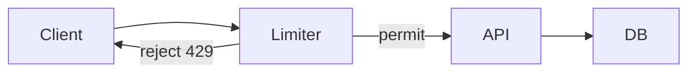
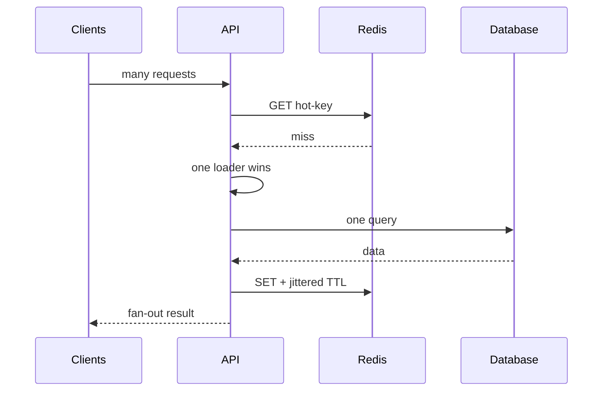
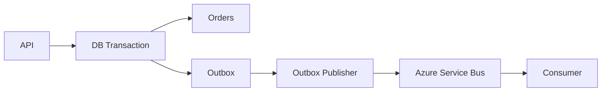

# Daily Knowledge Sharing — 2026-10-02

## Today’s Topics

1. `ValueTask` trong .NET: tối ưu allocation nhưng không phải `Task` “nhanh hơn”
2. ASP.NET Core Rate Limiting: bảo vệ capacity bằng queue, partition và backpressure
3. EF Core compiled queries: giảm query-compilation overhead đúng chỗ
4. SQL keyset pagination: ổn định latency khi dataset lớn
5. Redis cache stampede: single-flight, TTL jitter và stale-while-revalidate
6. Outbox Pattern: nối database transaction với Azure Service Bus mà không cần distributed transaction
7. Kubernetes readiness/liveness probes: health signal sai có thể tự gây outage
8. Vue/TypeScript async state: ngăn stale response ghi đè UI mới hơn
9. Optimizely CMS cache invalidation: cân bằng editorial freshness và delivery performance
10. Git bisect: biến deployment regression thành bài toán tìm kiếm có bằng chứng

---

# 1. `ValueTask` trong .NET: tối ưu allocation nhưng không phải `Task` “nhanh hơn”

## 1. What is it?

`ValueTask<T>` là awaitable value type có thể biểu diễn kết quả đã có sẵn hoặc một asynchronous operation. Mental model quan trọng: nó là công cụ giảm allocation trong hot path có tỷ lệ synchronous completion cao, không phải bản thay thế mặc định cho `Task<T>`.

## 2. Why does it exist?

Một method trả `Task<T>` thường cần một object đại diện operation. Trong API cực nóng như parser, pool hoặc cache nội bộ, hàng triệu lần gọi mà phần lớn đã có kết quả có thể tạo allocation đáng kể. `ValueTask<T>` cho phép mang kết quả trực tiếp trong struct. Đổi lại API phức tạp hơn và caller phải tuân thủ contract chặt hơn.

## 3. How does it work?

Một `ValueTask<T>` có thể chứa trực tiếp `T`, wrap một `Task<T>`, hoặc dựa trên `IValueTaskSource<T>`. Khi synchronous completion xảy ra, runtime có thể tránh tạo `Task<T>`. Nhưng struct lớn hơn một reference và việc copy/await sai có thể làm mất lợi ích hoặc vi phạm contract của source tái sử dụng.

## 4. Practical implementation

```csharp
public sealed class ProductCache
{
    private readonly Dictionary<int, Product> _cache = new();

    public ValueTask<Product?> FindAsync(int id, CancellationToken ct)
    {
        if (_cache.TryGetValue(id, out var product))
            return ValueTask.FromResult<Product?>(product);

        return new ValueTask<Product?>(LoadAsync(id, ct));
    }

    private Task<Product?> LoadAsync(int id, CancellationToken ct)
        => QueryDatabaseAsync(id, ct);
}
```

Chỉ cân nhắc thiết kế này sau profiling. Với application service thông thường, `Task<T>` thường rõ ràng hơn.

## 5. Real production scenario

Một in-memory metadata resolver được gọi hàng trăm nghìn lần/phút, 99% hit cache. Profiling cho thấy `Task` allocation nằm đáng kể trong allocation profile. Đây là trường hợp `ValueTask` có thể hợp lý. Một API gọi SQL ở hầu hết request thì không có đặc tính đó.

## 6. Failure scenario & troubleshooting

**Symptom** → allocation không giảm hoặc xuất hiện lỗi khi await nhiều lần.  
**Evidence** → profiler cho thấy phần lớn operation vẫn asynchronous; caller convert/consume `ValueTask` không đúng.  
**Hypothesis** → optimization không phù hợp workload hoặc `IValueTaskSource` bị consume nhiều lần.  
**Diagnosis** → đo synchronous-completion ratio và allocation trước/sau.  
**Fix** → quay lại `Task` nếu lợi ích không đáng kể; chỉ consume `ValueTask` một lần trừ khi API contract cho phép.  
**Verification** → benchmark và production allocation rate/GC pause cải thiện mà correctness không đổi.

## 7. Common mistakes

Dùng `ValueTask` ở mọi async method; await cùng instance nhiều lần; gọi `.Result`; dùng nó để “tăng tốc I/O”; tối ưu trước khi profiler chứng minh allocation là bottleneck.

## 8. Alternatives

`Task<T>` đơn giản, composable và là lựa chọn mặc định. Cached `Task`, synchronous API, batching hoặc giảm số call đôi khi giải quyết vấn đề lớn hơn.

## 9. Trade-offs

### Advantages

Có thể giảm allocation và GC pressure trong hot path có synchronous completion cao.

### Costs / Risks

API khó dùng hơn, struct copy cost, composition khó hơn và dễ tạo correctness bug. Optimization vi mô có thể che mất bottleneck thật.

## 10. Junior → Middle → Senior → Technical Lead

### Junior

Hiểu `Task` và `ValueTask` đều mô tả completion, nhưng không interchangeable về contract.

### Middle

Biết implement và consume đúng, truyền `CancellationToken`, không sync-over-async.

### Senior

Đo allocation, synchronous-completion ratio và GC trước khi chọn `ValueTask`.

### Technical Lead / Architect

Quyết định liệu complexity của public API có đáng với lợi ích runtime; ưu tiên API dễ dùng nếu hot-path evidence chưa đủ mạnh.

## 11. Key takeaway

- `Task<T>` vẫn là default.
- `ValueTask<T>` là allocation optimization có điều kiện.
- Benchmark và production profiling phải dẫn dắt quyết định.

---

# 2. ASP.NET Core Rate Limiting: bảo vệ capacity bằng queue, partition và backpressure

## 1. What is it?

Rate limiting giới hạn lượng request được phép đi vào một resource trong một khoảng thời gian hoặc theo concurrency. Nó không chỉ là security control; nó là capacity-control mechanism giúp hệ thống từ chối có chủ đích trước khi database, downstream API hoặc ThreadPool sụp đổ.

## 2. Why does it exist?

Nếu mọi request đều được nhận rồi mới thất bại sâu trong dependency chain, overload lan truyền: latency tăng, timeout giữ connection lâu hơn, retry sinh thêm traffic và hệ thống rơi vào positive feedback loop. Rate limiter tạo backpressure gần ingress.

## 3. How does it work?

ASP.NET Core có các limiter như fixed window, sliding window, token bucket và concurrency limiter. Partitioning cho phép quota theo API key, tenant hoặc user thay vì một global bucket.



Queue của limiter không phải capacity vô hạn; queue quá lớn chỉ biến rejection thành latency.

## 4. Practical implementation

```csharp
builder.Services.AddRateLimiter(options =>
{
    options.RejectionStatusCode = StatusCodes.Status429TooManyRequests;

    options.AddPolicy("tenant-api", httpContext =>
        RateLimitPartition.GetTokenBucketLimiter(
            partitionKey: httpContext.User.FindFirst("tenant_id")?.Value ?? "anonymous",
            factory: _ => new TokenBucketRateLimiterOptions
            {
                TokenLimit = 100,
                TokensPerPeriod = 50,
                ReplenishmentPeriod = TimeSpan.FromSeconds(1),
                QueueLimit = 20,
                AutoReplenishment = true
            }));
});

app.UseRateLimiter();
app.MapGet("/api/orders", GetOrders).RequireRateLimiting("tenant-api");
```

## 5. Real production scenario

Một SaaS API có tenant chạy batch import tạo burst 5,000 requests, làm SQL pool cạn và ảnh hưởng tenant khác. Partition theo tenant kết hợp quota và bounded queue giúp noisy neighbor không chiếm toàn bộ capacity.

## 6. Failure scenario & troubleshooting

**Symptom** → p99 tăng mạnh dù CPU chưa đầy, 429 gần như không có.  
**Evidence** → limiter queue dài; SQL pool wait tăng.  
**Hypothesis** → queue đang hấp thụ overload thay vì reject.  
**Diagnosis** → correlate limiter metrics, request duration và dependency latency.  
**Fix** → giảm queue, đặt quota theo measured capacity, trả `Retry-After` khi phù hợp.  
**Verification** → dưới load test, accepted traffic giữ SLO và overload được phản ánh thành bounded 429.

## 7. Common mistakes

Một global limit cho mọi tenant; tin rằng rate limit thay authorization; queue quá lớn; retry 429 ngay lập tức; đặt con số tùy ý không dựa capacity; chỉ limit tại app trong khi nhiều ingress path tồn tại.

## 8. Alternatives

API gateway/Azure API Management có thể enforce ở edge; reverse proxy có limiter riêng; concurrency limit hữu ích khi cost/request biến động; queue/message broker phù hợp khi work có thể asynchronous.

## 9. Trade-offs

### Advantages

Failure có kiểm soát, isolation tốt hơn, bảo vệ dependency.

### Costs / Risks

Quota sai gây false rejection; distributed/global quota phức tạp; fairness và burst policy cần business semantics.

## 10. Junior → Middle → Senior → Technical Lead

### Junior

Hiểu 429 là intentional overload response, không phải lỗi ngẫu nhiên.

### Middle

Cấu hình limiter, partition và test burst.

### Senior

Liên hệ quota với downstream capacity, retry behavior và SLO.

### Technical Lead / Architect

Chọn enforcement boundary: CDN/gateway/app; định nghĩa fairness giữa tenant và ownership của capacity policy.

## 11. Key takeaway

- Rate limiting là backpressure, không chỉ anti-abuse.
- Queue phải bounded.
- Quota tốt phải dựa trên capacity và tenant semantics.

---

# 3. EF Core compiled queries: giảm query-compilation overhead đúng chỗ

## 1. What is it?

Compiled query cho phép EF Core tái sử dụng query delegate đã compile cho một query shape cố định. Nó nhắm vào CPU overhead phía application khi EF xử lý expression tree, không làm SQL query hay database I/O tự nhiên nhanh hơn.

## 2. Why does it exist?

EF Core đã cache query compilation theo query shape. Trong workload rất nóng, lookup và processing còn lại vẫn có chi phí. Compiled query đưa một phần công việc ra khỏi request path. Nhưng nếu bottleneck là scan hàng triệu rows, compiled query gần như không cứu được gì.

## 3. How does it work?

`EF.CompileAsyncQuery` nhận expression cố định và tạo delegate tái sử dụng. Parameters được truyền riêng nên SQL vẫn parameterized. Database vẫn parse/optimize/execute theo cơ chế của nó; execution plan và index vẫn quyết định phần lớn latency nếu I/O chiếm ưu thế.

## 4. Practical implementation

```csharp
private static readonly Func<AppDbContext, int, IAsyncEnumerable<ProductDto>>
    ProductsByCategory = EF.CompileAsyncQuery(
        (AppDbContext db, int categoryId) =>
            db.Products
              .AsNoTracking()
              .Where(p => p.CategoryId == categoryId && p.IsActive)
              .OrderBy(p => p.Id)
              .Select(p => new ProductDto(p.Id, p.Name)));

public IAsyncEnumerable<ProductDto> GetProducts(int categoryId)
    => ProductsByCategory(_db, categoryId);
```

## 5. Real production scenario

Product lookup endpoint chạy vài nghìn lần/giây; SQL query đã có covering index và thường hoàn thành dưới 2 ms. CPU profiling cho thấy EF query pipeline đáng kể. Compiled query có thể giảm application CPU. Nếu SQL mất 300 ms, phải điều tra plan/I/O trước.

## 6. Failure scenario & troubleshooting

**Symptom** → deploy compiled query nhưng p95 gần như không đổi.  
**Evidence** → trace cho thấy 95% thời gian ở SQL dependency.  
**Hypothesis** → tối ưu sai layer.  
**Diagnosis** → phân tách app CPU, EF overhead, network và DB duration.  
**Fix** → xử lý access pattern/index/query plan trước.  
**Verification** → đo lại từng segment, không chỉ total request.

## 7. Common mistakes

Compile mọi query; nghĩ compiled query cache result data; nhúng dynamic shape khó kiểm soát; bỏ qua `AsNoTracking`/projection; không benchmark.

## 8. Alternatives

Query cache mặc định của EF Core thường đủ. Dapper/raw SQL hữu ích khi cần control chặt; stored procedure có use case riêng; tối ưu schema/index thường có leverage lớn hơn.

## 9. Trade-offs

### Advantages

Giảm CPU overhead cho stable hot queries.

### Costs / Risks

Thêm static delegates và maintenance complexity; lợi ích nhỏ với I/O-bound queries; dynamic queries khó áp dụng.

## 10. Junior → Middle → Senior → Technical Lead

### Junior

Phân biệt query compilation với database execution.

### Middle

Biết projection, tracking và parameterization trước khi nghĩ compiled query.

### Senior

Profile để chứng minh EF CPU overhead là bottleneck.

### Technical Lead / Architect

Giữ optimization localized; không biến data layer thành tập compiled delegate khó thay đổi chỉ vì microbenchmark.

## 11. Key takeaway

- Compiled query tối ưu EF-side CPU, không tối ưu SQL plan.
- Tối ưu nơi thời gian thực sự bị tiêu tốn.
- Stable hot path mới là ứng viên tốt.

---

# 4. SQL keyset pagination: ổn định latency khi dataset lớn

## 1. What is it?

Keyset pagination lấy trang tiếp theo dựa trên giá trị sort key cuối cùng đã thấy thay vì `OFFSET N`. Mental model: “đi tiếp từ bookmark” thay vì “đếm và bỏ qua N rows”.

## 2. Why does it exist?

`OFFSET 500000 FETCH NEXT 50` vẫn buộc database tìm/sort/skip lượng lớn rows. Trang càng sâu, work càng tăng. Đồng thời insert/delete giữa hai request có thể gây duplicate hoặc missing rows.

## 3. How does it work?

Với order ổn định `CreatedAt DESC, Id DESC`, cursor chứa cặp `CreatedAt, Id`. Query kế tiếp tìm rows nhỏ hơn tuple đó. Composite index cùng thứ tự giúp seek thay vì deep skip.

## 4. Practical implementation

```sql
CREATE INDEX IX_Orders_CreatedAt_Id
ON Orders (CreatedAt DESC, Id DESC)
INCLUDE (CustomerId, Total, Status);

SELECT TOP (50) Id, CustomerId, Total, Status, CreatedAt
FROM Orders
WHERE CreatedAt < @LastCreatedAt
   OR (CreatedAt = @LastCreatedAt AND Id < @LastId)
ORDER BY CreatedAt DESC, Id DESC;
```

Cursor public nên opaque và được validate, không tin raw values từ client nếu chúng ảnh hưởng authorization/filter semantics.

## 5. Real production scenario

Admin order history có 30 triệu rows. Page 1 nhanh nhưng page 8,000 mất vài giây với OFFSET. Keyset pagination giữ query gần với index seek và latency ít phụ thuộc page depth.

## 6. Failure scenario & troubleshooting

**Symptom** → duplicate item giữa pages.  
**Evidence** → order chỉ theo `CreatedAt`, nhiều rows cùng timestamp.  
**Hypothesis** → sort key không unique/stable.  
**Diagnosis** → inspect order và cursor.  
**Fix** → thêm deterministic tie-breaker như `Id`; align composite index.  
**Verification** → concurrent insert test không tạo duplicate/missing theo semantics đã định.

## 7. Common mistakes

Sort bằng cột không deterministic; index không khớp order; cursor không encode filter context; vẫn cho “jump to page 9000” nhưng kỳ vọng keyset; expose cursor có thể bị sửa mà không validation.

## 8. Alternatives

OFFSET phù hợp dataset nhỏ và UI cần page number tùy ý. Snapshot/materialized result phù hợp export. Search engine có cursor/search-after cho search workload.

## 9. Trade-offs

### Advantages

Deep-page latency ổn định hơn, ít row skipping, tốt cho infinite scroll/feed.

### Costs / Risks

Khó jump page tùy ý; cursor phức tạp; ordering/filter changes cần version cursor.

## 10. Junior → Middle → Senior → Technical Lead

### Junior

Hiểu pagination không chỉ là `Skip/Take`.

### Middle

Implement deterministic order và composite cursor.

### Senior

Đọc execution plan, logical reads và concurrency behavior.

### Technical Lead / Architect

Chọn pagination contract theo UX, data size và consistency expectation; không áp keyset nếu business thực sự cần random page navigation.

## 11. Key takeaway

- Deep OFFSET có cost tăng theo vị trí.
- Keyset cần stable unique ordering.
- Index phải phục vụ access pattern thực tế.

---

# 5. Redis cache stampede: single-flight, TTL jitter và stale-while-revalidate

## 1. What is it?

Cache stampede xảy ra khi nhiều request cùng miss/expire một hot key và đồng thời đổ xuống origin. Cache vốn để bảo vệ database lại biến một expiration event thành traffic spike.

## 2. Why does it exist?

TTL đồng bộ tạo thời điểm mà hàng nghìn caller cùng thấy “không có dữ liệu”. Cache-aside ngây thơ không có coordination nên tất cả đều recompute/query database.

## 3. How does it work?

Các lớp phòng vệ gồm TTL jitter để expiration không đồng loạt, single-flight để một process chỉ có một loader/key, distributed coordination nếu thực sự cần, và stale-while-revalidate khi business chấp nhận dữ liệu hơi cũ.



## 4. Practical implementation

```csharp
private readonly ConcurrentDictionary<string, Lazy<Task<Product>>> _inflight = new();

public async Task<Product> GetAsync(string key, CancellationToken ct)
{
    var cached = await _cache.GetStringAsync(key, ct);
    if (cached is not null)
        return JsonSerializer.Deserialize<Product>(cached)!;

    var lazy = _inflight.GetOrAdd(key,
        _ => new Lazy<Task<Product>>(() => LoadAndCacheAsync(key, ct)));

    try { return await lazy.Value; }
    finally { _inflight.TryRemove(key, out _); }
}
```

Đây chỉ single-flight trong một instance; multi-instance cần đánh giá thêm. Không mặc định dùng distributed lock.

## 5. Real production scenario

Homepage có “top products” cache 5 phút. 20 App Service instances cùng expire key lúc 10:00:00 và mỗi instance nhận hàng trăm requests. TTL jitter + stale fallback giảm synchronized spike đáng kể.

## 6. Failure scenario & troubleshooting

**Symptom** → SQL CPU spike chính xác mỗi 5 phút.  
**Evidence** → Redis miss tăng cùng thời điểm, cùng key.  
**Hypothesis** → synchronized expiration.  
**Diagnosis** → group cache metrics theo key và correlate DB query count.  
**Fix** → jitter TTL, single-flight, cân nhắc refresh trước expiry.  
**Verification** → miss/reload phân tán, origin QPS không spike.

## 7. Common mistakes

Dùng một TTL giống nhau cho toàn bộ hot keys; distributed lock không timeout; cache failure làm request fail dù DB còn khỏe; cache null không có chiến lược; key không version theo schema.

## 8. Alternatives

`IMemoryCache` cho per-instance data; CDN cho HTTP content; materialized view cho expensive aggregation; đôi khi bỏ cache và tối ưu DB là đơn giản hơn.

## 9. Trade-offs

### Advantages

Giảm origin load và tail latency trong hot-read workload.

### Costs / Risks

Freshness, invalidation, coordination và Redis trở thành dependency vận hành. Stale fallback cần business acceptance.

## 10. Junior → Middle → Senior → Technical Lead

### Junior

Hiểu cache miss không phải luôn “query DB rồi set”.

### Middle

Implement TTL, serialization và fallback.

### Senior

Nhận diện stampede/hot key và thiết kế bounded coordination.

### Technical Lead / Architect

Quyết định cache có đáng tồn tại, freshness budget là bao nhiêu và Redis outage có được phép kéo API xuống hay không.

## 11. Key takeaway

- Expiration là một production event cần thiết kế.
- TTL jitter + single-flight thường hữu ích hơn lock phức tạp.
- Cache phải giảm failure propagation, không tạo thêm một single point of failure.

---

# 6. Outbox Pattern: nối database transaction với Azure Service Bus mà không cần distributed transaction

## 1. What is it?

Outbox Pattern ghi business state và message-to-publish vào cùng local database transaction. Một publisher riêng đọc outbox rồi gửi message đến broker. Mục tiêu là loại bỏ “DB commit thành công nhưng publish thất bại” khỏi request transaction boundary.

## 2. Why does it exist?

Một request kiểu “Save order → Send Service Bus message” chạm hai resource managers. Nếu DB commit xong rồi network tới broker lỗi, order tồn tại nhưng event mất. Nếu publish trước rồi DB rollback, consumer thấy event cho state không tồn tại.

## 3. How does it work?



Publisher có thể crash sau khi broker nhận message nhưng trước khi đánh dấu outbox đã gửi. Vì vậy delivery thực tế vẫn có duplicate; consumer cần idempotency/Inbox strategy.

## 4. Practical implementation

```csharp
await using var tx = await db.Database.BeginTransactionAsync(ct);

db.Orders.Add(order);
db.OutboxMessages.Add(new OutboxMessage
{
    Id = Guid.NewGuid(),
    Type = "OrderCreated",
    Payload = JsonSerializer.Serialize(new { order.Id }),
    OccurredUtc = DateTimeOffset.UtcNow
});

await db.SaveChangesAsync(ct);
await tx.CommitAsync(ct);
```

Publisher background đọc batch chưa gửi, publish với stable message ID, sau đó đánh dấu processed. Cần retry/backoff và quan sát outbox age.

## 5. Real production scenario

Checkout API tạo order rồi gửi `OrderCreated` để inventory và notification xử lý. Service Bus outage 15 phút không được phép làm mất event. Outbox giữ intent trong SQL; publisher catch up sau khi broker phục hồi.

## 6. Failure scenario & troubleshooting

**Symptom** → queue không có message mới nhưng order vẫn tạo bình thường.  
**Evidence** → outbox row backlog tăng, oldest age tăng.  
**Hypothesis** → publisher/broker failure.  
**Diagnosis** → kiểm tra publisher health, Service Bus dependency telemetry và dead-letter/error logs.  
**Fix** → restore publisher/connectivity, retry có backoff; không xóa outbox chưa xác nhận.  
**Verification** → backlog drain, consumer dedupe đúng, business state converges.

## 7. Common mistakes

Nghĩ Outbox cho exactly-once; xóa row ngay khi bắt đầu publish; không index trạng thái pending; publisher chạy concurrent không claim row đúng; payload chứa schema không version; consumer không idempotent.

## 8. Alternatives

Distributed transaction chỉ phù hợp trong phạm vi hỗ trợ rất cụ thể và tăng coupling. Direct publish đơn giản hơn nếu event loss chấp nhận được. CDC có thể publish thay đổi nhưng semantics khác domain event.

## 9. Trade-offs

### Advantages

Atomic intent với business state, chịu broker outage tốt, giảm dual-write inconsistency.

### Costs / Risks

Eventual consistency, outbox storage/cleanup, publisher operations, duplicate delivery và schema evolution.

## 10. Junior → Middle → Senior → Technical Lead

### Junior

Hiểu hai external writes không tự động atomic.

### Middle

Implement transaction, publisher và retry.

### Senior

Thiết kế idempotency, ordering, cleanup, monitoring và recovery.

### Technical Lead / Architect

Xác định đúng transaction boundary và nơi eventual consistency được business chấp nhận; không thêm messaging/outbox nếu một monolithic transaction đã đủ.

## 11. Key takeaway

- Outbox giải quyết dual-write bằng local atomicity + eventual publish.
- Duplicate vẫn có thể xảy ra.
- Monitor outbox age/backlog như production signal.

---

# 7. Kubernetes readiness/liveness probes: health signal sai có thể tự gây outage

## 1. What is it?

Readiness trả lời “Pod có nên nhận traffic không?”, liveness trả lời “process có cần restart không?”. Hai câu hỏi khác nhau. Startup probe có thể bảo vệ ứng dụng khởi động chậm khỏi liveness check quá sớm.

## 2. Why does it exist?

Một process có thể còn sống nhưng chưa sẵn sàng phục vụ: warm-up, dependency initialization hoặc degraded state. Ngược lại, restart chỉ nên dùng khi process không thể tự phục hồi. Trộn hai semantics có thể tạo restart storm.

## 3. How does it work?

Kubelet chạy probe định kỳ. Readiness fail làm Pod bị loại khỏi Service endpoints. Liveness fail đủ threshold khiến container restart. Nếu liveness phụ thuộc SQL/Redis, một outage bên ngoài có thể khiến mọi Pod restart đồng thời dù process hoàn toàn khỏe.

## 4. Practical implementation

```yaml
readinessProbe:
  httpGet:
    path: /health/ready
    port: 8080
  periodSeconds: 5
  failureThreshold: 3

livenessProbe:
  httpGet:
    path: /health/live
    port: 8080
  periodSeconds: 10
  failureThreshold: 3

startupProbe:
  httpGet:
    path: /health/live
    port: 8080
  periodSeconds: 5
  failureThreshold: 30
```

`/health/live` thường nên kiểm tra process-level health tối thiểu; readiness có thể phản ánh khả năng phục vụ nhưng phải cân nhắc dependency semantics.

## 5. Real production scenario

Redis outage làm health endpoint fail. Nếu endpoint đó dùng cho liveness, Kubernetes restart toàn bộ Pods liên tục, xóa warm caches và làm recovery tệ hơn. Nếu Redis chỉ là optional cache, app có thể vẫn ready với DB fallback.

## 6. Failure scenario & troubleshooting

**Symptom** → `CrashLoopBackOff` trong lúc dependency outage.  
**Evidence** → `kubectl describe pod` cho thấy liveness probe failed trước restart.  
**Hypothesis** → liveness check gắn sai external dependency.  
**Diagnosis** → inspect probe endpoint và restart count.  
**Fix** → tách live/ready; điều chỉnh threshold/startup probe; xác định dependency nào thực sự quyết định readiness.  
**Verification** → dependency fault injection không gây restart storm ngoài ý muốn.

## 7. Common mistakes

Dùng cùng endpoint cho mọi probe; liveness gọi database; timeout quá thấp; readiness luôn trả 200; probe quá nặng; không tính startup time sau deployment.

## 8. Alternatives

App Service health checks có semantics khác nhưng cùng nguyên tắc. VM/IIS cần process/load-balancer health strategy riêng. Không có probe là lựa chọn kém trong orchestrated environment.

## 9. Trade-offs

### Advantages

Traffic routing và self-healing tốt hơn.

### Costs / Risks

Health signal sai có thể loại toàn bộ capacity hoặc gây restart loop. Probe cũng tạo traffic và dependency load.

## 10. Junior → Middle → Senior → Technical Lead

### Junior

Phân biệt “alive” và “ready”.

### Middle

Cấu hình endpoint/probe và đọc Pod events.

### Senior

Thiết kế dependency-aware health semantics, threshold và graceful degradation.

### Technical Lead / Architect

Định nghĩa service health contract: dependency nào critical, dependency nào degraded được, và orchestrator được phép thực hiện hành động gì.

## 11. Key takeaway

- Readiness điều khiển traffic; liveness điều khiển restart.
- External dependency không nên tự động trở thành liveness condition.
- Health check là control signal, không chỉ monitoring endpoint.

---

# 8. Vue/TypeScript async state: ngăn stale response ghi đè UI mới hơn

## 1. What is it?

Async race phía frontend xảy ra khi nhiều request được phát theo thứ tự A rồi B nhưng response về B rồi A; nếu code chỉ assign state, dữ liệu cũ A có thể ghi đè dữ liệu mới B.

## 2. Why does it exist?

Network completion order không đảm bảo request order. Search-as-you-type, route changes và filter nhanh đều tạo overlapping requests. Backend đúng hoàn toàn nhưng UI vẫn sai vì client không định nghĩa “response nào còn relevant”.

## 3. How does it work?

Mỗi intent mới nên cancel request cũ khi có thể hoặc dùng generation/request ID để chỉ latest request được commit vào state. Cancellation tiết kiệm work; generation guard bảo vệ correctness ngay cả khi cancellation đến quá muộn.

## 4. Practical implementation

```ts
import { ref } from "vue";

const products = ref<Product[]>([]);
let generation = 0;
let controller: AbortController | undefined;

async function search(term: string) {
  const current = ++generation;

  controller?.abort();
  controller = new AbortController();

  try {
    const response = await fetch(
      `/api/products?q=${encodeURIComponent(term)}`,
      { signal: controller.signal }
    );

    if (!response.ok) throw new Error(`HTTP ${response.status}`);
    const data: Product[] = await response.json();

    if (current === generation) products.value = data;
  } catch (e) {
    if ((e as DOMException).name !== "AbortError") throw e;
  }
}
```

## 5. Real production scenario

User gõ “car”, rồi nhanh chóng đổi thành “camera”. Request “camera” hit cache và về trước; request “car” chậm hơn vì search backend. Không guard, UI cuối cùng hiển thị “car” dù textbox là “camera”.

## 6. Failure scenario & troubleshooting

**Symptom** → UI thỉnh thoảng hiển thị kết quả không khớp filter.  
**Evidence** → DevTools Network cho thấy response completion đảo thứ tự.  
**Hypothesis** → stale response commit.  
**Diagnosis** → log request generation/filter snapshot.  
**Fix** → AbortController + latest-intent guard.  
**Verification** → throttle network và thay filter liên tục; state cuối luôn khớp latest intent.

## 7. Common mistakes

Tin Promise chạy tuần tự; chỉ debounce nhưng không xử lý in-flight request; coi abort là error cần toast; backend nhận cancellation nhưng server code bỏ qua `CancellationToken`; shared store không scope state theo route/query.

## 8. Alternatives

RxJS `switchMap` thể hiện latest-only semantics; TanStack Query/Vue Query quản lý request/cache lifecycle; server-side rendering có flow khác; debounce chỉ giảm request count chứ không tự giải quyết race.

## 9. Trade-offs

### Advantages

UI correctness, ít wasted work, behavior rõ ràng dưới network variability.

### Costs / Risks

Thêm lifecycle state; cancellation không đảm bảo server dừng ngay; shared cache cần semantics phức tạp hơn.

## 10. Junior → Middle → Senior → Technical Lead

### Junior

Hiểu request order khác response order.

### Middle

Dùng cancellation, loading/error state đúng.

### Senior

Thiết kế state ownership và stale-data semantics; nối client cancellation tới backend.

### Technical Lead / Architect

Chọn data-fetching abstraction phù hợp thay vì mỗi component tự phát minh concurrency model; thống nhất UX cho stale/loading/retry.

## 11. Key takeaway

- Async UI phải định nghĩa response nào còn hợp lệ.
- Debounce không thay thế cancellation/correctness guard.
- Network race cần được test chủ động bằng throttling.

---

# 9. Optimizely CMS cache invalidation: cân bằng editorial freshness và delivery performance

## 1. What is it?

CMS caching giữ content đã resolve/render gần application hoặc edge để giảm repeated content loading. Vấn đề khó không phải “cache thế nào” mà là invalidation: khi editor publish, bản nào phải hết hạn và ở layer nào.

## 2. Why does it exist?

Marketing site có thể đọc cùng page/block hàng nghìn lần nhưng content chỉ thay đổi vài lần/ngày. Không cache gây load không cần thiết; cache quá mạnh khiến editor publish nhưng người dùng vẫn thấy content cũ.

## 3. How does it work?

Một request có thể đi qua Browser → CDN/Akamai → reverse proxy → Optimizely application → CMS/object cache. Mỗi layer có TTL và invalidation semantics riêng. Publish event ở origin không tự động purge browser/CDN cache trừ khi có integration hoặc cache policy phù hợp.

## 4. Practical implementation

Ở application layer, cache key nên gắn với content identity/version/language thay vì một string chung:

```csharp
public async Task<PageViewModel> GetPageAsync(
    ContentReference contentLink,
    string language,
    CancellationToken ct)
{
    var key = $"page:{contentLink.ID}:{language}";
    return await _cache.GetOrCreateAsync(
        key,
        entry => LoadPageAsync(contentLink, language, entry, ct));
}
```

Trong implementation thực tế, invalidation nên bám vào CMS change notification/dependency mechanism thay vì chỉ đặt TTL dài. HTTP response cần `Cache-Control` phù hợp với public/private content.

## 5. Real production scenario

Editor sửa campaign banner và publish lúc 09:00. Optimizely origin đã có bản mới nhưng Akamai giữ HTML 30 phút. Backend team kiểm tra trực tiếp origin thấy đúng, business kiểm tra public URL thấy cũ. Đây là multi-layer cache issue, không phải publish failure.

## 6. Failure scenario & troubleshooting

**Symptom** → một số region/user thấy content cũ.  
**Evidence** → origin response mới nhưng CDN `Age` cao/cache hit.  
**Hypothesis** → edge cache chưa invalidate.  
**Diagnosis** → trace từng layer, compare headers/content version.  
**Fix** → purge đúng cache key/path hoặc giảm/thiết kế TTL; xây publish-to-purge workflow nếu freshness requirement cần.  
**Verification** → request từ edge trả content version mới và cache policy mong đợi.

## 7. Common mistakes

Clear toàn bộ cache khi một block đổi; không phân biệt authenticated/personalized content; cache key thiếu language/site; purge wildcard quá rộng; tin rằng CMS cache invalidation tự động xử lý CDN.

## 8. Alternatives

Short TTL đơn giản hơn event-driven purge; stale-while-revalidate phù hợp content chịu stale; headless CMS có thể dùng webhook/CDN invalidation; không cache dynamic personalized response nếu correctness quan trọng hơn latency.

## 9. Trade-offs

### Advantages

Giảm origin load, latency tốt hơn, scale read traffic hiệu quả.

### Costs / Risks

Stale content, purge complexity, cache-key explosion, operational dependency vào CDN và khó debug nhiều layer.

## 10. Junior → Middle → Senior → Technical Lead

### Junior

Hiểu có nhiều cache layer độc lập.

### Middle

Đọc cache headers, thiết kế key/TTL và reproduce stale content.

### Senior

Map publish event tới invalidation flow, phân biệt origin/app/edge/browser.

### Technical Lead / Architect

Định nghĩa freshness SLA theo content type; chọn TTL/purge architecture dựa business impact thay vì “cache mọi thứ”.

## 11. Key takeaway

- CMS freshness là end-to-end property qua nhiều cache layer.
- Publish thành công không đồng nghĩa edge đã mới.
- Invalidation granularity phải cân bằng correctness, cost và complexity.

---

# 10. Git bisect: biến deployment regression thành bài toán tìm kiếm có bằng chứng

## 1. What is it?

`git bisect` dùng binary search trên commit history để tìm commit đầu tiên làm behavior chuyển từ good sang bad. Đây là debugging technique dựa trên reproducible test, không phải chỉ là Git command.

## 2. Why does it exist?

Nếu regression xuất hiện trong 500 commits, kiểm tra tuần tự tốn thời gian. Khi có thể phân loại một commit là good/bad bằng test đáng tin cậy, binary search chỉ cần khoảng `log2(N)` bước.

## 3. How does it work?

Đánh dấu current bad commit và một known-good commit. Git checkout commit ở giữa. Sau mỗi lần classify good/bad, search space giảm một nửa. Với automated test, `git bisect run` có thể thực hiện toàn bộ vòng lặp.

## 4. Practical implementation

```bash
git bisect start
git bisect bad HEAD
git bisect good v2.8.0
git bisect run ./scripts/regression-test.sh
git bisect reset
```

Script phải trả exit code `0` cho good, `1-127` (trừ `125`) cho bad; `125` dùng khi commit không test được.

## 5. Real production scenario

Sau release, API serialization thay đổi khiến một legacy client fail. Release chứa 180 commits. Team viết integration test tái hiện contract break rồi bisect để tìm commit thay `System.Text.Json` options. Root cause được tìm nhanh hơn đọc thủ công changelog/PR.

## 6. Failure scenario & troubleshooting

**Symptom** → bisect chỉ ra commit không liên quan hoặc kết quả thay đổi giữa runs.  
**Evidence** → cùng commit lúc pass lúc fail.  
**Hypothesis** → test flaky hoặc phụ thuộc external mutable state.  
**Diagnosis** → chạy test lặp lại trên fixed commit, pin dependencies/test data.  
**Fix** → làm test deterministic; dùng `git bisect skip` cho commit không build được.  
**Verification** → bisect lặp lại cho cùng culprit và revert/fix làm regression test pass.

## 7. Common mistakes

Bisect khi không có known-good point; dùng flaky E2E test; bỏ qua database/schema compatibility của historical commits; kết luận culprit là root cause mà không đọc diff; quên reset.

## 8. Alternatives

`git log`/PR review tốt khi suspect set nhỏ; feature flags giúp isolate runtime behavior; deployment telemetry và change correlation có thể khoanh vùng trước; revert release là mitigation chứ không phải root-cause analysis.

## 9. Trade-offs

### Advantages

Giảm search space mạnh, evidence-driven, rất hiệu quả với deterministic regression.

### Costs / Risks

Historical commits có thể không build/run; environment drift; test setup có thể tốn hơn việc inspect vài commits.

## 10. Junior → Middle → Senior → Technical Lead

### Junior

Biết good/bad commit và binary search mental model.

### Middle

Viết regression test/script có exit code ổn định.

### Senior

Kiểm soát environment, schema, dependency và xác minh causal diff.

### Technical Lead / Architect

Xây release engineering sao cho artifact/commit/test environment traceable; coi reproducibility là năng lực incident response, không chỉ developer convenience.

## 11. Key takeaway

- `git bisect` mạnh khi regression reproducible.
- Test deterministic quan trọng hơn bản thân command.
- Commit được bisect tìm ra là điểm bắt đầu causal analysis, không phải kết luận cuối.

