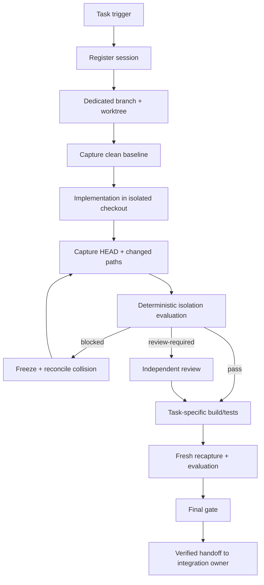

# Agent Worktree Isolation Gate

A reusable, tool-neutral AI engineering kit for preventing concurrent coding agents, automations, or human tasks from contaminating one another through a shared Git checkout, branch, uncommitted state, test evidence, or overlapping file ownership.

## Problem

AI-assisted development increasingly runs multiple tasks in parallel. A common failure mode is not a merge conflict at the end; it is **silent workspace contamination during execution**:

- two agents mutate the same checkout,
- one agent accidentally tests another task's uncommitted change,
- a generated file is attributed to the wrong task,
- two sessions share a branch and move its HEAD independently,
- a verifier accepts build/test evidence produced in a different worktree or revision,
- a cleanup action discards changes whose ownership was never established.

Git branches alone do not isolate uncommitted filesystem state. This kit makes worktree/branch identity, scope ownership, collision evidence, review, and final verification explicit and machine-checkable.

## Purpose

Use one dedicated Git worktree and branch per mutating agent session, bind the session to an immutable base revision and path scope, detect concurrent ownership collisions deterministically, and reject stale or cross-worktree verification evidence before completion.

## When to use

Use for:

- multiple coding agents operating on one repository,
- parallel bug fixes/features/refactors,
- concurrent test-generation or QA tasks,
- long-running agents that may overlap with new work,
- CI/local automation sharing a repository clone,
- humans and agents working concurrently in local clones,
- high-risk migration, workflow, infrastructure, or release changes where independent isolation evidence matters.

## When not to use

This package is unnecessary for read-only analysis. It also does not replace Git merge/rebase strategy, distributed locking for external systems, or application-level transaction isolation. It protects repository workspace ownership and handoff boundaries.

## Architecture



The core is tool-neutral. Any agent can follow the Markdown procedures. Deterministic Python scripts use only the standard library plus local Git for state capture.

## Package tree

```text
agent-worktree-isolation-gate/
├── README.md
├── config/
│   └── worktree-policy.json
├── schemas/
│   ├── worktree-session.schema.json
│   ├── isolation-report.schema.json
│   └── isolation-review.schema.json
├── scripts/
│   ├── capture-worktree-state.py
│   ├── evaluate-isolation.py
│   └── verify-final-gate.py
├── skills/
│   ├── prepare-isolated-worktree.md
│   └── reconcile-cross-worktree-collision.md
├── rules/
│   └── worktree-isolation-governance.md
├── subagents/
│   ├── worktree-coordinator.md
│   └── isolation-verifier.md
├── workflows/
│   └── worktree-isolation-workflow.md
├── hooks/
│   └── worktree-isolation-hooks.md
├── templates/
│   └── worktree-session.example.json
├── examples/
│   ├── active-sessions.example.json
│   └── isolation-review.example.json
└── tests/
    └── smoke-test.py
```

## Component responsibilities

### `config/worktree-policy.json`
Defines hard isolation rules, allowed evidence directories, high-risk path globs, review independence, and bounded retries.

### Schemas
- `worktree-session.schema.json` defines exact session identity: actor, repository, immutable base revision, branch, worktree path, allowed paths, clean-start state, and risk.
- `isolation-report.schema.json` defines deterministic result status, collisions/blockers/warnings, exact HEAD, and fingerprints binding the report to both current session and policy.
- `isolation-review.schema.json` defines a fingerprint-bound human/independent reviewer decision.

### Scripts
- `capture-worktree-state.py` captures repository root, current worktree path, branch, HEAD, porcelain status, and Git worktree topology.
- `evaluate-isolation.py` checks branch/path alignment, clean-start policy, changed-path scope, high-risk paths, shared branch/worktree ownership, and cross-session path overlap. It emits `pass`, `review-required`, or `blocked`.
- `verify-final-gate.py` fails closed if session or policy changed after evaluation, deterministic blockers exist, required review is missing/stale, or high-risk self-review is forbidden.

### Skills
- `prepare-isolated-worktree.md` provides the reusable pre-edit procedure.
- `reconcile-cross-worktree-collision.md` provides non-destructive collision recovery without resetting or deleting unknown work.

### Subagents
- `worktree-coordinator.md` owns topology/session metadata and collision handling.
- `isolation-verifier.md` independently verifies final isolation evidence; it does not implement the task under review.

### Workflow and hooks
`worktree-isolation-workflow.md` defines the end-to-end bounded process. `worktree-isolation-hooks.md` maps lifecycle points to deterministic commands and blocking behavior.

## Installation

Copy this directory into the target repository or shared agent-engineering toolkit. Python 3 and Git are required. The deterministic scripts use Python standard-library modules only.

Recommended ignored runtime directory:

```gitignore
.agent-evidence/
```

The package does not create or delete worktrees automatically. The host workflow may do so after applying its own permission and approval model.

## Configuration

Edit `config/worktree-policy.json` minimally:

- set high-risk path patterns for your repository,
- adjust allowed transient/untracked evidence directories,
- keep dedicated branch/worktree requirements enabled for concurrent mutation,
- keep independent review enabled for high/critical sessions,
- do not weaken policy inside an active session merely to make a report pass.

Per-task scope belongs in the session record under `allowed_paths`, not in the global policy.

## Permissions

Default permissions should be:

- read repository/worktree metadata,
- read diffs/status/logs,
- write evidence files in an ignored evidence directory,
- optionally create a dedicated branch/worktree when the host explicitly grants that capability.

Do not grant force push, destructive cleanup, production deployment, DB mutation, secret/infrastructure mutation, or worktree deletion merely to operate this gate.

## Usage

### 1. Create a session record

Start from `templates/worktree-session.example.json`. Record exact base revision, dedicated branch/worktree, allowed paths, actor, risk, and `dirty_at_start`.

A typical host setup may use:

```bash
BASE=$(git rev-parse HEAD)
git worktree add -b agent/feature-orders-20260817-01 ../service-wt-feature-orders "$BASE"
```

Only use branch/worktree creation when permitted. Do not reuse an existing dirty checkout to save time.

### 2. Capture current state

Run from the isolated worktree:

```bash
mkdir -p .agent-evidence
python path/to/agent-worktree-isolation-gate/scripts/capture-worktree-state.py \
  --output .agent-evidence/worktree-current.json
```

### 3. Generate changed-path inventory

Bind it to the session base revision. Example for committed changes:

```bash
git diff --name-only <base-revision>...HEAD > .agent-evidence/changed-paths.txt
```

If the session intentionally includes uncommitted changes, include those paths from `git status --porcelain`/`git diff --name-only` before evaluation. Do not silently ignore uncommitted state.

### 4. Evaluate isolation

```bash
python path/to/agent-worktree-isolation-gate/scripts/evaluate-isolation.py \
  --session .agent-evidence/worktree-session.json \
  --state .agent-evidence/worktree-current.json \
  --policy path/to/agent-worktree-isolation-gate/config/worktree-policy.json \
  --changed-paths .agent-evidence/changed-paths.txt \
  --active-sessions .agent-evidence/active-sessions.json \
  --output .agent-evidence/isolation-report.json
```

Exit codes:

- `0`: `pass`
- `3`: `review-required`
- `2`: `blocked`
- `1`: runtime/input/tool error

A blocker cannot be reviewer-overridden. Remediate and create fresh evidence.

### 5. Run task-specific verification

Build/test commands are repository-specific and intentionally remain outside the isolation script. Run them in this exact isolated worktree and preserve the exact HEAD/relevant state used.

Examples:

```bash
dotnet test
npm test
pytest
npx playwright test
```

Green tests from another worktree or revision are not valid final evidence for this session.

### 6. Independent review when required

For warning-bearing or high/critical sessions, create a review conforming to `schemas/isolation-review.schema.json`. Replace the placeholder fingerprint in `examples/isolation-review.example.json` with the exact current report fingerprint.

For high/critical risk, reviewer ID must differ from the implementation actor when self-review is disabled.

### 7. Final gate

Immediately before final completion, recapture state and rerun isolation evaluation. Then:

```bash
python path/to/agent-worktree-isolation-gate/scripts/verify-final-gate.py \
  --report .agent-evidence/isolation-report.json \
  --session .agent-evidence/worktree-session.json \
  --policy path/to/agent-worktree-isolation-gate/config/worktree-policy.json \
  --review .agent-evidence/isolation-review.json
```

Omit `--review` only when report/risk/policy do not require one.

The final gate recomputes session and policy fingerprints. Changing scope, actor/session data, risk, or policy invalidates the old report automatically.

## Active-session registry contract

`examples/active-sessions.example.json` demonstrates the minimal registry shape consumed by `evaluate-isolation.py`:

- `session_id`
- `actor_id`
- `branch`
- `worktree_path`
- `changed_paths`

The host may store more metadata. Do not include secrets. Registry freshness is operationally important: if another active session cannot be enumerated reliably, treat ownership certainty as an evidence gap and escalate rather than assuming isolation.

## Collision semantics

The evaluator blocks on:

- branch mismatch between session and current state,
- worktree path mismatch,
- policy-forbidden dirty start,
- changed path outside session scope,
- another active session sharing the same dedicated branch,
- another active session sharing the same worktree path,
- exact changed-path overlap with another active session.

High-risk paths and high/critical sessions produce `review-required` when no deterministic blocker exists.

## Recovery

### Transient Git/tool read failure
Retry at most once. Preserve the first error. If the second read fails, stop because workspace ownership cannot be proven.

### Dirty start
Do not `git clean`, reset, or stash automatically. Allocate a fresh isolated worktree or escalate ownership.

### Shared branch/worktree
Freeze both mutating workflows. Capture both sides. Reassign one session to a new branch/worktree if this can be done without discarding work.

### Overlapping changed paths
Preserve both diffs and request an explicit ownership/integration decision. Do not auto-merge merely because Git can merge textually.

### Scope drift
Do not silently broaden `allowed_paths`. Either remove only clearly agent-owned unintended changes safely or obtain an explicit scope change, then regenerate evidence.

### Stale evidence
Any relevant branch/worktree/HEAD/scope/policy change requires a fresh capture, evaluation, tests/review as applicable.

## Approval boundaries

The isolation gate does **not** authorize dangerous operations. Explicit human approval is required before:

- production deployment,
- destructive SQL,
- database schema changes,
- data/file deletion,
- force push or Git history rewriting,
- deleting a worktree that contains unintegrated/uncommitted changes,
- infrastructure changes,
- secret changes,
- production configuration changes,
- breaking API contracts,
- weakening security controls,
- irreversible migrations,
- large dependency upgrades.

Agents stop before these actions even when the isolation gate is green.

## Verification model

**Task executed** means implementation/build/tests were attempted in an isolated checkout.

**Task verified successfully** requires all of the following:

1. exact session/branch/worktree identity is established,
2. changed paths remain in scope,
3. no unresolved concurrent ownership collision exists,
4. task-specific build/tests correspond to the exact relevant current state,
5. current isolation report is non-blocked,
6. required review is approved and fingerprint-bound,
7. final gate returns `verified`,
8. approval-required actions, if performed, had separate explicit approval.

The gate deliberately fails closed on stale session/policy binding and never lets a reviewer waive deterministic collision blockers.

## Definition of Done

- Session record is complete and exact.
- Dedicated branch/worktree identity is proven.
- Clean-start requirement is satisfied.
- Changed-path inventory is complete for the session state being handed off.
- No shared branch/worktree/path collision remains.
- No out-of-scope change remains unexplained.
- Task-specific tests/build have fresh evidence from the exact isolated state.
- Required independent review is valid.
- Final gate returns exit code `0` with `status: verified`.
- Remaining risks are documented in the handoff.
- No dangerous action was silently executed.

## Testing this package

Run:

```bash
python tests/smoke-test.py
```

The smoke test uses temporary JSON fixtures and Python stdlib only. It covers:

- clean medium-risk pass and final verification,
- out-of-scope deterministic blocker,
- shared-branch collision,
- high-risk review requirement,
- high-risk self-review rejection,
- independent fingerprint-bound approval,
- invalidation when policy changes after evaluation.

`capture-worktree-state.py` itself requires a real Git worktree and is intentionally not mocked by the smoke test.

## Portability

The procedures can be used with Codex, Claude Code, Cursor, ChatGPT, GitHub Copilot, OpenCode, or another coding agent. Tool-specific adapters are unnecessary unless a host needs to translate session lifecycle events into its own hooks. Keep the core contracts and deterministic evaluation unchanged where possible.

## Customization

Useful repository-specific changes include:

- tighter `allowed_paths` generation from task plans,
- richer active-session registry storage,
- high-risk path patterns for migrations, infrastructure, generated code, or deployment files,
- CI checks that reject PR evidence produced from a mismatched revision,
- an integration-owner step that verifies each isolated session before combining branches.

Do not customize away the central invariant: **one mutating session must have one provable isolated workspace identity, and final evidence must belong to that exact identity.**
